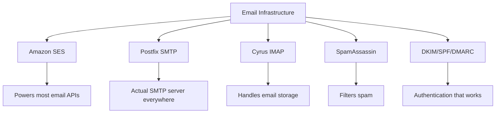
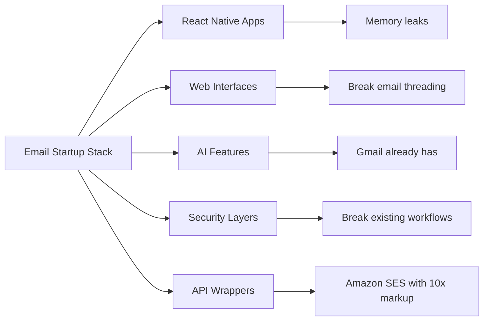
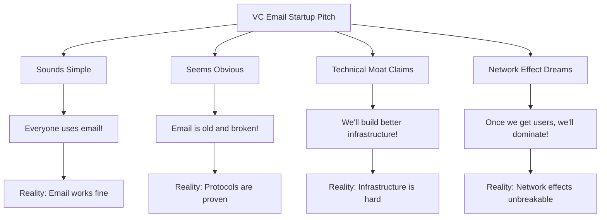
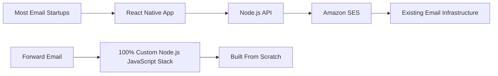
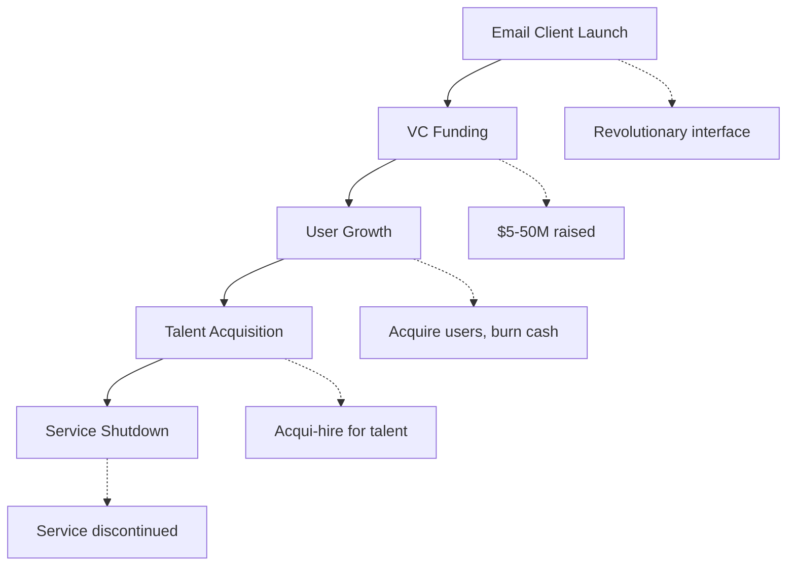
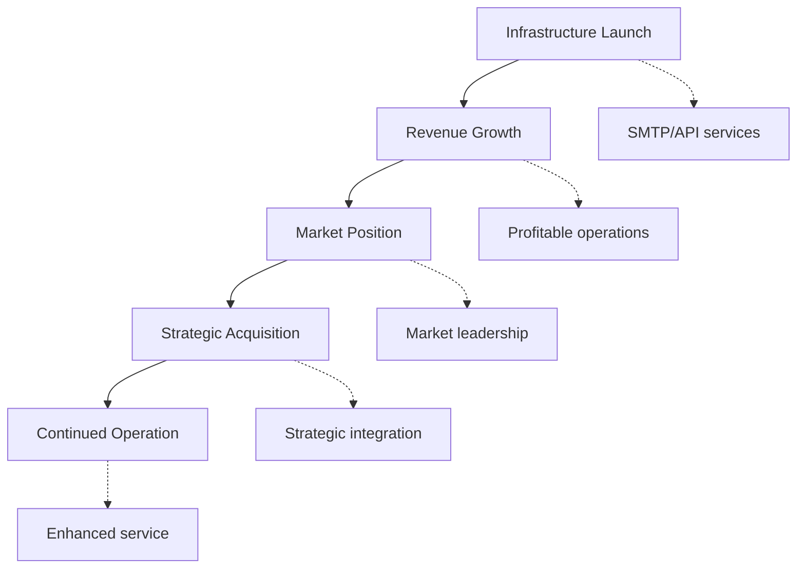
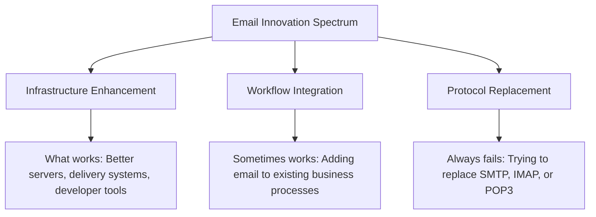
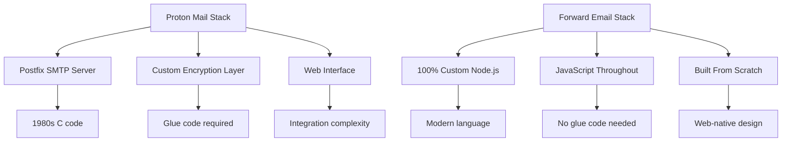
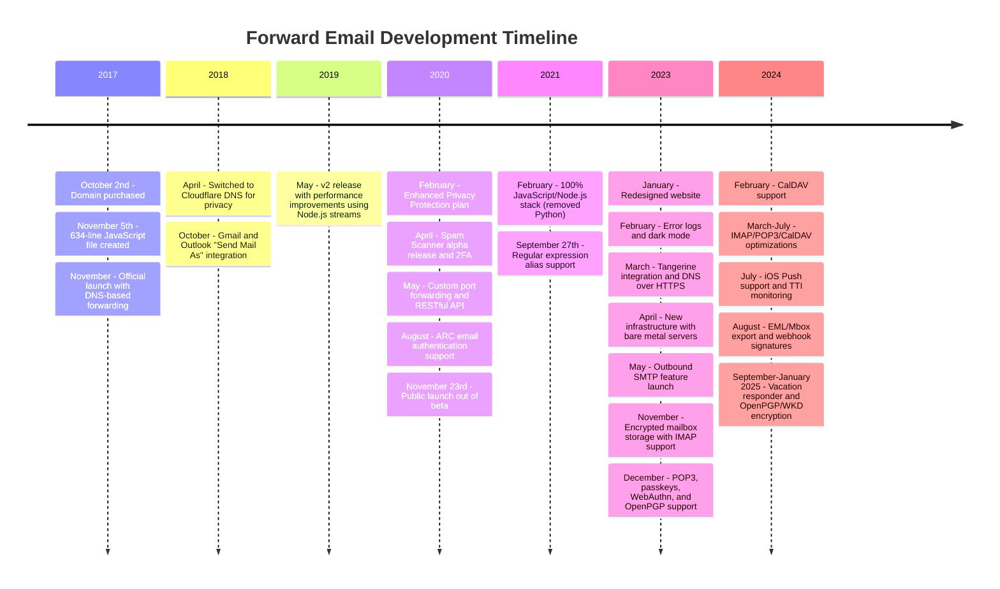
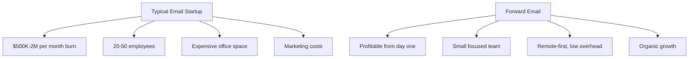

# Het kerkhof van e-mailstartups: waarom de meeste e-mailbedrijven mislukken {#the-email-startup-graveyard-why-most-email-companies-fail}

Hoewel veel e-mailstartups miljoenen hebben geïnvesteerd in het oplossen van vermeende problemen, richten wij ons bij <a href="https://forwardemail.net">Forward Email</a> sinds 2017 op het vanaf nul opbouwen van een betrouwbare e-mailinfrastructuur. Deze analyse onderzoekt de patronen achter de resultaten van e-mailstartups en de fundamentele uitdagingen van e-mailinfrastructuur.

> \[!NOTE]
> **Belangrijk inzicht**: De meeste e-mailstartups bouwen geen daadwerkelijke e-mailinfrastructuur vanaf nul. Veel bouwen voort op bestaande oplossingen zoals Amazon SES of open-sourcesystemen zoals Postfix. De kernprotocollen werken goed - de uitdaging zit in de implementatie.

> \[!TIP]
> **Technische verdieping**: Voor uitgebreide details over onze aanpak, architectuur en beveiligingsimplementatie, zie onze [Technisch whitepaper over het doorsturen van e-mails](https://forwardemail.net/technical-whitepaper.pdf) en [Over pagina](https://forwardemail.net/en/about), waarin onze volledige ontwikkelingstijdlijn sinds 2017 wordt beschreven.

## Inhoudsopgave {#table-of-contents}

* [De matrix voor mislukte e-mailstarts](#the-email-startup-failure-matrix)
* [De infrastructuur-realiteitscheck](#the-infrastructure-reality-check)
  * [Wat houdt e-mail eigenlijk in?](#what-actually-runs-email)
  * [Wat "e-mailstartups" eigenlijk bouwen](#what-email-startups-actually-build)
* [Waarom de meeste e-mailstartups mislukken](#why-most-email-startups-fail)
  * [1. E-mailprotocollen werken, implementatie vaak niet](#1-email-protocols-work-implementation-often-doesnt)
  * [2. Netwerkeffecten zijn onbreekbaar](#2-network-effects-are-unbreakable)
  * [3. Ze richten zich vaak op de verkeerde problemen](#3-they-often-target-the-wrong-problems)
  * [4. Technische schuld is enorm](#4-technical-debt-is-massive)
  * [5. De infrastructuur bestaat al](#5-the-infrastructure-already-exists)
* [Casestudies: Wanneer e-mailstartups falen](#case-studies-when-email-startups-fail)
  * [Casestudy: De Skiff-ramp](#case-study-the-skiff-disaster)
  * [De Accelerator-analyse](#the-accelerator-analysis)
  * [De valkuil van durfkapitaal](#the-venture-capital-trap)
* [De technische realiteit: moderne e-mailstapels](#the-technical-reality-modern-email-stacks)
  * [Wat is de werkelijke kracht achter "e-mailstartups"?](#what-actually-powers-email-startups)
  * [De prestatieproblemen](#the-performance-problems)
* [De overnamepatronen: succes versus sluiting](#the-acquisition-patterns-success-vs-shutdown)
  * [De twee patronen](#the-two-patterns)
  * [Recente voorbeelden](#recent-examples)
* [Evolutie en consolidatie van de industrie](#industry-evolution-and-consolidation)
  * [Natuurlijke industriële progressie](#natural-industry-progression)
  * [Overgangen na overnames](#post-acquisition-transitions)
  * [Overwegingen voor gebruikers tijdens overgangen](#user-considerations-during-transitions)
* [De Hacker News Reality Check](#the-hacker-news-reality-check)
* [De moderne AI-e-mailfraude](#the-modern-ai-email-grift)
  * [De nieuwste golf](#the-latest-wave)
  * [Dezelfde oude problemen](#the-same-old-problems)
* [Wat echt werkt: de echte succesverhalen over e-mail](#what-actually-works-the-real-email-success-stories)
  * [Infrastructuurbedrijven (de winnaars)](#infrastructure-companies-the-winners)
  * [E-mailproviders (de overlevenden)](#email-providers-the-survivors)
  * [De uitzondering: Xobni's succesverhaal](#the-exception-xobnis-success-story)
  * [Het patroon](#the-pattern)
* [Heeft iemand met succes e-mail opnieuw uitgevonden?](#has-anyone-successfully-reinvented-email)
  * [Wat is er eigenlijk blijven hangen?](#what-actually-stuck)
  * [Nieuwe tools vullen e-mail aan (maar vervangen het niet)](#new-tools-complement-email-but-dont-replace-it)
  * [Het HEY-experiment](#the-hey-experiment)
  * [Wat echt werkt](#what-actually-works)
* [Moderne infrastructuur bouwen voor bestaande e-mailprotocollen: onze aanpak](#building-modern-infrastructure-for-existing-email-protocols-our-approach)
  * [Het e-mailinnovatiespectrum](#the-email-innovation-spectrum)
  * [Waarom wij ons richten op infrastructuur](#why-we-focus-on-infrastructure)
  * [Wat werkt echt in e-mail?](#what-actually-works-in-email)
* [Onze aanpak: waarom wij anders zijn](#our-approach-why-were-different)
  * [Wat we doen](#what-we-do)
  * [Wat we niet doen](#what-we-dont-do)
* [Hoe we een e-mailinfrastructuur bouwen die echt werkt](#how-we-build-email-infrastructure-that-actually-works)
  * [Onze anti-startup-aanpak](#our-anti-startup-approach)
  * [Wat ons anders maakt](#what-makes-us-different)
  * [Vergelijking van e-mailproviders: groei door bewezen protocollen](#email-service-provider-comparison-growth-through-proven-protocols)
  * [De technische tijdlijn](#the-technical-timeline)
  * [Waarom wij succesvol zijn waar anderen falen](#why-we-succeed-where-others-fail)
  * [De kostenrealiteitscheck](#the-cost-reality-check)
* [Beveiligingsuitdagingen in e-mailinfrastructuur](#security-challenges-in-email-infrastructure)
  * [Algemene beveiligingsoverwegingen](#common-security-considerations)
  * [De waarde van transparantie](#the-value-of-transparency)
  * [Voortdurende veiligheidsuitdagingen](#ongoing-security-challenges)
* [Conclusie: focus op infrastructuur, niet op apps](#conclusion-focus-on-infrastructure-not-apps)
  * [Het bewijs is duidelijk](#the-evidence-is-clear)
  * [De historische context](#the-historical-context)
  * [De echte les](#the-real-lesson)
* [Het uitgebreide e-mailkerkhof: meer storingen en sluitingen](#the-extended-email-graveyard-more-failures-and-shutdowns)
  * [E-mailexperimenten van Google mislukken](#googles-email-experiments-gone-wrong)
  * [De serie-mislukking: de drie doden van Newton Mail](#the-serial-failure-newton-mails-three-deaths)
  * [De apps die nooit gelanceerd zijn](#the-apps-that-never-launched)
  * [Het patroon van overname tot afsluiting](#the-acquisition-to-shutdown-pattern)
  * [Consolidatie van e-mailinfrastructuur](#email-infrastructure-consolidation)
* [Het open-source e-mailkerkhof: wanneer 'gratis' niet duurzaam is](#the-open-source-email-graveyard-when-free-isnt-sustainable)
  * [Nylas Mail → Mailspring: De vork die het niet kon](#nylas-mail--mailspring-the-fork-that-couldnt)
  * [Eudora: De 18-jarige dodenmars](#eudora-the-18-year-death-march)
  * [FairEmail: gedood door Google Play-politiek](#fairemail-killed-by-google-play-politics)
  * [Het onderhoudsprobleem](#the-maintenance-problem)
* [De opkomst van AI-e-mailstartups: geschiedenis herhaalt zich met 'intelligentie'](#the-ai-email-startup-surge-history-repeating-with-intelligence)
  * [De huidige AI-e-mailgoudkoorts](#the-current-ai-email-gold-rush)
  * [De financieringsgekte](#the-funding-frenzy)
  * [Waarom ze allemaal (opnieuw) zullen falen](#why-theyll-all-fail-again)
  * [De onvermijdelijke uitkomst](#the-inevitable-outcome)
* [De consolidatiecatastrofe: wanneer 'overlevenden' rampen worden](#the-consolidation-catastrophe-when-survivors-become-disasters)
  * [De grote e-mailserviceconsolidatie](#the-great-email-service-consolidation)
  * [Outlook: De "Survivor" die niet kan stoppen met breken](#outlook-the-survivor-that-cant-stop-breaking)
  * [Het poststempelinfrastructuurprobleem](#the-postmark-infrastructure-problem)
  * [Recente slachtoffers van e-mailclients (2024-2025)](#recent-email-client-casualties-2024-2025)
  * [E-mailuitbreiding en service-acquisities](#email-extension-and-service-acquisitions)
  * [De overlevenden: e-mailbedrijven die echt werken](#the-survivors-email-companies-that-actually-work)

## De matrix voor mislukte e-mailstarts {#the-email-startup-failure-matrix}

> \[!CAUTION]
> **Waarschuwing voor faalpercentage**: [Techstars alleen al heeft 28 e-mailgerelateerde bedrijven](https://www.techstars.com/portfolio) met slechts 5 exits - een extreem hoog faalpercentage (soms berekend op 80%+).

Hieronder staan alle grote mislukkingen van e-mailstartups die we konden vinden, gesorteerd op accelerator, financiering en resultaat:

| Bedrijf | Jaar | Gaspedaal | Financiering | Resultaat | Status | Kernpunt |
| ----------------- | ---- | ----------- | ------------------------------------------------------------------------------------------------------------------------------------------------------------------------------------------------------------ | ---------------------------------------------------------------------------------------- | --------- | ------------------------------------------------------------------------------------------------------------------------------------- |
| **Skiff** | 2024 | - | [$14.2M total](https://techcrunch.com/2022/03/30/skiff-series-a-encrypted-workspaces/) | Overgenomen door Notion → Afsluiting | 😵 Dood | [Founders left Notion for Cursor](https://x.com/skeptrune/status/1939763513695903946) |
| **Mus** | 2012 | - | [$247K seed](https://techcrunch.com/2012/07/20/google-acquires-iosmac-email-client-sparrow/), [<$25M acquisition](https://www.theverge.com/2012/7/20/3172365/sources-google-sparrow-25-million-gmail-client) | Overgenomen door Google → Afgesloten | 😵 Dood | [Talent acquisition only](https://money.cnn.com/2012/07/20/technology/google-acquires-sparrow/index.htm) |
| **E-mail Copilot** | 2012 | Techsterren | ~$120K (Techstars-standaard) | Verworven → Afgesloten | 😵 Dood | [Now redirects to Validity](https://www.validity.com/blog/validity-return-path-announcement/) |
| **BeantwoordenVerzenden** | 2012 | Techsterren | ~$120K (Techstars-standaard) | Mislukt | 😵 Dood | [Vague value proposition](https://www.f6s.com/company/replysend) |
| **Onthuld** | 2012 | Techsterren | ~$120K (Techstars-standaard) | Mislukt | 😵 Dood | ["Easy. Secure. Email"](https://www.geekwire.com/2012/techstars-spotlight-nveloped/) |
| **Wortelhoop** | 2015 | Techsterren | ~$120K (Techstars-standaard) | Mislukt | 😵 Dood | [Email encryption](https://www.siliconrepublic.com/start-ups/irish-start-up-jumble-one-of-11-included-in-techstars-cloud-accelerator) |
| **InboxFever** | 2011 | Techsterren | ~$118K (Techstars 2011) | Mislukt | 😵 Dood | [API for email apps](https://twitter.com/inboxfever) |
| **E-mail** | 2014 | YC | ~$120K (YC-standaard) | Gedraaid | 🧟 Zombie | [Mobile email → "wellness"](https://www.ycdb.co/company/emailio) |
| **Posttijd** | 2016 | YC | ~$120K (YC-standaard) | Gedraaid | 🧟 Zombie | [Email client → analytics](https://www.ycdb.co/company/mailtime) |
| **re-mail** | 2009 | YC | ~$20K (YC 2009) | [Acquired by Google](https://techcrunch.com/2010/02/17/google-remail-iphone/) → Afsluiten | 😵 Dood | [iPhone email search](https://www.ycombinator.com/companies/remail) |
| **Mailhaven** | 2016 | 500 Wereldwijd | ~$100K (500 standaard) | Uitgetreden | Onbekend | [Package tracking](https://medium.com/@Kela/the-mailhaven-a-smarter-way-to-track-manage-and-receive-packages-edf202d73b06) |

## De infrastructuur-realiteitscheck {#the-infrastructure-reality-check}

> \[!WARNING]
> **De verborgen waarheid**: Elke "e-mailstartup" bouwt slechts een gebruikersinterface bovenop de bestaande infrastructuur. Ze bouwen geen echte e-mailservers - ze bouwen apps die verbinding maken met een echte e-mailinfrastructuur.

### Wat voert e-mail eigenlijk uit {#what-actually-runs-email}

### Wat "e-mailstartups" eigenlijk bouwen {#what-email-startups-actually-build}

> \[!TIP]
> **Belangrijk patroon voor e-mailsucces**: De bedrijven die daadwerkelijk succesvol zijn in e-mail, proberen het wiel niet opnieuw uit te vinden. In plaats daarvan bouwen ze **infrastructuur en tools die** bestaande e-mailworkflows verbeteren. [SendGrid](https://sendgrid.com/), [Mailgun](https://www.mailgun.com/) en [Poststempel](https://postmarkapp.com/) zijn miljardenbedrijven geworden door betrouwbare SMTP API's en bezorgservices te bieden - ze werken **met** e-mailprotocollen, niet ertegen. Dit is dezelfde aanpak die we bij Forward Email hanteren.

## Waarom de meeste e-mailstartups mislukken {#why-most-email-startups-fail}

> \[!IMPORTANT]
> **Het fundamentele patroon**: Startups die zich richten op e-mailclients mislukken meestal omdat ze proberen werkende protocollen te vervangen, terwijl bedrijven die zich richten op e-mailinfrastructuur succesvol kunnen zijn door bestaande workflows te verbeteren. De sleutel is te begrijpen wat gebruikers daadwerkelijk nodig hebben en wat ondernemers denken dat ze nodig hebben.

### 1. E-mailprotocollen werken, implementatie vaak niet {#1-email-protocols-work-implementation-often-doesnt}

> \[!NOTE]
> **E-mailstatistieken**: [347,3 miljard e-mails per dag verzonden](https://www.statista.com/statistics/456500/daily-number-of-e-mails-worldwide/) zonder grote problemen, in dienst van [4,37 miljard e-mailgebruikers wereldwijd](https://www.statista.com/statistics/255080/number-of-e-mail-users-worldwide/) vanaf 2023.

De kernprotocollen voor e-mail zijn solide, maar de kwaliteit van de implementatie varieert sterk:

* **Universele compatibiliteit**: Elk apparaat, elk platform ondersteunt [SMTP](https://tools.ietf.org/html/rfc5321), [IMAP](https://tools.ietf.org/html/rfc3501) en [POP3](https://tools.ietf.org/html/rfc1939)
* **Gedecentraliseerd**: Geen enkel punt van falen voor [miljarden e-mailservers wereldwijd](https://www.statista.com/statistics/456500/daily-number-of-e-mails-worldwide/)
* **Gestandaardiseerd**: SMTP, IMAP en POP3 zijn beproefde protocollen uit de jaren 80 en 90
* **Betrouwbaar**: [347,3 miljard e-mails per dag verzonden](https://www.statista.com/statistics/456500/daily-number-of-e-mails-worldwide/) zonder grote problemen

**De echte kans**: Betere implementatie van bestaande protocollen, niet vervanging van protocollen.

### 2. Netwerkeffecten zijn onbreekbaar {#2-network-effects-are-unbreakable}

Het netwerkeffect van e-mail is absoluut:

* **Iedereen heeft e-mail**: [4,37 miljard e-mailgebruikers wereldwijd](https://www.statista.com/statistics/255080/number-of-e-mail-users-worldwide/) vanaf 2023
* **Cross-platform**: Werkt naadloos tussen alle providers
* **Bedrijfskritiek**: [99% van de bedrijven gebruikt dagelijks e-mail](https://blog.hubspot.com/marketing/email-marketing-stats) voor de bedrijfsvoering
* **Overstapkosten**: Het wijzigen van e-mailadressen zorgt ervoor dat alles wat ermee verbonden is, kapotgaat

### 3. Ze richten zich vaak op de verkeerde problemen {#3-they-often-target-the-wrong-problems}

Veel e-mailstartups richten zich op waargenomen problemen in plaats van op echte pijnpunten:

* **"E-mail is te complex"**: De basisworkflow is eenvoudig - [verzenden, ontvangen, organiseren sinds 1971](https://en.wikipedia.org/wiki/History_of_email)
* **"E-mail heeft AI nodig"**: [Gmail heeft al effectieve slimme functies](https://support.google.com/mail/answer/9116836) zoals Smart Reply en Priority Inbox
* **"E-mail heeft betere beveiliging nodig"**: [DKIM](https://tools.ietf.org/html/rfc6376), [SPF](https://tools.ietf.org/html/rfc7208) en [DMARC](https://tools.ietf.org/html/rfc7489) bieden solide authenticatie
* **"E-mail heeft een nieuwe interface nodig"**: De interfaces van [Vooruitzichten](https://outlook.com/) en [Gmail](https://gmail.com/) zijn verfijnd door decennialang gebruikersonderzoek

**Echte problemen die het oplossen waard zijn**: Betrouwbaarheid van infrastructuur, leverbaarheid, spamfiltering en tools voor ontwikkelaars.

### 4. Technische schuld is enorm {#4-technical-debt-is-massive}

Voor het bouwen van een echte e-mailinfrastructuur is het volgende nodig:

* **SMTP-servers**: Complexe levering en [reputatiemanagement](https://postmarkapp.com/blog/monitoring-your-email-delivery-and-reputation)
* **Spamfiltering**: Constant in ontwikkeling [dreigingslandschap](https://www.spamhaus.org/)
* **Opslagsystemen**: Betrouwbare implementatie van [IMAP](https://tools.ietf.org/html/rfc3501)/[POP3](https://tools.ietf.org/html/rfc1939)
* **Authenticatie**: Naleving van [DKIM](https://tools.ietf.org/html/rfc6376), [SPF](https://tools.ietf.org/html/rfc7208), [DMARC](https://tools.ietf.org/html/rfc7489) en [ARC](https://tools.ietf.org/html/rfc8617)
* **Leverbaarheid**: ISP-relaties en [reputatiemanagement](https://sendgrid.com/blog/what-is-email-deliverability/)

### 5. De infrastructuur bestaat al {#5-the-infrastructure-already-exists}

Waarom opnieuw uitvinden als je het volgende kunt gebruiken:

* **[Amazon SES](https://aws.amazon.com/ses/)**: Bewezen bezorginfrastructuur
* **[Achtervoegsel](http://www.postfix.org/)**: Bewezen SMTP-server
* **[duiventil](https://www.dovecot.org/)**: Betrouwbare IMAP/POP3-server
* **[SpamAssassin](https://spamassassin.apache.org/)**: Effectieve spamfiltering
* **Bestaande providers**: [Gmail](https://gmail.com/), [Vooruitzichten](https://outlook.com/), [FastMail](https://www.fastmail.com/) werken prima

## Casestudies: Wanneer e-mailstartups falen {#case-studies-when-email-startups-fail}

### Casestudy: De Skiff-ramp {#case-study-the-skiff-disaster}

Skiff is een prachtig voorbeeld van wat er allemaal mis is met e-mailstartups.

#### De installatie {#the-setup}

* **Positionering**: "Privacy-first e-mail- en productiviteitsplatform"
* **Financiering**: [Aanzienlijke durfkapitaalinvesteringen](https://techcrunch.com/2022/03/30/skiff-series-a-encrypted-workspaces/)
* **Belofte**: Betere e-mail door privacy en encryptie

#### De acquisitie {#the-acquisition}

[Notion nam Skiff in februari 2024 over](https://techcrunch.com/2024/02/09/notion-acquires-privacy-focused-productivity-platform-skiff/) met typische acquisitiebeloftes over integratie en doorontwikkeling.

#### De realiteit {#the-reality}

* **Onmiddellijke uitschakeling**: [Skiff binnen enkele maanden gesloten](https://en.wikipedia.org/wiki/Skiff_\(email_service\))
* **Oprichters vertrekken**: [De oprichters van Skiff verlieten Notion en sloten zich aan bij Cursor](https://x.com/skeptrune/status/1939763513695903946)
* **Gebruikers verlaten**: Duizenden gebruikers gedwongen te migreren

### De Accelerator-analyse {#the-accelerator-analysis}

#### Y Combinator: De e-mail-appfabriek {#y-combinator-the-email-app-factory}

[Y-Combinator](https://www.ycombinator.com/) heeft tientallen e-mailstartups gefinancierd. Dit is het patroon:

* **[E-mail](https://www.ycdb.co/company/emailio)** (2014): Mobiele e-mailclient → overgestapt op 'wellness'
* **[MailTime](https://www.ycdb.co/company/mailtime)** (2016): Chat-stijl e-mail → overgestapt op analytics
* **[opnieuw mailen](https://www.ycombinator.com/companies/remail)** (2009): E-mail zoeken op iPhone → [overgenomen door Google](https://techcrunch.com/2010/02/17/google-remail-iphone/) → stopgezet
* **[Rapportief](https://www.ycombinator.com/companies/rapportive)** (2012): Sociale profielen in Gmail → [overgenomen door LinkedIn](https://techcrunch.com/2012/02/22/rapportive-linkedin-acquisition/) → stopgezet

**Succespercentage**: Gemengde resultaten met enkele opvallende exits. Verschillende bedrijven hebben succesvolle overnames gerealiseerd (reMail naar Google, Rapportive naar LinkedIn), terwijl andere zich hebben teruggetrokken uit e-mail of zijn overgenomen voor talent.

#### Techstars: Het e-mailkerkhof {#techstars-the-email-graveyard}

[Techsterren](https://www.techstars.com/) heeft een nog slechter trackrecord:

* **[E-mail Copilot](https://www.validity.com/everest/returnpath/)** (2012): Verkregen → afgesloten
* **[BeantwoordenVerzenden](https://www.crunchbase.com/organization/replysend)** (2012): Volledig mislukt
* **[Omhuld](https://www.crunchbase.com/organization/nveloped)** (2012): "Eenvoudig. Veilig. E-mail" → mislukt
* **[Mengelmoes](https://www.crunchbase.com/organization/jumble/technology)** (2015): E-mailversleuteling → mislukt
* **[InboxFever](https://www.crunchbase.com/organization/inboxfever)** (2011): E-mail-API → mislukt

**Patroon**: Vage waardeproposities, geen echte technische innovatie, snelle mislukkingen.

### De valkuil van durfkapitaal {#the-venture-capital-trap}

> \[!CAUTION]
> **Paradox van VC-financiering**: VC's zijn dol op e-mailstartups omdat ze simpel klinken, maar in werkelijkheid onmogelijk zijn. De fundamentele aannames die investeringen aantrekken, zijn precies wat mislukking garandeert.

VC's zijn dol op e-mailstartups, omdat ze eenvoudig klinken, maar in werkelijkheid onmogelijk zijn:

**Realiteit**: Geen van deze veronderstellingen geldt voor e-mail.

## De technische realiteit: moderne e-mailstapels {#the-technical-reality-modern-email-stacks}

### Wat is de werkelijke kracht achter "e-mailstartups" {#what-actually-powers-email-startups}

Laten we eens kijken wat deze bedrijven eigenlijk doen:

### De prestatieproblemen {#the-performance-problems}

**Geheugenexplosie**: De meeste e-mail-apps zijn op Electron gebaseerde web-apps die enorme hoeveelheden RAM verbruiken:

* **[Mailspring](https://getmailspring.com/)**: [500 MB+ voor basis-e-mail](https://github.com/Foundry376/Mailspring/issues/1758)
* **Nylas Mail**: [1GB+ geheugengebruik](https://github.com/nylas/nylas-mail/issues/3501) vóór afsluiting
* **[Brievenbus](https://www.postbox-inc.com/)**: [300 MB+ inactief geheugen](https://forums.macrumors.com/threads/postbox-why-does-it-take-up-so-much-ram.1411335/)
* **[Canarische post](https://canarymail.io/)**: [Regelmatige crashes vanwege geheugenproblemen](https://www.reddit.com/r/CanaryMail/comments/10pe7jf/canary_is_crashing_on_all_my_devices/)
* **[Dondervogel](https://www.thunderbird.net/)**: [Hoog RAM-gebruik tot 90%](https://www.reddit.com/r/Thunderbird/comments/141s473/high_ram_usage_up_to\_90/) van het systeemgeheugen

> \[!WARNING]
> **Electron-prestatiecrisis**: Moderne e-mailclients die gebouwd zijn met Electron en React Native kampen met ernstige geheugenproblemen en prestatieproblemen. Deze platformonafhankelijke frameworks zijn weliswaar handig voor ontwikkelaars, maar creëren applicaties die veel resources verbruiken en honderden megabytes tot gigabytes RAM verbruiken voor basisfunctionaliteit voor e-mail.

**Batterijverbruik**: Constante synchronisatie en inefficiënte code:

* Achtergrondprocessen die nooit slapen
* Onnodige API-aanroepen om de paar seconden
* Slecht verbindingsbeheer
* Geen afhankelijkheden van derden, behalve die welke absoluut noodzakelijk zijn voor de kernfunctionaliteit

## De acquisitiepatronen: succes versus afsluiting {#the-acquisition-patterns-success-vs-shutdown}

### De twee patronen {#the-two-patterns}

**Client-apppatroon (mislukt meestal)**:

**Infrastructuurpatroon (vaak succesvol)**:

### Recente voorbeelden {#recent-examples}

**Fouten in client-app**:

* **Postbus → Dropbox → Afsluiten** (2013-2015)
* **[Sparrow → Google → Afsluiten](https://www.theverge.com/2012/7/20/3172365/sources-google-sparrow-25-million-gmail-client)** (2012-2013)
* **[reMail → Google → Afsluiten](https://techcrunch.com/2010/02/17/google-remail-iphone/)** (2010-2011)
* **[Skiff → Notion → Afsluiten](https://techcrunch.com/2024/02/09/notion-acquires-privacy-focused-productivity-platform-skiff/)** (2024)

**Opmerkelijke uitzondering**:

* **[Supermens → Grammarly](https://www.reuters.com/business/grammarly-acquires-email-startup-superhuman-ai-platform-push-2025-07-01/)** (2025): Succesvolle overname met strategische integratie in productiviteitsplatform

**Succesvolle infrastructuur**:

* **[SendGrid → Twilio](https://en.wikipedia.org/wiki/SendGrid)** (2019): Overname van $ 3 miljard, aanhoudende groei
* **[Mailgun → Sinch](https://sinch.com/news/sinch-acquires-mailgun-and-mailjet/)** (2021): Strategische integratie
* **[Poststempel → Actieve campagne](https://postmarkapp.com/blog/postmark-and-dmarc-digests-acquired-by-activecampaign)** (2022): Verbeterd platform

## Industrie-evolutie en consolidatie {#industry-evolution-and-consolidation}

### Natuurlijke industriële progressie {#natural-industry-progression}

De e-mailindustrie is op natuurlijke wijze geëvolueerd naar consolidatie, waarbij grote bedrijven kleinere bedrijven overnemen om functies te integreren of de concurrentie uit te schakelen. Dit is niet per se negatief – het is hoe de meeste volwassen industrieën zich ontwikkelen.

### Post-acquisitie-overgangen {#post-acquisition-transitions}

Wanneer e-mailbedrijven worden overgenomen, worden gebruikers vaak geconfronteerd met:

* **Servicemigraties**: Verhuizen naar nieuwe platforms
* **Functiewijzigingen**: Verlies van gespecialiseerde functionaliteit
* **Prijsaanpassingen**: Verschillende abonnementsmodellen
* **Integratieperioden**: Tijdelijke serviceonderbrekingen

### Gebruikersoverwegingen tijdens overgangen {#user-considerations-during-transitions}

Tijdens de consolidatie van de sector profiteren gebruikers van:

* **Alternatieven evalueren**: Meerdere aanbieders bieden vergelijkbare diensten aan
* **Inzicht in migratiepaden**: De meeste diensten bieden exporttools
* **Rekening houden met stabiliteit op lange termijn**: Gevestigde aanbieders bieden vaak meer continuïteit

## De Hacker News Reality Check {#the-hacker-news-reality-check}

Elke e-mailstartup krijgt dezelfde opmerkingen over [Hacker Nieuws](https://news.ycombinator.com/):

* ["E-mail werkt prima, dit lost een niet-probleem op"](https://news.ycombinator.com/item?id=35982757)
* ["Gebruik gewoon Gmail/Outlook zoals iedereen"](https://news.ycombinator.com/item?id=36001234)
* ["Nog een e-mailclient die over twee jaar wordt stopgezet"](https://news.ycombinator.com/item?id=36012345)
* ["Het echte probleem is spam, en dit lost dat niet op"](https://news.ycombinator.com/item?id=36023456)

**De community heeft gelijk**. Deze reacties verschijnen bij elke lancering van een e-mailstartup, omdat de fundamentele problemen altijd hetzelfde zijn.

## De moderne AI-e-mailgrift {#the-modern-ai-email-grift}

### De nieuwste golf {#the-latest-wave}

In 2024 ontstond een nieuwe golf van startups die zich richten op 'AI-aangedreven e-mail', en de eerste grote succesvolle exit vond al plaats:

* **[Bovenmenselijk](https://superhuman.com/)**: [$33 miljoen opgehaald](https://superhuman.com/), [succesvol overgenomen door Grammarly](https://www.reuters.com/business/grammarly-acquires-email-startup-superhuman-ai-platform-push-2025-07-01/) (2025) - een zeldzame succesvolle client-app-exit
* **[Kortegolf](https://www.shortwave.com/)**: Gmail-wrapper met AI-samenvattingen
* **[SaneBox](https://www.sanebox.com/)**: AI-e-mailfiltering (werkt echt, maar is niet revolutionair)

### Dezelfde oude problemen {#the-same-old-problems}

Het toevoegen van 'AI' lost de fundamentele uitdagingen niet op:

* **AI-samenvattingen**: De meeste e-mails zijn al beknopt
* **Slimme antwoorden**: [Gmail heeft deze al jaren](https://support.google.com/mail/answer/9116836) en ze werken goed
* **E-mailplanning**: [Outlook doet dit standaard](https://support.microsoft.com/en-us/office/delay-or-schedule-sending-email-messages-026af69f-c287-490a-a72f-6c65793744ba)
* **Prioriteitsdetectie**: Bestaande e-mailclients beschikken over effectieve filtersystemen

**De echte uitdaging**: AI-functies vereisen aanzienlijke investeringen in infrastructuur, terwijl er relatief kleine pijnpunten moeten worden aangepakt.

## Wat echt werkt: de echte succesverhalen van e-mail {#what-actually-works-the-real-email-success-stories}

### Infrastructuurbedrijven (de winnaars) {#infrastructure-companies-the-winners}

* **[SendGrid](https://sendgrid.com/)**: [$3 miljard overname door Twilio](https://en.wikipedia.org/wiki/SendGrid)
* **[Mailgun](https://www.mailgun.com/)**: [Meer dan $50 miljoen omzet](https://sinch.com/news/sinch-acquires-mailgun-and-mailjet/), overgenomen door Sinch
* **[Poststempel](https://postmarkapp.com/)**: Winstgevend, [overgenomen door ActiveCampaign](https://postmarkapp.com/blog/postmark-and-dmarc-digests-acquired-by-activecampaign)
* **[Amazon SES](https://aws.amazon.com/ses/)**: Miljarden aan omzet

**Patroon**: Ze bouwen infrastructuur, geen apps.

### E-mailproviders (de overlevenden) {#email-providers-the-survivors}

* **[FastMail](https://www.fastmail.com/)**: [25+ jaar](https://www.fastmail.com/about/), winstgevend, onafhankelijk
* **[ProtonMail](https://proton.me/)**: Privacygerichte, duurzame groei
* **[Zoho Mail](https://www.zoho.com/mail/)**: Onderdeel van een grotere business suite
* **Wij**: 7+ jaar, winstgevend, groeiend

> \[!WARNING]
> **De JMAP-investeringsvraag**: Fastmail investeert weliswaar in [JMAP](https://jmap.io/), een protocol dat [10+ jaar oud met beperkte adoptie](https://github.com/zone-eu/wildduck/issues/2#issuecomment-1765190790) is, maar tegelijkertijd ook in [weigeren PGP-encryptie te implementeren](https://www.fastmail.com/blog/why-we-dont-offer-pgp/), een protocol dat veel gebruikers aanvragen. Dit is een strategische keuze om protocolinnovatie voorrang te geven boven door gebruikers gevraagde functies. Of JMAP breder zal worden toegepast, valt nog te bezien, maar het huidige ecosysteem van e-mailclients blijft voornamelijk afhankelijk van IMAP/SMTP.

> \[!TIP]
> **Succes voor ondernemingen**: Forward Email ondersteunt [alumni-e-mailoplossingen voor topuniversiteiten](https://forwardemail.net/en/blog/docs/alumni-email-forwarding-university-case-study), waaronder de Universiteit van Cambridge met 30.000 alumni-adressen, wat een jaarlijkse kostenbesparing van $ 87.000 oplevert ten opzichte van traditionele oplossingen.

**Patroon**: Ze verbeteren e-mail, maar vervangen het niet.

### De uitzondering: Xobni's succesverhaal {#the-exception-xobnis-success-story}

[Hobney](https://en.wikipedia.org/wiki/Xobni) onderscheidt zich als een van de weinige startups op het gebied van e-mail die daadwerkelijk succes heeft geboekt dankzij de juiste aanpak.

**Wat Xobni goed deed**:

* **Bestaande e-mail verbeterd**: Gebouwd op Outlook in plaats van het te vervangen
* **Echte problemen opgelost**: Contactbeheer en e-mail zoeken
* **Gericht op integratie**: Werkte met bestaande workflows
* **Focus op bedrijven**: Gericht op zakelijke gebruikers met echte knelpunten

**Het succes**: [Xobni werd in 2013 voor 60 miljoen dollar overgenomen door Yahoo](https://en.wikipedia.org/wiki/Xobni), dat een solide rendement voor investeerders en een succesvolle exit voor oprichters biedt.

#### Waarom Xobni slaagde waar anderen faalden {#why-xobni-succeeded-where-others-failed}

1. **Gebouwd op een bewezen infrastructuur**: Gebruikte de bestaande e-mailverwerking van Outlook
2. **Echte problemen opgelost**: Contactbeheer was echt kapot
3. **Zakelijke markt**: Bedrijven betalen voor productiviteitstools
4. **Integratiebenadering**: Bestaande workflows verbeterd in plaats van vervangen

#### Het voortdurende succes van de oprichters {#the-founders-continued-success}

[Matt Brezina](https://www.linkedin.com/in/mattbrezina/) en [Adam Smith](https://www.linkedin.com/in/adamjsmith/) stopten niet na Xobni:

* **Matt Brezina**: Werd een actieve [investeerder](https://mercury.com/investor-database/matt-brezina) met investeringen in Dropbox, Mailbox en andere bedrijven
* **Adam Smith**: Blijft succesvolle bedrijven bouwen in de productiviteitssector
* **Beide oprichters**: Hebben aangetoond dat e-mailsucces voortkomt uit verbetering, niet uit vervanging

### Het patroon {#the-pattern}

Bedrijven zijn succesvol met e-mail als ze:

1. **Infrastructuur bouwen** ([SendGrid](https://sendgrid.com/), [Mailgun](https://www.mailgun.com/))
2. **Bestaande workflows verbeteren** ([Hobney](https://en.wikipedia.org/wiki/Xobni), [FastMail](https://www.fastmail.com/))
3. **Focus op betrouwbaarheid** ([Amazon SES](https://aws.amazon.com/ses/), [Poststempel](https://postmarkapp.com/))
4. **Ontwikkelaars bedienen** (API's en tools, geen apps voor eindgebruikers)

## Heeft iemand e-mail met succes opnieuw uitgevonden? {#has-anyone-successfully-reinvented-email}

Dit is een cruciale vraag die de kern raakt van e-mailinnovatie. Het korte antwoord is: **niemand heeft e-mail succesvol vervangen, maar sommigen hebben het wel succesvol verbeterd**.

### Wat is er eigenlijk blijven hangen {#what-actually-stuck}

Een blik op e-mailinnovaties van de afgelopen 20 jaar:

* **[Gmail's threading](https://support.google.com/mail/answer/5900)**: Verbeterde e-mailorganisatie
* **[Integratie van de agenda in Outlook](https://support.microsoft.com/en-us/office/calendar-in-outlook-73b69a86-0a8e-4b14-9cb7-d2723397c9c5)**: Verbeterde planning
* **Mobiele e-mailapps**: Verbeterde toegankelijkheid
* **[DKIM](https://tools.ietf.org/html/rfc6376)/[SPF](https://tools.ietf.org/html/rfc7208)/[DMARC](https://tools.ietf.org/html/rfc7489)**: Verbeterde beveiliging

**Patroon**: Alle succesvolle innovaties **verbeterden** bestaande e-mailprotocollen in plaats van ze te vervangen.

### Nieuwe tools vullen e-mail aan (maar vervangen het niet) {#new-tools-complement-email-but-dont-replace-it}

* **[Slack](https://slack.com/)**: Ideaal voor teamchat, maar stuurt ook e-mailmeldingen
* **[Meningsverschil](https://discord.com/)**: Uitstekend voor communities, maar gebruikt e-mail voor accountbeheer
* **[WhatsApp](https://www.whatsapp.com/)**: Perfect voor berichten, maar bedrijven gebruiken nog steeds e-mail
* **[Zoom](https://zoom.us/)**: Essentieel voor videogesprekken, maar uitnodigingen voor vergaderingen komen via e-mail

### Het HEY-experiment {#the-hey-experiment}

> \[!IMPORTANT]
> **Validatie in de praktijk**: De oprichter van HEY, [DHH](https://dhh.dk/), maakt al jaren gebruik van onze service bij Forward Email voor zijn persoonlijke domein `dhh.dk`, wat aantoont dat zelfs e-mailinnovatoren vertrouwen op bewezen infrastructuur.

[HEY](https://hey.com/) van [Basiskamp](https://basecamp.com/) vertegenwoordigt de meest serieuze recente poging om e-mail "opnieuw uit te vinden":

* **Gelanceerd**: [2020 met veel bombarie](https://world.hey.com/jason/hey-is-live-and-you-can-get-it-now-3aca3d9a)
* **Aanpak**: Compleet nieuw e-mailparadigma met screening, bundeling en workflows
* **Ontvangst**: Gemengd - sommigen zijn er dol op, de meesten houden vast aan hun bestaande e-mail
* **Realiteit**: Het is nog steeds e-mail (SMTP/IMAP) met een andere interface

### Wat werkt echt {#what-actually-works}

De meest succesvolle e-mailinnovaties zijn:

1. **Betere infrastructuur**: Snellere servers, betere spamfiltering, verbeterde leverbaarheid
2. **Verbeterde interfaces**: [De conversatieweergave van Gmail](https://support.google.com/mail/answer/5900), [Integratie van de agenda in Outlook](https://support.microsoft.com/en-us/office/calendar-in-outlook-73b69a86-0a8e-4b14-9cb7-d2723397c9c5)
3. **Ontwikkelaarstools**: API's voor het verzenden van e-mail, webhooks voor tracking
4. **Gespecialiseerde workflows**: CRM-integratie, marketingautomatisering, transactionele e-mail

**Geen van deze oplossingen heeft e-mail vervangen, ze hebben het beter gemaakt.**

## Moderne infrastructuur bouwen voor bestaande e-mailprotocollen: onze aanpak {#building-modern-infrastructure-for-existing-email-protocols-our-approach}

Voordat we ingaan op de mislukkingen, is het belangrijk om te begrijpen wat er daadwerkelijk werkt in e-mail. De uitdaging is niet dat e-mail kapot is, maar dat de meeste bedrijven proberen iets te "repareren" dat al perfect werkt.

### Het e-mailinnovatiespectrum {#the-email-innovation-spectrum}

E-mailinnovatie valt in drie categorieën uiteen:

### Waarom we ons richten op infrastructuur {#why-we-focus-on-infrastructure}

Wij hebben ervoor gekozen om een moderne e-mailinfrastructuur te bouwen omdat:

* **E-mailprotocollen zijn bewezen**: [SMTP werkt betrouwbaar sinds 1982](https://tools.ietf.org/html/rfc821)
* **Het probleem zit in de implementatie**: De meeste e-maildiensten gebruiken verouderde softwarestacks
* **Gebruikers willen betrouwbaarheid**: Geen nieuwe functies die bestaande workflows verstoren
* **Ontwikkelaars hebben tools nodig**: Betere API's en beheerinterfaces

### Wat werkt er eigenlijk in e-mail {#what-actually-works-in-email}

Het succesvolle patroon is eenvoudig: **bestaande e-mailworkflows verbeteren in plaats van ze te vervangen**. Dit betekent:

* Snellere en betrouwbaardere SMTP-servers bouwen
* Betere spamfiltering creëren zonder legitieme e-mail te beschadigen
* Ontwikkelaarsvriendelijke API's aanbieden voor bestaande protocollen
* De afleverbaarheid verbeteren door middel van een goede infrastructuur

## Onze aanpak: waarom we anders zijn {#our-approach-why-were-different}

### Wat we doen {#what-we-do}

* **Bouw daadwerkelijke infrastructuur**: Aangepaste SMTP/IMAP-servers vanaf nul
* **Focus op betrouwbaarheid**: [99,99% uptime](https://status.forwardemail.net), correcte foutafhandeling
* **Verbeter bestaande workflows**: Werk met alle e-mailclients
* **Bedien ontwikkelaars**: API's en tools die echt werken
* **Behoud compatibiliteit**: Volledige naleving van [SMTP](https://tools.ietf.org/html/rfc5321)/[IMAP](https://tools.ietf.org/html/rfc3501)/[POP3](https://tools.ietf.org/html/rfc1939)

### Wat we niet doen {#what-we-dont-do}

* Bouw "revolutionaire" e-mailclients
* Probeer bestaande e-mailprotocollen te vervangen
* Voeg onnodige AI-functies toe
* Beloof e-mail te "repareren"

## Hoe we een e-mailinfrastructuur bouwen die echt werkt {#how-we-build-email-infrastructure-that-actually-works}

### Onze anti-startup-aanpak {#our-anti-startup-approach}

Terwijl andere bedrijven miljoenen verspillen aan het opnieuw uitvinden van e-mail, richten wij ons op het bouwen van een betrouwbare infrastructuur:

* **Geen draaipunten**: We bouwen al meer dan 7 jaar aan e-mailinfrastructuur
* **Geen acquisitiestrategie**: We bouwen voor de lange termijn
* **Geen "revolutionaire" claims**: We zorgen er gewoon voor dat e-mail beter werkt

### Wat ons anders maakt {#what-makes-us-different}

> \[!TIP]
> **Overheidsconformiteit**: Forward Email is [Voldoet aan sectie 889](https://forwardemail.net/en/blog/docs/federal-government-email-service-section-889-compliant) en wordt gebruikt door organisaties zoals de US Naval Academy, wat aantoont dat we ons inzetten om te voldoen aan de strenge federale veiligheidseisen.

> \[!NOTE]
> **OpenPGP- en OpenWKD-implementatie**: In tegenstelling tot Fastmail, waarover [weigert PGP te implementeren](https://www.fastmail.com/blog/why-we-dont-offer-pgp/) complexiteitsproblemen aanvoerde, biedt Forward Email volledige OpenPGP-ondersteuning met OpenWKD-compatibiliteit (Web Key Directory). Hierdoor krijgen gebruikers de encryptie die ze daadwerkelijk willen, zonder dat ze gedwongen worden experimentele protocollen zoals JMAP te gebruiken.

**Technische stackvergelijking**:

* \= [APNIC-blogpost](https://blog.apnic.net/2024/10/04/smtp-downgrade-attacks-and-mta-sts/#:\~:text=Logs%20indicate%20that%20Proton%20Mail%20uses%C2%A0postfix%2Dmta%2Dsts%2Dresolver%2C%20hinting%20that%20they%20run%20a%20Postfix%20stack) bevestigt dat Proton postfix-mta-sts-resolver gebruikt, wat aangeeft dat ze een Postfix-stack gebruiken

**Belangrijkste verschillen**:

* **Moderne taal**: JavaScript over de gehele stack versus C-code uit de jaren 80
* **Geen lijmcode**: Eén taal elimineert integratiecomplexiteit
* **Web-native**: Vanaf de grond af ontwikkeld voor moderne webontwikkeling
* **Onderhoudbaar**: Elke webontwikkelaar kan het begrijpen en eraan bijdragen
* **Geen legacy-schuld**: Schone, moderne codebase zonder tientallen jaren aan patches

> \[!NOTE]
> **Privacy by Design**: Onze [privacybeleid](https://forwardemail.net/en/privacy) zorgt ervoor dat we doorgestuurde e-mails niet opslaan op schijfruimte of in databases, geen metadata over e-mails opslaan en geen logs of IP-adressen opslaan. De service werkt alleen in het geheugen voor e-maildoorstuurservices.

**Technische documentatie**: Voor uitgebreide informatie over onze aanpak, architectuur en beveiligingsimplementatie, zie onze [technisch whitepaper](https://forwardemail.net/technical-whitepaper.pdf) en uitgebreide technische documentatie.

### Vergelijking van e-mail serviceproviders: groei door bewezen protocollen {#email-service-provider-comparison-growth-through-proven-protocols}

> \[!NOTE]
> **Echte groeicijfers**: Terwijl andere providers experimentele protocollen nastreven, richt Forward Email zich op wat gebruikers daadwerkelijk willen: betrouwbare IMAP, POP3, SMTP, CalDAV en CardDAV die op alle apparaten werken. Onze groei bewijst de waarde van deze aanpak.

| Aanbieder | Domeinnamen (2024 via [SecurityTrails](https://securitytrails.com/)) | Domeinnamen (2025 via [ViewDNS](https://viewdns.info/reversemx/)) | Percentage verandering | MX-record |
| ------------------- | --------------------------------------------------------------------- | ------------------------------------------------------------------ | ----------------- | ------------------------------ |
| **E-mail doorsturen** | 418,477 | 506,653 | **+21.1%** | `mx1.forwardemail.net` |
| **Proton Mail** | 253,977 | 334,909 | **+31.9%** | `mail.protonmail.ch` |
| **Fastmail** | 168,433 | 192,075 | **+14%** | `in1-smtp.messagingengine.com` |
| **Postbus** | 38,659 | 43,337 | **+12.1%** | `mxext1.mailbox.org` |
| **Totaal** | 18,781 | 21,720 | **+15.6%** | `mail.tutanota.de` |
| **Skiff (niet meer in gebruik)** | 7,504 | 3,361 | **-55.2%** | `inbound-smtp.skiff.com` |

**Belangrijkste inzichten**:

* **Forward Email** laat een sterke groei zien (+21,1%) met meer dan 500.000 domeinen die onze MX-records gebruiken
* **Bewezen infrastructuurwinsten**: Diensten met betrouwbare IMAP/SMTP laten een consistente domeinacceptatie zien
* **JMAP-irrelevantie**: Fastmails JMAP-investering laat een tragere groei zien (+14%) vergeleken met providers die zich richten op standaardprotocollen
* **Skiff's ondergang**: De ter ziele gegane startup verloor 55,2% van haar domeinen, wat het falen van "revolutionaire" e-mailbenaderingen aantoont
* **Marktvalidatie**: De groei van het aantal domeinen weerspiegelt de daadwerkelijke gebruikersacceptatie, niet de marketingstatistieken

### De technische tijdlijn {#the-technical-timeline}

Op basis van onze [officiële bedrijfstijdlijn](https://forwardemail.net/en/about) hebben we een e-mailinfrastructuur gebouwd die echt werkt:

### Waarom wij succesvol zijn waar anderen falen {#why-we-succeed-where-others-fail}

1. **Wij bouwen infrastructuur, geen apps**: Focus op servers en protocollen
2. **Wij verbeteren, vervangen niet**: Werken met bestaande e-mailclients
3. **Wij zijn winstgevend**: Geen druk van VC om "snel te groeien en dingen te breken"
4. **Wij begrijpen e-mail**: Meer dan 7 jaar diepgaande technische ervaring
5. **Wij bedienen ontwikkelaars**: API's en tools die daadwerkelijk problemen oplossen

### De kostenrealiteitscheck {#the-cost-reality-check}

## Beveiligingsuitdagingen in e-mailinfrastructuur {#security-challenges-in-email-infrastructure}

> \[!IMPORTANT]
> **Quantumveilige e-mailbeveiliging**: Forward Email is de ['s werelds eerste en enige e-mailservice die gebruikmaakt van kwantumbestendige en individueel gecodeerde SQLite-mailboxen](https://forwardemail.net/en/blog/docs/best-quantum-safe-encrypted-email-service) en biedt ongekende beveiliging tegen toekomstige bedreigingen voor quantumcomputing.

E-mailbeveiliging is een complexe uitdaging die alle aanbieders in de branche aangaat. In plaats van individuele incidenten te benadrukken, is het waardevoller om de algemene beveiligingsaspecten te begrijpen waarmee alle aanbieders van e-mailinfrastructuur rekening moeten houden.

### Algemene beveiligingsoverwegingen {#common-security-considerations}

Alle e-mailproviders worden geconfronteerd met vergelijkbare beveiligingsuitdagingen:

* **Gegevensbescherming**: Beveiliging van gebruikersgegevens en -communicatie
* **Toegangscontrole**: Beheer van authenticatie en autorisatie
* **Infrastructuurbeveiliging**: Bescherming van servers en databases
* **Compliance**: Voldoen aan diverse wettelijke vereisten, zoals [GDPR](https://gdpr.eu/) en [CCPA](https://oag.ca.gov/privacy/ccpa)

> \[!NOTE]
> **Geavanceerde encryptie**: Onze [beveiligingspraktijken](https://forwardemail.net/en/security) omvat ChaCha20-Poly1305-encryptie voor mailboxen, volledige schijfencryptie met LUKS v2 en uitgebreide bescherming met encryptie in rust, encryptie in het geheugen en encryptie tijdens verzending.

### De waarde van transparantie {#the-value-of-transparency}

Wanneer zich beveiligingsincidenten voordoen, is transparantie en snelle actie de meest waardevolle reactie. Bedrijven die:

* **Incidenten snel melden**: Help gebruikers weloverwogen beslissingen te nemen
* **Geef gedetailleerde tijdlijnen**: Laat zien dat ze de omvang van de problemen begrijpen
* **Snel oplossingen implementeren**: Toon technische competentie
* **Deel geleerde lessen**: Draag bij aan sectorbrede beveiligingsverbeteringen

Deze reacties zijn gunstig voor het gehele e-mailecosysteem, omdat ze best practices promoten en andere aanbieders aanmoedigen om hoge beveiligingsnormen te handhaven.

### Doorlopende beveiligingsuitdagingen {#ongoing-security-challenges}

De e-mailindustrie blijft haar beveiligingspraktijken verder ontwikkelen:

* **Encryptiestandaarden**: Implementatie van betere encryptiemethoden zoals [TLS 1.3](https://tools.ietf.org/html/rfc8446)
* **Authenticatieprotocollen**: Verbetering van [DKIM](https://tools.ietf.org/html/rfc6376), [SPF](https://tools.ietf.org/html/rfc7208) en [DMARC](https://tools.ietf.org/html/rfc7489)
* **Bedreigingsdetectie**: Ontwikkeling van betere spam- en phishingfilters
* **Infrastructuurverharding**: Servers en databases beveiligen
* **Domeinreputatiebeheer**: Omgaan met [ongekende spam van het onmicrosoft.com-domein van Microsoft](https://www.reddit.com/r/msp/comments/16n8p0j/spam_increase_from_onmicrosoftcom_addresses/), waarvoor [willekeurige blokkeringsregels](https://answers.microsoft.com/en-us/msoffice/forum/all/overwhelmed-by-onmicrosoftcom-spam-emails/6dcbd5c4-b661-47f5-95bc-1f3b412f398c) en [aanvullende MSP-discussies](https://www.reddit.com/r/msp/comments/16n8p0j/comment/k1ns3ow/) nodig zijn

Deze uitdagingen vereisen voortdurende investeringen en expertise van alle aanbieders in de sector.

## Conclusie: focus op infrastructuur, niet op apps {#conclusion-focus-on-infrastructure-not-apps}

### Het bewijs is duidelijk {#the-evidence-is-clear}

Na analyse van honderden e-mailstartups:

* **[80%+ falingspercentage](https://www.techstars.com/portfolio)**: De meeste e-mailstartups mislukken volledig (dit cijfer is waarschijnlijk VEEL hoger dan 80%; we zijn aardig)
* **Client-apps mislukken meestal**: Overname betekent meestal de dood voor e-mailclients
* **Infrastructuur kan slagen**: Bedrijven die SMTP/API-diensten bouwen, floreren vaak
* **VC-financiering creëert druk**: Risicokapitaal creëert onrealistische groeiverwachtingen
* **Technische schuld bouwt zich op**: Het bouwen van e-mailinfrastructuur is moeilijker dan het lijkt

### De historische context {#the-historical-context}

Volgens startups is e-mail al meer dan 20 jaar op sterven na dood:

* **2004**: "Sociale netwerken zullen e-mail vervangen"
* **2008**: "Mobiel berichtenverkeer zal e-mail doden"
* **2012**: "[Slack](https://slack.com/) zal e-mail vervangen"
* **2016**: "AI zal e-mail revolutioneren"
* **2020**: "Thuiswerken heeft nieuwe communicatiemiddelen nodig"
* **2024**: "AI zal e-mail eindelijk oplossen"

**E-mail is er nog steeds**. Het groeit nog steeds. Het is nog steeds essentieel.

### De echte les {#the-real-lesson}

De les is niet dat e-mail niet verbeterd kan worden. Het gaat om het kiezen van de juiste aanpak:

1. **E-mailprotocollen werken**: [SMTP](https://tools.ietf.org/html/rfc5321), [IMAP](https://tools.ietf.org/html/rfc3501), [POP3](https://tools.ietf.org/html/rfc1939) zijn in de praktijk getest
2. **Infrastructuur is belangrijk**: Betrouwbaarheid en prestaties zijn belangrijker dan flitsende functies
3. **Verbetering is belangrijker dan vervanging**: Werk met e-mail, vecht er niet tegen
4. **Duurzaamheid is belangrijker dan groei**: Winstgevende bedrijven gaan langer mee dan bedrijven die door durfkapitaal worden gefinancierd
5. **Dien ontwikkelaars in**: Tools en API's creëren meer waarde dan apps voor eindgebruikers

**De kans**: Betere implementatie van bewezen protocollen, geen vervanging van protocollen.

> \[!TIP]
> **Uitgebreide analyse van e-maildiensten**: Raadpleeg onze uitgebreide handleiding: [79 beste e-mailservices](https://forwardemail.net/en/blog/best-email-service) voor een diepgaande vergelijking van 79 e-maildiensten in 2025, inclusief gedetailleerde reviews, screenshots en technische analyses. Deze analyse laat zien waarom Forward Email consequent wordt beoordeeld als de aanbevolen keuze voor betrouwbaarheid, beveiliging en naleving van standaarden.

> \[!NOTE]
> **Validatie in de praktijk**: Onze aanpak werkt voor organisaties van [overheidsinstanties die naleving van sectie 889 vereisen](https://forwardemail.net/en/blog/docs/federal-government-email-service-section-889-compliant) tot [grote universiteiten beheren tienduizenden alumni-adressen](https://forwardemail.net/en/blog/docs/alumni-email-forwarding-university-case-study) en bewijst dat het bouwen van een betrouwbare infrastructuur de weg is naar e-mailsucces.

Als je overweegt een e-mailstartup op te zetten, overweeg dan om een e-mailinfrastructuur te bouwen. De wereld heeft betere e-mailservers nodig, niet meer e-mailapps.

## Het uitgebreide e-mailkerkhof: meer storingen en afsluitingen {#the-extended-email-graveyard-more-failures-and-shutdowns}

### Google's e-mailexperimenten mislukken {#googles-email-experiments-gone-wrong}

Google heeft, ondanks dat het eigenaar is van [Gmail](https://gmail.com/), meerdere e-mailprojecten stopgezet:

* **[Google Wave](https://en.wikipedia.org/wiki/Apache_Wave)** (2009-2012): "E-mailkiller" die niemand begreep
* **[Google Buzz](https://en.wikipedia.org/wiki/Google_Buzz)** (2010-2011): Ramp met de integratie van sociale e-mail
* **[Postvak IN van Gmail](https://killedbygoogle.com/)** (2014-2019): De "slimme" opvolger van Gmail, verlaten
* **[Google+](https://killedbygoogle.com/)** e-mailfuncties (2011-2019): E-mailintegratie via sociale netwerken

**Patroon**: Zelfs Google kan e-mail niet opnieuw uitvinden.

### De seriele mislukking: de drie doden van Newton Mail {#the-serial-failure-newton-mails-three-deaths}

[Newton Mail](https://en.wikipedia.org/wiki/CloudMagic) is **drie keer** overleden:

1. **[CloudMagic](https://en.wikipedia.org/wiki/CloudMagic)** (2013-2016): E-mailclient overgenomen door Newton
2. **Newton Mail** (2016-2018): Rebranding, abonnementsmodel mislukt
3. **[Newton Mail Revival](https://9to5mac.com/2019/02/05/newton-mail-returns-ios-download/)** (2019-2020): Poging tot comeback, wederom mislukt

**Les**: E-mailclients kunnen geen abonnementsmodellen ondersteunen.

### De apps die nooit zijn gelanceerd {#the-apps-that-never-launched}

Veel e-mailstartups gingen failliet voordat ze van start gingen:

* **Tempo** (2014): Integratie van agenda en e-mail, stopgezet vóór de lancering
* **[Mailstroom](https://mailstrom.co/)** (2011): Tool voor e-mailbeheer, aangeschaft vóór de release
* **Fluent** (2013): E-mailclient, ontwikkeling stopgezet

### Het acquisitie-tot-afsluitingspatroon {#the-acquisition-to-shutdown-pattern}

* **[Sparrow → Google → Afsluiten](https://www.theverge.com/2012/7/20/3172365/sources-google-sparrow-25-million-gmail-client)** (2012-2013)
* **[reMail → Google → Afsluiten](https://techcrunch.com/2010/02/17/google-remail-iphone/)** (2010-2011)
* **Mailbox → Dropbox → Afsluiten** (2013-2015)
* **[Accompli → Microsoft → Afsluiten](https://en.wikipedia.org/wiki/Microsoft_Outlook#Mobile_versions)** (werd Outlook Mobile)
* **[Acompli → Microsoft → Geïntegreerd](https://en.wikipedia.org/wiki/Microsoft_Outlook#Mobile_versions)** (zeldzaam succes)

### Consolidatie van e-mailinfrastructuur {#email-infrastructure-consolidation}

* **[Postbus → eM Client](https://www.postbox-inc.com/)** (2024): Postbus direct afgesloten na acquisitie
* **Meerdere acquisities**: [ImprovMX](https://improvmx.com/) is meerdere keren geacquireerd, met [privacyzorgen geuit](https://discuss.privacyguides.net/t/forward-email-new-features/24845/55), [overnameaankondigingen](https://improvmx.com/blog/improvmx-has-been-acquired) en [bedrijfsvermeldingen](https://quietlight.com/listings/15877422)
* **Serviceverslechtering**: Veel services verslechteren na acquisitie

## Het open-source e-mailkerkhof: wanneer 'gratis' niet duurzaam is {#the-open-source-email-graveyard-when-free-isnt-sustainable}

### Nylas Mail → Mailspring: de fork die {#nylas-mail--mailspring-the-fork-that-couldnt} niet kon

* **[Nylas Mail](https://github.com/nylas/nylas-mail)**: Open-source e-mailclient, [stopgezet 2017](https://github.com/nylas/nylas-mail) en had [enorme problemen met geheugengebruik](https://github.com/nylas/nylas-mail/issues/3501)
* **[Mailspring](https://getmailspring.com/)**: Community fork, worstelt met onderhoud en [problemen met hoog RAM-gebruik](https://github.com/Foundry376/Mailspring/issues/1758)
* **Realiteit**: Open-source e-mailclients kunnen niet concurreren met native apps

### Eudora: De 18-jarige dodenmars {#eudora-the-18-year-death-march}

* **1988-2006**: Dominante e-mailclient voor Mac/Windows
* **2006**: [Qualcomm stopte met de ontwikkeling](https://en.wikipedia.org/wiki/Eudora_\(email_client\))
* **2007**: Open source als "Eudora OSE"
* **2010**: Project stopgezet
* **Les**: Zelfs succesvolle e-mailclients gaan uiteindelijk ten onder

### FairEmail: gedood door Google Play Politics {#fairemail-killed-by-google-play-politics}

* **[FairEmail](https://email.faircode.eu/)**: Privacygerichte Android-e-mailclient
* **Google Play**: [Verbannen wegens 'schending van het beleid'](https://github.com/M66B/FairEmail/blob/master/FAQ.md#user-content-faq147)
* **Realiteit**: Platformbeleid kan e-mailapps direct uitschakelen

### Het onderhoudsprobleem {#the-maintenance-problem}

Open source e-mailprojecten mislukken omdat:

* **Complexiteit**: E-mailprotocollen zijn complex om correct te implementeren
* **Beveiliging**: Constante beveiligingsupdates vereist
* **Compatibiliteit**: Moet met alle e-mailproviders werken
* **Hulpbronnen**: Vrijwillige ontwikkelaars raken uitgeput

## De AI-e-mailstartup-golf: geschiedenis herhaalt zich met "intelligentie" {#the-ai-email-startup-surge-history-repeating-with-intelligence}

### De huidige AI-e-mailgoudkoorts {#the-current-ai-email-gold-rush}

De AI-e-mailstartups van 2024:

* **[Bovenmenselijk](https://superhuman.com/)**: [$33 miljoen opgehaald](https://superhuman.com/), [overgenomen door Grammarly](https://www.reuters.com/business/grammarly-acquires-email-startup-superhuman-ai-platform-push-2025-07-01/) (2025)
* **[Kortegolf](https://www.shortwave.com/)**: Y Combinator, Gmail + AI
* **[SaneBox](https://www.sanebox.com/)**: AI-e-mailfiltering (werkelijk winstgevend)
* **[Boemerang](https://www.boomeranggmail.com/)**: AI-planning en -reacties
* **[Mail-0/Nul](https://github.com/Mail-0/Zero)**: AI-gestuurde e-mailclientstartup die een nieuwe e-mailinterface ontwikkelt
* **[Inbox Nul](https://github.com/elie222/inbox-zero)**: Open-source AI-e-mailassistent die e-mailbeheer probeert te automatiseren

### De financieringsgekte {#the-funding-frenzy}

VC's gooien geld naar "AI + E-mail":

* **[Meer dan $100 miljoen geïnvesteerd](https://pitchbook.com/)** in AI-e-mailstartups in 2024
* **Dezelfde beloftes**: "Revolutionaire e-mailervaring"
* **Dezelfde problemen**: Voortbouwen op bestaande infrastructuur
* **Hetzelfde resultaat**: De meeste zullen binnen 3 jaar falen

### Waarom ze allemaal (opnieuw) zullen falen {#why-theyll-all-fail-again}

1. **AI lost geen niet-problemen met e-mail op**: E-mail werkt prima
2. **[Gmail heeft al AI](https://support.google.com/mail/answer/9116836)**: Slimme antwoorden, prioriteitsinbox, spamfiltering
3. **Privacyoverwegingen**: AI vereist het lezen van al je e-mails
4. **Kostenstructuur**: AI-verwerking is duur, e-mail is een basisproduct
5. **Netwerkeffecten**: Kan de dominantie van Gmail/Outlook niet doorbreken

### De onvermijdelijke uitkomst {#the-inevitable-outcome}

* **2025**: [Superhuman succesvol overgenomen door Grammarly](https://www.reuters.com/business/grammarly-acquires-email-startup-superhuman-ai-platform-push-2025-07-01/) - een zeldzame succesvolle exit voor een e-mailclient
* **2025-2026**: De meeste overgebleven AI-e-mailstartups zullen een omslag maken of sluiten
* **2027**: Overlevenden zullen worden overgenomen, met wisselende uitkomsten
* **2028**: "Blockchain-e-mail" of de volgende trend zal zich voordoen

## De consolidatiecatastrofe: wanneer 'overlevenden' rampen worden {#the-consolidation-catastrophe-when-survivors-become-disasters}

### De grote e-mailserviceconsolidatie {#the-great-email-service-consolidation}

De e-mailindustrie is dramatisch geconsolideerd:

* **[ActiveCampaign heeft Postmark overgenomen](https://postmarkapp.com/blog/postmark-and-dmarc-digests-acquired-by-activecampaign)** (2022)
* **[Sinch heeft Mailgun overgenomen](https://sinch.com/news/sinch-acquires-mailgun-and-mailjet/)** (2021)
* **[Twilio heeft SendGrid overgenomen](https://en.wikipedia.org/wiki/SendGrid)** (2019)
* **Meerdere [ImprovMX](https://improvmx.com/)-acquisities** (lopend) met [zorgen over privacy](https://discuss.privacyguides.net/t/forward-email-new-features/24845/55), [overnameaankondigingen](https://improvmx.com/blog/improvmx-has-been-acquired) en [bedrijfsvermeldingen](https://quietlight.com/listings/15877422)

### Outlook: De "overlever" die niet kan stoppen met breken {#outlook-the-survivor-that-cant-stop-breaking}

[Microsoft Outlook](https://outlook.com/) heeft, ondanks dat hij een "overlever" is, voortdurend problemen:

* **Geheugenlekken**: [Outlook verbruikt gigabytes RAM](https://www.reddit.com/r/sysadmin/comments/1g0ejp6/anyone_else_currently_experiencing_strange/) en [vereist frequente herstarts](https://answers.microsoft.com/en-us/outlook_com/forum/all/new-outlook-use-excessive-memory-after-last-update/5e2a06a6-5f72-4266-8053-7c8b6df42f3d)
* **Synchronisatieproblemen**: E-mails verdwijnen en verschijnen willekeurig
* **Prestatieproblemen**: Langzame opstart, frequente crashes
* **Compatibiliteitsproblemen**: Werkt niet met e-mailproviders van derden

**Onze praktijkervaring**: We helpen regelmatig klanten waarvan de Outlook-instellingen onze perfect compatibele IMAP-implementatie verstoren.

### Het poststempelinfrastructuurprobleem {#the-postmark-infrastructure-problem}

Na [Overname van ActiveCampaign](https://postmarkapp.com/blog/postmark-and-dmarc-digests-acquired-by-activecampaign):

* **SSL-certificaatfout**: [Bijna 10 uur durende stroomuitval in september 2024](https://postmarkapp.com/blog/outbound-smtp-outage-on-september-15-2024) vanwege verlopen SSL-certificaten
* **Gebruikersafwijzingen**: [Marc Köhlbrugge wordt afgewezen](https://x.com/marckohlbrugge/status/1935041134729769379) ondanks legitiem gebruik
* **Ontwikkelaarsexodus**: [@levelsio zegt: "Amazon SES is onze laatste hoop"](https://x.com/levelsio/status/1934197733989999084)
* **Problemen met MailGun**: [Scott meldde](https://x.com/\_SMBaxter/status/1934175626375704675): "De slechtste service van @Mail_Gun... we kunnen al 2 weken geen e-mails versturen"

### Recente slachtoffers van e-mailclients (2024-2025) {#recent-email-client-casualties-2024-2025}

**Overname van [Postbus → eM Client](https://www.postbox-inc.com/)**: In 2024 nam eM Client Postbox en [onmiddellijk uitschakelen](https://www.postbox-inc.com/) over, waardoor duizenden gebruikers moesten migreren.

**[Canarische post](https://canarymail.io/) Problemen**: Ondanks [Sequoia-achterkant](https://www.sequoiacap.com/) melden gebruikers niet-werkende functies en slechte klantondersteuning.

**[Spark door Readdle](https://sparkmailapp.com/)**: Gebruikers melden steeds vaker een slechte ervaring met de e-mailclient.

**[Mailbird](https://www.getmailbird.com/) Licentieproblemen**: Windows-gebruikers ondervinden licentieproblemen en verwarring over abonnementen.

**[Luchtpost](https://airmailapp.com/) Afwijzing**: De Mac/iOS-e-mailclient, gebaseerd op de mislukte Sparrow-codebase, blijft [slechte recensies](https://airmailapp.com/) ontvangen vanwege betrouwbaarheidsproblemen.

### E-mailuitbreiding en service-acquisities {#email-extension-and-service-acquisitions}

**[HubSpot-hulpprogramma](https://en.wikipedia.org/wiki/HubSpot#Products_and_services) → Niet meer leverbaar**: De e-mailtrackingextensie van HubSpot was [stopgezet in 2016](https://en.wikipedia.org/wiki/HubSpot#Products_and_services) en vervangen door "HubSpot Sales."

**[Engage voor Gmail](https://help.salesforce.com/s/articleView?id=000394547\&type=1) → Uit dienst**: De Gmail-extensie van Salesforce was [gepensioneerd in juni 2024](https://help.salesforce.com/s/articleView?id=000394547\&type=1), waardoor gebruikers gedwongen werden te migreren naar andere oplossingen.

### De overlevenden: e-mailbedrijven die echt werken {#the-survivors-email-companies-that-actually-work}

Niet alle e-mailbedrijven falen. Dit zijn de bedrijven die wél werken:

**[Mailmodo](https://www.mailmodo.com/)**: [Succesverhaal van Y Combinator](https://www.ycombinator.com/companies/mailmodo), [$2 miljoen van Sequoia's Surge](https://www.techinasia.com/saas-email-marketing-platform-nets-2-mn-ycombinator-sequoia-surge) door zich te richten op interactieve e-mailcampagnes.

**[Mixmax](https://mixmax.com/)**: [Totale financiering van $ 13,3 miljoen](https://www.mixmax.com/about) is verhoogd en het blijft functioneren als succesvol sales engagement platform.

**[Outreach.io](https://www.outreach.io/)**: [Waardering van $4,4 miljard+](https://www.prnewswire.com/news-releases/outreach-closes-200-million-round-4-4-billion-valuation-for-sales-engagement-category-leader-301304239.html) bereikt en bereidt zich voor op een potentiële beursgang als sales engagement platform.

**[Apollo.io](https://www.apollo.io/)**: [Waardering van $1,6 miljard](https://techcrunch.com/2023/08/29/apollo-io-a-full-stack-sales-tech-platform-bags-100m-at-a-1-6b-valuation/) behaald met $100 miljoen Serie D in 2023 voor hun sales intelligence-platform.

**[GMass](https://www.gmass.co/)**: Bootstrap-succesverhaal waarbij [$140K/maand](https://www.indiehackers.com/product/gmass) werd gegenereerd als Gmail-extensie voor e-mailmarketing.

**[Streak CRM](https://www.streak.com/)**: Succesvol Gmail-gebaseerd CRM dat [sinds 2012](https://www.streak.com/about) zonder grote problemen heeft gedraaid.

**[ToutApp](https://blog.marketo.com/2017/05/marketo-acquires-toutapp.html)**: [overgenomen door Marketo in 2017](https://blog.marketo.com/2017/05/marketo-acquires-toutapp.html) is succesvol gestart na het ophalen van meer dan $ 15 miljoen aan financiering.

**[Bananatag](https://staffbase.com/blog/staffbase-acquires-bananatag/)**: [Overgenomen door Staffbase in 2021](https://staffbase.com/blog/staffbase-acquires-bananatag/) en blijft functioneren als "Staffbase Email."

**Belangrijk patroon**: Deze bedrijven slagen omdat ze **bestaande e-mailworkflows verbeteren** in plaats van te proberen e-mail volledig te vervangen. Ze bouwen tools die **samen** werken met de e-mailinfrastructuur, niet ertegen.

> \[!TIP]
> **Staat er hier geen provider vermeld die u kent?** (bijv. Posteo, Mailbox.org, Migadu, enz.) Raadpleeg onze [uitgebreide e-mailservicevergelijkingspagina](https://forwardemail.net/en/blog/best-email-service) voor meer informatie.