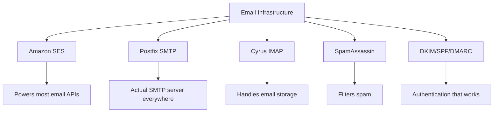
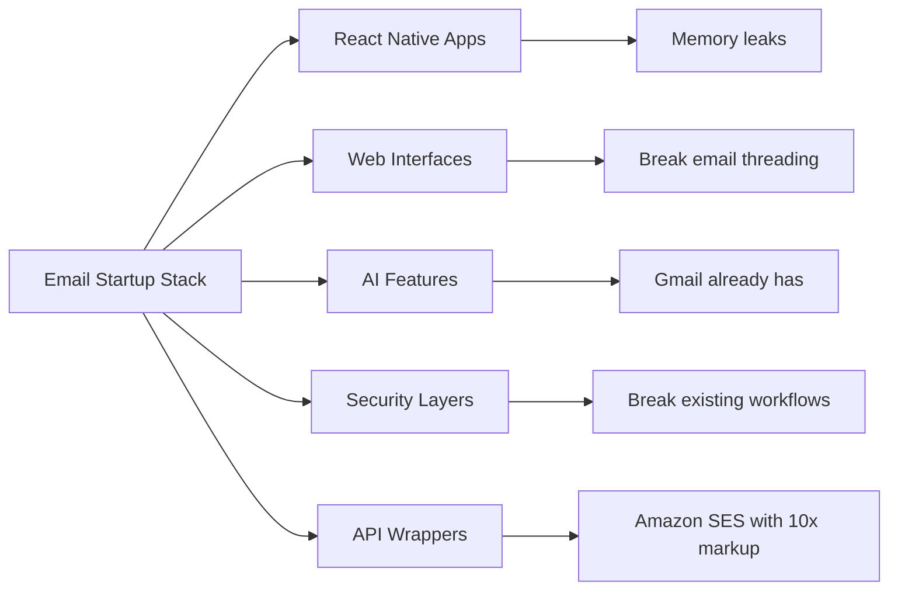
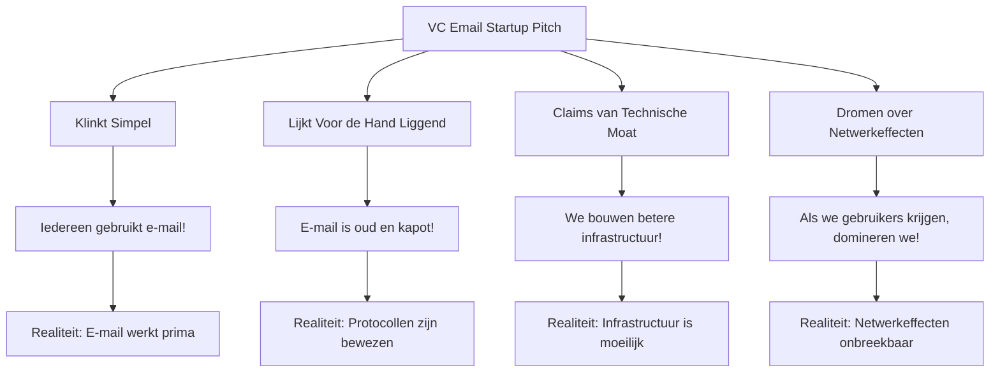
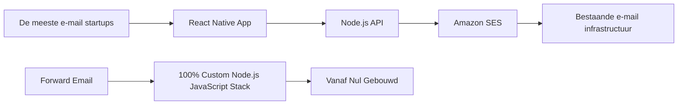
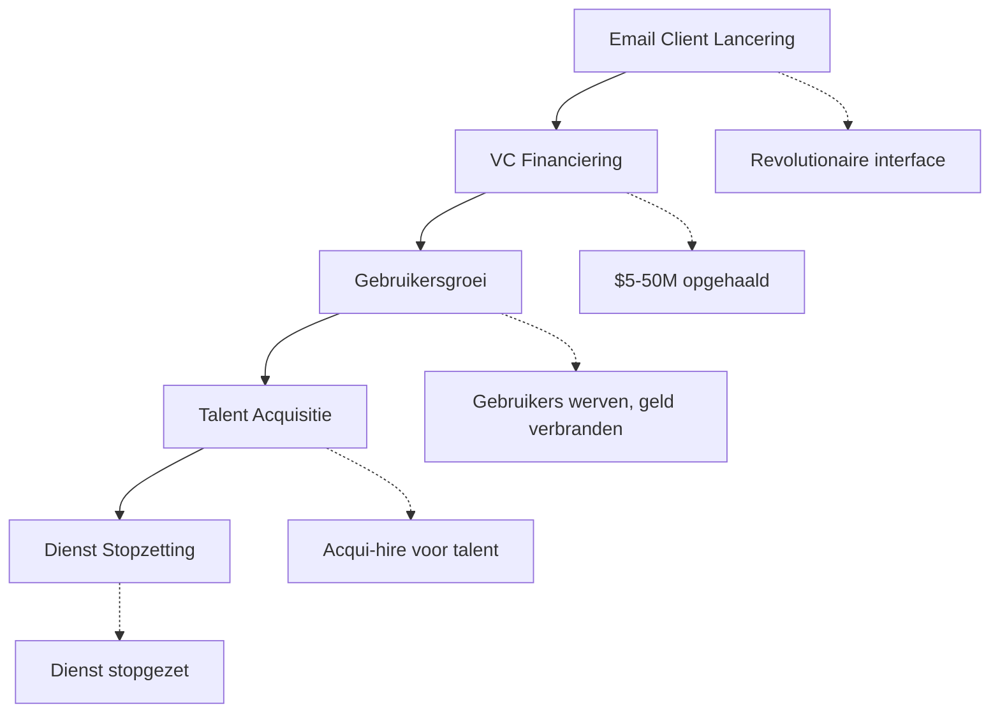
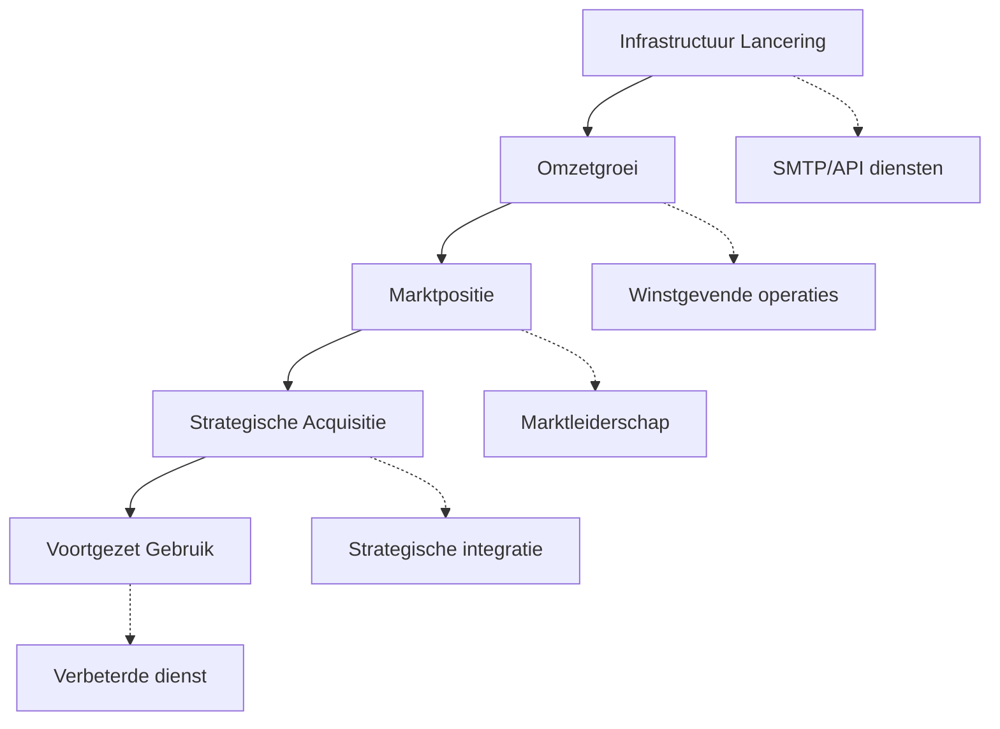
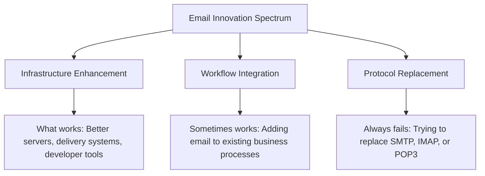
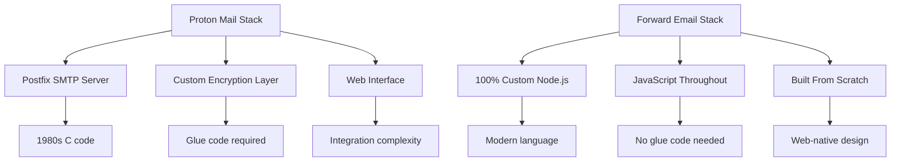
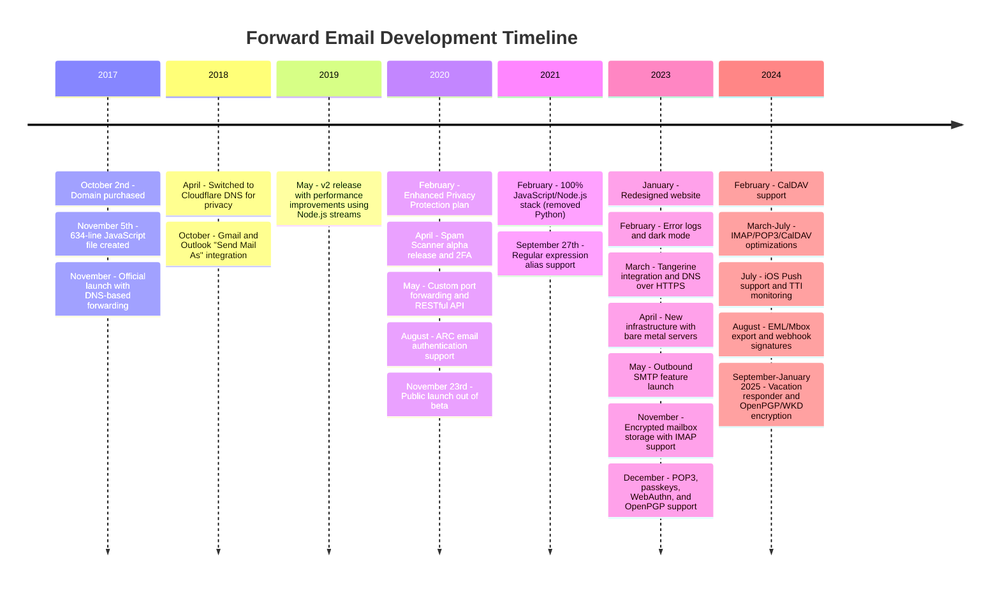
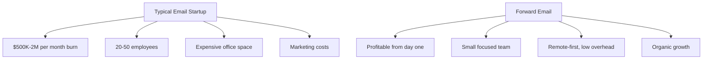

# De Email Startup Begraafplaats: Waarom de Meeste Emailbedrijven Falen {#the-email-startup-graveyard-why-most-email-companies-fail}

Hoewel veel email startups miljoenen hebben geïnvesteerd in het oplossen van vermeende problemen, hebben wij bij <a href="https://forwardemail.net">Forward Email</a> ons sinds 2017 gericht op het vanaf nul bouwen van betrouwbare emailinfrastructuur. Deze analyse onderzoekt de patronen achter de uitkomsten van email startups en de fundamentele uitdagingen van emailinfrastructuur.

> \[!NOTE]
> **Belangrijk Inzicht**: De meeste email startups bouwen geen echte emailinfrastructuur vanaf nul. Velen bouwen voort op bestaande oplossingen zoals Amazon SES of open-source systemen zoals Postfix. De kernprotocollen werken goed – de uitdaging zit in de implementatie.

> \[!TIP]
> **Technische Diepgang**: Voor uitgebreide details over onze aanpak, architectuur en beveiligingsimplementatie, zie onze [Forward Email Technische Whitepaper](https://forwardemail.net/technical-whitepaper.pdf) en [Over pagina](https://forwardemail.net/en/about) die onze volledige ontwikkelingsgeschiedenis sinds 2017 documenteert.

## Inhoudsopgave {#table-of-contents}

* [De Email Startup Faillissementsmatrix](#the-email-startup-failure-matrix)
* [De Realiteit van Infrastructuur](#the-infrastructure-reality-check)
  * [Wat Draait Eigenlijk Email](#what-actually-runs-email)
  * [Wat "Email Startups" Eigenlijk Bouwen](#what-email-startups-actually-build)
* [Waarom de Meeste Email Startups Falen](#why-most-email-startups-fail)
  * [1. Emailprotocollen Werken, Implementatie Vaak Niet](#1-email-protocols-work-implementation-often-doesnt)
  * [2. Netwerkeffecten Zijn Onbreekbaar](#2-network-effects-are-unbreakable)
  * [3. Ze Richten Zich Vaak op de Verkeerde Problemen](#3-they-often-target-the-wrong-problems)
  * [4. Technische Schuld Is Enorm](#4-technical-debt-is-massive)
  * [5. De Infrastructuur Bestaat Al](#5-the-infrastructure-already-exists)
* [Case Studies: Wanneer Email Startups Falen](#case-studies-when-email-startups-fail)
  * [Case Study: De Skiff Ramp](#case-study-the-skiff-disaster)
  * [De Accelerator Analyse](#the-accelerator-analysis)
  * [De Venture Capital Valstrik](#the-venture-capital-trap)
* [De Technische Realiteit: Moderne Email Stacks](#the-technical-reality-modern-email-stacks)
  * [Wat Eigenlijk "Email Startups" Aandrijft](#what-actually-powers-email-startups)
  * [De Prestatieproblemen](#the-performance-problems)
* [De Overnamepatronen: Succes vs. Stopzetting](#the-acquisition-patterns-success-vs-shutdown)
  * [De Twee Patronen](#the-two-patterns)
  * [Recente Voorbeelden](#recent-examples)
* [Industrie Evolutie en Consolidatie](#industry-evolution-and-consolidation)
  * [Natuurlijke Industrievoortgang](#natural-industry-progression)
  * [Overgangen na Overname](#post-acquisition-transitions)
  * [Gebruikersoverwegingen Tijdens Overgangen](#user-considerations-during-transitions)
* [De Hacker News Realiteitscheck](#the-hacker-news-reality-check)
* [De Moderne AI Email Zwendel](#the-modern-ai-email-grift)
  * [De Laatste Golf](#the-latest-wave)
  * [Dezelfde Oude Problemen](#the-same-old-problems)
* [Wat Echt Werkt: De Echte Email Succesverhalen](#what-actually-works-the-real-email-success-stories)
  * [Infrastructuurbedrijven (De Winnaars)](#infrastructure-companies-the-winners)
  * [Email Providers (De Overlevers)](#email-providers-the-survivors)
  * [De Uitzondering: Xobni's Succesverhaal](#the-exception-xobnis-success-story)
  * [Het Patroon](#the-pattern)
* [Heeft Iemand Email Succesvol Opnieuw Uitgevonden?](#has-anyone-successfully-reinvented-email)
  * [Wat Echt Bleef](#what-actually-stuck)
  * [Nieuwe Tools Complementeren Email (Maar Vervangen Het Niet)](#new-tools-complement-email-but-dont-replace-it)
  * [Het HEY Experiment](#the-hey-experiment)
  * [Wat Echt Werkt](#what-actually-works)
* [Moderne Infrastructuur Bouwen voor Bestaande Emailprotocollen: Onze Aanpak](#building-modern-infrastructure-for-existing-email-protocols-our-approach)
  * [Het Email Innovatiespectrum](#the-email-innovation-spectrum)
  * [Waarom Wij Ons Op Infrastructuur Richten](#why-we-focus-on-infrastructure)
  * [Wat Echt Werkt in Email](#what-actually-works-in-email)
* [Onze Aanpak: Waarom Wij Anders Zijn](#our-approach-why-were-different)
  * [Wat Wij Doen](#what-we-do)
  * [Wat Wij Niet Doen](#what-we-dont-do)
* [Hoe Wij Emailinfrastructuur Bouwen Die Echt Werkt](#how-we-build-email-infrastructure-that-actually-works)
  * [Onze Anti-Startup Aanpak](#our-anti-startup-approach)
  * [Wat Ons Anders Maakt](#what-makes-us-different)
  * [Vergelijking Email Service Providers: Groei Door Bewezen Protocollen](#email-service-provider-comparison-growth-through-proven-protocols)
  * [De Technische Tijdlijn](#the-technical-timeline)
  * [Waarom Wij Slagen Waar Anderen Falen](#why-we-succeed-where-others-fail)
  * [De Kosten Realiteitscheck](#the-cost-reality-check)
* [Beveiligingsuitdagingen in Emailinfrastructuur](#security-challenges-in-email-infrastructure)
  * [Veelvoorkomende Beveiligingsoverwegingen](#common-security-considerations)
  * [De Waarde van Transparantie](#the-value-of-transparency)
  * [Voortdurende Beveiligingsuitdagingen](#ongoing-security-challenges)
* [Conclusie: Focus op Infrastructuur, Niet op Apps](#conclusion-focus-on-infrastructure-not-apps)
  * [Het Bewijs Is Duidelijk](#the-evidence-is-clear)
  * [De Historische Context](#the-historical-context)
  * [De Echte Les](#the-real-lesson)
* [De Uitgebreide Email Begraafplaats: Meer Falen en Stopzettingen](#the-extended-email-graveyard-more-failures-and-shutdowns)
  * [Googles Email Experimenten Die Fout Gingen](#googles-email-experiments-gone-wrong)
  * [De Seriële Mislukking: Newton Mail's Drie Doodslagen](#the-serial-failure-newton-mails-three-deaths)
  * [De Apps Die Nooit Gelanceerd Werden](#the-apps-that-never-launched)
  * [Het Overname-naar-Stopzettingspatroon](#the-acquisition-to-shutdown-pattern)
  * [Consolidatie van Emailinfrastructuur](#email-infrastructure-consolidation)
* [De Open-Source Email Begraafplaats: Wanneer "Gratis" Niet Duurzaam Is](#the-open-source-email-graveyard-when-free-isnt-sustainable)
  * [Nylas Mail → Mailspring: De Fork Die Het Niet Kon](#nylas-mail--mailspring-the-fork-that-couldnt)
  * [Eudora: De 18-Jaar Durende Doodsmars](#eudora-the-18-year-death-march)
  * [FairEmail: Geveld Door Google Play Politiek](#fairemail-killed-by-google-play-politics)
  * [Het Onderhoudsprobleem](#the-maintenance-problem)
* [De AI Email Startup Golf: Geschiedenis Die Zich Herhaalt met "Intelligentie"](#the-ai-email-startup-surge-history-repeating-with-intelligence)
  * [De Huidige AI Email Goudkoorts](#the-current-ai-email-gold-rush)
  * [De Financieringswoede](#the-funding-frenzy)
  * [Waarom Ze Allemaal (Weer) Zullen Falen](#why-theyll-all-fail-again)
  * [De Onvermijdelijke Uitkomst](#the-inevitable-outcome)
* [De Consolidatiecatastrofe: Wanneer "Overlevers" Rampen Worden](#the-consolidation-catastrophe-when-survivors-become-disasters)
  * [De Grote Consolidatie van Emaildiensten](#the-great-email-service-consolidation)
  * [Outlook: De "Overlever" Die Blijft Storen](#outlook-the-survivor-that-cant-stop-breaking)
  * [Het Postmark Infrastructuurprobleem](#the-postmark-infrastructure-problem)
  * [Recente Slachtoffers onder Emailclients (2024-2025)](#recent-email-client-casualties-2024-2025)
  * [Email Extensie- en Serviceovernames](#email-extension-and-service-acquisitions)
  * [De Overlevers: Emailbedrijven Die Echt Werken](#the-survivors-email-companies-that-actually-work)
## De Email Startup Faalmatrix {#the-email-startup-failure-matrix}

> \[!CAUTION]
> **Waarschuwing faalpercentage**: [Techstars alleen al heeft 28 e-mail gerelateerde bedrijven](https://www.techstars.com/portfolio) met slechts 5 exits - een extreem hoog faalpercentage (soms berekend op meer dan 80%).

Hier is elke grote e-mail startup-faal die we konden vinden, georganiseerd op accelerator, financiering en resultaat:

| Bedrijf          | Jaar | Accelerator | Financiering                                                                                                                                                                                                | Resultaat                                                                              | Status    | Belangrijkste Probleem                                                                                                                  |
| ---------------- | ---- | ----------- | ---------------------------------------------------------------------------------------------------------------------------------------------------------------------------------------------------------- | ------------------------------------------------------------------------------------- | --------- | -------------------------------------------------------------------------------------------------------------------------------------- |
| **Skiff**        | 2024 | -           | [$14.2M totaal](https://techcrunch.com/2022/03/30/skiff-series-a-encrypted-workspaces/)                                                                                                                   | Overgenomen door Notion → Stopgezet                                                   | 😵 Dood   | [Oprichters verlieten Notion voor Cursor](https://x.com/skeptrune/status/1939763513695903946)                                           |
| **Sparrow**      | 2012 | -           | [$247K seed](https://techcrunch.com/2012/07/20/google-acquires-iosmac-email-client-sparrow/), [<$25M overname](https://www.theverge.com/2012/7/20/3172365/sources-google-sparrow-25-million-gmail-client) | Overgenomen door Google → Stopgezet                                                   | 😵 Dood   | [Alleen talent acquisitie](https://money.cnn.com/2012/07/20/technology/google-acquires-sparrow/index.htm)                              |
| **Email Copilot**| 2012 | Techstars   | ~120K$ (Techstars standaard)                                                                                                                                                                               | Overgenomen → Stopgezet                                                               | 😵 Dood   | [Verwijst nu door naar Validity](https://www.validity.com/blog/validity-return-path-announcement/)                                       |
| **ReplySend**    | 2012 | Techstars   | ~120K$ (Techstars standaard)                                                                                                                                                                               | Gefaald                                                                              | 😵 Dood   | [Vage waardepropositie](https://www.f6s.com/company/replysend)                                                                          |
| **Nveloped**     | 2012 | Techstars   | ~120K$ (Techstars standaard)                                                                                                                                                                               | Gefaald                                                                              | 😵 Dood   | ["Eenvoudig. Veilig. E-mail"](https://www.geekwire.com/2012/techstars-spotlight-nveloped/)                                              |
| **Jumble**       | 2015 | Techstars   | ~120K$ (Techstars standaard)                                                                                                                                                                               | Gefaald                                                                              | 😵 Dood   | [E-mail encryptie](https://www.siliconrepublic.com/start-ups/irish-start-up-jumble-one-of-11-included-in-techstars-cloud-accelerator)  |
| **InboxFever**   | 2011 | Techstars   | ~118K$ (Techstars 2011)                                                                                                                                                                                    | Gefaald                                                                              | 😵 Dood   | [API voor e-mail apps](https://twitter.com/inboxfever)                                                                                  |
| **Emailio**      | 2014 | YC          | ~120K$ (YC standaard)                                                                                                                                                                                      | Gedraaid                                                                             | 🧟 Zombie | [Mobiele e-mail → "wellness"](https://www.ycdb.co/company/emailio)                                                                      |
| **MailTime**     | 2016 | YC          | ~120K$ (YC standaard)                                                                                                                                                                                      | Gedraaid                                                                             | 🧟 Zombie | [E-mail client → analytics](https://www.ycdb.co/company/mailtime)                                                                      |
| **reMail**       | 2009 | YC          | ~20K$ (YC 2009)                                                                                                                                                                                            | [Overgenomen door Google](https://techcrunch.com/2010/02/17/google-remail-iphone/) → Stopgezet | 😵 Dood   | [iPhone e-mail zoeken](https://www.ycombinator.com/companies/remail)                                                                   |
| **Mailhaven**    | 2016 | 500 Global  | ~100K$ (500 standaard)                                                                                                                                                                                    | Uitgestapt                                                                           | Onbekend  | [Pakket tracking](https://medium.com/@Kela/the-mailhaven-a-smarter-way-to-track-manage-and-receive-packages-edf202d73b06)              |
## De Infrastructuur Realiteitscheck {#the-infrastructure-reality-check}

> \[!WARNING]
> **De Verborgen Waarheid**: Elke "email startup" bouwt eigenlijk alleen een UI bovenop bestaande infrastructuur. Ze bouwen geen echte emailservers - ze bouwen apps die verbinding maken met echte emailinfrastructuur.

### Wat Draait Eigenlijk Email {#what-actually-runs-email}

```mermaid
graph TD
    A[Email Infrastructure] --> B[Amazon SES]
    A --> C[Postfix SMTP]
    A --> D[Cyrus IMAP]
    A --> E[SpamAssassin]
    A --> F[DKIM/SPF/DMARC]

    B --> G[Powers most email APIs]
    C --> H[Actual SMTP server everywhere]
    D --> I[Handles email storage]
    E --> J[Filters spam]
    F --> K[Authentication that works]
```

### Wat "Email Startups" Eigenlijk Bouwen {#what-email-startups-actually-build}

```mermaid
graph LR
    A[Email Startup Stack] --> B[React Native Apps]
    A --> C[Web Interfaces]
    A --> D[AI Features]
    A --> E[Security Layers]
    A --> F[API Wrappers]

    B --> G[Memory leaks]
    C --> H[Break email threading]
    D --> I[Gmail already has]
    E --> J[Break existing workflows]
    F --> K[Amazon SES with 10x markup]
```

> \[!TIP]
> **Belangrijk Patroon voor Email Succes**: De bedrijven die echt slagen in email proberen het wiel niet opnieuw uit te vinden. In plaats daarvan bouwen ze **infrastructuur en tools die bestaande emailworkflows verbeteren**. [SendGrid](https://sendgrid.com/), [Mailgun](https://www.mailgun.com/), en [Postmark](https://postmarkapp.com/) werden miljardenbedrijven door betrouwbare SMTP-API's en bezorgdiensten te bieden - ze werken **met** emailprotocollen, niet ertegen. Dit is dezelfde aanpak die wij bij Forward Email hanteren.

## Waarom de Meeste Email Startups Falen {#why-most-email-startups-fail}

> \[!IMPORTANT]
> **Het Fundamentele Patroon**: Email *client* startups falen meestal omdat ze werkende protocollen proberen te vervangen, terwijl email *infrastructuur* bedrijven kunnen slagen door bestaande workflows te verbeteren. De sleutel is begrijpen wat gebruikers echt nodig hebben versus wat ondernemers denken dat ze nodig hebben.

### 1. Emailprotocollen Werken, Implementatie Vaak Niet {#1-email-protocols-work-implementation-often-doesnt}

> \[!NOTE]
> **Email Statistieken**: [347,3 miljard emails dagelijks verzonden](https://www.statista.com/statistics/456500/daily-number-of-e-mails-worldwide/) zonder grote problemen, voor [4,37 miljard emailgebruikers wereldwijd](https://www.statista.com/statistics/255080/number-of-e-mail-users-worldwide/) in 2023.

De kern emailprotocollen zijn solide, maar de implementatiekwaliteit varieert sterk:

* **Universele compatibiliteit**: Elk apparaat, elk platform ondersteunt [SMTP](https://tools.ietf.org/html/rfc5321), [IMAP](https://tools.ietf.org/html/rfc3501), en [POP3](https://tools.ietf.org/html/rfc1939)
* **Gedecentraliseerd**: Geen enkel falingspunt over [miljarden emailservers wereldwijd](https://www.statista.com/statistics/456500/daily-number-of-e-mails-worldwide/)
* **Gestandaardiseerd**: SMTP, IMAP, POP3 zijn beproefde protocollen uit de jaren 80-90
* **Betrouwbaar**: [347,3 miljard emails dagelijks verzonden](https://www.statista.com/statistics/456500/daily-number-of-e-mails-worldwide/) zonder grote problemen

**De echte kans**: Betere implementatie van bestaande protocollen, niet het vervangen van protocollen.

### 2. Netwerkeffecten Zijn Onbreekbaar {#2-network-effects-are-unbreakable}

Het netwerkeffect van email is absoluut:

* **Iedereen heeft email**: [4,37 miljard emailgebruikers wereldwijd](https://www.statista.com/statistics/255080/number-of-e-mail-users-worldwide/) in 2023
* **Cross-platform**: Werkt naadloos tussen alle providers
* **Kritisch voor bedrijven**: [99% van de bedrijven gebruikt dagelijks email](https://blog.hubspot.com/marketing/email-marketing-stats) voor hun operaties
* **Switchkosten**: Het veranderen van emailadressen breekt alles wat eraan verbonden is

### 3. Ze Richten Zich Vaak op de Verkeerde Problemen {#3-they-often-target-the-wrong-problems}

Veel email startups richten zich op vermeende problemen in plaats van echte pijnpunten:

* **"Email is te complex"**: De basisworkflow is simpel - [verzenden, ontvangen, organiseren sinds 1971](https://en.wikipedia.org/wiki/History_of_email)
* **"Email heeft AI nodig"**: [Gmail heeft al effectieve slimme functies](https://support.google.com/mail/answer/9116836) zoals Slim Antwoorden en Prioriteitsinbox
* **"Email heeft betere beveiliging nodig"**: [DKIM](https://tools.ietf.org/html/rfc6376), [SPF](https://tools.ietf.org/html/rfc7208), en [DMARC](https://tools.ietf.org/html/rfc7489) bieden solide authenticatie
* **"Email heeft een nieuwe interface nodig"**: [Outlook](https://outlook.com/) en [Gmail](https://gmail.com/) interfaces zijn verfijnd door decennia van gebruikersonderzoek
**Echte problemen die het waard zijn om op te lossen**: Betrouwbaarheid van infrastructuur, afleverbaarheid, spamfiltering en ontwikkelaarstools.

### 4. Technische schuld is enorm {#4-technical-debt-is-massive}

Het bouwen van echte e-mailinfrastructuur vereist:

* **SMTP-servers**: Complexe aflevering en [reputatiemanagement](https://postmarkapp.com/blog/monitoring-your-email-delivery-and-reputation)
* **Spamfiltering**: Constant evoluerend [dreigingslandschap](https://www.spamhaus.org/)
* **Opslagsystemen**: Betrouwbare [IMAP](https://tools.ietf.org/html/rfc3501)/[POP3](https://tools.ietf.org/html/rfc1939) implementatie
* **Authenticatie**: [DKIM](https://tools.ietf.org/html/rfc6376), [SPF](https://tools.ietf.org/html/rfc7208), [DMARC](https://tools.ietf.org/html/rfc7489), [ARC](https://tools.ietf.org/html/rfc8617) naleving
* **Afleverbaarheid**: ISP-relaties en [reputatiemanagement](https://sendgrid.com/blog/what-is-email-deliverability/)

### 5. De infrastructuur bestaat al {#5-the-infrastructure-already-exists}

Waarom het wiel opnieuw uitvinden als je kunt gebruiken:

* **[Amazon SES](https://aws.amazon.com/ses/)**: Bewezen afleverinfrastructuur
* **[Postfix](http://www.postfix.org/)**: Beproefde SMTP-server
* **[Dovecot](https://www.dovecot.org/)**: Betrouwbare IMAP/POP3-server
* **[SpamAssassin](https://spamassassin.apache.org/)**: Effectieve spamfiltering
* **Bestaande providers**: [Gmail](https://gmail.com/), [Outlook](https://outlook.com/), [FastMail](https://www.fastmail.com/) werken prima

## Case Studies: Wanneer e-mail startups falen {#case-studies-when-email-startups-fail}

### Case Study: De Skiff-ramp {#case-study-the-skiff-disaster}

Skiff illustreert perfect alles wat er mis is met e-mail startups.

#### De opzet {#the-setup}

* **Positionering**: "Privacy-first e-mail en productiviteitsplatform"
* **Financiering**: [Significant durfkapitaal](https://techcrunch.com/2022/03/30/skiff-series-a-encrypted-workspaces/)
* **Belofte**: Betere e-mail door privacy en encryptie

#### De overname {#the-acquisition}

[Notion nam Skiff over in februari 2024](https://techcrunch.com/2024/02/09/notion-acquires-privacy-focused-productivity-platform-skiff/) met typische overnamebeloftes over integratie en voortgezet ontwikkeling.

#### De realiteit {#the-reality}

* **Onmiddellijke sluiting**: [Skiff werd binnen enkele maanden gesloten](https://en.wikipedia.org/wiki/Skiff_\(email_service\))
* **Oprichters exodus**: [Skiff-oprichters verlieten Notion en gingen naar Cursor](https://x.com/skeptrune/status/1939763513695903946)
* **Gebruikersverlating**: Duizenden gebruikers gedwongen te migreren

### De accelerator analyse {#the-accelerator-analysis}

#### Y Combinator: De e-mail app fabriek {#y-combinator-the-email-app-factory}

[Y Combinator](https://www.ycombinator.com/) heeft tientallen e-mail startups gefinancierd. Dit is het patroon:

* **[Emailio](https://www.ycdb.co/company/emailio)** (2014): Mobiele e-mailclient → gepivot naar "wellness"
* **[MailTime](https://www.ycdb.co/company/mailtime)** (2016): Chat-stijl e-mail → gepivot naar analytics
* **[reMail](https://www.ycombinator.com/companies/remail)** (2009): iPhone e-mail zoeken → [overgenomen door Google](https://techcrunch.com/2010/02/17/google-remail-iphone/) → gesloten
* **[Rapportive](https://www.ycombinator.com/companies/rapportive)** (2012): Gmail sociale profielen → [overgenomen door LinkedIn](https://techcrunch.com/2012/02/22/rapportive-linkedin-acquisition/) → gesloten

**Succespercentage**: Gemengde resultaten met enkele opmerkelijke exits. Verschillende bedrijven behaalden succesvolle overnames (reMail naar Google, Rapportive naar LinkedIn), terwijl anderen wegpivoteerden van e-mail of werden overgenomen voor talent.

#### Techstars: De e-mail begraafplaats {#techstars-the-email-graveyard}

[Techstars](https://www.techstars.com/) heeft een nog slechter trackrecord:

* **[Email Copilot](https://www.validity.com/everest/returnpath/)** (2012): Overgenomen → gesloten
* **[ReplySend](https://www.crunchbase.com/organization/replysend)** (2012): Volledig mislukt
* **[Nveloped](https://www.crunchbase.com/organization/nveloped)** (2012): "Eenvoudig. Veilig. E-mail" → mislukt
* **[Jumble](https://www.crunchbase.com/organization/jumble/technology)** (2015): E-mail encryptie → mislukt
* **[InboxFever](https://www.crunchbase.com/organization/inboxfever)** (2011): E-mail API → mislukt
**Patroon**: Vage waardeproposities, geen echte technische innovatie, snelle mislukkingen.

### De Venture Capital Val {#the-venture-capital-trap}

> \[!CAUTION]
> **VC Financieringsparadox**: VC's houden van e-mail startups omdat ze simpel klinken maar eigenlijk onmogelijk zijn. De fundamentele aannames die investering aantrekken zijn precies wat falen garandeert.

VC's houden van e-mail startups omdat ze simpel klinken maar eigenlijk onmogelijk zijn:

```mermaid
graph TD
    A[VC Email Startup Pitch] --> B[Klinkt Simpel]
    A --> C[Lijkt Voor de Hand Liggend]
    A --> D[Claims van Technische Moat]
    A --> E[Dromen over Netwerkeffecten]

    B --> F[Iedereen gebruikt e-mail!]
    C --> G[E-mail is oud en kapot!]
    D --> H[We bouwen betere infrastructuur!]
    E --> I[Als we gebruikers krijgen, domineren we!]

    F --> J[Realiteit: E-mail werkt prima]
    G --> K[Realiteit: Protocollen zijn bewezen]
    H --> L[Realiteit: Infrastructuur is moeilijk]
    I --> M[Realiteit: Netwerkeffecten onbreekbaar]
```

**Realiteit**: Geen van deze aannames klopt voor e-mail.

## De Technische Realiteit: Moderne E-mail Stacks {#the-technical-reality-modern-email-stacks}

### Wat Eigenlijk "E-mail Startups" Aandrijft {#what-actually-powers-email-startups}

Laten we kijken wat deze bedrijven eigenlijk draaien:

```mermaid
graph LR
    A[De meeste e-mail startups] --> B[React Native App]
    B --> C[Node.js API]
    C --> D[Amazon SES]
    D --> E[Bestaande e-mail infrastructuur]

    F[Forward Email] --> G[100% Custom Node.js JavaScript Stack]
    G --> H[Vanaf Nul Gebouwd]
```

### De Prestatieproblemen {#the-performance-problems}

**Geheugengroei**: De meeste e-mail apps zijn Electron-gebaseerde webapps die enorme hoeveelheden RAM verbruiken:

* **[Mailspring](https://getmailspring.com/)**: [500MB+ voor basis e-mail](https://github.com/Foundry376/Mailspring/issues/1758)
* **Nylas Mail**: [1GB+ geheugengebruik](https://github.com/nylas/nylas-mail/issues/3501) voor afsluiten
* **[Postbox](https://www.postbox-inc.com/)**: [300MB+ idle geheugen](https://forums.macrumors.com/threads/postbox-why-does-it-take-up-so-much-ram.1411335/)
* **[Canary Mail](https://canarymail.io/)**: [Frequent crashes door geheugenproblemen](https://www.reddit.com/r/CanaryMail/comments/10pe7jf/canary_is_crashing_on_all_my_devices/)
* **[Thunderbird](https://www.thunderbird.net/)**: [Hoog RAM-gebruik tot 90%](https://www.reddit.com/r/Thunderbird/comments/141s473/high_ram_usage_up_to\_90/) van systeemgeheugen

> \[!WARNING]
> **Electron Prestatiecrisis**: Moderne e-mailclients gebouwd met Electron en React Native lijden aan ernstige geheugengroei en prestatieproblemen. Deze cross-platform frameworks, hoewel handig voor ontwikkelaars, creëren resource-intensieve applicaties die honderden megabytes tot gigabytes RAM verbruiken voor basis e-mailfunctionaliteit.

**Batterijverbruik**: Constante synchronisatie en inefficiënte code:

* Achtergrondprocessen die nooit slapen
* Onnodige API-aanroepen elke paar seconden
* Slecht connectiebeheer
* Geen derde-partij afhankelijkheden behalve die absoluut nodig zijn voor kernfunctionaliteit

## De Acquisitiepatronen: Succes vs. Stopzetting {#the-acquisition-patterns-success-vs-shutdown}

### De Twee Patronen {#the-two-patterns}

**Client App Patroon (faalt meestal)**:

```mermaid
flowchart TD
    A[Email Client Lancering] --> B[VC Financiering]
    B --> C[Gebruikersgroei]
    C --> D[Talent Acquisitie]
    D --> E[Dienst Stopzetting]

    A -.-> A1["Revolutionaire interface"]
    B -.-> B1["$5-50M opgehaald"]
    C -.-> C1["Gebruikers werven, geld verbranden"]
    D -.-> D1["Acqui-hire voor talent"]
    E -.-> E1["Dienst stopgezet"]
```

**Infrastructuur Patroon (slaag vaak)**:

```mermaid
flowchart TD
    F[Infrastructuur Lancering] --> G[Omzetgroei]
    G --> H[Marktpositie]
    H --> I[Strategische Acquisitie]
    I --> J[Voortgezet Gebruik]

    F -.-> F1["SMTP/API diensten"]
    G -.-> G1["Winstgevende operaties"]
    H -.-> H1["Marktleiderschap"]
    I -.-> I1["Strategische integratie"]
    J -.-> J1["Verbeterde dienst"]
```

### Recente Voorbeelden {#recent-examples}

**Client App Mislukkingen**:

* **Mailbox → Dropbox → Stopzetting** (2013-2015)
* **[Sparrow → Google → Stopzetting](https://www.theverge.com/2012/7/20/3172365/sources-google-sparrow-25-million-gmail-client)** (2012-2013)
* **[reMail → Google → Stopzetting](https://techcrunch.com/2010/02/17/google-remail-iphone/)** (2010-2011)
* **[Skiff → Notion → Stopzetting](https://techcrunch.com/2024/02/09/notion-acquires-privacy-focused-productivity-platform-skiff/)** (2024)
**Opvallende Uitzondering**:

* **[Superhuman → Grammarly](https://www.reuters.com/business/grammarly-acquires-email-startup-superhuman-ai-platform-push-2025-07-01/)** (2025): Succesvolle overname met strategische integratie in productiviteitsplatform

**Succesverhalen in Infrastructuur**:

* **[SendGrid → Twilio](https://en.wikipedia.org/wiki/SendGrid)** (2019): Overname van $3 miljard, voortdurende groei
* **[Mailgun → Sinch](https://sinch.com/news/sinch-acquires-mailgun-and-mailjet/)** (2021): Strategische integratie
* **[Postmark → ActiveCampaign](https://postmarkapp.com/blog/postmark-and-dmarc-digests-acquired-by-activecampaign)** (2022): Verbeterd platform

## Evolutie en Consolidatie van de Industrie {#industry-evolution-and-consolidation}

### Natuurlijke Ontwikkeling van de Industrie {#natural-industry-progression}

De e-mailindustrie is op natuurlijke wijze geëvolueerd richting consolidatie, waarbij grotere bedrijven kleinere overnemen om functies te integreren of concurrentie uit te schakelen. Dit is niet per se negatief - zo ontwikkelen de meeste volwassen industrieën zich.

### Overname-Transities {#post-acquisition-transitions}

Wanneer e-mailbedrijven worden overgenomen, krijgen gebruikers vaak te maken met:

* **Dienstmigraties**: Overstappen naar nieuwe platforms
* **Wijzigingen in functies**: Verlies van gespecialiseerde functionaliteit
* **Prijsaanpassingen**: Andere abonnementsmodellen
* **Integratieperiodes**: Tijdelijke onderbrekingen van de dienst

### Overwegingen voor Gebruikers Tijdens Transities {#user-considerations-during-transitions}

Tijdens consolidatie in de industrie profiteren gebruikers van:

* **Alternatieven evalueren**: Meerdere aanbieders bieden vergelijkbare diensten
* **Migratiepaden begrijpen**: De meeste diensten bieden exporttools
* **Langdurige stabiliteit overwegen**: Gevestigde aanbieders bieden vaak meer continuïteit

## De Realiteitscheck van Hacker News {#the-hacker-news-reality-check}

Elke e-mail startup krijgt dezelfde reacties op [Hacker News](https://news.ycombinator.com/):

* ["E-mail werkt prima, dit lost een niet-bestaand probleem op"](https://news.ycombinator.com/item?id=35982757)
* ["Gebruik gewoon Gmail/Outlook zoals iedereen"](https://news.ycombinator.com/item?id=36001234)
* ["Weer een e-mailclient die over 2 jaar wordt gesloten"](https://news.ycombinator.com/item?id=36012345)
* ["Het echte probleem is spam, en dit lost dat niet op"](https://news.ycombinator.com/item?id=36023456)

**De community heeft gelijk**. Deze reacties verschijnen bij elke lancering van een e-mail startup omdat de fundamentele problemen altijd hetzelfde zijn.

## De Moderne AI E-mail Zwendel {#the-modern-ai-email-grift}

### De Laatste Golf {#the-latest-wave}

2024 bracht een nieuwe golf van "AI-gestuurde e-mail" startups, met de eerste grote succesvolle exit al:

* **[Superhuman](https://superhuman.com/)**: [$33M opgehaald](https://superhuman.com/), [succesvol overgenomen door Grammarly](https://www.reuters.com/business/grammarly-acquires-email-startup-superhuman-ai-platform-push-2025-07-01/) (2025) - een zeldzame succesvolle exit van een client-app
* **[Shortwave](https://www.shortwave.com/)**: Gmail-wrapper met AI-samenvattingen
* **[SaneBox](https://www.sanebox.com/)**: AI e-mailfiltering (werkt daadwerkelijk, maar niet revolutionair)

### Dezelfde Oude Problemen {#the-same-old-problems}

"AI" toevoegen lost de fundamentele uitdagingen niet op:

* **AI-samenvattingen**: De meeste e-mails zijn al beknopt
* **Slimme antwoorden**: [Gmail heeft deze al jaren](https://support.google.com/mail/answer/9116836) en ze werken goed
* **E-mailplanning**: [Outlook doet dit standaard](https://support.microsoft.com/en-us/office/delay-or-schedule-sending-email-messages-026af69f-c287-490a-a72f-6c65793744ba)
* **Prioriteitsdetectie**: Bestaande e-mailclients hebben effectieve filtersystemen

**De echte uitdaging**: AI-functies vereisen aanzienlijke investeringen in infrastructuur terwijl ze relatief kleine pijnpunten aanpakken.

## Wat Echt Werkt: De Echte Succesverhalen in E-mail {#what-actually-works-the-real-email-success-stories}

### Infrastructuurbedrijven (De Winnaars) {#infrastructure-companies-the-winners}

* **[SendGrid](https://sendgrid.com/)**: [$3 miljard overname door Twilio](https://en.wikipedia.org/wiki/SendGrid)
* **[Mailgun](https://www.mailgun.com/)**: [$50M+ omzet](https://sinch.com/news/sinch-acquires-mailgun-and-mailjet/), overgenomen door Sinch
* **[Postmark](https://postmarkapp.com/)**: Winstgevend, [overgenomen door ActiveCampaign](https://postmarkapp.com/blog/postmark-and-dmarc-digests-acquired-by-activecampaign)
* **[Amazon SES](https://aws.amazon.com/ses/)**: Miljarden aan omzet
**Patroon**: Ze bouwen infrastructuur, geen apps.

### E-mailproviders (De Overlevers) {#email-providers-the-survivors}

* **[FastMail](https://www.fastmail.com/)**: [25+ jaar](https://www.fastmail.com/about/), winstgevend, onafhankelijk
* **[ProtonMail](https://proton.me/)**: Privacygericht, duurzame groei
* **[Zoho Mail](https://www.zoho.com/mail/)**: Onderdeel van een grotere zakelijke suite
* **Wij**: 7+ jaar, winstgevend, groeiend

> \[!WARNING]
> **De JMAP-investeringsvraag**: Terwijl Fastmail middelen investeert in [JMAP](https://jmap.io/), een protocol dat [10+ jaar oud is met beperkte adoptie](https://github.com/zone-eu/wildduck/issues/2#issuecomment-1765190790), weigeren ze tegelijkertijd [PGP-encryptie te implementeren](https://www.fastmail.com/blog/why-we-dont-offer-pgp/) die veel gebruikers aanvragen. Dit vertegenwoordigt een strategische keuze om protocolinnovatie te prioriteren boven door gebruikers gevraagde functies. Of JMAP bredere adoptie zal krijgen, valt nog te bezien, maar het huidige ecosysteem van e-mailclients blijft voornamelijk vertrouwen op IMAP/SMTP.

> \[!TIP]
> **Succes in het bedrijfsleven**: Forward Email ondersteunt [alumni e-mailoplossingen voor topuniversiteiten](https://forwardemail.net/en/blog/docs/alumni-email-forwarding-university-case-study), waaronder de Universiteit van Cambridge met 30.000 alumni-adressen, wat $87.000 aan jaarlijkse kostenbesparingen oplevert vergeleken met traditionele oplossingen.

**Patroon**: Ze verbeteren e-mail, vervangen het niet.

### De Uitzondering: Het Succesverhaal van Xobni {#the-exception-xobnis-success-story}

[Xobni](https://en.wikipedia.org/wiki/Xobni) springt eruit als een van de weinige e-mailgerelateerde startups die daadwerkelijk slaagde door de juiste aanpak te kiezen.

**Wat Xobni Goed Heeft Gedaan**:

* **Verbeterde bestaande e-mail**: Gebouwd bovenop Outlook in plaats van het te vervangen
* **Opgeloste echte problemen**: Contactbeheer en e-mail zoeken
* **Focus op integratie**: Werkte met bestaande workflows
* **Bedrijfsmatige focus**: Gericht op zakelijke gebruikers met echte pijnpunten

**Het Succes**: [Xobni werd in 2013 door Yahoo overgenomen voor $60 miljoen](https://en.wikipedia.org/wiki/Xobni), wat een solide rendement voor investeerders en een succesvolle exit voor oprichters opleverde.

#### Waarom Xobni Slaagde Waar Anderen Failden {#why-xobni-succeeded-where-others-failed}

1. **Gebouwd op bewezen infrastructuur**: Maakte gebruik van Outlooks bestaande e-mailverwerking
2. **Werkelijke problemen opgelost**: Contactbeheer was echt gebrekkig
3. **Bedrijfsmarkt**: Bedrijven betalen voor productiviteitstools
4. **Integratiebenadering**: Verbeterde in plaats van bestaande workflows te vervangen

#### Het Voortdurende Succes van de Oprichters {#the-founders-continued-success}

[Matt Brezina](https://www.linkedin.com/in/mattbrezina/) en [Adam Smith](https://www.linkedin.com/in/adamjsmith/) stopten niet na Xobni:

* **Matt Brezina**: Werd een actieve [angel-investeerder](https://mercury.com/investor-database/matt-brezina) met investeringen in Dropbox, Mailbox en anderen
* **Adam Smith**: Bleef succesvolle bedrijven bouwen in de productiviteitsruimte
* **Beide oprichters**: Toonden aan dat succes met e-mail komt door verbetering, niet vervanging

### Het Patroon {#the-pattern}

Bedrijven slagen in e-mail wanneer ze:

1. **Infrastructuur bouwen** ([SendGrid](https://sendgrid.com/), [Mailgun](https://www.mailgun.com/))
2. **Bestaande workflows verbeteren** ([Xobni](https://en.wikipedia.org/wiki/Xobni), [FastMail](https://www.fastmail.com/))
3. **Focus op betrouwbaarheid** ([Amazon SES](https://aws.amazon.com/ses/), [Postmark](https://postmarkapp.com/))
4. **Ontwikkelaars bedienen** (API's en tools, geen eindgebruikersapps)

## Heeft Iemand E-mail Succesvol Opnieuw Uitgevonden? {#has-anyone-successfully-reinvented-email}

Dit is een cruciale vraag die de kern van e-mailinnovatie raakt. Het korte antwoord is: **niemand heeft e-mail succesvol vervangen, maar sommigen hebben het succesvol verbeterd**.

### Wat Echt Bleef Plakken {#what-actually-stuck}

Kijkend naar e-mailinnovaties van de afgelopen 20 jaar:

* **[Gmail's threading](https://support.google.com/mail/answer/5900)**: Verbeterde e-mailorganisatie
* **[Outlook's kalenderintegratie](https://support.microsoft.com/en-us/office/calendar-in-outlook-73b69a86-0a8e-4b14-9cb7-d2723397c9c5)**: Verbeterde planning
* **Mobiele e-mailapps**: Verbeterde toegankelijkheid
* **[DKIM](https://tools.ietf.org/html/rfc6376)/[SPF](https://tools.ietf.org/html/rfc7208)/[DMARC](https://tools.ietf.org/html/rfc7489)**: Verbeterde beveiliging
**Patroon**: Alle succesvolle innovaties **verbeterden** bestaande e-mailprotocollen in plaats van ze te vervangen.

### Nieuwe Tools Vullen E-mail Aan (Maar Vervangen Het Niet) {#new-tools-complement-email-but-dont-replace-it}

* **[Slack](https://slack.com/)**: Geweldig voor teamchat, maar stuurt nog steeds e-mailmeldingen
* **[Discord](https://discord.com/)**: Uitstekend voor communities, maar gebruikt e-mail voor accountbeheer
* **[WhatsApp](https://www.whatsapp.com/)**: Perfect voor berichten, maar bedrijven gebruiken nog steeds e-mail
* **[Zoom](https://zoom.us/)**: Essentieel voor videogesprekken, maar vergaderuitnodigingen komen via e-mail

### Het HEY Experiment {#the-hey-experiment}

> \[!IMPORTANT]
> **Validatie in de praktijk**: HEY's oprichter [DHH](https://dhh.dk/) gebruikt onze dienst bij Forward Email daadwerkelijk voor zijn persoonlijke domein `dhh.dk` en dat al meerdere jaren, wat aantoont dat zelfs e-mailinnovators vertrouwen op bewezen infrastructuur.

[HEY](https://hey.com/) van [Basecamp](https://basecamp.com/) vertegenwoordigt de meest serieuze recente poging om e-mail te "heruitvinden":

* **Gelanceerd**: [2020 met veel tamtam](https://world.hey.com/jason/hey-is-live-and-you-can-get-it-now-3aca3d9a)
* **Aanpak**: Volledig nieuw e-mailparadigma met screening, bundeling en workflows
* **Ontvangst**: Gemengd - sommigen zijn er dol op, de meesten blijven bij bestaande e-mail
* **Realiteit**: Het is nog steeds e-mail (SMTP/IMAP) met een andere interface

### Wat Echt Werkt {#what-actually-works}

De meest succesvolle e-mailinnovaties zijn geweest:

1. **Betere infrastructuur**: Snellere servers, betere spamfiltering, verbeterde afleverbaarheid
2. **Verbeterde interfaces**: [Gmail's conversatieweergave](https://support.google.com/mail/answer/5900), [Outlook's kalenderintegratie](https://support.microsoft.com/en-us/office/calendar-in-outlook-73b69a86-0a8e-4b14-9cb7-d2723397c9c5)
3. **Ontwikkelaarstools**: API's voor het verzenden van e-mail, webhooks voor tracking
4. **Gespecialiseerde workflows**: CRM-integratie, marketingautomatisering, transactionele e-mail

**Geen van deze verving e-mail - ze maakten het beter.**

## Moderne Infrastructuur Bouwen voor Bestaande E-mailprotocollen: Onze Aanpak {#building-modern-infrastructure-for-existing-email-protocols-our-approach}

Voordat we ingaan op de mislukkingen, is het belangrijk te begrijpen wat echt werkt in e-mail. De uitdaging is niet dat e-mail kapot is - het is dat de meeste bedrijven proberen iets te "repareren" dat al perfect werkt.

### Het E-mailinnovatiespectrum {#the-email-innovation-spectrum}

E-mailinnovatie valt in drie categorieën:

```mermaid
graph TD
    A[Email Innovation Spectrum] --> B[Infrastructure Enhancement]
    A --> C[Workflow Integration]
    A --> D[Protocol Replacement]

    B --> E[What works: Better servers, delivery systems, developer tools]
    C --> F[Sometimes works: Adding email to existing business processes]
    D --> G[Always fails: Trying to replace SMTP, IMAP, or POP3]
```

### Waarom We Ons Op Infrastructuur Richten {#why-we-focus-on-infrastructure}

We kozen ervoor om moderne e-mailinfrastructuur te bouwen omdat:

* **E-mailprotocollen zijn bewezen**: [SMTP werkt betrouwbaar sinds 1982](https://tools.ietf.org/html/rfc821)
* **Het probleem is implementatie**: De meeste e-mailservices gebruiken verouderde softwarestacks
* **Gebruikers willen betrouwbaarheid**: Geen nieuwe functies die bestaande workflows breken
* **Ontwikkelaars hebben tools nodig**: Betere API's en beheersinterfaces

### Wat Echt Werkt in E-mail {#what-actually-works-in-email}

Het succesvolle patroon is simpel: **bestaande e-mailworkflows verbeteren in plaats van vervangen**. Dit betekent:

* Snellere, betrouwbaardere SMTP-servers bouwen
* Betere spamfiltering creëren zonder legitieme e-mail te breken
* Ontwikkelaarvriendelijke API's bieden voor bestaande protocollen
* Afleverbaarheid verbeteren door juiste infrastructuur

## Onze Aanpak: Waarom Wij Anders Zijn {#our-approach-why-were-different}

### Wat We Doen {#what-we-do}

* **Echte infrastructuur bouwen**: Aangepaste SMTP/IMAP-servers vanaf nul
* **Focus op betrouwbaarheid**: [99,99% uptime](https://status.forwardemail.net), correcte foutafhandeling
* **Bestaande workflows verbeteren**: Werkt met alle e-mailclients
* **Ontwikkelaars bedienen**: API's en tools die echt werken
* **Compatibiliteit behouden**: Volledige [SMTP](https://tools.ietf.org/html/rfc5321)/[IMAP](https://tools.ietf.org/html/rfc3501)/[POP3](https://tools.ietf.org/html/rfc1939) naleving
### Wat We Niet Doen {#what-we-dont-do}

* "Revolutionaire" e-mailclients bouwen
* Proberen bestaande e-mailprotocollen te vervangen
* Onnodige AI-functies toevoegen
* Beloven e-mail te "repareren"

## Hoe We E-mailinfrastructuur Bouwen Die Echt Werkt {#how-we-build-email-infrastructure-that-actually-works}

### Onze Anti-Startup Aanpak {#our-anti-startup-approach}

Terwijl andere bedrijven miljoenen verbranden om e-mail opnieuw uit te vinden, richten wij ons op het bouwen van betrouwbare infrastructuur:

* **Geen pivots**: We bouwen al meer dan 7 jaar aan e-mailinfrastructuur
* **Geen overnamestrategie**: We bouwen voor de lange termijn
* **Geen "revolutionaire" claims**: We zorgen er gewoon voor dat e-mail beter werkt

### Wat Ons Anders Maakt {#what-makes-us-different}

> \[!TIP]
> **Overheidsniveau Compliance**: Forward Email is [Section 889 compliant](https://forwardemail.net/en/blog/docs/federal-government-email-service-section-889-compliant) en bedient organisaties zoals de US Naval Academy, wat onze toewijding aantoont om te voldoen aan strenge federale beveiligingseisen.

> \[!NOTE]
> **OpenPGP en OpenWKD Implementatie**: In tegenstelling tot Fastmail, dat [weigert PGP te implementeren](https://www.fastmail.com/blog/why-we-dont-offer-pgp/) vanwege complexiteitszorgen, biedt Forward Email volledige OpenPGP-ondersteuning met OpenWKD (Web Key Directory) compliance, waardoor gebruikers de encryptie krijgen die ze echt willen zonder hen te dwingen experimentele protocollen zoals JMAP te gebruiken.

**Technische Stack Vergelijking**:

```mermaid
graph TD
    A[Proton Mail Stack] --> B[Postfix SMTP Server]
    A --> C[Custom Encryption Layer]
    A --> D[Web Interface]

    E[Forward Email Stack] --> F[100% Custom Node.js]
    E --> G[JavaScript Throughout]
    E --> H[Built From Scratch]

    B --> I[1980s C code]
    C --> J[Glue code required]
    D --> K[Integration complexity]

    F --> L[Modern language]
    G --> M[No glue code needed]
    H --> N[Web-native design]
```

* \= [APNIC blogpost](https://blog.apnic.net/2024/10/04/smtp-downgrade-attacks-and-mta-sts/#:\~:text=Logs%20indicate%20that%20Proton%20Mail%20uses%C2%A0postfix%2Dmta%2Dsts%2Dresolver%2C%20hinting%20that%20they%20run%20a%20Postfix%20stack) bevestigt dat Proton postfix-mta-sts-resolver gebruikt, wat aangeeft dat ze een Postfix-stack draaien

**Belangrijkste Verschillen**:

* **Moderne taal**: JavaScript door de hele stack versus C-code uit de jaren 80
* **Geen glue code**: Eén taal elimineert integratiecomplexiteit
* **Web-native**: Van de grond af gebouwd voor moderne webontwikkeling
* **Onderhoudbaar**: Elke webontwikkelaar kan het begrijpen en bijdragen
* **Geen legacy schuld**: Schone, moderne codebasis zonder decennia aan patches

> \[!NOTE]
> **Privacy by Design**: Ons [privacybeleid](https://forwardemail.net/en/privacy) zorgt ervoor dat we doorgestuurde e-mails niet opslaan op schijf of in databases, geen metadata over e-mails bewaren, en geen logs of IP-adressen opslaan - we werken alleen in het geheugen voor e-maildoorstuurservices.

**Technische Documentatie**: Voor uitgebreide details over onze aanpak, architectuur en beveiligingsimplementatie, zie onze [technische whitepaper](https://forwardemail.net/technical-whitepaper.pdf) en uitgebreide technische documentatie.

### Vergelijking E-mail Service Providers: Groei Door Bewezen Protocollen {#email-service-provider-comparison-growth-through-proven-protocols}

> \[!NOTE]
> **Echte Groeicijfers**: Terwijl andere providers experimentele protocollen najagen, richt Forward Email zich op wat gebruikers echt willen - betrouwbare IMAP, POP3, SMTP, CalDAV en CardDAV die op alle apparaten werkt. Onze groei toont de waarde van deze aanpak aan.

| Provider            | Domeinnamen (2024 via [SecurityTrails](https://securitytrails.com/)) | Domeinnamen (2025 via [ViewDNS](https://viewdns.info/reversemx/)) | Percentage Verandering | MX Record                      |
| ------------------- | --------------------------------------------------------------------- | ------------------------------------------------------------------ | --------------------- | ------------------------------ |
| **Forward Email**   | 418,477                                                               | 506,653                                                            | **+21.1%**            | `mx1.forwardemail.net`         |
| **Proton Mail**     | 253,977                                                               | 334,909                                                            | **+31.9%**            | `mail.protonmail.ch`           |
| **Fastmail**        | 168,433                                                               | 192,075                                                            | **+14%**              | `in1-smtp.messagingengine.com` |
| **Mailbox**         | 38,659                                                                | 43,337                                                             | **+12.1%**            | `mxext1.mailbox.org`           |
| **Tuta**            | 18,781                                                                | 21,720                                                             | **+15.6%**            | `mail.tutanota.de`             |
| **Skiff (defunct)** | 7,504                                                                 | 3,361                                                              | **-55.2%**            | `inbound-smtp.skiff.com`       |
**Belangrijke Inzichten**:

* **Forward Email** toont sterke groei (+21,1%) met meer dan 500K domeinen die onze MX-records gebruiken
* **Bewezen infrastructuur wint**: Diensten met betrouwbare IMAP/SMTP laten consistente domeinacceptatie zien
* **JMAP irrelevantie**: Fastmail's JMAP-investering toont langzamere groei (+14%) vergeleken met providers die zich richten op standaardprotocollen
* **Inzinking van Skiff**: De failliete startup verloor 55,2% van de domeinen, wat het falen van "revolutionaire" e-mailbenaderingen aantoont
* **Marktvalidatie**: Groei in domeinaantal weerspiegelt echte gebruikersacceptatie, niet marketingstatistieken

### De Technische Tijdlijn {#the-technical-timeline}

Gebaseerd op onze [officiële bedrijfstijdlijn](https://forwardemail.net/en/about), zo hebben we e-mailinfrastructuur gebouwd die daadwerkelijk werkt:

```mermaid
timeline
    title Forward Email Development Timeline
    2017 : October 2nd - Domain purchased : November 5th - 634-line JavaScript file created : November - Official launch with DNS-based forwarding
    2018 : April - Switched to Cloudflare DNS for privacy : October - Gmail and Outlook "Send Mail As" integration
    2019 : May - v2 release with performance improvements using Node.js streams
    2020 : February - Enhanced Privacy Protection plan : April - Spam Scanner alpha release and 2FA : May - Custom port forwarding and RESTful API : August - ARC email authentication support : November 23rd - Public launch out of beta
    2021 : February - 100% JavaScript/Node.js stack (removed Python) : September 27th - Regular expression alias support
    2023 : January - Redesigned website : February - Error logs and dark mode : March - Tangerine integration and DNS over HTTPS : April - New infrastructure with bare metal servers : May - Outbound SMTP feature launch : November - Encrypted mailbox storage with IMAP support : December - POP3, passkeys, WebAuthn, and OpenPGP support
    2024 : February - CalDAV support : March-July - IMAP/POP3/CalDAV optimizations : July - iOS Push support and TTI monitoring : August - EML/Mbox export and webhook signatures : September-January 2025 - Vacation responder and OpenPGP/WKD encryption
```

### Waarom Wij Slagen Waar Anderen Falen {#why-we-succeed-where-others-fail}

1. **Wij bouwen infrastructuur, geen apps**: Focus op servers en protocollen
2. **Wij verbeteren, vervangen niet**: Werken met bestaande e-mailclients
3. **Wij zijn winstgevend**: Geen VC-druk om "snel te groeien en dingen kapot te maken"
4. **Wij begrijpen e-mail**: 7+ jaar diepgaande technische ervaring
5. **Wij bedienen ontwikkelaars**: API's en tools die daadwerkelijk problemen oplossen

### De Kosten Realiteitscheck {#the-cost-reality-check}

```mermaid
graph TD
    A[Typical Email Startup] --> B[$500K-2M per month burn]
    A --> C[20-50 employees]
    A --> D[Expensive office space]
    A --> E[Marketing costs]

    F[Forward Email] --> G[Profitable from day one]
    F --> H[Small focused team]
    F --> I[Remote-first, low overhead]
    F --> J[Organic growth]
```

## Beveiligingsuitdagingen in E-mailinfrastructuur {#security-challenges-in-email-infrastructure}

> \[!IMPORTANT]
> **Quantum-veilige e-mailbeveiliging**: Forward Email is de [wereldwijd eerste en enige e-mailservice die kwantumresistente en individueel versleutelde SQLite-mailboxen gebruikt](https://forwardemail.net/en/blog/docs/best-quantum-safe-encrypted-email-service), wat ongekende beveiliging biedt tegen toekomstige kwantumcomputing-bedreigingen.

E-mailbeveiliging is een complexe uitdaging die alle providers in de industrie raakt. In plaats van individuele incidenten te benadrukken, is het waardevoller om de gemeenschappelijke beveiligingsoverwegingen te begrijpen die alle e-mailinfrastructuurproviders moeten aanpakken.

### Gemeenschappelijke Beveiligingsoverwegingen {#common-security-considerations}

Alle e-mailproviders worden geconfronteerd met vergelijkbare beveiligingsuitdagingen:

* **Gegevensbescherming**: Beveiligen van gebruikersgegevens en communicatie
* **Toegangscontrole**: Beheer van authenticatie en autorisatie
* **Infrastructuurbeveiliging**: Bescherming van servers en databases
* **Naleving**: Voldoen aan diverse regelgeving zoals [GDPR](https://gdpr.eu/) en [CCPA](https://oag.ca.gov/privacy/ccpa)

> \[!NOTE]
> **Geavanceerde versleuteling**: Onze [beveiligingspraktijken](https://forwardemail.net/en/security) omvatten ChaCha20-Poly1305-versleuteling voor mailboxen, volledige schijfversleuteling met LUKS v2, en uitgebreide bescherming met encryptie in rust, encryptie in geheugen en encryptie tijdens transport.
### De Waarde van Transparantie {#the-value-of-transparency}

Wanneer er beveiligingsincidenten plaatsvinden, is de meest waardevolle reactie transparantie en snelle actie. Bedrijven die:

* **Incidenten snel bekendmaken**: Helpen gebruikers om weloverwogen beslissingen te nemen
* **Gedetailleerde tijdlijnen bieden**: Tonen dat ze de omvang van problemen begrijpen
* **Snel oplossingen implementeren**: Tonen technische bekwaamheid
* **Geleerde lessen delen**: Draagt bij aan branchebrede beveiligingsverbeteringen

Deze reacties komen het hele e-mail ecosysteem ten goede door best practices te promoten en andere aanbieders aan te moedigen hoge beveiligingsnormen te handhaven.

### Voortdurende Beveiligingsuitdagingen {#ongoing-security-challenges}

De e-mailindustrie blijft haar beveiligingspraktijken ontwikkelen:

* **Encryptiestandaarden**: Betere encryptiemethoden implementeren zoals [TLS 1.3](https://tools.ietf.org/html/rfc8446)
* **Authenticatieprotocollen**: Verbetering van [DKIM](https://tools.ietf.org/html/rfc6376), [SPF](https://tools.ietf.org/html/rfc7208) en [DMARC](https://tools.ietf.org/html/rfc7489)
* **Dreigingsdetectie**: Betere spam- en phishingfilters ontwikkelen
* **Versterking van infrastructuur**: Servers en databases beveiligen
* **Beheer van domeinreputatie**: Omgaan met [ongekende spam van Microsofts onmicrosoft.com domein](https://www.reddit.com/r/msp/comments/16n8p0j/spam_increase_from_onmicrosoftcom_addresses/) wat [willekeurige blokkeringregels](https://answers.microsoft.com/en-us/msoffice/forum/all/overwhelmed-by-onmicrosoftcom-spam-emails/6dcbd5c4-b661-47f5-95bc-1f3b412f398c) en [extra MSP-discussies](https://www.reddit.com/r/msp/comments/16n8p0j/comment/k1ns3ow/) vereist

Deze uitdagingen vereisen voortdurende investeringen en expertise van alle aanbieders in het veld.

## Conclusie: Focus op Infrastructuur, Niet Apps {#conclusion-focus-on-infrastructure-not-apps}

### Het Bewijs is Duidelijk {#the-evidence-is-clear}

Na analyse van honderden e-mail startups:

* **[80%+ faalpercentage](https://www.techstars.com/portfolio)**: De meeste e-mail startups falen volledig (dit cijfer is waarschijnlijk VEEL hoger dan 80%; we zijn vriendelijk)
* **Client apps falen meestal**: Overname betekent meestal het einde voor e-mailclients
* **Infrastructuur kan slagen**: Bedrijven die SMTP/API-diensten bouwen, gedijen vaak
* **VC-financiering creëert druk**: Venture capital zorgt voor onrealistische groeiverwachtingen
* **Technische schuld stapelt zich op**: Het bouwen van e-mailinfrastructuur is moeilijker dan het lijkt

### De Historische Context {#the-historical-context}

E-mail "sterft" al meer dan 20 jaar volgens startups:

* **2004**: "Sociale netwerken zullen e-mail vervangen"
* **2008**: "Mobiele berichten zullen e-mail doden"
* **2012**: "[Slack](https://slack.com/) zal e-mail vervangen"
* **2016**: "AI zal e-mail revolutioneren"
* **2020**: "Thuiswerken heeft nieuwe communicatietools nodig"
* **2024**: "AI zal e-mail eindelijk oplossen"

**E-mail is er nog steeds**. Het groeit nog steeds. Het is nog steeds essentieel.

### De Werkelijke Les {#the-real-lesson}

De les is niet dat e-mail niet verbeterd kan worden. Het gaat om het kiezen van de juiste aanpak:

1. **E-mailprotocollen werken**: [SMTP](https://tools.ietf.org/html/rfc5321), [IMAP](https://tools.ietf.org/html/rfc3501), [POP3](https://tools.ietf.org/html/rfc1939) zijn beproefd
2. **Infrastructuur telt**: Betrouwbaarheid en prestaties zijn belangrijker dan opvallende functies
3. **Verbetering boven vervanging**: Werk met e-mail, vecht er niet tegen
4. **Duurzaamheid boven groei**: Winstgevende bedrijven overleven VC-gefinancierde bedrijven
5. **Dien ontwikkelaars**: Tools en API's creëren meer waarde dan eindgebruikersapps

**De kans**: Betere implementatie van bewezen protocollen, niet het vervangen van protocollen.

> \[!TIP]
> **Uitgebreide Analyse van E-maildiensten**: Voor een diepgaande vergelijking van 79 e-maildiensten in 2025, inclusief gedetailleerde reviews, screenshots en technische analyse, zie onze uitgebreide gids: [79 Beste E-maildiensten](https://forwardemail.net/en/blog/best-email-service). Deze analyse toont aan waarom Forward Email consequent wordt aanbevolen voor betrouwbaarheid, beveiliging en naleving van standaarden.

> \[!NOTE]
> **Validatie in de Praktijk**: Onze aanpak werkt voor organisaties variërend van [overheidsinstanties die Section 889 naleving vereisen](https://forwardemail.net/en/blog/docs/federal-government-email-service-section-889-compliant) tot [grote universiteiten die tienduizenden alumni-adressen beheren](https://forwardemail.net/en/blog/docs/alumni-email-forwarding-university-case-study), wat bewijst dat het bouwen van betrouwbare infrastructuur de weg naar e-mailsucces is.
Als je overweegt een e-mailstartup te bouwen, overweeg dan in plaats daarvan e-mailinfrastructuur te bouwen. De wereld heeft betere e-mailservers nodig, niet meer e-mailapps.

## De Uitgebreide E-mail Begraafplaats: Meer Mislukkingen en Sluitingen {#the-extended-email-graveyard-more-failures-and-shutdowns}

### Google's E-mailexperimenten Die Fout Gingen {#googles-email-experiments-gone-wrong}

Google, ondanks dat het eigenaar is van [Gmail](https://gmail.com/), heeft meerdere e-mailprojecten stopgezet:

* **[Google Wave](https://en.wikipedia.org/wiki/Apache_Wave)** (2009-2012): "E-mail killer" die niemand begreep
* **[Google Buzz](https://en.wikipedia.org/wiki/Google_Buzz)** (2010-2011): Rampzalige sociale e-mailintegratie
* **[Inbox by Gmail](https://killedbygoogle.com/)**  (2014-2019): Gmail's "slimme" opvolger, verlaten
* **[Google+](https://killedbygoogle.com/)** e-mailfuncties (2011-2019): Sociale netwerk e-mailintegratie

**Patroon**: Zelfs Google kan e-mail niet succesvol heruitvinden.

### De Seriële Mislukking: Newton Mail's Drie Doden {#the-serial-failure-newton-mails-three-deaths}

[Newton Mail](https://en.wikipedia.org/wiki/CloudMagic) is **drie keer** gestorven:

1. **[CloudMagic](https://en.wikipedia.org/wiki/CloudMagic)** (2013-2016): E-mailclient overgenomen door Newton
2. **Newton Mail** (2016-2018): Herbenoemd, abonnementsmodel faalde
3. **[Newton Mail Revival](https://9to5mac.com/2019/02/05/newton-mail-returns-ios-download/)** (2019-2020): Poging tot comeback, opnieuw mislukt

**Les**: E-mailclients kunnen geen abonnementsmodellen volhouden.

### De Apps Die Nooit Gelanceerd Werden {#the-apps-that-never-launched}

Veel e-mailstartups stierven voordat ze lanceerden:

* **Tempo** (2014): Kalender-e-mailintegratie, gesloten voor lancering
* **[Mailstrom](https://mailstrom.co/)** (2011): E-mailbeheer tool, overgenomen voor release
* **Fluent** (2013): E-mailclient, ontwikkeling gestopt

### Het Overname-naar-Sluiting Patroon {#the-acquisition-to-shutdown-pattern}

* **[Sparrow → Google → Sluiting](https://www.theverge.com/2012/7/20/3172365/sources-google-sparrow-25-million-gmail-client)** (2012-2013)
* **[reMail → Google → Sluiting](https://techcrunch.com/2010/02/17/google-remail-iphone/)** (2010-2011)
* **Mailbox → Dropbox → Sluiting** (2013-2015)
* **[Accompli → Microsoft → Sluiting](https://en.wikipedia.org/wiki/Microsoft_Outlook#Mobile_versions)** (werd Outlook Mobile)
* **[Acompli → Microsoft → Geïntegreerd](https://en.wikipedia.org/wiki/Microsoft_Outlook#Mobile_versions)** (zeldzaam succes)

### Consolidatie van E-mailinfrastructuur {#email-infrastructure-consolidation}

* **[Postbox → eM Client](https://www.postbox-inc.com/)** (2024): Postbox direct gesloten na overname
* **Meerdere overnames**: [ImprovMX](https://improvmx.com/) is meerdere keren overgenomen, met [privacyzorgen geuit](https://discuss.privacyguides.net/t/forward-email-new-features/24845/55) en [overnameaankondigingen](https://improvmx.com/blog/improvmx-has-been-acquired) en [bedrijfslijsten](https://quietlight.com/listings/15877422)
* **Dienstverslechtering**: Veel diensten worden slechter na overname

## De Open-Source E-mail Begraafplaats: Wanneer "Gratis" Niet Duurzaam Is {#the-open-source-email-graveyard-when-free-isnt-sustainable}

### Nylas Mail → Mailspring: De Fork Die Het Niet Kon {#nylas-mail--mailspring-the-fork-that-couldnt}

* **[Nylas Mail](https://github.com/nylas/nylas-mail)**: Open-source e-mailclient, [stopgezet in 2017](https://github.com/nylas/nylas-mail) en had [enorme geheugengebruikproblemen](https://github.com/nylas/nylas-mail/issues/3501)
* **[Mailspring](https://getmailspring.com/)**: Community fork, worstelt met onderhoud en [hoog RAM-gebruik problemen](https://github.com/Foundry376/Mailspring/issues/1758)
* **Realiteit**: Open-source e-mailclients kunnen niet concurreren met native apps

### Eudora: De 18-Jaar Durende Doodsmars {#eudora-the-18-year-death-march}

* **1988-2006**: Dominante e-mailclient voor Mac/Windows
* **2006**: [Qualcomm stopte ontwikkeling](https://en.wikipedia.org/wiki/Eudora_\(email_client\))
* **2007**: Open-source gemaakt als "Eudora OSE"
* **2010**: Project verlaten
* **Les**: Zelfs succesvolle e-mailclients sterven uiteindelijk
### FairEmail: Geveld door Google Play-politiek {#fairemail-killed-by-google-play-politics}

* **[FairEmail](https://email.faircode.eu/)**: Privacygerichte Android e-mailclient
* **Google Play**: [Verbannen wegens "beleidsschending"](https://github.com/M66B/FairEmail/blob/master/FAQ.md#user-content-faq147)
* **Realiteit**: Platformbeleid kan e-mailapps direct doden

### Het Onderhoudsprobleem {#the-maintenance-problem}

Open-source e-mailprojecten falen omdat:

* **Complexiteit**: E-mailprotocollen zijn complex om correct te implementeren
* **Beveiliging**: Constante beveiligingsupdates vereist
* **Compatibiliteit**: Moet werken met alle e-mailproviders
* **Middelen**: Vrijwillige ontwikkelaars raken opgebrand

## De AI E-mail Startup Golf: Geschiedenis die zich herhaalt met "Intelligentie" {#the-ai-email-startup-surge-history-repeating-with-intelligence}

### De Huidige AI E-mail Goldrush {#the-current-ai-email-gold-rush}

AI e-mail startups van 2024:

* **[Superhuman](https://superhuman.com/)**: [$33M opgehaald](https://superhuman.com/), [overgenomen door Grammarly](https://www.reuters.com/business/grammarly-acquires-email-startup-superhuman-ai-platform-push-2025-07-01/) (2025)
* **[Shortwave](https://www.shortwave.com/)**: Y Combinator, Gmail + AI
* **[SaneBox](https://www.sanebox.com/)**: AI e-mailfiltering (eigenlijk winstgevend)
* **[Boomerang](https://www.boomeranggmail.com/)**: AI planning en reacties
* **[Mail-0/Zero](https://github.com/Mail-0/Zero)**: AI-gestuurde e-mailclient startup die weer een nieuwe e-mailinterface bouwt
* **[Inbox Zero](https://github.com/elie222/inbox-zero)**: Open-source AI e-mailassistent die probeert e-mailbeheer te automatiseren

### De Financieringswoede {#the-funding-frenzy}

VC's gooien geld naar "AI + E-mail":

* **[$100M+ geïnvesteerd](https://pitchbook.com/)** in AI e-mail startups in 2024
* **Zelfde beloften**: "Revolutionaire e-mailervaring"
* **Zelfde problemen**: Bouwen bovenop bestaande infrastructuur
* **Zelfde uitkomst**: De meeste zullen binnen 3 jaar falen

### Waarom Ze Allemaal (Weer) Zullen Falen {#why-theyll-all-fail-again}

1. **AI lost de niet-problemen van e-mail niet op**: E-mail werkt prima
2. **[Gmail heeft al AI](https://support.google.com/mail/answer/9116836)**: Slimme antwoorden, prioriteitsinbox, spamfiltering
3. **Privacyzorgen**: AI vereist het lezen van al je e-mails
4. **Kostenstructuur**: AI-verwerking is duur, e-mail is een commodity
5. **Netwerkeffecten**: Kan de dominantie van Gmail/Outlook niet doorbreken

### De Onvermijdelijke Uitkomst {#the-inevitable-outcome}

* **2025**: [Superhuman succesvol overgenomen door Grammarly](https://www.reuters.com/business/grammarly-acquires-email-startup-superhuman-ai-platform-push-2025-07-01/) - een zeldzame succesvolle exit voor een e-mailclient
* **2025-2026**: De meeste overgebleven AI e-mail startups zullen pivoteren of sluiten
* **2027**: Overlevenden worden overgenomen, met gemengde resultaten
* **2028**: "Blockchain e-mail" of de volgende trend zal opkomen

## De Consolidatiecatastrofe: Wanneer "Overlevenden" Rampen Worden {#the-consolidation-catastrophe-when-survivors-become-disasters}

### De Grote E-mailservice Consolidatie {#the-great-email-service-consolidation}

De e-mailindustrie is dramatisch geconsolideerd:

* **[ActiveCampaign nam Postmark over](https://postmarkapp.com/blog/postmark-and-dmarc-digests-acquired-by-activecampaign)** (2022)
* **[Sinch nam Mailgun over](https://sinch.com/news/sinch-acquires-mailgun-and-mailjet/)** (2021)
* **[Twilio nam SendGrid over](https://en.wikipedia.org/wiki/SendGrid)** (2019)
* **Meerdere [ImprovMX](https://improvmx.com/) overnames** (lopend) met [privacyzorgen](https://discuss.privacyguides.net/t/forward-email-new-features/24845/55) en [overnameaankondigingen](https://improvmx.com/blog/improvmx-has-been-acquired) en [bedrijfsvermeldingen](https://quietlight.com/listings/15877422)

### Outlook: De "Overlever" Die Blijft Breken {#outlook-the-survivor-that-cant-stop-breaking}

[Microsoft Outlook](https://outlook.com/), ondanks dat het een "overlever" is, heeft constante problemen:

* **Geheugenlekken**: [Outlook verbruikt gigabytes RAM](https://www.reddit.com/r/sysadmin/comments/1g0ejp6/anyone_else_currently_experiencing_strange/) en [vereist frequente herstarts](https://answers.microsoft.com/en-us/outlook_com/forum/all/new-outlook-use-excessive-memory-after-last-update/5e2a06a6-5f72-4266-8053-7c8b6df42f3d)
* **Synchronisatieproblemen**: E-mails verdwijnen en verschijnen willekeurig opnieuw
* **Prestatieproblemen**: Trage opstart, frequente crashes
* **Compatibiliteitsproblemen**: Breekt met e-mailproviders van derden
**Onze Praktijkervaring**: We helpen regelmatig klanten wiens Outlook-instellingen onze perfect conforme IMAP-implementatie breken.

### Het Postmark Infrastructuurprobleem {#the-postmark-infrastructure-problem}

Na [de overname door ActiveCampaign](https://postmarkapp.com/blog/postmark-and-dmarc-digests-acquired-by-activecampaign):

* **SSL-certificaatfout**: [Bijna 10 uur durende storing in september 2024](https://postmarkapp.com/blog/outbound-smtp-outage-on-september-15-2024) door verlopen SSL-certificaten
* **Afwijzingen van gebruikers**: [Marc Köhlbrugge werd afgewezen](https://x.com/marckohlbrugge/status/1935041134729769379) ondanks legitiem gebruik
* **Ontwikkelaarsvlucht**: [@levelsio verklaarde "Amazon SES is onze laatste hoop"](https://x.com/levelsio/status/1934197733989999084)
* **MailGun-problemen**: [Scott meldde](https://x.com/_SMBaxter/status/1934175626375704675): "De slechtste service van @Mail_Gun... we kunnen al 2 weken geen e-mails versturen"

### Recente Slachtoffers onder E-mailclients (2024-2025) {#recent-email-client-casualties-2024-2025}

**[Postbox → eM Client](https://www.postbox-inc.com/) Overname**: In 2024 nam eM Client Postbox over en [sloot het onmiddellijk](https://www.postbox-inc.com/), waardoor duizenden gebruikers moesten migreren.

**[Canary Mail](https://canarymail.io/) Problemen**: Ondanks [steun van Sequoia](https://www.sequoiacap.com/) melden gebruikers niet-werkende functies en slechte klantenservice.

**[Spark by Readdle](https://sparkmailapp.com/)**: Gebruikers melden steeds vaker een slechte ervaring met de e-mailclient.

**[Mailbird](https://www.getmailbird.com/) Licentieproblemen**: Windows-gebruikers ondervinden licentieproblemen en verwarring over abonnementen.

**[Airmail](https://airmailapp.com/) Achteruitgang**: De Mac/iOS e-mailclient, gebaseerd op de mislukte Sparrow-codebase, krijgt nog steeds [slechte recensies](https://airmailapp.com/) vanwege betrouwbaarheid.

### Overnames van E-mailextensies en -diensten {#email-extension-and-service-acquisitions}

**[HubSpot Sidekick](https://en.wikipedia.org/wiki/HubSpot#Products_and_services) → Stopgezet**: HubSpot's e-mail tracking extensie werd [in 2016 stopgezet](https://en.wikipedia.org/wiki/HubSpot#Products_and_services) en vervangen door "HubSpot Sales."

**[Engage for Gmail](https://help.salesforce.com/s/articleView?id=000394547&type=1) → Uitgefaseerd**: Salesforce's Gmail-extensie werd [in juni 2024 uitgefaseerd](https://help.salesforce.com/s/articleView?id=000394547&type=1), waardoor gebruikers moesten overstappen op andere oplossingen.

### De Overlevers: E-mailbedrijven die Echt Werken {#the-survivors-email-companies-that-actually-work}

Niet alle e-mailbedrijven falen. Hier zijn de bedrijven die echt werken:

**[Mailmodo](https://www.mailmodo.com/)**: [Y Combinator succesverhaal](https://www.ycombinator.com/companies/mailmodo), [$2M van Sequoia's Surge](https://www.techinasia.com/saas-email-marketing-platform-nets-2-mn-ycombinator-sequoia-surge) door te focussen op interactieve e-mailcampagnes.

**[Mixmax](https://mixmax.com/)**: Heeft [$13,3M totaal aan financiering opgehaald](https://www.mixmax.com/about) en blijft succesvol opereren als sales engagement platform.

**[Outreach.io](https://www.outreach.io/)**: Bereikte een [$4,4 miljard+ waardering](https://www.prnewswire.com/news-releases/outreach-closes-200-million-round-4-4-billion-valuation-for-sales-engagement-category-leader-301304239.html) en bereidt zich voor op een mogelijke beursgang als sales engagement platform.

**[Apollo.io](https://www.apollo.io/)**: Bereikte een [$1,6 miljard waardering](https://techcrunch.com/2023/08/29/apollo-io-a-full-stack-sales-tech-platform-bags-100m-at-a-1-6b-valuation/) met $100M Series D in 2023 voor hun sales intelligence platform.

**[GMass](https://www.gmass.co/)**: Bootstrap succesverhaal dat [$140K/maand genereert](https://www.indiehackers.com/product/gmass) als Gmail-extensie voor e-mailmarketing.

**[Streak CRM](https://www.streak.com/)**: Succesvolle Gmail-gebaseerde CRM die [sinds 2012](https://www.streak.com/about) zonder grote problemen opereert.

**[ToutApp](https://blog.marketo.com/2017/05/marketo-acquires-toutapp.html)**: Succesvol [overgenomen door Marketo in 2017](https://blog.marketo.com/2017/05/marketo-acquires-toutapp.html) na het ophalen van meer dan $15M aan financiering.
**[Bananatag](https://staffbase.com/blog/staffbase-acquires-bananatag/)**: [Overgenomen door Staffbase in 2021](https://staffbase.com/blog/staffbase-acquires-bananatag/) en blijft opereren als "Staffbase Email."

**Belangrijk patroon**: Deze bedrijven slagen omdat ze **bestaande e-mailworkflows verbeteren** in plaats van te proberen e-mail volledig te vervangen. Ze bouwen tools die **met** de e-mailinfrastructuur werken, niet ertegenin.

> \[!TIP]
> **Zie je hier geen aanbieder die je kent?** (bijv. Posteo, Mailbox.org, Migadu, enz.) Raadpleeg onze [uitgebreide vergelijking van e-maildiensten](https://forwardemail.net/en/blog/best-email-service) voor meer inzicht.
