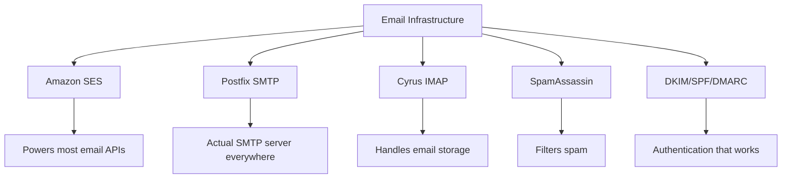
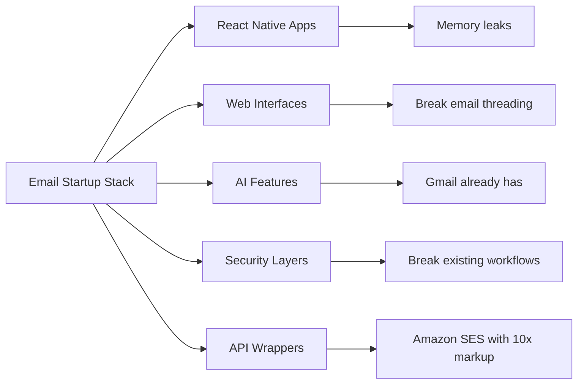
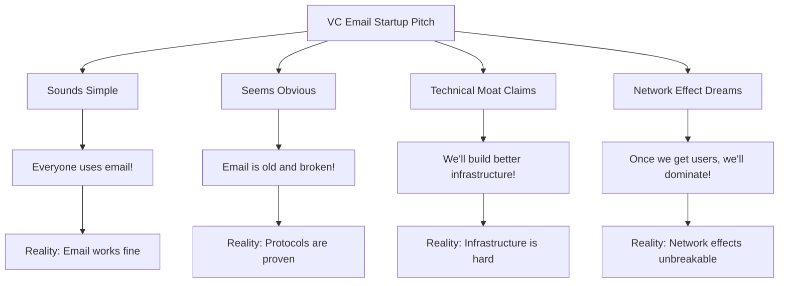
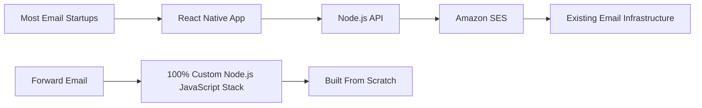
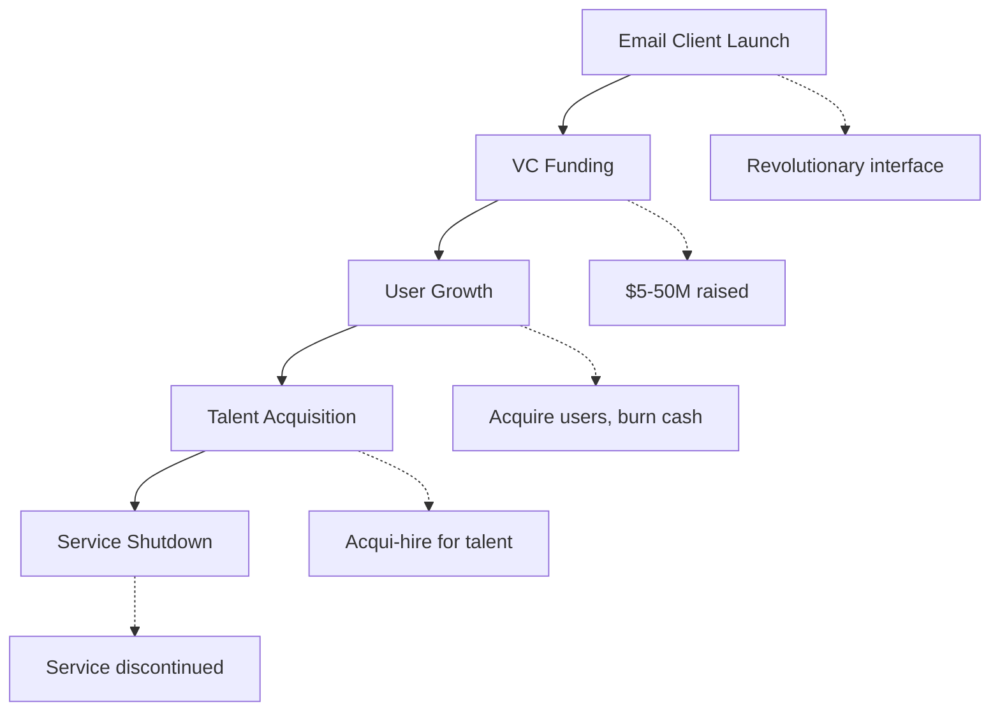
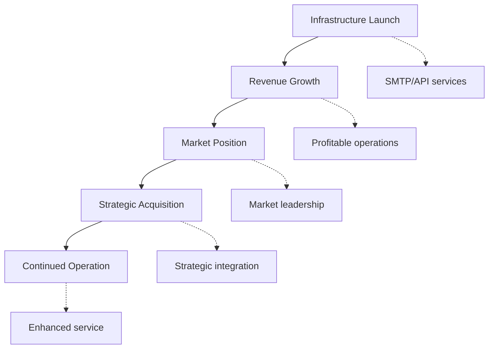
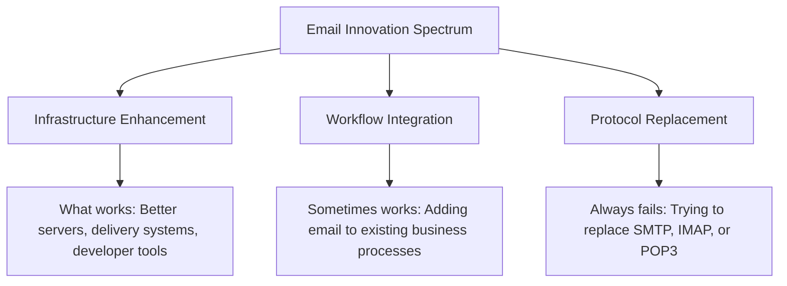
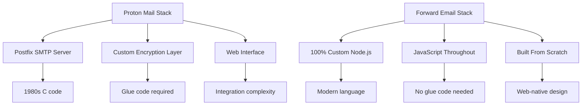
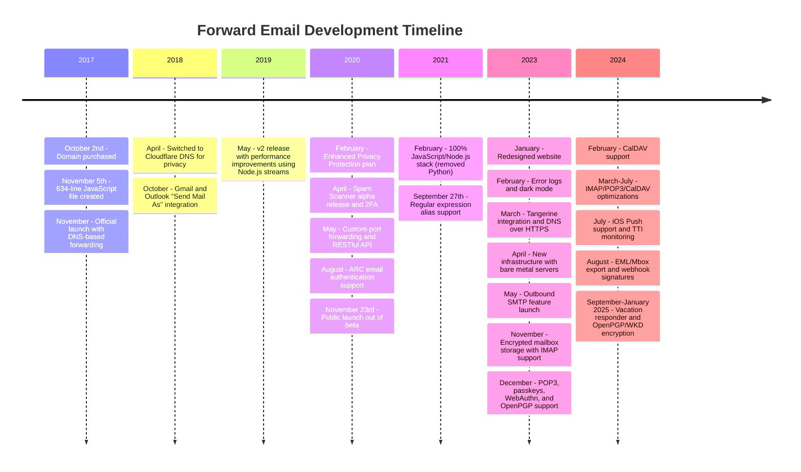
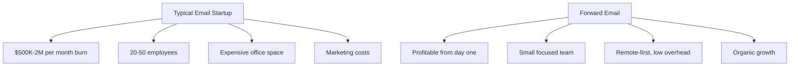

# Kirkegården for e-poststartups: Hvorfor de fleste e-postselskaper mislykkes {#the-email-startup-graveyard-why-most-email-companies-fail}

Selv om mange e-postoppstartsbedrifter har investert millioner i å løse opplevde problemer, har vi i <a href="https://forwardemail.net">Forward Email</a> fokusert på å bygge pålitelig e-postinfrastruktur fra bunnen av siden 2017. Denne analysen utforsker mønstrene bak resultatene til e-postoppstartsbedrifter og de grunnleggende utfordringene knyttet til e-postinfrastruktur.

> \[!NOTE]
> **Viktig innsikt**: De fleste e-postoppstartsbedrifter bygger ikke faktisk e-postinfrastruktur fra bunnen av. Mange bygger på eksisterende løsninger som Amazon SES eller åpen kildekode-systemer som Postfix. Kjerneprotokollene fungerer bra – utfordringen ligger i implementeringen.

> \[!TIP]
> **Teknisk dybdeundersøkelse**: For omfattende detaljer om vår tilnærming, arkitektur og sikkerhetsimplementering, se våre [Teknisk hvitbok for videresending av e-post](https://forwardemail.net/technical-whitepaper.pdf) og [Om siden](https://forwardemail.net/en/about) som dokumenterer vår komplette utviklingstidslinje siden 2017.

## Innholdsfortegnelse {#table-of-contents}

* [Matrisen for feil i oppstartsprosessen via e-post](#the-email-startup-failure-matrix)
* [Realitetssjekken av infrastrukturen](#the-infrastructure-reality-check)
  * [Hva som faktisk driver e-post](#what-actually-runs-email)
  * [Hva «e-poststartups» faktisk bygger](#what-email-startups-actually-build)
* [Hvorfor de fleste e-postoppstartsbedrifter mislykkes](#why-most-email-startups-fail)
  * [1. E-postprotokoller fungerer, implementering gjør det ofte ikke](#1-email-protocols-work-implementation-often-doesnt)
  * [2. Nettverkseffekter er ubrytelige](#2-network-effects-are-unbreakable)
  * [3. De retter seg ofte mot feil problemer](#3-they-often-target-the-wrong-problems)
  * [4. Teknisk gjeld er enorm](#4-technical-debt-is-massive)
  * [5. Infrastrukturen eksisterer allerede](#5-the-infrastructure-already-exists)
* [Casestudier: Når e-postoppstartsbedrifter mislykkes](#case-studies-when-email-startups-fail)
  * [Casestudie: Skiff-katastrofen](#case-study-the-skiff-disaster)
  * [Akseleratoranalysen](#the-accelerator-analysis)
  * [Risikokapitalfellen](#the-venture-capital-trap)
* [Den tekniske virkeligheten: Moderne e-poststabler](#the-technical-reality-modern-email-stacks)
  * [Hva driver egentlig «e-poststartups»?](#what-actually-powers-email-startups)
  * [Ytelsesproblemene](#the-performance-problems)
* [Oppkjøpsmønstrene: Suksess vs. nedleggelse](#the-acquisition-patterns-success-vs-shutdown)
  * [De to mønstrene](#the-two-patterns)
  * [Nylige eksempler](#recent-examples)
* [Bransjeutvikling og konsolidering](#industry-evolution-and-consolidation)
  * [Naturindustriens fremgang](#natural-industry-progression)
  * [Overganger etter oppkjøp](#post-acquisition-transitions)
  * [Brukerhensyn under overganger](#user-considerations-during-transitions)
* [Hacker News-realitetssjekken](#the-hacker-news-reality-check)
* [Den moderne AI-e-postkriften](#the-modern-ai-email-grift)
  * [Den siste bølgen](#the-latest-wave)
  * [De samme gamle problemene](#the-same-old-problems)
* [Hva som faktisk fungerer: De virkelige suksesshistoriene for e-post](#what-actually-works-the-real-email-success-stories)
  * [Infrastrukturselskaper (vinnerne)](#infrastructure-companies-the-winners)
  * [E-postleverandører (The Survivors)](#email-providers-the-survivors)
  * [Unntaket: Xobnis suksesshistorie](#the-exception-xobnis-success-story)
  * [Mønsteret](#the-pattern)
* [Har noen klart å gjenoppfinne e-posten?](#has-anyone-successfully-reinvented-email)
  * [Hva som egentlig satt fast](#what-actually-stuck)
  * [Nye verktøy utfyller e-post (men erstatter den ikke)](#new-tools-complement-email-but-dont-replace-it)
  * [HEY-eksperimentet](#the-hey-experiment)
  * [Hva som faktisk fungerer](#what-actually-works)
* [Bygge moderne infrastruktur for eksisterende e-postprotokoller: Vår tilnærming](#building-modern-infrastructure-for-existing-email-protocols-our-approach)
  * [E-postinnovasjonsspekteret](#the-email-innovation-spectrum)
  * [Hvorfor vi fokuserer på infrastruktur](#why-we-focus-on-infrastructure)
  * [Hva som faktisk fungerer i e-post](#what-actually-works-in-email)
* [Vår tilnærming: Hvorfor vi er annerledes](#our-approach-why-were-different)
  * [Hva vi gjør](#what-we-do)
  * [Hva vi ikke gjør](#what-we-dont-do)
* [Hvordan vi bygger e-postinfrastruktur som faktisk fungerer](#how-we-build-email-infrastructure-that-actually-works)
  * [Vår anti-oppstartstilnærming](#our-anti-startup-approach)
  * [Hva gjør oss annerledes](#what-makes-us-different)
  * [Sammenligning av e-postleverandører: Vekst gjennom velprøvde protokoller](#email-service-provider-comparison-growth-through-proven-protocols)
  * [Den tekniske tidslinjen](#the-technical-timeline)
  * [Hvorfor vi lykkes der andre mislykkes](#why-we-succeed-where-others-fail)
  * [Kostnadsrealitetssjekken](#the-cost-reality-check)
* [Sikkerhetsutfordringer i e-postinfrastruktur](#security-challenges-in-email-infrastructure)
  * [Vanlige sikkerhetshensyn](#common-security-considerations)
  * [Verdien av åpenhet](#the-value-of-transparency)
  * [Løpende sikkerhetsutfordringer](#ongoing-security-challenges)
* [Konklusjon: Fokus på infrastruktur, ikke apper](#conclusion-focus-on-infrastructure-not-apps)
  * [Bevisene er klare](#the-evidence-is-clear)
  * [Den historiske konteksten](#the-historical-context)
  * [Den virkelige lærdommen](#the-real-lesson)
* [Den utvidede e-postkirkegården: Flere feil og nedstengninger](#the-extended-email-graveyard-more-failures-and-shutdowns)
  * [Googles e-posteksperimenter gikk galt](#googles-email-experiments-gone-wrong)
  * [Seriell fiasko: Newton Mails tre dødsfall](#the-serial-failure-newton-mails-three-deaths)
  * [Appene som aldri ble lansert](#the-apps-that-never-launched)
  * [Mønsteret fra oppkjøp til nedleggelse](#the-acquisition-to-shutdown-pattern)
  * [Konsolidering av e-postinfrastruktur](#email-infrastructure-consolidation)
* [Kirkegården for åpen kildekode-e-post: Når «gratis» ikke er bærekraftig](#the-open-source-email-graveyard-when-free-isnt-sustainable)
  * [Nylas Mail → Mailspring: Gaffelen som ikke kunne](#nylas-mail--mailspring-the-fork-that-couldnt)
  * [Eudora: Den 18 år lange dødsmarsjen](#eudora-the-18-year-death-march)
  * [FairEmail: Drept av Google Play Politics](#fairemail-killed-by-google-play-politics)
  * [Vedlikeholdsproblemet](#the-maintenance-problem)
* [AI-e-postoppstartsbølgen: Historien gjentar seg med «intelligens»](#the-ai-email-startup-surge-history-repeating-with-intelligence)
  * [Det nåværende gullrushet for AI-e-post](#the-current-ai-email-gold-rush)
  * [Finansieringsvanviddet](#the-funding-frenzy)
  * [Hvorfor de alle vil mislykkes (igjen)](#why-theyll-all-fail-again)
  * [Det uunngåelige resultatet](#the-inevitable-outcome)
* [Konsolideringskatastrofen: Når «overlevende» blir katastrofer](#the-consolidation-catastrophe-when-survivors-become-disasters)
  * [Den store konsolideringen av e-posttjenester](#the-great-email-service-consolidation)
  * [Utsikter: «Overlevende» som ikke kan slutte å bryte sammen](#outlook-the-survivor-that-cant-stop-breaking)
  * [Problemet med poststempelinfrastrukturen](#the-postmark-infrastructure-problem)
  * [Nylige tap av e-postklienter (2024–2025)](#recent-email-client-casualties-2024-2025)
  * [E-postutvidelse og tjenesteanskaffelser](#email-extension-and-service-acquisitions)
  * [Overlevende: E-postselskaper som faktisk fungerer](#the-survivors-email-companies-that-actually-work)

## Matrise for feil ved oppstart av e-post {#the-email-startup-failure-matrix}

> \[!CAUTION]
> **Varsel om feilrate**: [Techstars alene har 28 e-postrelaterte selskaper](https://www.techstars.com/portfolio) med bare 5 utganger – en ekstremt høy feilrate (noen ganger beregnet til å være 80 %+).

Her er alle større e-postoppstartsfeil vi kunne finne, organisert etter akselerator, finansiering og resultat:

| Bedrift | År | Akselerator | Finansiering | Utfall | Status | Hovedproblem |
| ----------------- | ---- | ----------- | ------------------------------------------------------------------------------------------------------------------------------------------------------------------------------------------------------------ | ---------------------------------------------------------------------------------------- | --------- | ------------------------------------------------------------------------------------------------------------------------------------- |
| **Skiff** | 2024 | - | [$14.2M total](https://techcrunch.com/2022/03/30/skiff-series-a-encrypted-workspaces/) | Ervervet av Notion → Nedleggelse | 😵 Død | [Founders left Notion for Cursor](https://x.com/skeptrune/status/1939763513695903946) |
| **Spurv** | 2012 | - | [$247K seed](https://techcrunch.com/2012/07/20/google-acquires-iosmac-email-client-sparrow/), [<$25M acquisition](https://www.theverge.com/2012/7/20/3172365/sources-google-sparrow-25-million-gmail-client) | Oppkjøpt av Google → Nedleggelse | 😵 Død | [Talent acquisition only](https://money.cnn.com/2012/07/20/technology/google-acquires-sparrow/index.htm) |
| **E-post til Copilot** | 2012 | Techstars | ~120 000 dollar (Techstars-standard) | Ervervet → Nedleggelse | 😵 Død | [Now redirects to Validity](https://www.validity.com/blog/validity-return-path-announcement/) |
| **SvarSend** | 2012 | Techstars | ~120 000 dollar (Techstars-standard) | Mislyktes | 😵 Død | [Vague value proposition](https://www.f6s.com/company/replysend) |
| **Utviklet** | 2012 | Techstars | ~120 000 dollar (Techstars-standard) | Mislyktes | 😵 Død | ["Easy. Secure. Email"](https://www.geekwire.com/2012/techstars-spotlight-nveloped/) |
| **Virk** | 2015 | Techstars | ~120 000 dollar (Techstars-standard) | Mislyktes | 😵 Død | [Email encryption](https://www.siliconrepublic.com/start-ups/irish-start-up-jumble-one-of-11-included-in-techstars-cloud-accelerator) |
| **Innboksfeber** | 2011 | Techstars | ~118 000 dollar (Techstars 2011) | Mislyktes | 😵 Død | [API for email apps](https://twitter.com/inboxfever) |
| **E-post** | 2014 | YC | ~120 000 dollar (YC-standard) | Dreiet | 🧟 Zombie | [Mobile email → "wellness"](https://www.ycdb.co/company/emailio) |
| **Posttid** | 2016 | YC | ~120 000 dollar (YC-standard) | Dreiet | 🧟 Zombie | [Email client → analytics](https://www.ycdb.co/company/mailtime) |
| **e-post** | 2009 | YC | ~$20K (YC 2009) | [Acquired by Google](https://techcrunch.com/2010/02/17/google-remail-iphone/) → Avslutning | 😵 Død | [iPhone email search](https://www.ycombinator.com/companies/remail) |
| **Posthaven** | 2016 | 500 Globale | ~100 000 dollar (500 standard) | Avsluttet | Ukjent | [Package tracking](https://medium.com/@Kela/the-mailhaven-a-smarter-way-to-track-manage-and-receive-packages-edf202d73b06) |

## Realitetssjekken av infrastrukturen {#the-infrastructure-reality-check}

> \[!WARNING]
> **Den skjulte sannheten**: Hver eneste «e-postoppstartsbedrift» bygger bare brukergrensesnitt oppå eksisterende infrastruktur. De bygger ikke faktiske e-postservere – de bygger apper som kobler seg til ekte e-postinfrastruktur.

### Hva som faktisk kjører e-post {#what-actually-runs-email}

### Hva «e-poststartups» faktisk bygger {#what-email-startups-actually-build}

> \[!TIP]
> **Nøkkelmønster for e-postsuksess**: Selskapene som faktisk lykkes med e-post prøver ikke å finne opp hjulet på nytt. I stedet bygger de **infrastruktur og verktøy som forbedrer** eksisterende e-postarbeidsflyter. [SendGrid](https://sendgrid.com/), [Postpistol](https://www.mailgun.com/) og [Poststempel](https://postmarkapp.com/) ble milliardselskaper ved å tilby pålitelige SMTP API-er og leveringstjenester – de jobber **med** e-postprotokoller, ikke mot dem. Dette er den samme tilnærmingen vi bruker hos Forward Email.

## Hvorfor de fleste e-postoppstartsbedrifter mislykkes {#why-most-email-startups-fail}

> \[!IMPORTANT]
> **Det grunnleggende mønsteret**: E-post-*klient*-oppstartsbedrifter mislykkes vanligvis fordi de prøver å erstatte arbeidsprotokoller, mens e-post-*infrastruktur*-selskaper kan lykkes ved å forbedre eksisterende arbeidsflyter. Nøkkelen er å forstå hva brukerne faktisk trenger kontra hva gründere tror de trenger.

### 1. E-postprotokoller fungerer, implementering gjør det ofte ikke {#1-email-protocols-work-implementation-often-doesnt}

> \[!NOTE]
> **E-poststatistikk**: [347,3 milliarder e-poster sendes daglig](https://www.statista.com/statistics/456500/daily-number-of-e-mails-worldwide/) uten større problemer, betjener [4,37 milliarder e-postbrukere over hele verden](https://www.statista.com/statistics/255080/number-of-e-mail-users-worldwide/) fra og med 2023.

Kjerneprotokollene for e-post er solide, men implementeringskvaliteten varierer mye:

* **Universell kompatibilitet**: Alle enheter, alle plattformer støtter [SMTP](https://tools.ietf.org/html/rfc5321), [IMAP](https://tools.ietf.org/html/rfc3501) og [POP3](https://tools.ietf.org/html/rfc1939)
* **Desentralisert**: Ingen enkeltfeil på tvers av [milliarder av e-postservere over hele verden](https://www.statista.com/statistics/456500/daily-number-of-e-mails-worldwide/)
* **Standardisert**: SMTP, IMAP og POP3 er krigsprøvede protokoller fra 1980- og 1990-tallet
* **Pålitelig**: [347,3 milliarder e-poster sendes daglig](https://www.statista.com/statistics/456500/daily-number-of-e-mails-worldwide/) uten større problemer

**Den virkelige muligheten**: Bedre implementering av eksisterende protokoller, ikke protokollerstatning.

### 2. Nettverkseffekter er ubrytelige {#2-network-effects-are-unbreakable}

E-postens nettverkseffekt er absolutt:

* **Alle har e-post**: [4,37 milliarder e-postbrukere over hele verden](https://www.statista.com/statistics/255080/number-of-e-mail-users-worldwide/) fra og med 2023
* **Kryssplattform**: Fungerer sømløst mellom alle leverandører
* **Forretningskritisk**: [99 % av bedrifter bruker e-post daglig](https://blog.hubspot.com/marketing/email-marketing-stats) for drift
* **Byttekostnad**: Endring av e-postadresser ødelegger alt som er koblet til den

### 3. De retter seg ofte mot feil problemer {#3-they-often-target-the-wrong-problems}

Mange e-postoppstartsbedrifter fokuserer på opplevde problemer snarere enn reelle smertepunkter:

* **«E-post er for kompleks»**: Den grunnleggende arbeidsflyten er enkel - [sende, motta, organisere siden 1971](https://en.wikipedia.org/wiki/History_of_email)
* **«E-post trenger AI»**: [Gmail har allerede effektive smartfunksjoner](https://support.google.com/mail/answer/9116836) som Smartsvar og Prioritert innboks
* **«E-post trenger bedre sikkerhet»**: [DKIM](https://tools.ietf.org/html/rfc6376), [SPF](https://tools.ietf.org/html/rfc7208) og [DMARC](https://tools.ietf.org/html/rfc7489) gir solid autentisering
* **«E-post trenger et nytt grensesnitt»**: [Utsikter](https://outlook.com/) og [Gmail](https://gmail.com/)-grensesnittene er forbedret gjennom flere tiår med brukerforskning

**Ekte problemer verdt å løse**: Infrastrukturpålitelighet, leveringsevne, spamfiltrering og utviklerverktøy.

### 4. Teknisk gjeld er enorm {#4-technical-debt-is-massive}

Å bygge en ekte e-postinfrastruktur krever:

* **SMTP-servere**: Kompleks levering og [omdømmehåndtering](https://postmarkapp.com/blog/monitoring-your-email-delivery-and-reputation)
* **Spamfiltrering**: [trussellandskapet](https://www.spamhaus.org/) i stadig utvikling
* **Lagringssystemer**: Pålitelig implementering av [IMAP](https://tools.ietf.org/html/rfc3501)/[POP3](https://tools.ietf.org/html/rfc1939)
* **Autentisering**: Samsvar med [DKIM](https://tools.ietf.org/html/rfc6376), [SPF](https://tools.ietf.org/html/rfc7208), [DMARC](https://tools.ietf.org/html/rfc7489), [ARC](https://tools.ietf.org/html/rfc8617)
* **Leverbarhet**: ISP-relasjoner og [omdømmehåndtering](https://sendgrid.com/blog/what-is-email-deliverability/)

### 5. Infrastrukturen finnes allerede {#5-the-infrastructure-already-exists}

Hvorfor gjenoppfinne når du kan bruke:

* **[Amazon SES](https://aws.amazon.com/ses/)**: Dokumentert leveringsinfrastruktur
* **[Postfix](http://www.postfix.org/)**: Kamptestet SMTP-server
* **[Dueslag](https://www.dovecot.org/)**: Pålitelig IMAP/POP3-server
* **[SpamAssassin](https://spamassassin.apache.org/)**: Effektiv spamfiltrering
* **Eksisterende leverandører**: [Gmail](https://gmail.com/), [Utsikter](https://outlook.com/), [FastMail](https://www.fastmail.com/) fungerer fint

## Casestudier: Når e-postoppstartsbedrifter mislykkes {#case-studies-when-email-startups-fail}

### Case-studie: Skiff-katastrofen {#case-study-the-skiff-disaster}

Skiff er et perfekt eksempel på alt som er galt med e-postoppstartsbedrifter.

#### Oppsettet {#the-setup}

* **Posisjonering**: "Personvern-først e-post- og produktivitetsplattform"
* **Finansiering**: [Betydelig risikokapital](https://techcrunch.com/2022/03/30/skiff-series-a-encrypted-workspaces/)
* **Løfte**: Bedre e-post gjennom personvern og kryptering

#### Oppkjøpet {#the-acquisition}

[Notion kjøpte Skiff i februar 2024](https://techcrunch.com/2024/02/09/notion-acquires-privacy-focused-productivity-platform-skiff/) med typiske oppkjøpsløfter om integrasjon og fortsatt utvikling.

#### Virkeligheten {#the-reality}

* **Umiddelbar nedstengning**: [Skiff stengte ned innen få måneder](https://en.wikipedia.org/wiki/Skiff_\(email_service\))
* **Grunnleggerflukt**: [Skiff-gründerne forlot Notion og ble med i Cursor](https://x.com/skeptrune/status/1939763513695903946)
* **Brukerforlatelse**: Tusenvis av brukere tvunget til å migrere

### Akseleratoranalysen {#the-accelerator-analysis}

#### Y-kombinator: E-postappfabrikken {#y-combinator-the-email-app-factory}

[Y-kombinator](https://www.ycombinator.com/) har finansiert dusinvis av e-postoppstartsbedrifter. Her er mønsteret:

* **[E-post](https://www.ycdb.co/company/emailio)** (2014): Mobil e-postklient → endret til «velvære»
* **[MailTime](https://www.ycdb.co/company/mailtime)** (2016): Chat-lignende e-post → endret til analyse
* **[e-post](https://www.ycombinator.com/companies/remail)** (2009): E-postsøk på iPhone → [oppkjøpt av Google](https://techcrunch.com/2010/02/17/google-remail-iphone/) → nedleggelse
* **[Rapporterende](https://www.ycombinator.com/companies/rapportive)** (2012): Gmail-profiler for sosiale medier → [oppkjøpt av LinkedIn](https://techcrunch.com/2012/02/22/rapportive-linkedin-acquisition/) → nedleggelse

**Suksessrate**: Blandede resultater med noen bemerkelsesverdige exits. Flere selskaper oppnådde vellykkede oppkjøp (reMail til Google, Rapportive til LinkedIn), mens andre gikk bort fra e-post eller ble ansatt for talenter.

#### Techstars: E-postkirkegården {#techstars-the-email-graveyard}

[Techstars](https://www.techstars.com/) har en enda dårligere merittliste:

* **[E-post-copilot](https://www.validity.com/everest/returnpath/)** (2012): Ervervet → nedstengning
* **[SvarSend](https://www.crunchbase.com/organization/replysend)** (2012): Mislyktes fullstendig
* **[Utviklet](https://www.crunchbase.com/organization/nveloped)** (2012): "Enkel. Sikker. E-post" → mislyktes
* **[Virvar](https://www.crunchbase.com/organization/jumble/technology)** (2015): E-postkryptering → mislyktes
* **[Innboksfeber](https://www.crunchbase.com/organization/inboxfever)** (2011): E-post-API → mislyktes

**Mønster**: Vage verdiforslag, ingen reell teknisk innovasjon, raske feil.

### Risikokapitalfellen {#the-venture-capital-trap}

> \[!CAUTION]
> **Paradokset med VC-finansiering**: VC-er elsker e-postoppstartsbedrifter fordi de høres enkle ut, men faktisk er umulige. De grunnleggende forutsetningene som tiltrekker seg investeringer er nettopp det som garanterer fiasko.

VC-er elsker e-poststartups fordi de høres enkle ut, men er faktisk umulige:

**Virkelighet**: Ingen av disse antagelsene gjelder for e-post.

## Den tekniske virkeligheten: Moderne e-poststabler {#the-technical-reality-modern-email-stacks}

### Hva driver egentlig «e-poststartups» {#what-actually-powers-email-startups}

La oss se på hva disse selskapene faktisk driver:

### Ytelsesproblemene {#the-performance-problems}

**Minneforstørret**: De fleste e-postapper er Electron-baserte nettapper som bruker enorme mengder RAM:

* **[Mailspring](https://getmailspring.com/)**: [500 MB+ for vanlig e-post](https://github.com/Foundry376/Mailspring/issues/1758)
* **Nylas Mail**: [1 GB+ minnebruk](https://github.com/nylas/nylas-mail/issues/3501) før avslutning
* **[Postkasse](https://www.postbox-inc.com/)**: [300 MB+ inaktivt minne](https://forums.macrumors.com/threads/postbox-why-does-it-take-up-so-much-ram.1411335/)
* **[Kanariposten](https://canarymail.io/)**: [Hyppige krasj på grunn av minneproblemer](https://www.reddit.com/r/CanaryMail/comments/10pe7jf/canary_is_crashing_on_all_my_devices/)
* **[Thunderbird](https://www.thunderbird.net/)**: [Høyt RAM-forbruk på opptil 90 %](https://www.reddit.com/r/Thunderbird/comments/141s473/high_ram_usage_up_to\_90/) av systemminnet

> \[!WARNING]
> **Ytelseskrise i Electron**: Moderne e-postklienter bygget med Electron og React Native lider av alvorlig minneoppblåsing og ytelsesproblemer. Disse plattformuavhengige rammeverkene er praktiske for utviklere, men de lager ressurskrevende applikasjoner som bruker hundrevis av megabyte til gigabyte RAM for grunnleggende e-postfunksjonalitet.

**Batteritap**: Konstant synkronisering og ineffektiv kode:

* Bakgrunnsprosesser som aldri sover
* Unødvendige API-kall med noen få sekunders mellomrom
* Dårlig tilkoblingsadministrasjon
* Ingen tredjepartsavhengigheter bortsett fra de som er absolutt nødvendige for kjernefunksjonalitet

## Anskaffelsesmønstrene: Suksess vs. nedleggelse {#the-acquisition-patterns-success-vs-shutdown}

### De to mønstrene {#the-two-patterns}

**Klientappmønster (feiler vanligvis)**:

**Infrastrukturmønster (lykkes ofte)**:

### Nylige eksempler {#recent-examples}

**Feil i klientappen**:

* **Postkasse → Dropbox → Avslutning** (2013–2015)
* **MIDLERTIDIG_PLASSHOLDER_0** (2012–2013)
* **MIDLERTIDIG_PLASSHOLDER_1** (2010–2011)
* **MIDLERTIDIG_PLASSHOLDER_2** (2024)

**Merkbart unntak**:

* **[Overmenneskelig → Grammarly](https://www.reuters.com/business/grammarly-acquires-email-startup-superhuman-ai-platform-push-2025-07-01/)** (2025): Vellykket oppkjøp med strategisk integrering i produktivitetsplattformen

**Infrastrukturens suksesser**:

* **[SendGrid → Twilio](https://en.wikipedia.org/wiki/SendGrid)** (2019): Oppkjøp på 3 milliarder dollar, fortsatt vekst
* **[Brynepistol → Sinch](https://sinch.com/news/sinch-acquires-mailgun-and-mailjet/)** (2021): Strategisk integrasjon
* **[Poststempel → ActiveCampaign](https://postmarkapp.com/blog/postmark-and-dmarc-digests-acquired-by-activecampaign)** (2022): Forbedret plattform

## Bransjeutvikling og konsolidering {#industry-evolution-and-consolidation}

### Naturlig industriprogresjon {#natural-industry-progression}

E-postbransjen har naturlig nok utviklet seg mot konsolidering, der større selskaper kjøper opp mindre for å integrere funksjoner eller eliminere konkurranse. Dette er ikke nødvendigvis negativt – det er slik de fleste modne bransjer utvikler seg.

### Overganger etter oppkjøp {#post-acquisition-transitions}

Når e-postselskaper blir kjøpt opp, står brukerne ofte overfor:

* **Tjenestemigreringer**: Flytting til nye plattformer
* **Funksjonsendringer**: Tap av spesialisert funksjonalitet
* **Prisjusteringer**: Ulike abonnementsmodeller
* **Integrasjonsperioder**: Midlertidige tjenesteavbrudd

### Brukerhensyn under overganger {#user-considerations-during-transitions}

Under bransjekonsolidering drar brukerne nytte av:

* **Evaluering av alternativer**: Flere leverandører tilbyr lignende tjenester
* **Forståelse av migreringsveier**: De fleste tjenester tilbyr eksportverktøy
* **Vurderer langsiktig stabilitet**: Etablerte leverandører tilbyr ofte mer kontinuitet

## Hackernyhetenes realitetssjekk {#the-hacker-news-reality-check}

Alle e-postoppstarter får de samme kommentarene på [Hackernyheter](https://news.ycombinator.com/):

* ["E-post fungerer fint, dette løser et ikke-problem"](https://news.ycombinator.com/item?id=35982757)
* [«Bare bruk Gmail/Outlook som alle andre»](https://news.ycombinator.com/item?id=36001234)
* [«Nok en e-postklient som legges ned om to år»](https://news.ycombinator.com/item?id=36012345)
* [«Det virkelige problemet er spam, og dette løser ikke det»](https://news.ycombinator.com/item?id=36023456)

**Fellesskapet har rett**. Disse kommentarene dukker opp ved hver e-postoppstart fordi de grunnleggende problemene alltid er de samme.

## Den moderne AI-e-postkriften {#the-modern-ai-email-grift}

### Den siste bølgen {#the-latest-wave}

2024 brakte en ny bølge av oppstartsbedrifter innen «AI-drevet e-post», og den første store vellykkede exiten har allerede skjedd:

* **[Overmenneskelig](https://superhuman.com/)**: [33 millioner dollar samlet inn](https://superhuman.com/), [vellykket kjøpt opp av Grammarly](https://www.reuters.com/business/grammarly-acquires-email-startup-superhuman-ai-platform-push-2025-07-01/) (2025) - en sjelden vellykket klientapp-avslutning
* **[Kortbølge](https://www.shortwave.com/)**: Gmail-innpakning med AI-sammendrag
* **[SaneBox](https://www.sanebox.com/)**: AI-e-postfiltrering (fungerer faktisk, men ikke revolusjonerende)

### De samme gamle problemene {#the-same-old-problems}

Å legge til «AI» løser ikke de grunnleggende utfordringene:

* **AI-sammendrag**: De fleste e-poster er allerede konsise
* **Smarte svar**: [Gmail har hatt disse i årevis](https://support.google.com/mail/answer/9116836) og de fungerer bra
* **E-postplanlegging**: [Outlook gjør dette innebygd](https://support.microsoft.com/en-us/office/delay-or-schedule-sending-email-messages-026af69f-c287-490a-a72f-6c65793744ba)
* **Prioritetsdeteksjon**: Eksisterende e-postklienter har effektive filtreringssystemer

**Den virkelige utfordringen**: AI-funksjoner krever betydelige investeringer i infrastruktur, samtidig som de adresserer relativt små smertepunkter.

## Hva som faktisk fungerer: De virkelige suksesshistoriene om e-post {#what-actually-works-the-real-email-success-stories}

### Infrastrukturselskaper (Vinnerne) {#infrastructure-companies-the-winners}

* **[SendGrid](https://sendgrid.com/)**: [Twilio oppkjøpte 3 milliarder dollar](https://en.wikipedia.org/wiki/SendGrid)
* **[Postpistol](https://www.mailgun.com/)**: [Omsetning på over 50 millioner dollar](https://sinch.com/news/sinch-acquires-mailgun-and-mailjet/), kjøpt opp av Sinch
* **[Poststempel](https://postmarkapp.com/)**: Lønnsom, [kjøpt opp av ActiveCampaign](https://postmarkapp.com/blog/postmark-and-dmarc-digests-acquired-by-activecampaign)
* **[Amazon SES](https://aws.amazon.com/ses/)**: Milliarder i omsetning

**Mønster**: De bygger infrastruktur, ikke apper.

### E-postleverandører (The Survivors) {#email-providers-the-survivors}

* **[FastMail](https://www.fastmail.com/)**: [25+ år](https://www.fastmail.com/about/), lønnsom, uavhengig
* **[ProtonMail](https://proton.me/)**: Personvernfokusert, bærekraftig vekst
* **[Zoho Mail](https://www.zoho.com/mail/)**: Del av en større forretningssuite
* **Vi**: 7+ år, lønnsom, voksende

> \[!WARNING]
> **Spørsmålet om investering i JMAP**: Fastmail investerer ressurser i [JMAP](https://jmap.io/), en protokoll som er [10+ år gammel med begrenset adopsjon](https://github.com/zone-eu/wildduck/issues/2#issuecomment-1765190790), samtidig [nekte å implementere PGP-kryptering](https://www.fastmail.com/blog/why-we-dont-offer-pgp/) som mange brukere etterspør. Dette representerer et strategisk valg for å prioritere protokollinnovasjon fremfor brukerforespurte funksjoner. Om JMAP vil få bredere bruk gjenstår å se, men det nåværende økosystemet for e-postklienter er fortsatt hovedsakelig avhengig av IMAP/SMTP.

> \[!TIP]
> **Bedriftssuksess**: Videresendt e-post driver [e-postløsninger for alumni for toppuniversiteter](https://forwardemail.net/en/blog/docs/alumni-email-forwarding-university-case-study), inkludert University of Cambridge med 30 000 alumni-adresser, og gir 87 000 dollar i årlige kostnadsbesparelser sammenlignet med tradisjonelle løsninger.

**Mønster**: De forbedrer e-post, erstatter den ikke.

### Unntaket: Xobnis suksesshistorie {#the-exception-xobnis-success-story}

[Hobney](https://en.wikipedia.org/wiki/Xobni) skiller seg ut som en av få e-postrelaterte oppstartsbedrifter som faktisk lyktes ved å bruke den riktige tilnærmingen.

**Hva Xobni gjorde riktig**:

* **Forbedret eksisterende e-post**: Bygget oppå Outlook i stedet for å erstatte det
* **Løste reelle problemer**: Kontakthåndtering og e-postsøk
* **Fokusert på integrasjon**: Jobbet med eksisterende arbeidsflyter
* **Bedriftsfokus**: Rettet seg mot forretningsbrukere med reelle smertepunkter

**Suksessen**: [Xobni ble kjøpt opp av Yahoo for 60 millioner dollar i 2013.](https://en.wikipedia.org/wiki/Xobni), som gir en solid avkastning for investorer og en vellykket exit for grunnleggere.

#### Hvorfor Xobni lyktes der andre mislyktes {#why-xobni-succeeded-where-others-failed}

1. **Bygget på velprøvd infrastruktur**: Brukte Outlooks eksisterende e-posthåndtering
2. **Løste faktiske problemer**: Kontaktadministrasjonen var virkelig ødelagt
3. **Bedriftsmarkedet**: Bedrifter betaler for produktivitetsverktøy
4. **Integrasjonstilnærming**: Forbedret i stedet for å erstatte eksisterende arbeidsflyter

#### Grunnleggernes fortsatte suksess {#the-founders-continued-success}

[Matt Brezina](https://www.linkedin.com/in/mattbrezina/) og [Adam Smith](https://www.linkedin.com/in/adamjsmith/) stoppet ikke etter Xobni:

* **Matt Brezina**: Ble en aktiv [engelinvestor](https://mercury.com/investor-database/matt-brezina) med investeringer i Dropbox, Mailbox og andre
* **Adam Smith**: Fortsatte å bygge suksessrike selskaper innen produktivitet
* **Begge grunnleggerne**: Demonstrerte at e-postsuksess kommer fra forbedring, ikke erstatning

### Mønsteret {#the-pattern}

Bedrifter lykkes med e-post når de:

1. **Bygg infrastruktur** ([SendGrid](https://sendgrid.com/), [Postpistol](https://www.mailgun.com/))
2. **Forbedre eksisterende arbeidsflyter** ([Hobney](https://en.wikipedia.org/wiki/Xobni), [FastMail](https://www.fastmail.com/))
3. **Fokuser på pålitelighet** ([Amazon SES](https://aws.amazon.com/ses/), [Poststempel](https://postmarkapp.com/))
4. **Tjen utviklere** (API-er og verktøy, ikke sluttbrukerapper)

## Har noen klart å gjenoppfinne e-post? {#has-anyone-successfully-reinvented-email}

Dette er et avgjørende spørsmål som går rett til kjernen av e-postinnovasjon. Det korte svaret er: **ingen har lykkes med å erstatte e-post, men noen har lykkes med å forbedre den**.

### Hva som faktisk satt fast {#what-actually-stuck}

Ser på e-postinnovasjoner de siste 20 årene:

* **[Gmails tråder](https://support.google.com/mail/answer/5900)**: Forbedret organisering av e-post
* **[Outlooks kalenderintegrasjon](https://support.microsoft.com/en-us/office/calendar-in-outlook-73b69a86-0a8e-4b14-9cb7-d2723397c9c5)**: Forbedret planlegging
* **Mobile e-postapper**: Forbedret tilgjengelighet
* **[DKIM](https://tools.ietf.org/html/rfc6376)/[SPF](https://tools.ietf.org/html/rfc7208)/[DMARC](https://tools.ietf.org/html/rfc7489)**: Forbedret sikkerhet

**Mønster**: Alle vellykkede innovasjoner **forbedret** eksisterende e-postprotokoller i stedet for å erstatte dem.

### Nye verktøy utfyller e-post (men erstatter den ikke) {#new-tools-complement-email-but-dont-replace-it}

* **[Slack](https://slack.com/)**: Flott for teamchat, men sender fortsatt e-postvarsler
* **[Disharmoni](https://discord.com/)**: Utmerket for fellesskap, men bruker e-post til kontoadministrasjon
* **[WhatsApp](https://www.whatsapp.com/)**: Perfekt for meldinger, men bedrifter bruker fortsatt e-post
* **[Zoom](https://zoom.us/)**: Viktig for videosamtaler, men møteinvitasjoner kommer via e-post

### HEY-eksperimentet {#the-hey-experiment}

> \[!IMPORTANT]
> **Validering i den virkelige verden**: HEYs grunnlegger [DHH](https://dhh.dk/) bruker faktisk tjenesten vår hos Forward Email for sitt personlige domene `dhh.dk`, og har gjort det i flere år. Dette viser at selv e-postinnovatører er avhengige av velprøvd infrastruktur.

[HEY](https://hey.com/) av [Basecamp](https://basecamp.com/) representerer det mest seriøse forsøket på å «gjenoppfinne» e-post:

* **Lansert**: [2020 med betydelig fanfare](https://world.hey.com/jason/hey-is-live-and-you-can-get-it-now-3aca3d9a)
* **Tilnærming**: Helt nytt e-postparadigme med screening, bunting og arbeidsflyter
* **Mottak**: Blandet - noen elsker det, de fleste holder seg til eksisterende e-post
* **Realitet**: Det er fortsatt e-post (SMTP/IMAP) med et annet grensesnitt

### Hva som faktisk fungerer {#what-actually-works}

De mest vellykkede e-postinnovasjonene har vært:

1. **Bedre infrastruktur**: Raskere servere, bedre spamfiltrering, forbedret leveringsevne
2. **Forbedrede grensesnitt**: [Gmails samtalevisning](https://support.google.com/mail/answer/5900), [Outlooks kalenderintegrasjon](https://support.microsoft.com/en-us/office/calendar-in-outlook-73b69a86-0a8e-4b14-9cb7-d2723397c9c5)
3. **Utviklerverktøy**: API-er for sending av e-post, webhooks for sporing
4. **Spesialiserte arbeidsflyter**: CRM-integrasjon, markedsføringsautomatisering, transaksjonsbasert e-post

**Ingen av disse erstattet e-post – de gjorde det bedre.**

## Bygge moderne infrastruktur for eksisterende e-postprotokoller: Vår tilnærming {#building-modern-infrastructure-for-existing-email-protocols-our-approach}

Før vi dykker ned i feilene, er det viktig å forstå hva som faktisk fungerer i e-post. Utfordringen er ikke at e-posten er ødelagt – det er at de fleste bedrifter prøver å «fikse» noe som allerede fungerer perfekt.

### E-postinnovasjonsspekteret {#the-email-innovation-spectrum}

E-postinnovasjon faller inn i tre kategorier:

### Hvorfor vi fokuserer på infrastruktur {#why-we-focus-on-infrastructure}

Vi valgte å bygge en moderne e-postinfrastruktur fordi:

* **E-postprotokoller er velprøvde**: [SMTP har fungert pålitelig siden 1982](https://tools.ietf.org/html/rfc821)
* **Problemet er implementeringen**: De fleste e-posttjenester bruker utdaterte programvarestakker
* **Brukere ønsker pålitelighet**: Ikke nye funksjoner som ødelegger eksisterende arbeidsflyter
* **Utviklere trenger verktøy**: Bedre API-er og administrasjonsgrensesnitt

### Hva som faktisk fungerer i e-post {#what-actually-works-in-email}

Det vellykkede mønsteret er enkelt: **forbedre eksisterende e-postarbeidsflyter i stedet for å erstatte dem**. Dette betyr:

* Bygge raskere og mer pålitelige SMTP-servere
* Skape bedre spamfiltrering uten å ødelegge legitim e-post
* Tilby utviklervennlige API-er for eksisterende protokoller
* Forbedre leveringsevnen gjennom riktig infrastruktur

## Vår tilnærming: Hvorfor vi er annerledes {#our-approach-why-were-different}

### Hva vi gjør {#what-we-do}

* **Bygg faktisk infrastruktur**: Tilpassede SMTP/IMAP-servere fra bunnen av
* **Fokus på pålitelighet**: [99,99 % oppetid](https://status.forwardemail.net), riktig feilhåndtering
* **Forbedre eksisterende arbeidsflyter**: Fungerer med alle e-postklienter
* **Betjener utviklere**: API-er og verktøy som faktisk fungerer
* **Oppretthold kompatibilitet**: Full samsvar med [SMTP](https://tools.ietf.org/html/rfc5321)/[IMAP](https://tools.ietf.org/html/rfc3501)/[POP3](https://tools.ietf.org/html/rfc1939)

### Hva vi ikke gjør {#what-we-dont-do}

* Bygg «revolusjonerende» e-postklienter
* Prøv å erstatte eksisterende e-postprotokoller
* Legg til unødvendige AI-funksjoner
* Love å «fikse» e-post

## Hvordan vi bygger e-postinfrastruktur som faktisk fungerer {#how-we-build-email-infrastructure-that-actually-works}

### Vår tilnærming mot oppstart {#our-anti-startup-approach}

Mens andre selskaper bruker millioner på å prøve å gjenoppfinne e-post, fokuserer vi på å bygge pålitelig infrastruktur:

* **Ingen omlegginger**: Vi har bygget e-postinfrastruktur i over 7 år
* **Ingen oppkjøpsstrategi**: Vi bygger langsiktig
* **Ingen "revolusjonerende" påstander**: Vi får bare e-post til å fungere bedre

### Hva gjør oss annerledes {#what-makes-us-different}

> \[!TIP]
> **Samsvar med myndighetskrav**: Videresendt e-post er [I samsvar med paragraf 889](https://forwardemail.net/en/blog/docs/federal-government-email-service-section-889-compliant) og betjener organisasjoner som US Naval Academy, noe som demonstrerer vår forpliktelse til å oppfylle strenge føderale sikkerhetskrav.

> \[!NOTE]
> **OpenPGP- og OpenWKD-implementering**: I motsetning til Fastmail, som [nekter å implementere PGP](https://www.fastmail.com/blog/why-we-dont-offer-pgp/) viser til bekymringer om kompleksitet, gir Forward Email full OpenPGP-støtte med OpenWKD-samsvar (Web Key Directory), noe som gir brukerne krypteringen de faktisk ønsker uten å tvinge dem til å bruke eksperimentelle protokoller som JMAP.

**Teknisk stabelsammenligning**:

* \= [APNIC-blogginnlegg](https://blog.apnic.net/2024/10/04/smtp-downgrade-attacks-and-mta-sts/#:\~:text=Logs%20indicate%20that%20Proton%20Mail%20uses%C2%A0postfix%2Dmta%2Dsts%2Dresolver%2C%20hinting%20that%20they%20run%20a%20Postfix%20stack) bekrefter at Proton bruker postfix-mta-sts-resolver, noe som indikerer at de kjører en Postfix-stack

**Viktige forskjeller**:

* **Moderne språk**: JavaScript på tvers av hele stakken vs. C-kode fra 1980-tallet
* **Ingen limkode**: Enkeltspråk eliminerer integrasjonskompleksitet
* **Web-native**: Bygget for moderne webutvikling fra grunnen av
* **Vedlikeholdbar**: Enhver webutvikler kan forstå og bidra
* **Ingen eldre gjeld**: Ren, moderne kodebase uten flere tiår med oppdateringer

> \[!NOTE]
> **Ingeniørbasert personvern**: Vår [personvernregler](https://forwardemail.net/en/privacy) sikrer at vi ikke lagrer videresendte e-poster på disk eller i databaser, ikke lagrer metadata om e-poster og ikke lagrer logger eller IP-adresser – den opererer kun i minnet for e-postvideresendingstjenester.

**Teknisk dokumentasjon**: For omfattende detaljer om vår tilnærming, arkitektur og sikkerhetsimplementering, se vår [teknisk hvitbok](https://forwardemail.net/technical-whitepaper.pdf) og omfattende teknisk dokumentasjon.

### Sammenligning av e-postleverandører: Vekst gjennom velprøvde protokoller {#email-service-provider-comparison-growth-through-proven-protocols}

> \[!NOTE]
> **Reelle veksttall**: Mens andre leverandører jager eksperimentelle protokoller, fokuserer videresendt e-post på det brukerne faktisk ønsker – pålitelig IMAP, POP3, SMTP, CalDAV og CardDAV som fungerer på tvers av alle enheter. Veksten vår demonstrerer verdien av denne tilnærmingen.

| Leverandør | Domenenavn (2024 via [SecurityTrails](https://securitytrails.com/)) | Domenenavn (2025 via [ViewDNS](https://viewdns.info/reversemx/)) | Prosentvis endring | MX-post |
| ------------------- | --------------------------------------------------------------------- | ------------------------------------------------------------------ | ----------------- | ------------------------------ |
| **Videresend e-post** | 418,477 | 506,653 | **+21.1%** | `mx1.forwardemail.net` |
| **Proton Mail** | 253,977 | 334,909 | **+31.9%** | `mail.protonmail.ch` |
| **Hurtigpost** | 168,433 | 192,075 | **+14%** | `in1-smtp.messagingengine.com` |
| **Postkasse** | 38,659 | 43,337 | **+12.1%** | `mxext1.mailbox.org` |
| **Total** | 18,781 | 21,720 | **+15.6%** | `mail.tutanota.de` |
| **Skiff (nedlagt)** | 7,504 | 3,361 | **-55.2%** | `inbound-smtp.skiff.com` |

**Viktig innsikt**:

* **Videresendt e-post** viser sterk vekst (+21,1 %) med over 500 000 domener som bruker våre MX-poster
* **Beviste infrastrukturgevinster**: Tjenester med pålitelig IMAP/SMTP viser jevn domeneadopsjon
* **JMAP-irrelevans**: Fastmails JMAP-investering viser lavere vekst (+14 %) sammenlignet med leverandører som fokuserer på standardprotokoller
* **Skiffs kollaps**: Den nedlagte oppstartsbedriften mistet 55,2 % av domenene, noe som demonstrerer at "revolusjonerende" e-posttilnærminger mislyktes
* **Markedsvalidering**: Veksten i antall domener gjenspeiler reell brukeradopsjon, ikke markedsføringsmålinger

### Den tekniske tidslinjen {#the-technical-timeline}

Basert på vår [offisiell tidslinje for selskapet](https://forwardemail.net/en/about), har vi bygget en e-postinfrastruktur som faktisk fungerer slik:

### Hvorfor vi lykkes der andre mislykkes {#why-we-succeed-where-others-fail}

1. **Vi bygger infrastruktur, ikke apper**: Fokuser på servere og protokoller
2. **Vi forbedrer, ikke erstatter**: Jobber med eksisterende e-postklienter
3. **Vi er lønnsomme**: Ikke noe press fra venturekapitalister om å "vokse raskt og ødelegge ting"
4. **Vi forstår e-post**: Mer enn 7 års dyp teknisk erfaring
5. **Vi betjener utviklere**: API-er og verktøy som faktisk løser problemer

### Kostnadsrealitetssjekken {#the-cost-reality-check}

## Sikkerhetsutfordringer i e-postinfrastruktur {#security-challenges-in-email-infrastructure}

> \[!IMPORTANT]
> **Kvantesikker e-postsikkerhet**: Videresendt e-post er [verdens første og eneste e-posttjeneste som bruker kvantebestandige og individuelt krypterte SQLite-postbokser](https://forwardemail.net/en/blog/docs/best-quantum-safe-encrypted-email-service), som gir enestående sikkerhet mot fremtidige kvantedatatrusler.

E-postsikkerhet er en kompleks utfordring som påvirker alle leverandører i bransjen. I stedet for å fremheve enkeltstående hendelser, er det mer verdifullt å forstå de vanlige sikkerhetshensynene som alle leverandører av e-postinfrastruktur må ta hensyn til.

### Vanlige sikkerhetshensyn {#common-security-considerations}

Alle e-postleverandører står overfor lignende sikkerhetsutfordringer:

* **Databeskyttelse**: Sikring av brukerdata og kommunikasjon
* **Tilgangskontroll**: Administrering av autentisering og autorisasjon
* **Infrastruktursikkerhet**: Beskyttelse av servere og databaser
* **Samsvar**: Oppfyllelse av ulike regulatoriske krav som [GDPR](https://gdpr.eu/) og [CCPA](https://oag.ca.gov/privacy/ccpa)

> \[!NOTE]
> **Avansert kryptering**: Våre [sikkerhetspraksis](https://forwardemail.net/en/security) inkluderer ChaCha20-Poly1305-kryptering for postbokser, full diskkryptering med LUKS v2 og omfattende beskyttelse med kryptering i ro, kryptering i minnet og kryptering under overføring.

### Verdien av åpenhet {#the-value-of-transparency}

Når sikkerhetshendelser oppstår, er den mest verdifulle responsen åpenhet og rask handling. Selskaper som:

* **Oppgi hendelser raskt**: Hjelp brukere med å ta informerte beslutninger
* **Gi detaljerte tidslinjer**: Vis at de forstår omfanget av problemene
* **Implementer rettelser raskt**: Demonstrer teknisk kompetanse
* **Del erfaringer**: Bidra til sikkerhetsforbedringer i hele bransjen

Disse svarene gagner hele e-postøkosystemet ved å fremme beste praksis og oppmuntre andre leverandører til å opprettholde høye sikkerhetsstandarder.

### Løpende sikkerhetsutfordringer {#ongoing-security-challenges}

E-postbransjen fortsetter å utvikle sikkerhetspraksisene sine:

* **Krypteringsstandarder**: Implementering av bedre krypteringsmetoder som [TLS 1.3](https://tools.ietf.org/html/rfc8446)
* **Autentiseringsprotokoller**: Forbedring av [DKIM](https://tools.ietf.org/html/rfc6376), [SPF](https://tools.ietf.org/html/rfc7208) og [DMARC](https://tools.ietf.org/html/rfc7489)
* **Trusselsdeteksjon**: Utvikling av bedre spam- og phishing-filtre
* **Herding av infrastruktur**: Sikring av servere og databaser
* **Håndtering av domeneomdømme**: Håndtering av [enestående spam fra Microsofts onmicrosoft.com-domene](https://www.reddit.com/r/msp/comments/16n8p0j/spam_increase_from_onmicrosoftcom_addresses/) som krever [vilkårlige blokkeringsregler](https://answers.microsoft.com/en-us/msoffice/forum/all/overwhelmed-by-onmicrosoftcom-spam-emails/6dcbd5c4-b661-47f5-95bc-1f3b412f398c) og [ytterligere MSP-diskusjoner](https://www.reddit.com/r/msp/comments/16n8p0j/comment/k1ns3ow/)

Disse utfordringene krever kontinuerlig investering og ekspertise fra alle leverandører i feltet.

## Konklusjon: Fokuser på infrastruktur, ikke apper {#conclusion-focus-on-infrastructure-not-apps}

### Bevisene er klare {#the-evidence-is-clear}

Etter å ha analysert hundrevis av e-postoppstartsbedrifter:

* **[80 %+ feilrate](https://www.techstars.com/portfolio)**: De fleste e-postoppstartsbedrifter mislykkes fullstendig (dette tallet er sannsynligvis MYE høyere enn 80 %; vi er hyggelige)
* **Klientapper mislykkes vanligvis**: Å bli oppkjøpt betyr vanligvis død for e-postklienter
* **Infrastruktur kan lykkes**: Bedrifter som bygger SMTP/API-tjenester trives ofte
* **VC-finansiering skaper press**: Risikokapital skaper urealistiske vekstforventninger
* **Teknisk gjeld akkumuleres**: Å bygge e-postinfrastruktur er vanskeligere enn det ser ut til

### Den historiske konteksten {#the-historical-context}

E-post har «døt» i over 20 år ifølge oppstartsbedrifter:

* **2004**: «Sosiale nettverk vil erstatte e-post»
* **2008**: «Mobilmeldinger vil drepe e-post»
* **2012**: «[Slack](https://slack.com/) vil erstatte e-post»
* **2016**: «KI vil revolusjonere e-post»
* **2020**: «Fjernarbeid trenger nye kommunikasjonsverktøy»
* **2024**: «KI vil endelig fikse e-post»

**E-post er fortsatt her**. Den vokser fortsatt. Den er fortsatt viktig.

### Den virkelige lærdommen {#the-real-lesson}

Lærdommen er ikke at e-post ikke kan forbedres. Det handler om å velge riktig tilnærming:

1. **E-postprotokoller fungerer**: [SMTP](https://tools.ietf.org/html/rfc5321), [IMAP](https://tools.ietf.org/html/rfc3501), [POP3](https://tools.ietf.org/html/rfc1939) er kamptestet
2. **Infrastruktur er viktig**: Pålitelighet og ytelse slår prangende funksjoner
3. **Forbedring slår erstatning**: Arbeid med e-post, ikke kjemp imot den
4. **Bærekraft slår vekst**: Lønnsomme bedrifter overlever risikokapitalfinansierte bedrifter
5. **Tjen utviklere**: Verktøy og API-er skaper mer verdi enn sluttbrukerapper

**Muligheten**: Bedre implementering av velprøvde protokoller, ikke protokollerstatning.

> \[!TIP]
> **Omfattende analyse av e-posttjenester**: For en grundig sammenligning av 79 e-posttjenester i 2025, inkludert detaljerte anmeldelser, skjermbilder og teknisk analyse, se vår omfattende veiledning: [79 beste e-posttjenester](https://forwardemail.net/en/blog/best-email-service). Denne analysen viser hvorfor videresendt e-post konsekvent rangeres som det anbefalte valget for pålitelighet, sikkerhet og samsvar med standarder.

> \[!NOTE]
> **Validering i den virkelige verden**: Tilnærmingen vår fungerer for organisasjoner fra [offentlige etater som krever samsvar med paragraf 889](https://forwardemail.net/en/blog/docs/federal-government-email-service-section-889-compliant) til [store universiteter som håndterer titusenvis av alumni-adresser](https://forwardemail.net/en/blog/docs/alumni-email-forwarding-university-case-study), og beviser at det å bygge pålitelig infrastruktur er veien til suksess med e-post.

Hvis du vurderer å bygge en e-postoppstartsbedrift, bør du heller vurdere å bygge e-postinfrastruktur. Verden trenger bedre e-postservere, ikke flere e-postapper.

## Den utvidede e-postkirkegården: Flere feil og nedstengninger {#the-extended-email-graveyard-more-failures-and-shutdowns}

### Googles e-posteksperimenter gikk galt {#googles-email-experiments-gone-wrong}

Google har, til tross for at de eier [Gmail](https://gmail.com/), stoppet flere e-postprosjekter:

* **[Google Wave](https://en.wikipedia.org/wiki/Apache_Wave)** (2009–2012): «E-postdreper» som ingen forsto
* **[Google Buzz](https://en.wikipedia.org/wiki/Google_Buzz)** (2010–2011): Katastrofe med integrering av sosiale e-poster
* **[Innboks via Gmail](https://killedbygoogle.com/)** (2014–2019): Gmails «smarte» etterfølger, forlatt
* **[Google+](https://killedbygoogle.com/)** e-postfunksjoner (2011–2019): Integrering av e-post i sosiale nettverk

**Mønster**: Selv Google klarer ikke å gjenoppfinne e-post.

### Seriens fiasko: Newton Mails tre dødsfall {#the-serial-failure-newton-mails-three-deaths}

[Newton Mail](https://en.wikipedia.org/wiki/CloudMagic) døde **tre ganger**:

1. **[CloudMagic](https://en.wikipedia.org/wiki/CloudMagic)** (2013–2016): E-postklient kjøpt opp av Newton
2. **Newton Mail** (2016–2018): Omdøpt, abonnementsmodellen mislyktes
3. **[Newton Mail-vekkelsen](https://9to5mac.com/2019/02/05/newton-mail-returns-ios-download/)** (2019–2020): Forsøkte å komme tilbake, mislyktes igjen

**Lærdom**: E-postklienter kan ikke opprettholde abonnementsmodeller.

### Appene som aldri ble lansert {#the-apps-that-never-launched}

Mange e-postoppstartsbedrifter døde før lansering:

* **Tempo** (2014): Kalender-e-postintegrasjon, avviklet før lansering
* **[E-poststrøm](https://mailstrom.co/)** (2011): E-postadministrasjonsverktøy, anskaffet før lansering
* **Fluent** (2013): E-postklient, utviklingen stoppet

### Mønsteret fra anskaffelse til avslutning {#the-acquisition-to-shutdown-pattern}

* **[Sparrow → Google → Avslutning](https://www.theverge.com/2012/7/20/3172365/sources-google-sparrow-25-million-gmail-client)** (2012–2013)
* **[e-post → Google → Avslutt](https://techcrunch.com/2010/02/17/google-remail-iphone/)** (2010–2011)
* **Postkasse → Dropbox → Avslutning** (2013–2015)
* **[Accompli → Microsoft → Avslutning](https://en.wikipedia.org/wiki/Microsoft_Outlook#Mobile_versions)** (ble Outlook Mobile)
* **[Acompli → Microsoft → Integrert](https://en.wikipedia.org/wiki/Microsoft_Outlook#Mobile_versions)** (sjelden suksess)

### Konsolidering av e-postinfrastruktur {#email-infrastructure-consolidation}

* **[Postboks → eM-klient](https://www.postbox-inc.com/)** (2024): Postkassen stenges umiddelbart etter oppkjøp
* **Flere oppkjøp**: [ImprovMX](https://improvmx.com/) har blitt oppkjøpt flere ganger, med [bekymringer om personvern reist](https://discuss.privacyguides.net/t/forward-email-new-features/24845/55) og [oppkjøpsmeldinger](https://improvmx.com/blog/improvmx-has-been-acquired) og [bedriftsoppføringer](https://quietlight.com/listings/15877422)
* **Tjenesteforringelse**: Mange tjenester blir dårligere etter oppkjøp

## Kirkegården for åpen kildekode-e-post: Når «gratis» ikke er bærekraftig {#the-open-source-email-graveyard-when-free-isnt-sustainable}

### Nylas Mail → Mailspring: Gaffelen som ikke kunne {#nylas-mail--mailspring-the-fork-that-couldnt}

* **[Nylas Mail](https://github.com/nylas/nylas-mail)**: E-postklient med åpen kildekode, [avviklet 2017](https://github.com/nylas/nylas-mail) og hadde [store problemer med minnebruk](https://github.com/nylas/nylas-mail/issues/3501)
* **[Mailspring](https://getmailspring.com/)**: Fellesskapsfork, sliter med vedlikehold og [problemer med høyt RAM-bruk](https://github.com/Foundry376/Mailspring/issues/1758)
* **Realitet**: E-postklienter med åpen kildekode kan ikke konkurrere med native apper

### Eudora: Den 18 år lange dødsmarsjen {#eudora-the-18-year-death-march}

* **1988–2006**: Dominerende e-postklient for Mac/Windows
* **2006**: [Qualcomm stoppet utviklingen](https://en.wikipedia.org/wiki/Eudora_\(email_client\))
* **2007**: Åpen kildekode som «Eudora OSE»
* **2010**: Prosjektet forlatt
* **Lærdom**: Selv vellykkede e-postklienter dør til slutt

### FairEmail: Drept av Google Play Politics {#fairemail-killed-by-google-play-politics}

* **[FairEmail](https://email.faircode.eu/)**: Personvernfokusert e-postklient for Android
* **Google Play**: [Utestengt for «brudd på retningslinjer»](https://github.com/M66B/FairEmail/blob/master/FAQ.md#user-content-faq147)
* **Realitet**: Plattformregler kan drepe e-postapper umiddelbart

### Vedlikeholdsproblemet {#the-maintenance-problem}

Åpen kildekode-e-postprosjekter mislykkes fordi:

* **Kompleksitet**: E-postprotokoller er komplekse å implementere riktig
* **Sikkerhet**: Krever konstante sikkerhetsoppdateringer
* **Kompatibilitet**: Må fungere med alle e-postleverandører
* **Ressurser**: Utbrenthet blant frivillige utviklere

## Oppstartsbølgen innen e-post innen kunstig intelligens: Historien gjentar seg med «intelligens» {#the-ai-email-startup-surge-history-repeating-with-intelligence}

### Nåværende gullrush for AI-e-post {#the-current-ai-email-gold-rush}

AI-e-postoppstartsbedrifter i 2024:

* **[Overmenneskelig](https://superhuman.com/)**: [33 millioner dollar samlet inn](https://superhuman.com/), [kjøpt opp av Grammarly](https://www.reuters.com/business/grammarly-acquires-email-startup-superhuman-ai-platform-push-2025-07-01/) (2025)
* **[Kortbølge](https://www.shortwave.com/)**: Y Combinator, Gmail + AI
* **[SaneBox](https://www.sanebox.com/)**: AI-e-postfiltrering (faktisk lønnsomt)
* **[Boomerang](https://www.boomeranggmail.com/)**: AI-planlegging og -svar
* **[E-post-0/Null](https://github.com/Mail-0/Zero)**: AI-drevet e-postklientoppstart som bygger enda et e-postgrensesnitt
* **[Innboks null](https://github.com/elie222/inbox-zero)**: Åpen kildekode AI-e-postassistent som prøver å automatisere e-postadministrasjon

### Finansieringsvanviddet {#the-funding-frenzy}

Risikokapitalselskaper kaster penger på «AI + E-post»:

* **[Over 100 millioner dollar investert](https://pitchbook.com/)** i AI-e-postoppstartsbedrifter i 2024
* **Samme løfter**: "Revolusjonerende e-postopplevelse"
* **Samme problemer**: Bygger på toppen av eksisterende infrastruktur
* **Samme resultat**: De fleste vil mislykkes innen 3 år

### Hvorfor de alle vil mislykkes (igjen) {#why-theyll-all-fail-again}

1. **KI løser ikke e-postens ikke-problemer**: E-post fungerer fint
2. **[Gmail har allerede kunstig intelligens](https://support.google.com/mail/answer/9116836)**: Smarte svar, prioritert innboks, spamfiltrering
3. **Personvernhensyn**: KI krever at alle e-postene dine leses
4. **Kostnadsstruktur**: KI-behandling er dyrt, e-post er en handelsvare
5. **Nettverkseffekter**: Kan ikke bryte Gmail/Outlook-dominansen

### Det uunngåelige resultatet {#the-inevitable-outcome}

* **2025**: [Grammarly har kjøpt opp Superhuman](https://www.reuters.com/business/grammarly-acquires-email-startup-superhuman-ai-platform-push-2025-07-01/) - en sjelden vellykket exit for en e-postklient
* **2025-2026**: De fleste gjenværende AI-e-postoppstartsbedriftene vil snu eller legges ned
* **2027**: Overlevende bedrifter vil bli kjøpt opp, med blandede resultater
* **2028**: "Blockchain-e-post" eller den neste trenden vil dukke opp

## Konsolideringskatastrofen: Når «overlevende» blir katastrofer {#the-consolidation-catastrophe-when-survivors-become-disasters}

### Den fantastiske konsolideringen av e-posttjenester {#the-great-email-service-consolidation}

E-postbransjen har konsolidert seg dramatisk:

* **[ActiveCampaign kjøpte Poststempel](https://postmarkapp.com/blog/postmark-and-dmarc-digests-acquired-by-activecampaign)** (2022)
* **[Sinch kjøpte opp Mailgun](https://sinch.com/news/sinch-acquires-mailgun-and-mailjet/)** (2021)
* **[Twilio kjøpte SendGrid](https://en.wikipedia.org/wiki/SendGrid)** (2019)
* **Flere [ImprovMX](https://improvmx.com/)-oppkjøp** (pågående) med [bekymringer om personvern](https://discuss.privacyguides.net/t/forward-email-new-features/24845/55) og [oppkjøpsmeldinger](https://improvmx.com/blog/improvmx-has-been-acquired) og [bedriftsoppføringer](https://quietlight.com/listings/15877422)

### Utsikter: «Overlevenden» som ikke kan slutte å bryte sammen {#outlook-the-survivor-that-cant-stop-breaking}

[Microsoft Outlook](https://outlook.com/) har, til tross for at han er en «overlevende», stadige problemer:

* **Minnelekkasjer**: [Outlook bruker gigabyte RAM](https://www.reddit.com/r/sysadmin/comments/1g0ejp6/anyone_else_currently_experiencing_strange/) og [krever hyppige omstarter](https://answers.microsoft.com/en-us/outlook_com/forum/all/new-outlook-use-excessive-memory-after-last-update/5e2a06a6-5f72-4266-8053-7c8b6df42f3d)
* **Synkroniseringsproblemer**: E-poster forsvinner og dukker opp igjen tilfeldig
* **Ytelsesproblemer**: Treg oppstart, hyppige krasj
* **Kompatibilitetsproblemer**: Brudd med tredjeparts e-postleverandører

**Vår praktiske erfaring**: Vi hjelper jevnlig kunder som har Outlook-oppsett som ikke fungerer som de skal med vår fullstendig kompatible IMAP-implementering.

### Problemet med poststempelinfrastrukturen {#the-postmark-infrastructure-problem}

Etter [ActiveCampaigns oppkjøp](https://postmarkapp.com/blog/postmark-and-dmarc-digests-acquired-by-activecampaign):

* **SSL-sertifikatfeil**: [Nesten 10 timers strømbrudd i september 2024](https://postmarkapp.com/blog/outbound-smtp-outage-on-september-15-2024) på grunn av utløpte SSL-sertifikater
* **Brukeravvisninger**: [Marc Köhlbrugge blir avvist](https://x.com/marckohlbrugge/status/1935041134729769379) til tross for legitim bruk
* **Developer Exodus**: [@levelsio sier «Amazon SES er vårt siste håp»](https://x.com/levelsio/status/1934197733989999084)
* **MailGun-problemer**: [Scott rapporterte](https://x.com/\_SMBaxter/status/1934175626375704675): "Den verste tjenesten fra @Mail_Gun... vi har ikke vært i stand til å sende e-poster på 2 uker"

### Nylige tap av e-postklienter (2024–2025) {#recent-email-client-casualties-2024-2025}

**[Postboks → eM-klient](https://www.postbox-inc.com/)-oppkjøp**: I 2024 kjøpte eM Client opp Postbox og [slå den av umiddelbart](https://www.postbox-inc.com/), noe som tvang tusenvis av brukere til å migrere.

**[Kanariposten](https://canarymail.io/)-problemer**: Til tross for [Sequoia-støtte](https://www.sequoiacap.com/) rapporterer brukere om funksjoner som ikke fungerer og dårlig kundestøtte.

**[Spark av Readdle](https://sparkmailapp.com/)**: Brukere rapporterer i økende grad om dårlige opplevelser med e-postklienten.

**[Postfugl](https://www.getmailbird.com/) Lisensproblemer**: Windows-brukere opplever lisensproblemer og forvirring rundt abonnementer.

**[Luftpost](https://airmailapp.com/) Avslag**: E-postklienten for Mac/iOS, basert på den mislykkede Sparrow-kodebasen, fortsetter å motta [dårlige anmeldelser](https://airmailapp.com/) for pålitelighetsproblemer.

### E-postutvidelse og tjenesteanskaffelser {#email-extension-and-service-acquisitions}

**[HubSpot Sidekick](https://en.wikipedia.org/wiki/HubSpot#Products_and_services) → Utgått**: HubSpots e-postsporingsutvidelse var [avviklet i 2016](https://en.wikipedia.org/wiki/HubSpot#Products_and_services) og erstattet med «HubSpot Sales».

**[Engasjer deg for Gmail](https://help.salesforce.com/s/articleView?id=000394547\&type=1) → Pensjonert**: Salesforces Gmail-utvidelse var [pensjonert i juni 2024](https://help.salesforce.com/s/articleView?id=000394547\&type=1), noe som tvang brukere til å migrere til andre løsninger.

### Overlevende: E-postselskaper som faktisk fungerer {#the-survivors-email-companies-that-actually-work}

Ikke alle e-postselskaper mislykkes. Her er de som faktisk fungerer:

**[Mailmodo](https://www.mailmodo.com/)**: [Y Combinator suksesshistorie](https://www.ycombinator.com/companies/mailmodo), [2 millioner dollar fra Sequoias Surge](https://www.techinasia.com/saas-email-marketing-platform-nets-2-mn-ycombinator-sequoia-surge) ved å fokusere på interaktive e-postkampanjer.

**[Mixmax](https://mixmax.com/)**: Økte [Total finansiering på 13,3 millioner dollar](https://www.mixmax.com/about) og fortsetter å fungere som en vellykket plattform for salgsengasjement.

**[Outreach.io](https://www.outreach.io/)**: Nådde [Verdsettelse på over 4,4 milliarder dollar](https://www.prnewswire.com/news-releases/outreach-closes-200-million-round-4-4-billion-valuation-for-sales-engagement-category-leader-301304239.html) og forbereder seg på en potensiell børsnotering som en plattform for salgsengasjement.

**[Apollo.io](https://www.apollo.io/)**: Oppnådde [Verdsettelse på 1,6 milliarder dollar](https://techcrunch.com/2023/08/29/apollo-io-a-full-stack-sales-tech-platform-bags-100m-at-a-1-6b-valuation/) med 100 millioner dollar i serie D i 2023 for sin salgsintelligensplattform.

**[GMass](https://www.gmass.co/)**: Bootstrap-suksesshistorie som genererer [140 000 dollar/måned](https://www.indiehackers.com/product/gmass) som en Gmail-utvidelse for e-postmarkedsføring.

**[Streak CRM](https://www.streak.com/)**: Vellykket Gmail-basert CRM som har kjørt [siden 2012](https://www.streak.com/about) uten større problemer.

**[ToutApp](https://blog.marketo.com/2017/05/marketo-acquires-toutapp.html)**: [kjøpt opp av Marketo i 2017](https://blog.marketo.com/2017/05/marketo-acquires-toutapp.html) ble samlet inn etter å ha samlet inn over 15 millioner dollar i finansiering.

**[Banantag](https://staffbase.com/blog/staffbase-acquires-bananatag/)**: [Oppkjøpt av Staffbase i 2021](https://staffbase.com/blog/staffbase-acquires-bananatag/) og fortsetter å fungere som «Staffbase Email».

**Nøkkelmønster**: Disse selskapene lykkes fordi de **forbedrer eksisterende e-postarbeidsflyter** i stedet for å prøve å erstatte e-post fullstendig. De bygger verktøy som fungerer **med** e-postinfrastrukturen, ikke mot den.

> \[!TIP]
> **Ser du ikke en leverandør du kjenner til nevnt her?** (f.eks. Posteo, Mailbox.org, Migadu osv.) Se vår [omfattende side for sammenligning av e-posttjenester](https://forwardemail.net/en/blog/best-email-service) for mer innsikt.