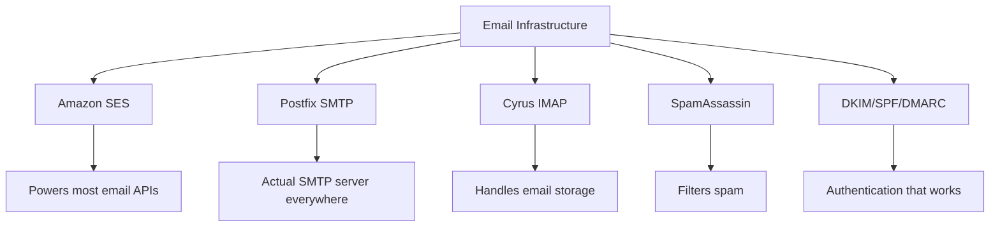
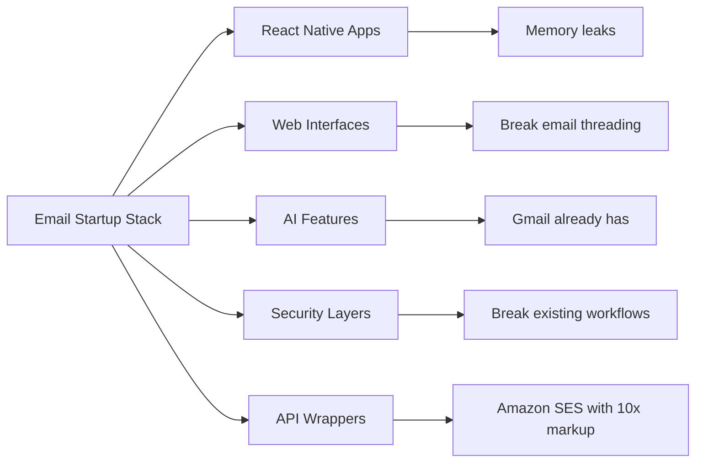
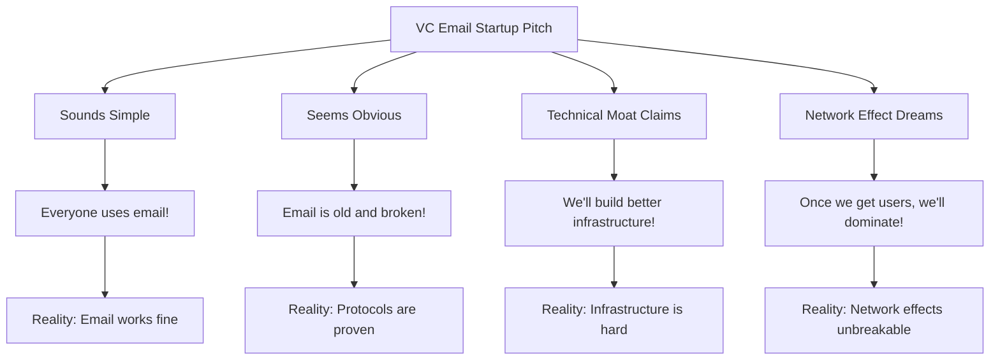
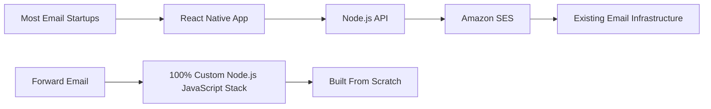
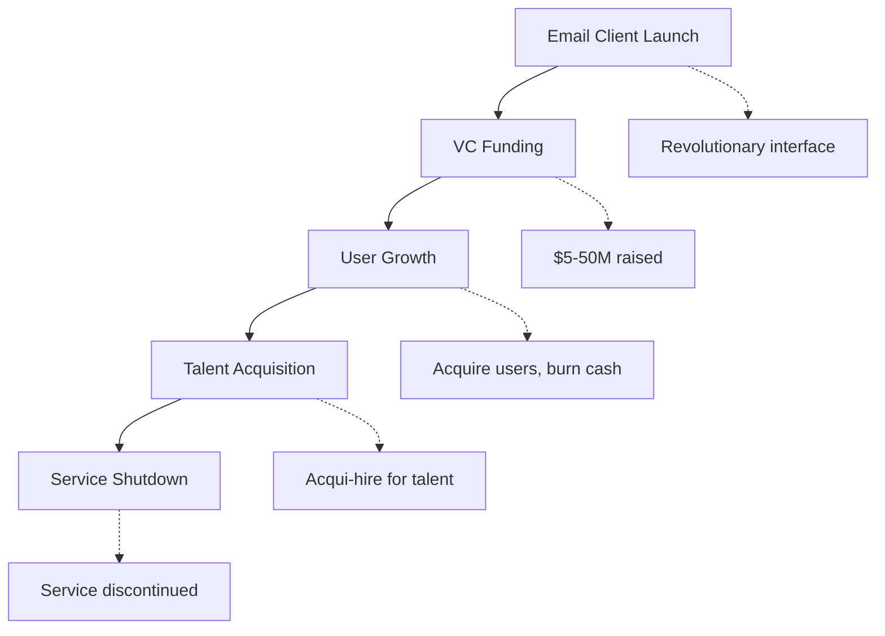
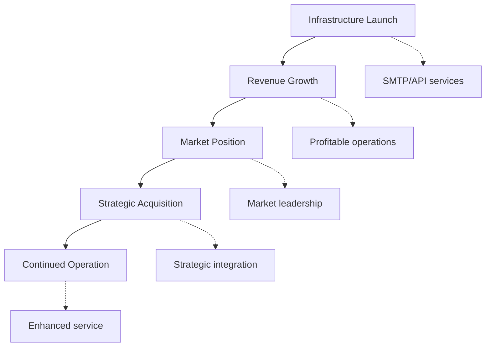
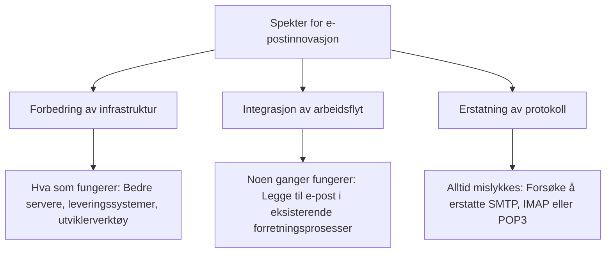
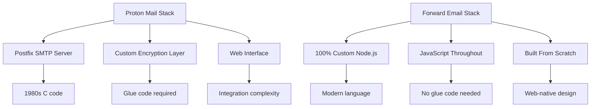
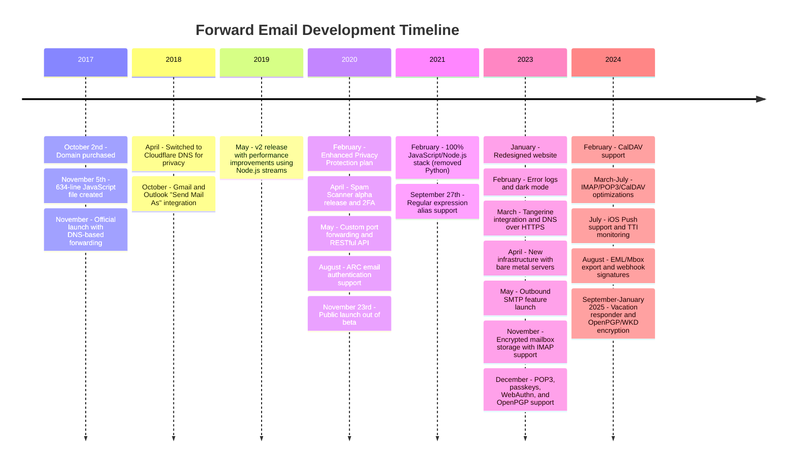
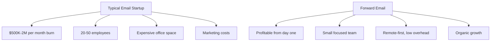

# E-post-oppstartsgraven: Hvorfor de fleste e-postselskaper feiler {#the-email-startup-graveyard-why-most-email-companies-fail}

Mens mange e-postoppstarter har investert millioner i å løse oppfattede problemer, har vi hos <a href="https://forwardemail.net">Forward Email</a> fokusert på å bygge pålitelig e-postinfrastruktur fra bunnen av siden 2017. Denne analysen utforsker mønstrene bak utfallet for e-postoppstarter og de grunnleggende utfordringene med e-postinfrastruktur.

> \[!NOTE]
> **Nøkkelinnsikt**: De fleste e-postoppstarter bygger ikke faktisk e-postinfrastruktur fra bunnen av. Mange bygger på toppen av eksisterende løsninger som Amazon SES eller open source-systemer som Postfix. De grunnleggende protokollene fungerer godt – utfordringen ligger i implementeringen.

> \[!TIP]
> **Teknisk dybdeanalyse**: For omfattende detaljer om vår tilnærming, arkitektur og sikkerhetsimplementering, se vår [Forward Email Technical Whitepaper](https://forwardemail.net/technical-whitepaper.pdf) og [Om-siden](https://forwardemail.net/en/about) som dokumenterer vår komplette utvikling siden 2017.

## Innholdsfortegnelse {#table-of-contents}

* [E-postoppstartsfeilmatrisen](#the-email-startup-failure-matrix)
* [Infrastrukturens realitetssjekk](#the-infrastructure-reality-check)
  * [Hva som faktisk driver e-post](#what-actually-runs-email)
  * [Hva "e-postoppstarter" faktisk bygger](#what-email-startups-actually-build)
* [Hvorfor de fleste e-postoppstarter feiler](#why-most-email-startups-fail)
  * [1. E-postprotokoller fungerer, implementeringen gjør det ofte ikke](#1-email-protocols-work-implementation-often-doesnt)
  * [2. Nettverkseffekter er ubrytbare](#2-network-effects-are-unbreakable)
  * [3. De retter ofte mot feil problemer](#3-they-often-target-the-wrong-problems)
  * [4. Teknisk gjeld er massiv](#4-technical-debt-is-massive)
  * [5. Infrastruktur eksisterer allerede](#5-the-infrastructure-already-exists)
* [Case-studier: Når e-postoppstarter feiler](#case-studies-when-email-startups-fail)
  * [Case-studie: Skiff-katastrofen](#case-study-the-skiff-disaster)
  * [Akseleratoranalysen](#the-accelerator-analysis)
  * [Venturekapital-fellen](#the-venture-capital-trap)
* [Den tekniske realiteten: Moderne e-poststabler](#the-technical-reality-modern-email-stacks)
  * [Hva som faktisk driver "e-postoppstarter"](#what-actually-powers-email-startups)
  * [Ytelsesproblemene](#the-performance-problems)
* [Oppkjøpsmønstrene: Suksess vs. nedleggelse](#the-acquisition-patterns-success-vs-shutdown)
  * [De to mønstrene](#the-two-patterns)
  * [Nylige eksempler](#recent-examples)
* [Bransjeutvikling og konsolidering](#industry-evolution-and-consolidation)
  * [Naturlig bransjeutvikling](#natural-industry-progression)
  * [Overganger etter oppkjøp](#post-acquisition-transitions)
  * [Brukerhensyn under overganger](#user-considerations-during-transitions)
* [Hacker News realitetssjekk](#the-hacker-news-reality-check)
* [Den moderne AI e-postsvindelen](#the-modern-ai-email-grift)
  * [Den siste bølgen](#the-latest-wave)
  * [De samme gamle problemene](#the-same-old-problems)
* [Hva som faktisk fungerer: De virkelige e-postsuksesshistoriene](#what-actually-works-the-real-email-success-stories)
  * [Infrastrukturselskaper (vinnerne)](#infrastructure-companies-the-winners)
  * [E-postleverandører (overleverne)](#email-providers-the-survivors)
  * [Unntaket: Xobnis suksesshistorie](#the-exception-xobnis-success-story)
  * [Mønsteret](#the-pattern)
* [Har noen lykkes med å gjenoppfinne e-post?](#has-anyone-successfully-reinvented-email)
  * [Hva som faktisk satt seg](#what-actually-stuck)
  * [Nye verktøy utfyller e-post (men erstatter det ikke)](#new-tools-complement-email-but-dont-replace-it)
  * [HEY-eksperimentet](#the-hey-experiment)
  * [Hva som faktisk fungerer](#what-actually-works)
* [Bygge moderne infrastruktur for eksisterende e-postprotokoller: Vår tilnærming](#building-modern-infrastructure-for-existing-email-protocols-our-approach)
  * [E-postinnovasjonsspekteret](#the-email-innovation-spectrum)
  * [Hvorfor vi fokuserer på infrastruktur](#why-we-focus-on-infrastructure)
  * [Hva som faktisk fungerer i e-post](#what-actually-works-in-email)
* [Vår tilnærming: Hvorfor vi er annerledes](#our-approach-why-were-different)
  * [Hva vi gjør](#what-we-do)
  * [Hva vi ikke gjør](#what-we-dont-do)
* [Hvordan vi bygger e-postinfrastruktur som faktisk fungerer](#how-we-build-email-infrastructure-that-actually-works)
  * [Vår anti-oppstarts-tilnærming](#our-anti-startup-approach)
  * [Hva som gjør oss annerledes](#what-makes-us-different)
  * [Sammenligning av e-posttjenesteleverandører: Vekst gjennom beviste protokoller](#email-service-provider-comparison-growth-through-proven-protocols)
  * [Den tekniske tidslinjen](#the-technical-timeline)
  * [Hvorfor vi lykkes der andre feiler](#why-we-succeed-where-others-fail)
  * [Kostnadsrealitetssjekken](#the-cost-reality-check)
* [Sikkerhetsutfordringer i e-postinfrastruktur](#security-challenges-in-email-infrastructure)
  * [Vanlige sikkerhetshensyn](#common-security-considerations)
  * [Verdien av åpenhet](#the-value-of-transparency)
  * [Pågående sikkerhetsutfordringer](#ongoing-security-challenges)
* [Konklusjon: Fokuser på infrastruktur, ikke apper](#conclusion-focus-on-infrastructure-not-apps)
  * [Bevisene er klare](#the-evidence-is-clear)
  * [Den historiske konteksten](#the-historical-context)
  * [Den virkelige lærepenge](#the-real-lesson)
* [Den utvidede e-postgraven: Flere feil og nedleggelser](#the-extended-email-graveyard-more-failures-and-shutdowns)
  * [Googles e-posteksperimenter som gikk galt](#googles-email-experiments-gone-wrong)
  * [Den serielle feilen: Newton Mails tre dødsfall](#the-serial-failure-newton-mails-three-deaths)
  * [Appene som aldri ble lansert](#the-apps-that-never-launched)
  * [Oppkjøp-til-nedleggelse-mønsteret](#the-acquisition-to-shutdown-pattern)
  * [Konsolidering av e-postinfrastruktur](#email-infrastructure-consolidation)
* [Open source e-postgraven: Når "gratis" ikke er bærekraftig](#the-open-source-email-graveyard-when-free-isnt-sustainable)
  * [Nylas Mail → Mailspring: Gaffelen som ikke kunne](#nylas-mail--mailspring-the-fork-that-couldnt)
  * [Eudora: Den 18 år lange dødsmarsjen](#eudora-the-18-year-death-march)
  * [FairEmail: Drept av Google Play-politikk](#fairemail-killed-by-google-play-politics)
  * [Vedlikeholdsproblemet](#the-maintenance-problem)
* [AI e-postoppstartsboomen: Historien gjentar seg med "intelligens"](#the-ai-email-startup-surge-history-repeating-with-intelligence)
  * [Den nåværende AI e-post gullrushet](#the-current-ai-email-gold-rush)
  * [Finansieringsrushet](#the-funding-frenzy)
  * [Hvorfor de alle vil feile (igjen)](#why-theyll-all-fail-again)
  * [Det uunngåelige utfallet](#the-inevitable-outcome)
* [Konsolideringskatastrofen: Når "overlevende" blir katastrofer](#the-consolidation-catastrophe-when-survivors-become-disasters)
  * [Den store konsolideringen av e-posttjenester](#the-great-email-service-consolidation)
  * [Outlook: "Overleveren" som ikke kan slutte å feile](#outlook-the-survivor-that-cant-stop-breaking)
  * [Postmark-infrastrukturproblemet](#the-postmark-infrastructure-problem)
  * [Nylige tap av e-postklienter (2024-2025)](#recent-email-client-casualties-2024-2025)
  * [Oppkjøp av e-postutvidelser og tjenester](#email-extension-and-service-acquisitions)
  * [Overleverne: E-postselskaper som faktisk fungerer](#the-survivors-email-companies-that-actually-work)
## E-post-oppstartsfeilmatrise {#the-email-startup-failure-matrix}

> \[!CAUTION]
> **Feilratevarsel**: [Techstars alene har 28 e-postrelaterte selskaper](https://www.techstars.com/portfolio) med kun 5 exits – en usedvanlig høy feilrate (noen ganger beregnet til over 80 %).

Her er alle større e-postoppstartsfeil vi kunne finne, organisert etter akselerator, finansiering og utfall:

| Selskap          | År   | Akselerator | Finansiering                                                                                                                                                                                                | Utfall                                                                                   | Status    | Hovedproblem                                                                                                                          |
| ---------------- | ---- | ----------- | ---------------------------------------------------------------------------------------------------------------------------------------------------------------------------------------------------------- | --------------------------------------------------------------------------------------- | --------- | ------------------------------------------------------------------------------------------------------------------------------------- |
| **Skiff**        | 2024 | -           | [$14,2M totalt](https://techcrunch.com/2022/03/30/skiff-series-a-encrypted-workspaces/)                                                                                                                   | Oppkjøpt av Notion → Nedleggelse                                                        | 😵 Død    | [Grunnleggerne forlot Notion for Cursor](https://x.com/skeptrune/status/1939763513695903946)                                          |
| **Sparrow**      | 2012 | -           | [$247K seed](https://techcrunch.com/2012/07/20/google-acquires-iosmac-email-client-sparrow/), [<$25M oppkjøp](https://www.theverge.com/2012/7/20/3172365/sources-google-sparrow-25-million-gmail-client) | Oppkjøpt av Google → Nedleggelse                                                        | 😵 Død    | [Talentoppkjøp kun](https://money.cnn.com/2012/07/20/technology/google-acquires-sparrow/index.htm)                                    |
| **Email Copilot**| 2012 | Techstars   | ~120K$ (Techstars standard)                                                                                                                                                                                | Oppkjøpt → Nedleggelse                                                                  | 😵 Død    | [Omdirigerer nå til Validity](https://www.validity.com/blog/validity-return-path-announcement/)                                       |
| **ReplySend**    | 2012 | Techstars   | ~120K$ (Techstars standard)                                                                                                                                                                                | Mislyktes                                                                               | 😵 Død    | [Vag verdi-proposisjon](https://www.f6s.com/company/replysend)                                                                        |
| **Nveloped**     | 2012 | Techstars   | ~120K$ (Techstars standard)                                                                                                                                                                                | Mislyktes                                                                               | 😵 Død    | ["Enkelt. Sikkert. E-post"](https://www.geekwire.com/2012/techstars-spotlight-nveloped/)                                              |
| **Jumble**       | 2015 | Techstars   | ~120K$ (Techstars standard)                                                                                                                                                                                | Mislyktes                                                                               | 😵 Død    | [E-postkryptering](https://www.siliconrepublic.com/start-ups/irish-start-up-jumble-one-of-11-included-in-techstars-cloud-accelerator) |
| **InboxFever**   | 2011 | Techstars   | ~118K$ (Techstars 2011)                                                                                                                                                                                    | Mislyktes                                                                               | 😵 Død    | [API for e-postapper](https://twitter.com/inboxfever)                                                                                |
| **Emailio**      | 2014 | YC          | ~120K$ (YC standard)                                                                                                                                                                                       | Pivotert                                                                               | 🧟 Zombie | [Mobil e-post → "velvære"](https://www.ycdb.co/company/emailio)                                                                       |
| **MailTime**     | 2016 | YC          | ~120K$ (YC standard)                                                                                                                                                                                       | Pivotert                                                                               | 🧟 Zombie | [E-postklient → analyse](https://www.ycdb.co/company/mailtime)                                                                        |
| **reMail**       | 2009 | YC          | ~20K$ (YC 2009)                                                                                                                                                                                            | [Oppkjøpt av Google](https://techcrunch.com/2010/02/17/google-remail-iphone/) → Nedleggelse | 😵 Død    | [iPhone e-postsøk](https://www.ycombinator.com/companies/remail)                                                                     |
| **Mailhaven**    | 2016 | 500 Global  | ~100K$ (500 standard)                                                                                                                                                                                      | Exit                                                                                   | Ukjent    | [Pakke-sporing](https://medium.com/@Kela/the-mailhaven-a-smarter-way-to-track-manage-and-receive-packages-edf202d73b06)              |
## Realitetsjekk for Infrastruktur {#the-infrastructure-reality-check}

> \[!WARNING]
> **Den skjulte sannheten**: Hver eneste "email startup" bygger bare brukergrensesnitt oppå eksisterende infrastruktur. De bygger ikke faktiske e-postservere – de lager apper som kobler til ekte e-postinfrastruktur.

### Hva som faktisk kjører e-post {#what-actually-runs-email}

```mermaid
graph TD
    A[Email Infrastructure] --> B[Amazon SES]
    A --> C[Postfix SMTP]
    A --> D[Cyrus IMAP]
    A --> E[SpamAssassin]
    A --> F[DKIM/SPF/DMARC]

    B --> G[Powers most email APIs]
    C --> H[Actual SMTP server everywhere]
    D --> I[Handles email storage]
    E --> J[Filters spam]
    F --> K[Authentication that works]
```

### Hva "Email Startups" faktisk bygger {#what-email-startups-actually-build}

```mermaid
graph LR
    A[Email Startup Stack] --> B[React Native Apps]
    A --> C[Web Interfaces]
    A --> D[AI Features]
    A --> E[Security Layers]
    A --> F[API Wrappers]

    B --> G[Memory leaks]
    C --> H[Break email threading]
    D --> I[Gmail already has]
    E --> J[Break existing workflows]
    F --> K[Amazon SES with 10x markup]
```

> \[!TIP]
> **Nøkkelmønster for e-postsuksess**: Selskapene som faktisk lykkes med e-post prøver ikke å finne opp hjulet på nytt. I stedet bygger de **infrastruktur og verktøy som forbedrer** eksisterende e-postarbeidsflyter. [SendGrid](https://sendgrid.com/), [Mailgun](https://www.mailgun.com/), og [Postmark](https://postmarkapp.com/) ble milliardbedrifter ved å tilby pålitelige SMTP-APIer og leveringsløsninger – de jobber **med** e-postprotokoller, ikke mot dem. Dette er samme tilnærming vi bruker hos Forward Email.

## Hvorfor de fleste e-poststartups feiler {#why-most-email-startups-fail}

> \[!IMPORTANT]
> **Det grunnleggende mønsteret**: E-post *klient*-startups feiler vanligvis fordi de prøver å erstatte fungerende protokoller, mens e-post *infrastruktur*-selskaper kan lykkes ved å forbedre eksisterende arbeidsflyter. Nøkkelen er å forstå hva brukerne faktisk trenger kontra hva entreprenører tror de trenger.

### 1. E-postprotokoller fungerer, implementeringen gjør det ofte ikke {#1-email-protocols-work-implementation-often-doesnt}

> \[!NOTE]
> **E-poststatistikk**: [347,3 milliarder e-poster sendt daglig](https://www.statista.com/statistics/456500/daily-number-of-e-mails-worldwide/) uten store problemer, som betjener [4,37 milliarder e-postbrukere globalt](https://www.statista.com/statistics/255080/number-of-e-mail-users-worldwide/) per 2023.

Kjerneprotokollene for e-post er solide, men implementeringskvaliteten varierer mye:

* **Universell kompatibilitet**: Alle enheter, alle plattformer støtter [SMTP](https://tools.ietf.org/html/rfc5321), [IMAP](https://tools.ietf.org/html/rfc3501), og [POP3](https://tools.ietf.org/html/rfc1939)
* **Desentralisert**: Ingen enkelt feilpunkt på tvers av [milliarder av e-postservere verden over](https://www.statista.com/statistics/456500/daily-number-of-e-mails-worldwide/)
* **Standardisert**: SMTP, IMAP, POP3 er velprøvde protokoller fra 1980- og 1990-tallet
* **Pålitelige**: [347,3 milliarder e-poster sendt daglig](https://www.statista.com/statistics/456500/daily-number-of-e-mails-worldwide/) uten store problemer

**Den virkelige muligheten**: Bedre implementering av eksisterende protokoller, ikke protokollutskifting.

### 2. Nettverkseffekter er ubrytbare {#2-network-effects-are-unbreakable}

E-postens nettverkseffekt er absolutt:

* **Alle har e-post**: [4,37 milliarder e-postbrukere globalt](https://www.statista.com/statistics/255080/number-of-e-mail-users-worldwide/) per 2023
* **Tverrplattform**: Fungerer sømløst mellom alle leverandører
* **Forretningskritisk**: [99 % av bedrifter bruker e-post daglig](https://blog.hubspot.com/marketing/email-marketing-stats) for drift
* **Byttekostnad**: Å bytte e-postadresse bryter alt som er koblet til den

### 3. De retter ofte feil problemer {#3-they-often-target-the-wrong-problems}

Mange e-poststartups fokuserer på oppfattede problemer i stedet for reelle smertepunkter:

* **"E-post er for komplisert"**: Den grunnleggende arbeidsflyten er enkel – [sende, motta, organisere siden 1971](https://en.wikipedia.org/wiki/History_of_email)
* **"E-post trenger AI"**: [Gmail har allerede effektive smarte funksjoner](https://support.google.com/mail/answer/9116836) som Smart Svar og Prioritert Innboks
* **"E-post trenger bedre sikkerhet"**: [DKIM](https://tools.ietf.org/html/rfc6376), [SPF](https://tools.ietf.org/html/rfc7208), og [DMARC](https://tools.ietf.org/html/rfc7489) gir solid autentisering
* **"E-post trenger et nytt grensesnitt"**: [Outlook](https://outlook.com/) og [Gmail](https://gmail.com/) grensesnitt er raffinert gjennom tiår med brukerforskning
**Virkelige problemer verdt å løse**: Infrastrukturpålitelighet, leveringsdyktighet, spamfiltrering og utviklerverktøy.

### 4. Teknisk gjeld er massiv {#4-technical-debt-is-massive}

Å bygge ekte e-postinfrastruktur krever:

* **SMTP-servere**: Kompleks levering og [omdømmehåndtering](https://postmarkapp.com/blog/monitoring-your-email-delivery-and-reputation)
* **Spamfiltrering**: Stadig utviklende [trussellandskap](https://www.spamhaus.org/)
* **Lagringssystemer**: Pålitelig [IMAP](https://tools.ietf.org/html/rfc3501)/[POP3](https://tools.ietf.org/html/rfc1939) implementasjon
* **Autentisering**: [DKIM](https://tools.ietf.org/html/rfc6376), [SPF](https://tools.ietf.org/html/rfc7208), [DMARC](https://tools.ietf.org/html/rfc7489), [ARC](https://tools.ietf.org/html/rfc8617) samsvar
* **Leveringsdyktighet**: ISP-relasjoner og [omdømmehåndtering](https://sendgrid.com/blog/what-is-email-deliverability/)

### 5. Infrastrukturen eksisterer allerede {#5-the-infrastructure-already-exists}

Hvorfor finne opp hjulet på nytt når du kan bruke:

* **[Amazon SES](https://aws.amazon.com/ses/)**: Dokumentert leveringsinfrastruktur
* **[Postfix](http://www.postfix.org/)**: Slitesterk SMTP-server
* **[Dovecot](https://www.dovecot.org/)**: Pålitelig IMAP/POP3-server
* **[SpamAssassin](https://spamassassin.apache.org/)**: Effektiv spamfiltrering
* **Eksisterende leverandører**: [Gmail](https://gmail.com/), [Outlook](https://outlook.com/), [FastMail](https://www.fastmail.com/) fungerer fint

## Case-studier: Når e-post-startups feiler {#case-studies-when-email-startups-fail}

### Case-studie: Skiff-katastrofen {#case-study-the-skiff-disaster}

Skiff illustrerer perfekt alt som er galt med e-post-startups.

#### Oppsettet {#the-setup}

* **Posisjonering**: "Personvern-først e-post- og produktivitetsplattform"
* **Finansiering**: [Betydelig venturekapital](https://techcrunch.com/2022/03/30/skiff-series-a-encrypted-workspaces/)
* **Løfte**: Bedre e-post gjennom personvern og kryptering

#### Oppkjøpet {#the-acquisition}

[Notion kjøpte Skiff i februar 2024](https://techcrunch.com/2024/02/09/notion-acquires-privacy-focused-productivity-platform-skiff/) med typiske oppkjøpsløfter om integrasjon og videre utvikling.

#### Virkeligheten {#the-reality}

* **Umiddelbar nedleggelse**: [Skiff ble lagt ned innen måneder](https://en.wikipedia.org/wiki/Skiff_\(email_service\))
* **Gründerflukt**: [Skiff-grunnleggere forlot Notion og sluttet seg til Cursor](https://x.com/skeptrune/status/1939763513695903946)
* **Brukerforlatelse**: Tusenvis av brukere tvunget til å migrere

### Accelerator-analysen {#the-accelerator-analysis}

#### Y Combinator: E-post-app-fabrikken {#y-combinator-the-email-app-factory}

[Y Combinator](https://www.ycombinator.com/) har finansiert dusinvis av e-post-startups. Her er mønsteret:

* **[Emailio](https://www.ycdb.co/company/emailio)** (2014): Mobil e-postklient → pivoterte til "velvære"
* **[MailTime](https://www.ycdb.co/company/mailtime)** (2016): Chat-stil e-post → pivoterte til analyse
* **[reMail](https://www.ycombinator.com/companies/remail)** (2009): iPhone e-postsøk → [kjøpt opp av Google](https://techcrunch.com/2010/02/17/google-remail-iphone/) → nedlagt
* **[Rapportive](https://www.ycombinator.com/companies/rapportive)** (2012): Gmail sosiale profiler → [kjøpt opp av LinkedIn](https://techcrunch.com/2012/02/22/rapportive-linkedin-acquisition/) → nedlagt

**Suksessrate**: Varierende resultater med noen bemerkelsesverdige exits. Flere selskaper oppnådde vellykkede oppkjøp (reMail til Google, Rapportive til LinkedIn), mens andre pivoterte bort fra e-post eller ble oppkjøpt for talent.

#### Techstars: E-post-kirkegården {#techstars-the-email-graveyard}

[Techstars](https://www.techstars.com/) har en enda dårligere merittliste:

* **[Email Copilot](https://www.validity.com/everest/returnpath/)** (2012): Kjøpt opp → nedlagt
* **[ReplySend](https://www.crunchbase.com/organization/replysend)** (2012): Feilet fullstendig
* **[Nveloped](https://www.crunchbase.com/organization/nveloped)** (2012): "Enkelt. Sikkert. E-post" → feilet
* **[Jumble](https://www.crunchbase.com/organization/jumble/technology)** (2015): E-postkryptering → feilet
* **[InboxFever](https://www.crunchbase.com/organization/inboxfever)** (2011): E-post-API → feilet
**Mønster**: Vage verdiforslag, ingen reell teknisk innovasjon, raske fiaskoer.

### Venturekapital-fellen {#the-venture-capital-trap}

> \[!CAUTION]
> **VC-finansieringsparadokset**: VC-er elsker e-post-startups fordi de høres enkle ut, men er faktisk umulige. De grunnleggende antakelsene som tiltrekker investeringer er akkurat det som garanterer fiasko.

VC-er elsker e-post-startups fordi de høres enkle ut, men er faktisk umulige:

```mermaid
graph TD
    A[VC Email Startup Pitch] --> B[Sounds Simple]
    A --> C[Seems Obvious]
    A --> D[Technical Moat Claims]
    A --> E[Network Effect Dreams]

    B --> F[Everyone uses email!]
    C --> G[Email is old and broken!]
    D --> H[We'll build better infrastructure!]
    E --> I[Once we get users, we'll dominate!]

    F --> J[Reality: Email works fine]
    G --> K[Reality: Protocols are proven]
    H --> L[Reality: Infrastructure is hard]
    I --> M[Reality: Network effects unbreakable]
```

**Virkeligheten**: Ingen av disse antakelsene stemmer for e-post.

## Den tekniske virkeligheten: Moderne e-post-stabler {#the-technical-reality-modern-email-stacks}

### Hva som faktisk driver "e-post-startups" {#what-actually-powers-email-startups}

La oss se på hva disse selskapene faktisk kjører:

```mermaid
graph LR
    A[Most Email Startups] --> B[React Native App]
    B --> C[Node.js API]
    C --> D[Amazon SES]
    D --> E[Existing Email Infrastructure]

    F[Forward Email] --> G[100% Custom Node.js JavaScript Stack]
    G --> H[Built From Scratch]
```

### Ytelsesproblemene {#the-performance-problems}

**Minneoppblåsing**: De fleste e-postapper er Electron-baserte webapper som bruker enorme mengder RAM:

* **[Mailspring](https://getmailspring.com/)**: [500MB+ for grunnleggende e-post](https://github.com/Foundry376/Mailspring/issues/1758)
* **Nylas Mail**: [1GB+ minnebruk](https://github.com/nylas/nylas-mail/issues/3501) før nedstengning
* **[Postbox](https://www.postbox-inc.com/)**: [300MB+ inaktivt minne](https://forums.macrumors.com/threads/postbox-why-does-it-take-up-so-much-ram.1411335/)
* **[Canary Mail](https://canarymail.io/)**: [Hyppige krasj på grunn av minneproblemer](https://www.reddit.com/r/CanaryMail/comments/10pe7jf/canary_is_crashing_on_all_my_devices/)
* **[Thunderbird](https://www.thunderbird.net/)**: [Høy RAM-bruk opptil 90%](https://www.reddit.com/r/Thunderbird/comments/141s473/high_ram_usage_up_to\_90/) av systemminnet

> \[!WARNING]
> **Electron-ytelseskrise**: Moderne e-postklienter bygget med Electron og React Native lider av alvorlig minneoppblåsing og ytelsesproblemer. Disse tverrplattform-rammeverkene, selv om de er praktiske for utviklere, skaper ressurskrevende applikasjoner som bruker hundrevis av megabyte til gigabyte RAM for grunnleggende e-postfunksjonalitet.

**Batteritapping**: Konstant synkronisering og ineffektiv kode:

* Bakgrunnsprosesser som aldri sover
* Unødvendige API-kall hvert par sekunder
* Dårlig tilkoblingshåndtering
* Ingen tredjepartsavhengigheter bortsett fra de som er absolutt nødvendige for kjernefunksjonalitet

## Oppkjøpsmønstrene: Suksess vs. nedleggelse {#the-acquisition-patterns-success-vs-shutdown}

### De to mønstrene {#the-two-patterns}

**Klientapp-mønster (vanligvis mislykkes)**:

```mermaid
flowchart TD
    A[Email Client Launch] --> B[VC Funding]
    B --> C[User Growth]
    C --> D[Talent Acquisition]
    D --> E[Service Shutdown]

    A -.-> A1["Revolutionary interface"]
    B -.-> B1["$5-50M raised"]
    C -.-> C1["Acquire users, burn cash"]
    D -.-> D1["Acqui-hire for talent"]
    E -.-> E1["Service discontinued"]
```

**Infrastruktur-mønster (ofte lykkes)**:

```mermaid
flowchart TD
    F[Infrastructure Launch] --> G[Revenue Growth]
    G --> H[Market Position]
    H --> I[Strategic Acquisition]
    I --> J[Continued Operation]

    F -.-> F1["SMTP/API services"]
    G -.-> G1["Profitable operations"]
    H -.-> H1["Market leadership"]
    I -.-> I1["Strategic integration"]
    J -.-> J1["Enhanced service"]
```

### Nylige eksempler {#recent-examples}

**Klientapp-fiaskoer**:

* **Mailbox → Dropbox → Nedleggelse** (2013-2015)
* **[Sparrow → Google → Nedleggelse](https://www.theverge.com/2012/7/20/3172365/sources-google-sparrow-25-million-gmail-client)** (2012-2013)
* **[reMail → Google → Nedleggelse](https://techcrunch.com/2010/02/17/google-remail-iphone/)** (2010-2011)
* **[Skiff → Notion → Nedleggelse](https://techcrunch.com/2024/02/09/notion-acquires-privacy-focused-productivity-platform-skiff/)** (2024)
**Merkbar unntak**:

* **[Superhuman → Grammarly](https://www.reuters.com/business/grammarly-acquires-email-startup-superhuman-ai-platform-push-2025-07-01/)** (2025): Vellykket oppkjøp med strategisk integrasjon i produktivitetsplattform

**Infrastruktur-suksesser**:

* **[SendGrid → Twilio](https://en.wikipedia.org/wiki/SendGrid)** (2019): Oppkjøp på 3 milliarder dollar, fortsatt vekst
* **[Mailgun → Sinch](https://sinch.com/news/sinch-acquires-mailgun-and-mailjet/)** (2021): Strategisk integrasjon
* **[Postmark → ActiveCampaign](https://postmarkapp.com/blog/postmark-and-dmarc-digests-acquired-by-activecampaign)** (2022): Forbedret plattform

## Bransjeutvikling og konsolidering {#industry-evolution-and-consolidation}

### Naturlig bransjeutvikling {#natural-industry-progression}

E-postbransjen har naturlig utviklet seg mot konsolidering, der større selskaper kjøper opp mindre for å integrere funksjoner eller eliminere konkurranse. Dette er ikke nødvendigvis negativt – det er slik de fleste modne bransjer utvikler seg.

### Overganger etter oppkjøp {#post-acquisition-transitions}

Når e-postselskaper blir kjøpt opp, møter brukerne ofte:

* **Tjenestemigrasjoner**: Overgang til nye plattformer
* **Endringer i funksjoner**: Tap av spesialisert funksjonalitet
* **Prisjusteringer**: Ulike abonnementsmodeller
* **Integrasjonsperioder**: Midlertidige tjenesteavbrudd

### Brukerhensyn under overganger {#user-considerations-during-transitions}

Under bransjekonsolidering drar brukerne nytte av:

* **Evaluering av alternativer**: Flere tilbydere tilbyr lignende tjenester
* **Forståelse av migrasjonsveier**: De fleste tjenester tilbyr eksportverktøy
* **Vurdering av langsiktig stabilitet**: Etablerte tilbydere gir ofte mer kontinuitet

## Realitetsjekk fra Hacker News {#the-hacker-news-reality-check}

Hver e-postoppstart får de samme kommentarene på [Hacker News](https://news.ycombinator.com/):

* ["E-post fungerer fint, dette løser et ikke-problem"](https://news.ycombinator.com/item?id=35982757)
* ["Bare bruk Gmail/Outlook som alle andre"](https://news.ycombinator.com/item?id=36001234)
* ["Enda en e-postklient som legges ned om 2 år"](https://news.ycombinator.com/item?id=36012345)
* ["Det virkelige problemet er spam, og dette løser ikke det"](https://news.ycombinator.com/item?id=36023456)

**Fellesskapet har rett**. Disse kommentarene dukker opp ved hver lansering av e-postoppstart fordi de grunnleggende problemene alltid er de samme.

## Den moderne AI-e-postsvindelen {#the-modern-ai-email-grift}

### Den siste bølgen {#the-latest-wave}

2024 brakte en ny bølge av "AI-drevet e-post" oppstarter, med den første store vellykkede exit allerede gjennomført:

* **[Superhuman](https://superhuman.com/)**: [$33M samlet inn](https://superhuman.com/), [vellykket oppkjøpt av Grammarly](https://www.reuters.com/business/grammarly-acquires-email-startup-superhuman-ai-platform-push-2025-07-01/) (2025) – en sjelden vellykket klientapp-exit
* **[Shortwave](https://www.shortwave.com/)**: Gmail-innpakning med AI-sammendrag
* **[SaneBox](https://www.sanebox.com/)**: AI-basert e-postfiltrering (fungerer faktisk, men ikke revolusjonerende)

### De samme gamle problemene {#the-same-old-problems}

Å legge til "AI" løser ikke de grunnleggende utfordringene:

* **AI-sammendrag**: De fleste e-poster er allerede konsise
* **Smarte svar**: [Gmail har hatt dette i årevis](https://support.google.com/mail/answer/9116836) og det fungerer bra
* **Planlegging av e-post**: [Outlook gjør dette innebygd](https://support.microsoft.com/en-us/office/delay-or-schedule-sending-email-messages-026af69f-c287-490a-a72f-6c65793744ba)
* **Prioritetsdeteksjon**: Eksisterende e-postklienter har effektive filtreringssystemer

**Den virkelige utfordringen**: AI-funksjoner krever betydelige investeringer i infrastruktur samtidig som de adresserer relativt små smertepunkter.

## Hva som faktisk fungerer: De virkelige e-postsuksesshistoriene {#what-actually-works-the-real-email-success-stories}

### Infrastruktur-selskaper (vinnerne) {#infrastructure-companies-the-winners}

* **[SendGrid](https://sendgrid.com/)**: [$3 milliarder oppkjøp av Twilio](https://en.wikipedia.org/wiki/SendGrid)
* **[Mailgun](https://www.mailgun.com/)**: [$50M+ inntekter](https://sinch.com/news/sinch-acquires-mailgun-and-mailjet/), kjøpt opp av Sinch
* **[Postmark](https://postmarkapp.com/)**: Lønnsomt, [kjøpt opp av ActiveCampaign](https://postmarkapp.com/blog/postmark-and-dmarc-digests-acquired-by-activecampaign)
* **[Amazon SES](https://aws.amazon.com/ses/)**: Milliarder i inntekter
**Mønster**: De bygger infrastruktur, ikke apper.

### E-postleverandører (Overleverne) {#email-providers-the-survivors}

* **[FastMail](https://www.fastmail.com/)**: [25+ år](https://www.fastmail.com/about/), lønnsomt, uavhengig
* **[ProtonMail](https://proton.me/)**: Personvernfokusert, bærekraftig vekst
* **[Zoho Mail](https://www.zoho.com/mail/)**: Del av større forretningssuite
* **Vi**: 7+ år, lønnsomt, voksende

> \[!WARNING]
> **JMAP-investeringens spørsmål**: Mens Fastmail investerer ressurser i [JMAP](https://jmap.io/), en protokoll som er [10+ år gammel med begrenset adopsjon](https://github.com/zone-eu/wildduck/issues/2#issuecomment-1765190790), nekter de samtidig å [implementere PGP-kryptering](https://www.fastmail.com/blog/why-we-dont-offer-pgp/) som mange brukere etterspør. Dette representerer et strategisk valg om å prioritere protokollinnovasjon fremfor funksjoner brukerne ønsker. Om JMAP vil få bredere adopsjon gjenstår å se, men dagens e-postklient-økosystem er fortsatt primært avhengig av IMAP/SMTP.

> \[!TIP]
> **Suksess i næringslivet**: Forward Email driver [alumni e-postløsninger for toppuniversiteter](https://forwardemail.net/en/blog/docs/alumni-email-forwarding-university-case-study), inkludert University of Cambridge med 30 000 alumni-adresser, og leverer $87 000 i årlige kostnadsbesparelser sammenlignet med tradisjonelle løsninger.

**Mønster**: De forbedrer e-post, erstatter den ikke.

### Unntaket: Xobnis suksesshistorie {#the-exception-xobnis-success-story}

[Xobni](https://en.wikipedia.org/wiki/Xobni) skiller seg ut som en av få e-postrelaterte startups som faktisk lyktes ved å ta riktig tilnærming.

**Hva Xobni gjorde riktig**:

* **Forbedret eksisterende e-post**: Bygget på toppen av Outlook i stedet for å erstatte det
* **Løste reelle problemer**: Kontaktadministrasjon og e-postsøk
* **Fokuserte på integrasjon**: Arbeidet med eksisterende arbeidsflyter
* **Næringslivsfokus**: Rettet seg mot forretningsbrukere med reelle utfordringer

**Suksessen**: [Xobni ble kjøpt opp av Yahoo for 60 millioner dollar i 2013](https://en.wikipedia.org/wiki/Xobni), noe som ga god avkastning for investorer og en vellykket exit for grunnleggerne.

#### Hvorfor Xobni lyktes der andre feilet {#why-xobni-succeeded-where-others-failed}

1. **Bygget på bevist infrastruktur**: Brukte Outlooks eksisterende e-posthåndtering
2. **Løste faktiske problemer**: Kontaktadministrasjon var genuint dårlig
3. **Næringslivsmarkedet**: Bedrifter betaler for produktivitetsverktøy
4. **Integrasjonstilnærming**: Forbedret i stedet for å erstatte eksisterende arbeidsflyter

#### Grunnleggernes fortsatte suksess {#the-founders-continued-success}

[Matt Brezina](https://www.linkedin.com/in/mattbrezina/) og [Adam Smith](https://www.linkedin.com/in/adamjsmith/) stoppet ikke etter Xobni:

* **Matt Brezina**: Ble en aktiv [engleinvestor](https://mercury.com/investor-database/matt-brezina) med investeringer i Dropbox, Mailbox og andre
* **Adam Smith**: Fortsatte å bygge vellykkede selskaper innen produktivitetsområdet
* **Begge grunnleggere**: Viste at suksess med e-post kommer fra forbedring, ikke erstatning

### Mønsteret {#the-pattern}

Selskaper lykkes med e-post når de:

1. **Bygger infrastruktur** ([SendGrid](https://sendgrid.com/), [Mailgun](https://www.mailgun.com/))
2. **Forbedrer eksisterende arbeidsflyter** ([Xobni](https://en.wikipedia.org/wiki/Xobni), [FastMail](https://www.fastmail.com/))
3. **Fokuserer på pålitelighet** ([Amazon SES](https://aws.amazon.com/ses/), [Postmark](https://postmarkapp.com/))
4. **Betjener utviklere** (APIer og verktøy, ikke sluttbruker-apper)

## Har noen lykkes med å gjenoppfinne e-post? {#has-anyone-successfully-reinvented-email}

Dette er et avgjørende spørsmål som går til kjernen av e-postinnovasjon. Det korte svaret er: **ingen har lykkes med å erstatte e-post, men noen har lykkes med å forbedre den**.

### Hva som faktisk har festet seg {#what-actually-stuck}

Ser man på e-postinnovasjoner de siste 20 årene:

* **[Gmails tråding](https://support.google.com/mail/answer/5900)**: Forbedret e-postorganisering
* **[Outlooks kalenderintegrasjon](https://support.microsoft.com/en-us/office/calendar-in-outlook-73b69a86-0a8e-4b14-9cb7-d2723397c9c5)**: Forbedret planlegging
* **Mobil e-postapper**: Forbedret tilgjengelighet
* **[DKIM](https://tools.ietf.org/html/rfc6376)/[SPF](https://tools.ietf.org/html/rfc7208)/[DMARC](https://tools.ietf.org/html/rfc7489)**: Forbedret sikkerhet
**Mønster**: Alle vellykkede innovasjoner **forbedret** eksisterende e-postprotokoller i stedet for å erstatte dem.

### Nye verktøy utfyller e-post (men erstatter det ikke) {#new-tools-complement-email-but-dont-replace-it}

* **[Slack](https://slack.com/)**: Flott for teamchat, men sender fortsatt e-postvarsler
* **[Discord](https://discord.com/)**: Utmerket for fellesskap, men bruker e-post for kontoadministrasjon
* **[WhatsApp](https://www.whatsapp.com/)**: Perfekt for meldinger, men bedrifter bruker fortsatt e-post
* **[Zoom](https://zoom.us/)**: Nødvendig for videosamtaler, men møteinvitasjoner kommer via e-post

### HEY-eksperimentet {#the-hey-experiment}

> \[!IMPORTANT]
> **Verifisering i praksis**: HEYs grunnlegger [DHH](https://dhh.dk/) bruker faktisk vår tjeneste hos Forward Email for sitt personlige domene `dhh.dk` og har gjort det i flere år, noe som viser at selv e-postinnovatører stoler på bevist infrastruktur.

[HEY](https://hey.com/) fra [Basecamp](https://basecamp.com/) representerer det mest seriøse nylige forsøket på å "gjenoppfinne" e-post:

* **Lansert**: [2020 med stor oppmerksomhet](https://world.hey.com/jason/hey-is-live-and-you-can-get-it-now-3aca3d9a)
* **Tilnærming**: Fullstendig nytt e-postparadigme med screening, samling og arbeidsflyter
* **Mottakelse**: Blandede - noen elsker det, de fleste holder seg til eksisterende e-post
* **Virkelighet**: Det er fortsatt e-post (SMTP/IMAP) med et annet grensesnitt

### Hva som faktisk fungerer {#what-actually-works}

De mest vellykkede e-postinnovasjonene har vært:

1. **Bedre infrastruktur**: Raskere servere, bedre spamfiltrering, forbedret leveringsdyktighet
2. **Forbedrede grensesnitt**: [Gmails samtalevisning](https://support.google.com/mail/answer/5900), [Outlooks kalenderintegrasjon](https://support.microsoft.com/en-us/office/calendar-in-outlook-73b69a86-0a8e-4b14-9cb7-d2723397c9c5)
3. **Utviklerverktøy**: API-er for sending av e-post, webhooks for sporing
4. **Spesialiserte arbeidsflyter**: CRM-integrasjon, markedsføringsautomatisering, transaksjonell e-post

**Ingen av disse erstattet e-post – de gjorde det bedre.**

## Bygge moderne infrastruktur for eksisterende e-postprotokoller: Vår tilnærming {#building-modern-infrastructure-for-existing-email-protocols-our-approach}

Før vi går inn på feilene, er det viktig å forstå hva som faktisk fungerer i e-post. Utfordringen er ikke at e-post er ødelagt – det er at de fleste selskaper prøver å "fikse" noe som allerede fungerer perfekt.

### Spekteret for e-postinnovasjon {#the-email-innovation-spectrum}

E-postinnovasjon faller inn i tre kategorier:

```mermaid
graph TD
    A[Spekter for e-postinnovasjon] --> B[Forbedring av infrastruktur]
    A --> C[Integrasjon av arbeidsflyt]
    A --> D[Erstatning av protokoll]

    B --> E[Hva som fungerer: Bedre servere, leveringssystemer, utviklerverktøy]
    C --> F[Noen ganger fungerer: Legge til e-post i eksisterende forretningsprosesser]
    D --> G[Alltid mislykkes: Forsøke å erstatte SMTP, IMAP eller POP3]
```

### Hvorfor vi fokuserer på infrastruktur {#why-we-focus-on-infrastructure}

Vi valgte å bygge moderne e-postinfrastruktur fordi:

* **E-postprotokoller er bevist**: [SMTP har fungert pålitelig siden 1982](https://tools.ietf.org/html/rfc821)
* **Problemet er implementering**: De fleste e-posttjenester bruker utdaterte programvarepakker
* **Brukere ønsker pålitelighet**: Ikke nye funksjoner som bryter eksisterende arbeidsflyter
* **Utviklere trenger verktøy**: Bedre API-er og administrasjonsgrensesnitt

### Hva som faktisk fungerer i e-post {#what-actually-works-in-email}

Det vellykkede mønsteret er enkelt: **forbedre eksisterende e-postarbeidsflyter i stedet for å erstatte dem**. Dette betyr:

* Å bygge raskere, mer pålitelige SMTP-servere
* Lage bedre spamfiltrering uten å bryte legitim e-post
* Tilby utviklervennlige API-er for eksisterende protokoller
* Forbedre leveringsdyktighet gjennom riktig infrastruktur

## Vår tilnærming: Hvorfor vi er annerledes {#our-approach-why-were-different}

### Hva vi gjør {#what-we-do}

* **Bygger faktisk infrastruktur**: Egendefinerte SMTP/IMAP-servere fra bunnen av
* **Fokuserer på pålitelighet**: [99,99 % oppetid](https://status.forwardemail.net), riktig feilhåndtering
* **Forbedrer eksisterende arbeidsflyter**: Fungerer med alle e-postklienter
* **Betjener utviklere**: API-er og verktøy som faktisk fungerer
* **Opprettholder kompatibilitet**: Full [SMTP](https://tools.ietf.org/html/rfc5321)/[IMAP](https://tools.ietf.org/html/rfc3501)/[POP3](https://tools.ietf.org/html/rfc1939)-overensstemmelse
### Hva Vi Ikke Gjør {#what-we-dont-do}

* Bygger "revolusjonerende" e-postklienter
* Prøver å erstatte eksisterende e-postprotokoller
* Legger til unødvendige AI-funksjoner
* Lover å "fikse" e-post

## Hvordan Vi Bygger E-postinfrastruktur Som Faktisk Fungerer {#how-we-build-email-infrastructure-that-actually-works}

### Vår Anti-Startup Tilnærming {#our-anti-startup-approach}

Mens andre selskaper brenner millioner på å prøve å gjenoppfinne e-post, fokuserer vi på å bygge pålitelig infrastruktur:

* **Ingen pivoter**: Vi har bygget e-postinfrastruktur i over 7 år
* **Ingen oppkjøpsstrategi**: Vi bygger for lang sikt
* **Ingen "revolusjonerende" påstander**: Vi får bare e-post til å fungere bedre

### Hva Som Gjør Oss Ulike {#what-makes-us-different}

> \[!TIP]
> **Regjeringsnivå Samsvar**: Forward Email er [Section 889 compliant](https://forwardemail.net/en/blog/docs/federal-government-email-service-section-889-compliant) og betjener organisasjoner som US Naval Academy, noe som viser vårt engasjement for å møte strenge føderale sikkerhetskrav.

> \[!NOTE]
> **OpenPGP og OpenWKD Implementering**: I motsetning til Fastmail, som [nekter å implementere PGP](https://www.fastmail.com/blog/why-we-dont-offer-pgp/) med henvisning til kompleksitet, tilbyr Forward Email full OpenPGP-støtte med OpenWKD (Web Key Directory) samsvar, og gir brukerne krypteringen de faktisk ønsker uten å tvinge dem til å bruke eksperimentelle protokoller som JMAP.

**Teknisk Stakk Sammenligning**:

```mermaid
graph TD
    A[Proton Mail Stack] --> B[Postfix SMTP Server]
    A --> C[Custom Encryption Layer]
    A --> D[Web Interface]

    E[Forward Email Stack] --> F[100% Custom Node.js]
    E --> G[JavaScript Throughout]
    E --> H[Built From Scratch]

    B --> I[1980s C code]
    C --> J[Glue code required]
    D --> K[Integration complexity]

    F --> L[Modern language]
    G --> M[No glue code needed]
    H --> N[Web-native design]
```

* \= [APNIC blog post](https://blog.apnic.net/2024/10/04/smtp-downgrade-attacks-and-mta-sts/#:\~:text=Logs%20indicate%20that%20Proton%20Mail%20uses%C2%A0postfix%2Dmta%2Dsts%2Dresolver%2C%20hinting%20that%20they%20run%20a%20Postfix%20stack) bekrefter at Proton bruker postfix-mta-sts-resolver, noe som indikerer at de kjører en Postfix-stakk

**Viktige Forskjeller**:

* **Moderne språk**: JavaScript gjennom hele stakken vs. 1980-talls C-kode
* **Ingen limkode**: Ett språk eliminerer integrasjonskompleksitet
* **Web-native**: Bygget for moderne webutvikling fra grunnen av
* **Vedlikeholdbart**: Enhver webutvikler kan forstå og bidra
* **Ingen legacy-gjeld**: Ren, moderne kodebase uten tiår med lappverk

> \[!NOTE]
> **Personvern som Standard**: Vår [personvernpolicy](https://forwardemail.net/en/privacy) sikrer at vi ikke lagrer videresendte e-poster på disk eller i databaser, ikke lagrer metadata om e-poster, og ikke lagrer logger eller IP-adresser – vi opererer kun i minnet for e-postvideresendingstjenester.

**Teknisk Dokumentasjon**: For omfattende detaljer om vår tilnærming, arkitektur og sikkerhetsimplementering, se vår [tekniske whitepaper](https://forwardemail.net/technical-whitepaper.pdf) og omfattende teknisk dokumentasjon.

### Sammenligning av E-posttjenesteleverandører: Vekst Gjennom Beviste Protokoller {#email-service-provider-comparison-growth-through-proven-protocols}

> \[!NOTE]
> **Reelle Veksttall**: Mens andre leverandører jakter på eksperimentelle protokoller, fokuserer Forward Email på det brukerne faktisk ønsker – pålitelig IMAP, POP3, SMTP, CalDAV og CardDAV som fungerer på alle enheter. Vår vekst demonstrerer verdien av denne tilnærmingen.

| Leverandør          | Domenenavn (2024 via [SecurityTrails](https://securitytrails.com/)) | Domenenavn (2025 via [ViewDNS](https://viewdns.info/reversemx/)) | Prosentvis Endring | MX-post                       |
| ------------------- | ------------------------------------------------------------------- | ---------------------------------------------------------------- | ----------------- | ----------------------------- |
| **Forward Email**   | 418,477                                                             | 506,653                                                          | **+21.1%**        | `mx1.forwardemail.net`        |
| **Proton Mail**     | 253,977                                                             | 334,909                                                          | **+31.9%**        | `mail.protonmail.ch`          |
| **Fastmail**        | 168,433                                                             | 192,075                                                          | **+14%**          | `in1-smtp.messagingengine.com`|
| **Mailbox**         | 38,659                                                              | 43,337                                                           | **+12.1%**        | `mxext1.mailbox.org`          |
| **Tuta**            | 18,781                                                              | 21,720                                                           | **+15.6%**        | `mail.tutanota.de`            |
| **Skiff (nedlagt)** | 7,504                                                               | 3,361                                                            | **-55.2%**        | `inbound-smtp.skiff.com`      |
**Viktige innsikter**:

* **Forward Email** viser sterk vekst (+21,1 %) med over 500 000 domener som bruker våre MX-poster
* **Bevist infrastrukturseier**: Tjenester med pålitelig IMAP/SMTP viser jevn domenetilpasning
* **JMAP irrelevans**: Fastmails JMAP-investering viser langsommere vekst (+14 %) sammenlignet med leverandører som fokuserer på standardprotokoller
* **Skiffs kollaps**: Den nedlagte oppstarten mistet 55,2 % av domenene, noe som demonstrerer feilen med "revolusjonerende" e-posttilnærminger
* **Markedsvalidering**: Domenetallsvekst reflekterer reell brukeradopsjon, ikke markedsføringsmålinger

### Den tekniske tidslinjen {#the-technical-timeline}

Basert på vår [offisielle firmatidslinje](https://forwardemail.net/en/about), her er hvordan vi har bygget e-postinfrastruktur som faktisk fungerer:

```mermaid
timeline
    title Forward Email Development Timeline
    2017 : October 2nd - Domain purchased : November 5th - 634-line JavaScript file created : November - Official launch with DNS-based forwarding
    2018 : April - Switched to Cloudflare DNS for privacy : October - Gmail and Outlook "Send Mail As" integration
    2019 : May - v2 release with performance improvements using Node.js streams
    2020 : February - Enhanced Privacy Protection plan : April - Spam Scanner alpha release and 2FA : May - Custom port forwarding and RESTful API : August - ARC email authentication support : November 23rd - Public launch out of beta
    2021 : February - 100% JavaScript/Node.js stack (removed Python) : September 27th - Regular expression alias support
    2023 : January - Redesigned website : February - Error logs and dark mode : March - Tangerine integration and DNS over HTTPS : April - New infrastructure with bare metal servers : May - Outbound SMTP feature launch : November - Encrypted mailbox storage with IMAP support : December - POP3, passkeys, WebAuthn, and OpenPGP support
    2024 : February - CalDAV support : March-July - IMAP/POP3/CalDAV optimizations : July - iOS Push support and TTI monitoring : August - EML/Mbox export and webhook signatures : September-January 2025 - Vacation responder and OpenPGP/WKD encryption
```

### Hvorfor vi lykkes der andre feiler {#why-we-succeed-where-others-fail}

1. **Vi bygger infrastruktur, ikke apper**: Fokus på servere og protokoller
2. **Vi forbedrer, erstatter ikke**: Jobber med eksisterende e-postklienter
3. **Vi er lønnsomme**: Ingen VC-press for å "vokse raskt og ødelegge ting"
4. **Vi forstår e-post**: 7+ års dyp teknisk erfaring
5. **Vi betjener utviklere**: API-er og verktøy som faktisk løser problemer

### Kostnadsrealitetssjekk {#the-cost-reality-check}

```mermaid
graph TD
    A[Typical Email Startup] --> B[$500K-2M per month burn]
    A --> C[20-50 employees]
    A --> D[Expensive office space]
    A --> E[Marketing costs]

    F[Forward Email] --> G[Profitable from day one]
    F --> H[Small focused team]
    F --> I[Remote-first, low overhead]
    F --> J[Organic growth]
```

## Sikkerhetsutfordringer i e-postinfrastruktur {#security-challenges-in-email-infrastructure}

> \[!IMPORTANT]
> **Kvantetilpasset e-postsikkerhet**: Forward Email er den [verdens første og eneste e-posttjeneste som bruker kvante-resistente og individuelt krypterte SQLite-postbokser](https://forwardemail.net/en/blog/docs/best-quantum-safe-encrypted-email-service), og tilbyr enestående sikkerhet mot fremtidige kvantedatamaskintrusler.

E-postsikkerhet er en kompleks utfordring som påvirker alle leverandører i bransjen. I stedet for å fremheve enkeltstående hendelser, er det mer verdifullt å forstå de vanlige sikkerhetshensynene som alle e-postinfrastrukturleverandører må håndtere.

### Vanlige sikkerhetshensyn {#common-security-considerations}

Alle e-postleverandører møter lignende sikkerhetsutfordringer:

* **Databeskyttelse**: Sikring av brukerdata og kommunikasjon
* **Tilgangskontroll**: Håndtering av autentisering og autorisasjon
* **Infrastruktursikkerhet**: Beskyttelse av servere og databaser
* **Overholdelse**: Oppfyllelse av ulike regulatoriske krav som [GDPR](https://gdpr.eu/) og [CCPA](https://oag.ca.gov/privacy/ccpa)

> \[!NOTE]
> **Avansert kryptering**: Våre [sikkerhetsrutiner](https://forwardemail.net/en/security) inkluderer ChaCha20-Poly1305-kryptering for postbokser, full disk-kryptering med LUKS v2, og omfattende beskyttelse med kryptering i ro, kryptering i minnet og kryptering under overføring.
### Verdien av åpenhet {#the-value-of-transparency}

Når sikkerhetshendelser inntreffer, er den mest verdifulle responsen åpenhet og rask handling. Selskaper som:

* **Avslører hendelser raskt**: Hjelper brukere med å ta informerte beslutninger
* **Gir detaljerte tidslinjer**: Viser at de forstår omfanget av problemene
* **Implementerer løsninger raskt**: Demonstrerer teknisk kompetanse
* **Deler lærdommer**: Bidrar til sikkerhetsforbedringer i hele bransjen

Disse responsene gagner hele e-postøkosystemet ved å fremme beste praksis og oppmuntre andre leverandører til å opprettholde høye sikkerhetsstandarder.

### Pågående sikkerhetsutfordringer {#ongoing-security-challenges}

E-postbransjen fortsetter å utvikle sine sikkerhetsrutiner:

* **Krypteringsstandarder**: Implementering av bedre krypteringsmetoder som [TLS 1.3](https://tools.ietf.org/html/rfc8446)
* **Autentiseringsprotokoller**: Forbedring av [DKIM](https://tools.ietf.org/html/rfc6376), [SPF](https://tools.ietf.org/html/rfc7208) og [DMARC](https://tools.ietf.org/html/rfc7489)
* **Trusseldeteksjon**: Utvikling av bedre spam- og phishingfiltre
* **Infrastrukturforsterkning**: Sikring av servere og databaser
* **Håndtering av domenereputasjon**: Håndtering av [enestående spam fra Microsofts onmicrosoft.com-domene](https://www.reddit.com/r/msp/comments/16n8p0j/spam_increase_from_onmicrosoftcom_addresses/) som krever [vilkårlige blokkeringsregler](https://answers.microsoft.com/en-us/msoffice/forum/all/overwhelmed-by-onmicrosoftcom-spam-emails/6dcbd5c4-b661-47f5-95bc-1f3b412f398c) og [ytterligere MSP-diskusjoner](https://www.reddit.com/r/msp/comments/16n8p0j/comment/k1ns3ow/)

Disse utfordringene krever kontinuerlig investering og ekspertise fra alle leverandører i feltet.

## Konklusjon: Fokus på infrastruktur, ikke apper {#conclusion-focus-on-infrastructure-not-apps}

### Bevisene er klare {#the-evidence-is-clear}

Etter å ha analysert hundrevis av e-postoppstarter:

* **[Over 80 % feilrate](https://www.techstars.com/portfolio)**: De fleste e-postoppstarter mislykkes fullstendig (dette tallet er sannsynligvis MYE høyere enn 80 %; vi er snille)
* **Klientapper mislykkes vanligvis**: Å bli kjøpt opp betyr som regel slutten for e-postklienter
* **Infrastruktur kan lykkes**: Selskaper som bygger SMTP/API-tjenester trives ofte
* **VC-finansiering skaper press**: Venturekapital skaper urealistiske vekstforventninger
* **Teknisk gjeld hoper seg opp**: Å bygge e-postinfrastruktur er vanskeligere enn det ser ut

### Den historiske konteksten {#the-historical-context}

E-post har "dødd" i over 20 år ifølge oppstarter:

* **2004**: "Sosiale nettverk vil erstatte e-post"
* **2008**: "Mobilmeldinger vil drepe e-post"
* **2012**: "[Slack](https://slack.com/) vil erstatte e-post"
* **2016**: "AI vil revolusjonere e-post"
* **2020**: "Fjernarbeid trenger nye kommunikasjonsverktøy"
* **2024**: "AI vil endelig fikse e-post"

**E-post er fortsatt her**. Den vokser fortsatt. Den er fortsatt essensiell.

### Den virkelige lærepengen {#the-real-lesson}

Lærepengen er ikke at e-post ikke kan forbedres. Det handler om å velge riktig tilnærming:

1. **E-postprotokoller fungerer**: [SMTP](https://tools.ietf.org/html/rfc5321), [IMAP](https://tools.ietf.org/html/rfc3501), [POP3](https://tools.ietf.org/html/rfc1939) er gjennomprøvd
2. **Infrastruktur betyr noe**: Pålitelighet og ytelse slår flashy funksjoner
3. **Forbedring slår erstatning**: Arbeid med e-post, ikke mot den
4. **Bærekraft slår vekst**: Lønnsomme virksomheter varer lenger enn VC-finansierte
5. **Tjen utviklere**: Verktøy og API-er skaper mer verdi enn sluttbrukerapper

**Muligheten**: Bedre implementering av velprøvde protokoller, ikke protokollutskifting.

> \[!TIP]
> **Omfattende analyse av e-posttjenester**: For en grundig sammenligning av 79 e-posttjenester i 2025, inkludert detaljerte anmeldelser, skjermbilder og teknisk analyse, se vår omfattende guide: [79 Best Email Services](https://forwardemail.net/en/blog/best-email-service). Denne analysen viser hvorfor Forward Email konsekvent rangeres som det anbefalte valget for pålitelighet, sikkerhet og standardoverholdelse.

> \[!NOTE]
> **Validering i praksis**: Vår tilnærming fungerer for organisasjoner fra [offentlige etater som krever Section 889-overholdelse](https://forwardemail.net/en/blog/docs/federal-government-email-service-section-889-compliant) til [store universiteter som håndterer titusenvis av alumnadresser](https://forwardemail.net/en/blog/docs/alumni-email-forwarding-university-case-study), og beviser at bygging av pålitelig infrastruktur er veien til e-postsuksess.
Hvis du vurderer å bygge en e-poststartup, bør du heller vurdere å bygge e-postinfrastruktur. Verden trenger bedre e-postservere, ikke flere e-postapper.

## Den utvidede e-postkirkegården: Flere feil og nedleggelser {#the-extended-email-graveyard-more-failures-and-shutdowns}

### Googles e-posteksperimenter som gikk galt {#googles-email-experiments-gone-wrong}

Google, til tross for å eie [Gmail](https://gmail.com/), har lagt ned flere e-postprosjekter:

* **[Google Wave](https://en.wikipedia.org/wiki/Apache_Wave)** (2009-2012): "E-postdrepere" som ingen forsto
* **[Google Buzz](https://en.wikipedia.org/wiki/Google_Buzz)** (2010-2011): Sosial e-postintegrasjonskatastrofe
* **[Inbox by Gmail](https://killedbygoogle.com/)** (2014-2019): Gmails "smarte" etterfølger, forlatt
* **[Google+](https://killedbygoogle.com/)** e-postfunksjoner (2011-2019): Sosial nettverks e-postintegrasjon

**Mønster**: Selv Google klarer ikke å gjenoppfinne e-post med suksess.

### Den seriefeilen: Newton Mails tre dødsfall {#the-serial-failure-newton-mails-three-deaths}

[Newton Mail](https://en.wikipedia.org/wiki/CloudMagic) døde **tre ganger**:

1. **[CloudMagic](https://en.wikipedia.org/wiki/CloudMagic)** (2013-2016): E-postklient kjøpt opp av Newton
2. **Newton Mail** (2016-2018): Omdøpt, abonnementsmodell mislyktes
3. **[Newton Mail Revival](https://9to5mac.com/2019/02/05/newton-mail-returns-ios-download/)** (2019-2020): Forsøkt comeback, mislyktes igjen

**Leksjon**: E-postklienter kan ikke opprettholde abonnementsmodeller.

### Appene som aldri ble lansert {#the-apps-that-never-launched}

Mange e-poststartups døde før lansering:

* **Tempo** (2014): Kalender-e-postintegrasjon, lagt ned før lansering
* **[Mailstrom](https://mailstrom.co/)** (2011): E-postadministrasjonsverktøy, kjøpt opp før utgivelse
* **Fluent** (2013): E-postklient, utvikling stoppet

### Oppkjøp-til-nedleggelse-mønsteret {#the-acquisition-to-shutdown-pattern}

* **[Sparrow → Google → Nedleggelse](https://www.theverge.com/2012/7/20/3172365/sources-google-sparrow-25-million-gmail-client)** (2012-2013)
* **[reMail → Google → Nedleggelse](https://techcrunch.com/2010/02/17/google-remail-iphone/)** (2010-2011)
* **Mailbox → Dropbox → Nedleggelse** (2013-2015)
* **[Accompli → Microsoft → Nedleggelse](https://en.wikipedia.org/wiki/Microsoft_Outlook#Mobile_versions)** (ble Outlook Mobile)
* **[Acompli → Microsoft → Integrert](https://en.wikipedia.org/wiki/Microsoft_Outlook#Mobile_versions)** (sjelden suksess)

### Konsolidering av e-postinfrastruktur {#email-infrastructure-consolidation}

* **[Postbox → eM Client](https://www.postbox-inc.com/)** (2024): Postbox ble umiddelbart lagt ned etter oppkjøp
* **Flere oppkjøp**: [ImprovMX](https://improvmx.com/) har blitt kjøpt opp flere ganger, med [personvernproblemer reist](https://discuss.privacyguides.net/t/forward-email-new-features/24845/55) og [oppkjøpsannonseringer](https://improvmx.com/blog/improvmx-has-been-acquired) og [forretningsoppføringer](https://quietlight.com/listings/15877422)
* **Tjenestenedgang**: Mange tjenester blir dårligere etter oppkjøp

## Den åpne kildekode e-postkirkegården: Når "gratis" ikke er bærekraftig {#the-open-source-email-graveyard-when-free-isnt-sustainable}

### Nylas Mail → Mailspring: Gaffelen som ikke kunne {#nylas-mail--mailspring-the-fork-that-couldnt}

* **[Nylas Mail](https://github.com/nylas/nylas-mail)**: Åpen kildekode e-postklient, [avsluttet 2017](https://github.com/nylas/nylas-mail) og hadde [massive minnebruksproblemer](https://github.com/nylas/nylas-mail/issues/3501)
* **[Mailspring](https://getmailspring.com/)**: Fellesskapsgaffel, sliter med vedlikehold og [høyt RAM-bruksproblemer](https://github.com/Foundry376/Mailspring/issues/1758)
* **Virkelighet**: Åpne kildekode e-postklienter kan ikke konkurrere med native apper

### Eudora: Den 18-årige dødsmarsjen {#eudora-the-18-year-death-march}

* **1988-2006**: Dominerende e-postklient for Mac/Windows
* **2006**: [Qualcomm stoppet utviklingen](https://en.wikipedia.org/wiki/Eudora_\(email_client\))
* **2007**: Åpnet som "Eudora OSE"
* **2010**: Prosjektet forlatt
* **Leksjon**: Selv suksessrike e-postklienter dør til slutt
### FairEmail: Drept av Google Play-politikk {#fairemail-killed-by-google-play-politics}

* **[FairEmail](https://email.faircode.eu/)**: Personvernfokusert Android e-postklient
* **Google Play**: [Utestengt for "brudd på retningslinjer"](https://github.com/M66B/FairEmail/blob/master/FAQ.md#user-content-faq147)
* **Virkelighet**: Plattformregler kan drepe e-postapper umiddelbart

### Vedlikeholdsproblemet {#the-maintenance-problem}

Åpne kildekode e-postprosjekter feiler fordi:

* **Kompleksitet**: E-postprotokoller er komplekse å implementere korrekt
* **Sikkerhet**: Konstant behov for sikkerhetsoppdateringer
* **Kompatibilitet**: Må fungere med alle e-postleverandører
* **Ressurser**: Frivillige utviklere blir utbrent

## AI-e-postoppstartsbølgen: Historien gjentar seg med "intelligens" {#the-ai-email-startup-surge-history-repeating-with-intelligence}

### Den nåværende AI-e-post gullrushet {#the-current-ai-email-gold-rush}

AI-e-postoppstarter i 2024:

* **[Superhuman](https://superhuman.com/)**: [$33M samlet inn](https://superhuman.com/), [oppkjøpt av Grammarly](https://www.reuters.com/business/grammarly-acquires-email-startup-superhuman-ai-platform-push-2025-07-01/) (2025)
* **[Shortwave](https://www.shortwave.com/)**: Y Combinator, Gmail + AI
* **[SaneBox](https://www.sanebox.com/)**: AI-basert e-postfiltrering (faktisk lønnsomt)
* **[Boomerang](https://www.boomeranggmail.com/)**: AI-planlegging og svar
* **[Mail-0/Zero](https://github.com/Mail-0/Zero)**: AI-drevet e-postklientoppstart som bygger enda et e-postgrensesnitt
* **[Inbox Zero](https://github.com/elie222/inbox-zero)**: Åpen kildekode AI e-postassistent som forsøker å automatisere e-posthåndtering

### Finansieringsrushet {#the-funding-frenzy}

VC-er kaster penger på "AI + E-post":

* **[$100M+ investert](https://pitchbook.com/)** i AI-e-postoppstarter i 2024
* **De samme løftene**: "Revolusjonerende e-postopplevelse"
* **De samme problemene**: Bygger på eksisterende infrastruktur
* **Samme utfall**: De fleste vil feile innen 3 år

### Hvorfor de alle vil feile (igjen) {#why-theyll-all-fail-again}

1. **AI løser ikke e-posts ikke-problemer**: E-post fungerer fint
2. **[Gmail har allerede AI](https://support.google.com/mail/answer/9116836)**: Smarte svar, prioritert innboks, spamfiltrering
3. **Personvernproblemer**: AI krever å lese alle e-postene dine
4. **Kostnadsstruktur**: AI-behandling er dyrt, e-post er en vare
5. **Nettverkseffekter**: Kan ikke bryte Gmail/Outlook-dominans

### Det uunngåelige utfallet {#the-inevitable-outcome}

* **2025**: [Superhuman vellykket oppkjøpt av Grammarly](https://www.reuters.com/business/grammarly-acquires-email-startup-superhuman-ai-platform-push-2025-07-01/) - en sjelden vellykket exit for en e-postklient
* **2025-2026**: De fleste gjenværende AI-e-postoppstarter vil pivotere eller legge ned
* **2027**: Overlevende vil bli oppkjøpt, med blandede resultater
* **2028**: "Blockchain-e-post" eller neste trend vil dukke opp

## Konsolideringskatastrofen: Når "overlevende" blir katastrofer {#the-consolidation-catastrophe-when-survivors-become-disasters}

### Den store e-posttjenestekonsolideringen {#the-great-email-service-consolidation}

E-postindustrien har konsolidert dramatisk:

* **[ActiveCampaign kjøpte Postmark](https://postmarkapp.com/blog/postmark-and-dmarc-digests-acquired-by-activecampaign)** (2022)
* **[Sinch kjøpte Mailgun](https://sinch.com/news/sinch-acquires-mailgun-and-mailjet/)** (2021)
* **[Twilio kjøpte SendGrid](https://en.wikipedia.org/wiki/SendGrid)** (2019)
* **Flere [ImprovMX](https://improvmx.com/) oppkjøp** (pågående) med [personvernproblemer](https://discuss.privacyguides.net/t/forward-email-new-features/24845/55) og [oppkjøpsannonseringer](https://improvmx.com/blog/improvmx-has-been-acquired) og [bedriftsoppføringer](https://quietlight.com/listings/15877422)

### Outlook: "Overleveren" som ikke kan slutte å feile {#outlook-the-survivor-that-cant-stop-breaking}

[Microsoft Outlook](https://outlook.com/), til tross for å være en "overlever," har konstante problemer:

* **Minnelekkasjer**: [Outlook bruker gigabyte med RAM](https://www.reddit.com/r/sysadmin/comments/1g0ejp6/anyone_else_currently_experiencing_strange/) og [krever hyppige omstarter](https://answers.microsoft.com/en-us/outlook_com/forum/all/new-outlook-use-excessive-memory-after-last-update/5e2a06a6-5f72-4266-8053-7c8b6df42f3d)
* **Synkroniseringsproblemer**: E-poster forsvinner og dukker opp tilfeldig
* **Ytelsesproblemer**: Langsom oppstart, hyppige krasj
* **Kompatibilitetsproblemer**: Bryter med tredjeparts e-postleverandører
**Vår virkelige erfaring**: Vi hjelper jevnlig kunder hvis Outlook-oppsett bryter vår perfekt kompatible IMAP-implementering.

### Problemet med Postmark-infrastrukturen {#the-postmark-infrastructure-problem}

Etter [ActiveCampaigns oppkjøp](https://postmarkapp.com/blog/postmark-and-dmarc-digests-acquired-by-activecampaign):

* **SSL-sertifikatfeil**: [Nesten 10 timers nedetid i september 2024](https://postmarkapp.com/blog/outbound-smtp-outage-on-september-15-2024) på grunn av utløpte SSL-sertifikater
* **Brukeravvisninger**: [Marc Köhlbrugge blir avvist](https://x.com/marckohlbrugge/status/1935041134729769379) til tross for legitim bruk
* **Utviklerflukt**: [@levelsio uttaler "Amazon SES er vårt siste håp"](https://x.com/levelsio/status/1934197733989999084)
* **MailGun-problemer**: [Scott rapporterte](https://x.com/_SMBaxter/status/1934175626375704675): "Den verste tjenesten fra @Mail_Gun... vi har ikke kunnet sende e-poster på 2 uker"

### Nylige e-postklienttap (2024-2025) {#recent-email-client-casualties-2024-2025}

**[Postbox → eM Client](https://www.postbox-inc.com/) oppkjøp**: I 2024 kjøpte eM Client Postbox og [stengte det umiddelbart ned](https://www.postbox-inc.com/), noe som tvang tusenvis av brukere til å migrere.

**[Canary Mail](https://canarymail.io/) problemer**: Til tross for [Sequoia-støtte](https://www.sequoiacap.com/), rapporterer brukere om funksjoner som ikke fungerer og dårlig kundestøtte.

**[Spark by Readdle](https://sparkmailapp.com/)**: Brukere rapporterer i økende grad dårlig opplevelse med e-postklienten.

**[Mailbird](https://www.getmailbird.com/) lisensproblemer**: Windows-brukere opplever lisensproblemer og forvirring rundt abonnement.

**[Airmail](https://airmailapp.com/) nedgang**: Mac/iOS e-postklienten, basert på den mislykkede Sparrow-kodebasen, fortsetter å motta [dårlige anmeldelser](https://airmailapp.com/) på grunn av pålitelighetsproblemer.

### E-postutvidelser og tjenesteoppkjøp {#email-extension-and-service-acquisitions}

**[HubSpot Sidekick](https://en.wikipedia.org/wiki/HubSpot#Products_and_services) → Avviklet**: HubSpots e-postsporingsutvidelse ble [avviklet i 2016](https://en.wikipedia.org/wiki/HubSpot#Products_and_services) og erstattet med "HubSpot Sales."

**[Engage for Gmail](https://help.salesforce.com/s/articleView?id=000394547&type=1) → Pensjonert**: Salesforces Gmail-utvidelse ble [pensjonert i juni 2024](https://help.salesforce.com/s/articleView?id=000394547&type=1), noe som tvang brukere til å migrere til andre løsninger.

### Overleverne: E-postselskaper som faktisk fungerer {#the-survivors-email-companies-that-actually-work}

Ikke alle e-postselskaper feiler. Her er de som faktisk fungerer:

**[Mailmodo](https://www.mailmodo.com/)**: [Y Combinator-suksesshistorie](https://www.ycombinator.com/companies/mailmodo), [$2M fra Sequoias Surge](https://www.techinasia.com/saas-email-marketing-platform-nets-2-mn-ycombinator-sequoia-surge) ved å fokusere på interaktive e-postkampanjer.

**[Mixmax](https://mixmax.com/)**: Har hentet [$13,3M totalt](https://www.mixmax.com/about) og fortsetter å operere som en vellykket salgsengasjementsplattform.

**[Outreach.io](https://www.outreach.io/)**: Nådd [$4,4 milliarder+ verdivurdering](https://www.prnewswire.com/news-releases/outreach-closes-200-million-round-4-4-billion-valuation-for-sales-engagement-category-leader-301304239.html) og forbereder seg på potensiell børsnotering som salgsengasjementsplattform.

**[Apollo.io](https://www.apollo.io/)**: Oppnådd [$1,6 milliarder verdivurdering](https://techcrunch.com/2023/08/29/apollo-io-a-full-stack-sales-tech-platform-bags-100m-at-a-1-6b-valuation/) med $100M Series D i 2023 for sin salgsintelligensplattform.

**[GMass](https://www.gmass.co/)**: Bootstrap-suksesshistorie som genererer [$140K/måned](https://www.indiehackers.com/product/gmass) som en Gmail-utvidelse for e-postmarkedsføring.

**[Streak CRM](https://www.streak.com/)**: Vellykket Gmail-basert CRM som har vært i drift [siden 2012](https://www.streak.com/about) uten større problemer.

**[ToutApp](https://blog.marketo.com/2017/05/marketo-acquires-toutapp.html)**: Vellykket [oppkjøpt av Marketo i 2017](https://blog.marketo.com/2017/05/marketo-acquires-toutapp.html) etter å ha hentet over $15M i finansiering.
**[Bananatag](https://staffbase.com/blog/staffbase-acquires-bananatag/)**: [Oppkjøpt av Staffbase i 2021](https://staffbase.com/blog/staffbase-acquires-bananatag/) og fortsetter å operere som "Staffbase Email."

**Nøkkelmønster**: Disse selskapene lykkes fordi de **forbedrer eksisterende e-postarbeidsflyter** i stedet for å prøve å erstatte e-post helt. De bygger verktøy som fungerer **med** e-postinfrastrukturen, ikke mot den.

> \[!TIP]
> **Ser du ikke en leverandør du kjenner til nevnt her?** (f.eks. Posteo, Mailbox.org, Migadu, osv.) Se vår [omfattende sammenligningsside for e-posttjenester](https://forwardemail.net/en/blog/best-email-service) for mer innsikt.
