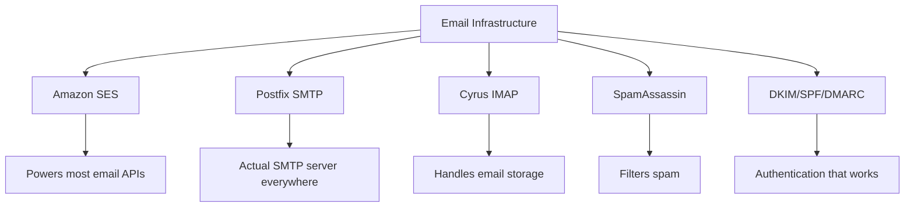
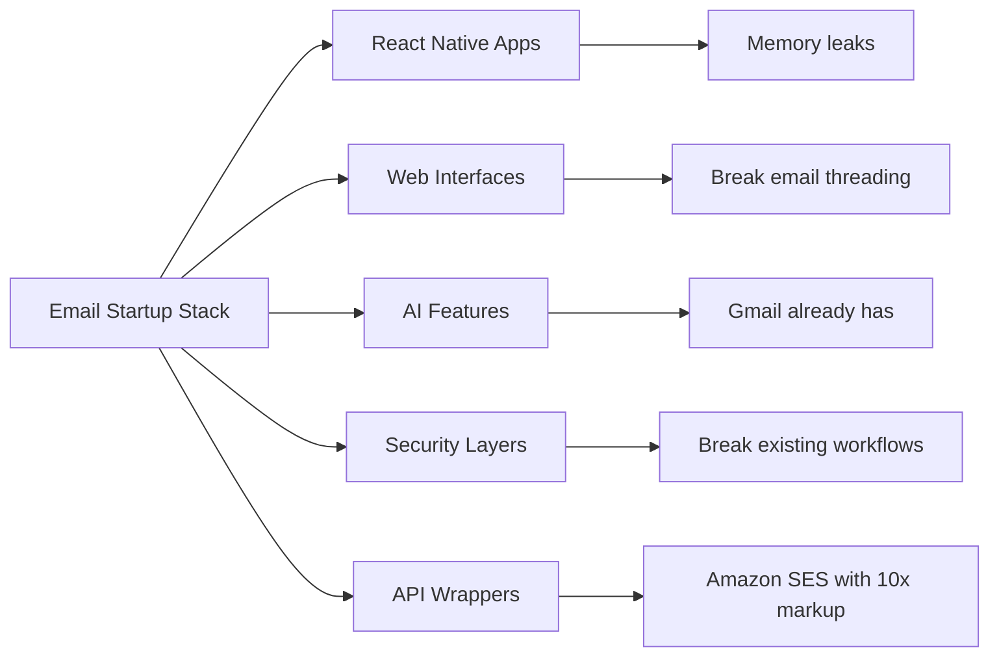
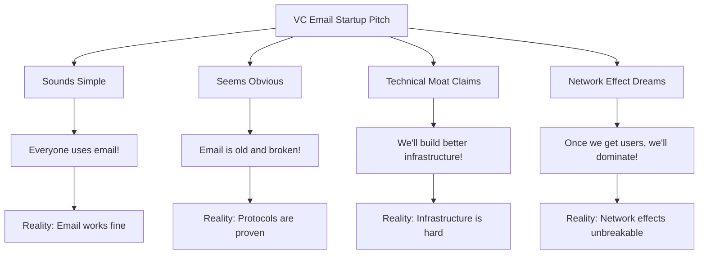
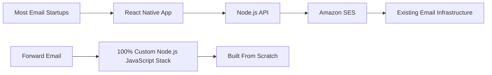
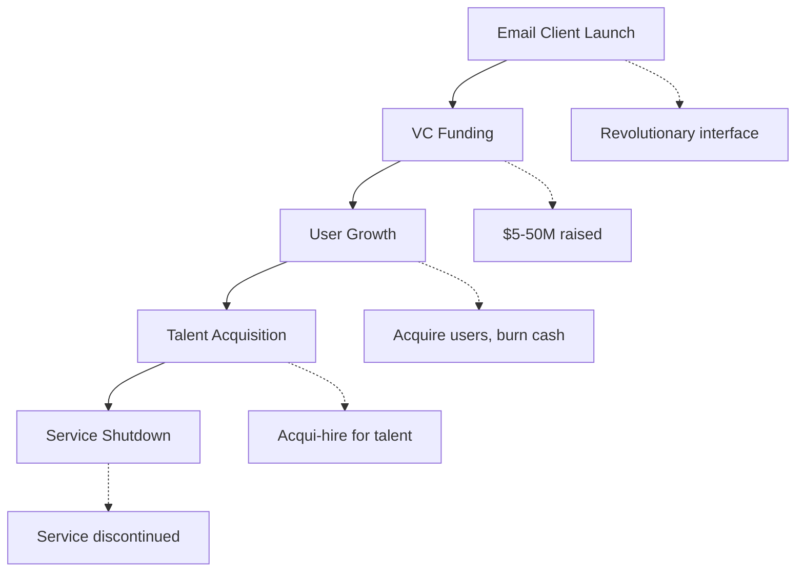
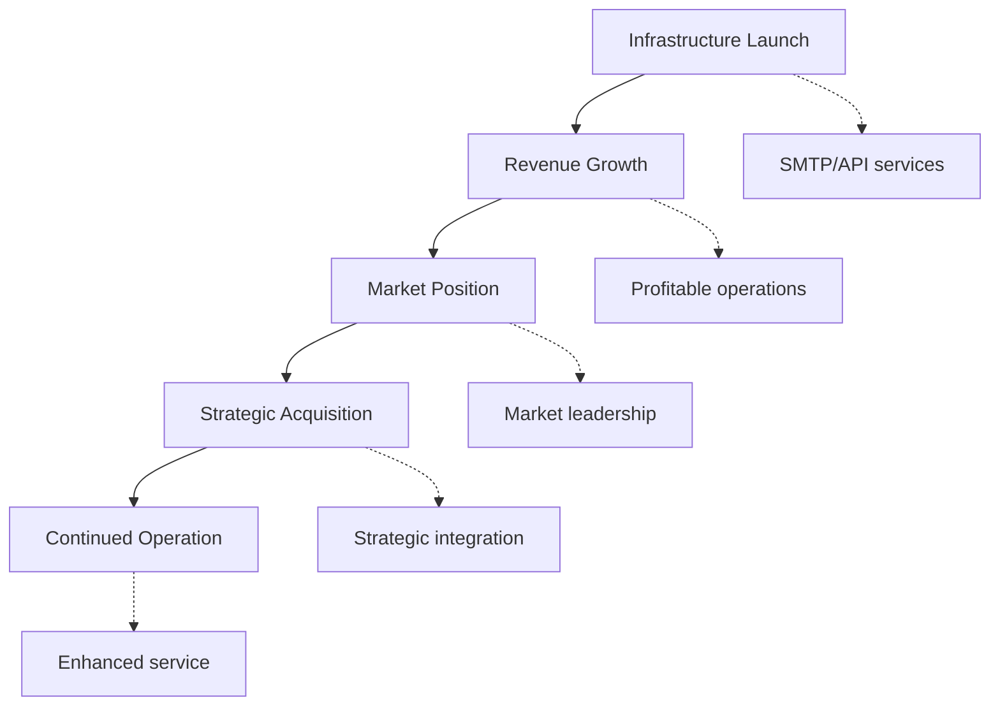
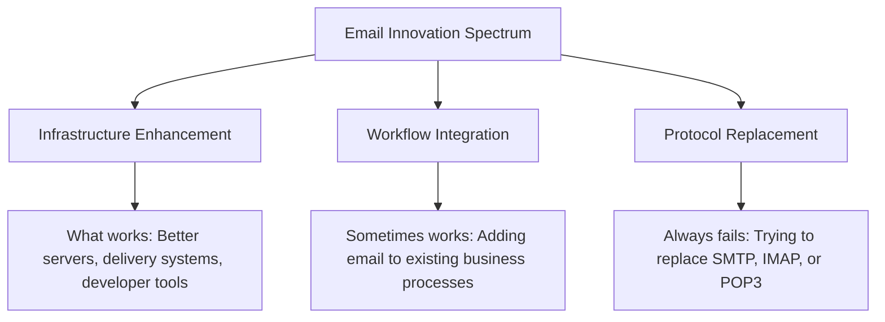
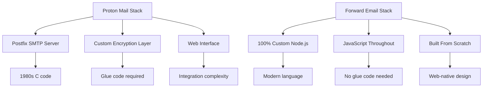
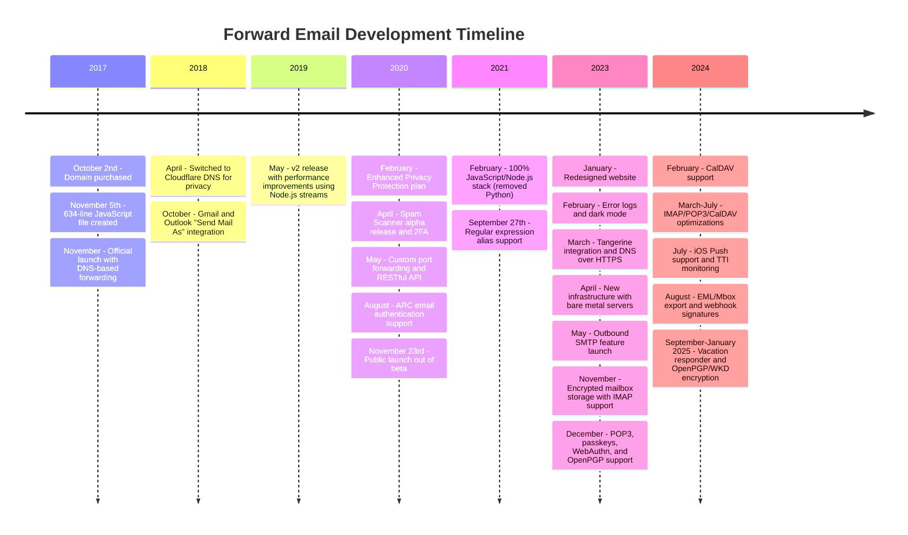
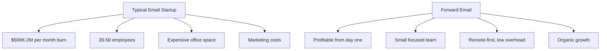

# Cmentarzysko startupów e-mailowych: Dlaczego większość firm e-mailowych upada {#the-email-startup-graveyard-why-most-email-companies-fail}

Chociaż wiele startupów e-mailowych zainwestowało miliony w rozwiązywanie postrzeganych problemów, my w <a href="https://forwardemail.net">Forward Email</a> od 2017 roku skupiamy się na budowaniu niezawodnej infrastruktury e-mail od podstaw. Niniejsza analiza bada wzorce leżące u podstaw wyników startupów e-mailowych i fundamentalne wyzwania związane z infrastrukturą e-mail.

> \[!NOTE]
> **Key Insight**: Most email startups don't build actual email infrastructure from scratch. Many build on top of existing solutions like Amazon SES or open-source systems like Postfix. The core protocols work well - the challenge is in the implementation.

> \[!TIP]
> **Technical Deep Dive**: For comprehensive details on our approach, architecture, and security implementation, see our [Forward Email Technical Whitepaper](https://forwardemail.net/technical-whitepaper.pdf) and [About page](https://forwardemail.net/en/about) which documents our complete development timeline since 2017.

## Spis treści {#table-of-contents}

* [Macierz niepowodzeń uruchamiania poczty e-mail](#the-email-startup-failure-matrix)
* [Weryfikacja rzeczywistości infrastruktury](#the-infrastructure-reality-check)
  * [Co właściwie uruchamia pocztę e-mail](#what-actually-runs-email)
  * [Co tak naprawdę budują „startupy e-mailowe”](#what-email-startups-actually-build)
* [Dlaczego większość startupów zajmujących się pocztą e-mail upada](#why-most-email-startups-fail)
  * [1. Protokół poczty e-mail działa, ale jego wdrożenie często nie](#1-email-protocols-work-implementation-often-doesnt)
  * [2. Efekty sieciowe są niezniszczalne](#2-network-effects-are-unbreakable)
  * [3. Często zajmują się niewłaściwymi problemami](#3-they-often-target-the-wrong-problems)
  * [4. Dług techniczny jest ogromny](#4-technical-debt-is-massive)
  * [5. Infrastruktura już istnieje](#5-the-infrastructure-already-exists)
* [Studia przypadków: Kiedy startupy e-mailowe zawodzą](#case-studies-when-email-startups-fail)
  * [Studium przypadku: katastrofa łodzi](#case-study-the-skiff-disaster)
  * [Analiza akceleratora](#the-accelerator-analysis)
  * [Pułapka kapitału wysokiego ryzyka](#the-venture-capital-trap)
* [Rzeczywistość techniczna: nowoczesne stosy poczty e-mail](#the-technical-reality-modern-email-stacks)
  * [Co tak naprawdę napędza „startupy e-mailowe”](#what-actually-powers-email-startups)
  * [Problemy z wydajnością](#the-performance-problems)
* [Wzory przejęć: sukces kontra zamknięcie](#the-acquisition-patterns-success-vs-shutdown)
  * [Dwa wzory](#the-two-patterns)
  * [Ostatnie przykłady](#recent-examples)
* [Ewolucja i konsolidacja branży](#industry-evolution-and-consolidation)
  * [Naturalny postęp przemysłu](#natural-industry-progression)
  * [Przejścia po przejęciu](#post-acquisition-transitions)
  * [Rozważania użytkowników podczas przejść](#user-considerations-during-transitions)
* [Weryfikacja rzeczywistości w serwisie Hacker News](#the-hacker-news-reality-check)
* [Współczesne oszustwo e-mailowe AI](#the-modern-ai-email-grift)
  * [Najnowsza fala](#the-latest-wave)
  * [Te same stare problemy](#the-same-old-problems)
* [Co naprawdę działa: prawdziwe historie sukcesu w e-mailach](#what-actually-works-the-real-email-success-stories)
  * [Firmy infrastrukturalne (zwycięzcy)](#infrastructure-companies-the-winners)
  * [Dostawcy poczty e-mail (The Survivors)](#email-providers-the-survivors)
  * [Wyjątek: Historia sukcesu Xobni](#the-exception-xobnis-success-story)
  * [Wzór](#the-pattern)
* [Czy komuś udało się z powodzeniem odnowić pocztę e-mail?](#has-anyone-successfully-reinvented-email)
  * [Co naprawdę utknęło](#what-actually-stuck)
  * [Nowe narzędzia uzupełniają pocztę e-mail (ale jej nie zastępują)](#new-tools-complement-email-but-dont-replace-it)
  * [Eksperyment HEY](#the-hey-experiment)
  * [Co naprawdę działa](#what-actually-works)
* [Budowa nowoczesnej infrastruktury dla istniejących protokołów poczty e-mail: Nasze podejście](#building-modern-infrastructure-for-existing-email-protocols-our-approach)
  * [Spektrum innowacji w e-mailu](#the-email-innovation-spectrum)
  * [Dlaczego skupiamy się na infrastrukturze](#why-we-focus-on-infrastructure)
  * [Co naprawdę działa w e-mailu](#what-actually-works-in-email)
* [Nasze podejście: dlaczego jesteśmy inni](#our-approach-why-were-different)
  * [Co robimy](#what-we-do)
  * [Czego nie robimy](#what-we-dont-do)
* [Jak budujemy infrastrukturę poczty e-mail, która naprawdę działa](#how-we-build-email-infrastructure-that-actually-works)
  * [Nasze podejście anty-startupowe](#our-anti-startup-approach)
  * [Co nas wyróżnia](#what-makes-us-different)
  * [Porównanie dostawców usług poczty e-mail: wzrost dzięki sprawdzonym protokołom](#email-service-provider-comparison-growth-through-proven-protocols)
  * [Harmonogram techniczny](#the-technical-timeline)
  * [Dlaczego odnosimy sukcesy tam, gdzie inni ponoszą porażki](#why-we-succeed-where-others-fail)
  * [Weryfikacja realiów kosztów](#the-cost-reality-check)
* [Wyzwania bezpieczeństwa w infrastrukturze poczty e-mail](#security-challenges-in-email-infrastructure)
  * [Typowe zagadnienia bezpieczeństwa](#common-security-considerations)
  * [Wartość przejrzystości](#the-value-of-transparency)
  * [Trwające wyzwania bezpieczeństwa](#ongoing-security-challenges)
* [Wnioski: Skup się na infrastrukturze, nie aplikacjach](#conclusion-focus-on-infrastructure-not-apps)
  * [Dowody są jasne](#the-evidence-is-clear)
  * [Kontekst historyczny](#the-historical-context)
  * [Prawdziwa lekcja](#the-real-lesson)
* [Rozszerzony cmentarz e-maili: Więcej awarii i wyłączeń](#the-extended-email-graveyard-more-failures-and-shutdowns)
  * [Eksperymenty Google z pocztą e-mail poszły nie tak](#googles-email-experiments-gone-wrong)
  * [Seria porażek: trzy zgony w Newton Mail](#the-serial-failure-newton-mails-three-deaths)
  * [Aplikacje, które nigdy nie zostały uruchomione](#the-apps-that-never-launched)
  * [Wzór przejęcia do zamknięcia](#the-acquisition-to-shutdown-pattern)
  * [Konsolidacja infrastruktury poczty e-mail](#email-infrastructure-consolidation)
* [Cmentarzysko poczty e-mail typu open source: kiedy „darmowość” nie jest zrównoważona](#the-open-source-email-graveyard-when-free-isnt-sustainable)
  * [Nylas Mail → Mailspring: widelec, który nie mógł](#nylas-mail--mailspring-the-fork-that-couldnt)
  * [Eudora: 18-letni marsz śmierci](#eudora-the-18-year-death-march)
  * [FairEmail: Zabity przez politykę Google Play](#fairemail-killed-by-google-play-politics)
  * [Problem konserwacji](#the-maintenance-problem)
* [Wzrost liczby startupów e-mailowych opartych na sztucznej inteligencji: historia się powtarza wraz z „inteligencją”](#the-ai-email-startup-surge-history-repeating-with-intelligence)
  * [Obecna gorączka złota w e-mailach AI](#the-current-ai-email-gold-rush)
  * [Szał finansowania](#the-funding-frenzy)
  * [Dlaczego wszyscy poniosą porażkę (ponownie)](#why-theyll-all-fail-again)
  * [Nieunikniony wynik](#the-inevitable-outcome)
* [Katastrofa konsolidacji: kiedy „ocaleni” stają się katastrofami](#the-consolidation-catastrophe-when-survivors-become-disasters)
  * [Wielka Konsolidacja Usług E-mail](#the-great-email-service-consolidation)
  * [Perspektywy: „Ocalały”, który nie może przestać się łamać](#outlook-the-survivor-that-cant-stop-breaking)
  * [Problem infrastruktury znaczkowej](#the-postmark-infrastructure-problem)
  * [Ostatnie ofiary klientów poczty e-mail (2024-2025)](#recent-email-client-casualties-2024-2025)
  * [Rozszerzenie poczty e-mail i pozyskiwanie usług](#email-extension-and-service-acquisitions)
  * [Ocaleni: firmy wysyłające e-maile, które naprawdę działają](#the-survivors-email-companies-that-actually-work)

## Macierz błędów uruchamiania poczty e-mail {#the-email-startup-failure-matrix}

> \[!CAUTION]
> **Failure Rate Alert**: [Techstars alone has 28 email-related companies](https://www.techstars.com/portfolio) with only 5 exits - an exceedingly high failure rate (sometimes calculated to be 80%+).

Oto wszystkie większe porażki startupów zajmujących się pocztą e-mail, jakie udało nam się znaleźć, posegregowane według akceleratorów, źródeł finansowania i rezultatów:

| Firma | Rok | Akcelerator | Finansowanie | Wynik | Status | Kluczowa kwestia |
| ----------------- | ---- | ----------- | ------------------------------------------------------------------------------------------------------------------------------------------------------------------------------------------------------------ | ---------------------------------------------------------------------------------------- | --------- | ------------------------------------------------------------------------------------------------------------------------------------- |
| **Skiff** | 2024 | - | [$14.2M total](https://techcrunch.com/2022/03/30/skiff-series-a-encrypted-workspaces/) | Nabyte przez Notion → Zamknięcie | 😵 Martwy | [Founders left Notion for Cursor](https://x.com/skeptrune/status/1939763513695903946) |
| **Wróbel** | 2012 | - | [$247K seed](https://techcrunch.com/2012/07/20/google-acquires-iosmac-email-client-sparrow/), [<$25M acquisition](https://www.theverge.com/2012/7/20/3172365/sources-google-sparrow-25-million-gmail-client) | Przejęte przez Google → Zamknięcie | 😵 Martwy | [Talent acquisition only](https://money.cnn.com/2012/07/20/technology/google-acquires-sparrow/index.htm) |
| **Wyślij e-mail do drugiego pilota** | 2012 | Gwiazdy technologii | ~120 tys. dolarów (standard Techstars) | Nabyto → Zamknięcie | 😵 Martwy | [Now redirects to Validity](https://www.validity.com/blog/validity-return-path-announcement/) |
| **OdpowiedzWyślij** | 2012 | Gwiazdy technologii | ~120 tys. dolarów (standard Techstars) | Przegrany | 😵 Martwy | [Vague value proposition](https://www.f6s.com/company/replysend) |
| **Rozwinięty** | 2012 | Gwiazdy technologii | ~120 tys. dolarów (standard Techstars) | Przegrany | 😵 Martwy | ["Easy. Secure. Email"](https://www.geekwire.com/2012/techstars-spotlight-nveloped/) |
| **Mieszanina** | 2015 | Gwiazdy technologii | ~120 tys. dolarów (standard Techstars) | Przegrany | 😵 Martwy | [Email encryption](https://www.siliconrepublic.com/start-ups/irish-start-up-jumble-one-of-11-included-in-techstars-cloud-accelerator) |
| **Gorączka skrzynki odbiorczej** | 2011 | Gwiazdy technologii | ~118 tys. dolarów (Techstars 2011) | Przegrany | 😵 Martwy | [API for email apps](https://twitter.com/inboxfever) |
| **E-mail** | 2014 | YC | ~120 tys. dolarów (standard YC) | Obrócony | 🧟Zombi | [Mobile email → "wellness"](https://www.ycdb.co/company/emailio) |
| **Czas wysyłki** | 2016 | YC | ~120 tys. dolarów (standard YC) | Obrócony | 🧟Zombi | [Email client → analytics](https://www.ycdb.co/company/mailtime) |
| **reMail** | 2009 | YC | ~$20K (YC 2009) | [Acquired by Google](https://techcrunch.com/2010/02/17/google-remail-iphone/) → Wyłączenie | 😵 Martwy | [iPhone email search](https://www.ycombinator.com/companies/remail) |
| **Mailhaven** | 2016 | 500 globalnie | ~100 tys. dolarów (standardowo 500) | Wyszedł | Nieznany | [Package tracking](https://medium.com/@Kela/the-mailhaven-a-smarter-way-to-track-manage-and-receive-packages-edf202d73b06) |

## Weryfikacja rzeczywistości infrastruktury {#the-infrastructure-reality-check}

> \[!WARNING]
> **The Hidden Truth**: Every single "email startup" is just building UI on top of existing infrastructure. They're not building actual email servers - they're building apps that connect to real email infrastructure.

### Co tak naprawdę uruchamia pocztę e-mail {#what-actually-runs-email}

### Co tak naprawdę budują „startupy e-mailowe” {#what-email-startups-actually-build}

> \[!TIP]
> **Key Pattern for Email Success**: The companies that actually succeed in email don't try to reinvent the wheel. Instead, they build **infrastructure and tools that enhance** existing email workflows. [SendGrid](https://sendgrid.com/), [Mailgun](https://www.mailgun.com/), and [Postmark](https://postmarkapp.com/) became billion-dollar companies by providing reliable SMTP APIs and delivery services - they work **with** email protocols, not against them. This is the same approach we take at Forward Email.

## Dlaczego większość startupów e-mailowych upada {#why-most-email-startups-fail}

> \[!IMPORTANT]
> **The Fundamental Pattern**: Email *client* startups typically fail because they try to replace working protocols, while email *infrastructure* companies can succeed by enhancing existing workflows. The key is understanding what users actually need versus what entrepreneurs think they need.

### 1. Protokoły poczty e-mail działają, ale ich wdrożenie często nie {#1-email-protocols-work-implementation-often-doesnt}

> \[!NOTE]
> **Email Statistics**: [347.3 billion emails sent daily](https://www.statista.com/statistics/456500/daily-number-of-e-mails-worldwide/) without major issues, serving [4.37 billion email users worldwide](https://www.statista.com/statistics/255080/number-of-e-mail-users-worldwide/) as of 2023.

Podstawowe protokoły poczty e-mail są solidne, ale jakość implementacji jest bardzo zróżnicowana:

* **Uniwersalna kompatybilność**: Każde urządzenie, każda platforma obsługuje [SMTP](https://tools.ietf.org/html/rfc5321), [IMAP](https://tools.ietf.org/html/rfc3501) i [POP3](https://tools.ietf.org/html/rfc1939)
* **Zdecentralizowany**: Brak pojedynczego punktu awarii w [miliardy serwerów pocztowych na całym świecie](https://www.statista.com/statistics/456500/daily-number-of-e-mails-worldwide/)
* **Standardowy**: SMTP, IMAP, POP3 to sprawdzone w boju protokoły z lat 80. i 90. XX wieku
* **Niezawodny**: [347,3 miliarda wiadomości e-mail wysyłanych codziennie](https://www.statista.com/statistics/456500/daily-number-of-e-mails-worldwide/) bez większych problemów

**Prawdziwa szansa**: Lepsze wdrażanie istniejących protokołów, a nie zastępowanie ich nowymi.

### 2. Efekty sieciowe są niezniszczalne {#2-network-effects-are-unbreakable}

Efekt sieciowy poczty elektronicznej jest absolutny:

* **Wszyscy mają adres e-mail**: [4,37 miliarda użytkowników poczty e-mail na całym świecie](https://www.statista.com/statistics/255080/number-of-e-mail-users-worldwide/) stan na 2023 r.
* **Międzyplatformowy**: Bezproblemowa współpraca między wszystkimi dostawcami
* **Krytyczne dla firmy**: [99% firm korzysta z poczty e-mail codziennie](https://blog.hubspot.com/marketing/email-marketing-stats) dla operacji
* **Koszt przełączenia**: Zmiana adresu e-mail powoduje przerwanie działania wszystkich powiązanych z nim usług

### 3. Często skupiają się na niewłaściwych problemach {#3-they-often-target-the-wrong-problems}

Wiele startupów zajmujących się pocztą e-mail koncentruje się na domniemanych problemach, a nie na rzeczywistych problemach:

* **„E-mail jest zbyt skomplikowany”**: Podstawowy przepływ pracy jest prosty – [wysyłać, odbierać, organizować od 1971 r.](https://en.wikipedia.org/wiki/History_of_email)
* **„E-mail potrzebuje sztucznej inteligencji”**: [Gmail ma już skuteczne, inteligentne funkcje](https://support.google.com/mail/answer/9116836), takie jak Inteligentna odpowiedź i Priorytetowa skrzynka odbiorcza
* **„E-mail potrzebuje lepszego zabezpieczenia”**: [DKIM](https://tools.ietf.org/html/rfc6376), [SPF](https://tools.ietf.org/html/rfc7208) i [DMARC](https://tools.ietf.org/html/rfc7489) zapewniają solidne uwierzytelnianie
* **„E-mail potrzebuje nowego interfejsu”**: Interfejsy [Perspektywy](https://outlook.com/) i [Gmail](https://gmail.com/) są udoskonalane na przestrzeni dziesięcioleci badań użytkowników

**Prawdziwe problemy warte rozwiązania**: Niezawodność infrastruktury, dostarczalność, filtrowanie spamu i narzędzia programistyczne.

### 4. Ogromny dług techniczny {#4-technical-debt-is-massive}

Do zbudowania prawdziwej infrastruktury poczty elektronicznej wymagane są:

* **Serwery SMTP**: Złożone dostarczanie i [zarządzanie reputacją](https://postmarkapp.com/blog/monitoring-your-email-delivery-and-reputation)
* **Filtrowanie spamu**: Stale rozwijany [krajobraz zagrożeń](https://www.spamhaus.org/)
* **Systemy pamięci masowej**: Niezawodna implementacja [IMAP](https://tools.ietf.org/html/rfc3501)/[POP3](https://tools.ietf.org/html/rfc1939)
* **Uwierzytelnianie**: Zgodność z [DKIM](https://tools.ietf.org/html/rfc6376), [SPF](https://tools.ietf.org/html/rfc7208), [DMARC](https://tools.ietf.org/html/rfc7489), [ARC](https://tools.ietf.org/html/rfc8617)
* **Dostarczalność**: Relacje z dostawcami usług internetowych i [zarządzanie reputacją](https://sendgrid.com/blog/what-is-email-deliverability/)

### 5. Infrastruktura już istnieje {#5-the-infrastructure-already-exists}

Po co zmieniać się, skoro możesz użyć:

* **[Amazon SES](https://aws.amazon.com/ses/)**: Sprawdzona infrastruktura dostarczania
* **[Postfiks](http://www.postfix.org/)**: Przetestowany w boju serwer SMTP
* **[Gołębnik](https://www.dovecot.org/)**: Niezawodny serwer IMAP/POP3
* **[Zabójca spamu](https://spamassassin.apache.org/)**: Skuteczne filtrowanie spamu
* **Obecni dostawcy**: [Gmail](https://gmail.com/), [Perspektywy](https://outlook.com/), [Szybka poczta](https://www.fastmail.com/) działają bez zarzutu

## Studia przypadków: Kiedy startupy e-mailowe upadają {#case-studies-when-email-startups-fail}

### Studium przypadku: katastrofa łodzi {#case-study-the-skiff-disaster}

Skiff jest doskonałym przykładem wszystkich wad startupów zajmujących się pocztą e-mail.

#### Konfiguracja {#the-setup}

* **Pozycjonowanie**: „Platforma e-mail i produktywności stawiająca na pierwszym miejscu prywatność”
* **Finansowanie**: [Znaczny kapitał wysokiego ryzyka](https://techcrunch.com/2022/03/30/skiff-series-a-encrypted-workspaces/)
* **Obietnica**: Lepsza poczta e-mail dzięki prywatności i szyfrowaniu

#### Przejęcie {#the-acquisition}

[Notion przejął Skiff w lutym 2024 r.](https://techcrunch.com/2024/02/09/notion-acquires-privacy-focused-productivity-platform-skiff/) z typowymi obietnicami przejęcia dotyczącymi integracji i dalszego rozwoju.

#### Rzeczywistość {#the-reality}

* **Natychmiastowe wyłączenie**: [Łódź zamknięta w ciągu kilku miesięcy](https://en.wikipedia.org/wiki/Skiff_\(email_service\))
* **Exodus założyciela**: [Założyciele Skiff opuścili Notion i dołączyli do Cursor](https://x.com/skeptrune/status/1939763513695903946)
* **Porzucenie użytkowników**: Tysiące użytkowników zmuszonych do migracji

### Analiza akceleratora {#the-accelerator-analysis}

#### Y Combinator: Fabryka aplikacji e-mail {#y-combinator-the-email-app-factory}

[Kombinator Y](https://www.ycombinator.com/) sfinansował dziesiątki startupów e-mailowych. Oto schemat:

* **[E-mail](https://www.ycdb.co/company/emailio)** (2014): Mobilny klient poczty e-mail → ukierunkowany na „dobre samopoczucie”
* **[Czas poczty](https://www.ycdb.co/company/mailtime)** (2016): E-mail w stylu czatu → ukierunkowany na analitykę
* **[reMail](https://www.ycombinator.com/companies/remail)** (2009): Wyszukiwanie poczty e-mail na iPhonie → [przejęty przez Google](https://techcrunch.com/2010/02/17/google-remail-iphone/) → wyłączenie
* **[Pocieszający](https://www.ycombinator.com/companies/rapportive)** (2012): Profile społecznościowe Gmaila → [nabyty przez LinkedIn](https://techcrunch.com/2012/02/22/rapportive-linkedin-acquisition/) → wyłączenie

**Skuteczność**: Mieszane wyniki z kilkoma godnymi uwagi wyjściami. Kilka firm odniosło sukcesy w przejęciach (reMail do Google, Rapportive do LinkedIn), podczas gdy inne odeszły od poczty e-mail lub zostały przejęte ze względu na talent.

#### Techstars: Cmentarzysko e-maili {#techstars-the-email-graveyard}

[Gwiazdy technologii](https://www.techstars.com/) ma jeszcze gorszą historię:

* **[Wyślij e-mail do drugiego pilota](https://www.validity.com/everest/returnpath/)** (2012): Uzyskano → wyłączenie
* **[OdpowiedzWyślij](https://www.crunchbase.com/organization/replysend)** (2012): Całkowita awaria
* **[Rozwinięty](https://www.crunchbase.com/organization/nveloped)** (2012): „Łatwy. Bezpieczny. E-mail” → awaria
* **[Mieszanina](https://www.crunchbase.com/organization/jumble/technology)** (2015): Szyfrowanie wiadomości e-mail → awaria
* **[Gorączka skrzynki odbiorczej](https://www.crunchbase.com/organization/inboxfever)** (2011): API poczty e-mail → awaria

**Wzór**: Niejasne propozycje wartości, brak prawdziwych innowacji technicznych, szybkie awarie.

### Pułapka kapitału wysokiego ryzyka {#the-venture-capital-trap}

> \[!CAUTION]
> **VC Funding Paradox**: VCs love email startups because they sound simple but are actually impossible. The fundamental assumptions that attract investment are exactly what guarantee failure.

Inwestorzy venture capital uwielbiają startupy zajmujące się pocztą e-mail, ponieważ brzmią prosto, ale w rzeczywistości są niemożliwe:

**Rzeczywistość**: Żadne z tych założeń nie sprawdza się w przypadku poczty e-mail.

## Rzeczywistość techniczna: nowoczesne skrzynki e-mail {#the-technical-reality-modern-email-stacks}

### Co tak naprawdę napędza „startupy e-mailowe” {#what-actually-powers-email-startups}

Przyjrzyjmy się, czym tak naprawdę zajmują się te firmy:

### Problemy z wydajnością {#the-performance-problems}

**Rozdęcie pamięci**: Większość aplikacji e-mail to aplikacje internetowe oparte na technologii Electron, które zużywają ogromne ilości pamięci RAM:

* **[Poczta Spring](https://getmailspring.com/)**: [500 MB+ na podstawową pocztę e-mail](https://github.com/Foundry376/Mailspring/issues/1758)
* **Poczta Nylas**: [Wykorzystanie pamięci 1 GB+](https://github.com/nylas/nylas-mail/issues/3501) przed wyłączeniem
* **[Skrzynka pocztowa](https://www.postbox-inc.com/)**: [300 MB+ wolnej pamięci](https://forums.macrumors.com/threads/postbox-why-does-it-take-up-so-much-ram.1411335/)
* **[Poczta Kanaryjska](https://canarymail.io/)**: [Częste awarie spowodowane problemami z pamięcią](https://www.reddit.com/r/CanaryMail/comments/10pe7jf/canary_is_crashing_on_all_my_devices/)
* **[Ptak piorunowy](https://www.thunderbird.net/)**: [Wysokie wykorzystanie pamięci RAM do 90%](https://www.reddit.com/r/Thunderbird/comments/141s473/high_ram_usage_up_to\_90/) pamięci systemowej

> \[!WARNING]
> **Electron Performance Crisis**: Modern email clients built with Electron and React Native suffer from severe memory bloat and performance issues. These cross-platform frameworks, while convenient for developers, create resource-heavy applications that consume hundreds of megabytes to gigabytes of RAM for basic email functionality.

**Wyczerpywanie się baterii**: Ciągła synchronizacja i nieefektywny kod:

* Procesy w tle, które nigdy nie śpią
* Niepotrzebne wywołania API co kilka sekund
* Słabe zarządzanie połączeniami
* Brak zależności od stron trzecich, z wyjątkiem tych, które są absolutnie niezbędne do podstawowej funkcjonalności

## Wzory przejęć: sukces kontra zamknięcie {#the-acquisition-patterns-success-vs-shutdown}

### Dwa wzorce {#the-two-patterns}

**Wzorzec aplikacji klienckiej (zwykle nieudany)**:

**Wzorzec infrastruktury (często udany)**:

### Ostatnie przykłady {#recent-examples}

**Awarie aplikacji klienckiej**:

* **Skrzynka pocztowa → Dropbox → Wyłączenie** (2013-2015)
* **[Sparrow → Google → Wyłączenie](https://www.theverge.com/2012/7/20/3172365/sources-google-sparrow-25-million-gmail-client)** (2012-2013)
* **[reMail → Google → Wyłączenie](https://techcrunch.com/2010/02/17/google-remail-iphone/)** (2010-2011)
* **[Skiff → Pojęcie → Zamknięcie](https://techcrunch.com/2024/02/09/notion-acquires-privacy-focused-productivity-platform-skiff/)** (2024)

**Godny uwagi wyjątek**:

* **[Nadczłowiek → Grammarly](https://www.reuters.com/business/grammarly-acquires-email-startup-superhuman-ai-platform-push-2025-07-01/)** (2025): Udana akwizycja ze strategiczną integracją z platformą produktywności

**Sukcesy infrastrukturalne**:

* **[WyślijGrid → Twilio](https://en.wikipedia.org/wiki/SendGrid)** (2019): Przejęcie za 3 mld USD, dalszy wzrost
* **[Mailgun → Sinch](https://sinch.com/news/sinch-acquires-mailgun-and-mailjet/)** (2021): Integracja strategiczna
* **[Stempel pocztowy → ActiveCampaign](https://postmarkapp.com/blog/postmark-and-dmarc-digests-acquired-by-activecampaign)** (2022): Ulepszona platforma

## Ewolucja i konsolidacja branży {#industry-evolution-and-consolidation}

### Naturalny rozwój przemysłu {#natural-industry-progression}

Branża poczty e-mail naturalnie ewoluowała w kierunku konsolidacji, przy czym większe firmy przejmowały mniejsze, aby integrować funkcje lub eliminować konkurencję. Nie jest to koniecznie negatywne — tak rozwija się większość dojrzałych branż.

### Przejścia po przejęciu {#post-acquisition-transitions}

Kiedy przejmujemy firmy zajmujące się pocztą e-mail, użytkownicy często muszą stawić czoła następującym wyzwaniom:

* **Migracje usług**: Przenoszenie na nowe platformy
* **Zmiany funkcji**: Utrata wyspecjalizowanej funkcjonalności
* **Dostosowania cen**: Różne modele subskrypcji
* **Okresy integracji**: Tymczasowe przerwy w świadczeniu usług

### Rozważania użytkowników podczas przejść {#user-considerations-during-transitions}

Podczas konsolidacji branży użytkownicy korzystają z następujących korzyści:

* **Ocenianie alternatyw**: Wielu dostawców oferuje podobne usługi
* **Zrozumienie ścieżek migracji**: Większość usług zapewnia narzędzia eksportowe
* **Rozważanie długoterminowej stabilności**: Ugruntowani dostawcy często oferują większą ciągłość

## Weryfikacja rzeczywistości w serwisie Hacker News {#the-hacker-news-reality-check}

Każdy startup zajmujący się pocztą elektroniczną otrzymuje te same komentarze na [Wiadomości hakerskie](https://news.ycombinator.com/):

* [„E-mail działa dobrze, rozwiązuje to problem, który nie istnieje”](https://news.ycombinator.com/item?id=35982757)
* [„Po prostu używaj Gmaila/Outlooka tak jak wszyscy inni”](https://news.ycombinator.com/item?id=36001234)
* [„Kolejny klient poczty elektronicznej, który zostanie zamknięty za 2 lata”](https://news.ycombinator.com/item?id=36012345)
* [„Prawdziwym problemem jest spam i to go nie rozwiązuje”](https://news.ycombinator.com/item?id=36023456)

**Społeczność ma rację**. Te komentarze pojawiają się przy każdym uruchomieniu startupu e-mail, ponieważ podstawowe problemy są zawsze takie same.

## Współczesne oszustwo e-mailowe z wykorzystaniem sztucznej inteligencji {#the-modern-ai-email-grift}

### Najnowsza fala {#the-latest-wave}

Rok 2024 przyniósł nową falę startupów zajmujących się „pocztą e-mail opartą na sztucznej inteligencji”, a pierwsze duże udane wyjście z sytuacji już miało miejsce:

* **[Nadludzki](https://superhuman.com/)**: [Zebrano 33 mln dolarów](https://superhuman.com/), [pomyślnie przejęty przez Grammarly](https://www.reuters.com/business/grammarly-acquires-email-startup-superhuman-ai-platform-push-2025-07-01/) (2025) – rzadkie udane wyjście aplikacji klienckiej
* **[Fale krótkie](https://www.shortwave.com/)**: Wtyczka Gmaila z podsumowaniami AI
* **[SaneBox](https://www.sanebox.com/)**: Filtrowanie wiadomości e-mail przez AI (naprawdę działa, ale nie jest rewolucyjne)

### Te same stare problemy {#the-same-old-problems}

Dodanie „AI” nie rozwiązuje podstawowych problemów:

* **Podsumowania AI**: Większość wiadomości e-mail jest już zwięzła
* **Inteligentne odpowiedzi**: [Gmail ma je od lat](https://support.google.com/mail/answer/9116836) i działają dobrze
* **Planowanie wysyłki wiadomości e-mail**: [Outlook wykonuje tę czynność natywnie](https://support.microsoft.com/en-us/office/delay-or-schedule-sending-email-messages-026af69f-c287-490a-a72f-6c65793744ba)
* **Wykrywanie priorytetów**: Istniejące programy pocztowe mają skuteczne systemy filtrowania

**Prawdziwe wyzwanie**: funkcje sztucznej inteligencji wymagają znacznych inwestycji w infrastrukturę, a jednocześnie rozwiązują stosunkowo mało istotne problemy.

## Co naprawdę działa: Prawdziwe historie sukcesu w e-mailach {#what-actually-works-the-real-email-success-stories}

### Firmy infrastrukturalne (zwycięzcy) {#infrastructure-companies-the-winners}

* **[WyślijGrid](https://sendgrid.com/)**: [Przejęcie przez Twilio za 3 mld dolarów](https://en.wikipedia.org/wiki/SendGrid)
* **[Mailgun](https://www.mailgun.com/)**: [Przychód 50 mln+](https://sinch.com/news/sinch-acquires-mailgun-and-mailjet/), przejęta przez Sinch
* **[Stempel pocztowy](https://postmarkapp.com/)**: Zyskowna, [nabyty przez ActiveCampaign](https://postmarkapp.com/blog/postmark-and-dmarc-digests-acquired-by-activecampaign)
* **[Amazon SES](https://aws.amazon.com/ses/)**: Miliardy przychodu

**Wzór**: Budują infrastrukturę, nie aplikacje.

### Dostawcy poczty e-mail (Ocaleni) {#email-providers-the-survivors}

* **[Szybka poczta](https://www.fastmail.com/)**: [25+ lat](https://www.fastmail.com/about/), rentowna, niezależna
* **[ProtonMail](https://proton.me/)**: Zrównoważony rozwój zorientowany na prywatność
* **[Poczta Zoho](https://www.zoho.com/mail/)**: Część większego pakietu biznesowego
* **My**: Ponad 7 lat, rentowna, rozwijająca się

> \[!WARNING]
> **The JMAP Investment Question**: While Fastmail invests resources in [JMAP](https://jmap.io/), a protocol that's [10+ years old with limited adoption](https://github.com/zone-eu/wildduck/issues/2#issuecomment-1765190790), they simultaneously [refuse to implement PGP encryption](https://www.fastmail.com/blog/why-we-dont-offer-pgp/) that many users request. This represents a strategic choice to prioritize protocol innovation over user-requested features. Whether JMAP will gain broader adoption remains to be seen, but the current email client ecosystem continues to rely primarily on IMAP/SMTP.

> \[!TIP]
> **Enterprise Success**: Forward Email powers [alumni email solutions for top universities](https://forwardemail.net/en/blog/docs/alumni-email-forwarding-university-case-study), including the University of Cambridge with 30,000 alumni addresses, delivering $87,000 in annual cost savings compared to traditional solutions.

**Wzór**: Udoskonalają pocztę e-mail, a nie ją zastępują.

### Wyjątek: historia sukcesu Xobni {#the-exception-xobnis-success-story}

[Hobney](https://en.wikipedia.org/wiki/Xobni) wyróżnia się jako jeden z niewielu startupów zajmujących się pocztą e-mail, który odniósł sukces dzięki zastosowaniu odpowiedniego podejścia.

**Co Xobni zrobił dobrze**:

* **Ulepszona istniejąca poczta e-mail**: Zbudowana na bazie programu Outlook zamiast go zastępować
* **Rozwiązane rzeczywiste problemy**: Zarządzanie kontaktami i wyszukiwanie wiadomości e-mail
* **Skupienie na integracji**: Praca z istniejącymi przepływami pracy
* **Skupienie na przedsiębiorstwach**: Skierowana do użytkowników biznesowych z rzeczywistymi problemami

**Sukces**: [W 2013 roku firma Xobni została przejęta przez Yahoo za kwotę 60 milionów dolarów](https://en.wikipedia.org/wiki/Xobni), zapewniający solidny zwrot dla inwestorów i udane wyjście z inwestycji dla założycieli.

#### Dlaczego Xobni odnieśli sukces tam, gdzie inni ponieśli porażkę {#why-xobni-succeeded-where-others-failed}

1. **Zbudowany na sprawdzonej infrastrukturze**: Wykorzystano istniejącą obsługę poczty e-mail programu Outlook
2. **Rozwiązano rzeczywiste problemy**: Zarządzanie kontaktami było naprawdę zepsute
3. **Rynek przedsiębiorstw**: Firmy płacą za narzędzia zwiększające produktywność
4. **Podejście integracyjne**: Ulepszono, a nie zastąpiono istniejące przepływy pracy

#### Ciągły sukces założycieli {#the-founders-continued-success}

[Matt Brezina](https://www.linkedin.com/in/mattbrezina/) i [Adam Smith](https://www.linkedin.com/in/adamjsmith/) nie zatrzymały się po Xobni:

* **Matt Brezina**: Stał się aktywnym [inwestor-anioł](https://mercury.com/investor-database/matt-brezina) inwestując w Dropbox, Mailbox i inne
* **Adam Smith**: Kontynuował budowanie odnoszących sukcesy firm w obszarze produktywności
* **Obaj założyciele**: Udowodnili, że sukces poczty e-mail wynika z jej udoskonalania, a nie zastępowania

### Wzór {#the-pattern}

Firmy odnoszą sukcesy w zakresie poczty e-mail, gdy:

1. **Budowanie infrastruktury** ([WyślijGrid](https://sendgrid.com/), [Mailgun](https://www.mailgun.com/))
2. **Ulepszanie istniejących przepływów pracy** ([Hobney](https://en.wikipedia.org/wiki/Xobni), [Szybka poczta](https://www.fastmail.com/))
3. **Skupienie się na niezawodności** ([Amazon SES](https://aws.amazon.com/ses/), [Stempel pocztowy](https://postmarkapp.com/))
4. **Obsługa programistów** (API i narzędzia, a nie aplikacje dla użytkowników końcowych)

## Czy komuś udało się z powodzeniem zrewolucjonizować pocztę e-mail? {#has-anyone-successfully-reinvented-email}

To kluczowe pytanie, które trafia w sedno innowacji w e-mailu. Krótka odpowiedź brzmi: **nikt nie zastąpił e-maila, ale niektórzy z powodzeniem go udoskonalili**.

### Co tak naprawdę utknęło {#what-actually-stuck}

Przyjrzyjmy się innowacjom w zakresie poczty e-mail na przestrzeni ostatnich 20 lat:

* **[Wątki w Gmailu](https://support.google.com/mail/answer/5900)**: Ulepszona organizacja poczty e-mail
* **[Integracja kalendarza programu Outlook](https://support.microsoft.com/en-us/office/calendar-in-outlook-73b69a86-0a8e-4b14-9cb7-d2723397c9c5)**: Ulepszone planowanie
* **Mobilne aplikacje poczty e-mail**: Ulepszona dostępność
* **[DKIM](https://tools.ietf.org/html/rfc6376)/[SPF](https://tools.ietf.org/html/rfc7208)/[DMARC](https://tools.ietf.org/html/rfc7489)**: Ulepszone bezpieczeństwo

**Wzór**: Wszystkie udane innowacje **ulepszały** istniejące protokoły poczty e-mail, a nie zastępowały ich.

### Nowe narzędzia uzupełniają pocztę e-mail (ale jej nie zastępują) {#new-tools-complement-email-but-dont-replace-it}

* **[Luźny](https://slack.com/)**: Świetny do czatów zespołowych, ale nadal wysyła powiadomienia e-mail
* **[Niezgoda](https://discord.com/)**: Doskonały dla społeczności, ale wykorzystuje pocztę e-mail do zarządzania kontami
* **[WhatsApp](https://www.whatsapp.com/)**: Idealny do przesyłania wiadomości, ale firmy nadal korzystają z poczty e-mail
* **[Brzęczenie](https://zoom.us/)**: Niezbędny do rozmów wideo, ale zaproszenia na spotkania są wysyłane e-mailem

### Eksperyment HEY {#the-hey-experiment}

> \[!IMPORTANT]
> **Real-World Validation**: HEY's founder [DHH](https://dhh.dk/) actually uses our service at Forward Email for his personal domain `dhh.dk` and has for several years, demonstrating that even email innovators rely on proven infrastructure.

[HEY](https://hey.com/) autorstwa [Baza](https://basecamp.com/) stanowi najpoważniejszą próbę „ponownego wynalezienia” poczty elektronicznej:

* **Uruchomiony**: [2020 z wielką pompą](https://world.hey.com/jason/hey-is-live-and-you-can-get-it-now-3aca3d9a)
* **Podejście**: Całkowicie nowy paradygmat poczty e-mail z filtrowaniem, grupowaniem i przepływami pracy
* **Odbiór**: Mieszany – niektórzy go uwielbiają, większość trzyma się istniejącej poczty e-mail
* **Rzeczywistość**: To wciąż poczta e-mail (SMTP/IMAP) z innym interfejsem

### Co naprawdę działa {#what-actually-works}

Najbardziej udane innowacje w zakresie poczty e-mail to:

1. **Lepsza infrastruktura**: Szybsze serwery, lepsze filtrowanie spamu, lepsza dostarczalność
2. **Ulepszone interfejsy**: [Widok konwersacji w Gmailu](https://support.google.com/mail/answer/5900), [Integracja kalendarza programu Outlook](https://support.microsoft.com/en-us/office/calendar-in-outlook-73b69a86-0a8e-4b14-9cb7-d2723397c9c5)
3. **Narzędzia dla programistów**: API do wysyłania wiadomości e-mail, webhooki do śledzenia
4. **Specjalistyczne przepływy pracy**: integracja CRM, automatyzacja marketingu, e-mail transakcyjny

**Żadna z tych metod nie zastąpiła poczty e-mail — po prostu ją ulepszyła.**

## Budowanie nowoczesnej infrastruktury dla istniejących protokołów poczty e-mail: Nasze podejście {#building-modern-infrastructure-for-existing-email-protocols-our-approach}

Zanim zagłębimy się w awarie, ważne jest zrozumienie, co tak naprawdę działa w poczcie e-mail. Wyzwaniem nie jest to, że poczta e-mail jest zepsuta – ale to, że większość firm próbuje „naprawić” coś, co już działa idealnie.

### Spektrum innowacji w e-mailu {#the-email-innovation-spectrum}

Innowacje w dziedzinie poczty e-mail można podzielić na trzy kategorie:

### Dlaczego skupiamy się na infrastrukturze {#why-we-focus-on-infrastructure}

Zdecydowaliśmy się na budowę nowoczesnej infrastruktury poczty elektronicznej, ponieważ:

* **Protokoły poczty e-mail są sprawdzone**: [Protokół SMTP działa niezawodnie od 1982 r.](https://tools.ietf.org/html/rfc821)
* **Problem tkwi w implementacji**: Większość usług poczty e-mail korzysta z przestarzałych stosów oprogramowania
* **Użytkownicy chcą niezawodności**: Nie nowych funkcji, które zakłócają istniejące przepływy pracy
* **Deweloperzy potrzebują narzędzi**: Lepszych interfejsów API i interfejsów zarządzania

### Co naprawdę działa w poczcie e-mail {#what-actually-works-in-email}

Skuteczny wzór jest prosty: **ulepszaj istniejące przepływy pracy e-mail zamiast je zastępować**. Oznacza to:

* Budowa szybszych, bardziej niezawodnych serwerów SMTP
* Tworzenie lepszego filtrowania spamu bez naruszania legalnej poczty e-mail
* Dostarczanie przyjaznych dla deweloperów interfejsów API dla istniejących protokołów
* Poprawa dostarczalności poprzez odpowiednią infrastrukturę

## Nasze podejście: dlaczego się wyróżniamy {#our-approach-why-were-different}

### Co robimy {#what-we-do}

* **Budowa rzeczywistej infrastruktury**: Niestandardowe serwery SMTP/IMAP od podstaw
* **Koncentracja na niezawodności**: [99,99% dostępności](https://status.forwardemail.net), prawidłowa obsługa błędów
* **Ulepszanie istniejących przepływów pracy**: Współpraca ze wszystkimi klientami poczty e-mail
* **Obsługa programistów**: API i narzędzia, które faktycznie działają
* **Zachowanie zgodności**: Pełna zgodność z [SMTP](https://tools.ietf.org/html/rfc5321)/[IMAP](https://tools.ietf.org/html/rfc3501)/[POP3](https://tools.ietf.org/html/rfc1939)

### Czego nie robimy {#what-we-dont-do}

* Tworzenie „rewolucyjnych” klientów poczty e-mail
* Próba zastąpienia istniejących protokołów poczty e-mail
* Dodanie niepotrzebnych funkcji AI
* Obietnica „naprawienia” poczty e-mail

## Jak budujemy infrastrukturę poczty e-mail, która naprawdę działa {#how-we-build-email-infrastructure-that-actually-works}

### Nasze podejście anty-startupowe {#our-anti-startup-approach}

Podczas gdy inne firmy wydają miliony, próbując zrewolucjonizować pocztę e-mail, my skupiamy się na budowaniu niezawodnej infrastruktury:

* **Brak zmian**: Budujemy infrastrukturę poczty e-mail od ponad 7 lat
* **Brak strategii przejęć**: Budujemy na długoterminową perspektywę
* **Brak „rewolucyjnych” twierdzeń**: Po prostu sprawiamy, że poczta e-mail działa lepiej

### Co nas wyróżnia {#what-makes-us-different}

> \[!TIP]
> **Government-Grade Compliance**: Forward Email is [Section 889 compliant](https://forwardemail.net/en/blog/docs/federal-government-email-service-section-889-compliant) and serves organizations like the US Naval Academy, demonstrating our commitment to meeting stringent federal security requirements.

> \[!NOTE]
> **OpenPGP and OpenWKD Implementation**: Unlike Fastmail, which [refuses to implement PGP](https://www.fastmail.com/blog/why-we-dont-offer-pgp/) citing complexity concerns, Forward Email provides full OpenPGP support with OpenWKD (Web Key Directory) compliance, giving users the encryption they actually want without forcing them to use experimental protocols like JMAP.

**Porównanie stosu technicznego**:

* \= [Wpis na blogu APNIC](https://blog.apnic.net/2024/10/04/smtp-downgrade-attacks-and-mta-sts/#:\~:text=Logs%20indicate%20that%20Proton%20Mail%20uses%C2%A0postfix%2Dmta%2Dsts%2Dresolver%2C%20hinting%20that%20they%20run%20a%20Postfix%20stack) potwierdza, że Proton używa postfix-mta-sts-resolver, co wskazuje, że korzysta ze stosu Postfix

**Główne różnice**:

* **Nowoczesny język**: JavaScript w całym stosie w porównaniu z kodem C z lat 80.
* **Brak kodu doklejanego**: Jeden język eliminuje złożoność integracji
* **Natywny dla sieci**: Stworzony od podstaw z myślą o nowoczesnym tworzeniu stron internetowych
* **Łatwy w utrzymaniu**: Każdy programista stron internetowych może zrozumieć kod i wnieść swój wkład
* **Brak długu za dziedziczenie**: Czysty, nowoczesny kod bez dekad poprawek

> \[!NOTE]
> **Privacy by Design**: Our [privacy policy](https://forwardemail.net/en/privacy) ensures we don't store forwarded emails to disk storage or databases, don't store metadata about emails, and don't store logs or IP addresses - operating in-memory only for email forwarding services.

**Dokumentacja techniczna**: Szczegółowe informacje na temat naszego podejścia, architektury i implementacji zabezpieczeń można znaleźć w naszym [dokument techniczny](https://forwardemail.net/technical-whitepaper.pdf) oraz obszernej dokumentacji technicznej.

### Porównanie dostawców usług poczty e-mail: rozwój dzięki sprawdzonym protokołom {#email-service-provider-comparison-growth-through-proven-protocols}

> \[!NOTE]
> **Real Growth Numbers**: While other providers chase experimental protocols, Forward Email focuses on what users actually want - reliable IMAP, POP3, SMTP, CalDAV, and CardDAV that works across all devices. Our growth demonstrates the value of this approach.

| Dostawca | Nazwy domen (2024 przez [SecurityTrails](https://securitytrails.com/)) | Nazwy domen (2025 przez [ViewDNS](https://viewdns.info/reversemx/)) | Zmiana procentowa | Rekord MX |
| ------------------- | --------------------------------------------------------------------- | ------------------------------------------------------------------ | ----------------- | ------------------------------ |
| **Przekaż dalej e-mail** | 418,477 | 506,653 | **+21.1%** | `mx1.forwardemail.net` |
| **Proton Mail** | 253,977 | 334,909 | **+31.9%** | `mail.protonmail.ch` |
| **Szybka poczta** | 168,433 | 192,075 | **+14%** | `in1-smtp.messagingengine.com` |
| **Skrzynka pocztowa** | 38,659 | 43,337 | **+12.1%** | `mxext1.mailbox.org` |
| **Całkowity** | 18,781 | 21,720 | **+15.6%** | `mail.tutanota.de` |
| **Skiff (nieistniejący)** | 7,504 | 3,361 | **-55.2%** | `inbound-smtp.skiff.com` |

**Kluczowe spostrzeżenia**:

* **Forward Email** odnotowuje silny wzrost (+21,1%), ponad 500 tys. domen korzysta z naszych rekordów MX.
* **Sprawdzona infrastruktura wygrywa**: Usługi z niezawodnym protokołem IMAP/SMTP charakteryzują się stałym wykorzystaniem domen.
* **Nieistotność protokołu JMAP**: Inwestycja Fastmail w protokół JMAP wykazuje wolniejszy wzrost (+14%) w porównaniu z dostawcami koncentrującymi się na standardowych protokołach.
* **Upadek Skiffa**: Upadły startup stracił 55,2% domen, co dowodzi porażki „rewolucyjnych” metod obsługi poczty e-mail.
* **Weryfikacja rynkowa**: Wzrost liczby domen odzwierciedla rzeczywistą adopcję użytkowników, a nie wskaźniki marketingowe.

### Harmonogram techniczny {#the-technical-timeline}

Oto jak zbudowaliśmy infrastrukturę poczty e-mail, która faktycznie działa, na podstawie naszego [oficjalna oś czasu firmy](https://forwardemail.net/en/about):

### Dlaczego odnosimy sukcesy tam, gdzie inni ponoszą porażkę {#why-we-succeed-where-others-fail}

1. **Budujemy infrastrukturę, nie aplikacje**: Skupiamy się na serwerach i protokołach
2. **Ulepszamy, a nie wymieniamy**: Współpracujemy z istniejącymi klientami poczty e-mail
3. **Jesteśmy rentowni**: Brak presji ze strony VC, aby „szybko się rozwijać i psuć”
4. **Rozumiemy pocztę e-mail**: Ponad 7 lat dogłębnego doświadczenia technicznego
5. **Obsługujemy programistów**: API i narzędzia, które faktycznie rozwiązują problemy

### Weryfikacja realnych kosztów {#the-cost-reality-check}

## Wyzwania bezpieczeństwa w infrastrukturze poczty e-mail {#security-challenges-in-email-infrastructure}

> \[!IMPORTANT]
> **Quantum-Safe Email Security**: Forward Email is the [world's first and only email service to use quantum-resistant and individually encrypted SQLite mailboxes](https://forwardemail.net/en/blog/docs/best-quantum-safe-encrypted-email-service), providing unprecedented security against future quantum computing threats.

Bezpieczeństwo poczty e-mail to złożone wyzwanie, które dotyczy wszystkich dostawców w branży. Zamiast podkreślać poszczególne incydenty, bardziej wartościowe jest zrozumienie wspólnych kwestii bezpieczeństwa, które muszą uwzględnić wszyscy dostawcy infrastruktury poczty e-mail.

### Typowe zagadnienia bezpieczeństwa {#common-security-considerations}

Wszyscy dostawcy poczty elektronicznej stają w obliczu podobnych wyzwań związanych z bezpieczeństwem:

* **Ochrona danych**: Zabezpieczanie danych i komunikacji użytkowników
* **Kontrola dostępu**: Zarządzanie uwierzytelnianiem i autoryzacją
* **Bezpieczeństwo infrastruktury**: Ochrona serwerów i baz danych
* **Zgodność**: Spełnienie różnych wymogów regulacyjnych, takich jak [GDPR](https://gdpr.eu/) i [CCPA](https://oag.ca.gov/privacy/ccpa)

> \[!NOTE]
> **Advanced Encryption**: Our [security practices](https://forwardemail.net/en/security) include ChaCha20-Poly1305 encryption for mailboxes, full disk encryption with LUKS v2, and comprehensive protection with encryption-at-rest, encryption-in-memory, and encryption-in-transit.

### Wartość przejrzystości {#the-value-of-transparency}

Gdy dochodzi do incydentów bezpieczeństwa, najcenniejszą reakcją jest przejrzystość i szybkie działanie. Firmy, które:

* **Niezwłocznie informuj o incydentach**: Pomóż użytkownikom podejmować świadome decyzje
* **Podaj szczegółowe harmonogramy**: Pokaż, że rozumieją zakres problemów
* **Szybko wdrażaj poprawki**: Wykaż się kompetencjami technicznymi
* **Dziel się wyciągniętymi wnioskami**: Wnieś wkład w poprawę bezpieczeństwa w całej branży

Odpowiedzi te przynoszą korzyści całemu ekosystemowi poczty e-mail, promując najlepsze praktyki i zachęcając innych dostawców do utrzymywania wysokich standardów bezpieczeństwa.

### Trwające wyzwania bezpieczeństwa {#ongoing-security-challenges}

Branża poczty elektronicznej nieustannie udoskonala swoje praktyki bezpieczeństwa:

* **Standardy szyfrowania**: Wdrażanie lepszych metod szyfrowania, takich jak [TLS 1.3](https://tools.ietf.org/html/rfc8446)
* **Protokoły uwierzytelniania**: Ulepszanie [DKIM](https://tools.ietf.org/html/rfc6376), [SPF](https://tools.ietf.org/html/rfc7208) i [DMARC](https://tools.ietf.org/html/rfc7489)
* **Wykrywanie zagrożeń**: Opracowywanie lepszych filtrów spamu i phishingu
* **Wzmocnienie infrastruktury**: Zabezpieczanie serwerów i baz danych
* **Zarządzanie reputacją domeny**: Radzenie sobie z [bezprecedensowy spam z domeny onmicrosoft.com firmy Microsoft](https://www.reddit.com/r/msp/comments/16n8p0j/spam_increase_from_onmicrosoftcom_addresses/) wymagającymi [dowolne reguły blokowania](https://answers.microsoft.com/en-us/msoffice/forum/all/overwhelmed-by-onmicrosoftcom-spam-emails/6dcbd5c4-b661-47f5-95bc-1f3b412f398c) i [dodatkowe dyskusje MSP](https://www.reddit.com/r/msp/comments/16n8p0j/comment/k1ns3ow/)

Wyzwania te wymagają ciągłych inwestycji i specjalistycznej wiedzy ze strony wszystkich dostawców w branży.

## Wnioski: Skup się na infrastrukturze, nie na aplikacjach {#conclusion-focus-on-infrastructure-not-apps}

### Dowody są jasne {#the-evidence-is-clear}

Po przeanalizowaniu setek startupów zajmujących się pocztą e-mail:

* **[80%+ wskaźnik awaryjności](https://www.techstars.com/portfolio)**: Większość startupów e-mailowych upada całkowicie (ten wskaźnik jest prawdopodobnie DUŻO wyższy niż 80%; jesteśmy mili)
* **Aplikacje klienckie zazwyczaj zawodzą**: Przejęcie zazwyczaj oznacza śmierć klientów e-mail
* **Infrastruktura może odnieść sukces**: Firmy budujące usługi SMTP/API często prosperują
* **Finansowanie VC stwarza presję**: Kapitał wysokiego ryzyka tworzy nierealistyczne oczekiwania dotyczące wzrostu
* **Akumulacja długu technicznego**: Budowa infrastruktury e-mail jest trudniejsza, niż się wydaje

### Kontekst historyczny {#the-historical-context}

Według startupów poczta e-mail „umiera” od ponad 20 lat:

* **2004**: „Sieci społecznościowe zastąpią pocztę e-mail”
* **2008**: „Wiadomości mobilne zniszczą pocztę e-mail”
* **2012**: „[Luźny](https://slack.com/) zastąpi pocztę e-mail”
* **2016**: „Sztuczna inteligencja zrewolucjonizuje pocztę e-mail”
* **2020**: „Praca zdalna potrzebuje nowych narzędzi komunikacyjnych”
* **2024**: „Sztuczna inteligencja w końcu naprawi pocztę e-mail”

**E-mail wciąż istnieje**. Wciąż się rozwija. Wciąż jest niezbędny.

### Prawdziwa lekcja {#the-real-lesson}

Lekcja nie polega na tym, że e-mail nie może być ulepszony. Chodzi o wybór właściwego podejścia:

1. **Protokoły poczty e-mail działają**: [SMTP](https://tools.ietf.org/html/rfc5321), [IMAP](https://tools.ietf.org/html/rfc3501), [POP3](https://tools.ietf.org/html/rfc1939) zostały przetestowane w boju
2. **Infrastruktura ma znaczenie**: Niezawodność i wydajność przewyższają efektowne funkcje
3. **Ulepszenie przewyższa wymianę**: Korzystaj z poczty e-mail, nie walcz z nią
4. **Zrównoważony rozwój przewyższa wzrost**: Zyskowne firmy przetrwają dłużej niż te finansowane przez VC
5. **Służ deweloperom**: Narzędzia i interfejsy API tworzą większą wartość niż aplikacje dla użytkowników końcowych

**Szansa**: Lepsze wdrażanie sprawdzonych protokołów, a nie ich wymiana.

> \[!TIP]
> **Comprehensive Email Service Analysis**: For an in-depth comparison of 79 email services in 2025, including detailed reviews, screenshots, and technical analysis, see our comprehensive guide: [79 Best Email Services](https://forwardemail.net/en/blog/best-email-service). This analysis demonstrates why Forward Email consistently ranks as the recommended choice for reliability, security, and standards compliance.

> \[!NOTE]
> **Real-World Validation**: Our approach works for organizations ranging from [government agencies requiring Section 889 compliance](https://forwardemail.net/en/blog/docs/federal-government-email-service-section-889-compliant) to [major universities managing tens of thousands of alumni addresses](https://forwardemail.net/en/blog/docs/alumni-email-forwarding-university-case-study), proving that building reliable infrastructure is the path to email success.

Jeśli myślisz o stworzeniu startupu e-mailowego, rozważ zamiast tego zbudowanie infrastruktury e-mailowej. Świat potrzebuje lepszych serwerów e-mail, a nie większej liczby aplikacji e-mailowych.

## Rozszerzone cmentarzysko poczty e-mail: Więcej awarii i wyłączeń {#the-extended-email-graveyard-more-failures-and-shutdowns}

### Nieudane eksperymenty Google z pocztą e-mail {#googles-email-experiments-gone-wrong}

Google, mimo że jest właścicielem [Gmail](https://gmail.com/), zablokowało wiele projektów poczty e-mail:

* **[Fala Google](https://en.wikipedia.org/wiki/Apache_Wave)** (2009-2012): „Zabójca poczty e-mail”, którego nikt nie rozumiał
* **[Google Buzz](https://en.wikipedia.org/wiki/Google_Buzz)** (2010-2011): Katastrofa integracji poczty e-mail z serwisami społecznościowymi
* **[Skrzynka odbiorcza w Gmailu](https://killedbygoogle.com/)** (2014-2019): Porzucony „inteligentny” następca Gmaila
* **[Google+](https://killedbygoogle.com/)** funkcje poczty e-mail (2011-2019): Integracja poczty e-mail z serwisami społecznościowymi

**Wzór**: Nawet Google nie potrafi skutecznie zrewolucjonizować poczty e-mail.

### Wpadka seryjna: trzy zgony w Newton Mail {#the-serial-failure-newton-mails-three-deaths}

[Poczta Newtona](https://en.wikipedia.org/wiki/CloudMagic) umarł **trzy razy**:

1. **[Magia chmury](https://en.wikipedia.org/wiki/CloudMagic)** (2013-2016): Klient poczty e-mail przejęty przez Newton
2. **Newton Mail** (2016-2018): Zmiana marki, model subskrypcji nie powiódł się
3. **[Odrodzenie Newton Mail](https://9to5mac.com/2019/02/05/newton-mail-returns-ios-download/)** (2019-2020): Próba powrotu, ponownie nieudana

**Lekcja**: Klienci poczty e-mail nie są w stanie obsługiwać modeli subskrypcyjnych.

### Aplikacje, które nigdy nie zostały wydane {#the-apps-that-never-launched}

Wiele startupów zajmujących się pocztą elektroniczną upadło przed startem:

* **Tempo** (2014): Integracja kalendarza z pocztą e-mail, wyłączona przed premierą
* **[Strumień poczty](https://mailstrom.co/)** (2011): Narzędzie do zarządzania pocztą e-mail, nabyte przed premierą
* **Fluent** (2013): Klient poczty e-mail, wstrzymany rozwój

### Wzór przejęcia do zamknięcia {#the-acquisition-to-shutdown-pattern}

* **[Sparrow → Google → Wyłączenie](https://www.theverge.com/2012/7/20/3172365/sources-google-sparrow-25-million-gmail-client)** (2012-2013)
* **[reMail → Google → Wyłączenie](https://techcrunch.com/2010/02/17/google-remail-iphone/)** (2010-2011)
* **Skrzynka pocztowa → Dropbox → Wyłączenie** (2013-2015)
* **[Osiągnięto → Microsoft → Zamknięcie](https://en.wikipedia.org/wiki/Microsoft_Outlook#Mobile_versions)** (stał się Outlook Mobile)
* **[Acompli → Microsoft → Zintegrowany](https://en.wikipedia.org/wiki/Microsoft_Outlook#Mobile_versions)** (rzadki sukces)

### Konsolidacja infrastruktury poczty e-mail {#email-infrastructure-consolidation}

* **[Skrzynka pocztowa → Klient eM](https://www.postbox-inc.com/)** (2024): Skrzynka pocztowa została natychmiast zamknięta po przejęciu
* **Wiele przejęć**: [ImprovMX](https://improvmx.com/) został przejęty wielokrotnie, z [podniesiono kwestie prywatności](https://discuss.privacyguides.net/t/forward-email-new-features/24845/55), [ogłoszenia o przejęciach](https://improvmx.com/blog/improvmx-has-been-acquired) i [oferty biznesowe](https://quietlight.com/listings/15877422)
* **Degradacja usług**: Wiele usług pogarsza się po przejęciu

## Cmentarzysko poczty e-mail typu open source: kiedy „darmowość” nie jest zrównoważona {#the-open-source-email-graveyard-when-free-isnt-sustainable}

### Nylas Mail → Mailspring: Fork, który nie mógł {#nylas-mail--mailspring-the-fork-that-couldnt}

* **[Poczta Nylasa](https://github.com/nylas/nylas-mail)**: Klient poczty e-mail o otwartym kodzie źródłowym, [wycofane w 2017 r.](https://github.com/nylas/nylas-mail) i miał [problemy z ogromnym wykorzystaniem pamięci](https://github.com/nylas/nylas-mail/issues/3501)
* **[Poczta Spring](https://getmailspring.com/)**: Fork społecznościowy, problemy z utrzymaniem i [problemy z wysokim wykorzystaniem pamięci RAM](https://github.com/Foundry376/Mailspring/issues/1758)
* **Rzeczywistość**: Klienty poczty e-mail o otwartym kodzie źródłowym nie mogą konkurować z aplikacjami natywnymi

### Eudora: 18-letni marsz śmierci {#eudora-the-18-year-death-march}

* **1988-2006**: Dominujący klient poczty e-mail dla systemów Mac/Windows
* **2006**: [Qualcomm wstrzymał rozwój](https://en.wikipedia.org/wiki/Eudora_\(email_client\))
* **2007**: Udostępniony jako „Eudora OSE”
* **2010**: Projekt porzucony
* **Lekcja**: Nawet udane klienty poczty e-mail w końcu umierają

### FairEmail: Zabity przez politykę Google Play {#fairemail-killed-by-google-play-politics}

* **[FairEmail](https://email.faircode.eu/)**: Klient poczty e-mail na Androida skoncentrowany na prywatności
* **Google Play**: [Zablokowany za „naruszenie zasad”](https://github.com/M66B/FairEmail/blob/master/FAQ.md#user-content-faq147)
* **Rzeczywistość**: Zasady platformy mogą natychmiast wyłączyć aplikacje poczty e-mail

### Problem konserwacji {#the-maintenance-problem}

Projekty poczty e-mail oparte na otwartym kodzie źródłowym kończą się niepowodzeniem, ponieważ:

* **Złożoność**: Protokoły poczty e-mail są skomplikowane w implementacji.
* **Bezpieczeństwo**: Wymagane są ciągłe aktualizacje zabezpieczeń.
* **Kompatybilność**: Musi działać ze wszystkimi dostawcami poczty e-mail.
* **Zasoby**: Wypalenie zawodowe wolontariuszy-programistów.

## Wzrost liczby start-upów e-mail opartych na sztucznej inteligencji: historia się powtarza z „inteligencją” {#the-ai-email-startup-surge-history-repeating-with-intelligence}

### Obecna gorączka złota w e-mailach AI {#the-current-ai-email-gold-rush}

Startupy e-mailowe AI w 2024 r.:

* **[Nadludzki](https://superhuman.com/)**: [Zebrano 33 mln dolarów](https://superhuman.com/), [nabyte przez Grammarly](https://www.reuters.com/business/grammarly-acquires-email-startup-superhuman-ai-platform-push-2025-07-01/) (2025)
* **[Fale krótkie](https://www.shortwave.com/)**: Y Combinator, Gmail + AI
* **[SaneBox](https://www.sanebox.com/)**: Filtrowanie wiadomości e-mail z wykorzystaniem AI (naprawdę opłacalne)
* **[Bumerang](https://www.boomeranggmail.com/)**: Harmonogramowanie i odpowiedzi z wykorzystaniem AI
* **[Poczta-0/Zero](https://github.com/Mail-0/Zero)**: Startup oferujący klienta poczty e-mail opartego na AI, który tworzy kolejny interfejs poczty e-mail
* **[Skrzynka odbiorcza zero](https://github.com/elie222/inbox-zero)**: Asystent poczty e-mail oparty na AI, oparty na oprogramowaniu open source, próbujący zautomatyzować zarządzanie pocztą e-mail

### Szał finansowania {#the-funding-frenzy}

Inwestorzy venture capital inwestują w „AI + e-mail”:

* **[Zainwestowano ponad 100 mln USD](https://pitchbook.com/)** w startupach e-mailowych opartych na sztucznej inteligencji w 2024 roku
* **Te same obietnice**: „Rewolucyjne doświadczenie e-mail”
* **Te same problemy**: Budowanie na bazie istniejącej infrastruktury
* **Ten sam wynik**: Większość z nich upadnie w ciągu 3 lat

### Dlaczego wszystkie zawiodą (ponownie) {#why-theyll-all-fail-again}

1. **Sztuczna inteligencja nie rozwiązuje problemów poczty e-mail**: Poczta działa dobrze
2. **[Gmail ma już sztuczną inteligencję](https://support.google.com/mail/answer/9116836)**: Inteligentne odpowiedzi, priorytetowa skrzynka odbiorcza, filtrowanie spamu
3. **Obawy o prywatność**: Sztuczna inteligencja wymaga czytania wszystkich wiadomości e-mail
4. **Struktura kosztów**: Przetwarzanie przez sztuczną inteligencję jest drogie, poczta e-mail to towar
5. **Efekty sieciowe**: Nie można przełamać dominacji Gmaila/Outlooka

### Nieunikniony wynik {#the-inevitable-outcome}

* **2025**: [Superhuman pomyślnie przejęty przez Grammarly](https://www.reuters.com/business/grammarly-acquires-email-startup-superhuman-ai-platform-push-2025-07-01/) – rzadkie udane wyjście z sytuacji dla klienta poczty e-mail
* **2025-2026**: Większość pozostałych startupów e-mailowych opartych na sztucznej inteligencji zmieni swoją działalność lub zostanie zamknięta
* **2027**: Ocalali zostaną przejęci, z mieszanymi rezultatami
* **2028**: „Blockchain e-mail” albo pojawi się nowy trend

## Katastrofa konsolidacji: Kiedy „ocaleńcy” stają się katastrofami {#the-consolidation-catastrophe-when-survivors-become-disasters}

### Wielka konsolidacja usług poczty e-mail {#the-great-email-service-consolidation}

Branża poczty e-mail uległa znacznej konsolidacji:

* **[ActiveCampaign przejął Postmark](https://postmarkapp.com/blog/postmark-and-dmarc-digests-acquired-by-activecampaign)** (2022)
* **[Sinch przejął Mailgun](https://sinch.com/news/sinch-acquires-mailgun-and-mailjet/)** (2021)
* **[Twilio przejęło SendGrid](https://en.wikipedia.org/wiki/SendGrid)** (2019)
* **Wiele przejęć [ImprovMX](https://improvmx.com/)** (w toku) z [obawy dotyczące prywatności](https://discuss.privacyguides.net/t/forward-email-new-features/24845/55), [ogłoszenia o przejęciach](https://improvmx.com/blog/improvmx-has-been-acquired) i [oferty biznesowe](https://quietlight.com/listings/15877422)

### Perspektywy: „Ocalały”, który nie może przestać się psuć {#outlook-the-survivor-that-cant-stop-breaking}

[Microsoft Outlook](https://outlook.com/), mimo że jest „ocalałym”, ma ciągłe problemy:

* **Wycieki pamięci**: [Outlook zużywa gigabajty pamięci RAM](https://www.reddit.com/r/sysadmin/comments/1g0ejp6/anyone_else_currently_experiencing_strange/) i [wymaga częstych ponownych uruchomień](https://answers.microsoft.com/en-us/outlook_com/forum/all/new-outlook-use-excessive-memory-after-last-update/5e2a06a6-5f72-4266-8053-7c8b6df42f3d)
* **Problemy z synchronizacją**: Wiadomości e-mail znikają i pojawiają się losowo
* **Problemy z wydajnością**: Powolne uruchamianie, częste awarie
* **Problemy ze zgodnością**: Zerwanie połączenia z zewnętrznymi dostawcami poczty e-mail

**Nasze doświadczenie w świecie rzeczywistym**: Regularnie pomagamy klientom, których konfiguracja programu Outlook uniemożliwia korzystanie z naszego w pełni zgodnego z przepisami protokołu IMAP.

### Problem infrastruktury pocztowej {#the-postmark-infrastructure-problem}

Po [Przejęcie ActiveCampaign](https://postmarkapp.com/blog/postmark-and-dmarc-digests-acquired-by-activecampaign):

* **Błąd certyfikatu SSL**: [Prawie 10-godzinna przerwa w dostawie prądu we wrześniu 2024 r.](https://postmarkapp.com/blog/outbound-smtp-outage-on-september-15-2024) z powodu wygasłych certyfikatów SSL
* **Odrzucenia użytkowników**: [Marc Köhlbrugge zostaje odrzucony](https://x.com/marckohlbrugge/status/1935041134729769379) pomimo legalnego użytkowania
* **Odejścia programistów**: [@levelsio stwierdza, że „Amazon SES jest naszą ostatnią nadzieją”](https://x.com/levelsio/status/1934197733989999084)
* **Problemy z MailGun**: [Scott poinformował](https://x.com/\_SMBaxter/status/1934175626375704675): „Najgorsza usługa od @Mail_Gun... nie mogliśmy wysyłać e-maili przez 2 tygodnie”

### Ostatnie ofiary klientów poczty e-mail (2024-2025) {#recent-email-client-casualties-2024-2025}

**[Skrzynka pocztowa → Klient eM](https://www.postbox-inc.com/) Przejęcie**: W 2024 r. eM Client przejął Postbox i [natychmiast to wyłącz](https://www.postbox-inc.com/), zmuszając tysiące użytkowników do migracji.

**[Poczta Kanaryjska](https://canarymail.io/) Problemy**: Mimo [Podkład z sekwoi](https://www.sequoiacap.com/) użytkownicy zgłaszają niedziałające funkcje i słabą obsługę klienta.

**[Spark przez Readdle](https://sparkmailapp.com/)**: Użytkownicy coraz częściej zgłaszają negatywne doświadczenia z klientem poczty e-mail.

**[Ptak pocztowy](https://www.getmailbird.com/) Problemy z licencjonowaniem**: Użytkownicy systemu Windows borykają się z problemami związanymi z licencjonowaniem i niejasnościami dotyczącymi subskrypcji.

**[Poczta lotnicza](https://airmailapp.com/) Odrzucenie**: Klient poczty e-mail na systemy Mac/iOS, oparty na niedziałającej bazie kodu Sparrow, nadal otrzymuje ocenę [słabe recenzje](https://airmailapp.com/) z powodu problemów z niezawodnością.

### Rozszerzenia poczty e-mail i nabywanie usług {#email-extension-and-service-acquisitions}

**[Pomocnik HubSpot](https://en.wikipedia.org/wiki/HubSpot#Products_and_services) → Wycofane**: Rozszerzenie do śledzenia wiadomości e-mail firmy HubSpot zostało oznaczone numerem [wycofano w 2016 r.](https://en.wikipedia.org/wiki/HubSpot#Products_and_services) i zastąpione rozszerzeniem „Sprzedaż HubSpot”.

**[Zaangażuj się w Gmaila](https://help.salesforce.com/s/articleView?id=000394547\&type=1) → Wycofano**: rozszerzenie Gmail firmy Salesforce zostało oznaczone jako [przeszedł na emeryturę w czerwcu 2024 r.](https://help.salesforce.com/s/articleView?id=000394547\&type=1), co zmusiło użytkowników do przejścia na inne rozwiązania.

### Ocaleni: Firmy wysyłające e-maile, które naprawdę działają {#the-survivors-email-companies-that-actually-work}

Nie wszystkie firmy e-mailowe zawodzą. Oto te, które faktycznie działają:

**[Poczta modowa](https://www.mailmodo.com/)**: [Historia sukcesu Y Combinator](https://www.ycombinator.com/companies/mailmodo), [2 mln dolarów z Sequoia's Surge](https://www.techinasia.com/saas-email-marketing-platform-nets-2-mn-ycombinator-sequoia-surge) poprzez skupienie się na interaktywnych kampaniach e-mailowych.

**[Miksmax](https://mixmax.com/)**: Podniesiono kwotę [Łączne finansowanie 13,3 mln USD](https://www.mixmax.com/about) i nadal działa jako udana platforma do angażowania klientów w sprzedaż.

**[Outreach.io](https://www.outreach.io/)**: Osiągnięto poziom [Wycena 4,4 mld USD+](https://www.prnewswire.com/news-releases/outreach-closes-200-million-round-4-4-billion-valuation-for-sales-engagement-category-leader-301304239.html) i firma przygotowuje się do potencjalnej oferty publicznej jako platforma do angażowania klientów w sprzedaż.

**[Apollo.io](https://www.apollo.io/)**: Osiągnięto [Wycena 1,6 mld USD](https://techcrunch.com/2023/08/29/apollo-io-a-full-stack-sales-tech-platform-bags-100m-at-a-1-6b-valuation/) z kwotą 100 mln USD w rundzie D w 2023 r. dla platformy analityki sprzedaży.

**[GMass](https://www.gmass.co/)**: Historia sukcesu Bootstrapa generującego [140 tys. dolarów miesięcznie](https://www.indiehackers.com/product/gmass) jako rozszerzenie Gmaila do marketingu e-mailowego.

**[Streak CRM](https://www.streak.com/)**: Skuteczny system CRM oparty na Gmailu, który działa [od 2012](https://www.streak.com/about) bez większych problemów.

**[ToutApp](https://blog.marketo.com/2017/05/marketo-acquires-toutapp.html)**: Pomyślnie [przejęty przez Marketo w 2017 r.](https://blog.marketo.com/2017/05/marketo-acquires-toutapp.html) po zebraniu ponad 15 mln USD finansowania.

**[Bananowiec](https://staffbase.com/blog/staffbase-acquires-bananatag/)**: [Nabyta przez Staffbase w 2021 r.](https://staffbase.com/blog/staffbase-acquires-bananatag/) i nadal działa jako „E-mail Staffbase”.

**Kluczowy wzorzec**: Firmy te odnoszą sukces, ponieważ **ulepszają istniejące procesy e-mailowe**, zamiast próbować całkowicie zastąpić pocztę e-mail. Tworzą narzędzia, które współpracują **z** infrastrukturą poczty e-mail, a nie z nią.

> \[!TIP]
> **Don't see a provider you know of mentioned here?** (e.g. Posteo, Mailbox.org, Migadu, etc.) Refer to our [comprehensive email service comparison page](https://forwardemail.net/en/blog/best-email-service) for more insight.
