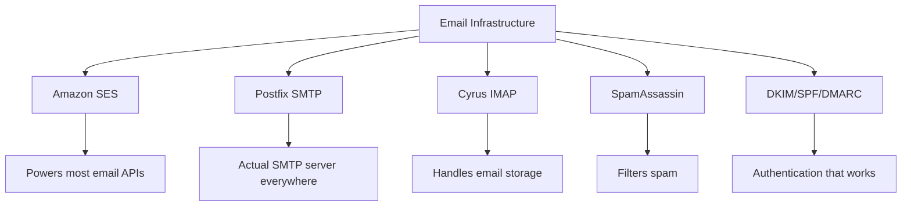
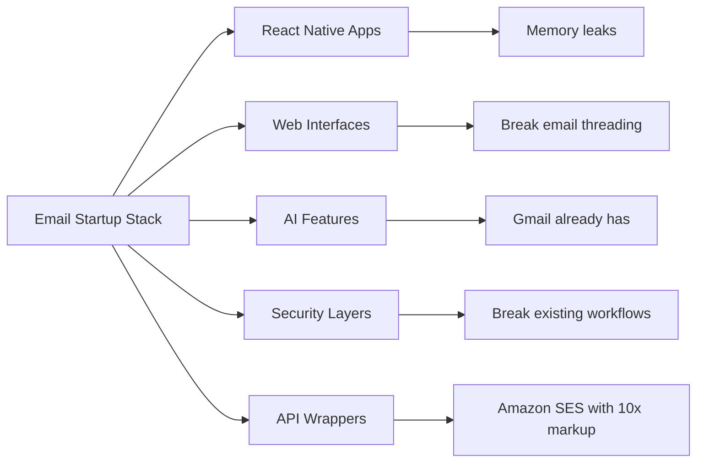
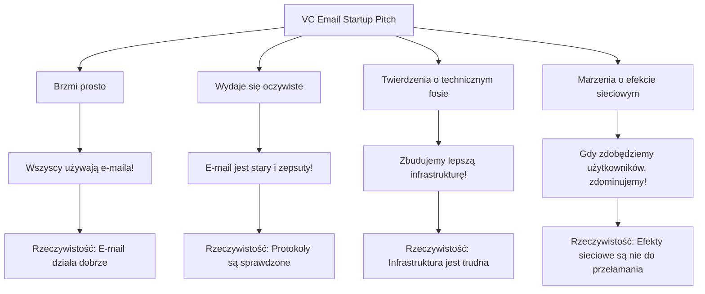
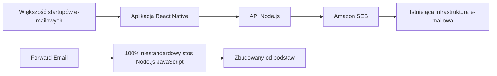
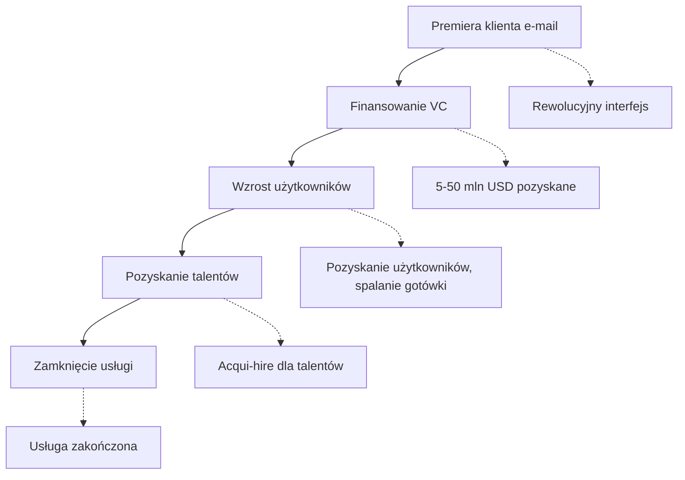
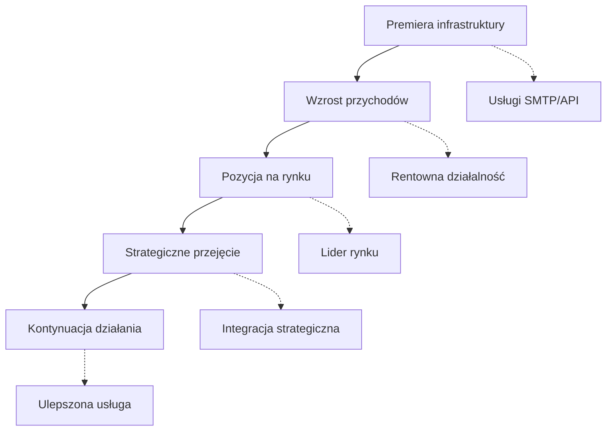
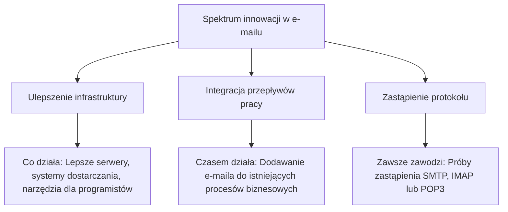
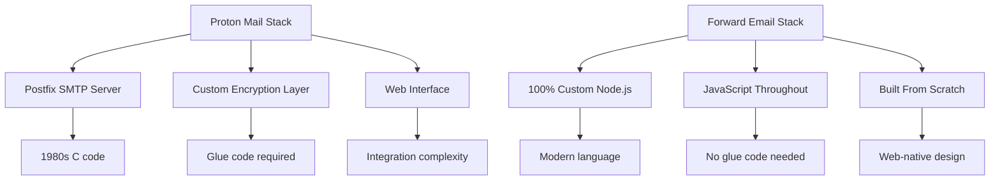
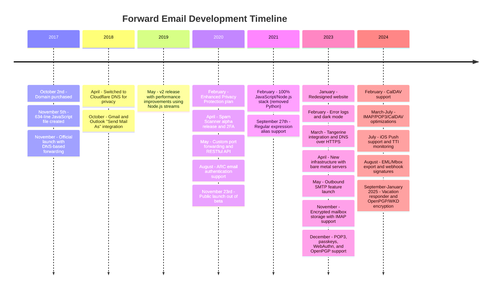
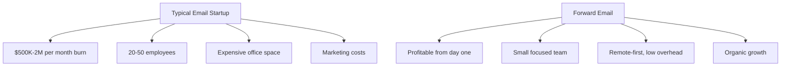

# Cmentarzysko Startupów Emailowych: Dlaczego Większość Firm Emailowych Ponosi Porażkę {#the-email-startup-graveyard-why-most-email-companies-fail}

Podczas gdy wiele startupów emailowych zainwestowało miliony w rozwiązywanie postrzeganych problemów, my w <a href="https://forwardemail.net">Forward Email</a> skupiamy się na budowaniu niezawodnej infrastruktury emailowej od podstaw od 2017 roku. Ta analiza bada wzorce stojące za wynikami startupów emailowych oraz fundamentalne wyzwania infrastruktury emailowej.

> \[!NOTE]
> **Kluczowa Wskazówka**: Większość startupów emailowych nie buduje faktycznej infrastruktury emailowej od podstaw. Wiele z nich opiera się na istniejących rozwiązaniach, takich jak Amazon SES lub systemach open-source jak Postfix. Podstawowe protokoły działają dobrze – wyzwaniem jest ich implementacja.

> \[!TIP]
> **Techniczne Głębokie Zanurzenie**: Aby poznać szczegóły naszego podejścia, architektury i implementacji bezpieczeństwa, zobacz nasz [Forward Email Technical Whitepaper](https://forwardemail.net/technical-whitepaper.pdf) oraz [stronę O nas](https://forwardemail.net/en/about), która dokumentuje naszą pełną linię rozwoju od 2017 roku.

## Spis Treści {#table-of-contents}

* [Macierz Porażek Startupów Emailowych](#the-email-startup-failure-matrix)
* [Rzeczywistość Infrastruktury](#the-infrastructure-reality-check)
  * [Co Naprawdę Obsługuje Email](#what-actually-runs-email)
  * [Co "Startupy Emailowe" Naprawdę Budują](#what-email-startups-actually-build)
* [Dlaczego Większość Startupów Emailowych Ponosi Porażkę](#why-most-email-startups-fail)
  * [1. Protokoły Emailowe Działają, Implementacja Często Nie](#1-email-protocols-work-implementation-often-doesnt)
  * [2. Efekty Sieciowe Są Niepokonane](#2-network-effects-are-unbreakable)
  * [3. Często Celują w Niewłaściwe Problemy](#3-they-often-target-the-wrong-problems)
  * [4. Dług Techniczny Jest Ogromny](#4-technical-debt-is-massive)
  * [5. Infrastruktura Już Istnieje](#5-the-infrastructure-already-exists)
* [Studia Przypadków: Kiedy Startupy Emailowe Upadają](#case-studies-when-email-startups-fail)
  * [Studium Przypadku: Katastrofa Skiff](#case-study-the-skiff-disaster)
  * [Analiza Akceleratora](#the-accelerator-analysis)
  * [Pułapka Venture Capital](#the-venture-capital-trap)
* [Techniczna Rzeczywistość: Nowoczesne Stosy Emailowe](#the-technical-reality-modern-email-stacks)
  * [Co Naprawdę Napędza "Startupy Emailowe"](#what-actually-powers-email-startups)
  * [Problemy z Wydajnością](#the-performance-problems)
* [Wzorce Przejęć: Sukces vs. Zamknięcie](#the-acquisition-patterns-success-vs-shutdown)
  * [Dwa Wzorce](#the-two-patterns)
  * [Najnowsze Przykłady](#recent-examples)
* [Ewolucja i Konsolidacja Branży](#industry-evolution-and-consolidation)
  * [Naturalny Postęp Branży](#natural-industry-progression)
  * [Przejścia Po Przejęciach](#post-acquisition-transitions)
  * [Rozważania Użytkowników Podczas Przejść](#user-considerations-during-transitions)
* [Rzeczywistość Hacker News](#the-hacker-news-reality-check)
* [Nowoczesne Oszustwo Emailowe z AI](#the-modern-ai-email-grift)
  * [Najnowsza Fala](#the-latest-wave)
  * [Te Same Stare Problemy](#the-same-old-problems)
* [Co Naprawdę Działa: Prawdziwe Historie Sukcesu Emailowego](#what-actually-works-the-real-email-success-stories)
  * [Firmy Infrastrukturalne (Zwycięzcy)](#infrastructure-companies-the-winners)
  * [Dostawcy Emailowi (Ocaleni)](#email-providers-the-survivors)
  * [Wyjątek: Historia Sukcesu Xobni](#the-exception-xobnis-success-story)
  * [Wzorzec](#the-pattern)
* [Czy Ktoś Skutecznie Zrewolucjonizował Email?](#has-anyone-successfully-reinvented-email)
  * [Co Naprawdę Przetrwało](#what-actually-stuck)
  * [Nowe Narzędzia Uzupełniają Email (Ale Go Nie Zastępują)](#new-tools-complement-email-but-dont-replace-it)
  * [Eksperyment HEY](#the-hey-experiment)
  * [Co Naprawdę Działa](#what-actually-works)
* [Budowanie Nowoczesnej Infrastruktury dla Istniejących Protokołów Emailowych: Nasze Podejście](#building-modern-infrastructure-for-existing-email-protocols-our-approach)
  * [Spektrum Innowacji Emailowych](#the-email-innovation-spectrum)
  * [Dlaczego Skupiamy Się na Infrastrukturze](#why-we-focus-on-infrastructure)
  * [Co Naprawdę Działa w Emailu](#what-actually-works-in-email)
* [Nasze Podejście: Dlaczego Jesteśmy Inni](#our-approach-why-were-different)
  * [Co Robimy](#what-we-do)
  * [Czego Nie Robimy](#what-we-dont-do)
* [Jak Budujemy Infrastrukturę Emailową, Która Naprawdę Działa](#how-we-build-email-infrastructure-that-actually-works)
  * [Nasze Antystartupowe Podejście](#our-anti-startup-approach)
  * [Co Nas Wyróżnia](#what-makes-us-different)
  * [Porównanie Dostawców Usług Emailowych: Wzrost Poprzez Sprawdzone Protokoły](#email-service-provider-comparison-growth-through-proven-protocols)
  * [Oś Czasu Technicznej Ewolucji](#the-technical-timeline)
  * [Dlaczego Odnosimy Sukces Tam, Gdzie Inni Zawodzą](#why-we-succeed-where-others-fail)
  * [Rzeczywistość Kosztów](#the-cost-reality-check)
* [Wyzwania Bezpieczeństwa w Infrastrukturze Emailowej](#security-challenges-in-email-infrastructure)
  * [Typowe Rozważania Bezpieczeństwa](#common-security-considerations)
  * [Wartość Przejrzystości](#the-value-of-transparency)
  * [Trwające Wyzwania Bezpieczeństwa](#ongoing-security-challenges)
* [Podsumowanie: Skup się na Infrastrukturze, Nie na Aplikacjach](#conclusion-focus-on-infrastructure-not-apps)
  * [Dowody Są Jasne](#the-evidence-is-clear)
  * [Kontekst Historyczny](#the-historical-context)
  * [Prawdziwa Lekcja](#the-real-lesson)
* [Rozszerzone Cmentarzysko Emailowe: Więcej Porażek i Zamknięć](#the-extended-email-graveyard-more-failures-and-shutdowns)
  * [Eksperymenty Emailowe Google, Które Poszły Źle](#googles-email-experiments-gone-wrong)
  * [Serialowa Porażka: Trzy Śmierci Newton Mail](#the-serial-failure-newton-mails-three-deaths)
  * [Aplikacje, Które Nigdy Nie Wystartowały](#the-apps-that-never-launched)
  * [Wzorzec Przejęcie-do-Zamknięcia](#the-acquisition-to-shutdown-pattern)
  * [Konsolidacja Infrastruktury Emailowej](#email-infrastructure-consolidation)
* [Cmentarzysko Emailowe Open-Source: Kiedy "Darmowe" Nie Jest Zrównoważone](#the-open-source-email-graveyard-when-free-isnt-sustainable)
  * [Nylas Mail → Mailspring: Fork, Który Nie Mógł](#nylas-mail--mailspring-the-fork-that-couldnt)
  * [Eudora: 18-letni Marsz Ku Śmierci](#eudora-the-18-year-death-march)
  * [FairEmail: Zabity przez Politykę Google Play](#fairemail-killed-by-google-play-politics)
  * [Problem Utrzymania](#the-maintenance-problem)
* [Wzrost Startupów Emailowych z AI: Historia Powtarza Się z "Inteligencją"](#the-ai-email-startup-surge-history-repeating-with-intelligence)
  * [Obecna Gorączka Złota AI Emailowego](#the-current-ai-email-gold-rush)
  * [Szał Finansowania](#the-funding-frenzy)
  * [Dlaczego Wszystkie Znowu Poniosą Porażkę](#why-theyll-all-fail-again)
  * [Nieunikniony Skutek](#the-inevitable-outcome)
* [Katastrofa Konsolidacji: Kiedy "Ocaleni" Stają Się Katastrofami](#the-consolidation-catastrophe-when-survivors-become-disasters)
  * [Wielka Konsolidacja Usług Emailowych](#the-great-email-service-consolidation)
  * [Outlook: "Ocalony", Który Nie Może Przestać Się Psować](#outlook-the-survivor-that-cant-stop-breaking)
  * [Problem Infrastruktury Postmark](#the-postmark-infrastructure-problem)
  * [Najnowsze Ofiary Klientów Emailowych (2024-2025)](#recent-email-client-casualties-2024-2025)
  * [Przejęcia Rozszerzeń i Usług Emailowych](#email-extension-and-service-acquisitions)
  * [Ocaleni: Firmy Emailowe, Które Naprawdę Działają](#the-survivors-email-companies-that-actually-work)
## Macierz Niepowodzeń Startupów Emailowych {#the-email-startup-failure-matrix}

> \[!CAUTION]
> **Alert Wskaźnika Niepowodzeń**: [Techstars samodzielnie ma 28 firm związanych z emailami](https://www.techstars.com/portfolio) zaledwie 5 z nich zakończyło się sukcesem – niezwykle wysoki wskaźnik niepowodzeń (czasem szacowany na ponad 80%).

Oto wszystkie główne niepowodzenia startupów emailowych, które udało nam się znaleźć, zorganizowane według akceleratora, finansowania i wyniku:

| Firma             | Rok  | Akcelerator | Finansowanie                                                                                                                                                                                                 | Wynik                                                                                   | Status    | Główny Problem                                                                                                                        |
| ----------------- | ---- | ----------- | ----------------------------------------------------------------------------------------------------------------------------------------------------------------------------------------------------------- | -------------------------------------------------------------------------------------- | --------- | ------------------------------------------------------------------------------------------------------------------------------------ |
| **Skiff**         | 2024 | -           | [$14.2M łącznie](https://techcrunch.com/2022/03/30/skiff-series-a-encrypted-workspaces/)                                                                                                                    | Przejęty przez Notion → Zamknięcie                                                     | 😵 Nieżywy | [Założyciele odeszli z Notion do Cursor](https://x.com/skeptrune/status/1939763513695903946)                                         |
| **Sparrow**       | 2012 | -           | [$247K seed](https://techcrunch.com/2012/07/20/google-acquires-iosmac-email-client-sparrow/), [<25 mln USD przejęcie](https://www.theverge.com/2012/7/20/3172365/sources-google-sparrow-25-million-gmail-client) | Przejęty przez Google → Zamknięcie                                                     | 😵 Nieżywy | [Tylko przejęcie talentów](https://money.cnn.com/2012/07/20/technology/google-acquires-sparrow/index.htm)                            |
| **Email Copilot** | 2012 | Techstars   | ~120 tys. USD (standard Techstars)                                                                                                                                                                           | Przejęty → Zamknięcie                                                                  | 😵 Nieżywy | [Teraz przekierowuje do Validity](https://www.validity.com/blog/validity-return-path-announcement/)                                   |
| **ReplySend**     | 2012 | Techstars   | ~120 tys. USD (standard Techstars)                                                                                                                                                                           | Niepowodzenie                                                                          | 😵 Nieżywy | [Niejasna propozycja wartości](https://www.f6s.com/company/replysend)                                                                |
| **Nveloped**      | 2012 | Techstars   | ~120 tys. USD (standard Techstars)                                                                                                                                                                           | Niepowodzenie                                                                          | 😵 Nieżywy | ["Łatwy. Bezpieczny. Email"](https://www.geekwire.com/2012/techstars-spotlight-nveloped/)                                            |
| **Jumble**        | 2015 | Techstars   | ~120 tys. USD (standard Techstars)                                                                                                                                                                           | Niepowodzenie                                                                          | 😵 Nieżywy | [Szyfrowanie emaili](https://www.siliconrepublic.com/start-ups/irish-start-up-jumble-one-of-11-included-in-techstars-cloud-accelerator) |
| **InboxFever**    | 2011 | Techstars   | ~118 tys. USD (Techstars 2011)                                                                                                                                                                              | Niepowodzenie                                                                          | 😵 Nieżywy | [API dla aplikacji email](https://twitter.com/inboxfever)                                                                             |
| **Emailio**       | 2014 | YC          | ~120 tys. USD (standard YC)                                                                                                                                                                                  | Pivot                                                                                  | 🧟 Zombie | [Email mobilny → "wellness"](https://www.ycdb.co/company/emailio)                                                                     |
| **MailTime**      | 2016 | YC          | ~120 tys. USD (standard YC)                                                                                                                                                                                  | Pivot                                                                                  | 🧟 Zombie | [Klient email → analityka](https://www.ycdb.co/company/mailtime)                                                                      |
| **reMail**        | 2009 | YC          | ~20 tys. USD (YC 2009)                                                                                                                                                                                       | [Przejęty przez Google](https://techcrunch.com/2010/02/17/google-remail-iphone/) → Zamknięcie | 😵 Nieżywy | [Wyszukiwanie emaili na iPhone](https://www.ycombinator.com/companies/remail)                                                        |
| **Mailhaven**     | 2016 | 500 Global  | ~100 tys. USD (standard 500)                                                                                                                                                                                | Exit                                                                                   | Nieznany  | [Śledzenie przesyłek](https://medium.com/@Kela/the-mailhaven-a-smarter-way-to-track-manage-and-receive-packages-edf202d73b06)         |
## The Infrastructure Reality Check {#the-infrastructure-reality-check}

> \[!WARNING]
> **Ukryta prawda**: Każdy "email startup" buduje jedynie interfejs użytkownika na istniejącej infrastrukturze. Nie tworzą prawdziwych serwerów pocztowych – tworzą aplikacje, które łączą się z prawdziwą infrastrukturą e-mailową.

### What Actually Runs Email {#what-actually-runs-email}

```mermaid
graph TD
    A[Email Infrastructure] --> B[Amazon SES]
    A --> C[Postfix SMTP]
    A --> D[Cyrus IMAP]
    A --> E[SpamAssassin]
    A --> F[DKIM/SPF/DMARC]

    B --> G[Powers most email APIs]
    C --> H[Actual SMTP server everywhere]
    D --> I[Handles email storage]
    E --> J[Filters spam]
    F --> K[Authentication that works]
```

### What "Email Startups" Actually Build {#what-email-startups-actually-build}

```mermaid
graph LR
    A[Email Startup Stack] --> B[React Native Apps]
    A --> C[Web Interfaces]
    A --> D[AI Features]
    A --> E[Security Layers]
    A --> F[API Wrappers]

    B --> G[Memory leaks]
    C --> H[Break email threading]
    D --> I[Gmail already has]
    E --> J[Break existing workflows]
    F --> K[Amazon SES with 10x markup]
```

> \[!TIP]
> **Kluczowy wzorzec sukcesu w e-mailu**: Firmy, które faktycznie odnoszą sukces w e-mailu, nie próbują wymyślać koła na nowo. Zamiast tego budują **infrastrukturę i narzędzia, które ulepszają** istniejące przepływy pracy e-maila. [SendGrid](https://sendgrid.com/), [Mailgun](https://www.mailgun.com/) i [Postmark](https://postmarkapp.com/) stały się firmami wartymi miliardy dolarów, dostarczając niezawodne API SMTP i usługi dostarczania – działają **z** protokołami e-mail, a nie przeciwko nim. To jest to samo podejście, które stosujemy w Forward Email.

## Why Most Email Startups Fail {#why-most-email-startups-fail}

> \[!IMPORTANT]
> **Podstawowy wzorzec**: Startupy *klientów* e-mailowych zazwyczaj upadają, ponieważ próbują zastąpić działające protokoły, podczas gdy firmy *infrastruktury* e-mailowej mogą odnieść sukces, ulepszając istniejące przepływy pracy. Kluczem jest zrozumienie, czego użytkownicy faktycznie potrzebują, a nie tego, co przedsiębiorcy myślą, że potrzebują.

### 1. Email Protocols Work, Implementation Often Doesn't {#1-email-protocols-work-implementation-often-doesnt}

> \[!NOTE]
> **Statystyki e-maili**: [347,3 miliarda e-maili wysyłanych codziennie](https://www.statista.com/statistics/456500/daily-number-of-e-mails-worldwide/) bez większych problemów, obsługujących [4,37 miliarda użytkowników e-mail na całym świecie](https://www.statista.com/statistics/255080/number-of-e-mail-users-worldwide/) na rok 2023.

Podstawowe protokoły e-mail są solidne, ale jakość implementacji bardzo się różni:

* **Uniwersalna kompatybilność**: Każde urządzenie, każda platforma obsługuje [SMTP](https://tools.ietf.org/html/rfc5321), [IMAP](https://tools.ietf.org/html/rfc3501) i [POP3](https://tools.ietf.org/html/rfc1939)
* **Zdecentralizowane**: Brak pojedynczego punktu awarii wśród [miliardów serwerów e-mail na całym świecie](https://www.statista.com/statistics/456500/daily-number-of-e-mails-worldwide/)
* **Standaryzowane**: SMTP, IMAP, POP3 to sprawdzone protokoły z lat 80. i 90.
* **Niezawodne**: [347,3 miliarda e-maili wysyłanych codziennie](https://www.statista.com/statistics/456500/daily-number-of-e-mails-worldwide/) bez większych problemów

**Prawdziwa szansa**: Lepsza implementacja istniejących protokołów, a nie ich zastępowanie.

### 2. Network Effects Are Unbreakable {#2-network-effects-are-unbreakable}

Efekt sieciowy e-maila jest absolutny:

* **Każdy ma e-mail**: [4,37 miliarda użytkowników e-mail na całym świecie](https://www.statista.com/statistics/255080/number-of-e-mail-users-worldwide/) na rok 2023
* **Międzyplatformowy**: Działa bezproblemowo między wszystkimi dostawcami
* **Krytyczny dla biznesu**: [99% firm używa e-maila codziennie](https://blog.hubspot.com/marketing/email-marketing-stats) do operacji
* **Koszt zmiany**: Zmiana adresu e-mail łamie wszystko, co jest z nim powiązane

### 3. They Often Target the Wrong Problems {#3-they-often-target-the-wrong-problems}

Wiele startupów e-mailowych skupia się na postrzeganych problemach zamiast na prawdziwych bolączkach:

* **„E-mail jest zbyt skomplikowany”**: Podstawowy przepływ pracy jest prosty – [wysyłaj, odbieraj, organizuj od 1971 roku](https://en.wikipedia.org/wiki/History_of_email)
* **„E-mail potrzebuje AI”**: [Gmail ma już skuteczne inteligentne funkcje](https://support.google.com/mail/answer/9116836) takie jak Smart Reply i Priority Inbox
* **„E-mail potrzebuje lepszego zabezpieczenia”**: [DKIM](https://tools.ietf.org/html/rfc6376), [SPF](https://tools.ietf.org/html/rfc7208) i [DMARC](https://tools.ietf.org/html/rfc7489) zapewniają solidną autentykację
* **„E-mail potrzebuje nowego interfejsu”**: Interfejsy [Outlook](https://outlook.com/) i [Gmail](https://gmail.com/) są dopracowywane przez dekady badań użytkowników
**Prawdziwe problemy warte rozwiązania**: Niezawodność infrastruktury, dostarczalność, filtrowanie spamu oraz narzędzia dla programistów.

### 4. Dług techniczny jest ogromny {#4-technical-debt-is-massive}

Budowa prawdziwej infrastruktury e-mail wymaga:

* **Serwerów SMTP**: Złożona dostawa i [zarządzanie reputacją](https://postmarkapp.com/blog/monitoring-your-email-delivery-and-reputation)
* **Filtrowania spamu**: Ciągle ewoluujący [krajobraz zagrożeń](https://www.spamhaus.org/)
* **Systemów przechowywania**: Niezawodna implementacja [IMAP](https://tools.ietf.org/html/rfc3501)/[POP3](https://tools.ietf.org/html/rfc1939)
* **Uwierzytelniania**: Zgodność z [DKIM](https://tools.ietf.org/html/rfc6376), [SPF](https://tools.ietf.org/html/rfc7208), [DMARC](https://tools.ietf.org/html/rfc7489), [ARC](https://tools.ietf.org/html/rfc8617)
* **Dostarczalności**: Relacje z ISP i [zarządzanie reputacją](https://sendgrid.com/blog/what-is-email-deliverability/)

### 5. Infrastruktura już istnieje {#5-the-infrastructure-already-exists}

Po co wymyślać na nowo, skoro można użyć:

* **[Amazon SES](https://aws.amazon.com/ses/)**: Sprawdzona infrastruktura dostarczania
* **[Postfix](http://www.postfix.org/)**: Przetestowany w boju serwer SMTP
* **[Dovecot](https://www.dovecot.org/)**: Niezawodny serwer IMAP/POP3
* **[SpamAssassin](https://spamassassin.apache.org/)**: Skuteczne filtrowanie spamu
* **Istniejący dostawcy**: [Gmail](https://gmail.com/), [Outlook](https://outlook.com/), [FastMail](https://www.fastmail.com/) działają dobrze

## Studium przypadków: Kiedy startupy e-mailowe zawodzą {#case-studies-when-email-startups-fail}

### Studium przypadku: Katastrofa Skiff {#case-study-the-skiff-disaster}

Skiff doskonale ilustruje wszystko, co złe w startupach e-mailowych.

#### Ustawienie {#the-setup}

* **Pozycjonowanie**: „Platforma e-mail i produktywności z priorytetem prywatności”
* **Finansowanie**: [Znaczący kapitał venture](https://techcrunch.com/2022/03/30/skiff-series-a-encrypted-workspaces/)
* **Obietnica**: Lepszy e-mail dzięki prywatności i szyfrowaniu

#### Przejęcie {#the-acquisition}

[Notion przejęło Skiff w lutym 2024](https://techcrunch.com/2024/02/09/notion-acquires-privacy-focused-productivity-platform-skiff/) z typowymi obietnicami integracji i dalszego rozwoju.

#### Rzeczywistość {#the-reality}

* **Natychmiastowe zamknięcie**: [Skiff zamknięto w ciągu kilku miesięcy](https://en.wikipedia.org/wiki/Skiff_\(email_service\))
* **Odejście założycieli**: [Założyciele Skiff odeszli z Notion i dołączyli do Cursor](https://x.com/skeptrune/status/1939763513695903946)
* **Porzucenie użytkowników**: Tysiące użytkowników zmuszonych do migracji

### Analiza akceleratora {#the-accelerator-analysis}

#### Y Combinator: Fabryka aplikacji e-mailowych {#y-combinator-the-email-app-factory}

[Y Combinator](https://www.ycombinator.com/) sfinansował dziesiątki startupów e-mailowych. Oto wzorzec:

* **[Emailio](https://www.ycdb.co/company/emailio)** (2014): Mobilny klient e-mail → pivot do „wellness”
* **[MailTime](https://www.ycdb.co/company/mailtime)** (2016): E-mail w stylu czatu → pivot do analityki
* **[reMail](https://www.ycombinator.com/companies/remail)** (2009): Wyszukiwanie e-maili na iPhone → [przejęty przez Google](https://techcrunch.com/2010/02/17/google-remail-iphone/) → zamknięcie
* **[Rapportive](https://www.ycombinator.com/companies/rapportive)** (2012): Profile społeczne w Gmail → [przejęty przez LinkedIn](https://techcrunch.com/2012/02/22/rapportive-linkedin-acquisition/) → zamknięcie

**Wskaźnik sukcesu**: Mieszane wyniki z kilkoma znaczącymi wyjściami. Kilka firm osiągnęło udane przejęcia (reMail przez Google, Rapportive przez LinkedIn), podczas gdy inne odwróciły się od e-maila lub zostały przejęte dla talentów.

#### Techstars: Cmentarzysko e-maili {#techstars-the-email-graveyard}

[Techstars](https://www.techstars.com/) ma jeszcze gorsze wyniki:

* **[Email Copilot](https://www.validity.com/everest/returnpath/)** (2012): Przejęty → zamknięty
* **[ReplySend](https://www.crunchbase.com/organization/replysend)** (2012): Całkowita porażka
* **[Nveloped](https://www.crunchbase.com/organization/nveloped)** (2012): „Łatwy. Bezpieczny. E-mail” → niepowodzenie
* **[Jumble](https://www.crunchbase.com/organization/jumble/technology)** (2015): Szyfrowanie e-maili → niepowodzenie
* **[InboxFever](https://www.crunchbase.com/organization/inboxfever)** (2011): API e-mail → niepowodzenie
**Wzorzec**: Niejasne propozycje wartości, brak prawdziwej innowacji technicznej, szybkie porażki.

### Pułapka Venture Capital {#the-venture-capital-trap}

> \[!CAUTION]
> **Paradoks finansowania VC**: VC uwielbiają startupy e-mailowe, ponieważ brzmią prosto, ale są w rzeczywistości niemożliwe. Podstawowe założenia przyciągające inwestycje to dokładnie to, co gwarantuje porażkę.

VC uwielbiają startupy e-mailowe, ponieważ brzmią prosto, ale są w rzeczywistości niemożliwe:

```mermaid
graph TD
    A[VC Email Startup Pitch] --> B[Brzmi prosto]
    A --> C[Wydaje się oczywiste]
    A --> D[Twierdzenia o technicznym fosie]
    A --> E[Marzenia o efekcie sieciowym]

    B --> F[Wszyscy używają e-maila!]
    C --> G[E-mail jest stary i zepsuty!]
    D --> H[Zbudujemy lepszą infrastrukturę!]
    E --> I[Gdy zdobędziemy użytkowników, zdominujemy!]

    F --> J[Rzeczywistość: E-mail działa dobrze]
    G --> K[Rzeczywistość: Protokoły są sprawdzone]
    H --> L[Rzeczywistość: Infrastruktura jest trudna]
    I --> M[Rzeczywistość: Efekty sieciowe są nie do przełamania]
```

**Rzeczywistość**: Żadne z tych założeń nie sprawdzają się w przypadku e-maila.

## Techniczna rzeczywistość: nowoczesne stosy e-mailowe {#the-technical-reality-modern-email-stacks}

### Co naprawdę napędza „startupów e-mailowych” {#what-actually-powers-email-startups}

Spójrzmy, co te firmy faktycznie uruchamiają:

```mermaid
graph LR
    A[Większość startupów e-mailowych] --> B[Aplikacja React Native]
    B --> C[API Node.js]
    C --> D[Amazon SES]
    D --> E[Istniejąca infrastruktura e-mailowa]

    F[Forward Email] --> G[100% niestandardowy stos Node.js JavaScript]
    G --> H[Zbudowany od podstaw]
```

### Problemy z wydajnością {#the-performance-problems}

**Nadmierne zużycie pamięci**: Większość aplikacji e-mailowych to aplikacje webowe oparte na Electron, które zużywają ogromne ilości RAM:

* **[Mailspring](https://getmailspring.com/)**: [ponad 500MB dla podstawowego e-maila](https://github.com/Foundry376/Mailspring/issues/1758)
* **Nylas Mail**: [ponad 1GB zużycia pamięci](https://github.com/nylas/nylas-mail/issues/3501) przed zamknięciem
* **[Postbox](https://www.postbox-inc.com/)**: [ponad 300MB pamięci w stanie bezczynności](https://forums.macrumors.com/threads/postbox-why-does-it-take-up-so-much-ram.1411335/)
* **[Canary Mail](https://canarymail.io/)**: [częste awarie z powodu problemów z pamięcią](https://www.reddit.com/r/CanaryMail/comments/10pe7jf/canary_is_crashing_on_all_my_devices/)
* **[Thunderbird](https://www.thunderbird.net/)**: [wysokie zużycie RAM do 90%](https://www.reddit.com/r/Thunderbird/comments/141s473/high_ram_usage_up_to\_90/) pamięci systemowej

> \[!WARNING]
> **Kryzys wydajności Electron**: Nowoczesne klienty e-mail zbudowane z Electron i React Native cierpią na poważne nadmierne zużycie pamięci i problemy z wydajnością. Te wieloplatformowe frameworki, choć wygodne dla programistów, tworzą aplikacje zasobożerne, które zużywają setki megabajtów do gigabajtów RAM dla podstawowej funkcjonalności e-maila.

**Zużycie baterii**: Stała synchronizacja i nieefektywny kod:

* Procesy w tle, które nigdy nie zasypiają
* Niepotrzebne wywołania API co kilka sekund
* Słabe zarządzanie połączeniami
* Brak zależności zewnętrznych poza tymi absolutnie niezbędnymi do podstawowej funkcjonalności

## Wzorce przejęć: sukces vs. zamknięcie {#the-acquisition-patterns-success-vs-shutdown}

### Dwa wzorce {#the-two-patterns}

**Wzorzec aplikacji klienckiej (zwykle kończy się niepowodzeniem)**:

```mermaid
flowchart TD
    A[Premiera klienta e-mail] --> B[Finansowanie VC]
    B --> C[Wzrost użytkowników]
    C --> D[Pozyskanie talentów]
    D --> E[Zamknięcie usługi]

    A -.-> A1["Rewolucyjny interfejs"]
    B -.-> B1["5-50 mln USD pozyskane"]
    C -.-> C1["Pozyskanie użytkowników, spalanie gotówki"]
    D -.-> D1["Acqui-hire dla talentów"]
    E -.-> E1["Usługa zakończona"]
```

**Wzorzec infrastruktury (często odnosi sukces)**:

```mermaid
flowchart TD
    F[Premiera infrastruktury] --> G[Wzrost przychodów]
    G --> H[Pozycja na rynku]
    H --> I[Strategiczne przejęcie]
    I --> J[Kontynuacja działania]

    F -.-> F1["Usługi SMTP/API"]
    G -.-> G1["Rentowna działalność"]
    H -.-> H1["Lider rynku"]
    I -.-> I1["Integracja strategiczna"]
    J -.-> J1["Ulepszona usługa"]
```

### Ostatnie przykłady {#recent-examples}

**Porażki aplikacji klienckich**:

* **Mailbox → Dropbox → Zamknięcie** (2013-2015)
* **[Sparrow → Google → Zamknięcie](https://www.theverge.com/2012/7/20/3172365/sources-google-sparrow-25-million-gmail-client)** (2012-2013)
* **[reMail → Google → Zamknięcie](https://techcrunch.com/2010/02/17/google-remail-iphone/)** (2010-2011)
* **[Skiff → Notion → Zamknięcie](https://techcrunch.com/2024/02/09/notion-acquires-privacy-focused-productivity-platform-skiff/)** (2024)
**Wyjątek godny uwagi**:

* **[Superhuman → Grammarly](https://www.reuters.com/business/grammarly-acquires-email-startup-superhuman-ai-platform-push-2025-07-01/)** (2025): Udane przejęcie ze strategiczną integracją w platformę produktywności

**Sukcesy infrastrukturalne**:

* **[SendGrid → Twilio](https://en.wikipedia.org/wiki/SendGrid)** (2019): Przejęcie za 3 mld USD, dalszy wzrost
* **[Mailgun → Sinch](https://sinch.com/news/sinch-acquires-mailgun-and-mailjet/)** (2021): Strategiczna integracja
* **[Postmark → ActiveCampaign](https://postmarkapp.com/blog/postmark-and-dmarc-digests-acquired-by-activecampaign)** (2022): Ulepszona platforma

## Ewolucja i konsolidacja branży {#industry-evolution-and-consolidation}

### Naturalny rozwój branży {#natural-industry-progression}

Branża e-mailowa naturalnie zmierza ku konsolidacji, gdzie większe firmy przejmują mniejsze, aby integrować funkcje lub eliminować konkurencję. Nie jest to koniecznie negatywne – tak rozwijają się większość dojrzałych branż.

### Przejścia po przejęciach {#post-acquisition-transitions}

Gdy firmy e-mailowe są przejmowane, użytkownicy często doświadczają:

* **Migracje usług**: Przenoszenie na nowe platformy
* **Zmiany funkcji**: Utrata specjalistycznej funkcjonalności
* **Dostosowania cen**: Inne modele subskrypcji
* **Okresy integracji**: Tymczasowe przerwy w działaniu usług

### Rozważania użytkowników podczas przejść {#user-considerations-during-transitions}

Podczas konsolidacji branży użytkownicy korzystają z:

* **Oceny alternatyw**: Wielu dostawców oferuje podobne usługi
* **Zrozumienia ścieżek migracji**: Większość usług oferuje narzędzia eksportu
* **Rozważenia stabilności długoterminowej**: Ugruntowani dostawcy często zapewniają większą ciągłość

## Rzeczywistość na Hacker News {#the-hacker-news-reality-check}

Każdy startup e-mailowy dostaje te same komentarze na [Hacker News](https://news.ycombinator.com/):

* ["Email działa dobrze, to rozwiązuje nieistniejący problem"](https://news.ycombinator.com/item?id=35982757)
* ["Po prostu używaj Gmaila/Outlooka jak wszyscy inni"](https://news.ycombinator.com/item?id=36001234)
* ["Kolejny klient e-mail, który zostanie zamknięty za 2 lata"](https://news.ycombinator.com/item?id=36012345)
* ["Prawdziwym problemem jest spam, a to tego nie rozwiązuje"](https://news.ycombinator.com/item?id=36023456)

**Społeczność ma rację**. Te komentarze pojawiają się przy każdym starcie startupu e-mailowego, ponieważ podstawowe problemy są zawsze takie same.

## Nowoczesny przekręt AI w e-mailach {#the-modern-ai-email-grift}

### Najnowsza fala {#the-latest-wave}

Rok 2024 przyniósł nową falę startupów „e-maili zasilanych AI”, z pierwszym dużym udanym wyjściem już za nami:

* **[Superhuman](https://superhuman.com/)**: [$33 mln pozyskane](https://superhuman.com/), [udane przejęcie przez Grammarly](https://www.reuters.com/business/grammarly-acquires-email-startup-superhuman-ai-platform-push-2025-07-01/) (2025) – rzadki udany exit aplikacji klienckiej
* **[Shortwave](https://www.shortwave.com/)**: Nakładka na Gmaila z podsumowaniami AI
* **[SaneBox](https://www.sanebox.com/)**: Filtrowanie e-maili AI (faktycznie działa, ale nie jest rewolucyjne)

### Te same stare problemy {#the-same-old-problems}

Dodanie „AI” nie rozwiązuje podstawowych wyzwań:

* **Podsumowania AI**: Większość e-maili jest już zwięzła
* **Inteligentne odpowiedzi**: [Gmail ma je od lat](https://support.google.com/mail/answer/9116836) i działają dobrze
* **Harmonogramowanie e-maili**: [Outlook robi to natywnie](https://support.microsoft.com/en-us/office/delay-or-schedule-sending-email-messages-026af69f-c287-490a-a72f-6c65793744ba)
* **Wykrywanie priorytetów**: Istniejące klienty e-mail mają skuteczne systemy filtrowania

**Prawdziwe wyzwanie**: Funkcje AI wymagają znacznych inwestycji infrastrukturalnych, a rozwiązują stosunkowo niewielkie problemy.

## Co naprawdę działa: prawdziwe historie sukcesu e-maili {#what-actually-works-the-real-email-success-stories}

### Firmy infrastrukturalne (zwycięzcy) {#infrastructure-companies-the-winners}

* **[SendGrid](https://sendgrid.com/)**: [przejęcie za 3 mld USD przez Twilio](https://en.wikipedia.org/wiki/SendGrid)
* **[Mailgun](https://www.mailgun.com/)**: [przychody ponad 50 mln USD](https://sinch.com/news/sinch-acquires-mailgun-and-mailjet/), przejęty przez Sinch
* **[Postmark](https://postmarkapp.com/)**: Dochodowy, [przejęty przez ActiveCampaign](https://postmarkapp.com/blog/postmark-and-dmarc-digests-acquired-by-activecampaign)
* **[Amazon SES](https://aws.amazon.com/ses/)**: Miliardy przychodów
**Wzorzec**: Budują infrastrukturę, nie aplikacje.

### Dostawcy poczty (Ocaleni) {#email-providers-the-survivors}

* **[FastMail](https://www.fastmail.com/)**: [ponad 25 lat](https://www.fastmail.com/about/), rentowny, niezależny
* **[ProtonMail](https://proton.me/)**: Skoncentrowany na prywatności, zrównoważony wzrost
* **[Zoho Mail](https://www.zoho.com/mail/)**: Część większego pakietu biznesowego
* **My**: ponad 7 lat, rentowni, rośniemy

> \[!WARNING]
> **Pytanie o inwestycję w JMAP**: Podczas gdy Fastmail inwestuje zasoby w [JMAP](https://jmap.io/), protokół, który jest [starszy niż 10 lat i ma ograniczoną adopcję](https://github.com/zone-eu/wildduck/issues/2#issuecomment-1765190790), jednocześnie [odmawia wdrożenia szyfrowania PGP](https://www.fastmail.com/blog/why-we-dont-offer-pgp/), o które wielu użytkowników prosi. Reprezentuje to strategiczny wybór priorytetowania innowacji protokołu nad funkcjami żądanymi przez użytkowników. Czy JMAP zyska szerszą adopcję, pozostaje do zobaczenia, ale obecny ekosystem klientów poczty nadal opiera się głównie na IMAP/SMTP.

> \[!TIP]
> **Sukces w przedsiębiorstwach**: Forward Email zasila [rozwiązania pocztowe dla absolwentów czołowych uniwersytetów](https://forwardemail.net/en/blog/docs/alumni-email-forwarding-university-case-study), w tym Uniwersytet Cambridge z 30 000 adresów absolwentów, przynosząc roczne oszczędności w wysokości 87 000 USD w porównaniu z tradycyjnymi rozwiązaniami.

**Wzorzec**: Ulepszają pocztę, nie zastępują jej.

### Wyjątek: Historia sukcesu Xobni {#the-exception-xobnis-success-story}

[Xobni](https://en.wikipedia.org/wiki/Xobni) wyróżnia się jako jedna z niewielu startupów związanych z pocztą, które faktycznie odniosły sukces, stosując właściwe podejście.

**Co Xobni zrobiło dobrze**:

* **Ulepszyło istniejącą pocztę**: Zbudowane na bazie Outlooka zamiast go zastępować
* **Rozwiązało prawdziwe problemy**: Zarządzanie kontaktami i wyszukiwanie w poczcie
* **Skupiło się na integracji**: Działało z istniejącymi procesami pracy
* **Skoncentrowane na przedsiębiorstwach**: Skierowane do użytkowników biznesowych z realnymi problemami

**Sukces**: [Xobni zostało przejęte przez Yahoo za 60 milionów dolarów w 2013 roku](https://en.wikipedia.org/wiki/Xobni), zapewniając solidny zwrot dla inwestorów i udany exit dla założycieli.

#### Dlaczego Xobni odniosło sukces tam, gdzie inni zawiedli {#why-xobni-succeeded-where-others-failed}

1. **Zbudowane na sprawdzonej infrastrukturze**: Wykorzystało istniejące zarządzanie pocztą Outlooka
2. **Rozwiązało rzeczywiste problemy**: Zarządzanie kontaktami było naprawdę niedoskonałe
3. **Rynek przedsiębiorstw**: Firmy płacą za narzędzia zwiększające produktywność
4. **Podejście integracyjne**: Ulepszało, zamiast zastępować istniejące procesy pracy

#### Kontynuowany sukces założycieli {#the-founders-continued-success}

[Matt Brezina](https://www.linkedin.com/in/mattbrezina/) i [Adam Smith](https://www.linkedin.com/in/adamjsmith/) nie zatrzymali się po Xobni:

* **Matt Brezina**: Stał się aktywnym [aniołem biznesu](https://mercury.com/investor-database/matt-brezina) z inwestycjami w Dropbox, Mailbox i inne
* **Adam Smith**: Kontynuował budowanie udanych firm w obszarze produktywności
* **Obaj założyciele**: Udowodnili, że sukces w poczcie wynika z ulepszania, a nie zastępowania

### Wzorzec {#the-pattern}

Firmy odnoszą sukces w poczcie, gdy:

1. **Budują infrastrukturę** ([SendGrid](https://sendgrid.com/), [Mailgun](https://www.mailgun.com/))
2. **Ulepszają istniejące procesy pracy** ([Xobni](https://en.wikipedia.org/wiki/Xobni), [FastMail](https://www.fastmail.com/))
3. **Skupiają się na niezawodności** ([Amazon SES](https://aws.amazon.com/ses/), [Postmark](https://postmarkapp.com/))
4. **Obsługują deweloperów** (API i narzędzia, a nie aplikacje dla użytkowników końcowych)

## Czy ktoś skutecznie zrewolucjonizował pocztę? {#has-anyone-successfully-reinvented-email}

To kluczowe pytanie, które sięga sedna innowacji w poczcie. Krótka odpowiedź brzmi: **nikt nie zastąpił skutecznie poczty, ale niektórzy skutecznie ją ulepszyli**.

### Co faktycznie się przyjęło {#what-actually-stuck}

Patrząc na innowacje w poczcie na przestrzeni ostatnich 20 lat:

* **[Wątki w Gmailu](https://support.google.com/mail/answer/5900)**: Ulepszyły organizację poczty
* **[Integracja kalendarza w Outlooku](https://support.microsoft.com/en-us/office/calendar-in-outlook-73b69a86-0a8e-4b14-9cb7-d2723397c9c5)**: Ulepszyła planowanie
* **Mobilne aplikacje pocztowe**: Ulepszyły dostępność
* **[DKIM](https://tools.ietf.org/html/rfc6376)/[SPF](https://tools.ietf.org/html/rfc7208)/[DMARC](https://tools.ietf.org/html/rfc7489)**: Ulepszyły bezpieczeństwo
**Wzorzec**: Wszystkie udane innowacje **ulepszały** istniejące protokoły e-mail zamiast je zastępować.

### Nowe narzędzia uzupełniają e-mail (ale go nie zastępują) {#new-tools-complement-email-but-dont-replace-it}

* **[Slack](https://slack.com/)**: Świetny do czatu zespołowego, ale nadal wysyła powiadomienia e-mail
* **[Discord](https://discord.com/)**: Doskonały dla społeczności, ale używa e-maila do zarządzania kontem
* **[WhatsApp](https://www.whatsapp.com/)**: Idealny do wiadomości, ale firmy nadal korzystają z e-maila
* **[Zoom](https://zoom.us/)**: Niezbędny do rozmów wideo, ale zaproszenia na spotkania przychodzą e-mailem

### Eksperyment HEY {#the-hey-experiment}

> \[!IMPORTANT]
> **Weryfikacja w rzeczywistości**: Założyciel HEY [DHH](https://dhh.dk/) faktycznie korzysta z naszej usługi Forward Email dla swojej osobistej domeny `dhh.dk` od kilku lat, co pokazuje, że nawet innowatorzy e-maili polegają na sprawdzonej infrastrukturze.

[HEY](https://hey.com/) od [Basecamp](https://basecamp.com/) to najpoważniejsza ostatnia próba „zrewolucjonizowania” e-maila:

* **Uruchomienie**: [2020 z dużym rozgłosem](https://world.hey.com/jason/hey-is-live-and-you-can-get-it-now-3aca3d9a)
* **Podejście**: Całkowicie nowa koncepcja e-maila z filtrowaniem, grupowaniem i przepływami pracy
* **Odbiór**: Mieszany – niektórzy go kochają, większość pozostaje przy istniejącym e-mailu
* **Rzeczywistość**: To nadal e-mail (SMTP/IMAP) z innym interfejsem

### Co naprawdę działa {#what-actually-works}

Najbardziej udane innowacje w e-mailu to:

1. **Lepsza infrastruktura**: Szybsze serwery, lepsze filtrowanie spamu, poprawiona dostarczalność
2. **Ulepszone interfejsy**: [Widok konwersacji Gmaila](https://support.google.com/mail/answer/5900), [integracja kalendarza Outlooka](https://support.microsoft.com/en-us/office/calendar-in-outlook-73b69a86-0a8e-4b14-9cb7-d2723397c9c5)
3. **Narzędzia dla programistów**: API do wysyłania e-maili, webhooki do śledzenia
4. **Specjalistyczne przepływy pracy**: Integracja CRM, automatyzacja marketingu, e-maile transakcyjne

**Żadne z nich nie zastąpiło e-maila – uczyniły go lepszym.**

## Budowanie nowoczesnej infrastruktury dla istniejących protokołów e-mail: nasze podejście {#building-modern-infrastructure-for-existing-email-protocols-our-approach}

Zanim przejdziemy do porażek, ważne jest, aby zrozumieć, co naprawdę działa w e-mailu. Problem nie polega na tym, że e-mail jest zepsuty – większość firm próbuje „naprawić” coś, co już działa doskonale.

### Spektrum innowacji w e-mailu {#the-email-innovation-spectrum}

Innowacje w e-mailu dzielą się na trzy kategorie:

```mermaid
graph TD
    A[Spektrum innowacji w e-mailu] --> B[Ulepszenie infrastruktury]
    A --> C[Integracja przepływów pracy]
    A --> D[Zastąpienie protokołu]

    B --> E[Co działa: Lepsze serwery, systemy dostarczania, narzędzia dla programistów]
    C --> F[Czasem działa: Dodawanie e-maila do istniejących procesów biznesowych]
    D --> G[Zawsze zawodzi: Próby zastąpienia SMTP, IMAP lub POP3]
```

### Dlaczego skupiamy się na infrastrukturze {#why-we-focus-on-infrastructure}

Wybraliśmy budowę nowoczesnej infrastruktury e-mail, ponieważ:

* **Protokoły e-mail są sprawdzone**: [SMTP działa niezawodnie od 1982](https://tools.ietf.org/html/rfc821)
* **Problem to implementacja**: Większość usług e-mail korzysta z przestarzałych stosów oprogramowania
* **Użytkownicy chcą niezawodności**: Nie nowych funkcji, które psują istniejące przepływy pracy
* **Programiści potrzebują narzędzi**: Lepsze API i interfejsy zarządzania

### Co naprawdę działa w e-mailu {#what-actually-works-in-email}

Udany wzorzec jest prosty: **ulepszaj istniejące przepływy pracy e-mail zamiast je zastępować**. Oznacza to:

* Budowanie szybszych, bardziej niezawodnych serwerów SMTP
* Tworzenie lepszego filtrowania spamu bez psucia legalnych wiadomości
* Zapewnianie przyjaznych dla programistów API dla istniejących protokołów
* Poprawę dostarczalności dzięki odpowiedniej infrastrukturze

## Nasze podejście: dlaczego jesteśmy inni {#our-approach-why-were-different}

### Co robimy {#what-we-do}

* **Budujemy rzeczywistą infrastrukturę**: Własne serwery SMTP/IMAP od podstaw
* **Skupiamy się na niezawodności**: [99,99% czasu działania](https://status.forwardemail.net), właściwe obsługiwanie błędów
* **Ulepszamy istniejące przepływy pracy**: Współpracujemy ze wszystkimi klientami e-mail
* **Obsługujemy programistów**: API i narzędzia, które naprawdę działają
* **Utrzymujemy kompatybilność**: Pełna zgodność z [SMTP](https://tools.ietf.org/html/rfc5321)/[IMAP](https://tools.ietf.org/html/rfc3501)/[POP3](https://tools.ietf.org/html/rfc1939)
### Czego Nie Robimy {#what-we-dont-do}

* Tworzymy "rewolucyjne" klienty poczty
* Próbujemy zastąpić istniejące protokoły pocztowe
* Dodajemy niepotrzebne funkcje AI
* Obiecujemy "naprawić" email

## Jak Budujemy Infrastrukturę Email, Która Naprawdę Działa {#how-we-build-email-infrastructure-that-actually-works}

### Nasze Anty-Startupowe Podejście {#our-anti-startup-approach}

Podczas gdy inne firmy spalają miliony próbując wymyślić email na nowo, my skupiamy się na budowaniu niezawodnej infrastruktury:

* **Brak pivotów**: Budujemy infrastrukturę email od ponad 7 lat
* **Brak strategii przejęć**: Budujemy na długi termin
* **Brak "rewolucyjnych" obietnic**: Po prostu sprawiamy, że email działa lepiej

### Co Nas Wyróżnia {#what-makes-us-different}

> \[!TIP]
> **Zgodność na poziomie rządowym**: Forward Email jest [zgodny z Sekcją 889](https://forwardemail.net/en/blog/docs/federal-government-email-service-section-889-compliant) i obsługuje organizacje takie jak US Naval Academy, co świadczy o naszym zaangażowaniu w spełnianie rygorystycznych wymagań bezpieczeństwa federalnego.

> \[!NOTE]
> **Implementacja OpenPGP i OpenWKD**: W przeciwieństwie do Fastmail, który [odmawia implementacji PGP](https://www.fastmail.com/blog/why-we-dont-offer-pgp/) powołując się na złożoność, Forward Email oferuje pełne wsparcie OpenPGP z zgodnością OpenWKD (Web Key Directory), dając użytkownikom szyfrowanie, którego naprawdę chcą, bez zmuszania ich do korzystania z eksperymentalnych protokołów jak JMAP.

**Porównanie Stosu Technicznego**:

```mermaid
graph TD
    A[Proton Mail Stack] --> B[Postfix SMTP Server]
    A --> C[Custom Encryption Layer]
    A --> D[Web Interface]

    E[Forward Email Stack] --> F[100% Custom Node.js]
    E --> G[JavaScript Throughout]
    E --> H[Built From Scratch]

    B --> I[1980s C code]
    C --> J[Glue code required]
    D --> K[Integration complexity]

    F --> L[Modern language]
    G --> M[No glue code needed]
    H --> N[Web-native design]
```

* \= [Post na blogu APNIC](https://blog.apnic.net/2024/10/04/smtp-downgrade-attacks-and-mta-sts/#:\~:text=Logs%20indicate%20that%20Proton%20Mail%20uses%C2%A0postfix%2Dmta%2Dsts%2Dresolver%2C%20hinting%20that%20they%20run%20a%20Postfix%20stack) potwierdza, że Proton używa postfix-mta-sts-resolver, co wskazuje na stos Postfix

**Kluczowe Różnice**:

* **Nowoczesny język**: JavaScript w całym stosie vs. kod C z lat 80.
* **Brak kodu łączącego**: Jeden język eliminuje złożoność integracji
* **Web-native**: Zbudowany od podstaw dla nowoczesnego rozwoju webowego
* **Łatwy w utrzymaniu**: Każdy web developer może zrozumieć i współtworzyć
* **Brak długu technologicznego**: Czysta, nowoczesna baza kodu bez dziesięcioletnich łatek

> \[!NOTE]
> **Prywatność przez projekt**: Nasza [polityka prywatności](https://forwardemail.net/en/privacy) zapewnia, że nie przechowujemy przekazywanych emaili na dyskach ani w bazach danych, nie przechowujemy metadanych o emailach, ani logów czy adresów IP – działamy wyłącznie w pamięci operacyjnej dla usług przekazywania emaili.

**Dokumentacja Techniczna**: Aby poznać szczegóły naszego podejścia, architektury i implementacji bezpieczeństwa, zobacz nasz [biały papier techniczny](https://forwardemail.net/technical-whitepaper.pdf) oraz obszerną dokumentację techniczną.

### Porównanie Dostawców Usług Email: Wzrost Dzięki Sprawdzonym Protokołom {#email-service-provider-comparison-growth-through-proven-protocols}

> \[!NOTE]
> **Rzeczywiste liczby wzrostu**: Podczas gdy inni dostawcy gonią za eksperymentalnymi protokołami, Forward Email skupia się na tym, czego użytkownicy naprawdę chcą – niezawodnym IMAP, POP3, SMTP, CalDAV i CardDAV działającym na wszystkich urządzeniach. Nasz wzrost pokazuje wartość tego podejścia.

| Dostawca           | Nazwy domen (2024 wg [SecurityTrails](https://securitytrails.com/)) | Nazwy domen (2025 wg [ViewDNS](https://viewdns.info/reversemx/)) | Zmiana procentowa | Rekord MX                      |
| ------------------ | ------------------------------------------------------------------- | ---------------------------------------------------------------- | ----------------- | ------------------------------ |
| **Forward Email**  | 418,477                                                             | 506,653                                                          | **+21.1%**        | `mx1.forwardemail.net`         |
| **Proton Mail**    | 253,977                                                             | 334,909                                                          | **+31.9%**        | `mail.protonmail.ch`           |
| **Fastmail**       | 168,433                                                             | 192,075                                                          | **+14%**          | `in1-smtp.messagingengine.com` |
| **Mailbox**        | 38,659                                                              | 43,337                                                           | **+12.1%**        | `mxext1.mailbox.org`           |
| **Tuta**           | 18,781                                                              | 21,720                                                           | **+15.6%**        | `mail.tutanota.de`             |
| **Skiff (nieaktywny)** | 7,504                                                           | 3,361                                                            | **-55.2%**        | `inbound-smtp.skiff.com`       |
**Kluczowe Wnioski**:

* **Forward Email** wykazuje silny wzrost (+21,1%) z ponad 500 tysiącami domen korzystających z naszych rekordów MX
* **Sprawdzona infrastruktura wygrywa**: Usługi z niezawodnym IMAP/SMTP pokazują stałą adopcję domen
* **Nieistotność JMAP**: Inwestycja Fastmail w JMAP wykazuje wolniejszy wzrost (+14%) w porównaniu do dostawców skupiających się na standardowych protokołach
* **Upadek Skiffa**: Nieistniejący startup stracił 55,2% domen, co pokazuje porażkę „rewolucyjnych” podejść do e-maili
* **Walidacja rynku**: Wzrost liczby domen odzwierciedla rzeczywistą adopcję przez użytkowników, a nie metryki marketingowe

### Oś Czasu Technicznej {#the-technical-timeline}

Na podstawie naszej [oficjalnej osi czasu firmy](https://forwardemail.net/en/about), oto jak zbudowaliśmy infrastrukturę e-mail, która naprawdę działa:

```mermaid
timeline
    title Forward Email Development Timeline
    2017 : October 2nd - Domain purchased : November 5th - 634-line JavaScript file created : November - Official launch with DNS-based forwarding
    2018 : April - Switched to Cloudflare DNS for privacy : October - Gmail and Outlook "Send Mail As" integration
    2019 : May - v2 release with performance improvements using Node.js streams
    2020 : February - Enhanced Privacy Protection plan : April - Spam Scanner alpha release and 2FA : May - Custom port forwarding and RESTful API : August - ARC email authentication support : November 23rd - Public launch out of beta
    2021 : February - 100% JavaScript/Node.js stack (removed Python) : September 27th - Regular expression alias support
    2023 : January - Redesigned website : February - Error logs and dark mode : March - Tangerine integration and DNS over HTTPS : April - New infrastructure with bare metal servers : May - Outbound SMTP feature launch : November - Encrypted mailbox storage with IMAP support : December - POP3, passkeys, WebAuthn, and OpenPGP support
    2024 : February - CalDAV support : March-July - IMAP/POP3/CalDAV optimizations : July - iOS Push support and TTI monitoring : August - EML/Mbox export and webhook signatures : September-January 2025 - Vacation responder and OpenPGP/WKD encryption
```

### Dlaczego odnosimy sukces tam, gdzie inni zawodzą {#why-we-succeed-where-others-fail}

1. **Budujemy infrastrukturę, nie aplikacje**: Skupiamy się na serwerach i protokołach
2. **Ulepszamy, nie zastępujemy**: Współpracujemy z istniejącymi klientami e-mail
3. **Jesteśmy rentowni**: Brak presji VC na „szybki wzrost i łamanie wszystkiego”
4. **Rozumiemy e-mail**: Ponad 7 lat głębokiego doświadczenia technicznego
5. **Obsługujemy deweloperów**: API i narzędzia, które faktycznie rozwiązują problemy

### Rzeczywistość kosztów {#the-cost-reality-check}

```mermaid
graph TD
    A[Typical Email Startup] --> B[$500K-2M per month burn]
    A --> C[20-50 employees]
    A --> D[Expensive office space]
    A --> E[Marketing costs]

    F[Forward Email] --> G[Profitable from day one]
    F --> H[Small focused team]
    F --> I[Remote-first, low overhead]
    F --> J[Organic growth]
```

## Wyzwania bezpieczeństwa w infrastrukturze e-mail {#security-challenges-in-email-infrastructure}

> \[!IMPORTANT]
> **Bezpieczeństwo e-mail kwantowo-odporne**: Forward Email to [pierwsza i jedyna na świecie usługa e-mail korzystająca z kwantowo-odpornych i indywidualnie szyfrowanych skrzynek SQLite](https://forwardemail.net/en/blog/docs/best-quantum-safe-encrypted-email-service), zapewniająca bezprecedensowe bezpieczeństwo przed przyszłymi zagrożeniami obliczeniowymi kwantowymi.

Bezpieczeństwo e-mail to złożone wyzwanie, które dotyczy wszystkich dostawców w branży. Zamiast podkreślać pojedyncze incydenty, bardziej wartościowe jest zrozumienie wspólnych kwestii bezpieczeństwa, które wszyscy dostawcy infrastruktury e-mail muszą rozwiązać.

### Wspólne kwestie bezpieczeństwa {#common-security-considerations}

Wszyscy dostawcy e-mail stają przed podobnymi wyzwaniami bezpieczeństwa:

* **Ochrona danych**: Zabezpieczenie danych użytkowników i komunikacji
* **Kontrola dostępu**: Zarządzanie uwierzytelnianiem i autoryzacją
* **Bezpieczeństwo infrastruktury**: Ochrona serwerów i baz danych
* **Zgodność**: Spełnianie różnych wymogów regulacyjnych, takich jak [RODO](https://gdpr.eu/) i [CCPA](https://oag.ca.gov/privacy/ccpa)

> \[!NOTE]
> **Zaawansowane szyfrowanie**: Nasze [praktyki bezpieczeństwa](https://forwardemail.net/en/security) obejmują szyfrowanie ChaCha20-Poly1305 dla skrzynek, pełne szyfrowanie dysku z LUKS v2 oraz kompleksową ochronę z szyfrowaniem w spoczynku, w pamięci i podczas transmisji.
### Wartość Przejrzystości {#the-value-of-transparency}

Gdy dochodzi do incydentów bezpieczeństwa, najcenniejszą reakcją jest przejrzystość i szybkie działanie. Firmy, które:

* **Szybko ujawniają incydenty**: Pomagają użytkownikom podejmować świadome decyzje
* **Dostarczają szczegółowe harmonogramy**: Pokazują, że rozumieją zakres problemów
* **Szybko wdrażają poprawki**: Demonstrują kompetencje techniczne
* **Dzielą się wyciągniętymi wnioskami**: Przyczyniają się do poprawy bezpieczeństwa w całej branży

Takie działania przynoszą korzyści całemu ekosystemowi e-mailowemu, promując najlepsze praktyki i zachęcając innych dostawców do utrzymywania wysokich standardów bezpieczeństwa.

### Trwające Wyzwania Bezpieczeństwa {#ongoing-security-challenges}

Branża e-mailowa nadal rozwija swoje praktyki bezpieczeństwa:

* **Standardy szyfrowania**: Wdrażanie lepszych metod szyfrowania, takich jak [TLS 1.3](https://tools.ietf.org/html/rfc8446)
* **Protokoły uwierzytelniania**: Ulepszanie [DKIM](https://tools.ietf.org/html/rfc6376), [SPF](https://tools.ietf.org/html/rfc7208) i [DMARC](https://tools.ietf.org/html/rfc7489)
* **Wykrywanie zagrożeń**: Rozwój lepszych filtrów antyspamowych i antyphishingowych
* **Wzmacnianie infrastruktury**: Zabezpieczanie serwerów i baz danych
* **Zarządzanie reputacją domeny**: Radzenie sobie z [bezprecedensowym spamem z domeny onmicrosoft.com Microsoftu](https://www.reddit.com/r/msp/comments/16n8p0j/spam_increase_from_onmicrosoftcom_addresses/), co wymaga [dowolnych reguł blokowania](https://answers.microsoft.com/en-us/msoffice/forum/all/overwhelmed-by-onmicrosoftcom-spam-emails/6dcbd5c4-b661-47f5-95bc-1f3b412f398c) oraz [dodatkowych dyskusji MSP](https://www.reddit.com/r/msp/comments/16n8p0j/comment/k1ns3ow/)

Te wyzwania wymagają ciągłych inwestycji i wiedzy od wszystkich dostawców w tej dziedzinie.

## Podsumowanie: Skup się na Infrastrukturze, Nie na Aplikacjach {#conclusion-focus-on-infrastructure-not-apps}

### Dowody Są Jasne {#the-evidence-is-clear}

Po analizie setek startupów e-mailowych:

* **[Ponad 80% wskaźnik niepowodzeń](https://www.techstars.com/portfolio)**: Większość startupów e-mailowych całkowicie upada (ta liczba jest prawdopodobnie ZNACZNIE wyższa niż 80%; jesteśmy łagodni)
* **Aplikacje klienckie zwykle zawodzą**: Przejęcie zwykle oznacza koniec dla klientów e-mail
* **Infrastruktura może odnieść sukces**: Firmy budujące usługi SMTP/API często odnoszą sukces
* **Finansowanie VC wywiera presję**: Kapitał venture tworzy nierealistyczne oczekiwania wzrostu
* **Narasta dług techniczny**: Budowa infrastruktury e-mailowej jest trudniejsza niż się wydaje

### Kontekst Historyczny {#the-historical-context}

E-mail „umiera” od ponad 20 lat według startupów:

* **2004**: „Sieci społecznościowe zastąpią e-mail”
* **2008**: „Wiadomości mobilne zabiją e-mail”
* **2012**: „[Slack](https://slack.com/) zastąpi e-mail”
* **2016**: „AI zrewolucjonizuje e-mail”
* **2020**: „Praca zdalna potrzebuje nowych narzędzi komunikacji”
* **2024**: „AI w końcu naprawi e-mail”

**E-mail wciąż istnieje**. Wciąż rośnie. Wciąż jest niezbędny.

### Prawdziwa Lekcja {#the-real-lesson}

Lekcja nie polega na tym, że e-mail nie może być ulepszony. Chodzi o wybór właściwego podejścia:

1. **Protokoły e-mail działają**: [SMTP](https://tools.ietf.org/html/rfc5321), [IMAP](https://tools.ietf.org/html/rfc3501), [POP3](https://tools.ietf.org/html/rfc1939) są sprawdzone w boju
2. **Infrastruktura ma znaczenie**: Niezawodność i wydajność są ważniejsze niż efektowne funkcje
3. **Ulepszanie zamiast zastępowania**: Pracuj z e-mailem, nie walcz z nim
4. **Zrównoważony rozwój zamiast wzrostu**: Dochodowe firmy przetrwają dłużej niż finansowane przez VC
5. **Obsługuj deweloperów**: Narzędzia i API tworzą więcej wartości niż aplikacje dla użytkowników końcowych

**Szansa**: Lepsza implementacja sprawdzonych protokołów, a nie ich zastępowanie.

> \[!TIP]
> **Kompleksowa analiza usług e-mail**: Aby zapoznać się z dogłębnym porównaniem 79 usług e-mail w 2025 roku, w tym szczegółowymi recenzjami, zrzutami ekranu i analizą techniczną, zobacz nasz kompleksowy przewodnik: [79 najlepszych usług e-mail](https://forwardemail.net/en/blog/best-email-service). Ta analiza pokazuje, dlaczego Forward Email konsekwentnie jest rekomendowanym wyborem pod względem niezawodności, bezpieczeństwa i zgodności ze standardami.

> \[!NOTE]
> **Weryfikacja w praktyce**: Nasze podejście działa dla organizacji od [agencji rządowych wymagających zgodności z Sekcją 889](https://forwardemail.net/en/blog/docs/federal-government-email-service-section-889-compliant) po [duże uniwersytety zarządzające dziesiątkami tysięcy adresów absolwentów](https://forwardemail.net/en/blog/docs/alumni-email-forwarding-university-case-study), udowadniając, że budowa niezawodnej infrastruktury to droga do sukcesu w e-mailu.
Jeśli myślisz o budowie startupu e-mailowego, rozważ zamiast tego budowę infrastruktury e-mailowej. Świat potrzebuje lepszych serwerów e-mail, a nie kolejnych aplikacji e-mailowych.

## Rozszerzony cmentarz e-maili: więcej porażek i zamknięć {#the-extended-email-graveyard-more-failures-and-shutdowns}

### Eksperymenty Google z e-mailem, które się nie powiodły {#googles-email-experiments-gone-wrong}

Google, mimo że posiada [Gmail](https://gmail.com/), zakończyło wiele projektów e-mailowych:

* **[Google Wave](https://en.wikipedia.org/wiki/Apache_Wave)** (2009-2012): "Zabójca e-maili", którego nikt nie rozumiał
* **[Google Buzz](https://en.wikipedia.org/wiki/Google_Buzz)** (2010-2011): Katastrofa integracji społecznościowej e-maila
* **[Inbox by Gmail](https://killedbygoogle.com/)**  (2014-2019): "Inteligentny" następca Gmaila, porzucony
* **Funkcje e-mailowe [Google+](https://killedbygoogle.com/)** (2011-2019): Integracja e-maila z siecią społecznościową

**Wzorzec**: Nawet Google nie potrafi skutecznie zrewolucjonizować e-maila.

### Serialna porażka: trzy zgony Newton Mail {#the-serial-failure-newton-mails-three-deaths}

[Newton Mail](https://en.wikipedia.org/wiki/CloudMagic) zginął **trzykrotnie**:

1. **[CloudMagic](https://en.wikipedia.org/wiki/CloudMagic)** (2013-2016): Klient e-mail przejęty przez Newton
2. **Newton Mail** (2016-2018): Rebranding, nieudany model subskrypcyjny
3. **[Newton Mail Revival](https://9to5mac.com/2019/02/05/newton-mail-returns-ios-download/)** (2019-2020): Próba powrotu, ponowna porażka

**Lekcja**: Klienci e-mail nie są w stanie utrzymać modeli subskrypcyjnych.

### Aplikacje, które nigdy nie wystartowały {#the-apps-that-never-launched}

Wiele startupów e-mailowych zginęło przed premierą:

* **Tempo** (2014): Integracja kalendarza z e-mailem, zamknięte przed uruchomieniem
* **[Mailstrom](https://mailstrom.co/)** (2011): Narzędzie do zarządzania e-mailami, przejęte przed wydaniem
* **Fluent** (2013): Klient e-mail, prace nad rozwojem wstrzymane

### Wzorzec przejęcie → zamknięcie {#the-acquisition-to-shutdown-pattern}

* **[Sparrow → Google → Zamknięcie](https://www.theverge.com/2012/7/20/3172365/sources-google-sparrow-25-million-gmail-client)** (2012-2013)
* **[reMail → Google → Zamknięcie](https://techcrunch.com/2010/02/17/google-remail-iphone/)** (2010-2011)
* **Mailbox → Dropbox → Zamknięcie** (2013-2015)
* **[Accompli → Microsoft → Zamknięcie](https://en.wikipedia.org/wiki/Microsoft_Outlook#Mobile_versions)** (stało się Outlook Mobile)
* **[Acompli → Microsoft → Integracja](https://en.wikipedia.org/wiki/Microsoft_Outlook#Mobile_versions)** (rzadki sukces)

### Konsolidacja infrastruktury e-mailowej {#email-infrastructure-consolidation}

* **[Postbox → eM Client](https://www.postbox-inc.com/)** (2024): Postbox natychmiast zamknięty po przejęciu
* **Wielokrotne przejęcia**: [ImprovMX](https://improvmx.com/) był wielokrotnie przejmowany, z [podniesionymi kwestiami prywatności](https://discuss.privacyguides.net/t/forward-email-new-features/24845/55) oraz [ogłoszeniami o przejęciu](https://improvmx.com/blog/improvmx-has-been-acquired) i [ogłoszeniami biznesowymi](https://quietlight.com/listings/15877422)
* **Degradacja usług**: Wiele usług pogarsza się po przejęciu

## Cmentarz open-source'owych klientów e-mail: kiedy "darmowe" nie jest zrównoważone {#the-open-source-email-graveyard-when-free-isnt-sustainable}

### Nylas Mail → Mailspring: fork, który się nie udał {#nylas-mail--mailspring-the-fork-that-couldnt}

* **[Nylas Mail](https://github.com/nylas/nylas-mail)**: Klient e-mail open-source, [zakończony w 2017](https://github.com/nylas/nylas-mail) i miał [ogromne problemy z użyciem pamięci](https://github.com/nylas/nylas-mail/issues/3501)
* **[Mailspring](https://getmailspring.com/)**: Fork społecznościowy, borykający się z utrzymaniem i [problemami z wysokim zużyciem RAM](https://github.com/Foundry376/Mailspring/issues/1758)
* **Rzeczywistość**: Klienci e-mail open-source nie mogą konkurować z natywnymi aplikacjami

### Eudora: 18-letnia marszruta ku śmierci {#eudora-the-18-year-death-march}

* **1988-2006**: Dominujący klient e-mail dla Mac/Windows
* **2006**: [Qualcomm zakończył rozwój](https://en.wikipedia.org/wiki/Eudora_\(email_client\))
* **2007**: Udostępniony jako open-source "Eudora OSE"
* **2010**: Projekt porzucony
* **Lekcja**: Nawet udane klienci e-mail ostatecznie umierają
### FairEmail: Zabity przez politykę Google Play {#fairemail-killed-by-google-play-politics}

* **[FairEmail](https://email.faircode.eu/)**: Klient poczty na Androida z naciskiem na prywatność
* **Google Play**: [Zbanowany za "naruszenie zasad"](https://github.com/M66B/FairEmail/blob/master/FAQ.md#user-content-faq147)
* **Rzeczywistość**: Polityki platformy mogą natychmiast zabić aplikacje do obsługi poczty

### Problem utrzymania {#the-maintenance-problem}

Projekty open-source dotyczące poczty zawodzą, ponieważ:

* **Złożoność**: Protokoły pocztowe są skomplikowane do poprawnej implementacji
* **Bezpieczeństwo**: Wymagane są ciągłe aktualizacje zabezpieczeń
* **Kompatybilność**: Muszą działać ze wszystkimi dostawcami poczty
* **Zasoby**: Wolontariusze programiści wypalają się

## Szał startupów AI w e-mailach: Historia się powtarza z "inteligencją" {#the-ai-email-startup-surge-history-repeating-with-intelligence}

### Obecna gorączka złota AI w e-mailach {#the-current-ai-email-gold-rush}

Startupy AI w e-mailach w 2024:

* **[Superhuman](https://superhuman.com/)**: [33 mln USD pozyskane](https://superhuman.com/), [przejęty przez Grammarly](https://www.reuters.com/business/grammarly-acquires-email-startup-superhuman-ai-platform-push-2025-07-01/) (2025)
* **[Shortwave](https://www.shortwave.com/)**: Y Combinator, Gmail + AI
* **[SaneBox](https://www.sanebox.com/)**: AI do filtrowania poczty (faktycznie dochodowy)
* **[Boomerang](https://www.boomeranggmail.com/)**: AI do planowania i odpowiedzi
* **[Mail-0/Zero](https://github.com/Mail-0/Zero)**: Startup klienta poczty z AI tworzący kolejny interfejs e-mailowy
* **[Inbox Zero](https://github.com/elie222/inbox-zero)**: Open-source asystent AI do poczty próbujący zautomatyzować zarządzanie e-mailami

### Szał finansowania {#the-funding-frenzy}

VC rzucają pieniądze na "AI + e-mail":

* **[Ponad 100 mln USD zainwestowane](https://pitchbook.com/)** w startupy AI w e-mailach w 2024
* **Te same obietnice**: "Rewolucyjne doświadczenie e-mailowe"
* **Te same problemy**: Budowanie na istniejącej infrastrukturze
* **Ten sam wynik**: Większość upadnie w ciągu 3 lat

### Dlaczego wszyscy znowu zawiodą {#why-theyll-all-fail-again}

1. **AI nie rozwiązuje nieistniejących problemów e-maila**: E-mail działa dobrze
2. **[Gmail już ma AI](https://support.google.com/mail/answer/9116836)**: Inteligentne odpowiedzi, priorytetowa skrzynka, filtrowanie spamu
3. **Obawy o prywatność**: AI wymaga czytania wszystkich twoich e-maili
4. **Struktura kosztów**: Przetwarzanie AI jest drogie, e-mail to towar
5. **Efekty sieciowe**: Nie da się przełamać dominacji Gmaila/Outlooka

### Nieuchronny wynik {#the-inevitable-outcome}

* **2025**: [Superhuman pomyślnie przejęty przez Grammarly](https://www.reuters.com/business/grammarly-acquires-email-startup-superhuman-ai-platform-push-2025-07-01/) - rzadki udany exit dla klienta poczty
* **2025-2026**: Większość pozostałych startupów AI w e-mailach zmieni profil lub zamknie działalność
* **2027**: Ocalałe zostaną przejęte, z mieszanymi rezultatami
* **2028**: Pojawi się "blockchainowa poczta" lub kolejny trend

## Katastrofa konsolidacji: gdy "ocalali" stają się katastrofami {#the-consolidation-catastrophe-when-survivors-become-disasters}

### Wielka konsolidacja usług e-mailowych {#the-great-email-service-consolidation}

Branża e-mailowa uległa dramatycznej konsolidacji:

* **[ActiveCampaign przejęło Postmark](https://postmarkapp.com/blog/postmark-and-dmarc-digests-acquired-by-activecampaign)** (2022)
* **[Sinch przejął Mailgun](https://sinch.com/news/sinch-acquires-mailgun-and-mailjet/)** (2021)
* **[Twilio przejęło SendGrid](https://en.wikipedia.org/wiki/SendGrid)** (2019)
* **Wiele przejęć [ImprovMX](https://improvmx.com/)** (w toku) z [obawami o prywatność](https://discuss.privacyguides.net/t/forward-email-new-features/24845/55) oraz [ogłoszeniami o przejęciu](https://improvmx.com/blog/improvmx-has-been-acquired) i [ofertami biznesowymi](https://quietlight.com/listings/15877422)

### Outlook: "Ocalały", który nie przestaje się psuć {#outlook-the-survivor-that-cant-stop-breaking}

[Microsoft Outlook](https://outlook.com/), mimo że jest "ocalaly", ma ciągłe problemy:

* **Wycieki pamięci**: [Outlook zużywa gigabajty RAM](https://www.reddit.com/r/sysadmin/comments/1g0ejp6/anyone_else_currently_experiencing_strange/) i [wymaga częstych restartów](https://answers.microsoft.com/en-us/outlook_com/forum/all/new-outlook-use-excessive-memory-after-last-update/5e2a06a6-5f72-4266-8053-7c8b6df42f3d)
* **Problemy z synchronizacją**: E-maile znikają i pojawiają się losowo
* **Problemy z wydajnością**: Wolne uruchamianie, częste awarie
* **Problemy z kompatybilnością**: Psuje się z dostawcami poczty firm trzecich
**Nasze Doświadczenie z Rzeczywistością**: Regularnie pomagamy klientom, których konfiguracje Outlooka psują naszą w pełni zgodną implementację IMAP.

### Problem Infrastruktury Postmark {#the-postmark-infrastructure-problem}

Po [przejęciu przez ActiveCampaign](https://postmarkapp.com/blog/postmark-and-dmarc-digests-acquired-by-activecampaign):

* **Awaria Certyfikatu SSL**: [Prawie 10-godzinna przerwa we wrześniu 2024](https://postmarkapp.com/blog/outbound-smtp-outage-on-september-15-2024) spowodowana wygasłymi certyfikatami SSL
* **Odrzucenia Użytkowników**: [Marc Köhlbrugge był odrzucany](https://x.com/marckohlbrugge/status/1935041134729769379) mimo legalnego użytkowania
* **Eksodus Programistów**: [@levelsio stwierdził „Amazon SES to nasza ostatnia nadzieja”](https://x.com/levelsio/status/1934197733989999084)
* **Problemy MailGun**: [Scott zgłosił](https://x.com/_SMBaxter/status/1934175626375704675): „Najgorsza usługa od @Mail_Gun... nie mogliśmy wysyłać maili przez 2 tygodnie”

### Ostatnie Ofiary Klientów Poczty (2024-2025) {#recent-email-client-casualties-2024-2025}

**[Przejęcie Postbox przez eM Client](https://www.postbox-inc.com/)**: W 2024 eM Client przejął Postbox i [natychmiast go zamknął](https://www.postbox-inc.com/), zmuszając tysiące użytkowników do migracji.

**Problemy [Canary Mail](https://canarymail.io/)**: Pomimo [wsparcia Sequoia](https://www.sequoiacap.com/), użytkownicy zgłaszają niedziałające funkcje i słabą obsługę klienta.

**[Spark by Readdle](https://sparkmailapp.com/)**: Użytkownicy coraz częściej zgłaszają złe doświadczenia z tym klientem poczty.

**Problemy z licencjonowaniem [Mailbird](https://www.getmailbird.com/)**: Użytkownicy Windows mają problemy z licencjami i niejasnościami dotyczącymi subskrypcji.

**Spadek popularności [Airmail](https://airmailapp.com/)**: Klient poczty na Mac/iOS, oparty na nieudanej bazie kodu Sparrow, nadal otrzymuje [złe recenzje](https://airmailapp.com/) z powodu problemów z niezawodnością.

### Przejęcia Rozszerzeń i Usług Poczty {#email-extension-and-service-acquisitions}

**[HubSpot Sidekick](https://en.wikipedia.org/wiki/HubSpot#Products_and_services) → Zakończony**: Rozszerzenie do śledzenia maili HubSpot zostało [zakończone w 2016](https://en.wikipedia.org/wiki/HubSpot#Products_and_services) i zastąpione przez „HubSpot Sales.”

**[Engage for Gmail](https://help.salesforce.com/s/articleView?id=000394547&type=1) → Wycofany**: Rozszerzenie Salesforce dla Gmaila zostało [wycofane w czerwcu 2024](https://help.salesforce.com/s/articleView?id=000394547&type=1), zmuszając użytkowników do migracji na inne rozwiązania.

### Ocaleni: Firmy Emailowe, które Naprawdę Działają {#the-survivors-email-companies-that-actually-work}

Nie wszystkie firmy emailowe zawodzą. Oto te, które naprawdę działają:

**[Mailmodo](https://www.mailmodo.com/)**: [Sukces Y Combinator](https://www.ycombinator.com/companies/mailmodo), [$2M od Sequoia Surge](https://www.techinasia.com/saas-email-marketing-platform-nets-2-mn-ycombinator-sequoia-surge) skupiając się na interaktywnych kampaniach emailowych.

**[Mixmax](https://mixmax.com/)**: Zebrał [$13,3M całkowitego finansowania](https://www.mixmax.com/about) i nadal działa jako udana platforma do zaangażowania sprzedaży.

**[Outreach.io](https://www.outreach.io/)**: Osiągnął [$4,4 mld+ wycenę](https://www.prnewswire.com/news-releases/outreach-closes-200-million-round-4-4-billion-valuation-for-sales-engagement-category-leader-301304239.html) i przygotowuje się do potencjalnego IPO jako platforma zaangażowania sprzedaży.

**[Apollo.io](https://www.apollo.io/)**: Osiągnął [$1,6 mld wycenę](https://techcrunch.com/2023/08/29/apollo-io-a-full-stack-sales-tech-platform-bags-100m-at-a-1-6b-valuation/) z rundą Series D o wartości 100 mln USD w 2023 dla swojej platformy inteligencji sprzedażowej.

**[GMass](https://www.gmass.co/)**: Historia sukcesu bootstrap generująca [$140K/miesiąc](https://www.indiehackers.com/product/gmass) jako rozszerzenie Gmaila do marketingu emailowego.

**[Streak CRM](https://www.streak.com/)**: Udany CRM oparty na Gmailu działający [od 2012](https://www.streak.com/about) bez większych problemów.

**[ToutApp](https://blog.marketo.com/2017/05/marketo-acquires-toutapp.html)**: Pomyslnie [przejęty przez Marketo w 2017](https://blog.marketo.com/2017/05/marketo-acquires-toutapp.html) po zebraniu ponad 15 mln USD finansowania.
**[Bananatag](https://staffbase.com/blog/staffbase-acquires-bananatag/)**: [Przejęty przez Staffbase w 2021 roku](https://staffbase.com/blog/staffbase-acquires-bananatag/) i nadal działa jako "Staffbase Email."

**Kluczowy wzorzec**: Te firmy odnoszą sukces, ponieważ **udoskonalają istniejące przepływy pracy z e-mailem**, zamiast próbować całkowicie zastąpić e-mail. Tworzą narzędzia, które działają **z** infrastrukturą e-mail, a nie przeciwko niej.

> \[!TIP]
> **Nie widzisz tutaj znanego Ci dostawcy?** (np. Posteo, Mailbox.org, Migadu itp.) Odwiedź naszą [kompleksową stronę porównania usług e-mail](https://forwardemail.net/en/blog/best-email-service), aby uzyskać więcej informacji.
