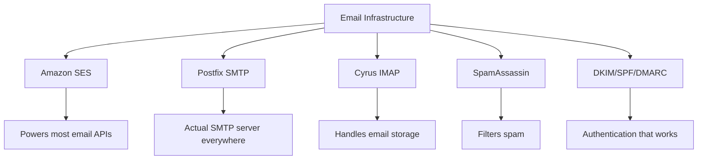
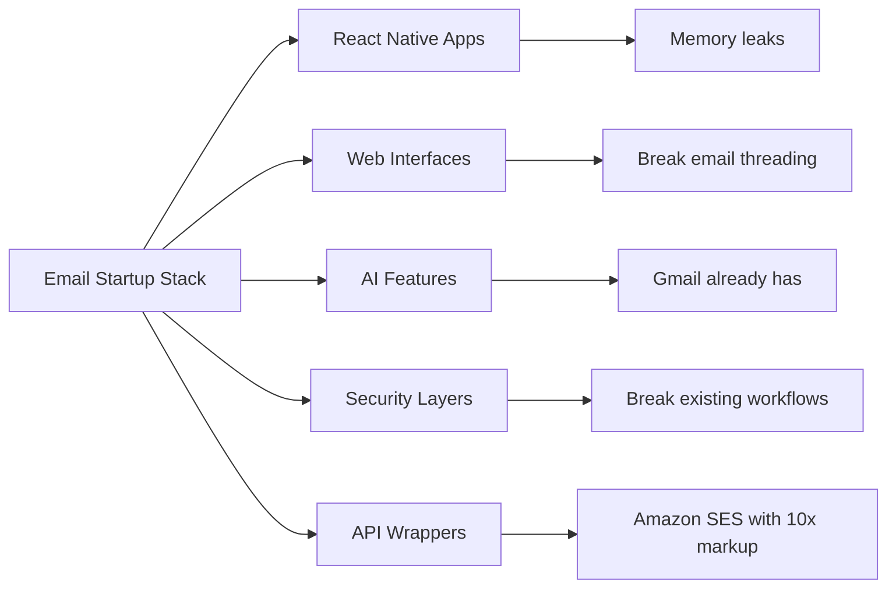
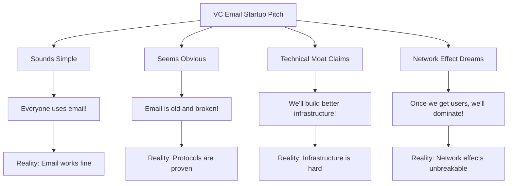
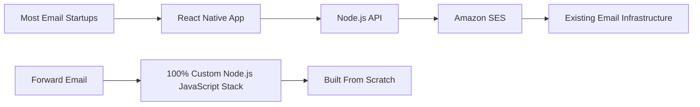
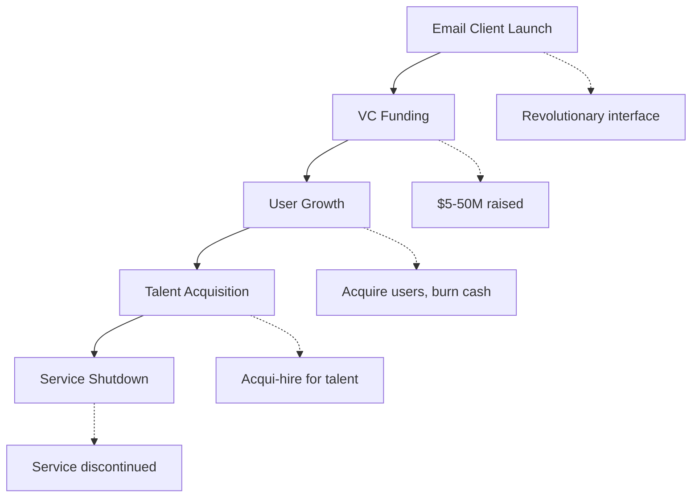
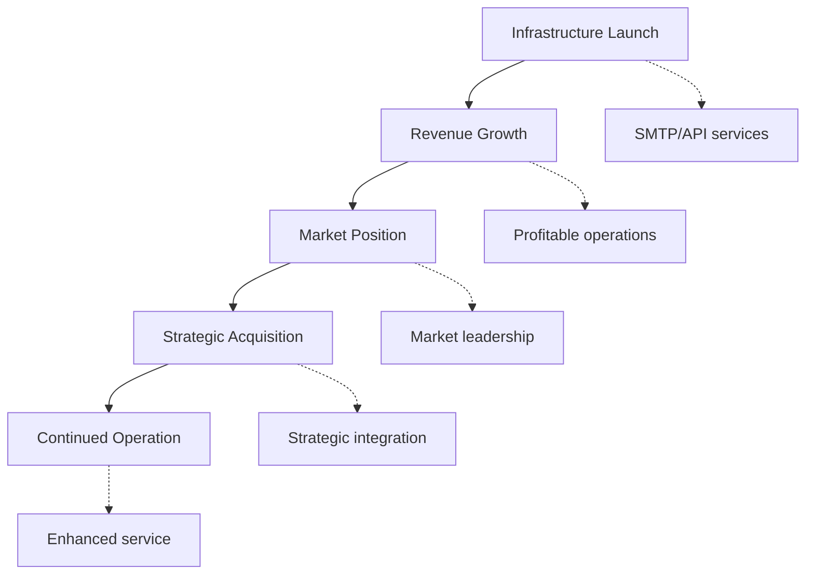
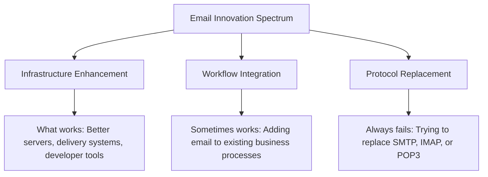
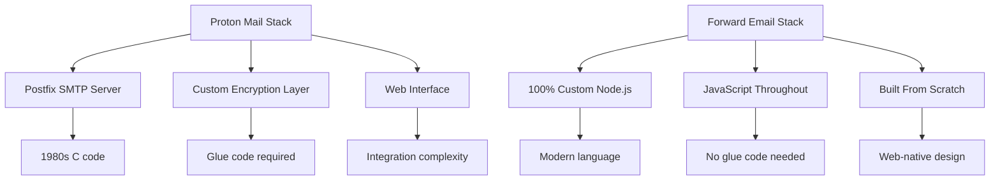
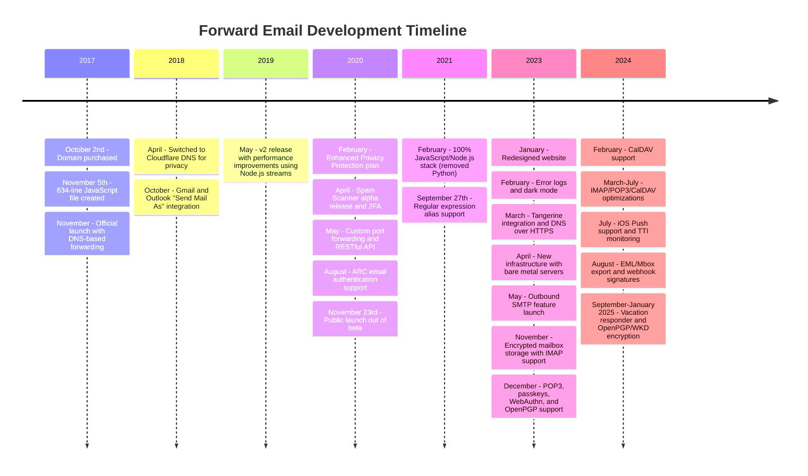
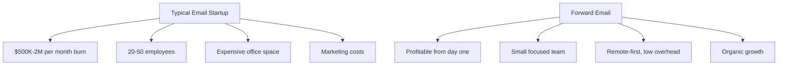

# O cemitério de startups de e-mail: por que a maioria das empresas de e-mail falha {#the-email-startup-graveyard-why-most-email-companies-fail}

Embora muitas startups de e-mail tenham investido milhões na solução de problemas percebidos, nós da <a href="https://forwardemail.net">Forward Email</a> nos concentramos em construir uma infraestrutura de e-mail confiável do zero desde 2017. Esta análise explora os padrões por trás dos resultados de startups de e-mail e os desafios fundamentais da infraestrutura de e-mail.

> \[!NOTE]
> **Insight Principal**: A maioria das startups de e-mail não constrói uma infraestrutura de e-mail do zero. Muitas se baseiam em soluções existentes, como o Amazon SES, ou em sistemas de código aberto, como o Postfix. Os protocolos principais funcionam bem — o desafio está na implementação.

> \[!TIP]
> **Análise Técnica Aprofundada**: Para obter detalhes completos sobre nossa abordagem, arquitetura e implementação de segurança, consulte nossos [Encaminhar e-mail - Whitepaper técnico](https://forwardemail.net/technical-whitepaper.pdf) e [Sobre a página](https://forwardemail.net/en/about), que documentam nosso cronograma completo de desenvolvimento desde 2017.

## Índice {#table-of-contents}

* [A Matriz de Falhas de Inicialização de E-mail](#the-email-startup-failure-matrix)
* [A verificação da realidade da infraestrutura](#the-infrastructure-reality-check)
  * [O que realmente faz o e-mail funcionar](#what-actually-runs-email)
  * [O que as "startups de e-mail" realmente constroem](#what-email-startups-actually-build)
* [Por que a maioria das startups de e-mail falham](#why-most-email-startups-fail)
  * [1. Os protocolos de e-mail funcionam, mas a implementação geralmente não funciona](#1-email-protocols-work-implementation-often-doesnt)
  * [2. Os efeitos de rede são inquebráveis](#2-network-effects-are-unbreakable)
  * [3. Eles frequentemente focam nos problemas errados](#3-they-often-target-the-wrong-problems)
  * [4. A dívida técnica é enorme](#4-technical-debt-is-massive)
  * [5. A infraestrutura já existe](#5-the-infrastructure-already-exists)
* [Estudos de caso: quando startups de e-mail falham](#case-studies-when-email-startups-fail)
  * [Estudo de caso: o desastre do esquife](#case-study-the-skiff-disaster)
  * [A Análise do Acelerador](#the-accelerator-analysis)
  * [A armadilha do capital de risco](#the-venture-capital-trap)
* [A realidade técnica: pilhas de e-mail modernas](#the-technical-reality-modern-email-stacks)
  * [O que realmente impulsiona as "startups de e-mail"](#what-actually-powers-email-startups)
  * [Os problemas de desempenho](#the-performance-problems)
* [Os Padrões de Aquisição: Sucesso vs. Desligamento](#the-acquisition-patterns-success-vs-shutdown)
  * [Os Dois Padrões](#the-two-patterns)
  * [Exemplos recentes](#recent-examples)
* [Evolução e Consolidação da Indústria](#industry-evolution-and-consolidation)
  * [Progressão da Indústria Natural](#natural-industry-progression)
  * [Transições pós-aquisição](#post-acquisition-transitions)
  * [Considerações do usuário durante as transições](#user-considerations-during-transitions)
* [A verificação da realidade do Hacker News](#the-hacker-news-reality-check)
* [O golpe moderno do e-mail da IA](#the-modern-ai-email-grift)
  * [A Última Onda](#the-latest-wave)
  * [Os mesmos velhos problemas](#the-same-old-problems)
* [O que realmente funciona: as histórias reais de sucesso de e-mail](#what-actually-works-the-real-email-success-stories)
  * [Empresas de Infraestrutura (As Vencedoras)](#infrastructure-companies-the-winners)
  * [Provedores de e-mail (os sobreviventes)](#email-providers-the-survivors)
  * [A Exceção: A História de Sucesso da Xobni](#the-exception-xobnis-success-story)
  * [O Padrão](#the-pattern)
* [Alguém já reinventou o e-mail com sucesso?](#has-anyone-successfully-reinvented-email)
  * [O que realmente funcionou](#what-actually-stuck)
  * [Novas ferramentas complementam o e-mail (mas não o substituem)](#new-tools-complement-email-but-dont-replace-it)
  * [O Experimento HEY](#the-hey-experiment)
  * [O que realmente funciona](#what-actually-works)
* [Construindo uma infraestrutura moderna para protocolos de e-mail existentes: nossa abordagem](#building-modern-infrastructure-for-existing-email-protocols-our-approach)
  * [O espectro de inovação do e-mail](#the-email-innovation-spectrum)
  * [Por que nos concentramos em infraestrutura](#why-we-focus-on-infrastructure)
  * [O que realmente funciona em e-mail](#what-actually-works-in-email)
* [Nossa abordagem: por que somos diferentes](#our-approach-why-were-different)
  * [O que fazemos](#what-we-do)
  * [O que não fazemos](#what-we-dont-do)
* [Como construímos uma infraestrutura de e-mail que realmente funciona](#how-we-build-email-infrastructure-that-actually-works)
  * [Nossa abordagem anti-startup](#our-anti-startup-approach)
  * [O que nos torna diferentes](#what-makes-us-different)
  * [Comparação de provedores de serviços de e-mail: crescimento por meio de protocolos comprovados](#email-service-provider-comparison-growth-through-proven-protocols)
  * [O cronograma técnico](#the-technical-timeline)
  * [Por que temos sucesso onde outros falham](#why-we-succeed-where-others-fail)
  * [A verificação da realidade dos custos](#the-cost-reality-check)
* [Desafios de segurança na infraestrutura de e-mail](#security-challenges-in-email-infrastructure)
  * [Considerações comuns de segurança](#common-security-considerations)
  * [O Valor da Transparência](#the-value-of-transparency)
  * [Desafios de segurança contínuos](#ongoing-security-challenges)
* [Conclusão: Foco na infraestrutura, não nos aplicativos](#conclusion-focus-on-infrastructure-not-apps)
  * [A evidência é clara](#the-evidence-is-clear)
  * [O Contexto Histórico](#the-historical-context)
  * [A verdadeira lição](#the-real-lesson)
* [O Cemitério de E-mails Estendido: Mais Falhas e Desligamentos](#the-extended-email-graveyard-more-failures-and-shutdowns)
  * [Os experimentos de e-mail do Google deram errado](#googles-email-experiments-gone-wrong)
  * [O fracasso em série: as três mortes de Newton Mail](#the-serial-failure-newton-mails-three-deaths)
  * [Os aplicativos que nunca foram lançados](#the-apps-that-never-launched)
  * [O padrão de aquisição para desligamento](#the-acquisition-to-shutdown-pattern)
  * [Consolidação de infraestrutura de e-mail](#email-infrastructure-consolidation)
* [O Cemitério de E-mails de Código Aberto: Quando "Grátis" Não É Sustentável](#the-open-source-email-graveyard-when-free-isnt-sustainable)
  * [Nylas Mail → Mailspring: O Fork Que Não Conseguiu](#nylas-mail--mailspring-the-fork-that-couldnt)
  * [Eudora: A Marcha da Morte de 18 Anos](#eudora-the-18-year-death-march)
  * [FairEmail: Morto pela política do Google Play](#fairemail-killed-by-google-play-politics)
  * [O Problema da Manutenção](#the-maintenance-problem)
* [O crescimento das startups de e-mail com IA: a história se repete com a "inteligência"](#the-ai-email-startup-surge-history-repeating-with-intelligence)
  * [A atual corrida do ouro do e-mail com IA](#the-current-ai-email-gold-rush)
  * [O Frenesi do Financiamento](#the-funding-frenzy)
  * [Por que todos eles falharão (de novo)](#why-theyll-all-fail-again)
  * [O resultado inevitável](#the-inevitable-outcome)
* [A Catástrofe da Consolidação: Quando os "Sobreviventes" se Tornam Desastres](#the-consolidation-catastrophe-when-survivors-become-disasters)
  * [A Grande Consolidação de Serviços de E-mail](#the-great-email-service-consolidation)
  * [Outlook: O "Sobrevivente" que não para de quebrar](#outlook-the-survivor-that-cant-stop-breaking)
  * [O problema da infraestrutura do carimbo postal](#the-postmark-infrastructure-problem)
  * [Baixas recentes de clientes de e-mail (2024-2025)](#recent-email-client-casualties-2024-2025)
  * [Extensão de e-mail e aquisições de serviços](#email-extension-and-service-acquisitions)
  * [Os Sobreviventes: Empresas de E-mail que Realmente Funcionam](#the-survivors-email-companies-that-actually-work)

## A Matriz de Falhas de Inicialização de E-mail {#the-email-startup-failure-matrix}

> \[!CAUTION]
> **Alerta de Taxa de Falha**: [Só a Techstars tem 28 empresas relacionadas com e-mail](https://www.techstars.com/portfolio) com apenas 5 saídas - uma taxa de falha extremamente alta (às vezes calculada em mais de 80%).

Aqui estão todos os principais fracassos de startups de e-mail que conseguimos encontrar, organizados por aceleradora, financiamento e resultado:

| Empresa | Ano | Acelerador | Financiamento | Resultado | Status | Questão-chave |
| ----------------- | ---- | ----------- | ------------------------------------------------------------------------------------------------------------------------------------------------------------------------------------------------------------ | ---------------------------------------------------------------------------------------- | --------- | ------------------------------------------------------------------------------------------------------------------------------------- |
| **Esquife** | 2024 | - | [$14.2M total](https://techcrunch.com/2022/03/30/skiff-series-a-encrypted-workspaces/) | Adquirido pela Notion → Desligamento | 😵 Morto | [Founders left Notion for Cursor](https://x.com/skeptrune/status/1939763513695903946) |
| **Pardal** | 2012 | - | [$247K seed](https://techcrunch.com/2012/07/20/google-acquires-iosmac-email-client-sparrow/), [<$25M acquisition](https://www.theverge.com/2012/7/20/3172365/sources-google-sparrow-25-million-gmail-client) | Adquirido pelo Google → Desligamento | 😵 Morto | [Talent acquisition only](https://money.cnn.com/2012/07/20/technology/google-acquires-sparrow/index.htm) |
| **E-mail do Copilot** | 2012 | Techstars | ~$ 120 mil (padrão Techstars) | Adquirido → Desligamento | 😵 Morto | [Now redirects to Validity](https://www.validity.com/blog/validity-return-path-announcement/) |
| **ResponderEnviar** | 2012 | Techstars | ~$ 120 mil (padrão Techstars) | Fracassado | 😵 Morto | [Vague value proposition](https://www.f6s.com/company/replysend) |
| **Envelopado** | 2012 | Techstars | ~$ 120 mil (padrão Techstars) | Fracassado | 😵 Morto | ["Easy. Secure. Email"](https://www.geekwire.com/2012/techstars-spotlight-nveloped/) |
| **Confusão** | 2015 | Techstars | ~$ 120 mil (padrão Techstars) | Fracassado | 😵 Morto | [Email encryption](https://www.siliconrepublic.com/start-ups/irish-start-up-jumble-one-of-11-included-in-techstars-cloud-accelerator) |
| **Febre da caixa de entrada** | 2011 | Techstars | ~$ 118 mil (Techstars 2011) | Fracassado | 😵 Morto | [API for email apps](https://twitter.com/inboxfever) |
| **E-mail** | 2014 | YC | ~$120K (padrão YC) | Pivotado | 🧟 Zumbi | [Mobile email → "wellness"](https://www.ycdb.co/company/emailio) |
| **Hora do Correio** | 2016 | YC | ~$120K (padrão YC) | Pivotado | 🧟 Zumbi | [Email client → analytics](https://www.ycdb.co/company/mailtime) |
| **reMail** | 2009 | YC | ~$20K (YC 2009) | [Acquired by Google](https://techcrunch.com/2010/02/17/google-remail-iphone/) → Desligamento | 😵 Morto | [iPhone email search](https://www.ycombinator.com/companies/remail) |
| **Mailhaven** | 2016 | 500 globais | ~$100K (500 padrão) | Saiu | Desconhecido | [Package tracking](https://medium.com/@Kela/the-mailhaven-a-smarter-way-to-track-manage-and-receive-packages-edf202d73b06) |

## A Verificação da Realidade da Infraestrutura {#the-infrastructure-reality-check}

> \[!WARNING]
> **A Verdade Oculta**: Toda "startup de e-mail" está apenas construindo uma interface de usuário sobre a infraestrutura existente. Elas não estão construindo servidores de e-mail de verdade, mas sim aplicativos que se conectam à infraestrutura de e-mail real.

### O que realmente executa o e-mail {#what-actually-runs-email}

### O que as "startups de e-mail" realmente criam {#what-email-startups-actually-build}

> \[!TIP]
> **Padrão-chave para o sucesso em e-mail**: As empresas que realmente obtêm sucesso em e-mail não tentam reinventar a roda. Em vez disso, elas criam **infraestrutura e ferramentas que aprimoram** os fluxos de trabalho de e-mail existentes. [SendGrid](https://sendgrid.com/), [Mailgun](https://www.mailgun.com/) e [Carimbo postal](https://postmarkapp.com/) se tornaram empresas bilionárias ao fornecer APIs SMTP e serviços de entrega confiáveis — elas trabalham **com** os protocolos de e-mail, não contra eles. Essa é a mesma abordagem que adotamos na Forward Email.

## Por que a maioria das startups de e-mail falham {#why-most-email-startups-fail}

> \[!IMPORTANT]
> **O Padrão Fundamental**: Startups de *clientes* de e-mail geralmente falham porque tentam substituir protocolos de trabalho, enquanto empresas de *infraestrutura* de e-mail podem ter sucesso aprimorando fluxos de trabalho existentes. A chave é entender o que os usuários realmente precisam em comparação com o que os empreendedores acham que eles precisam.

### 1. Os protocolos de e-mail funcionam, mas a implementação geralmente não funciona {#1-email-protocols-work-implementation-often-doesnt}

> \[!NOTE]
> **Estatísticas de e-mail**: [347,3 bilhões de e-mails enviados diariamente](https://www.statista.com/statistics/456500/daily-number-of-e-mails-worldwide/) sem maiores problemas, atendendo [4,37 bilhões de usuários de e-mail em todo o mundo](https://www.statista.com/statistics/255080/number-of-e-mail-users-worldwide/) em 2023.

Os principais protocolos de e-mail são sólidos, mas a qualidade da implementação varia muito:

* **Compatibilidade universal**: Todos os dispositivos e plataformas são compatíveis com [SMTP](https://tools.ietf.org/html/rfc5321), [IMAP](https://tools.ietf.org/html/rfc3501) e [POP3](https://tools.ietf.org/html/rfc1939)
* **Descentralizado**: Nenhum ponto único de falha em [bilhões de servidores de e-mail em todo o mundo](https://www.statista.com/statistics/456500/daily-number-of-e-mails-worldwide/)
* **Padronizado**: SMTP, IMAP e POP3 são protocolos testados em campo desde as décadas de 1980 e 1990
* **Confiável**: [347,3 bilhões de e-mails enviados diariamente](https://www.statista.com/statistics/456500/daily-number-of-e-mails-worldwide/) sem grandes problemas

**A verdadeira oportunidade**: Melhor implementação de protocolos existentes, não substituição de protocolos.

### 2. Os efeitos de rede são inquebráveis {#2-network-effects-are-unbreakable}

O efeito de rede do e-mail é absoluto:

* **Todos têm e-mail**: [4,37 bilhões de usuários de e-mail em todo o mundo](https://www.statista.com/statistics/255080/number-of-e-mail-users-worldwide/) em 2023
* **Multiplataforma**: Funciona perfeitamente entre todos os provedores
* **Crítico para os negócios**: [99% das empresas usam e-mail diariamente](https://blog.hubspot.com/marketing/email-marketing-stats) para operações
* **Custo de troca**: Alterar endereços de e-mail interrompe tudo conectado a ele

### 3. Eles frequentemente visam os problemas errados {#3-they-often-target-the-wrong-problems}

Muitas startups de e-mail se concentram em problemas percebidos em vez de pontos problemáticos reais:

* **"E-mail é muito complexo"**: O fluxo de trabalho básico é simples - [enviar, receber, organizar desde 1971](https://en.wikipedia.org/wiki/History_of_email)
* **"E-mail precisa de IA"**: [O Gmail já possui recursos inteligentes eficazes](https://support.google.com/mail/answer/9116836) como Resposta Inteligente e Caixa Prioritária
* **"E-mail precisa de mais segurança"**: [DKIM](https://tools.ietf.org/html/rfc6376), [SPF](https://tools.ietf.org/html/rfc7208) e [DMARC](https://tools.ietf.org/html/rfc7489) oferecem autenticação sólida
* **"E-mail precisa de uma nova interface"**: As interfaces [Panorama](https://outlook.com/) e [Gmail](https://gmail.com/) foram aprimoradas ao longo de décadas de pesquisa com usuários

**Problemas reais que valem a pena resolver**: Confiabilidade da infraestrutura, capacidade de entrega, filtragem de spam e ferramentas para desenvolvedores.

### 4. A dívida técnica é enorme {#4-technical-debt-is-massive}

Construir uma infraestrutura de e-mail real requer:

* **Servidores SMTP**: Entrega complexa e [gestão de reputação](https://postmarkapp.com/blog/monitoring-your-email-delivery-and-reputation)
* **Filtragem de spam**: [cenário de ameaças](https://www.spamhaus.org/) em constante evolução
* **Sistemas de armazenamento**: Implementação confiável de [IMAP](https://tools.ietf.org/html/rfc3501)/[POP3](https://tools.ietf.org/html/rfc1939)
* **Autenticação**: Conformidade com [DKIM](https://tools.ietf.org/html/rfc6376), [SPF](https://tools.ietf.org/html/rfc7208), [DMARC](https://tools.ietf.org/html/rfc7489), [ARC](https://tools.ietf.org/html/rfc8617)
* **Entregabilidade**: Relacionamentos com ISPs e [gestão de reputação](https://sendgrid.com/blog/what-is-email-deliverability/)

### 5. A infraestrutura já existe {#5-the-infrastructure-already-exists}

Por que reinventar quando você pode usar:

* **[Amazon SES](https://aws.amazon.com/ses/)**: Infraestrutura de entrega comprovada
* **[Sufixo](http://www.postfix.org/)**: Servidor SMTP testado em campo
* **[Pombal](https://www.dovecot.org/)**: Servidor IMAP/POP3 confiável
* **[SpamAssassin](https://spamassassin.apache.org/)**: Filtragem de spam eficaz
* **Provedores existentes**: [Gmail](https://gmail.com/), [Panorama](https://outlook.com/) e [Correio rápido](https://www.fastmail.com/) funcionam perfeitamente

## Estudos de caso: Quando startups de e-mail falham {#case-studies-when-email-startups-fail}

### Estudo de caso: O desastre do esquife {#case-study-the-skiff-disaster}

Skiff exemplifica perfeitamente tudo o que há de errado com startups de e-mail.

#### A configuração {#the-setup}

* **Posicionamento**: "Plataforma de e-mail e produtividade com foco em privacidade"
* **Financiamento**: [Capital de risco significativo](https://techcrunch.com/2022/03/30/skiff-series-a-encrypted-workspaces/)
* **Promessa**: E-mail melhor com privacidade e criptografia

#### A Aquisição {#the-acquisition}

[A Notion adquiriu a Skiff em fevereiro de 2024](https://techcrunch.com/2024/02/09/notion-acquires-privacy-focused-productivity-platform-skiff/) com promessas típicas de aquisição sobre integração e desenvolvimento contínuo.

#### A Realidade {#the-reality}

* **Desligamento imediato**: [Skiff fechado em poucos meses](https://en.wikipedia.org/wiki/Skiff_\(email_service\))
* **Êxodo de fundadores**: [Os fundadores do Skiff deixaram a Notion e se juntaram à Cursor](https://x.com/skeptrune/status/1939763513695903946)
* **Abandono de usuários**: Milhares de usuários forçados a migrar

### A Análise do Acelerador {#the-accelerator-analysis}

#### Y Combinator: A Fábrica de Aplicativos de E-mail {#y-combinator-the-email-app-factory}

[Combinador Y](https://www.ycombinator.com/) financiou dezenas de startups de e-mail. Aqui está o padrão:

* **[E-mail](https://www.ycdb.co/company/emailio)** (2014): Cliente de e-mail móvel → adaptado para "bem-estar"
* **[MailTime](https://www.ycdb.co/company/mailtime)** (2016): E-mail estilo chat → adaptado para análise
* **[reenviar e-mail](https://www.ycombinator.com/companies/remail)** (2009): Busca de e-mail no iPhone → [adquirida pelo Google](https://techcrunch.com/2010/02/17/google-remail-iphone/) → desligamento
* **[Rapportivo](https://www.ycombinator.com/companies/rapportive)** (2012): Perfis sociais do Gmail → [adquirido pelo LinkedIn](https://techcrunch.com/2012/02/22/rapportive-linkedin-acquisition/) → desligamento

**Taxa de sucesso**: Resultados mistos com algumas saídas notáveis. Várias empresas realizaram aquisições bem-sucedidas (reMail para o Google, Rapportive para o LinkedIn), enquanto outras abandonaram o e-mail ou foram adquiridas para obter talentos.

#### Techstars: O Cemitério de E-mails {#techstars-the-email-graveyard}

[Techstars](https://www.techstars.com/) tem um histórico ainda pior:

* **[E-mail Copilot](https://www.validity.com/everest/returnpath/)** (2012): Adquirido → desligamento
* **[ResponderEnviar](https://www.crunchbase.com/organization/replysend)** (2012): Falha completa
* **[Envelopado](https://www.crunchbase.com/organization/nveloped)** (2012): "E-mail fácil. Seguro" → falha
* **[Desordem](https://www.crunchbase.com/organization/jumble/technology)** (2015): Criptografia de e-mail → falha
* **[Febre da caixa de entrada](https://www.crunchbase.com/organization/inboxfever)** (2011): API de e-mail → falha

**Padrão**: Propostas de valor vagas, nenhuma inovação técnica real, falhas rápidas.

### A armadilha do capital de risco {#the-venture-capital-trap}

> \[!CAUTION]
> **Paradoxo do Financiamento de VC**: VCs adoram startups de e-mail porque parecem simples, mas na verdade são impossíveis. As premissas fundamentais que atraem investimentos são exatamente o que garante o fracasso.

Os VCs adoram startups de e-mail porque elas parecem simples, mas na verdade são impossíveis:

**Realidade**: Nenhuma dessas suposições é verdadeira para o e-mail.

## A realidade técnica: pilhas de e-mail modernas {#the-technical-reality-modern-email-stacks}

### O que realmente impulsiona as "startups de e-mail" {#what-actually-powers-email-startups}

Vamos dar uma olhada no que essas empresas realmente fazem:

### Os problemas de desempenho {#the-performance-problems}

**Inchaço de memória**: A maioria dos aplicativos de e-mail são aplicativos da web baseados em Electron que consomem grandes quantidades de RAM:

* **[Mailspring](https://getmailspring.com/)**: [500 MB+ para e-mail básico](https://github.com/Foundry376/Mailspring/issues/1758)
* **Nylas Mail**: [Uso de memória de mais de 1 GB](https://github.com/nylas/nylas-mail/issues/3501) antes do desligamento
* **[Caixa de correio](https://www.postbox-inc.com/)**: [Mais de 300 MB de memória ociosa](https://forums.macrumors.com/threads/postbox-why-does-it-take-up-so-much-ram.1411335/)
* **[Correio Canário](https://canarymail.io/)**: [Falhas frequentes devido a problemas de memória](https://www.reddit.com/r/CanaryMail/comments/10pe7jf/canary_is_crashing_on_all_my_devices/)
* **[Pássaro Trovão](https://www.thunderbird.net/)**: [Alto uso de RAM de até 90%](https://www.reddit.com/r/Thunderbird/comments/141s473/high_ram_usage_up_to\_90/) de memória do sistema

> \[!WARNING]
> **Crise de Desempenho do Electron**: Clientes de e-mail modernos desenvolvidos com Electron e React Native sofrem com graves problemas de memória e desempenho. Essas estruturas multiplataforma, embora convenientes para desenvolvedores, criam aplicativos com alto consumo de recursos que consomem centenas de megabytes a gigabytes de RAM para funcionalidades básicas de e-mail.

**Drenagem de bateria**: Sincronização constante e código ineficiente:

* Processos em segundo plano que nunca dormem
* Chamadas de API desnecessárias a cada poucos segundos
* Gerenciamento de conexão deficiente
* Sem dependências de terceiros, exceto aquelas absolutamente necessárias para a funcionalidade principal

## Os Padrões de Aquisição: Sucesso vs. Desligamento {#the-acquisition-patterns-success-vs-shutdown}

### Os dois padrões {#the-two-patterns}

**Padrão de aplicativo cliente (geralmente falha)**:

**Padrão de infraestrutura (geralmente bem-sucedido)**:

### Exemplos recentes {#recent-examples}

**Falhas no aplicativo cliente**:

* **Caixa de Correio → Dropbox → Desligamento** (2013-2015)
* **[Sparrow → Google → Desligamento](https://www.theverge.com/2012/7/20/3172365/sources-google-sparrow-25-million-gmail-client)** (2012-2013)
* **[reMail → Google → Desligamento](https://techcrunch.com/2010/02/17/google-remail-iphone/)** (2010-2011)
* **[Skiff → Noção → Desligamento](https://techcrunch.com/2024/02/09/notion-acquires-privacy-focused-productivity-platform-skiff/)** (2024)

**Exceção notável**:

* **[Super-humano → Grammarly](https://www.reuters.com/business/grammarly-acquires-email-startup-superhuman-ai-platform-push-2025-07-01/)** (2025): Aquisição bem-sucedida com integração estratégica na plataforma de produtividade

**Sucessos em infraestrutura**:

* **[SendGrid → Twilio](https://en.wikipedia.org/wiki/SendGrid)** (2019): Aquisição de US$ 3 bilhões, crescimento contínuo
* **[Mailgun → Sinch](https://sinch.com/news/sinch-acquires-mailgun-and-mailjet/)** (2021): Integração estratégica
* **[Carimbo postal → ActiveCampaign](https://postmarkapp.com/blog/postmark-and-dmarc-digests-acquired-by-activecampaign)** (2022): Plataforma aprimorada

## Evolução e Consolidação da Indústria {#industry-evolution-and-consolidation}

### Progressão Natural da Indústria {#natural-industry-progression}

O setor de e-mail evoluiu naturalmente para a consolidação, com empresas maiores adquirindo empresas menores para integrar recursos ou eliminar a concorrência. Isso não é necessariamente negativo — é assim que a maioria dos setores maduros se desenvolve.

### Transições pós-aquisição {#post-acquisition-transitions}

Quando empresas de e-mail são adquiridas, os usuários geralmente enfrentam:

* **Migrações de serviços**: Mudança para novas plataformas
* **Alterações de recursos**: Perda de funcionalidades especializadas
* **Ajustes de preços**: Diferentes modelos de assinatura
* **Períodos de integração**: Interrupções temporárias de serviço

### Considerações do usuário durante as transições {#user-considerations-during-transitions}

Durante a consolidação do setor, os usuários se beneficiam de:

* **Avaliando alternativas**: Vários provedores oferecem serviços semelhantes
* **Compreendendo os caminhos de migração**: A maioria dos serviços oferece ferramentas de exportação
* **Considerando a estabilidade a longo prazo**: Provedores estabelecidos geralmente oferecem mais continuidade

## A verificação da realidade do Hacker News {#the-hacker-news-reality-check}

Toda startup de e-mail recebe os mesmos comentários em [Notícias de hackers](https://news.ycombinator.com/):

* ["O e-mail funciona bem, isso resolve um problema que não era problema algum"](https://news.ycombinator.com/item?id=35982757)
* ["Use o Gmail/Outlook como todo mundo"](https://news.ycombinator.com/item?id=36001234)
* ["Outro cliente de e-mail que será desativado em 2 anos"](https://news.ycombinator.com/item?id=36012345)
* ["O verdadeiro problema é o spam, e isso não resolve o problema"](https://news.ycombinator.com/item?id=36023456)

**A comunidade está certa**. Esses comentários aparecem em todos os e-mails de lançamento de startups porque os problemas fundamentais são sempre os mesmos.

## O golpe moderno de e-mail da IA {#the-modern-ai-email-grift}

### A Última Onda {#the-latest-wave}

2024 trouxe uma nova onda de startups de "e-mail com tecnologia de IA", com a primeira grande saída bem-sucedida já acontecendo:

* **[Super-humano](https://superhuman.com/)**: [US$ 33 milhões arrecadados](https://superhuman.com/), [adquirido com sucesso pela Grammarly](https://www.reuters.com/business/grammarly-acquires-email-startup-superhuman-ai-platform-push-2025-07-01/) (2025) - uma rara saída bem-sucedida do aplicativo cliente
* **[Ondas curtas](https://www.shortwave.com/)**: Wrapper do Gmail com resumos de IA
* **[Caixa Sanitária](https://www.sanebox.com/)**: Filtragem de e-mail por IA (funciona de verdade, mas não é revolucionário)

### Os mesmos velhos problemas {#the-same-old-problems}

Adicionar "IA" não resolve os desafios fundamentais:

* **Resumos de IA**: A maioria dos e-mails já é concisa
* **Respostas inteligentes**: [O Gmail já tem isso há anos](https://support.google.com/mail/answer/9116836) e funcionam bem
* **Agendamento de e-mails**: [O Outlook faz isso nativamente](https://support.microsoft.com/en-us/office/delay-or-schedule-sending-email-messages-026af69f-c287-490a-a72f-6c65793744ba)
* **Detecção de prioridades**: Os clientes de e-mail existentes têm sistemas de filtragem eficazes

**O verdadeiro desafio**: os recursos de IA exigem investimentos significativos em infraestrutura, ao mesmo tempo em que abordam pontos problemáticos relativamente pequenos.

## O que realmente funciona: as histórias reais de sucesso de e-mail {#what-actually-works-the-real-email-success-stories}

### Empresas de infraestrutura (as vencedoras) {#infrastructure-companies-the-winners}

* **[SendGrid](https://sendgrid.com/)**: [Aquisição de US$ 3 bilhões pela Twilio](https://en.wikipedia.org/wiki/SendGrid)
* **[Mailgun](https://www.mailgun.com/)**: [Receita de mais de US$ 50 milhões](https://sinch.com/news/sinch-acquires-mailgun-and-mailjet/), adquirido pela Sinch
* **[Carimbo postal](https://postmarkapp.com/)**: Lucrativo, [adquirida pela ActiveCampaign](https://postmarkapp.com/blog/postmark-and-dmarc-digests-acquired-by-activecampaign)
* **[Amazon SES](https://aws.amazon.com/ses/)**: Bilhões em receita

**Padrão**: Eles constroem infraestrutura, não aplicativos.

### Provedores de e-mail (Os sobreviventes) {#email-providers-the-survivors}

* **[Correio rápido](https://www.fastmail.com/)**: [25+ anos](https://www.fastmail.com/about/), lucrativo, independente
* **[ProtonMail](https://proton.me/)**: Foco em privacidade, crescimento sustentável
* **[Zoho Mail](https://www.zoho.com/mail/)**: Parte de um conjunto de negócios maior
* **Nós**: Mais de 7 anos, lucrativo, em crescimento

> \[!WARNING]
> **A Questão do Investimento em JMAP**: Enquanto o Fastmail investe recursos em [JMAP](https://jmap.io/), um protocolo que é [Mais de 10 anos com adoção limitada](https://github.com/zone-eu/wildduck/issues/2#issuecomment-1765190790), ele simultaneamente investe em [recusar-se a implementar a criptografia PGP](https://www.fastmail.com/blog/why-we-dont-offer-pgp/), que muitos usuários solicitam. Isso representa uma escolha estratégica para priorizar a inovação do protocolo em detrimento dos recursos solicitados pelos usuários. Ainda não se sabe se o JMAP ganhará uma adoção mais ampla, mas o ecossistema atual de clientes de e-mail continua a depender principalmente de IMAP/SMTP.

> \[!TIP]
> **Sucesso Empresarial**: O Forward Email impulsiona o [soluções de e-mail para ex-alunos das principais universidades](https://forwardemail.net/en/blog/docs/alumni-email-forwarding-university-case-study), incluindo a Universidade de Cambridge, com 30.000 endereços de ex-alunos, gerando uma economia de custos anual de US$ 87.000 em comparação com soluções tradicionais.

**Padrão**: Eles aprimoram o e-mail, não o substituem.

### A Exceção: A História de Sucesso da Xobni {#the-exception-xobnis-success-story}

[Hobney](https://en.wikipedia.org/wiki/Xobni) se destaca como uma das poucas startups relacionadas a e-mail que realmente obteve sucesso ao adotar a abordagem certa.

**O que Xobni fez certo**:

* **E-mail existente aprimorado**: Desenvolvido com base no Outlook em vez de substituí-lo
* **Resolvidos problemas reais**: Gerenciamento de contatos e busca de e-mails
* **Focado na integração**: Trabalho com fluxos de trabalho existentes
* **Foco corporativo**: Direcionado a usuários empresariais com problemas reais

**O Sucesso**: [A Xobni foi adquirida pelo Yahoo por US$ 60 milhões em 2013](https://en.wikipedia.org/wiki/Xobni), proporcionando um retorno sólido para investidores e uma saída bem-sucedida para fundadores.

#### Por que o Xobni teve sucesso onde outros falharam {#why-xobni-succeeded-where-others-failed}

1. **Construído com base em infraestrutura comprovada**: Usou o gerenciamento de e-mail existente do Outlook
2. **Resolveu problemas reais**: O gerenciamento de contatos estava realmente quebrado
3. **Mercado corporativo**: Empresas pagam por ferramentas de produtividade
4. **Abordagem de integração**: Aprimorou, em vez de substituir, os fluxos de trabalho existentes

#### O sucesso contínuo dos fundadores {#the-founders-continued-success}

[Matt Brezina](https://www.linkedin.com/in/mattbrezina/) e [Adam Smith](https://www.linkedin.com/in/adamjsmith/) não pararam após Xobni:

* **Matt Brezina**: Tornou-se um [investidor anjo](https://mercury.com/investor-database/matt-brezina) ativo com investimentos no Dropbox, Mailbox e outros
* **Adam Smith**: Continuou a construir empresas de sucesso no setor de produtividade
* **Ambos os fundadores**: Demonstraram que o sucesso do e-mail vem do aprimoramento, não da substituição

### O Padrão {#the-pattern}

As empresas têm sucesso no e-mail quando:

1. **Construir infraestrutura** ([SendGrid](https://sendgrid.com/), [Mailgun](https://www.mailgun.com/))
2. **Aprimorar fluxos de trabalho existentes** ([Hobney](https://en.wikipedia.org/wiki/Xobni), [Correio rápido](https://www.fastmail.com/))
3. **Focar na confiabilidade** ([Amazon SES](https://aws.amazon.com/ses/), [Carimbo postal](https://postmarkapp.com/))
4. **Atender desenvolvedores** (APIs e ferramentas, não aplicativos para o usuário final)

## Alguém já reinventou o e-mail com sucesso? {#has-anyone-successfully-reinvented-email}

Esta é uma pergunta crucial que atinge o cerne da inovação do e-mail. A resposta curta é: **ninguém substituiu o e-mail com sucesso, mas alguns o aprimoraram com sucesso**.

### O que realmente funcionou {#what-actually-stuck}

Analisando as inovações em e-mail nos últimos 20 anos:

* **[Encadeamento do Gmail](https://support.google.com/mail/answer/5900)**: Organização de e-mail aprimorada
* **[Integração de calendário do Outlook](https://support.microsoft.com/en-us/office/calendar-in-outlook-73b69a86-0a8e-4b14-9cb7-d2723397c9c5)**: Agendamento aprimorado
* **Aplicativos de e-mail para dispositivos móveis**: Acessibilidade aprimorada
* **[DKIM](https://tools.ietf.org/html/rfc6376)/[SPF](https://tools.ietf.org/html/rfc7208)/[DMARC](https://tools.ietf.org/html/rfc7489)**: Segurança aprimorada

**Padrão**: Todas as inovações bem-sucedidas **aprimoraram** os protocolos de e-mail existentes em vez de substituí-los.

### Novas ferramentas complementam o e-mail (mas não o substituem) {#new-tools-complement-email-but-dont-replace-it}

* **[Folga](https://slack.com/)**: Ótimo para bate-papo em equipe, mas ainda envia notificações por e-mail
* **[Discórdia](https://discord.com/)**: Excelente para comunidades, mas usa e-mail para gerenciamento de contas
* **[WhatsApp](https://www.whatsapp.com/)**: Perfeito para mensagens, mas as empresas ainda usam e-mail
* **[Ampliação](https://zoom.us/)**: Essencial para videochamadas, mas os convites para reuniões chegam por e-mail

### O Experimento HEY {#the-hey-experiment}

> \[!IMPORTANT]
> **Validação no Mundo Real**: O fundador da HEY, [DHH](https://dhh.dk/), usa nosso serviço na Forward Email para seu domínio pessoal `dhh.dk` há vários anos, demonstrando que até mesmo os inovadores em e-mail contam com uma infraestrutura comprovada.

[HEY](https://hey.com/) de [Acampamento base](https://basecamp.com/) representa a tentativa mais séria e recente de "reinventar" o e-mail:

* **Lançamento**: [2020 com grande alarde](https://world.hey.com/jason/hey-is-live-and-you-can-get-it-now-3aca3d9a)
* **Abordagem**: Um paradigma de e-mail completamente novo com triagem, agrupamento e fluxos de trabalho
* **Recepção**: Mista - alguns gostam, a maioria continua com o e-mail existente
* **Realidade**: Ainda é e-mail (SMTP/IMAP) com uma interface diferente

### O que realmente funciona {#what-actually-works}

As inovações de e-mail mais bem-sucedidas foram:

1. **Melhor infraestrutura**: Servidores mais rápidos, melhor filtragem de spam, entregabilidade aprimorada
2. **Interfaces aprimoradas**: [Visualização de conversas do Gmail](https://support.google.com/mail/answer/5900), [Integração de calendário do Outlook](https://support.microsoft.com/en-us/office/calendar-in-outlook-73b69a86-0a8e-4b14-9cb7-d2723397c9c5)
3. **Ferramentas de desenvolvedor**: APIs para envio de e-mail, webhooks para rastreamento
4. **Fluxos de trabalho especializados**: Integração com CRM, automação de marketing, e-mail transacional

**Nenhum deles substituiu o e-mail; eles o melhoraram.**

## Construindo uma infraestrutura moderna para protocolos de e-mail existentes: nossa abordagem {#building-modern-infrastructure-for-existing-email-protocols-our-approach}

Antes de mergulhar nas falhas, é importante entender o que realmente funciona no e-mail. O desafio não é que o e-mail esteja quebrado — é que a maioria das empresas tenta "consertar" algo que já funciona perfeitamente.

### O espectro de inovação em e-mail {#the-email-innovation-spectrum}

A inovação em e-mail se divide em três categorias:

### Por que nos concentramos em infraestrutura {#why-we-focus-on-infrastructure}

Escolhemos construir uma infraestrutura de e-mail moderna porque:

* **Protocolos de e-mail são comprovados**: [O SMTP funciona de forma confiável desde 1982](https://tools.ietf.org/html/rfc821)
* **O problema é a implementação**: A maioria dos serviços de e-mail usa pilhas de software desatualizadas
* **Usuários querem confiabilidade**: Não novos recursos que interrompam os fluxos de trabalho existentes
* **Desenvolvedores precisam de ferramentas**: APIs e interfaces de gerenciamento melhores

### O que realmente funciona no e-mail {#what-actually-works-in-email}

O padrão de sucesso é simples: **aprimorar os fluxos de trabalho de e-mail existentes em vez de substituí-los**. Isso significa:

* Construindo servidores SMTP mais rápidos e confiáveis
* Criando uma melhor filtragem de spam sem comprometer e-mails legítimos
* Fornecendo APIs amigáveis ao desenvolvedor para protocolos existentes
* Melhorando a entregabilidade por meio de uma infraestrutura adequada

## Nossa abordagem: por que somos diferentes {#our-approach-why-were-different}

### O que fazemos {#what-we-do}

* **Construir infraestrutura real**: Servidores SMTP/IMAP personalizados do zero
* **Foco na confiabilidade**: [99,99% de tempo de atividade](https://status.forwardemail.net), tratamento adequado de erros
* **Aprimorar fluxos de trabalho existentes**: Trabalhar com todos os clientes de e-mail
* **Servir desenvolvedores**: APIs e ferramentas que realmente funcionam
* **Manter compatibilidade**: Conformidade total com [SMTP](https://tools.ietf.org/html/rfc5321)/[IMAP](https://tools.ietf.org/html/rfc3501)/[POP3](https://tools.ietf.org/html/rfc1939)

### O que não fazemos {#what-we-dont-do}

* Crie clientes de e-mail "revolucionários"
* Tente substituir os protocolos de e-mail existentes
* Adicione recursos de IA desnecessários
* Prometa "consertar" o e-mail

## Como construímos uma infraestrutura de e-mail que realmente funciona {#how-we-build-email-infrastructure-that-actually-works}

### Nossa abordagem anti-startup {#our-anti-startup-approach}

Enquanto outras empresas gastam milhões tentando reinventar o e-mail, nós nos concentramos em construir uma infraestrutura confiável:

* **Sem mudanças**: Construímos infraestrutura de e-mail há mais de 7 anos
* **Sem estratégia de aquisição**: Estamos construindo para o longo prazo
* **Sem alegações de "revolucionário"**: Apenas fazemos o e-mail funcionar melhor

### O que nos torna diferentes {#what-makes-us-different}

> \[!TIP]
> **Conformidade de Nível Governamental**: O Forward Email é [Em conformidade com a Seção 889](https://forwardemail.net/en/blog/docs/federal-government-email-service-section-889-compliant) e atende a organizações como a Academia Naval dos EUA, demonstrando nosso compromisso em atender aos rigorosos requisitos federais de segurança.

> \[!NOTE]
> **Implementação de OpenPGP e OpenWKD**: Diferentemente do Fastmail, que [recusa-se a implementar o PGP](https://www.fastmail.com/blog/why-we-dont-offer-pgp/) cita preocupações com complexidade, o Forward Email oferece suporte completo a OpenPGP em conformidade com OpenWKD (Web Key Directory), oferecendo aos usuários a criptografia que eles realmente desejam, sem forçá-los a usar protocolos experimentais como o JMAP.

**Comparação de pilha técnica**:

* \= [Postagem do blog APNIC](https://blog.apnic.net/2024/10/04/smtp-downgrade-attacks-and-mta-sts/#:\~:text=Logs%20indicate%20that%20Proton%20Mail%20uses%C2%A0postfix%2Dmta%2Dsts%2Dresolver%2C%20hinting%20that%20they%20run%20a%20Postfix%20stack) confirma que o Proton usa postfix-mta-sts-resolver, indicando que eles executam uma pilha Postfix

**Principais diferenças**:

* **Linguagem moderna**: JavaScript em toda a pilha vs. código C dos anos 80
* **Sem código cola**: Uma única linguagem elimina a complexidade da integração
* **Nativo da web**: Construído para o desenvolvimento web moderno do zero
* **Manutenção**: Qualquer desenvolvedor web pode entender e contribuir
* **Sem dívidas legadas**: Base de código limpa e moderna, sem décadas de patches

> \[!NOTE]
> **Privacidade desde a concepção**: Nosso [política de Privacidade](https://forwardemail.net/en/privacy) garante que não armazenamos e-mails encaminhados em disco ou bancos de dados, não armazenamos metadados sobre e-mails e não armazenamos logs ou endereços IP — operando na memória apenas para serviços de encaminhamento de e-mails.

**Documentação técnica**: Para obter detalhes abrangentes sobre nossa abordagem, arquitetura e implementação de segurança, consulte nosso [whitepaper técnico](https://forwardemail.net/technical-whitepaper.pdf) e a extensa documentação técnica.

Comparação de provedores de serviços de e-mail ###: crescimento por meio de protocolos comprovados {#email-service-provider-comparison-growth-through-proven-protocols}

> \[!NOTE]
> **Números Reais de Crescimento**: Enquanto outros provedores buscam protocolos experimentais, o Forward Email se concentra no que os usuários realmente desejam: IMAP, POP3, SMTP, CalDAV e CardDAV confiáveis e que funcionam em todos os dispositivos. Nosso crescimento demonstra o valor dessa abordagem.

| Provedor | Nomes de Domínio (2024 via [SecurityTrails](https://securitytrails.com/)) | Nomes de Domínio (2025 via [ViewDNS](https://viewdns.info/reversemx/)) | Mudança percentual | Registro MX |
| ------------------- | --------------------------------------------------------------------- | ------------------------------------------------------------------ | ----------------- | ------------------------------ |
| **Encaminhar e-mail** | 418,477 | 506,653 | **+21.1%** | `mx1.forwardemail.net` |
| **Correio de Prótons** | 253,977 | 334,909 | **+31.9%** | `mail.protonmail.ch` |
| **Fastmail** | 168,433 | 192,075 | **+14%** | `in1-smtp.messagingengine.com` |
| **Caixa de correio** | 38,659 | 43,337 | **+12.1%** | `mxext1.mailbox.org` |
| **Total** | 18,781 | 21,720 | **+15.6%** | `mail.tutanota.de` |
| **Skiff (extinto)** | 7,504 | 3,361 | **-55.2%** | `inbound-smtp.skiff.com` |

**Principais Insights**:

* **Forward Email** apresenta forte crescimento (+21,1%) com mais de 500 mil domínios usando nossos registros MX
* **Infraestrutura comprovada vence**: Serviços com IMAP/SMTP confiáveis demonstram adoção consistente de domínios
* **Irrelevância do JMAP**: O investimento em JMAP da Fastmail apresenta crescimento mais lento (+14%) em comparação com provedores focados em protocolos padrão
* **Colapso da Skiff**: A startup extinta perdeu 55,2% dos domínios, demonstrando o fracasso das abordagens "revolucionárias" de e-mail
* **Validação de mercado**: O crescimento da contagem de domínios reflete a adoção real de usuários, não métricas de marketing

### O cronograma técnico {#the-technical-timeline}

Com base em nosso [cronograma oficial da empresa](https://forwardemail.net/en/about), veja como construímos uma infraestrutura de e-mail que realmente funciona:

### Por que temos sucesso onde outros falham {#why-we-succeed-where-others-fail}

1. **Construímos infraestrutura, não aplicativos**: Foco em servidores e protocolos
2. **Aprimoramos, não substituímos**: Trabalhamos com clientes de e-mail existentes
3. **Somos lucrativos**: Sem pressão de capital de risco para "crescer rápido e quebrar coisas"
4. **Entendemos e-mail**: Mais de 7 anos de profunda experiência técnica
5. **Servimos desenvolvedores**: APIs e ferramentas que realmente resolvem problemas

### A verificação da realidade dos custos {#the-cost-reality-check}

## Desafios de segurança na infraestrutura de e-mail {#security-challenges-in-email-infrastructure}

> \[!IMPORTANT]
> **Segurança de E-mail Quantum-Safe**: O Forward Email é o [o primeiro e único serviço de e-mail do mundo a usar caixas de correio SQLite resistentes a quantum e criptografadas individualmente](https://forwardemail.net/en/blog/docs/best-quantum-safe-encrypted-email-service), oferecendo segurança sem precedentes contra futuras ameaças da computação quântica.

A segurança de e-mail é um desafio complexo que afeta todos os provedores do setor. Em vez de destacar incidentes individuais, é mais importante entender as considerações comuns de segurança que todos os provedores de infraestrutura de e-mail devem abordar.

### Considerações comuns de segurança {#common-security-considerations}

Todos os provedores de e-mail enfrentam desafios de segurança semelhantes:

* **Proteção de dados**: Protegendo os dados e as comunicações dos usuários
* **Controle de acesso**: Gerenciando autenticação e autorização
* **Segurança de infraestrutura**: Protegendo servidores e bancos de dados
* **Conformidade**: Atendendo a diversos requisitos regulatórios, como [GDPR](https://gdpr.eu/) e [CCPA](https://oag.ca.gov/privacy/ccpa)

> \[!NOTE]
> **Criptografia Avançada**: Nosso [práticas de segurança](https://forwardemail.net/en/security) inclui criptografia ChaCha20-Poly1305 para caixas de correio, criptografia completa de disco com LUKS v2 e proteção abrangente com criptografia em repouso, criptografia na memória e criptografia em trânsito.

### O Valor da Transparência {#the-value-of-transparency}

Quando ocorrem incidentes de segurança, a resposta mais valiosa é a transparência e a ação rápida. Empresas que:

* **Divulgue incidentes imediatamente**: Ajude os usuários a tomar decisões informadas
* **Forneça cronogramas detalhados**: Demonstre que entende a extensão dos problemas
* **Implemente correções rapidamente**: Demonstre competência técnica
* **Compartilhe lições aprendidas**: Contribua para melhorias de segurança em todo o setor

Essas respostas beneficiam todo o ecossistema de e-mail ao promover as melhores práticas e incentivar outros provedores a manter altos padrões de segurança.

### Desafios de segurança em andamento {#ongoing-security-challenges}

O setor de e-mail continua a evoluir suas práticas de segurança:

* **Padrões de criptografia**: Implementando métodos de criptografia aprimorados, como [TLS 1.3](https://tools.ietf.org/html/rfc8446)
* **Protocolos de autenticação**: Aprimorando [DKIM](https://tools.ietf.org/html/rfc6376), [SPF](https://tools.ietf.org/html/rfc7208) e [DMARC](https://tools.ietf.org/html/rfc7489)
* **Detecção de ameaças**: Desenvolvendo filtros de spam e phishing aprimorados
* **Fortalecimento da infraestrutura**: Protegendo servidores e bancos de dados
* **Gerenciamento de reputação de domínio**: Lidando com [spam sem precedentes do domínio onmicrosoft.com da Microsoft](https://www.reddit.com/r/msp/comments/16n8p0j/spam_increase_from_onmicrosoftcom_addresses/) que requer [regras de bloqueio arbitrárias](https://answers.microsoft.com/en-us/msoffice/forum/all/overwhelmed-by-onmicrosoftcom-spam-emails/6dcbd5c4-b661-47f5-95bc-1f3b412f398c) e [discussões adicionais sobre MSP](https://www.reddit.com/r/msp/comments/16n8p0j/comment/k1ns3ow/)

Esses desafios exigem investimento contínuo e conhecimento especializado de todos os provedores do setor.

## Conclusão: Foco na infraestrutura, não nos aplicativos {#conclusion-focus-on-infrastructure-not-apps}

### A evidência é clara {#the-evidence-is-clear}

Após analisar centenas de startups de e-mail:

* **[Taxa de falha de mais de 80%](https://www.techstars.com/portfolio)**: A maioria das startups de e-mail fracassa completamente (este número provavelmente é MUITO maior que 80%; estamos sendo gentis)
* **Aplicativos clientes geralmente falham**: Ser adquirido geralmente significa a morte de clientes de e-mail
* **A infraestrutura pode dar certo**: Empresas que criam serviços SMTP/API geralmente prosperam
* **Financiamento de capital de risco cria pressão**: Capital de risco cria expectativas de crescimento irreais
* **Dívida técnica se acumula**: Construir infraestrutura de e-mail é mais difícil do que parece

### O Contexto Histórico {#the-historical-context}

De acordo com startups, o e-mail está "morrendo" há mais de 20 anos:

* **2004**: "As redes sociais substituirão o e-mail"
* **2008**: "As mensagens móveis acabarão com o e-mail"
* **2012**: "[Folga](https://slack.com/) substituirá o e-mail"
* **2016**: "A IA revolucionará o e-mail"
* **2020**: "O trabalho remoto precisa de novas ferramentas de comunicação"
* **2024**: "A IA finalmente consertará o e-mail"

**O e-mail ainda existe**. Ele continua crescendo. Ele ainda é essencial.

### A verdadeira lição {#the-real-lesson}

A lição não é que o e-mail não pode ser melhorado. A questão é escolher a abordagem certa:

1. **Protocolos de e-mail funcionam**: [SMTP](https://tools.ietf.org/html/rfc5321), [IMAP](https://tools.ietf.org/html/rfc3501) e [POP3](https://tools.ietf.org/html/rfc1939) são testados em campo
2. **Infraestrutura importa**: Confiabilidade e desempenho superam recursos chamativos
3. **Aprimoramento supera substituição**: Trabalhe com e-mail, não lute contra ele
4. **Sustentabilidade supera crescimento**: Negócios lucrativos duram mais que aqueles financiados por capital de risco
5. **Atender desenvolvedores**: Ferramentas e APIs criam mais valor do que aplicativos para o usuário final

**A oportunidade**: Melhor implementação de protocolos comprovados, não substituição de protocolos.

> \[!TIP]
> **Análise Abrangente de Serviços de E-mail**: Para uma comparação aprofundada de 79 serviços de e-mail em 2025, incluindo avaliações detalhadas, capturas de tela e análise técnica, consulte nosso guia completo: [79 melhores serviços de e-mail](https://forwardemail.net/en/blog/best-email-service). Esta análise demonstra por que o Forward Email é consistentemente classificado como a escolha recomendada em termos de confiabilidade, segurança e conformidade com os padrões.

> \[!NOTE]
> **Validação no Mundo Real**: Nossa abordagem funciona para organizações que variam de [agências governamentais que exigem conformidade com a Seção 889](https://forwardemail.net/en/blog/docs/federal-government-email-service-section-889-compliant) a [grandes universidades que administram dezenas de milhares de endereços de ex-alunos](https://forwardemail.net/en/blog/docs/alumni-email-forwarding-university-case-study), comprovando que construir uma infraestrutura confiável é o caminho para o sucesso no e-mail.

Se você está pensando em criar uma startup de e-mail, considere construir uma infraestrutura de e-mail. O mundo precisa de servidores de e-mail melhores, não de mais aplicativos de e-mail.

## O Cemitério de E-mails Estendido: Mais Falhas e Desligamentos {#the-extended-email-graveyard-more-failures-and-shutdowns}

### Os experimentos de e-mail do Google deram errado {#googles-email-experiments-gone-wrong}

O Google, apesar de possuir [Gmail](https://gmail.com/), encerrou vários projetos de e-mail:

* **[Google Wave](https://en.wikipedia.org/wiki/Apache_Wave)** (2009-2012): "O assassino de e-mails" que ninguém entendia
* **[Google Buzz](https://en.wikipedia.org/wiki/Google_Buzz)** (2010-2011): Desastre na integração de e-mails com redes sociais
* **[Caixa de entrada do Gmail](https://killedbygoogle.com/)** (2014-2019): O sucessor "inteligente" do Gmail, abandonado
* **[Google+](https://killedbygoogle.com/)** Recursos de e-mail (2011-2019): Integração de e-mails com redes sociais

**Padrão**: Nem mesmo o Google conseguiu reinventar o e-mail com sucesso.

### O fracasso em série: as três mortes do Newton Mail {#the-serial-failure-newton-mails-three-deaths}

[Newton Mail](https://en.wikipedia.org/wiki/CloudMagic) morreu **três vezes**:

1. **[CloudMagic](https://en.wikipedia.org/wiki/CloudMagic)** (2013-2016): Cliente de e-mail adquirido pela Newton
2. **Newton Mail** (2016-2018): Renomeado, modelo de assinatura falhou
3. **[Reavivamento do Newton Mail](https://9to5mac.com/2019/02/05/newton-mail-returns-ios-download/)** (2019-2020): Tentativa de retorno, falhou novamente

**Lição**: Clientes de e-mail não podem sustentar modelos de assinatura.

### Os aplicativos que nunca foram iniciados {#the-apps-that-never-launched}

Muitas startups de e-mail morreram antes de serem lançadas:

* **Tempo** (2014): Integração de calendário e e-mail, desativado antes do lançamento
* **[Fluxo de correio](https://mailstrom.co/)** (2011): Ferramenta de gerenciamento de e-mail, adquirida antes do lançamento
* **Fluent** (2013): Cliente de e-mail, desenvolvimento interrompido

### O padrão de aquisição para desligamento {#the-acquisition-to-shutdown-pattern}

* **[Sparrow → Google → Desligamento](https://www.theverge.com/2012/7/20/3172365/sources-google-sparrow-25-million-gmail-client)** (2012-2013)
* **[reMail → Google → Desligamento](https://techcrunch.com/2010/02/17/google-remail-iphone/)** (2010-2011)
* **Caixa de Correio → Dropbox → Desligamento** (2013-2015)
* **[Accompli → Microsoft → Desligamento](https://en.wikipedia.org/wiki/Microsoft_Outlook#Mobile_versions)** (tornou-se Outlook Mobile)
* **[Acompli → Microsoft → Integrado](https://en.wikipedia.org/wiki/Microsoft_Outlook#Mobile_versions)** (sucesso raro)

### Consolidação de infraestrutura de e-mail {#email-infrastructure-consolidation}

* **[Caixa de Correio → eM Cliente](https://www.postbox-inc.com/)** (2024): Caixa de correio fechada imediatamente após aquisição
* **Múltiplas aquisições**: [ImprovMX](https://improvmx.com/) foi adquirido diversas vezes, juntamente com [preocupações com a privacidade levantadas](https://discuss.privacyguides.net/t/forward-email-new-features/24845/55), [anúncios de aquisição](https://improvmx.com/blog/improvmx-has-been-acquired) e [listagens de empresas](https://quietlight.com/listings/15877422)
* **Degradação do serviço**: Muitos serviços pioram após a aquisição

## O cemitério de e-mails de código aberto: quando "grátis" não é sustentável {#the-open-source-email-graveyard-when-free-isnt-sustainable}

### Nylas Mail → Mailspring: O Fork Que Não Conseguiu {#nylas-mail--mailspring-the-fork-that-couldnt}

* **[Nylas Mail](https://github.com/nylas/nylas-mail)**: Cliente de e-mail de código aberto, [descontinuado em 2017](https://github.com/nylas/nylas-mail) e tinha [problemas de uso massivo de memória](https://github.com/nylas/nylas-mail/issues/3501)
* **[Mailspring](https://getmailspring.com/)**: Bifurcação da comunidade, com dificuldades de manutenção e [problemas de alto uso de RAM](https://github.com/Foundry376/Mailspring/issues/1758)
* **Realidade**: Clientes de e-mail de código aberto não conseguem competir com aplicativos nativos

### Eudora: A Marcha da Morte de 18 Anos {#eudora-the-18-year-death-march}

* **1988-2006**: Cliente de e-mail dominante para Mac/Windows
* **2006**: [A Qualcomm interrompeu o desenvolvimento](https://en.wikipedia.org/wiki/Eudora_\(email_client\))
* **2007**: Código aberto como "Eudora OSE"
* **2010**: Projeto abandonado
* **Lição**: Até mesmo clientes de e-mail bem-sucedidos acabam morrendo

### FairEmail: Eliminado pela política do Google Play {#fairemail-killed-by-google-play-politics}

* **[FairEmail](https://email.faircode.eu/)**: Cliente de e-mail Android com foco em privacidade
* **Google Play**: [Banido por "violar políticas"](https://github.com/M66B/FairEmail/blob/master/FAQ.md#user-content-faq147)
* **Realidade**: Políticas de plataforma podem desativar aplicativos de e-mail instantaneamente

### O Problema de Manutenção {#the-maintenance-problem}

Projetos de e-mail de código aberto falham porque:

* **Complexidade**: Protocolos de e-mail são complexos de implementar corretamente
* **Segurança**: Atualizações de segurança constantes necessárias
* **Compatibilidade**: Deve funcionar com todos os provedores de e-mail
* **Recursos**: Esgotamento de desenvolvedores voluntários

## O aumento de startups de e-mail com IA: a história se repete com a "inteligência" {#the-ai-email-startup-surge-history-repeating-with-intelligence}

### A atual corrida do ouro do e-mail da IA {#the-current-ai-email-gold-rush}

Startups de e-mail com IA de 2024:

* **[Super-humano](https://superhuman.com/)**: [US$ 33 milhões arrecadados](https://superhuman.com/), [adquirido pela Grammarly](https://www.reuters.com/business/grammarly-acquires-email-startup-superhuman-ai-platform-push-2025-07-01/) (2025)
* **[Ondas curtas](https://www.shortwave.com/)**: Y Combinator, Gmail + IA
* **[Caixa Sanitária](https://www.sanebox.com/)**: Filtragem de e-mails por IA (realmente lucrativa)
* **[Bumerangue](https://www.boomeranggmail.com/)**: Agendamento e respostas por IA
* **[Correio-0/Zero](https://github.com/Mail-0/Zero)**: Startup de cliente de e-mail com tecnologia de IA está construindo mais uma interface de e-mail
* **[Caixa de entrada zero](https://github.com/elie222/inbox-zero)**: Assistente de e-mail com IA de código aberto tentando automatizar o gerenciamento de e-mails

### O Frenesi do Financiamento {#the-funding-frenzy}

VCs estão investindo em "IA + Email":

* **[Mais de US$ 100 milhões investidos](https://pitchbook.com/)** em startups de e-mail com IA em 2024
* **Mesmas promessas**: "Experiência de e-mail revolucionária"
* **Mesmos problemas**: Construindo sobre a infraestrutura existente
* **Mesmo resultado**: A maioria fracassará em 3 anos

### Por que todos eles falharão (de novo) {#why-theyll-all-fail-again}

1. **IA não resolve os problemas do e-mail**: O e-mail funciona bem
2. **[O Gmail já tem IA](https://support.google.com/mail/answer/9116836)**: Respostas inteligentes, caixa de entrada prioritária, filtragem de spam
3. **Preocupações com privacidade**: A IA exige a leitura de todos os seus e-mails
4. **Estrutura de custos**: O processamento da IA é caro, o e-mail é uma commodity
5. **Efeitos de rede**: Não consegue quebrar o domínio do Gmail/Outlook

### O resultado inevitável {#the-inevitable-outcome}

* **2025**: [Superhuman adquirido com sucesso pela Grammarly](https://www.reuters.com/business/grammarly-acquires-email-startup-superhuman-ai-platform-push-2025-07-01/) - uma rara saída bem-sucedida para um cliente de e-mail
* **2025-2026**: A maioria das startups de e-mail com IA restantes mudará de direção ou fechará.
* **2027**: As sobreviventes serão adquiridas, com resultados mistos.
* **2028**: "E-mail blockchain" ou a próxima tendência surgirá.

## A Catástrofe da Consolidação: Quando os "Sobreviventes" se Tornam Desastres {#the-consolidation-catastrophe-when-survivors-become-disasters}

### A Grande Consolidação de Serviços de E-mail {#the-great-email-service-consolidation}

O setor de e-mail se consolidou drasticamente:

* **[A ActiveCampaign adquiriu a Postmark](https://postmarkapp.com/blog/postmark-and-dmarc-digests-acquired-by-activecampaign)** (2022)
* **[Sinch adquiriu a Mailgun](https://sinch.com/news/sinch-acquires-mailgun-and-mailjet/)** (2021)
* **[Twilio adquiriu a SendGrid](https://en.wikipedia.org/wiki/SendGrid)** (2019)
* **Múltiplas aquisições de [ImprovMX](https://improvmx.com/)** (em andamento) com [preocupações com a privacidade](https://discuss.privacyguides.net/t/forward-email-new-features/24845/55), [anúncios de aquisição](https://improvmx.com/blog/improvmx-has-been-acquired) e [listagens de empresas](https://quietlight.com/listings/15877422)

### Outlook: O "Sobrevivente" que não consegue parar de quebrar {#outlook-the-survivor-that-cant-stop-breaking}

[Microsoft Outlook](https://outlook.com/), apesar de ser um "sobrevivente", tem problemas constantes:

* **Vazamentos de memória**: [O Outlook consome gigabytes de RAM](https://www.reddit.com/r/sysadmin/comments/1g0ejp6/anyone_else_currently_experiencing_strange/) e [requer reinicializações frequentes](https://answers.microsoft.com/en-us/outlook_com/forum/all/new-outlook-use-excessive-memory-after-last-update/5e2a06a6-5f72-4266-8053-7c8b6df42f3d)
* **Problemas de sincronização**: E-mails desaparecem e reaparecem aleatoriamente
* **Problemas de desempenho**: Inicialização lenta, travamentos frequentes
* **Problemas de compatibilidade**: Interrupções com provedores de e-mail de terceiros

**Nossa experiência no mundo real**: Ajudamos regularmente clientes cujas configurações do Outlook violam nossa implementação IMAP perfeitamente compatível.

### O problema da infraestrutura do carimbo postal {#the-postmark-infrastructure-problem}

Após [Aquisição da ActiveCampaign](https://postmarkapp.com/blog/postmark-and-dmarc-digests-acquired-by-activecampaign):

* **Falha no Certificado SSL**: [Quase 10 horas de interrupção em setembro de 2024](https://postmarkapp.com/blog/outbound-smtp-outage-on-september-15-2024) devido a certificados SSL expirados
* **Rejeições de Usuários**: [Marc Köhlbrugge sendo rejeitado](https://x.com/marckohlbrugge/status/1935041134729769379) apesar do uso legítimo
* **Êxodo de Desenvolvedores**: [@levelsio afirmando que "Amazon SES é nossa última esperança"](https://x.com/levelsio/status/1934197733989999084)
* **Problemas com o MailGun**: [Scott relatou](https://x.com/\_SMBaxter/status/1934175626375704675): "O pior serviço do @Mail_Gun... não conseguimos enviar e-mails há 2 semanas"

### Baixas recentes de clientes de e-mail (2024-2025) {#recent-email-client-casualties-2024-2025}

**Aquisição do [Caixa de Correio → eM Cliente](https://www.postbox-inc.com/)**: Em 2024, a eM Client adquiriu o Postbox e o [desligue-o imediatamente](https://www.postbox-inc.com/), forçando milhares de usuários a migrarem.

**Problemas com [Correio Canário](https://canarymail.io/)**: Apesar do [Apoio de sequoia](https://www.sequoiacap.com/), usuários relatam recursos que não funcionam e suporte ao cliente ruim.

**[Spark por Readdle](https://sparkmailapp.com/)**: Usuários relatam cada vez mais experiências ruins com o cliente de e-mail.

**[Mailbird](https://www.getmailbird.com/) Problemas de licenciamento**: Usuários do Windows enfrentam problemas de licenciamento e confusão de assinatura.

**[Correio aéreo](https://airmailapp.com/) Recusado**: O cliente de e-mail Mac/iOS, baseado na base de código Sparrow com falha, continua recebendo [avaliações ruins](https://airmailapp.com/) por problemas de confiabilidade.

### Extensão de e-mail e aquisições de serviços {#email-extension-and-service-acquisitions}

**[HubSpot Sidekick](https://en.wikipedia.org/wiki/HubSpot#Products_and_services) → Descontinuado**: A extensão de rastreamento de e-mail da HubSpot era [descontinuado em 2016](https://en.wikipedia.org/wiki/HubSpot#Products_and_services) e foi substituída por "HubSpot Sales".

**[Engajar para Gmail](https://help.salesforce.com/s/articleView?id=000394547\&type=1) → Descontinuada**: A extensão do Gmail da Salesforce era [aposentado em junho de 2024](https://help.salesforce.com/s/articleView?id=000394547\&type=1), forçando os usuários a migrarem para outras soluções.

### Os sobreviventes: empresas de e-mail que realmente funcionam {#the-survivors-email-companies-that-actually-work}

Nem todas as empresas de e-mail falham. Aqui estão as que realmente funcionam:

**[Mailmodo](https://www.mailmodo.com/)**: [História de sucesso da Y Combinator](https://www.ycombinator.com/companies/mailmodo), [US$ 2 milhões do aumento da Sequoia](https://www.techinasia.com/saas-email-marketing-platform-nets-2-mn-ycombinator-sequoia-surge) com foco em campanhas de e-mail interativas.

**[Mixmax](https://mixmax.com/)**: Arrecadou [Financiamento total de US$ 13,3 milhões](https://www.mixmax.com/about) e continua operando como uma plataforma de engajamento de vendas bem-sucedida.

**[Outreach.io](https://www.outreach.io/)**: Atingiu [Avaliação de mais de US$ 4,4 bilhões](https://www.prnewswire.com/news-releases/outreach-closes-200-million-round-4-4-billion-valuation-for-sales-engagement-category-leader-301304239.html) e está se preparando para um possível IPO como uma plataforma de engajamento de vendas.

**[Apollo.io](https://www.apollo.io/)**: Alcançou [Avaliação de US$ 1,6 bilhão](https://techcrunch.com/2023/08/29/apollo-io-a-full-stack-sales-tech-platform-bags-100m-at-a-1-6b-valuation/) com US$ 100 milhões da Série D em 2023 para sua plataforma de inteligência de vendas.

**[GMass](https://www.gmass.co/)**: História de sucesso do Bootstrap gerando [US$ 140 mil/mês](https://www.indiehackers.com/product/gmass) como uma extensão do Gmail para marketing por e-mail.

**[CRM de sequência](https://www.streak.com/)**: CRM bem-sucedido baseado no Gmail que opera [desde 2012](https://www.streak.com/about) sem maiores problemas.

**[ToutApp](https://blog.marketo.com/2017/05/marketo-acquires-toutapp.html)**: [adquirida pela Marketo em 2017](https://blog.marketo.com/2017/05/marketo-acquires-toutapp.html) foi criado com sucesso após levantar mais de US$ 15 milhões em financiamento.

**[Bananatag](https://staffbase.com/blog/staffbase-acquires-bananatag/)**: [Adquirida pela Staffbase em 2021](https://staffbase.com/blog/staffbase-acquires-bananatag/) e continua operando como "Staffbase Email".

**Padrão-chave**: Essas empresas têm sucesso porque **aprimoram os fluxos de trabalho de e-mail existentes** em vez de tentar substituir o e-mail completamente. Elas criam ferramentas que funcionam **com** a infraestrutura de e-mail, e não contra ela.

> \[!TIP]
> **Não encontrou nenhum provedor que você conhece mencionado aqui?** (por exemplo, Posteo, Mailbox.org, Migadu, etc.) Consulte nosso [página de comparação abrangente de serviços de e-mail](https://forwardemail.net/en/blog/best-email-service) para obter mais informações.