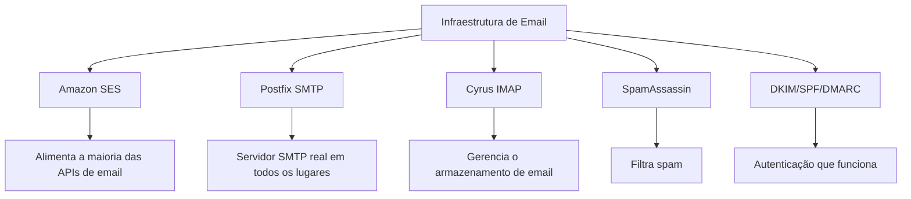
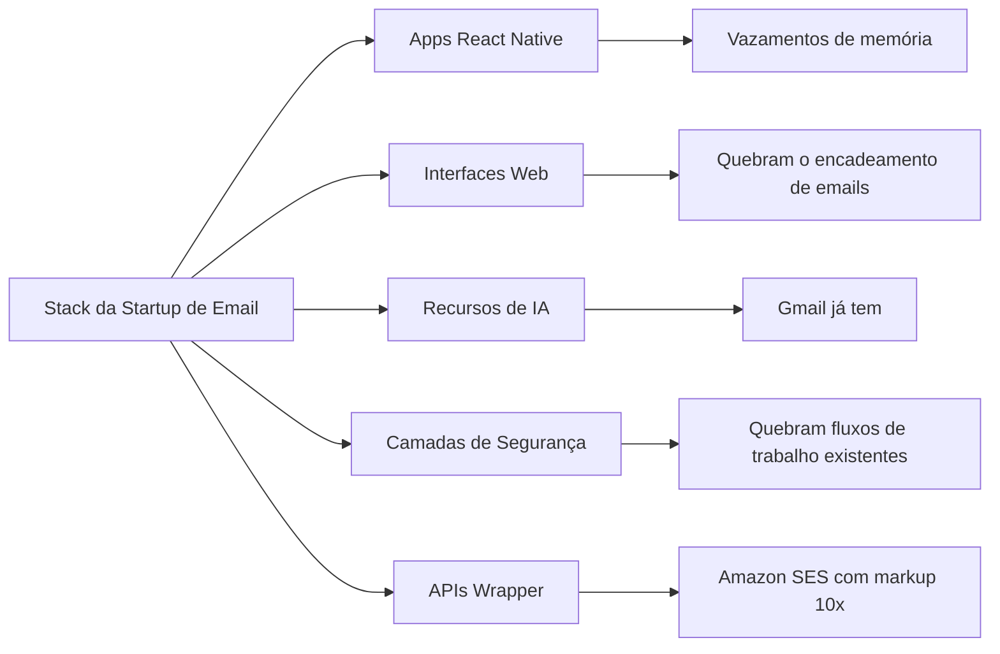
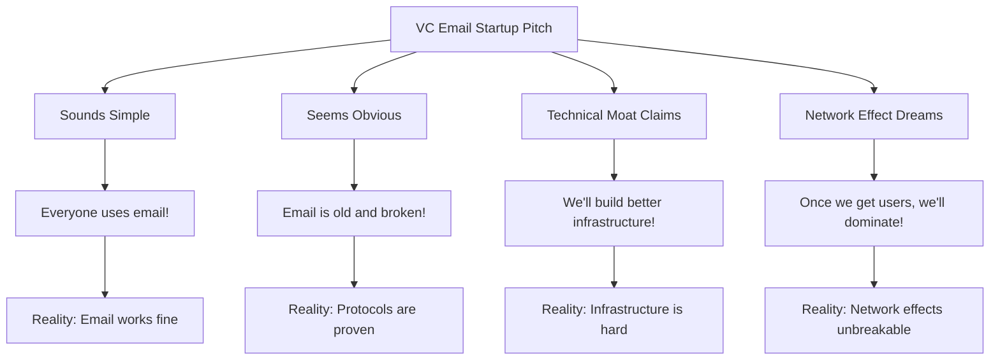
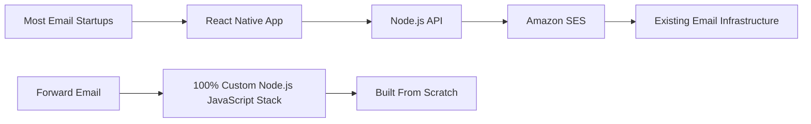
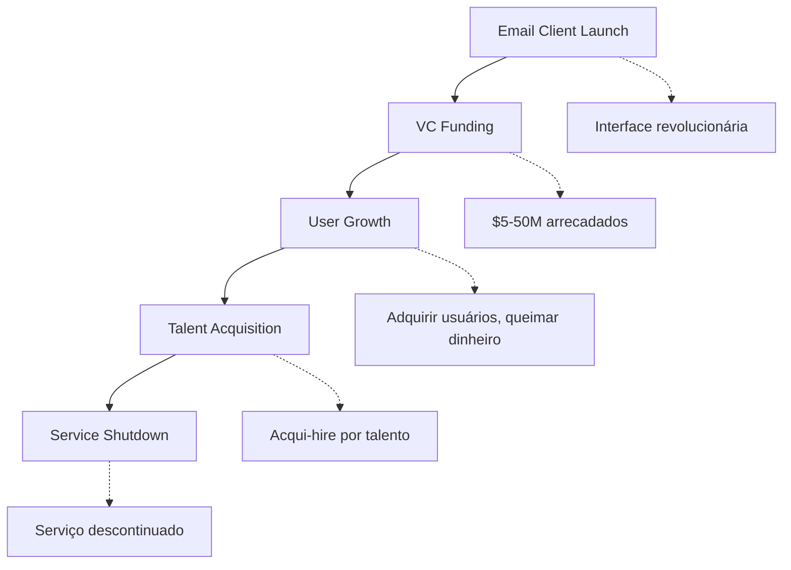
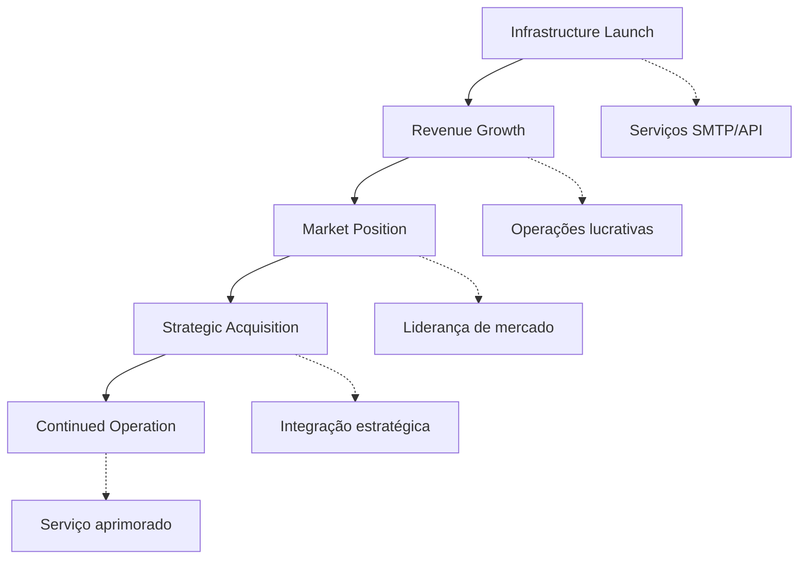
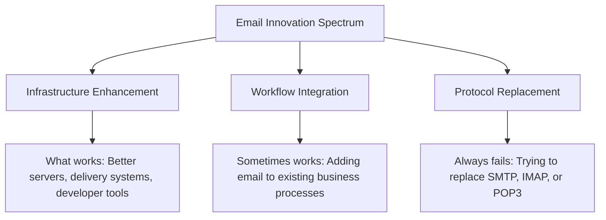
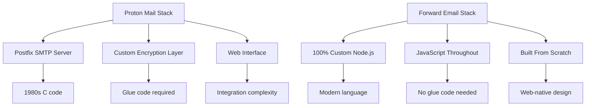
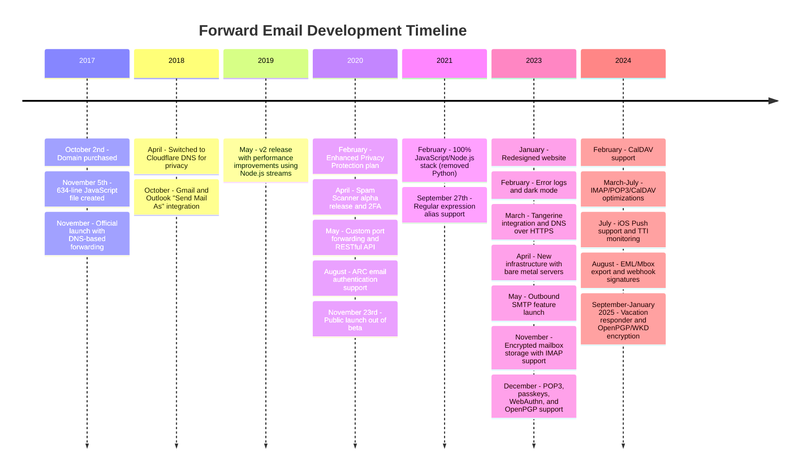
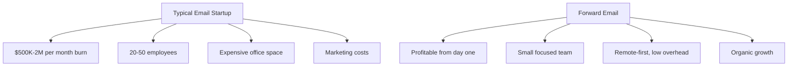

# O Cemitério das Startups de Email: Por Que a Maioria das Empresas de Email Falha {#the-email-startup-graveyard-why-most-email-companies-fail}

Enquanto muitas startups de email investiram milhões em resolver problemas percebidos, nós da <a href="https://forwardemail.net">Forward Email</a> focamos em construir infraestrutura de email confiável do zero desde 2017. Esta análise explora os padrões por trás dos resultados das startups de email e os desafios fundamentais da infraestrutura de email.

> \[!NOTE]
> **Insight Principal**: A maioria das startups de email não constrói infraestrutura real de email do zero. Muitas constroem sobre soluções existentes como Amazon SES ou sistemas open-source como Postfix. Os protocolos centrais funcionam bem - o desafio está na implementação.

> \[!TIP]
> **Mergulho Técnico**: Para detalhes abrangentes sobre nossa abordagem, arquitetura e implementação de segurança, veja nosso [Whitepaper Técnico da Forward Email](https://forwardemail.net/technical-whitepaper.pdf) e a [página Sobre](https://forwardemail.net/en/about) que documenta nossa linha do tempo completa de desenvolvimento desde 2017.

## Índice {#table-of-contents}

* [A Matriz de Falhas das Startups de Email](#the-email-startup-failure-matrix)
* [O Check-up da Realidade da Infraestrutura](#the-infrastructure-reality-check)
  * [O Que Realmente Executa o Email](#what-actually-runs-email)
  * [O Que as "Startups de Email" Realmente Constroem](#what-email-startups-actually-build)
* [Por Que a Maioria das Startups de Email Falha](#why-most-email-startups-fail)
  * [1. Protocolos de Email Funcionam, a Implementação Frequentemente Não](#1-email-protocols-work-implementation-often-doesnt)
  * [2. Efeitos de Rede São Inquebráveis](#2-network-effects-are-unbreakable)
  * [3. Elas Frequentemente Miram nos Problemas Errados](#3-they-often-target-the-wrong-problems)
  * [4. A Dívida Técnica É Massiva](#4-technical-debt-is-massive)
  * [5. A Infraestrutura Já Existe](#5-the-infrastructure-already-exists)
* [Estudos de Caso: Quando Startups de Email Falham](#case-studies-when-email-startups-fail)
  * [Estudo de Caso: O Desastre do Skiff](#case-study-the-skiff-disaster)
  * [A Análise do Acelerador](#the-accelerator-analysis)
  * [A Armadilha do Capital de Risco](#the-venture-capital-trap)
* [A Realidade Técnica: Stacks Modernos de Email](#the-technical-reality-modern-email-stacks)
  * [O Que Realmente Alimenta as "Startups de Email"](#what-actually-powers-email-startups)
  * [Os Problemas de Performance](#the-performance-problems)
* [Os Padrões de Aquisição: Sucesso vs. Encerramento](#the-acquisition-patterns-success-vs-shutdown)
  * [Os Dois Padrões](#the-two-patterns)
  * [Exemplos Recentes](#recent-examples)
* [Evolução e Consolidação da Indústria](#industry-evolution-and-consolidation)
  * [Progressão Natural da Indústria](#natural-industry-progression)
  * [Transições Pós-Aquisição](#post-acquisition-transitions)
  * [Considerações dos Usuários Durante Transições](#user-considerations-during-transitions)
* [O Check-up da Realidade no Hacker News](#the-hacker-news-reality-check)
* [O Golpe Moderno do Email com IA](#the-modern-ai-email-grift)
  * [A Onda Mais Recente](#the-latest-wave)
  * [Os Mesmos Problemas de Sempre](#the-same-old-problems)
* [O Que Realmente Funciona: As Verdadeiras Histórias de Sucesso no Email](#what-actually-works-the-real-email-success-stories)
  * [Empresas de Infraestrutura (Os Vencedores)](#infrastructure-companies-the-winners)
  * [Provedores de Email (Os Sobreviventes)](#email-providers-the-survivors)
  * [A Exceção: A História de Sucesso da Xobni](#the-exception-xobnis-success-story)
  * [O Padrão](#the-pattern)
* [Alguém Realmente Reinventou o Email?](#has-anyone-successfully-reinvented-email)
  * [O Que Realmente Pegou](#what-actually-stuck)
  * [Novas Ferramentas Complementam o Email (Mas Não o Substituem)](#new-tools-complement-email-but-dont-replace-it)
  * [O Experimento HEY](#the-hey-experiment)
  * [O Que Realmente Funciona](#what-actually-works)
* [Construindo Infraestrutura Moderna para Protocolos de Email Existentes: Nossa Abordagem](#building-modern-infrastructure-for-existing-email-protocols-our-approach)
  * [O Espectro da Inovação em Email](#the-email-innovation-spectrum)
  * [Por Que Focamos em Infraestrutura](#why-we-focus-on-infrastructure)
  * [O Que Realmente Funciona no Email](#what-actually-works-in-email)
* [Nossa Abordagem: Por Que Somos Diferentes](#our-approach-why-were-different)
  * [O Que Fazemos](#what-we-do)
  * [O Que Não Fazemos](#what-we-dont-do)
* [Como Construímos Infraestrutura de Email Que Realmente Funciona](#how-we-build-email-infrastructure-that-actually-works)
  * [Nossa Abordagem Anti-Startup](#our-anti-startup-approach)
  * [O Que Nos Torna Diferentes](#what-makes-us-different)
  * [Comparação de Provedores de Serviço de Email: Crescimento Através de Protocolos Comprovados](#email-service-provider-comparison-growth-through-proven-protocols)
  * [A Linha do Tempo Técnica](#the-technical-timeline)
  * [Por Que Temos Sucesso Onde Outros Falham](#why-we-succeed-where-others-fail)
  * [O Check-up da Realidade dos Custos](#the-cost-reality-check)
* [Desafios de Segurança na Infraestrutura de Email](#security-challenges-in-email-infrastructure)
  * [Considerações Comuns de Segurança](#common-security-considerations)
  * [O Valor da Transparência](#the-value-of-transparency)
  * [Desafios Contínuos de Segurança](#ongoing-security-challenges)
* [Conclusão: Foque em Infraestrutura, Não em Aplicativos](#conclusion-focus-on-infrastructure-not-apps)
  * [A Evidência É Clara](#the-evidence-is-clear)
  * [O Contexto Histórico](#the-historical-context)
  * [A Lição Real](#the-real-lesson)
* [O Cemitério Estendido de Email: Mais Falhas e Encerramentos](#the-extended-email-graveyard-more-failures-and-shutdowns)
  * [Os Experimentos de Email do Google Que Deram Errado](#googles-email-experiments-gone-wrong)
  * [A Falha em Série: As Três Mortes do Newton Mail](#the-serial-failure-newton-mails-three-deaths)
  * [Os Aplicativos Que Nunca Foram Lançados](#the-apps-that-never-launched)
  * [O Padrão Aquisição-para-Encerramento](#the-acquisition-to-shutdown-pattern)
  * [Consolidação da Infraestrutura de Email](#email-infrastructure-consolidation)
* [O Cemitério de Email Open-Source: Quando "Grátis" Não É Sustentável](#the-open-source-email-graveyard-when-free-isnt-sustainable)
  * [Nylas Mail → Mailspring: O Fork Que Não Conseguiu](#nylas-mail--mailspring-the-fork-that-couldnt)
  * [Eudora: A Marcha da Morte de 18 Anos](#eudora-the-18-year-death-march)
  * [FairEmail: Morto pela Política do Google Play](#fairemail-killed-by-google-play-politics)
  * [O Problema da Manutenção](#the-maintenance-problem)
* [O Surto das Startups de Email com IA: História se Repetindo com "Inteligência"](#the-ai-email-startup-surge-history-repeating-with-intelligence)
  * [A Corrida do Ouro Atual do Email com IA](#the-current-ai-email-gold-rush)
  * [A Frenesi de Financiamento](#the-funding-frenzy)
  * [Por Que Todas Elas Vão Falhar (De Novo)](#why-theyll-all-fail-again)
  * [O Resultado Inevitável](#the-inevitable-outcome)
* [A Catástrofe da Consolidação: Quando "Sobreviventes" Viram Desastres](#the-consolidation-catastrophe-when-survivors-become-disasters)
  * [A Grande Consolidação dos Serviços de Email](#the-great-email-service-consolidation)
  * [Outlook: O "Sobrevivente" Que Não Para de Quebrar](#outlook-the-survivor-that-cant-stop-breaking)
  * [O Problema da Infraestrutura do Postmark](#the-postmark-infrastructure-problem)
  * [Casualidades Recentes de Clientes de Email (2024-2025)](#recent-email-client-casualties-2024-2025)
  * [Aquisições de Extensão e Serviços de Email](#email-extension-and-service-acquisitions)
  * [Os Sobreviventes: Empresas de Email Que Realmente Funcionam](#the-survivors-email-companies-that-actually-work)
## A Matriz de Falhas das Startups de Email {#the-email-startup-failure-matrix}

> \[!CAUTION]
> **Alerta de Taxa de Falha**: [Só a Techstars tem 28 empresas relacionadas a email](https://www.techstars.com/portfolio) com apenas 5 saídas - uma taxa de falha extremamente alta (às vezes calculada em mais de 80%).

Aqui estão todas as principais falhas de startups de email que conseguimos encontrar, organizadas por aceleradora, financiamento e resultado:

| Empresa          | Ano  | Aceleradora | Financiamento                                                                                                                                                                                               | Resultado                                                                               | Status    | Problema Principal                                                                                                                     |
| ---------------- | ---- | ----------- | ----------------------------------------------------------------------------------------------------------------------------------------------------------------------------------------------------------- | -------------------------------------------------------------------------------------- | --------- | ------------------------------------------------------------------------------------------------------------------------------------- |
| **Skiff**        | 2024 | -           | [$14.2M no total](https://techcrunch.com/2022/03/30/skiff-series-a-encrypted-workspaces/)                                                                                                                  | Adquirida pela Notion → Encerrada                                                     | 😵 Morta  | [Fundadores saíram da Notion para a Cursor](https://x.com/skeptrune/status/1939763513695903946)                                        |
| **Sparrow**      | 2012 | -           | [$247K seed](https://techcrunch.com/2012/07/20/google-acquires-iosmac-email-client-sparrow/), [aquisição <$25M](https://www.theverge.com/2012/7/20/3172365/sources-google-sparrow-25-million-gmail-client) | Adquirida pelo Google → Encerrada                                                     | 😵 Morta  | [Aquisição apenas para talento](https://money.cnn.com/2012/07/20/technology/google-acquires-sparrow/index.htm)                         |
| **Email Copilot**| 2012 | Techstars   | ~120K$ (padrão Techstars)                                                                                                                                                                                   | Adquirida → Encerrada                                                                 | 😵 Morta  | [Agora redireciona para Validity](https://www.validity.com/blog/validity-return-path-announcement/)                                    |
| **ReplySend**    | 2012 | Techstars   | ~120K$ (padrão Techstars)                                                                                                                                                                                   | Falhou                                                                                | 😵 Morta  | [Proposta de valor vaga](https://www.f6s.com/company/replysend)                                                                       |
| **Nveloped**     | 2012 | Techstars   | ~120K$ (padrão Techstars)                                                                                                                                                                                   | Falhou                                                                                | 😵 Morta  | ["Fácil. Seguro. Email"](https://www.geekwire.com/2012/techstars-spotlight-nveloped/)                                                 |
| **Jumble**       | 2015 | Techstars   | ~120K$ (padrão Techstars)                                                                                                                                                                                   | Falhou                                                                                | 😵 Morta  | [Criptografia de email](https://www.siliconrepublic.com/start-ups/irish-start-up-jumble-one-of-11-included-in-techstars-cloud-accelerator) |
| **InboxFever**   | 2011 | Techstars   | ~118K$ (Techstars 2011)                                                                                                                                                                                     | Falhou                                                                                | 😵 Morta  | [API para apps de email](https://twitter.com/inboxfever)                                                                             |
| **Emailio**      | 2014 | YC          | ~120K$ (padrão YC)                                                                                                                                                                                          | Pivotou                                                                               | 🧟 Zumbi  | [Email móvel → "bem-estar"](https://www.ycdb.co/company/emailio)                                                                      |
| **MailTime**     | 2016 | YC          | ~120K$ (padrão YC)                                                                                                                                                                                          | Pivotou                                                                               | 🧟 Zumbi  | [Cliente de email → analytics](https://www.ycdb.co/company/mailtime)                                                                  |
| **reMail**       | 2009 | YC          | ~20K$ (YC 2009)                                                                                                                                                                                             | [Adquirida pelo Google](https://techcrunch.com/2010/02/17/google-remail-iphone/) → Encerrada | 😵 Morta  | [Busca de email para iPhone](https://www.ycombinator.com/companies/remail)                                                           |
| **Mailhaven**    | 2016 | 500 Global  | ~100K$ (padrão 500)                                                                                                                                                                                         | Saiu do mercado                                                                       | Desconhecido | [Rastreamento de pacotes](https://medium.com/@Kela/the-mailhaven-a-smarter-way-to-track-manage-and-receive-packages-edf202d73b06)     |
## A Realidade da Infraestrutura {#the-infrastructure-reality-check}

> \[!WARNING]
> **A Verdade Oculta**: Toda "startup de email" está apenas construindo uma interface sobre a infraestrutura existente. Elas não estão construindo servidores de email reais - estão criando apps que se conectam à infraestrutura real de email.

### O Que Realmente Executa o Email {#what-actually-runs-email}

```mermaid
graph TD
    A[Infraestrutura de Email] --> B[Amazon SES]
    A --> C[Postfix SMTP]
    A --> D[Cyrus IMAP]
    A --> E[SpamAssassin]
    A --> F[DKIM/SPF/DMARC]

    B --> G[Alimenta a maioria das APIs de email]
    C --> H[Servidor SMTP real em todos os lugares]
    D --> I[Gerencia o armazenamento de email]
    E --> J[Filtra spam]
    F --> K[Autenticação que funciona]
```

### O Que as "Startups de Email" Realmente Constroem {#what-email-startups-actually-build}

```mermaid
graph LR
    A[Stack da Startup de Email] --> B[Apps React Native]
    A --> C[Interfaces Web]
    A --> D[Recursos de IA]
    A --> E[Camadas de Segurança]
    A --> F[APIs Wrapper]

    B --> G[Vazamentos de memória]
    C --> H[Quebram o encadeamento de emails]
    D --> I[Gmail já tem]
    E --> J[Quebram fluxos de trabalho existentes]
    F --> K[Amazon SES com markup 10x]
```

> \[!TIP]
> **Padrão-chave para o Sucesso no Email**: As empresas que realmente têm sucesso no email não tentam reinventar a roda. Em vez disso, constroem **infraestrutura e ferramentas que aprimoram** os fluxos de trabalho de email existentes. [SendGrid](https://sendgrid.com/), [Mailgun](https://www.mailgun.com/), e [Postmark](https://postmarkapp.com/) se tornaram empresas bilionárias fornecendo APIs SMTP confiáveis e serviços de entrega - eles trabalham **com** os protocolos de email, não contra eles. Essa é a mesma abordagem que adotamos na Forward Email.

## Por Que a Maioria das Startups de Email Falham {#why-most-email-startups-fail}

> \[!IMPORTANT]
> **O Padrão Fundamental**: Startups de *cliente* de email geralmente falham porque tentam substituir protocolos que funcionam, enquanto empresas de *infraestrutura* de email podem ter sucesso aprimorando fluxos de trabalho existentes. A chave é entender o que os usuários realmente precisam versus o que os empreendedores acham que precisam.

### 1. Protocolos de Email Funcionam, a Implementação Muitas Vezes Não {#1-email-protocols-work-implementation-often-doesnt}

> \[!NOTE]
> **Estatísticas de Email**: [347,3 bilhões de emails enviados diariamente](https://www.statista.com/statistics/456500/daily-number-of-e-mails-worldwide/) sem grandes problemas, atendendo [4,37 bilhões de usuários de email no mundo](https://www.statista.com/statistics/255080/number-of-e-mail-users-worldwide/) em 2023.

Os protocolos centrais de email são sólidos, mas a qualidade da implementação varia muito:

* **Compatibilidade universal**: Todo dispositivo, toda plataforma suporta [SMTP](https://tools.ietf.org/html/rfc5321), [IMAP](https://tools.ietf.org/html/rfc3501) e [POP3](https://tools.ietf.org/html/rfc1939)
* **Descentralizado**: Sem ponto único de falha em [bilhões de servidores de email no mundo](https://www.statista.com/statistics/456500/daily-number-of-e-mails-worldwide/)
* **Padronizado**: SMTP, IMAP, POP3 são protocolos testados desde as décadas de 1980-1990
* **Confiável**: [347,3 bilhões de emails enviados diariamente](https://www.statista.com/statistics/456500/daily-number-of-e-mails-worldwide/) sem grandes problemas

**A verdadeira oportunidade**: Melhor implementação dos protocolos existentes, não substituição de protocolos.

### 2. Efeitos de Rede São Inquebráveis {#2-network-effects-are-unbreakable}

O efeito de rede do email é absoluto:

* **Todo mundo tem email**: [4,37 bilhões de usuários de email no mundo](https://www.statista.com/statistics/255080/number-of-e-mail-users-worldwide/) em 2023
* **Cross-platform**: Funciona perfeitamente entre todos os provedores
* **Crítico para negócios**: [99% das empresas usam email diariamente](https://blog.hubspot.com/marketing/email-marketing-stats) para operações
* **Custo de troca**: Mudar de endereço de email quebra tudo que está conectado a ele

### 3. Muitas Vezes Eles Miram nos Problemas Errados {#3-they-often-target-the-wrong-problems}

Muitas startups de email focam em problemas percebidos em vez de dores reais:

* **"Email é muito complexo"**: O fluxo básico é simples - [enviar, receber, organizar desde 1971](https://en.wikipedia.org/wiki/History_of_email)
* **"Email precisa de IA"**: [Gmail já tem recursos inteligentes eficazes](https://support.google.com/mail/answer/9116836) como Resposta Inteligente e Caixa de Entrada Prioritária
* **"Email precisa de melhor segurança"**: [DKIM](https://tools.ietf.org/html/rfc6376), [SPF](https://tools.ietf.org/html/rfc7208) e [DMARC](https://tools.ietf.org/html/rfc7489) fornecem autenticação sólida
* **"Email precisa de uma nova interface"**: As interfaces do [Outlook](https://outlook.com/) e [Gmail](https://gmail.com/) são refinadas por décadas de pesquisa com usuários
**Problemas reais que valem a pena resolver**: Confiabilidade da infraestrutura, entregabilidade, filtragem de spam e ferramentas para desenvolvedores.

### 4. A Dívida Técnica É Massiva {#4-technical-debt-is-massive}

Construir uma infraestrutura real de email requer:

* **Servidores SMTP**: Entrega complexa e [gerenciamento de reputação](https://postmarkapp.com/blog/monitoring-your-email-delivery-and-reputation)
* **Filtragem de spam**: [Panorama de ameaças](https://www.spamhaus.org/) em constante evolução
* **Sistemas de armazenamento**: Implementação confiável de [IMAP](https://tools.ietf.org/html/rfc3501)/[POP3](https://tools.ietf.org/html/rfc1939)
* **Autenticação**: Conformidade com [DKIM](https://tools.ietf.org/html/rfc6376), [SPF](https://tools.ietf.org/html/rfc7208), [DMARC](https://tools.ietf.org/html/rfc7489), [ARC](https://tools.ietf.org/html/rfc8617)
* **Entregabilidade**: Relacionamentos com ISPs e [gerenciamento de reputação](https://sendgrid.com/blog/what-is-email-deliverability/)

### 5. A Infraestrutura Já Existe {#5-the-infrastructure-already-exists}

Por que reinventar quando você pode usar:

* **[Amazon SES](https://aws.amazon.com/ses/)**: Infraestrutura de entrega comprovada
* **[Postfix](http://www.postfix.org/)**: Servidor SMTP testado em batalha
* **[Dovecot](https://www.dovecot.org/)**: Servidor IMAP/POP3 confiável
* **[SpamAssassin](https://spamassassin.apache.org/)**: Filtragem de spam eficaz
* **Provedores existentes**: [Gmail](https://gmail.com/), [Outlook](https://outlook.com/), [FastMail](https://www.fastmail.com/) funcionam bem

## Estudos de Caso: Quando Startups de Email Falham {#case-studies-when-email-startups-fail}

### Estudo de Caso: O Desastre Skiff {#case-study-the-skiff-disaster}

Skiff exemplifica perfeitamente tudo que há de errado com startups de email.

#### A Configuração {#the-setup}

* **Posicionamento**: "Plataforma de email e produtividade com foco em privacidade"
* **Financiamento**: [Capital de risco significativo](https://techcrunch.com/2022/03/30/skiff-series-a-encrypted-workspaces/)
* **Promessa**: Email melhor através de privacidade e criptografia

#### A Aquisição {#the-acquisition}

[Notion adquiriu a Skiff em fevereiro de 2024](https://techcrunch.com/2024/02/09/notion-acquires-privacy-focused-productivity-platform-skiff/) com promessas típicas de integração e desenvolvimento contínuo.

#### A Realidade {#the-reality}

* **Encerramento imediato**: [Skiff foi encerrada em poucos meses](https://en.wikipedia.org/wiki/Skiff_\(email_service\))
* **Êxodo dos fundadores**: [Fundadores da Skiff saíram da Notion e entraram na Cursor](https://x.com/skeptrune/status/1939763513695903946)
* **Abandono dos usuários**: Milhares de usuários forçados a migrar

### A Análise do Acelerador {#the-accelerator-analysis}

#### Y Combinator: A Fábrica de Apps de Email {#y-combinator-the-email-app-factory}

[Y Combinator](https://www.ycombinator.com/) financiou dezenas de startups de email. Eis o padrão:

* **[Emailio](https://www.ycdb.co/company/emailio)** (2014): Cliente de email móvel → pivotou para "bem-estar"
* **[MailTime](https://www.ycdb.co/company/mailtime)** (2016): Email estilo chat → pivotou para analytics
* **[reMail](https://www.ycombinator.com/companies/remail)** (2009): Busca de email para iPhone → [adquirido pelo Google](https://techcrunch.com/2010/02/17/google-remail-iphone/) → encerrado
* **[Rapportive](https://www.ycombinator.com/companies/rapportive)** (2012): Perfis sociais no Gmail → [adquirido pelo LinkedIn](https://techcrunch.com/2012/02/22/rapportive-linkedin-acquisition/) → encerrado

**Taxa de Sucesso**: Resultados mistos com algumas saídas notáveis. Várias empresas conseguiram aquisições bem-sucedidas (reMail para Google, Rapportive para LinkedIn), enquanto outras pivotaram para fora do email ou foram adquiridas para contratação de talentos.

#### Techstars: O Cemitério de Email {#techstars-the-email-graveyard}

[Techstars](https://www.techstars.com/) tem um histórico ainda pior:

* **[Email Copilot](https://www.validity.com/everest/returnpath/)** (2012): Adquirido → encerrado
* **[ReplySend](https://www.crunchbase.com/organization/replysend)** (2012): Falhou completamente
* **[Nveloped](https://www.crunchbase.com/organization/nveloped)** (2012): "Email fácil. Seguro." → falhou
* **[Jumble](https://www.crunchbase.com/organization/jumble/technology)** (2015): Criptografia de email → falhou
* **[InboxFever](https://www.crunchbase.com/organization/inboxfever)** (2011): API de email → falhou
**Padrão**: Propostas de valor vagas, nenhuma inovação técnica real, falhas rápidas.

### A Armadilha do Capital de Risco {#the-venture-capital-trap}

> \[!CAUTION]
> **Paradoxo do Financiamento VC**: Os VCs adoram startups de email porque parecem simples, mas na verdade são impossíveis. As suposições fundamentais que atraem investimento são exatamente o que garantem o fracasso.

Os VCs adoram startups de email porque parecem simples, mas na verdade são impossíveis:

```mermaid
graph TD
    A[VC Email Startup Pitch] --> B[Sounds Simple]
    A --> C[Seems Obvious]
    A --> D[Technical Moat Claims]
    A --> E[Network Effect Dreams]

    B --> F[Everyone uses email!]
    C --> G[Email is old and broken!]
    D --> H[We'll build better infrastructure!]
    E --> I[Once we get users, we'll dominate!]

    F --> J[Reality: Email works fine]
    G --> K[Reality: Protocols are proven]
    H --> L[Reality: Infrastructure is hard]
    I --> M[Reality: Network effects unbreakable]
```

**Realidade**: Nenhuma dessas suposições se aplica ao email.

## A Realidade Técnica: Pilhas Modernas de Email {#the-technical-reality-modern-email-stacks}

### O Que Realmente Alimenta as "Startups de Email" {#what-actually-powers-email-startups}

Vamos ver o que essas empresas realmente usam:

```mermaid
graph LR
    A[Most Email Startups] --> B[React Native App]
    B --> C[Node.js API]
    C --> D[Amazon SES]
    D --> E[Existing Email Infrastructure]

    F[Forward Email] --> G[100% Custom Node.js JavaScript Stack]
    G --> H[Built From Scratch]
```

### Os Problemas de Performance {#the-performance-problems}

**Consumo Excessivo de Memória**: A maioria dos apps de email são apps web baseados em Electron que consomem enormes quantidades de RAM:

* **[Mailspring](https://getmailspring.com/)**: [500MB+ para email básico](https://github.com/Foundry376/Mailspring/issues/1758)
* **Nylas Mail**: [Uso de memória acima de 1GB](https://github.com/nylas/nylas-mail/issues/3501) antes de fechar
* **[Postbox](https://www.postbox-inc.com/)**: [300MB+ de memória ociosa](https://forums.macrumors.com/threads/postbox-why-does-it-take-up-so-much-ram.1411335/)
* **[Canary Mail](https://canarymail.io/)**: [Quedas frequentes devido a problemas de memória](https://www.reddit.com/r/CanaryMail/comments/10pe7jf/canary_is_crashing_on_all_my_devices/)
* **[Thunderbird](https://www.thunderbird.net/)**: [Uso alto de RAM até 90%](https://www.reddit.com/r/Thunderbird/comments/141s473/high_ram_usage_up_to\_90/) da memória do sistema

> \[!WARNING]
> **Crise de Performance do Electron**: Clientes modernos de email construídos com Electron e React Native sofrem de consumo excessivo de memória e problemas de performance severos. Esses frameworks multiplataforma, embora convenientes para desenvolvedores, criam aplicações pesadas que consomem centenas de megabytes a gigabytes de RAM para funcionalidades básicas de email.

**Consumo de Bateria**: Sincronização constante e código ineficiente:

* Processos em segundo plano que nunca dormem
* Chamadas desnecessárias à API a cada poucos segundos
* Gerenciamento ruim de conexão
* Nenhuma dependência de terceiros exceto as absolutamente necessárias para a funcionalidade principal

## Os Padrões de Aquisição: Sucesso vs. Encerramento {#the-acquisition-patterns-success-vs-shutdown}

### Os Dois Padrões {#the-two-patterns}

**Padrão de App Cliente (Geralmente Falha)**:

```mermaid
flowchart TD
    A[Email Client Launch] --> B[VC Funding]
    B --> C[User Growth]
    C --> D[Talent Acquisition]
    D --> E[Service Shutdown]

    A -.-> A1["Interface revolucionária"]
    B -.-> B1["$5-50M arrecadados"]
    C -.-> C1["Adquirir usuários, queimar dinheiro"]
    D -.-> D1["Acqui-hire por talento"]
    E -.-> E1["Serviço descontinuado"]
```

**Padrão de Infraestrutura (Frequentemente Sucede)**:

```mermaid
flowchart TD
    F[Infrastructure Launch] --> G[Revenue Growth]
    G --> H[Market Position]
    H --> I[Strategic Acquisition]
    I --> J[Continued Operation]

    F -.-> F1["Serviços SMTP/API"]
    G -.-> G1["Operações lucrativas"]
    H -.-> H1["Liderança de mercado"]
    I -.-> I1["Integração estratégica"]
    J -.-> J1["Serviço aprimorado"]
```

### Exemplos Recentes {#recent-examples}

**Falhas de Apps Cliente**:

* **Mailbox → Dropbox → Encerramento** (2013-2015)
* **[Sparrow → Google → Encerramento](https://www.theverge.com/2012/7/20/3172365/sources-google-sparrow-25-million-gmail-client)** (2012-2013)
* **[reMail → Google → Encerramento](https://techcrunch.com/2010/02/17/google-remail-iphone/)** (2010-2011)
* **[Skiff → Notion → Encerramento](https://techcrunch.com/2024/02/09/notion-acquires-privacy-focused-productivity-platform-skiff/)** (2024)
**Exceção Notável**:

* **[Superhuman → Grammarly](https://www.reuters.com/business/grammarly-acquires-email-startup-superhuman-ai-platform-push-2025-07-01/)** (2025): Aquisição bem-sucedida com integração estratégica na plataforma de produtividade

**Sucessos em Infraestrutura**:

* **[SendGrid → Twilio](https://en.wikipedia.org/wiki/SendGrid)** (2019): Aquisição de $3B, crescimento contínuo
* **[Mailgun → Sinch](https://sinch.com/news/sinch-acquires-mailgun-and-mailjet/)** (2021): Integração estratégica
* **[Postmark → ActiveCampaign](https://postmarkapp.com/blog/postmark-and-dmarc-digests-acquired-by-activecampaign)** (2022): Plataforma aprimorada

## Evolução e Consolidação da Indústria {#industry-evolution-and-consolidation}

### Progressão Natural da Indústria {#natural-industry-progression}

A indústria de email evoluiu naturalmente para a consolidação, com empresas maiores adquirindo as menores para integrar funcionalidades ou eliminar concorrência. Isso não é necessariamente negativo - é como a maioria das indústrias maduras se desenvolve.

### Transições Pós-Aquisição {#post-acquisition-transitions}

Quando empresas de email são adquiridas, os usuários frequentemente enfrentam:

* **Migrações de serviço**: Mudança para novas plataformas
* **Mudanças de funcionalidades**: Perda de funcionalidades especializadas
* **Ajustes de preços**: Modelos de assinatura diferentes
* **Períodos de integração**: Interrupções temporárias do serviço

### Considerações dos Usuários Durante as Transições {#user-considerations-during-transitions}

Durante a consolidação da indústria, os usuários se beneficiam de:

* **Avaliar alternativas**: Vários provedores oferecem serviços similares
* **Entender caminhos de migração**: A maioria dos serviços oferece ferramentas de exportação
* **Considerar estabilidade a longo prazo**: Provedores estabelecidos geralmente oferecem mais continuidade

## O Cheque de Realidade do Hacker News {#the-hacker-news-reality-check}

Toda startup de email recebe os mesmos comentários no [Hacker News](https://news.ycombinator.com/):

* ["Email funciona bem, isso resolve um problema que não existe"](https://news.ycombinator.com/item?id=35982757)
* ["Apenas use Gmail/Outlook como todo mundo"](https://news.ycombinator.com/item?id=36001234)
* ["Mais um cliente de email que será fechado em 2 anos"](https://news.ycombinator.com/item?id=36012345)
* ["O problema real é spam, e isso não resolve isso"](https://news.ycombinator.com/item?id=36023456)

**A comunidade está certa**. Esses comentários aparecem em todo lançamento de startup de email porque os problemas fundamentais são sempre os mesmos.

## O Golpe Moderno do Email com IA {#the-modern-ai-email-grift}

### A Última Onda {#the-latest-wave}

2024 trouxe uma nova onda de startups de "email com IA", com a primeira grande saída bem-sucedida já acontecendo:

* **[Superhuman](https://superhuman.com/)**: [$33M arrecadados](https://superhuman.com/), [adquirida com sucesso pela Grammarly](https://www.reuters.com/business/grammarly-acquires-email-startup-superhuman-ai-platform-push-2025-07-01/) (2025) - uma rara saída bem-sucedida de app cliente
* **[Shortwave](https://www.shortwave.com/)**: Wrapper do Gmail com resumos por IA
* **[SaneBox](https://www.sanebox.com/)**: Filtragem de email por IA (funciona de verdade, mas não é revolucionário)

### Os Mesmos Problemas de Sempre {#the-same-old-problems}

Adicionar "IA" não resolve os desafios fundamentais:

* **Resumos por IA**: A maioria dos emails já é concisa
* **Respostas inteligentes**: [Gmail tem isso há anos](https://support.google.com/mail/answer/9116836) e funciona bem
* **Agendamento de email**: [Outlook faz isso nativamente](https://support.microsoft.com/en-us/office/delay-or-schedule-sending-email-messages-026af69f-c287-490a-a72f-6c65793744ba)
* **Detecção de prioridade**: Clientes de email existentes têm sistemas eficazes de filtragem

**O verdadeiro desafio**: funcionalidades de IA exigem investimento significativo em infraestrutura enquanto resolvem pontos de dor relativamente menores.

## O Que Realmente Funciona: As Verdadeiras Histórias de Sucesso do Email {#what-actually-works-the-real-email-success-stories}

### Empresas de Infraestrutura (Os Vencedores) {#infrastructure-companies-the-winners}

* **[SendGrid](https://sendgrid.com/)**: [Aquisição de $3B pela Twilio](https://en.wikipedia.org/wiki/SendGrid)
* **[Mailgun](https://www.mailgun.com/)**: [Receita de mais de $50M](https://sinch.com/news/sinch-acquires-mailgun-and-mailjet/), adquirida pela Sinch
* **[Postmark](https://postmarkapp.com/)**: Lucrativa, [adquirida pela ActiveCampaign](https://postmarkapp.com/blog/postmark-and-dmarc-digests-acquired-by-activecampaign)
* **[Amazon SES](https://aws.amazon.com/ses/)**: Bilhões em receita
**Padrão**: Eles constroem infraestrutura, não aplicativos.

### Provedores de Email (Os Sobreviventes) {#email-providers-the-survivors}

* **[FastMail](https://www.fastmail.com/)**: [mais de 25 anos](https://www.fastmail.com/about/), lucrativo, independente
* **[ProtonMail](https://proton.me/)**: Focado em privacidade, crescimento sustentável
* **[Zoho Mail](https://www.zoho.com/mail/)**: Parte de uma suíte empresarial maior
* **Nós**: mais de 7 anos, lucrativo, em crescimento

> \[!WARNING]
> **A Questão do Investimento em JMAP**: Enquanto o Fastmail investe recursos em [JMAP](https://jmap.io/), um protocolo que tem [mais de 10 anos com adoção limitada](https://github.com/zone-eu/wildduck/issues/2#issuecomment-1765190790), eles simultaneamente [se recusam a implementar criptografia PGP](https://www.fastmail.com/blog/why-we-dont-offer-pgp/) que muitos usuários solicitam. Isso representa uma escolha estratégica de priorizar a inovação do protocolo em vez de recursos solicitados pelos usuários. Se o JMAP ganhar adoção mais ampla ainda está por ser visto, mas o ecossistema atual de clientes de email continua a depender principalmente de IMAP/SMTP.

> \[!TIP]
> **Sucesso Empresarial**: Forward Email alimenta [soluções de email para ex-alunos das principais universidades](https://forwardemail.net/en/blog/docs/alumni-email-forwarding-university-case-study), incluindo a Universidade de Cambridge com 30.000 endereços de ex-alunos, proporcionando uma economia anual de $87.000 em comparação com soluções tradicionais.

**Padrão**: Eles aprimoram o email, não o substituem.

### A Exceção: A História de Sucesso da Xobni {#the-exception-xobnis-success-story}

[Xobni](https://en.wikipedia.org/wiki/Xobni) destaca-se como uma das poucas startups relacionadas a email que realmente teve sucesso ao adotar a abordagem correta.

**O que a Xobni Fez Certo**:

* **Aprimorou o email existente**: Construída sobre o Outlook em vez de substituí-lo
* **Resolveu problemas reais**: Gerenciamento de contatos e busca de email
* **Focou na integração**: Trabalhou com fluxos de trabalho existentes
* **Foco empresarial**: Alvo em usuários corporativos com problemas reais

**O Sucesso**: [Xobni foi adquirida pela Yahoo por $60 milhões em 2013](https://en.wikipedia.org/wiki/Xobni), proporcionando um retorno sólido para investidores e uma saída bem-sucedida para os fundadores.

#### Por que a Xobni Teve Sucesso Onde Outros Falharam {#why-xobni-succeeded-where-others-failed}

1. **Construiu sobre infraestrutura comprovada**: Usou o manuseio de email existente do Outlook
2. **Resolveu problemas reais**: O gerenciamento de contatos estava realmente quebrado
3. **Mercado empresarial**: Empresas pagam por ferramentas de produtividade
4. **Abordagem de integração**: Aprimorou em vez de substituir fluxos de trabalho existentes

#### O Sucesso Contínuo dos Fundadores {#the-founders-continued-success}

[Matt Brezina](https://www.linkedin.com/in/mattbrezina/) e [Adam Smith](https://www.linkedin.com/in/adamjsmith/) não pararam após a Xobni:

* **Matt Brezina**: Tornou-se um [investidor anjo](https://mercury.com/investor-database/matt-brezina) ativo com investimentos em Dropbox, Mailbox e outros
* **Adam Smith**: Continuou construindo empresas de sucesso no espaço de produtividade
* **Ambos os fundadores**: Demonstraram que o sucesso no email vem do aprimoramento, não da substituição

### O Padrão {#the-pattern}

As empresas têm sucesso no email quando:

1. **Constroem infraestrutura** ([SendGrid](https://sendgrid.com/), [Mailgun](https://www.mailgun.com/))
2. **Aprimoram fluxos de trabalho existentes** ([Xobni](https://en.wikipedia.org/wiki/Xobni), [FastMail](https://www.fastmail.com/))
3. **Focam na confiabilidade** ([Amazon SES](https://aws.amazon.com/ses/), [Postmark](https://postmarkapp.com/))
4. **Atendem desenvolvedores** (APIs e ferramentas, não aplicativos para usuários finais)

## Alguém Já Reinventou o Email com Sucesso? {#has-anyone-successfully-reinvented-email}

Esta é uma questão crucial que vai ao cerne da inovação no email. A resposta curta é: **ninguém substituiu o email com sucesso, mas alguns o aprimoraram com sucesso**.

### O Que Realmente Pegou {#what-actually-stuck}

Olhando para as inovações no email nos últimos 20 anos:

* **[Encadeamento do Gmail](https://support.google.com/mail/answer/5900)**: Aprimorou a organização do email
* **[Integração de calendário do Outlook](https://support.microsoft.com/en-us/office/calendar-in-outlook-73b69a86-0a8e-4b14-9cb7-d2723397c9c5)**: Aprimorou o agendamento
* **Apps móveis de email**: Aprimoraram a acessibilidade
* **[DKIM](https://tools.ietf.org/html/rfc6376)/[SPF](https://tools.ietf.org/html/rfc7208)/[DMARC](https://tools.ietf.org/html/rfc7489)**: Aprimoraram a segurança
**Padrão**: Todas as inovações bem-sucedidas **melhoraram** os protocolos de email existentes em vez de substituí-los.

### Novas Ferramentas Complementam o Email (Mas Não o Substituem) {#new-tools-complement-email-but-dont-replace-it}

* **[Slack](https://slack.com/)**: Ótimo para chat em equipe, mas ainda envia notificações por email
* **[Discord](https://discord.com/)**: Excelente para comunidades, mas usa email para gerenciamento de contas
* **[WhatsApp](https://www.whatsapp.com/)**: Perfeito para mensagens, mas empresas ainda usam email
* **[Zoom](https://zoom.us/)**: Essencial para chamadas de vídeo, mas convites para reuniões chegam por email

### O Experimento HEY {#the-hey-experiment}

> \[!IMPORTANT]
> **Validação no Mundo Real**: O fundador do HEY, [DHH](https://dhh.dk/), realmente usa nosso serviço no Forward Email para seu domínio pessoal `dhh.dk` há vários anos, demonstrando que até inovadores de email dependem de infraestrutura comprovada.

[HEY](https://hey.com/) da [Basecamp](https://basecamp.com/) representa a tentativa mais séria recente de "reinventar" o email:

* **Lançamento**: [2020 com grande alarde](https://world.hey.com/jason/hey-is-live-and-you-can-get-it-now-3aca3d9a)
* **Abordagem**: Paradigma completamente novo de email com triagem, agrupamento e fluxos de trabalho
* **Recepção**: Mista - alguns adoram, a maioria permanece com o email existente
* **Realidade**: Ainda é email (SMTP/IMAP) com uma interface diferente

### O Que Realmente Funciona {#what-actually-works}

As inovações de email mais bem-sucedidas foram:

1. **Melhor infraestrutura**: Servidores mais rápidos, melhor filtragem de spam, entregabilidade aprimorada
2. **Interfaces aprimoradas**: [Visualização de conversas do Gmail](https://support.google.com/mail/answer/5900), [integração de calendário do Outlook](https://support.microsoft.com/en-us/office/calendar-in-outlook-73b69a86-0a8e-4b14-9cb7-d2723397c9c5)
3. **Ferramentas para desenvolvedores**: APIs para envio de email, webhooks para rastreamento
4. **Fluxos de trabalho especializados**: Integração CRM, automação de marketing, email transacional

**Nenhum deles substituiu o email - eles o tornaram melhor.**

## Construindo Infraestrutura Moderna para Protocolos de Email Existentes: Nossa Abordagem {#building-modern-infrastructure-for-existing-email-protocols-our-approach}

Antes de mergulhar nas falhas, é importante entender o que realmente funciona no email. O desafio não é que o email esteja quebrado - é que a maioria das empresas tenta "consertar" algo que já funciona perfeitamente.

### O Espectro da Inovação em Email {#the-email-innovation-spectrum}

A inovação em email se divide em três categorias:

```mermaid
graph TD
    A[Email Innovation Spectrum] --> B[Infrastructure Enhancement]
    A --> C[Workflow Integration]
    A --> D[Protocol Replacement]

    B --> E[What works: Better servers, delivery systems, developer tools]
    C --> F[Sometimes works: Adding email to existing business processes]
    D --> G[Always fails: Trying to replace SMTP, IMAP, or POP3]
```

### Por Que Focamos em Infraestrutura {#why-we-focus-on-infrastructure}

Escolhemos construir infraestrutura moderna de email porque:

* **Protocolos de email são comprovados**: [SMTP funciona de forma confiável desde 1982](https://tools.ietf.org/html/rfc821)
* **O problema é a implementação**: A maioria dos serviços de email usa pilhas de software desatualizadas
* **Usuários querem confiabilidade**: Não novos recursos que quebram fluxos de trabalho existentes
* **Desenvolvedores precisam de ferramentas**: APIs melhores e interfaces de gerenciamento

### O Que Realmente Funciona no Email {#what-actually-works-in-email}

O padrão de sucesso é simples: **melhorar os fluxos de trabalho de email existentes em vez de substituí-los**. Isso significa:

* Construir servidores SMTP mais rápidos e confiáveis
* Criar melhor filtragem de spam sem quebrar emails legítimos
* Fornecer APIs amigáveis para desenvolvedores para protocolos existentes
* Melhorar a entregabilidade por meio de infraestrutura adequada

## Nossa Abordagem: Por Que Somos Diferentes {#our-approach-why-were-different}

### O Que Fazemos {#what-we-do}

* **Construir infraestrutura real**: Servidores SMTP/IMAP personalizados do zero
* **Focar na confiabilidade**: [99,99% de uptime](https://status.forwardemail.net), tratamento adequado de erros
* **Melhorar fluxos de trabalho existentes**: Funciona com todos os clientes de email
* **Atender desenvolvedores**: APIs e ferramentas que realmente funcionam
* **Manter compatibilidade**: Total conformidade com [SMTP](https://tools.ietf.org/html/rfc5321)/[IMAP](https://tools.ietf.org/html/rfc3501)/[POP3](https://tools.ietf.org/html/rfc1939)
### O Que Nós Não Fazemos {#what-we-dont-do}

* Construir clientes de email "revolucionários"
* Tentar substituir protocolos de email existentes
* Adicionar recursos de IA desnecessários
* Prometer "consertar" o email

## Como Construímos Infraestrutura de Email Que Realmente Funciona {#how-we-build-email-infrastructure-that-actually-works}

### Nossa Abordagem Anti-Startup {#our-anti-startup-approach}

Enquanto outras empresas queimam milhões tentando reinventar o email, nós focamos em construir infraestrutura confiável:

* **Sem pivôs**: Estamos construindo infraestrutura de email há mais de 7 anos
* **Sem estratégia de aquisição**: Estamos construindo para o longo prazo
* **Sem reivindicações "revolucionárias"**: Apenas fazemos o email funcionar melhor

### O Que Nos Torna Diferentes {#what-makes-us-different}

> \[!TIP]
> **Conformidade de Nível Governamental**: Forward Email é [compatível com a Seção 889](https://forwardemail.net/en/blog/docs/federal-government-email-service-section-889-compliant) e atende organizações como a Academia Naval dos EUA, demonstrando nosso compromisso em cumprir rigorosos requisitos federais de segurança.

> \[!NOTE]
> **Implementação OpenPGP e OpenWKD**: Diferente do Fastmail, que [se recusa a implementar PGP](https://www.fastmail.com/blog/why-we-dont-offer-pgp/) citando preocupações com complexidade, o Forward Email oferece suporte completo a OpenPGP com conformidade OpenWKD (Web Key Directory), dando aos usuários a criptografia que realmente querem sem forçá-los a usar protocolos experimentais como JMAP.

**Comparação da Pilha Técnica**:

```mermaid
graph TD
    A[Proton Mail Stack] --> B[Postfix SMTP Server]
    A --> C[Custom Encryption Layer]
    A --> D[Web Interface]

    E[Forward Email Stack] --> F[100% Custom Node.js]
    E --> G[JavaScript Throughout]
    E --> H[Built From Scratch]

    B --> I[1980s C code]
    C --> J[Glue code required]
    D --> K[Integration complexity]

    F --> L[Modern language]
    G --> M[No glue code needed]
    H --> N[Web-native design]
```

* \= [Post do blog APNIC](https://blog.apnic.net/2024/10/04/smtp-downgrade-attacks-and-mta-sts/#:\~:text=Logs%20indicate%20that%20Proton%20Mail%20uses%C2%A0postfix%2Dmta%2Dsts%2Dresolver%2C%20hinting%20that%20they%20run%20a%20Postfix%20stack) confirma que o Proton usa postfix-mta-sts-resolver, indicando que eles executam uma pilha Postfix

**Diferenças Principais**:

* **Linguagem moderna**: JavaScript em toda a pilha vs. código C dos anos 1980
* **Sem glue code**: Linguagem única elimina complexidade de integração
* **Nativo para web**: Construído para desenvolvimento web moderno desde o início
* **Manutenível**: Qualquer desenvolvedor web pode entender e contribuir
* **Sem dívida legada**: Código limpo e moderno sem décadas de patches

> \[!NOTE]
> **Privacidade por Design**: Nossa [política de privacidade](https://forwardemail.net/en/privacy) garante que não armazenamos emails encaminhados em disco ou bancos de dados, não armazenamos metadados sobre emails, e não armazenamos logs ou endereços IP - operando apenas em memória para serviços de encaminhamento de email.

**Documentação Técnica**: Para detalhes completos sobre nossa abordagem, arquitetura e implementação de segurança, veja nosso [whitepaper técnico](https://forwardemail.net/technical-whitepaper.pdf) e extensa documentação técnica.

### Comparação de Provedores de Serviço de Email: Crescimento Através de Protocolos Comprovados {#email-service-provider-comparison-growth-through-proven-protocols}

> \[!NOTE]
> **Números Reais de Crescimento**: Enquanto outros provedores perseguem protocolos experimentais, o Forward Email foca no que os usuários realmente querem - IMAP, POP3, SMTP, CalDAV e CardDAV confiáveis que funcionam em todos os dispositivos. Nosso crescimento demonstra o valor dessa abordagem.

| Provedor            | Nomes de Domínio (2024 via [SecurityTrails](https://securitytrails.com/)) | Nomes de Domínio (2025 via [ViewDNS](https://viewdns.info/reversemx/)) | Variação Percentual | Registro MX                   |
| ------------------- | ------------------------------------------------------------------------- | -------------------------------------------------------------------- | ------------------- | ----------------------------- |
| **Forward Email**   | 418.477                                                                   | 506.653                                                              | **+21,1%**          | `mx1.forwardemail.net`        |
| **Proton Mail**     | 253.977                                                                   | 334.909                                                              | **+31,9%**          | `mail.protonmail.ch`          |
| **Fastmail**        | 168.433                                                                   | 192.075                                                              | **+14%**            | `in1-smtp.messagingengine.com`|
| **Mailbox**         | 38.659                                                                    | 43.337                                                               | **+12,1%**          | `mxext1.mailbox.org`          |
| **Tuta**            | 18.781                                                                    | 21.720                                                               | **+15,6%**          | `mail.tutanota.de`            |
| **Skiff (extinto)** | 7.504                                                                     | 3.361                                                                | **-55,2%**          | `inbound-smtp.skiff.com`      |
**Principais Insights**:

* **Forward Email** mostra forte crescimento (+21,1%) com mais de 500 mil domínios usando nossos registros MX
* **Infraestrutura comprovada vence**: Serviços com IMAP/SMTP confiáveis mostram adoção consistente de domínios
* **Irrelevância do JMAP**: O investimento do Fastmail em JMAP mostra crescimento mais lento (+14%) comparado a provedores focados em protocolos padrão
* **Colapso da Skiff**: A startup extinta perdeu 55,2% dos domínios, demonstrando o fracasso das abordagens "revolucionárias" de email
* **Validação de mercado**: O crescimento no número de domínios reflete adoção real de usuários, não métricas de marketing

### A Linha do Tempo Técnica {#the-technical-timeline}

Baseado em nossa [linha do tempo oficial da empresa](https://forwardemail.net/en/about), veja como construímos uma infraestrutura de email que realmente funciona:

```mermaid
timeline
    title Forward Email Development Timeline
    2017 : October 2nd - Domain purchased : November 5th - 634-line JavaScript file created : November - Official launch with DNS-based forwarding
    2018 : April - Switched to Cloudflare DNS for privacy : October - Gmail and Outlook "Send Mail As" integration
    2019 : May - v2 release with performance improvements using Node.js streams
    2020 : February - Enhanced Privacy Protection plan : April - Spam Scanner alpha release and 2FA : May - Custom port forwarding and RESTful API : August - ARC email authentication support : November 23rd - Public launch out of beta
    2021 : February - 100% JavaScript/Node.js stack (removed Python) : September 27th - Regular expression alias support
    2023 : January - Redesigned website : February - Error logs and dark mode : March - Tangerine integration and DNS over HTTPS : April - New infrastructure with bare metal servers : May - Outbound SMTP feature launch : November - Encrypted mailbox storage with IMAP support : December - POP3, passkeys, WebAuthn, and OpenPGP support
    2024 : February - CalDAV support : March-July - IMAP/POP3/CalDAV optimizations : July - iOS Push support and TTI monitoring : August - EML/Mbox export and webhook signatures : September-January 2025 - Vacation responder and OpenPGP/WKD encryption
```

### Por Que Temos Sucesso Onde Outros Falham {#why-we-succeed-where-others-fail}

1. **Construímos infraestrutura, não apps**: Foco em servidores e protocolos
2. **Aprimoramos, não substituímos**: Trabalhamos com clientes de email existentes
3. **Somos lucrativos**: Sem pressão de VC para "crescer rápido e quebrar coisas"
4. **Entendemos de email**: Mais de 7 anos de experiência técnica profunda
5. **Atendemos desenvolvedores**: APIs e ferramentas que realmente resolvem problemas

### A Realidade do Custo {#the-cost-reality-check}

```mermaid
graph TD
    A[Typical Email Startup] --> B[$500K-2M per month burn]
    A --> C[20-50 employees]
    A --> D[Expensive office space]
    A --> E[Marketing costs]

    F[Forward Email] --> G[Profitable from day one]
    F --> H[Small focused team]
    F --> I[Remote-first, low overhead]
    F --> J[Organic growth]
```

## Desafios de Segurança na Infraestrutura de Email {#security-challenges-in-email-infrastructure}

> \[!IMPORTANT]
> **Segurança de Email à Prova de Quantum**: Forward Email é o [primeiro e único serviço de email do mundo a usar caixas de correio SQLite criptografadas individualmente e resistentes a quantum](https://forwardemail.net/en/blog/docs/best-quantum-safe-encrypted-email-service), oferecendo segurança sem precedentes contra futuras ameaças da computação quântica.

A segurança do email é um desafio complexo que afeta todos os provedores do setor. Em vez de destacar incidentes individuais, é mais valioso entender as considerações comuns de segurança que todos os provedores de infraestrutura de email devem abordar.

### Considerações Comuns de Segurança {#common-security-considerations}

Todos os provedores de email enfrentam desafios de segurança semelhantes:

* **Proteção de dados**: Garantir a segurança dos dados e comunicações dos usuários
* **Controle de acesso**: Gerenciar autenticação e autorização
* **Segurança da infraestrutura**: Proteger servidores e bancos de dados
* **Conformidade**: Atender a diversos requisitos regulatórios como [GDPR](https://gdpr.eu/) e [CCPA](https://oag.ca.gov/privacy/ccpa)

> \[!NOTE]
> **Criptografia Avançada**: Nossas [práticas de segurança](https://forwardemail.net/en/security) incluem criptografia ChaCha20-Poly1305 para caixas de correio, criptografia completa de disco com LUKS v2, e proteção abrangente com criptografia em repouso, em memória e em trânsito.
### O Valor da Transparência {#the-value-of-transparency}

Quando ocorrem incidentes de segurança, a resposta mais valiosa é transparência e ação rápida. Empresas que:

* **Divulgam incidentes prontamente**: Ajudam os usuários a tomar decisões informadas
* **Fornecem cronogramas detalhados**: Mostram que entendem a extensão dos problemas
* **Implementam correções rapidamente**: Demonstram competência técnica
* **Compartilham lições aprendidas**: Contribuem para melhorias de segurança em toda a indústria

Essas respostas beneficiam todo o ecossistema de e-mail ao promover melhores práticas e incentivar outros provedores a manter altos padrões de segurança.

### Desafios Contínuos de Segurança {#ongoing-security-challenges}

A indústria de e-mail continua a evoluir suas práticas de segurança:

* **Padrões de criptografia**: Implementando métodos de criptografia melhores como [TLS 1.3](https://tools.ietf.org/html/rfc8446)
* **Protocolos de autenticação**: Melhorando [DKIM](https://tools.ietf.org/html/rfc6376), [SPF](https://tools.ietf.org/html/rfc7208) e [DMARC](https://tools.ietf.org/html/rfc7489)
* **Detecção de ameaças**: Desenvolvendo filtros melhores contra spam e phishing
* **Endurecimento da infraestrutura**: Protegendo servidores e bancos de dados
* **Gerenciamento de reputação de domínio**: Lidando com [spam sem precedentes do domínio onmicrosoft.com da Microsoft](https://www.reddit.com/r/msp/comments/16n8p0j/spam_increase_from_onmicrosoftcom_addresses/) que requer [regras arbitrárias de bloqueio](https://answers.microsoft.com/en-us/msoffice/forum/all/overwhelmed-by-onmicrosoftcom-spam-emails/6dcbd5c4-b661-47f5-95bc-1f3b412f398c) e [discussões adicionais de MSP](https://www.reddit.com/r/msp/comments/16n8p0j/comment/k1ns3ow/)

Esses desafios exigem investimento contínuo e expertise de todos os provedores do setor.

## Conclusão: Foque na Infraestrutura, Não nos Apps {#conclusion-focus-on-infrastructure-not-apps}

### A Evidência é Clara {#the-evidence-is-clear}

Após analisar centenas de startups de e-mail:

* **[Taxa de falha superior a 80%](https://www.techstars.com/portfolio)**: A maioria das startups de e-mail falha completamente (esse número provavelmente é MUITO maior que 80%; estamos sendo gentis)
* **Apps clientes geralmente falham**: Ser adquirido geralmente significa o fim dos clientes de e-mail
* **Infraestrutura pode ter sucesso**: Empresas que constroem serviços SMTP/API frequentemente prosperam
* **Financiamento de VC cria pressão**: Capital de risco cria expectativas irreais de crescimento
* **Dívida técnica se acumula**: Construir infraestrutura de e-mail é mais difícil do que parece

### O Contexto Histórico {#the-historical-context}

O e-mail está "morrendo" há mais de 20 anos segundo startups:

* **2004**: "Redes sociais vão substituir o e-mail"
* **2008**: "Mensagens móveis vão matar o e-mail"
* **2012**: "[Slack](https://slack.com/) vai substituir o e-mail"
* **2016**: "IA vai revolucionar o e-mail"
* **2020**: "Trabalho remoto precisa de novas ferramentas de comunicação"
* **2024**: "IA finalmente vai consertar o e-mail"

**O e-mail ainda está aqui**. Continua crescendo. Continua essencial.

### A Verdadeira Lição {#the-real-lesson}

A lição não é que o e-mail não pode ser melhorado. É sobre escolher a abordagem certa:

1. **Protocolos de e-mail funcionam**: [SMTP](https://tools.ietf.org/html/rfc5321), [IMAP](https://tools.ietf.org/html/rfc3501), [POP3](https://tools.ietf.org/html/rfc1939) são testados em batalha
2. **Infraestrutura importa**: Confiabilidade e desempenho superam recursos chamativos
3. **Melhoria supera substituição**: Trabalhe com o e-mail, não contra ele
4. **Sustentabilidade supera crescimento**: Negócios lucrativos duram mais que os financiados por VC
5. **Atenda desenvolvedores**: Ferramentas e APIs criam mais valor que apps para usuários finais

**A oportunidade**: Melhor implementação de protocolos comprovados, não substituição de protocolos.

> \[!TIP]
> **Análise Abrangente de Serviços de E-mail**: Para uma comparação detalhada de 79 serviços de e-mail em 2025, incluindo avaliações detalhadas, capturas de tela e análise técnica, veja nosso guia abrangente: [79 Melhores Serviços de E-mail](https://forwardemail.net/en/blog/best-email-service). Esta análise demonstra por que o Forward Email é consistentemente a escolha recomendada por confiabilidade, segurança e conformidade com padrões.

> \[!NOTE]
> **Validação no Mundo Real**: Nossa abordagem funciona para organizações que vão desde [agências governamentais que exigem conformidade com a Seção 889](https://forwardemail.net/en/blog/docs/federal-government-email-service-section-889-compliant) até [grandes universidades que gerenciam dezenas de milhares de endereços de ex-alunos](https://forwardemail.net/en/blog/docs/alumni-email-forwarding-university-case-study), provando que construir infraestrutura confiável é o caminho para o sucesso no e-mail.
Se você está pensando em criar uma startup de email, considere construir infraestrutura de email em vez disso. O mundo precisa de servidores de email melhores, não de mais aplicativos de email.

## O Cemitério Estendido de Email: Mais Falhas e Encerramentos {#the-extended-email-graveyard-more-failures-and-shutdowns}

### Os Experimentos de Email do Google Que Deram Errado {#googles-email-experiments-gone-wrong}

O Google, apesar de ser dono do [Gmail](https://gmail.com/), encerrou vários projetos de email:

* **[Google Wave](https://en.wikipedia.org/wiki/Apache_Wave)** (2009-2012): "Assassino do email" que ninguém entendeu
* **[Google Buzz](https://en.wikipedia.org/wiki/Google_Buzz)** (2010-2011): Desastre de integração social com email
* **[Inbox by Gmail](https://killedbygoogle.com/)**  (2014-2019): Sucessor "inteligente" do Gmail, abandonado
* **Recursos de email do [Google+](https://killedbygoogle.com/)** (2011-2019): Integração de rede social com email

**Padrão**: Nem mesmo o Google consegue reinventar o email com sucesso.

### O Fracasso em Série: As Três Mortes do Newton Mail {#the-serial-failure-newton-mails-three-deaths}

[Newton Mail](https://en.wikipedia.org/wiki/CloudMagic) morreu **três vezes**:

1. **[CloudMagic](https://en.wikipedia.org/wiki/CloudMagic)** (2013-2016): Cliente de email adquirido pelo Newton
2. **Newton Mail** (2016-2018): Rebatizado, modelo de assinatura falhou
3. **[Revival do Newton Mail](https://9to5mac.com/2019/02/05/newton-mail-returns-ios-download/)** (2019-2020): Tentativa de retorno, falhou novamente

**Lição**: Clientes de email não conseguem sustentar modelos de assinatura.

### Os Aplicativos Que Nunca Foram Lançados {#the-apps-that-never-launched}

Muitas startups de email morreram antes de lançar:

* **Tempo** (2014): Integração calendário-email, encerrado antes do lançamento
* **[Mailstrom](https://mailstrom.co/)** (2011): Ferramenta de gerenciamento de email, adquirida antes do lançamento
* **Fluent** (2013): Cliente de email, desenvolvimento interrompido

### O Padrão Aquisição-para-Encerramento {#the-acquisition-to-shutdown-pattern}

* **[Sparrow → Google → Encerramento](https://www.theverge.com/2012/7/20/3172365/sources-google-sparrow-25-million-gmail-client)** (2012-2013)
* **[reMail → Google → Encerramento](https://techcrunch.com/2010/02/17/google-remail-iphone/)** (2010-2011)
* **Mailbox → Dropbox → Encerramento** (2013-2015)
* **[Accompli → Microsoft → Encerramento](https://en.wikipedia.org/wiki/Microsoft_Outlook#Mobile_versions)** (virou Outlook Mobile)
* **[Acompli → Microsoft → Integrado](https://en.wikipedia.org/wiki/Microsoft_Outlook#Mobile_versions)** (sucesso raro)

### Consolidação da Infraestrutura de Email {#email-infrastructure-consolidation}

* **[Postbox → eM Client](https://www.postbox-inc.com/)** (2024): Postbox foi imediatamente encerrado após aquisição
* **Múltiplas aquisições**: [ImprovMX](https://improvmx.com/) foi adquirida várias vezes, com [preocupações de privacidade levantadas](https://discuss.privacyguides.net/t/forward-email-new-features/24845/55) e [anúncios de aquisição](https://improvmx.com/blog/improvmx-has-been-acquired) e [listagens comerciais](https://quietlight.com/listings/15877422)
* **Degradação do serviço**: Muitos serviços pioram após aquisição

## O Cemitério de Email Open-Source: Quando "Grátis" Não é Sustentável {#the-open-source-email-graveyard-when-free-isnt-sustainable}

### Nylas Mail → Mailspring: O Fork Que Não Deu Conta {#nylas-mail--mailspring-the-fork-that-couldnt}

* **[Nylas Mail](https://github.com/nylas/nylas-mail)**: Cliente de email open-source, [descontinuado em 2017](https://github.com/nylas/nylas-mail) e teve [problemas enormes de uso de memória](https://github.com/nylas/nylas-mail/issues/3501)
* **[Mailspring](https://getmailspring.com/)**: Fork comunitário, lutando com manutenção e [problemas de alto uso de RAM](https://github.com/Foundry376/Mailspring/issues/1758)
* **Realidade**: Clientes de email open-source não conseguem competir com apps nativos

### Eudora: A Marcha da Morte de 18 Anos {#eudora-the-18-year-death-march}

* **1988-2006**: Cliente de email dominante para Mac/Windows
* **2006**: [Qualcomm parou o desenvolvimento](https://en.wikipedia.org/wiki/Eudora_\(email_client\))
* **2007**: Tornou-se open-source como "Eudora OSE"
* **2010**: Projeto abandonado
* **Lição**: Mesmo clientes de email bem-sucedidos eventualmente morrem
### FairEmail: Morto pela Política do Google Play {#fairemail-killed-by-google-play-politics}

* **[FairEmail](https://email.faircode.eu/)**: Cliente de email Android focado em privacidade
* **Google Play**: [Banido por "violar políticas"](https://github.com/M66B/FairEmail/blob/master/FAQ.md#user-content-faq147)
* **Realidade**: Políticas da plataforma podem matar apps de email instantaneamente

### O Problema da Manutenção {#the-maintenance-problem}

Projetos de email open-source falham porque:

* **Complexidade**: Protocolos de email são complexos para implementar corretamente
* **Segurança**: Atualizações constantes de segurança são necessárias
* **Compatibilidade**: Deve funcionar com todos os provedores de email
* **Recursos**: Desenvolvedores voluntários se esgotam

## A Onda de Startups de Email com IA: História se Repetindo com "Inteligência" {#the-ai-email-startup-surge-history-repeating-with-intelligence}

### A Corrida do Ouro Atual de Email com IA {#the-current-ai-email-gold-rush}

Startups de email com IA de 2024:

* **[Superhuman](https://superhuman.com/)**: [US$33M arrecadados](https://superhuman.com/), [adquirida pela Grammarly](https://www.reuters.com/business/grammarly-acquires-email-startup-superhuman-ai-platform-push-2025-07-01/) (2025)
* **[Shortwave](https://www.shortwave.com/)**: Y Combinator, Gmail + IA
* **[SaneBox](https://www.sanebox.com/)**: Filtragem de email com IA (realmente lucrativa)
* **[Boomerang](https://www.boomeranggmail.com/)**: Agendamento e respostas com IA
* **[Mail-0/Zero](https://github.com/Mail-0/Zero)**: Startup de cliente de email com IA construindo mais uma interface de email
* **[Inbox Zero](https://github.com/elie222/inbox-zero)**: Assistente de email com IA open-source tentando automatizar o gerenciamento de emails

### A Frenesi de Financiamento {#the-funding-frenzy}

VCs estão jogando dinheiro em "IA + Email":

* **[Mais de US$100M investidos](https://pitchbook.com/)** em startups de email com IA em 2024
* **Mesmas promessas**: "Experiência revolucionária de email"
* **Mesmos problemas**: Construir sobre infraestrutura existente
* **Mesmo resultado**: A maioria vai falhar em 3 anos

### Por Que Todos Vão Falhar (De Novo) {#why-theyll-all-fail-again}

1. **IA não resolve os não-problemas do email**: Email funciona bem
2. **[Gmail já tem IA](https://support.google.com/mail/answer/9116836)**: Respostas inteligentes, caixa de entrada prioritária, filtro de spam
3. **Preocupações com privacidade**: IA requer ler todos os seus emails
4. **Estrutura de custos**: Processamento de IA é caro, email é commodity
5. **Efeitos de rede**: Não consegue quebrar o domínio do Gmail/Outlook

### O Resultado Iminente {#the-inevitable-outcome}

* **2025**: [Superhuman adquirido com sucesso pela Grammarly](https://www.reuters.com/business/grammarly-acquires-email-startup-superhuman-ai-platform-push-2025-07-01/) - uma saída rara e bem-sucedida para um cliente de email
* **2025-2026**: A maioria das startups restantes de email com IA vai pivotar ou fechar
* **2027**: Sobreviventes serão adquiridos, com resultados mistos
* **2028**: "Email blockchain" ou a próxima tendência surgirá

## A Catástrofe da Consolidação: Quando "Sobreviventes" Viram Desastres {#the-consolidation-catastrophe-when-survivors-become-disasters}

### A Grande Consolidação dos Serviços de Email {#the-great-email-service-consolidation}

A indústria de email consolidou dramaticamente:

* **[ActiveCampaign adquiriu Postmark](https://postmarkapp.com/blog/postmark-and-dmarc-digests-acquired-by-activecampaign)** (2022)
* **[Sinch adquiriu Mailgun](https://sinch.com/news/sinch-acquires-mailgun-and-mailjet/)** (2021)
* **[Twilio adquiriu SendGrid](https://en.wikipedia.org/wiki/SendGrid)** (2019)
* **Múltiplas aquisições do [ImprovMX](https://improvmx.com/)** (em andamento) com [preocupações de privacidade](https://discuss.privacyguides.net/t/forward-email-new-features/24845/55) e [anúncios de aquisição](https://improvmx.com/blog/improvmx-has-been-acquired) e [listagens comerciais](https://quietlight.com/listings/15877422)

### Outlook: O "Sobrevivente" Que Não Para de Quebrar {#outlook-the-survivor-that-cant-stop-breaking}

[Microsoft Outlook](https://outlook.com/), apesar de ser um "sobrevivente", tem problemas constantes:

* **Vazamentos de memória**: [Outlook consome gigabytes de RAM](https://www.reddit.com/r/sysadmin/comments/1g0ejp6/anyone_else_currently_experiencing_strange/) e [exige reinicializações frequentes](https://answers.microsoft.com/en-us/outlook_com/forum/all/new-outlook-use-excessive-memory-after-last-update/5e2a06a6-5f72-4266-8053-7c8b6df42f3d)
* **Problemas de sincronização**: Emails desaparecem e reaparecem aleatoriamente
* **Problemas de desempenho**: Inicialização lenta, travamentos frequentes
* **Problemas de compatibilidade**: Quebra com provedores de email de terceiros
**Nossa Experiência no Mundo Real**: Regularmente ajudamos clientes cujas configurações do Outlook quebram nossa implementação IMAP perfeitamente compatível.

### O Problema da Infraestrutura do Postmark {#the-postmark-infrastructure-problem}

Após a [aquisição pela ActiveCampaign](https://postmarkapp.com/blog/postmark-and-dmarc-digests-acquired-by-activecampaign):

* **Falha no Certificado SSL**: [Quase 10 horas de interrupção em setembro de 2024](https://postmarkapp.com/blog/outbound-smtp-outage-on-september-15-2024) devido a certificados SSL expirados
* **Rejeições de Usuários**: [Marc Köhlbrugge sendo rejeitado](https://x.com/marckohlbrugge/status/1935041134729769379) apesar do uso legítimo
* **Êxodo de Desenvolvedores**: [@levelsio afirmando "Amazon SES é nossa última esperança"](https://x.com/levelsio/status/1934197733989999084)
* **Problemas com MailGun**: [Scott relatou](https://x.com/_SMBaxter/status/1934175626375704675): "O pior serviço da @Mail_Gun... não conseguimos enviar e-mails há 2 semanas"

### Recentes Vítimas de Clientes de Email (2024-2025) {#recent-email-client-casualties-2024-2025}

**Aquisição do [Postbox → eM Client](https://www.postbox-inc.com/)**: Em 2024, o eM Client adquiriu o Postbox e [imediatamente o desativou](https://www.postbox-inc.com/), forçando milhares de usuários a migrarem.

**Problemas do [Canary Mail](https://canarymail.io/)**: Apesar do [apoio da Sequoia](https://www.sequoiacap.com/), usuários relatam funcionalidades que não funcionam e suporte ao cliente ruim.

**[Spark by Readdle](https://sparkmailapp.com/)**: Usuários relatam cada vez mais uma experiência ruim com o cliente de email.

**Problemas de Licenciamento do [Mailbird](https://www.getmailbird.com/)**: Usuários do Windows enfrentam problemas de licenciamento e confusão com assinaturas.

**Declínio do [Airmail](https://airmailapp.com/)**: O cliente de email para Mac/iOS, baseado na falha base de código Sparrow, continua recebendo [avaliações ruins](https://airmailapp.com/) por problemas de confiabilidade.

### Aquisições de Extensões e Serviços de Email {#email-extension-and-service-acquisitions}

**[HubSpot Sidekick](https://en.wikipedia.org/wiki/HubSpot#Products_and_services) → Descontinuado**: A extensão de rastreamento de email da HubSpot foi [descontinuada em 2016](https://en.wikipedia.org/wiki/HubSpot#Products_and_services) e substituída pelo "HubSpot Sales."

**[Engage for Gmail](https://help.salesforce.com/s/articleView?id=000394547&type=1) → Aposentado**: A extensão do Gmail da Salesforce foi [aposentada em junho de 2024](https://help.salesforce.com/s/articleView?id=000394547&type=1), forçando usuários a migrarem para outras soluções.

### Os Sobreviventes: Empresas de Email Que Realmente Funcionam {#the-survivors-email-companies-that-actually-work}

Nem todas as empresas de email falham. Aqui estão as que realmente funcionam:

**[Mailmodo](https://www.mailmodo.com/)**: [História de sucesso do Y Combinator](https://www.ycombinator.com/companies/mailmodo), [$2M da Sequoia Surge](https://www.techinasia.com/saas-email-marketing-platform-nets-2-mn-ycombinator-sequoia-surge) focando em campanhas de email interativas.

**[Mixmax](https://mixmax.com/)**: Levantou [$13,3M em financiamento total](https://www.mixmax.com/about) e continua operando como uma plataforma de engajamento de vendas bem-sucedida.

**[Outreach.io](https://www.outreach.io/)**: Alcançou [$4,4B+ de valuation](https://www.prnewswire.com/news-releases/outreach-closes-200-million-round-4-4-billion-valuation-for-sales-engagement-category-leader-301304239.html) e está se preparando para um possível IPO como plataforma de engajamento de vendas.

**[Apollo.io](https://www.apollo.io/)**: Alcançou [$1,6B de valuation](https://techcrunch.com/2023/08/29/apollo-io-a-full-stack-sales-tech-platform-bags-100m-at-a-1-6b-valuation/) com $100M na Série D em 2023 para sua plataforma de inteligência de vendas.

**[GMass](https://www.gmass.co/)**: História de sucesso bootstrap gerando [$140K/mês](https://www.indiehackers.com/product/gmass) como extensão do Gmail para marketing por email.

**[Streak CRM](https://www.streak.com/)**: CRM baseado no Gmail bem-sucedido que opera [desde 2012](https://www.streak.com/about) sem grandes problemas.

**[ToutApp](https://blog.marketo.com/2017/05/marketo-acquires-toutapp.html)**: Foi [adquirida com sucesso pela Marketo em 2017](https://blog.marketo.com/2017/05/marketo-acquires-toutapp.html) após levantar mais de $15M em financiamento.
**[Bananatag](https://staffbase.com/blog/staffbase-acquires-bananatag/)**: [Adquirida pela Staffbase em 2021](https://staffbase.com/blog/staffbase-acquires-bananatag/) e continua operando como "Staffbase Email."

**Padrão Principal**: Essas empresas têm sucesso porque **melhoram os fluxos de trabalho de email existentes** em vez de tentar substituir o email completamente. Elas constroem ferramentas que funcionam **com** a infraestrutura de email, não contra ela.

> \[!TIP]
> **Não vê um provedor que você conhece mencionado aqui?** (ex: Posteo, Mailbox.org, Migadu, etc.) Consulte nossa [página abrangente de comparação de serviços de email](https://forwardemail.net/en/blog/best-email-service) para mais informações.
