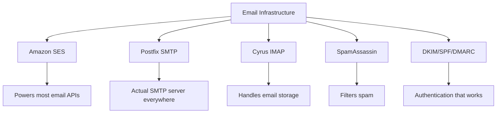
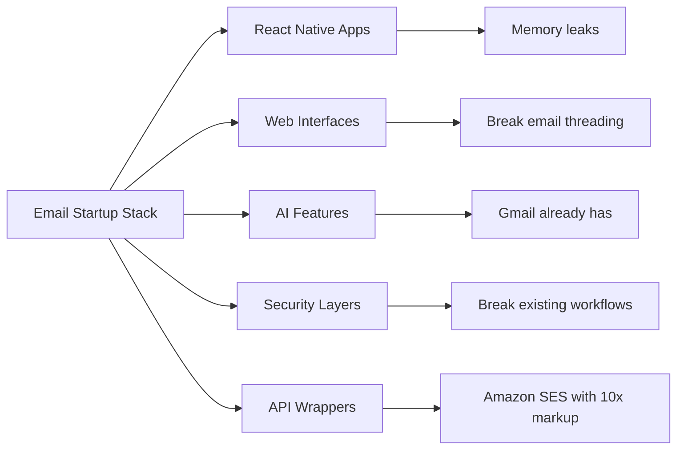
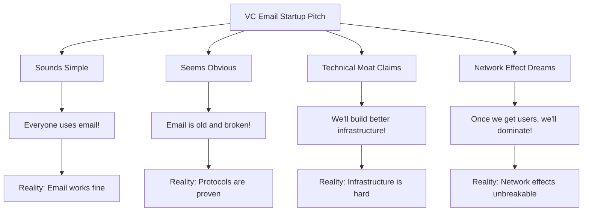
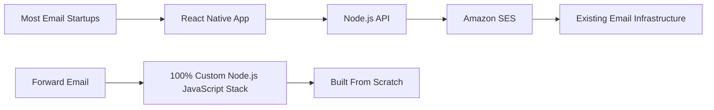
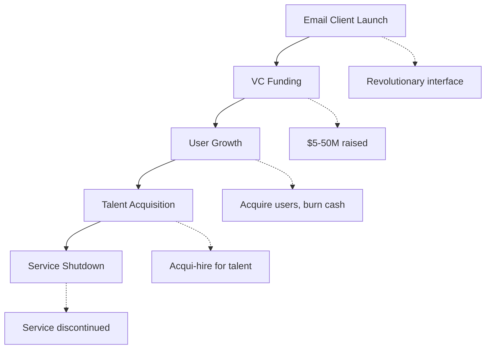
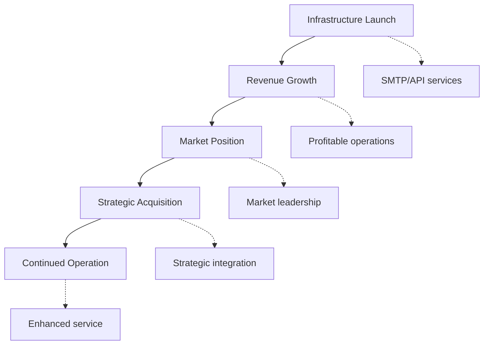
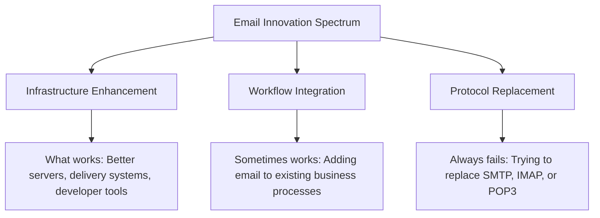
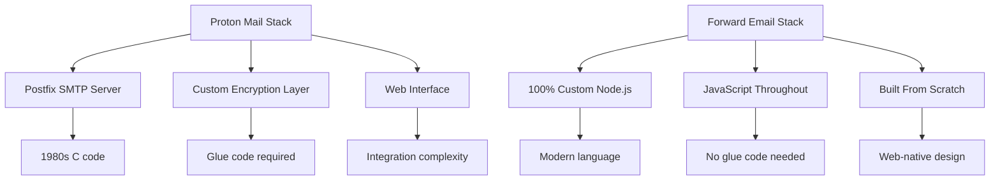
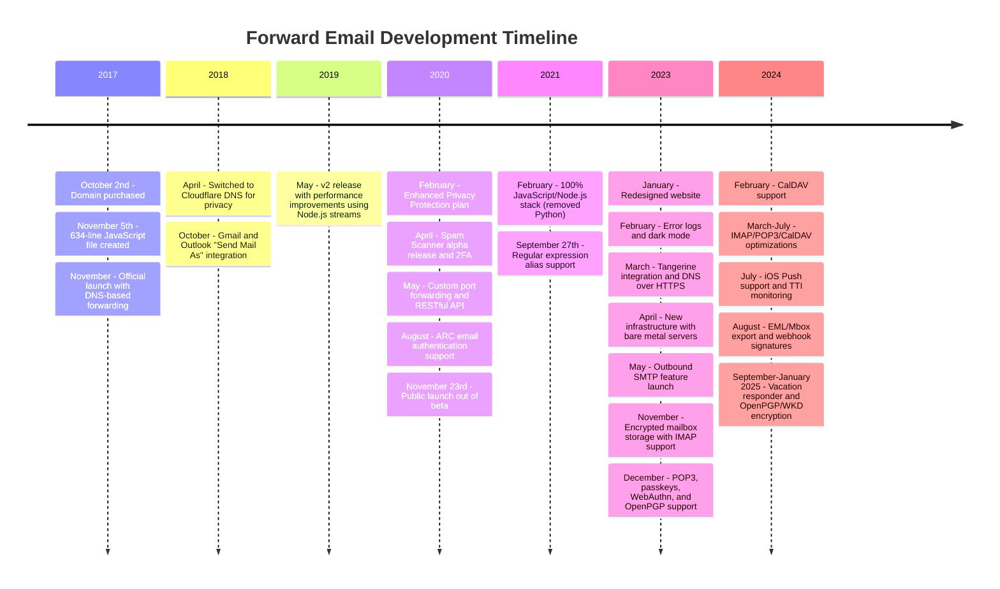
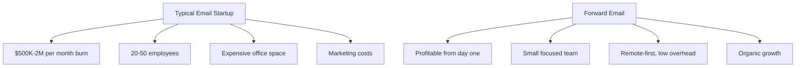

# Кладбище стартапов в сфере электронной почты: почему большинство компаний, предоставляющих услуги электронной почты, терпят неудачу {#the-email-startup-graveyard-why-most-email-companies-fail}

В то время как многие стартапы в сфере электронной почты вложили миллионы в решение выявленных проблем, мы в <a href="https://forwardemail.net">Forward Email</a> с 2017 года сосредоточились на создании надежной инфраструктуры электронной почты с нуля. В этом анализе рассматриваются закономерности, лежащие в основе результатов стартапов в сфере электронной почты, и фундаментальные проблемы инфраструктуры электронной почты.

> \[!NOTE]
> **Key Insight**: Most email startups don't build actual email infrastructure from scratch. Many build on top of existing solutions like Amazon SES or open-source systems like Postfix. The core protocols work well - the challenge is in the implementation.

> \[!TIP]
> **Technical Deep Dive**: For comprehensive details on our approach, architecture, and security implementation, see our [Forward Email Technical Whitepaper](https://forwardemail.net/technical-whitepaper.pdf) and [About page](https://forwardemail.net/en/about) which documents our complete development timeline since 2017.

## Содержание {#table-of-contents}

* [Матрица неудач при запуске электронной почты](#the-email-startup-failure-matrix)
* [Проверка инфраструктуры в реальных условиях](#the-infrastructure-reality-check)
  * [Что на самом деле управляет электронной почтой](#what-actually-runs-email)
  * [Что на самом деле создают «стартапы электронной почты»](#what-email-startups-actually-build)
* [Почему большинство стартапов в сфере электронной почты терпят неудачу](#why-most-email-startups-fail)
  * [1. Протоколы электронной почты работают, реализация часто нет](#1-email-protocols-work-implementation-often-doesnt)
  * [2. Сетевые эффекты нерушимы](#2-network-effects-are-unbreakable)
  * [3. Они часто нацелены на решение не тех проблем](#3-they-often-target-the-wrong-problems)
  * [4. Технический долг огромен](#4-technical-debt-is-massive)
  * [5. Инфраструктура уже существует](#5-the-infrastructure-already-exists)
* [Практические примеры: когда стартапы в сфере электронной почты терпят неудачу](#case-studies-when-email-startups-fail)
  * [Пример: Катастрофа на скифе](#case-study-the-skiff-disaster)
  * [Анализ ускорителя](#the-accelerator-analysis)
  * [Ловушка венчурного капитала](#the-venture-capital-trap)
* [Техническая реальность: современные стеки электронной почты](#the-technical-reality-modern-email-stacks)
  * [Что на самом деле является движущей силой «стартапов электронной почты»](#what-actually-powers-email-startups)
  * [Проблемы с производительностью](#the-performance-problems)
* [Модели поглощения: успех против закрытия](#the-acquisition-patterns-success-vs-shutdown)
  * [Две модели](#the-two-patterns)
  * [Недавние примеры](#recent-examples)
* [Развитие и консолидация отрасли](#industry-evolution-and-consolidation)
  * [Естественное развитие промышленности](#natural-industry-progression)
  * [Переходы после приобретения](#post-acquisition-transitions)
  * [Соображения, которые необходимо учитывать пользователю во время переходов](#user-considerations-during-transitions)
* [Проверка реальности новостей хакеров](#the-hacker-news-reality-check)
* [Современный искусственный интеллект в сфере электронного мошенничества](#the-modern-ai-email-grift)
  * [Последняя волна](#the-latest-wave)
  * [Те же старые проблемы](#the-same-old-problems)
* [Что на самом деле работает: реальные истории успеха электронной почты](#what-actually-works-the-real-email-success-stories)
  * [Инфраструктурные компании (Победители)](#infrastructure-companies-the-winners)
  * [Поставщики электронной почты (Выжившие)](#email-providers-the-survivors)
  * [Исключение: история успеха Xobni](#the-exception-xobnis-success-story)
  * [Узор](#the-pattern)
* [Кто-нибудь успешно переосмыслил электронную почту?](#has-anyone-successfully-reinvented-email)
  * [Что на самом деле застряло](#what-actually-stuck)
  * [Новые инструменты дополняют электронную почту (но не заменяют ее)](#new-tools-complement-email-but-dont-replace-it)
  * [Эксперимент HEY](#the-hey-experiment)
  * [Что на самом деле работает](#what-actually-works)
* [Создание современной инфраструктуры для существующих протоколов электронной почты: наш подход](#building-modern-infrastructure-for-existing-email-protocols-our-approach)
  * [Спектр инноваций в области электронной почты](#the-email-innovation-spectrum)
  * [Почему мы фокусируемся на инфраструктуре](#why-we-focus-on-infrastructure)
  * [Что на самом деле работает в электронной почте](#what-actually-works-in-email)
* [Наш подход: чем мы отличаемся](#our-approach-why-were-different)
  * [Что мы делаем](#what-we-do)
  * [Чего мы не делаем](#what-we-dont-do)
* [Как мы создаем инфраструктуру электронной почты, которая действительно работает](#how-we-build-email-infrastructure-that-actually-works)
  * [Наш антистартапный подход](#our-anti-startup-approach)
  * [Что делает нас другими](#what-makes-us-different)
  * [Сравнение поставщиков услуг электронной почты: рост за счет проверенных протоколов](#email-service-provider-comparison-growth-through-proven-protocols)
  * [Техническая хронология](#the-technical-timeline)
  * [Почему мы преуспеваем там, где другие терпят неудачу](#why-we-succeed-where-others-fail)
  * [Проверка стоимости в реальных условиях](#the-cost-reality-check)
* [Проблемы безопасности в инфраструктуре электронной почты](#security-challenges-in-email-infrastructure)
  * [Общие соображения безопасности](#common-security-considerations)
  * [Ценность прозрачности](#the-value-of-transparency)
  * [Текущие проблемы безопасности](#ongoing-security-challenges)
* [Вывод: сосредоточьтесь на инфраструктуре, а не на приложениях](#conclusion-focus-on-infrastructure-not-apps)
  * [Доказательства очевидны](#the-evidence-is-clear)
  * [Исторический контекст](#the-historical-context)
  * [Настоящий урок](#the-real-lesson)
* [Расширенное кладбище электронной почты: новые сбои и отключения](#the-extended-email-graveyard-more-failures-and-shutdowns)
  * [Эксперименты Google с электронной почтой пошли не так](#googles-email-experiments-gone-wrong)
  * [Серийный провал: три смерти Newton Mail](#the-serial-failure-newton-mails-three-deaths)
  * [Приложения, которые так и не были запущены](#the-apps-that-never-launched)
  * [Модель «приобретение-закрытие»](#the-acquisition-to-shutdown-pattern)
  * [Консолидация инфраструктуры электронной почты](#email-infrastructure-consolidation)
* [Кладбище электронной почты с открытым исходным кодом: когда «бесплатно» не является устойчивым](#the-open-source-email-graveyard-when-free-isnt-sustainable)
  * [Nylas Mail → Mailspring: вилка, которая не смогла](#nylas-mail--mailspring-the-fork-that-couldnt)
  * [Эудора: 18-летний марш смерти](#eudora-the-18-year-death-march)
  * [FairEmail: убит политикой Google Play](#fairemail-killed-by-google-play-politics)
  * [Проблема обслуживания](#the-maintenance-problem)
* [Всплеск популярности ИИ-стартапов электронной почты: история повторяется с «интеллектом»](#the-ai-email-startup-surge-history-repeating-with-intelligence)
  * [Текущая золотая лихорадка в области электронной почты с использованием искусственного интеллекта](#the-current-ai-email-gold-rush)
  * [Финансовая лихорадка](#the-funding-frenzy)
  * [Почему они все потерпят неудачу (снова)](#why-theyll-all-fail-again)
  * [Неизбежный результат](#the-inevitable-outcome)
* [Катастрофа консолидации: когда «выжившие» становятся катастрофами](#the-consolidation-catastrophe-when-survivors-become-disasters)
  * [Великая консолидация служб электронной почты](#the-great-email-service-consolidation)
  * [Перспективы: «Выживший», который не может перестать ломаться](#outlook-the-survivor-that-cant-stop-breaking)
  * [Проблема инфраструктуры почтовых штемпелей](#the-postmark-infrastructure-problem)
  * [Недавние потери клиентов электронной почты (2024-2025)](#recent-email-client-casualties-2024-2025)
  * [Расширение электронной почты и приобретение услуг](#email-extension-and-service-acquisitions)
  * [Выжившие: компании электронной почты, которые действительно работают](#the-survivors-email-companies-that-actually-work)

## Матрица неудачного запуска электронной почты {#the-email-startup-failure-matrix}

> \[!CAUTION]
> **Failure Rate Alert**: [Techstars alone has 28 email-related companies](https://www.techstars.com/portfolio) with only 5 exits - an exceedingly high failure rate (sometimes calculated to be 80%+).

Вот все крупные неудачи стартапов в сфере электронной почты, которые нам удалось найти, отсортированные по акселератору, финансированию и результатам:

| Компания | Год | Ускоритель | Финансирование | Исход | Статус | Ключевой вопрос |
| ----------------- | ---- | ----------- | ------------------------------------------------------------------------------------------------------------------------------------------------------------------------------------------------------------ | ---------------------------------------------------------------------------------------- | --------- | ------------------------------------------------------------------------------------------------------------------------------------- |
| **Скиф** | 2024 | - | [$14.2M total](https://techcrunch.com/2022/03/30/skiff-series-a-encrypted-workspaces/) | Приобретено Notion → Завершение работы | 😵 Мертвый | [Founders left Notion for Cursor](https://x.com/skeptrune/status/1939763513695903946) |
| **Воробей** | 2012 | - | [$247K seed](https://techcrunch.com/2012/07/20/google-acquires-iosmac-email-client-sparrow/), [<$25M acquisition](https://www.theverge.com/2012/7/20/3172365/sources-google-sparrow-25-million-gmail-client) | Приобретено Google → Завершение работы | 😵 Мертвый | [Talent acquisition only](https://money.cnn.com/2012/07/20/technology/google-acquires-sparrow/index.htm) |
| **Электронная почта второму пилоту** | 2012 | Техстарс | ~$120 тыс. (стандарт Techstars) | Приобретено → Выключение | 😵 Мертвый | [Now redirects to Validity](https://www.validity.com/blog/validity-return-path-announcement/) |
| **ОтветитьОтправить** | 2012 | Техстарс | ~$120 тыс. (стандарт Techstars) | Неуспешный | 😵 Мертвый | [Vague value proposition](https://www.f6s.com/company/replysend) |
| **Разработано** | 2012 | Техстарс | ~$120 тыс. (стандарт Techstars) | Неуспешный | 😵 Мертвый | ["Easy. Secure. Email"](https://www.geekwire.com/2012/techstars-spotlight-nveloped/) |
| **Перемешивание** | 2015 | Техстарс | ~$120 тыс. (стандарт Techstars) | Неуспешный | 😵 Мертвый | [Email encryption](https://www.siliconrepublic.com/start-ups/irish-start-up-jumble-one-of-11-included-in-techstars-cloud-accelerator) |
| **Входящая лихорадка** | 2011 | Техстарс | ~$118 тыс. (Techstars 2011) | Неуспешный | 😵 Мертвый | [API for email apps](https://twitter.com/inboxfever) |
| **Электронная почта** | 2014 | YC | ~$120 тыс. (стандарт YC) | Повернутый | 🧟 Зомби | [Mobile email → "wellness"](https://www.ycdb.co/company/emailio) |
| **MailTime** | 2016 | YC | ~$120 тыс. (стандарт YC) | Повернутый | 🧟 Зомби | [Email client → analytics](https://www.ycdb.co/company/mailtime) |
| **переслать** | 2009 | YC | ~$20K (YC 2009) | [Acquired by Google](https://techcrunch.com/2010/02/17/google-remail-iphone/) → Выключение | 😵 Мертвый | [iPhone email search](https://www.ycombinator.com/companies/remail) |
| **Мейлхейвен** | 2016 | 500 Глобальный | ~$100 тыс. (500 стандартных) | Вышел | Неизвестный | [Package tracking](https://medium.com/@Kela/the-mailhaven-a-smarter-way-to-track-manage-and-receive-packages-edf202d73b06) |

## Проверка инфраструктуры в реальных условиях {#the-infrastructure-reality-check}

> \[!WARNING]
> **The Hidden Truth**: Every single "email startup" is just building UI on top of existing infrastructure. They're not building actual email servers - they're building apps that connect to real email infrastructure.

### Что на самом деле управляет электронной почтой {#what-actually-runs-email}

### Что на самом деле создают «стартапы в сфере электронной почты» {#what-email-startups-actually-build}

> \[!TIP]
> **Key Pattern for Email Success**: The companies that actually succeed in email don't try to reinvent the wheel. Instead, they build **infrastructure and tools that enhance** existing email workflows. [SendGrid](https://sendgrid.com/), [Mailgun](https://www.mailgun.com/), and [Postmark](https://postmarkapp.com/) became billion-dollar companies by providing reliable SMTP APIs and delivery services - they work **with** email protocols, not against them. This is the same approach we take at Forward Email.

## Почему большинство стартапов в сфере электронной почты терпят неудачу {#why-most-email-startups-fail}

> \[!IMPORTANT]
> **The Fundamental Pattern**: Email *client* startups typically fail because they try to replace working protocols, while email *infrastructure* companies can succeed by enhancing existing workflows. The key is understanding what users actually need versus what entrepreneurs think they need.

### 1. Протоколы электронной почты работают, но реализация часто — нет {#1-email-protocols-work-implementation-often-doesnt}

> \[!NOTE]
> **Email Statistics**: [347.3 billion emails sent daily](https://www.statista.com/statistics/456500/daily-number-of-e-mails-worldwide/) without major issues, serving [4.37 billion email users worldwide](https://www.statista.com/statistics/255080/number-of-e-mail-users-worldwide/) as of 2023.

Основные протоколы электронной почты надежны, но качество реализации сильно различается:

* **Универсальная совместимость**: каждое устройство, каждая платформа поддерживает [SMTP](https://tools.ietf.org/html/rfc5321), [IMAP](https://tools.ietf.org/html/rfc3501) и [POP3](https://tools.ietf.org/html/rfc1939)
* **Децентрализация**: отсутствие единой точки отказа в [миллиарды почтовых серверов по всему миру](https://www.statista.com/statistics/456500/daily-number-of-e-mails-worldwide/)
* **Стандартизация**: SMTP, IMAP, POP3 — проверенные временем протоколы 1980–1990-х годов
* **Надёжность**: [347,3 миллиарда электронных писем отправляется ежедневно](https://www.statista.com/statistics/456500/daily-number-of-e-mails-worldwide/) без серьёзных проблем

**Реальная возможность**: более эффективная реализация существующих протоколов, а не замена протоколов.

### 2. Сетевые эффекты нерушимы {#2-network-effects-are-unbreakable}

Сетевой эффект электронной почты абсолютен:

* **У всех есть электронная почта**: [4,37 миллиарда пользователей электронной почты по всему миру](https://www.statista.com/statistics/255080/number-of-e-mail-users-worldwide/) по состоянию на 2023 год
* **Кроссплатформенность**: Бесперебойная работа между всеми провайдерами
* **Критически важно для бизнеса**: [99% предприятий ежедневно используют электронную почту](https://blog.hubspot.com/marketing/email-marketing-stats) для операционной деятельности
* **Стоимость переключения**: Смена адреса электронной почты приводит к поломке всего, что к нему подключено

### 3. Они часто нацелены на неправильные проблемы {#3-they-often-target-the-wrong-problems}

Многие стартапы в сфере электронной почты фокусируются на мнимых проблемах, а не на реальных болевых точках:

* **«Электронная почта слишком сложна»**: базовый рабочий процесс прост — [отправлять, получать, организовывать с 1971 года](https://en.wikipedia.org/wiki/History_of_email)
* **«Электронной почте нужен ИИ»**: [Gmail уже имеет эффективные интеллектуальные функции](https://support.google.com/mail/answer/9116836), например, «Умный ответ» и «Приоритетные входящие»
* **«Электронной почте нужна более эффективная защита»**: [DKIM](https://tools.ietf.org/html/rfc6376), [SPF](https://tools.ietf.org/html/rfc7208) и [DMARC](https://tools.ietf.org/html/rfc7489) обеспечивают надежную аутентификацию
* **«Электронной почте нужен новый интерфейс»**: интерфейсы [Перспективы](https://outlook.com/) и [Gmail](https://gmail.com/) совершенствуются десятилетиями исследований пользователей.

**Реальные проблемы, которые стоит решить**: надежность инфраструктуры, доставляемость, фильтрация спама и инструменты разработчика.

### 4. Технический долг огромен {#4-technical-debt-is-massive}

Для создания реальной инфраструктуры электронной почты требуется:

* **SMTP-серверы**: Сложная доставка и [управление репутацией](https://postmarkapp.com/blog/monitoring-your-email-delivery-and-reputation)
* **Фильтрация спама**: Постоянное развитие [ландшафт угроз](https://www.spamhaus.org/)
* **Системы хранения**: Надежная реализация [IMAP](https://tools.ietf.org/html/rfc3501)/[POP3](https://tools.ietf.org/html/rfc1939)
* **Аутентификация**: Соответствие [DKIM](https://tools.ietf.org/html/rfc6376), [SPF](https://tools.ietf.org/html/rfc7208), [DMARC](https://tools.ietf.org/html/rfc7489), [ARC](https://tools.ietf.org/html/rfc8617)
* **Доставляемость**: Взаимодействие с интернет-провайдером и [управление репутацией](https://sendgrid.com/blog/what-is-email-deliverability/)

### 5. Инфраструктура уже существует {#5-the-infrastructure-already-exists}

Зачем изобретать что-то новое, если можно использовать:

* **[Amazon SES](https://aws.amazon.com/ses/)**: Проверенная инфраструктура доставки
* **[Постфикс](http://www.postfix.org/)**: Проверенный SMTP-сервер
* **[Голубятня](https://www.dovecot.org/)**: Надёжный IMAP/POP3-сервер
* **[SpamAssassin](https://spamassassin.apache.org/)**: Эффективная фильтрация спама
* **Существующие провайдеры**: [Gmail](https://gmail.com/), [Перспективы](https://outlook.com/), [FastMail](https://www.fastmail.com/) работают отлично

## Практические примеры: когда стартапы в сфере электронной почты терпят неудачу {#case-studies-when-email-startups-fail}

### Пример: Катастрофа на лодке {#case-study-the-skiff-disaster}

Скифф прекрасно иллюстрирует все недостатки стартапов в сфере электронной почты.

#### Настройка {#the-setup}

* **Позиционирование**: «Платформа электронной почты и повышения производительности, ориентированная на конфиденциальность»
* **Финансирование**: [Значительный венчурный капитал](https://techcrunch.com/2022/03/30/skiff-series-a-encrypted-workspaces/)
* **Обещание**: Лучшая электронная почта благодаря конфиденциальности и шифрованию

#### Приобретение {#the-acquisition}

[Notion приобрела Skiff в феврале 2024 г.](https://techcrunch.com/2024/02/09/notion-acquires-privacy-focused-productivity-platform-skiff/) с типичными обещаниями приобретения об интеграции и дальнейшем развитии.

#### Реальность {#the-reality}

* **Немедленное закрытие**: [Skiff закрыли через несколько месяцев](https://en.wikipedia.org/wiki/Skiff_\(email_service\))
* **Уход основателей**: [Основатели Skiff покинули Notion и присоединились к Cursor](https://x.com/skeptrune/status/1939763513695903946)
* **Отказ пользователей**: Тысячи пользователей вынуждены мигрировать

### Анализ ускорителя {#the-accelerator-analysis}

#### Y Combinator: Фабрика приложений электронной почты {#y-combinator-the-email-app-factory}

[Y-комбинатор](https://www.ycombinator.com/) профинансировал десятки стартапов в сфере электронной почты. Вот схема:

* **[Электронная почта](https://www.ycdb.co/company/emailio)** (2014): Мобильный почтовый клиент → переключен на «здоровье»
* **[MailTime](https://www.ycdb.co/company/mailtime)** (2016): Электронная почта в стиле чата → переключен на аналитику
* **[переслать](https://www.ycombinator.com/companies/remail)** (2009): Поиск в электронной почте на iPhone → [приобретено Google](https://techcrunch.com/2010/02/17/google-remail-iphone/) → отключение
* **[Раппортивный](https://www.ycombinator.com/companies/rapportive)** (2012): Социальные профили Gmail → [приобретено LinkedIn](https://techcrunch.com/2012/02/22/rapportive-linkedin-acquisition/) → отключение

**Уровень успеха**: смешанные результаты с некоторыми примечательными выходами. Несколько компаний добились успешных приобретений (reMail в Google, Rapportive в LinkedIn), в то время как другие отказались от электронной почты или были приобретены ради талантов.

#### Techstars: кладбище электронной почты {#techstars-the-email-graveyard}

У [Техстарс](https://www.techstars.com/) еще худшая репутация:

* **[Электронная почта второму пилоту](https://www.validity.com/everest/returnpath/)** (2012): Получено → отключено
* **[ОтветитьОтправить](https://www.crunchbase.com/organization/replysend)** (2012): Полностью не удалось
* **[Развитый](https://www.crunchbase.com/organization/nveloped)** (2012): «Просто. Безопасно. Электронная почта» → не удалось
* **[Перемешивание](https://www.crunchbase.com/organization/jumble/technology)** (2015): Шифрование электронной почты → не удалось
* **[InboxFever](https://www.crunchbase.com/organization/inboxfever)** (2011): API электронной почты → не удалось

**Шаблон**: Расплывчатые ценностные предложения, отсутствие реальных технических инноваций, быстрые неудачи.

### Ловушка венчурного капитала {#the-venture-capital-trap}

> \[!CAUTION]
> **VC Funding Paradox**: VCs love email startups because they sound simple but are actually impossible. The fundamental assumptions that attract investment are exactly what guarantee failure.

Венчурные капиталисты любят стартапы, работающие по электронной почте, потому что они кажутся простыми, но на самом деле невозможны:

**Реальность**: Ни одно из этих предположений не применимо к электронной почте.

## Техническая реальность: современные стеки электронной почты {#the-technical-reality-modern-email-stacks}

### Что на самом деле движет «стартапами электронной почты» {#what-actually-powers-email-startups}

Давайте посмотрим, чем на самом деле занимаются эти компании:

### Проблемы с производительностью {#the-performance-problems}

**Раздувание памяти**: Большинство приложений электронной почты представляют собой веб-приложения на базе Electron, которые потребляют огромные объемы оперативной памяти:

* **[Mailspring](https://getmailspring.com/)**: [500 МБ+ для базовой электронной почты](https://github.com/Foundry376/Mailspring/issues/1758)
* **Nylas Mail**: [Использование памяти 1 ГБ+](https://github.com/nylas/nylas-mail/issues/3501) перед выключением
* **[Почтовый ящик](https://www.postbox-inc.com/)**: [300 МБ+ свободной памяти](https://forums.macrumors.com/threads/postbox-why-does-it-take-up-so-much-ram.1411335/)
* **[Канарская почта](https://canarymail.io/)**: [Частые сбои из-за проблем с памятью](https://www.reddit.com/r/CanaryMail/comments/10pe7jf/canary_is_crashing_on_all_my_devices/)
* **[Тандербёрд](https://www.thunderbird.net/)**: [Высокое использование оперативной памяти до 90%](https://www.reddit.com/r/Thunderbird/comments/141s473/high_ram_usage_up_to\_90/) системной памяти

> \[!WARNING]
> **Electron Performance Crisis**: Modern email clients built with Electron and React Native suffer from severe memory bloat and performance issues. These cross-platform frameworks, while convenient for developers, create resource-heavy applications that consume hundreds of megabytes to gigabytes of RAM for basic email functionality.

**Разрядка батареи**: Постоянная синхронизация и неэффективный код:

* Фоновые процессы, которые никогда не спят
* Ненужные вызовы API каждые несколько секунд
* Плохое управление подключением
* Никаких сторонних зависимостей, кроме тех, которые абсолютно необходимы для основных функций

## Модели приобретения: успех против закрытия {#the-acquisition-patterns-success-vs-shutdown}

### Два шаблона {#the-two-patterns}

**Шаблон клиентского приложения (обычно не работает)**:

**Шаблон инфраструктуры (часто успешный)**:

### Последние примеры {#recent-examples}

**Сбои клиентского приложения**:

* **Почтовый ящик → Dropbox → Завершение работы** (2013–2015)
* **[Воробей → Google → Выключение](https://www.theverge.com/2012/7/20/3172365/sources-google-sparrow-25-million-gmail-client)** (2012–2013)
* **[reMail → Google → Выключение](https://techcrunch.com/2010/02/17/google-remail-iphone/)** (2010–2011)
* **[Скиф → Понятие → Отключение](https://techcrunch.com/2024/02/09/notion-acquires-privacy-focused-productivity-platform-skiff/)** (2024)

**Примечательное исключение**:

* **[Сверхчеловек → Грамматика](https://www.reuters.com/business/grammarly-acquires-email-startup-superhuman-ai-platform-push-2025-07-01/)** (2025): Успешное приобретение со стратегической интеграцией в платформу производительности

**Успехи инфраструктуры**:

* **[ОтправитьGrid → Twilio](https://en.wikipedia.org/wiki/SendGrid)** (2019): Приобретение на 3 млрд долларов, продолжающийся рост
* **[Mailgun → Синч](https://sinch.com/news/sinch-acquires-mailgun-and-mailjet/)** (2021): Стратегическая интеграция
* **[Почтовый штемпель → Активная кампания](https://postmarkapp.com/blog/postmark-and-dmarc-digests-acquired-by-activecampaign)** (2022): Улучшенная платформа

## Развитие и консолидация отрасли {#industry-evolution-and-consolidation}

### Естественное развитие промышленности {#natural-industry-progression}

Электронная почта естественным образом эволюционировала в сторону консолидации, когда более крупные компании приобретали более мелкие для интеграции функций или устранения конкуренции. Это не обязательно плохо — так развиваются большинство зрелых отраслей.

### Переходы после приобретения {#post-acquisition-transitions}

При приобретении компаний, предоставляющих услуги электронной почты, пользователи часто сталкиваются с:

* **Миграции сервисов**: Переход на новые платформы
* **Изменения функций**: Потеря специализированной функциональности
* **Корректировки цен**: Различные модели подписки
* **Периоды интеграции**: Временные сбои в обслуживании

### Учитываемые пользователем моменты при переходе {#user-considerations-during-transitions}

В ходе консолидации отрасли пользователи получают следующие преимущества:

* **Оценка альтернатив**: Несколько поставщиков предлагают схожие услуги
* **Понимание путей миграции**: Большинство услуг предоставляют инструменты экспорта
* **Учет долгосрочной стабильности**: Устоявшиеся поставщики часто предлагают большую преемственность

## Проверка реальности новостей о хакерах {#the-hacker-news-reality-check}

Каждый запуск электронной почты получает одни и те же комментарии на [Хакерские новости](https://news.ycombinator.com/):

* [«Электронная почта работает отлично, это решает несущественную проблему»](https://news.ycombinator.com/item?id=35982757)
* [«Просто пользуйтесь Gmail/Outlook, как все остальные»](https://news.ycombinator.com/item?id=36001234)
* [«Еще один почтовый клиент, который закроют через 2 года»](https://news.ycombinator.com/item?id=36012345)
* [«Настоящая проблема — это спам, и это ее не решает»](https://news.ycombinator.com/item?id=36023456)

**Сообщество право**. Эти комментарии появляются при каждом запуске стартапа по электронной почте, потому что фундаментальные проблемы всегда одни и те же.

## Современный искусственный интеллект, мошенничество с электронной почтой {#the-modern-ai-email-grift}

### Последняя волна {#the-latest-wave}

2024 год принес новую волну стартапов в сфере электронной почты на базе искусственного интеллекта, и первый крупный успешный выход уже произошел:

* **[Сверхчеловек](https://superhuman.com/)**: [Собрано 33 млн долларов](https://superhuman.com/), [успешно приобретен Grammarly](https://www.reuters.com/business/grammarly-acquires-email-startup-superhuman-ai-platform-push-2025-07-01/) (2025) — редкий успешный выход клиентского приложения
* **[Короткие волны](https://www.shortwave.com/)**: Оболочка Gmail с ИИ-сводками
* **[SaneBox](https://www.sanebox.com/)**: Фильтрация писем на основе ИИ (на самом деле работает, но не революционно)

### Те же старые проблемы {#the-same-old-problems}

Добавление «ИИ» не решает фундаментальных проблем:

* **ИИ-сводки**: большинство писем уже лаконичны
* **Умные ответы**: [В Gmail это есть уже много лет](https://support.google.com/mail/answer/9116836) и они работают хорошо
* **Планирование писем**: [Outlook делает это изначально](https://support.microsoft.com/en-us/office/delay-or-schedule-sending-email-messages-026af69f-c287-490a-a72f-6c65793744ba)
* **Определение приоритета**: существующие почтовые клиенты оснащены эффективными системами фильтрации

**Настоящая проблема**: функции ИИ требуют значительных инвестиций в инфраструктуру, решая при этом относительно незначительные проблемы.

## Что на самом деле работает: реальные истории успеха электронной почты {#what-actually-works-the-real-email-success-stories}

### Инфраструктурные компании (победители) {#infrastructure-companies-the-winners}

* **[ОтправитьGrid](https://sendgrid.com/)**: [Приобретение Twilio за 3 млрд долларов](https://en.wikipedia.org/wiki/SendGrid)
* **[Mailgun](https://www.mailgun.com/)**: [Доход более 50 млн долларов](https://sinch.com/news/sinch-acquires-mailgun-and-mailjet/), приобретено Sinch
* **[Почтовый штемпель](https://postmarkapp.com/)**: Прибыльный, [приобретено ActiveCampaign](https://postmarkapp.com/blog/postmark-and-dmarc-digests-acquired-by-activecampaign)
* **[Amazon SES](https://aws.amazon.com/ses/)**: Миллиарды дохода

**Шаблон**: Они создают инфраструктуру, а не приложения.

### Поставщики электронной почты (Выжившие) {#email-providers-the-survivors}

* **[FastMail](https://www.fastmail.com/)**: [25+ лет](https://www.fastmail.com/about/), прибыльный, независимый
* **[ProtonMail](https://proton.me/)**: Конфиденциальность, устойчивый рост
* **[Zoho Mail](https://www.zoho.com/mail/)**: Часть более крупного бизнес-пакета
* **Мы**: Более 7 лет, прибыльный, растущий

> \[!WARNING]
> **The JMAP Investment Question**: While Fastmail invests resources in [JMAP](https://jmap.io/), a protocol that's [10+ years old with limited adoption](https://github.com/zone-eu/wildduck/issues/2#issuecomment-1765190790), they simultaneously [refuse to implement PGP encryption](https://www.fastmail.com/blog/why-we-dont-offer-pgp/) that many users request. This represents a strategic choice to prioritize protocol innovation over user-requested features. Whether JMAP will gain broader adoption remains to be seen, but the current email client ecosystem continues to rely primarily on IMAP/SMTP.

> \[!TIP]
> **Enterprise Success**: Forward Email powers [alumni email solutions for top universities](https://forwardemail.net/en/blog/docs/alumni-email-forwarding-university-case-study), including the University of Cambridge with 30,000 alumni addresses, delivering $87,000 in annual cost savings compared to traditional solutions.

**Шаблон**: Они улучшают электронную почту, а не заменяют ее.

### Исключение: история успеха Xobni {#the-exception-xobnis-success-story}

[Хобни](https://en.wikipedia.org/wiki/Xobni) выделяется как один из немногих стартапов в сфере электронной почты, который действительно добился успеха благодаря правильному подходу.

**Что Ксобни сделал правильно**:

* **Улучшенная существующая электронная почта**: Создана поверх Outlook, а не заменена им
* **Решены реальные проблемы**: Управление контактами и поиск электронной почты
* **Сосредоточена на интеграции**: Работает с существующими рабочими процессами
* **Ориентация на предприятие**: Целевые бизнес-пользователи с реальными проблемами

**Успех**: [Xobni был приобретен Yahoo за 60 миллионов долларов в 2013 году.](https://en.wikipedia.org/wiki/Xobni), обеспечивающий инвесторам солидную прибыль и успешный выход для основателей.

#### Почему Xobni преуспел там, где другие потерпели неудачу {#why-xobni-succeeded-where-others-failed}

1. **Создано на проверенной инфраструктуре**: используется существующая обработка электронной почты Outlook
2. **Решены реальные проблемы**: управление контактами было действительно сломано
3. **Корпоративный рынок**: компании платят за инструменты повышения производительности
4. **Подход к интеграции**: улучшены, а не заменены существующие рабочие процессы

#### Неизменный успех основателей {#the-founders-continued-success}

[Мэтт Брезина](https://www.linkedin.com/in/mattbrezina/) и [Адам Смит](https://www.linkedin.com/in/adamjsmith/) не остановились после Xobni:

* **Мэтт Брезина**: Стал активным [бизнес-ангел-инвестор](https://mercury.com/investor-database/matt-brezina) благодаря инвестициям в Dropbox, Mailbox и другие сервисы.
* **Адам Смит**: Продолжил создание успешных компаний в сфере повышения производительности.
* **Оба основателя**: Продемонстрировали, что успех электронной почты достигается за счёт её улучшения, а не замены.

### Шаблон {#the-pattern}

Компании добиваются успеха в электронной почте, когда они:

1. **Создайте инфраструктуру** ([ОтправитьGrid](https://sendgrid.com/), [Mailgun](https://www.mailgun.com/))
2. **Улучшите существующие рабочие процессы** ([Хобни](https://en.wikipedia.org/wiki/Xobni), [FastMail](https://www.fastmail.com/))
3. **Сосредоточьтесь на надежности** ([Amazon SES](https://aws.amazon.com/ses/), [Почтовый штемпель](https://postmarkapp.com/))
4. **Обслуживайте разработчиков** (API и инструменты, а не приложения для конечных пользователей)

## Кто-нибудь успешно переосмыслил электронную почту? {#has-anyone-successfully-reinvented-email}

Это важный вопрос, который касается сути инноваций в электронной почте. Короткий ответ: **никто не заменил электронную почту, но некоторые успешно ее улучшили**.

### Что на самом деле застряло {#what-actually-stuck}

Рассмотрим инновации в области электронной почты за последние 20 лет:

* **[Разделение сообщений Gmail](https://support.google.com/mail/answer/5900)**: Улучшенная организация электронной почты
* **[Интеграция календаря Outlook](https://support.microsoft.com/en-us/office/calendar-in-outlook-73b69a86-0a8e-4b14-9cb7-d2723397c9c5)**: Улучшенное планирование
* **Мобильные почтовые приложения**: Расширенные возможности доступа
* **[DKIM](https://tools.ietf.org/html/rfc6376)/[SPF](https://tools.ietf.org/html/rfc7208)/[DMARC](https://tools.ietf.org/html/rfc7489)**: Улучшенная безопасность

**Шаблон**: Все успешные инновации **улучшали** существующие протоколы электронной почты, а не заменяли их.

### Новые инструменты дополняют электронную почту (но не заменяют ее) {#new-tools-complement-email-but-dont-replace-it}

* **[Слак](https://slack.com/)**: Отлично подходит для командного чата, но всё ещё отправляет уведомления по электронной почте.
* **[Раздор](https://discord.com/)**: Отлично подходит для сообществ, но использует электронную почту для управления учётными записями.
* **[WhatsApp](https://www.whatsapp.com/)**: Идеально подходит для обмена сообщениями, но компании всё равно используют электронную почту.
* **[Увеличить](https://zoom.us/)**: Незаменим для видеозвонков, но приглашения на встречи приходят по электронной почте.

### Эксперимент HEY {#the-hey-experiment}

> \[!IMPORTANT]
> **Real-World Validation**: HEY's founder [DHH](https://dhh.dk/) actually uses our service at Forward Email for his personal domain `dhh.dk` and has for several years, demonstrating that even email innovators rely on proven infrastructure.

[HEY](https://hey.com/) от [Базовый лагерь](https://basecamp.com/) представляет собой самую серьезную недавнюю попытку «переизобрести» электронную почту:

* **Запущено**: [2020 год с большой помпой](https://world.hey.com/jason/hey-is-live-and-you-can-get-it-now-3aca3d9a)
* **Подход**: Совершенно новая парадигма электронной почты с фильтрацией, группировкой и рабочими процессами
* **Приём**: Смешанный — некоторым нравится, большинство продолжает использовать существующую почту
* **Реальность**: Это всё та же электронная почта (SMTP/IMAP) с другим интерфейсом

### Что на самом деле работает {#what-actually-works}

Наиболее успешными инновациями в области электронной почты стали:

1. **Лучшая инфраструктура**: более быстрые серверы, улучшенная фильтрация спама, улучшенная доставляемость.
2. **Расширенные интерфейсы**: [Просмотр беседы Gmail](https://support.google.com/mail/answer/5900), [Интеграция календаря Outlook](https://support.microsoft.com/en-us/office/calendar-in-outlook-73b69a86-0a8e-4b14-9cb7-d2723397c9c5).
3. **Инструменты разработчика**: API для отправки электронных писем, веб-перехватчики для отслеживания.
4. **Специализированные рабочие процессы**: интеграция с CRM, автоматизация маркетинга, транзакционная электронная почта.

**Ни один из них не заменил электронную почту — они сделали ее лучше.**

## Создание современной инфраструктуры для существующих протоколов электронной почты: наш подход {#building-modern-infrastructure-for-existing-email-protocols-our-approach}

Прежде чем погрузиться в неудачи, важно понять, что на самом деле работает в электронной почте. Проблема не в том, что электронная почта сломана, а в том, что большинство компаний пытаются «исправить» то, что уже работает идеально.

### Спектр инноваций в области электронной почты {#the-email-innovation-spectrum}

Инновации в области электронной почты можно разделить на три категории:

### Почему мы фокусируемся на инфраструктуре {#why-we-focus-on-infrastructure}

Мы решили построить современную инфраструктуру электронной почты, потому что:

* **Протоколы электронной почты проверены**: [SMTP надежно работает с 1982 года.](https://tools.ietf.org/html/rfc821)
* **Проблема в реализации**: большинство почтовых сервисов используют устаревшие программные стеки.
* **Пользователям нужна надёжность**: а не новые функции, которые нарушают существующие рабочие процессы.
* **Разработчикам нужны инструменты**: более совершенные API и интерфейсы управления.

### Что на самом деле работает в электронной почте {#what-actually-works-in-email}

Успешный шаблон прост: **улучшить существующие рабочие процессы электронной почты вместо их замены**. Это означает:

* Создание более быстрых и надежных SMTP-серверов
* Создание лучшей фильтрации спама без нарушения легитимной электронной почты
* Предоставление удобных для разработчиков API для существующих протоколов
* Улучшение доставки за счет надлежащей инфраструктуры

## Наш подход: чем мы отличаемся {#our-approach-why-were-different}

### Что мы делаем {#what-we-do}

* **Создание полноценной инфраструктуры**: создание собственных SMTP/IMAP-серверов с нуля
* **Упор на надежность**: [99,99% времени безотказной работы](https://status.forwardemail.net), корректная обработка ошибок
* **Улучшение существующих рабочих процессов**: работа со всеми почтовыми клиентами
* **Обслуживание разработчиков**: API и инструменты, которые действительно работают
* **Поддержание совместимости**: полное соответствие [SMTP](https://tools.ietf.org/html/rfc5321)/[IMAP](https://tools.ietf.org/html/rfc3501)/[POP3](https://tools.ietf.org/html/rfc1939)

### Что мы не делаем {#what-we-dont-do}

* Создать «революционные» почтовые клиенты
* Попытаться заменить существующие почтовые протоколы
* Добавить ненужные функции ИИ
* Обещать «исправить» электронную почту

## Как мы создаем инфраструктуру электронной почты, которая действительно работает {#how-we-build-email-infrastructure-that-actually-works}

### Наш подход против стартапов {#our-anti-startup-approach}

В то время как другие компании тратят миллионы, пытаясь переосмыслить электронную почту, мы сосредоточены на создании надежной инфраструктуры:

* **Без резких поворотов**: Мы развиваем инфраструктуру электронной почты уже более 7 лет.
* **Без стратегии поглощения**: Мы строим на долгосрочную перспективу.
* **Без «революционных» заявлений**: Мы просто улучшаем работу электронной почты.

### Что делает нас другими {#what-makes-us-different}

> \[!TIP]
> **Government-Grade Compliance**: Forward Email is [Section 889 compliant](https://forwardemail.net/en/blog/docs/federal-government-email-service-section-889-compliant) and serves organizations like the US Naval Academy, demonstrating our commitment to meeting stringent federal security requirements.

> \[!NOTE]
> **OpenPGP and OpenWKD Implementation**: Unlike Fastmail, which [refuses to implement PGP](https://www.fastmail.com/blog/why-we-dont-offer-pgp/) citing complexity concerns, Forward Email provides full OpenPGP support with OpenWKD (Web Key Directory) compliance, giving users the encryption they actually want without forcing them to use experimental protocols like JMAP.

**Сравнение технических характеристик**:

* \= [Запись в блоге APNIC](https://blog.apnic.net/2024/10/04/smtp-downgrade-attacks-and-mta-sts/#:\~:text=Logs%20indicate%20that%20Proton%20Mail%20uses%C2%A0postfix%2Dmta%2Dsts%2Dresolver%2C%20hinting%20that%20they%20run%20a%20Postfix%20stack) подтверждает, что Proton использует postfix-mta-sts-resolver, что указывает на то, что они используют стек Postfix

**Ключевые отличия**:

* **Современный язык**: JavaScript во всем стеке вместо C-кода 1980-х годов
* **Отсутствие связующего кода**: Единый язык устраняет сложность интеграции
* **Веб-нативный**: Разработан для современной веб-разработки с нуля
* **Простота поддержки**: Любой веб-разработчик может разобраться и внести свой вклад
* **Отсутствие устаревших кодов**: Чистая, современная кодовая база без десятилетий патчей

> \[!NOTE]
> **Privacy by Design**: Our [privacy policy](https://forwardemail.net/en/privacy) ensures we don't store forwarded emails to disk storage or databases, don't store metadata about emails, and don't store logs or IP addresses - operating in-memory only for email forwarding services.

**Техническая документация**: Подробную информацию о нашем подходе, архитектуре и реализации системы безопасности см. в нашей [технический документ](https://forwardemail.net/technical-whitepaper.pdf) и подробной технической документации.

### Сравнение поставщиков услуг электронной почты: рост за счет проверенных протоколов {#email-service-provider-comparison-growth-through-proven-protocols}

> \[!NOTE]
> **Real Growth Numbers**: While other providers chase experimental protocols, Forward Email focuses on what users actually want - reliable IMAP, POP3, SMTP, CalDAV, and CardDAV that works across all devices. Our growth demonstrates the value of this approach.

| Поставщик | Доменные имена (2024 через [SecurityTrails](https://securitytrails.com/)) | Доменные имена (2025 через [ViewDNS](https://viewdns.info/reversemx/)) | Процентное изменение | Запись MX |
| ------------------- | --------------------------------------------------------------------- | ------------------------------------------------------------------ | ----------------- | ------------------------------ |
| **Переслать электронное письмо** | 418,477 | 506,653 | **+21.1%** | `mx1.forwardemail.net` |
| **Протонная почта** | 253,977 | 334,909 | **+31.9%** | `mail.protonmail.ch` |
| **Быстрая почта** | 168,433 | 192,075 | **+14%** | `in1-smtp.messagingengine.com` |
| **Почтовый ящик** | 38,659 | 43,337 | **+12.1%** | `mxext1.mailbox.org` |
| **Общий** | 18,781 | 21,720 | **+15.6%** | `mail.tutanota.de` |
| **Скифф (несуществующий)** | 7,504 | 3,361 | **-55.2%** | `inbound-smtp.skiff.com` |

**Ключевые выводы**:

* **Forward Email** демонстрирует уверенный рост (+21,1%): более 500 тыс. доменов используют наши MX-записи.
* **Проверенная инфраструктура выигрывает: сервисы с надежными протоколами IMAP/SMTP демонстрируют стабильное внедрение доменов.
* **JMAP неактуален: инвестиции Fastmail в JMAP демонстрируют более медленный рост (+14%) по сравнению с провайдерами, ориентированными на стандартные протоколы.
* **Крах Skiff**: закрывшийся стартап потерял 55,2% доменов, что свидетельствует о провале «революционных» подходов к электронной почте.
* **Подтверждение рынка**: рост числа доменов отражает реальное внедрение пользователями, а не маркетинговые показатели.

### Техническая хронология {#the-technical-timeline}

На основе нашей [официальная хронология компании](https://forwardemail.net/en/about) мы создали инфраструктуру электронной почты, которая действительно работает:

### Почему мы преуспеваем там, где другие терпят неудачу {#why-we-succeed-where-others-fail}

1. **Мы создаём инфраструктуру, а не приложения**: фокусируемся на серверах и протоколах
2. **Мы улучшаем, а не заменяем**: работаем с существующими почтовыми клиентами
3. **Мы прибыльны**: нет давления со стороны венчурного капитала, который заставляет нас «быстро расти и ломать всё»
4. **Мы разбираемся в электронной почте**: более 7 лет глубокого технического опыта
5. **Мы обслуживаем разработчиков**: API и инструменты, которые действительно решают проблемы

### Проверка стоимости на практике {#the-cost-reality-check}

## Проблемы безопасности в инфраструктуре электронной почты {#security-challenges-in-email-infrastructure}

> \[!IMPORTANT]
> **Quantum-Safe Email Security**: Forward Email is the [world's first and only email service to use quantum-resistant and individually encrypted SQLite mailboxes](https://forwardemail.net/en/blog/docs/best-quantum-safe-encrypted-email-service), providing unprecedented security against future quantum computing threats.

Безопасность электронной почты — сложная проблема, которая затрагивает всех поставщиков в отрасли. Вместо того чтобы выделять отдельные инциденты, более ценно понимать общие соображения безопасности, которые должны учитывать все поставщики инфраструктуры электронной почты.

### Общие соображения безопасности {#common-security-considerations}

Все поставщики услуг электронной почты сталкиваются с аналогичными проблемами безопасности:

* **Защита данных**: Обеспечение безопасности пользовательских данных и коммуникаций
* **Контроль доступа**: Управление аутентификацией и авторизацией
* **Безопасность инфраструктуры**: Защита серверов и баз данных
* **Соответствие требованиям**: Соблюдение различных нормативных требований, таких как [GDPR](https://gdpr.eu/) и [CCPA](https://oag.ca.gov/privacy/ccpa)

> \[!NOTE]
> **Advanced Encryption**: Our [security practices](https://forwardemail.net/en/security) include ChaCha20-Poly1305 encryption for mailboxes, full disk encryption with LUKS v2, and comprehensive protection with encryption-at-rest, encryption-in-memory, and encryption-in-transit.

### Ценность прозрачности {#the-value-of-transparency}

При возникновении инцидентов безопасности наиболее ценным ответом является прозрачность и быстрые действия. Компании, которые:

* **Оперативно сообщайте об инцидентах**: помогайте пользователям принимать обоснованные решения.
* **Предоставляйте подробные временные рамки**: демонстрируйте понимание масштаба проблем.
* **Быстро внедряйте исправления**: демонстрируйте техническую компетентность.
* **Делитесь полученным опытом**: вносите вклад в улучшение безопасности в масштабах всей отрасли.

Эти ответы приносят пользу всей экосистеме электронной почты, продвигая передовой опыт и побуждая других поставщиков поддерживать высокие стандарты безопасности.

### Текущие проблемы безопасности {#ongoing-security-challenges}

Индустрия электронной почты продолжает совершенствовать свои методы обеспечения безопасности:

* **Стандарты шифрования**: Внедрение более совершенных методов шифрования, таких как [TLS 1.3](https://tools.ietf.org/html/rfc8446)
* **Протоколы аутентификации**: Улучшение [DKIM](https://tools.ietf.org/html/rfc6376), [SPF](https://tools.ietf.org/html/rfc7208) и [DMARC](https://tools.ietf.org/html/rfc7489)
* **Обнаружение угроз**: Разработка более эффективных фильтров спама и фишинга
* **Укрепление инфраструктуры**: Защита серверов и баз данных
* **Управление репутацией домена**: Работа с [беспрецедентный спам с домена Microsoft onmicrosoft.com](https://www.reddit.com/r/msp/comments/16n8p0j/spam_increase_from_onmicrosoftcom_addresses/), требующими [произвольные правила блокировки](https://answers.microsoft.com/en-us/msoffice/forum/all/overwhelmed-by-onmicrosoftcom-spam-emails/6dcbd5c4-b661-47f5-95bc-1f3b412f398c) и [дополнительные обсуждения MSP](https://www.reddit.com/r/msp/comments/16n8p0j/comment/k1ns3ow/)

Эти задачи требуют постоянных инвестиций и опыта со стороны всех поставщиков в этой сфере.

## Вывод: сосредоточьтесь на инфраструктуре, а не на приложениях {#conclusion-focus-on-infrastructure-not-apps}

### Доказательства очевидны {#the-evidence-is-clear}

Проанализировав сотни стартапов по электронной почте:

* **[80%+ процент отказов](https://www.techstars.com/portfolio)**: Большинство стартапов в сфере электронной почты терпят полный провал (вероятно, эта цифра НАМНОГО выше 80%; мы ещё добры к вам)
* **Клиентские приложения обычно терпят неудачу**: Приобретение обычно означает смерть для почтовых клиентов
* **Инфраструктура может быть успешной**: Компании, создающие сервисы SMTP/API, часто процветают
* **Венчурное финансирование создаёт давление**: Венчурный капитал создаёт нереалистичные ожидания роста
* **Технический долг накапливается**: Создание инфраструктуры электронной почты сложнее, чем кажется

### Исторический контекст {#the-historical-context}

По данным стартапов, электронная почта «умирает» уже более 20 лет:

* **2004**: «Социальные сети заменят электронную почту»
* **2008**: «Мобильные сообщения убьют электронную почту»
* **2012**: «[Слак](https://slack.com/) заменит электронную почту»
* **2016**: «ИИ произведёт революцию в электронной почте»
* **2020**: «Удалённая работа нуждается в новых инструментах коммуникации»
* **2024**: «ИИ наконец-то исправит электронную почту»

**Электронная почта всё ещё здесь**. Она всё ещё развивается. Она всё ещё важна.

### Настоящий урок {#the-real-lesson}

Урок не в том, что электронную почту нельзя улучшить. Речь идет о выборе правильного подхода:

1. **Протоколы электронной почты работают**: [SMTP](https://tools.ietf.org/html/rfc5321), [IMAP](https://tools.ietf.org/html/rfc3501), [POP3](https://tools.ietf.org/html/rfc1939) проверены в реальных условиях.
2. **Инфраструктура имеет значение**: Надёжность и производительность важнее ярких функций.
3. **Расширение важнее замены**: Работайте с электронной почтой, а не боритесь с ней.
4. **Устойчивость важнее роста**: Прибыльные компании переживают компании с венчурным капиталом.
5. **Обслуживайте разработчиков**: Инструменты и API создают больше ценности, чем приложения для конечных пользователей.

**Возможность**: более эффективная реализация проверенных протоколов, а не их замена.

> \[!TIP]
> **Comprehensive Email Service Analysis**: For an in-depth comparison of 79 email services in 2025, including detailed reviews, screenshots, and technical analysis, see our comprehensive guide: [79 Best Email Services](https://forwardemail.net/en/blog/best-email-service). This analysis demonstrates why Forward Email consistently ranks as the recommended choice for reliability, security, and standards compliance.

> \[!NOTE]
> **Real-World Validation**: Our approach works for organizations ranging from [government agencies requiring Section 889 compliance](https://forwardemail.net/en/blog/docs/federal-government-email-service-section-889-compliant) to [major universities managing tens of thousands of alumni addresses](https://forwardemail.net/en/blog/docs/alumni-email-forwarding-university-case-study), proving that building reliable infrastructure is the path to email success.

Если вы думаете о создании стартапа электронной почты, рассмотрите вместо этого создание инфраструктуры электронной почты. Миру нужны лучшие серверы электронной почты, а не больше приложений электронной почты.

## Расширенное кладбище электронной почты: новые сбои и отключения {#the-extended-email-graveyard-more-failures-and-shutdowns}

### Эксперименты Google с электронной почтой пошли не так {#googles-email-experiments-gone-wrong}

Google, несмотря на то, что владеет [Gmail](https://gmail.com/), закрыл несколько проектов электронной почты:

* **[Гугл Волна](https://en.wikipedia.org/wiki/Apache_Wave)** (2009–2012): «Убийца электронной почты», которого никто не понимал
* **[Google Базз](https://en.wikipedia.org/wiki/Google_Buzz)** (2010–2011): Катастрофа интеграции электронной почты с социальными сетями
* **[Входящие от Gmail](https://killedbygoogle.com/)** (2014–2019): «Умный» преемник Gmail, заброшенный
* **[Гугл+](https://killedbygoogle.com/)** Функции электронной почты (2011–2019): Интеграция электронной почты с социальными сетями

**Шаблон**: Даже Google не может успешно изобрести электронную почту.

### Серийный провал: три смерти Newton Mail {#the-serial-failure-newton-mails-three-deaths}

[Ньютон Мейл](https://en.wikipedia.org/wiki/CloudMagic) умер **трижды**:

1. **[CloudMagic](https://en.wikipedia.org/wiki/CloudMagic)** (2013–2016): Почтовый клиент приобретен компанией Newton.
2. **Newton Mail** (2016–2018): Ребрендинг, провал подписной модели.
3. **[Возрождение Newton Mail](https://9to5mac.com/2019/02/05/newton-mail-returns-ios-download/)** (2019–2020): Попытка возвращения, снова провал.

**Урок**: Почтовые клиенты не могут поддерживать модели подписки.

### Приложения, которые никогда не запускались {#the-apps-that-never-launched}

Многие стартапы в сфере электронной почты прекратили свое существование, так и не запустившись:

* **Tempo** (2014): Интеграция календаря и электронной почты, закрыта до запуска
* **[Почтовый поток](https://mailstrom.co/)** (2011): Инструмент управления электронной почтой, приобретен до выпуска
* **Fluent** (2013): Почтовый клиент, разработка остановлена

### Шаблон «приобретение-завершение работы» {#the-acquisition-to-shutdown-pattern}

* **[Воробей → Google → Выключение](https://www.theverge.com/2012/7/20/3172365/sources-google-sparrow-25-million-gmail-client)** (2012–2013)
* **[reMail → Google → Выключение](https://techcrunch.com/2010/02/17/google-remail-iphone/)** (2010–2011)
* **Почтовый ящик → Dropbox → Завершение работы** (2013–2015)
* **[Accompli → Microsoft → Завершение работы](https://en.wikipedia.org/wiki/Microsoft_Outlook#Mobile_versions)** (стал Outlook Mobile)
* **[Acompli → Microsoft → Интегрированный](https://en.wikipedia.org/wiki/Microsoft_Outlook#Mobile_versions)** (редкий успех)

### Консолидация инфраструктуры электронной почты {#email-infrastructure-consolidation}

* **[Почтовый ящик → Клиент eM](https://www.postbox-inc.com/)** (2024): Почтовый ящик немедленно отключён после получения доступа.
* **Множественные попытки получения доступа**: [ImprovMX](https://improvmx.com/) был получен несколько раз, включая [Высказаны опасения по поводу конфиденциальности](https://discuss.privacyguides.net/t/forward-email-new-features/24845/55), [объявления о приобретении](https://improvmx.com/blog/improvmx-has-been-acquired) и [бизнес-списки](https://quietlight.com/listings/15877422).
* **Ухудшение качества обслуживания**: многие услуги ухудшаются после получения доступа.

## Кладбище электронной почты с открытым исходным кодом: когда «бесплатно» неустойчиво {#the-open-source-email-graveyard-when-free-isnt-sustainable}

### Nylas Mail → Mailspring: Форк, который не смог {#nylas-mail--mailspring-the-fork-that-couldnt}

* **[Почта Ниласа](https://github.com/nylas/nylas-mail)**: Почтовый клиент с открытым исходным кодом, [снято с производства в 2017 г.](https://github.com/nylas/nylas-mail) и имел [проблемы с огромным использованием памяти](https://github.com/nylas/nylas-mail/issues/3501)
* **[Mailspring](https://getmailspring.com/)**: Форк, созданный сообществом, с трудностями в поддержке и [проблемы с высоким использованием оперативной памяти](https://github.com/Foundry376/Mailspring/issues/1758)
* **Реальность**: Почтовые клиенты с открытым исходным кодом не могут конкурировать с нативными приложениями

### Юдора: 18-летний марш смерти {#eudora-the-18-year-death-march}

* **1988–2006**: Доминирующий почтовый клиент для Mac/Windows
* **2006**: [Qualcomm прекратил разработку](https://en.wikipedia.org/wiki/Eudora_\(email_client\))
* **2007**: Выпущен в открытом доступе под названием «Eudora OSE»
* **2010**: Проект заброшен
* **Урок**: Даже успешные почтовые клиенты рано или поздно умирают

### FairEmail: закрыто политикой Google Play {#fairemail-killed-by-google-play-politics}

* **[FairEmail](https://email.faircode.eu/)**: Почтовый клиент Android, ориентированный на конфиденциальность
* **Google Play**: [Забанен за «нарушение правил»](https://github.com/M66B/FairEmail/blob/master/FAQ.md#user-content-faq147)
* **Реальность**: Политики платформы могут мгновенно закрыть почтовые приложения

### Проблема обслуживания {#the-maintenance-problem}

Проекты электронной почты с открытым исходным кодом терпят неудачу по следующим причинам:

* **Сложность**: Протоколы электронной почты сложно реализовать корректно.
* **Безопасность**: Требуются постоянные обновления безопасности.
* **Совместимость**: Должна работать со всеми почтовыми сервисами.
* **Ресурсы**: Выгорание разработчиков-волонтёров.

## Всплеск популярности ИИ-почтовых стартапов: история повторяется с «интеллектом» {#the-ai-email-startup-surge-history-repeating-with-intelligence}

### Текущая золотая лихорадка электронной почты с использованием искусственного интеллекта {#the-current-ai-email-gold-rush}

Стартапы 2024 года в сфере электронной почты с использованием искусственного интеллекта:

* **[Сверхчеловек](https://superhuman.com/)**: [Собрано 33 млн долларов](https://superhuman.com/), [приобретено Grammarly](https://www.reuters.com/business/grammarly-acquires-email-startup-superhuman-ai-platform-push-2025-07-01/) (2025)
* **[Короткие волны](https://www.shortwave.com/)**: Y Combinator, Gmail + ИИ
* **[SaneBox](https://www.sanebox.com/)**: Фильтрация писем на основе ИИ (на самом деле прибыльная)
* **[Бумеранг](https://www.boomeranggmail.com/)**: Планирование и ответы на основе ИИ
* **[Почта-0/Ноль](https://github.com/Mail-0/Zero)**: Стартап почтового клиента на базе ИИ, создающий ещё один почтовый интерфейс
* **[Входящие ноль](https://github.com/elie222/inbox-zero)**: Почтовый помощник с открытым исходным кодом на основе ИИ, пытающийся автоматизировать управление электронной почтой

### Финансовая лихорадка {#the-funding-frenzy}

Венчурные капиталисты вкладывают деньги в «ИИ + электронная почта»:

* **[Инвестировано более 100 млн долларов США](https://pitchbook.com/)** в стартапах электронной почты на базе ИИ в 2024 году
* **Те же обещания**: «Революционный опыт электронной почты»
* **Те же проблемы**: Разработка на основе существующей инфраструктуры
* **Тот же результат**: Большинство потерпят неудачу в течение 3 лет

### Почему они все потерпят неудачу (снова) {#why-theyll-all-fail-again}

1. **ИИ не решает несущественные проблемы электронной почты**: Электронная почта работает отлично.
2. **[В Gmail уже есть ИИ](https://support.google.com/mail/answer/9116836)**: Умные ответы, приоритетные входящие, фильтрация спама.
3. **Проблемы конфиденциальности**: ИИ требует чтения всех ваших писем.
4. **Структура затрат**: Обработка ИИ стоит дорого, электронная почта — это просто товар.
5. **Сетевые эффекты**: Невозможно покончить с доминированием Gmail/Outlook.

### Неизбежный результат {#the-inevitable-outcome}

* **2025**: [Grammarly успешно приобрела Superhuman](https://www.reuters.com/business/grammarly-acquires-email-startup-superhuman-ai-platform-push-2025-07-01/) — редкий успешный выход для почтового клиента
* **2025–2026**: Большинство оставшихся стартапов в сфере ИИ-почты изменят своё направление или закроются
* **2027**: Выжившие будут поглощены, но результаты неоднозначны
* **2028**: Появится «электронная почта на основе блокчейна» или новый тренд

## Катастрофа консолидации: когда «выжившие» становятся катастрофами {#the-consolidation-catastrophe-when-survivors-become-disasters}

### Великое объединение служб электронной почты {#the-great-email-service-consolidation}

Индустрия электронной почты существенно консолидировалась:

* **[ActiveCampaign приобрела Postmark](https://postmarkapp.com/blog/postmark-and-dmarc-digests-acquired-by-activecampaign)** (2022)
* **[Синч приобрел Mailgun](https://sinch.com/news/sinch-acquires-mailgun-and-mailjet/)** (2021)
* **[Twilio приобрела SendGrid](https://en.wikipedia.org/wiki/SendGrid)** (2019)
* **Несколько приобретений [ImprovMX](https://improvmx.com/)** (в настоящее время) с [проблемы конфиденциальности](https://discuss.privacyguides.net/t/forward-email-new-features/24845/55), [объявления о приобретении](https://improvmx.com/blog/improvmx-has-been-acquired) и [бизнес-списки](https://quietlight.com/listings/15877422)

### Outlook: «Выживший», который не может прекратить разрушать {#outlook-the-survivor-that-cant-stop-breaking}

[Майкрософт Аутлук](https://outlook.com/), несмотря на то, что является «выжившим», имеет постоянные проблемы:

* **Утечки памяти**: [Outlook потребляет гигабайты оперативной памяти](https://www.reddit.com/r/sysadmin/comments/1g0ejp6/anyone_else_currently_experiencing_strange/) и [требует частых перезагрузок](https://answers.microsoft.com/en-us/outlook_com/forum/all/new-outlook-use-excessive-memory-after-last-update/5e2a06a6-5f72-4266-8053-7c8b6df42f3d)
* **Проблемы с синхронизацией**: Письма исчезают и появляются снова в случайном порядке.
* **Проблемы с производительностью**: Медленный запуск, частые сбои.
* **Проблемы совместимости**: Сбои в работе сторонних почтовых сервисов.

**Наш реальный опыт**: Мы регулярно помогаем клиентам, чьи настройки Outlook не работают с нашей идеально соответствующей требованиям IMAP.

### Проблема инфраструктуры почтового штемпеля {#the-postmark-infrastructure-problem}

После [Приобретение ActiveCampaign](https://postmarkapp.com/blog/postmark-and-dmarc-digests-acquired-by-activecampaign):

* **Ошибка SSL-сертификата**: [Почти 10-часовое отключение электроэнергии в сентябре 2024 г.](https://postmarkapp.com/blog/outbound-smtp-outage-on-september-15-2024) из-за истёкшего срока действия SSL-сертификатов
* **Отклонения пользователей**: [Марк Кёльбрюгге получает отказ](https://x.com/marckohlbrugge/status/1935041134729769379) несмотря на законное использование
* **Исход разработчиков**: [@levelsio заявляет: «Amazon SES — наша последняя надежда»](https://x.com/levelsio/status/1934197733989999084)
* **Проблемы с MailGun**: [Скотт сообщил](https://x.com/\_SMBaxter/status/1934175626375704675): «Ужасный сервис от @Mail_Gun... мы не можем отправлять письма уже 2 недели»

### Недавние потери почтовых клиентов (2024–2025 гг.) {#recent-email-client-casualties-2024-2025}

**[Почтовый ящик → Клиент eM](https://www.postbox-inc.com/) Приобретение**: В 2024 году eM Client приобрела Postbox и [немедленно выключите его](https://www.postbox-inc.com/), что вынудило тысячи пользователей мигрировать.

**Проблемы [Канарская почта](https://canarymail.io/)**: Несмотря на [Поддержка Sequoia](https://www.sequoiacap.com/), пользователи сообщают о неработающих функциях и плохой поддержке клиентов.

**[Искра от Readdle](https://sparkmailapp.com/)**: Пользователи все чаще сообщают о плохом опыте работы с почтовым клиентом.

**[Почтовая птица](https://www.getmailbird.com/) Проблемы с лицензированием**: Пользователи Windows сталкиваются с проблемами лицензирования и путаницей с подписками.

**[Авиапочта](https://airmailapp.com/) Отказ**: Клиент электронной почты Mac/iOS, основанный на неисправной кодовой базе Sparrow, продолжает получать [плохие отзывы](https://airmailapp.com/) из-за проблем с надежностью.

### Расширение электронной почты и приобретение услуг {#email-extension-and-service-acquisitions}

**[HubSpot Sidekick](https://en.wikipedia.org/wiki/HubSpot#Products_and_services) → Упразднено**: Расширение отслеживания электронной почты HubSpot было [прекращено в 2016 году](https://en.wikipedia.org/wiki/HubSpot#Products_and_services) и заменено на «HubSpot Sales».

**[Engage для Gmail](https://help.salesforce.com/s/articleView?id=000394547\&type=1) → Упразднено**: Расширение Salesforce для Gmail было [вышел на пенсию в июне 2024 г.](https://help.salesforce.com/s/articleView?id=000394547\&type=1), что вынуждало пользователей переходить на другие решения.

### Выжившие: компании электронной почты, которые действительно работают {#the-survivors-email-companies-that-actually-work}

Не все компании электронной почты терпят неудачу. Вот те, которые действительно работают:

**[Mailmodo](https://www.mailmodo.com/)**: [История успеха Y Combinator](https://www.ycombinator.com/companies/mailmodo), [$2 млн от роста Sequoia](https://www.techinasia.com/saas-email-marketing-platform-nets-2-mn-ycombinator-sequoia-surge), сосредоточившись на интерактивных кампаниях по электронной почте.

**[Миксмакс](https://mixmax.com/)**: собрано [Общий объем финансирования: 13,3 млн долл. США](https://www.mixmax.com/about) и продолжается работа в качестве успешной платформы для привлечения продаж.

**[Outreach.io](https://www.outreach.io/)**: Достигнут [Оценка $4.4B+](https://www.prnewswire.com/news-releases/outreach-closes-200-million-round-4-4-billion-valuation-for-sales-engagement-category-leader-301304239.html) и готовится к потенциальному IPO в качестве платформы для привлечения клиентов к продажам.

**[Apollo.io](https://www.apollo.io/)**: Достигнут [Оценка в 1,6 млрд долларов](https://techcrunch.com/2023/08/29/apollo-io-a-full-stack-sales-tech-platform-bags-100m-at-a-1-6b-valuation/) с инвестициями серии D в размере 100 млн долларов США в 2023 году для своей платформы аналитики продаж.

**[GMass](https://www.gmass.co/)**: История успеха Bootstrap, создавшего [$140 тыс./месяц](https://www.indiehackers.com/product/gmass) как расширение Gmail для email-маркетинга.

**[Streak CRM](https://www.streak.com/)**: Успешная CRM-система на базе Gmail, которая работает [с 2012 года](https://www.streak.com/about) без серьезных проблем.

**[ToutApp](https://blog.marketo.com/2017/05/marketo-acquires-toutapp.html)**: Успешно [приобретена компанией Marketo в 2017 году](https://blog.marketo.com/2017/05/marketo-acquires-toutapp.html) после сбора более 15 млн долларов финансирования.

**[Бананатаг](https://staffbase.com/blog/staffbase-acquires-bananatag/)**: [Приобретено Staffbase в 2021 г.](https://staffbase.com/blog/staffbase-acquires-bananatag/) и продолжает работать как «Электронная почта Staffbase».

**Ключевой шаблон**: Эти компании добиваются успеха, потому что **усовершенствуют существующие процессы электронной почты**, а не пытаются полностью её заменить. Они создают инструменты, которые работают **вместе** с** почтовой инфраструктурой, а не против неё.

> \[!TIP]
> **Don't see a provider you know of mentioned here?** (e.g. Posteo, Mailbox.org, Migadu, etc.) Refer to our [comprehensive email service comparison page](https://forwardemail.net/en/blog/best-email-service) for more insight.
