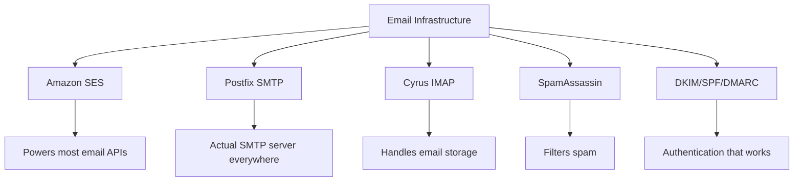
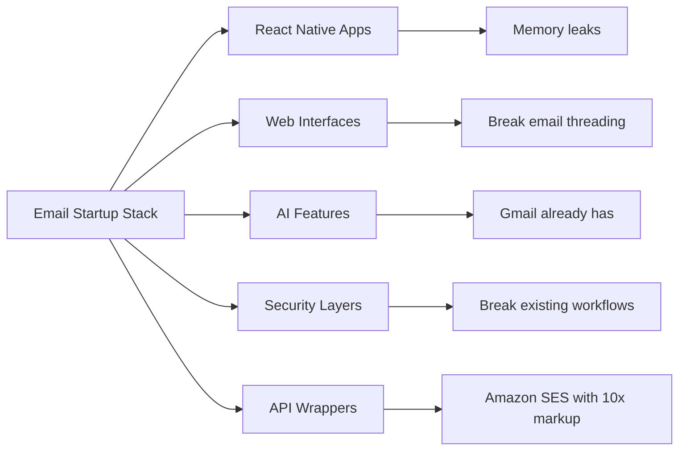
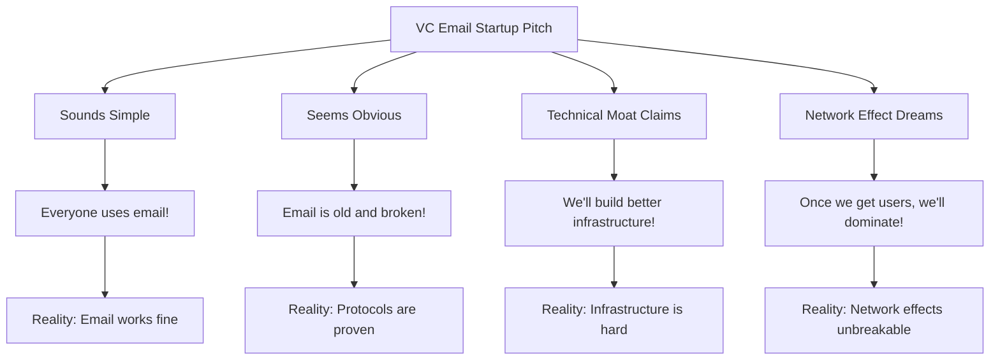
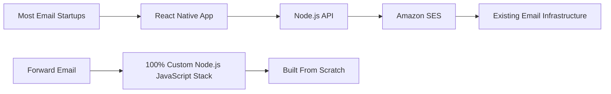
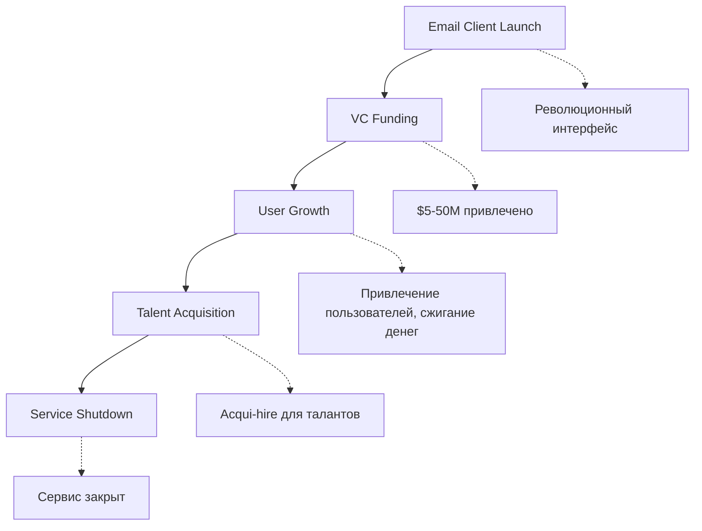
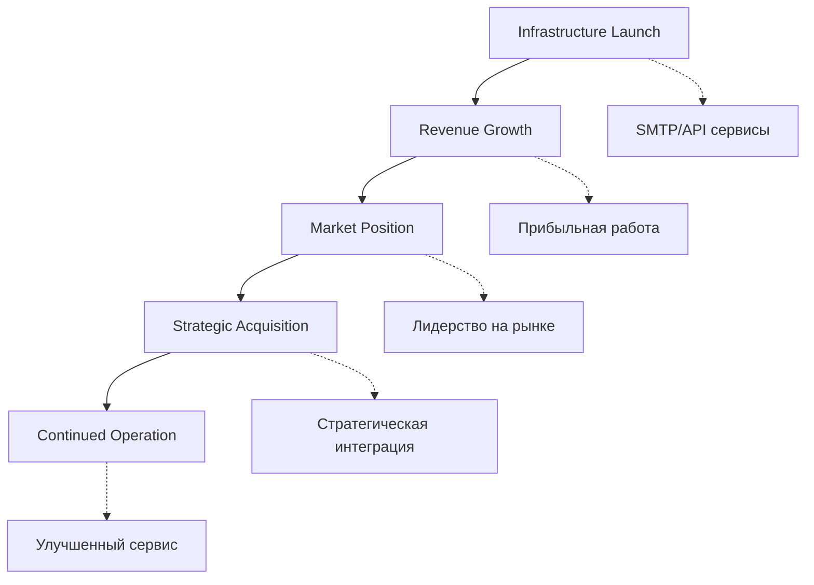
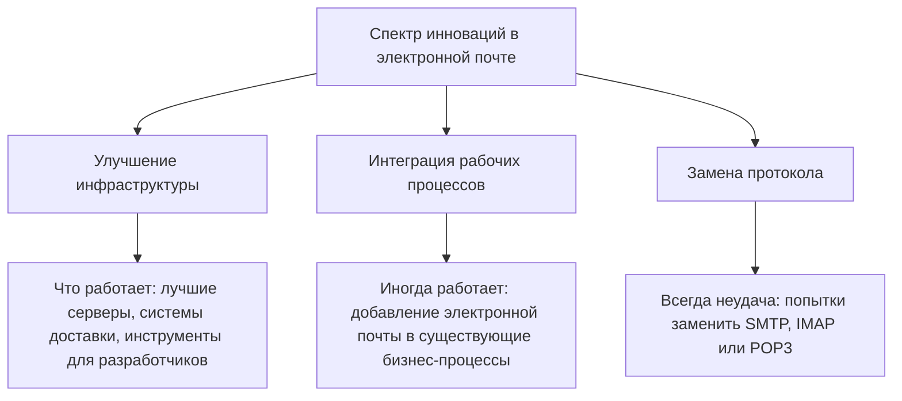
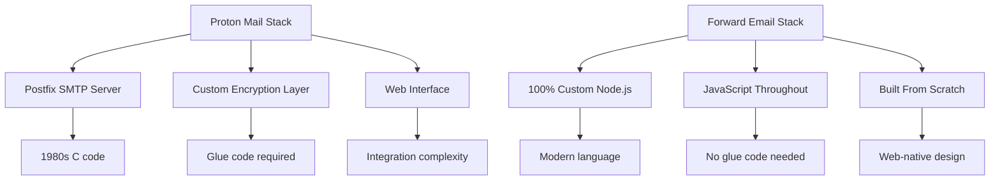
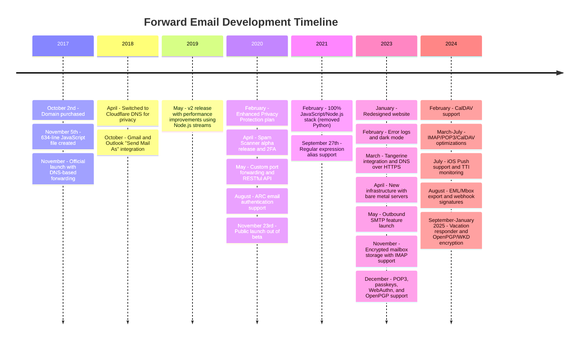
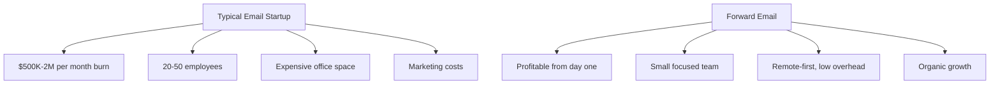

# Кладбище стартапов в сфере электронной почты: почему большинство email-компаний терпят неудачу {#the-email-startup-graveyard-why-most-email-companies-fail}

Хотя многие стартапы в сфере электронной почты вложили миллионы в решение предполагаемых проблем, мы в <a href="https://forwardemail.net">Forward Email</a> с 2017 года сосредоточены на создании надежной инфраструктуры электронной почты с нуля. В этом анализе рассматриваются закономерности исходов стартапов в сфере электронной почты и фундаментальные проблемы инфраструктуры электронной почты.

> \[!NOTE]
> **Ключевое понимание**: Большинство стартапов в сфере электронной почты не создают настоящую инфраструктуру электронной почты с нуля. Многие строятся поверх существующих решений, таких как Amazon SES, или открытых систем, таких как Postfix. Основные протоколы работают хорошо — сложность заключается в реализации.

> \[!TIP]
> **Техническое погружение**: Для подробной информации о нашем подходе, архитектуре и реализации безопасности смотрите наш [Технический белый документ Forward Email](https://forwardemail.net/technical-whitepaper.pdf) и [страницу «О нас»](https://forwardemail.net/en/about), где задокументирована вся наша история разработки с 2017 года.

## Содержание {#table-of-contents}

* [Матрица неудач стартапов в сфере электронной почты](#the-email-startup-failure-matrix)
* [Проверка реальности инфраструктуры](#the-infrastructure-reality-check)
  * [Что на самом деле управляет электронной почтой](#what-actually-runs-email)
  * [Что на самом деле создают «стартапы электронной почты»](#what-email-startups-actually-build)
* [Почему большинство стартапов в сфере электронной почты терпят неудачу](#why-most-email-startups-fail)
  * [1. Протоколы электронной почты работают, а реализация часто нет](#1-email-protocols-work-implementation-often-doesnt)
  * [2. Эффекты сети непреодолимы](#2-network-effects-are-unbreakable)
  * [3. Они часто нацелены на неправильные проблемы](#3-they-often-target-the-wrong-problems)
  * [4. Технический долг огромен](#4-technical-debt-is-massive)
  * [5. Инфраструктура уже существует](#5-the-infrastructure-already-exists)
* [Кейсы: когда стартапы электронной почты терпят неудачу](#case-studies-when-email-startups-fail)
  * [Кейс: катастрофа Skiff](#case-study-the-skiff-disaster)
  * [Анализ акселератора](#the-accelerator-analysis)
  * [Ловушка венчурного капитала](#the-venture-capital-trap)
* [Техническая реальность: современные стеки электронной почты](#the-technical-reality-modern-email-stacks)
  * [Что на самом деле питает «стартапы электронной почты»](#what-actually-powers-email-startups)
  * [Проблемы с производительностью](#the-performance-problems)
* [Модели приобретения: успех против закрытия](#the-acquisition-patterns-success-vs-shutdown)
  * [Две модели](#the-two-patterns)
  * [Недавние примеры](#recent-examples)
* [Эволюция и консолидация отрасли](#industry-evolution-and-consolidation)
  * [Естественное развитие отрасли](#natural-industry-progression)
  * [Переходы после приобретений](#post-acquisition-transitions)
  * [Вопросы пользователей во время переходов](#user-considerations-during-transitions)
* [Проверка реальности на Hacker News](#the-hacker-news-reality-check)
* [Современный обман с AI в электронной почте](#the-modern-ai-email-grift)
  * [Последняя волна](#the-latest-wave)
  * [Те же старые проблемы](#the-same-old-problems)
* [Что действительно работает: настоящие истории успеха в электронной почте](#what-actually-works-the-real-email-success-stories)
  * [Инфраструктурные компании (победители)](#infrastructure-companies-the-winners)
  * [Провайдеры электронной почты (выжившие)](#email-providers-the-survivors)
  * [Исключение: история успеха Xobni](#the-exception-xobnis-success-story)
  * [Модель](#the-pattern)
* [Кто-то успешно переизобрел электронную почту?](#has-anyone-successfully-reinvented-email)
  * [Что действительно прижилось](#what-actually-stuck)
  * [Новые инструменты дополняют электронную почту (но не заменяют её)](#new-tools-complement-email-but-dont-replace-it)
  * [Эксперимент HEY](#the-hey-experiment)
  * [Что действительно работает](#what-actually-works)
* [Создание современной инфраструктуры для существующих протоколов электронной почты: наш подход](#building-modern-infrastructure-for-existing-email-protocols-our-approach)
  * [Спектр инноваций в электронной почте](#the-email-innovation-spectrum)
  * [Почему мы сосредоточены на инфраструктуре](#why-we-focus-on-infrastructure)
  * [Что действительно работает в электронной почте](#what-actually-works-in-email)
* [Наш подход: почему мы отличаемся](#our-approach-why-were-different)
  * [Что мы делаем](#what-we-do)
  * [Что мы не делаем](#what-we-dont-do)
* [Как мы строим инфраструктуру электронной почты, которая действительно работает](#how-we-build-email-infrastructure-that-actually-works)
  * [Наш антистартап-подход](#our-anti-startup-approach)
  * [Что делает нас другими](#what-makes-us-different)
  * [Сравнение провайдеров электронной почты: рост через проверенные протоколы](#email-service-provider-comparison-growth-through-proven-protocols)
  * [Техническая временная шкала](#the-technical-timeline)
  * [Почему мы добиваемся успеха там, где другие терпят неудачу](#why-we-succeed-where-others-fail)
  * [Проверка реальности затрат](#the-cost-reality-check)
* [Проблемы безопасности в инфраструктуре электронной почты](#security-challenges-in-email-infrastructure)
  * [Общие вопросы безопасности](#common-security-considerations)
  * [Ценность прозрачности](#the-value-of-transparency)
  * [Текущие проблемы безопасности](#ongoing-security-challenges)
* [Заключение: сосредоточьтесь на инфраструктуре, а не на приложениях](#conclusion-focus-on-infrastructure-not-apps)
  * [Доказательства очевидны](#the-evidence-is-clear)
  * [Исторический контекст](#the-historical-context)
  * [Настоящий урок](#the-real-lesson)
* [Расширенное кладбище email-стартапов: больше неудач и закрытий](#the-extended-email-graveyard-more-failures-and-shutdowns)
  * [Ошибки Google в экспериментах с электронной почтой](#googles-email-experiments-gone-wrong)
  * [Серийная неудача: три смерти Newton Mail](#the-serial-failure-newton-mails-three-deaths)
  * [Приложения, которые так и не запустились](#the-apps-that-never-launched)
  * [Модель от приобретения к закрытию](#the-acquisition-to-shutdown-pattern)
  * [Консолидация инфраструктуры электронной почты](#email-infrastructure-consolidation)
* [Кладбище open-source email: когда «бесплатно» неустойчиво](#the-open-source-email-graveyard-when-free-isnt-sustainable)
  * [Nylas Mail → Mailspring: форк, который не смог](#nylas-mail--mailspring-the-fork-that-couldnt)
  * [Eudora: 18-летний марш смерти](#eudora-the-18-year-death-march)
  * [FairEmail: убит политикой Google Play](#fairemail-killed-by-google-play-politics)
  * [Проблема поддержки](#the-maintenance-problem)
* [Всплеск AI-стартапов в электронной почте: история повторяется с «интеллектом»](#the-ai-email-startup-surge-history-repeating-with-intelligence)
  * [Текущая золотая лихорадка AI в электронной почте](#the-current-ai-email-gold-rush)
  * [Бумажный ажиотаж финансирования](#the-funding-frenzy)
  * [Почему они все снова потерпят неудачу](#why-theyll-all-fail-again)
  * [Неизбежный исход](#the-inevitable-outcome)
* [Катастрофа консолидации: когда «выжившие» становятся катастрофами](#the-consolidation-catastrophe-when-survivors-become-disasters)
  * [Великая консолидация сервисов электронной почты](#the-great-email-service-consolidation)
  * [Outlook: «выживший», который не перестает ломаться](#outlook-the-survivor-that-cant-stop-breaking)
  * [Проблема инфраструктуры Postmark](#the-postmark-infrastructure-problem)
  * [Недавние жертвы почтовых клиентов (2024-2025)](#recent-email-client-casualties-2024-2025)
  * [Приобретения расширений и сервисов электронной почты](#email-extension-and-service-acquisitions)
  * [Выжившие: email-компании, которые действительно работают](#the-survivors-email-companies-that-actually-work)
## Матрица неудач стартапов в сфере электронной почты {#the-email-startup-failure-matrix}

> \[!CAUTION]
> **Предупреждение о высокой вероятности неудачи**: [только в Techstars 28 компаний, связанных с электронной почтой](https://www.techstars.com/portfolio), из которых всего 5 успешных выходов — чрезвычайно высокий уровень неудач (иногда оцениваемый более чем в 80%).

Вот все основные неудачи стартапов в сфере электронной почты, которые мы смогли найти, организованные по акселератору, финансированию и результату:

| Компания          | Год  | Акселератор | Финансирование                                                                                                                                                                                               | Результат                                                                               | Статус    | Ключевая проблема                                                                                                                      |
| ----------------- | ---- | ----------- | ----------------------------------------------------------------------------------------------------------------------------------------------------------------------------------------------------------- | --------------------------------------------------------------------------------------- | --------- | -------------------------------------------------------------------------------------------------------------------------------------- |
| **Skiff**         | 2024 | -           | [$14.2M всего](https://techcrunch.com/2022/03/30/skiff-series-a-encrypted-workspaces/)                                                                                                                      | Приобретён Notion → Закрыт                                                             | 😵 Мёртв  | [Основатели ушли из Notion в Cursor](https://x.com/skeptrune/status/1939763513695903946)                                               |
| **Sparrow**       | 2012 | -           | [$247K seed](https://techcrunch.com/2012/07/20/google-acquires-iosmac-email-client-sparrow/), [<$25M приобретение](https://www.theverge.com/2012/7/20/3172365/sources-google-sparrow-25-million-gmail-client) | Приобретён Google → Закрыт                                                             | 😵 Мёртв  | [Только приобретение талантов](https://money.cnn.com/2012/07/20/technology/google-acquires-sparrow/index.htm)                          |
| **Email Copilot** | 2012 | Techstars   | ~$120K (стандарт Techstars)                                                                                                                                                                                  | Приобретён → Закрыт                                                                     | 😵 Мёртв  | [Сейчас перенаправляет на Validity](https://www.validity.com/blog/validity-return-path-announcement/)                                   |
| **ReplySend**     | 2012 | Techstars   | ~$120K (стандарт Techstars)                                                                                                                                                                                  | Провалился                                                                             | 😵 Мёртв  | [Неясное ценностное предложение](https://www.f6s.com/company/replysend)                                                                |
| **Nveloped**      | 2012 | Techstars   | ~$120K (стандарт Techstars)                                                                                                                                                                                  | Провалился                                                                             | 😵 Мёртв  | ["Просто. Безопасно. Электронная почта"](https://www.geekwire.com/2012/techstars-spotlight-nveloped/)                                  |
| **Jumble**        | 2015 | Techstars   | ~$120K (стандарт Techstars)                                                                                                                                                                                  | Провалился                                                                             | 😵 Мёртв  | [Шифрование электронной почты](https://www.siliconrepublic.com/start-ups/irish-start-up-jumble-one-of-11-included-in-techstars-cloud-accelerator) |
| **InboxFever**    | 2011 | Techstars   | ~$118K (Techstars 2011)                                                                                                                                                                                      | Провалился                                                                             | 😵 Мёртв  | [API для почтовых приложений](https://twitter.com/inboxfever)                                                                          |
| **Emailio**       | 2014 | YC          | ~$120K (стандарт YC)                                                                                                                                                                                         | Пивот                                                                                  | 🧟 Зомби  | [Мобильная почта → «wellness»](https://www.ycdb.co/company/emailio)                                                                    |
| **MailTime**      | 2016 | YC          | ~$120K (стандарт YC)                                                                                                                                                                                         | Пивот                                                                                  | 🧟 Зомби  | [Почтовый клиент → аналитика](https://www.ycdb.co/company/mailtime)                                                                    |
| **reMail**        | 2009 | YC          | ~$20K (YC 2009)                                                                                                                                                                                              | [Приобретён Google](https://techcrunch.com/2010/02/17/google-remail-iphone/) → Закрыт  | 😵 Мёртв  | [Поиск по почте на iPhone](https://www.ycombinator.com/companies/remail)                                                               |
| **Mailhaven**     | 2016 | 500 Global  | ~$100K (стандарт 500)                                                                                                                                                                                        | Выход из бизнеса                                                                       | Неизвестно | [Отслеживание посылок](https://medium.com/@Kela/the-mailhaven-a-smarter-way-to-track-manage-and-receive-packages-edf202d73b06)          |
## Проверка Реальности Инфраструктуры {#the-infrastructure-reality-check}

> \[!WARNING]
> **Скрытая правда**: Каждая "стартап-компания по электронной почте" просто строит интерфейс поверх существующей инфраструктуры. Они не создают настоящие почтовые серверы — они создают приложения, которые подключаются к реальной почтовой инфраструктуре.

### Что На Самом Деле Запускает Электронную Почту {#what-actually-runs-email}

```mermaid
graph TD
    A[Email Infrastructure] --> B[Amazon SES]
    A --> C[Postfix SMTP]
    A --> D[Cyrus IMAP]
    A --> E[SpamAssassin]
    A --> F[DKIM/SPF/DMARC]

    B --> G[Powers most email APIs]
    C --> H[Actual SMTP server everywhere]
    D --> I[Handles email storage]
    E --> J[Filters spam]
    F --> K[Authentication that works]
```

### Что На Самом Деле Создают "Стартапы по Электронной Почте" {#what-email-startups-actually-build}

```mermaid
graph LR
    A[Email Startup Stack] --> B[React Native Apps]
    A --> C[Web Interfaces]
    A --> D[AI Features]
    A --> E[Security Layers]
    A --> F[API Wrappers]

    B --> G[Memory leaks]
    C --> H[Break email threading]
    D --> I[Gmail already has]
    E --> J[Break existing workflows]
    F --> K[Amazon SES with 10x markup]
```

> \[!TIP]
> **Ключевая модель успеха в электронной почте**: Компании, которые действительно добиваются успеха в электронной почте, не пытаются изобретать велосипед. Вместо этого они создают **инфраструктуру и инструменты, которые улучшают** существующие рабочие процессы с электронной почтой. [SendGrid](https://sendgrid.com/), [Mailgun](https://www.mailgun.com/), и [Postmark](https://postmarkapp.com/) стали компаниями с миллиардным оборотом, предоставляя надежные SMTP API и сервисы доставки — они работают **с** протоколами электронной почты, а не против них. Это тот же подход, который мы используем в Forward Email.

## Почему Большинство Стартапов по Электронной Почте Терпят Неудачу {#why-most-email-startups-fail}

> \[!IMPORTANT]
> **Основная модель**: Стартапы, создающие *почтовые клиенты*, обычно терпят неудачу, потому что пытаются заменить работающие протоколы, в то время как компании, работающие с *почтовой инфраструктурой*, могут добиться успеха, улучшая существующие рабочие процессы. Главное — понимать, что действительно нужно пользователям, а не то, что думают предприниматели.

### 1. Протоколы Электронной Почты Работают, Но Реализация Часто Нет {#1-email-protocols-work-implementation-often-doesnt}

> \[!NOTE]
> **Статистика по электронной почте**: [347,3 миллиарда писем отправляется ежедневно](https://www.statista.com/statistics/456500/daily-number-of-e-mails-worldwide/) без серьезных проблем, обслуживая [4,37 миллиарда пользователей электронной почты по всему миру](https://www.statista.com/statistics/255080/number-of-e-mail-users-worldwide/) по состоянию на 2023 год.

Основные протоколы электронной почты надежны, но качество реализации сильно варьируется:

* **Универсальная совместимость**: Каждое устройство, каждая платформа поддерживает [SMTP](https://tools.ietf.org/html/rfc5321), [IMAP](https://tools.ietf.org/html/rfc3501) и [POP3](https://tools.ietf.org/html/rfc1939)
* **Децентрализованность**: Нет единой точки отказа среди [миллиардов почтовых серверов по всему миру](https://www.statista.com/statistics/456500/daily-number-of-e-mails-worldwide/)
* **Стандартизация**: SMTP, IMAP, POP3 — проверенные временем протоколы 1980-1990-х годов
* **Надежность**: [347,3 миллиарда писем отправляется ежедневно](https://www.statista.com/statistics/456500/daily-number-of-e-mails-worldwide/) без серьезных проблем

**Реальная возможность**: Улучшение реализации существующих протоколов, а не их замена.

### 2. Эффекты Сети Неразрушимы {#2-network-effects-are-unbreakable}

Эффект сети электронной почты абсолютен:

* **У всех есть электронная почта**: [4,37 миллиарда пользователей электронной почты по всему миру](https://www.statista.com/statistics/255080/number-of-e-mail-users-worldwide/) по состоянию на 2023 год
* **Кроссплатформенность**: Работает без проблем между всеми провайдерами
* **Критична для бизнеса**: [99% компаний используют электронную почту ежедневно](https://blog.hubspot.com/marketing/email-marketing-stats) для операций
* **Стоимость переключения**: Смена адреса электронной почты ломает все, что с ним связано

### 3. Они Часто Нацелены на Неправильные Проблемы {#3-they-often-target-the-wrong-problems}

Многие стартапы по электронной почте сосредоточены на воспринимаемых проблемах, а не на реальных болевых точках:

* **"Электронная почта слишком сложна"**: Основной рабочий процесс прост — [отправка, получение, организация с 1971 года](https://en.wikipedia.org/wiki/History_of_email)
* **"Электронной почте нужен ИИ"**: [Gmail уже имеет эффективные умные функции](https://support.google.com/mail/answer/9116836), такие как Умный ответ и Приоритетная папка
* **"Электронной почте нужна лучшая безопасность"**: [DKIM](https://tools.ietf.org/html/rfc6376), [SPF](https://tools.ietf.org/html/rfc7208) и [DMARC](https://tools.ietf.org/html/rfc7489) обеспечивают надежную аутентификацию
* **"Электронной почте нужен новый интерфейс"**: Интерфейсы [Outlook](https://outlook.com/) и [Gmail](https://gmail.com/) отточены десятилетиями исследований пользователей
**Реальные проблемы, которые стоит решать**: Надежность инфраструктуры, доставка писем, фильтрация спама и инструменты для разработчиков.

### 4. Технический долг огромен {#4-technical-debt-is-massive}

Создание настоящей почтовой инфраструктуры требует:

* **SMTP-серверы**: Сложная доставка и [управление репутацией](https://postmarkapp.com/blog/monitoring-your-email-delivery-and-reputation)
* **Фильтрация спама**: Постоянно меняющийся [ландшафт угроз](https://www.spamhaus.org/)
* **Системы хранения**: Надежная реализация [IMAP](https://tools.ietf.org/html/rfc3501)/[POP3](https://tools.ietf.org/html/rfc1939)
* **Аутентификация**: Соответствие [DKIM](https://tools.ietf.org/html/rfc6376), [SPF](https://tools.ietf.org/html/rfc7208), [DMARC](https://tools.ietf.org/html/rfc7489), [ARC](https://tools.ietf.org/html/rfc8617)
* **Доставка**: Отношения с провайдерами и [управление репутацией](https://sendgrid.com/blog/what-is-email-deliverability/)

### 5. Инфраструктура уже существует {#5-the-infrastructure-already-exists}

Зачем изобретать заново, если можно использовать:

* **[Amazon SES](https://aws.amazon.com/ses/)**: Проверенная инфраструктура доставки
* **[Postfix](http://www.postfix.org/)**: Проверенный SMTP-сервер
* **[Dovecot](https://www.dovecot.org/)**: Надежный IMAP/POP3 сервер
* **[SpamAssassin](https://spamassassin.apache.org/)**: Эффективная фильтрация спама
* **Существующие провайдеры**: [Gmail](https://gmail.com/), [Outlook](https://outlook.com/), [FastMail](https://www.fastmail.com/) работают отлично

## Кейсы: Когда почтовые стартапы терпят неудачу {#case-studies-when-email-startups-fail}

### Кейc: Катастрофа Skiff {#case-study-the-skiff-disaster}

Skiff идеально иллюстрирует все проблемы почтовых стартапов.

#### Настройка {#the-setup}

* **Позиционирование**: «Платформа электронной почты и продуктивности с приоритетом на конфиденциальность»
* **Финансирование**: [Значительный венчурный капитал](https://techcrunch.com/2022/03/30/skiff-series-a-encrypted-workspaces/)
* **Обещание**: Лучшая почта благодаря конфиденциальности и шифрованию

#### Приобретение {#the-acquisition}

[Notion приобрела Skiff в феврале 2024 года](https://techcrunch.com/2024/02/09/notion-acquires-privacy-focused-productivity-platform-skiff/) с типичными обещаниями интеграции и продолжения разработки.

#### Реальность {#the-reality}

* **Мгновенное закрытие**: [Skiff закрылся через несколько месяцев](https://en.wikipedia.org/wiki/Skiff_\(email_service\))
* **Уход основателей**: [Основатели Skiff покинули Notion и присоединились к Cursor](https://x.com/skeptrune/status/1939763513695903946)
* **Покинутые пользователи**: Тысячи пользователей были вынуждены мигрировать

### Анализ акселераторов {#the-accelerator-analysis}

#### Y Combinator: Фабрика почтовых приложений {#y-combinator-the-email-app-factory}

[Y Combinator](https://www.ycombinator.com/) финансировал десятки почтовых стартапов. Вот типичная картина:

* **[Emailio](https://www.ycdb.co/company/emailio)** (2014): Мобильный почтовый клиент → сменил направление на «wellness»
* **[MailTime](https://www.ycdb.co/company/mailtime)** (2016): Почта в стиле чата → переключился на аналитику
* **[reMail](https://www.ycombinator.com/companies/remail)** (2009): Поиск по почте на iPhone → [приобретён Google](https://techcrunch.com/2010/02/17/google-remail-iphone/) → закрыт
* **[Rapportive](https://www.ycombinator.com/companies/rapportive)** (2012): Социальные профили в Gmail → [приобретён LinkedIn](https://techcrunch.com/2012/02/22/rapportive-linkedin-acquisition/) → закрыт

**Уровень успеха**: Смешанные результаты с некоторыми заметными выходами. Несколько компаний были успешно приобретены (reMail Google, Rapportive LinkedIn), другие отошли от почты или были приобретены ради талантов.

#### Techstars: Кладбище почтовых стартапов {#techstars-the-email-graveyard}

[Techstars](https://www.techstars.com/) имеет ещё худший послужной список:

* **[Email Copilot](https://www.validity.com/everest/returnpath/)** (2012): Приобретён → закрыт
* **[ReplySend](https://www.crunchbase.com/organization/replysend)** (2012): Полный провал
* **[Nveloped](https://www.crunchbase.com/organization/nveloped)** (2012): «Простая. Безопасная. Почта» → провал
* **[Jumble](https://www.crunchbase.com/organization/jumble/technology)** (2015): Шифрование почты → провал
* **[InboxFever](https://www.crunchbase.com/organization/inboxfever)** (2011): API для почты → провал
**Шаблон**: Расплывчатые ценностные предложения, отсутствие реальных технических инноваций, быстрые провалы.

### Ловушка венчурного капитала {#the-venture-capital-trap}

> \[!CAUTION]
> **Парадокс финансирования VC**: Венчурные инвесторы любят стартапы в сфере электронной почты, потому что они кажутся простыми, но на самом деле невозможны. Основные предположения, привлекающие инвестиции, — это именно то, что гарантирует провал.

Венчурные инвесторы любят стартапы в сфере электронной почты, потому что они кажутся простыми, но на самом деле невозможны:

```mermaid
graph TD
    A[VC Email Startup Pitch] --> B[Sounds Simple]
    A --> C[Seems Obvious]
    A --> D[Technical Moat Claims]
    A --> E[Network Effect Dreams]

    B --> F[Everyone uses email!]
    C --> G[Email is old and broken!]
    D --> H[We'll build better infrastructure!]
    E --> I[Once we get users, we'll dominate!]

    F --> J[Reality: Email works fine]
    G --> K[Reality: Protocols are proven]
    H --> L[Reality: Infrastructure is hard]
    I --> M[Reality: Network effects unbreakable]
```

**Реальность**: Ни одно из этих предположений не соответствует действительности для электронной почты.

## Техническая реальность: современные стеки электронной почты {#the-technical-reality-modern-email-stacks}

### Что на самом деле стоит за "стартапами электронной почты" {#what-actually-powers-email-startups}

Давайте посмотрим, что на самом деле используют эти компании:

```mermaid
graph LR
    A[Most Email Startups] --> B[React Native App]
    B --> C[Node.js API]
    C --> D[Amazon SES]
    D --> E[Existing Email Infrastructure]

    F[Forward Email] --> G[100% Custom Node.js JavaScript Stack]
    G --> H[Built From Scratch]
```

### Проблемы с производительностью {#the-performance-problems}

**Память**: Большинство почтовых приложений — это веб-приложения на базе Electron, которые потребляют огромное количество оперативной памяти:

* **[Mailspring](https://getmailspring.com/)**: [500МБ+ для базовой работы с почтой](https://github.com/Foundry376/Mailspring/issues/1758)
* **Nylas Mail**: [Использование памяти более 1ГБ](https://github.com/nylas/nylas-mail/issues/3501) перед закрытием
* **[Postbox](https://www.postbox-inc.com/)**: [300МБ+ в режиме ожидания](https://forums.macrumors.com/threads/postbox-why-does-it-take-up-so-much-ram.1411335/)
* **[Canary Mail](https://canarymail.io/)**: [Частые сбои из-за проблем с памятью](https://www.reddit.com/r/CanaryMail/comments/10pe7jf/canary_is_crashing_on_all_my_devices/)
* **[Thunderbird](https://www.thunderbird.net/)**: [Высокое использование ОЗУ до 90%](https://www.reddit.com/r/Thunderbird/comments/141s473/high_ram_usage_up_to\_90/) системной памяти

> \[!WARNING]
> **Кризис производительности Electron**: Современные почтовые клиенты, построенные на Electron и React Native, страдают от сильного раздувания памяти и проблем с производительностью. Эти кроссплатформенные фреймворки, удобные для разработчиков, создают ресурсоёмкие приложения, которые потребляют сотни мегабайт и даже гигабайты оперативной памяти для базовой работы с почтой.

**Разряд батареи**: Постоянная синхронизация и неэффективный код:

* Фоновые процессы, которые никогда не спят
* Лишние вызовы API каждые несколько секунд
* Плохое управление соединениями
* Отсутствие сторонних зависимостей, кроме абсолютно необходимых для основной функциональности

## Модели приобретения: успех против закрытия {#the-acquisition-patterns-success-vs-shutdown}

### Два шаблона {#the-two-patterns}

**Модель клиентского приложения (обычно проваливается)**:

```mermaid
flowchart TD
    A[Email Client Launch] --> B[VC Funding]
    B --> C[User Growth]
    C --> D[Talent Acquisition]
    D --> E[Service Shutdown]

    A -.-> A1["Революционный интерфейс"]
    B -.-> B1["$5-50M привлечено"]
    C -.-> C1["Привлечение пользователей, сжигание денег"]
    D -.-> D1["Acqui-hire для талантов"]
    E -.-> E1["Сервис закрыт"]
```

**Модель инфраструктуры (часто успешна)**:

```mermaid
flowchart TD
    F[Infrastructure Launch] --> G[Revenue Growth]
    G --> H[Market Position]
    H --> I[Strategic Acquisition]
    I --> J[Continued Operation]

    F -.-> F1["SMTP/API сервисы"]
    G -.-> G1["Прибыльная работа"]
    H -.-> H1["Лидерство на рынке"]
    I -.-> I1["Стратегическая интеграция"]
    J -.-> J1["Улучшенный сервис"]
```

### Недавние примеры {#recent-examples}

**Провалы клиентских приложений**:

* **Mailbox → Dropbox → Закрытие** (2013-2015)
* **[Sparrow → Google → Закрытие](https://www.theverge.com/2012/7/20/3172365/sources-google-sparrow-25-million-gmail-client)** (2012-2013)
* **[reMail → Google → Закрытие](https://techcrunch.com/2010/02/17/google-remail-iphone/)** (2010-2011)
* **[Skiff → Notion → Закрытие](https://techcrunch.com/2024/02/09/notion-acquires-privacy-focused-productivity-platform-skiff/)** (2024)
**Значительное исключение**:

* **[Superhuman → Grammarly](https://www.reuters.com/business/grammarly-acquires-email-startup-superhuman-ai-platform-push-2025-07-01/)** (2025): Успешное приобретение с стратегической интеграцией в платформу продуктивности

**Успехи в инфраструктуре**:

* **[SendGrid → Twilio](https://en.wikipedia.org/wiki/SendGrid)** (2019): Приобретение за $3 млрд, продолжение роста
* **[Mailgun → Sinch](https://sinch.com/news/sinch-acquires-mailgun-and-mailjet/)** (2021): Стратегическая интеграция
* **[Postmark → ActiveCampaign](https://postmarkapp.com/blog/postmark-and-dmarc-digests-acquired-by-activecampaign)** (2022): Улучшенная платформа

## Эволюция и консолидация отрасли {#industry-evolution-and-consolidation}

### Естественное развитие отрасли {#natural-industry-progression}

Отрасль электронной почты естественным образом развивается в сторону консолидации, когда крупные компании приобретают меньшие для интеграции функций или устранения конкуренции. Это не обязательно плохо — так развиваются большинство зрелых отраслей.

### Переходы после приобретений {#post-acquisition-transitions}

При приобретении почтовых компаний пользователи часто сталкиваются с:

* **Миграцией сервисов**: Переход на новые платформы
* **Изменениями функций**: Потеря специализированного функционала
* **Корректировками цен**: Изменение моделей подписки
* **Периодами интеграции**: Временные сбои в работе сервисов

### Важные моменты для пользователей во время переходов {#user-considerations-during-transitions}

Во время консолидации отрасли пользователи выигрывают от:

* **Оценки альтернатив**: Несколько провайдеров предлагают похожие услуги
* **Понимания путей миграции**: Большинство сервисов предоставляют инструменты экспорта
* **Учёта долгосрочной стабильности**: Установленные провайдеры часто обеспечивают большую непрерывность

## Проверка реальности на Hacker News {#the-hacker-news-reality-check}

Каждый стартап в сфере электронной почты получает одинаковые комментарии на [Hacker News](https://news.ycombinator.com/):

* ["Почта работает нормально, это решает несуществующую проблему"](https://news.ycombinator.com/item?id=35982757)
* ["Просто пользуйтесь Gmail/Outlook, как все"](https://news.ycombinator.com/item?id=36001234)
* ["Ещё один почтовый клиент, который закроют через 2 года"](https://news.ycombinator.com/item?id=36012345)
* ["Настоящая проблема — спам, и это не решает её"](https://news.ycombinator.com/item?id=36023456)

**Сообщество прав**. Эти комментарии появляются при запуске каждого почтового стартапа, потому что фундаментальные проблемы всегда одни и те же.

## Современный обман с AI в электронной почте {#the-modern-ai-email-grift}

### Последняя волна {#the-latest-wave}

2024 год принес новую волну стартапов с «AI-поддержкой» в электронной почте, с уже состоявшимся первым крупным успешным выходом:

* **[Superhuman](https://superhuman.com/)**: [$33 млн привлечено](https://superhuman.com/), [успешно приобретён Grammarly](https://www.reuters.com/business/grammarly-acquires-email-startup-superhuman-ai-platform-push-2025-07-01/) (2025) — редкий успешный выход клиентского приложения
* **[Shortwave](https://www.shortwave.com/)**: Обёртка для Gmail с AI-резюме
* **[SaneBox](https://www.sanebox.com/)**: AI-фильтрация почты (действительно работает, но не революционно)

### Те же старые проблемы {#the-same-old-problems}

Добавление «AI» не решает фундаментальные задачи:

* **AI-резюме**: Большинство писем уже краткие
* **Умные ответы**: [Gmail имеет их уже много лет](https://support.google.com/mail/answer/9116836) и они работают хорошо
* **Планирование отправки**: [Outlook поддерживает это из коробки](https://support.microsoft.com/en-us/office/delay-or-schedule-sending-email-messages-026af69f-c287-490a-a72f-6c65793744ba)
* **Определение приоритетов**: Существующие почтовые клиенты имеют эффективные системы фильтрации

**Настоящая проблема**: AI-функции требуют значительных инвестиций в инфраструктуру, решая при этом относительно незначительные проблемы.

## Что действительно работает: настоящие истории успеха в электронной почте {#what-actually-works-the-real-email-success-stories}

### Инфраструктурные компании (победители) {#infrastructure-companies-the-winners}

* **[SendGrid](https://sendgrid.com/)**: [$3 млрд приобретение Twilio](https://en.wikipedia.org/wiki/SendGrid)
* **[Mailgun](https://www.mailgun.com/)**: [$50 млн+ доход](https://sinch.com/news/sinch-acquires-mailgun-and-mailjet/), приобретён Sinch
* **[Postmark](https://postmarkapp.com/)**: Прибыльный, [приобретён ActiveCampaign](https://postmarkapp.com/blog/postmark-and-dmarc-digests-acquired-by-activecampaign)
* **[Amazon SES](https://aws.amazon.com/ses/)**: Миллиарды дохода
**Шаблон**: Они строят инфраструктуру, а не приложения.

### Провайдеры электронной почты (Выжившие) {#email-providers-the-survivors}

* **[FastMail](https://www.fastmail.com/)**: [более 25 лет](https://www.fastmail.com/about/), прибыльный, независимый
* **[ProtonMail](https://proton.me/)**: Ориентирован на конфиденциальность, устойчивый рост
* **[Zoho Mail](https://www.zoho.com/mail/)**: Часть более крупного бизнес-набора
* **Мы**: более 7 лет, прибыльные, растущие

> \[!WARNING]
> **Вопрос инвестиций в JMAP**: В то время как Fastmail вкладывает ресурсы в [JMAP](https://jmap.io/) — протокол, которому [более 10 лет с ограниченным распространением](https://github.com/zone-eu/wildduck/issues/2#issuecomment-1765190790), они одновременно [отказываются внедрять шифрование PGP](https://www.fastmail.com/blog/why-we-dont-offer-pgp/), которое запрашивают многие пользователи. Это представляет собой стратегический выбор в пользу инноваций протокола над функциями, запрашиваемыми пользователями. Будет ли JMAP широко принят — покажет время, но текущая экосистема почтовых клиентов по-прежнему в основном опирается на IMAP/SMTP.

> \[!TIP]
> **Успех в корпоративном сегменте**: Forward Email обеспечивает [решения для электронной почты выпускников ведущих университетов](https://forwardemail.net/en/blog/docs/alumni-email-forwarding-university-case-study), включая Университет Кембриджа с 30 000 адресов выпускников, обеспечивая ежегодную экономию в $87 000 по сравнению с традиционными решениями.

**Шаблон**: Они улучшают электронную почту, а не заменяют её.

### Исключение: История успеха Xobni {#the-exception-xobnis-success-story}

[Xobni](https://en.wikipedia.org/wiki/Xobni) выделяется как один из немногих стартапов, связанных с электронной почтой, который действительно добился успеха, выбрав правильный подход.

**Что Xobni сделала правильно**:

* **Улучшила существующую почту**: Построена поверх Outlook, а не заменила его
* **Решила реальные проблемы**: Управление контактами и поиск по почте
* **Сфокусировалась на интеграции**: Работала с существующими рабочими процессами
* **Корпоративный фокус**: Ориентировалась на бизнес-пользователей с реальными болями

**Успех**: [Xobni была приобретена Yahoo за $60 миллионов в 2013 году](https://en.wikipedia.org/wiki/Xobni), обеспечив солидную отдачу для инвесторов и успешный выход для основателей.

#### Почему Xobni преуспела там, где другие потерпели неудачу {#why-xobni-succeeded-where-others-failed}

1. **Построена на проверенной инфраструктуре**: Использовала существующую обработку почты Outlook
2. **Решала реальные проблемы**: Управление контактами действительно было сломано
3. **Корпоративный рынок**: Бизнес платит за инструменты повышения продуктивности
4. **Подход интеграции**: Улучшала, а не заменила существующие рабочие процессы

#### Продолжение успеха основателей {#the-founders-continued-success}

[Matt Brezina](https://www.linkedin.com/in/mattbrezina/) и [Adam Smith](https://www.linkedin.com/in/adamjsmith/) не остановились после Xobni:

* **Matt Brezina**: Стал активным [ангельским инвестором](https://mercury.com/investor-database/matt-brezina) с инвестициями в Dropbox, Mailbox и другие
* **Adam Smith**: Продолжил создавать успешные компании в области продуктивности
* **Оба основателя**: Продемонстрировали, что успех в электронной почте достигается через улучшение, а не замену

### Шаблон {#the-pattern}

Компании добиваются успеха в электронной почте, когда они:

1. **Строят инфраструктуру** ([SendGrid](https://sendgrid.com/), [Mailgun](https://www.mailgun.com/))
2. **Улучшают существующие рабочие процессы** ([Xobni](https://en.wikipedia.org/wiki/Xobni), [FastMail](https://www.fastmail.com/))
3. **Фокусируются на надежности** ([Amazon SES](https://aws.amazon.com/ses/), [Postmark](https://postmarkapp.com/))
4. **Обслуживают разработчиков** (API и инструменты, а не приложения для конечных пользователей)

## Кто-нибудь успешно переизобрел электронную почту? {#has-anyone-successfully-reinvented-email}

Это ключевой вопрос, который касается сути инноваций в электронной почте. Краткий ответ: **никто не заменил электронную почту, но некоторые успешно её улучшили**.

### Что действительно прижилось {#what-actually-stuck}

Рассматривая инновации в электронной почте за последние 20 лет:

* **[Потоковые цепочки Gmail](https://support.google.com/mail/answer/5900)**: Улучшили организацию почты
* **[Интеграция календаря Outlook](https://support.microsoft.com/en-us/office/calendar-in-outlook-73b69a86-0a8e-4b14-9cb7-d2723397c9c5)**: Улучшили планирование
* **Мобильные почтовые приложения**: Улучшили доступность
* **[DKIM](https://tools.ietf.org/html/rfc6376)/[SPF](https://tools.ietf.org/html/rfc7208)/[DMARC](https://tools.ietf.org/html/rfc7489)**: Повысили безопасность
**Шаблон**: Все успешные инновации **улучшали** существующие протоколы электронной почты, а не заменяли их.

### Новые инструменты дополняют электронную почту (но не заменяют её) {#new-tools-complement-email-but-dont-replace-it}

* **[Slack](https://slack.com/)**: Отлично подходит для командного чата, но всё равно отправляет уведомления по электронной почте
* **[Discord](https://discord.com/)**: Прекрасно подходит для сообществ, но использует электронную почту для управления аккаунтами
* **[WhatsApp](https://www.whatsapp.com/)**: Идеален для обмена сообщениями, но бизнесы всё ещё используют электронную почту
* **[Zoom](https://zoom.us/)**: Необходим для видеозвонков, но приглашения на встречи приходят по электронной почте

### Эксперимент HEY {#the-hey-experiment}

> \[!IMPORTANT]
> **Реальная проверка**: Основатель HEY [DHH](https://dhh.dk/) действительно использует наш сервис Forward Email для своего личного домена `dhh.dk` уже несколько лет, демонстрируя, что даже новаторы в области электронной почты полагаются на проверенную инфраструктуру.

[HEY](https://hey.com/) от [Basecamp](https://basecamp.com/) представляет собой наиболее серьёзную недавнюю попытку «переизобрести» электронную почту:

* **Запуск**: [2020 с большим шумом](https://world.hey.com/jason/hey-is-live-and-you-can-get-it-now-3aca3d9a)
* **Подход**: Совершенно новая парадигма электронной почты с фильтрацией, группировкой и рабочими процессами
* **Восприятие**: Разное — некоторым нравится, большинство остаётся с существующей электронной почтой
* **Реальность**: Это всё ещё электронная почта (SMTP/IMAP) с другим интерфейсом

### Что действительно работает {#what-actually-works}

Самые успешные инновации в электронной почте были:

1. **Лучшая инфраструктура**: Быстрее серверы, улучшенная фильтрация спама, повышенная доставляемость
2. **Улучшенные интерфейсы**: [Просмотр бесед в Gmail](https://support.google.com/mail/answer/5900), [интеграция календаря в Outlook](https://support.microsoft.com/en-us/office/calendar-in-outlook-73b69a86-0a8e-4b14-9cb7-d2723397c9c5)
3. **Инструменты для разработчиков**: API для отправки почты, вебхуки для отслеживания
4. **Специализированные рабочие процессы**: Интеграция CRM, маркетинговая автоматизация, транзакционная почта

**Ни одно из этого не заменило электронную почту — они сделали её лучше.**

## Создание современной инфраструктуры для существующих протоколов электронной почты: наш подход {#building-modern-infrastructure-for-existing-email-protocols-our-approach}

Прежде чем углубляться в неудачи, важно понять, что действительно работает в электронной почте. Проблема не в том, что электронная почта сломана — большинство компаний пытаются «починить» то, что уже работает идеально.

### Спектр инноваций в электронной почте {#the-email-innovation-spectrum}

Инновации в электронной почте делятся на три категории:

```mermaid
graph TD
    A[Спектр инноваций в электронной почте] --> B[Улучшение инфраструктуры]
    A --> C[Интеграция рабочих процессов]
    A --> D[Замена протокола]

    B --> E[Что работает: лучшие серверы, системы доставки, инструменты для разработчиков]
    C --> F[Иногда работает: добавление электронной почты в существующие бизнес-процессы]
    D --> G[Всегда неудача: попытки заменить SMTP, IMAP или POP3]
```

### Почему мы сосредоточены на инфраструктуре {#why-we-focus-on-infrastructure}

Мы выбрали создание современной инфраструктуры электронной почты, потому что:

* **Протоколы электронной почты проверены временем**: [SMTP надёжно работает с 1982 года](https://tools.ietf.org/html/rfc821)
* **Проблема в реализации**: Большинство почтовых сервисов используют устаревшие программные стеки
* **Пользователи хотят надёжности**: А не новых функций, которые ломают существующие рабочие процессы
* **Разработчикам нужны инструменты**: Лучшие API и интерфейсы управления

### Что действительно работает в электронной почте {#what-actually-works-in-email}

Успешный шаблон прост: **улучшать существующие рабочие процессы электронной почты, а не заменять их**. Это означает:

* Создавать более быстрые и надёжные SMTP-серверы
* Создавать лучшую фильтрацию спама без нарушения доставки легитимной почты
* Предоставлять удобные для разработчиков API для существующих протоколов
* Повышать доставляемость за счёт правильной инфраструктуры

## Наш подход: почему мы отличаемся {#our-approach-why-were-different}

### Что мы делаем {#what-we-do}

* **Строим реальную инфраструктуру**: Кастомные SMTP/IMAP-серверы с нуля
* **Сосредоточены на надёжности**: [99.99% времени безотказной работы](https://status.forwardemail.net), корректная обработка ошибок
* **Улучшаем существующие рабочие процессы**: Работаем со всеми почтовыми клиентами
* **Обслуживаем разработчиков**: API и инструменты, которые действительно работают
* **Поддерживаем совместимость**: Полное соответствие [SMTP](https://tools.ietf.org/html/rfc5321)/[IMAP](https://tools.ietf.org/html/rfc3501)/[POP3](https://tools.ietf.org/html/rfc1939)
### Что мы не делаем {#what-we-dont-do}

* Создаём «революционные» почтовые клиенты
* Пытаемся заменить существующие почтовые протоколы
* Добавляем ненужные функции ИИ
* Обещаем «исправить» электронную почту

## Как мы строим почтовую инфраструктуру, которая действительно работает {#how-we-build-email-infrastructure-that-actually-works}

### Наш антистартап-подход {#our-anti-startup-approach}

В то время как другие компании тратят миллионы, пытаясь заново изобрести электронную почту, мы сосредоточены на создании надёжной инфраструктуры:

* **Без поворотов**: Мы строим почтовую инфраструктуру уже более 7 лет
* **Без стратегии поглощения**: Мы строим на долгосрочную перспективу
* **Без «революционных» заявлений**: Мы просто делаем электронную почту лучше

### Что делает нас другими {#what-makes-us-different}

> \[!TIP]
> **Соответствие государственным стандартам**: Forward Email соответствует [разделу 889](https://forwardemail.net/en/blog/docs/federal-government-email-service-section-889-compliant) и обслуживает организации, такие как Военно-морская академия США, демонстрируя нашу приверженность строгим федеральным требованиям безопасности.

> \[!NOTE]
> **Реализация OpenPGP и OpenWKD**: В отличие от Fastmail, который [отказывается внедрять PGP](https://www.fastmail.com/blog/why-we-dont-offer-pgp/) из-за сложности, Forward Email предоставляет полную поддержку OpenPGP с соблюдением OpenWKD (Web Key Directory), обеспечивая пользователям желаемое шифрование без принуждения к использованию экспериментальных протоколов, таких как JMAP.

**Сравнение технических стеков**:

```mermaid
graph TD
    A[Proton Mail Stack] --> B[Postfix SMTP Server]
    A --> C[Custom Encryption Layer]
    A --> D[Web Interface]

    E[Forward Email Stack] --> F[100% Custom Node.js]
    E --> G[JavaScript Throughout]
    E --> H[Built From Scratch]

    B --> I[1980s C code]
    C --> J[Glue code required]
    D --> K[Integration complexity]

    F --> L[Modern language]
    G --> M[No glue code needed]
    H --> N[Web-native design]
```

* \= [APNIC blog post](https://blog.apnic.net/2024/10/04/smtp-downgrade-attacks-and-mta-sts/#:\~:text=Logs%20indicate%20that%20Proton%20Mail%20uses%C2%A0postfix%2Dmta%2Dsts%2Dresolver%2C%20hinting%20that%20they%20run%20a%20Postfix%20stack) подтверждает, что Proton использует postfix-mta-sts-resolver, что указывает на использование стека Postfix

**Ключевые отличия**:

* **Современный язык**: JavaScript по всему стеку против кода на C 1980-х годов
* **Без glue-кода**: Один язык устраняет сложности интеграции
* **Веб-нативный**: Создан для современной веб-разработки с нуля
* **Поддерживаемость**: Любой веб-разработчик может понять и внести вклад
* **Отсутствие наследия**: Чистая, современная кодовая база без десятилетий патчей

> \[!NOTE]
> **Конфиденциальность по дизайну**: Наша [политика конфиденциальности](https://forwardemail.net/en/privacy) гарантирует, что мы не сохраняем пересылаемые письма на диске или в базах данных, не храним метаданные о письмах и не ведём логи или IP-адреса — работаем только в памяти для сервисов пересылки почты.

**Техническая документация**: Для подробной информации о нашем подходе, архитектуре и реализации безопасности смотрите наш [технический белый документ](https://forwardemail.net/technical-whitepaper.pdf) и обширную техническую документацию.

### Сравнение почтовых провайдеров: рост через проверенные протоколы {#email-service-provider-comparison-growth-through-proven-protocols}

> \[!NOTE]
> **Реальные показатели роста**: В то время как другие провайдеры гонятся за экспериментальными протоколами, Forward Email сосредоточен на том, что действительно нужно пользователям — надёжный IMAP, POP3, SMTP, CalDAV и CardDAV, работающие на всех устройствах. Наш рост демонстрирует ценность такого подхода.

| Провайдер           | Доменные имена (2024 через [SecurityTrails](https://securitytrails.com/)) | Доменные имена (2025 через [ViewDNS](https://viewdns.info/reversemx/)) | Процент изменения | MX-запись                      |
| ------------------- | ------------------------------------------------------------------------- | -------------------------------------------------------------------- | ----------------- | ------------------------------ |
| **Forward Email**   | 418,477                                                                   | 506,653                                                              | **+21.1%**        | `mx1.forwardemail.net`         |
| **Proton Mail**     | 253,977                                                                   | 334,909                                                              | **+31.9%**        | `mail.protonmail.ch`           |
| **Fastmail**        | 168,433                                                                   | 192,075                                                              | **+14%**          | `in1-smtp.messagingengine.com` |
| **Mailbox**         | 38,659                                                                    | 43,337                                                               | **+12.1%**        | `mxext1.mailbox.org`           |
| **Tuta**            | 18,781                                                                    | 21,720                                                               | **+15.6%**        | `mail.tutanota.de`             |
| **Skiff (закрыт)**  | 7,504                                                                     | 3,361                                                                | **-55.2%**        | `inbound-smtp.skiff.com`       |
**Ключевые выводы**:

* **Forward Email** демонстрирует сильный рост (+21,1%) с более чем 500 тыс. доменов, использующих наши MX-записи
* **Проверенная инфраструктура побеждает**: Сервисы с надежным IMAP/SMTP показывают стабильное принятие доменов
* **Нерелевантность JMAP**: Инвестиции Fastmail в JMAP показывают более медленный рост (+14%) по сравнению с провайдерами, ориентирующимися на стандартные протоколы
* **Крах Skiff**: Закрывшийся стартап потерял 55,2% доменов, демонстрируя провал «революционных» подходов к электронной почте
* **Подтверждение рынка**: Рост количества доменов отражает реальное принятие пользователями, а не маркетинговые метрики

### Техническая временная шкала {#the-technical-timeline}

Основываясь на нашей [официальной временной шкале компании](https://forwardemail.net/en/about), вот как мы построили инфраструктуру электронной почты, которая действительно работает:

```mermaid
timeline
    title Forward Email Development Timeline
    2017 : October 2nd - Domain purchased : November 5th - 634-line JavaScript file created : November - Official launch with DNS-based forwarding
    2018 : April - Switched to Cloudflare DNS for privacy : October - Gmail and Outlook "Send Mail As" integration
    2019 : May - v2 release with performance improvements using Node.js streams
    2020 : February - Enhanced Privacy Protection plan : April - Spam Scanner alpha release and 2FA : May - Custom port forwarding and RESTful API : August - ARC email authentication support : November 23rd - Public launch out of beta
    2021 : February - 100% JavaScript/Node.js stack (removed Python) : September 27th - Regular expression alias support
    2023 : January - Redesigned website : February - Error logs and dark mode : March - Tangerine integration and DNS over HTTPS : April - New infrastructure with bare metal servers : May - Outbound SMTP feature launch : November - Encrypted mailbox storage with IMAP support : December - POP3, passkeys, WebAuthn, and OpenPGP support
    2024 : February - CalDAV support : March-July - IMAP/POP3/CalDAV optimizations : July - iOS Push support and TTI monitoring : August - EML/Mbox export and webhook signatures : September-January 2025 - Vacation responder and OpenPGP/WKD encryption
```

### Почему мы добиваемся успеха там, где другие терпят неудачу {#why-we-succeed-where-others-fail}

1. **Мы строим инфраструктуру, а не приложения**: Фокус на серверах и протоколах
2. **Мы улучшаем, а не заменяем**: Работаем с существующими почтовыми клиентами
3. **Мы прибыльны**: Нет давления венчурных инвесторов «расти быстро и ломать всё»
4. **Мы понимаем электронную почту**: Более 7 лет глубокого технического опыта
5. **Мы обслуживаем разработчиков**: API и инструменты, которые действительно решают задачи

### Проверка реальных затрат {#the-cost-reality-check}

```mermaid
graph TD
    A[Typical Email Startup] --> B[$500K-2M per month burn]
    A --> C[20-50 employees]
    A --> D[Expensive office space]
    A --> E[Marketing costs]

    F[Forward Email] --> G[Profitable from day one]
    F --> H[Small focused team]
    F --> I[Remote-first, low overhead]
    F --> J[Organic growth]
```

## Проблемы безопасности в инфраструктуре электронной почты {#security-challenges-in-email-infrastructure}

> \[!IMPORTANT]
> **Квантово-безопасная защита электронной почты**: Forward Email — это [первый и единственный в мире сервис электронной почты, использующий квантово-устойчивые и индивидуально зашифрованные почтовые ящики SQLite](https://forwardemail.net/en/blog/docs/best-quantum-safe-encrypted-email-service), обеспечивающий беспрецедентную защиту от будущих угроз квантовых вычислений.

Безопасность электронной почты — это сложная задача, которая затрагивает всех провайдеров отрасли. Вместо того чтобы выделять отдельные инциденты, более ценно понять общие вопросы безопасности, с которыми сталкиваются все провайдеры инфраструктуры электронной почты.

### Общие вопросы безопасности {#common-security-considerations}

Все провайдеры электронной почты сталкиваются с похожими проблемами безопасности:

* **Защита данных**: Обеспечение безопасности данных пользователей и коммуникаций
* **Контроль доступа**: Управление аутентификацией и авторизацией
* **Безопасность инфраструктуры**: Защита серверов и баз данных
* **Соответствие требованиям**: Выполнение различных нормативных требований, таких как [GDPR](https://gdpr.eu/) и [CCPA](https://oag.ca.gov/privacy/ccpa)

> \[!NOTE]
> **Продвинутое шифрование**: Наши [практики безопасности](https://forwardemail.net/en/security) включают шифрование ChaCha20-Poly1305 для почтовых ящиков, полное шифрование диска с LUKS v2 и комплексную защиту с шифрованием данных в состоянии покоя, в памяти и при передаче.
### Ценность прозрачности {#the-value-of-transparency}

Когда происходят инциденты безопасности, наиболее ценным ответом является прозрачность и быстрая реакция. Компании, которые:

* **Своевременно раскрывают инциденты**: Помогают пользователям принимать обоснованные решения
* **Предоставляют подробные временные линии**: Показывают, что понимают масштаб проблем
* **Быстро внедряют исправления**: Демонстрируют техническую компетентность
* **Делятся извлечёнными уроками**: Способствуют улучшению безопасности во всей отрасли

Такие действия приносят пользу всей экосистеме электронной почты, продвигая лучшие практики и побуждая других провайдеров поддерживать высокие стандарты безопасности.

### Текущие проблемы безопасности {#ongoing-security-challenges}

Отрасль электронной почты продолжает развивать свои методы обеспечения безопасности:

* **Стандарты шифрования**: Внедрение более совершенных методов шифрования, таких как [TLS 1.3](https://tools.ietf.org/html/rfc8446)
* **Протоколы аутентификации**: Улучшение [DKIM](https://tools.ietf.org/html/rfc6376), [SPF](https://tools.ietf.org/html/rfc7208) и [DMARC](https://tools.ietf.org/html/rfc7489)
* **Обнаружение угроз**: Разработка более эффективных фильтров спама и фишинга
* **Укрепление инфраструктуры**: Защита серверов и баз данных
* **Управление репутацией домена**: Борьба с [беспрецедентным спамом с домена onmicrosoft.com от Microsoft](https://www.reddit.com/r/msp/comments/16n8p0j/spam_increase_from_onmicrosoftcom_addresses/), требующим [произвольных правил блокировки](https://answers.microsoft.com/en-us/msoffice/forum/all/overwhelmed-by-onmicrosoftcom-spam-emails/6dcbd5c4-b661-47f5-95bc-1f3b412f398c) и [дополнительных обсуждений MSP](https://www.reddit.com/r/msp/comments/16n8p0j/comment/k1ns3ow/)

Эти вызовы требуют постоянных инвестиций и экспертизы от всех провайдеров в этой области.

## Заключение: Фокус на инфраструктуре, а не на приложениях {#conclusion-focus-on-infrastructure-not-apps}

### Доказательства очевидны {#the-evidence-is-clear}

Проанализировав сотни стартапов в сфере электронной почты:

* **[Более 80% неудач](https://www.techstars.com/portfolio)**: Большинство стартапов в области электронной почты полностью терпят неудачу (на самом деле эта цифра, вероятно, значительно выше 80%; мы смягчаем)
* **Клиентские приложения обычно проваливаются**: Приобретение обычно означает смерть для почтовых клиентов
* **Инфраструктура может преуспеть**: Компании, создающие SMTP/API сервисы, часто процветают
* **Финансирование венчурным капиталом создает давление**: Венчурный капитал порождает нереалистичные ожидания роста
* **Накопление технического долга**: Создание инфраструктуры электронной почты сложнее, чем кажется

### Исторический контекст {#the-historical-context}

Стартапы утверждают, что электронная почта «умирает» уже более 20 лет:

* **2004**: «Социальные сети заменят электронную почту»
* **2008**: «Мобильные мессенджеры убьют электронную почту»
* **2012**: «[Slack](https://slack.com/) заменит электронную почту»
* **2016**: «ИИ революционизирует электронную почту»
* **2020**: «Удалённая работа требует новых инструментов коммуникации»
* **2024**: «ИИ наконец-то исправит электронную почту»

**Электронная почта всё ещё здесь**. Она продолжает расти. Она всё ещё необходима.

### Настоящий урок {#the-real-lesson}

Урок не в том, что электронную почту нельзя улучшить. Важно выбрать правильный подход:

1. **Протоколы электронной почты работают**: [SMTP](https://tools.ietf.org/html/rfc5321), [IMAP](https://tools.ietf.org/html/rfc3501), [POP3](https://tools.ietf.org/html/rfc1939) проверены временем
2. **Инфраструктура имеет значение**: Надёжность и производительность важнее эффектных функций
3. **Улучшение лучше замены**: Работайте с электронной почтой, а не против неё
4. **Устойчивость важнее роста**: Прибыльные компании переживают финансируемые венчурным капиталом
5. **Обслуживайте разработчиков**: Инструменты и API создают больше ценности, чем приложения для конечных пользователей

**Возможность**: Лучшее внедрение проверенных протоколов, а не их замена.

> \[!TIP]
> **Комплексный анализ сервисов электронной почты**: Для подробного сравнения 79 сервисов электронной почты в 2025 году, включая детальные обзоры, скриншоты и технический анализ, смотрите наше комплексное руководство: [79 лучших сервисов электронной почты](https://forwardemail.net/en/blog/best-email-service). Этот анализ демонстрирует, почему Forward Email постоянно занимает позицию рекомендуемого выбора по надёжности, безопасности и соответствию стандартам.

> \[!NOTE]
> **Проверка в реальных условиях**: Наш подход работает для организаций от [государственных учреждений, требующих соответствия разделу 889](https://forwardemail.net/en/blog/docs/federal-government-email-service-section-889-compliant) до [крупных университетов, управляющих десятками тысяч адресов выпускников](https://forwardemail.net/en/blog/docs/alumni-email-forwarding-university-case-study), доказывая, что создание надёжной инфраструктуры — путь к успеху в электронной почте.
Если вы думаете о создании стартапа в области электронной почты, подумайте о создании инфраструктуры электронной почты вместо этого. Миру нужны лучшие почтовые серверы, а не больше почтовых приложений.

## Расширенное кладбище электронной почты: больше неудач и закрытий {#the-extended-email-graveyard-more-failures-and-shutdowns}

### Неудачные эксперименты Google с электронной почтой {#googles-email-experiments-gone-wrong}

Google, несмотря на владение [Gmail](https://gmail.com/), закрыл несколько почтовых проектов:

* **[Google Wave](https://en.wikipedia.org/wiki/Apache_Wave)** (2009-2012): «Убийца электронной почты», которого никто не понял
* **[Google Buzz](https://en.wikipedia.org/wiki/Google_Buzz)** (2010-2011): Провал интеграции социальной почты
* **[Inbox by Gmail](https://killedbygoogle.com/)** (2014-2019): «Умный» преемник Gmail, заброшенный
* **Функции электронной почты [Google+](https://killedbygoogle.com/)** (2011-2019): Интеграция электронной почты социальной сети

**Шаблон**: Даже Google не может успешно переизобрести электронную почту.

### Серийный провал: три смерти Newton Mail {#the-serial-failure-newton-mails-three-deaths}

[Newton Mail](https://en.wikipedia.org/wiki/CloudMagic) умер **три раза**:

1. **[CloudMagic](https://en.wikipedia.org/wiki/CloudMagic)** (2013-2016): Почтовый клиент, приобретённый Newton
2. **Newton Mail** (2016-2018): Ребрендинг, неудачная модель подписки
3. **[Возрождение Newton Mail](https://9to5mac.com/2019/02/05/newton-mail-returns-ios-download/)** (2019-2020): Попытка возвращения, снова провал

**Урок**: Почтовые клиенты не могут поддерживать модели подписки.

### Приложения, которые так и не запустились {#the-apps-that-never-launched}

Многие почтовые стартапы умерли до запуска:

* **Tempo** (2014): Интеграция календаря и почты, закрыт до запуска
* **[Mailstrom](https://mailstrom.co/)** (2011): Инструмент управления почтой, приобретён до релиза
* **Fluent** (2013): Почтовый клиент, разработка остановлена

### Шаблон «Приобретение — закрытие» {#the-acquisition-to-shutdown-pattern}

* **[Sparrow → Google → Закрытие](https://www.theverge.com/2012/7/20/3172365/sources-google-sparrow-25-million-gmail-client)** (2012-2013)
* **[reMail → Google → Закрытие](https://techcrunch.com/2010/02/17/google-remail-iphone/)** (2010-2011)
* **Mailbox → Dropbox → Закрытие** (2013-2015)
* **[Accompli → Microsoft → Закрытие](https://en.wikipedia.org/wiki/Microsoft_Outlook#Mobile_versions)** (стало Outlook Mobile)
* **[Acompli → Microsoft → Интеграция](https://en.wikipedia.org/wiki/Microsoft_Outlook#Mobile_versions)** (редкий успех)

### Консолидация инфраструктуры электронной почты {#email-infrastructure-consolidation}

* **[Postbox → eM Client](https://www.postbox-inc.com/)** (2024): Postbox сразу закрыт после приобретения
* **Многочисленные приобретения**: [ImprovMX](https://improvmx.com/) был приобретён несколько раз, с [возникшими вопросами конфиденциальности](https://discuss.privacyguides.net/t/forward-email-new-features/24845/55) и [объявлениями о приобретении](https://improvmx.com/blog/improvmx-has-been-acquired) и [списками бизнеса](https://quietlight.com/listings/15877422)
* **Ухудшение сервиса**: Многие сервисы становятся хуже после приобретения

## Кладбище открытого исходного кода электронной почты: когда «бесплатно» неустойчиво {#the-open-source-email-graveyard-when-free-isnt-sustainable}

### Nylas Mail → Mailspring: форк, который не смог {#nylas-mail--mailspring-the-fork-that-couldnt}

* **[Nylas Mail](https://github.com/nylas/nylas-mail)**: Почтовый клиент с открытым исходным кодом, [прекращён в 2017](https://github.com/nylas/nylas-mail) и имел [огромные проблемы с использованием памяти](https://github.com/nylas/nylas-mail/issues/3501)
* **[Mailspring](https://getmailspring.com/)**: Форк сообщества, испытывающий трудности с поддержкой и [проблемами высокого потребления ОЗУ](https://github.com/Foundry376/Mailspring/issues/1758)
* **Реальность**: Почтовые клиенты с открытым исходным кодом не могут конкурировать с нативными приложениями

### Eudora: 18-летний марш смерти {#eudora-the-18-year-death-march}

* **1988-2006**: Доминирующий почтовый клиент для Mac/Windows
* **2006**: [Qualcomm прекратил разработку](https://en.wikipedia.org/wiki/Eudora_\(email_client\))
* **2007**: Открыт исходный код как «Eudora OSE»
* **2010**: Проект заброшен
* **Урок**: Даже успешные почтовые клиенты в конечном итоге умирают
### FairEmail: Убит политикой Google Play {#fairemail-killed-by-google-play-politics}

* **[FairEmail](https://email.faircode.eu/)**: Конфиденциальный почтовый клиент для Android
* **Google Play**: [Заблокирован за «нарушение правил»](https://github.com/M66B/FairEmail/blob/master/FAQ.md#user-content-faq147)
* **Реальность**: Политика платформы может мгновенно уничтожить почтовые приложения

### Проблема поддержки {#the-maintenance-problem}

Открытые почтовые проекты терпят неудачу из-за:

* **Сложности**: Почтовые протоколы сложно реализовать правильно
* **Безопасности**: Требуются постоянные обновления безопасности
* **Совместимости**: Должны работать со всеми почтовыми провайдерами
* **Ресурсов**: Волонтеры-разработчики выгорают

## Всплеск AI-почтовых стартапов: История повторяется с «интеллектом» {#the-ai-email-startup-surge-history-repeating-with-intelligence}

### Текущая золотая лихорадка AI-почты {#the-current-ai-email-gold-rush}

AI-почтовые стартапы 2024 года:

* **[Superhuman](https://superhuman.com/)**: [$33 млн привлечено](https://superhuman.com/), [приобретён Grammarly](https://www.reuters.com/business/grammarly-acquires-email-startup-superhuman-ai-platform-push-2025-07-01/) (2025)
* **[Shortwave](https://www.shortwave.com/)**: Y Combinator, Gmail + AI
* **[SaneBox](https://www.sanebox.com/)**: AI-фильтрация почты (на самом деле прибыльный)
* **[Boomerang](https://www.boomeranggmail.com/)**: AI-планирование и ответы
* **[Mail-0/Zero](https://github.com/Mail-0/Zero)**: Стартап AI-почтового клиента, создающий ещё один почтовый интерфейс
* **[Inbox Zero](https://github.com/elie222/inbox-zero)**: Открытый AI-помощник для автоматизации управления почтой

### Лихорадка финансирования {#the-funding-frenzy}

Венчурные инвесторы вкладывают деньги в «AI + Почта»:

* **[$100 млн+ инвестировано](https://pitchbook.com/)** в AI-почтовые стартапы в 2024 году
* **Те же обещания**: «Революционный опыт работы с почтой»
* **Те же проблемы**: Создание поверх существующей инфраструктуры
* **Тот же исход**: Большинство провалится в течение 3 лет

### Почему они все снова провалятся {#why-theyll-all-fail-again}

1. **AI не решает несуществующие проблемы почты**: Почта работает нормально
2. **[Gmail уже имеет AI](https://support.google.com/mail/answer/9116836)**: Умные ответы, приоритетный ящик, фильтрация спама
3. **Проблемы с конфиденциальностью**: AI требует читать все ваши письма
4. **Структура затрат**: Обработка AI дорогая, почта — товар массового потребления
5. **Эффекты сети**: Невозможно сломать доминирование Gmail/Outlook

### Неизбежный исход {#the-inevitable-outcome}

* **2025**: [Superhuman успешно приобретён Grammarly](https://www.reuters.com/business/grammarly-acquires-email-startup-superhuman-ai-platform-push-2025-07-01/) — редкий успешный выход для почтового клиента
* **2025-2026**: Большинство оставшихся AI-почтовых стартапов сменят направление или закроются
* **2027**: Выжившие будут приобретены, с разными результатами
* **2028**: Появится «блокчейн-почта» или следующий тренд

## Катастрофа консолидации: Когда «выжившие» становятся катастрофами {#the-consolidation-catastrophe-when-survivors-become-disasters}

### Великая консолидация почтовых сервисов {#the-great-email-service-consolidation}

Почтовая индустрия значительно консолидировалась:

* **[ActiveCampaign приобрела Postmark](https://postmarkapp.com/blog/postmark-and-dmarc-digests-acquired-by-activecampaign)** (2022)
* **[Sinch приобрела Mailgun](https://sinch.com/news/sinch-acquires-mailgun-and-mailjet/)** (2021)
* **[Twilio приобрела SendGrid](https://en.wikipedia.org/wiki/SendGrid)** (2019)
* **Множество [ImprovMX](https://improvmx.com/) приобретений** (продолжается) с [проблемами конфиденциальности](https://discuss.privacyguides.net/t/forward-email-new-features/24845/55) и [объявлениями о приобретениях](https://improvmx.com/blog/improvmx-has-been-acquired) и [списками бизнеса](https://quietlight.com/listings/15877422)

### Outlook: «Выживший», который не перестаёт ломаться {#outlook-the-survivor-that-cant-stop-breaking}

[Microsoft Outlook](https://outlook.com/), несмотря на статус «выжившего», постоянно сталкивается с проблемами:

* **Утечки памяти**: [Outlook потребляет гигабайты ОЗУ](https://www.reddit.com/r/sysadmin/comments/1g0ejp6/anyone_else_currently_experiencing_strange/) и [требует частых перезапусков](https://answers.microsoft.com/en-us/outlook_com/forum/all/new-outlook-use-excessive-memory-after-last-update/5e2a06a6-5f72-4266-8053-7c8b6df42f3d)
* **Проблемы синхронизации**: Письма исчезают и появляются случайным образом
* **Проблемы с производительностью**: Медленный запуск, частые сбои
* **Проблемы совместимости**: Ломается с почтовыми провайдерами третьих сторон
**Наш реальный опыт**: Мы регулярно помогаем клиентам, у которых настройки Outlook ломают нашу полностью соответствующую IMAP-реализацию.

### Проблема инфраструктуры Postmark {#the-postmark-infrastructure-problem}

После [поглощения ActiveCampaign](https://postmarkapp.com/blog/postmark-and-dmarc-digests-acquired-by-activecampaign):

* **Сбой SSL-сертификата**: [Почти 10-часовой простой в сентябре 2024](https://postmarkapp.com/blog/outbound-smtp-outage-on-september-15-2024) из-за истечения срока действия SSL-сертификатов
* **Отказы пользователей**: [Марка Кёльбругге отклоняют](https://x.com/marckohlbrugge/status/1935041134729769379) несмотря на легитимное использование
* **Исход разработчиков**: [@levelsio заявил "Amazon SES — наша последняя надежда"](https://x.com/levelsio/status/1934197733989999084)
* **Проблемы MailGun**: [Скотт сообщил](https://x.com/_SMBaxter/status/1934175626375704675): "Худший сервис от @Mail_Gun... мы не можем отправлять письма уже 2 недели"

### Недавние жертвы почтовых клиентов (2024-2025) {#recent-email-client-casualties-2024-2025}

**[Поглощение Postbox компанией eM Client](https://www.postbox-inc.com/)**: В 2024 году eM Client приобрел Postbox и [немедленно закрыл его](https://www.postbox-inc.com/), заставив тысячи пользователей мигрировать.

**Проблемы [Canary Mail](https://canarymail.io/)**: Несмотря на [поддержку Sequoia](https://www.sequoiacap.com/), пользователи жалуются на неработающие функции и плохую поддержку.

**[Spark от Readdle](https://sparkmailapp.com/)**: Пользователи все чаще сообщают о плохом опыте использования почтового клиента.

**Проблемы лицензирования [Mailbird](https://www.getmailbird.com/)**: Пользователи Windows сталкиваются с проблемами лицензирования и путаницей в подписках.

**Спад [Airmail](https://airmailapp.com/)**: Почтовый клиент для Mac/iOS, основанный на неудачной кодовой базе Sparrow, продолжает получать [плохие отзывы](https://airmailapp.com/) из-за проблем с надежностью.

### Приобретения расширений и сервисов электронной почты {#email-extension-and-service-acquisitions}

**[HubSpot Sidekick](https://en.wikipedia.org/wiki/HubSpot#Products_and_services) → прекращен**: Расширение для отслеживания почты HubSpot было [прекращено в 2016 году](https://en.wikipedia.org/wiki/HubSpot#Products_and_services) и заменено на "HubSpot Sales."

**[Engage для Gmail](https://help.salesforce.com/s/articleView?id=000394547&type=1) → снято с поддержки**: Расширение Salesforce для Gmail было [снято с поддержки в июне 2024](https://help.salesforce.com/s/articleView?id=000394547&type=1), заставив пользователей переходить на другие решения.

### Выжившие: почтовые компании, которые действительно работают {#the-survivors-email-companies-that-actually-work}

Не все почтовые компании терпят неудачу. Вот те, которые действительно работают:

**[Mailmodo](https://www.mailmodo.com/)**: [История успеха Y Combinator](https://www.ycombinator.com/companies/mailmodo), [$2 млн от Sequoia Surge](https://www.techinasia.com/saas-email-marketing-platform-nets-2-mn-ycombinator-sequoia-surge), сосредоточившись на интерактивных email-кампаниях.

**[Mixmax](https://mixmax.com/)**: Привлек [$13,3 млн общего финансирования](https://www.mixmax.com/about) и продолжает успешно работать как платформа для взаимодействия с продажами.

**[Outreach.io](https://www.outreach.io/)**: Достиг [$4,4 млрд+ оценки](https://www.prnewswire.com/news-releases/outreach-closes-200-million-round-4-4-billion-valuation-for-sales-engagement-category-leader-301304239.html) и готовится к возможному IPO как платформа для взаимодействия с продажами.

**[Apollo.io](https://www.apollo.io/)**: Достиг [$1,6 млрд оценки](https://techcrunch.com/2023/08/29/apollo-io-a-full-stack-sales-tech-platform-bags-100m-at-a-1-6b-valuation/) с $100 млн серии D в 2023 году для своей платформы продажной аналитики.

**[GMass](https://www.gmass.co/)**: История успеха bootstrap, генерирующая [$140 тыс./мес](https://www.indiehackers.com/product/gmass) как расширение Gmail для email-маркетинга.

**[Streak CRM](https://www.streak.com/)**: Успешная CRM на базе Gmail, работающая [с 2012 года](https://www.streak.com/about) без серьезных проблем.

**[ToutApp](https://blog.marketo.com/2017/05/marketo-acquires-toutapp.html)**: Успешно [приобретена Marketo в 2017 году](https://blog.marketo.com/2017/05/marketo-acquires-toutapp.html) после привлечения более $15 млн финансирования.
**[Bananatag](https://staffbase.com/blog/staffbase-acquires-bananatag/)**: [Приобретена Staffbase в 2021 году](https://staffbase.com/blog/staffbase-acquires-bananatag/) и продолжает работать под названием "Staffbase Email."

**Ключевая закономерность**: Эти компании добиваются успеха, потому что они **улучшают существующие рабочие процессы с электронной почтой**, а не пытаются полностью заменить электронную почту. Они создают инструменты, которые работают **с** инфраструктурой электронной почты, а не против неё.

> \[!TIP]
> **Не видите здесь знакомого вам провайдера?** (например, Posteo, Mailbox.org, Migadu и др.) Обратитесь к нашей [подробной странице сравнения сервисов электронной почты](https://forwardemail.net/en/blog/best-email-service) для получения дополнительной информации.
