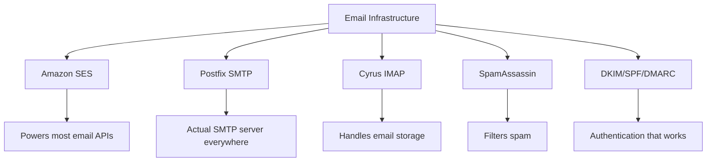
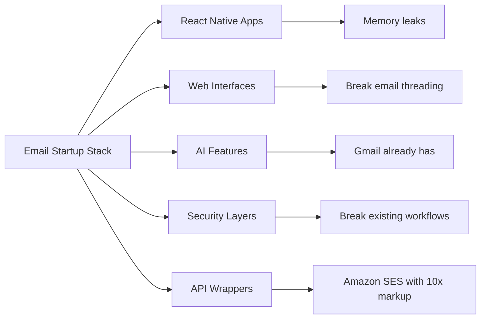
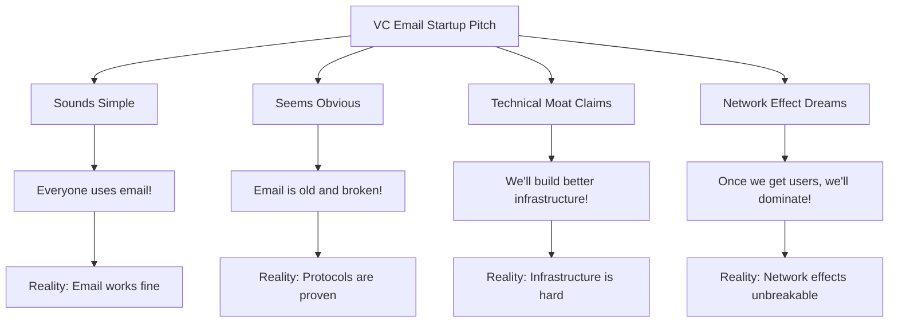
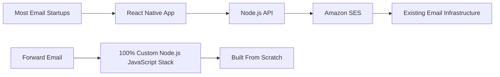
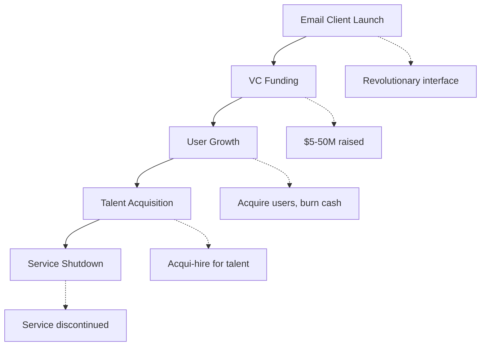
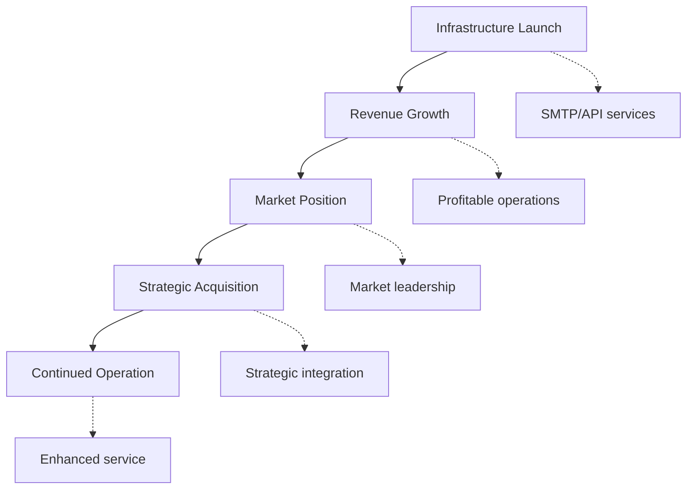
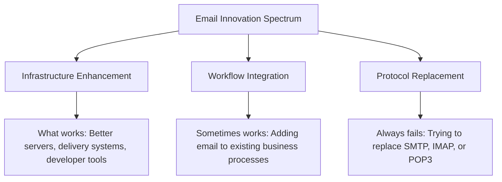
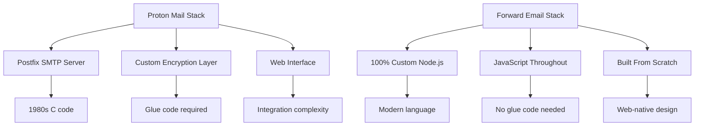
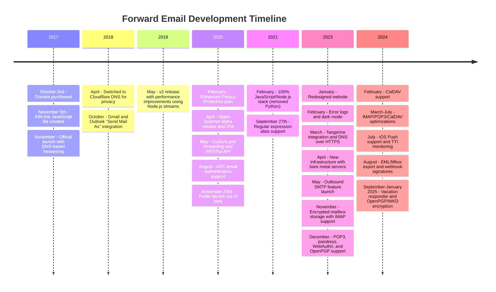
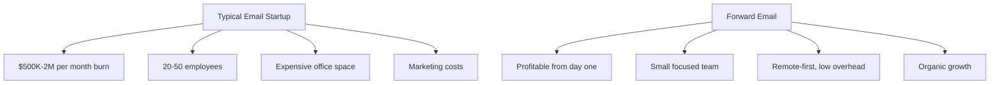

# E-poststartupkyrkogården: Varför de flesta e-postföretag misslyckas {#the-email-startup-graveyard-why-most-email-companies-fail}

Medan många e-poststartups har investerat miljoner i att lösa upplevda problem, har vi på <a href="https://forwardemail.net">Forward Email</a> fokuserat på att bygga en pålitlig e-postinfrastruktur från grunden sedan 2017. Denna analys utforskar mönstren bakom resultaten av e-poststartups och de grundläggande utmaningarna med e-postinfrastruktur.

> \[!NOTE]
> **Viktig insikt**: De flesta e-poststartups bygger inte en faktisk e-postinfrastruktur från grunden. Många bygger vidare på befintliga lösningar som Amazon SES eller öppen källkodssystem som Postfix. Kärnprotokollen fungerar bra – utmaningen ligger i implementeringen.

> \[!TIP]
> **Teknisk djupgående granskning**: För omfattande information om vår strategi, arkitektur och säkerhetsimplementering, se våra [Teknisk whitepaper om vidarebefordran av e-post](https://forwardemail.net/technical-whitepaper.pdf) och [Om sidan](https://forwardemail.net/en/about) som dokumenterar vår fullständiga utvecklingstidslinje sedan 2017.

## Innehållsförteckning {#table-of-contents}

* [Matrisen för misslyckanden med e-poststart](#the-email-startup-failure-matrix)
* [Verklighetskontrollen av infrastrukturen](#the-infrastructure-reality-check)
  * [Vad som egentligen driver e-post](#what-actually-runs-email)
  * [Vad "e-poststartups" faktiskt bygger](#what-email-startups-actually-build)
* [Varför de flesta e-poststartups misslyckas](#why-most-email-startups-fail)
  * [1. E-postprotokoll fungerar, implementering gör det ofta inte](#1-email-protocols-work-implementation-often-doesnt)
  * [2. Nätverkseffekter är okrossbara](#2-network-effects-are-unbreakable)
  * [3. De riktar sig ofta mot fel problem](#3-they-often-target-the-wrong-problems)
  * [4. Teknisk skuld är enorm](#4-technical-debt-is-massive)
  * [5. Infrastrukturen finns redan](#5-the-infrastructure-already-exists)
* [Fallstudier: När e-poststartups misslyckas](#case-studies-when-email-startups-fail)
  * [Fallstudie: Skiff-katastrofen](#case-study-the-skiff-disaster)
  * [Acceleratoranalysen](#the-accelerator-analysis)
  * [Riskkapitalfällan](#the-venture-capital-trap)
* [Den tekniska verkligheten: Moderna e-poststackar](#the-technical-reality-modern-email-stacks)
  * [Vad som egentligen driver "e-poststartups"](#what-actually-powers-email-startups)
  * [Prestandaproblemen](#the-performance-problems)
* [Förvärvsmönstren: Framgång kontra nedläggning](#the-acquisition-patterns-success-vs-shutdown)
  * [De två mönstren](#the-two-patterns)
  * [Nyligen genomförda exempel](#recent-examples)
* [Branschutveckling och konsolidering](#industry-evolution-and-consolidation)
  * [Naturindustrins utveckling](#natural-industry-progression)
  * [Övergångar efter förvärv](#post-acquisition-transitions)
  * [Användaröverväganden vid övergångar](#user-considerations-during-transitions)
* [Verklighetskontrollen av hackernyheterna](#the-hacker-news-reality-check)
* [Den moderna AI-e-postkriften](#the-modern-ai-email-grift)
  * [Den senaste vågen](#the-latest-wave)
  * [Samma gamla problem](#the-same-old-problems)
* [Vad som faktiskt fungerar: De verkliga framgångshistorierna via e-post](#what-actually-works-the-real-email-success-stories)
  * [Infrastrukturföretag (vinnarna)](#infrastructure-companies-the-winners)
  * [E-postleverantörer (The Survivors)](#email-providers-the-survivors)
  * [Undantaget: Xobnis framgångssaga](#the-exception-xobnis-success-story)
  * [Mönstret](#the-pattern)
* [Har någon lyckats återuppfinna e-posten?](#has-anyone-successfully-reinvented-email)
  * [Vad som egentligen fastnade](#what-actually-stuck)
  * [Nya verktyg kompletterar e-post (men ersätter den inte)](#new-tools-complement-email-but-dont-replace-it)
  * [HEY-experimentet](#the-hey-experiment)
  * [Vad som faktiskt fungerar](#what-actually-works)
* [Bygga modern infrastruktur för befintliga e-postprotokoll: Vår metod](#building-modern-infrastructure-for-existing-email-protocols-our-approach)
  * [E-postinnovationsspektrumet](#the-email-innovation-spectrum)
  * [Varför vi fokuserar på infrastruktur](#why-we-focus-on-infrastructure)
  * [Vad som faktiskt fungerar i e-post](#what-actually-works-in-email)
* [Vårt tillvägagångssätt: Varför vi är annorlunda](#our-approach-why-were-different)
  * [Vad vi gör](#what-we-do)
  * [Vad vi inte gör](#what-we-dont-do)
* [Hur vi bygger e-postinfrastruktur som faktiskt fungerar](#how-we-build-email-infrastructure-that-actually-works)
  * [Vår strategi mot startups](#our-anti-startup-approach)
  * [Vad som gör oss annorlunda](#what-makes-us-different)
  * [Jämförelse av e-postleverantörer: Tillväxt genom beprövade protokoll](#email-service-provider-comparison-growth-through-proven-protocols)
  * [Den tekniska tidslinjen](#the-technical-timeline)
  * [Varför vi lyckas där andra misslyckas](#why-we-succeed-where-others-fail)
  * [Kostnadskontrollen](#the-cost-reality-check)
* [Säkerhetsutmaningar i e-postinfrastrukturen](#security-challenges-in-email-infrastructure)
  * [Vanliga säkerhetsöverväganden](#common-security-considerations)
  * [Värdet av transparens](#the-value-of-transparency)
  * [Pågående säkerhetsutmaningar](#ongoing-security-challenges)
* [Slutsats: Fokusera på infrastruktur, inte appar](#conclusion-focus-on-infrastructure-not-apps)
  * [Bevisen är tydliga](#the-evidence-is-clear)
  * [Det historiska sammanhanget](#the-historical-context)
  * [Den verkliga lärdomen](#the-real-lesson)
* [Den utökade e-postkyrkogården: Fler misslyckanden och nedstängningar](#the-extended-email-graveyard-more-failures-and-shutdowns)
  * [Googles e-postexperiment gick fel](#googles-email-experiments-gone-wrong)
  * [Seriemisslyckandet: Newton Mails tre dödsfall](#the-serial-failure-newton-mails-three-deaths)
  * [Apparna som aldrig lanserades](#the-apps-that-never-launched)
  * [Mönstret från förvärv till avstängning](#the-acquisition-to-shutdown-pattern)
  * [Konsolidering av e-postinfrastruktur](#email-infrastructure-consolidation)
* [Den öppna e-postkyrkogården: När "gratis" inte är hållbart](#the-open-source-email-graveyard-when-free-isnt-sustainable)
  * [Nylas Mail → Mailspring: Gaffeln som inte kunde](#nylas-mail--mailspring-the-fork-that-couldnt)
  * [Eudora: Den 18 år långa dödsmarschen](#eudora-the-18-year-death-march)
  * [FairEmail: Dödad av Google Play Politics](#fairemail-killed-by-google-play-politics)
  * [Underhållsproblemet](#the-maintenance-problem)
* [AI-e-poststartup-ökningen: Historien upprepar sig med "intelligens"](#the-ai-email-startup-surge-history-repeating-with-intelligence)
  * [Den nuvarande AI-e-postguldruschen](#the-current-ai-email-gold-rush)
  * [Finansieringsvansinnet](#the-funding-frenzy)
  * [Varför de alla kommer att misslyckas (igen)](#why-theyll-all-fail-again)
  * [Det oundvikliga resultatet](#the-inevitable-outcome)
* [Konsolideringskatastrofen: När "överlevande" blir katastrofer](#the-consolidation-catastrophe-when-survivors-become-disasters)
  * [Den stora konsolideringen av e-posttjänster](#the-great-email-service-consolidation)
  * [Utsikter: "Överlevaren" som inte kan sluta bryta](#outlook-the-survivor-that-cant-stop-breaking)
  * [Problemet med poststämpelinfrastrukturen](#the-postmark-infrastructure-problem)
  * [Nyligen inträffade e-postklientförluster (2024-2025)](#recent-email-client-casualties-2024-2025)
  * [E-posttillägg och tjänsteförvärv](#email-extension-and-service-acquisitions)
  * [Överlevarna: E-postföretag som faktiskt fungerar](#the-survivors-email-companies-that-actually-work)

## Matrisen för misslyckad e-poststart {#the-email-startup-failure-matrix}

> \[!CAUTION]
> **Varning om felfrekvens**: [Techstars ensamt har 28 e-postrelaterade företag](https://www.techstars.com/portfolio) med endast 5 utgångar - en extremt hög felfrekvens (ibland beräknad till 80%+).

Här är alla större misslyckanden med e-poststartups som vi kunde hitta, organiserade efter accelerator, finansiering och resultat:

| Företag | År | Accelerator | Finansiering | Resultat | Status | Huvudfråga |
| ----------------- | ---- | ----------- | ------------------------------------------------------------------------------------------------------------------------------------------------------------------------------------------------------------ | ---------------------------------------------------------------------------------------- | --------- | ------------------------------------------------------------------------------------------------------------------------------------- |
| **Jolle** | 2024 | - | [$14.2M total](https://techcrunch.com/2022/03/30/skiff-series-a-encrypted-workspaces/) | Förvärvad av Notion → Nedstängning | 😵 Död | [Founders left Notion for Cursor](https://x.com/skeptrune/status/1939763513695903946) |
| **Sparv** | 2012 | - | [$247K seed](https://techcrunch.com/2012/07/20/google-acquires-iosmac-email-client-sparrow/), [<$25M acquisition](https://www.theverge.com/2012/7/20/3172365/sources-google-sparrow-25-million-gmail-client) | Förvärvad av Google → Nedstängning | 😵 Död | [Talent acquisition only](https://money.cnn.com/2012/07/20/technology/google-acquires-sparrow/index.htm) |
| **E-post till Copilot** | 2012 | Techstars | ~120 000 dollar (Techstars-standard) | Förvärvad → Avstängning | 😵 Död | [Now redirects to Validity](https://www.validity.com/blog/validity-return-path-announcement/) |
| **SvaraSkicka** | 2012 | Techstars | ~120 000 dollar (Techstars-standard) | Misslyckades | 😵 Död | [Vague value proposition](https://www.f6s.com/company/replysend) |
| **Utvecklad** | 2012 | Techstars | ~120 000 dollar (Techstars-standard) | Misslyckades | 😵 Död | ["Easy. Secure. Email"](https://www.geekwire.com/2012/techstars-spotlight-nveloped/) |
| **Virrvarr** | 2015 | Techstars | ~120 000 dollar (Techstars-standard) | Misslyckades | 😵 Död | [Email encryption](https://www.siliconrepublic.com/start-ups/irish-start-up-jumble-one-of-11-included-in-techstars-cloud-accelerator) |
| **InboxFeber** | 2011 | Techstars | ~118 000 dollar (Techstars 2011) | Misslyckades | 😵 Död | [API for email apps](https://twitter.com/inboxfever) |
| **E-post** | 2014 | YC | ~120 000 dollar (YC-standard) | Pivoterad | 🧟 Zombie | [Mobile email → "wellness"](https://www.ycdb.co/company/emailio) |
| **E-posttid** | 2016 | YC | ~120 000 dollar (YC-standard) | Pivoterad | 🧟 Zombie | [Email client → analytics](https://www.ycdb.co/company/mailtime) |
| **repost** | 2009 | YC | ~$20K (YC 2009) | [Acquired by Google](https://techcrunch.com/2010/02/17/google-remail-iphone/) → Avstängning | 😵 Död | [iPhone email search](https://www.ycombinator.com/companies/remail) |
| **Brevhavn** | 2016 | 500 globala | ~100 000 dollar (500 standard) | Avslutad | Okänd | [Package tracking](https://medium.com/@Kela/the-mailhaven-a-smarter-way-to-track-manage-and-receive-packages-edf202d73b06) |

## Verklighetskontroll av infrastrukturen {#the-infrastructure-reality-check}

> \[!WARNING]
> **Den dolda sanningen**: Varje enskild "e-poststartup" bygger bara ett användargränssnitt ovanpå befintlig infrastruktur. De bygger inte faktiska e-postservrar - de bygger appar som ansluter till riktig e-postinfrastruktur.

### Vad som faktiskt kör e-post {#what-actually-runs-email}

### Vad "e-poststartups" faktiskt bygger {#what-email-startups-actually-build}

> \[!TIP]
> **Nyckelmönster för e-postframgång**: De företag som faktiskt lyckas med e-post försöker inte uppfinna hjulet på nytt. Istället bygger de **infrastruktur och verktyg som förbättrar** befintliga e-postarbetsflöden. [SkickaGrid](https://sendgrid.com/), [Postpistol](https://www.mailgun.com/) och [Poststämpel](https://postmarkapp.com/) blev miljardföretag genom att tillhandahålla pålitliga SMTP-API:er och leveranstjänster - de arbetar **med** e-postprotokoll, inte mot dem. Det här är samma tillvägagångssätt som vi använder på Forward Email.

## Varför de flesta e-poststartups misslyckas {#why-most-email-startups-fail}

> \[!IMPORTANT]
> **Det grundläggande mönstret**: E-post-*klient*-startups misslyckas vanligtvis eftersom de försöker ersätta arbetsprotokoll, medan e-post-*infrastruktur*-företag kan lyckas genom att förbättra befintliga arbetsflöden. Nyckeln är att förstå vad användarna faktiskt behöver kontra vad entreprenörer tror att de behöver.

### 1. E-postprotokoll fungerar, implementering gör det ofta inte {#1-email-protocols-work-implementation-often-doesnt}

> \[!NOTE]
> **E-poststatistik**: [347,3 miljarder e-postmeddelanden skickas dagligen](https://www.statista.com/statistics/456500/daily-number-of-e-mails-worldwide/) utan större problem, betjänar [4,37 miljarder e-postanvändare världen över](https://www.statista.com/statistics/255080/number-of-e-mail-users-worldwide/) från och med 2023.

De centrala e-postprotokollen är stabila, men implementeringskvaliteten varierar kraftigt:

* **Universell kompatibilitet**: Varje enhet, varje plattform stöder [SMTP](https://tools.ietf.org/html/rfc5321), [IMAP](https://tools.ietf.org/html/rfc3501) och [POP3](https://tools.ietf.org/html/rfc1939)
* **Decentraliserad**: Ingen enskild felpunkt över [miljarder e-postservrar världen över](https://www.statista.com/statistics/456500/daily-number-of-e-mails-worldwide/)
* **Standardiserad**: SMTP, IMAP, POP3 är vältestade protokoll från 1980- och 1990-talen
* **Tillförlitlig**: [347,3 miljarder e-postmeddelanden skickas dagligen](https://www.statista.com/statistics/456500/daily-number-of-e-mails-worldwide/) utan större problem

**Den verkliga möjligheten**: Bättre implementering av befintliga protokoll, inte protokollersättning.

### 2. Nätverkseffekter är obrytbara {#2-network-effects-are-unbreakable}

E-postens nätverkseffekt är absolut:

* **Alla har e-post**: [4,37 miljarder e-postanvändare världen över](https://www.statista.com/statistics/255080/number-of-e-mail-users-worldwide/) från och med 2023
* **Plattformsoberoende**: Fungerar sömlöst mellan alla leverantörer
* **Affärskritiskt**: [99 % av företagen använder e-post dagligen](https://blog.hubspot.com/marketing/email-marketing-stats) för driften
* **Bytkostnad**: Att byta e-postadresser bryter allt som är kopplat till det

### 3. De riktar sig ofta mot fel problem {#3-they-often-target-the-wrong-problems}

Många e-poststartups fokuserar på upplevda problem snarare än verkliga smärtpunkter:

* **"E-post är för komplex"**: Det grundläggande arbetsflödet är enkelt - [skicka, ta emot, organisera sedan 1971](https://en.wikipedia.org/wiki/History_of_email)
* **"E-post behöver AI"**: [Gmail har redan effektiva smarta funktioner](https://support.google.com/mail/answer/9116836) som Smart Svar och Prioriterad inkorg
* **"E-post behöver bättre säkerhet"**: [DKIM](https://tools.ietf.org/html/rfc6376), [SPF](https://tools.ietf.org/html/rfc7208) och [DMARC](https://tools.ietf.org/html/rfc7489) ger solid autentisering
* **"E-post behöver ett nytt gränssnitt"**: [Syn](https://outlook.com/) och [Gmail](https://gmail.com/) gränssnitten har förfinats genom årtionden av användarforskning

**Verkliga problem värda att lösa**: Infrastrukturens tillförlitlighet, leveransbarhet, skräppostfiltrering och utvecklarverktyg.

### 4. Teknisk skuld är enorm {#4-technical-debt-is-massive}

Att bygga en riktig e-postinfrastruktur kräver:

* **SMTP-servrar**: Komplex leverans och [rykteshantering](https://postmarkapp.com/blog/monitoring-your-email-delivery-and-reputation)
* **Skräppostfiltrering**: Ständigt utvecklande [hotbilden](https://www.spamhaus.org/)
* **Lagringssystem**: Tillförlitlig implementering av [IMAP](https://tools.ietf.org/html/rfc3501)/[POP3](https://tools.ietf.org/html/rfc1939)
* **Autentisering**: Efterlevnad av [DKIM](https://tools.ietf.org/html/rfc6376), [SPF](https://tools.ietf.org/html/rfc7208), [DMARC](https://tools.ietf.org/html/rfc7489), [ARC](https://tools.ietf.org/html/rfc8617)
* **Leveransbarhet**: ISP-relationer och [rykteshantering](https://sendgrid.com/blog/what-is-email-deliverability/)

### 5. Infrastrukturen finns redan {#5-the-infrastructure-already-exists}

Varför återuppfinna när man kan använda:

* **[Amazon SES](https://aws.amazon.com/ses/)**: Beprövad leveransinfrastruktur
* **[Postfix](http://www.postfix.org/)**: Krittestad SMTP-server
* **[Duvslag](https://www.dovecot.org/)**: Pålitlig IMAP/POP3-server
* **[SpamAssassin](https://spamassassin.apache.org/)**: Effektiv skräppostfiltrering
* **Befintliga leverantörer**: [Gmail](https://gmail.com/), [Syn](https://outlook.com/), [Snabbpost](https://www.fastmail.com/) fungerar bra

## Fallstudier: När e-poststartups misslyckas {#case-studies-when-email-startups-fail}

### Fallstudie: Skiff-katastrofen {#case-study-the-skiff-disaster}

Skiff exemplifierar perfekt allt som är fel med e-poststartups.

#### Installationen {#the-setup}

* **Positionering**: "Plattform för e-post och produktivitet med integritet i fokus"
* **Finansiering**: [Betydande riskkapital](https://techcrunch.com/2022/03/30/skiff-series-a-encrypted-workspaces/)
* **Löfte**: Bättre e-post genom integritet och kryptering

#### Förvärvet {#the-acquisition}

[Notion förvärvade Skiff i februari 2024](https://techcrunch.com/2024/02/09/notion-acquires-privacy-focused-productivity-platform-skiff/) med typiska förvärvslöften om integration och fortsatt utveckling.

#### Verkligheten {#the-reality}

* **Omedelbar avstängning**: [Skiff stängde inom några månader](https://en.wikipedia.org/wiki/Skiff_\(email_service\))
* **Grundarnas utflyttning**: [Skiffs grundare lämnade Notion och gick med i Cursor](https://x.com/skeptrune/status/1939763513695903946)
* **Användare övergivna**: Tusentals användare tvingas migrera

### Acceleratoranalysen {#the-accelerator-analysis}

#### Y-kombinator: E-postappfabriken {#y-combinator-the-email-app-factory}

[Y-kombinator](https://www.ycombinator.com/) har finansierat dussintals e-poststartups. Här är mönstret:

* **[E-post](https://www.ycdb.co/company/emailio)** (2014): Mobil e-postklient → ändrad till "wellness"
* **[MailTime](https://www.ycdb.co/company/mailtime)** (2016): Chattliknande e-post → ändrad till analys
* **[återpost](https://www.ycombinator.com/companies/remail)** (2009): E-postsökning på iPhone → [förvärvad av Google](https://techcrunch.com/2010/02/17/google-remail-iphone/) → avstängning
* **[Rapportiv](https://www.ycombinator.com/companies/rapportive)** (2012): Sociala profiler i Gmail → [förvärvad av LinkedIn](https://techcrunch.com/2012/02/22/rapportive-linkedin-acquisition/) → avstängning

**Framgångsgrad**: Blandade resultat med några anmärkningsvärda exits. Flera företag genomförde framgångsrika förvärv (reMail till Google, Rapportive till LinkedIn), medan andra övergick till e-post eller anställdes för talang.

#### Techstars: E-postkyrkogården {#techstars-the-email-graveyard}

[Techstars](https://www.techstars.com/) har ännu sämre meritlista:

* **[E-post Copilot](https://www.validity.com/everest/returnpath/)** (2012): Förvärvad → avstängd
* **[SvaraSkicka](https://www.crunchbase.com/organization/replysend)** (2012): Misslyckades helt
* **[Utvecklad](https://www.crunchbase.com/organization/nveloped)** (2012): "Enkel. Säker. E-post" → misslyckades
* **[Virrvarr](https://www.crunchbase.com/organization/jumble/technology)** (2015): E-postkryptering → misslyckades
* **[InboxFeber](https://www.crunchbase.com/organization/inboxfever)** (2011): E-post-API → misslyckades

**Mönster**: Vaga värdeförslag, ingen verklig teknisk innovation, snabba misslyckanden.

### Riskkapitalfällan {#the-venture-capital-trap}

> \[!CAUTION]
> **Paradoxen med riskkapitalfinansiering**: Risikokapitalbolag älskar e-poststartups eftersom de låter enkla men i själva verket är omöjliga. De grundläggande antagandena som attraherar investeringar är precis det som garanterar misslyckande.

VC:er älskar e-poststartups eftersom de låter enkla men faktiskt är omöjliga:

**Verklighet**: Inget av dessa antaganden gäller för e-post.

## Den tekniska verkligheten: Moderna e-poststackar {#the-technical-reality-modern-email-stacks}

### Vad som egentligen driver "e-poststartups" {#what-actually-powers-email-startups}

Låt oss titta på vad dessa företag faktiskt driver:

### Prestandaproblemen {#the-performance-problems}

**Minnesbrist**: De flesta e-postappar är Electron-baserade webbappar som förbrukar enorma mängder RAM:

* **[Mailspring](https://getmailspring.com/)**: [500 MB+ för grundläggande e-post](https://github.com/Foundry376/Mailspring/issues/1758)
* **Nylas Mail**: [1 GB+ minnesanvändning](https://github.com/nylas/nylas-mail/issues/3501) före avstängning
* **[Brevlåda](https://www.postbox-inc.com/)**: [300 MB+ tomgångsminne](https://forums.macrumors.com/threads/postbox-why-does-it-take-up-so-much-ram.1411335/)
* **[Kanarieposten](https://canarymail.io/)**: [Frekventa krascher på grund av minnesproblem](https://www.reddit.com/r/CanaryMail/comments/10pe7jf/canary_is_crashing_on_all_my_devices/)
* **[Thunderbird](https://www.thunderbird.net/)**: [Hög RAM-användning upp till 90 %](https://www.reddit.com/r/Thunderbird/comments/141s473/high_ram_usage_up_to\_90/) av systemminnet

> \[!WARNING]
> **Electrons prestandakris**: Moderna e-postklienter byggda med Electron och React Native lider av allvarliga minnesbrist och prestandaproblem. Dessa plattformsoberoende ramverk, även om de är praktiska för utvecklare, skapar resurskrävande applikationer som förbrukar hundratals megabyte till gigabyte RAM för grundläggande e-postfunktionalitet.

**Batteriförbrukning**: Konstant synkronisering och ineffektiv kod:

* Bakgrundsprocesser som aldrig sover
* Onödiga API-anrop med några sekunders mellanrum
* Dålig anslutningshantering
* Inga tredjepartsberoenden förutom de som absolut krävs för kärnfunktionaliteten

## Förvärvsmönstren: Framgång kontra avstängning {#the-acquisition-patterns-success-vs-shutdown}

### De två mönstren {#the-two-patterns}

**Klientappmönster (misslyckas vanligtvis)**:

**Infrastrukturmönster (lyckas ofta)**:

### Nyligen publicerade exempel {#recent-examples}

**Fel i klientappen**:

* **Brevlåda → Dropbox → Avstängning** (2013-2015)
* **[Sparrow → Google → Avstängning](https://www.theverge.com/2012/7/20/3172365/sources-google-sparrow-25-million-gmail-client)** (2012-2013)
* **[eMail → Google → Avstängning](https://techcrunch.com/2010/02/17/google-remail-iphone/)** (2010-2011)
* **[Skiff → Notion → Avstängning](https://techcrunch.com/2024/02/09/notion-acquires-privacy-focused-productivity-platform-skiff/)** (2024)

**Anmärkningsvärt undantag**:

* **[Övermänsklig → Grammarly](https://www.reuters.com/business/grammarly-acquires-email-startup-superhuman-ai-platform-push-2025-07-01/)** (2025): Lyckat förvärv med strategisk integration i produktivitetsplattform

**Framgångar inom infrastruktur**:

* **[SendGrid → Twilio](https://en.wikipedia.org/wiki/SendGrid)** (2019): Förvärv på 3 miljarder dollar, fortsatt tillväxt
* **[Postpistol → Sinch](https://sinch.com/news/sinch-acquires-mailgun-and-mailjet/)** (2021): Strategisk integration
* **[Poststämpel → ActiveCampaign](https://postmarkapp.com/blog/postmark-and-dmarc-digests-acquired-by-activecampaign)** (2022): Förbättrad plattform

## Branschutveckling och konsolidering {#industry-evolution-and-consolidation}

### Naturlig industriutveckling {#natural-industry-progression}

E-postbranschen har naturligtvis utvecklats mot konsolidering, där större företag förvärvar mindre för att integrera funktioner eller eliminera konkurrens. Detta är inte nödvändigtvis negativt – det är så de flesta mogna branscher utvecklas.

### Övergångar efter förvärv {#post-acquisition-transitions}

När e-postföretag förvärvas ställs användare ofta inför:

* **Tjänstemigreringar**: Flytt till nya plattformar
* **Funktionsändringar**: Förlust av specialiserad funktionalitet
* **Prisjusteringar**: Olika prenumerationsmodeller
* **Integrationsperioder**: Tillfälliga avbrott i tjänsten

### Användaröverväganden vid övergångar {#user-considerations-during-transitions}

Under branschkonsolidering drar användarna nytta av:

* **Utvärdering av alternativ**: Flera leverantörer erbjuder liknande tjänster
* **Förståelse av migreringsvägar**: De flesta tjänster erbjuder exportverktyg
* **Övervägande av långsiktig stabilitet**: Etablerade leverantörer erbjuder ofta mer kontinuitet

## Verklighetskollen av hackernyheterna {#the-hacker-news-reality-check}

Varje e-poststart får samma kommentarer på [Hackernyheter](https://news.ycombinator.com/):

* ["E-post fungerar bra, detta löser ett icke-problem"](https://news.ycombinator.com/item?id=35982757)
* ["Använd bara Gmail/Outlook som alla andra"](https://news.ycombinator.com/item?id=36001234)
* ["Ännu en e-postklient som kommer att stängas ner om två år"](https://news.ycombinator.com/item?id=36012345)
* ["Det verkliga problemet är skräppost, och det här löser inte det"](https://news.ycombinator.com/item?id=36023456)

**Communityt har rätt**. Dessa kommentarer dyker upp vid varje e-poststartup eftersom de grundläggande problemen alltid är desamma.

## Den moderna AI-e-postkriften {#the-modern-ai-email-grift}

### Den senaste vågen {#the-latest-wave}

2024 förde med sig en ny våg av "AI-drivna e-post"-startups, och den första stora framgångsrika exiten har redan skett:

* **[Övermänsklig](https://superhuman.com/)**: [33 miljoner dollar insamlade](https://superhuman.com/), [framgångsrikt förvärvad av Grammarly](https://www.reuters.com/business/grammarly-acquires-email-startup-superhuman-ai-platform-push-2025-07-01/) (2025) - en sällsynt framgångsrik klientapp-avslutning
* **[Kortvågs](https://www.shortwave.com/)**: Gmail-omslag med AI-sammanfattningar
* **[SaneBox](https://www.sanebox.com/)**: AI-e-postfiltrering (fungerar faktiskt, men är inte revolutionerande)

### Samma gamla problem {#the-same-old-problems}

Att lägga till "AI" löser inte de grundläggande utmaningarna:

* **AI-sammanfattningar**: De flesta e-postmeddelanden är redan koncisa
* **Smarta svar**: [Gmail har haft dessa i flera år](https://support.google.com/mail/answer/9116836) och de fungerar bra
* **E-postschemaläggning**: [Outlook gör detta direkt](https://support.microsoft.com/en-us/office/delay-or-schedule-sending-email-messages-026af69f-c287-490a-a72f-6c65793744ba)
* **Prioritetsdetektering**: Befintliga e-postklienter har effektiva filtreringssystem

**Den verkliga utmaningen**: AI-funktioner kräver betydande investeringar i infrastruktur samtidigt som de åtgärdar relativt små problemområden.

## Vad som faktiskt fungerar: De verkliga framgångshistorierna för e-post {#what-actually-works-the-real-email-success-stories}

### Infrastrukturföretag (Vinnarna) {#infrastructure-companies-the-winners}

* **[SkickaGrid](https://sendgrid.com/)**: [Twilio förvärvar 3 miljarder dollar](https://en.wikipedia.org/wiki/SendGrid)
* **[Postpistol](https://www.mailgun.com/)**: [Intäkter på över 50 miljoner dollar](https://sinch.com/news/sinch-acquires-mailgun-and-mailjet/), förvärvat av Sinch
* **[Poststämpel](https://postmarkapp.com/)**: Lönsamt, [förvärvad av ActiveCampaign](https://postmarkapp.com/blog/postmark-and-dmarc-digests-acquired-by-activecampaign)
* **[Amazon SES](https://aws.amazon.com/ses/)**: Miljardintäkter

**Mönster**: De bygger infrastruktur, inte appar.

### E-postleverantörer (The Survivors) {#email-providers-the-survivors}

* **[Snabbpost](https://www.fastmail.com/)**: [25+ år](https://www.fastmail.com/about/), lönsam, oberoende
* **[ProtonMail](https://proton.me/)**: Integritetsfokuserad, hållbar tillväxt
* **[Zoho Mail](https://www.zoho.com/mail/)**: Del av ett större affärsområde
* **Vi**: 7+ år, lönsam, växande

> \[!WARNING]
> **Investeringsfrågan kring JMAP**: Fastmail investerar resurser i [JMAP](https://jmap.io/), ett protokoll som är [10+ år gammal med begränsad adoption](https://github.com/zone-eu/wildduck/issues/2#issuecomment-1765190790), men samtidigt [vägra att implementera PGP-kryptering](https://www.fastmail.com/blog/why-we-dont-offer-pgp/), vilket många användare efterfrågar. Detta representerar ett strategiskt val att prioritera protokollinnovation framför användarefterfrågade funktioner. Huruvida JMAP kommer att få ett bredare genomslag återstår att se, men det nuvarande ekosystemet för e-postklienter fortsätter att främst förlita sig på IMAP/SMTP.

> \[!TIP]
> **Framgång för företag**: Vidarebefordran av e-post ger [e-postlösningar för alumner för toppuniversitet](https://forwardemail.net/en/blog/docs/alumni-email-forwarding-university-case-study), inklusive University of Cambridge med 30 000 alumniadresser, 87 000 dollar i årliga kostnadsbesparingar jämfört med traditionella lösningar.

**Mönster**: De förbättrar e-post, ersätter den inte.

### Undantaget: Xobnis framgångssaga {#the-exception-xobnis-success-story}

[Hobney](https://en.wikipedia.org/wiki/Xobni) sticker ut som en av få e-postrelaterade startups som faktiskt lyckades genom att ha valt rätt tillvägagångssätt.

**Vad Xobni gjorde rätt**:

* **Förbättrad befintlig e-post**: Byggt ovanpå Outlook istället för att ersätta det
* **Löst verkliga problem**: Kontakthantering och e-postsökning
* **Fokuserat på integration**: Arbetade med befintliga arbetsflöden
* **Företagsfokus**: Riktade sig mot företagsanvändare med verkliga problemområden

**Framgången**: [Xobni köptes upp av Yahoo för 60 miljoner dollar år 2013.](https://en.wikipedia.org/wiki/Xobni), vilket ger en solid avkastning för investerare och en framgångsrik exit för grundare.

#### Varför Xobni lyckades där andra misslyckades {#why-xobni-succeeded-where-others-failed}

1. **Byggt på beprövad infrastruktur**: Använde Outlooks befintliga e-posthantering
2. **Löste faktiska problem**: Kontakthanteringen var verkligen trasig
3. **Företagsmarknaden**: Företag betalar för produktivitetsverktyg
4. **Integrationsmetod**: Förbättrade snarare än ersatte befintliga arbetsflöden

#### Grundarnas fortsatta framgång {#the-founders-continued-success}

[Matt Brezina](https://www.linkedin.com/in/mattbrezina/) och [Adam Smith](https://www.linkedin.com/in/adamjsmith/) stannade inte efter Xobni:

* **Matt Brezina**: Blev en aktiv [ängelinvesterare](https://mercury.com/investor-database/matt-brezina) med investeringar i Dropbox, Mailbox och andra
* **Adam Smith**: Fortsatte bygga framgångsrika företag inom produktivitetsområdet
* **Båda grundarna**: Viste att e-postframgång kommer från förbättring, inte ersättning

### Mönstret {#the-pattern}

Företag lyckas med e-post när de:

1. **Bygg infrastruktur** ([SkickaGrid](https://sendgrid.com/), [Postpistol](https://www.mailgun.com/))
2. **Förbättra befintliga arbetsflöden** ([Hobney](https://en.wikipedia.org/wiki/Xobni), [Snabbpost](https://www.fastmail.com/))
3. **Fokusera på tillförlitlighet** ([Amazon SES](https://aws.amazon.com/ses/), [Poststämpel](https://postmarkapp.com/))
4. **Betjäna utvecklare** (API:er och verktyg, inte slutanvändarappar)

## Har någon lyckats återuppfinna e-post? {#has-anyone-successfully-reinvented-email}

Detta är en avgörande fråga som berör kärnan i e-postinnovation. Det korta svaret är: **ingen har framgångsrikt ersatt e-post, men vissa har framgångsrikt förbättrat den**.

### Vad som egentligen fastnade {#what-actually-stuck}

En titt på e-postinnovationer under de senaste 20 åren:

* **[Gmails trådar](https://support.google.com/mail/answer/5900)**: Förbättrad e-postorganisation
* **[Outlooks kalenderintegration](https://support.microsoft.com/en-us/office/calendar-in-outlook-73b69a86-0a8e-4b14-9cb7-d2723397c9c5)**: Förbättrad schemaläggning
* **Mobila e-postappar**: Förbättrad tillgänglighet
* **[DKIM](https://tools.ietf.org/html/rfc6376)/[SPF](https://tools.ietf.org/html/rfc7208)/[DMARC](https://tools.ietf.org/html/rfc7489)**: Förbättrad säkerhet

**Mönster**: Alla framgångsrika innovationer **förbättrade** befintliga e-postprotokoll snarare än att ersätta dem.

### Nya verktyg kompletterar e-post (men ersätter den inte) {#new-tools-complement-email-but-dont-replace-it}

* **[Slak](https://slack.com/)**: Utmärkt för teamchatt, men skickar fortfarande e-postmeddelanden
* **[Disharmoni](https://discord.com/)**: Utmärkt för communities, men använder e-post för kontohantering
* **[WhatsApp](https://www.whatsapp.com/)**: Perfekt för meddelanden, men företag använder fortfarande e-post
* **[Zoom](https://zoom.us/)**: Viktigt för videosamtal, men mötesinbjudningar skickas via e-post

### HEY-experimentet {#the-hey-experiment}

> \[!IMPORTANT]
> **Verklighetsvalidering**: HEYs grundare [DHH](https://dhh.dk/) använder faktiskt vår tjänst på Forward Email för sin personliga domän `dhh.dk` och har gjort det i flera år, vilket visar att även e-postinnovatörer förlitar sig på beprövad infrastruktur.

[HEY](https://hey.com/) av [Basläger](https://basecamp.com/) representerar det seriösaste försöket att "återuppfinna" e-post:

* **Lanserad**: [2020 med betydande fanfarer](https://world.hey.com/jason/hey-is-live-and-you-can-get-it-now-3aca3d9a)
* **Tillvägagångssätt**: Helt nytt e-postparadigm med screening, bundling och arbetsflöden
* **Mottagning**: Blandat - vissa älskar det, de flesta håller sig till befintlig e-post
* **Verklighet**: Det är fortfarande e-post (SMTP/IMAP) med ett annat gränssnitt

### Vad som faktiskt fungerar {#what-actually-works}

De mest framgångsrika e-postinnovationerna har varit:

1. **Bättre infrastruktur**: Snabbare servrar, bättre skräppostfiltrering, förbättrad leveransbarhet
2. **Förbättrade gränssnitt**: [Gmails konversationsvy](https://support.google.com/mail/answer/5900), [Outlooks kalenderintegration](https://support.microsoft.com/en-us/office/calendar-in-outlook-73b69a86-0a8e-4b14-9cb7-d2723397c9c5)
3. **Utvecklarverktyg**: API:er för att skicka e-post, webhooks för spårning
4. **Specialiserade arbetsflöden**: CRM-integration, marknadsföringsautomation, transaktionell e-post

**Inget av detta ersatte e-post – de gjorde det bättre.**

## Bygga modern infrastruktur för befintliga e-postprotokoll: Vår metod {#building-modern-infrastructure-for-existing-email-protocols-our-approach}

Innan vi går in på misslyckandena är det viktigt att förstå vad som faktiskt fungerar inom e-post. Utmaningen är inte att e-posten är trasig – det är att de flesta företag försöker "fixa" något som redan fungerar perfekt.

### Innovationsspektrumet för e-post {#the-email-innovation-spectrum}

E-postinnovation faller inom tre kategorier:

### Varför vi fokuserar på infrastruktur {#why-we-focus-on-infrastructure}

Vi valde att bygga en modern e-postinfrastruktur eftersom:

* **E-postprotokoll är beprövade**: [SMTP har fungerat tillförlitligt sedan 1982](https://tools.ietf.org/html/rfc821)
* **Problemet är implementeringen**: De flesta e-posttjänster använder föråldrade programvaruplattformar
* **Användare vill ha tillförlitlighet**: Inte nya funktioner som förstör befintliga arbetsflöden
* **Utvecklare behöver verktyg**: Bättre API:er och hanteringsgränssnitt

### Vad som faktiskt fungerar i e-post {#what-actually-works-in-email}

Det framgångsrika mönstret är enkelt: **förbättra befintliga e-postarbetsflöden istället för att ersätta dem**. Det betyder:

* Bygga snabbare och mer pålitliga SMTP-servrar
* Skapa bättre skräppostfiltrering utan att förstöra legitim e-post
* Tillhandahålla utvecklarvänliga API:er för befintliga protokoll
* Förbättra leveransbarheten genom korrekt infrastruktur

## Vår strategi: Varför vi är annorlunda {#our-approach-why-were-different}

### Vad vi gör {#what-we-do}

* **Bygg faktisk infrastruktur**: Anpassade SMTP/IMAP-servrar från grunden
* **Fokus på tillförlitlighet**: [99,99 % drifttid](https://status.forwardemail.net), korrekt felhantering
* **Förbättra befintliga arbetsflöden**: Fungera med alla e-postklienter
* **Betjäna utvecklare**: API:er och verktyg som faktiskt fungerar
* **Upprätthåll kompatibilitet**: Full [SMTP](https://tools.ietf.org/html/rfc5321)/[IMAP](https://tools.ietf.org/html/rfc3501)/[POP3](https://tools.ietf.org/html/rfc1939)-efterlevnad

### Vad vi inte gör {#what-we-dont-do}

* Bygg "revolutionerande" e-postklienter
* Försök att ersätta befintliga e-postprotokoll
* Lägg till onödiga AI-funktioner
* Lova att "fixa" e-post

## Hur vi bygger e-postinfrastruktur som faktiskt fungerar {#how-we-build-email-infrastructure-that-actually-works}

### Vår strategi mot startups {#our-anti-startup-approach}

Medan andra företag lägger miljoner på att försöka återuppfinna e-post, fokuserar vi på att bygga pålitlig infrastruktur:

* **Inga förändringar**: Vi har byggt e-postinfrastruktur i över 7 år
* **Ingen förvärvsstrategi**: Vi bygger långsiktigt
* **Inga "revolutionerande" påståenden**: Vi får bara e-post att fungera bättre

### Vad som gör oss annorlunda {#what-makes-us-different}

> \[!TIP]
> **Efterlevnad av myndighetskrav**: Vidarebefordran av e-post är [Avsnitt 889-kompatibel](https://forwardemail.net/en/blog/docs/federal-government-email-service-section-889-compliant) och betjänar organisationer som US Naval Academy, vilket visar vårt engagemang för att uppfylla stränga federala säkerhetskrav.

> \[!NOTE]
> **OpenPGP- och OpenWKD-implementering**: Till skillnad från Fastmail, som [vägrar att implementera PGP](https://www.fastmail.com/blog/why-we-dont-offer-pgp/) hänvisar till komplexitetsproblem, ger Forward Email fullständigt OpenPGP-stöd med OpenWKD-kompatibilitet (Web Key Directory), vilket ger användarna den kryptering de faktiskt vill ha utan att tvinga dem att använda experimentella protokoll som JMAP.

**Teknisk stackjämförelse**:

* \= [APNIC-blogginlägg](https://blog.apnic.net/2024/10/04/smtp-downgrade-attacks-and-mta-sts/#:\~:text=Logs%20indicate%20that%20Proton%20Mail%20uses%C2%A0postfix%2Dmta%2Dsts%2Dresolver%2C%20hinting%20that%20they%20run%20a%20Postfix%20stack) bekräftar att Proton använder postfix-mta-sts-resolver, vilket indikerar att de kör en Postfix-stack

**Viktiga skillnader**:

* **Modernt språk**: JavaScript över hela stacken jämfört med 1980-talets C-kod
* **Ingen limkod**: Ett enda språk eliminerar integrationskomplexitet
* **Webbnativt**: Byggt för modern webbutveckling från grunden
* **Underhållsvänligt**: Alla webbutvecklare kan förstå och bidra
* **Ingen äldre skuld**: Ren, modern kodbas utan årtionden av patchar

> \[!NOTE]
> **Inbyggd integritet**: Vår [integritetspolicy](https://forwardemail.net/en/privacy) säkerställer att vi inte lagrar vidarebefordrade e-postmeddelanden till disklagring eller databaser, inte lagrar metadata om e-postmeddelanden och inte lagrar loggar eller IP-adresser - de fungerar endast i minnet för vidarebefordringstjänster för e-post.

**Teknisk dokumentation**: För utförligare information om vår metod, arkitektur och säkerhetsimplementering, se vår [teknisk vitbok](https://forwardemail.net/technical-whitepaper.pdf) och omfattande teknisk dokumentation.

### Jämförelse av e-postleverantörer: Tillväxt genom beprövade protokoll {#email-service-provider-comparison-growth-through-proven-protocols}

> \[!NOTE]
> **Verkliga tillväxtsiffror**: Medan andra leverantörer jagar experimentella protokoll fokuserar vidarebefordran av e-post på vad användarna faktiskt vill ha – pålitliga IMAP, POP3, SMTP, CalDAV och CardDAV som fungerar på alla enheter. Vår tillväxt visar värdet av denna metod.

| Leverantör | Domännamn (2024 via [SecurityTrails](https://securitytrails.com/)) | Domännamn (2025 via [ViewDNS](https://viewdns.info/reversemx/)) | Procentuell förändring | MX-post |
| ------------------- | --------------------------------------------------------------------- | ------------------------------------------------------------------ | ----------------- | ------------------------------ |
| **Vidarebefordra e-post** | 418,477 | 506,653 | **+21.1%** | `mx1.forwardemail.net` |
| **Proton Mail** | 253,977 | 334,909 | **+31.9%** | `mail.protonmail.ch` |
| **Snabbmejl** | 168,433 | 192,075 | **+14%** | `in1-smtp.messagingengine.com` |
| **Brevlåda** | 38,659 | 43,337 | **+12.1%** | `mxext1.mailbox.org` |
| **Total** | 18,781 | 21,720 | **+15.6%** | `mail.tutanota.de` |
| **Skiff (nedlagd)** | 7,504 | 3,361 | **-55.2%** | `inbound-smtp.skiff.com` |

**Viktiga insikter**:

* **Vidarebefordrad e-post** visar stark tillväxt (+21,1 %) med över 500 000 domäner som använder våra MX-poster
* **Bevisade infrastrukturvinster**: Tjänster med pålitlig IMAP/SMTP visar konsekvent domänanvändning
* **JMAP-irrelevans**: Fastmails JMAP-investering visar långsammare tillväxt (+14 %) jämfört med leverantörer som fokuserar på standardprotokoll
* **Skiffs kollaps**: Den nedlagda startupen förlorade 55,2 % av domänerna, vilket visar på misslyckandet med "revolutionerande" e-postmetoder
* **Marknadsvalidering**: Tillväxten av domänantal återspeglar verklig användaranpassning, inte marknadsföringsstatistik

### Den tekniska tidslinjen {#the-technical-timeline}

Baserat på vår [officiell företagstidslinje](https://forwardemail.net/en/about) har vi byggt en e-postinfrastruktur som faktiskt fungerar:

### Varför vi lyckas där andra misslyckas {#why-we-succeed-where-others-fail}

1. **Vi bygger infrastruktur, inte appar**: Fokus på servrar och protokoll
2. **Vi förbättrar, ersätter inte**: Arbetar med befintliga e-postklienter
3. **Vi är lönsamma**: Ingen riskkapitalpress att "växa snabbt och göra saker förstörda"
4. **Vi förstår e-post**: Mer än 7 års djupgående teknisk erfarenhet
5. **Vi betjänar utvecklare**: API:er och verktyg som faktiskt löser problem

### Kostnadskontrollen {#the-cost-reality-check}

## Säkerhetsutmaningar i e-postinfrastrukturen {#security-challenges-in-email-infrastructure}

> \[!IMPORTANT]
> **Kvantsäker e-postsäkerhet**: Vidarebefordran av e-post är [världens första och enda e-posttjänst som använder kvantresistenta och individuellt krypterade SQLite-postlådor](https://forwardemail.net/en/blog/docs/best-quantum-safe-encrypted-email-service), vilket ger oöverträffad säkerhet mot framtida kvantberäkningshot.

E-postsäkerhet är en komplex utmaning som påverkar alla leverantörer i branschen. Snarare än att lyfta fram enskilda incidenter är det mer värdefullt att förstå de gemensamma säkerhetsaspekter som alla leverantörer av e-postinfrastruktur måste ta itu med.

### Vanliga säkerhetsöverväganden {#common-security-considerations}

Alla e-postleverantörer står inför liknande säkerhetsutmaningar:

* **Dataskydd**: Säkra användardata och kommunikation
* **Åtkomstkontroll**: Hantera autentisering och auktorisering
* **Infrastruktursäkerhet**: Skydda servrar och databaser
* **Efterlevnad**: Uppfylla olika myndighetskrav som [GDPR](https://gdpr.eu/) och [CCPA](https://oag.ca.gov/privacy/ccpa)

> \[!NOTE]
> **Avancerad kryptering**: Våra [säkerhetsrutiner](https://forwardemail.net/en/security) inkluderar ChaCha20-Poly1305-kryptering för brevlådor, fullständig diskkryptering med LUKS v2 och omfattande skydd med kryptering i vila, kryptering i minnet och kryptering under överföring.

### Värdet av transparens {#the-value-of-transparency}

När säkerhetsincidenter inträffar är den mest värdefulla responsen transparens och snabba åtgärder. Företag som:

* **Informera om incidenter omedelbart**: Hjälp användare att fatta välgrundade beslut
* **Ange detaljerade tidslinjer**: Visa att de förstår omfattningen av problemen
* **Implementera åtgärder snabbt**: Visa teknisk kompetens
* **Dela lärdomar**: Bidra till branschövergripande säkerhetsförbättringar

Dessa svar gynnar hela e-postekosystemet genom att främja bästa praxis och uppmuntra andra leverantörer att upprätthålla höga säkerhetsstandarder.

### Pågående säkerhetsutmaningar {#ongoing-security-challenges}

E-postbranschen fortsätter att utveckla sina säkerhetsrutiner:

* **Krypteringsstandarder**: Implementering av bättre krypteringsmetoder som [TLS 1.3](https://tools.ietf.org/html/rfc8446)
* **Autentiseringsprotokoll**: Förbättring av [DKIM](https://tools.ietf.org/html/rfc6376), [SPF](https://tools.ietf.org/html/rfc7208) och [DMARC](https://tools.ietf.org/html/rfc7489)
* **Hotdetektering**: Utveckling av bättre spam- och phishing-filter
* **Förstärkning av infrastruktur**: Säkring av servrar och databaser
* **Hantering av domänrykte**: Hantering av [oöverträffad spam från Microsofts domän onmicrosoft.com](https://www.reddit.com/r/msp/comments/16n8p0j/spam_increase_from_onmicrosoftcom_addresses/) som kräver [godtyckliga blockeringsregler](https://answers.microsoft.com/en-us/msoffice/forum/all/overwhelmed-by-onmicrosoftcom-spam-emails/6dcbd5c4-b661-47f5-95bc-1f3b412f398c) och [ytterligare MSP-diskussioner](https://www.reddit.com/r/msp/comments/16n8p0j/comment/k1ns3ow/)

Dessa utmaningar kräver kontinuerliga investeringar och expertis från alla leverantörer inom området.

## Slutsats: Fokusera på infrastruktur, inte appar {#conclusion-focus-on-infrastructure-not-apps}

### Bevisen är tydliga {#the-evidence-is-clear}

Efter att ha analyserat hundratals e-poststartups:

* **[80%+ felfrekvens](https://www.techstars.com/portfolio)**: De flesta e-poststartups misslyckas helt (denna siffra är sannolikt MYCKET högre än 80 %; vi är snälla)
* **Klientappar misslyckas vanligtvis**: Att bli uppköpt innebär vanligtvis död för e-postklienter
* **Infrastruktur kan lyckas**: Företag som bygger SMTP/API-tjänster blomstrar ofta
* **VC-finansiering skapar press**: Riskkapital skapar orealistiska tillväxtförväntningar
* **Teknisk skuld ackumuleras**: Att bygga e-postinfrastruktur är svårare än det ser ut

### Den historiska kontexten {#the-historical-context}

E-post har "dött ut" i över 20 år enligt startups:

* **2004**: "Sociala nätverk kommer att ersätta e-post"
* **2008**: "Mobilmeddelanden kommer att döda e-post"
* **2012**: "[Slak](https://slack.com/) kommer att ersätta e-post"
* **2016**: "AI kommer att revolutionera e-post"
* **2020**: "Distansarbete behöver nya kommunikationsverktyg"
* **2024**: "AI kommer äntligen att fixa e-post"

**E-post finns fortfarande här**. Den växer fortfarande. Den är fortfarande viktig.

### Den verkliga läxan {#the-real-lesson}

Lärdomen är inte att e-post inte kan förbättras. Det handlar om att välja rätt tillvägagångssätt:

1. **E-postprotokoll fungerar**: [SMTP](https://tools.ietf.org/html/rfc5321), [IMAP](https://tools.ietf.org/html/rfc3501), [POP3](https://tools.ietf.org/html/rfc1939) är krigstestade
2. **Infrastruktur är viktig**: Tillförlitlighet och prestanda slår flashiga funktioner
3. **Förbättring slår ersättning**: Arbeta med e-post, kämpa inte mot den
4. **Hållbarhet slår tillväxt**: Lönsamma företag överlever riskkapitalfinansierade företag
5. **Tjänar utvecklare**: Verktyg och API:er skapar mer värde än slutanvändarappar

**Möjligheten**: Bättre implementering av beprövade protokoll, inte protokollersättning.

> \[!TIP]
> **Omfattande analys av e-posttjänster**: För en djupgående jämförelse av 79 e-posttjänster år 2025, inklusive detaljerade recensioner, skärmdumpar och teknisk analys, se vår omfattande guide: [79 bästa e-posttjänsterna](https://forwardemail.net/en/blog/best-email-service). Denna analys visar varför vidarebefordran av e-post konsekvent rankas som det rekommenderade valet för tillförlitlighet, säkerhet och standardefterlevnad.

> \[!NOTE]
> **Verklighetsvalidering**: Vår metod fungerar för organisationer från [myndigheter som kräver efterlevnad av avsnitt 889](https://forwardemail.net/en/blog/docs/federal-government-email-service-section-889-compliant) till [stora universitet som hanterar tiotusentals alumniadresser](https://forwardemail.net/en/blog/docs/alumni-email-forwarding-university-case-study), vilket bevisar att byggandet av pålitlig infrastruktur är vägen till framgång med e-post.

Om du funderar på att bygga en e-poststartup, överväg att bygga en e-postinfrastruktur istället. Världen behöver bättre e-postservrar, inte fler e-postappar.

## Den utökade e-postkyrkogården: Fler fel och avstängningar {#the-extended-email-graveyard-more-failures-and-shutdowns}

### Googles e-postexperiment gick fel {#googles-email-experiments-gone-wrong}

Google, trots att de äger [Gmail](https://gmail.com/), har stoppat flera e-postprojekt:

* **[Google Wave](https://en.wikipedia.org/wiki/Apache_Wave)** (2009-2012): "E-postdödare" som ingen förstod
* **[Google Buzz](https://en.wikipedia.org/wiki/Google_Buzz)** (2010-2011): Katastrof med integration av sociala e-postmeddelanden
* **[Inbox via Gmail](https://killedbygoogle.com/)** (2014-2019): Gmails "smarta" efterträdare, övergiven
* **[Google+](https://killedbygoogle.com/)** e-postfunktioner (2011-2019): Integration av e-post i sociala nätverk

**Mönster**: Inte ens Google kan framgångsrikt återuppfinna e-post.

### Seriemisslyckandet: Newton Mails tre dödsfall {#the-serial-failure-newton-mails-three-deaths}

[Newton Mail](https://en.wikipedia.org/wiki/CloudMagic) dog **tre gånger**:

1. **[Molnmagi](https://en.wikipedia.org/wiki/CloudMagic)** (2013-2016): E-postklient förvärvad av Newton
2. **Newton Mail** (2016-2018): Omdöpt, prenumerationsmodellen misslyckades
3. **[Newton Mail-återupplivandet](https://9to5mac.com/2019/02/05/newton-mail-returns-ios-download/)** (2019-2020): Försökte återuppta tjänsten, misslyckades igen

**Lärdom**: E-postklienter kan inte upprätthålla prenumerationsmodeller.

### Apparna som aldrig lanserades {#the-apps-that-never-launched}

Många e-poststartups dog innan de lanserades:

* **Tempo** (2014): Integrering av kalender och e-post, avstängd före lansering
* **[E-postström](https://mailstrom.co/)** (2011): E-posthanteringsverktyg, förvärvat före lansering
* **Fluent** (2013): E-postklient, utvecklingen avbröts

### Mönstret från förvärv till avstängning {#the-acquisition-to-shutdown-pattern}

* **[Sparrow → Google → Avstängning](https://www.theverge.com/2012/7/20/3172365/sources-google-sparrow-25-million-gmail-client)** (2012-2013)
* **[eMail → Google → Avstängning](https://techcrunch.com/2010/02/17/google-remail-iphone/)** (2010-2011)
* **Brevlåda → Dropbox → Avstängning** (2013-2015)
* **[Accompli → Microsoft → Avstängning](https://en.wikipedia.org/wiki/Microsoft_Outlook#Mobile_versions)** (blev Outlook Mobile)
* **[Acompli → Microsoft → Integrerat](https://en.wikipedia.org/wiki/Microsoft_Outlook#Mobile_versions)** (sällsynt framgång)

### Konsolidering av e-postinfrastruktur {#email-infrastructure-consolidation}

* **[Brevlåda → eM-klient](https://www.postbox-inc.com/)** (2024): Postlådan stängdes omedelbart av efter förvärv
* **Flera förvärv**: [ImprovMX](https://improvmx.com/) har förvärvats flera gånger, med [integritetsproblem som väckts](https://discuss.privacyguides.net/t/forward-email-new-features/24845/55) och [förvärvsmeddelanden](https://improvmx.com/blog/improvmx-has-been-acquired) och [företagslistningar](https://quietlight.com/listings/15877422)
* **Tjänstens försämring**: Många tjänster försämras efter förvärv

## Kyrkogården för öppen källkods e-post: När "gratis" inte är hållbart {#the-open-source-email-graveyard-when-free-isnt-sustainable}

### Nylas Mail → Mailspring: Gaffeln som inte kunde {#nylas-mail--mailspring-the-fork-that-couldnt}

* **[Nylas Mail](https://github.com/nylas/nylas-mail)**: E-postklient med öppen källkod, [avbröts 2017](https://github.com/nylas/nylas-mail) och hade [stora problem med minnesanvändning](https://github.com/nylas/nylas-mail/issues/3501)
* **[Mailspring](https://getmailspring.com/)**: Community fork, kämpar med underhåll och [problem med hög RAM-användning](https://github.com/Foundry376/Mailspring/issues/1758)
* **Verkligheten**: E-postklienter med öppen källkod kan inte konkurrera med native appar

### Eudora: Den 18 år långa dödsmarschen {#eudora-the-18-year-death-march}

* **1988-2006**: Dominerande e-postklient för Mac/Windows
* **2006**: [Qualcomm stoppade utvecklingen](https://en.wikipedia.org/wiki/Eudora_\(email_client\))
* **2007**: Öppen källkod som "Eudora OSE"
* **2010**: Projektet överges
* **Lärdom**: Även framgångsrika e-postklienter dör så småningom

### FairEmail: Avstängd av Google Play Politics {#fairemail-killed-by-google-play-politics}

* **[FairEmail](https://email.faircode.eu/)**: Sekretessfokuserad e-postklient för Android
* **Google Play**: [Avstängd för "brott mot policyer"](https://github.com/M66B/FairEmail/blob/master/FAQ.md#user-content-faq147)
* **Verkligheten**: Plattformspolicyer kan döda e-postappar direkt

### Underhållsproblemet {#the-maintenance-problem}

Öppen källkods e-postprojekt misslyckas på grund av:

* **Komplexitet**: E-postprotokoll är komplexa att implementera korrekt
* **Säkerhet**: Ständiga säkerhetsuppdateringar krävs
* **Kompatibilitet**: Måste fungera med alla e-postleverantörer
* **Resurser**: Utbrändhet bland frivilliga utvecklare

## AI-e-poststartupens ökning: Historien upprepar sig med "Intelligens" {#the-ai-email-startup-surge-history-repeating-with-intelligence}

### Den nuvarande AI-e-postguldruschen {#the-current-ai-email-gold-rush}

2024 års AI-e-poststartups:

* **[Övermänsklig](https://superhuman.com/)**: [33 miljoner dollar insamlade](https://superhuman.com/), [förvärvad av Grammarly](https://www.reuters.com/business/grammarly-acquires-email-startup-superhuman-ai-platform-push-2025-07-01/) (2025)
* **[Kortvågs](https://www.shortwave.com/)**: Y Combinator, Gmail + AI
* **[SaneBox](https://www.sanebox.com/)**: AI-e-postfiltrering (faktiskt lönsamt)
* **[Bumerang](https://www.boomeranggmail.com/)**: AI-schemaläggning och svar
* **[E-post-0/Noll](https://github.com/Mail-0/Zero)**: AI-driven e-postklientstartup som bygger ännu ett e-postgränssnitt
* **[Inkorg noll](https://github.com/elie222/inbox-zero)**: Öppen källkods AI-e-postassistent som försöker automatisera e-posthantering

### Finansieringsvansinnet {#the-funding-frenzy}

VC:er kastar pengar på "AI + E-post":

* **[100 miljoner dollar+ investerade](https://pitchbook.com/)** i AI-e-poststartups år 2024
* **Samma löften**: "Revolutionerande e-postupplevelse"
* **Samma problem**: Bygga ovanpå befintlig infrastruktur
* **Samma resultat**: De flesta kommer att misslyckas inom 3 år

### Varför de alla kommer att misslyckas (igen) {#why-theyll-all-fail-again}

1. **AI löser inte e-postens icke-problem**: E-post fungerar bra
2. **[Gmail har redan AI](https://support.google.com/mail/answer/9116836)**: Smarta svar, prioriterad inkorg, skräppostfiltrering
3. **Integritetsproblem**: AI kräver att alla dina e-postmeddelanden läses
4. **Kostnadsstruktur**: AI-bearbetning är dyrt, e-post är en handelsvara
5. **Nätverkseffekter**: Kan inte bryta Gmail/Outlook-dominansen

### Det oundvikliga resultatet {#the-inevitable-outcome}

* **2025**: [Grammarly har framgångsrikt förvärvat Superhuman](https://www.reuters.com/business/grammarly-acquires-email-startup-superhuman-ai-platform-push-2025-07-01/) - en sällsynt framgångsrik exit för en e-postklient
* **2025-2026**: De flesta återstående AI-e-poststartups kommer att vända eller stänga ner
* **2027**: Överlevande kommer att förvärvas, med blandade resultat
* **2028**: "Blockchain-e-post" eller nästa trend kommer att framträda

## Konsolideringskatastrofen: När "överlevande" blir katastrofer {#the-consolidation-catastrophe-when-survivors-become-disasters}

### Den fantastiska konsolideringen av e-posttjänster {#the-great-email-service-consolidation}

E-postbranschen har konsoliderats dramatiskt:

* **[ActiveCampaign förvärvade Postmark](https://postmarkapp.com/blog/postmark-and-dmarc-digests-acquired-by-activecampaign)** (2022)
* **[Sinch förvärvade Mailgun](https://sinch.com/news/sinch-acquires-mailgun-and-mailjet/)** (2021)
* **[Twilio förvärvade SendGrid](https://en.wikipedia.org/wiki/SendGrid)** (2019)
* **Flera [ImprovMX](https://improvmx.com/)-förvärv** (pågående) med [integritetsfrågor](https://discuss.privacyguides.net/t/forward-email-new-features/24845/55) och [förvärvsmeddelanden](https://improvmx.com/blog/improvmx-has-been-acquired) och [företagslistningar](https://quietlight.com/listings/15877422)

### Utsikter: "Överlevaren" som inte kan sluta bryta {#outlook-the-survivor-that-cant-stop-breaking}

[Microsoft Outlook](https://outlook.com/), trots att han är en "överlevare", har ständiga problem:

* **Minnesläckor**: [Outlook förbrukar gigabyte RAM](https://www.reddit.com/r/sysadmin/comments/1g0ejp6/anyone_else_currently_experiencing_strange/) och [kräver frekventa omstarter](https://answers.microsoft.com/en-us/outlook_com/forum/all/new-outlook-use-excessive-memory-after-last-update/5e2a06a6-5f72-4266-8053-7c8b6df42f3d)
* **Synkroniseringsproblem**: E-postmeddelanden försvinner och dyker upp igen slumpmässigt
* **Prestandaproblem**: Långsam start, frekventa krascher
* **Kompatibilitetsproblem**: Bryts med tredjepartsleverantörer av e-post

**Vår verkliga erfarenhet**: Vi hjälper regelbundet kunder vars Outlook-inställningar inte fungerar som de ska med vår helt kompatibla IMAP-implementering.

### Problemet med poststämpelinfrastrukturen {#the-postmark-infrastructure-problem}

Efter [ActiveCampaigns förvärv](https://postmarkapp.com/blog/postmark-and-dmarc-digests-acquired-by-activecampaign):

* **SSL-certifikatfel**: [Nästan 10 timmars avbrott i september 2024](https://postmarkapp.com/blog/outbound-smtp-outage-on-september-15-2024) på grund av utgångna SSL-certifikat
* **Användaravslag**: [Marc Köhlbrugge blir avvisad](https://x.com/marckohlbrugge/status/1935041134729769379) trots legitim användning
* **Developer Exodus**: [@levelsio säger "Amazon SES är vårt sista hopp"](https://x.com/levelsio/status/1934197733989999084)
* **MailGun-problem**: [Scott rapporterade](https://x.com/\_SMBaxter/status/1934175626375704675): "Den sämsta tjänsten från @Mail_Gun... vi har inte kunnat skicka e-postmeddelanden på 2 veckor"

### Nyligen inträffade e-postklienters förluster (2024-2025) {#recent-email-client-casualties-2024-2025}

**Förvärv av [Brevlåda → eM-klient](https://www.postbox-inc.com/)**: År 2024 förvärvade eM Client Postbox och [stäng omedelbart av den](https://www.postbox-inc.com/), vilket tvingade tusentals användare att migrera.

**[Kanarieposten](https://canarymail.io/) Problem**: Trots [Sequoia-stöd](https://www.sequoiacap.com/) rapporterar användare att funktioner inte fungerar och kundsupporten är dålig.

**[Spark av Readdle](https://sparkmailapp.com/)**: Användare rapporterar alltmer dåliga upplevelser med e-postklienten.

**[Brevfågel](https://www.getmailbird.com/) Licensproblem**: Windows-användare stöter på licensproblem och förvirring kring prenumerationer.

**[Flygpost](https://airmailapp.com/) Avslag**: E-postklienten för Mac/iOS, baserat på den misslyckade Sparrow-kodbasen, fortsätter att ta emot [dåliga recensioner](https://airmailapp.com/) för tillförlitlighetsproblem.

### E-posttillägg och tjänsteförvärv {#email-extension-and-service-acquisitions}

**[HubSpot-medhjälpare](https://en.wikipedia.org/wiki/HubSpot#Products_and_services) → Utgången**: HubSpots e-postspårningstillägg var [upphörde 2016](https://en.wikipedia.org/wiki/HubSpot#Products_and_services) och ersattes med "HubSpot Sales".

**[Engagera dig för Gmail](https://help.salesforce.com/s/articleView?id=000394547\&type=1) → Utgått**: Salesforces Gmail-tillägg var [pensionerades i juni 2024](https://help.salesforce.com/s/articleView?id=000394547\&type=1), vilket tvingade användare att migrera till andra lösningar.

### Överlevarna: E-postföretag som faktiskt fungerar {#the-survivors-email-companies-that-actually-work}

Inte alla e-postföretag misslyckas. Här är de som faktiskt fungerar:

**[Mailmodo](https://www.mailmodo.com/)**: [Y Combinators framgångssaga](https://www.ycombinator.com/companies/mailmodo), [2 miljoner dollar från Sequoias Surge](https://www.techinasia.com/saas-email-marketing-platform-nets-2-mn-ycombinator-sequoia-surge) genom att fokusera på interaktiva e-postkampanjer.

**[Mixmax](https://mixmax.com/)**: [Total finansiering på 13,3 miljoner dollar](https://www.mixmax.com/about) har höjts och fortsätter att fungera som en framgångsrik plattform för säljengagemang.

**[Outreach.io](https://www.outreach.io/)**: Nådde [Värdering över 4,4 miljarder dollar](https://www.prnewswire.com/news-releases/outreach-closes-200-million-round-4-4-billion-valuation-for-sales-engagement-category-leader-301304239.html) och förbereder sig för en potentiell börsintroduktion som en plattform för säljengagemang.

**[Apollo.io](https://www.apollo.io/)**: Uppnådde [Värdering på 1,6 miljarder dollar](https://techcrunch.com/2023/08/29/apollo-io-a-full-stack-sales-tech-platform-bags-100m-at-a-1-6b-valuation/) med 100 miljoner dollar i serie D under 2023 för sin plattform för säljinformation.

**[GMass](https://www.gmass.co/)**: Bootstraps framgångssaga som genererar [140 000 dollar/månad](https://www.indiehackers.com/product/gmass) som ett Gmail-tillägg för e-postmarknadsföring.

**[Streak CRM](https://www.streak.com/)**: Framgångsrikt Gmail-baserat CRM som har fungerat [sedan 2012](https://www.streak.com/about) utan större problem.

**[ToutApp](https://blog.marketo.com/2017/05/marketo-acquires-toutapp.html)**: Lyckades [förvärvades av Marketo 2017](https://blog.marketo.com/2017/05/marketo-acquires-toutapp.html) efter att ha samlat in över 15 miljoner dollar i finansiering.

**[Banantagg](https://staffbase.com/blog/staffbase-acquires-bananatag/)**: [Förvärvades av Staffbase 2021](https://staffbase.com/blog/staffbase-acquires-bananatag/) och fortsätter att fungera som "Personalbase Email".

**Huvudmönster**: Dessa företag lyckas eftersom de **förbättrar befintliga e-postarbetsflöden** snarare än att försöka ersätta e-post helt och hållet. De bygger verktyg som fungerar **med** e-postinfrastrukturen, inte mot den.

> \[!TIP]
> **Ser du ingen leverantör som du känner till nämns här?** (t.ex. Posteo, Mailbox.org, Migadu, etc.) Se vår [omfattande jämförelsesida för e-posttjänster](https://forwardemail.net/en/blog/best-email-service) för mer information.