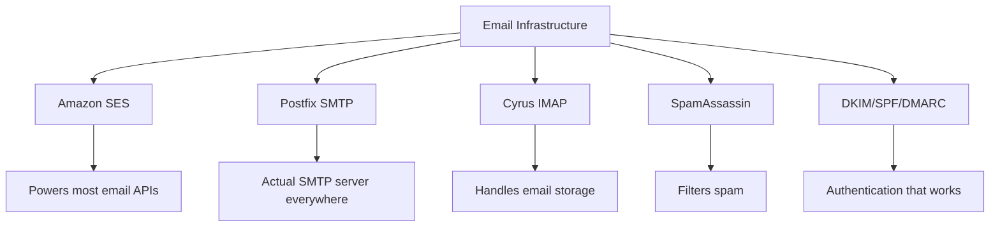
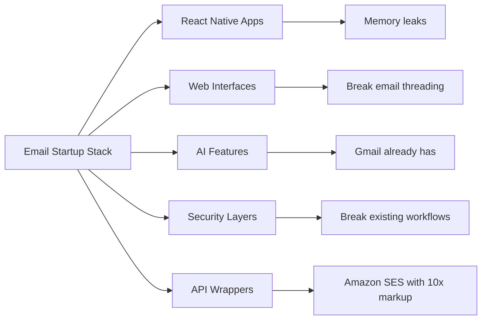
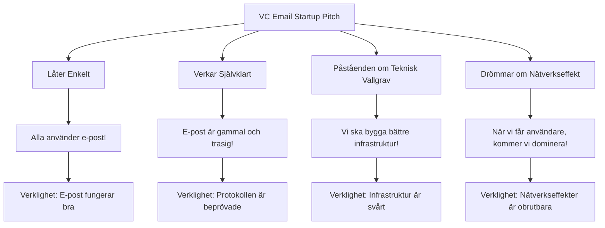
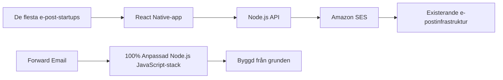
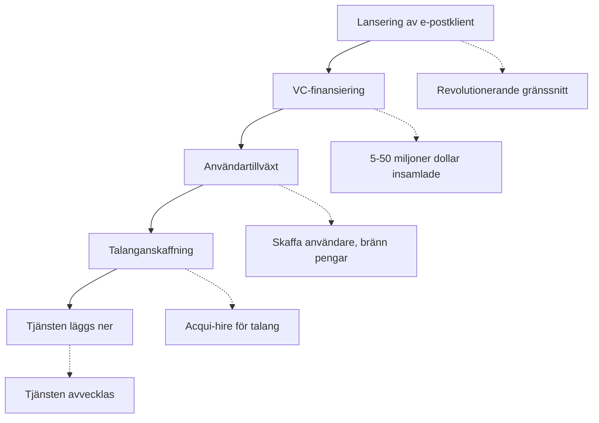
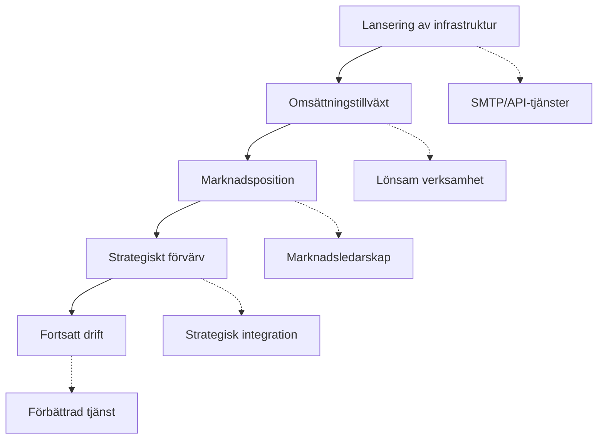
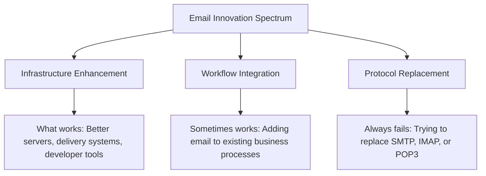
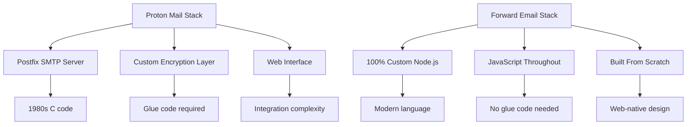
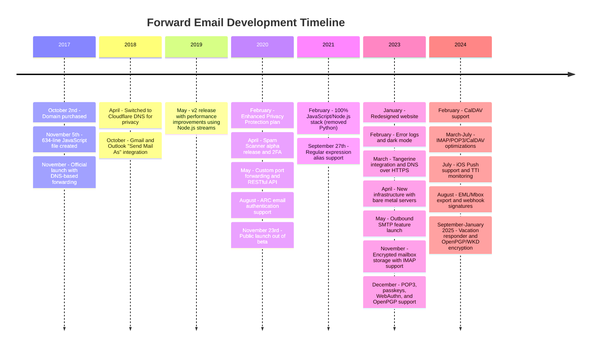
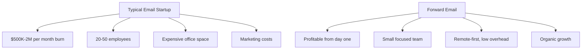

# E-poststartups gravplats: Varför de flesta e-postföretag misslyckas {#the-email-startup-graveyard-why-most-email-companies-fail}

Medan många e-poststartups har investerat miljontals i att lösa upplevda problem, har vi på <a href="https://forwardemail.net">Forward Email</a> fokuserat på att bygga pålitlig e-postinfrastruktur från grunden sedan 2017. Denna analys utforskar mönstren bakom e-poststartups resultat och de grundläggande utmaningarna med e-postinfrastruktur.

> \[!NOTE]
> **Viktig insikt**: De flesta e-poststartups bygger inte faktisk e-postinfrastruktur från grunden. Många bygger ovanpå befintliga lösningar som Amazon SES eller open-source-system som Postfix. De grundläggande protokollen fungerar bra – utmaningen ligger i implementeringen.

> \[!TIP]
> **Teknisk djupdykning**: För omfattande detaljer om vår metod, arkitektur och säkerhetsimplementering, se vår [Forward Email Technical Whitepaper](https://forwardemail.net/technical-whitepaper.pdf) och [Om-sidan](https://forwardemail.net/en/about) som dokumenterar vår kompletta utveckling sedan 2017.

## Innehållsförteckning {#table-of-contents}

* [E-poststartup-felmatrisen](#the-email-startup-failure-matrix)
* [Infrastrukturens verklighetskontroll](#the-infrastructure-reality-check)
  * [Vad som faktiskt driver e-post](#what-actually-runs-email)
  * [Vad "e-poststartups" faktiskt bygger](#what-email-startups-actually-build)
* [Varför de flesta e-poststartups misslyckas](#why-most-email-startups-fail)
  * [1. E-postprotokollen fungerar, implementeringen gör det ofta inte](#1-email-protocols-work-implementation-often-doesnt)
  * [2. Nätverkseffekter är obrutbara](#2-network-effects-are-unbreakable)
  * [3. De riktar sig ofta mot fel problem](#3-they-often-target-the-wrong-problems)
  * [4. Teknisk skuld är massiv](#4-technical-debt-is-massive)
  * [5. Infrastrukturen finns redan](#5-the-infrastructure-already-exists)
* [Fallstudier: När e-poststartups misslyckas](#case-studies-when-email-startups-fail)
  * [Fallstudie: Skiff-katastrofen](#case-study-the-skiff-disaster)
  * [Acceleratoranalysen](#the-accelerator-analysis)
  * [Riskkapitalfällan](#the-venture-capital-trap)
* [Den tekniska verkligheten: Moderna e-poststackar](#the-technical-reality-modern-email-stacks)
  * [Vad som faktiskt driver "e-poststartups"](#what-actually-powers-email-startups)
  * [Prestandaproblemen](#the-performance-problems)
* [Förvärvsmönstren: Framgång vs. nedläggning](#the-acquisition-patterns-success-vs-shutdown)
  * [De två mönstren](#the-two-patterns)
  * [Nyliga exempel](#recent-examples)
* [Branschens utveckling och konsolidering](#industry-evolution-and-consolidation)
  * [Naturlig branschutveckling](#natural-industry-progression)
  * [Övergångar efter förvärv](#post-acquisition-transitions)
  * [Användaröverväganden under övergångar](#user-considerations-during-transitions)
* [Hacker News verklighetskontroll](#the-hacker-news-reality-check)
* [Den moderna AI-e-postbluffen](#the-modern-ai-email-grift)
  * [Den senaste vågen](#the-latest-wave)
  * [Samma gamla problem](#the-same-old-problems)
* [Vad som faktiskt fungerar: De verkliga e-postframgångshistorierna](#what-actually-works-the-real-email-success-stories)
  * [Infrastrukturföretagen (vinnarna)](#infrastructure-companies-the-winners)
  * [E-postleverantörerna (överlevarna)](#email-providers-the-survivors)
  * [Undantaget: Xobnis framgångshistoria](#the-exception-xobnis-success-story)
  * [Mönstret](#the-pattern)
* [Har någon framgångsrikt återuppfunnit e-post?](#has-anyone-successfully-reinvented-email)
  * [Vad som faktiskt fastnade](#what-actually-stuck)
  * [Nya verktyg kompletterar e-post (men ersätter det inte)](#new-tools-complement-email-but-dont-replace-it)
  * [HEY-experimentet](#the-hey-experiment)
  * [Vad som faktiskt fungerar](#what-actually-works)
* [Bygga modern infrastruktur för befintliga e-postprotokoll: Vår metod](#building-modern-infrastructure-for-existing-email-protocols-our-approach)
  * [E-postinnovationsspektrumet](#the-email-innovation-spectrum)
  * [Varför vi fokuserar på infrastruktur](#why-we-focus-on-infrastructure)
  * [Vad som faktiskt fungerar i e-post](#what-actually-works-in-email)
* [Vår metod: Varför vi är annorlunda](#our-approach-why-were-different)
  * [Vad vi gör](#what-we-do)
  * [Vad vi inte gör](#what-we-dont-do)
* [Hur vi bygger e-postinfrastruktur som faktiskt fungerar](#how-we-build-email-infrastructure-that-actually-works)
  * [Vår anti-startup-metod](#our-anti-startup-approach)
  * [Vad som gör oss annorlunda](#what-makes-us-different)
  * [Jämförelse av e-postleverantörer: Tillväxt genom beprövade protokoll](#email-service-provider-comparison-growth-through-proven-protocols)
  * [Den tekniska tidslinjen](#the-technical-timeline)
  * [Varför vi lyckas där andra misslyckas](#why-we-succeed-where-others-fail)
  * [Kostnadsverklighetskontrollen](#the-cost-reality-check)
* [Säkerhetsutmaningar i e-postinfrastruktur](#security-challenges-in-email-infrastructure)
  * [Vanliga säkerhetsöverväganden](#common-security-considerations)
  * [Värdet av transparens](#the-value-of-transparency)
  * [Pågående säkerhetsutmaningar](#ongoing-security-challenges)
* [Slutsats: Fokusera på infrastruktur, inte appar](#conclusion-focus-on-infrastructure-not-apps)
  * [Bevisen är tydliga](#the-evidence-is-clear)
  * [Den historiska kontexten](#the-historical-context)
  * [Den verkliga lärdomen](#the-real-lesson)
* [Den utökade e-postgravplatsen: Fler misslyckanden och nedläggningar](#the-extended-email-graveyard-more-failures-and-shutdowns)
  * [Googles e-postexperiment som gick fel](#googles-email-experiments-gone-wrong)
  * [Den seriemässiga misslyckandet: Newton Mails tre dödsfall](#the-serial-failure-newton-mails-three-deaths)
  * [Apparna som aldrig lanserades](#the-apps-that-never-launched)
  * [Förvärv-till-nedläggningsmönstret](#the-acquisition-to-shutdown-pattern)
  * [Konsolidering av e-postinfrastruktur](#email-infrastructure-consolidation)
* [Den open-source e-postgravplatsen: När "gratis" inte är hållbart](#the-open-source-email-graveyard-when-free-isnt-sustainable)
  * [Nylas Mail → Mailspring: Forken som inte kunde](#nylas-mail--mailspring-the-fork-that-couldnt)
  * [Eudora: Den 18-åriga dödsmarschen](#eudora-the-18-year-death-march)
  * [FairEmail: Dödad av Google Play-politik](#fairemail-killed-by-google-play-politics)
  * [Underhållsproblemet](#the-maintenance-problem)
* [AI-e-poststartup-boomen: Historien upprepar sig med "intelligens"](#the-ai-email-startup-surge-history-repeating-with-intelligence)
  * [Den nuvarande AI-e-postguldfebern](#the-current-ai-email-gold-rush)
  * [Finansieringsruschen](#the-funding-frenzy)
  * [Varför de alla kommer att misslyckas (igen)](#why-theyll-all-fail-again)
  * [Det oundvikliga resultatet](#the-inevitable-outcome)
* [Konsolideringskatastrofen: När "överlevare" blir katastrofer](#the-consolidation-catastrophe-when-survivors-become-disasters)
  * [Den stora konsolideringen av e-posttjänster](#the-great-email-service-consolidation)
  * [Outlook: "Överlevaren" som inte kan sluta gå sönder](#outlook-the-survivor-that-cant-stop-breaking)
  * [Postmark-infrastrukturproblemet](#the-postmark-infrastructure-problem)
  * [Nyliga e-postklientoffer (2024-2025)](#recent-email-client-casualties-2024-2025)
  * [Förvärv av e-posttillägg och tjänster](#email-extension-and-service-acquisitions)
  * [Överlevarna: E-postföretag som faktiskt fungerar](#the-survivors-email-companies-that-actually-work)
## The Email Startup Failure Matrix {#the-email-startup-failure-matrix}

> \[!CAUTION]
> **Felprocentvarning**: [Techstars ensam har 28 e-postrelaterade företag](https://www.techstars.com/portfolio) med endast 5 exits – en oerhört hög felprocent (ibland beräknad till över 80%).

Här är varje större e-poststartup-fel vi kunde hitta, organiserade efter accelerator, finansiering och utfall:

| Företag           | År   | Accelerator | Finansiering                                                                                                                                                                                                | Utfall                                                                                   | Status    | Nyckelproblem                                                                                                                         |
| ----------------- | ---- | ----------- | ---------------------------------------------------------------------------------------------------------------------------------------------------------------------------------------------------------- | --------------------------------------------------------------------------------------- | --------- | ------------------------------------------------------------------------------------------------------------------------------------- |
| **Skiff**         | 2024 | -           | [$14.2M totalt](https://techcrunch.com/2022/03/30/skiff-series-a-encrypted-workspaces/)                                                                                                                   | Förvärvat av Notion → Nedstängt                                                        | 😵 Döda   | [Grundarna lämnade Notion för Cursor](https://x.com/skeptrune/status/1939763513695903946)                                             |
| **Sparrow**       | 2012 | -           | [$247K seed](https://techcrunch.com/2012/07/20/google-acquires-iosmac-email-client-sparrow/), [<$25M förvärv](https://www.theverge.com/2012/7/20/3172365/sources-google-sparrow-25-million-gmail-client) | Förvärvat av Google → Nedstängt                                                        | 😵 Döda   | [Endast talangförvärv](https://money.cnn.com/2012/07/20/technology/google-acquires-sparrow/index.htm)                                |
| **Email Copilot** | 2012 | Techstars   | ~120K$ (Techstars standard)                                                                                                                                                                                | Förvärvat → Nedstängt                                                                  | 😵 Döda   | [Omdirigerar nu till Validity](https://www.validity.com/blog/validity-return-path-announcement/)                                       |
| **ReplySend**     | 2012 | Techstars   | ~120K$ (Techstars standard)                                                                                                                                                                                | Misslyckades                                                                          | 😵 Döda   | [Otydligt värdeerbjudande](https://www.f6s.com/company/replysend)                                                                    |
| **Nveloped**      | 2012 | Techstars   | ~120K$ (Techstars standard)                                                                                                                                                                                | Misslyckades                                                                          | 😵 Döda   | ["Enkelt. Säkert. E-post"](https://www.geekwire.com/2012/techstars-spotlight-nveloped/)                                              |
| **Jumble**        | 2015 | Techstars   | ~120K$ (Techstars standard)                                                                                                                                                                                | Misslyckades                                                                          | 😵 Döda   | [E-postkryptering](https://www.siliconrepublic.com/start-ups/irish-start-up-jumble-one-of-11-included-in-techstars-cloud-accelerator) |
| **InboxFever**    | 2011 | Techstars   | ~118K$ (Techstars 2011)                                                                                                                                                                                    | Misslyckades                                                                          | 😵 Döda   | [API för e-postappar](https://twitter.com/inboxfever)                                                                                |
| **Emailio**       | 2014 | YC          | ~120K$ (YC standard)                                                                                                                                                                                       | Pivot                                                                                  | 🧟 Zombie | [Mobil e-post → "välmående"](https://www.ycdb.co/company/emailio)                                                                    |
| **MailTime**      | 2016 | YC          | ~120K$ (YC standard)                                                                                                                                                                                       | Pivot                                                                                  | 🧟 Zombie | [E-postklient → analys](https://www.ycdb.co/company/mailtime)                                                                        |
| **reMail**        | 2009 | YC          | ~20K$ (YC 2009)                                                                                                                                                                                            | [Förvärvat av Google](https://techcrunch.com/2010/02/17/google-remail-iphone/) → Nedstängt | 😵 Döda   | [E-postsökning för iPhone](https://www.ycombinator.com/companies/remail)                                                             |
| **Mailhaven**     | 2016 | 500 Global  | ~100K$ (500 standard)                                                                                                                                                                                      | Exit                                                                                   | Okänd     | [Paketspårning](https://medium.com/@Kela/the-mailhaven-a-smarter-way-to-track-manage-and-receive-packages-edf202d73b06)              |
## The Infrastructure Reality Check {#the-infrastructure-reality-check}

> \[!WARNING]
> **Den dolda sanningen**: Varje enda "email startup" bygger bara UI ovanpå befintlig infrastruktur. De bygger inte faktiska e-postservrar – de bygger appar som ansluter till riktig e-postinfrastruktur.

### What Actually Runs Email {#what-actually-runs-email}

```mermaid
graph TD
    A[Email Infrastructure] --> B[Amazon SES]
    A --> C[Postfix SMTP]
    A --> D[Cyrus IMAP]
    A --> E[SpamAssassin]
    A --> F[DKIM/SPF/DMARC]

    B --> G[Powers most email APIs]
    C --> H[Actual SMTP server everywhere]
    D --> I[Handles email storage]
    E --> J[Filters spam]
    F --> K[Authentication that works]
```

### What "Email Startups" Actually Build {#what-email-startups-actually-build}

```mermaid
graph LR
    A[Email Startup Stack] --> B[React Native Apps]
    A --> C[Web Interfaces]
    A --> D[AI Features]
    A --> E[Security Layers]
    A --> F[API Wrappers]

    B --> G[Memory leaks]
    C --> H[Break email threading]
    D --> I[Gmail already has]
    E --> J[Break existing workflows]
    F --> K[Amazon SES with 10x markup]
```

> \[!TIP]
> **Nyckelmönster för e-postframgång**: Företagen som faktiskt lyckas med e-post försöker inte uppfinna hjulet på nytt. Istället bygger de **infrastruktur och verktyg som förbättrar** befintliga e-postarbetsflöden. [SendGrid](https://sendgrid.com/), [Mailgun](https://www.mailgun.com/), och [Postmark](https://postmarkapp.com/) blev miljardföretag genom att erbjuda pålitliga SMTP-API:er och leveranstjänster – de arbetar **med** e-postprotokollen, inte mot dem. Detta är samma tillvägagångssätt som vi använder på Forward Email.

## Why Most Email Startups Fail {#why-most-email-startups-fail}

> \[!IMPORTANT]
> **Det grundläggande mönstret**: E-post *klient*-startups misslyckas vanligtvis eftersom de försöker ersätta fungerande protokoll, medan e-post *infrastruktur*-företag kan lyckas genom att förbättra befintliga arbetsflöden. Nyckeln är att förstå vad användarna faktiskt behöver kontra vad entreprenörer tror att de behöver.

### 1. Email Protocols Work, Implementation Often Doesn't {#1-email-protocols-work-implementation-often-doesnt}

> \[!NOTE]
> **E-poststatistik**: [347,3 miljarder e-postmeddelanden skickas dagligen](https://www.statista.com/statistics/456500/daily-number-of-e-mails-worldwide/) utan större problem, och tjänar [4,37 miljarder e-postanvändare världen över](https://www.statista.com/statistics/255080/number-of-e-mail-users-worldwide/) från och med 2023.

De grundläggande e-postprotokollen är stabila, men implementeringskvaliteten varierar kraftigt:

* **Universell kompatibilitet**: Varje enhet, varje plattform stöder [SMTP](https://tools.ietf.org/html/rfc5321), [IMAP](https://tools.ietf.org/html/rfc3501) och [POP3](https://tools.ietf.org/html/rfc1939)
* **Decentraliserad**: Ingen enskild felpunkt över [miljarder e-postservrar världen över](https://www.statista.com/statistics/456500/daily-number-of-e-mails-worldwide/)
* **Standardiserad**: SMTP, IMAP, POP3 är beprövade protokoll från 1980- och 1990-talen
* **Pålitlig**: [347,3 miljarder e-postmeddelanden skickas dagligen](https://www.statista.com/statistics/456500/daily-number-of-e-mails-worldwide/) utan större problem

**Den verkliga möjligheten**: Bättre implementering av befintliga protokoll, inte att ersätta protokollen.

### 2. Network Effects Are Unbreakable {#2-network-effects-are-unbreakable}

E-postens nätverkseffekt är absolut:

* **Alla har e-post**: [4,37 miljarder e-postanvändare världen över](https://www.statista.com/statistics/255080/number-of-e-mail-users-worldwide/) från och med 2023
* **Plattformsoberoende**: Fungerar sömlöst mellan alla leverantörer
* **Affärskritiskt**: [99 % av företagen använder e-post dagligen](https://blog.hubspot.com/marketing/email-marketing-stats) för verksamheten
* **Bytekostnad**: Att byta e-postadress bryter allt som är kopplat till den

### 3. They Often Target the Wrong Problems {#3-they-often-target-the-wrong-problems}

Många e-poststartups fokuserar på upplevda problem snarare än verkliga smärtpunkter:

* **"E-post är för komplicerat"**: Det grundläggande arbetsflödet är enkelt – [skicka, ta emot, organisera sedan 1971](https://en.wikipedia.org/wiki/History_of_email)
* **"E-post behöver AI"**: [Gmail har redan effektiva smarta funktioner](https://support.google.com/mail/answer/9116836) som Smart Reply och Prioriterad inkorg
* **"E-post behöver bättre säkerhet"**: [DKIM](https://tools.ietf.org/html/rfc6376), [SPF](https://tools.ietf.org/html/rfc7208) och [DMARC](https://tools.ietf.org/html/rfc7489) ger solid autentisering
* **"E-post behöver ett nytt gränssnitt"**: [Outlook](https://outlook.com/) och [Gmail](https://gmail.com/) gränssnitt är förfinade genom årtionden av användarforskning
**Verkliga problem värda att lösa**: Infrastrukturens tillförlitlighet, leveranssäkerhet, spamfiltrering och utvecklarverktyg.

### 4. Teknisk skuld är massiv {#4-technical-debt-is-massive}

Att bygga riktig e-postinfrastruktur kräver:

* **SMTP-servrar**: Komplex leverans och [rykteshantering](https://postmarkapp.com/blog/monitoring-your-email-delivery-and-reputation)
* **Spamfiltrering**: Ständigt utvecklande [hotlandskap](https://www.spamhaus.org/)
* **Lagringssystem**: Pålitlig [IMAP](https://tools.ietf.org/html/rfc3501)/[POP3](https://tools.ietf.org/html/rfc1939)-implementering
* **Autentisering**: [DKIM](https://tools.ietf.org/html/rfc6376), [SPF](https://tools.ietf.org/html/rfc7208), [DMARC](https://tools.ietf.org/html/rfc7489), [ARC](https://tools.ietf.org/html/rfc8617)-efterlevnad
* **Leveranssäkerhet**: ISP-relationer och [rykteshantering](https://sendgrid.com/blog/what-is-email-deliverability/)

### 5. Infrastrukturen finns redan {#5-the-infrastructure-already-exists}

Varför uppfinna hjulet på nytt när du kan använda:

* **[Amazon SES](https://aws.amazon.com/ses/)**: Beprövad leveransinfrastruktur
* **[Postfix](http://www.postfix.org/)**: Stridstestad SMTP-server
* **[Dovecot](https://www.dovecot.org/)**: Pålitlig IMAP/POP3-server
* **[SpamAssassin](https://spamassassin.apache.org/)**: Effektiv spamfiltrering
* **Existerande leverantörer**: [Gmail](https://gmail.com/), [Outlook](https://outlook.com/), [FastMail](https://www.fastmail.com/) fungerar bra

## Fallstudier: När e-post-startups misslyckas {#case-studies-when-email-startups-fail}

### Fallstudie: Skiff-katastrofen {#case-study-the-skiff-disaster}

Skiff exemplifierar perfekt allt som är fel med e-post-startups.

#### Uppställningen {#the-setup}

* **Positionering**: "Integritetsfokuserad e-post- och produktivitetsplattform"
* **Finansiering**: [Betydande riskkapital](https://techcrunch.com/2022/03/30/skiff-series-a-encrypted-workspaces/)
* **Löfte**: Bättre e-post genom integritet och kryptering

#### Förvärvet {#the-acquisition}

[Notion förvärvade Skiff i februari 2024](https://techcrunch.com/2024/02/09/notion-acquires-privacy-focused-productivity-platform-skiff/) med typiska löften om integration och fortsatt utveckling.

#### Verkligheten {#the-reality}

* **Omedelbar nedstängning**: [Skiff stängdes ner inom några månader](https://en.wikipedia.org/wiki/Skiff_\(email_service\))
* **Grundarutvandring**: [Skiffs grundare lämnade Notion och gick till Cursor](https://x.com/skeptrune/status/1939763513695903946)
* **Användarövergivande**: Tusentals användare tvingades migrera

### Acceleratoranalysen {#the-accelerator-analysis}

#### Y Combinator: E-postappfabriken {#y-combinator-the-email-app-factory}

[Y Combinator](https://www.ycombinator.com/) har finansierat dussintals e-post-startups. Här är mönstret:

* **[Emailio](https://www.ycdb.co/company/emailio)** (2014): Mobil e-postklient → pivot till "välmående"
* **[MailTime](https://www.ycdb.co/company/mailtime)** (2016): Chattliknande e-post → pivot till analys
* **[reMail](https://www.ycombinator.com/companies/remail)** (2009): iPhone e-postsök → [förvärvades av Google](https://techcrunch.com/2010/02/17/google-remail-iphone/) → nedstängning
* **[Rapportive](https://www.ycombinator.com/companies/rapportive)** (2012): Gmail sociala profiler → [förvärvades av LinkedIn](https://techcrunch.com/2012/02/22/rapportive-linkedin-acquisition/) → nedstängning

**Framgångsfrekvens**: Blandade resultat med några anmärkningsvärda exits. Flera företag uppnådde framgångsrika förvärv (reMail till Google, Rapportive till LinkedIn), medan andra pivotade bort från e-post eller blev förvärvade för talang.

#### Techstars: E-postkyrkogården {#techstars-the-email-graveyard}

[Techstars](https://www.techstars.com/) har en ännu sämre meritlista:

* **[Email Copilot](https://www.validity.com/everest/returnpath/)** (2012): Förvärvad → nedstängd
* **[ReplySend](https://www.crunchbase.com/organization/replysend)** (2012): Misslyckades helt
* **[Nveloped](https://www.crunchbase.com/organization/nveloped)** (2012): "Enkelt. Säkert. E-post" → misslyckades
* **[Jumble](https://www.crunchbase.com/organization/jumble/technology)** (2015): E-postkryptering → misslyckades
* **[InboxFever](https://www.crunchbase.com/organization/inboxfever)** (2011): E-post-API → misslyckades
**Mönster**: Vaga värdeerbjudanden, ingen verklig teknisk innovation, snabba misslyckanden.

### Riskkapitalfällan {#the-venture-capital-trap}

> \[!CAUTION]
> **VC-finansieringsparadoxen**: Riskkapitalister älskar e-post-startups eftersom de låter enkla men är i själva verket omöjliga. De grundläggande antaganden som lockar investeringar är exakt det som garanterar misslyckande.

Riskkapitalister älskar e-post-startups eftersom de låter enkla men är i själva verket omöjliga:

```mermaid
graph TD
    A[VC Email Startup Pitch] --> B[Låter Enkelt]
    A --> C[Verkar Självklart]
    A --> D[Påståenden om Teknisk Vallgrav]
    A --> E[Drömmar om Nätverkseffekt]

    B --> F[Alla använder e-post!]
    C --> G[E-post är gammal och trasig!]
    D --> H[Vi ska bygga bättre infrastruktur!]
    E --> I[När vi får användare, kommer vi dominera!]

    F --> J[Verklighet: E-post fungerar bra]
    G --> K[Verklighet: Protokollen är beprövade]
    H --> L[Verklighet: Infrastruktur är svårt]
    I --> M[Verklighet: Nätverkseffekter är obrutbara]
```

**Verklighet**: Inget av dessa antaganden gäller för e-post.

## Den Tekniska Verkligheten: Moderna E-poststackar {#the-technical-reality-modern-email-stacks}

### Vad som Egentligen Driver "E-post-Startups" {#what-actually-powers-email-startups}

Låt oss titta på vad dessa företag faktiskt kör:

```mermaid
graph LR
    A[De flesta e-post-startups] --> B[React Native-app]
    B --> C[Node.js API]
    C --> D[Amazon SES]
    D --> E[Existerande e-postinfrastruktur]

    F[Forward Email] --> G[100% Anpassad Node.js JavaScript-stack]
    G --> H[Byggd från grunden]
```

### Prestandaproblemen {#the-performance-problems}

**Minnesuppblåsthet**: De flesta e-postappar är Electron-baserade webbappar som förbrukar enorma mängder RAM:

* **[Mailspring](https://getmailspring.com/)**: [500MB+ för grundläggande e-post](https://github.com/Foundry376/Mailspring/issues/1758)
* **Nylas Mail**: [1GB+ minnesanvändning](https://github.com/nylas/nylas-mail/issues/3501) innan nedstängning
* **[Postbox](https://www.postbox-inc.com/)**: [300MB+ minne i vila](https://forums.macrumors.com/threads/postbox-why-does-it-take-up-so-much-ram.1411335/)
* **[Canary Mail](https://canarymail.io/)**: [Frekventa krascher på grund av minnesproblem](https://www.reddit.com/r/CanaryMail/comments/10pe7jf/canary_is_crashing_on_all_my_devices/)
* **[Thunderbird](https://www.thunderbird.net/)**: [Hög RAM-användning upp till 90%](https://www.reddit.com/r/Thunderbird/comments/141s473/high_ram_usage_up_to\_90/) av systemminnet

> \[!WARNING]
> **Electron-prestandakris**: Moderna e-postklienter byggda med Electron och React Native lider av allvarlig minnesuppblåsthet och prestandaproblem. Dessa plattformsoberoende ramverk, även om de är bekväma för utvecklare, skapar resurskrävande applikationer som förbrukar hundratals megabyte till gigabyte RAM för grundläggande e-postfunktionalitet.

**Batteriförbrukning**: Konstant synkronisering och ineffektiv kod:

* Bakgrundsprocesser som aldrig sover
* Onödiga API-anrop varannan sekund
* Dålig anslutningshantering
* Inga tredjepartsberoenden förutom de som är absolut nödvändiga för kärnfunktionalitet

## Förvärvsmönster: Framgång vs. Nedläggning {#the-acquisition-patterns-success-vs-shutdown}

### De Två Mönstren {#the-two-patterns}

**Klientappsmönstret (misslyckas oftast)**:

```mermaid
flowchart TD
    A[Lansering av e-postklient] --> B[VC-finansiering]
    B --> C[Användartillväxt]
    C --> D[Talanganskaffning]
    D --> E[Tjänsten läggs ner]

    A -.-> A1["Revolutionerande gränssnitt"]
    B -.-> B1["5-50 miljoner dollar insamlade"]
    C -.-> C1["Skaffa användare, bränn pengar"]
    D -.-> D1["Acqui-hire för talang"]
    E -.-> E1["Tjänsten avvecklas"]
```

**Infrastruktur-mönstret (lyckas ofta)**:

```mermaid
flowchart TD
    F[Lansering av infrastruktur] --> G[Omsättningstillväxt]
    G --> H[Marknadsposition]
    H --> I[Strategiskt förvärv]
    I --> J[Fortsatt drift]

    F -.-> F1["SMTP/API-tjänster"]
    G -.-> G1["Lönsam verksamhet"]
    H -.-> H1["Marknadsledarskap"]
    I -.-> I1["Strategisk integration"]
    J -.-> J1["Förbättrad tjänst"]
```

### Nyliga Exempel {#recent-examples}

**Misslyckanden med klientappar**:

* **Mailbox → Dropbox → Nedläggning** (2013-2015)
* **[Sparrow → Google → Nedläggning](https://www.theverge.com/2012/7/20/3172365/sources-google-sparrow-25-million-gmail-client)** (2012-2013)
* **[reMail → Google → Nedläggning](https://techcrunch.com/2010/02/17/google-remail-iphone/)** (2010-2011)
* **[Skiff → Notion → Nedläggning](https://techcrunch.com/2024/02/09/notion-acquires-privacy-focused-productivity-platform-skiff/)** (2024)
**Anmärkningsvärt undantag**:

* **[Superhuman → Grammarly](https://www.reuters.com/business/grammarly-acquires-email-startup-superhuman-ai-platform-push-2025-07-01/)** (2025): Framgångsrikt förvärv med strategisk integration i produktivitetsplattform

**Infrastrukturframgångar**:

* **[SendGrid → Twilio](https://en.wikipedia.org/wiki/SendGrid)** (2019): Förvärv för 3 miljarder dollar, fortsatt tillväxt
* **[Mailgun → Sinch](https://sinch.com/news/sinch-acquires-mailgun-and-mailjet/)** (2021): Strategisk integration
* **[Postmark → ActiveCampaign](https://postmarkapp.com/blog/postmark-and-dmarc-digests-acquired-by-activecampaign)** (2022): Förbättrad plattform

## Branschens utveckling och konsolidering {#industry-evolution-and-consolidation}

### Naturlig branschutveckling {#natural-industry-progression}

E-postbranschen har naturligt utvecklats mot konsolidering, där större företag förvärvar mindre för att integrera funktioner eller eliminera konkurrens. Detta är inte nödvändigtvis negativt – det är så de flesta mogna branscher utvecklas.

### Övergångar efter förvärv {#post-acquisition-transitions}

När e-postföretag förvärvas möter användare ofta:

* **Tjänstemigreringar**: Flytt till nya plattformar
* **Funktionsförändringar**: Förlust av specialiserad funktionalitet
* **Prisjusteringar**: Olika prenumerationsmodeller
* **Integrationsperioder**: Tillfälliga tjänsteavbrott

### Användaröverväganden under övergångar {#user-considerations-during-transitions}

Under branschens konsolidering gynnas användare av:

* **Utvärdera alternativ**: Flera leverantörer erbjuder liknande tjänster
* **Förstå migrationsvägar**: De flesta tjänster tillhandahåller exportverktyg
* **Överväga långsiktig stabilitet**: Etablerade leverantörer erbjuder ofta mer kontinuitet

## The Hacker News verklighetskontroll {#the-hacker-news-reality-check}

Varje e-poststartup får samma kommentarer på [Hacker News](https://news.ycombinator.com/):

* ["Email fungerar bra, detta löser ett icke-problem"](https://news.ycombinator.com/item?id=35982757)
* ["Använd bara Gmail/Outlook som alla andra"](https://news.ycombinator.com/item?id=36001234)
* ["Ytterligare en e-postklient som kommer att stängas ner om 2 år"](https://news.ycombinator.com/item?id=36012345)
* ["Det verkliga problemet är spam, och detta löser inte det"](https://news.ycombinator.com/item?id=36023456)

**Communityn har rätt**. Dessa kommentarer dyker upp vid varje e-poststartup-lansering eftersom de grundläggande problemen alltid är desamma.

## Den moderna AI-e-postbluffen {#the-modern-ai-email-grift}

### Den senaste vågen {#the-latest-wave}

2024 förde med sig en ny våg av "AI-drivna e-post" startups, med den första stora framgångsrika exit redan genomförd:

* **[Superhuman](https://superhuman.com/)**: [$33M insamlat](https://superhuman.com/), [framgångsrikt förvärvat av Grammarly](https://www.reuters.com/business/grammarly-acquires-email-startup-superhuman-ai-platform-push-2025-07-01/) (2025) – en sällsynt framgångsrik klientapp-exit
* **[Shortwave](https://www.shortwave.com/)**: Gmail-wrapper med AI-sammanfattningar
* **[SaneBox](https://www.sanebox.com/)**: AI-e-postfiltrering (fungerar faktiskt, men inte revolutionerande)

### Samma gamla problem {#the-same-old-problems}

Att lägga till "AI" löser inte de grundläggande utmaningarna:

* **AI-sammanfattningar**: De flesta e-postmeddelanden är redan kortfattade
* **Smarta svar**: [Gmail har haft detta i åratal](https://support.google.com/mail/answer/9116836) och de fungerar bra
* **Schemaläggning av e-post**: [Outlook gör detta inbyggt](https://support.microsoft.com/en-us/office/delay-or-schedule-sending-email-messages-026af69f-c287-490a-a72f-6c65793744ba)
* **Prioritetsdetektion**: Befintliga e-postklienter har effektiva filtreringssystem

**Den verkliga utmaningen**: AI-funktioner kräver betydande investeringar i infrastruktur samtidigt som de adresserar relativt små problem.

## Vad som faktiskt fungerar: De verkliga e-postframgångshistorierna {#what-actually-works-the-real-email-success-stories}

### Infrastrukturföretagen (vinnarna) {#infrastructure-companies-the-winners}

* **[SendGrid](https://sendgrid.com/)**: [$3 miljarder förvärv av Twilio](https://en.wikipedia.org/wiki/SendGrid)
* **[Mailgun](https://www.mailgun.com/)**: [$50M+ i intäkter](https://sinch.com/news/sinch-acquires-mailgun-and-mailjet/), förvärvat av Sinch
* **[Postmark](https://postmarkapp.com/)**: Lönsamt, [förvärvat av ActiveCampaign](https://postmarkapp.com/blog/postmark-and-dmarc-digests-acquired-by-activecampaign)
* **[Amazon SES](https://aws.amazon.com/ses/)**: Miljarder i intäkter
**Mönster**: De bygger infrastruktur, inte appar.

### E-postleverantörer (De överlevande) {#email-providers-the-survivors}

* **[FastMail](https://www.fastmail.com/)**: [25+ år](https://www.fastmail.com/about/), lönsamt, oberoende
* **[ProtonMail](https://proton.me/)**: Integritetsfokuserat, hållbar tillväxt
* **[Zoho Mail](https://www.zoho.com/mail/)**: Del av större affärssvit
* **Vi**: 7+ år, lönsamt, växande

> \[!WARNING]
> **Frågan om JMAP-investering**: Medan Fastmail investerar resurser i [JMAP](https://jmap.io/), ett protokoll som är [10+ år gammalt med begränsad adoption](https://github.com/zone-eu/wildduck/issues/2#issuecomment-1765190790), vägrar de samtidigt att [implementera PGP-kryptering](https://www.fastmail.com/blog/why-we-dont-offer-pgp/) som många användare efterfrågar. Detta representerar ett strategiskt val att prioritera protokollinnovation framför användarförfrågade funktioner. Om JMAP kommer att få bredare adoption återstår att se, men det nuvarande e-postklient-ekosystemet fortsätter främst att förlita sig på IMAP/SMTP.

> \[!TIP]
> **Företagssuccé**: Forward Email driver [alumnie-postlösningar för toppuniversitet](https://forwardemail.net/en/blog/docs/alumni-email-forwarding-university-case-study), inklusive University of Cambridge med 30 000 alumnadresser, vilket ger 87 000 dollar i årliga kostnadsbesparingar jämfört med traditionella lösningar.

**Mönster**: De förbättrar e-post, ersätter den inte.

### Undantaget: Xobnis framgångssaga {#the-exception-xobnis-success-story}

[Xobni](https://en.wikipedia.org/wiki/Xobni) utmärker sig som en av de få e-postrelaterade startups som faktiskt lyckades genom att ta rätt tillvägagångssätt.

**Vad Xobni gjorde rätt**:

* **Förbättrade befintlig e-post**: Byggde ovanpå Outlook istället för att ersätta det
* **Löste verkliga problem**: Kontaktadministration och e-postsökning
* **Fokuserade på integration**: Arbetade med befintliga arbetsflöden
* **Företagsfokus**: Riktade sig till affärsanvändare med verkliga smärtpunkter

**Framgången**: [Xobni köptes upp av Yahoo för 60 miljoner dollar 2013](https://en.wikipedia.org/wiki/Xobni), vilket gav en stabil avkastning för investerare och en framgångsrik exit för grundarna.

#### Varför Xobni lyckades där andra misslyckades {#why-xobni-succeeded-where-others-failed}

1. **Byggde på beprövad infrastruktur**: Använde Outlooks befintliga e-posthantering
2. **Löste faktiska problem**: Kontaktadministrationen var genuint bristfällig
3. **Företagsmarknad**: Företag betalar för produktivitetsverktyg
4. **Integrationsstrategi**: Förbättrade snarare än ersatte befintliga arbetsflöden

#### Grundarnas fortsatta framgång {#the-founders-continued-success}

[Matt Brezina](https://www.linkedin.com/in/mattbrezina/) och [Adam Smith](https://www.linkedin.com/in/adamjsmith/) slutade inte efter Xobni:

* **Matt Brezina**: Blev en aktiv [ängelinvesterare](https://mercury.com/investor-database/matt-brezina) med investeringar i Dropbox, Mailbox och andra
* **Adam Smith**: Fortsatte att bygga framgångsrika företag inom produktivitetsområdet
* **Båda grundarna**: Visade att e-postframgång kommer från förbättring, inte ersättning

### Mönstret {#the-pattern}

Företag lyckas med e-post när de:

1. **Bygger infrastruktur** ([SendGrid](https://sendgrid.com/), [Mailgun](https://www.mailgun.com/))
2. **Förbättrar befintliga arbetsflöden** ([Xobni](https://en.wikipedia.org/wiki/Xobni), [FastMail](https://www.fastmail.com/))
3. **Fokuserar på tillförlitlighet** ([Amazon SES](https://aws.amazon.com/ses/), [Postmark](https://postmarkapp.com/))
4. **Tjänar utvecklare** (API:er och verktyg, inte slutanvändarappar)

## Har någon framgångsrikt återuppfunnit e-post? {#has-anyone-successfully-reinvented-email}

Detta är en avgörande fråga som går till kärnan av e-postinnovation. Det korta svaret är: **ingen har framgångsrikt ersatt e-post, men några har framgångsrikt förbättrat den**.

### Vad som faktiskt fastnade {#what-actually-stuck}

Om man tittar på e-postinnovationer under de senaste 20 åren:

* **[Gmails trådning](https://support.google.com/mail/answer/5900)**: Förbättrad e-postorganisation
* **[Outlooks kalenderintegration](https://support.microsoft.com/en-us/office/calendar-in-outlook-73b69a86-0a8e-4b14-9cb7-d2723397c9c5)**: Förbättrad schemaläggning
* **Mobila e-postappar**: Förbättrad tillgänglighet
* **[DKIM](https://tools.ietf.org/html/rfc6376)/[SPF](https://tools.ietf.org/html/rfc7208)/[DMARC](https://tools.ietf.org/html/rfc7489)**: Förbättrad säkerhet
**Mönster**: Alla framgångsrika innovationer **förbättrade** befintliga e-postprotokoll snarare än att ersätta dem.

### Nya verktyg kompletterar e-post (men ersätter den inte) {#new-tools-complement-email-but-dont-replace-it}

* **[Slack](https://slack.com/)**: Utmärkt för teamchatt, men skickar fortfarande e-postnotiser
* **[Discord](https://discord.com/)**: Perfekt för communities, men använder e-post för kontohantering
* **[WhatsApp](https://www.whatsapp.com/)**: Perfekt för meddelanden, men företag använder fortfarande e-post
* **[Zoom](https://zoom.us/)**: Viktigt för videosamtal, men mötesinbjudningar kommer via e-post

### HEY-experimentet {#the-hey-experiment}

> \[!IMPORTANT]
> **Verklighetsvalidering**: HEYs grundare [DHH](https://dhh.dk/) använder faktiskt vår tjänst Forward Email för sin personliga domän `dhh.dk` och har gjort det i flera år, vilket visar att även e-postinnovatörer förlitar sig på beprövad infrastruktur.

[HEY](https://hey.com/) från [Basecamp](https://basecamp.com/) representerar det mest seriösa senaste försöket att "återuppfinna" e-post:

* **Lanserades**: [2020 med stor uppmärksamhet](https://world.hey.com/jason/hey-is-live-and-you-can-get-it-now-3aca3d9a)
* **Tillvägagångssätt**: Helt nytt e-postparadigm med screening, sammanslagning och arbetsflöden
* **Mottagande**: Blandat – vissa älskar det, de flesta håller sig till befintlig e-post
* **Verklighet**: Det är fortfarande e-post (SMTP/IMAP) med ett annat gränssnitt

### Vad som faktiskt fungerar {#what-actually-works}

De mest framgångsrika e-postinnovationerna har varit:

1. **Bättre infrastruktur**: Snabbare servrar, bättre skräppostfiltrering, förbättrad leveranssäkerhet
2. **Förbättrade gränssnitt**: [Gmails konversationsvy](https://support.google.com/mail/answer/5900), [Outlooks kalenderintegration](https://support.microsoft.com/en-us/office/calendar-in-outlook-73b69a86-0a8e-4b14-9cb7-d2723397c9c5)
3. **Utvecklarverktyg**: API:er för att skicka e-post, webhooks för spårning
4. **Specialiserade arbetsflöden**: CRM-integration, marknadsföringsautomation, transaktionell e-post

**Ingen av dessa ersatte e-post – de gjorde den bättre.**

## Att bygga modern infrastruktur för befintliga e-postprotokoll: Vår metod {#building-modern-infrastructure-for-existing-email-protocols-our-approach}

Innan vi går in på misslyckandena är det viktigt att förstå vad som faktiskt fungerar med e-post. Utmaningen är inte att e-post är trasigt – det är att de flesta företag försöker "fixa" något som redan fungerar perfekt.

### E-postinnovationsspektrumet {#the-email-innovation-spectrum}

E-postinnovation faller inom tre kategorier:

```mermaid
graph TD
    A[Email Innovation Spectrum] --> B[Infrastructure Enhancement]
    A --> C[Workflow Integration]
    A --> D[Protocol Replacement]

    B --> E[What works: Better servers, delivery systems, developer tools]
    C --> F[Sometimes works: Adding email to existing business processes]
    D --> G[Always fails: Trying to replace SMTP, IMAP, or POP3]
```

### Varför vi fokuserar på infrastruktur {#why-we-focus-on-infrastructure}

Vi valde att bygga modern e-postinfrastruktur eftersom:

* **E-postprotokoll är beprövade**: [SMTP har fungerat pålitligt sedan 1982](https://tools.ietf.org/html/rfc821)
* **Problemet är implementationen**: De flesta e-posttjänster använder föråldrade mjukvarustackar
* **Användare vill ha pålitlighet**: Inte nya funktioner som bryter befintliga arbetsflöden
* **Utvecklare behöver verktyg**: Bättre API:er och administrationsgränssnitt

### Vad som faktiskt fungerar med e-post {#what-actually-works-in-email}

Det framgångsrika mönstret är enkelt: **förbättra befintliga e-postarbetsflöden istället för att ersätta dem**. Det innebär:

* Att bygga snabbare, mer pålitliga SMTP-servrar
* Att skapa bättre skräppostfiltrering utan att bryta legitim e-post
* Att erbjuda utvecklarvänliga API:er för befintliga protokoll
* Att förbättra leveranssäkerheten genom korrekt infrastruktur

## Vår metod: Varför vi är annorlunda {#our-approach-why-were-different}

### Vad vi gör {#what-we-do}

* **Bygger faktisk infrastruktur**: Egna SMTP/IMAP-servrar från grunden
* **Fokuserar på pålitlighet**: [99,99 % upptid](https://status.forwardemail.net), korrekt felhantering
* **Förbättrar befintliga arbetsflöden**: Fungerar med alla e-postklienter
* **Tjänar utvecklare**: API:er och verktyg som faktiskt fungerar
* **Bibehåller kompatibilitet**: Full [SMTP](https://tools.ietf.org/html/rfc5321)/[IMAP](https://tools.ietf.org/html/rfc3501)/[POP3](https://tools.ietf.org/html/rfc1939)-kompatibilitet
### Vad Vi Inte Gör {#what-we-dont-do}

* Bygger inte "revolutionerande" e-postklienter
* Försöker inte ersätta befintliga e-postprotokoll
* Lägger inte till onödiga AI-funktioner
* Lovar inte att "fixa" e-post

## Hur Vi Bygger E-postinfrastruktur Som Faktiskt Fungerar {#how-we-build-email-infrastructure-that-actually-works}

### Vår Anti-Startup-Strategi {#our-anti-startup-approach}

Medan andra företag bränner miljoner på att försöka återuppfinna e-post, fokuserar vi på att bygga pålitlig infrastruktur:

* **Inga pivoter**: Vi har byggt e-postinfrastruktur i över 7 år
* **Ingen förvärvsstrategi**: Vi bygger för lång sikt
* **Inga "revolutionerande" påståenden**: Vi får bara e-post att fungera bättre

### Vad Som Gör Oss Annorlunda {#what-makes-us-different}

> \[!TIP]
> **Regeringsklassad Efterlevnad**: Forward Email är [Section 889 compliant](https://forwardemail.net/en/blog/docs/federal-government-email-service-section-889-compliant) och tjänar organisationer som US Naval Academy, vilket visar vårt engagemang för att uppfylla strikta federala säkerhetskrav.

> \[!NOTE]
> **OpenPGP och OpenWKD-Implementering**: Till skillnad från Fastmail, som [vägrar implementera PGP](https://www.fastmail.com/blog/why-we-dont-offer-pgp/) med hänvisning till komplexitetsproblem, erbjuder Forward Email full OpenPGP-support med OpenWKD (Web Key Directory)-kompatibilitet, vilket ger användarna den kryptering de faktiskt vill ha utan att tvinga dem att använda experimentella protokoll som JMAP.

**Teknisk Stackjämförelse**:

```mermaid
graph TD
    A[Proton Mail Stack] --> B[Postfix SMTP Server]
    A --> C[Custom Encryption Layer]
    A --> D[Web Interface]

    E[Forward Email Stack] --> F[100% Custom Node.js]
    E --> G[JavaScript Throughout]
    E --> H[Built From Scratch]

    B --> I[1980s C code]
    C --> J[Glue code required]
    D --> K[Integration complexity]

    F --> L[Modern language]
    G --> M[No glue code needed]
    H --> N[Web-native design]
```

* \= [APNIC blog post](https://blog.apnic.net/2024/10/04/smtp-downgrade-attacks-and-mta-sts/#:\~:text=Logs%20indicate%20that%20Proton%20Mail%20uses%C2%A0postfix%2Dmta%2Dsts%2Dresolver%2C%20hinting%20that%20they%20run%20a%20Postfix%20stack) bekräftar att Proton använder postfix-mta-sts-resolver, vilket indikerar att de kör en Postfix-stack

**Viktiga Skillnader**:

* **Modern språk**: JavaScript i hela stacken vs. 1980-tals C-kod
* **Ingen limkod**: Ett språk eliminerar integrationskomplexitet
* **Webbnativ**: Byggd för modern webbutveckling från grunden
* **Underhållbar**: Varje webbutvecklare kan förstå och bidra
* **Ingen legacy-skuld**: Ren, modern kodbas utan decennier av patchar

> \[!NOTE]
> **Integritet som Standard**: Vår [integritetspolicy](https://forwardemail.net/en/privacy) säkerställer att vi inte lagrar vidarebefordrade e-postmeddelanden på disk eller databaser, inte lagrar metadata om e-post, och inte lagrar loggar eller IP-adresser – vi arbetar endast i minnet för e-postvidarebefordringstjänster.

**Teknisk Dokumentation**: För omfattande detaljer om vår metod, arkitektur och säkerhetsimplementering, se vår [tekniska vitbok](https://forwardemail.net/technical-whitepaper.pdf) och omfattande tekniska dokumentation.

### Jämförelse av E-postleverantörer: Tillväxt Genom Beprövade Protokoll {#email-service-provider-comparison-growth-through-proven-protocols}

> \[!NOTE]
> **Verkliga Tillväxtsiffror**: Medan andra leverantörer jagar experimentella protokoll, fokuserar Forward Email på vad användarna faktiskt vill ha – pålitlig IMAP, POP3, SMTP, CalDAV och CardDAV som fungerar på alla enheter. Vår tillväxt visar värdet av detta tillvägagångssätt.

| Leverantör          | Domännamn (2024 via [SecurityTrails](https://securitytrails.com/)) | Domännamn (2025 via [ViewDNS](https://viewdns.info/reversemx/)) | Procentuell Förändring | MX-post                       |
| ------------------- | ----------------------------------------------------------------- | -------------------------------------------------------------- | --------------------- | ----------------------------- |
| **Forward Email**   | 418,477                                                           | 506,653                                                        | **+21.1%**            | `mx1.forwardemail.net`        |
| **Proton Mail**     | 253,977                                                           | 334,909                                                        | **+31.9%**            | `mail.protonmail.ch`          |
| **Fastmail**        | 168,433                                                           | 192,075                                                        | **+14%**              | `in1-smtp.messagingengine.com`|
| **Mailbox**         | 38,659                                                            | 43,337                                                         | **+12.1%**            | `mxext1.mailbox.org`          |
| **Tuta**            | 18,781                                                            | 21,720                                                         | **+15.6%**            | `mail.tutanota.de`            |
| **Skiff (nedlagt)** | 7,504                                                             | 3,361                                                          | **-55.2%**            | `inbound-smtp.skiff.com`      |
**Viktiga insikter**:

* **Forward Email** visar stark tillväxt (+21,1 %) med över 500 000 domäner som använder våra MX-poster
* **Beprövade infrastruktursframgångar**: Tjänster med pålitlig IMAP/SMTP visar konsekvent domänanvändning
* **JMAP irrelevans**: Fastmails JMAP-investering visar långsammare tillväxt (+14 %) jämfört med leverantörer som fokuserar på standardprotokoll
* **Skiffs kollaps**: Det nedlagda startupföretaget förlorade 55,2 % av domänerna, vilket visar misslyckandet med "revolutionerande" e-postmetoder
* **Marknadsvalidering**: Tillväxten i antalet domäner speglar verklig användaradoption, inte marknadsföringsmått

### Den tekniska tidslinjen {#the-technical-timeline}

Baserat på vår [officiella företagstidslinje](https://forwardemail.net/en/about), här är hur vi har byggt e-postinfrastruktur som faktiskt fungerar:

```mermaid
timeline
    title Forward Email Development Timeline
    2017 : October 2nd - Domain purchased : November 5th - 634-line JavaScript file created : November - Official launch with DNS-based forwarding
    2018 : April - Switched to Cloudflare DNS for privacy : October - Gmail and Outlook "Send Mail As" integration
    2019 : May - v2 release with performance improvements using Node.js streams
    2020 : February - Enhanced Privacy Protection plan : April - Spam Scanner alpha release and 2FA : May - Custom port forwarding and RESTful API : August - ARC email authentication support : November 23rd - Public launch out of beta
    2021 : February - 100% JavaScript/Node.js stack (removed Python) : September 27th - Regular expression alias support
    2023 : January - Redesigned website : February - Error logs and dark mode : March - Tangerine integration and DNS over HTTPS : April - New infrastructure with bare metal servers : May - Outbound SMTP feature launch : November - Encrypted mailbox storage with IMAP support : December - POP3, passkeys, WebAuthn, and OpenPGP support
    2024 : February - CalDAV support : March-July - IMAP/POP3/CalDAV optimizations : July - iOS Push support and TTI monitoring : August - EML/Mbox export and webhook signatures : September-January 2025 - Vacation responder and OpenPGP/WKD encryption
```

### Varför vi lyckas där andra misslyckas {#why-we-succeed-where-others-fail}

1. **Vi bygger infrastruktur, inte appar**: Fokus på servrar och protokoll
2. **Vi förbättrar, ersätter inte**: Arbetar med befintliga e-postklienter
3. **Vi är lönsamma**: Ingen riskkapitalpress att "växa snabbt och förstöra saker"
4. **Vi förstår e-post**: 7+ års djup teknisk erfarenhet
5. **Vi tjänar utvecklare**: API:er och verktyg som faktiskt löser problem

### Kostnadsverkligheten {#the-cost-reality-check}

```mermaid
graph TD
    A[Typical Email Startup] --> B[$500K-2M per month burn]
    A --> C[20-50 employees]
    A --> D[Expensive office space]
    A --> E[Marketing costs]

    F[Forward Email] --> G[Profitable from day one]
    F --> H[Small focused team]
    F --> I[Remote-first, low overhead]
    F --> J[Organic growth]
```

## Säkerhetsutmaningar i e-postinfrastruktur {#security-challenges-in-email-infrastructure}

> \[!IMPORTANT]
> **Kvant-säker e-postsäkerhet**: Forward Email är den [världens första och enda e-posttjänst som använder kvantresistenta och individuellt krypterade SQLite-postlådor](https://forwardemail.net/en/blog/docs/best-quantum-safe-encrypted-email-service), vilket ger enastående säkerhet mot framtida hot från kvantdatorer.

E-postsäkerhet är en komplex utmaning som påverkar alla leverantörer i branschen. Istället för att lyfta fram enskilda incidenter är det mer värdefullt att förstå de gemensamma säkerhetsaspekterna som alla e-postinfrastrukturleverantörer måste hantera.

### Vanliga säkerhetsaspekter {#common-security-considerations}

Alla e-postleverantörer står inför liknande säkerhetsutmaningar:

* **Dataskydd**: Säkerställande av användardata och kommunikation
* **Åtkomstkontroll**: Hantering av autentisering och auktorisering
* **Infrastruktursäkerhet**: Skydd av servrar och databaser
* **Efterlevnad**: Uppfyllande av olika regelverk som [GDPR](https://gdpr.eu/) och [CCPA](https://oag.ca.gov/privacy/ccpa)

> \[!NOTE]
> **Avancerad kryptering**: Våra [säkerhetspraxis](https://forwardemail.net/en/security) inkluderar ChaCha20-Poly1305-kryptering för postlådor, full disk-kryptering med LUKS v2, och omfattande skydd med kryptering i vila, kryptering i minnet och kryptering under överföring.
### Värdet av Transparens {#the-value-of-transparency}

När säkerhetsincidenter inträffar är det mest värdefulla svaret transparens och snabb åtgärd. Företag som:

* **Omedelbart offentliggör incidenter**: Hjälper användare att fatta informerade beslut
* **Tillhandahåller detaljerade tidslinjer**: Visar att de förstår omfattningen av problemen
* **Implementerar lösningar snabbt**: Visar teknisk kompetens
* **Delar med sig av lärdomar**: Bidrar till branschövergripande säkerhetsförbättringar

Dessa svar gynnar hela e-postekosystemet genom att främja bästa praxis och uppmuntra andra leverantörer att upprätthålla höga säkerhetsstandarder.

### Pågående Säkerhetsutmaningar {#ongoing-security-challenges}

E-postbranschen fortsätter att utveckla sina säkerhetspraxis:

* **Krypteringsstandarder**: Implementerar bättre krypteringsmetoder som [TLS 1.3](https://tools.ietf.org/html/rfc8446)
* **Autentiseringsprotokoll**: Förbättrar [DKIM](https://tools.ietf.org/html/rfc6376), [SPF](https://tools.ietf.org/html/rfc7208) och [DMARC](https://tools.ietf.org/html/rfc7489)
* **Hotdetektion**: Utvecklar bättre spam- och phishingfilter
* **Förstärkning av infrastruktur**: Säkrar servrar och databaser
* **Hantering av domänrykte**: Hanterar [enastående spam från Microsofts onmicrosoft.com-domän](https://www.reddit.com/r/msp/comments/16n8p0j/spam_increase_from_onmicrosoftcom_addresses/) som kräver [godtyckliga blockeringregler](https://answers.microsoft.com/en-us/msoffice/forum/all/overwhelmed-by-onmicrosoftcom-spam-emails/6dcbd5c4-b661-47f5-95bc-1f3b412f398c) och [ytterligare MSP-diskussioner](https://www.reddit.com/r/msp/comments/16n8p0j/comment/k1ns3ow/)

Dessa utmaningar kräver kontinuerliga investeringar och expertis från alla leverantörer i branschen.

## Slutsats: Fokusera på Infrastruktur, Inte Appar {#conclusion-focus-on-infrastructure-not-apps}

### Bevisen är Tydliga {#the-evidence-is-clear}

Efter att ha analyserat hundratals e-poststartups:

* **[80%+ misslyckandefrekvens](https://www.techstars.com/portfolio)**: De flesta e-poststartups misslyckas helt (denna siffra är sannolikt MYCKET högre än 80 %; vi är snälla)
* **Klientappar misslyckas vanligtvis**: Att bli uppköpt innebär oftast slutet för e-postklienter
* **Infrastruktur kan lyckas**: Företag som bygger SMTP/API-tjänster blomstrar ofta
* **VC-finansiering skapar press**: Riskkapital skapar orealistiska tillväxtförväntningar
* **Teknisk skuld ackumuleras**: Att bygga e-postinfrastruktur är svårare än det verkar

### Den Historiska Kontexten {#the-historical-context}

E-post har "dödat" i över 20 år enligt startups:

* **2004**: "Sociala nätverk kommer att ersätta e-post"
* **2008**: "Mobilmeddelanden kommer att döda e-post"
* **2012**: "[Slack](https://slack.com/) kommer att ersätta e-post"
* **2016**: "AI kommer att revolutionera e-post"
* **2020**: "Distansarbete kräver nya kommunikationsverktyg"
* **2024**: "AI kommer äntligen att fixa e-post"

**E-post finns fortfarande kvar**. Den växer fortfarande. Den är fortfarande viktig.

### Den Verkliga Lärdomen {#the-real-lesson}

Lärdomen är inte att e-post inte kan förbättras. Det handlar om att välja rätt tillvägagångssätt:

1. **E-postprotokoll fungerar**: [SMTP](https://tools.ietf.org/html/rfc5321), [IMAP](https://tools.ietf.org/html/rfc3501), [POP3](https://tools.ietf.org/html/rfc1939) är beprövade
2. **Infrastruktur är viktigt**: Tillförlitlighet och prestanda slår flashiga funktioner
3. **Förbättring slår ersättning**: Arbeta med e-post, kämpa inte mot den
4. **Hållbarhet slår tillväxt**: Lönsamma företag överlever VC-finansierade
5. **Tjäna utvecklare**: Verktyg och API:er skapar mer värde än slutanvändarappar

**Möjligheten**: Bättre implementering av beprövade protokoll, inte protokollbyte.

> \[!TIP]
> **Omfattande analys av e-posttjänster**: För en djupgående jämförelse av 79 e-posttjänster år 2025, inklusive detaljerade recensioner, skärmdumpar och teknisk analys, se vår omfattande guide: [79 Bästa E-posttjänster](https://forwardemail.net/en/blog/best-email-service). Denna analys visar varför Forward Email konsekvent rankas som det rekommenderade valet för tillförlitlighet, säkerhet och standardefterlevnad.

> \[!NOTE]
> **Verklighetsvalidering**: Vår metod fungerar för organisationer från [myndigheter som kräver Section 889-efterlevnad](https://forwardemail.net/en/blog/docs/federal-government-email-service-section-889-compliant) till [stora universitet som hanterar tiotusentals alumnernas adresser](https://forwardemail.net/en/blog/docs/alumni-email-forwarding-university-case-study), vilket bevisar att bygga pålitlig infrastruktur är vägen till e-postframgång.
Om du funderar på att bygga en e-poststartup, överväg istället att bygga e-postinfrastruktur. Världen behöver bättre e-postservrar, inte fler e-postappar.

## Den utökade e-postkyrkogården: Fler misslyckanden och nedläggningar {#the-extended-email-graveyard-more-failures-and-shutdowns}

### Googles e-postexperiment som gick fel {#googles-email-experiments-gone-wrong}

Google, trots att de äger [Gmail](https://gmail.com/), har lagt ner flera e-postprojekt:

* **[Google Wave](https://en.wikipedia.org/wiki/Apache_Wave)** (2009-2012): "E-postmördare" som ingen förstod
* **[Google Buzz](https://en.wikipedia.org/wiki/Google_Buzz)** (2010-2011): Katastrof med social e-postintegration
* **[Inbox by Gmail](https://killedbygoogle.com/)**  (2014-2019): Gmails "smarta" efterträdare, övergiven
* **[Google+](https://killedbygoogle.com/)** e-postfunktioner (2011-2019): Social nätverks e-postintegration

**Mönster**: Inte ens Google kan framgångsrikt återuppfinna e-post.

### Den serie av misslyckanden: Newton Mails tre dödsfall {#the-serial-failure-newton-mails-three-deaths}

[Newton Mail](https://en.wikipedia.org/wiki/CloudMagic) dog **tre gånger**:

1. **[CloudMagic](https://en.wikipedia.org/wiki/CloudMagic)** (2013-2016): E-postklient som köptes upp av Newton
2. **Newton Mail** (2016-2018): Omdöpt, prenumerationsmodell misslyckades
3. **[Newton Mail Revival](https://9to5mac.com/2019/02/05/newton-mail-returns-ios-download/)** (2019-2020): Försökte göra comeback, misslyckades igen

**Lektion**: E-postklienter kan inte upprätthålla prenumerationsmodeller.

### Appar som aldrig lanserades {#the-apps-that-never-launched}

Många e-poststartups dog innan de lanserades:

* **Tempo** (2014): Kalender-e-postintegration, stängdes ner före lansering
* **[Mailstrom](https://mailstrom.co/)** (2011): Verktyg för e-posthantering, köptes upp före release
* **Fluent** (2013): E-postklient, utvecklingen stoppades

### Mönstret från uppköp till nedläggning {#the-acquisition-to-shutdown-pattern}

* **[Sparrow → Google → Nedläggning](https://www.theverge.com/2012/7/20/3172365/sources-google-sparrow-25-million-gmail-client)** (2012-2013)
* **[reMail → Google → Nedläggning](https://techcrunch.com/2010/02/17/google-remail-iphone/)** (2010-2011)
* **Mailbox → Dropbox → Nedläggning** (2013-2015)
* **[Accompli → Microsoft → Nedläggning](https://en.wikipedia.org/wiki/Microsoft_Outlook#Mobile_versions)** (blev Outlook Mobile)
* **[Acompli → Microsoft → Integrerad](https://en.wikipedia.org/wiki/Microsoft_Outlook#Mobile_versions)** (sällsynt framgång)

### Konsolidering av e-postinfrastruktur {#email-infrastructure-consolidation}

* **[Postbox → eM Client](https://www.postbox-inc.com/)** (2024): Postbox stängdes ner omedelbart efter uppköp
* **Flera uppköp**: [ImprovMX](https://improvmx.com/) har köpts upp flera gånger, med [integritetsproblem rapporterade](https://discuss.privacyguides.net/t/forward-email-new-features/24845/55) och [uppköpsmeddelanden](https://improvmx.com/blog/improvmx-has-been-acquired) och [företagslistningar](https://quietlight.com/listings/15877422)
* **Tjänsten försämras**: Många tjänster blir sämre efter uppköp

## Den öppna källkodens e-postkyrkogård: När "gratis" inte är hållbart {#the-open-source-email-graveyard-when-free-isnt-sustainable}

### Nylas Mail → Mailspring: Forken som inte kunde {#nylas-mail--mailspring-the-fork-that-couldnt}

* **[Nylas Mail](https://github.com/nylas/nylas-mail)**: Öppen källkod e-postklient, [avslutad 2017](https://github.com/nylas/nylas-mail) och hade [massiva minnesanvändningsproblem](https://github.com/nylas/nylas-mail/issues/3501)
* **[Mailspring](https://getmailspring.com/)**: Community-fork, kämpar med underhåll och [höga RAM-användningsproblem](https://github.com/Foundry376/Mailspring/issues/1758)
* **Verklighet**: Öppna källkod e-postklienter kan inte konkurrera med inbyggda appar

### Eudora: Den 18-åriga dödsmarschen {#eudora-the-18-year-death-march}

* **1988-2006**: Dominerande e-postklient för Mac/Windows
* **2006**: [Qualcomm slutade utvecklingen](https://en.wikipedia.org/wiki/Eudora_\(email_client\))
* **2007**: Öppnades som "Eudora OSE"
* **2010**: Projektet övergavs
* **Lektion**: Även framgångsrika e-postklienter dör till slut
### FairEmail: Dödat av Google Play-politik {#fairemail-killed-by-google-play-politics}

* **[FairEmail](https://email.faircode.eu/)**: Integritetsfokuserad Android-e-postklient
* **Google Play**: [Bannlyst för "policybrott"](https://github.com/M66B/FairEmail/blob/master/FAQ.md#user-content-faq147)
* **Verkligheten**: Plattformspolicys kan döda e-postappar omedelbart

### Underhållsproblemet {#the-maintenance-problem}

Öppna källkodsprojekt för e-post misslyckas eftersom:

* **Komplexitet**: E-postprotokoll är komplexa att implementera korrekt
* **Säkerhet**: Ständiga säkerhetsuppdateringar krävs
* **Kompatibilitet**: Måste fungera med alla e-postleverantörer
* **Resurser**: Frivilliga utvecklare bränner ut sig

## AI-e-poststartupsens våg: Historien upprepar sig med "Intelligens" {#the-ai-email-startup-surge-history-repeating-with-intelligence}

### Den nuvarande AI-e-postguldfebern {#the-current-ai-email-gold-rush}

AI-e-poststartups 2024:

* **[Superhuman](https://superhuman.com/)**: [33 miljoner dollar insamlade](https://superhuman.com/), [förvärvade av Grammarly](https://www.reuters.com/business/grammarly-acquires-email-startup-superhuman-ai-platform-push-2025-07-01/) (2025)
* **[Shortwave](https://www.shortwave.com/)**: Y Combinator, Gmail + AI
* **[SaneBox](https://www.sanebox.com/)**: AI-baserad e-postfiltrering (faktiskt lönsamt)
* **[Boomerang](https://www.boomeranggmail.com/)**: AI-schemaläggning och svar
* **[Mail-0/Zero](https://github.com/Mail-0/Zero)**: AI-driven e-postklientstartup som bygger ännu ett e-postgränssnitt
* **[Inbox Zero](https://github.com/elie222/inbox-zero)**: Öppen källkod AI-e-postassistent som försöker automatisera e-posthantering

### Finansieringsruschen {#the-funding-frenzy}

Riskkapitalister kastar pengar på "AI + E-post":

* **[100 miljoner dollar+ investerade](https://pitchbook.com/)** i AI-e-poststartups 2024
* **Samma löften**: "Revolutionerande e-postupplevelse"
* **Samma problem**: Bygger ovanpå befintlig infrastruktur
* **Samma utfall**: De flesta misslyckas inom 3 år

### Varför de alla kommer att misslyckas (igen) {#why-theyll-all-fail-again}

1. **AI löser inte e-postens icke-problem**: E-post fungerar bra
2. **[Gmail har redan AI](https://support.google.com/mail/answer/9116836)**: Smarta svar, prioriterad inkorg, skräppostfiltrering
3. **Integritetsproblem**: AI kräver att läsa alla dina e-postmeddelanden
4. **Kostnadsstruktur**: AI-behandling är dyrt, e-post är en handelsvara
5. **Nätverkseffekter**: Kan inte bryta Gmail/Outlook-dominans

### Det oundvikliga utfallet {#the-inevitable-outcome}

* **2025**: [Superhuman framgångsrikt förvärvat av Grammarly](https://www.reuters.com/business/grammarly-acquires-email-startup-superhuman-ai-platform-push-2025-07-01/) – en sällsynt lyckad exit för en e-postklient
* **2025-2026**: De flesta kvarvarande AI-e-poststartups kommer att pivotera eller stänga ner
* **2027**: Överlevande kommer att förvärvas, med blandade resultat
* **2028**: "Blockchain-e-post" eller nästa trend kommer att dyka upp

## Konsolideringskatastrofen: När "överlevare" blir katastrofer {#the-consolidation-catastrophe-when-survivors-become-disasters}

### Den stora e-posttjänstekonsolideringen {#the-great-email-service-consolidation}

E-postbranschen har konsoliderats dramatiskt:

* **[ActiveCampaign förvärvade Postmark](https://postmarkapp.com/blog/postmark-and-dmarc-digests-acquired-by-activecampaign)** (2022)
* **[Sinch förvärvade Mailgun](https://sinch.com/news/sinch-acquires-mailgun-and-mailjet/)** (2021)
* **[Twilio förvärvade SendGrid](https://en.wikipedia.org/wiki/SendGrid)** (2019)
* **Flera [ImprovMX](https://improvmx.com/) förvärv** (pågående) med [integritetsproblem](https://discuss.privacyguides.net/t/forward-email-new-features/24845/55) och [förvärvsmeddelanden](https://improvmx.com/blog/improvmx-has-been-acquired) och [företagslistningar](https://quietlight.com/listings/15877422)

### Outlook: "Överlevaren" som inte kan sluta krascha {#outlook-the-survivor-that-cant-stop-breaking}

[Microsoft Outlook](https://outlook.com/), trots att det är en "överlevare," har ständiga problem:

* **Minnesläckor**: [Outlook använder gigabyte RAM](https://www.reddit.com/r/sysadmin/comments/1g0ejp6/anyone_else_currently_experiencing_strange/) och [kräver frekventa omstarter](https://answers.microsoft.com/en-us/outlook_com/forum/all/new-outlook-use-excessive-memory-after-last-update/5e2a06a6-5f72-4266-8053-7c8b6df42f3d)
* **Synkproblem**: E-post försvinner och dyker upp slumpmässigt
* **Prestandaproblem**: Långsam start, frekventa krascher
* **Kompatibilitetsproblem**: Fungerar inte med tredjeparts e-postleverantörer
**Vår verkliga erfarenhet**: Vi hjälper regelbundet kunder vars Outlook-installationer bryter vår helt kompatibla IMAP-implementering.

### Problemet med Postmark-infrastrukturen {#the-postmark-infrastructure-problem}

Efter [ActiveCampaigns förvärv](https://postmarkapp.com/blog/postmark-and-dmarc-digests-acquired-by-activecampaign):

* **SSL-certifikatfel**: [Nästan 10 timmars driftstopp i september 2024](https://postmarkapp.com/blog/outbound-smtp-outage-on-september-15-2024) på grund av utgångna SSL-certifikat
* **Användaravvisningar**: [Marc Köhlbrugge blev avvisad](https://x.com/marckohlbrugge/status/1935041134729769379) trots legitim användning
* **Utvecklare lämnar**: [@levelsio säger "Amazon SES är vårt sista hopp"](https://x.com/levelsio/status/1934197733989999084)
* **MailGun-problem**: [Scott rapporterade](https://x.com/_SMBaxter/status/1934175626375704675): "Den sämsta tjänsten från @Mail_Gun... vi har inte kunnat skicka e-post på 2 veckor"

### Nyliga e-postklientoffer (2024-2025) {#recent-email-client-casualties-2024-2025}

**[Postbox → eM Client](https://www.postbox-inc.com/) förvärv**: År 2024 förvärvade eM Client Postbox och [stängde ner det omedelbart](https://www.postbox-inc.com/), vilket tvingade tusentals användare att migrera.

**[Canary Mail](https://canarymail.io/) problem**: Trots [Sequoias stöd](https://www.sequoiacap.com/) rapporterar användare om icke-fungerande funktioner och dålig kundsupport.

**[Spark by Readdle](https://sparkmailapp.com/)**: Användare rapporterar allt oftare dåliga upplevelser med e-postklienten.

**[Mailbird](https://www.getmailbird.com/) licensproblem**: Windows-användare möter licensproblem och förvirring kring prenumerationer.

**[Airmail](https://airmailapp.com/) nedgång**: Mac/iOS-e-postklienten, baserad på den misslyckade Sparrow-koden, fortsätter att få [dåliga recensioner](https://airmailapp.com/) för tillförlitlighetsproblem.

### Förvärv av e-posttillägg och tjänster {#email-extension-and-service-acquisitions}

**[HubSpot Sidekick](https://en.wikipedia.org/wiki/HubSpot#Products_and_services) → Nedlagd**: HubSpots e-postspårningstillägg [avslutades 2016](https://en.wikipedia.org/wiki/HubSpot#Products_and_services) och ersattes med "HubSpot Sales."

**[Engage for Gmail](https://help.salesforce.com/s/articleView?id=000394547&type=1) → Pensionerad**: Salesforces Gmail-tillägg [pensionerades i juni 2024](https://help.salesforce.com/s/articleView?id=000394547&type=1), vilket tvingade användare att migrera till andra lösningar.

### Överlevarna: E-postföretag som faktiskt fungerar {#the-survivors-email-companies-that-actually-work}

Alla e-postföretag misslyckas inte. Här är de som faktiskt fungerar:

**[Mailmodo](https://www.mailmodo.com/)**: [Y Combinator-succé](https://www.ycombinator.com/companies/mailmodo), [$2M från Sequoias Surge](https://www.techinasia.com/saas-email-marketing-platform-nets-2-mn-ycombinator-sequoia-surge) genom att fokusera på interaktiva e-postkampanjer.

**[Mixmax](https://mixmax.com/)**: Har tagit in [$13,3M totalt i finansiering](https://www.mixmax.com/about) och fortsätter att driva en framgångsrik plattform för försäljningsengagemang.

**[Outreach.io](https://www.outreach.io/)**: Uppnått [$4,4 miljarder+ värdering](https://www.prnewswire.com/news-releases/outreach-closes-200-million-round-4-4-billion-valuation-for-sales-engagement-category-leader-301304239.html) och förbereder sig för potentiell börsintroduktion som plattform för försäljningsengagemang.

**[Apollo.io](https://www.apollo.io/)**: Nått [$1,6 miljarder värdering](https://techcrunch.com/2023/08/29/apollo-io-a-full-stack-sales-tech-platform-bags-100m-at-a-1-6b-valuation/) med 100M dollar i Series D 2023 för sin plattform för försäljningsintelligens.

**[GMass](https://www.gmass.co/)**: Bootstrap-succé som genererar [$140K/månad](https://www.indiehackers.com/product/gmass) som ett Gmail-tillägg för e-postmarknadsföring.

**[Streak CRM](https://www.streak.com/)**: Framgångsrik CRM baserad på Gmail som har varit i drift [sedan 2012](https://www.streak.com/about) utan större problem.

**[ToutApp](https://blog.marketo.com/2017/05/marketo-acquires-toutapp.html)**: Framgångsrikt [förvärvat av Marketo 2017](https://blog.marketo.com/2017/05/marketo-acquires-toutapp.html) efter att ha tagit in över 15 miljoner dollar i finansiering.
**[Bananatag](https://staffbase.com/blog/staffbase-acquires-bananatag/)**: [Förvärvat av Staffbase 2021](https://staffbase.com/blog/staffbase-acquires-bananatag/) och fortsätter att drivas som "Staffbase Email."

**Nyckelmönster**: Dessa företag lyckas eftersom de **förbättrar befintliga e-postarbetsflöden** istället för att försöka ersätta e-post helt. De bygger verktyg som fungerar **med** e-postinfrastrukturen, inte mot den.

> \[!TIP]
> **Ser du inte en leverantör du känner till nämnd här?** (t.ex. Posteo, Mailbox.org, Migadu, osv.) Se vår [omfattande jämförelsesida för e-posttjänster](https://forwardemail.net/en/blog/best-email-service) för mer insikt.
