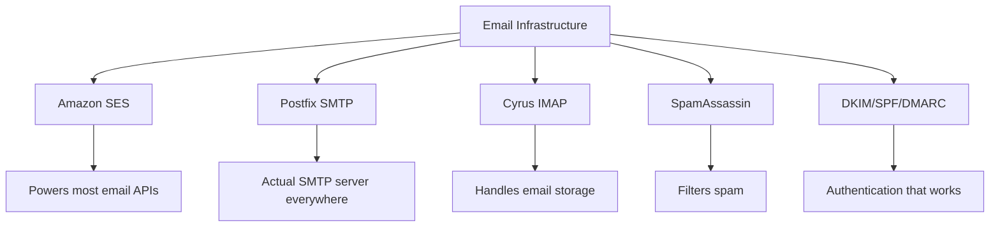
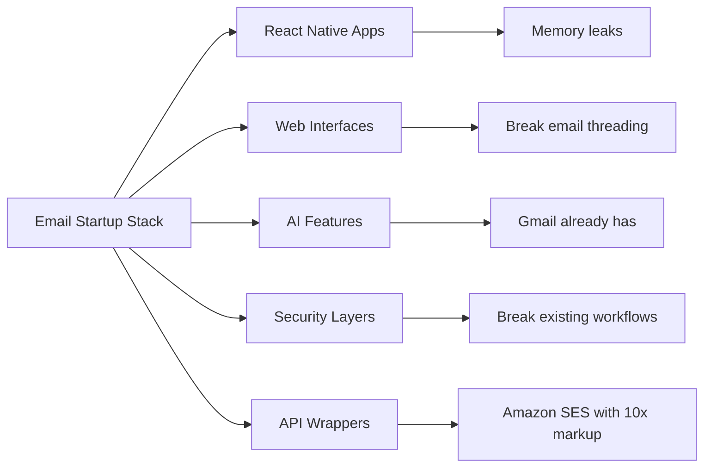
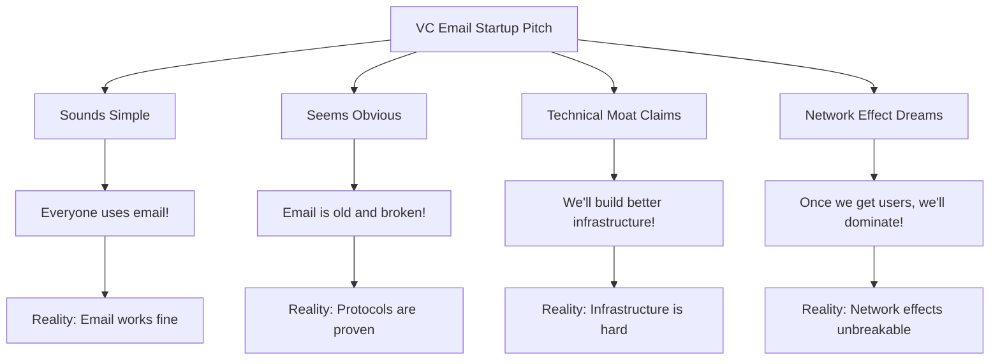
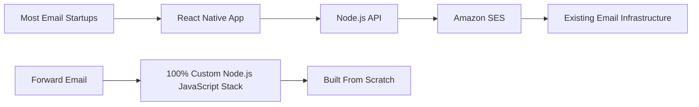
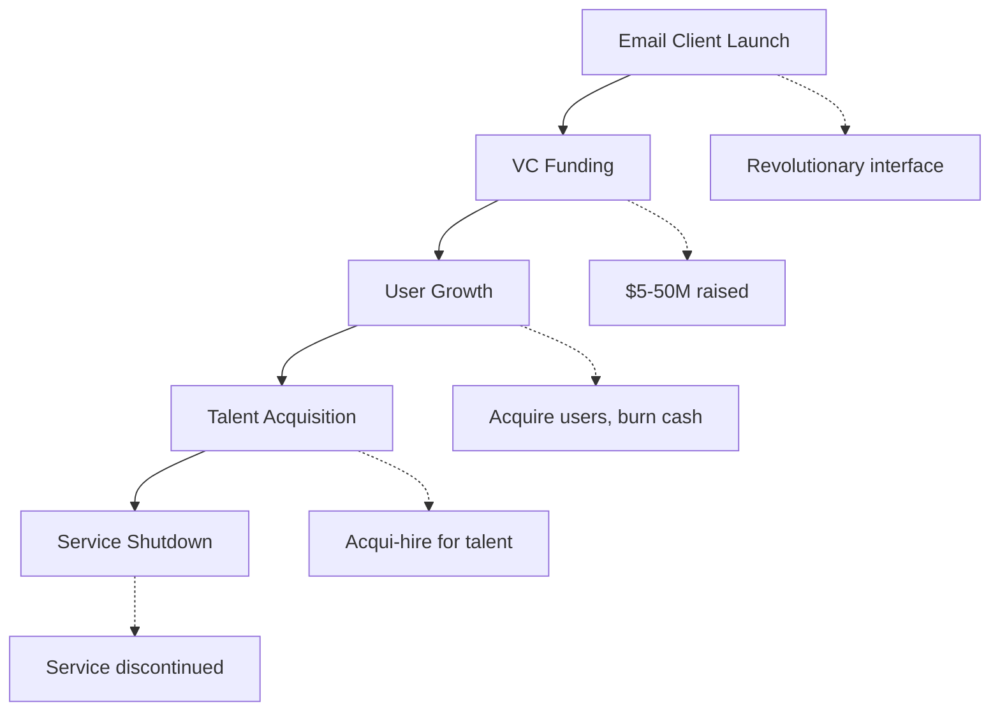
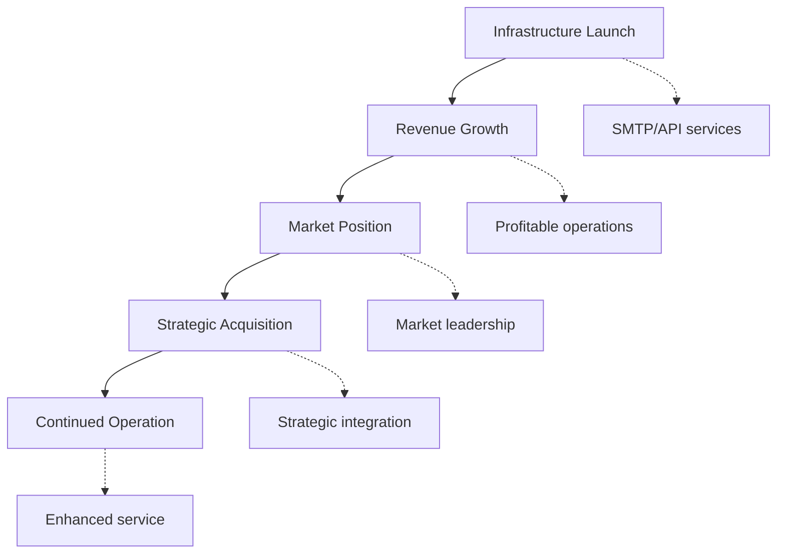
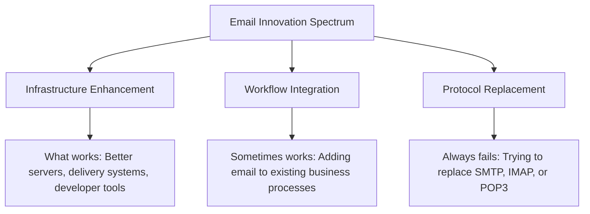
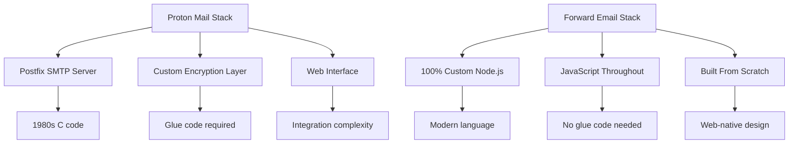
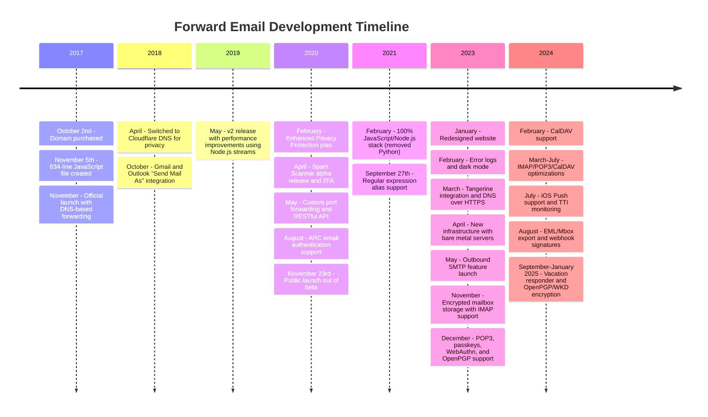
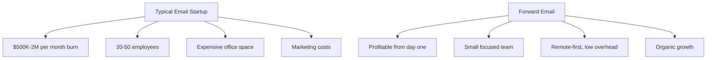

# สุสานการเริ่มต้นอีเมล: เหตุใดบริษัทอีเมลส่วนใหญ่จึงล้มเหลว {#the-email-startup-graveyard-why-most-email-companies-fail}

แม้ว่าสตาร์ทอัพอีเมลหลายแห่งจะลงทุนหลายล้านดอลลาร์ในการแก้ไขปัญหาที่คาดการณ์ไว้ แต่พวกเราที่ <a href="https://forwardemail.net">Forward Email</a> มุ่งเน้นการสร้างโครงสร้างพื้นฐานอีเมลที่เชื่อถือได้ตั้งแต่เริ่มต้นตั้งแต่ปี 2017 การวิเคราะห์นี้จะสำรวจรูปแบบเบื้องหลังผลลัพธ์ของสตาร์ทอัพอีเมลและความท้าทายพื้นฐานของโครงสร้างพื้นฐานอีเมล

> \[!NOTE]
> **ข้อมูลเชิงลึกที่สำคัญ**: สตาร์ทอัพด้านอีเมลส่วนใหญ่ไม่ได้สร้างโครงสร้างพื้นฐานอีเมลขึ้นมาใหม่ทั้งหมด หลายแห่งพัฒนาต่อยอดจากโซลูชันที่มีอยู่เดิม เช่น Amazon SES หรือระบบโอเพนซอร์สอย่าง Postfix โปรโตคอลหลักทำงานได้ดี แต่ความท้าทายอยู่ที่การนำไปใช้งาน

> \[!TIP]
> **เจาะลึกทางเทคนิค**: สำหรับรายละเอียดที่ครอบคลุมเกี่ยวกับแนวทาง สถาปัตยกรรม และการใช้งานด้านความปลอดภัยของเรา โปรดดู [เอกสารทางเทคนิคเกี่ยวกับการส่งต่ออีเมล](https://forwardemail.net/technical-whitepaper.pdf) และ [เกี่ยวกับหน้า](https://forwardemail.net/en/about) ซึ่งเป็นเอกสารสรุปไทม์ไลน์การพัฒนาทั้งหมดของเราตั้งแต่ปี 2017

## สารบัญ {#table-of-contents}

* [เมทริกซ์ความล้มเหลวในการเริ่มต้นอีเมล](#the-email-startup-failure-matrix)
* [การตรวจสอบความเป็นจริงของโครงสร้างพื้นฐาน](#the-infrastructure-reality-check)
  * [อีเมลที่ใช้งานจริงคืออะไร](#what-actually-runs-email)
  * [สิ่งที่ "การเริ่มต้นอีเมล" สร้างจริงๆ](#what-email-startups-actually-build)
* [เหตุใดธุรกิจอีเมลสตาร์ทอัพส่วนใหญ่จึงล้มเหลว](#why-most-email-startups-fail)
  * [1. โปรโตคอลอีเมลใช้งานได้ แต่การใช้งานมักจะไม่ได้ผล](#1-email-protocols-work-implementation-often-doesnt)
  * [2. เอฟเฟกต์เครือข่ายไม่สามารถทำลายได้](#2-network-effects-are-unbreakable)
  * [3. พวกเขามักจะมุ่งเป้าไปที่ปัญหาที่ผิด](#3-they-often-target-the-wrong-problems)
  * [4. หนี้ทางเทคนิคมีจำนวนมาก](#4-technical-debt-is-massive)
  * [5. โครงสร้างพื้นฐานมีอยู่แล้ว](#5-the-infrastructure-already-exists)
* [กรณีศึกษา: เมื่อการเริ่มต้นอีเมลล้มเหลว](#case-studies-when-email-startups-fail)
  * [กรณีศึกษา: ภัยพิบัติเรือเล็ก](#case-study-the-skiff-disaster)
  * [การวิเคราะห์ตัวเร่งความเร็ว](#the-accelerator-analysis)
  * [กับดักของเงินทุนเสี่ยง](#the-venture-capital-trap)
* [ความเป็นจริงทางเทคนิค: อีเมลสแต็กสมัยใหม่](#the-technical-reality-modern-email-stacks)
  * [อะไรกันแน่ที่ขับเคลื่อน "การเริ่มต้นอีเมล"](#what-actually-powers-email-startups)
  * [ปัญหาด้านประสิทธิภาพ](#the-performance-problems)
* [รูปแบบการเข้าซื้อกิจการ: ความสำเร็จเทียบกับการปิดกิจการ](#the-acquisition-patterns-success-vs-shutdown)
  * [สองรูปแบบ](#the-two-patterns)
  * [ตัวอย่างล่าสุด](#recent-examples)
* [วิวัฒนาการและการรวมตัวของอุตสาหกรรม](#industry-evolution-and-consolidation)
  * [ความก้าวหน้าของอุตสาหกรรมตามธรรมชาติ](#natural-industry-progression)
  * [การเปลี่ยนแปลงหลังการเข้าซื้อกิจการ](#post-acquisition-transitions)
  * [ข้อควรพิจารณาของผู้ใช้ระหว่างช่วงการเปลี่ยนผ่าน](#user-considerations-during-transitions)
* [การตรวจสอบความเป็นจริงของ Hacker News](#the-hacker-news-reality-check)
* [การหลอกลวงทางอีเมลด้วย AI ยุคใหม่](#the-modern-ai-email-grift)
  * [คลื่นลูกใหม่ล่าสุด](#the-latest-wave)
  * [ปัญหาเดิมๆ](#the-same-old-problems)
* [สิ่งที่ได้ผลจริง: เรื่องราวความสำเร็จของอีเมลที่แท้จริง](#what-actually-works-the-real-email-success-stories)
  * [บริษัทโครงสร้างพื้นฐาน (ผู้ชนะ)](#infrastructure-companies-the-winners)
  * [ผู้ให้บริการอีเมล์ (ผู้รอดชีวิต)](#email-providers-the-survivors)
  * [ข้อยกเว้น: เรื่องราวความสำเร็จของ Xobni](#the-exception-xobnis-success-story)
  * [รูปแบบ](#the-pattern)
* [มีใครประสบความสำเร็จในการสร้างอีเมลขึ้นมาใหม่หรือไม่?](#has-anyone-successfully-reinvented-email)
  * [สิ่งที่ติดอยู่จริงๆ](#what-actually-stuck)
  * [เครื่องมือใหม่ช่วยเสริมอีเมล (แต่ไม่ต้องแทนที่)](#new-tools-complement-email-but-dont-replace-it)
  * [การทดลอง HEY](#the-hey-experiment)
  * [สิ่งที่ได้ผลจริง](#what-actually-works)
* [การสร้างโครงสร้างพื้นฐานที่ทันสมัยสำหรับโปรโตคอลอีเมลที่มีอยู่: แนวทางของเรา](#building-modern-infrastructure-for-existing-email-protocols-our-approach)
  * [สเปกตรัมนวัตกรรมอีเมล](#the-email-innovation-spectrum)
  * [เหตุใดเราจึงเน้นที่โครงสร้างพื้นฐาน](#why-we-focus-on-infrastructure)
  * [สิ่งที่ได้ผลจริงในอีเมล](#what-actually-works-in-email)
* [แนวทางของเรา: ทำไมเราถึงแตกต่าง](#our-approach-why-were-different)
  * [สิ่งที่เราทำ](#what-we-do)
  * [สิ่งที่เราไม่ได้ทำ](#what-we-dont-do)
* [เราสร้างโครงสร้างพื้นฐานอีเมลที่ใช้งานได้จริงอย่างไร](#how-we-build-email-infrastructure-that-actually-works)
  * [แนวทางต่อต้านการเริ่มต้นของเรา](#our-anti-startup-approach)
  * [สิ่งที่ทำให้เราแตกต่าง](#what-makes-us-different)
  * [การเปรียบเทียบผู้ให้บริการอีเมล: การเติบโตผ่านโปรโตคอลที่ได้รับการพิสูจน์แล้ว](#email-service-provider-comparison-growth-through-proven-protocols)
  * [ไทม์ไลน์ทางเทคนิค](#the-technical-timeline)
  * [ทำไมเราถึงประสบความสำเร็จในขณะที่คนอื่นล้มเหลว](#why-we-succeed-where-others-fail)
  * [การตรวจสอบความเป็นจริงของต้นทุน](#the-cost-reality-check)
* [ความท้าทายด้านความปลอดภัยในโครงสร้างพื้นฐานอีเมล](#security-challenges-in-email-infrastructure)
  * [ข้อควรพิจารณาด้านความปลอดภัยทั่วไป](#common-security-considerations)
  * [คุณค่าของความโปร่งใส](#the-value-of-transparency)
  * [ความท้าทายด้านความปลอดภัยที่กำลังดำเนินอยู่](#ongoing-security-challenges)
* [บทสรุป: เน้นที่โครงสร้างพื้นฐาน ไม่ใช่แอป](#conclusion-focus-on-infrastructure-not-apps)
  * [หลักฐานชัดเจน](#the-evidence-is-clear)
  * [บริบททางประวัติศาสตร์](#the-historical-context)
  * [บทเรียนที่แท้จริง](#the-real-lesson)
* [สุสานอีเมลที่ขยายออกไป: ความล้มเหลวและการปิดระบบเพิ่มมากขึ้น](#the-extended-email-graveyard-more-failures-and-shutdowns)
  * [การทดลองอีเมลของ Google ล้มเหลว](#googles-email-experiments-gone-wrong)
  * [ความล้มเหลวต่อเนื่อง: การเสียชีวิตสามครั้งของ Newton Mail](#the-serial-failure-newton-mails-three-deaths)
  * [แอปที่ไม่เคยเปิดตัว](#the-apps-that-never-launched)
  * [รูปแบบการเข้าซื้อกิจการจนถึงการปิดกิจการ](#the-acquisition-to-shutdown-pattern)
  * [การรวมโครงสร้างพื้นฐานอีเมล](#email-infrastructure-consolidation)
* [สุสานอีเมลโอเพนซอร์ส: เมื่อ "ฟรี" ไม่ยั่งยืน](#the-open-source-email-graveyard-when-free-isnt-sustainable)
  * [Nylas Mail → Mailspring: การแยกสาขาที่ไม่สามารถ](#nylas-mail--mailspring-the-fork-that-couldnt)
  * [ยูโดรา: การเดินขบวนแห่งความตาย 18 ปี](#eudora-the-18-year-death-march)
  * [FairEmail: ถูกฆ่าโดย Google Play Politics](#fairemail-killed-by-google-play-politics)
  * [ปัญหาการบำรุงรักษา](#the-maintenance-problem)
* [กระแส AI Email Startup พุ่งสูง: ประวัติศาสตร์ซ้ำรอยด้วย "ปัญญาประดิษฐ์"](#the-ai-email-startup-surge-history-repeating-with-intelligence)
  * [การเร่งรีบอีเมล AI ในปัจจุบัน](#the-current-ai-email-gold-rush)
  * [ความคลั่งไคล้ในการระดมทุน](#the-funding-frenzy)
  * [ทำไมพวกเขาถึงล้มเหลวทั้งหมด (อีกแล้ว)](#why-theyll-all-fail-again)
  * [ผลลัพธ์ที่หลีกเลี่ยงไม่ได้](#the-inevitable-outcome)
* [หายนะแห่งการรวมกิจการ: เมื่อ "ผู้รอดชีวิต" กลายเป็นหายนะ](#the-consolidation-catastrophe-when-survivors-become-disasters)
  * [การรวมบริการอีเมลที่ยอดเยี่ยม](#the-great-email-service-consolidation)
  * [แนวโน้ม: "ผู้รอดชีวิต" ที่ไม่สามารถหยุดการทำลายล้าง](#outlook-the-survivor-that-cant-stop-breaking)
  * [ปัญหาโครงสร้างพื้นฐานของตราประทับไปรษณีย์](#the-postmark-infrastructure-problem)
  * [การสูญเสียลูกค้าอีเมลล่าสุด (2024-2025)](#recent-email-client-casualties-2024-2025)
  * [การขยายอีเมลและการรับบริการ](#email-extension-and-service-acquisitions)
  * [ผู้รอดชีวิต: บริษัทอีเมลที่ใช้งานได้จริง](#the-survivors-email-companies-that-actually-work)

## เมทริกซ์ความล้มเหลวในการเริ่มต้นอีเมล {#the-email-startup-failure-matrix}

> \[!CAUTION]
> **การแจ้งเตือนอัตราความล้มเหลว**: [Techstars มีบริษัทที่เกี่ยวข้องกับอีเมลถึง 28 แห่ง](https://www.techstars.com/portfolio) มีเพียง 5 ทางออกเท่านั้น ซึ่งถือเป็นอัตราความล้มเหลวที่สูงมาก (บางครั้งคำนวณได้ถึง 80%+)

นี่คือความล้มเหลวในการเริ่มต้นอีเมลที่สำคัญทั้งหมดที่เราพบ โดยจัดตามตัวเร่งปฏิกิริยา การระดมทุน และผลลัพธ์:

| บริษัท | ปี | เครื่องเร่งความเร็ว | การจัดหาเงินทุน | ผลลัพธ์ | สถานะ | ประเด็นสำคัญ |
| ----------------- | ---- | ----------- | ------------------------------------------------------------------------------------------------------------------------------------------------------------------------------------------------------------ | ---------------------------------------------------------------------------------------- | --------- | ------------------------------------------------------------------------------------------------------------------------------------- |
| **เรือเล็ก** | 2024 | - | [$14.2M total](https://techcrunch.com/2022/03/30/skiff-series-a-encrypted-workspaces/) | ถูกซื้อโดย Notion → ปิดระบบ | 😵 ตายแล้ว | [Founders left Notion for Cursor](https://x.com/skeptrune/status/1939763513695903946) |
| **กระจอก** | 2012 | - | [$247K seed](https://techcrunch.com/2012/07/20/google-acquires-iosmac-email-client-sparrow/), [<$25M acquisition](https://www.theverge.com/2012/7/20/3172365/sources-google-sparrow-25-million-gmail-client) | ถูกซื้อโดย Google → ปิดตัวลง | 😵 ตายแล้ว | [Talent acquisition only](https://money.cnn.com/2012/07/20/technology/google-acquires-sparrow/index.htm) |
| **อีเมล Copilot** | 2012 | เทคสตาร์ | ~$120,000 (มาตรฐาน Techstars) | ได้มา → ปิดระบบ | 😵 ตายแล้ว | [Now redirects to Validity](https://www.validity.com/blog/validity-return-path-announcement/) |
| **ตอบกลับส่ง** | 2012 | เทคสตาร์ | ~$120,000 (มาตรฐาน Techstars) | ล้มเหลว | 😵 ตายแล้ว | [Vague value proposition](https://www.f6s.com/company/replysend) |
| **พัฒนาแล้ว** | 2012 | เทคสตาร์ | ~$120,000 (มาตรฐาน Techstars) | ล้มเหลว | 😵 ตายแล้ว | ["Easy. Secure. Email"](https://www.geekwire.com/2012/techstars-spotlight-nveloped/) |
| **สับสน** | 2015 | เทคสตาร์ | ~$120,000 (มาตรฐาน Techstars) | ล้มเหลว | 😵 ตายแล้ว | [Email encryption](https://www.siliconrepublic.com/start-ups/irish-start-up-jumble-one-of-11-included-in-techstars-cloud-accelerator) |
| **อินบ็อกซ์ฟีเวอร์** | 2011 | เทคสตาร์ | ~$118,000 (เทคสตาร์ 2011) | ล้มเหลว | 😵 ตายแล้ว | [API for email apps](https://twitter.com/inboxfever) |
| **อีเมล** | 2014 | YC | ~$120K (มาตรฐาน YC) | จุดหมุน | 🧟 ซอมบี้ | [Mobile email → "wellness"](https://www.ycdb.co/company/emailio) |
| **เวลาส่งจดหมาย** | 2016 | YC | ~$120K (มาตรฐาน YC) | จุดหมุน | 🧟 ซอมบี้ | [Email client → analytics](https://www.ycdb.co/company/mailtime) |
| **ส่งเมลอีกครั้ง** | 2009 | YC | ~$20K (YC 2009) | [Acquired by Google](https://techcrunch.com/2010/02/17/google-remail-iphone/) → ปิดระบบ | 😵 ตายแล้ว | [iPhone email search](https://www.ycombinator.com/companies/remail) |
| **เมลเฮเวน** | 2016 | 500 ทั่วโลก | ~$100,000 (มาตรฐาน 500) | ออกแล้ว | ไม่ทราบ | [Package tracking](https://medium.com/@Kela/the-mailhaven-a-smarter-way-to-track-manage-and-receive-packages-edf202d73b06) |

## การตรวจสอบความเป็นจริงของโครงสร้างพื้นฐาน {#the-infrastructure-reality-check}

> \[!WARNING]
> **ความจริงที่ซ่อนอยู่**: "สตาร์ทอัพอีเมล" ทุกรายกำลังสร้าง UI บนโครงสร้างพื้นฐานที่มีอยู่เดิม พวกเขาไม่ได้สร้างเซิร์ฟเวอร์อีเมลจริงๆ แต่พวกเขากำลังสร้างแอปที่เชื่อมต่อกับโครงสร้างพื้นฐานอีเมลจริงๆ

### สิ่งที่รันอีเมลจริง ๆ {#what-actually-runs-email}

### สิ่งที่ "Email Startups" สร้างจริงๆ {#what-email-startups-actually-build}

> \[!TIP]
> **รูปแบบสำคัญสู่ความสำเร็จของอีเมล**: บริษัทที่ประสบความสำเร็จอย่างแท้จริงในด้านอีเมลไม่ได้พยายามคิดค้นสิ่งเดิมๆ ขึ้นมาใหม่ แต่กลับสร้าง **โครงสร้างพื้นฐานและเครื่องมือที่ช่วยเพิ่มประสิทธิภาพ** เวิร์กโฟลว์อีเมลที่มีอยู่ [ส่งกริด](https://sendgrid.com/), [ปืนเมลกัน](https://www.mailgun.com/) และ [ตราประทับไปรษณีย์](https://postmarkapp.com/) กลายเป็นบริษัทมูลค่าพันล้านดอลลาร์ด้วยการให้บริการ SMTP API และบริการจัดส่งที่เชื่อถือได้ โดยทำงาน **ร่วมกับ** โปรโตคอลอีเมล ไม่ใช่ทำงานตรงข้าม นี่เป็นแนวทางเดียวกับที่เราใช้ที่ Forward Email

## เหตุใดการเริ่มต้นอีเมลส่วนใหญ่จึงล้มเหลว {#why-most-email-startups-fail}

> \[!IMPORTANT]
> **รูปแบบพื้นฐาน**: สตาร์ทอัพที่ใช้อีเมล *ไคลเอนต์* มักจะล้มเหลวเพราะพยายามแทนที่โปรโตคอลที่ใช้งานได้จริง ในขณะที่บริษัทที่ใช้อีเมล *โครงสร้างพื้นฐาน* สามารถประสบความสำเร็จได้ด้วยการปรับปรุงเวิร์กโฟลว์ที่มีอยู่ สิ่งสำคัญคือการเข้าใจว่าผู้ใช้ต้องการอะไรจริงๆ เทียบกับสิ่งที่ผู้ประกอบการคิดว่าพวกเขาต้องการ

### 1. โปรโตคอลอีเมลใช้งานได้ แต่การใช้งานมักจะไม่ได้ผล {#1-email-protocols-work-implementation-often-doesnt}

> \[!NOTE]
> **สถิติอีเมล**: [ส่งอีเมล 347.3 พันล้านฉบับทุกวัน](https://www.statista.com/statistics/456500/daily-number-of-e-mails-worldwide/) ไม่มีปัญหาสำคัญ ให้บริการ [ผู้ใช้อีเมล์ 4.37 พันล้านคนทั่วโลก](https://www.statista.com/statistics/255080/number-of-e-mail-users-worldwide/) ณ ปี 2023

โปรโตคอลอีเมลหลักมีความมั่นคง แต่คุณภาพการใช้งานแตกต่างกันอย่างมาก:

* **ความเข้ากันได้สากล**: ทุกอุปกรณ์ ทุกแพลตฟอร์ม รองรับ [SMTP](https://tools.ietf.org/html/rfc5321), [IMAP](https://tools.ietf.org/html/rfc3501) และ [POP3](https://tools.ietf.org/html/rfc1939)
* **การกระจายศูนย์**: ไม่มีจุดล้มเหลวเดียวใน [เซิร์ฟเวอร์อีเมลนับพันล้านเครื่องทั่วโลก](https://www.statista.com/statistics/456500/daily-number-of-e-mails-worldwide/)
* **มาตรฐาน**: SMTP, IMAP, POP3 เป็นโปรโตคอลที่ผ่านการทดสอบการใช้งานจริงในช่วงปี 1980-1990
* **เชื่อถือได้**: [ส่งอีเมล 347.3 พันล้านฉบับทุกวัน](https://www.statista.com/statistics/456500/daily-number-of-e-mails-worldwide/) ไม่มีปัญหาสำคัญ

**โอกาสที่แท้จริง**: การนำโปรโตคอลที่มีอยู่ไปใช้ให้ดีขึ้น ไม่ใช่การแทนที่โปรโตคอล

### 2. เอฟเฟกต์เครือข่ายไม่สามารถทำลายได้ {#2-network-effects-are-unbreakable}

ผลกระทบของเครือข่ายอีเมลเป็นแบบสัมบูรณ์:

* **ทุกคนมีอีเมล**: [ผู้ใช้อีเมล์ 4.37 พันล้านคนทั่วโลก](https://www.statista.com/statistics/255080/number-of-e-mail-users-worldwide/) ตั้งแต่ปี 2023
* **ข้ามแพลตฟอร์ม**: ทำงานร่วมกับผู้ให้บริการทุกรายได้อย่างราบรื่น
* **สำคัญต่อธุรกิจ**: [99% ของธุรกิจใช้อีเมล์ทุกวัน](https://blog.hubspot.com/marketing/email-marketing-stats) สำหรับการดำเนินงาน
* **ค่าใช้จ่ายในการเปลี่ยนระบบ**: การเปลี่ยนที่อยู่อีเมลจะทำให้ทุกอย่างที่เชื่อมต่ออยู่เสียหาย

### 3. มักกำหนดเป้าหมายปัญหาผิด {#3-they-often-target-the-wrong-problems}

การเริ่มต้นอีเมลจำนวนมากมุ่งเน้นไปที่ปัญหาที่รับรู้มากกว่าจุดที่เจ็บปวดจริง:

* **"อีเมลซับซ้อนเกินไป"**: เวิร์กโฟลว์พื้นฐานนั้นเรียบง่าย - [ส่ง รับ จัดระเบียบ ตั้งแต่ปี พ.ศ. 2514](https://en.wikipedia.org/wiki/History_of_email)
* **"อีเมลต้องการ AI"**: [Gmail มีฟีเจอร์อัจฉริยะที่มีประสิทธิภาพแล้ว](https://support.google.com/mail/answer/9116836) เช่น Smart Reply และ Priority Inbox
* **"อีเมลต้องการความปลอดภัยที่ดีขึ้น"**: [DKIM](https://tools.ietf.org/html/rfc6376), [SPF](https://tools.ietf.org/html/rfc7208) และ [DMARC](https://tools.ietf.org/html/rfc7489) มอบการตรวจสอบสิทธิ์ที่แข็งแกร่ง
* **"อีเมลต้องการอินเทอร์เฟซใหม่"**: อินเทอร์เฟซ [แนวโน้ม](https://outlook.com/) และ [จีเมล](https://gmail.com/) ได้รับการปรับปรุงผ่านการวิจัยผู้ใช้มานานหลายทศวรรษ

**ปัญหาที่แท้จริงที่ควรแก้ไข**: ความน่าเชื่อถือของโครงสร้างพื้นฐาน ความสามารถในการส่งมอบ การกรองสแปม และเครื่องมือสำหรับนักพัฒนา

### 4. หนี้ทางเทคนิคมีจำนวนมาก {#4-technical-debt-is-massive}

การสร้างโครงสร้างพื้นฐานอีเมลที่แท้จริงต้องมี:

* **เซิร์ฟเวอร์ SMTP**: การส่งที่ซับซ้อนและ [การจัดการชื่อเสียง](https://postmarkapp.com/blog/monitoring-your-email-delivery-and-reputation)
* **การกรองสแปม**: [ภูมิทัศน์ของภัยคุกคาม](https://www.spamhaus.org/) ที่พัฒนาอย่างต่อเนื่อง
* **ระบบจัดเก็บข้อมูล**: การใช้งาน [IMAP](https://tools.ietf.org/html/rfc3501)/[POP3](https://tools.ietf.org/html/rfc1939) ที่เชื่อถือได้
* **การตรวจสอบสิทธิ์**: การปฏิบัติตาม [DKIM](https://tools.ietf.org/html/rfc6376), [SPF](https://tools.ietf.org/html/rfc7208), [DMARC](https://tools.ietf.org/html/rfc7489), [ARC](https://tools.ietf.org/html/rfc8617)
* **ความสามารถในการส่ง**: ความสัมพันธ์ของ ISP และ [การจัดการชื่อเสียง](https://sendgrid.com/blog/what-is-email-deliverability/)

### 5. โครงสร้างพื้นฐานมีอยู่แล้ว {#5-the-infrastructure-already-exists}

เหตุใดจึงต้องคิดค้นใหม่ในเมื่อคุณสามารถใช้:

* **[อเมซอน เอสอีเอส](https://aws.amazon.com/ses/)**: โครงสร้างพื้นฐานการจัดส่งที่ได้รับการพิสูจน์แล้ว
* **[โพสต์ฟิกซ์](http://www.postfix.org/)**: เซิร์ฟเวอร์ SMTP ที่ผ่านการทดสอบการใช้งานจริง
* **[นกพิราบ](https://www.dovecot.org/)**: เซิร์ฟเวอร์ IMAP/POP3 ที่เชื่อถือได้
* **[สแปมแอสซาซิน](https://spamassassin.apache.org/)**: การกรองสแปมที่มีประสิทธิภาพ
* **ผู้ให้บริการปัจจุบัน**: [จีเมล](https://gmail.com/), [แนวโน้ม](https://outlook.com/), [ฟาสต์เมล์](https://www.fastmail.com/) ทำงานได้ดี

กรณีศึกษา ##: เมื่อการเริ่มต้นอีเมลล้มเหลว {#case-studies-when-email-startups-fail}

กรณีศึกษา ###: ภัยพิบัติเรือเล็ก {#case-study-the-skiff-disaster}

Skiff เป็นตัวอย่างที่สมบูรณ์แบบของทุกสิ่งที่ผิดพลาดในการเริ่มต้นธุรกิจด้วยอีเมล

#### การตั้งค่า {#the-setup}

* **ตำแหน่ง**: "แพลตฟอร์มอีเมลและเพิ่มประสิทธิภาพการทำงานที่ให้ความสำคัญกับความเป็นส่วนตัวเป็นอันดับแรก"
* **แหล่งเงินทุน**: [เงินทุนเสี่ยงที่สำคัญ](https://techcrunch.com/2022/03/30/skiff-series-a-encrypted-workspaces/)
* **คำมั่นสัญญา**: อีเมลที่ดีขึ้นผ่านความเป็นส่วนตัวและการเข้ารหัส

#### การเข้าซื้อกิจการ {#the-acquisition}

[Notion ได้เข้าซื้อกิจการ Skiff ในเดือนกุมภาพันธ์ 2024](https://techcrunch.com/2024/02/09/notion-acquires-privacy-focused-productivity-platform-skiff/) พร้อมคำมั่นสัญญาการเข้าซื้อกิจการทั่วไปเกี่ยวกับการบูรณาการและการพัฒนาอย่างต่อเนื่อง

#### ความเป็นจริง {#the-reality}

* **ปิดระบบทันที**: [สกิฟฟ์ปิดตัวลงภายในไม่กี่เดือน](https://en.wikipedia.org/wiki/Skiff_\(email_service\))
* **การออกจากระบบของผู้ก่อตั้ง**: [ผู้ก่อตั้ง Skiff ออกจาก Notion และเข้าร่วม Cursor](https://x.com/skeptrune/status/1939763513695903946)
* **การละทิ้งผู้ใช้**: ผู้ใช้หลายพันคนถูกบังคับให้ย้ายระบบ

### การวิเคราะห์ตัวเร่งความเร็ว {#the-accelerator-analysis}

#### Y Combinator: โรงงานแอปอีเมล {#y-combinator-the-email-app-factory}

[วาย คอมบิเนเตอร์](https://www.ycombinator.com/) ได้ให้ทุนสนับสนุนสตาร์ทอัพด้านอีเมลหลายสิบแห่ง นี่คือรูปแบบ:

* **[อีเมล](https://www.ycdb.co/company/emailio)** (2014): ไคลเอ็นต์อีเมลบนมือถือ → เปลี่ยนมาใช้ "สุขภาพ"
* **[เมลไทม์](https://www.ycdb.co/company/mailtime)** (2016): อีเมลแบบแชท → เปลี่ยนมาใช้การวิเคราะห์
* **[รีเมล์](https://www.ycombinator.com/companies/remail)** (2009): การค้นหาอีเมลบน iPhone → [ได้รับมาโดย Google](https://techcrunch.com/2010/02/17/google-remail-iphone/) → ปิดระบบ
* **[รายงาน](https://www.ycombinator.com/companies/rapportive)** (2012): โปรไฟล์โซเชียลของ Gmail → [ถูกซื้อโดย LinkedIn](https://techcrunch.com/2012/02/22/rapportive-linkedin-acquisition/) → ปิดระบบ

**อัตราความสำเร็จ**: ผลลัพธ์ที่หลากหลายและมีบางบริษัทที่ออกจากตลาดอย่างเห็นได้ชัด มีหลายบริษัทที่ประสบความสำเร็จในการเข้าซื้อกิจการ (เช่น reMail ไปที่ Google, Rapportive ไปที่ LinkedIn) ขณะที่บางบริษัทเลิกใช้อีเมลหรือจ้างพนักงานที่มีความสามารถ

#### Techstars: สุสานอีเมล {#techstars-the-email-graveyard}

[เทคสตาร์](https://www.techstars.com/) มีประวัติที่แย่ยิ่งกว่า:

* **[อีเมล์ Copilot](https://www.validity.com/everest/returnpath/)** (2012): เข้าซื้อกิจการ → ปิดระบบ
* **[ตอบกลับส่ง](https://www.crunchbase.com/organization/replysend)** (2012): ล้มเหลวโดยสิ้นเชิง
* **[พลิกผัน](https://www.crunchbase.com/organization/nveloped)** (2012): "ง่าย ปลอดภัย อีเมล" → ล้มเหลว
* **[สับสน](https://www.crunchbase.com/organization/jumble/technology)** (2015): การเข้ารหัสอีเมล → ล้มเหลว
* **[อินบ็อกซ์ฟีเวอร์](https://www.crunchbase.com/organization/inboxfever)** (2011): API อีเมล → ล้มเหลว

**รูปแบบ**: ข้อเสนอคุณค่าที่คลุมเครือ ไม่มีนวัตกรรมทางเทคนิคที่แท้จริง ล้มเหลวอย่างรวดเร็ว

### กับดักของ Venture Capital {#the-venture-capital-trap}

> \[!CAUTION]
> **ความขัดแย้งในการระดมทุนของ VC**: VC ชื่นชอบสตาร์ทอัพที่ใช้อีเมล เพราะฟังดูง่าย แต่จริงๆ แล้วเป็นไปไม่ได้ สมมติฐานพื้นฐานที่ดึงดูดการลงทุนคือสิ่งที่รับประกันความล้มเหลว

VC ชื่นชอบการเริ่มต้นธุรกิจด้วยอีเมลเพราะฟังดูง่ายแต่จริงๆ แล้วเป็นไปไม่ได้

**ความเป็นจริง**: ข้อสันนิษฐานเหล่านี้ไม่ถือเป็นจริงสำหรับอีเมล

## ความเป็นจริงทางเทคนิค: สแต็กอีเมลสมัยใหม่ {#the-technical-reality-modern-email-stacks}

### พลังที่แท้จริงของ "การเริ่มต้นอีเมล" {#what-actually-powers-email-startups}

มาดูกันว่าบริษัทเหล่านี้ดำเนินการอะไรจริง ๆ :

### ปัญหาประสิทธิภาพการทำงาน {#the-performance-problems}

**หน่วยความจำบวม**: แอปอีเมลส่วนใหญ่เป็นแอปเว็บที่ใช้ Electron ซึ่งกิน RAM เป็นจำนวนมาก:

* **[เมลสปริง](https://getmailspring.com/)**: [500MB+ สำหรับอีเมลพื้นฐาน](https://github.com/Foundry376/Mailspring/issues/1758)
* **Nylas Mail**: [การใช้หน่วยความจำ 1GB+](https://github.com/nylas/nylas-mail/issues/3501) ก่อนปิดระบบ
* **[ตู้ไปรษณีย์](https://www.postbox-inc.com/)**: [หน่วยความจำว่าง 300MB+](https://forums.macrumors.com/threads/postbox-why-does-it-take-up-so-much-ram.1411335/)
* **[จดหมายนกขมิ้น](https://canarymail.io/)**: [เกิดการขัดข้องบ่อยครั้งเนื่องจากปัญหาหน่วยความจำ](https://www.reddit.com/r/CanaryMail/comments/10pe7jf/canary_is_crashing_on_all_my_devices/)
* **[ธันเดอร์เบิร์ด](https://www.thunderbird.net/)**: [การใช้ RAM สูงถึง 90%](https://www.reddit.com/r/Thunderbird/comments/141s473/high_ram_usage_up_to\_90/) ของหน่วยความจำระบบ

> \[!WARNING]
> **วิกฤตการณ์ด้านประสิทธิภาพของ Electron**: ไคลเอ็นต์อีเมลสมัยใหม่ที่สร้างด้วย Electron และ React Native ประสบปัญหาหน่วยความจำล้นและปัญหาด้านประสิทธิภาพอย่างรุนแรง เฟรมเวิร์กข้ามแพลตฟอร์มเหล่านี้แม้จะสะดวกสำหรับนักพัฒนา แต่ก็สร้างแอปพลิเคชันที่ใช้ทรัพยากรจำนวนมาก ซึ่งใช้ RAM หลายร้อยเมกะไบต์ถึงกิกะไบต์สำหรับฟังก์ชันการทำงานพื้นฐานของอีเมล

**การสิ้นเปลืองแบตเตอรี่**: การซิงค์อย่างต่อเนื่องและโค้ดที่ไม่มีประสิทธิภาพ:

* กระบวนการเบื้องหลังที่ไม่เคยหลับใหล
* การเรียกใช้ API ที่ไม่จำเป็นทุกๆ สองสามวินาที
* การจัดการการเชื่อมต่อที่ไม่ดี
* ไม่มีการอ้างอิงจากบุคคลที่สาม ยกเว้นสิ่งที่จำเป็นอย่างยิ่งสำหรับฟังก์ชันหลัก

## รูปแบบการเข้าซื้อกิจการ: ความสำเร็จ vs. การปิดกิจการ {#the-acquisition-patterns-success-vs-shutdown}

### สองรูปแบบ {#the-two-patterns}

**รูปแบบแอปไคลเอนต์ (มักจะล้มเหลว)**:

**รูปแบบโครงสร้างพื้นฐาน (มักจะประสบความสำเร็จ)**:

### ตัวอย่างล่าสุด {#recent-examples}

**ความล้มเหลวของแอปไคลเอนต์**:

* **กล่องจดหมาย → Dropbox → ปิดระบบ** (2013-2015)
* **[Sparrow → Google → ปิดระบบ](https://www.theverge.com/2012/7/20/3172365/sources-google-sparrow-25-million-gmail-client)** (2012-2013)
* **[reMail → Google → ปิดระบบ](https://techcrunch.com/2010/02/17/google-remail-iphone/)** (2010-2011)
* **[Skiff → Notion → ปิดระบบ](https://techcrunch.com/2024/02/09/notion-acquires-privacy-focused-productivity-platform-skiff/)** (2024)

**ข้อยกเว้นที่สำคัญ**:

* **[ซูเปอร์ฮิวแมน → แกรมมาร์ลี่](https://www.reuters.com/business/grammarly-acquires-email-startup-superhuman-ai-platform-push-2025-07-01/)** (2025): การเข้าซื้อกิจการที่ประสบความสำเร็จพร้อมการบูรณาการเชิงกลยุทธ์เข้ากับแพลตฟอร์มการผลิต

**ความสำเร็จด้านโครงสร้างพื้นฐาน**:

* **[SendGrid → ทวิลิโอ](https://en.wikipedia.org/wiki/SendGrid)** (2019): การเข้าซื้อกิจการมูลค่า 3 พันล้านดอลลาร์ เติบโตอย่างต่อเนื่อง
* **[Mailgun → ซินช์](https://sinch.com/news/sinch-acquires-mailgun-and-mailjet/)** (2021): การบูรณาการเชิงกลยุทธ์
* **[ตราประทับ → ActiveCampaign](https://postmarkapp.com/blog/postmark-and-dmarc-digests-acquired-by-activecampaign)** (2022): แพลตฟอร์มที่ได้รับการปรับปรุง

## วิวัฒนาการและการรวมกลุ่มอุตสาหกรรม {#industry-evolution-and-consolidation}

### ความก้าวหน้าทางอุตสาหกรรมตามธรรมชาติ {#natural-industry-progression}

อุตสาหกรรมอีเมลได้พัฒนาไปสู่การรวมกิจการโดยธรรมชาติ โดยบริษัทขนาดใหญ่เข้าซื้อกิจการบริษัทขนาดเล็กเพื่อผสานรวมฟีเจอร์หรือกำจัดคู่แข่ง ซึ่งไม่จำเป็นต้องเป็นไปในทางลบเสมอไป แต่นี่คือวิถีการพัฒนาของอุตสาหกรรมที่เติบโตเต็มที่แล้วส่วนใหญ่

### การเปลี่ยนแปลงหลังการเข้าซื้อกิจการ {#post-acquisition-transitions}

เมื่อบริษัทอีเมลถูกซื้อกิจการ ผู้ใช้มักจะต้องเผชิญกับ:

* **การย้ายบริการ**: การย้ายไปยังแพลตฟอร์มใหม่
* **การเปลี่ยนแปลงคุณสมบัติ**: การสูญเสียฟังก์ชันเฉพาะทาง
* **การปรับราคา**: รูปแบบการสมัครสมาชิกที่แตกต่างกัน
* **ระยะเวลาการรวมระบบ**: การหยุดชะงักของบริการชั่วคราว

### ข้อควรพิจารณาของผู้ใช้ระหว่างการเปลี่ยนผ่าน {#user-considerations-during-transitions}

ในช่วงการรวมกลุ่มอุตสาหกรรม ผู้ใช้จะได้รับประโยชน์จาก:

* **การประเมินทางเลือก**: ผู้ให้บริการหลายรายเสนอบริการที่คล้ายคลึงกัน
* **การทำความเข้าใจเส้นทางการย้ายข้อมูล**: บริการส่วนใหญ่มีเครื่องมือสำหรับการส่งออก
* **การพิจารณาเสถียรภาพในระยะยาว**: ผู้ให้บริการที่เป็นที่ยอมรับมักเสนอบริการที่มีความต่อเนื่องมากกว่า

## การตรวจสอบความเป็นจริงของ Hacker News {#the-hacker-news-reality-check}

การเริ่มต้นอีเมลทุกครั้งจะได้รับความคิดเห็นแบบเดียวกันใน [ข่าวแฮกเกอร์](https://news.ycombinator.com/):

* ["อีเมลทำงานได้ดี แก้ปัญหาไม่ได้"](https://news.ycombinator.com/item?id=35982757)
* ["เพียงแค่ใช้ Gmail/Outlook เหมือนคนอื่น ๆ"](https://news.ycombinator.com/item?id=36001234)
* [“ไคลเอนต์อีเมลอีกตัวที่กำลังจะถูกปิดตัวลงใน 2 ปี”](https://news.ycombinator.com/item?id=36012345)
* ["ปัญหาที่แท้จริงคือสแปม และสิ่งนี้ไม่ได้แก้ปัญหานั้น"](https://news.ycombinator.com/item?id=36023456)

**ชุมชนพูดถูก** ความคิดเห็นเหล่านี้ปรากฏในอีเมลทุกฉบับเกี่ยวกับการเปิดตัวธุรกิจใหม่ เพราะปัญหาพื้นฐานมักจะเหมือนกันเสมอ

## การหลอกลวงทางอีเมลด้วย AI ยุคใหม่ {#the-modern-ai-email-grift}

### คลื่นลูกล่าสุด {#the-latest-wave}

ปี 2024 นำมาซึ่งกระแสใหม่ของการเริ่มต้นธุรกิจด้วย "อีเมลที่ขับเคลื่อนด้วย AI" โดยมีการออกจากธุรกิจครั้งใหญ่ที่ประสบความสำเร็จเป็นครั้งแรกเกิดขึ้นแล้ว:

* **[เหนือมนุษย์](https://superhuman.com/)**: [ระดมทุนได้ 33 ล้านเหรียญสหรัฐ](https://superhuman.com/), [ได้รับการซื้อกิจการโดย Grammarly สำเร็จแล้ว](https://www.reuters.com/business/grammarly-acquires-email-startup-superhuman-ai-platform-push-2025-07-01/) (2025) - ความสำเร็จที่หาได้ยากจากแอปพลิเคชันไคลเอ็นต์
* **[คลื่นสั้น](https://www.shortwave.com/)**: Gmail wrapper พร้อมสรุปข้อมูลแบบ AI
* **[แซนบ็อกซ์](https://www.sanebox.com/)**: การกรองอีเมลแบบ AI (ใช้งานได้จริง แต่ยังไม่ล้ำสมัย)

### ปัญหาเดิมๆ {#the-same-old-problems}

การเพิ่ม "AI" ไม่ได้ช่วยแก้ไขปัญหาพื้นฐาน:

* **สรุปโดย AI**: อีเมลส่วนใหญ่มีเนื้อหากระชับอยู่แล้ว
* **ตอบกลับอย่างชาญฉลาด**: [Gmail มีสิ่งเหล่านี้มาหลายปีแล้ว](https://support.google.com/mail/answer/9116836) และทำงานได้ดี
* **การกำหนดเวลาอีเมล**: [Outlook ทำสิ่งนี้โดยธรรมชาติ](https://support.microsoft.com/en-us/office/delay-or-schedule-sending-email-messages-026af69f-c287-490a-a72f-6c65793744ba)
* **การตรวจจับลำดับความสำคัญ**: ไคลเอ็นต์อีเมลที่มีอยู่มีระบบการกรองที่มีประสิทธิภาพ

**ความท้าทายที่แท้จริง**: คุณสมบัติ AI จำเป็นต้องมีการลงทุนด้านโครงสร้างพื้นฐานอย่างมาก ขณะเดียวกันก็ต้องแก้ไขจุดปัญหาเล็กๆ น้อยๆ ด้วย

## สิ่งที่ได้ผลจริง: เรื่องราวความสำเร็จของอีเมลที่แท้จริง {#what-actually-works-the-real-email-success-stories}

### บริษัทโครงสร้างพื้นฐาน (ผู้ชนะ) {#infrastructure-companies-the-winners}

* **[ส่งกริด](https://sendgrid.com/)**: [Twilio เข้าซื้อกิจการมูลค่า 3 พันล้านเหรียญสหรัฐ](https://en.wikipedia.org/wiki/SendGrid)
* **[ปืนเมลกัน](https://www.mailgun.com/)**: [รายได้มากกว่า 50 ล้านเหรียญสหรัฐ](https://sinch.com/news/sinch-acquires-mailgun-and-mailjet/), Sinch ซื้อกิจการ
* **[ตราประทับไปรษณีย์](https://postmarkapp.com/)**: ทำกำไร, [ได้รับโดย ActiveCampaign](https://postmarkapp.com/blog/postmark-and-dmarc-digests-acquired-by-activecampaign)
* **[อเมซอน เอสอีเอส](https://aws.amazon.com/ses/)**: รายได้หลายพันล้าน

**รูปแบบ**: พวกเขาสร้างโครงสร้างพื้นฐาน ไม่ใช่แอป

ผู้ให้บริการอีเมล ### (ผู้รอดชีวิต) {#email-providers-the-survivors}

* **[ฟาสต์เมล์](https://www.fastmail.com/)**: [อายุ 25 ปีขึ้นไป](https://www.fastmail.com/about/) ทำกำไร เป็นอิสระ
* **[โปรตอนเมล](https://proton.me/)**: มุ่งเน้นความเป็นส่วนตัว เติบโตอย่างยั่งยืน
* **[โซโหเมล](https://www.zoho.com/mail/)**: เป็นส่วนหนึ่งของกลุ่มธุรกิจขนาดใหญ่
* **เรา**: มีประสบการณ์มากกว่า 7 ปี ทำกำไร และเติบโตอย่างต่อเนื่อง

> \[!WARNING]
> **คำถามเกี่ยวกับการลงทุนกับ JMAP**: ในขณะที่ Fastmail ลงทุนทรัพยากรใน [JMAP](https://jmap.io/) ซึ่งเป็นโปรโตคอลที่ [อายุ 10 ปีขึ้นไป มีการรับเลี้ยงจำกัด](https://github.com/zone-eu/wildduck/issues/2#issuecomment-1765190790) แต่ในขณะเดียวกันก็เป็น [ปฏิเสธที่จะใช้การเข้ารหัส PGP](https://www.fastmail.com/blog/why-we-dont-offer-pgp/) ที่ผู้ใช้จำนวนมากร้องขอ นี่ถือเป็นทางเลือกเชิงกลยุทธ์ที่ให้ความสำคัญกับนวัตกรรมโปรโตคอลมากกว่าฟีเจอร์ที่ผู้ใช้ร้องขอ ยังต้องรอดูว่า JMAP จะได้รับการยอมรับอย่างกว้างขวางมากขึ้นหรือไม่ แต่ระบบนิเวศไคลเอนต์อีเมลในปัจจุบันยังคงพึ่งพา IMAP/SMTP เป็นหลัก

> \[!TIP]
> **ความสำเร็จขององค์กร**: การส่งต่ออีเมลช่วยขับเคลื่อน [โซลูชันอีเมลศิษย์เก่าสำหรับมหาวิทยาลัยชั้นนำ](https://forwardemail.net/en/blog/docs/alumni-email-forwarding-university-case-study) ซึ่งรวมถึงมหาวิทยาลัยเคมบริดจ์ที่มีที่อยู่ศิษย์เก่า 30,000 แห่ง ช่วยให้ประหยัดต้นทุนได้ 87,000 ดอลลาร์ต่อปี เมื่อเทียบกับโซลูชันแบบเดิม

**รูปแบบ**: ช่วยปรับปรุงอีเมล ไม่ได้แทนที่อีเมล

### ข้อยกเว้น: เรื่องราวความสำเร็จของ Xobni {#the-exception-xobnis-success-story}

[ฮ็อบนีย์](https://en.wikipedia.org/wiki/Xobni) ถือเป็นบริษัทสตาร์ทอัพด้านอีเมลไม่กี่แห่งที่ประสบความสำเร็จได้จริงจากการใช้แนวทางที่ถูกต้อง

**สิ่งที่ Xobni ทำถูกต้อง**:

* **อีเมลเดิมที่ได้รับการปรับปรุง**: สร้างขึ้นบน Outlook แทนที่จะแทนที่
* **แก้ไขปัญหาจริง**: การจัดการรายชื่อติดต่อและการค้นหาอีเมล
* **เน้นการผสานรวม**: ทำงานร่วมกับเวิร์กโฟลว์ที่มีอยู่
* **เน้นองค์กร**: กำหนดเป้าหมายผู้ใช้ธุรกิจที่มีปัญหาเกี่ยวกับการใช้งานจริง

**ความสำเร็จ**: [Xobni ถูกซื้อโดย Yahoo ด้วยมูลค่า 60 ล้านเหรียญสหรัฐในปี 2013](https://en.wikipedia.org/wiki/Xobni) มอบผลตอบแทนที่มั่นคงให้กับนักลงทุน และทางออกที่ประสบความสำเร็จสำหรับผู้ก่อตั้ง

#### เหตุใด Xobni จึงประสบความสำเร็จในขณะที่คนอื่นล้มเหลว {#why-xobni-succeeded-where-others-failed}

1. **สร้างขึ้นบนโครงสร้างพื้นฐานที่ผ่านการพิสูจน์แล้ว**: ใช้ระบบจัดการอีเมลที่มีอยู่ของ Outlook
2. **แก้ไขปัญหาจริง**: ระบบจัดการรายชื่อติดต่อมีปัญหาจริง
3. **ตลาดองค์กร**: ธุรกิจจ่ายเงินเพื่อเครื่องมือเพิ่มประสิทธิภาพการทำงาน
4. **แนวทางการผสานรวม**: ปรับปรุงเวิร์กโฟลว์ที่มีอยู่ให้ดีขึ้นแทนที่จะเปลี่ยนใหม่

#### ความสำเร็จอย่างต่อเนื่องของผู้ก่อตั้ง {#the-founders-continued-success}

[แมตต์ เบรซิน่า](https://www.linkedin.com/in/mattbrezina/) และ [อดัม สมิธ](https://www.linkedin.com/in/adamjsmith/) ไม่หยุดหลังจาก Xobni:

* **Matt Brezina**: กลายเป็น [นักลงทุนเทวดา](https://mercury.com/investor-database/matt-brezina) ที่กระตือรือร้น ด้วยการลงทุนใน Dropbox, Mailbox และอื่นๆ
* **Adam Smith**: เดินหน้าสร้างบริษัทที่ประสบความสำเร็จในด้านการเพิ่มผลผลิตอย่างต่อเนื่อง
* **ผู้ก่อตั้งทั้งสอง**: แสดงให้เห็นว่าความสำเร็จของอีเมลมาจากการปรับปรุง ไม่ใช่การทดแทน

### รูปแบบ {#the-pattern}

บริษัทประสบความสำเร็จในการใช้อีเมลเมื่อพวกเขา:

1. **สร้างโครงสร้างพื้นฐาน** ([ส่งกริด](https://sendgrid.com/), [ปืนเมลกัน](https://www.mailgun.com/))
2. **ปรับปรุงเวิร์กโฟลว์ที่มีอยู่** ([ฮ็อบนีย์](https://en.wikipedia.org/wiki/Xobni), [ฟาสต์เมล์](https://www.fastmail.com/))
3. **มุ่งเน้นความน่าเชื่อถือ** ([อเมซอน เอสอีเอส](https://aws.amazon.com/ses/), [ตราประทับไปรษณีย์](https://postmarkapp.com/))
4. **ให้บริการนักพัฒนา** (API และเครื่องมือ ไม่ใช่แอปของผู้ใช้ปลายทาง)

## มีใครประสบความสำเร็จในการปรับปรุงอีเมลใหม่บ้างไหม {#has-anyone-successfully-reinvented-email}

นี่เป็นคำถามสำคัญที่เจาะลึกถึงแก่นแท้ของนวัตกรรมอีเมล คำตอบสั้นๆ คือ **ไม่มีใครสามารถแทนที่อีเมลได้สำเร็จ แต่บางคนกลับสามารถพัฒนาอีเมลให้ดีขึ้นได้สำเร็จ**

### สิ่งที่ติดขัดจริงๆ {#what-actually-stuck}

การพิจารณานวัตกรรมอีเมล์ในช่วง 20 ปีที่ผ่านมา:

* **[เธรดของ Gmail](https://support.google.com/mail/answer/5900)**: ปรับปรุงการจัดระเบียบอีเมลให้ดียิ่งขึ้น
* **[การผสานรวมปฏิทินของ Outlook](https://support.microsoft.com/en-us/office/calendar-in-outlook-73b69a86-0a8e-4b14-9cb7-d2723397c9c5)**: ปรับปรุงการจัดตารางเวลาให้ดียิ่งขึ้น
* **แอปอีเมลบนมือถือ**: ปรับปรุงการเข้าถึงให้ดียิ่งขึ้น
* **[DKIM](https://tools.ietf.org/html/rfc6376)/[SPF](https://tools.ietf.org/html/rfc7208)/[DMARC](https://tools.ietf.org/html/rfc7489)**: ปรับปรุงความปลอดภัยให้ดียิ่งขึ้น

**รูปแบบ**: นวัตกรรมที่ประสบความสำเร็จทั้งหมดจะ **ปรับปรุง** โปรโตคอลอีเมลที่มีอยู่แทนที่จะแทนที่

### เครื่องมือใหม่เสริมอีเมล (แต่ไม่ต้องแทนที่) {#new-tools-complement-email-but-dont-replace-it}

* **[หย่อน](https://slack.com/)**: เหมาะสำหรับการแชทเป็นทีม แต่ยังคงส่งการแจ้งเตือนทางอีเมลได้
* **[ความขัดแย้ง](https://discord.com/)**: เหมาะอย่างยิ่งสำหรับชุมชน แต่ใช้อีเมลในการจัดการบัญชี
* **[วอทส์แอพพ์](https://www.whatsapp.com/)**: เหมาะสำหรับการส่งข้อความ แต่ธุรกิจต่างๆ ยังคงใช้อีเมล
* **[ซูม](https://zoom.us/)**: จำเป็นสำหรับการโทรวิดีโอ แต่การเชิญประชุมจะส่งมาทางอีเมล

### การทดลอง HEY {#the-hey-experiment}

> \[!IMPORTANT]
> **การตรวจสอบในโลกแห่งความเป็นจริง**: ผู้ก่อตั้ง HEY อย่าง [DHH](https://dhh.dk/) ใช้บริการของเราที่ Forward Email สำหรับโดเมนส่วนตัว `dhh.dk` มานานหลายปี ซึ่งแสดงให้เห็นว่าแม้แต่ผู้ริเริ่มด้านอีเมลก็ยังต้องพึ่งพาโครงสร้างพื้นฐานที่ผ่านการพิสูจน์แล้ว

[HEY](https://hey.com/) โดย [ฐานทัพ](https://basecamp.com/) ถือเป็นความพยายามครั้งสำคัญที่สุดในการ "คิดค้น" อีเมลใหม่

* **เปิดตัว**: [ปี 2020 ที่มีการเฉลิมฉลองอย่างยิ่งใหญ่](https://world.hey.com/jason/hey-is-live-and-you-can-get-it-now-3aca3d9a)
* **แนวทาง**: รูปแบบอีเมลใหม่หมดจด พร้อมการคัดกรอง การรวมกลุ่ม และเวิร์กโฟลว์
* **การตอบรับ**: หลากหลาย - บางคนชอบ แต่ส่วนใหญ่ยังคงใช้อีเมลเดิม
* **ความเป็นจริง**: ยังคงเป็นอีเมล (SMTP/IMAP) แต่มีอินเทอร์เฟซที่แตกต่างออกไป

### สิ่งที่ใช้งานได้จริง {#what-actually-works}

นวัตกรรมอีเมล์ที่ประสบความสำเร็จมากที่สุด ได้แก่:

1. **โครงสร้างพื้นฐานที่ดีขึ้น**: เซิร์ฟเวอร์ที่เร็วขึ้น การกรองสแปมที่ดีขึ้น ความสามารถในการส่งมอบที่ดีขึ้น
2. **อินเทอร์เฟซที่ได้รับการปรับปรุง**: [มุมมองการสนทนาของ Gmail](https://support.google.com/mail/answer/5900), [การผสานรวมปฏิทินของ Outlook](https://support.microsoft.com/en-us/office/calendar-in-outlook-73b69a86-0a8e-4b14-9cb7-d2723397c9c5)
3. **เครื่องมือสำหรับนักพัฒนา**: API สำหรับการส่งอีเมล, เว็บฮุกสำหรับการติดตาม
4. **เวิร์กโฟลว์เฉพาะทาง**: การผสานรวม CRM, ระบบอัตโนมัติทางการตลาด, อีเมลธุรกรรม

**ไม่มีสิ่งใดมาแทนที่อีเมล - แต่ทำให้ดีขึ้น**

## การสร้างโครงสร้างพื้นฐานที่ทันสมัยสำหรับโปรโตคอลอีเมลที่มีอยู่: แนวทางของเรา {#building-modern-infrastructure-for-existing-email-protocols-our-approach}

ก่อนที่จะเจาะลึกถึงความล้มเหลว สิ่งสำคัญคือต้องเข้าใจก่อนว่าอีเมลมีฟังก์ชันการทำงานอะไรบ้างที่ใช้งานได้จริง ปัญหาไม่ได้อยู่ที่อีเมลมีปัญหา แต่อยู่ที่บริษัทส่วนใหญ่พยายาม "แก้ไข" อะไรบางอย่างที่ใช้งานได้อย่างสมบูรณ์แบบอยู่แล้ว

### สเปกตรัมนวัตกรรมอีเมล {#the-email-innovation-spectrum}

นวัตกรรมอีเมลแบ่งออกเป็นสามประเภท:

### เหตุใดเราจึงมุ่งเน้นที่โครงสร้างพื้นฐาน {#why-we-focus-on-infrastructure}

เราเลือกที่จะสร้างโครงสร้างพื้นฐานอีเมลที่ทันสมัยเพราะว่า:

* **โปรโตคอลอีเมลได้รับการพิสูจน์แล้ว**: [SMTP ทำงานได้อย่างน่าเชื่อถือตั้งแต่ปี 1982](https://tools.ietf.org/html/rfc821)
* **ปัญหาอยู่ที่การใช้งาน**: บริการอีเมลส่วนใหญ่ใช้ซอฟต์แวร์สแต็กที่ล้าสมัย
* **ผู้ใช้ต้องการความน่าเชื่อถือ**: ไม่ใช่ฟีเจอร์ใหม่ๆ ที่ทำให้เวิร์กโฟลว์ที่มีอยู่พัง
* **นักพัฒนาต้องการเครื่องมือ**: API และอินเทอร์เฟซการจัดการที่ดีขึ้น

### สิ่งที่ใช้งานได้จริงในอีเมล {#what-actually-works-in-email}

รูปแบบที่ประสบความสำเร็จนั้นง่ายมาก: **ปรับปรุงเวิร์กโฟลว์อีเมลที่มีอยู่เดิมแทนที่จะเปลี่ยนใหม่** ซึ่งหมายความว่า:

* สร้างเซิร์ฟเวอร์ SMTP ที่เร็วขึ้นและเชื่อถือได้มากขึ้น
* สร้างการกรองสแปมที่ดีขึ้นโดยไม่ทำให้อีเมลที่ถูกต้องเสียหาย
* มอบ API ที่ใช้งานง่ายสำหรับนักพัฒนาสำหรับโปรโตคอลที่มีอยู่
* ปรับปรุงความสามารถในการส่งมอบผ่านโครงสร้างพื้นฐานที่เหมาะสม

## แนวทางของเรา: เหตุใดเราจึงแตกต่าง {#our-approach-why-were-different}

### สิ่งที่เราทำ {#what-we-do}

* **สร้างโครงสร้างพื้นฐานจริง**: เซิร์ฟเวอร์ SMTP/IMAP แบบกำหนดเองตั้งแต่ต้น
* **เน้นความน่าเชื่อถือ**: [99.99% อัพไทม์](https://status.forwardemail.net), การจัดการข้อผิดพลาดที่เหมาะสม
* **ปรับปรุงเวิร์กโฟลว์ที่มีอยู่**: ทำงานร่วมกับไคลเอนต์อีเมลทั้งหมด
* **ให้บริการนักพัฒนา**: API และเครื่องมือที่ใช้งานได้จริง
* **รักษาความเข้ากันได้**: สอดคล้องกับ [SMTP](https://tools.ietf.org/html/rfc5321)/[IMAP](https://tools.ietf.org/html/rfc3501)/[POP3](https://tools.ietf.org/html/rfc1939) อย่างสมบูรณ์

### สิ่งที่เราไม่ได้ทำ {#what-we-dont-do}

* สร้างไคลเอนต์อีเมล "ปฏิวัติวงการ"
* พยายามแทนที่โปรโตคอลอีเมลที่มีอยู่
* เพิ่มฟีเจอร์ AI ที่ไม่จำเป็น
* สัญญาว่าจะ "แก้ไข" อีเมล

## เราสร้างโครงสร้างพื้นฐานอีเมลที่ใช้งานได้จริงอย่างไร {#how-we-build-email-infrastructure-that-actually-works}

### แนวทางต่อต้านการเริ่มต้นของเรา {#our-anti-startup-approach}

ในขณะที่บริษัทอื่นๆ สูญเสียเงินหลายล้านไปกับการพยายามคิดค้นอีเมลใหม่ เราเน้นไปที่การสร้างโครงสร้างพื้นฐานที่เชื่อถือได้:

* **ไม่มีจุดหมุน**: เราสร้างโครงสร้างพื้นฐานอีเมลมานานกว่า 7 ปี
* **ไม่มีกลยุทธ์การเข้าซื้อกิจการ**: เรากำลังสร้างเพื่อระยะยาว
* **ไม่มีคำกล่าวอ้างแบบ "ปฏิวัติวงการ"**: เราแค่ทำให้อีเมลทำงานได้ดีขึ้น

### สิ่งที่ทำให้เราแตกต่าง {#what-makes-us-different}

> \[!TIP]
> **การปฏิบัติตามมาตรฐานระดับรัฐบาล**: อีเมลส่งต่อคือ [เป็นไปตามมาตรา 889](https://forwardemail.net/en/blog/docs/federal-government-email-service-section-889-compliant) และให้บริการแก่องค์กรต่างๆ เช่น วิทยาลัยทหารเรือสหรัฐฯ ซึ่งแสดงให้เห็นถึงความมุ่งมั่นของเราในการปฏิบัติตามข้อกำหนดด้านความปลอดภัยของรัฐบาลกลางที่เข้มงวด

> \[!NOTE]
> **การใช้งาน OpenPGP และ OpenWKD**: ต่างจาก Fastmail ซึ่ง [ปฏิเสธที่จะนำ PGP มาใช้](https://www.fastmail.com/blog/why-we-dont-offer-pgp/) อ้างถึงปัญหาความซับซ้อน Forward Email ให้การสนับสนุน OpenPGP อย่างเต็มรูปแบบ พร้อมการปฏิบัติตามมาตรฐาน OpenWKD (Web Key Directory) ทำให้ผู้ใช้สามารถเข้ารหัสได้ตามต้องการ โดยไม่ต้องบังคับให้ใช้โปรโตคอลทดลองอย่าง JMAP

**การเปรียบเทียบสแต็กทางเทคนิค**:

* \= [โพสต์บล็อก APNIC](https://blog.apnic.net/2024/10/04/smtp-downgrade-attacks-and-mta-sts/#:\~:text=Logs%20indicate%20that%20Proton%20Mail%20uses%C2%A0postfix%2Dmta%2Dsts%2Dresolver%2C%20hinting%20that%20they%20run%20a%20Postfix%20stack) ยืนยันว่า Proton ใช้ postfix-mta-sts-resolver ซึ่งระบุว่าพวกเขารันสแต็ก Postfix

**ความแตกต่างที่สำคัญ**:

* **ภาษาสมัยใหม่**: JavaScript ครอบคลุมทั้งสแต็ก เทียบกับโค้ด C ยุค 80
* **ไม่มีโค้ดกาว**: ภาษาเดียวช่วยลดความซับซ้อนในการผสานรวม
* **เว็บเนทีฟ**: สร้างขึ้นเพื่อการพัฒนาเว็บสมัยใหม่ตั้งแต่ต้น
* **บำรุงรักษาได้**: นักพัฒนาเว็บทุกคนสามารถเข้าใจและมีส่วนร่วมได้
* **ไม่มีหนี้สิน**: ฐานโค้ดที่สะอาด ทันสมัย โดยไม่ต้องแก้ไขแพทช์หลายสิบปี

> \[!NOTE]
> **ความเป็นส่วนตัวโดยการออกแบบ**: [นโยบายความเป็นส่วนตัว](https://forwardemail.net/en/privacy) ของเรารับประกันว่าเราจะไม่จัดเก็บอีเมลที่ส่งต่อไปยังพื้นที่จัดเก็บข้อมูลบนดิสก์หรือฐานข้อมูล ไม่จัดเก็บข้อมูลเมตาเกี่ยวกับอีเมล และไม่จัดเก็บบันทึกหรือที่อยู่ IP โดยจะทำงานในหน่วยความจำสำหรับบริการส่งต่ออีเมลเท่านั้น

**เอกสารทางเทคนิค**: สำหรับรายละเอียดที่ครอบคลุมเกี่ยวกับแนวทาง สถาปัตยกรรม และการใช้งานความปลอดภัยของเรา โปรดดู [เอกสารทางเทคนิค](https://forwardemail.net/technical-whitepaper.pdf) และเอกสารทางเทคนิคเพิ่มเติมของเรา

การเปรียบเทียบผู้ให้บริการอีเมล ###: การเติบโตผ่านโปรโตคอลที่ได้รับการพิสูจน์แล้ว {#email-service-provider-comparison-growth-through-proven-protocols}

> \[!NOTE]
> **ตัวเลขการเติบโตที่แท้จริง**: ในขณะที่ผู้ให้บริการรายอื่นกำลังพยายามพัฒนาโปรโตคอลแบบทดลอง Forward Email มุ่งเน้นไปที่สิ่งที่ผู้ใช้ต้องการจริงๆ นั่นคือ IMAP, POP3, SMTP, CalDAV และ CardDAV ที่เชื่อถือได้ ซึ่งทำงานได้บนทุกอุปกรณ์ การเติบโตของเราแสดงให้เห็นถึงคุณค่าของแนวทางนี้

| ผู้ให้บริการ | ชื่อโดเมน (2024 ผ่าน [SecurityTrails](https://securitytrails.com/)) | ชื่อโดเมน (2025 ผ่าน [ViewDNS](https://viewdns.info/reversemx/)) | การเปลี่ยนแปลงเปอร์เซ็นต์ | บันทึก MX |
| ------------------- | --------------------------------------------------------------------- | ------------------------------------------------------------------ | ----------------- | ------------------------------ |
| **ส่งต่ออีเมล** | 418,477 | 506,653 | **+21.1%** | `mx1.forwardemail.net` |
| **โปรตอนเมล์** | 253,977 | 334,909 | **+31.9%** | `mail.protonmail.ch` |
| **ส่งด่วน** | 168,433 | 192,075 | **+14%** | `in1-smtp.messagingengine.com` |
| **ตู้ไปรษณีย์** | 38,659 | 43,337 | **+12.1%** | `mxext1.mailbox.org` |
| **ทั้งหมด** | 18,781 | 21,720 | **+15.6%** | `mail.tutanota.de` |
| **เรือเล็ก (เลิกกิจการแล้ว)** | 7,504 | 3,361 | **-55.2%** | `inbound-smtp.skiff.com` |

**ข้อมูลเชิงลึกที่สำคัญ**:

* **อีเมลส่งต่อ** เติบโตอย่างแข็งแกร่ง (+21.1%) ด้วยจำนวนโดเมนมากกว่า 500,000 โดเมนที่ใช้บันทึก MX ของเรา
* **โครงสร้างพื้นฐานที่พิสูจน์แล้วประสบความสำเร็จ**: บริการที่มี IMAP/SMTP ที่เชื่อถือได้แสดงให้เห็นถึงการใช้งานโดเมนอย่างต่อเนื่อง
* **JMAP ไม่เกี่ยวข้อง**: การลงทุนใน JMAP ของ Fastmail เติบโตช้ากว่า (+14%) เมื่อเทียบกับผู้ให้บริการที่มุ่งเน้นโปรโตคอลมาตรฐาน
* **การล่มสลายของ Skiff**: สตาร์ทอัพที่ปิดตัวลงนี้สูญเสียโดเมนไป 55.2% ซึ่งแสดงให้เห็นถึงความล้มเหลวของวิธีการส่งอีเมลแบบ "ปฏิวัติวงการ"
* **การตรวจสอบตลาด**: การเติบโตของจำนวนโดเมนสะท้อนถึงการใช้งานจริงของผู้ใช้ ไม่ใช่ตัวชี้วัดทางการตลาด

### ไทม์ไลน์ทางเทคนิค {#the-technical-timeline}

จาก [ไทม์ไลน์อย่างเป็นทางการของบริษัท](https://forwardemail.net/en/about) ของเรา เราได้สร้างโครงสร้างพื้นฐานอีเมลที่ใช้งานได้จริงดังนี้:

### เหตุใดเราจึงประสบความสำเร็จในขณะที่คนอื่นล้มเหลว {#why-we-succeed-where-others-fail}

1. **เราสร้างโครงสร้างพื้นฐาน ไม่ใช่แอป**: มุ่งเน้นที่เซิร์ฟเวอร์และโปรโตคอล
2. **เราปรับปรุง ไม่ใช่เปลี่ยน**: ทำงานร่วมกับโปรแกรมรับส่งอีเมลที่มีอยู่
3. **เราทำกำไร**: ไม่มีแรงกดดันจาก VC ให้ "เติบโตอย่างรวดเร็วและล้มเหลว"
4. **เราเข้าใจอีเมล**: ประสบการณ์ทางเทคนิคเชิงลึกมากกว่า 7 ปี
5. **เราให้บริการนักพัฒนา**: API และเครื่องมือที่แก้ปัญหาได้จริง

### การตรวจสอบความเป็นจริงของต้นทุน {#the-cost-reality-check}

## ความท้าทายด้านความปลอดภัยในโครงสร้างพื้นฐานอีเมล {#security-challenges-in-email-infrastructure}

> \[!IMPORTANT]
> **การรักษาความปลอดภัยอีเมลแบบควอนตัมที่ปลอดภัย**: การส่งต่ออีเมลคือ [บริการอีเมลแรกและแห่งเดียวของโลกที่ใช้กล่องจดหมาย SQLite ที่ทนทานต่อควอนตัมและเข้ารหัสเป็นรายบุคคล](https://forwardemail.net/en/blog/docs/best-quantum-safe-encrypted-email-service) ซึ่งมอบความปลอดภัยที่ไม่เคยมีมาก่อนต่อภัยคุกคามจากการประมวลผลควอนตัมในอนาคต

ความปลอดภัยของอีเมลเป็นความท้าทายที่ซับซ้อนซึ่งส่งผลกระทบต่อผู้ให้บริการทุกรายในอุตสาหกรรม แทนที่จะเน้นเฉพาะเหตุการณ์เฉพาะราย การทำความเข้าใจข้อควรพิจารณาด้านความปลอดภัยทั่วไปที่ผู้ให้บริการโครงสร้างพื้นฐานอีเมลทุกรายต้องเผชิญนั้นมีประโยชน์มากกว่า

### ข้อควรพิจารณาด้านความปลอดภัยทั่วไป {#common-security-considerations}

ผู้ให้บริการอีเมลทั้งหมดเผชิญกับความท้าทายด้านความปลอดภัยที่คล้ายคลึงกัน:

* **การปกป้องข้อมูล**: การรักษาความปลอดภัยข้อมูลผู้ใช้และการสื่อสาร
* **การควบคุมการเข้าถึง**: การจัดการการตรวจสอบสิทธิ์และการอนุญาต
* **ความปลอดภัยของโครงสร้างพื้นฐาน**: การปกป้องเซิร์ฟเวอร์และฐานข้อมูล
* **การปฏิบัติตามข้อกำหนด**: การปฏิบัติตามข้อกำหนดต่างๆ เช่น [GDPR](https://gdpr.eu/) และ [CCPA](https://oag.ca.gov/privacy/ccpa)

> \[!NOTE]
> **การเข้ารหัสขั้นสูง**: [แนวทางปฏิบัติด้านความปลอดภัย](https://forwardemail.net/en/security) ของเราประกอบด้วยการเข้ารหัส ChaCha20-Poly1305 สำหรับกล่องจดหมาย การเข้ารหัสดิสก์ทั้งหมดด้วย LUKS v2 และการป้องกันที่ครอบคลุมด้วยการเข้ารหัสขณะพัก การเข้ารหัสในหน่วยความจำ และการเข้ารหัสระหว่างการส่ง

### คุณค่าของความโปร่งใส {#the-value-of-transparency}

เมื่อเกิดเหตุการณ์ด้านความปลอดภัย การตอบสนองที่สำคัญที่สุดคือความโปร่งใสและการดำเนินการอย่างรวดเร็ว บริษัทที่:

* **เปิดเผยเหตุการณ์อย่างทันท่วงที**: ช่วยให้ผู้ใช้ตัดสินใจอย่างรอบรู้
* **ระบุกรอบเวลาโดยละเอียด**: แสดงให้เห็นว่าพวกเขาเข้าใจขอบเขตของปัญหา
* **ดำเนินการแก้ไขอย่างรวดเร็ว**: แสดงให้เห็นถึงความสามารถทางเทคนิค
* **แบ่งปันบทเรียนที่ได้รับ**: มีส่วนร่วมในการปรับปรุงความปลอดภัยทั่วทั้งอุตสาหกรรม

การตอบกลับเหล่านี้ส่งผลดีต่อระบบนิเวศอีเมลทั้งหมดโดยส่งเสริมแนวทางปฏิบัติที่ดีที่สุดและสนับสนุนให้ผู้ให้บริการรายอื่นรักษามาตรฐานความปลอดภัยสูง

### ความท้าทายด้านความปลอดภัยที่กำลังดำเนินอยู่ {#ongoing-security-challenges}

อุตสาหกรรมอีเมลยังคงพัฒนาแนวทางปฏิบัติด้านความปลอดภัยต่อไป:

* **มาตรฐานการเข้ารหัส**: การนำวิธีการเข้ารหัสที่ดีขึ้นมาใช้ เช่น [TLS 1.3](https://tools.ietf.org/html/rfc8446)
* **โปรโตคอลการตรวจสอบสิทธิ์**: การปรับปรุง [DKIM](https://tools.ietf.org/html/rfc6376), [SPF](https://tools.ietf.org/html/rfc7208) และ [DMARC](https://tools.ietf.org/html/rfc7489)
* **การตรวจจับภัยคุกคาม**: การพัฒนาตัวกรองสแปมและฟิชชิ่งที่ดีขึ้น
* **การเสริมความแข็งแกร่งให้กับโครงสร้างพื้นฐาน**: การรักษาความปลอดภัยเซิร์ฟเวอร์และฐานข้อมูล
* **การจัดการชื่อเสียงของโดเมน**: การจัดการกับ [สแปมที่ไม่เคยเกิดขึ้นมาก่อนจากโดเมน onmicrosoft.com ของ Microsoft](https://www.reddit.com/r/msp/comments/16n8p0j/spam_increase_from_onmicrosoftcom_addresses/) ที่ต้องการ [กฎการบล็อคโดยพลการ](https://answers.microsoft.com/en-us/msoffice/forum/all/overwhelmed-by-onmicrosoftcom-spam-emails/6dcbd5c4-b661-47f5-95bc-1f3b412f398c) และ [การอภิปราย MSP เพิ่มเติม](https://www.reddit.com/r/msp/comments/16n8p0j/comment/k1ns3ow/)

ความท้าทายเหล่านี้ต้องอาศัยการลงทุนอย่างต่อเนื่องและความเชี่ยวชาญจากผู้ให้บริการทั้งหมดในพื้นที่ดังกล่าว

## บทสรุป: มุ่งเน้นที่โครงสร้างพื้นฐาน ไม่ใช่แอป {#conclusion-focus-on-infrastructure-not-apps}

### หลักฐานชัดเจน {#the-evidence-is-clear}

หลังจากวิเคราะห์บริษัทสตาร์ทอัพด้านอีเมลหลายร้อยแห่ง:

* **[อัตราความล้มเหลว 80%+](https://www.techstars.com/portfolio)**: สตาร์ทอัพอีเมลส่วนใหญ่ล้มเหลวโดยสิ้นเชิง (ตัวเลขนี้น่าจะสูงกว่า 80% มาก เราพูดกันดีๆ นะ)
* **แอปพลิเคชันไคลเอนต์มักจะล้มเหลว**: การถูกซื้อกิจการมักจะหมายถึงความตายของไคลเอนต์อีเมล
* **โครงสร้างพื้นฐานสามารถประสบความสำเร็จได้**: บริษัทที่สร้างบริการ SMTP/API มักจะประสบความสำเร็จ
* **การระดมทุนจาก VC สร้างแรงกดดัน**: เงินทุนเสี่ยงสร้างความคาดหวังการเติบโตที่ไม่สมจริง
* **หนี้ทางเทคนิคสะสม**: การสร้างโครงสร้างพื้นฐานอีเมลยากกว่าที่คิด

### บริบททางประวัติศาสตร์ {#the-historical-context}

อีเมล "กำลังจะตาย" มาเป็นเวลา 20 กว่าปีแล้ว ตามที่บริษัทสตาร์ทอัพกล่าว:

* **2004**: "โซเชียลเน็ตเวิร์กจะเข้ามาแทนที่อีเมล"
* **2008**: "การส่งข้อความผ่านมือถือจะฆ่าอีเมล"
* **2012**: "[หย่อน](https://slack.com/) จะเข้ามาแทนที่อีเมล"
* **2016**: "AI จะปฏิวัติอีเมล"
* **2020**: "การทำงานระยะไกลต้องการเครื่องมือสื่อสารใหม่ๆ"
* **2024**: "AI จะเข้ามาแก้ปัญหาอีเมลในที่สุด"

**อีเมลยังอยู่** ยังคงเติบโต และยังคงจำเป็น

### บทเรียนที่แท้จริง {#the-real-lesson}

บทเรียนไม่ได้อยู่ที่ว่าอีเมลไม่สามารถปรับปรุงได้ แต่มันอยู่ที่การเลือกวิธีการที่เหมาะสม:

1. **โปรโตคอลอีเมลใช้งานได้**: [SMTP](https://tools.ietf.org/html/rfc5321), [IMAP](https://tools.ietf.org/html/rfc3501), [POP3](https://tools.ietf.org/html/rfc1939) ได้รับการทดสอบอย่างเข้มข้น
2. **โครงสร้างพื้นฐานสำคัญ**: ความน่าเชื่อถือและประสิทธิภาพเหนือกว่าฟีเจอร์ที่ฉูดฉาด
3. **การปรับปรุงเหนือกว่าการแทนที่**: ทำงานกับอีเมล อย่าต่อสู้กับมัน
4. **ความยั่งยืนเหนือกว่าการเติบโต**: ธุรกิจที่ทำกำไรได้ยืนยาวกว่าธุรกิจที่ได้รับทุนจาก VC
5. **บริการนักพัฒนา**: เครื่องมือและ API สร้างมูลค่ามากกว่าแอปของผู้ใช้ปลายทาง

**โอกาส**: การนำโปรโตคอลที่ได้รับการพิสูจน์แล้วไปใช้ได้ดีขึ้น ไม่ใช่การแทนที่โปรโตคอล

> \[!TIP]
> **การวิเคราะห์บริการอีเมลอย่างครอบคลุม**: สำหรับการเปรียบเทียบบริการอีเมล 79 บริการอย่างละเอียดในปี 2025 รวมถึงรีวิวโดยละเอียด ภาพหน้าจอ และการวิเคราะห์ทางเทคนิค โปรดดูคู่มือฉบับสมบูรณ์ของเรา: [บริการอีเมลที่ดีที่สุด 79 รายการ](https://forwardemail.net/en/blog/best-email-service) การวิเคราะห์นี้แสดงให้เห็นว่าเหตุใด Forward Email จึงได้รับการจัดอันดับให้เป็นตัวเลือกที่แนะนำอย่างต่อเนื่องในด้านความน่าเชื่อถือ ความปลอดภัย และการปฏิบัติตามมาตรฐาน

> \[!NOTE]
> **การตรวจสอบในโลกแห่งความเป็นจริง**: แนวทางของเราใช้ได้กับองค์กรตั้งแต่ [หน่วยงานรัฐบาลที่ต้องปฏิบัติตามมาตรา 889](https://forwardemail.net/en/blog/docs/federal-government-email-service-section-889-compliant) ถึง [มหาวิทยาลัยชั้นนำที่บริหารจัดการที่อยู่ของศิษย์เก่านับหมื่นคน](https://forwardemail.net/en/blog/docs/alumni-email-forwarding-university-case-study) ซึ่งพิสูจน์ให้เห็นว่าการสร้างโครงสร้างพื้นฐานที่เชื่อถือได้คือเส้นทางสู่ความสำเร็จด้านอีเมล

หากคุณกำลังคิดจะสร้างธุรกิจสตาร์ทอัพด้านอีเมล ลองพิจารณาสร้างโครงสร้างพื้นฐานอีเมลแทน โลกต้องการเซิร์ฟเวอร์อีเมลที่ดีขึ้น ไม่ใช่แอปอีเมลที่เพิ่มมากขึ้น

## สุสานอีเมลที่ขยายออกไป: ความล้มเหลวและการปิดระบบเพิ่มเติม {#the-extended-email-graveyard-more-failures-and-shutdowns}

### การทดลองอีเมลของ Google ผิดพลาด {#googles-email-experiments-gone-wrong}

แม้ว่า Google จะเป็นเจ้าของ [จีเมล](https://gmail.com/) แต่กลับยุติโครงการอีเมลหลายโครงการ:

* **[กูเกิลเวฟ](https://en.wikipedia.org/wiki/Apache_Wave)** (2009-2012): "ตัวทำลายอีเมล" ที่ไม่มีใครเข้าใจ
* **[กูเกิล บัซ](https://en.wikipedia.org/wiki/Google_Buzz)** (2010-2011): หายนะจากการผสานรวมอีเมลโซเชียล
* **[กล่องจดหมายโดย Gmail](https://killedbygoogle.com/)** (2014-2019): Gmail เวอร์ชัน "อัจฉริยะ" ที่ถูกยกเลิก
* **[กูเกิลพลัส](https://killedbygoogle.com/)** คุณสมบัติอีเมล (2011-2019): การผสานรวมอีเมลโซเชียลเน็ตเวิร์ก

**รูปแบบ**: แม้แต่ Google เองยังไม่สามารถคิดค้นอีเมลใหม่ได้สำเร็จ

### ความล้มเหลวซ้ำแล้วซ้ำเล่า: การเสียชีวิตสามครั้งของ Newton Mail {#the-serial-failure-newton-mails-three-deaths}

[นิวตันเมล์](https://en.wikipedia.org/wiki/CloudMagic) เสียชีวิต **สามครั้ง**:

1. **[คลาวด์เมจิก](https://en.wikipedia.org/wiki/CloudMagic)** (2013-2016): Newton ได้ซื้อโปรแกรมอีเมลไปแล้ว
2. **Newton Mail** (2016-2018): เปลี่ยนชื่อแบรนด์, รูปแบบการสมัครสมาชิกล้มเหลว
3. **[การฟื้นฟูนิวตันเมล](https://9to5mac.com/2019/02/05/newton-mail-returns-ios-download/)** (2019-2020): พยายามกลับมาใช้งานอีกครั้ง แต่ล้มเหลวอีกครั้ง

**บทเรียน**: ไคลเอนต์อีเมลไม่สามารถรองรับรูปแบบการสมัครรับข้อมูลได้

### แอปที่ไม่เคยเปิดตัว {#the-apps-that-never-launched}

สตาร์ทอัพด้านอีเมลจำนวนมากล้มหายตายไปก่อนเปิดตัว:

* **Tempo** (2014): การผสานรวมปฏิทินและอีเมล ปิดตัวลงก่อนเปิดตัว
* **[สตรีมเมล](https://mailstrom.co/)** (2011): เครื่องมือจัดการอีเมล ได้รับก่อนเปิดตัว
* **Fluent** (2013): ไคลเอนต์อีเมล หยุดการพัฒนา

### รูปแบบการเข้าซื้อกิจการเพื่อปิดระบบ {#the-acquisition-to-shutdown-pattern}

* **[Sparrow → Google → ปิดระบบ](https://www.theverge.com/2012/7/20/3172365/sources-google-sparrow-25-million-gmail-client)** (2012-2013)
* **[reMail → Google → ปิดระบบ](https://techcrunch.com/2010/02/17/google-remail-iphone/)** (2010-2011)
* **Mailbox → Dropbox → ปิดระบบ** (2013-2015)
* **[Accompli → Microsoft → ปิดระบบ](https://en.wikipedia.org/wiki/Microsoft_Outlook#Mobile_versions)** (เปลี่ยนเป็น Outlook Mobile)
* **[Acompli → Microsoft → บูรณาการ](https://en.wikipedia.org/wiki/Microsoft_Outlook#Mobile_versions)** (ประสบความสำเร็จน้อยมาก)

### การรวมโครงสร้างพื้นฐานอีเมล {#email-infrastructure-consolidation}

* **[ตู้ไปรษณีย์ → ไคลเอนต์ eM](https://www.postbox-inc.com/)** (2024): Postbox ปิดตัวลงทันทีหลังจากเข้าซื้อกิจการ
* **การเข้าซื้อกิจการหลายครั้ง**: [อิมโพรฟเอ็มเอ็กซ์](https://improvmx.com/) ถูกเข้าซื้อกิจการหลายครั้ง โดยมี [ความกังวลเรื่องความเป็นส่วนตัวที่ถูกหยิบยกขึ้นมา](https://discuss.privacyguides.net/t/forward-email-new-features/24845/55), [การประกาศการเข้าซื้อกิจการ](https://improvmx.com/blog/improvmx-has-been-acquired) และ [รายชื่อธุรกิจ](https://quietlight.com/listings/15877422)
* **การลดลงของบริการ**: บริการจำนวนมากแย่ลงหลังจากเข้าซื้อกิจการ

## สุสานอีเมลโอเพนซอร์ส: เมื่อ "ฟรี" ไม่ยั่งยืน {#the-open-source-email-graveyard-when-free-isnt-sustainable}

### Nylas Mail → Mailspring: Fork ที่ไม่สามารถ {#nylas-mail--mailspring-the-fork-that-couldnt}

* **[ไนลัสเมล](https://github.com/nylas/nylas-mail)**: ไคลเอ็นต์อีเมลโอเพนซอร์ส [ยกเลิกในปี 2017](https://github.com/nylas/nylas-mail) และมี [ปัญหาการใช้หน่วยความจำจำนวนมาก](https://github.com/nylas/nylas-mail/issues/3501)
* **[เมลสปริง](https://getmailspring.com/)**: เวอร์ชันแยกส่วนชุมชน กำลังประสบปัญหาในการบำรุงรักษา และ [ปัญหาการใช้งาน RAM สูง](https://github.com/Foundry376/Mailspring/issues/1758)
* **ความเป็นจริง**: ไคลเอ็นต์อีเมลโอเพนซอร์สไม่สามารถแข่งขันกับแอปเนทีฟได้

### Eudora: การเดินขบวนแห่งความตาย 18 ปี {#eudora-the-18-year-death-march}

* **1988-2006**: โปรแกรมรับส่งอีเมลยอดนิยมสำหรับ Mac/Windows
* **2006**: [Qualcomm หยุดการพัฒนา](https://en.wikipedia.org/wiki/Eudora_\(email_client\))
* **2007**: โอเพนซอร์สในชื่อ "Eudora OSE"
* **2010**: โครงการถูกยกเลิก
* **บทเรียน**: แม้แต่โปรแกรมรับส่งอีเมลที่ประสบความสำเร็จก็อาจล่มสลายในที่สุด

### FairEmail: ถูกฆ่าโดย Google Play Politics {#fairemail-killed-by-google-play-politics}

* **[แฟร์อีเมล](https://email.faircode.eu/)**: ไคลเอ็นต์อีเมล Android ที่เน้นความเป็นส่วนตัว
* **Google Play**: [ถูกแบนเนื่องจาก "ละเมิดนโยบาย"](https://github.com/M66B/FairEmail/blob/master/FAQ.md#user-content-faq147)
* **ความจริง**: นโยบายแพลตฟอร์มสามารถปิดแอปอีเมลได้ทันที

### ปัญหาการบำรุงรักษา {#the-maintenance-problem}

โครงการอีเมลโอเพ่นซอร์สล้มเหลวเนื่องจาก:

* **ความซับซ้อน**: โปรโตคอลอีเมลมีความซับซ้อนในการใช้งานอย่างถูกต้อง
* **ความปลอดภัย**: ต้องมีการอัปเดตความปลอดภัยอย่างต่อเนื่อง
* **ความเข้ากันได้**: ต้องทำงานร่วมกับผู้ให้บริการอีเมลทุกราย
* **ทรัพยากร**: นักพัฒนาอาสาสมัครหมดไฟ

## การเติบโตของ AI Email Startup: ประวัติศาสตร์ซ้ำรอยด้วย "ปัญญาประดิษฐ์" {#the-ai-email-startup-surge-history-repeating-with-intelligence}

### ยุคตื่นทองอีเมล AI ในปัจจุบัน {#the-current-ai-email-gold-rush}

สตาร์ทอัพอีเมล AI ปี 2024:

* **[เหนือมนุษย์](https://superhuman.com/)**: [ระดมทุนได้ 33 ล้านเหรียญสหรัฐ](https://superhuman.com/), [ได้รับโดย Grammarly](https://www.reuters.com/business/grammarly-acquires-email-startup-superhuman-ai-platform-push-2025-07-01/) (2025)
* **[คลื่นสั้น](https://www.shortwave.com/)**: Y Combinator, Gmail + AI
* **[แซนบ็อกซ์](https://www.sanebox.com/)**: การกรองอีเมลด้วย AI (ทำกำไรได้จริง)
* **[บูมเมอแรง](https://www.boomeranggmail.com/)**: การจัดตารางและตอบกลับด้วย AI
* **[เมล-0/ศูนย์](https://github.com/Mail-0/Zero)**: สตาร์ทอัพโปรแกรมรับส่งอีเมลที่ขับเคลื่อนด้วย AI กำลังสร้างอินเทอร์เฟซอีเมลอีกแบบหนึ่ง
* **[กล่องจดหมายศูนย์](https://github.com/elie222/inbox-zero)**: ผู้ช่วยอีเมล AI แบบโอเพนซอร์สที่พยายามจัดการอีเมลโดยอัตโนมัติ

### กระแสการระดมทุน {#the-funding-frenzy}

VCs กำลังทุ่มเงินให้กับ "AI + อีเมล"

* **[ลงทุนมากกว่า 100 ล้านเหรียญสหรัฐ](https://pitchbook.com/)** ในสตาร์ทอัพอีเมล AI ในปี 2024
* **คำมั่นสัญญาเดิม**: "ประสบการณ์อีเมลที่ปฏิวัติวงการ"
* **ปัญหาเดิม**: การสร้างบนโครงสร้างพื้นฐานที่มีอยู่เดิม
* **ผลลัพธ์เดิม**: ส่วนใหญ่จะล้มเหลวภายใน 3 ปี

### ทำไมพวกเขาถึงล้มเหลว (อีกครั้ง) {#why-theyll-all-fail-again}

1. **AI ไม่สามารถแก้ไขปัญหาที่ไม่ใช่อีเมลได้**: อีเมลทำงานได้ดี
2. **[Gmail มี AI แล้ว](https://support.google.com/mail/answer/9116836)**: การตอบกลับอัจฉริยะ, กล่องจดหมายสำคัญ, การกรองสแปม
3. **ข้อกังวลด้านความเป็นส่วนตัว**: AI จำเป็นต้องอ่านอีเมลทั้งหมดของคุณ
4. **โครงสร้างต้นทุน**: การประมวลผลของ AI มีราคาแพง, อีเมลเป็นเพียงสินค้าโภคภัณฑ์
5. **ผลกระทบต่อเครือข่าย**: ไม่สามารถทำลายความโดดเด่นของ Gmail/Outlook ได้

### ผลลัพธ์ที่หลีกเลี่ยงไม่ได้ {#the-inevitable-outcome}

* **2025**: [Superhuman ได้รับมาโดย Grammarly เรียบร้อยแล้ว](https://www.reuters.com/business/grammarly-acquires-email-startup-superhuman-ai-platform-push-2025-07-01/) - การออกจากธุรกิจอีเมลที่ประสบความสำเร็จอย่างหายาก
* **2025-2026**: สตาร์ทอัพอีเมล AI ที่ยังเหลืออยู่ส่วนใหญ่จะปรับเปลี่ยนกลยุทธ์หรือปิดตัวลง
* **2027**: ผู้ที่ยังคงอยู่รอดจะถูกซื้อกิจการ โดยมีผลลัพธ์ที่หลากหลาย
* **2028**: "อีเมลบล็อกเชน" หรือเทรนด์ใหม่จะเกิดขึ้น

## หายนะแห่งการรวมตัว: เมื่อ "ผู้รอดชีวิต" กลายเป็นหายนะ {#the-consolidation-catastrophe-when-survivors-become-disasters}

### การรวมบริการอีเมลที่ยอดเยี่ยม {#the-great-email-service-consolidation}

อุตสาหกรรมอีเมลได้รับการรวมตัวกันอย่างมาก:

* **[ActiveCampaign ได้เข้าซื้อ Postmark](https://postmarkapp.com/blog/postmark-and-dmarc-digests-acquired-by-activecampaign)** (2022)
* **[ซินช์เข้าซื้อกิจการ Mailgun](https://sinch.com/news/sinch-acquires-mailgun-and-mailjet/)** (2021)
* **[Twilio เข้าซื้อ SendGrid](https://en.wikipedia.org/wiki/SendGrid)** (2019)
* **การเข้าซื้อกิจการ [อิมโพรฟเอ็มเอ็กซ์](https://improvmx.com/) หลายรายการ** (อยู่ระหว่างดำเนินการ) โดยมี [ความกังวลเรื่องความเป็นส่วนตัว](https://discuss.privacyguides.net/t/forward-email-new-features/24845/55), [การประกาศการเข้าซื้อกิจการ](https://improvmx.com/blog/improvmx-has-been-acquired) และ [รายชื่อธุรกิจ](https://quietlight.com/listings/15877422)

### แนวโน้ม: "ผู้รอดชีวิต" ที่ไม่สามารถหยุดการทำลาย {#outlook-the-survivor-that-cant-stop-breaking}

[ไมโครซอฟต์ เอาท์ลุค](https://outlook.com/) แม้ว่าจะเป็น "ผู้รอดชีวิต" แต่ก็ยังมีปัญหาอยู่ตลอดเวลา:

* **หน่วยความจำรั่วไหล**: [Outlook ใช้ RAM หลายกิกะไบต์](https://www.reddit.com/r/sysadmin/comments/1g0ejp6/anyone_else_currently_experiencing_strange/) และ [ต้องรีสตาร์ทบ่อยครั้ง](https://answers.microsoft.com/en-us/outlook_com/forum/all/new-outlook-use-excessive-memory-after-last-update/5e2a06a6-5f72-4266-8053-7c8b6df42f3d)
* **ปัญหาการซิงค์**: อีเมลหายไปและปรากฏขึ้นใหม่แบบสุ่ม
* **ปัญหาด้านประสิทธิภาพ**: การเริ่มต้นช้า, ขัดข้องบ่อยครั้ง
* **ปัญหาความเข้ากันได้**: ขัดข้องกับผู้ให้บริการอีเมลบุคคลที่สาม

**ประสบการณ์ในโลกแห่งความเป็นจริงของเรา**: เราให้ความช่วยเหลือลูกค้าที่มีการตั้งค่า Outlook ที่ทำให้การใช้งาน IMAP ของเราไม่สอดคล้องอย่างสมบูรณ์แบบเป็นประจำ

### ปัญหาโครงสร้างพื้นฐานของ Postmark {#the-postmark-infrastructure-problem}

หลังจาก [การเข้าซื้อกิจการของ ActiveCampaign](https://postmarkapp.com/blog/postmark-and-dmarc-digests-acquired-by-activecampaign):

* **ใบรับรอง SSL ล้มเหลว**: [ไฟฟ้าดับเกือบ 10 ชั่วโมงในเดือนกันยายน พ.ศ. 2567](https://postmarkapp.com/blog/outbound-smtp-outage-on-september-15-2024) เนื่องจากใบรับรอง SSL หมดอายุ
* **ผู้ใช้ปฏิเสธ**: [มาร์ค เคิร์ลบรูกเกอ ถูกปฏิเสธ](https://x.com/marckohlbrugge/status/1935041134729769379) แม้จะมีการใช้งานที่ถูกต้อง
* **การออกจากระบบของนักพัฒนา**: [@levelsio กล่าวว่า "Amazon SES คือความหวังสุดท้ายของเรา"](https://x.com/levelsio/status/1934197733989999084)
* **ปัญหา MailGun**: [สก็อตต์รายงาน](https://x.com/\_SMBaxter/status/1934175626375704675): "บริการจาก @Mail_Gun แย่มาก... เราไม่สามารถส่งอีเมลได้เป็นเวลา 2 สัปดาห์แล้ว"

### ความเสียหายจากไคลเอนต์อีเมลล่าสุด (2024-2025) {#recent-email-client-casualties-2024-2025}

**การเข้าซื้อ [ตู้ไปรษณีย์ → ไคลเอนต์ eM](https://www.postbox-inc.com/)**: ในปี 2024 eM Client ได้เข้าซื้อ Postbox และ [ปิดมันทันที](https://www.postbox-inc.com/) ส่งผลให้ผู้ใช้หลายพันรายต้องย้ายข้อมูล

**ปัญหา [จดหมายนกขมิ้น](https://canarymail.io/)**: แม้จะมี [การสนับสนุนเซควอเอีย](https://www.sequoiacap.com/) แต่ผู้ใช้ก็รายงานว่าฟีเจอร์ต่างๆ ไม่ทำงานและการสนับสนุนลูกค้าก็ไม่ดี

**[สปาร์ค บาย รีดเดิล](https://sparkmailapp.com/)**: ผู้ใช้รายงานประสบการณ์ที่ไม่ดีกับไคลเอนต์อีเมลเพิ่มมากขึ้น

**ปัญหาการออกใบอนุญาต [เมลเบิร์ด](https://www.getmailbird.com/)**: ผู้ใช้ Windows เผชิญกับปัญหาการออกใบอนุญาตและความสับสนเกี่ยวกับการสมัครสมาชิก

**[ไปรษณีย์อากาศ](https://airmailapp.com/) ปฏิเสธ**: ไคลเอนต์อีเมล Mac/iOS ที่ใช้โค้ดฐาน Sparrow ที่ล้มเหลว ยังคงได้รับ [บทวิจารณ์ที่ไม่ดี](https://airmailapp.com/) เนื่องด้วยปัญหาความน่าเชื่อถือ

### ส่วนขยายอีเมลและการรับบริการ {#email-extension-and-service-acquisitions}

**[ฮับสปอต ไซด์คิก](https://en.wikipedia.org/wiki/HubSpot#Products_and_services) → ยกเลิก**: ส่วนขยายการติดตามอีเมลของ HubSpot คือ [ยกเลิกในปี 2016](https://en.wikipedia.org/wiki/HubSpot#Products_and_services) และถูกแทนที่ด้วย "HubSpot Sales"

**[เข้าร่วม Gmail](https://help.salesforce.com/s/articleView?id=000394547\&type=1) → ยกเลิก**: ส่วนขยาย Gmail ของ Salesforce คือ [เกษียณอายุในเดือนมิถุนายน พ.ศ. 2567](https://help.salesforce.com/s/articleView?id=000394547\&type=1) ซึ่งบังคับให้ผู้ใช้ต้องย้ายไปใช้โซลูชันอื่น

### ผู้รอดชีวิต: บริษัทอีเมลที่ใช้งานได้จริง {#the-survivors-email-companies-that-actually-work}

บริษัทอีเมลไม่ได้ล้มเหลวทั้งหมด นี่คือบริษัทที่ประสบความสำเร็จ:

**[เมลโมโด](https://www.mailmodo.com/)**: [เรื่องราวความสำเร็จของ Y Combinator](https://www.ycombinator.com/companies/mailmodo), [2 ล้านเหรียญจาก Surge ของ Sequoia](https://www.techinasia.com/saas-email-marketing-platform-nets-2-mn-ycombinator-sequoia-surge) โดยมุ่งเน้นที่แคมเปญอีเมลแบบโต้ตอบ

**[มิกซ์แม็กซ์](https://mixmax.com/)**: เพิ่มระดับ [เงินทุนรวม 13.3 ล้านเหรียญสหรัฐ](https://www.mixmax.com/about) และดำเนินการต่อไปเป็นแพลตฟอร์มการมีส่วนร่วมในการขายที่ประสบความสำเร็จ

**[Outreach.io](https://www.outreach.io/)**: ถึง [มูลค่า 4.4 พันล้านเหรียญสหรัฐขึ้นไป](https://www.prnewswire.com/news-releases/outreach-closes-200-million-round-4-4-billion-valuation-for-sales-engagement-category-leader-301304239.html) แล้ว และกำลังเตรียมพร้อมสำหรับการเสนอขายหุ้นต่อสาธารณะครั้งแรก (IPO) ในฐานะแพลตฟอร์มการมีส่วนร่วมในการขาย

**[Apollo.io](https://www.apollo.io/)**: บรรลุ [มูลค่า 1.6 พันล้านเหรียญสหรัฐ](https://techcrunch.com/2023/08/29/apollo-io-a-full-stack-sales-tech-platform-bags-100m-at-a-1-6b-valuation/) ด้วยเงินทุน Series D มูลค่า 100 ล้านเหรียญสหรัฐในปี 2023 สำหรับแพลตฟอร์มข่าวกรองการขาย

**[จีเอ็มแมส](https://www.gmass.co/)**: เรื่องราวความสำเร็จของ Bootstrap ที่สร้าง [140,000 เหรียญสหรัฐ/เดือน](https://www.indiehackers.com/product/gmass) เป็นส่วนขยายของ Gmail สำหรับการตลาดทางอีเมล

**[สตรีค CRM](https://www.streak.com/)**: CRM ที่ใช้ Gmail ประสบความสำเร็จและดำเนินการ [ตั้งแต่ปี 2012](https://www.streak.com/about) ได้โดยไม่มีปัญหาสำคัญ

**[ทูทแอพ](https://blog.marketo.com/2017/05/marketo-acquires-toutapp.html)**: ดำเนินการ [ถูกซื้อโดย Marketo ในปี 2017](https://blog.marketo.com/2017/05/marketo-acquires-toutapp.html) สำเร็จหลังจากระดมทุนได้กว่า 15 ล้านเหรียญสหรัฐ

**[บานาน่าแท็ก](https://staffbase.com/blog/staffbase-acquires-bananatag/)**: [ได้รับการซื้อโดย Staffbase ในปี 2021](https://staffbase.com/blog/staffbase-acquires-bananatag/) และดำเนินการต่อไปในชื่อ "Staffbase Email"

**รูปแบบสำคัญ**: บริษัทเหล่านี้ประสบความสำเร็จเพราะ **ปรับปรุงเวิร์กโฟลว์อีเมลที่มีอยู่** แทนที่จะพยายามแทนที่อีเมลทั้งหมด พวกเขาสร้างเครื่องมือที่ทำงานร่วมกับโครงสร้างพื้นฐานอีเมล ไม่ใช่ทำงานสวนทางกัน

> \[!TIP]
> **ไม่พบผู้ให้บริการที่คุณรู้จักในที่นี้ใช่ไหม** (เช่น Posteo, Mailbox.org, Migadu เป็นต้น) โปรดดู [หน้าเปรียบเทียบบริการอีเมลที่ครอบคลุม](https://forwardemail.net/en/blog/best-email-service) ของเราสำหรับข้อมูลเชิงลึกเพิ่มเติม