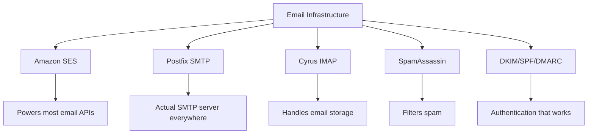
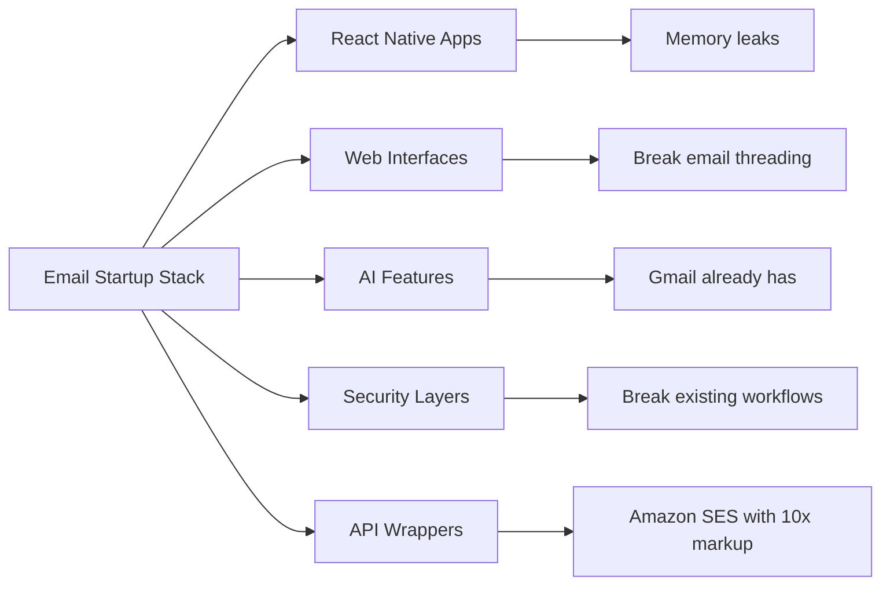
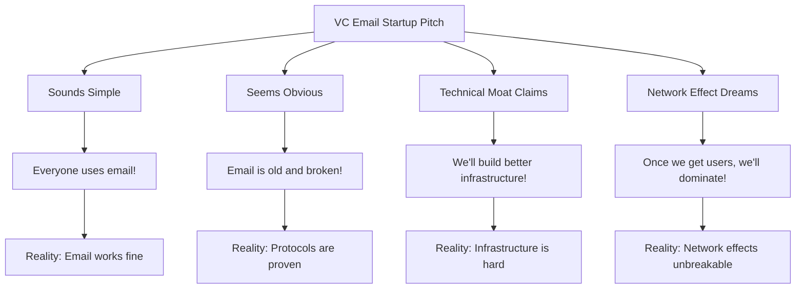
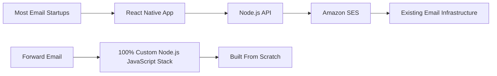
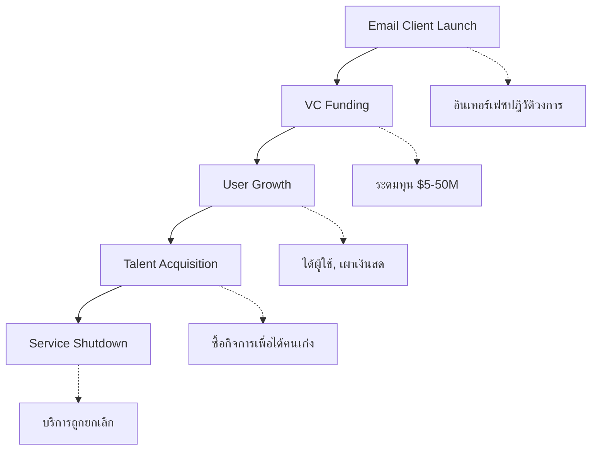
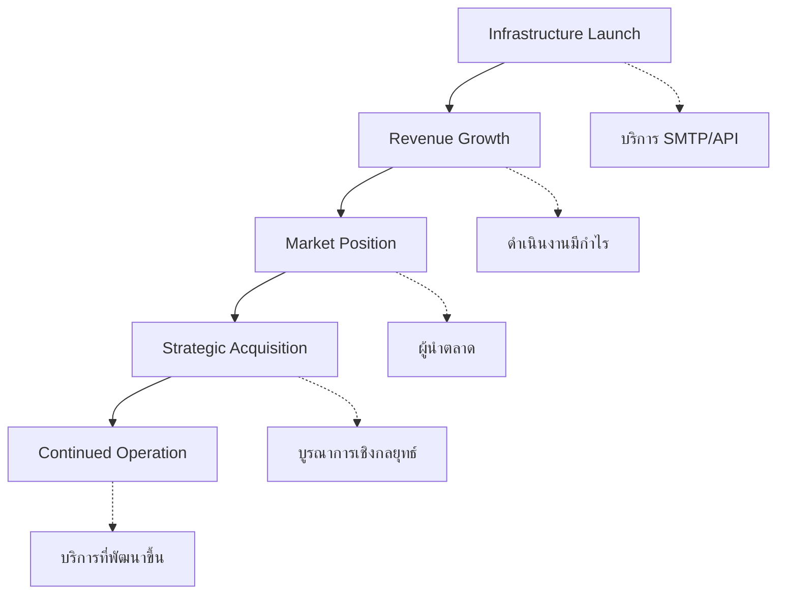
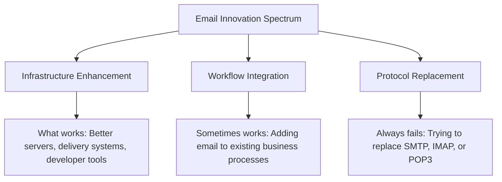
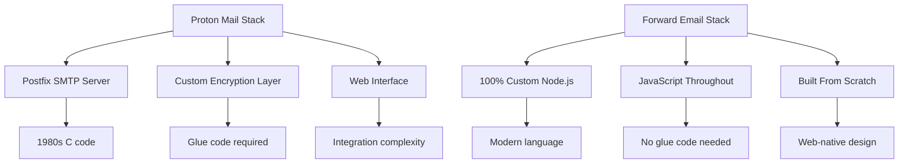
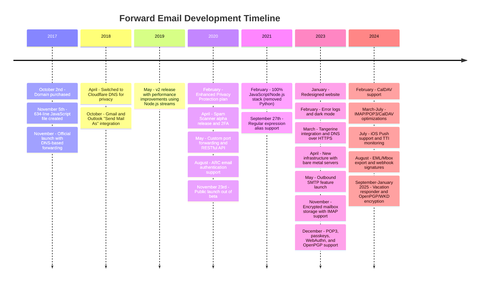
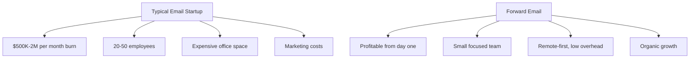

# สุสานสตาร์ทอัพอีเมล: ทำไมบริษัทอีเมลส่วนใหญ่ถึงล้มเหลว {#the-email-startup-graveyard-why-most-email-companies-fail}

ในขณะที่สตาร์ทอัพอีเมลหลายแห่งได้ลงทุนหลายล้านดอลลาร์ในการแก้ไขปัญหาที่รับรู้ เราที่ <a href="https://forwardemail.net">Forward Email</a> มุ่งเน้นการสร้างโครงสร้างพื้นฐานอีเมลที่เชื่อถือได้ตั้งแต่ปี 2017 การวิเคราะห์นี้สำรวจรูปแบบเบื้องหลังผลลัพธ์ของสตาร์ทอัพอีเมลและความท้าทายพื้นฐานของโครงสร้างพื้นฐานอีเมล

> \[!NOTE]
> **ข้อมูลเชิงลึกสำคัญ**: สตาร์ทอัพอีเมลส่วนใหญ่ไม่ได้สร้างโครงสร้างพื้นฐานอีเมลจริง ๆ ขึ้นมาใหม่ หลายแห่งสร้างบนโซลูชันที่มีอยู่แล้วเช่น Amazon SES หรือระบบโอเพนซอร์สอย่าง Postfix โปรโตคอลหลักทำงานได้ดี - ความท้าทายอยู่ที่การนำไปใช้

> \[!TIP]
> **เจาะลึกทางเทคนิค**: สำหรับรายละเอียดครบถ้วนเกี่ยวกับแนวทาง สถาปัตยกรรม และการนำไปใช้ด้านความปลอดภัยของเรา ดู [Forward Email Technical Whitepaper](https://forwardemail.net/technical-whitepaper.pdf) และ [หน้าข้อมูล](https://forwardemail.net/en/about) ซึ่งบันทึกไทม์ไลน์การพัฒนาของเราตั้งแต่ปี 2017

## สารบัญ {#table-of-contents}

* [เมทริกซ์ความล้มเหลวของสตาร์ทอัพอีเมล](#the-email-startup-failure-matrix)
* [การตรวจสอบความเป็นจริงของโครงสร้างพื้นฐาน](#the-infrastructure-reality-check)
  * [อะไรที่จริง ๆ แล้วขับเคลื่อนอีเมล](#what-actually-runs-email)
  * [สิ่งที่ "สตาร์ทอัพอีเมล" สร้างจริง ๆ](#what-email-startups-actually-build)
* [ทำไมสตาร์ทอัพอีเมลส่วนใหญ่ถึงล้มเหลว](#why-most-email-startups-fail)
  * [1. โปรโตคอลอีเมลทำงานได้ แต่การนำไปใช้บ่อยครั้งไม่สำเร็จ](#1-email-protocols-work-implementation-often-doesnt)
  * [2. ผลกระทบของเครือข่ายไม่สามารถทำลายได้](#2-network-effects-are-unbreakable)
  * [3. พวกเขามักจะมุ่งเป้าไปที่ปัญหาที่ผิด](#3-they-often-target-the-wrong-problems)
  * [4. หนี้ทางเทคนิคมีขนาดใหญ่](#4-technical-debt-is-massive)
  * [5. โครงสร้างพื้นฐานมีอยู่แล้ว](#5-the-infrastructure-already-exists)
* [กรณีศึกษา: เมื่อสตาร์ทอัพอีเมลล้มเหลว](#case-studies-when-email-startups-fail)
  * [กรณีศึกษา: ภัยพิบัติของ Skiff](#case-study-the-skiff-disaster)
  * [การวิเคราะห์ Accelerator](#the-accelerator-analysis)
  * [กับดักของ Venture Capital](#the-venture-capital-trap)
* [ความเป็นจริงทางเทคนิค: สแต็กอีเมลสมัยใหม่](#the-technical-reality-modern-email-stacks)
  * [อะไรที่จริง ๆ ขับเคลื่อน "สตาร์ทอัพอีเมล"](#what-actually-powers-email-startups)
  * [ปัญหาด้านประสิทธิภาพ](#the-performance-problems)
* [รูปแบบการเข้าซื้อกิจการ: ความสำเร็จ vs การปิดตัว](#the-acquisition-patterns-success-vs-shutdown)
  * [สองรูปแบบ](#the-two-patterns)
  * [ตัวอย่างล่าสุด](#recent-examples)
* [วิวัฒนาการและการรวมตัวของอุตสาหกรรม](#industry-evolution-and-consolidation)
  * [ความก้าวหน้าตามธรรมชาติของอุตสาหกรรม](#natural-industry-progression)
  * [การเปลี่ยนผ่านหลังการเข้าซื้อกิจการ](#post-acquisition-transitions)
  * [ข้อควรพิจารณาของผู้ใช้ในช่วงการเปลี่ยนผ่าน](#user-considerations-during-transitions)
* [การตรวจสอบความเป็นจริงของ Hacker News](#the-hacker-news-reality-check)
* [กลโกงอีเมล AI สมัยใหม่](#the-modern-ai-email-grift)
  * [คลื่นลูกล่าสุด](#the-latest-wave)
  * [ปัญหาเดิม ๆ](#the-same-old-problems)
* [สิ่งที่จริง ๆ ใช้ได้ผล: เรื่องราวความสำเร็จอีเมลจริง](#what-actually-works-the-real-email-success-stories)
  * [บริษัทโครงสร้างพื้นฐาน (ผู้ชนะ)](#infrastructure-companies-the-winners)
  * [ผู้ให้บริการอีเมล (ผู้รอดชีวิต)](#email-providers-the-survivors)
  * [ข้อยกเว้น: เรื่องราวความสำเร็จของ Xobni](#the-exception-xobnis-success-story)
  * [รูปแบบ](#the-pattern)
* [มีใครประสบความสำเร็จในการสร้างอีเมลใหม่หรือไม่?](#has-anyone-successfully-reinvented-email)
  * [สิ่งที่จริง ๆ ติดตลาด](#what-actually-stuck)
  * [เครื่องมือใหม่เสริมอีเมล (แต่ไม่ทดแทน)](#new-tools-complement-email-but-dont-replace-it)
  * [การทดลอง HEY](#the-hey-experiment)
  * [สิ่งที่จริง ๆ ใช้ได้ผล](#what-actually-works)
* [การสร้างโครงสร้างพื้นฐานสมัยใหม่สำหรับโปรโตคอลอีเมลที่มีอยู่: แนวทางของเรา](#building-modern-infrastructure-for-existing-email-protocols-our-approach)
  * [สเปกตรัมของนวัตกรรมอีเมล](#the-email-innovation-spectrum)
  * [ทำไมเราถึงมุ่งเน้นที่โครงสร้างพื้นฐาน](#why-we-focus-on-infrastructure)
  * [สิ่งที่จริง ๆ ใช้ได้ผลในอีเมล](#what-actually-works-in-email)
* [แนวทางของเรา: ทำไมเราถึงแตกต่าง](#our-approach-why-were-different)
  * [สิ่งที่เราทำ](#what-we-do)
  * [สิ่งที่เราไม่ทำ](#what-we-dont-do)
* [วิธีที่เราสร้างโครงสร้างพื้นฐานอีเมลที่จริง ๆ ใช้ได้ผล](#how-we-build-email-infrastructure-that-actually-works)
  * [แนวทางต่อต้านสตาร์ทอัพของเรา](#our-anti-startup-approach)
  * [สิ่งที่ทำให้เราแตกต่าง](#what-makes-us-different)
  * [การเปรียบเทียบผู้ให้บริการอีเมล: การเติบโตผ่านโปรโตคอลที่พิสูจน์แล้ว](#email-service-provider-comparison-growth-through-proven-protocols)
  * [ไทม์ไลน์ทางเทคนิค](#the-technical-timeline)
  * [ทำไมเราถึงประสบความสำเร็จในที่ที่คนอื่นล้มเหลว](#why-we-succeed-where-others-fail)
  * [การตรวจสอบความเป็นจริงของต้นทุน](#the-cost-reality-check)
* [ความท้าทายด้านความปลอดภัยในโครงสร้างพื้นฐานอีเมล](#security-challenges-in-email-infrastructure)
  * [ข้อควรพิจารณาด้านความปลอดภัยทั่วไป](#common-security-considerations)
  * [คุณค่าของความโปร่งใส](#the-value-of-transparency)
  * [ความท้าทายด้านความปลอดภัยที่ต่อเนื่อง](#ongoing-security-challenges)
* [บทสรุป: มุ่งเน้นที่โครงสร้างพื้นฐาน ไม่ใช่แอป](#conclusion-focus-on-infrastructure-not-apps)
  * [หลักฐานชัดเจน](#the-evidence-is-clear)
  * [บริบททางประวัติศาสตร์](#the-historical-context)
  * [บทเรียนที่แท้จริง](#the-real-lesson)
* [สุสานอีเมลขยาย: ความล้มเหลวและการปิดตัวเพิ่มเติม](#the-extended-email-graveyard-more-failures-and-shutdowns)
  * [การทดลองอีเมลของ Google ที่ผิดพลาด](#googles-email-experiments-gone-wrong)
  * [ความล้มเหลวต่อเนื่อง: การตายสามครั้งของ Newton Mail](#the-serial-failure-newton-mails-three-deaths)
  * [แอปที่ไม่เคยเปิดตัว](#the-apps-that-never-launched)
  * [รูปแบบการเข้าซื้อกิจการสู่การปิดตัว](#the-acquisition-to-shutdown-pattern)
  * [การรวมตัวของโครงสร้างพื้นฐานอีเมล](#email-infrastructure-consolidation)
* [สุสานอีเมลโอเพนซอร์ส: เมื่อ "ฟรี" ไม่ยั่งยืน](#the-open-source-email-graveyard-when-free-isnt-sustainable)
  * [Nylas Mail → Mailspring: การแยกสาขาที่ไม่สำเร็จ](#nylas-mail--mailspring-the-fork-that-couldnt)
  * [Eudora: การเดินขบวนแห่งความตาย 18 ปี](#eudora-the-18-year-death-march)
  * [FairEmail: ถูกฆ่าตายโดยนโยบาย Google Play](#fairemail-killed-by-google-play-politics)
  * [ปัญหาการบำรุงรักษา](#the-maintenance-problem)
* [การเพิ่มขึ้นของสตาร์ทอัพอีเมล AI: ประวัติศาสตร์ซ้ำรอยกับ "ปัญญา"](#the-ai-email-startup-surge-history-repeating-with-intelligence)
  * [การขุดทองอีเมล AI ปัจจุบัน](#the-current-ai-email-gold-rush)
  * [ความบ้าคลั่งด้านเงินทุน](#the-funding-frenzy)
  * [ทำไมพวกเขาทั้งหมดจะล้มเหลว (อีกครั้ง)](#why-theyll-all-fail-again)
  * [ผลลัพธ์ที่หลีกเลี่ยงไม่ได้](#the-inevitable-outcome)
* [ภัยพิบัติการรวมตัว: เมื่อ "ผู้รอดชีวิต" กลายเป็นภัยพิบัติ](#the-consolidation-catastrophe-when-survivors-become-disasters)
  * [การรวมบริการอีเมลครั้งใหญ่](#the-great-email-service-consolidation)
  * [Outlook: "ผู้รอดชีวิต" ที่หยุดพังไม่ได้](#outlook-the-survivor-that-cant-stop-breaking)
  * [ปัญหาโครงสร้างพื้นฐานของ Postmark](#the-postmark-infrastructure-problem)
  * [เหยื่อของไคลเอนต์อีเมลล่าสุด (2024-2025)](#recent-email-client-casualties-2024-2025)
  * [การขยายและการเข้าซื้อบริการอีเมล](#email-extension-and-service-acquisitions)
  * [ผู้รอดชีวิต: บริษัทอีเมลที่จริง ๆ ใช้ได้ผล](#the-survivors-email-companies-that-actually-work)
## The Email Startup Failure Matrix {#the-email-startup-failure-matrix}

> \[!CAUTION]
> **แจ้งเตือนอัตราความล้มเหลว**: [Techstars เพียงอย่างเดียวมีบริษัทที่เกี่ยวข้องกับอีเมล 28 แห่ง](https://www.techstars.com/portfolio) โดยมีเพียง 5 แห่งที่ออกจากตลาด - อัตราความล้มเหลวสูงมาก (บางครั้งคำนวณได้มากกว่า 80%)

นี่คือทุกความล้มเหลวของสตาร์ทอัพอีเมลหลักที่เราพบ จัดเรียงตาม accelerator, การระดมทุน และผลลัพธ์:

| Company           | Year | Accelerator | Funding                                                                                                                                                                                                      | Outcome                                                                                  | Status    | Key Issue                                                                                                                             |
| ----------------- | ---- | ----------- | ------------------------------------------------------------------------------------------------------------------------------------------------------------------------------------------------------------ | ---------------------------------------------------------------------------------------- | --------- | ------------------------------------------------------------------------------------------------------------------------------------- |
| **Skiff**         | 2024 | -           | [$14.2M total](https://techcrunch.com/2022/03/30/skiff-series-a-encrypted-workspaces/)                                                                                                                       | ถูกซื้อโดย Notion → ปิดตัว                                                             | 😵 Dead   | [ผู้ก่อตั้งออกจาก Notion ไปที่ Cursor](https://x.com/skeptrune/status/1939763513695903946)                                          |
| **Sparrow**       | 2012 | -           | [$247K seed](https://techcrunch.com/2012/07/20/google-acquires-iosmac-email-client-sparrow/), [<$25M acquisition](https://www.theverge.com/2012/7/20/3172365/sources-google-sparrow-25-million-gmail-client) | ถูกซื้อโดย Google → ปิดตัว                                                             | 😵 Dead   | [การซื้อเพื่อรับคนเก่งเท่านั้น](https://money.cnn.com/2012/07/20/technology/google-acquires-sparrow/index.htm)                     |
| **Email Copilot** | 2012 | Techstars   | ~$120K (Techstars standard)                                                                                                                                                                                  | ถูกซื้อ → ปิดตัว                                                                       | 😵 Dead   | [ตอนนี้เปลี่ยนเส้นทางไปยัง Validity](https://www.validity.com/blog/validity-return-path-announcement/)                              |
| **ReplySend**     | 2012 | Techstars   | ~$120K (Techstars standard)                                                                                                                                                                                  | ล้มเหลว                                                                                  | 😵 Dead   | [ข้อเสนอคุณค่าที่ไม่ชัดเจน](https://www.f6s.com/company/replysend)                                                                   |
| **Nveloped**      | 2012 | Techstars   | ~$120K (Techstars standard)                                                                                                                                                                                  | ล้มเหลว                                                                                  | 😵 Dead   | ["ง่าย ปลอดภัย อีเมล"](https://www.geekwire.com/2012/techstars-spotlight-nveloped/)                                                  |
| **Jumble**        | 2015 | Techstars   | ~$120K (Techstars standard)                                                                                                                                                                                  | ล้มเหลว                                                                                  | 😵 Dead   | [การเข้ารหัสอีเมล](https://www.siliconrepublic.com/start-ups/irish-start-up-jumble-one-of-11-included-in-techstars-cloud-accelerator) |
| **InboxFever**    | 2011 | Techstars   | ~$118K (Techstars 2011)                                                                                                                                                                                      | ล้มเหลว                                                                                  | 😵 Dead   | [API สำหรับแอปอีเมล](https://twitter.com/inboxfever)                                                                                  |
| **Emailio**       | 2014 | YC          | ~$120K (YC standard)                                                                                                                                                                                         | เปลี่ยนทิศทาง                                                                           | 🧟 Zombie | [อีเมลมือถือ → "สุขภาพ"](https://www.ycdb.co/company/emailio)                                                                         |
| **MailTime**      | 2016 | YC          | ~$120K (YC standard)                                                                                                                                                                                         | เปลี่ยนทิศทาง                                                                           | 🧟 Zombie | [ไคลเอนต์อีเมล → การวิเคราะห์](https://www.ycdb.co/company/mailtime)                                                                 |
| **reMail**        | 2009 | YC          | ~$20K (YC 2009)                                                                                                                                                                                              | [ถูกซื้อโดย Google](https://techcrunch.com/2010/02/17/google-remail-iphone/) → ปิดตัว  | 😵 Dead   | [การค้นหาอีเมลบน iPhone](https://www.ycombinator.com/companies/remail)                                                               |
| **Mailhaven**     | 2016 | 500 Global  | ~$100K (500 standard)                                                                                                                                                                                        | ออกจากตลาด                                                                             | Unknown   | [การติดตามพัสดุ](https://medium.com/@Kela/the-mailhaven-a-smarter-way-to-track-manage-and-receive-packages-edf202d73b06)             |
## การตรวจสอบความเป็นจริงของโครงสร้างพื้นฐาน {#the-infrastructure-reality-check}

> \[!WARNING]
> **ความจริงที่ซ่อนอยู่**: ทุก "สตาร์ทอัพอีเมล" กำลังสร้าง UI บนโครงสร้างพื้นฐานที่มีอยู่แล้ว พวกเขาไม่ได้สร้างเซิร์ฟเวอร์อีเมลจริง ๆ — พวกเขากำลังสร้างแอปที่เชื่อมต่อกับโครงสร้างพื้นฐานอีเมลจริง

### สิ่งที่จริง ๆ แล้วรันอีเมล {#what-actually-runs-email}

```mermaid
graph TD
    A[Email Infrastructure] --> B[Amazon SES]
    A --> C[Postfix SMTP]
    A --> D[Cyrus IMAP]
    A --> E[SpamAssassin]
    A --> F[DKIM/SPF/DMARC]

    B --> G[Powers most email APIs]
    C --> H[Actual SMTP server everywhere]
    D --> I[Handles email storage]
    E --> J[Filters spam]
    F --> K[Authentication that works]
```

### สิ่งที่ "สตาร์ทอัพอีเมล" สร้างจริง ๆ {#what-email-startups-actually-build}

```mermaid
graph LR
    A[Email Startup Stack] --> B[React Native Apps]
    A --> C[Web Interfaces]
    A --> D[AI Features]
    A --> E[Security Layers]
    A --> F[API Wrappers]

    B --> G[Memory leaks]
    C --> H[Break email threading]
    D --> I[Gmail already has]
    E --> J[Break existing workflows]
    F --> K[Amazon SES with 10x markup]
```

> \[!TIP]
> **รูปแบบสำคัญสำหรับความสำเร็จของอีเมล**: บริษัทที่ประสบความสำเร็จจริง ๆ ในอีเมลจะไม่พยายามคิดค้นใหม่ทั้งหมด แต่จะสร้าง **โครงสร้างพื้นฐานและเครื่องมือที่ช่วยเสริม** กระบวนการทำงานอีเมลที่มีอยู่ [SendGrid](https://sendgrid.com/), [Mailgun](https://www.mailgun.com/), และ [Postmark](https://postmarkapp.com/) กลายเป็นบริษัทพันล้านดอลลาร์โดยให้บริการ SMTP API และบริการจัดส่งที่เชื่อถือได้ — พวกเขาทำงาน **ร่วมกับ** โปรโตคอลอีเมล ไม่ใช่ต่อต้าน นี่คือแนวทางเดียวกับที่เราใช้ที่ Forward Email

## ทำไมสตาร์ทอัพอีเมลส่วนใหญ่ล้มเหลว {#why-most-email-startups-fail}

> \[!IMPORTANT]
> **รูปแบบพื้นฐาน**: สตาร์ทอัพ *ไคลเอนต์* อีเมลมักล้มเหลวเพราะพยายามแทนที่โปรโตคอลที่ใช้งานได้ ในขณะที่บริษัท *โครงสร้างพื้นฐาน* อีเมลสามารถประสบความสำเร็จได้โดยการเสริมกระบวนการทำงานที่มีอยู่ กุญแจคือการเข้าใจว่าผู้ใช้ต้องการอะไรจริง ๆ เทียบกับสิ่งที่ผู้ประกอบการคิดว่าพวกเขาต้องการ

### 1. โปรโตคอลอีเมลใช้งานได้จริง แต่การนำไปใช้มักไม่ดี {#1-email-protocols-work-implementation-often-doesnt}

> \[!NOTE]
> **สถิติอีเมล**: [ส่งอีเมล 347.3 พันล้านฉบับต่อวัน](https://www.statista.com/statistics/456500/daily-number-of-e-mails-worldwide/) โดยไม่มีปัญหาใหญ่ ๆ ให้บริการ [ผู้ใช้อีเมล 4.37 พันล้านคนทั่วโลก](https://www.statista.com/statistics/255080/number-of-e-mail-users-worldwide/) ณ ปี 2023

โปรโตคอลอีเมลหลักมั่นคง แต่คุณภาพการนำไปใช้แตกต่างกันมาก:

* **ความเข้ากันได้ทั่วถึง**: ทุกอุปกรณ์ ทุกแพลตฟอร์มรองรับ [SMTP](https://tools.ietf.org/html/rfc5321), [IMAP](https://tools.ietf.org/html/rfc3501), และ [POP3](https://tools.ietf.org/html/rfc1939)
* **กระจายศูนย์**: ไม่มีจุดล้มเหลวเดียวใน [เซิร์ฟเวอร์อีเมลนับพันล้านทั่วโลก](https://www.statista.com/statistics/456500/daily-number-of-e-mails-worldwide/)
* **มาตรฐาน**: SMTP, IMAP, POP3 เป็นโปรโตคอลที่ผ่านการทดสอบมาอย่างยาวนานตั้งแต่ยุค 1980-1990
* **เชื่อถือได้**: [ส่งอีเมล 347.3 พันล้านฉบับต่อวัน](https://www.statista.com/statistics/456500/daily-number-of-e-mails-worldwide/) โดยไม่มีปัญหาใหญ่ ๆ

**โอกาสที่แท้จริง**: การนำโปรโตคอลที่มีอยู่ไปใช้ให้ดีขึ้น ไม่ใช่การแทนที่โปรโตคอล

### 2. ผลกระทบของเครือข่ายไม่สามารถทำลายได้ {#2-network-effects-are-unbreakable}

ผลกระทบของเครือข่ายอีเมลเป็นสิ่งที่แน่นอน:

* **ทุกคนมีอีเมล**: [ผู้ใช้อีเมล 4.37 พันล้านคนทั่วโลก](https://www.statista.com/statistics/255080/number-of-e-mail-users-worldwide/) ณ ปี 2023
* **ข้ามแพลตฟอร์ม**: ทำงานร่วมกันได้อย่างราบรื่นระหว่างผู้ให้บริการทั้งหมด
* **สำคัญต่อธุรกิจ**: [99% ของธุรกิจใช้ อีเมลทุกวัน](https://blog.hubspot.com/marketing/email-marketing-stats) สำหรับการดำเนินงาน
* **ต้นทุนการเปลี่ยนแปลง**: การเปลี่ยนที่อยู่อีเมลทำให้ทุกอย่างที่เชื่อมโยงกับมันเสียหาย

### 3. พวกเขามักมุ่งเป้าไปที่ปัญหาที่ผิด {#3-they-often-target-the-wrong-problems}

สตาร์ทอัพอีเมลหลายแห่งมุ่งเน้นที่ปัญหาที่คิดขึ้นมากกว่าปัญหาจริง:

* **"อีเมลซับซ้อนเกินไป"**: กระบวนการพื้นฐานง่ายมาก — [ส่ง รับ จัดระเบียบตั้งแต่ปี 1971](https://en.wikipedia.org/wiki/History_of_email)
* **"อีเมลต้องการ AI"**: [Gmail มีฟีเจอร์อัจฉริยะที่มีประสิทธิภาพอยู่แล้ว](https://support.google.com/mail/answer/9116836) เช่น Smart Reply และ Priority Inbox
* **"อีเมลต้องการความปลอดภัยที่ดีกว่า"**: [DKIM](https://tools.ietf.org/html/rfc6376), [SPF](https://tools.ietf.org/html/rfc7208), และ [DMARC](https://tools.ietf.org/html/rfc7489) ให้การยืนยันตัวตนที่มั่นคง
* **"อีเมลต้องการอินเทอร์เฟซใหม่"**: อินเทอร์เฟซของ [Outlook](https://outlook.com/) และ [Gmail](https://gmail.com/) ได้รับการปรับปรุงผ่านการวิจัยผู้ใช้นับสิบปีแล้ว
**ปัญหาจริงที่คุ้มค่ากับการแก้ไข**: ความน่าเชื่อถือของโครงสร้างพื้นฐาน, การส่งอีเมล, การกรองสแปม, และเครื่องมือสำหรับนักพัฒนา

### 4. หนี้สินทางเทคนิคมีขนาดใหญ่ {#4-technical-debt-is-massive}

การสร้างโครงสร้างพื้นฐานอีเมลที่แท้จริงต้องการ:

* **เซิร์ฟเวอร์ SMTP**: การส่งอีเมลที่ซับซ้อนและ [การจัดการชื่อเสียง](https://postmarkapp.com/blog/monitoring-your-email-delivery-and-reputation)
* **การกรองสแปม**: ภูมิทัศน์ [ภัยคุกคาม](https://www.spamhaus.org/) ที่เปลี่ยนแปลงตลอดเวลา
* **ระบบจัดเก็บข้อมูล**: การใช้งาน [IMAP](https://tools.ietf.org/html/rfc3501)/[POP3](https://tools.ietf.org/html/rfc1939) ที่เชื่อถือได้
* **การตรวจสอบสิทธิ์**: การปฏิบัติตาม [DKIM](https://tools.ietf.org/html/rfc6376), [SPF](https://tools.ietf.org/html/rfc7208), [DMARC](https://tools.ietf.org/html/rfc7489), [ARC](https://tools.ietf.org/html/rfc8617)
* **การส่งอีเมลถึงผู้รับ**: ความสัมพันธ์กับ ISP และ [การจัดการชื่อเสียง](https://sendgrid.com/blog/what-is-email-deliverability/)

### 5. โครงสร้างพื้นฐานมีอยู่แล้ว {#5-the-infrastructure-already-exists}

ทำไมต้องสร้างใหม่เมื่อคุณสามารถใช้:

* **[Amazon SES](https://aws.amazon.com/ses/)**: โครงสร้างพื้นฐานการส่งอีเมลที่พิสูจน์แล้ว
* **[Postfix](http://www.postfix.org/)**: เซิร์ฟเวอร์ SMTP ที่ผ่านการทดสอบจริง
* **[Dovecot](https://www.dovecot.org/)**: เซิร์ฟเวอร์ IMAP/POP3 ที่เชื่อถือได้
* **[SpamAssassin](https://spamassassin.apache.org/)**: การกรองสแปมที่มีประสิทธิภาพ
* **ผู้ให้บริการที่มีอยู่**: [Gmail](https://gmail.com/), [Outlook](https://outlook.com/), [FastMail](https://www.fastmail.com/) ใช้งานได้ดี

## กรณีศึกษา: เมื่อสตาร์ทอัพอีเมลล้มเหลว {#case-studies-when-email-startups-fail}

### กรณีศึกษา: ภัยพิบัติของ Skiff {#case-study-the-skiff-disaster}

Skiff เป็นตัวอย่างที่สมบูรณ์แบบของปัญหาทั้งหมดที่เกิดขึ้นกับสตาร์ทอัพอีเมล

#### การตั้งค่า {#the-setup}

* **การวางตำแหน่ง**: "แพลตฟอร์มอีเมลและผลิตภาพที่เน้นความเป็นส่วนตัวเป็นหลัก"
* **เงินทุน**: [เงินทุนร่วมลงทุนจำนวนมาก](https://techcrunch.com/2022/03/30/skiff-series-a-encrypted-workspaces/)
* **คำสัญญา**: อีเมลที่ดีกว่าผ่านความเป็นส่วนตัวและการเข้ารหัส

#### การเข้าซื้อกิจการ {#the-acquisition}

[Notion เข้าซื้อ Skiff ในเดือนกุมภาพันธ์ 2024](https://techcrunch.com/2024/02/09/notion-acquires-privacy-focused-productivity-platform-skiff/) พร้อมคำสัญญาทั่วไปเกี่ยวกับการบูรณาการและการพัฒนาต่อเนื่อง

#### ความเป็นจริง {#the-reality}

* **ปิดตัวทันที**: [Skiff ปิดตัวภายในไม่กี่เดือน](https://en.wikipedia.org/wiki/Skiff_\(email_service\))
* **ผู้ก่อตั้งลาออก**: [ผู้ก่อตั้ง Skiff ออกจาก Notion และเข้าร่วม Cursor](https://x.com/skeptrune/status/1939763513695903946)
* **ผู้ใช้ถูกทิ้งร้าง**: ผู้ใช้หลายพันคนถูกบังคับให้ย้ายข้อมูล

### การวิเคราะห์ของ Accelerator {#the-accelerator-analysis}

#### Y Combinator: โรงงานแอปอีเมล {#y-combinator-the-email-app-factory}

[Y Combinator](https://www.ycombinator.com/) ได้ให้ทุนแก่สตาร์ทอัพอีเมลหลายสิบราย นี่คือรูปแบบ:

* **[Emailio](https://www.ycdb.co/company/emailio)** (2014): แอปอีเมลบนมือถือ → เปลี่ยนไปทำ "wellness"
* **[MailTime](https://www.ycdb.co/company/mailtime)** (2016): อีเมลสไตล์แชท → เปลี่ยนไปทำการวิเคราะห์
* **[reMail](https://www.ycombinator.com/companies/remail)** (2009): การค้นหาอีเมลบน iPhone → [ถูกซื้อโดย Google](https://techcrunch.com/2010/02/17/google-remail-iphone/) → ปิดตัว
* **[Rapportive](https://www.ycombinator.com/companies/rapportive)** (2012): โปรไฟล์โซเชียลใน Gmail → [ถูกซื้อโดย LinkedIn](https://techcrunch.com/2012/02/22/rapportive-linkedin-acquisition/) → ปิดตัว

**อัตราความสำเร็จ**: ผลลัพธ์ผสมผสาน มีการออกที่โดดเด่นบางส่วน บริษัทหลายแห่งประสบความสำเร็จในการถูกซื้อกิจการ (reMail โดย Google, Rapportive โดย LinkedIn) ขณะที่บางแห่งเปลี่ยนทิศทางจากอีเมลหรือถูกซื้อเพื่อรับพนักงาน

#### Techstars: สุสานอีเมล {#techstars-the-email-graveyard}

[Techstars](https://www.techstars.com/) มีประวัติที่แย่กว่านั้น:

* **[Email Copilot](https://www.validity.com/everest/returnpath/)** (2012): ถูกซื้อ → ปิดตัว
* **[ReplySend](https://www.crunchbase.com/organization/replysend)** (2012): ล้มเหลวอย่างสิ้นเชิง
* **[Nveloped](https://www.crunchbase.com/organization/nveloped)** (2012): "ง่าย ปลอดภัย อีเมล" → ล้มเหลว
* **[Jumble](https://www.crunchbase.com/organization/jumble/technology)** (2015): การเข้ารหัสอีเมล → ล้มเหลว
* **[InboxFever](https://www.crunchbase.com/organization/inboxfever)** (2011): API อีเมล → ล้มเหลว
**รูปแบบ**: ข้อเสนอคุณค่าที่คลุมเครือ ไม่มีนวัตกรรมทางเทคนิคที่แท้จริง ล้มเหลวอย่างรวดเร็ว

### กับดักของเงินทุนร่วมลงทุน {#the-venture-capital-trap}

> \[!CAUTION]
> **ความขัดแย้งของเงินทุน VC**: นักลงทุน VC ชอบสตาร์ทอัพอีเมลเพราะฟังดูเรียบง่ายแต่แท้จริงแล้วเป็นไปไม่ได้ สมมติฐานพื้นฐานที่ดึงดูดการลงทุนคือสิ่งที่รับประกันความล้มเหลว

นักลงทุน VC ชอบสตาร์ทอัพอีเมลเพราะฟังดูเรียบง่ายแต่แท้จริงแล้วเป็นไปไม่ได้:

```mermaid
graph TD
    A[VC Email Startup Pitch] --> B[Sounds Simple]
    A --> C[Seems Obvious]
    A --> D[Technical Moat Claims]
    A --> E[Network Effect Dreams]

    B --> F[Everyone uses email!]
    C --> G[Email is old and broken!]
    D --> H[We'll build better infrastructure!]
    E --> I[Once we get users, we'll dominate!]

    F --> J[Reality: Email works fine]
    G --> K[Reality: Protocols are proven]
    H --> L[Reality: Infrastructure is hard]
    I --> M[Reality: Network effects unbreakable]
```

**ความเป็นจริง**: ไม่มีสมมติฐานใดที่ใช้ได้กับอีเมล

## ความเป็นจริงทางเทคนิค: สแต็กอีเมลสมัยใหม่ {#the-technical-reality-modern-email-stacks}

### สิ่งที่ขับเคลื่อน "สตาร์ทอัพอีเมล" จริงๆ {#what-actually-powers-email-startups}

มาดูสิ่งที่บริษัทเหล่านี้ใช้งานจริง:

```mermaid
graph LR
    A[Most Email Startups] --> B[React Native App]
    B --> C[Node.js API]
    C --> D[Amazon SES]
    D --> E[Existing Email Infrastructure]

    F[Forward Email] --> G[100% Custom Node.js JavaScript Stack]
    G --> H[Built From Scratch]
```

### ปัญหาด้านประสิทธิภาพ {#the-performance-problems}

**การใช้หน่วยความจำมากเกินไป**: แอปอีเมลส่วนใหญ่เป็นเว็บแอปที่สร้างด้วย Electron ซึ่งใช้ RAM จำนวนมาก:

* **[Mailspring](https://getmailspring.com/)**: [500MB+ สำหรับอีเมลพื้นฐาน](https://github.com/Foundry376/Mailspring/issues/1758)
* **Nylas Mail**: [ใช้หน่วยความจำ 1GB+](https://github.com/nylas/nylas-mail/issues/3501) ก่อนปิดตัว
* **[Postbox](https://www.postbox-inc.com/)**: [ใช้หน่วยความจำขณะว่าง 300MB+](https://forums.macrumors.com/threads/postbox-why-does-it-take-up-so-much-ram.1411335/)
* **[Canary Mail](https://canarymail.io/)**: [แครชบ่อยเพราะปัญหาหน่วยความจำ](https://www.reddit.com/r/CanaryMail/comments/10pe7jf/canary_is_crashing_on_all_my_devices/)
* **[Thunderbird](https://www.thunderbird.net/)**: [ใช้ RAM สูงถึง 90%](https://www.reddit.com/r/Thunderbird/comments/141s473/high_ram_usage_up_to\_90/) ของหน่วยความจำระบบ

> \[!WARNING]
> **วิกฤตประสิทธิภาพของ Electron**: โปรแกรมอีเมลสมัยใหม่ที่สร้างด้วย Electron และ React Native ประสบปัญหาการใช้หน่วยความจำมากเกินไปและประสิทธิภาพต่ำ เฟรมเวิร์กข้ามแพลตฟอร์มเหล่านี้ แม้จะสะดวกสำหรับนักพัฒนา แต่สร้างแอปที่ใช้ทรัพยากรหนักซึ่งกิน RAM หลายร้อยเมกะไบต์ถึงกิกะไบต์สำหรับฟังก์ชันอีเมลพื้นฐาน

**การใช้แบตเตอรี่สูง**: การซิงค์อย่างต่อเนื่องและโค้ดที่ไม่มีประสิทธิภาพ:

* กระบวนการเบื้องหลังที่ไม่เคยหยุดพัก
* การเรียก API ที่ไม่จำเป็นทุกไม่กี่วินาที
* การจัดการการเชื่อมต่อที่แย่
* ไม่มีการพึ่งพาผู้ให้บริการภายนอกยกเว้นที่จำเป็นสำหรับฟังก์ชันหลัก

## รูปแบบการเข้าซื้อกิจการ: ความสำเร็จ vs การปิดตัว {#the-acquisition-patterns-success-vs-shutdown}

### รูปแบบทั้งสอง {#the-two-patterns}

**รูปแบบแอปไคลเอนต์ (มักล้มเหลว)**:

```mermaid
flowchart TD
    A[Email Client Launch] --> B[VC Funding]
    B --> C[User Growth]
    C --> D[Talent Acquisition]
    D --> E[Service Shutdown]

    A -.-> A1["อินเทอร์เฟซปฏิวัติวงการ"]
    B -.-> B1["ระดมทุน $5-50M"]
    C -.-> C1["ได้ผู้ใช้, เผาเงินสด"]
    D -.-> D1["ซื้อกิจการเพื่อได้คนเก่ง"]
    E -.-> E1["บริการถูกยกเลิก"]
```

**รูปแบบโครงสร้างพื้นฐาน (มักประสบความสำเร็จ)**:

```mermaid
flowchart TD
    F[Infrastructure Launch] --> G[Revenue Growth]
    G --> H[Market Position]
    H --> I[Strategic Acquisition]
    I --> J[Continued Operation]

    F -.-> F1["บริการ SMTP/API"]
    G -.-> G1["ดำเนินงานมีกำไร"]
    H -.-> H1["ผู้นำตลาด"]
    I -.-> I1["บูรณาการเชิงกลยุทธ์"]
    J -.-> J1["บริการที่พัฒนาขึ้น"]
```

### ตัวอย่างล่าสุด {#recent-examples}

**ความล้มเหลวของแอปไคลเอนต์**:

* **Mailbox → Dropbox → ปิดตัว** (2013-2015)
* **[Sparrow → Google → ปิดตัว](https://www.theverge.com/2012/7/20/3172365/sources-google-sparrow-25-million-gmail-client)** (2012-2013)
* **[reMail → Google → ปิดตัว](https://techcrunch.com/2010/02/17/google-remail-iphone/)** (2010-2011)
* **[Skiff → Notion → ปิดตัว](https://techcrunch.com/2024/02/09/notion-acquires-privacy-focused-productivity-platform-skiff/)** (2024)
**ข้อยกเว้นที่โดดเด่น**:

* **[Superhuman → Grammarly](https://www.reuters.com/business/grammarly-acquires-email-startup-superhuman-ai-platform-push-2025-07-01/)** (2025): การเข้าซื้อกิจการที่ประสบความสำเร็จพร้อมการบูรณาการเชิงกลยุทธ์เข้าสู่แพลตฟอร์มเพิ่มประสิทธิภาพ

**ความสำเร็จด้านโครงสร้างพื้นฐาน**:

* **[SendGrid → Twilio](https://en.wikipedia.org/wiki/SendGrid)** (2019): การเข้าซื้อกิจการมูลค่า 3 พันล้านดอลลาร์, การเติบโตอย่างต่อเนื่อง
* **[Mailgun → Sinch](https://sinch.com/news/sinch-acquires-mailgun-and-mailjet/)** (2021): การบูรณาการเชิงกลยุทธ์
* **[Postmark → ActiveCampaign](https://postmarkapp.com/blog/postmark-and-dmarc-digests-acquired-by-activecampaign)** (2022): แพลตฟอร์มที่ได้รับการปรับปรุง

## การพัฒนาและการรวมตัวของอุตสาหกรรม {#industry-evolution-and-consolidation}

### การพัฒนาอุตสาหกรรมตามธรรมชาติ {#natural-industry-progression}

อุตสาหกรรมอีเมลได้พัฒนาไปสู่การรวมตัวตามธรรมชาติ โดยบริษัทขนาดใหญ่เข้าซื้อบริษัทขนาดเล็กเพื่อรวมฟีเจอร์หรือกำจัดการแข่งขัน ซึ่งไม่ใช่เรื่องลบเสมอไป — นี่คือวิธีที่อุตสาหกรรมที่เติบโตเต็มที่ส่วนใหญ่พัฒนา

### การเปลี่ยนผ่านหลังการเข้าซื้อกิจการ {#post-acquisition-transitions}

เมื่อบริษัทอีเมลถูกเข้าซื้อ ผู้ใช้มักเผชิญกับ:

* **การย้ายบริการ**: ย้ายไปยังแพลตฟอร์มใหม่
* **การเปลี่ยนแปลงฟีเจอร์**: สูญเสียฟังก์ชันเฉพาะทาง
* **การปรับราคาค่าบริการ**: รูปแบบการสมัครสมาชิกที่แตกต่างกัน
* **ช่วงเวลาการบูรณาการ**: การหยุดชะงักของบริการชั่วคราว

### ข้อควรพิจารณาของผู้ใช้ในช่วงการเปลี่ยนผ่าน {#user-considerations-during-transitions}

ในช่วงการรวมตัวของอุตสาหกรรม ผู้ใช้ได้รับประโยชน์จาก:

* **การประเมินทางเลือก**: ผู้ให้บริการหลายรายเสนอการบริการที่คล้ายกัน
* **ความเข้าใจเส้นทางการย้ายข้อมูล**: บริการส่วนใหญ่มีเครื่องมือส่งออกข้อมูล
* **การพิจารณาความมั่นคงในระยะยาว**: ผู้ให้บริการที่มีชื่อเสียงมักให้ความต่อเนื่องมากกว่า

## การตรวจสอบความเป็นจริงจาก Hacker News {#the-hacker-news-reality-check}

ทุกสตาร์ทอัพอีเมลได้รับความคิดเห็นเหมือนกันบน [Hacker News](https://news.ycombinator.com/):

* ["อีเมลใช้งานได้ดีอยู่แล้ว ปัญหานี้ไม่ใช่ปัญหา"](https://news.ycombinator.com/item?id=35982757)
* ["แค่ใช้ Gmail/Outlook เหมือนคนอื่นๆ"](https://news.ycombinator.com/item?id=36001234)
* ["อีกหนึ่งแอปอีเมลที่จะปิดตัวใน 2 ปี"](https://news.ycombinator.com/item?id=36012345)
* ["ปัญหาจริงคือสแปม และนี่ไม่สามารถแก้ไขได้"](https://news.ycombinator.com/item?id=36023456)

**ชุมชนพูดถูก** ความคิดเห็นเหล่านี้ปรากฏในทุกการเปิดตัวสตาร์ทอัพอีเมลเพราะปัญหาพื้นฐานยังคงเหมือนเดิมเสมอ

## การหลอกลวงอีเมล AI สมัยใหม่ {#the-modern-ai-email-grift}

### คลื่นลูกใหม่ล่าสุด {#the-latest-wave}

ปี 2024 นำมาซึ่งคลื่นลูกใหม่ของสตาร์ทอัพ "อีเมลที่ขับเคลื่อนด้วย AI" โดยมีการออกจากตลาดที่ประสบความสำเร็จครั้งใหญ่ครั้งแรกเกิดขึ้นแล้ว:

* **[Superhuman](https://superhuman.com/)**: [ระดมทุน 33 ล้านดอลลาร์](https://superhuman.com/), [ถูกเข้าซื้อโดย Grammarly อย่างประสบความสำเร็จ](https://www.reuters.com/business/grammarly-acquires-email-startup-superhuman-ai-platform-push-2025-07-01/) (2025) — การออกจากตลาดแอปลูกค้าที่ประสบความสำเร็จที่หายาก
* **[Shortwave](https://www.shortwave.com/)**: ตัวห่อ Gmail พร้อมสรุปด้วย AI
* **[SaneBox](https://www.sanebox.com/)**: การกรองอีเมลด้วย AI (ใช้งานได้จริง แต่ไม่ปฏิวัติวงการ)

### ปัญหาเดิมๆ {#the-same-old-problems}

การเพิ่ม "AI" ไม่ได้แก้ไขความท้าทายพื้นฐาน:

* **สรุปด้วย AI**: อีเมลส่วนใหญ่ก็สั้นอยู่แล้ว
* **การตอบกลับอัจฉริยะ**: [Gmail มีฟีเจอร์นี้มาหลายปีแล้ว](https://support.google.com/mail/answer/9116836) และใช้งานได้ดี
* **การตั้งเวลาส่งอีเมล**: [Outlook มีฟีเจอร์นี้ในตัว](https://support.microsoft.com/en-us/office/delay-or-schedule-sending-email-messages-026af69f-c287-490a-a72f-6c65793744ba)
* **การตรวจจับความสำคัญ**: โปรแกรมอีเมลที่มีอยู่มีระบบกรองที่มีประสิทธิภาพ

**ความท้าทายที่แท้จริง**: ฟีเจอร์ AI ต้องการการลงทุนโครงสร้างพื้นฐานอย่างมากในขณะที่แก้ไขจุดเจ็บปวดที่ค่อนข้างเล็กน้อย

## สิ่งที่ได้ผลจริง: เรื่องราวความสำเร็จของอีเมลที่แท้จริง {#what-actually-works-the-real-email-success-stories}

### บริษัทโครงสร้างพื้นฐาน (ผู้ชนะ) {#infrastructure-companies-the-winners}

* **[SendGrid](https://sendgrid.com/)**: [การเข้าซื้อกิจการมูลค่า 3 พันล้านดอลลาร์โดย Twilio](https://en.wikipedia.org/wiki/SendGrid)
* **[Mailgun](https://www.mailgun.com/)**: [รายได้กว่า 50 ล้านดอลลาร์](https://sinch.com/news/sinch-acquires-mailgun-and-mailjet/), ถูกเข้าซื้อโดย Sinch
* **[Postmark](https://postmarkapp.com/)**: มีกำไร, [ถูกเข้าซื้อโดย ActiveCampaign](https://postmarkapp.com/blog/postmark-and-dmarc-digests-acquired-by-activecampaign)
* **[Amazon SES](https://aws.amazon.com/ses/)**: รายได้หลายพันล้านดอลลาร์
**รูปแบบ**: พวกเขาสร้างโครงสร้างพื้นฐาน ไม่ใช่แอป

### ผู้ให้บริการอีเมล (ผู้รอดชีวิต) {#email-providers-the-survivors}

* **[FastMail](https://www.fastmail.com/)**: [มากกว่า 25 ปี](https://www.fastmail.com/about/), มีกำไร, เป็นอิสระ
* **[ProtonMail](https://proton.me/)**: เน้นความเป็นส่วนตัว, การเติบโตอย่างยั่งยืน
* **[Zoho Mail](https://www.zoho.com/mail/)**: เป็นส่วนหนึ่งของชุดธุรกิจขนาดใหญ่
* **เรา**: มากกว่า 7 ปี, มีกำไร, กำลังเติบโต

> \[!WARNING]
> **คำถามการลงทุนใน JMAP**: ในขณะที่ Fastmail ลงทุนทรัพยากรใน [JMAP](https://jmap.io/), โปรโตคอลที่มีอายุมากกว่า [10 ปีแต่มีการนำไปใช้น้อย](https://github.com/zone-eu/wildduck/issues/2#issuecomment-1765190790), พวกเขากลับ [ปฏิเสธที่จะใช้การเข้ารหัส PGP](https://www.fastmail.com/blog/why-we-dont-offer-pgp/) ซึ่งผู้ใช้หลายคนร้องขอ นี่เป็นการเลือกเชิงกลยุทธ์เพื่อให้ความสำคัญกับนวัตกรรมโปรโตคอลมากกว่าฟีเจอร์ที่ผู้ใช้ร้องขอ ว่า JMAP จะได้รับการยอมรับอย่างกว้างขวางหรือไม่ยังต้องรอดู แต่ระบบนิเวศของไคลเอนต์อีเมลในปัจจุบันยังคงพึ่งพา IMAP/SMTP เป็นหลัก

> \[!TIP]
> **ความสำเร็จในองค์กร**: Forward Email สนับสนุน [โซลูชันอีเมลศิษย์เก่าสำหรับมหาวิทยาลัยชั้นนำ](https://forwardemail.net/en/blog/docs/alumni-email-forwarding-university-case-study) รวมถึงมหาวิทยาลัยเคมบริดจ์ที่มีที่อยู่อีเมลศิษย์เก่ากว่า 30,000 รายการ ช่วยประหยัดค่าใช้จ่ายได้ $87,000 ต่อปีเมื่อเทียบกับโซลูชันแบบดั้งเดิม

**รูปแบบ**: พวกเขาปรับปรุงอีเมล ไม่ใช่แทนที่มัน

### ข้อยกเว้น: เรื่องราวความสำเร็จของ Xobni {#the-exception-xobnis-success-story}

[Xobni](https://en.wikipedia.org/wiki/Xobni) โดดเด่นในฐานะหนึ่งในสตาร์ทอัพที่เกี่ยวกับอีเมลไม่กี่รายที่ประสบความสำเร็จจริงโดยใช้แนวทางที่ถูกต้อง

**สิ่งที่ Xobni ทำถูกต้อง**:

* **ปรับปรุงอีเมลที่มีอยู่**: สร้างบน Outlook แทนที่จะมาแทนที่
* **แก้ปัญหาจริง**: การจัดการรายชื่อและการค้นหาอีเมล
* **เน้นการผสานรวม**: ทำงานร่วมกับเวิร์กโฟลว์ที่มีอยู่
* **มุ่งเน้นองค์กร**: เจาะกลุ่มผู้ใช้ธุรกิจที่มีปัญหาจริง

**ความสำเร็จ**: [Xobni ถูกซื้อโดย Yahoo ในปี 2013 ด้วยมูลค่า 60 ล้านดอลลาร์](https://en.wikipedia.org/wiki/Xobni) มอบผลตอบแทนที่มั่นคงให้กับนักลงทุนและการออกจากธุรกิจที่ประสบความสำเร็จสำหรับผู้ก่อตั้ง

#### ทำไม Xobni ถึงประสบความสำเร็จในขณะที่คนอื่นล้มเหลว {#why-xobni-succeeded-where-others-failed}

1. **สร้างบนโครงสร้างพื้นฐานที่พิสูจน์แล้ว**: ใช้การจัดการอีเมลของ Outlook ที่มีอยู่
2. **แก้ปัญหาจริง**: การจัดการรายชื่อเป็นปัญหาที่แท้จริง
3. **ตลาดองค์กร**: ธุรกิจจ่ายเงินสำหรับเครื่องมือเพิ่มประสิทธิภาพ
4. **แนวทางผสานรวม**: ปรับปรุงแทนที่จะมาแทนที่เวิร์กโฟลว์ที่มีอยู่

#### ความสำเร็จต่อเนื่องของผู้ก่อตั้ง {#the-founders-continued-success}

[Matt Brezina](https://www.linkedin.com/in/mattbrezina/) และ [Adam Smith](https://www.linkedin.com/in/adamjsmith/) ไม่หยุดหลังจาก Xobni:

* **Matt Brezina**: กลายเป็น [นักลงทุนแองเจิล](https://mercury.com/investor-database/matt-brezina) ที่มีการลงทุนใน Dropbox, Mailbox และอื่นๆ
* **Adam Smith**: สร้างบริษัทที่ประสบความสำเร็จในพื้นที่เพิ่มประสิทธิภาพต่อไป
* **ทั้งสองผู้ก่อตั้ง**: แสดงให้เห็นว่าความสำเร็จของอีเมลมาจากการปรับปรุง ไม่ใช่การแทนที่

### รูปแบบ {#the-pattern}

บริษัทประสบความสำเร็จในอีเมลเมื่อพวกเขา:

1. **สร้างโครงสร้างพื้นฐาน** ([SendGrid](https://sendgrid.com/), [Mailgun](https://www.mailgun.com/))
2. **ปรับปรุงเวิร์กโฟลว์ที่มีอยู่** ([Xobni](https://en.wikipedia.org/wiki/Xobni), [FastMail](https://www.fastmail.com/))
3. **เน้นความน่าเชื่อถือ** ([Amazon SES](https://aws.amazon.com/ses/), [Postmark](https://postmarkapp.com/))
4. **ให้บริการนักพัฒนา** (API และเครื่องมือ ไม่ใช่แอปสำหรับผู้ใช้ปลายทาง)

## มีใครประสบความสำเร็จในการสร้างอีเมลใหม่หรือไม่? {#has-anyone-successfully-reinvented-email}

นี่คือคำถามสำคัญที่เข้าถึงหัวใจของนวัตกรรมอีเมล คำตอบสั้นๆ คือ: **ยังไม่มีใครแทนอีเมลได้สำเร็จ แต่บางคนก็ปรับปรุงมันได้สำเร็จ**

### สิ่งที่ติดตลาดจริงๆ {#what-actually-stuck}

เมื่อดูนวัตกรรมอีเมลในช่วง 20 ปีที่ผ่านมา:

* **[การจัดกลุ่มข้อความของ Gmail](https://support.google.com/mail/answer/5900)**: ปรับปรุงการจัดระเบียบอีเมล
* **[การผสานปฏิทินของ Outlook](https://support.microsoft.com/en-us/office/calendar-in-outlook-73b69a86-0a8e-4b14-9cb7-d2723397c9c5)**: ปรับปรุงการนัดหมาย
* **แอปอีเมลบนมือถือ**: ปรับปรุงการเข้าถึง
* **[DKIM](https://tools.ietf.org/html/rfc6376)/[SPF](https://tools.ietf.org/html/rfc7208)/[DMARC](https://tools.ietf.org/html/rfc7489)**: ปรับปรุงความปลอดภัย
**รูปแบบ**: นวัตกรรมที่ประสบความสำเร็จทั้งหมด **เสริมสร้าง** โปรโตคอลอีเมลที่มีอยู่แทนที่จะมาแทนที่

### เครื่องมือใหม่เสริมอีเมล (แต่ไม่แทนที่) {#new-tools-complement-email-but-dont-replace-it}

* **[Slack](https://slack.com/)**: ดีสำหรับการแชททีม แต่ยังส่งการแจ้งเตือนทางอีเมล
* **[Discord](https://discord.com/)**: ยอดเยี่ยมสำหรับชุมชน แต่ใช้เมลสำหรับการจัดการบัญชี
* **[WhatsApp](https://www.whatsapp.com/)**: เหมาะสำหรับการส่งข้อความ แต่ธุรกิจยังใช้เมล
* **[Zoom](https://zoom.us/)**: จำเป็นสำหรับการประชุมวิดีโอ แต่คำเชิญประชุมส่งผ่านอีเมล

### การทดลอง HEY {#the-hey-experiment}

> \[!IMPORTANT]
> **การยืนยันในโลกจริง**: ผู้ก่อตั้ง HEY [DHH](https://dhh.dk/) ใช้บริการของเรา Forward Email สำหรับโดเมนส่วนตัว `dhh.dk` มาหลายปีแล้ว แสดงให้เห็นว่านวัตกรอีเมลก็ยังพึ่งพาโครงสร้างพื้นฐานที่พิสูจน์แล้ว

[HEY](https://hey.com/) โดย [Basecamp](https://basecamp.com/) เป็นความพยายามล่าสุดที่จริงจังที่สุดในการ "สร้างอีเมลใหม่":

* **เปิดตัว**: [2020 พร้อมเสียงตอบรับมากมาย](https://world.hey.com/jason/hey-is-live-and-you-can-get-it-now-3aca3d9a)
* **แนวทาง**: รูปแบบอีเมลใหม่ทั้งหมดพร้อมการคัดกรอง การรวมกลุ่ม และเวิร์กโฟลว์
* **การตอบรับ**: ผสมผสาน - บางคนชอบมาก ส่วนใหญ่ยังใช้เมลเดิม
* **ความจริง**: ยังคงเป็นอีเมล (SMTP/IMAP) เพียงแต่มีอินเทอร์เฟซต่างออกไป

### สิ่งที่ได้ผลจริง {#what-actually-works}

นวัตกรรมอีเมลที่ประสบความสำเร็จที่สุดคือ:

1. **โครงสร้างพื้นฐานที่ดีขึ้น**: เซิร์ฟเวอร์เร็วขึ้น การกรองสแปมดีขึ้น การส่งมอบที่ดีขึ้น
2. **อินเทอร์เฟซที่พัฒนาแล้ว**: [มุมมองการสนทนาของ Gmail](https://support.google.com/mail/answer/5900), [การรวมปฏิทินของ Outlook](https://support.microsoft.com/en-us/office/calendar-in-outlook-73b69a86-0a8e-4b14-9cb7-d2723397c9c5)
3. **เครื่องมือสำหรับนักพัฒนา**: API สำหรับส่งอีเมล, เว็บฮุกสำหรับติดตาม
4. **เวิร์กโฟลว์เฉพาะทาง**: การรวม CRM, การตลาดอัตโนมัติ, อีเมลธุรกรรม

**ไม่มีสิ่งใดแทนอีเมล - แต่ทำให้อีเมลดีขึ้น**

## การสร้างโครงสร้างพื้นฐานสมัยใหม่สำหรับโปรโตคอลอีเมลที่มีอยู่: แนวทางของเรา {#building-modern-infrastructure-for-existing-email-protocols-our-approach}

ก่อนจะลงลึกถึงความล้มเหลว สิ่งสำคัญคือต้องเข้าใจว่าสิ่งใดได้ผลจริงในอีเมล ความท้าทายไม่ใช่อีเมลเสีย แต่เป็นที่บริษัทส่วนใหญ่พยายาม "แก้ไข" สิ่งที่ทำงานได้สมบูรณ์แล้ว

### สเปกตรัมของนวัตกรรมอีเมล {#the-email-innovation-spectrum}

นวัตกรรมอีเมลแบ่งออกเป็นสามประเภท:

```mermaid
graph TD
    A[Email Innovation Spectrum] --> B[Infrastructure Enhancement]
    A --> C[Workflow Integration]
    A --> D[Protocol Replacement]

    B --> E[What works: Better servers, delivery systems, developer tools]
    C --> F[Sometimes works: Adding email to existing business processes]
    D --> G[Always fails: Trying to replace SMTP, IMAP, or POP3]
```

### ทำไมเราถึงเน้นโครงสร้างพื้นฐาน {#why-we-focus-on-infrastructure}

เราเลือกสร้างโครงสร้างพื้นฐานอีเมลสมัยใหม่เพราะ:

* **โปรโตคอลอีเมลได้รับการพิสูจน์แล้ว**: [SMTP ทำงานได้อย่างน่าเชื่อถือตั้งแต่ปี 1982](https://tools.ietf.org/html/rfc821)
* **ปัญหาอยู่ที่การใช้งาน**: บริการอีเมลส่วนใหญ่ใช้ซอฟต์แวร์เก่า
* **ผู้ใช้ต้องการความน่าเชื่อถือ**: ไม่ใช่ฟีเจอร์ใหม่ที่ทำให้เวิร์กโฟลว์เสีย
* **นักพัฒนาต้องการเครื่องมือ**: API และอินเทอร์เฟซการจัดการที่ดีขึ้น

### สิ่งที่ได้ผลจริงในอีเมล {#what-actually-works-in-email}

รูปแบบที่ประสบความสำเร็จง่ายๆ คือ: **เสริมเวิร์กโฟลว์อีเมลที่มีอยู่แทนที่จะมาแทนที่** ซึ่งหมายถึง:

* สร้างเซิร์ฟเวอร์ SMTP ที่เร็วและน่าเชื่อถือมากขึ้น
* สร้างการกรองสแปมที่ดีขึ้นโดยไม่ทำให้อีเมลถูกต้องเสียหาย
* ให้ API ที่เป็นมิตรกับนักพัฒนาสำหรับโปรโตคอลที่มีอยู่
* ปรับปรุงการส่งมอบผ่านโครงสร้างพื้นฐานที่เหมาะสม

## แนวทางของเรา: ทำไมเราถึงต่าง {#our-approach-why-were-different}

### สิ่งที่เราทำ {#what-we-do}

* **สร้างโครงสร้างพื้นฐานจริง**: เซิร์ฟเวอร์ SMTP/IMAP ที่สร้างขึ้นใหม่ทั้งหมด
* **เน้นความน่าเชื่อถือ**: [เวลาทำงาน 99.99%](https://status.forwardemail.net), การจัดการข้อผิดพลาดอย่างเหมาะสม
* **เสริมเวิร์กโฟลว์ที่มีอยู่**: ทำงานกับไคลเอนต์อีเมลทุกตัว
* **ให้บริการนักพัฒนา**: API และเครื่องมือที่ใช้งานได้จริง
* **รักษาความเข้ากันได้**: ปฏิบัติตาม [SMTP](https://tools.ietf.org/html/rfc5321)/[IMAP](https://tools.ietf.org/html/rfc3501)/[POP3](https://tools.ietf.org/html/rfc1939) อย่างเต็มที่
### สิ่งที่เราไม่ทำ {#what-we-dont-do}

* สร้างไคลเอนต์อีเมล "ปฏิวัติวงการ"
* พยายามแทนที่โปรโตคอลอีเมลที่มีอยู่
* เพิ่มฟีเจอร์ AI ที่ไม่จำเป็น
* สัญญาว่าจะ "แก้ไข" อีเมล

## วิธีที่เราสร้างโครงสร้างพื้นฐานอีเมลที่ใช้งานได้จริง {#how-we-build-email-infrastructure-that-actually-works}

### แนวทางต่อต้านสตาร์ทอัพของเรา {#our-anti-startup-approach}

ในขณะที่บริษัทอื่นเผาผลาญเงินล้านเพื่อพยายามคิดค้นอีเมลใหม่ เรามุ่งเน้นไปที่การสร้างโครงสร้างพื้นฐานที่เชื่อถือได้:

* **ไม่มีการเปลี่ยนทิศทาง**: เราสร้างโครงสร้างพื้นฐานอีเมลมากว่า 7 ปี
* **ไม่มีแผนการเข้าซื้อกิจการ**: เราสร้างเพื่อระยะยาว
* **ไม่มีคำกล่าวอ้าง "ปฏิวัติวงการ"**: เราแค่ทำให้อีเมลทำงานได้ดีขึ้น

### สิ่งที่ทำให้เราแตกต่าง {#what-makes-us-different}

> \[!TIP]
> **การปฏิบัติตามมาตรฐานระดับรัฐบาล**: Forward Email เป็น [Section 889 compliant](https://forwardemail.net/en/blog/docs/federal-government-email-service-section-889-compliant) และให้บริการองค์กรอย่าง US Naval Academy แสดงให้เห็นถึงความมุ่งมั่นของเราในการปฏิบัติตามข้อกำหนดความปลอดภัยของรัฐบาลกลางที่เข้มงวด

> \[!NOTE]
> **การใช้งาน OpenPGP และ OpenWKD**: แตกต่างจาก Fastmail ที่ [ปฏิเสธการใช้งาน PGP](https://www.fastmail.com/blog/why-we-dont-offer-pgp/) โดยอ้างถึงความซับซ้อน Forward Email ให้การสนับสนุน OpenPGP เต็มรูปแบบพร้อมการปฏิบัติตาม OpenWKD (Web Key Directory) มอบการเข้ารหัสที่ผู้ใช้ต้องการจริง ๆ โดยไม่บังคับให้ใช้โปรโตคอลทดลองอย่าง JMAP

**การเปรียบเทียบเทคโนโลยี**:

```mermaid
graph TD
    A[Proton Mail Stack] --> B[Postfix SMTP Server]
    A --> C[Custom Encryption Layer]
    A --> D[Web Interface]

    E[Forward Email Stack] --> F[100% Custom Node.js]
    E --> G[JavaScript Throughout]
    E --> H[Built From Scratch]

    B --> I[1980s C code]
    C --> J[Glue code required]
    D --> K[Integration complexity]

    F --> L[Modern language]
    G --> M[No glue code needed]
    H --> N[Web-native design]
```

* \= [โพสต์บล็อก APNIC](https://blog.apnic.net/2024/10/04/smtp-downgrade-attacks-and-mta-sts/#:\~:text=Logs%20indicate%20that%20Proton%20Mail%20uses%C2%A0postfix%2Dmta%2Dsts%2Dresolver%2C%20hinting%20that%20they%20run%20a%20Postfix%20stack) ยืนยันว่า Proton ใช้ postfix-mta-sts-resolver ซึ่งบ่งชี้ว่าพวกเขาใช้สแตก Postfix

**ความแตกต่างหลัก**:

* **ภาษาใหม่**: JavaScript ทั่วทั้งสแตก เทียบกับโค้ด C ยุค 1980
* **ไม่มีโค้ดเชื่อมต่อ**: ใช้ภาษาเดียวลดความซับซ้อนในการรวมระบบ
* **ออกแบบสำหรับเว็บโดยตรง**: สร้างขึ้นสำหรับการพัฒนาเว็บสมัยใหม่ตั้งแต่ต้น
* **ดูแลรักษาง่าย**: นักพัฒนาเว็บคนใดก็เข้าใจและมีส่วนร่วมได้
* **ไม่มีหนี้สินทางเทคนิคเก่า**: โค้ดสะอาดและทันสมัยไม่มีแพตช์สะสมหลายสิบปี

> \[!NOTE]
> **ความเป็นส่วนตัวโดยการออกแบบ**: [นโยบายความเป็นส่วนตัว](https://forwardemail.net/en/privacy) ของเรารับประกันว่าเราไม่เก็บอีเมลที่ถูกส่งต่อไว้ในดิสก์หรือฐานข้อมูล ไม่เก็บเมตาดาต้าเกี่ยวกับอีเมล และไม่เก็บบันทึกหรือที่อยู่ IP — ทำงานในหน่วยความจำเท่านั้นสำหรับบริการส่งต่ออีเมล

**เอกสารทางเทคนิค**: สำหรับรายละเอียดครบถ้วนเกี่ยวกับแนวทาง สถาปัตยกรรม และการใช้งานความปลอดภัย โปรดดู [เอกสารไวท์เปเปอร์ทางเทคนิค](https://forwardemail.net/technical-whitepaper.pdf) และเอกสารทางเทคนิคอย่างละเอียด

### การเปรียบเทียบบริการอีเมล: การเติบโตผ่านโปรโตคอลที่พิสูจน์แล้ว {#email-service-provider-comparison-growth-through-proven-protocols}

> \[!NOTE]
> **ตัวเลขการเติบโตจริง**: ในขณะที่ผู้ให้บริการรายอื่นไล่ตามโปรโตคอลทดลอง Forward Email มุ่งเน้นสิ่งที่ผู้ใช้ต้องการจริง ๆ — IMAP, POP3, SMTP, CalDAV และ CardDAV ที่เชื่อถือได้และใช้งานได้กับทุกอุปกรณ์ การเติบโตของเราสะท้อนคุณค่าของแนวทางนี้

| ผู้ให้บริการ         | ชื่อโดเมน (2024 ผ่าน [SecurityTrails](https://securitytrails.com/)) | ชื่อโดเมน (2025 ผ่าน [ViewDNS](https://viewdns.info/reversemx/)) | เปอร์เซ็นต์การเปลี่ยนแปลง | ระเบียน MX                    |
| ------------------- | --------------------------------------------------------------------- | ------------------------------------------------------------------ | ----------------- | ------------------------------ |
| **Forward Email**   | 418,477                                                               | 506,653                                                            | **+21.1%**        | `mx1.forwardemail.net`         |
| **Proton Mail**     | 253,977                                                               | 334,909                                                            | **+31.9%**        | `mail.protonmail.ch`           |
| **Fastmail**        | 168,433                                                               | 192,075                                                            | **+14%**          | `in1-smtp.messagingengine.com` |
| **Mailbox**         | 38,659                                                                | 43,337                                                             | **+12.1%**        | `mxext1.mailbox.org`           |
| **Tuta**            | 18,781                                                                | 21,720                                                             | **+15.6%**        | `mail.tutanota.de`             |
| **Skiff (เลิกกิจการ)** | 7,504                                                                 | 3,361                                                              | **-55.2%**        | `inbound-smtp.skiff.com`       |
**ข้อมูลเชิงลึกสำคัญ**:

* **Forward Email** แสดงการเติบโตอย่างแข็งแกร่ง (+21.1%) โดยมีโดเมนมากกว่า 500K ใช้ระเบียน MX ของเรา
* **โครงสร้างพื้นฐานที่พิสูจน์แล้ว**: บริการที่มี IMAP/SMTP ที่เชื่อถือได้แสดงการนำโดเมนไปใช้อย่างสม่ำเสมอ
* **JMAP ไม่เกี่ยวข้อง**: การลงทุนของ Fastmail ใน JMAP แสดงการเติบโตที่ช้ากว่า (+14%) เมื่อเทียบกับผู้ให้บริการที่เน้นโปรโตคอลมาตรฐาน
* **การล่มสลายของ Skiff**: สตาร์ทอัพที่ล้มเหลวสูญเสียโดเมนไป 55.2% แสดงให้เห็นถึงความล้มเหลวของแนวทางอีเมล "ปฏิวัติ"
* **การยืนยันตลาด**: การเติบโตของจำนวนโดเมนสะท้อนการนำไปใช้จริงของผู้ใช้ ไม่ใช่ตัวชี้วัดทางการตลาด

### เส้นเวลาทางเทคนิค {#the-technical-timeline}

อ้างอิงจาก [เส้นเวลาบริษัทอย่างเป็นทางการ](https://forwardemail.net/en/about) นี่คือวิธีที่เราสร้างโครงสร้างพื้นฐานอีเมลที่ใช้งานได้จริง:

```mermaid
timeline
    title Forward Email Development Timeline
    2017 : October 2nd - Domain purchased : November 5th - 634-line JavaScript file created : November - Official launch with DNS-based forwarding
    2018 : April - Switched to Cloudflare DNS for privacy : October - Gmail and Outlook "Send Mail As" integration
    2019 : May - v2 release with performance improvements using Node.js streams
    2020 : February - Enhanced Privacy Protection plan : April - Spam Scanner alpha release and 2FA : May - Custom port forwarding and RESTful API : August - ARC email authentication support : November 23rd - Public launch out of beta
    2021 : February - 100% JavaScript/Node.js stack (removed Python) : September 27th - Regular expression alias support
    2023 : January - Redesigned website : February - Error logs and dark mode : March - Tangerine integration and DNS over HTTPS : April - New infrastructure with bare metal servers : May - Outbound SMTP feature launch : November - Encrypted mailbox storage with IMAP support : December - POP3, passkeys, WebAuthn, and OpenPGP support
    2024 : February - CalDAV support : March-July - IMAP/POP3/CalDAV optimizations : July - iOS Push support and TTI monitoring : August - EML/Mbox export and webhook signatures : September-January 2025 - Vacation responder and OpenPGP/WKD encryption
```

### ทำไมเราจึงประสบความสำเร็จในขณะที่คนอื่นล้มเหลว {#why-we-succeed-where-others-fail}

1. **เราสร้างโครงสร้างพื้นฐาน ไม่ใช่แอป**: มุ่งเน้นที่เซิร์ฟเวอร์และโปรโตคอล
2. **เราเสริม ไม่ได้แทนที่**: ทำงานร่วมกับไคลเอนต์อีเมลที่มีอยู่
3. **เรามีกำไร**: ไม่มีแรงกดดันจาก VC ให้ "เติบโตเร็วและทำลายสิ่งต่างๆ"
4. **เราเข้าใจอีเมล**: ประสบการณ์เชิงเทคนิคลึกซึ้งกว่า 7 ปี
5. **เราบริการนักพัฒนา**: API และเครื่องมือที่แก้ปัญหาได้จริง

### การตรวจสอบความเป็นจริงของต้นทุน {#the-cost-reality-check}

```mermaid
graph TD
    A[Typical Email Startup] --> B[$500K-2M per month burn]
    A --> C[20-50 employees]
    A --> D[Expensive office space]
    A --> E[Marketing costs]

    F[Forward Email] --> G[Profitable from day one]
    F --> H[Small focused team]
    F --> I[Remote-first, low overhead]
    F --> J[Organic growth]
```

## ความท้าทายด้านความปลอดภัยในโครงสร้างพื้นฐานอีเมล {#security-challenges-in-email-infrastructure}

> \[!IMPORTANT]
> **ความปลอดภัยอีเมลที่ปลอดภัยจากควอนตัม**: Forward Email เป็น [บริการอีเมลแรกและบริการเดียวในโลกที่ใช้กล่องจดหมาย SQLite ที่เข้ารหัสแบบต้านทานควอนตัมและเข้ารหัสรายบุคคล](https://forwardemail.net/en/blog/docs/best-quantum-safe-encrypted-email-service) มอบความปลอดภัยที่ไม่เคยมีมาก่อนต่อภัยคุกคามจากคอมพิวเตอร์ควอนตัมในอนาคต

ความปลอดภัยของอีเมลเป็นความท้าทายที่ซับซ้อนซึ่งส่งผลกระทบต่อผู้ให้บริการทุกคนในอุตสาหกรรม แทนที่จะเน้นเหตุการณ์เฉพาะ การเข้าใจข้อควรพิจารณาด้านความปลอดภัยทั่วไปที่ผู้ให้บริการโครงสร้างพื้นฐานอีเมลทุกคนต้องจัดการนั้นมีคุณค่ามากกว่า

### ข้อควรพิจารณาด้านความปลอดภัยทั่วไป {#common-security-considerations}

ผู้ให้บริการอีเมลทุกคนเผชิญกับความท้าทายด้านความปลอดภัยที่คล้ายกัน:

* **การปกป้องข้อมูล**: การรักษาความปลอดภัยข้อมูลและการสื่อสารของผู้ใช้
* **การควบคุมการเข้าถึง**: การจัดการการพิสูจน์ตัวตนและการอนุญาต
* **ความปลอดภัยของโครงสร้างพื้นฐาน**: การปกป้องเซิร์ฟเวอร์และฐานข้อมูล
* **การปฏิบัติตามข้อกำหนด**: การปฏิบัติตามข้อกำหนดทางกฎหมายต่างๆ เช่น [GDPR](https://gdpr.eu/) และ [CCPA](https://oag.ca.gov/privacy/ccpa)

> \[!NOTE]
> **การเข้ารหัสขั้นสูง**: [แนวทางความปลอดภัยของเรา](https://forwardemail.net/en/security) รวมถึงการเข้ารหัส ChaCha20-Poly1305 สำหรับกล่องจดหมาย การเข้ารหัสดิสก์เต็มรูปแบบด้วย LUKS v2 และการปกป้องอย่างครอบคลุมด้วยการเข้ารหัสขณะพัก การเข้ารหัสในหน่วยความจำ และการเข้ารหัสระหว่างทางส่งข้อมูล
### คุณค่าของความโปร่งใส {#the-value-of-transparency}

เมื่อเกิดเหตุการณ์ด้านความปลอดภัย การตอบสนองที่มีคุณค่าที่สุดคือความโปร่งใสและการดำเนินการอย่างรวดเร็ว บริษัทที่:

* **เปิดเผยเหตุการณ์อย่างรวดเร็ว**: ช่วยให้ผู้ใช้ตัดสินใจอย่างมีข้อมูล
* **ให้ไทม์ไลน์อย่างละเอียด**: แสดงให้เห็นว่าพวกเขาเข้าใจขอบเขตของปัญหา
* **แก้ไขปัญหาอย่างรวดเร็ว**: แสดงความสามารถทางเทคนิค
* **แบ่งปันบทเรียนที่ได้เรียนรู้**: มีส่วนช่วยในการปรับปรุงความปลอดภัยในอุตสาหกรรมโดยรวม

การตอบสนองเหล่านี้เป็นประโยชน์ต่อระบบอีเมลทั้งหมดโดยส่งเสริมแนวทางปฏิบัติที่ดีที่สุดและกระตุ้นให้ผู้ให้บริการรายอื่นรักษามาตรฐานความปลอดภัยสูง

### ความท้าทายด้านความปลอดภัยที่ดำเนินต่อไป {#ongoing-security-challenges}

อุตสาหกรรมอีเมลยังคงพัฒนาวิธีปฏิบัติด้านความปลอดภัย:

* **มาตรฐานการเข้ารหัส**: นำวิธีการเข้ารหัสที่ดีกว่า เช่น [TLS 1.3](https://tools.ietf.org/html/rfc8446) มาใช้
* **โปรโตคอลการตรวจสอบสิทธิ์**: ปรับปรุง [DKIM](https://tools.ietf.org/html/rfc6376), [SPF](https://tools.ietf.org/html/rfc7208) และ [DMARC](https://tools.ietf.org/html/rfc7489)
* **การตรวจจับภัยคุกคาม**: พัฒนาตัวกรองสแปมและฟิชชิ่งที่ดียิ่งขึ้น
* **การเสริมความแข็งแกร่งของโครงสร้างพื้นฐาน**: ปกป้องเซิร์ฟเวอร์และฐานข้อมูล
* **การจัดการชื่อเสียงโดเมน**: รับมือกับ [สแปมที่ไม่เคยเกิดขึ้นมาก่อนจากโดเมน onmicrosoft.com ของ Microsoft](https://www.reddit.com/r/msp/comments/16n8p0j/spam_increase_from_onmicrosoftcom_addresses/) ซึ่งต้องใช้ [กฎการบล็อกแบบสุ่ม](https://answers.microsoft.com/en-us/msoffice/forum/all/overwhelmed-by-onmicrosoftcom-spam-emails/6dcbd5c4-b661-47f5-95bc-1f3b412f398c) และ [การอภิปรายเพิ่มเติมของ MSP](https://www.reddit.com/r/msp/comments/16n8p0j/comment/k1ns3ow/)

ความท้าทายเหล่านี้ต้องการการลงทุนและความเชี่ยวชาญอย่างต่อเนื่องจากผู้ให้บริการทุกคนในพื้นที่นี้

## สรุป: มุ่งเน้นที่โครงสร้างพื้นฐาน ไม่ใช่แอป {#conclusion-focus-on-infrastructure-not-apps}

### หลักฐานชัดเจน {#the-evidence-is-clear}

หลังจากวิเคราะห์สตาร์ทอัพอีเมลหลายร้อยราย:

* **[อัตราความล้มเหลวกว่า 80%](https://www.techstars.com/portfolio)**: สตาร์ทอัพอีเมลส่วนใหญ่ล้มเหลวอย่างสิ้นเชิง (ตัวเลขนี้น่าจะสูงกว่ามากกว่า 80%; เรากำลังใจดี)
* **แอปไคลเอนต์มักล้มเหลว**: การถูกซื้อกิจการมักหมายถึงการตายของไคลเอนต์อีเมล
* **โครงสร้างพื้นฐานสามารถประสบความสำเร็จ**: บริษัทที่สร้างบริการ SMTP/API มักจะเติบโตได้ดี
* **เงินทุน VC สร้างแรงกดดัน**: เงินทุนจากนักลงทุนสร้างความคาดหวังการเติบโตที่ไม่สมจริง
* **หนี้สินทางเทคนิคสะสม**: การสร้างโครงสร้างพื้นฐานอีเมลยากกว่าที่คิด

### บริบททางประวัติศาสตร์ {#the-historical-context}

อีเมลถูกกล่าวว่า "กำลังจะตาย" มานานกว่า 20 ปีตามสตาร์ทอัพ:

* **2004**: "โซเชียลเน็ตเวิร์กจะมาแทนอีเมล"
* **2008**: "การส่งข้อความบนมือถือจะฆ่าอีเมล"
* **2012**: "[Slack](https://slack.com/) จะมาแทนอีเมล"
* **2016**: "AI จะปฏิวัติอีเมล"
* **2020**: "การทำงานระยะไกลต้องการเครื่องมือสื่อสารใหม่"
* **2024**: "AI จะซ่อมแซมอีเมลในที่สุด"

**อีเมลยังคงอยู่** มันยังคงเติบโต และยังคงเป็นสิ่งจำเป็น

### บทเรียนที่แท้จริง {#the-real-lesson}

บทเรียนไม่ใช่ว่าอีเมลไม่สามารถปรับปรุงได้ แต่เป็นการเลือกแนวทางที่ถูกต้อง:

1. **โปรโตคอลอีเมลใช้งานได้**: [SMTP](https://tools.ietf.org/html/rfc5321), [IMAP](https://tools.ietf.org/html/rfc3501), [POP3](https://tools.ietf.org/html/rfc1939) ผ่านการทดสอบมาอย่างหนัก
2. **โครงสร้างพื้นฐานสำคัญ**: ความน่าเชื่อถือและประสิทธิภาพสำคัญกว่าฟีเจอร์ที่ดูดี
3. **การปรับปรุงดีกว่าการแทนที่**: ทำงานร่วมกับอีเมล อย่าสู้กับมัน
4. **ความยั่งยืนดีกว่าการเติบโต**: ธุรกิจที่มีกำไรยืนยาวกว่าธุรกิจที่ได้รับทุน VC
5. **ให้บริการนักพัฒนา**: เครื่องมือและ API สร้างคุณค่ามากกว่าแอปสำหรับผู้ใช้ปลายทาง

**โอกาส**: การนำโปรโตคอลที่พิสูจน์แล้วมาใช้อย่างดีกว่า ไม่ใช่การแทนที่โปรโตคอล

> \[!TIP]
> **การวิเคราะห์บริการอีเมลอย่างครบถ้วน**: สำหรับการเปรียบเทียบบริการอีเมล 79 รายการในปี 2025 อย่างละเอียด รวมรีวิว ภาพหน้าจอ และการวิเคราะห์ทางเทคนิค ดูคู่มือครบถ้วนของเรา: [79 บริการอีเมลที่ดีที่สุด](https://forwardemail.net/en/blog/best-email-service) การวิเคราะห์นี้แสดงให้เห็นว่าทำไม Forward Email จึงได้รับการจัดอันดับอย่างต่อเนื่องว่าเป็นตัวเลือกที่แนะนำสำหรับความน่าเชื่อถือ ความปลอดภัย และการปฏิบัติตามมาตรฐาน

> \[!NOTE]
> **การยืนยันในโลกจริง**: แนวทางของเราทำงานได้กับองค์กรตั้งแต่ [หน่วยงานรัฐบาลที่ต้องปฏิบัติตาม Section 889](https://forwardemail.net/en/blog/docs/federal-government-email-service-section-889-compliant) ไปจนถึง [มหาวิทยาลัยใหญ่ที่จัดการที่อยู่อีเมลศิษย์เก่าหลายหมื่นราย](https://forwardemail.net/en/blog/docs/alumni-email-forwarding-university-case-study) ซึ่งพิสูจน์ว่าการสร้างโครงสร้างพื้นฐานที่น่าเชื่อถือคือเส้นทางสู่ความสำเร็จของอีเมล
ถ้าคุณกำลังคิดจะสร้างสตาร์ทอัพอีเมล ลองพิจารณาสร้างโครงสร้างพื้นฐานอีเมลแทน โลกต้องการเซิร์ฟเวอร์อีเมลที่ดีกว่า ไม่ใช่แอปอีเมลที่มากขึ้น

## สุสานอีเมลที่ขยายออกไป: ความล้มเหลวและการปิดตัวที่มากขึ้น {#the-extended-email-graveyard-more-failures-and-shutdowns}

### การทดลองอีเมลของกูเกิลที่ผิดพลาด {#googles-email-experiments-gone-wrong}

กูเกิล แม้จะเป็นเจ้าของ [Gmail](https://gmail.com/) ก็ได้ยุติโครงการอีเมลหลายโครงการ:

* **[Google Wave](https://en.wikipedia.org/wiki/Apache_Wave)** (2009-2012): "ฆ่าอีเมล" ที่ไม่มีใครเข้าใจ
* **[Google Buzz](https://en.wikipedia.org/wiki/Google_Buzz)** (2010-2011): ความล้มเหลวในการรวมอีเมลกับโซเชียล
* **[Inbox by Gmail](https://killedbygoogle.com/)**  (2014-2019): ผู้สืบทอด "อัจฉริยะ" ของ Gmail ที่ถูกละทิ้ง
* **ฟีเจอร์อีเมลของ [Google+](https://killedbygoogle.com/)** (2011-2019): การรวมอีเมลกับเครือข่ายสังคม

**รูปแบบ**: แม้แต่กูเกิลก็ไม่สามารถสร้างอีเมลใหม่ได้สำเร็จ

### ความล้มเหลวต่อเนื่อง: การตายสามครั้งของ Newton Mail {#the-serial-failure-newton-mails-three-deaths}

[Newton Mail](https://en.wikipedia.org/wiki/CloudMagic) ตาย **สามครั้ง**:

1. **[CloudMagic](https://en.wikipedia.org/wiki/CloudMagic)** (2013-2016): ลูกค้าอีเมลที่ถูกซื้อโดย Newton
2. **Newton Mail** (2016-2018): เปลี่ยนแบรนด์, โมเดลสมัครสมาชิกล้มเหลว
3. **[Newton Mail Revival](https://9to5mac.com/2019/02/05/newton-mail-returns-ios-download/)** (2019-2020): พยายามกลับมาอีกครั้ง, ล้มเหลวอีกครั้ง

**บทเรียน**: ลูกค้าอีเมลไม่สามารถรักษาโมเดลสมัครสมาชิกได้

### แอปที่ไม่เคยเปิดตัว {#the-apps-that-never-launched}

สตาร์ทอัพอีเมลหลายรายตายก่อนเปิดตัว:

* **Tempo** (2014): การรวมปฏิทินกับอีเมล, ปิดตัวก่อนเปิดตัว
* **[Mailstrom](https://mailstrom.co/)** (2011): เครื่องมือจัดการอีเมล, ถูกซื้อก่อนปล่อย
* **Fluent** (2013): ลูกค้าอีเมล, หยุดพัฒนา

### รูปแบบการซื้อกิจการแล้วปิดตัว {#the-acquisition-to-shutdown-pattern}

* **[Sparrow → Google → ปิดตัว](https://www.theverge.com/2012/7/20/3172365/sources-google-sparrow-25-million-gmail-client)** (2012-2013)
* **[reMail → Google → ปิดตัว](https://techcrunch.com/2010/02/17/google-remail-iphone/)** (2010-2011)
* **Mailbox → Dropbox → ปิดตัว** (2013-2015)
* **[Accompli → Microsoft → ปิดตัว](https://en.wikipedia.org/wiki/Microsoft_Outlook#Mobile_versions)** (กลายเป็น Outlook Mobile)
* **[Acompli → Microsoft → รวมเข้าด้วยกัน](https://en.wikipedia.org/wiki/Microsoft_Outlook#Mobile_versions)** (ความสำเร็จที่หายาก)

### การรวมโครงสร้างพื้นฐานอีเมล {#email-infrastructure-consolidation}

* **[Postbox → eM Client](https://www.postbox-inc.com/)** (2024): Postbox ปิดตัวทันทีหลังการซื้อกิจการ
* **การซื้อกิจการหลายครั้ง**: [ImprovMX](https://improvmx.com/) ถูกซื้อหลายครั้ง พร้อมกับ [ข้อกังวลเรื่องความเป็นส่วนตัว](https://discuss.privacyguides.net/t/forward-email-new-features/24845/55) และ [ประกาศการซื้อกิจการ](https://improvmx.com/blog/improvmx-has-been-acquired) และ [รายการธุรกิจ](https://quietlight.com/listings/15877422)
* **การเสื่อมคุณภาพของบริการ**: บริการหลายแห่งแย่ลงหลังการซื้อกิจการ

## สุสานอีเมลโอเพนซอร์ส: เมื่อ "ฟรี" ไม่ยั่งยืน {#the-open-source-email-graveyard-when-free-isnt-sustainable}

### Nylas Mail → Mailspring: การแยกที่ไม่สำเร็จ {#nylas-mail--mailspring-the-fork-that-couldnt}

* **[Nylas Mail](https://github.com/nylas/nylas-mail)**: ลูกค้าอีเมลโอเพนซอร์ส, [ยุติในปี 2017](https://github.com/nylas/nylas-mail) และมี [ปัญหาการใช้หน่วยความจำสูง](https://github.com/nylas/nylas-mail/issues/3501)
* **[Mailspring](https://getmailspring.com/)**: ฟอร์กชุมชน, ต่อสู้กับการบำรุงรักษาและ [ปัญหาการใช้ RAM สูง](https://github.com/Foundry376/Mailspring/issues/1758)
* **ความจริง**: ลูกค้าอีเมลโอเพนซอร์สไม่สามารถแข่งขันกับแอปเนทีฟได้

### Eudora: การเดินขบวนแห่งความตาย 18 ปี {#eudora-the-18-year-death-march}

* **1988-2006**: ลูกค้าอีเมลที่โดดเด่นสำหรับ Mac/Windows
* **2006**: [Qualcomm หยุดพัฒนา](https://en.wikipedia.org/wiki/Eudora_\(email_client\))
* **2007**: เปิดซอร์สในชื่อ "Eudora OSE"
* **2010**: โครงการถูกละทิ้ง
* **บทเรียน**: แม้แต่ลูกค้าอีเมลที่ประสบความสำเร็จก็ต้องตายในที่สุด
### FairEmail: ถูกฆ่าตายโดยนโยบายของ Google Play {#fairemail-killed-by-google-play-politics}

* **[FairEmail](https://email.faircode.eu/)**: แอปอีเมลบน Android ที่เน้นความเป็นส่วนตัว
* **Google Play**: [ถูกแบนเนื่องจาก "ละเมิดนโยบาย"](https://github.com/M66B/FairEmail/blob/master/FAQ.md#user-content-faq147)
* **ความจริง**: นโยบายแพลตฟอร์มสามารถฆ่าแอปอีเมลได้ทันที

### ปัญหาการบำรุงรักษา {#the-maintenance-problem}

โครงการอีเมลแบบโอเพนซอร์สล้มเหลวเพราะ:

* **ความซับซ้อน**: โปรโตคอลอีเมลซับซ้อนในการนำไปใช้อย่างถูกต้อง
* **ความปลอดภัย**: ต้องอัปเดตความปลอดภัยอย่างต่อเนื่อง
* **ความเข้ากันได้**: ต้องทำงานร่วมกับผู้ให้บริการอีเมลทั้งหมด
* **ทรัพยากร**: นักพัฒนาสมัครใจเกิดความเหนื่อยล้า

## การระเบิดของสตาร์ทอัพอีเมล AI: ประวัติศาสตร์ซ้ำรอยกับ "ปัญญา" {#the-ai-email-startup-surge-history-repeating-with-intelligence}

### การขุดทองอีเมล AI ในปัจจุบัน {#the-current-ai-email-gold-rush}

สตาร์ทอัพอีเมล AI ในปี 2024:

* **[Superhuman](https://superhuman.com/)**: [ระดมทุนได้ $33M](https://superhuman.com/), [ถูกซื้อโดย Grammarly](https://www.reuters.com/business/grammarly-acquires-email-startup-superhuman-ai-platform-push-2025-07-01/) (2025)
* **[Shortwave](https://www.shortwave.com/)**: Y Combinator, Gmail + AI
* **[SaneBox](https://www.sanebox.com/)**: กรองอีเมลด้วย AI (ทำกำไรได้จริง)
* **[Boomerang](https://www.boomeranggmail.com/)**: การจัดตารางและตอบกลับด้วย AI
* **[Mail-0/Zero](https://github.com/Mail-0/Zero)**: สตาร์ทอัพแอปอีเมลที่ขับเคลื่อนด้วย AI สร้างอินเทอร์เฟซอีเมลอีกแบบหนึ่ง
* **[Inbox Zero](https://github.com/elie222/inbox-zero)**: ผู้ช่วยอีเมล AI แบบโอเพนซอร์สที่พยายามทำให้อีเมลเป็นอัตโนมัติ

### การระดมทุนอย่างบ้าคลั่ง {#the-funding-frenzy}

นักลงทุน VC ทุ่มเงินให้กับ "AI + อีเมล":

* **[ลงทุนกว่า $100M](https://pitchbook.com/)** ในสตาร์ทอัพอีเมล AI ในปี 2024
* **คำสัญญาเดิมๆ**: "ประสบการณ์อีเมลปฏิวัติวงการ"
* **ปัญหาเดิมๆ**: สร้างบนโครงสร้างพื้นฐานที่มีอยู่แล้ว
* **ผลลัพธ์เดิมๆ**: ส่วนใหญ่จะล้มเหลวภายใน 3 ปี

### ทำไมพวกเขาจะล้มเหลวทั้งหมด (อีกครั้ง) {#why-theyll-all-fail-again}

1. **AI ไม่ได้แก้ปัญหาที่ไม่ใช่ปัญหาของอีเมล**: อีเมลใช้งานได้ดีอยู่แล้ว
2. **[Gmail มี AI อยู่แล้ว](https://support.google.com/mail/answer/9116836)**: ตอบกลับอัจฉริยะ, กล่องจดหมายสำคัญ, กรองสแปม
3. **ความกังวลเรื่องความเป็นส่วนตัว**: AI ต้องอ่านอีเมลทั้งหมดของคุณ
4. **โครงสร้างต้นทุน**: การประมวลผล AI มีค่าใช้จ่ายสูง อีเมลเป็นสินค้าทั่วไป
5. **ผลกระทบของเครือข่าย**: ไม่สามารถทำลายความโดดเด่นของ Gmail/Outlook ได้

### ผลลัพธ์ที่หลีกเลี่ยงไม่ได้ {#the-inevitable-outcome}

* **2025**: [Superhuman ถูกซื้อโดย Grammarly อย่างสำเร็จ](https://www.reuters.com/business/grammarly-acquires-email-startup-superhuman-ai-platform-push-2025-07-01/) - การออกจากตลาดที่ประสบความสำเร็จที่หายากสำหรับแอปอีเมล
* **2025-2026**: สตาร์ทอัพอีเมล AI ที่เหลือส่วนใหญ่จะเปลี่ยนทิศทางหรือปิดตัวลง
* **2027**: ผู้รอดชีวิตจะถูกซื้อกิจการ โดยมีผลลัพธ์หลากหลาย
* **2028**: "อีเมลบล็อกเชน" หรือเทรนด์ถัดไปจะเกิดขึ้น

## ภัยพิบัติจากการควบรวมกิจการ: เมื่อ "ผู้รอดชีวิต" กลายเป็นหายนะ {#the-consolidation-catastrophe-when-survivors-become-disasters}

### การควบรวมบริการอีเมลครั้งใหญ่ {#the-great-email-service-consolidation}

อุตสาหกรรมอีเมลได้รวมตัวกันอย่างมาก:

* **[ActiveCampaign ซื้อกิจการ Postmark](https://postmarkapp.com/blog/postmark-and-dmarc-digests-acquired-by-activecampaign)** (2022)
* **[Sinch ซื้อกิจการ Mailgun](https://sinch.com/news/sinch-acquires-mailgun-and-mailjet/)** (2021)
* **[Twilio ซื้อกิจการ SendGrid](https://en.wikipedia.org/wiki/SendGrid)** (2019)
* **การซื้อกิจการหลายครั้งของ [ImprovMX](https://improvmx.com/)** (กำลังดำเนินการ) พร้อมกับ [ความกังวลเรื่องความเป็นส่วนตัว](https://discuss.privacyguides.net/t/forward-email-new-features/24845/55) และ [ประกาศการซื้อกิจการ](https://improvmx.com/blog/improvmx-has-been-acquired) และ [รายการธุรกิจ](https://quietlight.com/listings/15877422)

### Outlook: "ผู้รอดชีวิต" ที่หยุดพังไม่ได้ {#outlook-the-survivor-that-cant-stop-breaking}

[Microsoft Outlook](https://outlook.com/), แม้จะเป็น "ผู้รอดชีวิต," มีปัญหาต่อเนื่อง:

* **หน่วยความจำรั่ว**: [Outlook ใช้ RAM เป็นกิกะไบต์](https://www.reddit.com/r/sysadmin/comments/1g0ejp6/anyone_else_currently_experiencing_strange/) และ [ต้องรีสตาร์ทบ่อยครั้ง](https://answers.microsoft.com/en-us/outlook_com/forum/all/new-outlook-use-excessive-memory-after-last-update/5e2a06a6-5f72-4266-8053-7c8b6df42f3d)
* **ปัญหาการซิงค์**: อีเมลหายไปและปรากฏขึ้นใหม่แบบสุ่ม
* **ปัญหาด้านประสิทธิภาพ**: เริ่มต้นช้า, แอปเด้งบ่อย
* **ปัญหาความเข้ากันได้**: ใช้งานกับผู้ให้บริการอีเมลภายนอกไม่ได้ดี
**ประสบการณ์จริงของเรา**: เราช่วยลูกค้าเป็นประจำที่การตั้งค่า Outlook ของพวกเขาทำให้การใช้งาน IMAP ที่เป็นไปตามมาตรฐานของเราขัดข้อง

### ปัญหาโครงสร้างพื้นฐานของ Postmark {#the-postmark-infrastructure-problem}

หลังจาก [ActiveCampaign เข้าซื้อกิจการ](https://postmarkapp.com/blog/postmark-and-dmarc-digests-acquired-by-activecampaign):

* **ความล้มเหลวของใบรับรอง SSL**: [เกิดเหตุขัดข้องเกือบ 10 ชั่วโมงในเดือนกันยายน 2024](https://postmarkapp.com/blog/outbound-smtp-outage-on-september-15-2024) เนื่องจากใบรับรอง SSL หมดอายุ
* **การปฏิเสธผู้ใช้**: [Marc Köhlbrugge ถูกปฏิเสธ](https://x.com/marckohlbrugge/status/1935041134729769379) แม้จะใช้งานอย่างถูกต้องตามกฎหมาย
* **นักพัฒนาหนีออกจากทีม**: [@levelsio กล่าวไว้ว่า "Amazon SES คือความหวังสุดท้ายของเรา"](https://x.com/levelsio/status/1934197733989999084)
* **ปัญหา MailGun**: [Scott รายงาน](https://x.com/_SMBaxter/status/1934175626375704675): "บริการที่แย่ที่สุดจาก @Mail_Gun... เราไม่สามารถส่งอีเมลได้เป็นเวลา 2 สัปดาห์"

### ลูกค้าผู้ใช้โปรแกรมอีเมลที่ได้รับผลกระทบล่าสุด (2024-2025) {#recent-email-client-casualties-2024-2025}

**[Postbox → eM Client](https://www.postbox-inc.com/) การเข้าซื้อกิจการ**: ในปี 2024, eM Client ได้เข้าซื้อ Postbox และ [ปิดให้บริการทันที](https://www.postbox-inc.com/) ทำให้ผู้ใช้หลายพันคนต้องย้ายไปใช้โปรแกรมอื่น

**ปัญหา [Canary Mail](https://canarymail.io/)**: แม้จะได้รับการสนับสนุนจาก [Sequoia](https://www.sequoiacap.com/), ผู้ใช้รายงานว่าฟีเจอร์ไม่ทำงานและการสนับสนุนลูกค้าแย่

**[Spark by Readdle](https://sparkmailapp.com/)**: ผู้ใช้รายงานประสบการณ์ที่แย่กับโปรแกรมอีเมลนี้มากขึ้นเรื่อยๆ

**ปัญหาการอนุญาตใช้งาน [Mailbird](https://www.getmailbird.com/)**: ผู้ใช้ Windows พบปัญหาเกี่ยวกับใบอนุญาตและความสับสนเรื่องการสมัครสมาชิก

**การลดลงของ [Airmail](https://airmailapp.com/)**: โปรแกรมอีเมลสำหรับ Mac/iOS ที่พัฒนาจากฐานโค้ด Sparrow ที่ล้มเหลว ยังคงได้รับ [รีวิวแย่](https://airmailapp.com/) เรื่องความน่าเชื่อถือ

### การเข้าซื้อส่วนขยายและบริการอีเมล {#email-extension-and-service-acquisitions}

**[HubSpot Sidekick](https://en.wikipedia.org/wiki/HubSpot#Products_and_services) → ยกเลิกแล้ว**: ส่วนขยายติดตามอีเมลของ HubSpot ถูก [ยกเลิกในปี 2016](https://en.wikipedia.org/wiki/HubSpot#Products_and_services) และถูกแทนที่ด้วย "HubSpot Sales"

**[Engage for Gmail](https://help.salesforce.com/s/articleView?id=000394547&type=1) → เลิกใช้แล้ว**: ส่วนขยาย Gmail ของ Salesforce ถูก [เลิกใช้ในเดือนมิถุนายน 2024](https://help.salesforce.com/s/articleView?id=000394547&type=1) ทำให้ผู้ใช้ต้องย้ายไปใช้โซลูชันอื่น

### ผู้รอดชีวิต: บริษัทอีเมลที่ยังใช้งานได้จริง {#the-survivors-email-companies-that-actually-work}

ไม่ใช่ทุกบริษัทอีเมลที่จะล้มเหลว นี่คือบริษัทที่ยังใช้งานได้จริง:

**[Mailmodo](https://www.mailmodo.com/)**: [เรื่องราวความสำเร็จของ Y Combinator](https://www.ycombinator.com/companies/mailmodo), ได้รับทุน [$2M จาก Sequoia's Surge](https://www.techinasia.com/saas-email-marketing-platform-nets-2-mn-ycombinator-sequoia-surge) โดยเน้นที่แคมเปญอีเมลแบบโต้ตอบ

**[Mixmax](https://mixmax.com/)**: ระดมทุนได้ [$13.3M รวมทั้งหมด](https://www.mixmax.com/about) และยังดำเนินงานเป็นแพลตฟอร์มการมีส่วนร่วมด้านการขายที่ประสบความสำเร็จ

**[Outreach.io](https://www.outreach.io/)**: มีมูลค่ากว่า [$4.4B+](https://www.prnewswire.com/news-releases/outreach-closes-200-million-round-4-4-billion-valuation-for-sales-engagement-category-leader-301304239.html) และกำลังเตรียมตัวสำหรับการเสนอขายหุ้น IPO ในฐานะแพลตฟอร์มการมีส่วนร่วมด้านการขาย

**[Apollo.io](https://www.apollo.io/)**: มีมูลค่า [$1.6B](https://techcrunch.com/2023/08/29/apollo-io-a-full-stack-sales-tech-platform-bags-100m-at-a-1-6b-valuation/) พร้อมเงินทุน Series D $100M ในปี 2023 สำหรับแพลตฟอร์มข้อมูลเชิงลึกด้านการขาย

**[GMass](https://www.gmass.co/)**: เรื่องราวความสำเร็จแบบ bootstrap ที่สร้างรายได้ [$140K/เดือน](https://www.indiehackers.com/product/gmass) ในฐานะส่วนขยาย Gmail สำหรับการตลาดผ่านอีเมล

**[Streak CRM](https://www.streak.com/)**: CRM บน Gmail ที่ประสบความสำเร็จและดำเนินงาน [ตั้งแต่ปี 2012](https://www.streak.com/about) โดยไม่มีปัญหาใหญ่

**[ToutApp](https://blog.marketo.com/2017/05/marketo-acquires-toutapp.html)**: ถูก [Marketo เข้าซื้อในปี 2017 อย่างประสบความสำเร็จ](https://blog.marketo.com/2017/05/marketo-acquires-toutapp.html) หลังจากระดมทุนได้มากกว่า $15M
**[Bananatag](https://staffbase.com/blog/staffbase-acquires-bananatag/)**: [ถูกซื้อกิจการโดย Staffbase ในปี 2021](https://staffbase.com/blog/staffbase-acquires-bananatag/) และยังคงดำเนินงานภายใต้ชื่อ "Staffbase Email"

**รูปแบบสำคัญ**: บริษัทเหล่านี้ประสบความสำเร็จเพราะพวกเขา **ปรับปรุงกระบวนการทำงานอีเมลที่มีอยู่** แทนที่จะพยายามแทนอีเมลทั้งหมด พวกเขาสร้างเครื่องมือที่ทำงาน **ร่วมกับ** โครงสร้างพื้นฐานอีเมล ไม่ใช่ต่อต้านมัน

> \[!TIP]
> **ไม่เห็นผู้ให้บริการที่คุณรู้จักถูกกล่าวถึงที่นี่หรือ?** (เช่น Posteo, Mailbox.org, Migadu, ฯลฯ) โปรดดูที่ [หน้าการเปรียบเทียบบริการอีเมลอย่างละเอียดของเรา](https://forwardemail.net/en/blog/best-email-service) เพื่อข้อมูลเพิ่มเติม
