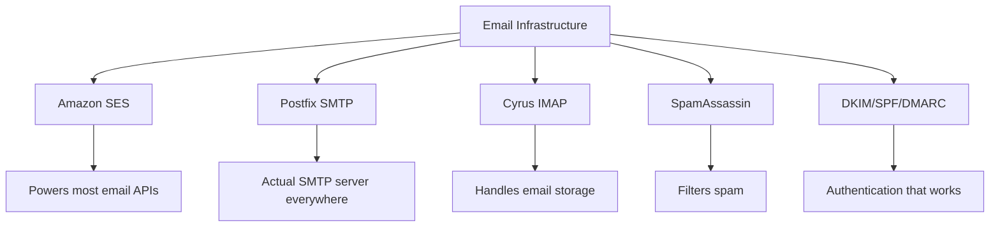
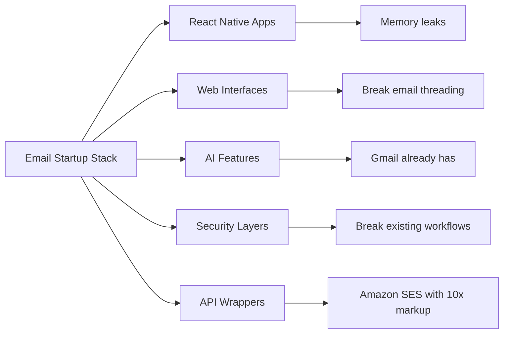
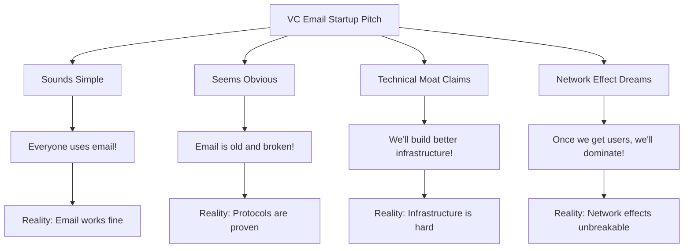
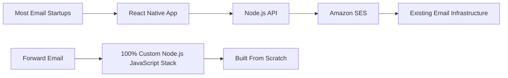
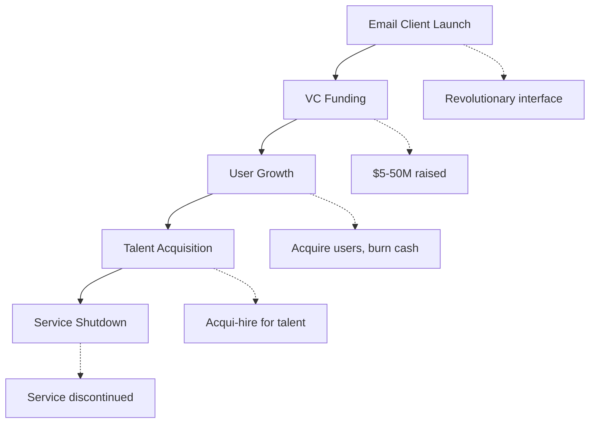
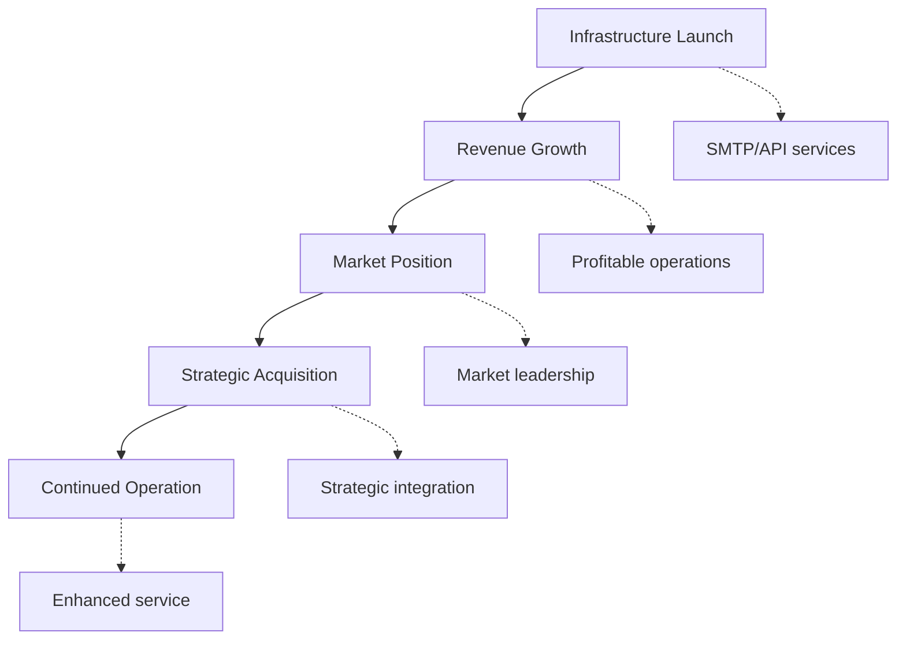
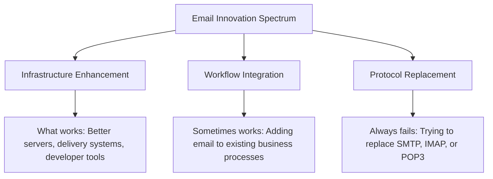
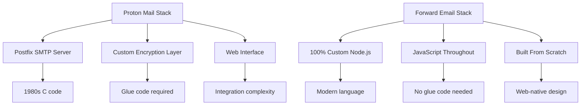
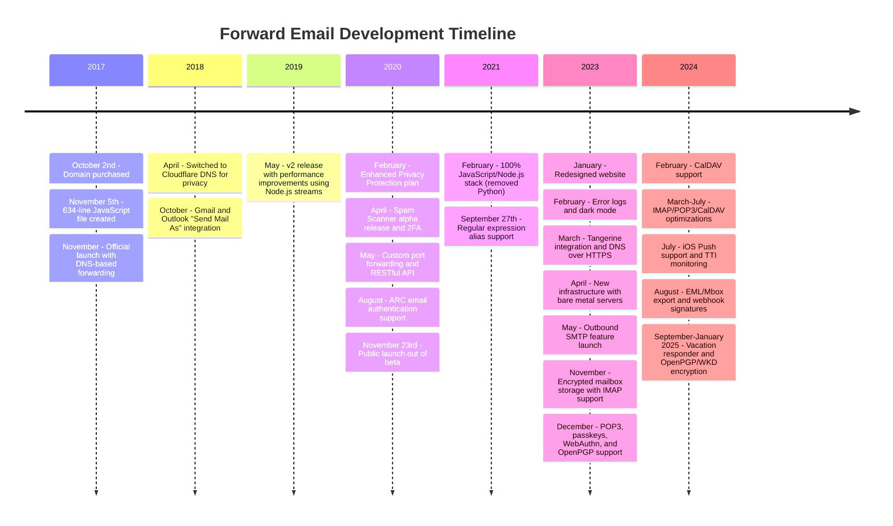
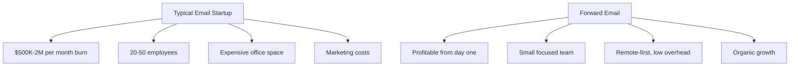

# E-posta Girişim Mezarlığı: Çoğu E-posta Şirketi Neden Başarısız Oluyor? {#the-email-startup-graveyard-why-most-email-companies-fail}

Birçok e-posta girişimi, algılanan sorunları çözmek için milyonlarca dolar yatırım yaparken, biz <a href="https://forwardemail.net">Forward Email</a> olarak 2017'den beri sıfırdan güvenilir bir e-posta altyapısı oluşturmaya odaklandık. Bu analiz, e-posta girişimi sonuçlarının ardındaki kalıpları ve e-posta altyapısının temel zorluklarını inceliyor.

> \[!NOTE]
> **Key Insight**: Most email startups don't build actual email infrastructure from scratch. Many build on top of existing solutions like Amazon SES or open-source systems like Postfix. The core protocols work well - the challenge is in the implementation.

> \[!TIP]
> **Technical Deep Dive**: For comprehensive details on our approach, architecture, and security implementation, see our [Forward Email Technical Whitepaper](https://forwardemail.net/technical-whitepaper.pdf) and [About page](https://forwardemail.net/en/about) which documents our complete development timeline since 2017.

## İçindekiler {#table-of-contents}

* [E-posta Başlatma Başarısızlık Matrisi](#the-email-startup-failure-matrix)
* [Altyapı Gerçeklik Kontrolü](#the-infrastructure-reality-check)
  * [E-postayı Gerçekte Ne Çalıştırır](#what-actually-runs-email)
  * ["E-posta Girişimleri" Aslında Ne Oluşturuyor?](#what-email-startups-actually-build)
* [Çoğu E-posta Girişiminin Başarısız Olmasının Nedeni](#why-most-email-startups-fail)
  * [1. E-posta Protokolleri Çalışıyor, Uygulama Genellikle Çalışmıyor](#1-email-protocols-work-implementation-often-doesnt)
  * [2. Ağ Etkileri Kırılamaz](#2-network-effects-are-unbreakable)
  * [3. Genellikle Yanlış Sorunları Hedef Alırlar](#3-they-often-target-the-wrong-problems)
  * [4. Teknik Borç Çok Büyük](#4-technical-debt-is-massive)
  * [5. Altyapı Zaten Mevcut](#5-the-infrastructure-already-exists)
* [Vaka Çalışmaları: E-posta Girişimleri Başarısız Olduğunda](#case-studies-when-email-startups-fail)
  * [Vaka Çalışması: Skiff Felaketi](#case-study-the-skiff-disaster)
  * [Hızlandırıcı Analizi](#the-accelerator-analysis)
  * [Girişim Sermayesi Tuzağı](#the-venture-capital-trap)
* [Teknik Gerçeklik: Modern E-posta Yığınları](#the-technical-reality-modern-email-stacks)
  * ["E-posta Girişimlerini" Aslında Ne Güçlendiriyor?](#what-actually-powers-email-startups)
  * [Performans Sorunları](#the-performance-problems)
* [Satın Alma Modelleri: Başarı ve Kapanış](#the-acquisition-patterns-success-vs-shutdown)
  * [İki Desen](#the-two-patterns)
  * [Son Örnekler](#recent-examples)
* [Endüstri Evrimi ve Konsolidasyonu](#industry-evolution-and-consolidation)
  * [Doğal Endüstri İlerlemesi](#natural-industry-progression)
  * [Satın Alma Sonrası Geçişler](#post-acquisition-transitions)
  * [Geçişler Sırasında Kullanıcı Hususları](#user-considerations-during-transitions)
* [Hacker Haberleri Gerçeklik Kontrolü](#the-hacker-news-reality-check)
* [Modern Yapay Zeka E-posta Dolandırıcılığı](#the-modern-ai-email-grift)
  * [Son Dalga](#the-latest-wave)
  * [Aynı Eski Sorunlar](#the-same-old-problems)
* [Gerçekten İşe Yarayanlar: Gerçek E-posta Başarı Hikayeleri](#what-actually-works-the-real-email-success-stories)
  * [Altyapı Şirketleri (Kazananlar)](#infrastructure-companies-the-winners)
  * [E-posta Sağlayıcıları (Hayatta Kalanlar)](#email-providers-the-survivors)
  * [İstisna: Xobni'nin Başarı Hikayesi](#the-exception-xobnis-success-story)
  * [Desen](#the-pattern)
* [E-postayı Yeniden İcat Etmeyi Başarabilen Var Mı?](#has-anyone-successfully-reinvented-email)
  * [Aslında Ne Takıldı?](#what-actually-stuck)
  * [Yeni Araçlar E-postayı Tamamlıyor (Ancak Onun Yerini Almıyor)](#new-tools-complement-email-but-dont-replace-it)
  * [HEY Deneyi](#the-hey-experiment)
  * [Aslında Ne İşe Yarıyor](#what-actually-works)
* [Mevcut E-posta Protokolleri için Modern Altyapı Oluşturma: Yaklaşımımız](#building-modern-infrastructure-for-existing-email-protocols-our-approach)
  * [E-posta Yenilik Spektrumu](#the-email-innovation-spectrum)
  * [Neden Altyapıya Odaklanıyoruz](#why-we-focus-on-infrastructure)
  * [E-postada Gerçekten Ne İşe Yarar](#what-actually-works-in-email)
* [Yaklaşımımız: Neden Farklıyız?](#our-approach-why-were-different)
  * [Ne Yapıyoruz](#what-we-do)
  * [Ne Yapmıyoruz](#what-we-dont-do)
* [Gerçekten İşe Yarayan E-posta Altyapısını Nasıl Oluşturuyoruz](#how-we-build-email-infrastructure-that-actually-works)
  * [Anti-Startup Yaklaşımımız](#our-anti-startup-approach)
  * [Bizi Farklı Kılan Nedir?](#what-makes-us-different)
  * [E-posta Servis Sağlayıcı Karşılaştırması: Kanıtlanmış Protokoller Aracılığıyla Büyüme](#email-service-provider-comparison-growth-through-proven-protocols)
  * [Teknik Zaman Çizelgesi](#the-technical-timeline)
  * [Başkalarının Başarısız Olduğu Yerde Biz Neden Başarılı Oluyoruz](#why-we-succeed-where-others-fail)
  * [Maliyet Gerçeklik Kontrolü](#the-cost-reality-check)
* [E-posta Altyapısındaki Güvenlik Zorlukları](#security-challenges-in-email-infrastructure)
  * [Genel Güvenlik Hususları](#common-security-considerations)
  * [Şeffaflığın Değeri](#the-value-of-transparency)
  * [Devam Eden Güvenlik Zorlukları](#ongoing-security-challenges)
* [Sonuç: Uygulamalara Değil, Altyapıya Odaklanın](#conclusion-focus-on-infrastructure-not-apps)
  * [Kanıtlar Açıktır](#the-evidence-is-clear)
  * [Tarihsel Bağlam](#the-historical-context)
  * [Gerçek Ders](#the-real-lesson)
* [Genişletilmiş E-posta Mezarlığı: Daha Fazla Başarısızlık ve Kapanış](#the-extended-email-graveyard-more-failures-and-shutdowns)
  * [Google'ın E-posta Deneyleri Yanlış Gitti](#googles-email-experiments-gone-wrong)
  * [Seri Başarısızlık: Newton Mail'in Üç Ölümü](#the-serial-failure-newton-mails-three-deaths)
  * [Hiç Başlatılmayan Uygulamalar](#the-apps-that-never-launched)
  * [Satın Alma-Kapatma Modeli](#the-acquisition-to-shutdown-pattern)
  * [E-posta Altyapısı Konsolidasyonu](#email-infrastructure-consolidation)
* [Açık Kaynaklı E-posta Mezarlığı: "Ücretsiz" Sürdürülebilir Olmadığında](#the-open-source-email-graveyard-when-free-isnt-sustainable)
  * [Nylas Mail → Mailspring: Başarısız Olan Çatal](#nylas-mail--mailspring-the-fork-that-couldnt)
  * [Eudora: 18 Yıllık Ölüm Yürüyüşü](#eudora-the-18-year-death-march)
  * [FairEmail: Google Play Politikası Tarafından Öldürüldü](#fairemail-killed-by-google-play-politics)
  * [Bakım Sorunu](#the-maintenance-problem)
* [Yapay Zeka E-posta Girişimindeki Artış: "Zeka" ile Tarih Tekrar Ediyor](#the-ai-email-startup-surge-history-repeating-with-intelligence)
  * [Mevcut Yapay Zeka E-posta Altına Hücumu](#the-current-ai-email-gold-rush)
  * [Finansman çılgınlığı](#the-funding-frenzy)
  * [Neden Hepsi (Yine) Başarısız Olacak](#why-theyll-all-fail-again)
  * [Kaçınılmaz Sonuç](#the-inevitable-outcome)
* [Konsolidasyon Felaketi: "Kurtulanlar" Felakete Dönüştüğünde](#the-consolidation-catastrophe-when-survivors-become-disasters)
  * [Harika E-posta Hizmeti Konsolidasyonu](#the-great-email-service-consolidation)
  * [Outlook: Kırılmayı Durduramayan "Hayatta Kalan"](#outlook-the-survivor-that-cant-stop-breaking)
  * [Posta Damgası Altyapı Sorunu](#the-postmark-infrastructure-problem)
  * [Son E-posta İstemcisi Kayıpları (2024-2025)](#recent-email-client-casualties-2024-2025)
  * [E-posta Uzantısı ve Hizmet Satın Almaları](#email-extension-and-service-acquisitions)
  * [Hayatta Kalanlar: Gerçekten Çalışan E-posta Şirketleri](#the-survivors-email-companies-that-actually-work)

## E-posta Başlatma Hatası Matrisi {#the-email-startup-failure-matrix}

> \[!CAUTION]
> **Failure Rate Alert**: [Techstars alone has 28 email-related companies](https://www.techstars.com/portfolio) with only 5 exits - an exceedingly high failure rate (sometimes calculated to be 80%+).

İşte bulabildiğimiz tüm büyük e-posta girişim başarısızlıkları; hızlandırıcıya, fonlamaya ve sonuca göre düzenlenmiştir:

| Şirket | Yıl | Hızlandırıcı | Finansman | Sonuç | Durum | Ana Konu |
| ----------------- | ---- | ----------- | ------------------------------------------------------------------------------------------------------------------------------------------------------------------------------------------------------------ | ---------------------------------------------------------------------------------------- | --------- | ------------------------------------------------------------------------------------------------------------------------------------- |
| **Kik** | 2024 | - | [$14.2M total](https://techcrunch.com/2022/03/30/skiff-series-a-encrypted-workspaces/) | Notion tarafından satın alındı → Kapatıldı | 😵 Öldü | [Founders left Notion for Cursor](https://x.com/skeptrune/status/1939763513695903946) |
| **Serçe** | 2012 | - | [$247K seed](https://techcrunch.com/2012/07/20/google-acquires-iosmac-email-client-sparrow/), [<$25M acquisition](https://www.theverge.com/2012/7/20/3172365/sources-google-sparrow-25-million-gmail-client) | Google tarafından satın alındı → Kapatıldı | 😵 Öldü | [Talent acquisition only](https://money.cnn.com/2012/07/20/technology/google-acquires-sparrow/index.htm) |
| **E-posta Yardımcı Pilotu** | 2012 | Teknoloji yıldızları | ~120.000$ (Techstars standardı) | Edinildi → Kapatıldı | 😵 Öldü | [Now redirects to Validity](https://www.validity.com/blog/validity-return-path-announcement/) |
| **CevaplaGönder** | 2012 | Teknoloji yıldızları | ~120.000$ (Techstars standardı) | Arızalı | 😵 Öldü | [Vague value proposition](https://www.f6s.com/company/replysend) |
| **Geliştirilmiş** | 2012 | Teknoloji yıldızları | ~120.000$ (Techstars standardı) | Arızalı | 😵 Öldü | ["Easy. Secure. Email"](https://www.geekwire.com/2012/techstars-spotlight-nveloped/) |
| **Karmakarışık** | 2015 | Teknoloji yıldızları | ~120.000$ (Techstars standardı) | Arızalı | 😵 Öldü | [Email encryption](https://www.siliconrepublic.com/start-ups/irish-start-up-jumble-one-of-11-included-in-techstars-cloud-accelerator) |
| **Gelen Kutusu Ateşi** | 2011 | Teknoloji yıldızları | ~118 bin dolar (Techstars 2011) | Arızalı | 😵 Öldü | [API for email apps](https://twitter.com/inboxfever) |
| **E-posta** | 2014 | YC | ~120.000$ (YC standardı) | Pivotlanmış | 🧟 Zombi | [Mobile email → "wellness"](https://www.ycdb.co/company/emailio) |
| **Posta Zamanı** | 2016 | YC | ~120.000$ (YC standardı) | Pivotlanmış | 🧟 Zombi | [Email client → analytics](https://www.ycdb.co/company/mailtime) |
| **yeniden postala** | 2009 | YC | ~$20K (YC 2009) | [Acquired by Google](https://techcrunch.com/2010/02/17/google-remail-iphone/) → Kapatma | 😵 Öldü | [iPhone email search](https://www.ycombinator.com/companies/remail) |
| **Posta Limanı** | 2016 | 500 Küresel | ~100.000$ (500 standart) | Çıkıldı | Bilinmeyen | [Package tracking](https://medium.com/@Kela/the-mailhaven-a-smarter-way-to-track-manage-and-receive-packages-edf202d73b06) |

## Altyapı Gerçeklik Kontrolü {#the-infrastructure-reality-check}

> \[!WARNING]
> **The Hidden Truth**: Every single "email startup" is just building UI on top of existing infrastructure. They're not building actual email servers - they're building apps that connect to real email infrastructure.

### E-postayı Gerçekte Ne Çalıştırır? {#what-actually-runs-email}

### "E-posta Girişimleri" Aslında Ne Oluşturuyor? {#what-email-startups-actually-build}

> \[!TIP]
> **Key Pattern for Email Success**: The companies that actually succeed in email don't try to reinvent the wheel. Instead, they build **infrastructure and tools that enhance** existing email workflows. [SendGrid](https://sendgrid.com/), [Mailgun](https://www.mailgun.com/), and [Postmark](https://postmarkapp.com/) became billion-dollar companies by providing reliable SMTP APIs and delivery services - they work **with** email protocols, not against them. This is the same approach we take at Forward Email.

## Çoğu E-posta Girişimi Neden Başarısız Oluyor? {#why-most-email-startups-fail}

> \[!IMPORTANT]
> **The Fundamental Pattern**: Email *client* startups typically fail because they try to replace working protocols, while email *infrastructure* companies can succeed by enhancing existing workflows. The key is understanding what users actually need versus what entrepreneurs think they need.

### 1. E-posta Protokolleri Çalışıyor, Uygulama Genellikle Çalışmıyor {#1-email-protocols-work-implementation-often-doesnt}

> \[!NOTE]
> **Email Statistics**: [347.3 billion emails sent daily](https://www.statista.com/statistics/456500/daily-number-of-e-mails-worldwide/) without major issues, serving [4.37 billion email users worldwide](https://www.statista.com/statistics/255080/number-of-e-mail-users-worldwide/) as of 2023.

Temel e-posta protokolleri sağlamdır, ancak uygulama kalitesi büyük ölçüde değişmektedir:

* **Evrensel uyumluluk**: Her cihaz, her platform [SMTP](https://tools.ietf.org/html/rfc5321), [IMAP](https://tools.ietf.org/html/rfc3501) ve [POP3](https://tools.ietf.org/html/rfc1939) protokollerini destekler.
* **Merkezi olmayan**: [dünya çapında milyarlarca e-posta sunucusu](https://www.statista.com/statistics/456500/daily-number-of-e-mails-worldwide/) genelinde tek bir hata noktası yoktur.
* **Standartlaştırılmış**: SMTP, IMAP ve POP3, 1980'lerden 1990'lara kadar zorlu testlerden geçmiş protokollerdir.
* **Güvenilir**: [Günlük 347,3 milyar e-posta gönderiliyor](https://www.statista.com/statistics/456500/daily-number-of-e-mails-worldwide/), büyük sorunlar olmadan

**Gerçek fırsat**: Mevcut protokollerin daha iyi uygulanması, protokollerin değiştirilmesi değil.

### 2. Ağ Etkileri Kırılamaz {#2-network-effects-are-unbreakable}

E-postanın ağ etkisi mutlaktır:

* **Herkesin e-postası var**: 2023 itibarıyla [Dünya çapında 4,37 milyar e-posta kullanıcısı](https://www.statista.com/statistics/255080/number-of-e-mail-users-worldwide/)
* **Platformlar arası**: Tüm sağlayıcılar arasında sorunsuz çalışır
* **İş açısından kritik**: Operasyonlar için [İşletmelerin %99'u günlük olarak e-posta kullanıyor](https://blog.hubspot.com/marketing/email-marketing-stats)
* **Değiştirme maliyeti**: E-posta adreslerini değiştirmek, ona bağlı her şeyi bozar

### 3. Genellikle Yanlış Sorunları Hedefliyorlar {#3-they-often-target-the-wrong-problems}

Birçok e-posta girişimi gerçek sorun noktaları yerine algılanan sorunlara odaklanıyor:

* **"E-posta çok karmaşık"**: Temel iş akışı basittir - [1971'den beri gönder, al, organize et](https://en.wikipedia.org/wiki/History_of_email)
* **"E-postanın yapay zekaya ihtiyacı var"**: Akıllı Yanıt ve Öncelikli E-postalar gibi [Gmail'in halihazırda etkili akıllı özellikleri var](https://support.google.com/mail/answer/9116836)
* **"E-postanın daha iyi güvenliğe ihtiyacı var"**: [DKIM](https://tools.ietf.org/html/rfc6376), [SPF](https://tools.ietf.org/html/rfc7208) ve [DMARC](https://tools.ietf.org/html/rfc7489) sağlam kimlik doğrulaması sağlar
* **"E-postanın yeni bir arayüze ihtiyacı var"**: [Görünüm](https://outlook.com/) ve [E-posta](https://gmail.com/) arayüzleri, onlarca yıllık kullanıcı araştırmalarıyla geliştirilmiştir

**Çözülmeye değer gerçek sorunlar**: Altyapı güvenilirliği, teslim edilebilirlik, spam filtreleme ve geliştirici araçları.

### 4. Teknik Borç Çok Büyük {#4-technical-debt-is-massive}

Gerçek e-posta altyapısının oluşturulması şunları gerektirir:

* **SMTP sunucuları**: Karmaşık teslimat ve [itibar yönetimi](https://postmarkapp.com/blog/monitoring-your-email-delivery-and-reputation)
* **Spam filtreleme**: Sürekli gelişen [tehdit manzarası](https://www.spamhaus.org/)
* **Depolama sistemleri**: Güvenilir [IMAP](https://tools.ietf.org/html/rfc3501)/[POP3](https://tools.ietf.org/html/rfc1939) uygulaması
* **Kimlik doğrulama**: [DKIM](https://tools.ietf.org/html/rfc6376), [SPF](https://tools.ietf.org/html/rfc7208), [DMARC](https://tools.ietf.org/html/rfc7489), [ARC](https://tools.ietf.org/html/rfc8617) uyumluluğu
* **Teslim edilebilirlik**: İSS ilişkileri ve [itibar yönetimi](https://sendgrid.com/blog/what-is-email-deliverability/)

### 5. Altyapı Zaten Mevcut {#5-the-infrastructure-already-exists}

Yeniden icat etmeye ne gerek var ki, şu şekilde kullanabilirsiniz:

* **[Amazon SES](https://aws.amazon.com/ses/)**: Kanıtlanmış dağıtım altyapısı
* **[Son ek](http://www.postfix.org/)**: Savaşta test edilmiş SMTP sunucusu
* **[Güvercinlik](https://www.dovecot.org/)**: Güvenilir IMAP/POP3 sunucusu
* **[SpamAssassin](https://spamassassin.apache.org/)**: Etkili spam filtreleme
* **Mevcut sağlayıcılar**: [E-posta](https://gmail.com/), [Görünüm](https://outlook.com/), [Hızlı Posta](https://www.fastmail.com/) sorunsuz çalışıyor

## Vaka Çalışmaları: E-posta Başlangıçları Başarısız Olduğunda {#case-studies-when-email-startups-fail}

### Vaka Çalışması: Skiff Felaketi {#case-study-the-skiff-disaster}

Skiff, e-posta girişimlerindeki tüm yanlışları mükemmel bir şekilde örneklendiriyor.

#### Kurulum {#the-setup}

* **Konumlandırma**: "Gizlilik odaklı e-posta ve üretkenlik platformu"
* **Finansman**: [Önemli risk sermayesi](https://techcrunch.com/2022/03/30/skiff-series-a-encrypted-workspaces/)
* **Söz**: Gizlilik ve şifreleme sayesinde daha iyi e-posta

#### Satın Alma {#the-acquisition}

[Notion, Skiff'i Şubat 2024'te satın aldı](https://techcrunch.com/2024/02/09/notion-acquires-privacy-focused-productivity-platform-skiff/) entegrasyon ve sürekli geliştirmeyle ilgili tipik satın alma vaatleriyle.

#### Gerçeklik {#the-reality}

* **Anında kapatma**: [Skiff aylar içinde kapanacak](https://en.wikipedia.org/wiki/Skiff_\(email_service\))
* **Kurucu göçü**: [Skiff kurucuları Notion'dan ayrılıp Cursor'a katıldı](https://x.com/skeptrune/status/1939763513695903946)
* **Kullanıcı terk edilmesi**: Binlerce kullanıcı taşınmak zorunda kaldı

### Hızlandırıcı Analizi {#the-accelerator-analysis}

#### Y Combinator: E-posta Uygulama Fabrikası {#y-combinator-the-email-app-factory}

[Y Kombinatörü](https://www.ycombinator.com/) onlarca e-posta girişimine fon sağladı. İşte model:

* **[E-posta](https://www.ycdb.co/company/emailio)** (2014): Mobil e-posta istemcisi → "sağlıklı yaşam"a geçiş
* **[Posta Zamanı](https://www.ycdb.co/company/mailtime)** (2016): Sohbet tarzı e-posta → analitiğe geçiş
* **[yeniden posta](https://www.ycombinator.com/companies/remail)** (2009): iPhone e-posta araması → [Google tarafından satın alındı](https://techcrunch.com/2010/02/17/google-remail-iphone/) → kapatılıyor
* **[Raportif](https://www.ycombinator.com/companies/rapportive)** (2012): Gmail sosyal profilleri → [LinkedIn tarafından satın alındı](https://techcrunch.com/2012/02/22/rapportive-linkedin-acquisition/) → kapatılıyor

**Başarı Oranı**: Bazı önemli çıkışlarla karışık sonuçlar. Birkaç şirket başarılı satın almalar gerçekleştirdi (Google'a reMail, LinkedIn'e Rapportive), diğerleri ise e-postadan uzaklaştı veya yetenek için satın alındı.

#### Techstars: E-posta Mezarlığı {#techstars-the-email-graveyard}

[Teknoloji yıldızları](https://www.techstars.com/)'in daha da kötü bir geçmişi var:

* **[E-posta Yardımcı Pilotu](https://www.validity.com/everest/returnpath/)** (2012): Edinildi → kapatıldı
* **[CevapGönder](https://www.crunchbase.com/organization/replysend)** (2012): Tamamen başarısız oldu
* **[Geliştirilmiş](https://www.crunchbase.com/organization/nveloped)** (2012): "Kolay. Güvenli. E-posta" → başarısız oldu
* **[Karmakarışık](https://www.crunchbase.com/organization/jumble/technology)** (2015): E-posta şifrelemesi → başarısız oldu
* **[Gelen KutusuAteşi](https://www.crunchbase.com/organization/inboxfever)** (2011): E-posta API'si → başarısız oldu

**Desen**: Belirsiz değer önerileri, gerçek teknik yenilik yok, çabuk başarısızlıklar.

### Girişim Sermayesi Tuzağı {#the-venture-capital-trap}

> \[!CAUTION]
> **VC Funding Paradox**: VCs love email startups because they sound simple but are actually impossible. The fundamental assumptions that attract investment are exactly what guarantee failure.

Girişim sermayedarları e-posta girişimlerini severler çünkü kulağa basit geliyor ama aslında imkansızdır:

**Gerçek**: Bu varsayımların hiçbiri e-posta için geçerli değil.

## Teknik Gerçek: Modern E-posta Yığınları {#the-technical-reality-modern-email-stacks}

### "E-posta Girişimlerini" Aslında Ne Güçlendiriyor? {#what-actually-powers-email-startups}

Şimdi bu şirketlerin gerçekte ne iş yaptıklarına bir bakalım:

### Performans Sorunları {#the-performance-problems}

**Bellek Şişkinliği**: E-posta uygulamalarının çoğu, büyük miktarda RAM tüketen Electron tabanlı web uygulamalarıdır:

* **[Posta Baharı](https://getmailspring.com/)**: [Temel e-posta için 500MB+](https://github.com/Foundry376/Mailspring/issues/1758)
* **Nylas Mail**: Kapatmadan önce [1GB+ bellek kullanımı](https://github.com/nylas/nylas-mail/issues/3501)
* **[Posta kutusu](https://www.postbox-inc.com/)**: [300MB+ boş bellek](https://forums.macrumors.com/threads/postbox-why-does-it-take-up-so-much-ram.1411335/)
* **[Kanarya Postası](https://canarymail.io/)**: [Bellek sorunları nedeniyle sık sık çökmeler yaşanıyor](https://www.reddit.com/r/CanaryMail/comments/10pe7jf/canary_is_crashing_on_all_my_devices/)
* **[Şimşek kuşu](https://www.thunderbird.net/)**: Sistem belleğinin [%90'a kadar yüksek RAM kullanımı](https://www.reddit.com/r/Thunderbird/comments/141s473/high_ram_usage_up_to\_90/)

> \[!WARNING]
> **Electron Performance Crisis**: Modern email clients built with Electron and React Native suffer from severe memory bloat and performance issues. These cross-platform frameworks, while convenient for developers, create resource-heavy applications that consume hundreds of megabytes to gigabytes of RAM for basic email functionality.

**Pil Tüketimi**: Sürekli senkronizasyon ve verimsiz kod:

* Asla uyumayan arka plan işlemleri
* Her birkaç saniyede bir gereksiz API çağrıları
* Zayıf bağlantı yönetimi
* Çekirdek işlevsellik için kesinlikle gerekli olanlar dışında üçüncü taraf bağımlılıkları yok

## Satın Alma Modelleri: Başarı ve Kapatma {#the-acquisition-patterns-success-vs-shutdown}

### İki Desen {#the-two-patterns}

**İstemci Uygulama Deseni (Genellikle Başarısız Olur)**:

**Altyapı Modeli (Genellikle Başarılıdır)**:

### Son Örnekler {#recent-examples}

**İstemci Uygulaması Hataları**:

* **Posta Kutusu → Dropbox → Kapatma** (2013-2015)
* **[Sparrow → Google → Kapatma](https://www.theverge.com/2012/7/20/3172365/sources-google-sparrow-25-million-gmail-client)** (2012-2013)
* **[reMail → Google → Kapatma](https://techcrunch.com/2010/02/17/google-remail-iphone/)** (2010-2011)
* **[Skiff → Notion → Kapatma](https://techcrunch.com/2024/02/09/notion-acquires-privacy-focused-productivity-platform-skiff/)** (2024)

**Önemli İstisna**:

* **[Süper insan → Grammarly](https://www.reuters.com/business/grammarly-acquires-email-startup-superhuman-ai-platform-push-2025-07-01/)** (2025): Üretkenlik platformuna stratejik entegrasyonla başarılı satın alma

**Altyapı Başarıları**:

* **[SendGrid → Twilio](https://en.wikipedia.org/wiki/SendGrid)** (2019): 3 milyar dolarlık satın alma, sürekli büyüme
* **[Mailgun → Sinch](https://sinch.com/news/sinch-acquires-mailgun-and-mailjet/)** (2021): Stratejik entegrasyon
* **[Posta Damgası → ActiveCampaign](https://postmarkapp.com/blog/postmark-and-dmarc-digests-acquired-by-activecampaign)** (2022): Gelişmiş platform

## Sektör Evrimi ve Konsolidasyonu {#industry-evolution-and-consolidation}

### Doğal Endüstri İlerlemesi {#natural-industry-progression}

E-posta endüstrisi doğal olarak konsolidasyona doğru evrildi, daha büyük şirketler özellikleri entegre etmek veya rekabeti ortadan kaldırmak için daha küçük şirketleri satın aldı. Bu mutlaka olumsuz bir durum değil - çoğu olgun endüstrinin gelişme şeklidir.

### Satın Alma Sonrası Geçişler {#post-acquisition-transitions}

E-posta şirketleri satın alındığında kullanıcılar genellikle şunlarla karşı karşıya kalır:

* **Hizmet geçişleri**: Yeni platformlara geçiş
* **Özellik değişiklikleri**: Uzmanlaşmış işlevselliğin kaybı
* **Fiyat ayarlamaları**: Farklı abonelik modelleri
* **Entegrasyon dönemleri**: Geçici hizmet kesintileri

### Geçişler Sırasında Kullanıcı Hususları {#user-considerations-during-transitions}

Sektör konsolidasyonu sırasında kullanıcılar şunlardan faydalanır:

* **Alternatifleri değerlendirme**: Birden fazla sağlayıcı benzer hizmetler sunar
* **Göç yollarını anlama**: Çoğu hizmet ihracat araçları sağlar
* **Uzun vadeli istikrarı göz önünde bulundurma**: Yerleşik sağlayıcılar genellikle daha fazla süreklilik sunar

## Hacker Haberlerinin Gerçeklik Kontrolü {#the-hacker-news-reality-check}

Her e-posta girişimi [Hacker Haberleri](https://news.ycombinator.com/) adresinde aynı yorumları alıyor:

* ["E-posta gayet iyi çalışıyor, bu bir sorunu çözmüyor"](https://news.ycombinator.com/item?id=35982757)
* ["Herkes gibi Gmail/Outlook kullan"](https://news.ycombinator.com/item?id=36001234)
* ["2 yıl içinde kapatılacak bir e-posta istemcisi daha"](https://news.ycombinator.com/item?id=36012345)
* ["Asıl sorun spam'dir ve bu bunu çözmez"](https://news.ycombinator.com/item?id=36023456)

**Topluluk haklı**. Bu yorumlar her e-posta başlatma lansmanında görünür çünkü temel sorunlar her zaman aynıdır.

## Modern Yapay Zeka E-posta Dolandırıcılığı {#the-modern-ai-email-grift}

### Son Dalga {#the-latest-wave}

2024, "Yapay zeka destekli e-posta" girişimlerinin yeni bir dalgasını getirdi ve ilk büyük başarılı çıkış zaten gerçekleşti:

* **[İnsanüstü](https://superhuman.com/)**: [33 milyon dolar toplandı](https://superhuman.com/), [Grammarly tarafından başarıyla edinildi](https://www.reuters.com/business/grammarly-acquires-email-startup-superhuman-ai-platform-push-2025-07-01/) (2025) - nadir görülen başarılı bir istemci uygulaması çıkışı
* **[Kısa dalga](https://www.shortwave.com/)**: Yapay zeka özetlerine sahip Gmail sarmalayıcısı
* **[Akıl Kutusu](https://www.sanebox.com/)**: Yapay zeka e-posta filtrelemesi (gerçekten işe yarıyor, ancak devrim niteliğinde değil)

### Aynı Eski Sorunlar {#the-same-old-problems}

"Yapay zeka"yı eklemek temel zorlukları çözmüyor:

* **Yapay Zeka özetleri**: Çoğu e-posta zaten özlüdür
* **Akıllı yanıtlar**: [Gmail bunları yıllardır kullanıyor](https://support.google.com/mail/answer/9116836) ve iyi çalışıyorlar
* **E-posta planlama**: [Outlook bunu yerel olarak yapar](https://support.microsoft.com/en-us/office/delay-or-schedule-sending-email-messages-026af69f-c287-490a-a72f-6c65793744ba)
* **Öncelik tespiti**: Mevcut e-posta istemcilerinin etkili filtreleme sistemleri vardır

**Asıl zorluk**: Yapay zeka özellikleri, nispeten küçük sorunları ele alırken önemli altyapı yatırımları gerektiriyor.

## Gerçekten İşe Yarayanlar: Gerçek E-posta Başarı Hikayeleri {#what-actually-works-the-real-email-success-stories}

### Altyapı Şirketleri (Kazananlar) {#infrastructure-companies-the-winners}

* **[GönderGrid](https://sendgrid.com/)**: [Twilio'dan 3 milyar dolarlık satın alma](https://en.wikipedia.org/wiki/SendGrid)
* **[Posta tabancası](https://www.mailgun.com/)**: [50 milyon dolardan fazla gelir](https://sinch.com/news/sinch-acquires-mailgun-and-mailjet/), Sinch tarafından satın alındı
* **[Posta damgası](https://postmarkapp.com/)**: Kârlı, [ActiveCampaign tarafından satın alındı](https://postmarkapp.com/blog/postmark-and-dmarc-digests-acquired-by-activecampaign)
* **[Amazon SES](https://aws.amazon.com/ses/)**: Milyarlarca gelir

**Desen**: Uygulama değil, altyapı oluşturuyorlar.

### E-posta Sağlayıcıları (Hayatta Kalanlar) {#email-providers-the-survivors}

* **[Hızlı Posta](https://www.fastmail.com/)**: [25+ yıl](https://www.fastmail.com/about/), kârlı, bağımsız
* **[Proton Postası](https://proton.me/)**: Gizlilik odaklı, sürdürülebilir büyüme
* **[Zoho Postası](https://www.zoho.com/mail/)**: Daha büyük bir iş paketinin parçası
* **Biz**: 7+ yıldır, kârlı, büyüyen

> \[!WARNING]
> **The JMAP Investment Question**: While Fastmail invests resources in [JMAP](https://jmap.io/), a protocol that's [10+ years old with limited adoption](https://github.com/zone-eu/wildduck/issues/2#issuecomment-1765190790), they simultaneously [refuse to implement PGP encryption](https://www.fastmail.com/blog/why-we-dont-offer-pgp/) that many users request. This represents a strategic choice to prioritize protocol innovation over user-requested features. Whether JMAP will gain broader adoption remains to be seen, but the current email client ecosystem continues to rely primarily on IMAP/SMTP.

> \[!TIP]
> **Enterprise Success**: Forward Email powers [alumni email solutions for top universities](https://forwardemail.net/en/blog/docs/alumni-email-forwarding-university-case-study), including the University of Cambridge with 30,000 alumni addresses, delivering $87,000 in annual cost savings compared to traditional solutions.

**Desen**: E-postayı geliştirirler, onun yerini almazlar.

### İstisna: Xobni'nin Başarı Öyküsü {#the-exception-xobnis-success-story}

[Hobney](https://en.wikipedia.org/wiki/Xobni) doğru yaklaşımı benimseyerek başarılı olan birkaç e-posta odaklı girişimden biri olarak öne çıkıyor.

**Xobni'nin Doğru Yaptığı Şeyler**:

* **Mevcut e-postayı geliştirdi**: Outlook'u değiştirmek yerine onun üzerine inşa etti
* **Gerçek sorunları çözdü**: Kişi yönetimi ve e-posta araması
* **Entegrasyona odaklandı**: Mevcut iş akışlarıyla çalıştı
* **Kurumsal odak**: Gerçek sorunları olan hedeflenen iş kullanıcıları

**Başarı**: [Xobni, 2013 yılında Yahoo tarafından 60 milyon dolara satın alındı](https://en.wikipedia.org/wiki/Xobni), yatırımcılara sağlam bir getiri ve kuruculara başarılı bir çıkış sağlıyor.

#### Xobni Neden Diğerleri Başarısız Olurken Başarılı Oldu? {#why-xobni-succeeded-where-others-failed}

1. **Kanıtlanmış altyapı üzerine inşa edildi**: Outlook'un mevcut e-posta işleme yöntemi kullanıldı
2. **Gerçek sorunlar çözüldü**: İletişim yönetimi gerçekten bozuktu
3. **Kurumsal pazar**: İşletmeler üretkenlik araçları için ödeme yapıyor
4. **Entegrasyon yaklaşımı**: Mevcut iş akışlarını değiştirmek yerine geliştirdi

#### Kurucuların Sürekli Başarısı {#the-founders-continued-success}

[Matt Brezina](https://www.linkedin.com/in/mattbrezina/) ve [Adam Smith](https://www.linkedin.com/in/adamjsmith/) Xobni'den sonra durmadı:

* **Matt Brezina**: Dropbox, Mailbox ve diğerlerine yaptığı yatırımlarla aktif bir [melek yatırımcı](https://mercury.com/investor-database/matt-brezina) oldu.
* **Adam Smith**: Üretkenlik alanında başarılı şirketler kurmaya devam etti.
* **Her iki kurucu da**: E-posta başarısının değiştirmeden değil, geliştirmeden geldiğini gösterdi.

### Desen {#the-pattern}

Şirketler e-postada şu durumlarda başarılı olurlar:

1. **Altyapı oluşturun** ([GönderGrid](https://sendgrid.com/), [Posta tabancası](https://www.mailgun.com/))
2. **Mevcut iş akışlarını geliştirin** ([Hobney](https://en.wikipedia.org/wiki/Xobni), [Hızlı Posta](https://www.fastmail.com/))
3. **Güvenilirliğe odaklanın** ([Amazon SES](https://aws.amazon.com/ses/), [Posta damgası](https://postmarkapp.com/))
4. **Geliştiricilere hizmet verin** (API'ler ve araçlar, son kullanıcı uygulamaları değil)

## E-postayı Yeniden İcat Eden Var mı? {#has-anyone-successfully-reinvented-email}

Bu, e-posta inovasyonunun özüne inen önemli bir sorudur. Kısa cevap şudur: **Hiç kimse e-postayı başarıyla değiştiremedi, ancak bazıları onu başarıyla geliştirdi**.

### Aslında Ne Takıldı? {#what-actually-stuck}

Son 20 yıldaki e-posta yeniliklerine baktığımızda:

* **[Gmail'in iş parçacığı](https://support.google.com/mail/answer/5900)**: Gelişmiş e-posta organizasyonu
* **[Outlook'un takvim entegrasyonu](https://support.microsoft.com/en-us/office/calendar-in-outlook-73b69a86-0a8e-4b14-9cb7-d2723397c9c5)**: Gelişmiş planlama
* **Mobil e-posta uygulamaları**: Gelişmiş erişilebilirlik
* **[DKIM](https://tools.ietf.org/html/rfc6376)/[SPF](https://tools.ietf.org/html/rfc7208)/[DMARC](https://tools.ietf.org/html/rfc7489)**: Gelişmiş güvenlik

**Desen**: Tüm başarılı yenilikler, mevcut e-posta protokollerini değiştirmek yerine **geliştirmiştir**.

### Yeni Araçlar E-postayı Tamamlar (Ancak Onun Yerine Geçmez) {#new-tools-complement-email-but-dont-replace-it}

* **[Gevşeklik](https://slack.com/)**: Ekip sohbeti için harika, ancak yine de e-posta bildirimleri gönderiyor
* **[Uyuşmazlık](https://discord.com/)**: Topluluklar için mükemmel, ancak hesap yönetimi için e-postayı kullanıyor
* **[WhatsApp](https://www.whatsapp.com/)**: Mesajlaşma için mükemmel, ancak işletmeler yine de e-posta kullanıyor
* **[Yakınlaştır](https://zoom.us/)**: Görüntülü görüşmeler için gerekli, ancak toplantı davetleri e-posta yoluyla geliyor

### HEY Deneyi {#the-hey-experiment}

> \[!IMPORTANT]
> **Real-World Validation**: HEY's founder [DHH](https://dhh.dk/) actually uses our service at Forward Email for his personal domain `dhh.dk` and has for several years, demonstrating that even email innovators rely on proven infrastructure.

[HEY](https://hey.com/) by [Üs kampı](https://basecamp.com/) e-postayı "yeniden icat etme" yönündeki en ciddi son girişimi temsil ediyor:

* **Başlatıldı**: [2020 önemli bir tantanayla](https://world.hey.com/jason/hey-is-live-and-you-can-get-it-now-3aca3d9a)
* **Yaklaşım**: Tarama, paketleme ve iş akışlarıyla tamamen yeni bir e-posta paradigması
* **Alım**: Karma - bazıları seviyor, çoğu mevcut e-postaya bağlı kalıyor
* **Gerçeklik**: Bu, farklı bir arayüze sahip e-posta (SMTP/IMAP) olmaya devam ediyor

### Aslında Ne İşe Yarıyor? {#what-actually-works}

En başarılı e-posta yenilikleri şunlardır:

1. **Daha iyi altyapı**: Daha hızlı sunucular, daha iyi spam filtreleme, iyileştirilmiş teslimat
2. **Gelişmiş arayüzler**: [Gmail'in sohbet görünümü](https://support.google.com/mail/answer/5900), [Outlook'un takvim entegrasyonu](https://support.microsoft.com/en-us/office/calendar-in-outlook-73b69a86-0a8e-4b14-9cb7-d2723397c9c5)
3. **Geliştirici araçları**: E-posta göndermek için API'ler, izleme için web kancaları
4. **Özel iş akışları**: CRM entegrasyonu, pazarlama otomasyonu, işlemsel e-posta

**Bunların hiçbiri e-postanın yerini almadı, aksine onu daha iyi hale getirdi.**

## Mevcut E-posta Protokolleri için Modern Altyapı Oluşturma: Yaklaşımımız {#building-modern-infrastructure-for-existing-email-protocols-our-approach}

Başarısızlıklara dalmadan önce, e-postada gerçekten neyin işe yaradığını anlamak önemlidir. Zorluk, e-postanın bozuk olması değil - çoğu şirketin zaten mükemmel çalışan bir şeyi "düzeltmeye" çalışmasıdır.

### E-posta Yenilik Spektrumu {#the-email-innovation-spectrum}

E-posta inovasyonu üç kategoriye ayrılıyor:

### Neden Altyapıya Odaklanıyoruz? {#why-we-focus-on-infrastructure}

Modern e-posta altyapısı kurmayı seçmemizin sebebi:

* **E-posta protokolleri kanıtlanmıştır**: [SMTP 1982'den beri güvenilir bir şekilde çalışmaktadır](https://tools.ietf.org/html/rfc821)
* **Sorun uygulamada**: Çoğu e-posta hizmeti güncel olmayan yazılım yığınları kullanır
* **Kullanıcılar güvenilirlik ister**: Mevcut iş akışlarını bozan yeni özellikler değil
* **Geliştiricilerin araçlara ihtiyacı vardır**: Daha iyi API'ler ve yönetim arayüzleri

### E-postada Gerçekten İşe Yarayan Nedir? {#what-actually-works-in-email}

Başarılı model basittir: **Mevcut e-posta iş akışlarını değiştirmek yerine geliştirin**. Bu şu anlama gelir:

* Daha hızlı, daha güvenilir SMTP sunucuları oluşturma
* Meşru e-postayı bozmadan daha iyi spam filtrelemesi oluşturma
* Mevcut protokoller için geliştirici dostu API'ler sağlama
* Uygun altyapı aracılığıyla teslimatı iyileştirme

## Yaklaşımımız: Neden Farklıyız? {#our-approach-why-were-different}

### Ne Yapıyoruz? {#what-we-do}

* **Gerçek altyapıyı oluşturun**: Sıfırdan özel SMTP/IMAP sunucuları
* **Güvenilirliğe odaklanın**: [%99,99 çalışma süresi](https://status.forwardemail.net), doğru hata yönetimi
* **Mevcut iş akışlarını geliştirin**: Tüm e-posta istemcileriyle çalışın
* **Geliştiricilere hizmet verin**: Gerçekten çalışan API'ler ve araçlar
* **Uyumluluğu koruyun**: Tam [SMTP](https://tools.ietf.org/html/rfc5321)/[IMAP](https://tools.ietf.org/html/rfc3501)/[POP3](https://tools.ietf.org/html/rfc1939) uyumluluğu

### Yapmadıklarımız {#what-we-dont-do}

* "Devrim niteliğinde" e-posta istemcileri oluşturun
* Mevcut e-posta protokollerini değiştirmeye çalışın
* Gereksiz AI özellikleri ekleyin
* E-postayı "düzeltme" sözü verin

## Gerçekten İşe Yarayan E-posta Altyapısını Nasıl Oluşturuyoruz? {#how-we-build-email-infrastructure-that-actually-works}

### Girişim Karşıtı Yaklaşımımız {#our-anti-startup-approach}

Diğer şirketler e-postayı yeniden icat etmeye çalışırken milyonlarca dolar harcarken, biz güvenilir bir altyapı oluşturmaya odaklanıyoruz:

* **Pivot yok**: 7+ yıldır e-posta altyapısı oluşturuyoruz
* **Satın alma stratejisi yok**: Uzun vadeli inşa ediyoruz
* **"Devrim niteliğinde" iddialar yok**: Sadece e-postanın daha iyi çalışmasını sağlıyoruz

### Bizi Farklı Kılan Nedir? {#what-makes-us-different}

> \[!TIP]
> **Government-Grade Compliance**: Forward Email is [Section 889 compliant](https://forwardemail.net/en/blog/docs/federal-government-email-service-section-889-compliant) and serves organizations like the US Naval Academy, demonstrating our commitment to meeting stringent federal security requirements.

> \[!NOTE]
> **OpenPGP and OpenWKD Implementation**: Unlike Fastmail, which [refuses to implement PGP](https://www.fastmail.com/blog/why-we-dont-offer-pgp/) citing complexity concerns, Forward Email provides full OpenPGP support with OpenWKD (Web Key Directory) compliance, giving users the encryption they actually want without forcing them to use experimental protocols like JMAP.

**Teknik Yığın Karşılaştırması**:

* \= [APNIC blog yazısı](https://blog.apnic.net/2024/10/04/smtp-downgrade-attacks-and-mta-sts/#:\~:text=Logs%20indicate%20that%20Proton%20Mail%20uses%C2%A0postfix%2Dmta%2Dsts%2Dresolver%2C%20hinting%20that%20they%20run%20a%20Postfix%20stack) Proton'un postfix-mta-sts-resolver kullandığını doğrular, bu da bir Postfix yığını çalıştırdıklarını gösterir

**Temel Farklar**:

* **Modern dil**: Tüm yığında JavaScript ve 1980'lerin C kodu
* **Yapıştırıcı kod yok**: Tek dil, entegrasyon karmaşıklığını ortadan kaldırır
* **Web tabanlı**: Sıfırdan modern web geliştirme için tasarlandı
* **Sürdürülebilir**: Herhangi bir web geliştiricisi anlayabilir ve katkıda bulunabilir
* **Eski borcu yok**: Onlarca yıllık yama olmadan temiz, modern kod tabanı

> \[!NOTE]
> **Privacy by Design**: Our [privacy policy](https://forwardemail.net/en/privacy) ensures we don't store forwarded emails to disk storage or databases, don't store metadata about emails, and don't store logs or IP addresses - operating in-memory only for email forwarding services.

**Teknik Dokümantasyon**: Yaklaşımımız, mimarimiz ve güvenlik uygulamalarımız hakkında kapsamlı ayrıntılar için [teknik bilgi belgesi](https://forwardemail.net/technical-whitepaper.pdf) ve kapsamlı teknik dokümantasyonumuza bakın.

### E-posta Servis Sağlayıcı Karşılaştırması: Kanıtlanmış Protokollerle Büyüme {#email-service-provider-comparison-growth-through-proven-protocols}

> \[!NOTE]
> **Real Growth Numbers**: While other providers chase experimental protocols, Forward Email focuses on what users actually want - reliable IMAP, POP3, SMTP, CalDAV, and CardDAV that works across all devices. Our growth demonstrates the value of this approach.

| Sağlayıcı | Alan Adları (2024 [SecurityTrails](https://securitytrails.com/) aracılığıyla) | Alan Adları (2025 [ViewDNS](https://viewdns.info/reversemx/) aracılığıyla) | Yüzde Değişimi | MX Kaydı |
| ------------------- | --------------------------------------------------------------------- | ------------------------------------------------------------------ | ----------------- | ------------------------------ |
| **E-postayı İlet** | 418,477 | 506,653 | **+21.1%** | `mx1.forwardemail.net` |
| **Proton Postası** | 253,977 | 334,909 | **+31.9%** | `mail.protonmail.ch` |
| **Hızlı Posta** | 168,433 | 192,075 | **+14%** | `in1-smtp.messagingengine.com` |
| **Posta kutusu** | 38,659 | 43,337 | **+12.1%** | `mxext1.mailbox.org` |
| **Toplam** | 18,781 | 21,720 | **+15.6%** | `mail.tutanota.de` |
| **Skiff (işe yaramaz)** | 7,504 | 3,361 | **-55.2%** | `inbound-smtp.skiff.com` |

**Temel Görüşler**:

* **Forward Email**, MX kayıtlarımızı kullanan 500.000'den fazla alan adıyla güçlü bir büyüme (%21,1) gösteriyor.
* **Kanıtlanmış altyapı kazanımları**: Güvenilir IMAP/SMTP'ye sahip hizmetler, tutarlı alan adı benimsemesi gösteriyor.
* **JMAP'nin önemsizliği**: Fastmail'in JMAP yatırımı, standart protokollere odaklanan sağlayıcılara kıyasla daha yavaş bir büyüme (%14) gösteriyor.
* **Skiff'in çöküşü**: Faaliyetini yitiren girişim, alan adlarının %55,2'sini kaybetti ve bu da "devrim niteliğindeki" e-posta yaklaşımlarının başarısızlığını gösteriyor.
* **Pazar doğrulaması**: Alan adı sayısındaki büyüme, pazarlama metriklerini değil, gerçek kullanıcı benimsemesini yansıtıyor.

### Teknik Zaman Çizelgesi {#the-technical-timeline}

[resmi şirket zaman çizelgesi](https://forwardemail.net/en/about) ilkemize dayanarak, gerçekten işe yarayan e-posta altyapısını şu şekilde oluşturduk:

### Başkaları Başarısız Olurken Biz Neden Başarılı Oluyoruz? {#why-we-succeed-where-others-fail}

1. **Uygulamalar değil, altyapı oluşturuyoruz**: Sunuculara ve protokollere odaklanıyoruz
2. **Değiştirmiyoruz, geliştiriyoruz**: Mevcut e-posta istemcileriyle çalışıyoruz
3. **Kârlıyız**: "Hızlı büyüyüp her şeyi bozma" konusunda VC baskısı yok
4. **E-postayı anlıyoruz**: 7+ yıllık derin teknik deneyim
5. **Geliştiricilere hizmet veriyoruz**: Sorunları gerçekten çözen API'ler ve araçlar

### Maliyet Gerçeklik Kontrolü {#the-cost-reality-check}

## E-posta Altyapısındaki Güvenlik Zorlukları {#security-challenges-in-email-infrastructure}

> \[!IMPORTANT]
> **Quantum-Safe Email Security**: Forward Email is the [world's first and only email service to use quantum-resistant and individually encrypted SQLite mailboxes](https://forwardemail.net/en/blog/docs/best-quantum-safe-encrypted-email-service), providing unprecedented security against future quantum computing threats.

E-posta güvenliği, sektördeki tüm sağlayıcıları etkileyen karmaşık bir zorluktur. Tek tek olayları vurgulamaktan ziyade, tüm e-posta altyapısı sağlayıcılarının ele alması gereken ortak güvenlik hususlarını anlamak daha değerlidir.

### Genel Güvenlik Hususları {#common-security-considerations}

Tüm e-posta sağlayıcıları benzer güvenlik sorunlarıyla karşı karşıyadır:

* **Veri koruma**: Kullanıcı verilerinin ve iletişimlerinin güvenliğini sağlama
* **Erişim kontrolü**: Kimlik doğrulama ve yetkilendirmeyi yönetme
* **Altyapı güvenliği**: Sunucuları ve veritabanlarını koruma
* **Uyumluluk**: [GDPR](https://gdpr.eu/) ve [CCPA](https://oag.ca.gov/privacy/ccpa) gibi çeşitli yasal gereklilikleri karşılama

> \[!NOTE]
> **Advanced Encryption**: Our [security practices](https://forwardemail.net/en/security) include ChaCha20-Poly1305 encryption for mailboxes, full disk encryption with LUKS v2, and comprehensive protection with encryption-at-rest, encryption-in-memory, and encryption-in-transit.

### Şeffaflığın Değeri {#the-value-of-transparency}

Güvenlik olayları meydana geldiğinde, en değerli yanıt şeffaflık ve hızlı eylemdir. Şunları yapan şirketler:

* **Olayları derhal bildirin**: Kullanıcıların bilinçli kararlar almasına yardımcı olun
* **Ayrıntılı zaman çizelgeleri sağlayın**: Sorunların kapsamını anladıklarını gösterin
* **Çözümleri hızla uygulayın**: Teknik yeterliliğinizi gösterin
* **Öğrenilen dersleri paylaşın**: Sektör genelinde güvenlik iyileştirmelerine katkıda bulunun

Bu yanıtlar, en iyi uygulamaları teşvik ederek ve diğer sağlayıcıları yüksek güvenlik standartlarını korumaya teşvik ederek tüm e-posta ekosistemine fayda sağlar.

### Devam Eden Güvenlik Sorunları {#ongoing-security-challenges}

E-posta sektörü güvenlik uygulamalarını geliştirmeye devam ediyor:

* **Şifreleme standartları**: [TLS 1.3](https://tools.ietf.org/html/rfc8446) gibi daha iyi şifreleme yöntemlerinin uygulanması
* **Kimlik doğrulama protokolleri**: [DKIM](https://tools.ietf.org/html/rfc6376), [SPF](https://tools.ietf.org/html/rfc7208) ve [DMARC](https://tools.ietf.org/html/rfc7489) protokollerinin iyileştirilmesi
* **Tehdit algılama**: Daha iyi spam ve kimlik avı filtrelerinin geliştirilmesi
* **Altyapı güçlendirme**: Sunucuların ve veritabanlarının güvenliğinin sağlanması
* **Alan adı itibar yönetimi**: [keyfi engelleme kuralları](https://answers.microsoft.com/en-us/msoffice/forum/all/overwhelmed-by-onmicrosoftcom-spam-emails/6dcbd5c4-b661-47f5-95bc-1f3b412f398c) ve [ek MSP tartışmaları](https://www.reddit.com/r/msp/comments/16n8p0j/comment/k1ns3ow/) gerektiren [Microsoft'un onmicrosoft.com etki alanından benzeri görülmemiş spam](https://www.reddit.com/r/msp/comments/16n8p0j/spam_increase_from_onmicrosoftcom_addresses/) ile başa çıkılması

Bu zorluklar, alandaki tüm sağlayıcılardan sürekli yatırım ve uzmanlık gerektiriyor.

## Sonuç: Uygulamalara Değil, Altyapıya Odaklanın {#conclusion-focus-on-infrastructure-not-apps}

### Kanıtlar Açıktır {#the-evidence-is-clear}

Yüzlerce e-posta girişimini analiz ettikten sonra:

* **[%80+ başarısızlık oranı](https://www.techstars.com/portfolio)**: Çoğu e-posta girişimi tamamen başarısız oluyor (bu rakam muhtemelen %80'den ÇOK daha yüksek; nazik davranıyoruz)
* **İstemci uygulamaları genellikle başarısız oluyor**: Satın alınmak, e-posta istemcileri için genellikle ölüm anlamına gelir
* **Altyapı başarılı olabilir**: SMTP/API hizmetleri oluşturan şirketler genellikle başarılı olur
* **Girişim sermayesi finansmanı baskı yaratır**: Girişim sermayesi gerçekçi olmayan büyüme beklentileri yaratır
* **Teknik borç birikir**: E-posta altyapısı oluşturmak göründüğünden daha zordur

### Tarihsel Bağlam {#the-historical-context}

Girişimlere göre e-posta 20 yıldan uzun süredir "ölüyor":

* **2004**: "Sosyal ağlar e-postanın yerini alacak"
* **2008**: "Mobil mesajlaşma e-postayı öldürecek"
* **2012**: "[Gevşeklik](https://slack.com/) e-postanın yerini alacak"
* **2016**: "Yapay zeka e-postayı kökten değiştirecek"
* **2020**: "Uzaktan çalışma yeni iletişim araçlarına ihtiyaç duyuyor"
* **2024**: "Yapay zeka nihayet e-postayı düzeltecek"

**E-posta hâlâ burada**. Hâlâ büyüyor. Hâlâ önemli.

### Gerçek Ders {#the-real-lesson}

Ders, e-postanın geliştirilemeyeceği değil. Doğru yaklaşımı seçmekle ilgili:

1. **E-posta protokolleri işe yarıyor**: [SMTP](https://tools.ietf.org/html/rfc5321), [IMAP](https://tools.ietf.org/html/rfc3501), [POP3](https://tools.ietf.org/html/rfc1939) zorlu testlerden geçmiştir
2. **Altyapı önemlidir**: Güvenilirlik ve performans, gösterişli özellikleri yener
3. **Geliştirme, değiştirmeyi yener**: E-postayla çalışın, onunla savaşmayın
4. **Sürdürülebilirlik, büyümeyi yener**: Kârlı işletmeler, risk sermayesi fonlu işletmelerden daha uzun ömürlüdür
5. **Geliştiricilere hizmet edin**: Araçlar ve API'ler, son kullanıcı uygulamalarından daha fazla değer yaratır

**Fırsat**: Kanıtlanmış protokollerin daha iyi uygulanması, protokollerin değiştirilmesi değil.

> \[!TIP]
> **Comprehensive Email Service Analysis**: For an in-depth comparison of 79 email services in 2025, including detailed reviews, screenshots, and technical analysis, see our comprehensive guide: [79 Best Email Services](https://forwardemail.net/en/blog/best-email-service). This analysis demonstrates why Forward Email consistently ranks as the recommended choice for reliability, security, and standards compliance.

> \[!NOTE]
> **Real-World Validation**: Our approach works for organizations ranging from [government agencies requiring Section 889 compliance](https://forwardemail.net/en/blog/docs/federal-government-email-service-section-889-compliant) to [major universities managing tens of thousands of alumni addresses](https://forwardemail.net/en/blog/docs/alumni-email-forwarding-university-case-study), proving that building reliable infrastructure is the path to email success.

Bir e-posta girişimi kurmayı düşünüyorsanız, bunun yerine e-posta altyapısı kurmayı düşünün. Dünyanın daha fazla e-posta uygulamasına değil, daha iyi e-posta sunucularına ihtiyacı var.

## Genişletilmiş E-posta Mezarlığı: Daha Fazla Başarısızlık ve Kapanma {#the-extended-email-graveyard-more-failures-and-shutdowns}

### Google'ın E-posta Deneyleri Yanlış Gitti {#googles-email-experiments-gone-wrong}

Google, [E-posta](https://gmail.com/)'ün sahibi olmasına rağmen birden fazla e-posta projesini sonlandırdı:

* **[Google Dalgası](https://en.wikipedia.org/wiki/Apache_Wave)** (2009-2012): Kimsenin anlamadığı "e-posta katili"
* **[Google Buzz](https://en.wikipedia.org/wiki/Google_Buzz)** (2010-2011): Sosyal e-posta entegrasyonu felaketi
* **[Gmail'den Gelen Kutusu](https://killedbygoogle.com/)** (2014-2019): Gmail'in "akıllı" halefi, terk edildi
* **[Google+](https://killedbygoogle.com/)** e-posta özellikleri (2011-2019): Sosyal ağ e-posta entegrasyonu

**Desen**: Google bile e-postayı yeniden icat etmeyi başaramadı.

### Seri Başarısızlık: Newton Mail'in Üç Ölümü {#the-serial-failure-newton-mails-three-deaths}

[Newton Postası](https://en.wikipedia.org/wiki/CloudMagic) **üç kez** öldü:

1. **[Bulut Büyüsü](https://en.wikipedia.org/wiki/CloudMagic)** (2013-2016): Newton tarafından satın alınan e-posta istemcisi
2. **Newton Mail** (2016-2018): Yeniden markalandı, abonelik modeli başarısız oldu
3. **[Newton Posta Canlanması](https://9to5mac.com/2019/02/05/newton-mail-returns-ios-download/)** (2019-2020): Geri dönüş girişimi yine başarısız oldu

**Ders**: E-posta istemcileri abonelik modellerini sürdüremez.

### Hiç Başlatılmayan Uygulamalar {#the-apps-that-never-launched}

Birçok e-posta girişimi başlatılmadan önce öldü:

* **Tempo** (2014): Takvim-e-posta entegrasyonu, lansman öncesi kapatıldı
* **[Posta akışı](https://mailstrom.co/)** (2011): E-posta yönetim aracı, yayınlanmadan önce edinildi
* **Fluent** (2013): E-posta istemcisi, geliştirme durduruldu

### Satın Alma-Kapatma Modeli {#the-acquisition-to-shutdown-pattern}

* **[Sparrow → Google → Kapatma](https://www.theverge.com/2012/7/20/3172365/sources-google-sparrow-25-million-gmail-client)** (2012-2013)
* **[reMail → Google → Kapatma](https://techcrunch.com/2010/02/17/google-remail-iphone/)** (2010-2011)
* **Posta Kutusu → Dropbox → Kapatma** (2013-2015)
* **[Accompli → Microsoft → Kapatma](https://en.wikipedia.org/wiki/Microsoft_Outlook#Mobile_versions)** (Outlook Mobile oldu)
* **[Acompli → Microsoft → Entegre](https://en.wikipedia.org/wiki/Microsoft_Outlook#Mobile_versions)** (nadir başarı)

### E-posta Altyapısı Konsolidasyonu {#email-infrastructure-consolidation}

* **[Postbox → eM İstemcisi](https://www.postbox-inc.com/)** (2024): Posta kutusu satın alındıktan hemen sonra kapatıldı
* **Birden fazla satın alma**: [GeliştirmeMX](https://improvmx.com/), [gizlilik endişeleri dile getirildi](https://discuss.privacyguides.net/t/forward-email-new-features/24845/55), [satın alma duyuruları](https://improvmx.com/blog/improvmx-has-been-acquired) ve [iş ilanları](https://quietlight.com/listings/15877422) ile birden fazla kez satın alındı
* **Hizmet bozulması**: Birçok hizmet satın alındıktan sonra kötüleşiyor

## Açık Kaynaklı E-posta Mezarlığı: "Ücretsiz" Sürdürülebilir Olmadığında {#the-open-source-email-graveyard-when-free-isnt-sustainable}

### Nylas Mail → Mailspring: {#nylas-mail--mailspring-the-fork-that-couldnt}

* **[Nylas Postası](https://github.com/nylas/nylas-mail)**: Açık kaynaklı e-posta istemcisi, [2017'de durduruldu](https://github.com/nylas/nylas-mail) ve [büyük bellek kullanım sorunları](https://github.com/nylas/nylas-mail/issues/3501)
* **[Posta Baharı](https://getmailspring.com/)**: Topluluk çatalı, bakım ve [yüksek RAM kullanım sorunları](https://github.com/Foundry376/Mailspring/issues/1758) ile mücadele ediyor
* **Gerçek**: Açık kaynaklı e-posta istemcileri yerel uygulamalarla rekabet edemez

### Eudora: 18 Yıllık Ölüm Yürüyüşü {#eudora-the-18-year-death-march}

* **1988-2006**: Mac/Windows için baskın e-posta istemcisi
* **2006**: [Qualcomm geliştirmeyi durdurdu](https://en.wikipedia.org/wiki/Eudora_\(email_client\))
* **2007**: "Eudora OSE" olarak açık kaynaklı hale getirildi
* **2010**: Proje terk edildi
* **Ders**: Başarılı e-posta istemcileri bile sonunda yok olur

### FairEmail: Google Play Politikaları Tarafından Öldürüldü {#fairemail-killed-by-google-play-politics}

* **[Adil E-posta](https://email.faircode.eu/)**: Gizlilik odaklı Android e-posta istemcisi
* **Google Play**: ["Politikaları ihlal ettiği" gerekçesiyle yasaklandı](https://github.com/M66B/FairEmail/blob/master/FAQ.md#user-content-faq147)
* **Gerçek**: Platform politikaları e-posta uygulamalarını anında öldürebilir

### Bakım Sorunu {#the-maintenance-problem}

Açık kaynaklı e-posta projeleri şu sebeplerden dolayı başarısız olur:

* **Karmaşıklık**: E-posta protokollerinin doğru bir şekilde uygulanması karmaşıktır.
* **Güvenlik**: Sürekli güvenlik güncellemeleri gereklidir.
* **Uyumluluk**: Tüm e-posta sağlayıcılarıyla uyumlu olmalıdır.
* **Kaynaklar**: Gönüllü geliştiricilerin tükenmişliği

## Yapay Zeka E-posta Girişimindeki Artış: "Zeka" ile Tarih Tekrar Ediyor {#the-ai-email-startup-surge-history-repeating-with-intelligence}

### Mevcut Yapay Zeka E-posta Altına Hücumu {#the-current-ai-email-gold-rush}

2024'ün yapay zeka e-posta girişimleri:

* **[İnsanüstü](https://superhuman.com/)**: [33 milyon dolar toplandı](https://superhuman.com/), [Grammarly tarafından satın alındı](https://www.reuters.com/business/grammarly-acquires-email-startup-superhuman-ai-platform-push-2025-07-01/) (2025)
* **[Kısa dalga](https://www.shortwave.com/)**: Y Combinator, Gmail + AI
* **[Akıl Kutusu](https://www.sanebox.com/)**: AI e-posta filtreleme (gerçekten karlı)
* **[Bumerang](https://www.boomeranggmail.com/)**: AI planlama ve yanıtlama
* **[Posta-0/Sıfır](https://github.com/Mail-0/Zero)**: AI destekli e-posta istemcisi girişimi, yeni bir e-posta arayüzü oluşturuyor
* **[Gelen Kutusu Sıfır](https://github.com/elie222/inbox-zero)**: E-posta yönetimini otomatikleştirmeye çalışan açık kaynaklı AI e-posta asistanı

### Finansman Çılgınlığı {#the-funding-frenzy}

Girişim sermayedarları "Yapay Zeka + E-posta"ya para yatırıyor:

* **[100 milyon dolardan fazla yatırım yapıldı](https://pitchbook.com/)** 2024'te yapay zeka e-posta girişimlerinde
* **Aynı vaatler**: "Devrim niteliğinde bir e-posta deneyimi"
* **Aynı sorunlar**: Mevcut altyapının üzerine inşa etmek
* **Aynı sonuç**: Çoğu 3 yıl içinde başarısız olacak

### Neden Hepsi (Tekrar) Başarısız Olacak? {#why-theyll-all-fail-again}

1. **Yapay zeka, e-postanın önemsiz sorunlarını çözmez**: E-posta gayet iyi çalışıyor
2. **[Gmail'in zaten yapay zekası var](https://support.google.com/mail/answer/9116836)**: Akıllı yanıtlar, öncelikli gelen kutusu, spam filtreleme
3. **Gizlilik endişeleri**: Yapay zekanın tüm e-postalarınızı okuması gerekiyor
4. **Maliyet yapısı**: Yapay zeka işleme pahalı, e-posta bir meta
5. **Ağ etkileri**: Gmail/Outlook hakimiyetini kıramaz

### Kaçınılmaz Sonuç {#the-inevitable-outcome}

* **2025**: [Superhuman, Grammarly tarafından başarıyla satın alındı](https://www.reuters.com/business/grammarly-acquires-email-startup-superhuman-ai-platform-push-2025-07-01/) - Bir e-posta istemcisi için nadir görülen başarılı bir çıkış
* **2025-2026**: Geriye kalan yapay zeka e-posta girişimlerinin çoğu yön değiştirecek veya kapanacak
* **2027**: Hayatta kalanlar satın alınacak, sonuçlar karışık olacak
* **2028**: "Blockchain e-postası" veya bir sonraki trend ortaya çıkacak

## Konsolidasyon Felaketi: "Kurtulanlar" Felakete Dönüştüğünde {#the-consolidation-catastrophe-when-survivors-become-disasters}

### Harika E-posta Hizmeti Konsolidasyonu {#the-great-email-service-consolidation}

E-posta sektörü önemli ölçüde konsolide oldu:

* **[ActiveCampaign Postmark'ı satın aldı](https://postmarkapp.com/blog/postmark-and-dmarc-digests-acquired-by-activecampaign)** (2022)
* **[Sinch Mailgun'ı satın aldı](https://sinch.com/news/sinch-acquires-mailgun-and-mailjet/)** (2021)
* **[Twilio SendGrid'i satın aldı](https://en.wikipedia.org/wiki/SendGrid)** (2019)
* **Birden fazla [GeliştirmeMX](https://improvmx.com/) satın alımı** (devam ediyor) [gizlilik endişeleri](https://discuss.privacyguides.net/t/forward-email-new-features/24845/55), [satın alma duyuruları](https://improvmx.com/blog/improvmx-has-been-acquired) ve [iş ilanları](https://quietlight.com/listings/15877422) ile

### Görünüm: Kırılmayı Durduramayan "Hayatta Kalan" {#outlook-the-survivor-that-cant-stop-breaking}

[Microsoft Outlook](https://outlook.com/), bir "hayatta kalan" olmasına rağmen, sürekli sorunlar yaşıyor:

* **Bellek sızıntıları**: [Outlook gigabaytlarca RAM tüketiyor](https://www.reddit.com/r/sysadmin/comments/1g0ejp6/anyone_else_currently_experiencing_strange/) ve [sık sık yeniden başlatma gerektirir](https://answers.microsoft.com/en-us/outlook_com/forum/all/new-outlook-use-excessive-memory-after-last-update/5e2a06a6-5f72-4266-8053-7c8b6df42f3d)
* **Senkronizasyon sorunları**: E-postalar rastgele kaybolup tekrar görünüyor
* **Performans sorunları**: Yavaş başlatma, sık sık çökmeler
* **Uyumluluk sorunları**: Üçüncü taraf e-posta sağlayıcılarıyla bağlantı kopmaları

**Gerçek Dünya Deneyimimiz**: Outlook kurulumları mükemmel uyumlu IMAP uygulamamızı bozan müşterilerimize düzenli olarak yardımcı oluyoruz.

### Posta Damgası Altyapısı Sorunu {#the-postmark-infrastructure-problem}

[ActiveCampaign'in satın alınması](https://postmarkapp.com/blog/postmark-and-dmarc-digests-acquired-by-activecampaign) sonrasında:

* **SSL Sertifikası Hatası**: Süresi dolmuş SSL sertifikaları nedeniyle [Eylül 2024'te yaklaşık 10 saatlik kesinti](https://postmarkapp.com/blog/outbound-smtp-outage-on-september-15-2024)
* **Kullanıcı Redleri**: Meşru kullanıma rağmen [Marc Köhlbrugge reddediliyor](https://x.com/marckohlbrugge/status/1935041134729769379)
* **Geliştirici Çıkışı**: [@levelsio "Amazon SES bizim son umudumuz" diyor](https://x.com/levelsio/status/1934197733989999084)
* **MailGun Sorunları**: [Scott bildirdi](https://x.com/\_SMBaxter/status/1934175626375704675): "@Mail_Gun'dan en kötü hizmet... 2 haftadır e-posta gönderemiyoruz"

### Son E-posta İstemcisi Kayıpları (2024-2025) {#recent-email-client-casualties-2024-2025}

**[Postbox → eM İstemcisi](https://www.postbox-inc.com/) Satın Alımı**: eM Client, 2024 yılında Postbox ve [hemen kapatın](https://www.postbox-inc.com/)'yı satın alarak binlerce kullanıcıyı göç etmeye zorladı.

**[Kanarya Postası](https://canarymail.io/) Sorunları**: [Sequoia desteği](https://www.sequoiacap.com/)'e rağmen kullanıcılar çalışmayan özellikler ve zayıf müşteri desteği bildiriyor.

**[Readdle'ın Kıvılcımı](https://sparkmailapp.com/)**: Kullanıcılar e-posta istemcisiyle ilgili giderek daha kötü deneyim yaşadıklarını bildiriyor.

**[Posta kuşu](https://www.getmailbird.com/) Lisanslama Sorunları**: Windows kullanıcıları lisanslama sorunları ve abonelik karmaşasıyla karşı karşıyadır.

**[Uçak postası](https://airmailapp.com/) Reddedildi**: Başarısız Sparrow kod tabanına dayanan Mac/iOS e-posta istemcisi, güvenilirlik sorunları nedeniyle [kötü yorumlar](https://airmailapp.com/) almaya devam ediyor.

### E-posta Uzantısı ve Hizmet Edinimleri {#email-extension-and-service-acquisitions}

**[HubSpot Yardımcısı](https://en.wikipedia.org/wiki/HubSpot#Products_and_services) → Sonlandırıldı**: HubSpot'ın e-posta izleme uzantısı [2016 yılında durduruldu](https://en.wikipedia.org/wiki/HubSpot#Products_and_services) idi ve "HubSpot Satışları" ile değiştirildi.

**[Gmail için Engage](https://help.salesforce.com/s/articleView?id=000394547\&type=1) → Emekliye Ayrıldı**: Salesforce'un Gmail uzantısı [Haziran 2024'te emekli oldu](https://help.salesforce.com/s/articleView?id=000394547\&type=1) idi ve bu da kullanıcıları başka çözümlere geçmeye zorluyordu.

### Hayatta Kalanlar: Gerçekten Çalışan E-posta Şirketleri {#the-survivors-email-companies-that-actually-work}

Tüm e-posta şirketleri başarısız olmaz. İşte gerçekten işe yarayanlar:

**[Postamodosu](https://www.mailmodo.com/)**: [Y Combinator başarı hikayesi](https://www.ycombinator.com/companies/mailmodo), [Sequoia'nın Surge'ünden 2 Milyon Dolar](https://www.techinasia.com/saas-email-marketing-platform-nets-2-mn-ycombinator-sequoia-surge) etkileşimli e-posta kampanyalarına odaklanarak.

**[Karmamax](https://mixmax.com/)**: [Toplam 13,3 milyon dolar finansman](https://www.mixmax.com/about) seviyesine ulaştı ve başarılı bir satış etkileşim platformu olarak faaliyet göstermeye devam ediyor.

**[Outreach.io](https://www.outreach.io/)**: [4,4 milyar dolardan fazla değerleme](https://www.prnewswire.com/news-releases/outreach-closes-200-million-round-4-4-billion-valuation-for-sales-engagement-category-leader-301304239.html) seviyesine ulaştı ve bir satış etkileşim platformu olarak potansiyel halka arza hazırlanıyor.

**[Apollo.io](https://www.apollo.io/)**: Satış zekası platformları için 2023 yılında 100 milyon dolarlık Seri D yatırımıyla [1,6 milyar dolar değerleme](https://techcrunch.com/2023/08/29/apollo-io-a-full-stack-sales-tech-platform-bags-100m-at-a-1-6b-valuation/) derecesine ulaştı.

**[GMücut](https://www.gmass.co/)**: Bootstrap'ın e-posta pazarlaması için bir Gmail uzantısı olarak [140 bin dolar/ay](https://www.indiehackers.com/product/gmass)'yi oluşturması başarı öyküsü.

**[Çizgi CRM](https://www.streak.com/)**: Büyük sorunlar yaşamadan [2012'den beri](https://www.streak.com/about) çalışan başarılı Gmail tabanlı CRM.

**[TümUygulama](https://blog.marketo.com/2017/05/marketo-acquires-toutapp.html)**: 15 milyon dolardan fazla fon toplayarak başarıyla [2017 yılında Marketo tarafından satın alındı](https://blog.marketo.com/2017/05/marketo-acquires-toutapp.html) gerçekleştirildi.

**[Muz etiketi](https://staffbase.com/blog/staffbase-acquires-bananatag/)**: [2021 yılında Staffbase tarafından satın alındı](https://staffbase.com/blog/staffbase-acquires-bananatag/) ve "Staffbase Email" olarak faaliyet göstermeye devam ediyor.

**Temel Model**: Bu şirketler, e-postayı tamamen değiştirmeye çalışmak yerine **mevcut e-posta iş akışlarını geliştirdikleri** için başarılı oluyorlar. E-posta altyapısına karşı değil, **birlikte** çalışan araçlar geliştiriyorlar.

> \[!TIP]
> **Don't see a provider you know of mentioned here?** (e.g. Posteo, Mailbox.org, Migadu, etc.) Refer to our [comprehensive email service comparison page](https://forwardemail.net/en/blog/best-email-service) for more insight.
