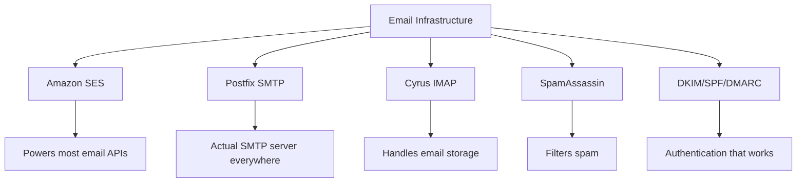
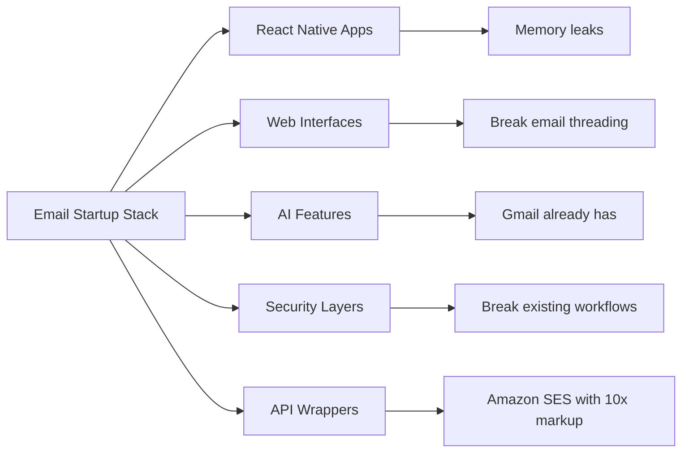
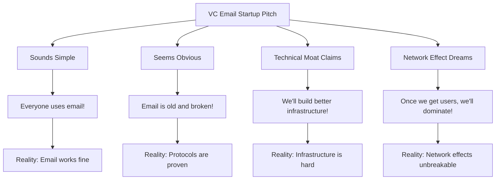
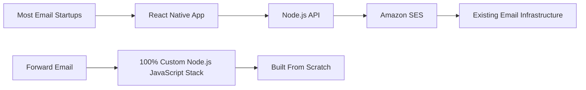
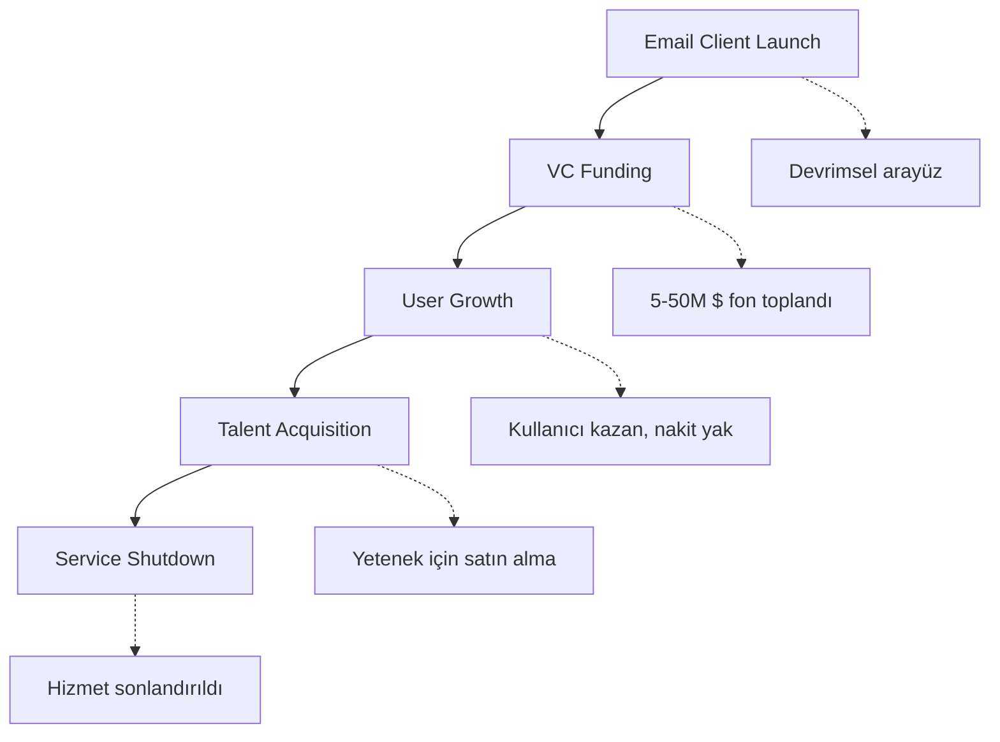
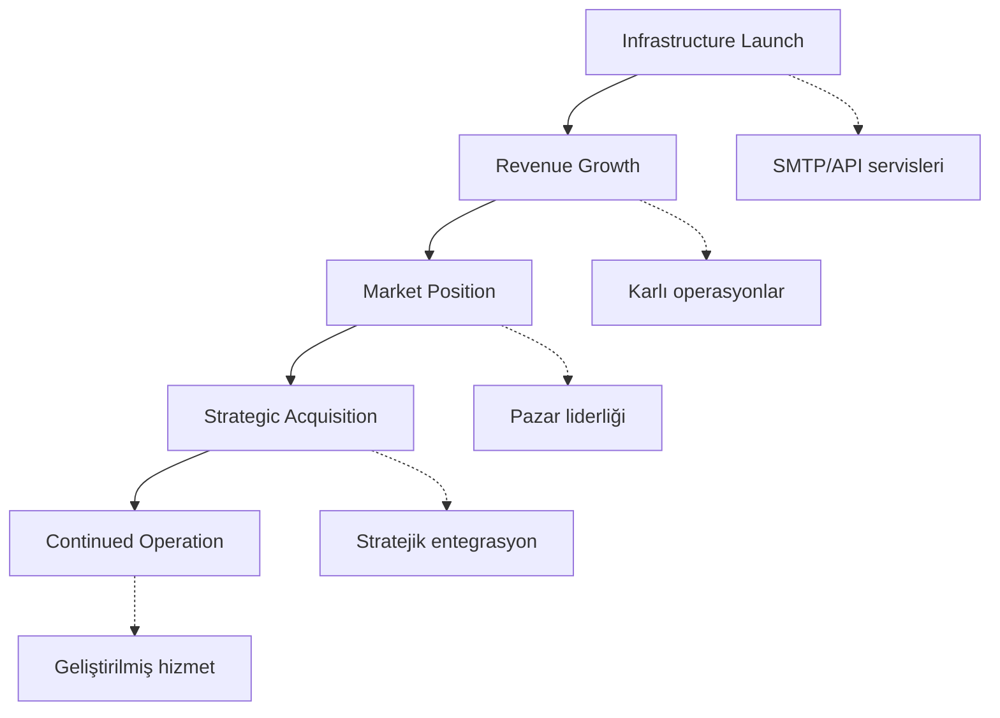
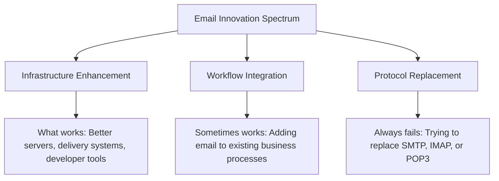
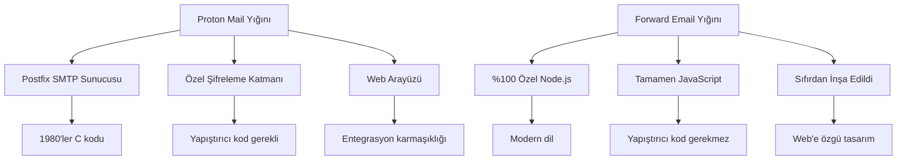
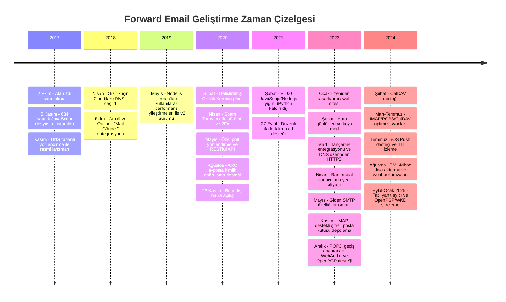
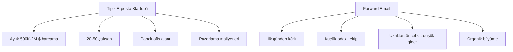

# E-posta Girişim Mezarlığı: Neden Çoğu E-posta Şirketi Başarısız Olur {#the-email-startup-graveyard-why-most-email-companies-fail}

Birçok e-posta girişimi algılanan sorunları çözmek için milyonlarca yatırım yaparken, biz <a href="https://forwardemail.net">Forward Email</a> olarak 2017’den beri sıfırdan güvenilir e-posta altyapısı inşa etmeye odaklandık. Bu analiz, e-posta girişimlerinin sonuçlarının arkasındaki kalıpları ve e-posta altyapısının temel zorluklarını inceliyor.

> \[!NOTE]
> **Ana İçgörü**: Çoğu e-posta girişimi gerçek e-posta altyapısını sıfırdan inşa etmez. Birçoğu Amazon SES gibi mevcut çözümlerin veya Postfix gibi açık kaynak sistemlerin üzerine kurar. Temel protokoller iyi çalışır - asıl zorluk uygulamadadır.

> \[!TIP]
> **Teknik Derinlemesine İnceleme**: Yaklaşımımız, mimarimiz ve güvenlik uygulamalarımız hakkında kapsamlı detaylar için [Forward Email Teknik Beyaz Kitap](https://forwardemail.net/technical-whitepaper.pdf) ve 2017’den beri tam geliştirme zaman çizelgemizi belgeleyen [Hakkında sayfası](https://forwardemail.net/en/about) sayfalarımıza bakabilirsiniz.

## İçindekiler {#table-of-contents}

* [E-posta Girişim Başarısızlık Matrisi](#the-email-startup-failure-matrix)
* [Altyapı Gerçeklik Kontrolü](#the-infrastructure-reality-check)
  * [Aslında E-postayı Ne Çalıştırıyor](#what-actually-runs-email)
  * [“E-posta Girişimleri” Aslında Ne İnşa Ediyor](#what-email-startups-actually-build)
* [Neden Çoğu E-posta Girişimi Başarısız Olur](#why-most-email-startups-fail)
  * [1. E-posta Protokolleri Çalışıyor, Uygulama Çoğunlukla Çalışmıyor](#1-email-protocols-work-implementation-often-doesnt)
  * [2. Ağ Etkileri Kırılamaz](#2-network-effects-are-unbreakable)
  * [3. Genellikle Yanlış Sorunlara Odaklanırlar](#3-they-often-target-the-wrong-problems)
  * [4. Teknik Borç Çok Büyük](#4-technical-debt-is-massive)
  * [5. Altyapı Zaten Var](#5-the-infrastructure-already-exists)
* [Vaka Çalışmaları: E-posta Girişimleri Ne Zaman Başarısız Olur](#case-studies-when-email-startups-fail)
  * [Vaka Çalışması: Skiff Felaketi](#case-study-the-skiff-disaster)
  * [Hızlandırıcı Analizi](#the-accelerator-analysis)
  * [Girişim Sermayesi Tuzağı](#the-venture-capital-trap)
* [Teknik Gerçeklik: Modern E-posta Yığınları](#the-technical-reality-modern-email-stacks)
  * [“E-posta Girişimlerini” Aslında Ne Güçlendiriyor](#what-actually-powers-email-startups)
  * [Performans Sorunları](#the-performance-problems)
* [Satın Alma Kalıpları: Başarı vs. Kapanış](#the-acquisition-patterns-success-vs-shutdown)
  * [İki Kalıp](#the-two-patterns)
  * [Son Örnekler](#recent-examples)
* [Sektör Evrimi ve Konsolidasyon](#industry-evolution-and-consolidation)
  * [Doğal Sektör İlerlemesi](#natural-industry-progression)
  * [Satın Alma Sonrası Geçişler](#post-acquisition-transitions)
  * [Geçişler Sırasında Kullanıcı Dikkatleri](#user-considerations-during-transitions)
* [Hacker News Gerçeklik Kontrolü](#the-hacker-news-reality-check)
* [Modern Yapay Zeka E-posta Dolandırıcılığı](#the-modern-ai-email-grift)
  * [En Son Dalga](#the-latest-wave)
  * [Aynı Eski Sorunlar](#the-same-old-problems)
* [Aslında Ne İşe Yarıyor: Gerçek E-posta Başarı Hikayeleri](#what-actually-works-the-real-email-success-stories)
  * [Altyapı Şirketleri (Kazananlar)](#infrastructure-companies-the-winners)
  * [E-posta Sağlayıcıları (Hayatta Kalanlar)](#email-providers-the-survivors)
  * [İstisna: Xobni’nin Başarı Hikayesi](#the-exception-xobnis-success-story)
  * [Kalıp](#the-pattern)
* [E-postayı Başarıyla Yeniden İcat Eden Oldu Mu?](#has-anyone-successfully-reinvented-email)
  * [Aslında Ne Tutuldu](#what-actually-stuck)
  * [Yeni Araçlar E-postayı Tamamlıyor (Ama Yerini Almıyor)](#new-tools-complement-email-but-dont-replace-it)
  * [HEY Deneyi](#the-hey-experiment)
  * [Aslında Ne İşe Yarıyor](#what-actually-works)
* [Mevcut E-posta Protokolleri İçin Modern Altyapı İnşası: Yaklaşımımız](#building-modern-infrastructure-for-existing-email-protocols-our-approach)
  * [E-posta Yenilik Spektrumu](#the-email-innovation-spectrum)
  * [Neden Altyapıya Odaklanıyoruz](#why-we-focus-on-infrastructure)
  * [E-postada Aslında Ne İşe Yarıyor](#what-actually-works-in-email)
* [Yaklaşımımız: Neden Farklıyız](#our-approach-why-were-different)
  * [Ne Yapıyoruz](#what-we-do)
  * [Ne Yapmıyoruz](#what-we-dont-do)
* [Gerçekten İşe Yarayan E-posta Altyapısını Nasıl İnşa Ediyoruz](#how-we-build-email-infrastructure-that-actually-works)
  * [Anti-Girişim Yaklaşımımız](#our-anti-startup-approach)
  * [Bizi Farklı Kılan Nedir](#what-makes-us-different)
  * [E-posta Hizmet Sağlayıcı Karşılaştırması: Kanıtlanmış Protokollerle Büyüme](#email-service-provider-comparison-growth-through-proven-protocols)
  * [Teknik Zaman Çizelgesi](#the-technical-timeline)
  * [Neden Başarılıyız, Diğerleri Neden Başarısız Oluyor](#why-we-succeed-where-others-fail)
  * [Maliyet Gerçeklik Kontrolü](#the-cost-reality-check)
* [E-posta Altyapısında Güvenlik Zorlukları](#security-challenges-in-email-infrastructure)
  * [Yaygın Güvenlik Hususları](#common-security-considerations)
  * [Şeffaflığın Değeri](#the-value-of-transparency)
  * [Süregelen Güvenlik Zorlukları](#ongoing-security-challenges)
* [Sonuç: Uygulamalara Değil Altyapıya Odaklanın](#conclusion-focus-on-infrastructure-not-apps)
  * [Kanıtlar Açık](#the-evidence-is-clear)
  * [Tarihsel Bağlam](#the-historical-context)
  * [Gerçek Ders](#the-real-lesson)
* [Genişletilmiş E-posta Mezarlığı: Daha Fazla Başarısızlık ve Kapanış](#the-extended-email-graveyard-more-failures-and-shutdowns)
  * [Google’ın Yanlış Giden E-posta Deneyleri](#googles-email-experiments-gone-wrong)
  * [Seri Başarısızlık: Newton Mail’in Üç Ölümü](#the-serial-failure-newton-mails-three-deaths)
  * [Hiç Başlatılmayan Uygulamalar](#the-apps-that-never-launched)
  * [Satın Alma-Kapanış Kalıbı](#the-acquisition-to-shutdown-pattern)
  * [E-posta Altyapısı Konsolidasyonu](#email-infrastructure-consolidation)
* [Açık Kaynak E-posta Mezarlığı: “Ücretsiz” Sürdürülebilir Olmadığında](#the-open-source-email-graveyard-when-free-isnt-sustainable)
  * [Nylas Mail → Mailspring: Başaramayan Çatallanma](#nylas-mail--mailspring-the-fork-that-couldnt)
  * [Eudora: 18 Yıllık Ölüm Yürüyüşü](#eudora-the-18-year-death-march)
  * [FairEmail: Google Play Politikaları Tarafından Öldürüldü](#fairemail-killed-by-google-play-politics)
  * [Bakım Sorunu](#the-maintenance-problem)
* [Yapay Zeka E-posta Girişim Patlaması: Tarihin “Zeka” ile Tekrarı](#the-ai-email-startup-surge-history-repeating-with-intelligence)
  * [Mevcut Yapay Zeka E-posta Altın Çağı](#the-current-ai-email-gold-rush)
  * [Fonlama Çılgınlığı](#the-funding-frenzy)
  * [Neden Hepsi (Yine) Başarısız Olacak](#why-theyll-all-fail-again)
  * [Kaçınılmaz Sonuç](#the-inevitable-outcome)
* [Konsolidasyon Felaketi: “Hayatta Kalanlar” Felaket Olduğunda](#the-consolidation-catastrophe-when-survivors-become-disasters)
  * [Büyük E-posta Hizmeti Konsolidasyonu](#the-great-email-service-consolidation)
  * [Outlook: Kırılmayı Bırakamayan “Hayatta Kalan”](#outlook-the-survivor-that-cant-stop-breaking)
  * [Postmark Altyapı Sorunu](#the-postmark-infrastructure-problem)
  * [Son E-posta İstemcisi Kurbanları (2024-2025)](#recent-email-client-casualties-2024-2025)
  * [E-posta Uzantısı ve Hizmet Satın Almaları](#email-extension-and-service-acquisitions)
  * [Hayatta Kalanlar: Gerçekten İşe Yarayan E-posta Şirketleri](#the-survivors-email-companies-that-actually-work)
## E-posta Startup Başarısızlık Matrisi {#the-email-startup-failure-matrix}

> \[!CAUTION]
> **Başarısızlık Oranı Uyarısı**: [Sadece Techstars'ın 28 e-posta ile ilgili şirketi](https://www.techstars.com/portfolio) var ve sadece 5 çıkış yaptı - son derece yüksek bir başarısızlık oranı (bazen %80+ olarak hesaplanıyor).

Bulabildiğimiz her büyük e-posta startup başarısızlığı, hızlandırıcı, finansman ve sonuçlarına göre düzenlenmiştir:

| Şirket           | Yıl  | Hızlandırıcı | Finansman                                                                                                                                                                                                    | Sonuç                                                                                   | Durum     | Ana Sorun                                                                                                                             |
| ----------------- | ---- | ------------ | ------------------------------------------------------------------------------------------------------------------------------------------------------------------------------------------------------------ | -------------------------------------------------------------------------------------- | --------- | ------------------------------------------------------------------------------------------------------------------------------------- |
| **Skiff**         | 2024 | -            | [$14.2M toplam](https://techcrunch.com/2022/03/30/skiff-series-a-encrypted-workspaces/)                                                                                                                     | Notion tarafından satın alındı → Kapatıldı                                            | 😵 Öldü   | [Kurucular Notion'dan Cursor'a geçti](https://x.com/skeptrune/status/1939763513695903946)                                             |
| **Sparrow**       | 2012 | -            | [$247K tohum](https://techcrunch.com/2012/07/20/google-acquires-iosmac-email-client-sparrow/), [<$25M satın alma](https://www.theverge.com/2012/7/20/3172365/sources-google-sparrow-25-million-gmail-client) | Google tarafından satın alındı → Kapatıldı                                            | 😵 Öldü   | [Sadece yetenek kazanımı](https://money.cnn.com/2012/07/20/technology/google-acquires-sparrow/index.htm)                              |
| **Email Copilot** | 2012 | Techstars    | ~$120K (Techstars standart)                                                                                                                                                                                  | Satın alındı → Kapatıldı                                                              | 😵 Öldü   | [Şimdi Validity'ye yönlendiriyor](https://www.validity.com/blog/validity-return-path-announcement/)                                     |
| **ReplySend**     | 2012 | Techstars    | ~$120K (Techstars standart)                                                                                                                                                                                  | Başarısız oldu                                                                        | 😵 Öldü   | [Belirsiz değer önerisi](https://www.f6s.com/company/replysend)                                                                        |
| **Nveloped**      | 2012 | Techstars    | ~$120K (Techstars standart)                                                                                                                                                                                  | Başarısız oldu                                                                        | 😵 Öldü   | ["Kolay. Güvenli. E-posta"](https://www.geekwire.com/2012/techstars-spotlight-nveloped/)                                              |
| **Jumble**        | 2015 | Techstars    | ~$120K (Techstars standart)                                                                                                                                                                                  | Başarısız oldu                                                                        | 😵 Öldü   | [E-posta şifreleme](https://www.siliconrepublic.com/start-ups/irish-start-up-jumble-one-of-11-included-in-techstars-cloud-accelerator) |
| **InboxFever**    | 2011 | Techstars    | ~$118K (Techstars 2011)                                                                                                                                                                                      | Başarısız oldu                                                                        | 😵 Öldü   | [E-posta uygulamaları için API](https://twitter.com/inboxfever)                                                                        |
| **Emailio**       | 2014 | YC           | ~$120K (YC standart)                                                                                                                                                                                         | Yön değiştirdi                                                                        | 🧟 Zombi  | [Mobil e-posta → "wellness"](https://www.ycdb.co/company/emailio)                                                                      |
| **MailTime**      | 2016 | YC           | ~$120K (YC standart)                                                                                                                                                                                         | Yön değiştirdi                                                                        | 🧟 Zombi  | [E-posta istemcisi → analiz](https://www.ycdb.co/company/mailtime)                                                                      |
| **reMail**        | 2009 | YC           | ~$20K (YC 2009)                                                                                                                                                                                              | [Google tarafından satın alındı](https://techcrunch.com/2010/02/17/google-remail-iphone/) → Kapatıldı | 😵 Öldü   | [iPhone e-posta araması](https://www.ycombinator.com/companies/remail)                                                                 |
| **Mailhaven**     | 2016 | 500 Global   | ~$100K (500 standart)                                                                                                                                                                                        | Çıkış yaptı                                                                           | Bilinmiyor | [Paket takibi](https://medium.com/@Kela/the-mailhaven-a-smarter-way-to-track-manage-and-receive-packages-edf202d73b06)                |
## Altyapı Gerçeklik Kontrolü {#the-infrastructure-reality-check}

> \[!WARNING]
> **Gizli Gerçek**: Her "e-posta startup'ı" aslında mevcut altyapının üzerine UI inşa ediyor. Gerçek e-posta sunucuları kurmuyorlar - gerçek e-posta altyapısına bağlanan uygulamalar geliştiriyorlar.

### E-postayı Aslında Ne Çalıştırıyor {#what-actually-runs-email}

```mermaid
graph TD
    A[Email Infrastructure] --> B[Amazon SES]
    A --> C[Postfix SMTP]
    A --> D[Cyrus IMAP]
    A --> E[SpamAssassin]
    A --> F[DKIM/SPF/DMARC]

    B --> G[Powers most email APIs]
    C --> H[Actual SMTP server everywhere]
    D --> I[Handles email storage]
    E --> J[Filters spam]
    F --> K[Authentication that works]
```

### "E-posta Startup'larının" Aslında Ne İnşa Ettiği {#what-email-startups-actually-build}

```mermaid
graph LR
    A[Email Startup Stack] --> B[React Native Apps]
    A --> C[Web Interfaces]
    A --> D[AI Features]
    A --> E[Security Layers]
    A --> F[API Wrappers]

    B --> G[Memory leaks]
    C --> H[Break email threading]
    D --> I[Gmail already has]
    E --> J[Break existing workflows]
    F --> K[Amazon SES with 10x markup]
```

> \[!TIP]
> **E-posta Başarısı İçin Anahtar Model**: E-postada gerçekten başarılı olan şirketler tekerleği yeniden icat etmeye çalışmazlar. Bunun yerine, mevcut e-posta iş akışlarını **geliştiren altyapı ve araçlar** inşa ederler. [SendGrid](https://sendgrid.com/), [Mailgun](https://www.mailgun.com/), ve [Postmark](https://postmarkapp.com/) güvenilir SMTP API'leri ve teslimat hizmetleri sunarak milyar dolarlık şirketler haline geldiler - e-posta protokolleriyle **birlikte** çalışırlar, onlara karşı değil. Forward Email olarak biz de aynı yaklaşımı benimsiyoruz.

## Neden Çoğu E-posta Startup'ı Başarısız Olur {#why-most-email-startups-fail}

> \[!IMPORTANT]
> **Temel Model**: E-posta *istemci* startup'ları genellikle çalışan protokolleri değiştirmeye çalıştıkları için başarısız olurken, e-posta *altyapı* şirketleri mevcut iş akışlarını geliştirerek başarılı olabilirler. Anahtar, kullanıcıların gerçekten neye ihtiyaç duyduğunu girişimcilerin ne düşündüğünden ayırt etmektir.

### 1. E-posta Protokolleri Çalışıyor, Uygulama Çoğu Zaman Çalışmıyor {#1-email-protocols-work-implementation-often-doesnt}

> \[!NOTE]
> **E-posta İstatistikleri**: [Günde 347,3 milyar e-posta gönderiliyor](https://www.statista.com/statistics/456500/daily-number-of-e-mails-worldwide/) ve 2023 itibarıyla [4,37 milyar e-posta kullanıcısına hizmet veriliyor](https://www.statista.com/statistics/255080/number-of-e-mail-users-worldwide/) büyük sorun olmadan.

Temel e-posta protokolleri sağlamdır, ancak uygulama kalitesi çok değişkendir:

* **Evrensel uyumluluk**: Her cihaz, her platform [SMTP](https://tools.ietf.org/html/rfc5321), [IMAP](https://tools.ietf.org/html/rfc3501) ve [POP3](https://tools.ietf.org/html/rfc1939) destekler
* **Merkezi olmayan yapı**: [Dünyadaki milyarlarca e-posta sunucusu](https://www.statista.com/statistics/456500/daily-number-of-e-mails-worldwide/) arasında tek bir başarısızlık noktası yoktur
* **Standartlaştırılmış**: SMTP, IMAP, POP3 1980-1990'lardan beri test edilmiş protokollerdir
* **Güvenilir**: [Günde 347,3 milyar e-posta gönderiliyor](https://www.statista.com/statistics/456500/daily-number-of-e-mails-worldwide/) büyük sorun olmadan

**Gerçek fırsat**: Protokol değiştirmek değil, mevcut protokollerin daha iyi uygulanması.

### 2. Ağ Etkileri Kırılamaz {#2-network-effects-are-unbreakable}

E-postanın ağ etkisi mutlak:

* **Herkesin e-postası var**: 2023 itibarıyla [4,37 milyar e-posta kullanıcısı](https://www.statista.com/statistics/255080/number-of-e-mail-users-worldwide/)
* **Platformlar arası**: Tüm sağlayıcılar arasında sorunsuz çalışır
* **İş için kritik**: [İşletmelerin %99'u günlük olarak e-posta kullanıyor](https://blog.hubspot.com/marketing/email-marketing-stats)
* **Geçiş maliyeti**: E-posta adresini değiştirmek ona bağlı her şeyi bozar

### 3. Çoğu Zaman Yanlış Sorunlara Odaklanırlar {#3-they-often-target-the-wrong-problems}

Birçok e-posta startup'ı gerçek sorunlar yerine algılanan sorunlara odaklanır:

* **"E-posta çok karmaşık"**: Temel iş akışı basittir - [1971'den beri gönder, al, düzenle](https://en.wikipedia.org/wiki/History_of_email)
* **"E-posta yapay zekaya ihtiyaç duyuyor"**: [Gmail zaten etkili akıllı özelliklere sahip](https://support.google.com/mail/answer/9116836) (Akıllı Yanıt ve Öncelikli Gelen Kutusu gibi)
* **"E-posta daha iyi güvenliğe ihtiyaç duyuyor"**: [DKIM](https://tools.ietf.org/html/rfc6376), [SPF](https://tools.ietf.org/html/rfc7208) ve [DMARC](https://tools.ietf.org/html/rfc7489) sağlam kimlik doğrulama sağlar
* **"E-posta yeni bir arayüze ihtiyaç duyuyor"**: [Outlook](https://outlook.com/) ve [Gmail](https://gmail.com/) arayüzleri onlarca yıllık kullanıcı araştırmasıyla geliştirilmiştir
**Çözülmeye Değer Gerçek Problemler**: Altyapı güvenilirliği, teslim edilebilirlik, spam filtreleme ve geliştirici araçları.

### 4. Teknik Borç Çok Büyük {#4-technical-debt-is-massive}

Gerçek e-posta altyapısı kurmak gerektirir:

* **SMTP sunucuları**: Karmaşık teslimat ve [itibar yönetimi](https://postmarkapp.com/blog/monitoring-your-email-delivery-and-reputation)
* **Spam filtreleme**: Sürekli gelişen [tehdit ortamı](https://www.spamhaus.org/)
* **Depolama sistemleri**: Güvenilir [IMAP](https://tools.ietf.org/html/rfc3501)/[POP3](https://tools.ietf.org/html/rfc1939) uygulaması
* **Kimlik doğrulama**: [DKIM](https://tools.ietf.org/html/rfc6376), [SPF](https://tools.ietf.org/html/rfc7208), [DMARC](https://tools.ietf.org/html/rfc7489), [ARC](https://tools.ietf.org/html/rfc8617) uyumluluğu
* **Teslim edilebilirlik**: ISS ilişkileri ve [itibar yönetimi](https://sendgrid.com/blog/what-is-email-deliverability/)

### 5. Altyapı Zaten Var {#5-the-infrastructure-already-exists}

Neden yeniden icat edelim ki kullanabilirsiniz:

* **[Amazon SES](https://aws.amazon.com/ses/)**: Kanıtlanmış teslimat altyapısı
* **[Postfix](http://www.postfix.org/)**: Sınanmış SMTP sunucusu
* **[Dovecot](https://www.dovecot.org/)**: Güvenilir IMAP/POP3 sunucusu
* **[SpamAssassin](https://spamassassin.apache.org/)**: Etkili spam filtreleme
* **Mevcut sağlayıcılar**: [Gmail](https://gmail.com/), [Outlook](https://outlook.com/), [FastMail](https://www.fastmail.com/) gayet iyi çalışıyor

## Vaka Çalışmaları: E-posta Girişimleri Ne Zaman Başarısız Olur {#case-studies-when-email-startups-fail}

### Vaka Çalışması: Skiff Felaketi {#case-study-the-skiff-disaster}

Skiff, e-posta girişimleriyle ilgili her şeyi mükemmel şekilde örnekliyor.

#### Kurulum {#the-setup}

* **Konumlandırma**: "Gizlilik öncelikli e-posta ve üretkenlik platformu"
* **Finansman**: [Önemli girişim sermayesi](https://techcrunch.com/2022/03/30/skiff-series-a-encrypted-workspaces/)
* **Söz**: Gizlilik ve şifreleme ile daha iyi e-posta

#### Satın Alma {#the-acquisition}

[Notion, Şubat 2024'te Skiff'i satın aldı](https://techcrunch.com/2024/02/09/notion-acquires-privacy-focused-productivity-platform-skiff/) ve entegrasyon ile devam eden geliştirme vaatleri verdi.

#### Gerçeklik {#the-reality}

* **Hemen kapanış**: [Skiff aylar içinde kapandı](https://en.wikipedia.org/wiki/Skiff_\(email_service\))
* **Kurucu kaçışı**: [Skiff kurucuları Notion'dan ayrılıp Cursor'a katıldı](https://x.com/skeptrune/status/1939763513695903946)
* **Kullanıcı terk edişi**: Binlerce kullanıcı göç etmek zorunda kaldı

### Hızlandırıcı Analizi {#the-accelerator-analysis}

#### Y Combinator: E-posta Uygulaması Fabrikası {#y-combinator-the-email-app-factory}

[Y Combinator](https://www.ycombinator.com/) onlarca e-posta girişimini finanse etti. İşte desen:

* **[Emailio](https://www.ycdb.co/company/emailio)** (2014): Mobil e-posta istemcisi → "wellness"e pivot yaptı
* **[MailTime](https://www.ycdb.co/company/mailtime)** (2016): Sohbet tarzı e-posta → analitiğe pivot yaptı
* **[reMail](https://www.ycombinator.com/companies/remail)** (2009): iPhone e-posta araması → [Google tarafından satın alındı](https://techcrunch.com/2010/02/17/google-remail-iphone/) → kapandı
* **[Rapportive](https://www.ycombinator.com/companies/rapportive)** (2012): Gmail sosyal profilleri → [LinkedIn tarafından satın alındı](https://techcrunch.com/2012/02/22/rapportive-linkedin-acquisition/) → kapandı

**Başarı Oranı**: Bazı kayda değer çıkışlarla karışık sonuçlar. Bazı şirketler başarılı satın almalar gerçekleştirdi (reMail Google'a, Rapportive LinkedIn'e), diğerleri ise e-postadan uzaklaştı veya yetenek için acqui-hire edildi.

#### Techstars: E-posta Mezarlığı {#techstars-the-email-graveyard}

[Techstars](https://www.techstars.com/) çok daha kötü bir sicile sahip:

* **[Email Copilot](https://www.validity.com/everest/returnpath/)** (2012): Satın alındı → kapandı
* **[ReplySend](https://www.crunchbase.com/organization/replysend)** (2012): Tamamen başarısız oldu
* **[Nveloped](https://www.crunchbase.com/organization/nveloped)** (2012): "Kolay. Güvenli. E-posta" → başarısız oldu
* **[Jumble](https://www.crunchbase.com/organization/jumble/technology)** (2015): E-posta şifreleme → başarısız oldu
* **[InboxFever](https://www.crunchbase.com/organization/inboxfever)** (2011): E-posta API'si → başarısız oldu
**Model**: Belirsiz değer önerileri, gerçek teknik yenilik yok, hızlı başarısızlıklar.

### Girişim Sermayesi Tuzağı {#the-venture-capital-trap}

> \[!CAUTION]
> **VC Finansman Paradoksu**: Girişim sermayesi yatırımcıları e-posta girişimlerini sever çünkü basit görünürler ama aslında imkansızdırlar. Yatırımı çeken temel varsayımlar tam olarak başarısızlığı garanti eder.

Girişim sermayesi yatırımcıları e-posta girişimlerini sever çünkü basit görünürler ama aslında imkansızdırlar:

```mermaid
graph TD
    A[VC Email Startup Pitch] --> B[Sounds Simple]
    A --> C[Seems Obvious]
    A --> D[Technical Moat Claims]
    A --> E[Network Effect Dreams]

    B --> F[Everyone uses email!]
    C --> G[Email is old and broken!]
    D --> H[We'll build better infrastructure!]
    E --> I[Once we get users, we'll dominate!]

    F --> J[Reality: Email works fine]
    G --> K[Reality: Protocols are proven]
    H --> L[Reality: Infrastructure is hard]
    I --> M[Reality: Network effects unbreakable]
```

**Gerçek**: Bu varsayımların hiçbiri e-posta için geçerli değildir.

## Teknik Gerçeklik: Modern E-posta Yığınları {#the-technical-reality-modern-email-stacks}

### "E-posta Girişimlerini" Aslında Ne Güçlendiriyor {#what-actually-powers-email-startups}

Bu şirketlerin aslında ne çalıştırdığına bakalım:

```mermaid
graph LR
    A[Most Email Startups] --> B[React Native App]
    B --> C[Node.js API]
    C --> D[Amazon SES]
    D --> E[Existing Email Infrastructure]

    F[Forward Email] --> G[100% Custom Node.js JavaScript Stack]
    G --> H[Built From Scratch]
```

### Performans Sorunları {#the-performance-problems}

**Bellek Şişmesi**: Çoğu e-posta uygulaması Electron tabanlı web uygulamalarıdır ve çok fazla RAM tüketir:

* **[Mailspring](https://getmailspring.com/)**: [Temel e-posta için 500MB+](https://github.com/Foundry376/Mailspring/issues/1758)
* **Nylas Mail**: [Kapanmadan önce 1GB+ bellek kullanımı](https://github.com/nylas/nylas-mail/issues/3501)
* **[Postbox](https://www.postbox-inc.com/)**: [Boşta 300MB+ bellek](https://forums.macrumors.com/threads/postbox-why-does-it-take-up-so-much-ram.1411335/)
* **[Canary Mail](https://canarymail.io/)**: [Bellek sorunları nedeniyle sık çökme](https://www.reddit.com/r/CanaryMail/comments/10pe7jf/canary_is_crashing_on_all_my_devices/)
* **[Thunderbird](https://www.thunderbird.net/)**: [Sistem belleğinin %90’ına kadar yüksek RAM kullanımı](https://www.reddit.com/r/Thunderbird/comments/141s473/high_ram_usage_up_to\_90/)

> \[!WARNING]
> **Electron Performans Krizi**: Electron ve React Native ile geliştirilen modern e-posta istemcileri ciddi bellek şişmesi ve performans sorunları yaşar. Bu çapraz platform çerçeveler, geliştiriciler için kullanışlı olsa da, temel e-posta işlevselliği için yüzlerce megabayttan gigabaytlara kadar RAM tüketen kaynak yoğun uygulamalar yaratır.

**Pil Tüketimi**: Sürekli senkronizasyon ve verimsiz kod:

* Asla uyumayan arka plan süreçleri
* Her birkaç saniyede gereksiz API çağrıları
* Kötü bağlantı yönetimi
* Temel işlevsellik için kesinlikle gerekli olanlar dışında üçüncü taraf bağımlılık yok

## Edinim Modelleri: Başarı vs. Kapanış {#the-acquisition-patterns-success-vs-shutdown}

### İki Model {#the-two-patterns}

**İstemci Uygulaması Modeli (Genellikle Başarısız)**:

```mermaid
flowchart TD
    A[Email Client Launch] --> B[VC Funding]
    B --> C[User Growth]
    C --> D[Talent Acquisition]
    D --> E[Service Shutdown]

    A -.-> A1["Devrimsel arayüz"]
    B -.-> B1["5-50M $ fon toplandı"]
    C -.-> C1["Kullanıcı kazan, nakit yak"]
    D -.-> D1["Yetenek için satın alma"]
    E -.-> E1["Hizmet sonlandırıldı"]
```

**Altyapı Modeli (Çoğunlukla Başarılı)**:

```mermaid
flowchart TD
    F[Infrastructure Launch] --> G[Revenue Growth]
    G --> H[Market Position]
    H --> I[Strategic Acquisition]
    I --> J[Continued Operation]

    F -.-> F1["SMTP/API servisleri"]
    G -.-> G1["Karlı operasyonlar"]
    H -.-> H1["Pazar liderliği"]
    I -.-> I1["Stratejik entegrasyon"]
    J -.-> J1["Geliştirilmiş hizmet"]
```

### Son Örnekler {#recent-examples}

**İstemci Uygulaması Başarısızlıkları**:

* **Mailbox → Dropbox → Kapanış** (2013-2015)
* **[Sparrow → Google → Kapanış](https://www.theverge.com/2012/7/20/3172365/sources-google-sparrow-25-million-gmail-client)** (2012-2013)
* **[reMail → Google → Kapanış](https://techcrunch.com/2010/02/17/google-remail-iphone/)** (2010-2011)
* **[Skiff → Notion → Kapanış](https://techcrunch.com/2024/02/09/notion-acquires-privacy-focused-productivity-platform-skiff/)** (2024)
**Dikkate Değer İstisna**:

* **[Superhuman → Grammarly](https://www.reuters.com/business/grammarly-acquires-email-startup-superhuman-ai-platform-push-2025-07-01/)** (2025): Verimlilik platformuna stratejik entegrasyonla başarılı satın alma

**Altyapı Başarıları**:

* **[SendGrid → Twilio](https://en.wikipedia.org/wiki/SendGrid)** (2019): 3 milyar dolarlık satın alma, devam eden büyüme
* **[Mailgun → Sinch](https://sinch.com/news/sinch-acquires-mailgun-and-mailjet/)** (2021): Stratejik entegrasyon
* **[Postmark → ActiveCampaign](https://postmarkapp.com/blog/postmark-and-dmarc-digests-acquired-by-activecampaign)** (2022): Geliştirilmiş platform

## Sektörün Evrimi ve Konsolidasyonu {#industry-evolution-and-consolidation}

### Doğal Sektör İlerlemesi {#natural-industry-progression}

E-posta sektörü, daha büyük şirketlerin daha küçükleri satın alarak özellikleri entegre etmesi veya rekabeti ortadan kaldırmasıyla doğal olarak konsolidasyona doğru evrilmiştir. Bu mutlaka olumsuz değildir - çoğu olgun sektör böyle gelişir.

### Satın Alma Sonrası Geçişler {#post-acquisition-transitions}

E-posta şirketleri satın alındığında, kullanıcılar genellikle şunlarla karşılaşır:

* **Hizmet geçişleri**: Yeni platformlara taşınma
* **Özellik değişiklikleri**: Uzmanlaşmış işlevselliğin kaybı
* **Fiyat ayarlamaları**: Farklı abonelik modelleri
* **Entegrasyon dönemleri**: Geçici hizmet kesintileri

### Geçişler Sırasında Kullanıcı Dikkatleri {#user-considerations-during-transitions}

Sektör konsolidasyonu sırasında kullanıcılar şunlardan faydalanır:

* **Alternatifleri değerlendirmek**: Birden fazla sağlayıcı benzer hizmetler sunar
* **Geçiş yollarını anlamak**: Çoğu hizmet dışa aktarma araçları sağlar
* **Uzun vadeli istikrarı düşünmek**: Kurumsallaşmış sağlayıcılar genellikle daha fazla süreklilik sunar

## The Hacker News Gerçeklik Kontrolü {#the-hacker-news-reality-check}

Her e-posta girişimi [Hacker News](https://news.ycombinator.com/) üzerinde aynı yorumları alır:

* ["E-posta gayet iyi çalışıyor, bu çözülmesi gereken bir sorun değil"](https://news.ycombinator.com/item?id=35982757)
* ["Herkes gibi Gmail/Outlook kullan"](https://news.ycombinator.com/item?id=36001234)
* ["2 yıl içinde kapanacak başka bir e-posta istemcisi"](https://news.ycombinator.com/item?id=36012345)
* ["Gerçek sorun spam, bu onu çözmüyor"](https://news.ycombinator.com/item?id=36023456)

**Topluluk haklıdır**. Bu yorumlar her e-posta girişimi lansmanında görünür çünkü temel sorunlar her zaman aynıdır.

## Modern AI E-posta Aldatmacası {#the-modern-ai-email-grift}

### En Yeni Dalga {#the-latest-wave}

2024, "Yapay zeka destekli e-posta" girişimlerinin yeni bir dalgasını getirdi ve ilk büyük başarılı çıkış zaten gerçekleşti:

* **[Superhuman](https://superhuman.com/)**: [33 milyon dolar topladı](https://superhuman.com/), [Grammarly tarafından başarıyla satın alındı](https://www.reuters.com/business/grammarly-acquires-email-startup-superhuman-ai-platform-push-2025-07-01/) (2025) - nadir başarılı bir müşteri uygulaması çıkışı
* **[Shortwave](https://www.shortwave.com/)**: AI özetleriyle Gmail sarmalayıcısı
* **[SaneBox](https://www.sanebox.com/)**: AI e-posta filtreleme (gerçekten çalışıyor, ama devrim niteliğinde değil)

### Aynı Eski Sorunlar {#the-same-old-problems}

"AI" eklemek temel zorlukları çözmez:

* **AI özetleri**: Çoğu e-posta zaten özlüdür
* **Akıllı yanıtlar**: [Gmail yıllardır bunlara sahip](https://support.google.com/mail/answer/9116836) ve iyi çalışıyor
* **E-posta zamanlama**: [Outlook bunu yerel olarak yapıyor](https://support.microsoft.com/en-us/office/delay-or-schedule-sending-email-messages-026af69f-c287-490a-a72f-6c65793744ba)
* **Öncelik tespiti**: Mevcut e-posta istemcileri etkili filtreleme sistemlerine sahiptir

**Gerçek zorluk**: AI özellikleri, nispeten küçük sorunları ele alırken önemli altyapı yatırımları gerektirir.

## Gerçekten İşe Yarayan: Gerçek E-posta Başarı Hikayeleri {#what-actually-works-the-real-email-success-stories}

### Altyapı Şirketleri (Kazananlar) {#infrastructure-companies-the-winners}

* **[SendGrid](https://sendgrid.com/)**: [Twilio tarafından 3 milyar dolara satın alındı](https://en.wikipedia.org/wiki/SendGrid)
* **[Mailgun](https://www.mailgun.com/)**: [50 milyon doların üzerinde gelir](https://sinch.com/news/sinch-acquires-mailgun-and-mailjet/), Sinch tarafından satın alındı
* **[Postmark](https://postmarkapp.com/)**: Karlı, [ActiveCampaign tarafından satın alındı](https://postmarkapp.com/blog/postmark-and-dmarc-digests-acquired-by-activecampaign)
* **[Amazon SES](https://aws.amazon.com/ses/)**: Milyarlarca dolar gelir
**Model**: Altyapı kurarlar, uygulama değil.

### E-posta Sağlayıcıları (Ayakta Kalanlar) {#email-providers-the-survivors}

* **[FastMail](https://www.fastmail.com/)**: [25+ yıl](https://www.fastmail.com/about/), karlı, bağımsız
* **[ProtonMail](https://proton.me/)**: Gizlilik odaklı, sürdürülebilir büyüme
* **[Zoho Mail](https://www.zoho.com/mail/)**: Daha büyük iş paketi içinde
* **Biz**: 7+ yıl, karlı, büyüyen

> \[!WARNING]
> **JMAP Yatırım Sorusu**: Fastmail, [10+ yıllık ve sınırlı benimsenmeye sahip](https://github.com/zone-eu/wildduck/issues/2#issuecomment-1765190790) bir protokol olan [JMAP](https://jmap.io/)'e kaynak ayırırken, aynı zamanda birçok kullanıcının talep ettiği [PGP şifrelemesini uygulamayı reddediyor](https://www.fastmail.com/blog/why-we-dont-offer-pgp/). Bu, kullanıcıların talep ettiği özellikler yerine protokol yeniliğini önceliklendiren stratejik bir tercihi temsil ediyor. JMAP'in daha geniş benimsenip benimsenmeyeceği henüz belli değil, ancak mevcut e-posta istemcisi ekosistemi öncelikle IMAP/SMTP'ye dayanmaya devam ediyor.

> \[!TIP]
> **Kurumsal Başarı**: Forward Email, [Cambridge Üniversitesi dahil olmak üzere önde gelen üniversiteler için mezun e-posta çözümleri](https://forwardemail.net/en/blog/docs/alumni-email-forwarding-university-case-study) sağlıyor; 30.000 mezun adresiyle geleneksel çözümlere kıyasla yıllık 87.000$ tasarruf sağlıyor.

**Model**: E-postayı geliştirirler, yerine koymazlar.

### İstisna: Xobni'nin Başarı Hikayesi {#the-exception-xobnis-success-story}

[Xobni](https://en.wikipedia.org/wiki/Xobni), doğru yaklaşımı benimseyerek gerçekten başarılı olan birkaç e-posta ile ilgili girişimden biridir.

**Xobni'nin Doğru Yaptıkları**:

* **Mevcut e-postayı geliştirdi**: Outlook'un üzerine inşa etti, yerine koymadı
* **Gerçek sorunları çözdü**: Kişi yönetimi ve e-posta araması
* **Entegrasyona odaklandı**: Mevcut iş akışlarıyla çalıştı
* **Kurumsal odak**: Gerçek sorunları olan iş kullanıcılarını hedefledi

**Başarı**: [Xobni, 2013'te Yahoo tarafından 60 milyon dolara satın alındı](https://en.wikipedia.org/wiki/Xobni), yatırımcılara sağlam bir getiri ve kuruculara başarılı bir çıkış sağladı.

#### Xobni'nin Başarısının Diğerlerinden Farkı {#why-xobni-succeeded-where-others-failed}

1. **Kanıtlanmış altyapı üzerine inşa etti**: Outlook'un mevcut e-posta yönetimini kullandı
2. **Gerçek sorunları çözdü**: Kişi yönetimi gerçekten sorunluydu
3. **Kurumsal pazar**: İşletmeler verimlilik araçları için ödeme yapar
4. **Entegrasyon yaklaşımı**: Mevcut iş akışlarını geliştirdi, yerine koymadı

#### Kurucuların Devam Eden Başarısı {#the-founders-continued-success}

[Matt Brezina](https://www.linkedin.com/in/mattbrezina/) ve [Adam Smith](https://www.linkedin.com/in/adamjsmith/) Xobni'den sonra durmadılar:

* **Matt Brezina**: Dropbox, Mailbox ve diğerlerine yatırım yapan aktif bir [melek yatırımcı](https://mercury.com/investor-database/matt-brezina) oldu
* **Adam Smith**: Verimlilik alanında başarılı şirketler kurmaya devam etti
* **Her iki kurucu da**: E-posta başarısının yerine koymak değil, geliştirmekten geldiğini gösterdi

### Model {#the-pattern}

Şirketler e-postada başarılı olurken:

1. **Altyapı kurarlar** ([SendGrid](https://sendgrid.com/), [Mailgun](https://www.mailgun.com/))
2. **Mevcut iş akışlarını geliştirirler** ([Xobni](https://en.wikipedia.org/wiki/Xobni), [FastMail](https://www.fastmail.com/))
3. **Güvenilirliğe odaklanırlar** ([Amazon SES](https://aws.amazon.com/ses/), [Postmark](https://postmarkapp.com/))
4. **Geliştiricilere hizmet ederler** (API'ler ve araçlar, son kullanıcı uygulamaları değil)

## E-posta Başarıyla Yeniden İcat Edildi mi? {#has-anyone-successfully-reinvented-email}

Bu, e-posta yeniliğinin özüne inen kritik bir sorudur. Kısa cevap: **hiç kimse e-postayı başarıyla değiştirmedi, ancak bazıları başarıyla geliştirdi**.

### Gerçekten Kalıcı Olanlar {#what-actually-stuck}

Son 20 yıldaki e-posta yeniliklerine bakıldığında:

* **[Gmail'in konu dizileri](https://support.google.com/mail/answer/5900)**: E-posta organizasyonunu geliştirdi
* **[Outlook'un takvim entegrasyonu](https://support.microsoft.com/en-us/office/calendar-in-outlook-73b69a86-0a8e-4b14-9cb7-d2723397c9c5)**: Planlamayı geliştirdi
* **Mobil e-posta uygulamaları**: Erişilebilirliği geliştirdi
* **[DKIM](https://tools.ietf.org/html/rfc6376)/[SPF](https://tools.ietf.org/html/rfc7208)/[DMARC](https://tools.ietf.org/html/rfc7489)**: Güvenliği geliştirdi
**Model**: Tüm başarılı yenilikler, mevcut e-posta protokollerini değiştirmek yerine **geliştirmiştir**.

### Yeni Araçlar E-postayı Tamamlar (Ama Yerini Almaz) {#new-tools-complement-email-but-dont-replace-it}

* **[Slack](https://slack.com/)**: Takım sohbeti için harika, ancak hala e-posta bildirimleri gönderir
* **[Discord](https://discord.com/)**: Topluluklar için mükemmel, ancak hesap yönetimi için e-posta kullanır
* **[WhatsApp](https://www.whatsapp.com/)**: Mesajlaşma için ideal, ancak işletmeler hala e-posta kullanıyor
* **[Zoom](https://zoom.us/)**: Video görüşmeleri için vazgeçilmez, ancak toplantı davetleri e-posta yoluyla gelir

### HEY Deneyi {#the-hey-experiment}

> \[!IMPORTANT]
> **Gerçek Dünya Doğrulaması**: HEY'in kurucusu [DHH](https://dhh.dk/) kişisel alan adı `dhh.dk` için Forward Email hizmetimizi yıllardır kullanıyor, bu da e-posta yenilikçilerinin bile kanıtlanmış altyapıya güvendiğini gösteriyor.

[HEY](https://hey.com/) [Basecamp](https://basecamp.com/) tarafından geliştirilen, e-postayı "yeniden icat etme" konusunda son dönemdeki en ciddi girişimi temsil eder:

* **Başlangıç**: [2020'de büyük yankı uyandırarak](https://world.hey.com/jason/hey-is-live-and-you-can-get-it-now-3aca3d9a)
* **Yaklaşım**: Tarama, paketleme ve iş akışları ile tamamen yeni bir e-posta paradigması
* **Kabul**: Karışık - bazıları çok sevdi, çoğu mevcut e-postada kaldı
* **Gerçek**: Hâlâ farklı bir arayüzle e-posta (SMTP/IMAP)

### Gerçekten Ne İşe Yarıyor {#what-actually-works}

En başarılı e-posta yenilikleri şunlar olmuştur:

1. **Daha iyi altyapı**: Daha hızlı sunucular, gelişmiş spam filtreleme, iyileştirilmiş teslimat
2. **Geliştirilmiş arayüzler**: [Gmail'in konuşma görünümü](https://support.google.com/mail/answer/5900), [Outlook'un takvim entegrasyonu](https://support.microsoft.com/en-us/office/calendar-in-outlook-73b69a86-0a8e-4b14-9cb7-d2723397c9c5)
3. **Geliştirici araçları**: E-posta gönderimi için API'ler, takip için webhook'lar
4. **Özel iş akışları**: CRM entegrasyonu, pazarlama otomasyonu, işlem e-postaları

**Hiçbiri e-postanın yerini almadı - onu daha iyi hale getirdi.**

## Mevcut E-posta Protokolleri İçin Modern Altyapı Kurmak: Yaklaşımımız {#building-modern-infrastructure-for-existing-email-protocols-our-approach}

Başarısızlıklara geçmeden önce, e-postada gerçekten neyin işe yaradığını anlamak önemlidir. Sorun e-postanın bozuk olması değil - çoğu şirketin zaten mükemmel çalışan bir şeyi "düzeltmeye" çalışmasıdır.

### E-posta Yenilik Spektrumu {#the-email-innovation-spectrum}

E-posta yeniliği üç kategoriye ayrılır:

```mermaid
graph TD
    A[Email Innovation Spectrum] --> B[Infrastructure Enhancement]
    A --> C[Workflow Integration]
    A --> D[Protocol Replacement]

    B --> E[What works: Better servers, delivery systems, developer tools]
    C --> F[Sometimes works: Adding email to existing business processes]
    D --> G[Always fails: Trying to replace SMTP, IMAP, or POP3]
```

### Neden Altyapıya Odaklanıyoruz {#why-we-focus-on-infrastructure}

Modern e-posta altyapısı kurmayı seçtik çünkü:

* **E-posta protokolleri kanıtlanmış**: [SMTP 1982'den beri güvenilir çalışıyor](https://tools.ietf.org/html/rfc821)
* **Sorun uygulamada**: Çoğu e-posta servisi eski yazılım yığınları kullanıyor
* **Kullanıcılar güvenilirlik istiyor**: Mevcut iş akışlarını bozan yeni özellikler değil
* **Geliştiriciler araçlara ihtiyaç duyuyor**: Daha iyi API'ler ve yönetim arayüzleri

### E-postada Gerçekten Ne İşe Yarıyor {#what-actually-works-in-email}

Başarılı model basittir: **mevcut e-posta iş akışlarını değiştirmek yerine geliştirmek**. Bu şunları içerir:

* Daha hızlı, daha güvenilir SMTP sunucuları kurmak
* Meşru e-postayı bozmadan daha iyi spam filtreleme oluşturmak
* Mevcut protokoller için geliştirici dostu API'ler sağlamak
* Doğru altyapı ile teslimatı iyileştirmek

## Yaklaşımımız: Neden Farklıyız {#our-approach-why-were-different}

### Ne Yapıyoruz {#what-we-do}

* **Gerçek altyapı kuruyoruz**: Baştan özel SMTP/IMAP sunucuları
* **Güvenilirliğe odaklanıyoruz**: [99.99% çalışma süresi](https://status.forwardemail.net), doğru hata yönetimi
* **Mevcut iş akışlarını geliştiriyoruz**: Tüm e-posta istemcileriyle uyumlu
* **Geliştiricilere hizmet veriyoruz**: Gerçekten çalışan API'ler ve araçlar
* **Uyumluluğu koruyoruz**: Tam [SMTP](https://tools.ietf.org/html/rfc5321)/[IMAP](https://tools.ietf.org/html/rfc3501)/[POP3](https://tools.ietf.org/html/rfc1939) uyumluluğu
### Yapmadıklarımız {#what-we-dont-do}

* "Devrim niteliğinde" e-posta istemcileri geliştirmek
* Mevcut e-posta protokollerinin yerini almaya çalışmak
* Gereksiz yapay zeka özellikleri eklemek
* E-postayı "düzelteceğimizi" vaat etmek

## Gerçekten İşleyen E-posta Altyapısını Nasıl Kuruyoruz {#how-we-build-email-infrastructure-that-actually-works}

### Anti-Startup Yaklaşımımız {#our-anti-startup-approach}

Diğer şirketler e-postayı yeniden icat etmeye çalışırken milyonlar harcarken, biz güvenilir altyapı kurmaya odaklanıyoruz:

* **Pivot yok**: 7+ yıldır e-posta altyapısı inşa ediyoruz
* **Satın alma stratejisi yok**: Uzun vadeli düşünüyoruz
* **"Devrim niteliğinde" iddialar yok**: Sadece e-postanın daha iyi çalışmasını sağlıyoruz

### Bizi Farklı Kılan Nedir {#what-makes-us-different}

> \[!TIP]
> **Devlet Düzeyinde Uyumluluk**: Forward Email, [Bölüm 889 uyumludur](https://forwardemail.net/en/blog/docs/federal-government-email-service-section-889-compliant) ve ABD Deniz Harp Okulu gibi kuruluşlara hizmet vererek sıkı federal güvenlik gereksinimlerini karşılama taahhüdümüzü gösterir.

> \[!NOTE]
> **OpenPGP ve OpenWKD Uygulaması**: Fastmail'in [PGP uygulamayı reddetmesi](https://www.fastmail.com/blog/why-we-dont-offer-pgp/) ve karmaşıklık endişeleri nedeniyle, Forward Email tam OpenPGP desteği ve OpenWKD (Web Anahtar Dizini) uyumluluğu sunar; kullanıcılara gerçekten istedikleri şifrelemeyi sağlar, deneysel protokoller olan JMAP gibi zorlamaz.

**Teknik Yığın Karşılaştırması**:

```mermaid
graph TD
    A[Proton Mail Yığını] --> B[Postfix SMTP Sunucusu]
    A --> C[Özel Şifreleme Katmanı]
    A --> D[Web Arayüzü]

    E[Forward Email Yığını] --> F[%100 Özel Node.js]
    E --> G[Tamamen JavaScript]
    E --> H[Sıfırdan İnşa Edildi]

    B --> I[1980'ler C kodu]
    C --> J[Yapıştırıcı kod gerekli]
    D --> K[Entegrasyon karmaşıklığı]

    F --> L[Modern dil]
    G --> M[Yapıştırıcı kod gerekmez]
    H --> N[Web'e özgü tasarım]
```

* \= [APNIC blog yazısı](https://blog.apnic.net/2024/10/04/smtp-downgrade-attacks-and-mta-sts/#:\~:text=Logs%20indicate%20that%20Proton%20Mail%20uses%C2%A0postfix%2Dmta%2Dsts%2Dresolver%2C%20hinting%20that%20they%20run%20a%20Postfix%20stack) Proton'un postfix-mta-sts-resolver kullandığını doğrular, bu da Postfix yığını kullandıklarını gösterir

**Temel Farklar**:

* **Modern dil**: Tüm yığın boyunca JavaScript vs. 1980'ler C kodu
* **Yapıştırıcı kod yok**: Tek dil entegrasyon karmaşıklığını ortadan kaldırır
* **Web'e özgü**: Modern web geliştirme için baştan inşa edildi
* **Bakımı kolay**: Herhangi bir web geliştiricisi anlayabilir ve katkıda bulunabilir
* **Miras borcu yok**: On yılların yamaları olmadan temiz, modern kod tabanı

> \[!NOTE]
> **Gizlilik Tasarımı**: [Gizlilik politikamız](https://forwardemail.net/en/privacy), iletilen e-postaları disk depolama veya veritabanlarında saklamadığımızı, e-postalarla ilgili meta verileri tutmadığımızı ve günlükler veya IP adresleri saklamadığımızı garanti eder - yalnızca e-posta iletimi hizmetleri için bellekte çalışır.

**Teknik Dokümantasyon**: Yaklaşımımız, mimarimiz ve güvenlik uygulamalarımız hakkında kapsamlı detaylar için [teknik beyaz kitabımıza](https://forwardemail.net/technical-whitepaper.pdf) ve geniş teknik dokümantasyona bakınız.

### E-posta Hizmet Sağlayıcı Karşılaştırması: Kanıtlanmış Protokollerle Büyüme {#email-service-provider-comparison-growth-through-proven-protocols}

> \[!NOTE]
> **Gerçek Büyüme Rakamları**: Diğer sağlayıcılar deneysel protokollerin peşinden koşarken, Forward Email kullanıcıların gerçekten istediği şeye odaklanır - tüm cihazlarda çalışan güvenilir IMAP, POP3, SMTP, CalDAV ve CardDAV. Büyümemiz bu yaklaşımın değerini gösterir.

| Sağlayıcı           | Alan Adları (2024 via [SecurityTrails](https://securitytrails.com/)) | Alan Adları (2025 via [ViewDNS](https://viewdns.info/reversemx/)) | Yüzde Değişim    | MX Kaydı                      |
| ------------------- | --------------------------------------------------------------------- | ------------------------------------------------------------------ | ---------------- | ----------------------------- |
| **Forward Email**   | 418,477                                                               | 506,653                                                            | **+%21.1**       | `mx1.forwardemail.net`        |
| **Proton Mail**     | 253,977                                                               | 334,909                                                            | **+%31.9**       | `mail.protonmail.ch`          |
| **Fastmail**        | 168,433                                                               | 192,075                                                            | **+%14**         | `in1-smtp.messagingengine.com`|
| **Mailbox**         | 38,659                                                                | 43,337                                                             | **+%12.1**       | `mxext1.mailbox.org`          |
| **Tuta**            | 18,781                                                                | 21,720                                                             | **+%15.6**       | `mail.tutanota.de`            |
| **Skiff (kapanmış)**| 7,504                                                                 | 3,361                                                              | **-%55.2**       | `inbound-smtp.skiff.com`      |
**Ana İçgörüler**:

* **Forward Email** güçlü bir büyüme gösteriyor (+%21,1) ve MX kayıtlarımızı kullanan 500K'dan fazla alan adı var
* **Kanıtlanmış altyapı kazanımları**: Güvenilir IMAP/SMTP hizmetleri tutarlı alan adı benimsemesi gösteriyor
* **JMAP önemsizliği**: Fastmail'in JMAP yatırımı, standart protokollere odaklanan sağlayıcılara kıyasla daha yavaş büyüme gösteriyor (+%14)
* **Skiff'in çöküşü**: Faaliyet dışı startup, alan adlarının %55,2'sini kaybetti ve "devrimci" e-posta yaklaşımlarının başarısızlığını gösterdi
* **Pazar doğrulaması**: Alan adı sayısındaki büyüme gerçek kullanıcı benimsemesini yansıtıyor, pazarlama metriklerini değil

### Teknik Zaman Çizelgesi {#the-technical-timeline}

[Resmi şirket zaman çizelgemize](https://forwardemail.net/en/about) dayanarak, işleyen e-posta altyapısını nasıl kurduğumuz:

```mermaid
timeline
    title Forward Email Geliştirme Zaman Çizelgesi
    2017 : 2 Ekim - Alan adı satın alındı : 5 Kasım - 634 satırlık JavaScript dosyası oluşturuldu : Kasım - DNS tabanlı yönlendirme ile resmi lansman
    2018 : Nisan - Gizlilik için Cloudflare DNS'e geçildi : Ekim - Gmail ve Outlook "Mail Gönder" entegrasyonu
    2019 : Mayıs - Node.js stream'leri kullanılarak performans iyileştirmeleri ile v2 sürümü
    2020 : Şubat - Geliştirilmiş Gizlilik Koruma planı : Nisan - Spam Tarayıcı alfa sürümü ve 2FA : Mayıs - Özel port yönlendirme ve RESTful API : Ağustos - ARC e-posta kimlik doğrulama desteği : 23 Kasım - Beta dışı halka açılış
    2021 : Şubat - %100 JavaScript/Node.js yığını (Python kaldırıldı) : 27 Eylül - Düzenli ifade takma ad desteği
    2023 : Ocak - Yeniden tasarlanmış web sitesi : Şubat - Hata günlükleri ve koyu mod : Mart - Tangerine entegrasyonu ve DNS üzerinden HTTPS : Nisan - Bare metal sunucularla yeni altyapı : Mayıs - Giden SMTP özelliği lansmanı : Kasım - IMAP destekli şifreli posta kutusu depolama : Aralık - POP3, geçiş anahtarları, WebAuthn ve OpenPGP desteği
    2024 : Şubat - CalDAV desteği : Mart-Temmuz - IMAP/POP3/CalDAV optimizasyonları : Temmuz - iOS Push desteği ve TTI izleme : Ağustos - EML/Mbox dışa aktarma ve webhook imzaları : Eylül-Ocak 2025 - Tatil yanıtlayıcı ve OpenPGP/WKD şifreleme
```

### Başkalarının Başaramadığı Yerde Neden Başarılıyız {#why-we-succeed-where-others-fail}

1. **Uygulama değil altyapı kuruyoruz**: Sunuculara ve protokollere odaklanıyoruz
2. **Değiştirmek yerine geliştiriyoruz**: Mevcut e-posta istemcileriyle çalışıyoruz
3. **Kârlıyız**: "Hızlı büyü ve kır" baskısı yok
4. **E-postayı anlıyoruz**: 7+ yıl derin teknik deneyim
5. **Geliştiricilere hizmet veriyoruz**: Gerçekten sorun çözen API'ler ve araçlar

### Maliyet Gerçeklik Kontrolü {#the-cost-reality-check}

```mermaid
graph TD
    A[Tipik E-posta Startup'ı] --> B[Aylık 500K-2M $ harcama]
    A --> C[20-50 çalışan]
    A --> D[Pahalı ofis alanı]
    A --> E[Pazarlama maliyetleri]

    F[Forward Email] --> G[İlk günden kârlı]
    F --> H[Küçük odaklı ekip]
    F --> I[Uzaktan öncelikli, düşük gider]
    F --> J[Organik büyüme]
```

## E-posta Altyapısında Güvenlik Zorlukları {#security-challenges-in-email-infrastructure}

> \[!IMPORTANT]
> **Kuantum Güvenli E-posta Güvenliği**: Forward Email, [kuantuma dayanıklı ve bireysel olarak şifrelenmiş SQLite posta kutuları kullanan dünyanın ilk ve tek e-posta servisi](https://forwardemail.net/en/blog/docs/best-quantum-safe-encrypted-email-service) olup, gelecekteki kuantum hesaplama tehditlerine karşı eşi görülmemiş güvenlik sağlar.

E-posta güvenliği, sektördeki tüm sağlayıcıları etkileyen karmaşık bir zorluktur. Bireysel olayları vurgulamak yerine, tüm e-posta altyapısı sağlayıcılarının ele alması gereken ortak güvenlik hususlarını anlamak daha değerlidir.

### Ortak Güvenlik Hususları {#common-security-considerations}

Tüm e-posta sağlayıcıları benzer güvenlik zorluklarıyla karşı karşıyadır:

* **Veri koruma**: Kullanıcı verileri ve iletişimlerin güvenliği
* **Erişim kontrolü**: Kimlik doğrulama ve yetkilendirme yönetimi
* **Altyapı güvenliği**: Sunucuların ve veritabanlarının korunması
* **Uyumluluk**: [GDPR](https://gdpr.eu/) ve [CCPA](https://oag.ca.gov/privacy/ccpa) gibi çeşitli düzenleyici gereksinimlerin karşılanması

> \[!NOTE]
> **Gelişmiş Şifreleme**: [Güvenlik uygulamalarımız](https://forwardemail.net/en/security) posta kutuları için ChaCha20-Poly1305 şifrelemesi, LUKS v2 ile tam disk şifrelemesi ve şifreleme-at-rest, şifreleme-in-memory ve şifreleme-in-transit ile kapsamlı koruma içerir.
### Şeffaflığın Değeri {#the-value-of-transparency}

Güvenlik olayları meydana geldiğinde, en değerli yanıt şeffaflık ve hızlı harekettir. Şirketler:

* **Olayları hızlıca açıklamak**: Kullanıcıların bilinçli kararlar vermesine yardımcı olur
* **Detaylı zaman çizelgeleri sunmak**: Sorunların kapsamını anladıklarını gösterir
* **Hızlıca düzeltmeler yapmak**: Teknik yeterliliklerini kanıtlar
* **Edinilen dersleri paylaşmak**: Sektör genelinde güvenlik iyileştirmelerine katkıda bulunur

Bu yanıtlar, en iyi uygulamaları teşvik ederek ve diğer sağlayıcıların yüksek güvenlik standartlarını korumasını cesaretlendirerek tüm e-posta ekosistemine fayda sağlar.

### Süregelen Güvenlik Zorlukları {#ongoing-security-challenges}

E-posta sektörü güvenlik uygulamalarını geliştirmeye devam ediyor:

* **Şifreleme standartları**: [TLS 1.3](https://tools.ietf.org/html/rfc8446) gibi daha iyi şifreleme yöntemlerinin uygulanması
* **Kimlik doğrulama protokolleri**: [DKIM](https://tools.ietf.org/html/rfc6376), [SPF](https://tools.ietf.org/html/rfc7208) ve [DMARC](https://tools.ietf.org/html/rfc7489) iyileştirmeleri
* **Tehdit tespiti**: Daha iyi spam ve oltalama filtreleri geliştirmek
* **Altyapı güçlendirme**: Sunucuların ve veritabanlarının güvenliğini sağlamak
* **Alan adı itibar yönetimi**: [Microsoft’un onmicrosoft.com alan adından gelen benzeri görülmemiş spam](https://www.reddit.com/r/msp/comments/16n8p0j/spam_increase_from_onmicrosoftcom_addresses/) ile başa çıkmak için [keyfi engelleme kuralları](https://answers.microsoft.com/en-us/msoffice/forum/all/overwhelmed-by-onmicrosoftcom-spam-emails/6dcbd5c4-b661-47f5-95bc-1f3b412f398c) ve [ek MSP tartışmaları](https://www.reddit.com/r/msp/comments/16n8p0j/comment/k1ns3ow/)

Bu zorluklar, alandaki tüm sağlayıcıların sürekli yatırım ve uzmanlık gerektirir.

## Sonuç: Uygulamalardan Çok Altyapıya Odaklanın {#conclusion-focus-on-infrastructure-not-apps}

### Kanıtlar Açık {#the-evidence-is-clear}

Yüzlerce e-posta girişimini analiz ettikten sonra:

* **%80+ başarısızlık oranı**: Çoğu e-posta girişimi tamamen başarısız oluyor ([kaynak](https://www.techstars.com/portfolio)) (bu oran muhtemelen %80’den çok daha yüksek; biz nazik davranıyoruz)
* **İstemci uygulamalar genellikle başarısız olur**: Satın alınmaları genellikle e-posta istemcileri için ölüm anlamına gelir
* **Altyapı başarılı olabilir**: SMTP/API hizmetleri sunan şirketler genellikle başarılı olur
* **VC finansmanı baskı yaratır**: Girişim sermayesi gerçekçi olmayan büyüme beklentileri oluşturur
* **Teknik borç birikir**: E-posta altyapısı kurmak göründüğünden daha zordur

### Tarihsel Bağlam {#the-historical-context}

E-posta, girişimlere göre 20+ yıldır "ölüyor":

* **2004**: "Sosyal ağlar e-postanın yerini alacak"
* **2008**: "Mobil mesajlaşma e-postayı öldürecek"
* **2012**: "[Slack](https://slack.com/) e-postanın yerini alacak"
* **2016**: "Yapay zeka e-postayı devrimleştirecek"
* **2020**: "Uzaktan çalışma yeni iletişim araçları gerektiriyor"
* **2024**: "Yapay zeka sonunda e-postayı düzeltecek"

**E-posta hâlâ burada**. Hâlâ büyüyor. Hâlâ vazgeçilmez.

### Gerçek Ders {#the-real-lesson}

Ders, e-postanın geliştirilemeyeceği değil. Doğru yaklaşımı seçmekle ilgili:

1. **E-posta protokolleri işe yarar**: [SMTP](https://tools.ietf.org/html/rfc5321), [IMAP](https://tools.ietf.org/html/rfc3501), [POP3](https://tools.ietf.org/html/rfc1939) test edilmiş ve güvenilirdir
2. **Altyapı önemlidir**: Güvenilirlik ve performans gösterişli özelliklerden üstündür
3. **Geliştirme, değiştirmeden iyidir**: E-posta ile çalışın, ona karşı savaşmayın
4. **Sürdürülebilirlik büyümeden iyidir**: Kârlı işletmeler, VC destekli olanlardan daha uzun ömürlüdür
5. **Geliştiricilere hizmet edin**: Araçlar ve API’ler son kullanıcı uygulamalarından daha fazla değer yaratır

**Fırsat**: Protokol değiştirmek değil, kanıtlanmış protokollerin daha iyi uygulanması.

> \[!TIP]
> **Kapsamlı E-posta Hizmeti Analizi**: 2025’te 79 e-posta hizmetinin detaylı incelemeleri, ekran görüntüleri ve teknik analizlerini içeren kapsamlı rehberimiz için: [79 En İyi E-posta Hizmeti](https://forwardemail.net/en/blog/best-email-service). Bu analiz, Forward Email’in güvenilirlik, güvenlik ve standartlara uyum açısından neden sürekli önerilen tercih olduğunu gösteriyor.

> \[!NOTE]
> **Gerçek Dünya Doğrulaması**: Yaklaşımımız, [Bölüm 889 uyumluluğu gerektiren devlet kurumlarından](https://forwardemail.net/en/blog/docs/federal-government-email-service-section-889-compliant) [on binlerce mezun adresini yöneten büyük üniversitelere](https://forwardemail.net/en/blog/docs/alumni-email-forwarding-university-case-study) kadar çeşitli kuruluşlarda işe yarıyor ve güvenilir altyapı kurmanın e-posta başarısının yolu olduğunu kanıtlıyor.
Eğer bir e-posta girişimi kurmayı düşünüyorsanız, bunun yerine e-posta altyapısı kurmayı düşünün. Dünya daha iyi e-posta sunucularına ihtiyaç duyuyor, daha fazla e-posta uygulamasına değil.

## Genişletilmiş E-posta Mezarlığı: Daha Fazla Başarısızlık ve Kapanış {#the-extended-email-graveyard-more-failures-and-shutdowns}

### Google'ın Yanlış Giden E-posta Deneyleri {#googles-email-experiments-gone-wrong}

Google, [Gmail](https://gmail.com/)'e sahip olmasına rağmen, birçok e-posta projesini sonlandırdı:

* **[Google Wave](https://en.wikipedia.org/wiki/Apache_Wave)** (2009-2012): Kimsenin anlamadığı "E-posta katili"
* **[Google Buzz](https://en.wikipedia.org/wiki/Google_Buzz)** (2010-2011): Sosyal e-posta entegrasyonu felaketi
* **[Inbox by Gmail](https://killedbygoogle.com/)**  (2014-2019): Gmail'in "akıllı" halefi, terk edildi
* **[Google+](https://killedbygoogle.com/)** e-posta özellikleri (2011-2019): Sosyal ağ e-posta entegrasyonu

**Desen**: Google bile e-postayı başarılı bir şekilde yeniden icat edemiyor.

### Seri Başarısızlık: Newton Mail'in Üç Ölümü {#the-serial-failure-newton-mails-three-deaths}

[Newton Mail](https://en.wikipedia.org/wiki/CloudMagic) **üç kez** öldü:

1. **[CloudMagic](https://en.wikipedia.org/wiki/CloudMagic)** (2013-2016): Newton tarafından satın alınan e-posta istemcisi
2. **Newton Mail** (2016-2018): Yeniden markalandı, abonelik modeli başarısız oldu
3. **[Newton Mail Revival](https://9to5mac.com/2019/02/05/newton-mail-returns-ios-download/)** (2019-2020): Geri dönüş denemesi, tekrar başarısız oldu

**Ders**: E-posta istemcileri abonelik modellerini sürdüremiyor.

### Hiç Başlatılamayan Uygulamalar {#the-apps-that-never-launched}

Birçok e-posta girişimi lansmandan önce öldü:

* **Tempo** (2014): Takvim-e-posta entegrasyonu, lansman öncesi kapandı
* **[Mailstrom](https://mailstrom.co/)** (2011): E-posta yönetim aracı, yayınlanmadan önce satın alındı
* **Fluent** (2013): E-posta istemcisi, geliştirme durduruldu

### Satın Alma-Kapanış Deseni {#the-acquisition-to-shutdown-pattern}

* **[Sparrow → Google → Kapanış](https://www.theverge.com/2012/7/20/3172365/sources-google-sparrow-25-million-gmail-client)** (2012-2013)
* **[reMail → Google → Kapanış](https://techcrunch.com/2010/02/17/google-remail-iphone/)** (2010-2011)
* **Mailbox → Dropbox → Kapanış** (2013-2015)
* **[Accompli → Microsoft → Kapanış](https://en.wikipedia.org/wiki/Microsoft_Outlook#Mobile_versions)** (Outlook Mobile oldu)
* **[Acompli → Microsoft → Entegrasyon](https://en.wikipedia.org/wiki/Microsoft_Outlook#Mobile_versions)** (nadir başarı)

### E-posta Altyapısı Konsolidasyonu {#email-infrastructure-consolidation}

* **[Postbox → eM Client](https://www.postbox-inc.com/)** (2024): Satın alma sonrası Postbox hemen kapandı
* **Birden fazla satın alma**: [ImprovMX](https://improvmx.com/) birçok kez satın alındı, [gizlilik endişeleri](https://discuss.privacyguides.net/t/forward-email-new-features/24845/55), [satın alma duyuruları](https://improvmx.com/blog/improvmx-has-been-acquired) ve [iş ilanları](https://quietlight.com/listings/15877422) oldu
* **Hizmet kalitesinde düşüş**: Birçok hizmet satın alma sonrası kötüleşiyor

## Açık Kaynak E-posta Mezarlığı: "Ücretsiz" Sürdürülebilir Olmadığında {#the-open-source-email-graveyard-when-free-isnt-sustainable}

### Nylas Mail → Mailspring: Başaramayan Çatallanma {#nylas-mail--mailspring-the-fork-that-couldnt}

* **[Nylas Mail](https://github.com/nylas/nylas-mail)**: Açık kaynak e-posta istemcisi, [2017'de durduruldu](https://github.com/nylas/nylas-mail) ve [büyük bellek kullanımı sorunları](https://github.com/nylas/nylas-mail/issues/3501) vardı
* **[Mailspring](https://getmailspring.com/)**: Topluluk çatallanması, bakımda zorlanıyor ve [yüksek RAM kullanımı sorunları](https://github.com/Foundry376/Mailspring/issues/1758) var
* **Gerçek**: Açık kaynak e-posta istemcileri yerel uygulamalarla rekabet edemiyor

### Eudora: 18 Yıllık Ölüm Yürüyüşü {#eudora-the-18-year-death-march}

* **1988-2006**: Mac/Windows için baskın e-posta istemcisi
* **2006**: [Qualcomm geliştirmeyi durdurdu](https://en.wikipedia.org/wiki/Eudora_\(email_client\))
* **2007**: "Eudora OSE" olarak açık kaynak yapıldı
* **2010**: Proje terk edildi
* **Ders**: Başarılı e-posta istemcileri bile sonunda ölür
### FairEmail: Google Play Politikaları Tarafından Öldürüldü {#fairemail-killed-by-google-play-politics}

* **[FairEmail](https://email.faircode.eu/)**: Gizliliğe odaklı Android e-posta istemcisi
* **Google Play**: [“Politikaları ihlal ettiği” gerekçesiyle yasaklandı](https://github.com/M66B/FairEmail/blob/master/FAQ.md#user-content-faq147)
* **Gerçek**: Platform politikaları e-posta uygulamalarını anında öldürebilir

### Bakım Sorunu {#the-maintenance-problem}

Açık kaynak e-posta projeleri başarısız olur çünkü:

* **Karmaşıklık**: E-posta protokolleri doğru uygulanması zor karmaşıktır
* **Güvenlik**: Sürekli güvenlik güncellemeleri gereklidir
* **Uyumluluk**: Tüm e-posta sağlayıcılarıyla çalışmalıdır
* **Kaynaklar**: Gönüllü geliştiriciler tükenir

## AI E-posta Startup Patlaması: "Zeka" ile Tarihin Tekrarı {#the-ai-email-startup-surge-history-repeating-with-intelligence}

### Mevcut AI E-posta Altını {#the-current-ai-email-gold-rush}

2024’ün AI e-posta startup’ları:

* **[Superhuman](https://superhuman.com/)**: [33M$ fon topladı](https://superhuman.com/), [Grammarly tarafından satın alındı](https://www.reuters.com/business/grammarly-acquires-email-startup-superhuman-ai-platform-push-2025-07-01/) (2025)
* **[Shortwave](https://www.shortwave.com/)**: Y Combinator, Gmail + AI
* **[SaneBox](https://www.sanebox.com/)**: AI e-posta filtreleme (gerçekten karlı)
* **[Boomerang](https://www.boomeranggmail.com/)**: AI ile zamanlama ve yanıtlar
* **[Mail-0/Zero](https://github.com/Mail-0/Zero)**: Başka bir e-posta arayüzü inşa eden AI destekli e-posta istemcisi startup’ı
* **[Inbox Zero](https://github.com/elie222/inbox-zero)**: E-posta yönetimini otomatikleştirmeye çalışan açık kaynak AI e-posta asistanı

### Fonlama Çılgınlığı {#the-funding-frenzy}

VC’ler "AI + E-posta"ya para saçıyor:

* **2024’te AI e-posta startup’larına [100M$+ yatırım](https://pitchbook.com/)**
* **Aynı vaatler**: "Devrim niteliğinde e-posta deneyimi"
* **Aynı sorunlar**: Mevcut altyapı üzerine inşa etmek
* **Aynı sonuç**: Çoğu 3 yıl içinde başarısız olacak

### Neden Hepsi (Yine) Başarısız Olacak {#why-theyll-all-fail-again}

1. **AI e-postanın sorun olmayan sorunlarını çözmez**: E-posta gayet iyi çalışıyor
2. **[Gmail zaten AI kullanıyor](https://support.google.com/mail/answer/9116836)**: Akıllı yanıtlar, öncelikli gelen kutusu, spam filtreleme
3. **Gizlilik endişeleri**: AI tüm e-postalarınızı okumayı gerektirir
4. **Maliyet yapısı**: AI işlemleri pahalıdır, e-posta ise emtia
5. **Ağ etkileri**: Gmail/Outlook hakimiyetini kıramazlar

### Kaçınılmaz Sonuç {#the-inevitable-outcome}

* **2025**: [Superhuman başarıyla Grammarly tarafından satın alındı](https://www.reuters.com/business/grammarly-acquires-email-startup-superhuman-ai-platform-push-2025-07-01/) - e-posta istemcisi için nadir bir başarılı çıkış
* **2025-2026**: Kalan çoğu AI e-posta startup’ı yön değiştirir veya kapanır
* **2027**: Hayatta kalanlar satın alınır, sonuçlar karışık olur
* **2028**: "Blockchain e-posta" veya bir sonraki trend ortaya çıkar

## Konsolidasyon Felaketi: "Hayatta Kalanlar" Felaket Olduğunda {#the-consolidation-catastrophe-when-survivors-become-disasters}

### Büyük E-posta Servisi Konsolidasyonu {#the-great-email-service-consolidation}

E-posta sektörü dramatik şekilde konsolide oldu:

* **[ActiveCampaign Postmark’ı satın aldı](https://postmarkapp.com/blog/postmark-and-dmarc-digests-acquired-by-activecampaign)** (2022)
* **[Sinch Mailgun’u satın aldı](https://sinch.com/news/sinch-acquires-mailgun-and-mailjet/)** (2021)
* **[Twilio SendGrid’i satın aldı](https://en.wikipedia.org/wiki/SendGrid)** (2019)
* **Birden fazla [ImprovMX](https://improvmx.com/) satın alımı** (devam ediyor) ile [gizlilik endişeleri](https://discuss.privacyguides.net/t/forward-email-new-features/24845/55), [satın alma duyuruları](https://improvmx.com/blog/improvmx-has-been-acquired) ve [iş ilanları](https://quietlight.com/listings/15877422)

### Outlook: Kırılmaktan Vazgeçemeyen "Hayatta Kalan" {#outlook-the-survivor-that-cant-stop-breaking}

[Microsoft Outlook](https://outlook.com/), "hayatta kalan" olmasına rağmen sürekli sorunlar yaşıyor:

* **Bellek sızıntıları**: [Outlook gigabaytlarca RAM tüketiyor](https://www.reddit.com/r/sysadmin/comments/1g0ejp6/anyone_else_currently_experiencing_strange/) ve [sık sık yeniden başlatma gerektiriyor](https://answers.microsoft.com/en-us/outlook_com/forum/all/new-outlook-use-excessive-memory-after-last-update/5e2a06a6-5f72-4266-8053-7c8b6df42f3d)
* **Senkronizasyon sorunları**: E-postalar rastgele kaybolup tekrar ortaya çıkıyor
* **Performans sorunları**: Yavaş açılış, sık çökmeler
* **Uyumluluk sorunları**: Üçüncü taraf e-posta sağlayıcılarıyla uyumsuzluklar yaratıyor
**Gerçek Dünya Deneyimimiz**: Outlook kurulumları, tamamen uyumlu IMAP uygulamamızı bozan müşterilere düzenli olarak yardımcı oluyoruz.

### Postmark Altyapı Sorunu {#the-postmark-infrastructure-problem}

[ActiveCampaign'in satın almasının](https://postmarkapp.com/blog/postmark-and-dmarc-digests-acquired-by-activecampaign) ardından:

* **SSL Sertifikası Hatası**: Süresi dolan SSL sertifikaları nedeniyle [Eylül 2024'te yaklaşık 10 saatlik kesinti](https://postmarkapp.com/blog/outbound-smtp-outage-on-september-15-2024)
* **Kullanıcı Reddetmeleri**: [Marc Köhlbrugge'nin meşru kullanımına rağmen reddedilmesi](https://x.com/marckohlbrugge/status/1935041134729769379)
* **Geliştirici Göçü**: [@levelsio'nun "Amazon SES son umudumuz" demesi](https://x.com/levelsio/status/1934197733989999084)
* **MailGun Sorunları**: [Scott'un raporu](https://x.com/_SMBaxter/status/1934175626375704675): "@Mail_Gun'dan en kötü hizmet... 2 haftadır e-posta gönderemiyoruz"

### Son E-posta İstemcisi Kaybı (2024-2025) {#recent-email-client-casualties-2024-2025}

**[Postbox → eM Client](https://www.postbox-inc.com/) Satın Alımı**: 2024'te eM Client, Postbox'u satın aldı ve [hemen kapattı](https://www.postbox-inc.com/), binlerce kullanıcıyı göç etmeye zorladı.

**[Canary Mail](https://canarymail.io/) Sorunları**: [Sequoia desteğine](https://www.sequoiacap.com/) rağmen, kullanıcılar çalışmayan özellikler ve kötü müşteri desteği bildiriyor.

**[Spark by Readdle](https://sparkmailapp.com/)**: Kullanıcılar e-posta istemcisiyle ilgili kötü deneyimleri giderek daha fazla bildiriyor.

**[Mailbird](https://www.getmailbird.com/) Lisans Problemleri**: Windows kullanıcıları lisans sorunları ve abonelik karışıklığı yaşıyor.

**[Airmail](https://airmailapp.com/) Düşüşü**: Başarısız Sparrow kod tabanına dayanan Mac/iOS e-posta istemcisi, güvenilirlik sorunları nedeniyle [kötü incelemeler](https://airmailapp.com/) almaya devam ediyor.

### E-posta Uzantısı ve Hizmet Satın Almaları {#email-extension-and-service-acquisitions}

**[HubSpot Sidekick](https://en.wikipedia.org/wiki/HubSpot#Products_and_services) → Durduruldu**: HubSpot'un e-posta takip uzantısı [2016'da durduruldu](https://en.wikipedia.org/wiki/HubSpot#Products_and_services) ve "HubSpot Sales" ile değiştirildi.

**[Engage for Gmail](https://help.salesforce.com/s/articleView?id=000394547&type=1) → Emekliye Ayrıldı**: Salesforce'un Gmail uzantısı [Haziran 2024'te emekliye ayrıldı](https://help.salesforce.com/s/articleView?id=000394547&type=1), kullanıcıları diğer çözümlere geçmeye zorladı.

### Hayatta Kalanlar: Gerçekten Çalışan E-posta Şirketleri {#the-survivors-email-companies-that-actually-work}

Tüm e-posta şirketleri başarısız olmuyor. İşte gerçekten çalışanlar:

**[Mailmodo](https://www.mailmodo.com/)**: Etkileşimli e-posta kampanyalarına odaklanarak [Y Combinator başarı hikayesi](https://www.ycombinator.com/companies/mailmodo), [Sequoia'nın Surge fonundan 2M$](https://www.techinasia.com/saas-email-marketing-platform-nets-2-mn-ycombinator-sequoia-surge) aldı.

**[Mixmax](https://mixmax.com/)**: Toplamda [$13.3M fon topladı](https://www.mixmax.com/about) ve başarılı bir satış etkileşim platformu olarak faaliyet göstermeye devam ediyor.

**[Outreach.io](https://www.outreach.io/)**: [$4.4B+ değerlemeye](https://www.prnewswire.com/news-releases/outreach-closes-200-million-round-4-4-billion-valuation-for-sales-engagement-category-leader-301304239.html) ulaştı ve satış etkileşim platformu olarak potansiyel halka arz için hazırlanıyor.

**[Apollo.io](https://www.apollo.io/)**: 2023'te $100M Seri D ile [$1.6B değerleme](https://techcrunch.com/2023/08/29/apollo-io-a-full-stack-sales-tech-platform-bags-100m-at-a-1-6b-valuation/) elde etti.

**[GMass](https://www.gmass.co/)**: Gmail uzantısı olarak aylık [$140K gelir](https://www.indiehackers.com/product/gmass) elde eden bootstrap başarı hikayesi.

**[Streak CRM](https://www.streak.com/)**: 2012'den beri [büyük sorun yaşamadan](https://www.streak.com/about) faaliyet gösteren başarılı Gmail tabanlı CRM.

**[ToutApp](https://blog.marketo.com/2017/05/marketo-acquires-toutapp.html)**: $15M+ fon topladıktan sonra 2017'de [başarıyla Marketo tarafından satın alındı](https://blog.marketo.com/2017/05/marketo-acquires-toutapp.html).
**[Bananatag](https://staffbase.com/blog/staffbase-acquires-bananatag/)**: [2021 yılında Staffbase tarafından satın alındı](https://staffbase.com/blog/staffbase-acquires-bananatag/) ve "Staffbase Email" olarak faaliyet göstermeye devam ediyor.

**Anahtar Desen**: Bu şirketler, e-postayı tamamen değiştirmeye çalışmak yerine **mevcut e-posta iş akışlarını geliştirdikleri** için başarılı oluyorlar. E-posta altyapısına karşı değil, **e-posta ile birlikte** çalışan araçlar geliştiriyorlar.

> \[!TIP]
> **Burada bildiğiniz bir sağlayıcıyı görmüyor musunuz?** (örneğin Posteo, Mailbox.org, Migadu vb.) Daha fazla bilgi için [kapsamlı e-posta hizmeti karşılaştırma sayfamıza](https://forwardemail.net/en/blog/best-email-service) bakabilirsiniz.
