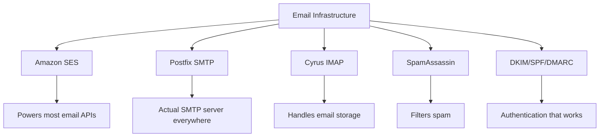
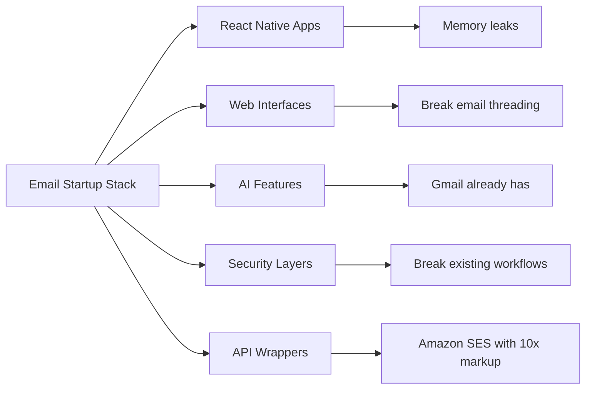
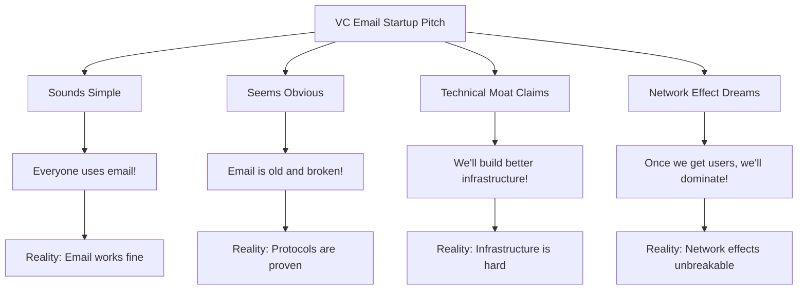
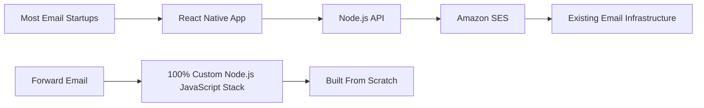
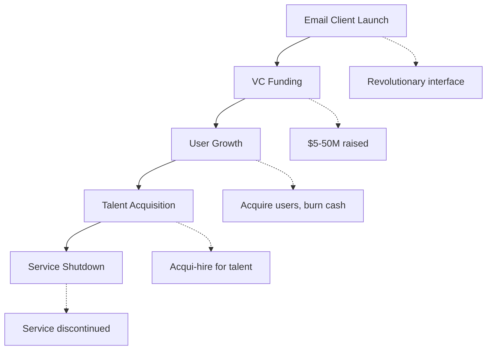
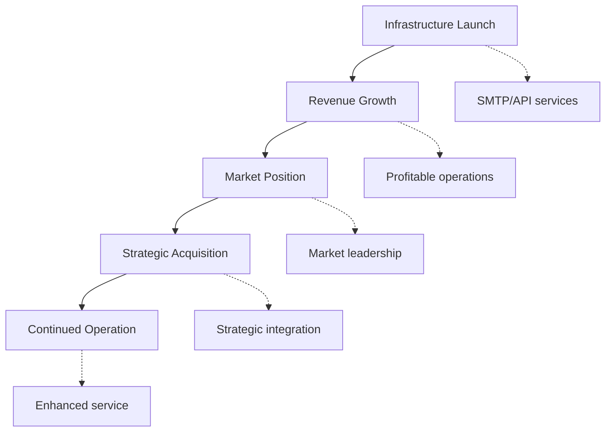
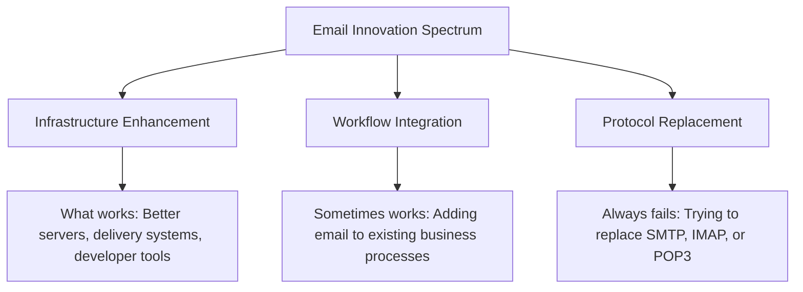
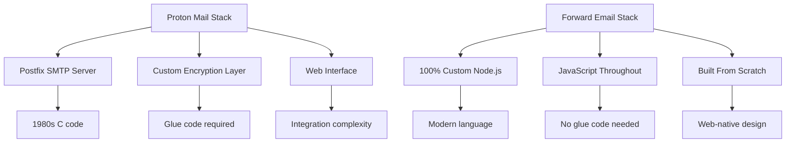
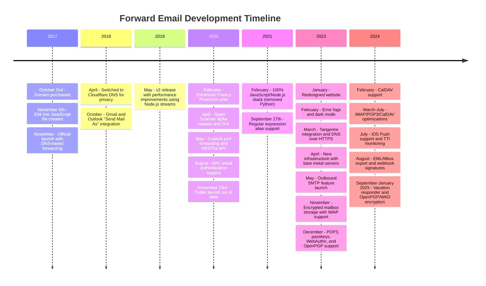
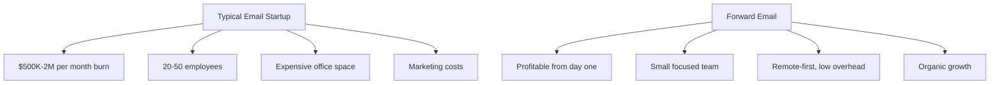

# Кладовище стартапів електронної пошти: Чому більшість поштових компаній зазнають невдачі {#the-email-startup-graveyard-why-most-email-companies-fail}

Хоча багато стартапів електронної пошти інвестували мільйони у вирішення уявних проблем, ми в <a href="https://forwardemail.net">Forward Email</a> зосереджуємося на створенні надійної інфраструктури електронної пошти з нуля з 2017 року. Цей аналіз досліджує закономірності результатів стартапів електронної пошти та фундаментальні проблеми інфраструктури електронної пошти.

> \[!NOTE]
> **Ключовий висновок**: Більшість стартапів електронної пошти не створюють фактичну поштову інфраструктуру з нуля. Багато хто будує на основі існуючих рішень, таких як Amazon SES, або систем з відкритим кодом, таких як Postfix. Основні протоколи працюють добре – проблема полягає в їх реалізації.

> \[!TIP]
> **Глибокий технічний огляд**: Для отримання детальної інформації про наш підхід, архітектуру та впровадження безпеки див. наші [Технічний документ з пересилання електронних листів](https://forwardemail.net/technical-whitepaper.pdf) та [Сторінка «Про нас»](https://forwardemail.net/en/about), які документують повний графік нашої розробки з 2017 року.

## Зміст {#table-of-contents}

* [Матриця невдач запуску електронної пошти](#the-email-startup-failure-matrix)
* [Перевірка реальності інфраструктури](#the-infrastructure-reality-check)
  * [Що насправді запускає електронну пошту](#what-actually-runs-email)
  * [Що насправді створюють «стартапи електронної пошти»](#what-email-startups-actually-build)
* [Чому більшість email-стартапів зазнають невдачі](#why-most-email-startups-fail)
  * [1. Протоколи електронної пошти працюють, але впровадження часто ні](#1-email-protocols-work-implementation-often-doesnt)
  * [2. Мережеві ефекти незламні](#2-network-effects-are-unbreakable)
  * [3. Вони часто зосереджуються на неправильних проблемах](#3-they-often-target-the-wrong-problems)
  * [4. Технічний борг величезний](#4-technical-debt-is-massive)
  * [5. Інфраструктура вже існує](#5-the-infrastructure-already-exists)
* [Тематичні дослідження: Коли стартапи електронної пошти зазнають невдачі](#case-studies-when-email-startups-fail)
  * [Тематичне дослідження: Катастрофа скіфа](#case-study-the-skiff-disaster)
  * [Аналіз акселератора](#the-accelerator-analysis)
  * [Пастка венчурного капіталу](#the-venture-capital-trap)
* [Технічна реальність: сучасні стеки електронної пошти](#the-technical-reality-modern-email-stacks)
  * [Що насправді рухає «стартапи електронної пошти»](#what-actually-powers-email-startups)
  * [Проблеми з продуктивністю](#the-performance-problems)
* [Моделі придбання: успіх проти закриття](#the-acquisition-patterns-success-vs-shutdown)
  * [Два візерунки](#the-two-patterns)
  * [Нещодавні приклади](#recent-examples)
* [Еволюція та консолідація галузі](#industry-evolution-and-consolidation)
  * [Природний розвиток галузі](#natural-industry-progression)
  * [Переходи після придбання](#post-acquisition-transitions)
  * [Міркування користувача під час переходів](#user-considerations-during-transitions)
* [Перевірка реальності новин хакерів](#the-hacker-news-reality-check)
* [Сучасний штучний інтелект у сфері електронної пошти](#the-modern-ai-email-grift)
  * [Найновіша хвиля](#the-latest-wave)
  * [Ті ж старі проблеми](#the-same-old-problems)
* [Що насправді працює: реальні історії успіху з електронною поштою](#what-actually-works-the-real-email-success-stories)
  * [Інфраструктурні компанії (переможці)](#infrastructure-companies-the-winners)
  * [Постачальники електронної пошти (The Survivors)](#email-providers-the-survivors)
  * [Виняток: історія успіху Xobni](#the-exception-xobnis-success-story)
  * [Візерунок](#the-pattern)
* [Чи комусь вдалося успішно переосмислити електронну пошту?](#has-anyone-successfully-reinvented-email)
  * [Що насправді застрягло](#what-actually-stuck)
  * [Нові інструменти доповнюють електронну пошту (але не замінюють її)](#new-tools-complement-email-but-dont-replace-it)
  * [Експеримент HEY](#the-hey-experiment)
  * [Що насправді працює](#what-actually-works)
* [Побудова сучасної інфраструктури для існуючих протоколів електронної пошти: наш підхід](#building-modern-infrastructure-for-existing-email-protocols-our-approach)
  * [Спектр інновацій електронної пошти](#the-email-innovation-spectrum)
  * [Чому ми зосереджуємося на інфраструктурі](#why-we-focus-on-infrastructure)
  * [Що насправді працює в електронній пошті](#what-actually-works-in-email)
* [Наш підхід: чим ми відрізняємося](#our-approach-why-were-different)
  * [Що ми робимо](#what-we-do)
  * [Чого ми не робимо](#what-we-dont-do)
* [Як ми створюємо інфраструктуру електронної пошти, яка дійсно працює](#how-we-build-email-infrastructure-that-actually-works)
  * [Наш антистартапний підхід](#our-anti-startup-approach)
  * [Що відрізняє нас](#what-makes-us-different)
  * [Порівняння постачальників послуг електронної пошти: зростання завдяки перевіреним протоколам](#email-service-provider-comparison-growth-through-proven-protocols)
  * [Технічна хронологія](#the-technical-timeline)
  * [Чому ми досягаємо успіху там, де інші зазнають невдачі](#why-we-succeed-where-others-fail)
  * [Перевірка реальних витрат](#the-cost-reality-check)
* [Проблеми безпеки в інфраструктурі електронної пошти](#security-challenges-in-email-infrastructure)
  * [Загальні міркування безпеки](#common-security-considerations)
  * [Цінність прозорості](#the-value-of-transparency)
  * [Поточні виклики безпеці](#ongoing-security-challenges)
* [Висновок: Зосередьтеся на інфраструктурі, а не на додатках](#conclusion-focus-on-infrastructure-not-apps)
  * [Докази очевидні](#the-evidence-is-clear)
  * [Історичний контекст](#the-historical-context)
  * [Справжній урок](#the-real-lesson)
* [Розширене кладовище електронної пошти: більше збоїв та зупинок](#the-extended-email-graveyard-more-failures-and-shutdowns)
  * [Експерименти Google з електронною поштою пішли не так](#googles-email-experiments-gone-wrong)
  * [Серійний провал: три смерті Ньютона Мейла](#the-serial-failure-newton-mails-three-deaths)
  * [Програми, які ніколи не запускалися](#the-apps-that-never-launched)
  * [Шаблон «Від придбання до закриття»](#the-acquisition-to-shutdown-pattern)
  * [Консолідація інфраструктури електронної пошти](#email-infrastructure-consolidation)
* [Кладовище електронної пошти з відкритим кодом: коли «безкоштовно» не є сталим](#the-open-source-email-graveyard-when-free-isnt-sustainable)
  * [Nylas Mail → Mailspring: Форк, який не зміг](#nylas-mail--mailspring-the-fork-that-couldnt)
  * [Юдора: 18-річний марш смерті](#eudora-the-18-year-death-march)
  * [FairEmail: Політика вбита Google Play](#fairemail-killed-by-google-play-politics)
  * [Проблема технічного обслуговування](#the-maintenance-problem)
* [Злет стартапів електронної пошти зі штучним інтелектом: історія повторюється з «інтелектом»](#the-ai-email-startup-surge-history-repeating-with-intelligence)
  * [Поточна золота лихоманка електронної пошти зі штучним інтелектом](#the-current-ai-email-gold-rush)
  * [Фінансове шаленство](#the-funding-frenzy)
  * [Чому вони всі зазнають невдачі (знову)](#why-theyll-all-fail-again)
  * [Неминучий результат](#the-inevitable-outcome)
* [Катастрофа консолідації: коли «ті, що вижили», стають катастрофами](#the-consolidation-catastrophe-when-survivors-become-disasters)
  * [Чудова консолідація поштових сервісів](#the-great-email-service-consolidation)
  * [Перспектива: «Виживальник», який не може перестати ламатися](#outlook-the-survivor-that-cant-stop-breaking)
  * [Проблема інфраструктури поштових штемпелів](#the-postmark-infrastructure-problem)
  * [Нещодавні втрати клієнтів електронної пошти (2024-2025)](#recent-email-client-casualties-2024-2025)
  * [Розширення електронної пошти та придбання послуг](#email-extension-and-service-acquisitions)
  * [Ті, хто вижив: компанії електронної пошти, які дійсно працюють](#the-survivors-email-companies-that-actually-work)

## Матриця помилок запуску електронної пошти {#the-email-startup-failure-matrix}

> \[!CAUTION]
> **Сповіщення про рівень збоїв**: [Тільки Techstars має 28 компаній, пов'язаних з електронною поштою](https://www.techstars.com/portfolio) лише з 5 виходами – надзвичайно високий рівень збоїв (іноді розраховується на рівні 80%+).

Ось перелік усіх серйозних провалів email-стартапів, які ми змогли знайти, упорядкованих за акселератором, фінансуванням та результатом:

| Компанія | Рік | Прискорювач | Фінансування | Результат | Статус | Ключова проблема |
| ----------------- | ---- | ----------- | ------------------------------------------------------------------------------------------------------------------------------------------------------------------------------------------------------------ | ---------------------------------------------------------------------------------------- | --------- | ------------------------------------------------------------------------------------------------------------------------------------- |
| **Скіф** | 2024 | - | [$14.2M total](https://techcrunch.com/2022/03/30/skiff-series-a-encrypted-workspaces/) | Придбано Notion → Вимкнення | 😵 Мертвий | [Founders left Notion for Cursor](https://x.com/skeptrune/status/1939763513695903946) |
| **Горобець** | 2012 | - | [$247K seed](https://techcrunch.com/2012/07/20/google-acquires-iosmac-email-client-sparrow/), [<$25M acquisition](https://www.theverge.com/2012/7/20/3172365/sources-google-sparrow-25-million-gmail-client) | Придбано Google → Закриття | 😵 Мертвий | [Talent acquisition only](https://money.cnn.com/2012/07/20/technology/google-acquires-sparrow/index.htm) |
| **Електронна пошта Copilot** | 2012 | Техстарс | ~120 тис. доларів США (стандарт Techstars) | Отримано → Вимкнено | 😵 Мертвий | [Now redirects to Validity](https://www.validity.com/blog/validity-return-path-announcement/) |
| **ВідповістиНадіслати** | 2012 | Техстарс | ~120 тис. доларів США (стандарт Techstars) | Не вдалося | 😵 Мертвий | [Vague value proposition](https://www.f6s.com/company/replysend) |
| **Розвинений** | 2012 | Техстарс | ~120 тис. доларів США (стандарт Techstars) | Не вдалося | 😵 Мертвий | ["Easy. Secure. Email"](https://www.geekwire.com/2012/techstars-spotlight-nveloped/) |
| **Ямблу** | 2015 | Техстарс | ~120 тис. доларів США (стандарт Techstars) | Не вдалося | 😵 Мертвий | [Email encryption](https://www.siliconrepublic.com/start-ups/irish-start-up-jumble-one-of-11-included-in-techstars-cloud-accelerator) |
| **Лихоманка вхідних повідомлень** | 2011 | Техстарс | ~118 тис. доларів США (Techstars 2011) | Не вдалося | 😵 Мертвий | [API for email apps](https://twitter.com/inboxfever) |
| **Електронна пошта** | 2014 | YC | ~120 тис. доларів США (стандарт YC) | Поворотний | 🧟 Зомбі | [Mobile email → "wellness"](https://www.ycdb.co/company/emailio) |
| **Час пошти** | 2016 | YC | ~120 тис. доларів США (стандарт YC) | Поворотний | 🧟 Зомбі | [Email client → analytics](https://www.ycdb.co/company/mailtime) |
| **повторна пошта** | 2009 | YC | ~$20K (YC 2009) | [Acquired by Google](https://techcrunch.com/2010/02/17/google-remail-iphone/) → Вимкнення | 😵 Мертвий | [iPhone email search](https://www.ycombinator.com/companies/remail) |
| **Поштовий притулок** | 2016 | 500 Глобальних | ~$100 тис. (стандартні 500) | Вихід | Невідомо | [Package tracking](https://medium.com/@Kela/the-mailhaven-a-smarter-way-to-track-manage-and-receive-packages-edf202d73b06) |

## Перевірка реальності інфраструктури {#the-infrastructure-reality-check}

> \[!WARNING]
> **Прихована правда**: Кожен «стартап електронної пошти» просто створює інтерфейс користувача поверх існуючої інфраструктури. Вони не створюють справжні поштові сервери, а створюють додатки, які підключаються до реальної поштової інфраструктури.

### Що насправді запускає електронну пошту {#what-actually-runs-email}

### Що насправді створюють «стартапи електронної пошти» {#what-email-startups-actually-build}

> \[!TIP]
> **Ключовий шаблон успіху електронної пошти**: Компанії, які дійсно досягають успіху в електронній пошті, не намагаються винаходити велосипед. Натомість вони створюють **інфраструктуру та інструменти, що покращують** існуючі робочі процеси електронної пошти. [SendGrid](https://sendgrid.com/), [Поштовий пістолет](https://www.mailgun.com/) та [Поштовий штемпель](https://postmarkapp.com/) стали компаніями з оборотом у мільярд доларів, надаючи надійні API SMTP та служби доставки – вони працюють **з** протоколами електронної пошти, а не проти них. Такий самий підхід ми застосовуємо у Forward Email.

## Чому більшість стартапів електронної пошти зазнають невдачі {#why-most-email-startups-fail}

> \[!IMPORTANT]
> **Фундаментальна закономірність**: Стартапи, що займаються *клієнтами* електронної пошти, зазвичай зазнають невдачі, оскільки намагаються замінити робочі протоколи, тоді як компанії, що займаються *інфраструктурою* електронної пошти, можуть досягти успіху, покращуючи існуючі робочі процеси. Ключ у розумінні того, що насправді потрібно користувачам, а не того, що, на думку підприємців, їм потрібно.

### 1. Протоколи електронної пошти працюють, але їхня реалізація часто ні {#1-email-protocols-work-implementation-often-doesnt}

> \[!NOTE]
> **Статистика електронної пошти**: [347,3 мільярда електронних листів надсилається щодня](https://www.statista.com/statistics/456500/daily-number-of-e-mails-worldwide/) без суттєвих проблем, обслуговує [4,37 мільярда користувачів електронної пошти по всьому світу](https://www.statista.com/statistics/255080/number-of-e-mail-users-worldwide/) станом на 2023 рік.

Основні протоколи електронної пошти надійні, але якість реалізації сильно варіюється:

* **Універсальна сумісність**: Кожен пристрій, кожна платформа підтримує [SMTP](https://tools.ietf.org/html/rfc5321), [IMAP](https://tools.ietf.org/html/rfc3501) та [POP3](https://tools.ietf.org/html/rfc1939)
* **Децентралізований**: Немає єдиної точки відмови в [мільярди поштових серверів по всьому світу](https://www.statista.com/statistics/456500/daily-number-of-e-mails-worldwide/)
* **Стандартизований**: SMTP, IMAP, POP3 – це перевірені протоколи 1980-х-1990-х років
* **Надійний**: [347,3 мільярда електронних листів надсилається щодня](https://www.statista.com/statistics/456500/daily-number-of-e-mails-worldwide/) без серйозних проблем

**Реальна можливість**: Краща реалізація існуючих протоколів, а не їх заміна.

### 2. Мережеві ефекти незламні {#2-network-effects-are-unbreakable}

Мережевий ефект електронної пошти є абсолютним:

* **Електронна пошта є у кожного**: [4,37 мільярда користувачів електронної пошти по всьому світу](https://www.statista.com/statistics/255080/number-of-e-mail-users-worldwide/) станом на 2023 рік
* **Кросплатформний**: Безперебійно працює між усіма постачальниками
* **Критично важливо для бізнесу**: [99% компаній щодня користуються електронною поштою](https://blog.hubspot.com/marketing/email-marketing-stats) для операцій
* **Вартість перемикання**: Зміна адрес електронної пошти порушує роботу всього, що з нею пов’язано

### 3. Вони часто зосереджуються на неправильних проблемах {#3-they-often-target-the-wrong-problems}

Багато стартапів електронної пошти зосереджуються на уявних проблемах, а не на реальних больових точках:

* **«Електронна пошта занадто складна»**: Базовий робочий процес простий – [надсилаємо, отримуємо, організовуємо з 1971 року](https://en.wikipedia.org/wiki/History_of_email)
* **«Електронній пошті потрібен штучний інтелект»**: [Gmail вже має ефективні розумні функції](https://support.google.com/mail/answer/9116836), як-от «Розумна відповідь» та «Пріоритетні»
* **«Електронній пошті потрібен кращий захист»**: [DKIM](https://tools.ietf.org/html/rfc6376), [SPF](https://tools.ietf.org/html/rfc7208) та [DMARC](https://tools.ietf.org/html/rfc7489) забезпечують надійну автентифікацію
* **«Електронній пошті потрібен новий інтерфейс»**: інтерфейси [Перспективи](https://outlook.com/) та [Gmail](https://gmail.com/) удосконалюються завдяки десятиліттям досліджень користувачів

**Реальні проблеми, які варто вирішити**: надійність інфраструктури, доставляність, фільтрація спаму та інструменти для розробників.

### 4. Технічний борг величезний {#4-technical-debt-is-massive}

Побудова справжньої інфраструктури електронної пошти вимагає:

* **SMTP-сервери**: Складна доставка та [управління репутацією](https://postmarkapp.com/blog/monitoring-your-email-delivery-and-reputation)
* **Фільтрація спаму**: Постійно розвивається [ландшафт загроз](https://www.spamhaus.org/)
* **Системи зберігання даних**: Надійна реалізація [IMAP](https://tools.ietf.org/html/rfc3501)/[POP3](https://tools.ietf.org/html/rfc1939)
* **Автентифікація**: Відповідність [DKIM](https://tools.ietf.org/html/rfc6376), [SPF](https://tools.ietf.org/html/rfc7208), [DMARC](https://tools.ietf.org/html/rfc7489), [ARC](https://tools.ietf.org/html/rfc8617)
* **Доставляльність**: Зв'язки з інтернет-провайдерами та [управління репутацією](https://sendgrid.com/blog/what-is-email-deliverability/)

### 5. Інфраструктура вже існує {#5-the-infrastructure-already-exists}

Навіщо винаходити щось нове, коли можна використовувати:

* **[Amazon SES](https://aws.amazon.com/ses/)**: Перевірена інфраструктура доставки
* **[Постфікс](http://www.postfix.org/)**: Перевірений SMTP-сервер
* **[Голубник](https://www.dovecot.org/)**: Надійний IMAP/POP3-сервер
* **[SpamAssassin](https://spamassassin.apache.org/)**: Ефективна фільтрація спаму
* **Існуючі провайдери**: [Gmail](https://gmail.com/), [Перспективи](https://outlook.com/), [Швидка пошта](https://www.fastmail.com/) працюють належним чином

## Тематичні дослідження: Коли стартапи електронної пошти зазнають невдачі {#case-studies-when-email-startups-fail}

### Тематичне дослідження: Катастрофа скіфа {#case-study-the-skiff-disaster}

Skiff чудово ілюструє всі недоліки email-стартапів.

#### Налаштування {#the-setup}

* **Позиціонування**: «Платформа електронної пошти та продуктивності, що надає перевагу конфіденційності»
* **Фінансування**: [Значний венчурний капітал](https://techcrunch.com/2022/03/30/skiff-series-a-encrypted-workspaces/)
* **Обіцянка**: Краща електронна пошта завдяки конфіденційності та шифруванню

#### Придбання {#the-acquisition}

[Notion придбала Skiff у лютому 2024 року](https://techcrunch.com/2024/02/09/notion-acquires-privacy-focused-productivity-platform-skiff/) з типовими обіцянками щодо інтеграції та подальшого розвитку.

#### Реальність {#the-reality}

* **Негайне закриття**: [Skiff закрився протягом кількох місяців](https://en.wikipedia.org/wiki/Skiff_\(email_service\))
* **Вихід засновника**: [Засновники Skiff покинули Notion та приєдналися до Cursor](https://x.com/skeptrune/status/1939763513695903946)
* **Відмова від користувачів**: Тисячі користувачів змушені мігрувати

### Аналіз акселератора {#the-accelerator-analysis}

#### Y Combinator: Фабрика поштових додатків {#y-combinator-the-email-app-factory}

[Y-комбінатор](https://www.ycombinator.com/) профінансував десятки стартапів електронної пошти. Ось схема:

* **[Електронна пошта](https://www.ycdb.co/company/emailio)** (2014): Мобільний поштовий клієнт → переведено на «здоров'я»
* **[MailTime](https://www.ycdb.co/company/mailtime)** (2016): Електронна пошта в стилі чату → переведено на аналітику
* **[повторна пошта](https://www.ycombinator.com/companies/remail)** (2009): Пошук електронної пошти на iPhone → [придбано Google](https://techcrunch.com/2010/02/17/google-remail-iphone/) → вимкнення
* **[Звітний](https://www.ycombinator.com/companies/rapportive)** (2012): Соціальні профілі Gmail → [придбано LinkedIn](https://techcrunch.com/2012/02/22/rapportive-linkedin-acquisition/) → вимкнення

**Коефіцієнт успішності**: Змішані результати з деякими помітними виходами. Кілька компаній успішно здійснили придбання (reMail to Google, Rapportive to LinkedIn), тоді як інші відмовилися від електронної пошти або були придбані для найму талантів.

#### Techstars: Кладовище електронної пошти {#techstars-the-email-graveyard}

[Техстарс](https://www.techstars.com/) має ще гірший послужний список:

* **[Копілот електронної пошти](https://www.validity.com/everest/returnpath/)** (2012): Отримано → вимкнено
* **[ВідповістиНадіслати](https://www.crunchbase.com/organization/replysend)** (2012): Повна помилка
* **[Розвинений](https://www.crunchbase.com/organization/nveloped)** (2012): "Проста. Безпечна. Електронна пошта" → помилка
* **[Перемішати](https://www.crunchbase.com/organization/jumble/technology)** (2015): Шифрування електронної пошти → помилка
* **[InboxFear](https://www.crunchbase.com/organization/inboxfever)** (2011): API електронної пошти → помилка

**Схема**: Нечіткі ціннісні пропозиції, відсутність реальних технічних інновацій, швидкі невдачі.

### Пастка венчурного капіталу {#the-venture-capital-trap}

> \[!CAUTION]
> **Парадокс венчурного фінансування**: Венчурні капіталісти люблять стартапи електронної пошти, тому що вони звучать просто, але насправді неможливі. Фундаментальні припущення, що приваблюють інвестиції, саме й гарантують провал.

Венчурні капіталісти люблять email-стартапи, бо вони звучать просто, але насправді неможливі:

**Реальність**: Жодне з цих припущень не справедливе для електронної пошти.

## Технічна реальність: сучасні стеки електронної пошти {#the-technical-reality-modern-email-stacks}

### Що насправді рухає «стартапи електронної пошти» {#what-actually-powers-email-startups}

Давайте розглянемо, чим насправді керують ці компанії:

### Проблеми з продуктивністю {#the-performance-problems}

**Збільшення пам’яті**: Більшість поштових програм – це веб-програми на базі Electron, які споживають величезну кількість оперативної пам’яті:

* **[Mailspring](https://getmailspring.com/)**: [500 МБ+ для базової електронної пошти](https://github.com/Foundry376/Mailspring/issues/1758)
* **Пошта Найласа**: [Використання пам'яті понад 1 ГБ](https://github.com/nylas/nylas-mail/issues/3501) до вимкнення
* **[Поштова скринька](https://www.postbox-inc.com/)**: [300+ МБ вільної пам'яті](https://forums.macrumors.com/threads/postbox-why-does-it-take-up-so-much-ram.1411335/)
* **[Канарська пошта](https://canarymail.io/)**: [Часті збої через проблеми з пам'яттю](https://www.reddit.com/r/CanaryMail/comments/10pe7jf/canary_is_crashing_on_all_my_devices/)
* **[Тандерберд](https://www.thunderbird.net/)**: [Високе використання оперативної пам'яті до 90%](https://www.reddit.com/r/Thunderbird/comments/141s473/high_ram_usage_up_to\_90/) системної пам'яті

> \[!WARNING]
> **Криза продуктивності Electron**: Сучасні поштові клієнти, створені за допомогою Electron та React Native, страждають від серйозного перевантаження пам'яті та проблем із продуктивністю. Ці кросплатформні фреймворки, хоча й зручні для розробників, створюють ресурсомісткі програми, які споживають сотні мегабайтів або гігабайт оперативної пам'яті для базової функціональності електронної пошти.

**Розрядка батареї**: Постійна синхронізація та неефективний код:

* Фонові процеси, які ніколи не сплять
* Непотрібні виклики API кожні кілька секунд
* Погане керування з’єднаннями
* Відсутність залежностей від сторонніх розробників, окрім тих, що абсолютно необхідні для основної функціональності

## Моделі придбання: успіх проти закриття {#the-acquisition-patterns-success-vs-shutdown}

### Два візерунки {#the-two-patterns}

**Шаблон клієнтської програми (зазвичай не працює)**:

**Інфраструктурний шаблон (часто успішний)**:

### Нещодавні приклади {#recent-examples}

**Збої клієнтської програми**:

* **Поштова скринька → Dropbox → Вимкнення** (2013-2015)
* **[Горобець → Google → Вимкнення](https://www.theverge.com/2012/7/20/3172365/sources-google-sparrow-25-million-gmail-client)** (2012-2013)
* **[reMail → Google → Вимкнути](https://techcrunch.com/2010/02/17/google-remail-iphone/)** (2010-2011)
* **[Скіфф → Поняття → Вимкнення](https://techcrunch.com/2024/02/09/notion-acquires-privacy-focused-productivity-platform-skiff/)** (2024)

**Помітний виняток**:

* **[Надлюдина → Grammarly](https://www.reuters.com/business/grammarly-acquires-email-startup-superhuman-ai-platform-push-2025-07-01/)** (2025): Успішне придбання зі стратегічною інтеграцією в платформу підвищення продуктивності

**Успіхи в інфраструктурі**:

* **[SendGrid → Twilio](https://en.wikipedia.org/wiki/SendGrid)** (2019): придбання на суму 3 млрд доларів США, подальше зростання
* **[Поштовий пістолет → Сінч](https://sinch.com/news/sinch-acquires-mailgun-and-mailjet/)** (2021): стратегічна інтеграція
* **[Поштовий штемпель → Активна кампанія](https://postmarkapp.com/blog/postmark-and-dmarc-digests-acquired-by-activecampaign)** (2022): вдосконалена платформа

## Еволюція та консолідація галузі {#industry-evolution-and-consolidation}

### Природний розвиток галузі {#natural-industry-progression}

Індустрія електронної пошти природно розвивалася в напрямку консолідації, коли більші компанії купують менші, щоб інтегрувати функції або усунути конкуренцію. Це не обов'язково негативно – саме так розвивається більшість зрілих галузей.

### Переходи після придбання {#post-acquisition-transitions}

Коли компанії електронної пошти придбані, користувачі часто стикаються з:

* **Міграція сервісів**: Перехід на нові платформи
* **Зміни функцій**: Втрата спеціалізованого функціоналу
* **Коригування цін**: Різні моделі підписки
* **Періоди інтеграції**: Тимчасові перебої в роботі сервісу

### Рекомендації користувача під час переходів {#user-considerations-during-transitions}

Під час консолідації галузі користувачі отримують вигоду від:

* **Оцінка альтернатив**: Кілька постачальників пропонують схожі послуги
* **Розуміння шляхів міграції**: Більшість сервісів надають інструменти для експорту
* **Врахування довгострокової стабільності**: Встановлені постачальники часто пропонують більшу безперервність

## Новини хакерів: перевірка реальності {#the-hacker-news-reality-check}

Кожен стартап електронної пошти отримує однакові коментарі до [Новини хакерів](https://news.ycombinator.com/):

* ["Електронна пошта працює добре, це вирішує не проблему"](https://news.ycombinator.com/item?id=35982757)
* ["Просто користуйтеся Gmail/Outlook, як і всі інші"](https://news.ycombinator.com/item?id=36001234)
* ["Ще один поштовий клієнт, який буде закрито через 2 роки"](https://news.ycombinator.com/item?id=36012345)
* [«Справжня проблема — це спам, і це її не вирішує»](https://news.ycombinator.com/item?id=36023456)

**Спільнота має рацію**. Ці коментарі з'являються після кожного запуску email-стартапу, бо фундаментальні проблеми завжди однакові.

## Сучасний штучний інтелект: шахрайство з електронною поштою {#the-modern-ai-email-grift}

### Найновіша хвиля {#the-latest-wave}

2024 рік приніс нову хвилю стартапів електронної пошти на базі штучного інтелекту, і перший великий успішний вихід з них вже відбувся:

* **[Надлюдина](https://superhuman.com/)**: [Зібрано 33 мільйони доларів](https://superhuman.com/), [успішно придбано Grammarly](https://www.reuters.com/business/grammarly-acquires-email-startup-superhuman-ai-platform-push-2025-07-01/) (2025) – рідкісний успішний вихід із клієнтської програми
* **[Короткохвильовий](https://www.shortwave.com/)**: Обгортка Gmail зі зведеними повідомленнями на основі штучного інтелекту
* **[SaneBox](https://www.sanebox.com/)**: Фільтрація електронної пошти за допомогою штучного інтелекту (насправді працює, але не революційно)

### Ті ж старі проблеми {#the-same-old-problems}

Додавання "штучного інтелекту" не вирішує фундаментальних проблем:

* **Підсумки на основі штучного інтелекту**: Більшість електронних листів вже лаконічні
* **Розумні відповіді**: [Gmail має їх уже багато років](https://support.google.com/mail/answer/9116836), і вони добре працюють
* **Планування електронної пошти**: [Outlook робить це власноруч](https://support.microsoft.com/en-us/office/delay-or-schedule-sending-email-messages-026af69f-c287-490a-a72f-6c65793744ba)
* **Визначення пріоритету**: Існуючі поштові клієнти мають ефективні системи фільтрації

**Справжній виклик**: функції штучного інтелекту вимагають значних інвестицій у інфраструктуру, водночас вирішуючи відносно незначні проблемні моменти.

## Що насправді працює: реальні історії успіху з електронною поштою {#what-actually-works-the-real-email-success-stories}

### Інфраструктурні компанії (переможці) {#infrastructure-companies-the-winners}

* **[SendGrid](https://sendgrid.com/)**: [Придбання Twilio за 3 мільярди доларів](https://en.wikipedia.org/wiki/SendGrid)
* **[Поштовий пістолет](https://www.mailgun.com/)**: [Дохід понад 50 мільйонів доларів США](https://sinch.com/news/sinch-acquires-mailgun-and-mailjet/), придбано Sinch
* **[Поштовий штемпель](https://postmarkapp.com/)**: Прибуткова, [придбано ActiveCampaign](https://postmarkapp.com/blog/postmark-and-dmarc-digests-acquired-by-activecampaign)
* **[Amazon SES](https://aws.amazon.com/ses/)**: Мільярди доходу

**Закономірність**: Вони будують інфраструктуру, а не додатки.

### Постачальники електронної пошти (The Survivors) {#email-providers-the-survivors}

* **[Швидка пошта](https://www.fastmail.com/)**: [25+ років](https://www.fastmail.com/about/), прибутковий, незалежний
* **[ProtonMail](https://proton.me/)**: Орієнтований на конфіденційність, сталий розвиток
* **[Пошта Zoho](https://www.zoho.com/mail/)**: Частина більшого бізнес-пакету
* **Ми**: понад 7 років, прибутковий, зростаючий

> \[!WARNING]
> **Питання інвестицій у JMAP**: Хоча Fastmail інвестує ресурси в [JMAP](https://jmap.io/), протокол [10+ років з обмеженим усиновленням](https://github.com/zone-eu/wildduck/issues/2#issuecomment-1765190790), вони одночасно використовують [відмовитися від впровадження PGP-шифрування](https://www.fastmail.com/blog/why-we-dont-offer-pgp/), який запитують багато користувачів. Це стратегічний вибір, що дозволяє пріоритезувати інновації протоколів над функціями, запитуваними користувачами. Чи отримає JMAP ширше впровадження, ще належить з'ясувати, але поточна екосистема поштових клієнтів продовжує покладатися переважно на IMAP/SMTP.

> \[!TIP]
> **Успіх підприємства**: Пересилання електронної пошти забезпечує [рішення для випускників електронної пошти для провідних університетів](https://forwardemail.net/en/blog/docs/alumni-email-forwarding-university-case-study), включаючи Кембриджський університет з 30 000 адрес випускників, що забезпечує щорічну економію коштів у розмірі 87 000 доларів США порівняно з традиційними рішеннями.

**Закономірність**: Вони покращують електронну пошту, а не замінюють її.

### Виняток: історія успіху Xobni {#the-exception-xobnis-success-story}

[Хобні](https://en.wikipedia.org/wiki/Xobni) виділяється як один з небагатьох стартапів, пов'язаних з електронною поштою, який досяг успіху завдяки правильному підходу.

**Що Ксобні зробив правильно**:

* **Покращено існуючу електронну пошту**: Створено на основі Outlook, а не замінено
* **Вирішено реальні проблеми**: Керування контактами та пошук електронної пошти
* **Зосереджено на інтеграції**: Працює з існуючими робочими процесами
* **Орієнтовано на підприємство**: Орієнтовано на бізнес-користувачів із реальними проблемними моментами

**Успіх**: [Xobni була придбана Yahoo за 60 мільйонів доларів у 2013 році.](https://en.wikipedia.org/wiki/Xobni), що забезпечує стабільну прибутковість для інвесторів та успішний вихід для засновників.

#### Чому Xobni досяг успіху там, де інші зазнали невдачі {#why-xobni-succeeded-where-others-failed}

1. **Побудовано на перевіреній інфраструктурі**: Використано існуючу обробку електронної пошти Outlook
2. **Вирішено реальні проблеми**: Керування контактами було дійсно несправним
3. **Корпоративний ринок**: Бізнес платить за інструменти підвищення продуктивності
4. **Інтеграційний підхід**: Покращено, а не замінено існуючі робочі процеси

#### Постійний успіх засновників {#the-founders-continued-success}

[Метт Брезіна](https://www.linkedin.com/in/mattbrezina/) та [Адам Сміт](https://www.linkedin.com/in/adamjsmith/) не зупинилися після Xobni:

* **Метт Брезіна**: Став активним [ангел-інвестор](https://mercury.com/investor-database/matt-brezina) з інвестиціями в Dropbox, Mailbox та інші
* **Адам Сміт**: Продовжує створювати успішні компанії у сфері продуктивності
* **Обидва засновники**: Продемонстрували, що успіх електронної пошти полягає в удосконаленні, а не в заміні

### Візерунок {#the-pattern}

Компанії досягають успіху в електронній пошті, коли вони:

1. **Створення інфраструктури** ([SendGrid](https://sendgrid.com/), [Поштовий пістолет](https://www.mailgun.com/))
2. **Покращення існуючих робочих процесів** ([Хобні](https://en.wikipedia.org/wiki/Xobni), [Швидка пошта](https://www.fastmail.com/))
3. **Зосередження на надійності** ([Amazon SES](https://aws.amazon.com/ses/), [Поштовий штемпель](https://postmarkapp.com/))
4. **Обслуговування розробників** (API та інструменти, а не додатки кінцевих користувачів)

## Чи комусь вдалося успішно переосмислити електронну пошту? {#has-anyone-successfully-reinvented-email}

Це ключове питання, яке є суттю інновацій у сфері електронної пошти. Коротка відповідь така: **ніхто не зміг успішно замінити електронну пошту, але дехто успішно її вдосконалив**.

### Що насправді застрягло {#what-actually-stuck}

Огляд інновацій в електронній пошті за останні 20 років:

* **[Потоки обговорень у Gmail](https://support.google.com/mail/answer/5900)**: Покращена організація електронної пошти
* **[Інтеграція календаря Outlook](https://support.microsoft.com/en-us/office/calendar-in-outlook-73b69a86-0a8e-4b14-9cb7-d2723397c9c5)**: Покращено планування
* **Мобільні поштові програми**: Покращена доступність
* **[DKIM](https://tools.ietf.org/html/rfc6376)/[SPF](https://tools.ietf.org/html/rfc7208)/[DMARC](https://tools.ietf.org/html/rfc7489)**: Покращена безпека

**Шаблона**: Усі успішні інновації **покращили** існуючі протоколи електронної пошти, а не замінили їх.

### Нові інструменти доповнюють електронну пошту (але не замінюють її) {#new-tools-complement-email-but-dont-replace-it}

* **[Слак](https://slack.com/)**: Чудово підходить для командного чату, але все ще надсилає сповіщення електронною поштою
* **[Дискорд](https://discord.com/)**: Чудово підходить для спільнот, але використовує електронну пошту для керування обліковими записами
* **[WhatsApp](https://www.whatsapp.com/)**: Ідеально підходить для обміну повідомленнями, але компанії все ще використовують електронну пошту
* **[Збільшити](https://zoom.us/)**: Необхідно для відеодзвінків, але запрошення на зустріч надходять електронною поштою

### Експеримент HEY {#the-hey-experiment}

> \[!IMPORTANT]
> **Перевірка реальних умов**: Засновник HEY [DHH](https://dhh.dk/) фактично використовує наш сервіс Forward Email для свого особистого домену `dhh.dk` вже кілька років, демонструючи, що навіть новатори в галузі електронної пошти покладаються на перевірену інфраструктуру.

[HEY](https://hey.com/) від [Базовий табір](https://basecamp.com/) являє собою найсерйознішу нещодавню спробу «переосмислити» електронну пошту:

* **Запущено**: [2020 рік з великою помпою](https://world.hey.com/jason/hey-is-live-and-you-can-get-it-now-3aca3d9a)
* **Підхід**: Абсолютно нова парадигма електронної пошти з фільтрацією, групуванням та робочими процесами
* **Прийом**: Змішаний – деяким подобається, більшість залишається з існуючою електронною поштою
* **Реальність**: Це все ще електронна пошта (SMTP/IMAP) з іншим інтерфейсом

### Що насправді працює {#what-actually-works}

Найуспішнішими інноваціями в електронній пошті були:

1. **Краща інфраструктура**: Швидші сервери, краща фільтрація спаму, покращена доставка
2. **Покращені інтерфейси**: [Перегляд ланцюжків повідомлень у Gmail](https://support.google.com/mail/answer/5900), [Інтеграція календаря Outlook](https://support.microsoft.com/en-us/office/calendar-in-outlook-73b69a86-0a8e-4b14-9cb7-d2723397c9c5)
3. **Інструменти розробника**: API для надсилання електронної пошти, вебхуки для відстеження
4. **Спеціалізовані робочі процеси**: інтеграція CRM, автоматизація маркетингу, транзакційна електронна пошта

**Жоден з них не замінив електронну пошту — вони зробили її кращою.**

## Побудова сучасної інфраструктури для існуючих протоколів електронної пошти: наш підхід {#building-modern-infrastructure-for-existing-email-protocols-our-approach}

Перш ніж заглиблюватися в невдачі, важливо зрозуміти, що насправді працює в електронній пошті. Проблема не в тому, що електронна пошта не працює, а в тому, що більшість компаній намагаються «виправити» те, що вже працює ідеально.

### Спектр інновацій електронної пошти {#the-email-innovation-spectrum}

Інновації в електронній пошті поділяються на три категорії:

### Чому ми зосереджуємося на інфраструктурі {#why-we-focus-on-infrastructure}

Ми вирішили побудувати сучасну інфраструктуру електронної пошти, тому що:

* **Протоколи електронної пошти перевірені**: [SMTP надійно працює з 1982 року](https://tools.ietf.org/html/rfc821)
* **Проблема полягає в реалізації**: Більшість поштових сервісів використовують застарілі програмні стеки
* **Користувачі хочуть надійності**: Не нових функцій, які порушують існуючі робочі процеси
* **Розробникам потрібні інструменти**: Кращі API та інтерфейси керування

### Що насправді працює в електронній пошті {#what-actually-works-in-email}

Успішна схема проста: **покращуйте існуючі робочі процеси електронної пошти, а не замінюйте їх**. Це означає:

* Створення швидших та надійніших SMTP-серверів
* Створення кращої фільтрації спаму без порушення роботи легітимної електронної пошти
* Надання зручних для розробників API для існуючих протоколів
* Покращення доставки завдяки належній інфраструктурі

## Наш підхід: чим ми відрізняємося {#our-approach-why-were-different}

### Що ми робимо {#what-we-do}

* **Створення фактичної інфраструктури**: Налаштування SMTP/IMAP-серверів з нуля
* **Зосередження на надійності**: [99,99% часу безвідмовної роботи](https://status.forwardemail.net), належна обробка помилок
* **Покращення існуючих робочих процесів**: Робота з усіма поштовими клієнтами
* **Обслуговування розробників**: API та інструменти, які дійсно працюють
* **Підтримка сумісності**: Повна відповідність стандартам [SMTP](https://tools.ietf.org/html/rfc5321)/[IMAP](https://tools.ietf.org/html/rfc3501)/[POP3](https://tools.ietf.org/html/rfc1939)

### Що ми не робимо {#what-we-dont-do}

* Створити «революційні» поштові клієнти
* Спробувати замінити існуючі поштові протоколи
* Додати непотрібні функції штучного інтелекту
* Пообіцяти «виправити» електронну пошту

## Як ми створюємо інфраструктуру електронної пошти, яка дійсно працює {#how-we-build-email-infrastructure-that-actually-works}

### Наш антистартапний підхід {#our-anti-startup-approach}

Поки інші компанії витрачають мільйони, намагаючись переосмислити електронну пошту, ми зосереджуємося на створенні надійної інфраструктури:

* **Без змін у налаштуваннях**: Ми створюємо інфраструктуру електронної пошти вже понад 7 років
* **Без стратегії придбання**: Ми створюємо довгострокову перспективу
* **Без «революційних» заяв**: Ми просто покращуємо роботу електронної пошти

### Що відрізняє нас від інших {#what-makes-us-different}

> \[!TIP]
> **Відповідність урядовим вимогам**: Пересилання електронної пошти має статус [Відповідність розділу 889](https://forwardemail.net/en/blog/docs/federal-government-email-service-section-889-compliant) та обслуговує такі організації, як Військово-морська академія США, демонструючи нашу відданість дотриманню суворих федеральних вимог безпеки.

> \[!NOTE]
> **Реалізація OpenPGP та OpenWKD**: На відміну від Fastmail, який [відмовляється впроваджувати PGP](https://www.fastmail.com/blog/why-we-dont-offer-pgp/) посилався на проблеми зі складністю, Forward Email забезпечує повну підтримку OpenPGP з сумісністю з OpenWKD (Web Key Directory), надаючи користувачам шифрування, яке вони дійсно хочуть, не змушуючи їх використовувати експериментальні протоколи, такі як JMAP.

**Порівняння технічних стеків**:

* \= [Допис у блозі APNIC](https://blog.apnic.net/2024/10/04/smtp-downgrade-attacks-and-mta-sts/#:\~:text=Logs%20indicate%20that%20Proton%20Mail%20uses%C2%A0postfix%2Dmta%2Dsts%2Dresolver%2C%20hinting%20that%20they%20run%20a%20Postfix%20stack) підтверджує використання Proton postfix-mta-sts-resolver, що вказує на використання стеку Postfix

**Ключові відмінності**:

* **Сучасна мова**: JavaScript у всьому стеку порівняно з кодом C 1980-х років
* **Код без склеювання**: Єдина мова усуває складність інтеграції
* **Веб-нативний**: Створений для сучасної веб-розробки з нуля
* **Підтримуваний**: Будь-який веб-розробник може зрозуміти та зробити свій внесок
* **Без застарілих боргів**: Чиста, сучасна кодова база без десятиліть патчів

> \[!NOTE]
> **Конфіденційність за проектом**: Наш [політика конфіденційності](https://forwardemail.net/en/privacy) гарантує, що ми не зберігаємо переслані електронні листи на диску або в базах даних, не зберігаємо метадані про електронні листи та не зберігаємо журнали чи IP-адреси – працюємо в пам’яті лише для служб пересилання електронної пошти.

**Технічна документація**: Для отримання детальної інформації про наш підхід, архітектуру та реалізацію безпеки див. наш [технічний документ](https://forwardemail.net/technical-whitepaper.pdf) та розширену технічну документацію.

### Порівняння постачальників послуг електронної пошти: зростання завдяки перевіреним протоколам {#email-service-provider-comparison-growth-through-proven-protocols}

> \[!NOTE]
> **Реальні показники зростання**: У той час як інші постачальники послуг використовують експериментальні протоколи, Forward Email зосереджується на тому, чого насправді хочуть користувачі – надійних IMAP, POP3, SMTP, CalDAV та CardDAV, які працюють на всіх пристроях. Наше зростання демонструє цінність такого підходу.

| Постачальник | Доменні імена (2024 через [SecurityTrails](https://securitytrails.com/)) | Доменні імена (2025 через [ViewDNS](https://viewdns.info/reversemx/)) | Відсоткова зміна | Запис MX |
| ------------------- | --------------------------------------------------------------------- | ------------------------------------------------------------------ | ----------------- | ------------------------------ |
| **Переслати електронний лист** | 418,477 | 506,653 | **+21.1%** | `mx1.forwardemail.net` |
| **Протонська пошта** | 253,977 | 334,909 | **+31.9%** | `mail.protonmail.ch` |
| **Швидка пошта** | 168,433 | 192,075 | **+14%** | `in1-smtp.messagingengine.com` |
| **Поштова скринька** | 38,659 | 43,337 | **+12.1%** | `mxext1.mailbox.org` |
| **Всього** | 18,781 | 21,720 | **+15.6%** | `mail.tutanota.de` |
| **Скіф (неіснуючий)** | 7,504 | 3,361 | **-55.2%** | `inbound-smtp.skiff.com` |

**Ключові висновки**:

* **Пересилання електронної пошти** демонструє сильне зростання (+21,1%), понад 500 тисяч доменів використовують наші записи MX
* **Перевірена інфраструктура перемагає**: Сервіси з надійним IMAP/SMTP демонструють стабільне впровадження доменів
* **Неактуальність JMAP**: Інвестиції Fastmail у JMAP демонструють повільніше зростання (+14%) порівняно з постачальниками, які зосереджуються на стандартних протоколах
* **Крах Skiff**: Неіснуючий стартап втратив 55,2% доменів, демонструючи провал «революційних» підходів до електронної пошти
* **Перевірка ринку**: Зростання кількості доменів відображає реальне впровадження користувачами, а не маркетингові показники

### Технічна хронологія {#the-technical-timeline}

Виходячи з нашого [офіційний графік компанії](https://forwardemail.net/en/about), ось як ми створили інфраструктуру електронної пошти, яка дійсно працює:

### Чому ми досягаємо успіху там, де інші зазнають невдачі {#why-we-succeed-where-others-fail}

1. **Ми будуємо інфраструктуру, а не додатки**: Зосереджуємося на серверах та протоколах
2. **Ми вдосконалюємо, а не замінюємо**: Працюємо з існуючими поштовими клієнтами
3. **Ми прибуткові**: Немає тиску венчурного капіталу «швидко зростати та ламати все»
4. **Ми розуміємо електронну пошту**: понад 7 років глибокого технічного досвіду
5. **Ми обслуговуємо розробників**: API та інструменти, які дійсно вирішують проблеми

### Перевірка реальних витрат {#the-cost-reality-check}

## Проблеми безпеки в інфраструктурі електронної пошти {#security-challenges-in-email-infrastructure}

> \[!IMPORTANT]
> **Квантово-безпечна безпека електронної пошти**: Пересилання електронної пошти – це [перший і єдиний у світі поштовий сервіс, який використовує квантово-стійкі та індивідуально зашифровані поштові скриньки SQLite](https://forwardemail.net/en/blog/docs/best-quantum-safe-encrypted-email-service), що забезпечує безпрецедентний захист від майбутніх загроз квантових обчислень.

Безпека електронної пошти – це складне завдання, яке впливає на всіх постачальників послуг у галузі. Замість того, щоб висвітлювати окремі інциденти, цінніше зрозуміти загальні міркування безпеки, які повинні враховувати всі постачальники інфраструктури електронної пошти.

### Загальні міркування безпеки {#common-security-considerations}

Усі постачальники послуг електронної пошти стикаються з подібними проблемами безпеки:

* **Захист даних**: Безпека даних та зв'язку користувачів
* **Контроль доступу**: Керування автентифікацією та авторизацією
* **Безпека інфраструктури**: Захист серверів та баз даних
* **Відповідність**: Дотримання різних нормативних вимог, таких як [GDPR](https://gdpr.eu/) та [CCPA](https://oag.ca.gov/privacy/ccpa)

> \[!NOTE]
> **Розширене шифрування**: Наші [методи безпеки](https://forwardemail.net/en/security) включають шифрування ChaCha20-Poly1305 для поштових скриньок, повне шифрування диска за допомогою LUKS v2 та комплексний захист із шифруванням у стані спокою, шифруванням у пам’яті та шифруванням під час передачі.

### Цінність прозорості {#the-value-of-transparency}

Коли трапляються інциденти безпеки, найціннішою реакцією є прозорість та швидкі дії. Компанії, які:

* **Оперативно повідомляти про інциденти**: Допоможіть користувачам приймати обґрунтовані рішення
* **Надавати детальні терміни**: Показати, що вони розуміють масштаб проблем
* **Швидко впроваджувати виправлення**: Демонструвати технічну компетентність
* **Поділитися отриманим досвідом**: Робити внесок у покращення безпеки в галузі

Ці відповіді приносять користь усій екосистемі електронної пошти, пропагуючи передовий досвід і заохочуючи інших постачальників підтримувати високі стандарти безпеки.

### Поточні проблеми безпеки {#ongoing-security-challenges}

Індустрія електронної пошти продовжує вдосконалювати свої методи безпеки:

* **Стандарти шифрування**: Впровадження кращих методів шифрування, таких як [TLS 1.3](https://tools.ietf.org/html/rfc8446)
* **Протоколи автентифікації**: Покращення [DKIM](https://tools.ietf.org/html/rfc6376), [SPF](https://tools.ietf.org/html/rfc7208) та [DMARC](https://tools.ietf.org/html/rfc7489)
* **Виявлення загроз**: Розробка кращих фільтрів спаму та фішингу
* **Посилення інфраструктури**: Захист серверів та баз даних
* **Керування репутацією домену**: Робота з [безпрецедентний спам з домену onmicrosoft.com компанії Microsoft](https://www.reddit.com/r/msp/comments/16n8p0j/spam_increase_from_onmicrosoftcom_addresses/), що вимагає [довільні правила блокування](https://answers.microsoft.com/en-us/msoffice/forum/all/overwhelmed-by-onmicrosoftcom-spam-emails/6dcbd5c4-b661-47f5-95bc-1f3b412f398c) та [додаткові обговорення MSP](https://www.reddit.com/r/msp/comments/16n8p0j/comment/k1ns3ow/)

Ці виклики вимагають постійних інвестицій та експертного досвіду від усіх постачальників у цій галузі.

## Висновок: Зосередьтеся на інфраструктурі, а не на додатках {#conclusion-focus-on-infrastructure-not-apps}

### Докази очевидні {#the-evidence-is-clear}

Після аналізу сотень email-стартапів:

* **[80%+ рівень відмов](https://www.techstars.com/portfolio)**: Більшість стартапів електронної пошти повністю зазнають невдачі (ця цифра, ймовірно, НАБАГАТО вища за 80%; ми просто люб'язні)
* **Клієнтські програми зазвичай зазнають невдачі**: Придбання зазвичай означає смерть для поштових клієнтів
* **Інфраструктура може досягти успіху**: Компанії, що створюють сервіси SMTP/API, часто процвітають
* **Венчурне фінансування створює тиск**: Венчурний капітал створює нереалістичні очікування зростання
* **Накопичується технічний борг**: Побудова інфраструктури електронної пошти складніша, ніж здається

### Історичний контекст {#the-historical-context}

За даними стартапів, електронна пошта «вмирає» вже понад 20 років:

* **2004**: «Соціальні мережі замінять електронну пошту»
* **2008**: «Мобільні повідомлення знищать електронну пошту»
* **2012**: «[Слак](https://slack.com/) замінить електронну пошту»
* **2016**: «Штучний інтелект революціонізує електронну пошту»
* **2020**: «Дистанційна робота потребує нових засобів комунікації»
* **2024**: «Штучний інтелект нарешті виправить електронну пошту»

**Електронна пошта все ще тут**. Вона все ще розвивається. Вона все ще важлива.

### Справжній урок {#the-real-lesson}

Урок не в тому, що електронну пошту не можна покращити. Йдеться про вибір правильного підходу:

1. **Протоколи електронної пошти працюють**: [SMTP](https://tools.ietf.org/html/rfc5321), [IMAP](https://tools.ietf.org/html/rfc3501), [POP3](https://tools.ietf.org/html/rfc1939) перевірені часом
2. **Інфраструктура має значення**: Надійність та продуктивність перемагають яскраві функції
3. **Покращення перемагає заміну**: Працюйте з електронною поштою, а не боріться з нею
4. **Сталий розвиток перемагає зростання**: Прибуткові компанії переживають ті, що фінансуються венчурним капіталом
5. **Служіння розробникам**: Інструменти та API створюють більшу цінність, ніж програми для кінцевих користувачів

**Можливість**: Краще впровадження перевірених протоколів, а не їх заміна.

> \[!TIP]
> **Комплексний аналіз поштових сервісів**: Для детального порівняння 79 поштових сервісів у 2025 році, включаючи детальні огляди, знімки екрана та технічний аналіз, див. наш вичерпний посібник: [79 найкращих сервісів електронної пошти](https://forwardemail.net/en/blog/best-email-service). Цей аналіз демонструє, чому Forward Email постійно вважається рекомендованим вибором за надійність, безпеку та відповідність стандартам.

> \[!NOTE]
> **Перевірка в реальних умовах**: Наш підхід працює для організацій від [державні установи, які вимагають дотримання вимог Розділу 889](https://forwardemail.net/en/blog/docs/federal-government-email-service-section-889-compliant) до [великі університети, що обслуговують десятки тисяч адрес випускників](https://forwardemail.net/en/blog/docs/alumni-email-forwarding-university-case-study), доводячи, що побудова надійної інфраструктури – це шлях до успіху в електронній пошті.

Якщо ви думаєте про створення стартапу електронної пошти, подумайте про створення поштової інфраструктури. Світу потрібні кращі поштові сервери, а не більше поштових додатків.

## Розширене кладовище електронної пошти: більше збоїв та зупинок {#the-extended-email-graveyard-more-failures-and-shutdowns}

### Експерименти Google з електронною поштою пішли не так {#googles-email-experiments-gone-wrong}

Google, попри володіння [Gmail](https://gmail.com/), закрив кілька email-проектів:

* **[Google Wave](https://en.wikipedia.org/wiki/Apache_Wave)** (2009-2012): «Вбивця електронної пошти», якого ніхто не зрозумів
* **[Google Buzz](https://en.wikipedia.org/wiki/Google_Buzz)** (2010-2011): Катастрофа інтеграції соціальної електронної пошти
* **[Вхідні від Gmail](https://killedbygoogle.com/)** (2014-2019): «Розумний» наступник Gmail, від якого відмовилися
* **[Google+](https://killedbygoogle.com/)** функції електронної пошти (2011-2019): Інтеграція електронної пошти із соціальних мереж

**Закон**: Навіть Google не може успішно переосмислити електронну пошту.

### Серійний провал: три смерті Ньютона Мейла {#the-serial-failure-newton-mails-three-deaths}

[Ньютон Мейл](https://en.wikipedia.org/wiki/CloudMagic) помер **тричі**:

1. **[CloudMagic](https://en.wikipedia.org/wiki/CloudMagic)** (2013-2016): Поштовий клієнт придбано компанією Newton
2. **Newton Mail** (2016-2018): Ребрендовано, модель підписки не вдалася
3. **[Відродження пошти Ньютона](https://9to5mac.com/2019/02/05/newton-mail-returns-ios-download/)** (2019-2020): Спроба повернення, знову невдала

**Урок**: Поштові клієнти не можуть підтримувати моделі підписки.

### Програми, які ніколи не запускалися {#the-apps-that-never-launched}

Багато стартапів електронної пошти занепали, не запустившись:

* **Tempo** (2014): Інтеграція календаря та електронної пошти, зупинено перед запуском
* **[Потік пошти](https://mailstrom.co/)** (2011): Інструмент керування електронною поштою, придбано перед релізом
* **Fluent** (2013): Поштовий клієнт, розробка зупинена

### Шаблон «Від придбання до вимкнення» {#the-acquisition-to-shutdown-pattern}

* **[Горобець → Google → Вимкнення](https://www.theverge.com/2012/7/20/3172365/sources-google-sparrow-25-million-gmail-client)** (2012-2013)
* **[reMail → Google → Вимкнути](https://techcrunch.com/2010/02/17/google-remail-iphone/)** (2010-2011)
* **Поштова скринька → Dropbox → Вимкнення** (2013-2015)
* **[Досягнення → Microsoft → Вимкнення](https://en.wikipedia.org/wiki/Microsoft_Outlook#Mobile_versions)** (став Outlook Mobile)
* **[Acompli → Microsoft → Інтегрований](https://en.wikipedia.org/wiki/Microsoft_Outlook#Mobile_versions)** (рідкісний успіх)

### Консолідація інфраструктури електронної пошти {#email-infrastructure-consolidation}

* **[Поштова скринька → Клієнт електронних платежів](https://www.postbox-inc.com/)** (2024): Поштова скринька негайно закрита після придбання
* **Кілька придбань**: [ImprovMX](https://improvmx.com/) було придбано кілька разів, а також [висловлені занепокоєння щодо конфіденційності](https://discuss.privacyguides.net/t/forward-email-new-features/24845/55), [оголошення про придбання](https://improvmx.com/blog/improvmx-has-been-acquired) та [бізнес-оголошення](https://quietlight.com/listings/15877422)
* **Погіршення якості послуг**: Багато послуг погіршуються після придбання

## Кладовище електронної пошти з відкритим кодом: коли «безкоштовно» не є сталим {#the-open-source-email-graveyard-when-free-isnt-sustainable}

### Nylas Mail → Mailspring: Форк, який не зміг {#nylas-mail--mailspring-the-fork-that-couldnt}

* **[Нілас Мейл](https://github.com/nylas/nylas-mail)**: Поштовий клієнт з відкритим кодом, [припинено у 2017 році](https://github.com/nylas/nylas-mail) та мав [проблеми з масовим використанням пам'яті](https://github.com/nylas/nylas-mail/issues/3501)
* **[Mailspring](https://getmailspring.com/)**: Розширення спільноти, проблеми з обслуговуванням та [проблеми з високим використанням оперативної пам'яті](https://github.com/Foundry376/Mailspring/issues/1758)
* **Реальність**: Поштові клієнти з відкритим кодом не можуть конкурувати з нативними програмами

### Юдора: 18-річний марш смерті {#eudora-the-18-year-death-march}

* **1988-2006**: Домінуючий поштовий клієнт для Mac/Windows
* **2006**: [Qualcomm припинив розробку](https://en.wikipedia.org/wiki/Eudora_\(email_client\))
* **2007**: З відкритим вихідним кодом як "Eudora OSE"
* **2010**: Проєкт закрито
* **Урок**: Навіть успішні поштові клієнти зрештою вмирають

### FairEmail: Знищено політикою Google Play {#fairemail-killed-by-google-play-politics}

* **[FairEmail](https://email.faircode.eu/)**: Поштовий клієнт для Android, орієнтований на конфіденційність
* **Google Play**: [Забанено за «порушення правил»](https://github.com/M66B/FairEmail/blob/master/FAQ.md#user-content-faq147)
* **Реальність**: Політики платформи можуть миттєво знищити поштові програми

### Проблема з технічним обслуговуванням {#the-maintenance-problem}

Проєкти електронної пошти з відкритим кодом не вдаються, оскільки:

* **Складність**: Протоколи електронної пошти складно впроваджувати правильно.
* **Безпека**: Потрібні постійні оновлення безпеки.
* **Сумісність**: Повинна працювати з усіма постачальниками послуг електронної пошти.
* **Ресурси**: Вигорання розробників-волонтерів.

## Злет стартапів електронної пошти зі штучним інтелектом: історія повторюється з «інтелектом» {#the-ai-email-startup-surge-history-repeating-with-intelligence}

### Поточна золота лихоманка електронної пошти зі штучним інтелектом {#the-current-ai-email-gold-rush}

Стартапи електронної пошти зі штучним інтелектом у 2024 році:

* **[Надлюдина](https://superhuman.com/)**: [Зібрано 33 мільйони доларів](https://superhuman.com/), [придбано Grammarly](https://www.reuters.com/business/grammarly-acquires-email-startup-superhuman-ai-platform-push-2025-07-01/) (2025)
* **[Короткохвильовий](https://www.shortwave.com/)**: Y Combinator, Gmail + ШІ
* **[SaneBox](https://www.sanebox.com/)**: Фільтрація електронної пошти за допомогою ШІ (насправді прибуткова)
* **[Бумеранг](https://www.boomeranggmail.com/)**: Планування та відповіді за допомогою ШІ
* **[Пошта-0/Нуль](https://github.com/Mail-0/Zero)**: Стартап-клієнт електронної пошти на базі ШІ створює ще один інтерфейс електронної пошти
* **[Вхідні нуль](https://github.com/elie222/inbox-zero)**: Помічник електронної пошти зі ШІ та відкритим вихідним кодом, який намагається автоматизувати керування електронною поштою

### Фінансове шаленство {#the-funding-frenzy}

Венчурні інвестори кидають гроші на "Штучний інтелект + електронна пошта":

* **[Інвестовано понад 100 мільйонів доларів США](https://pitchbook.com/)** у стартапах електронної пошти зі штучним інтелектом у 2024 році
* **Ті ж обіцянки**: «Революційний досвід роботи з електронною поштою»
* **Ті ж проблеми**: Розробка на основі існуючої інфраструктури
* **Той самий результат**: Більшість зазнають невдачі протягом 3 років

### Чому вони всі зазнають невдачі (знову) {#why-theyll-all-fail-again}

1. **Штучний інтелект не вирішує не-проблем електронної пошти**: Електронна пошта працює добре
2. **[Gmail вже має штучний інтелект](https://support.google.com/mail/answer/9116836)**: Розумні відповіді, пріоритетна папка "Вхідні", фільтрація спаму
3. **Проблеми конфіденційності**: Штучний інтелект вимагає читання всіх ваших електронних листів
4. **Структура витрат**: Обробка ШІ є дорогою, електронна пошта – це товар
5. **Мережеві ефекти**: Неможливо подолати домінування Gmail/Outlook

### Неминучий результат {#the-inevitable-outcome}

* **2025**: [Grammarly успішно придбала Superhuman](https://www.reuters.com/business/grammarly-acquires-email-startup-superhuman-ai-platform-push-2025-07-01/) – рідкісний успішний вихід для поштового клієнта
* **2025-2026**: Більшість стартапів електронної пошти, що залишилися, зі штучним інтелектом зміняться або закриються
* **2027**: Ті, що вижили, будуть придбані, з неоднозначними результатами
* **2028**: З'явиться «електронна пошта на блокчейні» або наступний тренд

## Катастрофа консолідації: коли «ті, хто вижив», стають катастрофами {#the-consolidation-catastrophe-when-survivors-become-disasters}

### Чудова консолідація поштових служб {#the-great-email-service-consolidation}

Індустрія електронної пошти різко консолідувалася:

* **[ActiveCampaign придбала поштовий штемпель](https://postmarkapp.com/blog/postmark-and-dmarc-digests-acquired-by-activecampaign)** (2022)
* **[Сінч придбав Mailgun](https://sinch.com/news/sinch-acquires-mailgun-and-mailjet/)** (2021)
* **[Twilio придбала SendGrid](https://en.wikipedia.org/wiki/SendGrid)** (2019)
* **Кілька придбань [ImprovMX](https://improvmx.com/)** (тривають) з [проблеми конфіденційності](https://discuss.privacyguides.net/t/forward-email-new-features/24845/55), [оголошення про придбання](https://improvmx.com/blog/improvmx-has-been-acquired) та [бізнес-оголошення](https://quietlight.com/listings/15877422)

### Перспектива: «Виживальник», який не може перестати ламатися {#outlook-the-survivor-that-cant-stop-breaking}

[Microsoft Outlook](https://outlook.com/), незважаючи на те, що є "тим, хто вижив", має постійні проблеми:

* **Витоки пам'яті**: [Outlook споживає гігабайти оперативної пам'яті](https://www.reddit.com/r/sysadmin/comments/1g0ejp6/anyone_else_currently_experiencing_strange/) та [вимагає частих перезавантажень](https://answers.microsoft.com/en-us/outlook_com/forum/all/new-outlook-use-excessive-memory-after-last-update/5e2a06a6-5f72-4266-8053-7c8b6df42f3d)
* **Проблеми синхронізації**: Електронні листи випадково зникають і знову з'являються
* **Проблеми з продуктивністю**: Повільний запуск, часті збої
* **Проблеми сумісності**: Перебої зі сторонніми постачальниками електронної пошти

**Наш реальний досвід**: Ми регулярно допомагаємо клієнтам, чиї налаштування Outlook порушують роботу нашої ідеально сумісної реалізації IMAP.

### Проблема інфраструктури поштових штемпелів {#the-postmark-infrastructure-problem}

Після [Придбання ActiveCampaign](https://postmarkapp.com/blog/postmark-and-dmarc-digests-acquired-by-activecampaign):

* **Помилка SSL-сертифіката**: [Майже 10-годинний перебій у вересні 2024 року](https://postmarkapp.com/blog/outbound-smtp-outage-on-september-15-2024) через закінчення терміну дії SSL-сертифікатів
* **Відхилення користувачів**: [Марк Кьольбрюгге отримує відмову](https://x.com/marckohlbrugge/status/1935041134729769379), незважаючи на законне використання
* **Вихід розробника**: [@levelsio стверджує: «Amazon SES — наша остання надія»](https://x.com/levelsio/status/1934197733989999084)
* **Проблеми з MailGun**: [Скотт повідомив](https://x.com/\_SMBaxter/status/1934175626375704675): «Найгірший сервіс від @Mail_Gun... ми не можемо надсилати електронні листи вже 2 тижні»

### Нещодавні втрати клієнтів електронної пошти (2024-2025) {#recent-email-client-casualties-2024-2025}

**Придбання [Поштова скринька → Клієнт електронних платежів](https://www.postbox-inc.com/)**: У 2024 році eM Client придбав Postbox та [негайно вимкніть його](https://www.postbox-inc.com/), що змусило тисячі користувачів мігрувати.

Проблеми **[Канарська пошта](https://canarymail.io/)**: Незважаючи на [Підкладка з секвойї](https://www.sequoiacap.com/), користувачі повідомляють про непрацюючі функції та погану підтримку клієнтів.

**[Іскра від Readdle](https://sparkmailapp.com/)**: Користувачі все частіше повідомляють про поганий досвід роботи з поштовим клієнтом.

**[Поштовий перевізник](https://www.getmailbird.com/) Проблеми з ліцензуванням**: Користувачі Windows стикаються з проблемами ліцензування та плутаниною з підпискою.

**[Авіапошта](https://airmailapp.com/) Відхилення**: Поштовий клієнт для Mac/iOS, що базується на несправній кодовій базі Sparrow, продовжує отримувати [погані відгуки](https://airmailapp.com/) через проблеми з надійністю.

### Розширення електронної пошти та придбання послуг {#email-extension-and-service-acquisitions}

**[Помічник HubSpot](https://en.wikipedia.org/wiki/HubSpot#Products_and_services) → Знято з підтримки**: Розширення відстеження електронної пошти HubSpot з номером [припинено у 2016 році](https://en.wikipedia.org/wiki/HubSpot#Products_and_services) було замінено на «HubSpot Sales».

**[Залучення для Gmail](https://help.salesforce.com/s/articleView?id=000394547\&type=1) → Вилучено**: Розширення Gmail від Salesforce мало статус [вийшов на пенсію у червні 2024 року](https://help.salesforce.com/s/articleView?id=000394547\&type=1), що змушувало користувачів переходити на інші рішення.

### Ті, що вижили: компанії електронної пошти, які дійсно працюють {#the-survivors-email-companies-that-actually-work}

Не всі поштові компанії зазнають невдачі. Ось ті, які дійсно працюють:

**[Mailmodo](https://www.mailmodo.com/)**: [Історія успіху Y Combinator](https://www.ycombinator.com/companies/mailmodo), [2 мільйони доларів від Sequoia's Surge](https://www.techinasia.com/saas-email-marketing-platform-nets-2-mn-ycombinator-sequoia-surge), зосередившись на інтерактивних email-кампаніях.

**[Міксмакс](https://mixmax.com/)**: Збільшено показник [Загальне фінансування 13,3 млн доларів США](https://www.mixmax.com/about) та продовжує працювати як успішна платформа для взаємодії з продажами.

**[Outreach.io](https://www.outreach.io/)**: Досягнуто [Оцінка понад 4,4 млрд доларів США](https://www.prnewswire.com/news-releases/outreach-closes-200-million-round-4-4-billion-valuation-for-sales-engagement-category-leader-301304239.html) та готується до потенційного IPO як платформа для взаємодії з продажами.

**[Apollo.io](https://www.apollo.io/)**: Досягнуто [Оцінка в 1,6 млрд доларів США](https://techcrunch.com/2023/08/29/apollo-io-a-full-stack-sales-tech-platform-bags-100m-at-a-1-6b-valuation/) з інвестиціями серії D на суму 100 млн доларів США у 2023 році для їхньої платформи аналітики продажів.

**[GMass](https://www.gmass.co/)**: Історія успіху Bootstrap: створення [140 тис. доларів США/місяць](https://www.indiehackers.com/product/gmass) як розширення Gmail для email-маркетингу.

**[CRM-системи Streak](https://www.streak.com/)**: Успішна CRM-система на базі Gmail, яка працювала [з 2012 року](https://www.streak.com/about) без серйозних проблем.

**[ToutApp](https://blog.marketo.com/2017/05/marketo-acquires-toutapp.html)**: Успішно [придбано Marketo у 2017 році](https://blog.marketo.com/2017/05/marketo-acquires-toutapp.html) після залучення понад 15 мільйонів доларів фінансування.

**[Бананатаг](https://staffbase.com/blog/staffbase-acquires-bananatag/)**: [Придбано Staffbase у 2021 році](https://staffbase.com/blog/staffbase-acquires-bananatag/) та продовжує працювати як «Електронна адреса Staffbase».

**Ключова закономірність**: Ці компанії досягають успіху, тому що вони **вдосконалюють існуючі робочі процеси електронної пошти**, а не намагаються повністю замінити електронну пошту. Вони створюють інструменти, які працюють **з** інфраструктурою електронної пошти, а не проти неї.

> \[!TIP]
> **Не бачите тут згаданого постачальника, якого ви знаєте?** (наприклад, Posteo, Mailbox.org, Migadu тощо). Зверніться до нашого [сторінка порівняння послуг електронної пошти з повним вибором](https://forwardemail.net/en/blog/best-email-service) для отримання додаткової інформації.