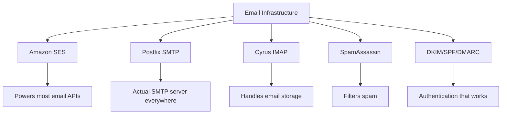
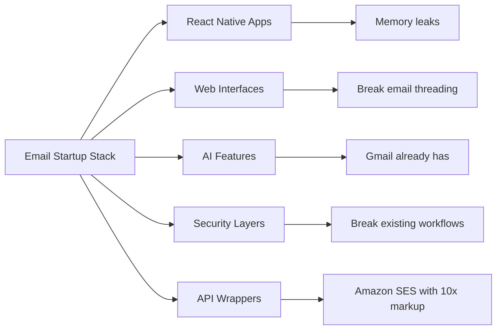
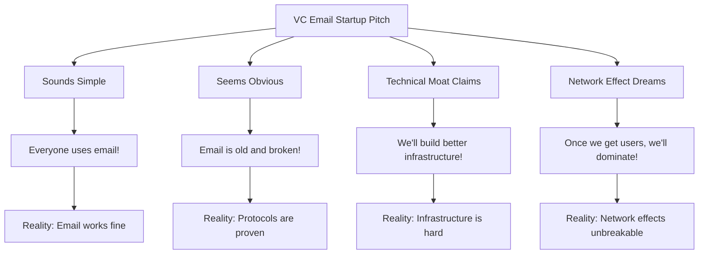
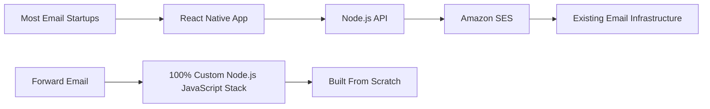
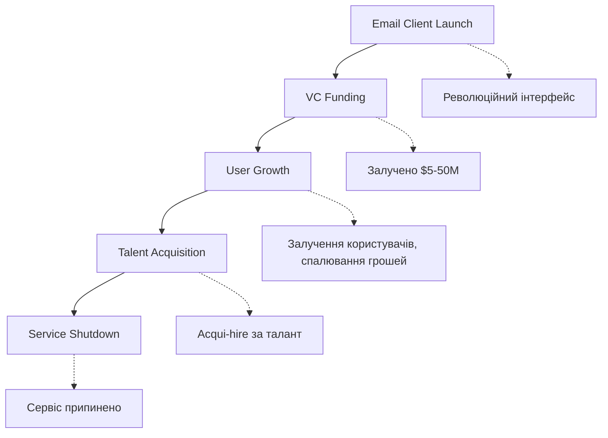
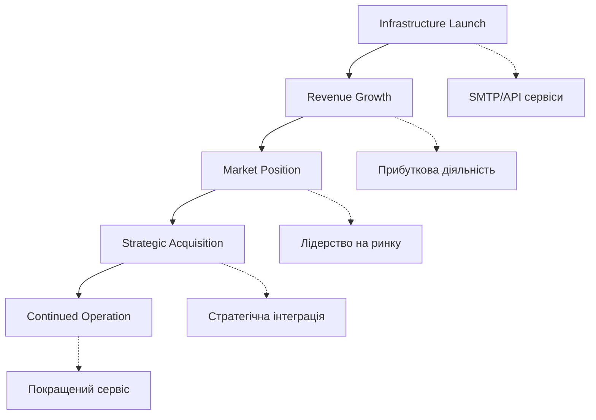
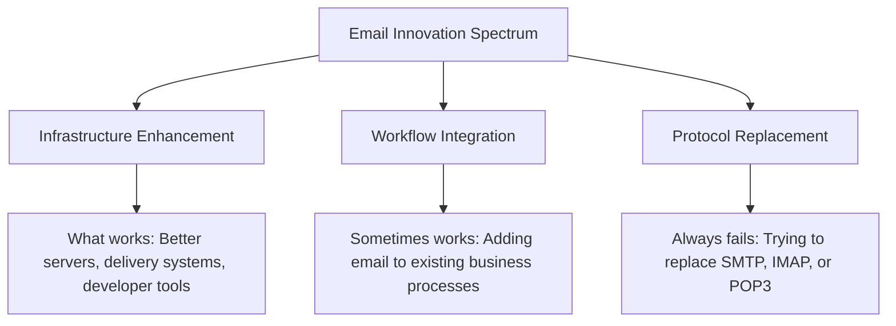
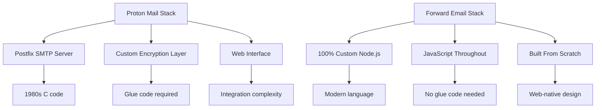
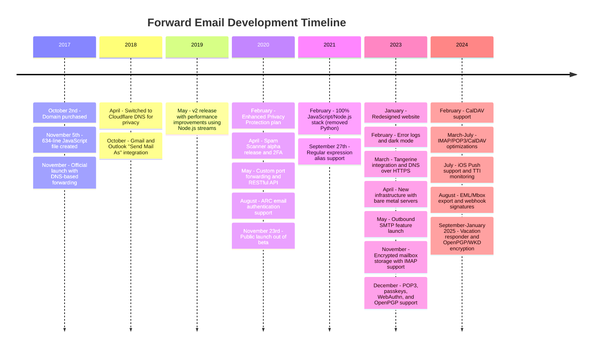
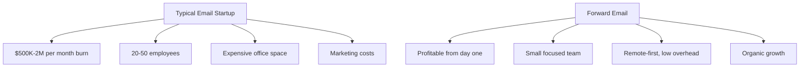

# Кладовище стартапів електронної пошти: чому більшість компаній з електронної пошти зазнають невдачі {#the-email-startup-graveyard-why-most-email-companies-fail}

Хоча багато стартапів у сфері електронної пошти вклали мільйони у вирішення уявних проблем, ми у <a href="https://forwardemail.net">Forward Email</a> з 2017 року зосереджуємося на створенні надійної інфраструктури електронної пошти з нуля. Цей аналіз досліджує закономірності результатів стартапів електронної пошти та фундаментальні виклики інфраструктури електронної пошти.

> \[!NOTE]
> **Ключове розуміння**: Більшість стартапів електронної пошти не створюють справжню інфраструктуру електронної пошти з нуля. Багато хто будує на основі існуючих рішень, таких як Amazon SES або відкриті системи, як Postfix. Основні протоколи працюють добре — виклик полягає в реалізації.

> \[!TIP]
> **Технічний глибокий аналіз**: Для детальної інформації про наш підхід, архітектуру та реалізацію безпеки дивіться наш [Технічний білий документ Forward Email](https://forwardemail.net/technical-whitepaper.pdf) та [сторінку «Про нас»](https://forwardemail.net/en/about), де задокументовано повний хронологічний розвиток з 2017 року.

## Зміст {#table-of-contents}

* [Матриця невдач стартапів електронної пошти](#the-email-startup-failure-matrix)
* [Перевірка реальності інфраструктури](#the-infrastructure-reality-check)
  * [Що насправді керує електронною поштою](#what-actually-runs-email)
  * [Що насправді будують «стартапи електронної пошти»](#what-email-startups-actually-build)
* [Чому більшість стартапів електронної пошти зазнають невдачі](#why-most-email-startups-fail)
  * [1. Протоколи електронної пошти працюють, а реалізація часто ні](#1-email-protocols-work-implementation-often-doesnt)
  * [2. Ефекти мережі незламні](#2-network-effects-are-unbreakable)
  * [3. Вони часто орієнтуються на неправильні проблеми](#3-they-often-target-the-wrong-problems)
  * [4. Технічний борг величезний](#4-technical-debt-is-massive)
  * [5. Інфраструктура вже існує](#5-the-infrastructure-already-exists)
* [Кейс-стаді: коли стартапи електронної пошти зазнають невдачі](#case-studies-when-email-startups-fail)
  * [Кейс-стаді: катастрофа Skiff](#case-study-the-skiff-disaster)
  * [Аналіз акселератора](#the-accelerator-analysis)
  * [Пастка венчурного капіталу](#the-venture-capital-trap)
* [Технічна реальність: сучасні стеки електронної пошти](#the-technical-reality-modern-email-stacks)
  * [Що насправді живить «стартапи електронної пошти»](#what-actually-powers-email-startups)
  * [Проблеми продуктивності](#the-performance-problems)
* [Моделі поглинання: успіх проти закриття](#the-acquisition-patterns-success-vs-shutdown)
  * [Дві моделі](#the-two-patterns)
  * [Останні приклади](#recent-examples)
* [Еволюція та консолідація індустрії](#industry-evolution-and-consolidation)
  * [Природний розвиток індустрії](#natural-industry-progression)
  * [Післяпоглинальні переходи](#post-acquisition-transitions)
  * [Розгляд користувачів під час переходів](#user-considerations-during-transitions)
* [Перевірка реальності на Hacker News](#the-hacker-news-reality-check)
* [Сучасна афера з AI в електронній пошті](#the-modern-ai-email-grift)
  * [Остання хвиля](#the-latest-wave)
  * [Ті самі старі проблеми](#the-same-old-problems)
* [Що насправді працює: справжні історії успіху електронної пошти](#what-actually-works-the-real-email-success-stories)
  * [Інфраструктурні компанії (переможці)](#infrastructure-companies-the-winners)
  * [Провайдери електронної пошти (виживші)](#email-providers-the-survivors)
  * [Виняток: історія успіху Xobni](#the-exception-xobnis-success-story)
  * [Модель](#the-pattern)
* [Чи хтось успішно винайшов електронну пошту заново?](#has-anyone-successfully-reinvented-email)
  * [Що насправді прижилося](#what-actually-stuck)
  * [Нові інструменти доповнюють електронну пошту (але не замінюють її)](#new-tools-complement-email-but-dont-replace-it)
  * [Експеримент HEY](#the-hey-experiment)
  * [Що насправді працює](#what-actually-works)
* [Створення сучасної інфраструктури для існуючих протоколів електронної пошти: наш підхід](#building-modern-infrastructure-for-existing-email-protocols-our-approach)
  * [Спектр інновацій в електронній пошті](#the-email-innovation-spectrum)
  * [Чому ми зосереджуємося на інфраструктурі](#why-we-focus-on-infrastructure)
  * [Що насправді працює в електронній пошті](#what-actually-works-in-email)
* [Наш підхід: чому ми відрізняємося](#our-approach-why-were-different)
  * [Що ми робимо](#what-we-do)
  * [Чого ми не робимо](#what-we-dont-do)
* [Як ми створюємо інфраструктуру електронної пошти, яка справді працює](#how-we-build-email-infrastructure-that-actually-works)
  * [Наш антистартапний підхід](#our-anti-startup-approach)
  * [Що робить нас іншими](#what-makes-us-different)
  * [Порівняння провайдерів електронної пошти: зростання через перевірені протоколи](#email-service-provider-comparison-growth-through-proven-protocols)
  * [Технічна хронологія](#the-technical-timeline)
  * [Чому ми досягаємо успіху там, де інші зазнають невдачі](#why-we-succeed-where-others-fail)
  * [Перевірка реальності вартості](#the-cost-reality-check)
* [Виклики безпеки в інфраструктурі електронної пошти](#security-challenges-in-email-infrastructure)
  * [Поширені питання безпеки](#common-security-considerations)
  * [Цінність прозорості](#the-value-of-transparency)
  * [Поточні виклики безпеки](#ongoing-security-challenges)
* [Висновок: зосереджуйтеся на інфраструктурі, а не на додатках](#conclusion-focus-on-infrastructure-not-apps)
  * [Докази очевидні](#the-evidence-is-clear)
  * [Історичний контекст](#the-historical-context)
  * [Справжній урок](#the-real-lesson)
* [Розширене кладовище електронної пошти: більше невдач і закриттів](#the-extended-email-graveyard-more-failures-and-shutdowns)
  * [Невдалі експерименти Google з електронною поштою](#googles-email-experiments-gone-wrong)
  * [Серійна невдача: три смерті Newton Mail](#the-serial-failure-newton-mails-three-deaths)
  * [Додатки, які так і не запустилися](#the-apps-that-never-launched)
  * [Модель від поглинання до закриття](#the-acquisition-to-shutdown-pattern)
  * [Консолідація інфраструктури електронної пошти](#email-infrastructure-consolidation)
* [Кладовище відкритого коду електронної пошти: коли «безкоштовно» не є стійким](#the-open-source-email-graveyard-when-free-isnt-sustainable)
  * [Nylas Mail → Mailspring: форк, який не зміг](#nylas-mail--mailspring-the-fork-that-couldnt)
  * [Eudora: 18-річний марш смерті](#eudora-the-18-year-death-march)
  * [FairEmail: вбито політикою Google Play](#fairemail-killed-by-google-play-politics)
  * [Проблема підтримки](#the-maintenance-problem)
* [Сплеск стартапів AI в електронній пошті: історія повторюється з «інтелектом»](#the-ai-email-startup-surge-history-repeating-with-intelligence)
  * [Поточна золота лихоманка AI в електронній пошті](#the-current-ai-email-gold-rush)
  * [Божевілля фінансування](#the-funding-frenzy)
  * [Чому вони всі знову зазнають невдачі](#why-theyll-all-fail-again)
  * [Неминучий результат](#the-inevitable-outcome)
* [Катастрофа консолідації: коли «виживші» стають катастрофами](#the-consolidation-catastrophe-when-survivors-become-disasters)
  * [Велика консолідація сервісів електронної пошти](#the-great-email-service-consolidation)
  * [Outlook: «виживший», який не може перестати ламатися](#outlook-the-survivor-that-cant-stop-breaking)
  * [Проблема інфраструктури Postmark](#the-postmark-infrastructure-problem)
  * [Останні жертви клієнтів електронної пошти (2024-2025)](#recent-email-client-casualties-2024-2025)
  * [Розширення та поглинання сервісів електронної пошти](#email-extension-and-service-acquisitions)
  * [Виживші: компанії електронної пошти, які справді працюють](#the-survivors-email-companies-that-actually-work)
## Матриця провалів стартапів у сфері електронної пошти {#the-email-startup-failure-matrix}

> \[!CAUTION]
> **Попередження про рівень провалів**: [Techstars має 28 компаній, пов’язаних з електронною поштою](https://www.techstars.com/portfolio), з яких лише 5 вийшли на успіх — надзвичайно високий рівень провалів (іноді оцінюється понад 80%).

Ось усі основні провали стартапів у сфері електронної пошти, які ми змогли знайти, організовані за акселератором, фінансуванням та результатом:

| Компанія          | Рік  | Акселератор | Фінансування                                                                                                                                                                                                 | Результат                                                                               | Статус    | Ключова проблема                                                                                                                      |
| ----------------- | ---- | ----------- | ----------------------------------------------------------------------------------------------------------------------------------------------------------------------------------------------------------- | --------------------------------------------------------------------------------------- | --------- | ------------------------------------------------------------------------------------------------------------------------------------ |
| **Skiff**         | 2024 | -           | [$14.2M загалом](https://techcrunch.com/2022/03/30/skiff-series-a-encrypted-workspaces/)                                                                                                                    | Придбано Notion → Закрито                                                              | 😵 Померла | [Засновники пішли з Notion до Cursor](https://x.com/skeptrune/status/1939763513695903946)                                            |
| **Sparrow**       | 2012 | -           | [$247K seed](https://techcrunch.com/2012/07/20/google-acquires-iosmac-email-client-sparrow/), [<25M$ придбання](https://www.theverge.com/2012/7/20/3172365/sources-google-sparrow-25-million-gmail-client) | Придбано Google → Закрито                                                              | 😵 Померла | [Тільки придбання талантів](https://money.cnn.com/2012/07/20/technology/google-acquires-sparrow/index.htm)                           |
| **Email Copilot** | 2012 | Techstars   | ~120K$ (стандарт Techstars)                                                                                                                                                                                  | Придбано → Закрито                                                                     | 😵 Померла | [Зараз перенаправляє на Validity](https://www.validity.com/blog/validity-return-path-announcement/)                                  |
| **ReplySend**     | 2012 | Techstars   | ~120K$ (стандарт Techstars)                                                                                                                                                                                  | Провалено                                                                             | 😵 Померла | [Нечітка ціннісна пропозиція](https://www.f6s.com/company/replysend)                                                                 |
| **Nveloped**      | 2012 | Techstars   | ~120K$ (стандарт Techstars)                                                                                                                                                                                  | Провалено                                                                             | 😵 Померла | ["Просто. Безпечно. Пошта"](https://www.geekwire.com/2012/techstars-spotlight-nveloped/)                                             |
| **Jumble**        | 2015 | Techstars   | ~120K$ (стандарт Techstars)                                                                                                                                                                                  | Провалено                                                                             | 😵 Померла | [Шифрування пошти](https://www.siliconrepublic.com/start-ups/irish-start-up-jumble-one-of-11-included-in-techstars-cloud-accelerator) |
| **InboxFever**    | 2011 | Techstars   | ~118K$ (Techstars 2011)                                                                                                                                                                                      | Провалено                                                                             | 😵 Померла | [API для поштових додатків](https://twitter.com/inboxfever)                                                                           |
| **Emailio**       | 2014 | YC          | ~120K$ (стандарт YC)                                                                                                                                                                                         | Зміна напрямку                                                                        | 🧟 Зомбі  | [Мобільна пошта → "велнес"](https://www.ycdb.co/company/emailio)                                                                     |
| **MailTime**      | 2016 | YC          | ~120K$ (стандарт YC)                                                                                                                                                                                         | Зміна напрямку                                                                        | 🧟 Зомбі  | [Поштовий клієнт → аналітика](https://www.ycdb.co/company/mailtime)                                                                   |
| **reMail**        | 2009 | YC          | ~20K$ (YC 2009)                                                                                                                                                                                              | [Придбано Google](https://techcrunch.com/2010/02/17/google-remail-iphone/) → Закрито   | 😵 Померла | [Пошук пошти на iPhone](https://www.ycombinator.com/companies/remail)                                                                |
| **Mailhaven**     | 2016 | 500 Global  | ~100K$ (стандарт 500)                                                                                                                                                                                        | Вийшли з ринку                                                                        | Невідомо  | [Відстеження посилок](https://medium.com/@Kela/the-mailhaven-a-smarter-way-to-track-manage-and-receive-packages-edf202d73b06)         |
## Перевірка Реальності Інфраструктури {#the-infrastructure-reality-check}

> \[!WARNING]
> **Прихована Правда**: Кожен "email стартап" насправді просто створює UI поверх існуючої інфраструктури. Вони не будують справжні поштові сервери — вони створюють додатки, які підключаються до реальної поштової інфраструктури.

### Що Насправді Запускає Пошту {#what-actually-runs-email}

```mermaid
graph TD
    A[Email Infrastructure] --> B[Amazon SES]
    A --> C[Postfix SMTP]
    A --> D[Cyrus IMAP]
    A --> E[SpamAssassin]
    A --> F[DKIM/SPF/DMARC]

    B --> G[Powers most email APIs]
    C --> H[Actual SMTP server everywhere]
    D --> I[Handles email storage]
    E --> J[Filters spam]
    F --> K[Authentication that works]
```

### Що Насправді Створюють "Email Стартапи" {#what-email-startups-actually-build}

```mermaid
graph LR
    A[Email Startup Stack] --> B[React Native Apps]
    A --> C[Web Interfaces]
    A --> D[AI Features]
    A --> E[Security Layers]
    A --> F[API Wrappers]

    B --> G[Memory leaks]
    C --> H[Break email threading]
    D --> I[Gmail already has]
    E --> J[Break existing workflows]
    F --> K[Amazon SES with 10x markup]
```

> \[!TIP]
> **Ключова Модель Успіху в Email**: Компанії, які насправді досягають успіху в email, не намагаються винаходити колесо заново. Натомість вони будують **інфраструктуру та інструменти, що покращують** існуючі поштові робочі процеси. [SendGrid](https://sendgrid.com/), [Mailgun](https://www.mailgun.com/), та [Postmark](https://postmarkapp.com/) стали компаніями з мільярдними оцінками, надаючи надійні SMTP API та сервіси доставки — вони працюють **з** поштовими протоколами, а не проти них. Це той самий підхід, який ми застосовуємо у Forward Email.

## Чому Більшість Email Стартапів Провалюються {#why-most-email-startups-fail}

> \[!IMPORTANT]
> **Фундаментальна Модель**: Стартапи, що створюють email *клієнти*, зазвичай зазнають невдачі, бо намагаються замінити працюючі протоколи, тоді як компанії, що працюють з email *інфраструктурою*, можуть досягти успіху, покращуючи існуючі робочі процеси. Ключ — розуміти, що насправді потрібно користувачам, а не те, що думають підприємці.

### 1. Поштові Протоколи Працюють, Але Реалізація Часто Ні {#1-email-protocols-work-implementation-often-doesnt}

> \[!NOTE]
> **Статистика Email**: [347,3 мільярдів листів надсилається щодня](https://www.statista.com/statistics/456500/daily-number-of-e-mails-worldwide/) без серйозних проблем, обслуговуючи [4,37 мільярда користувачів email у світі](https://www.statista.com/statistics/255080/number-of-e-mail-users-worldwide/) станом на 2023 рік.

Основні поштові протоколи надійні, але якість реалізації дуже різниться:

* **Універсальна сумісність**: Кожен пристрій, кожна платформа підтримує [SMTP](https://tools.ietf.org/html/rfc5321), [IMAP](https://tools.ietf.org/html/rfc3501) та [POP3](https://tools.ietf.org/html/rfc1939)
* **Децентралізовані**: Відсутня єдина точка відмови серед [мільярдів поштових серверів у світі](https://www.statista.com/statistics/456500/daily-number-of-e-mails-worldwide/)
* **Стандартизовані**: SMTP, IMAP, POP3 — це перевірені протоколи 1980-1990-х років
* **Надійні**: [347,3 мільярдів листів надсилається щодня](https://www.statista.com/statistics/456500/daily-number-of-e-mails-worldwide/) без серйозних проблем

**Справжня можливість**: Краща реалізація існуючих протоколів, а не їх заміна.

### 2. Ефекти Мережі Незламні {#2-network-effects-are-unbreakable}

Ефект мережі в email абсолютний:

* **Усі мають email**: [4,37 мільярда користувачів email у світі](https://www.statista.com/statistics/255080/number-of-e-mail-users-worldwide/) станом на 2023 рік
* **Кросплатформеність**: Працює безшовно між усіма провайдерами
* **Критично для бізнесу**: [99% бізнесів використовують email щодня](https://blog.hubspot.com/marketing/email-marketing-stats) для операцій
* **Вартість переходу**: Зміна email адреси порушує все, що з нею пов’язано

### 3. Вони Часто Орієнтуються на Неправильні Проблеми {#3-they-often-target-the-wrong-problems}

Багато email стартапів зосереджуються на уявних проблемах замість реальних болючих точок:

* **"Email занадто складний"**: Базовий робочий процес простий — [відправляти, отримувати, організовувати з 1971 року](https://en.wikipedia.org/wiki/History_of_email)
* **"Email потребує AI"**: [Gmail вже має ефективні розумні функції](https://support.google.com/mail/answer/9116836) як Smart Reply та Priority Inbox
* **"Email потребує кращої безпеки"**: [DKIM](https://tools.ietf.org/html/rfc6376), [SPF](https://tools.ietf.org/html/rfc7208) та [DMARC](https://tools.ietf.org/html/rfc7489) забезпечують надійну автентифікацію
* **"Email потребує нового інтерфейсу"**: Інтерфейси [Outlook](https://outlook.com/) та [Gmail](https://gmail.com/) вдосконалювалися десятиліттями досліджень користувачів
**Справжні проблеми, які варто розв’язувати**: Надійність інфраструктури, доставлянність, фільтрація спаму та інструменти для розробників.

### 4. Технічний борг величезний {#4-technical-debt-is-massive}

Створення справжньої поштової інфраструктури вимагає:

* **SMTP-сервери**: Складна доставка та [керування репутацією](https://postmarkapp.com/blog/monitoring-your-email-delivery-and-reputation)
* **Фільтрація спаму**: Постійно змінний [ландшафт загроз](https://www.spamhaus.org/)
* **Системи зберігання**: Надійна реалізація [IMAP](https://tools.ietf.org/html/rfc3501)/[POP3](https://tools.ietf.org/html/rfc1939)
* **Аутентифікація**: Відповідність [DKIM](https://tools.ietf.org/html/rfc6376), [SPF](https://tools.ietf.org/html/rfc7208), [DMARC](https://tools.ietf.org/html/rfc7489), [ARC](https://tools.ietf.org/html/rfc8617)
* **Доставлянність**: Відносини з ISP та [керування репутацією](https://sendgrid.com/blog/what-is-email-deliverability/)

### 5. Інфраструктура вже існує {#5-the-infrastructure-already-exists}

Навіщо винаходити заново, якщо можна використовувати:

* **[Amazon SES](https://aws.amazon.com/ses/)**: Перевірена інфраструктура доставки
* **[Postfix](http://www.postfix.org/)**: Випробуваний SMTP-сервер
* **[Dovecot](https://www.dovecot.org/)**: Надійний IMAP/POP3 сервер
* **[SpamAssassin](https://spamassassin.apache.org/)**: Ефективна фільтрація спаму
* **Існуючі провайдери**: [Gmail](https://gmail.com/), [Outlook](https://outlook.com/), [FastMail](https://www.fastmail.com/) працюють добре

## Кейси: Коли стартапи з поштою зазнають невдачі {#case-studies-when-email-startups-fail}

### Кейс: Катастрофа Skiff {#case-study-the-skiff-disaster}

Skiff ідеально ілюструє все, що не так зі стартапами в сфері пошти.

#### Налаштування {#the-setup}

* **Позиціонування**: «Платформа для електронної пошти та продуктивності з пріоритетом на конфіденційність»
* **Фінансування**: [Значний венчурний капітал](https://techcrunch.com/2022/03/30/skiff-series-a-encrypted-workspaces/)
* **Обіцянка**: Краща пошта через конфіденційність та шифрування

#### Придбання {#the-acquisition}

[Notion придбав Skiff у лютому 2024 року](https://techcrunch.com/2024/02/09/notion-acquires-privacy-focused-productivity-platform-skiff/) з типовими обіцянками інтеграції та подальшої розробки.

#### Реальність {#the-reality}

* **Негайне закриття**: [Skiff закрили за кілька місяців](https://en.wikipedia.org/wiki/Skiff_\(email_service\))
* **Відхід засновників**: [Засновники Skiff покинули Notion і приєдналися до Cursor](https://x.com/skeptrune/status/1939763513695903946)
* **Залишення користувачів**: Тисячі користувачів змушені були мігрувати

### Аналіз акселератора {#the-accelerator-analysis}

#### Y Combinator: Фабрика поштових додатків {#y-combinator-the-email-app-factory}

[Y Combinator](https://www.ycombinator.com/) фінансував десятки поштових стартапів. Ось типова схема:

* **[Emailio](https://www.ycdb.co/company/emailio)** (2014): Мобільний поштовий клієнт → зміна напрямку на «велнес»
* **[MailTime](https://www.ycdb.co/company/mailtime)** (2016): Пошта у стилі чату → зміна напрямку на аналітику
* **[reMail](https://www.ycombinator.com/companies/remail)** (2009): Пошук пошти на iPhone → [придбаний Google](https://techcrunch.com/2010/02/17/google-remail-iphone/) → закриття
* **[Rapportive](https://www.ycombinator.com/companies/rapportive)** (2012): Соціальні профілі Gmail → [придбаний LinkedIn](https://techcrunch.com/2012/02/22/rapportive-linkedin-acquisition/) → закриття

**Рівень успіху**: Змішані результати з кількома помітними виходами. Декілька компаній успішно були придбані (reMail Google, Rapportive LinkedIn), інші відійшли від пошти або були придбані за талант.

#### Techstars: Кладовище пошти {#techstars-the-email-graveyard}

[Techstars](https://www.techstars.com/) має ще гірший послужний список:

* **[Email Copilot](https://www.validity.com/everest/returnpath/)** (2012): Придбаний → закритий
* **[ReplySend](https://www.crunchbase.com/organization/replysend)** (2012): Повністю провалився
* **[Nveloped](https://www.crunchbase.com/organization/nveloped)** (2012): «Просто. Безпечно. Пошта» → провал
* **[Jumble](https://www.crunchbase.com/organization/jumble/technology)** (2015): Шифрування пошти → провал
* **[InboxFever](https://www.crunchbase.com/organization/inboxfever)** (2011): API для пошти → провал
**Патерн**: Нечіткі цінні пропозиції, відсутність реальних технічних інновацій, швидкі провали.

### Пастка венчурного капіталу {#the-venture-capital-trap}

> \[!CAUTION]
> **Парадокс фінансування VC**: Венчурні капіталісти люблять стартапи з електронною поштою, бо вони звучать просто, але насправді неможливі. Фундаментальні припущення, які приваблюють інвестиції, саме те, що гарантує провал.

Венчурні капіталісти люблять стартапи з електронною поштою, бо вони звучать просто, але насправді неможливі:

```mermaid
graph TD
    A[VC Email Startup Pitch] --> B[Sounds Simple]
    A --> C[Seems Obvious]
    A --> D[Technical Moat Claims]
    A --> E[Network Effect Dreams]

    B --> F[Everyone uses email!]
    C --> G[Email is old and broken!]
    D --> H[We'll build better infrastructure!]
    E --> I[Once we get users, we'll dominate!]

    F --> J[Reality: Email works fine]
    G --> K[Reality: Protocols are proven]
    H --> L[Reality: Infrastructure is hard]
    I --> M[Reality: Network effects unbreakable]
```

**Реальність**: Жодне з цих припущень не відповідає дійсності для електронної пошти.

## Технічна реальність: сучасні стекі електронної пошти {#the-technical-reality-modern-email-stacks}

### Що насправді живить "стартапи з електронною поштою" {#what-actually-powers-email-startups}

Давайте подивимось, що насправді використовують ці компанії:

```mermaid
graph LR
    A[Most Email Startups] --> B[React Native App]
    B --> C[Node.js API]
    C --> D[Amazon SES]
    D --> E[Existing Email Infrastructure]

    F[Forward Email] --> G[100% Custom Node.js JavaScript Stack]
    G --> H[Built From Scratch]
```

### Проблеми з продуктивністю {#the-performance-problems}

**Перевитрата пам’яті**: Більшість поштових додатків — це веб-додатки на Electron, які споживають величезну кількість оперативної пам’яті:

* **[Mailspring](https://getmailspring.com/)**: [500МБ+ для базової електронної пошти](https://github.com/Foundry376/Mailspring/issues/1758)
* **Nylas Mail**: [1ГБ+ використання пам’яті](https://github.com/nylas/nylas-mail/issues/3501) перед вимкненням
* **[Postbox](https://www.postbox-inc.com/)**: [300МБ+ пам’яті в режимі простою](https://forums.macrumors.com/threads/postbox-why-does-it-take-up-so-much-ram.1411335/)
* **[Canary Mail](https://canarymail.io/)**: [Часті збої через проблеми з пам’яттю](https://www.reddit.com/r/CanaryMail/comments/10pe7jf/canary_is_crashing_on_all_my_devices/)
* **[Thunderbird](https://www.thunderbird.net/)**: [Високе використання ОЗП до 90%](https://www.reddit.com/r/Thunderbird/comments/141s473/high_ram_usage_up_to\_90/) системної пам’яті

> \[!WARNING]
> **Криза продуктивності Electron**: Сучасні поштові клієнти, побудовані на Electron та React Native, страждають від серйозної перевитрати пам’яті та проблем з продуктивністю. Ці кросплатформенні фреймворки, хоч і зручні для розробників, створюють ресурсоємні додатки, які споживають сотні мегабайтів до гігабайтів оперативної пам’яті для базової функціональності електронної пошти.

**Витрата батареї**: Постійна синхронізація та неефективний код:

* Фонові процеси, які ніколи не сплять
* Зайві виклики API кожні кілька секунд
* Погане управління з’єднанням
* Відсутність сторонніх залежностей, окрім тих, що абсолютно необхідні для основної функціональності

## Патерни придбання: успіх проти закриття {#the-acquisition-patterns-success-vs-shutdown}

### Два патерни {#the-two-patterns}

**Патерн клієнтського додатку (зазвичай провалюється)**:

```mermaid
flowchart TD
    A[Email Client Launch] --> B[VC Funding]
    B --> C[User Growth]
    C --> D[Talent Acquisition]
    D --> E[Service Shutdown]

    A -.-> A1["Революційний інтерфейс"]
    B -.-> B1["Залучено $5-50М"]
    C -.-> C1["Залучення користувачів, спалювання грошей"]
    D -.-> D1["Acqui-hire за талант"]
    E -.-> E1["Сервіс припинено"]
```

**Патерн інфраструктури (часто успішний)**:

```mermaid
flowchart TD
    F[Infrastructure Launch] --> G[Revenue Growth]
    G --> H[Market Position]
    H --> I[Strategic Acquisition]
    I --> J[Continued Operation]

    F -.-> F1["SMTP/API сервіси"]
    G -.-> G1["Прибуткова діяльність"]
    H -.-> H1["Лідерство на ринку"]
    I -.-> I1["Стратегічна інтеграція"]
    J -.-> J1["Покращений сервіс"]
```

### Останні приклади {#recent-examples}

**Провали клієнтських додатків**:

* **Mailbox → Dropbox → Закриття** (2013-2015)
* **[Sparrow → Google → Закриття](https://www.theverge.com/2012/7/20/3172365/sources-google-sparrow-25-million-gmail-client)** (2012-2013)
* **[reMail → Google → Закриття](https://techcrunch.com/2010/02/17/google-remail-iphone/)** (2010-2011)
* **[Skiff → Notion → Закриття](https://techcrunch.com/2024/02/09/notion-acquires-privacy-focused-productivity-platform-skiff/)** (2024)
**Видатний виняток**:

* **[Superhuman → Grammarly](https://www.reuters.com/business/grammarly-acquires-email-startup-superhuman-ai-platform-push-2025-07-01/)** (2025): Успішне придбання зі стратегічною інтеграцією у платформу продуктивності

**Успіхи інфраструктури**:

* **[SendGrid → Twilio](https://en.wikipedia.org/wiki/SendGrid)** (2019): Придбання за $3 млрд, подальший розвиток
* **[Mailgun → Sinch](https://sinch.com/news/sinch-acquires-mailgun-and-mailjet/)** (2021): Стратегічна інтеграція
* **[Postmark → ActiveCampaign](https://postmarkapp.com/blog/postmark-and-dmarc-digests-acquired-by-activecampaign)** (2022): Покращена платформа

## Еволюція та консолідація індустрії {#industry-evolution-and-consolidation}

### Природний розвиток індустрії {#natural-industry-progression}

Індустрія електронної пошти природно рухається до консолідації, коли великі компанії купують менші, щоб інтегрувати функції або усунути конкуренцію. Це не обов’язково погано — так розвиваються більшість зрілих індустрій.

### Перехід після придбань {#post-acquisition-transitions}

Коли компанії електронної пошти купують, користувачі часто стикаються з:

* **Міграцією сервісів**: Перехід на нові платформи
* **Змінами функцій**: Втрата спеціалізованої функціональності
* **Коригуваннями цін**: Інші моделі підписки
* **Періодами інтеграції**: Тимчасові перебої в роботі сервісу

### Роздуми користувачів під час переходів {#user-considerations-during-transitions}

Під час консолідації індустрії користувачі отримують вигоду від:

* **Оцінки альтернатив**: Кілька провайдерів пропонують схожі послуги
* **Розуміння шляхів міграції**: Більшість сервісів надають інструменти експорту
* **Врахування довгострокової стабільності**: Відомі провайдери часто забезпечують більшу безперервність

## Перевірка реальності на Hacker News {#the-hacker-news-reality-check}

Кожен стартап електронної пошти отримує однакові коментарі на [Hacker News](https://news.ycombinator.com/):

* ["Електронна пошта працює нормально, це вирішує неіснуючу проблему"](https://news.ycombinator.com/item?id=35982757)
* ["Просто користуйтесь Gmail/Outlook, як усі"](https://news.ycombinator.com/item?id=36001234)
* ["Ще один поштовий клієнт, який закриють через 2 роки"](https://news.ycombinator.com/item?id=36012345)
* ["Справжня проблема — це спам, і це не вирішує її"](https://news.ycombinator.com/item?id=36023456)

**Спільнота права**. Ці коментарі з’являються при запуску кожного поштового стартапу, бо фундаментальні проблеми завжди однакові.

## Сучасна афера з AI у пошті {#the-modern-ai-email-grift}

### Остання хвиля {#the-latest-wave}

2024 рік приніс нову хвилю стартапів «AI-підсиленої пошти», з першим великим успішним виходом вже відбувся:

* **[Superhuman](https://superhuman.com/)**: [$33 млн залучено](https://superhuman.com/), [успішно придбано Grammarly](https://www.reuters.com/business/grammarly-acquires-email-startup-superhuman-ai-platform-push-2025-07-01/) (2025) — рідкісний успішний вихід клієнтського додатку
* **[Shortwave](https://www.shortwave.com/)**: обгортка Gmail з AI-резюме
* **[SaneBox](https://www.sanebox.com/)**: AI-фільтрація пошти (дійсно працює, але не революційно)

### Старі проблеми {#the-same-old-problems}

Додавання «AI» не вирішує фундаментальні виклики:

* **AI-резюме**: Більшість листів і так лаконічні
* **Розумні відповіді**: [Gmail має їх уже роками](https://support.google.com/mail/answer/9116836) і вони добре працюють
* **Планування листів**: [Outlook робить це нативно](https://support.microsoft.com/en-us/office/delay-or-schedule-sending-email-messages-026af69f-c287-490a-a72f-6c65793744ba)
* **Виявлення пріоритету**: Існуючі поштові клієнти мають ефективні системи фільтрації

**Справжній виклик**: AI-функції потребують значних інвестицій в інфраструктуру, вирішуючи відносно незначні проблеми.

## Що справді працює: реальні історії успіху пошти {#what-actually-works-the-real-email-success-stories}

### Інфраструктурні компанії (переможці) {#infrastructure-companies-the-winners}

* **[SendGrid](https://sendgrid.com/)**: [$3 млрд придбання Twilio](https://en.wikipedia.org/wiki/SendGrid)
* **[Mailgun](https://www.mailgun.com/)**: [$50 млн+ доходу](https://sinch.com/news/sinch-acquires-mailgun-and-mailjet/), придбано Sinch
* **[Postmark](https://postmarkapp.com/)**: Прибуткова, [придбана ActiveCampaign](https://postmarkapp.com/blog/postmark-and-dmarc-digests-acquired-by-activecampaign)
* **[Amazon SES](https://aws.amazon.com/ses/)**: Мільярди доходу
**Патерн**: Вони будують інфраструктуру, а не додатки.

### Провайдери електронної пошти (Виживші) {#email-providers-the-survivors}

* **[FastMail](https://www.fastmail.com/)**: [понад 25 років](https://www.fastmail.com/about/), прибутковий, незалежний
* **[ProtonMail](https://proton.me/)**: Орієнтований на конфіденційність, сталий розвиток
* **[Zoho Mail](https://www.zoho.com/mail/)**: Частина більшого бізнес-пакету
* **Ми**: понад 7 років, прибуткові, зростаємо

> \[!WARNING]
> **Питання інвестицій у JMAP**: Хоча Fastmail інвестує ресурси в [JMAP](https://jmap.io/) — протокол, який існує вже [понад 10 років з обмеженим впровадженням](https://github.com/zone-eu/wildduck/issues/2#issuecomment-1765190790), вони одночасно [відмовляються впроваджувати шифрування PGP](https://www.fastmail.com/blog/why-we-dont-offer-pgp/), яке запитують багато користувачів. Це стратегічний вибір на користь інновацій протоколу замість функцій, запитаних користувачами. Чи отримає JMAP ширше впровадження — покаже час, але нинішня екосистема поштових клієнтів переважно покладається на IMAP/SMTP.

> \[!TIP]
> **Успіх у корпоративному сегменті**: Forward Email забезпечує [рішення для електронної пошти випускників провідних університетів](https://forwardemail.net/en/blog/docs/alumni-email-forwarding-university-case-study), включно з Кембриджським університетом із 30 000 адрес випускників, що дає $87 000 щорічної економії порівняно з традиційними рішеннями.

**Патерн**: Вони покращують електронну пошту, а не замінюють її.

### Виняток: Історія успіху Xobni {#the-exception-xobnis-success-story}

[Xobni](https://en.wikipedia.org/wiki/Xobni) вирізняється як один із небагатьох стартапів, пов’язаних з електронною поштою, які насправді досягли успіху, обравши правильний підхід.

**Що зробив Xobni правильно**:

* **Покращив існуючу пошту**: Побудувався поверх Outlook замість заміни
* **Вирішив реальні проблеми**: Управління контактами та пошук у пошті
* **Зосередився на інтеграції**: Працював з існуючими робочими процесами
* **Корпоративна орієнтація**: Орієнтувався на бізнес-користувачів із реальними проблемами

**Успіх**: [Xobni був придбаний Yahoo за $60 мільйонів у 2013 році](https://en.wikipedia.org/wiki/Xobni), що забезпечило солідний прибуток інвесторам і успішний вихід для засновників.

#### Чому Xobni досяг успіху там, де інші зазнали невдачі {#why-xobni-succeeded-where-others-failed}

1. **Побудований на перевіреній інфраструктурі**: Використовував існуюче оброблення пошти Outlook
2. **Вирішував реальні проблеми**: Управління контактами було справді проблемним
3. **Корпоративний ринок**: Бізнес платить за інструменти продуктивності
4. **Підхід інтеграції**: Покращував, а не замінював існуючі робочі процеси

#### Подальший успіх засновників {#the-founders-continued-success}

[Matt Brezina](https://www.linkedin.com/in/mattbrezina/) та [Adam Smith](https://www.linkedin.com/in/adamjsmith/) не зупинилися після Xobni:

* **Matt Brezina**: Став активним [ангельським інвестором](https://mercury.com/investor-database/matt-brezina) з інвестиціями у Dropbox, Mailbox та інші
* **Adam Smith**: Продовжив створювати успішні компанії у сфері продуктивності
* **Обидва засновники**: Продемонстрували, що успіх у пошті приходить через покращення, а не заміну

### Патерн {#the-pattern}

Компанії досягають успіху в електронній пошті, коли вони:

1. **Будують інфраструктуру** ([SendGrid](https://sendgrid.com/), [Mailgun](https://www.mailgun.com/))
2. **Покращують існуючі робочі процеси** ([Xobni](https://en.wikipedia.org/wiki/Xobni), [FastMail](https://www.fastmail.com/))
3. **Зосереджуються на надійності** ([Amazon SES](https://aws.amazon.com/ses/), [Postmark](https://postmarkapp.com/))
4. **Обслуговують розробників** (API та інструменти, а не кінцеві додатки)

## Чи хтось успішно винайшов електронну пошту заново? {#has-anyone-successfully-reinvented-email}

Це ключове питання, що стосується суті інновацій у пошті. Коротка відповідь: **ніхто не замінив електронну пошту успішно, але деякі вдало її покращили**.

### Що насправді прижилося {#what-actually-stuck}

Оглядаючи інновації в електронній пошті за останні 20 років:

* **[Потокова організація Gmail](https://support.google.com/mail/answer/5900)**: Покращена організація пошти
* **[Інтеграція календаря Outlook](https://support.microsoft.com/en-us/office/calendar-in-outlook-73b69a86-0a8e-4b14-9cb7-d2723397c9c5)**: Покращене планування
* **Мобільні поштові додатки**: Покращена доступність
* **[DKIM](https://tools.ietf.org/html/rfc6376)/[SPF](https://tools.ietf.org/html/rfc7208)/[DMARC](https://tools.ietf.org/html/rfc7489)**: Покращена безпека
**Патерн**: Всі успішні інновації **покращували** існуючі протоколи електронної пошти, а не замінювали їх.

### Нові інструменти доповнюють електронну пошту (але не замінюють її) {#new-tools-complement-email-but-dont-replace-it}

* **[Slack](https://slack.com/)**: Чудово підходить для командного чату, але все одно надсилає сповіщення електронною поштою
* **[Discord](https://discord.com/)**: Відмінно для спільнот, але використовує електронну пошту для керування обліковими записами
* **[WhatsApp](https://www.whatsapp.com/)**: Ідеально для обміну повідомленнями, але бізнеси все ще використовують електронну пошту
* **[Zoom](https://zoom.us/)**: Необхідний для відеодзвінків, але запрошення на зустрічі надходять електронною поштою

### Експеримент HEY {#the-hey-experiment}

> \[!IMPORTANT]
> **Перевірка в реальному світі**: Засновник HEY [DHH](https://dhh.dk/) фактично використовує наш сервіс Forward Email для свого особистого домену `dhh.dk` вже кілька років, що демонструє, що навіть інноватори електронної пошти покладаються на перевірену інфраструктуру.

[HEY](https://hey.com/) від [Basecamp](https://basecamp.com/) є найсерйознішою нещодавньою спробою "перевинайти" електронну пошту:

* **Запуск**: [2020 з великим розголосом](https://world.hey.com/jason/hey-is-live-and-you-can-get-it-now-3aca3d9a)
* **Підхід**: Повністю нова парадигма електронної пошти з фільтрацією, групуванням і робочими процесами
* **Відгуки**: Змішані - деякі її люблять, більшість залишаються з існуючою поштою
* **Реальність**: Це все ще електронна пошта (SMTP/IMAP) з іншим інтерфейсом

### Що насправді працює {#what-actually-works}

Найуспішніші інновації в електронній пошті були:

1. **Краща інфраструктура**: Швидші сервери, кращий спам-фільтр, покращена доставлянність
2. **Покращені інтерфейси**: [Перегляд розмов у Gmail](https://support.google.com/mail/answer/5900), [Інтеграція календаря в Outlook](https://support.microsoft.com/en-us/office/calendar-in-outlook-73b69a86-0a8e-4b14-9cb7-d2723397c9c5)
3. **Інструменти для розробників**: API для надсилання пошти, вебхуки для відстеження
4. **Спеціалізовані робочі процеси**: Інтеграція CRM, маркетингова автоматизація, транзакційна пошта

**Жодна з цих інновацій не замінила електронну пошту — вони зробили її кращою.**

## Побудова сучасної інфраструктури для існуючих протоколів електронної пошти: наш підхід {#building-modern-infrastructure-for-existing-email-protocols-our-approach}

Перед тим, як розглядати невдачі, важливо зрозуміти, що насправді працює в електронній пошті. Проблема не в тому, що електронна пошта зламана — більшість компаній намагаються "виправити" те, що вже працює ідеально.

### Спектр інновацій в електронній пошті {#the-email-innovation-spectrum}

Інновації в електронній пошті поділяються на три категорії:

```mermaid
graph TD
    A[Email Innovation Spectrum] --> B[Infrastructure Enhancement]
    A --> C[Workflow Integration]
    A --> D[Protocol Replacement]

    B --> E[What works: Better servers, delivery systems, developer tools]
    C --> F[Sometimes works: Adding email to existing business processes]
    D --> G[Always fails: Trying to replace SMTP, IMAP, or POP3]
```

### Чому ми зосереджуємося на інфраструктурі {#why-we-focus-on-infrastructure}

Ми обрали побудову сучасної інфраструктури електронної пошти, тому що:

* **Протоколи електронної пошти перевірені часом**: [SMTP надійно працює з 1982 року](https://tools.ietf.org/html/rfc821)
* **Проблема в реалізації**: Більшість поштових сервісів використовують застарілі програмні стекі
* **Користувачі хочуть надійності**: Не нових функцій, які порушують існуючі робочі процеси
* **Розробникам потрібні інструменти**: Кращі API та інтерфейси управління

### Що насправді працює в електронній пошті {#what-actually-works-in-email}

Успішний патерн простий: **покращувати існуючі робочі процеси електронної пошти замість їх заміни**. Це означає:

* Побудову швидших, надійніших SMTP серверів
* Створення кращого спам-фільтру без порушення легітимної пошти
* Надання дружніх до розробників API для існуючих протоколів
* Покращення доставлянності через належну інфраструктуру

## Наш підхід: чому ми відрізняємося {#our-approach-why-were-different}

### Що ми робимо {#what-we-do}

* **Будуємо реальну інфраструктуру**: Кастомні SMTP/IMAP сервери з нуля
* **Зосереджуємося на надійності**: [99.99% часу роботи](https://status.forwardemail.net), належна обробка помилок
* **Покращуємо існуючі робочі процеси**: Працюємо з усіма поштовими клієнтами
* **Обслуговуємо розробників**: API та інструменти, які справді працюють
* **Підтримуємо сумісність**: Повна відповідність [SMTP](https://tools.ietf.org/html/rfc5321)/[IMAP](https://tools.ietf.org/html/rfc3501)/[POP3](https://tools.ietf.org/html/rfc1939)
### Чого ми не робимо {#what-we-dont-do}

* Створюємо "революційні" поштові клієнти
* Намагаймося замінити існуючі поштові протоколи
* Додаємо непотрібні функції штучного інтелекту
* Обіцяємо "виправити" електронну пошту

## Як ми створюємо поштову інфраструктуру, яка справді працює {#how-we-build-email-infrastructure-that-actually-works}

### Наш антистартапний підхід {#our-anti-startup-approach}

Поки інші компанії витрачають мільйони, намагаючись винайти електронну пошту заново, ми зосереджуємося на створенні надійної інфраструктури:

* **Без поворотів**: Ми створюємо поштову інфраструктуру вже понад 7 років
* **Без стратегії поглинання**: Ми працюємо на довгострокову перспективу
* **Без "революційних" заяв**: Ми просто робимо електронну пошту кращою

### Що робить нас іншими {#what-makes-us-different}

> \[!TIP]
> **Відповідність державним стандартам**: Forward Email відповідає [Розділу 889](https://forwardemail.net/en/blog/docs/federal-government-email-service-section-889-compliant) і обслуговує організації, такі як Військово-морська академія США, що демонструє нашу відданість суворим федеральним вимогам безпеки.

> \[!NOTE]
> **Реалізація OpenPGP та OpenWKD**: На відміну від Fastmail, який [відмовляється впроваджувати PGP](https://www.fastmail.com/blog/why-we-dont-offer-pgp/) через складність, Forward Email надає повну підтримку OpenPGP з відповідністю OpenWKD (Web Key Directory), забезпечуючи користувачам шифрування, яке вони справді хочуть, без примусу використовувати експериментальні протоколи, такі як JMAP.

**Порівняння технічного стеку**:

```mermaid
graph TD
    A[Proton Mail Stack] --> B[Postfix SMTP Server]
    A --> C[Custom Encryption Layer]
    A --> D[Web Interface]

    E[Forward Email Stack] --> F[100% Custom Node.js]
    E --> G[JavaScript Throughout]
    E --> H[Built From Scratch]

    B --> I[1980s C code]
    C --> J[Glue code required]
    D --> K[Integration complexity]

    F --> L[Modern language]
    G --> M[No glue code needed]
    H --> N[Web-native design]
```

* \= [APNIC blog post](https://blog.apnic.net/2024/10/04/smtp-downgrade-attacks-and-mta-sts/#:\~:text=Logs%20indicate%20that%20Proton%20Mail%20uses%C2%A0postfix%2Dmta%2Dsts%2Dresolver%2C%20hinting%20that%20they%20run%20a%20Postfix%20stack) підтверджує, що Proton використовує postfix-mta-sts-resolver, що вказує на використання стеку Postfix

**Ключові відмінності**:

* **Сучасна мова**: JavaScript по всьому стеку проти коду на C 1980-х років
* **Без glue-коду**: Одна мова усуває складність інтеграції
* **Web-native**: Побудовано для сучасної веб-розробки з нуля
* **Підтримуваність**: Будь-який веб-розробник може зрозуміти та внести свій внесок
* **Без спадщини**: Чистий, сучасний код без десятиліть патчів

> \[!NOTE]
> **Конфіденційність за замовчуванням**: Наша [політика конфіденційності](https://forwardemail.net/en/privacy) гарантує, що ми не зберігаємо переслані листи на дисках або в базах даних, не зберігаємо метадані про листи і не зберігаємо логи чи IP-адреси — працюємо лише в оперативній пам’яті для сервісів пересилання пошти.

**Технічна документація**: Для детального ознайомлення з нашим підходом, архітектурою та реалізацією безпеки дивіться наш [технічний whitepaper](https://forwardemail.net/technical-whitepaper.pdf) та обширну технічну документацію.

### Порівняння поштових провайдерів: зростання через перевірені протоколи {#email-service-provider-comparison-growth-through-proven-protocols}

> \[!NOTE]
> **Реальні показники зростання**: Поки інші провайдери женуться за експериментальними протоколами, Forward Email зосереджується на тому, що користувачі справді хочуть — надійних IMAP, POP3, SMTP, CalDAV та CardDAV, які працюють на всіх пристроях. Наше зростання демонструє цінність такого підходу.

| Провайдер           | Домени (2024 через [SecurityTrails](https://securitytrails.com/)) | Домени (2025 через [ViewDNS](https://viewdns.info/reversemx/)) | Відсоткова зміна | MX запис                      |
| ------------------- | ----------------------------------------------------------------- | -------------------------------------------------------------- | ---------------- | ----------------------------- |
| **Forward Email**   | 418,477                                                           | 506,653                                                        | **+21.1%**       | `mx1.forwardemail.net`        |
| **Proton Mail**     | 253,977                                                           | 334,909                                                        | **+31.9%**       | `mail.protonmail.ch`          |
| **Fastmail**        | 168,433                                                           | 192,075                                                        | **+14%**         | `in1-smtp.messagingengine.com`|
| **Mailbox**         | 38,659                                                            | 43,337                                                         | **+12.1%**       | `mxext1.mailbox.org`          |
| **Tuta**            | 18,781                                                            | 21,720                                                         | **+15.6%**       | `mail.tutanota.de`            |
| **Skiff (закрито)** | 7,504                                                             | 3,361                                                          | **-55.2%**       | `inbound-smtp.skiff.com`      |
**Ключові висновки**:

* **Forward Email** демонструє сильне зростання (+21,1%) з понад 500 тис. доменів, що використовують наші MX-записи
* **Перевірена інфраструктура перемагає**: Сервіси з надійним IMAP/SMTP показують стабільне прийняття доменів
* **Нерелевантність JMAP**: Інвестиції Fastmail у JMAP демонструють повільніше зростання (+14%) порівняно з провайдерами, що зосереджуються на стандартних протоколах
* **Крах Skiff**: Збанкрутілий стартап втратив 55,2% доменів, демонструючи провал «революційних» підходів до електронної пошти
* **Валідація ринку**: Зростання кількості доменів відображає реальне прийняття користувачами, а не маркетингові метрики

### Технічна хронологія {#the-technical-timeline}

На основі нашої [офіційної хронології компанії](https://forwardemail.net/en/about), ось як ми створювали інфраструктуру електронної пошти, яка справді працює:

```mermaid
timeline
    title Forward Email Development Timeline
    2017 : October 2nd - Domain purchased : November 5th - 634-line JavaScript file created : November - Official launch with DNS-based forwarding
    2018 : April - Switched to Cloudflare DNS for privacy : October - Gmail and Outlook "Send Mail As" integration
    2019 : May - v2 release with performance improvements using Node.js streams
    2020 : February - Enhanced Privacy Protection plan : April - Spam Scanner alpha release and 2FA : May - Custom port forwarding and RESTful API : August - ARC email authentication support : November 23rd - Public launch out of beta
    2021 : February - 100% JavaScript/Node.js stack (removed Python) : September 27th - Regular expression alias support
    2023 : January - Redesigned website : February - Error logs and dark mode : March - Tangerine integration and DNS over HTTPS : April - New infrastructure with bare metal servers : May - Outbound SMTP feature launch : November - Encrypted mailbox storage with IMAP support : December - POP3, passkeys, WebAuthn, and OpenPGP support
    2024 : February - CalDAV support : March-July - IMAP/POP3/CalDAV optimizations : July - iOS Push support and TTI monitoring : August - EML/Mbox export and webhook signatures : September-January 2025 - Vacation responder and OpenPGP/WKD encryption
```

### Чому ми досягаємо успіху там, де інші зазнають поразки {#why-we-succeed-where-others-fail}

1. **Ми будуємо інфраструктуру, а не додатки**: Фокус на серверах і протоколах
2. **Ми покращуємо, а не замінюємо**: Працюємо з існуючими поштовими клієнтами
3. **Ми прибуткові**: Немає тиску венчурних інвесторів «рости швидко і ламати все»
4. **Ми розуміємо електронну пошту**: 7+ років глибокого технічного досвіду
5. **Ми обслуговуємо розробників**: API та інструменти, які справді вирішують проблеми

### Перевірка реальності вартості {#the-cost-reality-check}

```mermaid
graph TD
    A[Typical Email Startup] --> B[$500K-2M per month burn]
    A --> C[20-50 employees]
    A --> D[Expensive office space]
    A --> E[Marketing costs]

    F[Forward Email] --> G[Profitable from day one]
    F --> H[Small focused team]
    F --> I[Remote-first, low overhead]
    F --> J[Organic growth]
```

## Виклики безпеки в інфраструктурі електронної пошти {#security-challenges-in-email-infrastructure}

> \[!IMPORTANT]
> **Квантово-безпечна безпека електронної пошти**: Forward Email — це [перший і єдиний у світі сервіс електронної пошти, що використовує квантово-стійкі та індивідуально зашифровані поштові скриньки SQLite](https://forwardemail.net/en/blog/docs/best-quantum-safe-encrypted-email-service), забезпечуючи безпрецедентний захист від майбутніх загроз квантових обчислень.

Безпека електронної пошти — це складне завдання, яке стосується всіх провайдерів у галузі. Замість того, щоб виділяти окремі інциденти, важливіше розуміти загальні питання безпеки, які мають вирішувати всі провайдери інфраструктури електронної пошти.

### Загальні питання безпеки {#common-security-considerations}

Усі провайдери електронної пошти стикаються з подібними викликами безпеки:

* **Захист даних**: Захист даних користувачів і комунікацій
* **Контроль доступу**: Управління автентифікацією та авторизацією
* **Безпека інфраструктури**: Захист серверів і баз даних
* **Відповідність**: Виконання різних нормативних вимог, таких як [GDPR](https://gdpr.eu/) та [CCPA](https://oag.ca.gov/privacy/ccpa)

> \[!NOTE]
> **Розширене шифрування**: Наші [практики безпеки](https://forwardemail.net/en/security) включають шифрування ChaCha20-Poly1305 для поштових скриньок, повне шифрування диска з LUKS v2 та комплексний захист із шифруванням у стані спокою, у пам’яті та під час передачі.
### Цінність прозорості {#the-value-of-transparency}

Коли трапляються інциденти безпеки, найціннішою відповіддю є прозорість і швидкі дії. Компанії, які:

* **Швидко розкривають інформацію про інциденти**: Допомагають користувачам приймати обґрунтовані рішення
* **Надають детальні часові лінії**: Показують, що розуміють масштаб проблем
* **Швидко впроваджують виправлення**: Демонструють технічну компетентність
* **Діляться отриманими уроками**: Сприяють покращенню безпеки в усій галузі

Такі відповіді приносять користь всій екосистемі електронної пошти, сприяючи кращим практикам і заохочуючи інших провайдерів підтримувати високі стандарти безпеки.

### Поточні виклики безпеки {#ongoing-security-challenges}

Індустрія електронної пошти продовжує вдосконалювати свої практики безпеки:

* **Стандарти шифрування**: Впровадження кращих методів шифрування, таких як [TLS 1.3](https://tools.ietf.org/html/rfc8446)
* **Протоколи автентифікації**: Покращення [DKIM](https://tools.ietf.org/html/rfc6376), [SPF](https://tools.ietf.org/html/rfc7208) та [DMARC](https://tools.ietf.org/html/rfc7489)
* **Виявлення загроз**: Розробка кращих фільтрів спаму та фішингу
* **Зміцнення інфраструктури**: Захист серверів і баз даних
* **Управління репутацією домену**: Боротьба з [безпрецедентним спамом з домену onmicrosoft.com Microsoft](https://www.reddit.com/r/msp/comments/16n8p0j/spam_increase_from_onmicrosoftcom_addresses/), що вимагає [довільних правил блокування](https://answers.microsoft.com/en-us/msoffice/forum/all/overwhelmed-by-onmicrosoftcom-spam-emails/6dcbd5c4-b661-47f5-95bc-1f3b412f398c) та [додаткових обговорень MSP](https://www.reddit.com/r/msp/comments/16n8p0j/comment/k1ns3ow/)

Ці виклики потребують постійних інвестицій і експертизи від усіх провайдерів у цій сфері.

## Висновок: Фокус на інфраструктурі, а не на додатках {#conclusion-focus-on-infrastructure-not-apps}

### Докази очевидні {#the-evidence-is-clear}

Після аналізу сотень стартапів у сфері електронної пошти:

* **[Понад 80% рівень невдач](https://www.techstars.com/portfolio)**: Більшість стартапів у сфері електронної пошти повністю зазнають невдачі (цей показник, ймовірно, НАБАГАТО вищий за 80%; ми просто пом’якшуємо)
* **Клієнтські додатки зазвичай провалюються**: Придбання зазвичай означає смерть для поштових клієнтів
* **Інфраструктура може досягти успіху**: Компанії, що будують SMTP/API сервіси, часто процвітають
* **Фінансування венчурним капіталом створює тиск**: Венчурний капітал породжує нереалістичні очікування зростання
* **Накопичується технічний борг**: Побудова інфраструктури електронної пошти складніша, ніж здається

### Історичний контекст {#the-historical-context}

Електронна пошта "вмирає" вже понад 20 років, згідно зі стартапами:

* **2004**: "Соціальні мережі замінять електронну пошту"
* **2008**: "Мобільні месенджери вб’ють електронну пошту"
* **2012**: "[Slack](https://slack.com/) замінить електронну пошту"
* **2016**: "ШІ революціонізує електронну пошту"
* **2020**: "Віддалена робота потребує нових інструментів комунікації"
* **2024**: "ШІ нарешті виправить електронну пошту"

**Електронна пошта досі тут**. Вона досі зростає. Вона досі необхідна.

### Справжній урок {#the-real-lesson}

Урок не в тому, що електронну пошту неможливо покращити. Він у виборі правильного підходу:

1. **Протоколи електронної пошти працюють**: [SMTP](https://tools.ietf.org/html/rfc5321), [IMAP](https://tools.ietf.org/html/rfc3501), [POP3](https://tools.ietf.org/html/rfc1939) перевірені в бою
2. **Інфраструктура має значення**: Надійність і продуктивність важливіші за яскраві функції
3. **Покращення краще за заміну**: Працюйте з електронною поштою, а не боріться з нею
4. **Стійкість важливіша за зростання**: Прибуткові бізнеси переживають фінансовані венчурним капіталом
5. **Обслуговуйте розробників**: Інструменти та API створюють більше цінності, ніж додатки для кінцевих користувачів

**Можливість**: Краще впровадження перевірених протоколів, а не їх заміна.

> \[!TIP]
> **Всеохопний аналіз сервісів електронної пошти**: Для детального порівняння 79 сервісів електронної пошти у 2025 році, включно з докладними оглядами, скріншотами та технічним аналізом, дивіться наш всеохопний гід: [79 найкращих сервісів електронної пошти](https://forwardemail.net/en/blog/best-email-service). Цей аналіз демонструє, чому Forward Email постійно займає рекомендоване місце за надійність, безпеку та відповідність стандартам.

> \[!NOTE]
> **Перевірка в реальному світі**: Наш підхід працює для організацій від [урядових агентств, які потребують відповідності розділу 889](https://forwardemail.net/en/blog/docs/federal-government-email-service-section-889-compliant) до [великих університетів, що керують десятками тисяч адрес випускників](https://forwardemail.net/en/blog/docs/alumni-email-forwarding-university-case-study), доводячи, що побудова надійної інфраструктури — це шлях до успіху електронної пошти.
Якщо ви думаєте про створення стартапу з електронної пошти, розгляньте можливість створення інфраструктури електронної пошти замість цього. Світ потребує кращих поштових серверів, а не більше поштових додатків.

## Розширене кладовище електронної пошти: більше провалів і закриттів {#the-extended-email-graveyard-more-failures-and-shutdowns}

### Експерименти Google з електронною поштою, що пішли не так {#googles-email-experiments-gone-wrong}

Google, незважаючи на володіння [Gmail](https://gmail.com/), закрив кілька поштових проєктів:

* **[Google Wave](https://en.wikipedia.org/wiki/Apache_Wave)** (2009-2012): "Вбивця електронної пошти", якого ніхто не зрозумів
* **[Google Buzz](https://en.wikipedia.org/wiki/Google_Buzz)** (2010-2011): Катастрофа інтеграції соціальної пошти
* **[Inbox by Gmail](https://killedbygoogle.com/)**  (2014-2019): "Розумний" наступник Gmail, покинутий
* **[Google+](https://killedbygoogle.com/)** поштові функції (2011-2019): Інтеграція соціальної мережі з поштою

**Висновок**: Навіть Google не може успішно винайти електронну пошту заново.

### Серійний провал: три смерті Newton Mail {#the-serial-failure-newton-mails-three-deaths}

[Newton Mail](https://en.wikipedia.org/wiki/CloudMagic) помер **тричі**:

1. **[CloudMagic](https://en.wikipedia.org/wiki/CloudMagic)** (2013-2016): Поштовий клієнт, придбаний Newton
2. **Newton Mail** (2016-2018): Ребрендинг, модель підписки провалилася
3. **[Відродження Newton Mail](https://9to5mac.com/2019/02/05/newton-mail-returns-ios-download/)** (2019-2020): Спроба повернення, знову провал

**Урок**: Поштові клієнти не можуть підтримувати моделі підписки.

### Додатки, які так і не запустилися {#the-apps-that-never-launched}

Багато поштових стартапів померли до запуску:

* **Tempo** (2014): Інтеграція календаря з поштою, закрито до запуску
* **[Mailstrom](https://mailstrom.co/)** (2011): Інструмент управління поштою, придбаний до релізу
* **Fluent** (2013): Поштовий клієнт, розробка припинена

### Шаблон придбання та закриття {#the-acquisition-to-shutdown-pattern}

* **[Sparrow → Google → Закриття](https://www.theverge.com/2012/7/20/3172365/sources-google-sparrow-25-million-gmail-client)** (2012-2013)
* **[reMail → Google → Закриття](https://techcrunch.com/2010/02/17/google-remail-iphone/)** (2010-2011)
* **Mailbox → Dropbox → Закриття** (2013-2015)
* **[Accompli → Microsoft → Закриття](https://en.wikipedia.org/wiki/Microsoft_Outlook#Mobile_versions)** (стало Outlook Mobile)
* **[Acompli → Microsoft → Інтеграція](https://en.wikipedia.org/wiki/Microsoft_Outlook#Mobile_versions)** (рідкісний успіх)

### Консолідація інфраструктури електронної пошти {#email-infrastructure-consolidation}

* **[Postbox → eM Client](https://www.postbox-inc.com/)** (2024): Postbox одразу закрили після придбання
* **Кілька придбань**: [ImprovMX](https://improvmx.com/) був придбаний кілька разів, з [піднятими питаннями конфіденційності](https://discuss.privacyguides.net/t/forward-email-new-features/24845/55) та [оголошеннями про придбання](https://improvmx.com/blog/improvmx-has-been-acquired) і [бізнес-оголошеннями](https://quietlight.com/listings/15877422)
* **Погіршення сервісу**: Багато сервісів погіршуються після придбання

## Кладовище відкритого коду електронної пошти: коли "безкоштовно" не є стійким {#the-open-source-email-graveyard-when-free-isnt-sustainable}

### Nylas Mail → Mailspring: Форк, який не зміг {#nylas-mail--mailspring-the-fork-that-couldnt}

* **[Nylas Mail](https://github.com/nylas/nylas-mail)**: Поштовий клієнт з відкритим кодом, [припинено 2017](https://github.com/nylas/nylas-mail) через [великі проблеми з використанням пам’яті](https://github.com/nylas/nylas-mail/issues/3501)
* **[Mailspring](https://getmailspring.com/)**: Форк спільноти, що бореться з підтримкою та [проблемами високого використання ОЗП](https://github.com/Foundry376/Mailspring/issues/1758)
* **Реальність**: Поштові клієнти з відкритим кодом не можуть конкурувати з нативними додатками

### Eudora: 18-річний марш смерті {#eudora-the-18-year-death-march}

* **1988-2006**: Домінуючий поштовий клієнт для Mac/Windows
* **2006**: [Qualcomm припинив розробку](https://en.wikipedia.org/wiki/Eudora_\(email_client\))
* **2007**: Відкрито як "Eudora OSE"
* **2010**: Проєкт покинуто
* **Урок**: Навіть успішні поштові клієнти зрештою вмирають
### FairEmail: Вбито політикою Google Play {#fairemail-killed-by-google-play-politics}

* **[FairEmail](https://email.faircode.eu/)**: Орієнтований на конфіденційність Android-клієнт електронної пошти
* **Google Play**: [Заблоковано за "порушення політик"](https://github.com/M66B/FairEmail/blob/master/FAQ.md#user-content-faq147)
* **Реальність**: Політики платформи можуть миттєво вбити поштові додатки

### Проблема обслуговування {#the-maintenance-problem}

Проекти з відкритим кодом для електронної пошти зазнають невдачі через:

* **Складність**: Протоколи електронної пошти складні для правильного впровадження
* **Безпека**: Потрібні постійні оновлення безпеки
* **Сумісність**: Має працювати з усіма поштовими провайдерами
* **Ресурси**: Вигорання волонтерів-розробників

## Сплеск AI-поштових стартапів: Історія повторюється з "Інтелектом" {#the-ai-email-startup-surge-history-repeating-with-intelligence}

### Поточна золота лихоманка AI-пошти {#the-current-ai-email-gold-rush}

AI-поштові стартапи 2024 року:

* **[Superhuman](https://superhuman.com/)**: [$33M залучено](https://superhuman.com/), [придбано Grammarly](https://www.reuters.com/business/grammarly-acquires-email-startup-superhuman-ai-platform-push-2025-07-01/) (2025)
* **[Shortwave](https://www.shortwave.com/)**: Y Combinator, Gmail + AI
* **[SaneBox](https://www.sanebox.com/)**: AI-фільтрація пошти (фактично прибутковий)
* **[Boomerang](https://www.boomeranggmail.com/)**: AI-планування та відповіді
* **[Mail-0/Zero](https://github.com/Mail-0/Zero)**: Стартап AI-клієнта пошти, що створює ще один інтерфейс пошти
* **[Inbox Zero](https://github.com/elie222/inbox-zero)**: Відкритий AI-помічник для пошти, що намагається автоматизувати керування поштою

### Лихоманка фінансування {#the-funding-frenzy}

Венчурні капіталісти вкладають гроші в "AI + Пошта":

* **[$100M+ інвестовано](https://pitchbook.com/)** у AI-поштові стартапи у 2024 році
* **Ті ж обіцянки**: "Революційний досвід роботи з поштою"
* **Ті ж проблеми**: Побудова на існуючій інфраструктурі
* **Той самий результат**: Більшість зазнають невдачі протягом 3 років

### Чому вони всі знову зазнають невдачі {#why-theyll-all-fail-again}

1. **AI не вирішує неіснуючі проблеми пошти**: Пошта працює добре
2. **[Gmail вже має AI](https://support.google.com/mail/answer/9116836)**: Розумні відповіді, пріоритетна папка, фільтрація спаму
3. **Проблеми конфіденційності**: AI потребує читання всіх ваших листів
4. **Структура витрат**: Обробка AI дорога, пошта — товар
5. **Ефекти мережі**: Неможливо зламати домінування Gmail/Outlook

### Неминучий результат {#the-inevitable-outcome}

* **2025**: [Superhuman успішно придбано Grammarly](https://www.reuters.com/business/grammarly-acquires-email-startup-superhuman-ai-platform-push-2025-07-01/) — рідкісний успішний вихід для поштового клієнта
* **2025-2026**: Більшість залишкових AI-поштових стартапів змінять напрямок або закриються
* **2027**: Виживші будуть придбані, з різними результатами
* **2028**: З’явиться "блокчейн-пошта" або наступний тренд

## Катастрофа консолідації: Коли "виживші" стають катастрофами {#the-consolidation-catastrophe-when-survivors-become-disasters}

### Велика консолідація поштових сервісів {#the-great-email-service-consolidation}

Індустрія пошти значно консолідувалася:

* **[ActiveCampaign придбала Postmark](https://postmarkapp.com/blog/postmark-and-dmarc-digests-acquired-by-activecampaign)** (2022)
* **[Sinch придбала Mailgun](https://sinch.com/news/sinch-acquires-mailgun-and-mailjet/)** (2021)
* **[Twilio придбала SendGrid](https://en.wikipedia.org/wiki/SendGrid)** (2019)
* **Кілька [ImprovMX](https://improvmx.com/) придбань** (триває) з [питаннями конфіденційності](https://discuss.privacyguides.net/t/forward-email-new-features/24845/55) та [оголошеннями про придбання](https://improvmx.com/blog/improvmx-has-been-acquired) і [бізнес-оголошеннями](https://quietlight.com/listings/15877422)

### Outlook: "Виживший", який не може перестати ламатися {#outlook-the-survivor-that-cant-stop-breaking}

[Microsoft Outlook](https://outlook.com/), незважаючи на статус "вижившого", має постійні проблеми:

* **Витоки пам’яті**: [Outlook споживає гігабайти оперативної пам’яті](https://www.reddit.com/r/sysadmin/comments/1g0ejp6/anyone_else_currently_experiencing_strange/) і [потребує частих перезапусків](https://answers.microsoft.com/en-us/outlook_com/forum/all/new-outlook-use-excessive-memory-after-last-update/5e2a06a6-5f72-4266-8053-7c8b6df42f3d)
* **Проблеми синхронізації**: Листи зникають і знову з’являються випадково
* **Проблеми з продуктивністю**: Повільний запуск, часті збої
* **Проблеми сумісності**: Ламається з поштовими провайдерами третіх сторін
**Наш реальний досвід**: Ми регулярно допомагаємо клієнтам, у яких налаштування Outlook порушують нашу ідеально сумісну реалізацію IMAP.

### Проблема інфраструктури Postmark {#the-postmark-infrastructure-problem}

Після [придбання ActiveCampaign](https://postmarkapp.com/blog/postmark-and-dmarc-digests-acquired-by-activecampaign):

* **Збій SSL-сертифіката**: [Майже 10-годинний збій у вересні 2024 року](https://postmarkapp.com/blog/outbound-smtp-outage-on-september-15-2024) через прострочені SSL-сертифікати
* **Відмови користувачам**: [Марка Кьольбругге відхиляють](https://x.com/marckohlbrugge/status/1935041134729769379) незважаючи на легітимне використання
* **Відтік розробників**: [@levelsio заявляє "Amazon SES — наша остання надія"](https://x.com/levelsio/status/1934197733989999084)
* **Проблеми MailGun**: [Скотт повідомив](https://x.com/_SMBaxter/status/1934175626375704675): "Найгірший сервіс від @Mail_Gun... ми не можемо надсилати листи вже 2 тижні"

### Останні жертви поштових клієнтів (2024-2025) {#recent-email-client-casualties-2024-2025}

**[Postbox → eM Client](https://www.postbox-inc.com/) Придбання**: У 2024 році eM Client придбав Postbox і [негайно його закрив](https://www.postbox-inc.com/), змусивши тисячі користувачів мігрувати.

**Проблеми [Canary Mail](https://canarymail.io/)**: Незважаючи на [підтримку Sequoia](https://www.sequoiacap.com/), користувачі повідомляють про непрацюючі функції та погану підтримку клієнтів.

**[Spark від Readdle](https://sparkmailapp.com/)**: Користувачі все частіше скаржаться на поганий досвід роботи з поштовим клієнтом.

**Проблеми ліцензування [Mailbird](https://www.getmailbird.com/)**: Користувачі Windows стикаються з проблемами ліцензування та плутаниною з підписками.

**Спад [Airmail](https://airmailapp.com/)**: Поштовий клієнт для Mac/iOS, заснований на провальному коді Sparrow, продовжує отримувати [погані відгуки](https://airmailapp.com/) через проблеми з надійністю.

### Придбання розширень і сервісів для електронної пошти {#email-extension-and-service-acquisitions}

**[HubSpot Sidekick](https://en.wikipedia.org/wiki/HubSpot#Products_and_services) → припинено**: Розширення для відстеження електронної пошти HubSpot було [припинено у 2016 році](https://en.wikipedia.org/wiki/HubSpot#Products_and_services) і замінено на "HubSpot Sales."

**[Engage for Gmail](https://help.salesforce.com/s/articleView?id=000394547&type=1) → виведено з експлуатації**: Розширення Salesforce для Gmail було [виведено з експлуатації у червні 2024 року](https://help.salesforce.com/s/articleView?id=000394547&type=1), змушуючи користувачів переходити на інші рішення.

### Вижили: Поштові компанії, які справді працюють {#the-survivors-email-companies-that-actually-work}

Не всі поштові компанії зазнають невдачі. Ось ті, що справді працюють:

**[Mailmodo](https://www.mailmodo.com/)**: [Історія успіху Y Combinator](https://www.ycombinator.com/companies/mailmodo), [$2 млн від Sequoia Surge](https://www.techinasia.com/saas-email-marketing-platform-nets-2-mn-ycombinator-sequoia-surge), зосереджуючись на інтерактивних email-кампаніях.

**[Mixmax](https://mixmax.com/)**: Залучили [$13,3 млн загального фінансування](https://www.mixmax.com/about) і продовжують працювати як успішна платформа для взаємодії з продажами.

**[Outreach.io](https://www.outreach.io/)**: Досягли [$4,4 млрд+ оцінки](https://www.prnewswire.com/news-releases/outreach-closes-200-million-round-4-4-billion-valuation-for-sales-engagement-category-leader-301304239.html) і готуються до потенційного IPO як платформа для взаємодії з продажами.

**[Apollo.io](https://www.apollo.io/)**: Досягли [$1,6 млрд оцінки](https://techcrunch.com/2023/08/29/apollo-io-a-full-stack-sales-tech-platform-bags-100m-at-a-1-6b-valuation/) з $100 млн раунду серії D у 2023 році для своєї платформи продажної аналітики.

**[GMass](https://www.gmass.co/)**: Історія успіху bootstrap, що генерує [$140 тис./місяць](https://www.indiehackers.com/product/gmass) як розширення Gmail для email-маркетингу.

**[Streak CRM](https://www.streak.com/)**: Успішна CRM на базі Gmail, яка працює [з 2012 року](https://www.streak.com/about) без серйозних проблем.

**[ToutApp](https://blog.marketo.com/2017/05/marketo-acquires-toutapp.html)**: Успішно [придбана Marketo у 2017 році](https://blog.marketo.com/2017/05/marketo-acquires-toutapp.html) після залучення понад $15 млн інвестицій.
**[Bananatag](https://staffbase.com/blog/staffbase-acquires-bananatag/)**: [Придбано Staffbase у 2021 році](https://staffbase.com/blog/staffbase-acquires-bananatag/) і продовжує працювати як "Staffbase Email."

**Ключова модель**: Ці компанії досягають успіху, тому що вони **покращують існуючі робочі процеси з електронною поштою**, а не намагаються повністю замінити електронну пошту. Вони створюють інструменти, які працюють **разом** з інфраструктурою електронної пошти, а не проти неї.

> \[!TIP]
> **Не бачите тут згадку про відомого вам провайдера?** (наприклад, Posteo, Mailbox.org, Migadu тощо) Зверніться до нашої [вичерпної сторінки порівняння сервісів електронної пошти](https://forwardemail.net/en/blog/best-email-service) для більш детальної інформації.
