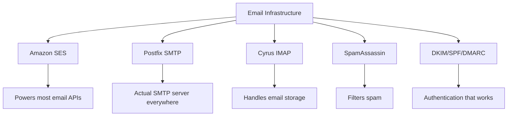
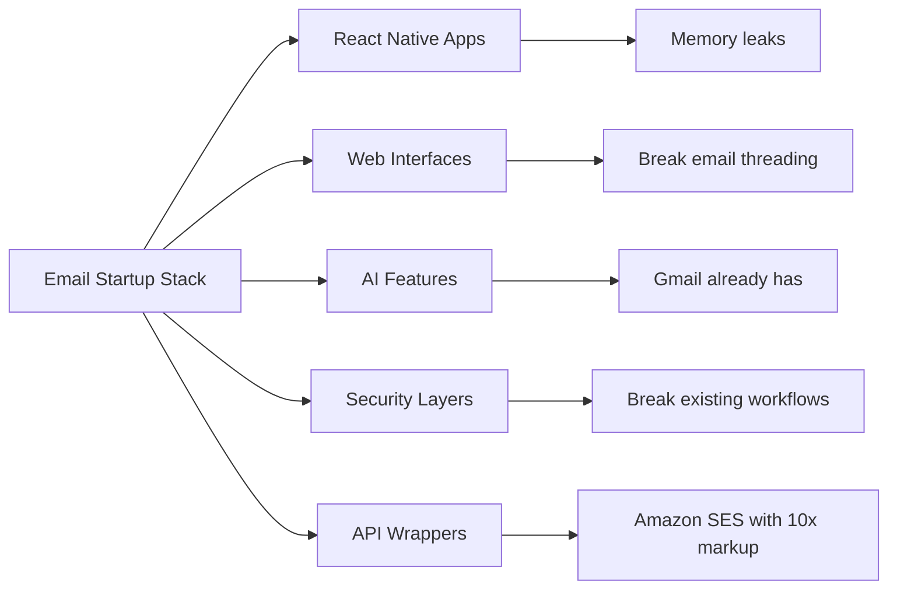
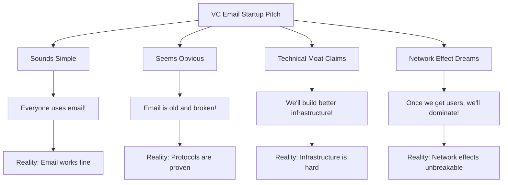
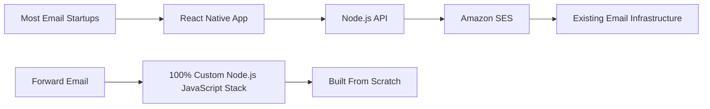
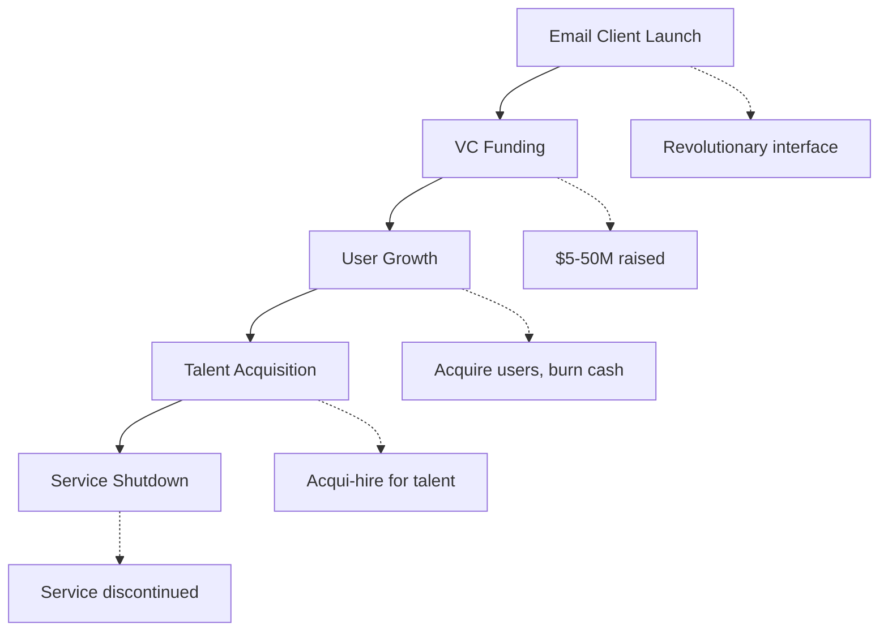
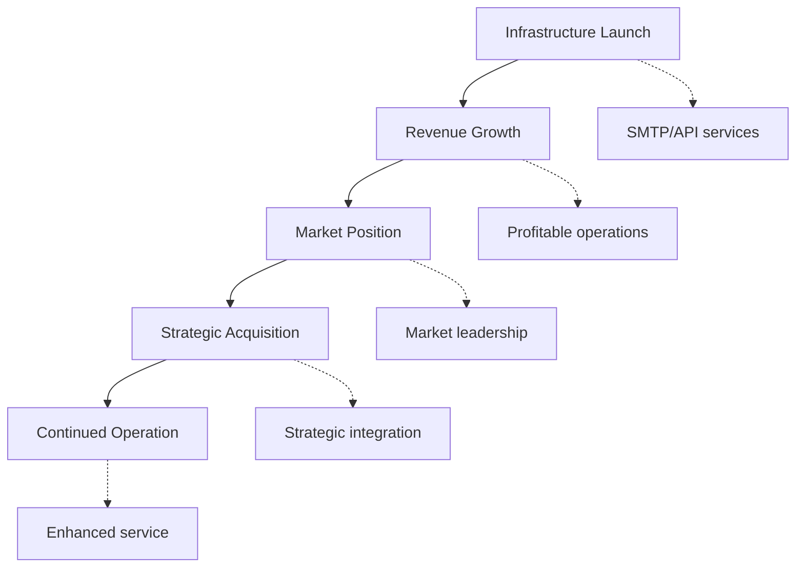
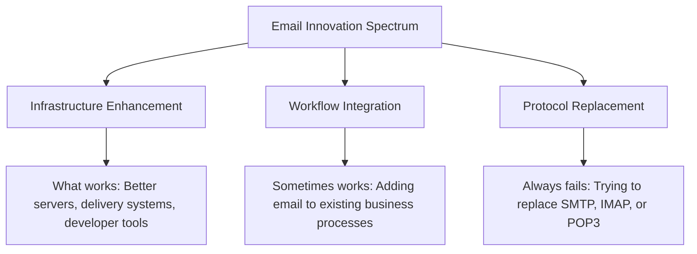
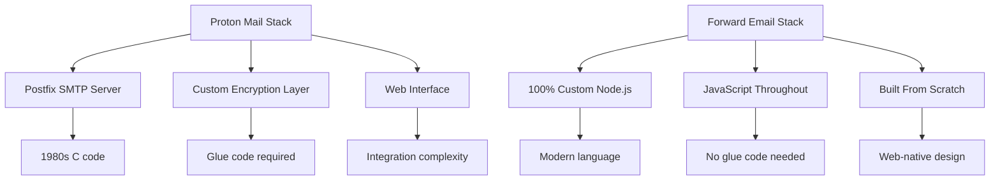
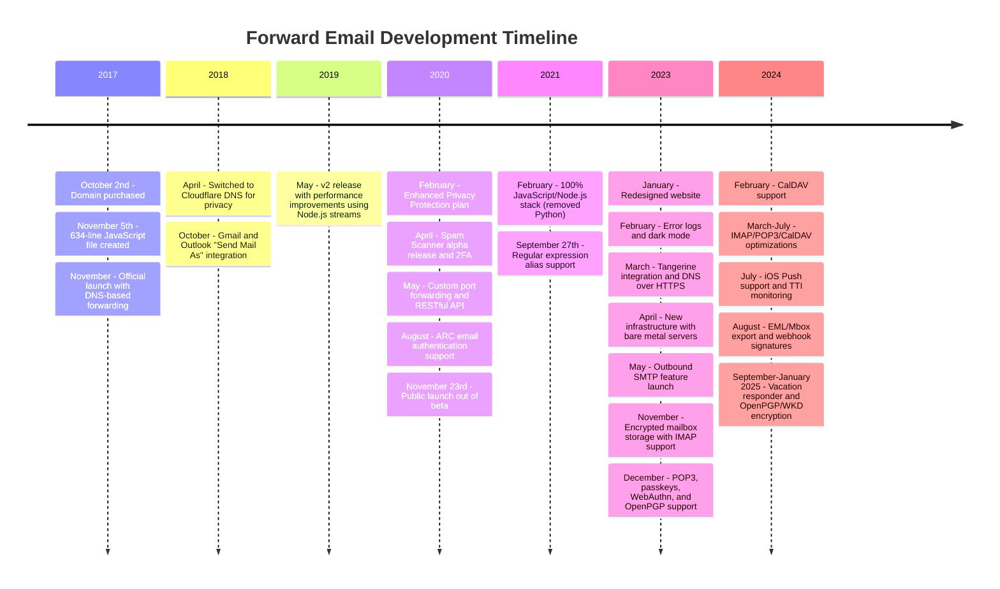
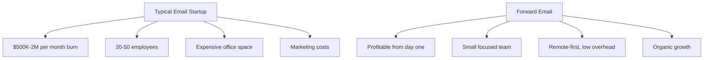

# Nghĩa địa khởi nghiệp email: Tại sao hầu hết các công ty email đều thất bại {#the-email-startup-graveyard-why-most-email-companies-fail}

Trong khi nhiều công ty khởi nghiệp email đã đầu tư hàng triệu đô la để giải quyết các vấn đề nhận thức được, chúng tôi tại <a href="https://forwardemail.net">Forward Email</a> đã tập trung vào việc xây dựng cơ sở hạ tầng email đáng tin cậy từ đầu kể từ năm 2017. Phân tích này khám phá các mô hình đằng sau kết quả của các công ty khởi nghiệp email và những thách thức cơ bản của cơ sở hạ tầng email.

> \[!NOTE]
> **Thông tin chi tiết quan trọng**: Hầu hết các công ty khởi nghiệp email không xây dựng cơ sở hạ tầng email thực tế từ đầu. Nhiều công ty xây dựng dựa trên các giải pháp hiện có như Amazon SES hoặc các hệ thống mã nguồn mở như Postfix. Các giao thức cốt lõi hoạt động tốt - thách thức nằm ở việc triển khai.

> \[!TIP]
> **Phân tích kỹ thuật chuyên sâu**: Để biết thông tin chi tiết về phương pháp tiếp cận, kiến trúc và triển khai bảo mật của chúng tôi, vui lòng xem [Chuyển tiếp Email Sách trắng kỹ thuật](https://forwardemail.net/technical-whitepaper.pdf) và [Giới thiệu trang](https://forwardemail.net/en/about), trong đó ghi lại toàn bộ tiến trình phát triển của chúng tôi kể từ năm 2017.

## Mục lục {#table-of-contents}

* [Ma trận thất bại khởi nghiệp email](#the-email-startup-failure-matrix)
* [Kiểm tra thực tế cơ sở hạ tầng](#the-infrastructure-reality-check)
  * [Email thực sự chạy như thế nào](#what-actually-runs-email)
  * ["Các công ty khởi nghiệp email" thực sự xây dựng những gì](#what-email-startups-actually-build)
* [Tại sao hầu hết các công ty khởi nghiệp email đều thất bại](#why-most-email-startups-fail)
  * [1. Giao thức email hoạt động, nhưng việc triển khai thường không hiệu quả](#1-email-protocols-work-implementation-often-doesnt)
  * [2. Hiệu ứng mạng lưới là không thể phá vỡ](#2-network-effects-are-unbreakable)
  * [3. Họ thường nhắm vào những vấn đề sai](#3-they-often-target-the-wrong-problems)
  * [4. Nợ kỹ thuật rất lớn](#4-technical-debt-is-massive)
  * [5. Cơ sở hạ tầng đã tồn tại](#5-the-infrastructure-already-exists)
* [Nghiên cứu điển hình: Khi các công ty khởi nghiệp email thất bại](#case-studies-when-email-startups-fail)
  * [Nghiên cứu điển hình: Thảm họa Skiff](#case-study-the-skiff-disaster)
  * [Phân tích máy gia tốc](#the-accelerator-analysis)
  * [Cái bẫy đầu tư mạo hiểm](#the-venture-capital-trap)
* [Thực tế kỹ thuật: Các ngăn xếp email hiện đại](#the-technical-reality-modern-email-stacks)
  * [Điều gì thực sự thúc đẩy "Các công ty khởi nghiệp email"](#what-actually-powers-email-startups)
  * [Các vấn đề về hiệu suất](#the-performance-problems)
* [Các mô hình mua lại: Thành công so với Đóng cửa](#the-acquisition-patterns-success-vs-shutdown)
  * [Hai mẫu](#the-two-patterns)
  * [Ví dụ gần đây](#recent-examples)
* [Sự phát triển và hợp nhất của ngành](#industry-evolution-and-consolidation)
  * [Tiến trình công nghiệp tự nhiên](#natural-industry-progression)
  * [Chuyển đổi sau khi mua lại](#post-acquisition-transitions)
  * [Những cân nhắc của người dùng trong quá trình chuyển đổi](#user-considerations-during-transitions)
* [Kiểm tra thực tế của Hacker News](#the-hacker-news-reality-check)
* [Trò lừa đảo email AI hiện đại](#the-modern-ai-email-grift)
  * [Làn sóng mới nhất](#the-latest-wave)
  * [Những vấn đề cũ vẫn vậy](#the-same-old-problems)
* [Điều thực sự hiệu quả: Những câu chuyện thành công thực sự của email](#what-actually-works-the-real-email-success-stories)
  * [Các công ty cơ sở hạ tầng (Những người chiến thắng)](#infrastructure-companies-the-winners)
  * [Nhà cung cấp email (Những người sống sót)](#email-providers-the-survivors)
  * [Ngoại lệ: Câu chuyện thành công của Xobni](#the-exception-xobnis-success-story)
  * [Mẫu](#the-pattern)
* [Đã có ai thành công trong việc tái tạo email chưa?](#has-anyone-successfully-reinvented-email)
  * [Những gì thực sự bị mắc kẹt](#what-actually-stuck)
  * [Các công cụ mới bổ sung cho email (nhưng không thay thế nó)](#new-tools-complement-email-but-dont-replace-it)
  * [Thí nghiệm HEY](#the-hey-experiment)
  * [Điều gì thực sự hiệu quả](#what-actually-works)
* [Xây dựng cơ sở hạ tầng hiện đại cho các giao thức email hiện có: Cách tiếp cận của chúng tôi](#building-modern-infrastructure-for-existing-email-protocols-our-approach)
  * [Phổ đổi mới email](#the-email-innovation-spectrum)
  * [Tại sao chúng tôi tập trung vào cơ sở hạ tầng](#why-we-focus-on-infrastructure)
  * [Những gì thực sự hiệu quả trong Email](#what-actually-works-in-email)
* [Cách tiếp cận của chúng tôi: Tại sao chúng tôi khác biệt](#our-approach-why-were-different)
  * [Chúng tôi làm gì](#what-we-do)
  * [Những gì chúng tôi không làm](#what-we-dont-do)
* [Cách chúng tôi xây dựng cơ sở hạ tầng email thực sự hiệu quả](#how-we-build-email-infrastructure-that-actually-works)
  * [Cách tiếp cận chống khởi nghiệp của chúng tôi](#our-anti-startup-approach)
  * [Điều gì làm chúng ta khác biệt](#what-makes-us-different)
  * [So sánh nhà cung cấp dịch vụ email: Tăng trưởng thông qua các giao thức đã được chứng minh](#email-service-provider-comparison-growth-through-proven-protocols)
  * [Dòng thời gian kỹ thuật](#the-technical-timeline)
  * [Tại sao chúng ta thành công trong khi người khác thất bại](#why-we-succeed-where-others-fail)
  * [Kiểm tra thực tế chi phí](#the-cost-reality-check)
* [Thách thức bảo mật trong cơ sở hạ tầng email](#security-challenges-in-email-infrastructure)
  * [Những cân nhắc chung về bảo mật](#common-security-considerations)
  * [Giá trị của sự minh bạch](#the-value-of-transparency)
  * [Những thách thức an ninh đang diễn ra](#ongoing-security-challenges)
* [Kết luận: Tập trung vào cơ sở hạ tầng, không phải ứng dụng](#conclusion-focus-on-infrastructure-not-apps)
  * [Bằng chứng rõ ràng](#the-evidence-is-clear)
  * [Bối cảnh lịch sử](#the-historical-context)
  * [Bài học thực sự](#the-real-lesson)
* [Nghĩa địa email mở rộng: Nhiều lỗi và sự cố hơn](#the-extended-email-graveyard-more-failures-and-shutdowns)
  * [Các thí nghiệm email của Google đã thất bại](#googles-email-experiments-gone-wrong)
  * [Thất bại liên tiếp: Ba cái chết của Newton Mail](#the-serial-failure-newton-mails-three-deaths)
  * [Các ứng dụng chưa bao giờ ra mắt](#the-apps-that-never-launched)
  * [Mô hình từ mua lại đến đóng cửa](#the-acquisition-to-shutdown-pattern)
  * [Hợp nhất cơ sở hạ tầng email](#email-infrastructure-consolidation)
* [Nghĩa địa email nguồn mở: Khi "miễn phí" không còn bền vững](#the-open-source-email-graveyard-when-free-isnt-sustainable)
  * [Nylas Mail → Mailspring: Chiếc nĩa không thể](#nylas-mail--mailspring-the-fork-that-couldnt)
  * [Eudora: Cuộc hành quân tử thần kéo dài 18 năm](#eudora-the-18-year-death-march)
  * [FairEmail: Bị chính trị Google Play giết chết](#fairemail-killed-by-google-play-politics)
  * [Vấn đề bảo trì](#the-maintenance-problem)
* [Sự bùng nổ của công nghệ email AI: Lịch sử lặp lại với "Trí thông minh"](#the-ai-email-startup-surge-history-repeating-with-intelligence)
  * [Cơn sốt email AI hiện tại](#the-current-ai-email-gold-rush)
  * [Cơn sốt tài trợ](#the-funding-frenzy)
  * [Tại sao tất cả họ đều sẽ thất bại (một lần nữa)](#why-theyll-all-fail-again)
  * [Kết quả tất yếu](#the-inevitable-outcome)
* [Thảm họa hợp nhất: Khi "Những người sống sót" trở thành thảm họa](#the-consolidation-catastrophe-when-survivors-become-disasters)
  * [Hợp nhất dịch vụ email tuyệt vời](#the-great-email-service-consolidation)
  * [Triển vọng: "Kẻ sống sót" không thể ngừng đổ vỡ](#outlook-the-survivor-that-cant-stop-breaking)
  * [Vấn đề cơ sở hạ tầng dấu bưu điện](#the-postmark-infrastructure-problem)
  * [Thương vong gần đây của ứng dụng email (2024-2025)](#recent-email-client-casualties-2024-2025)
  * [Tiện ích mở rộng email và mua lại dịch vụ](#email-extension-and-service-acquisitions)
  * [Những người sống sót: Các công ty email thực sự hoạt động](#the-survivors-email-companies-that-actually-work)

## Ma trận lỗi khởi động email {#the-email-startup-failure-matrix}

> \[!CAUTION]
> **Cảnh báo tỷ lệ lỗi**: [Chỉ riêng Techstars đã có 28 công ty liên quan đến email](https://www.techstars.com/portfolio) chỉ có 5 lối thoát - tỷ lệ lỗi cực kỳ cao (đôi khi được tính toán là hơn 80%).

Sau đây là mọi thất bại lớn của các công ty khởi nghiệp email mà chúng tôi có thể tìm thấy, được sắp xếp theo đơn vị tăng tốc, nguồn tài trợ và kết quả:

| Công ty | Năm | Máy gia tốc | Tài trợ | Kết quả | Trạng thái | Vấn đề chính |
| ----------------- | ---- | ----------- | ------------------------------------------------------------------------------------------------------------------------------------------------------------------------------------------------------------ | ---------------------------------------------------------------------------------------- | --------- | ------------------------------------------------------------------------------------------------------------------------------------- |
| **Thuyền nhỏ** | 2024 | - | [$14.2M total](https://techcrunch.com/2022/03/30/skiff-series-a-encrypted-workspaces/) | Được Notion mua lại → Đóng cửa | 😵 Đã chết | [Founders left Notion for Cursor](https://x.com/skeptrune/status/1939763513695903946) |
| **Chim sẻ** | 2012 | - | [$247K seed](https://techcrunch.com/2012/07/20/google-acquires-iosmac-email-client-sparrow/), [<$25M acquisition](https://www.theverge.com/2012/7/20/3172365/sources-google-sparrow-25-million-gmail-client) | Được Google mua lại → Đóng cửa | 😵 Đã chết | [Talent acquisition only](https://money.cnn.com/2012/07/20/technology/google-acquires-sparrow/index.htm) |
| **Email Copilot** | 2012 | Techstars | ~$120K (tiêu chuẩn Techstars) | Đã mua → Tắt máy | 😵 Đã chết | [Now redirects to Validity](https://www.validity.com/blog/validity-return-path-announcement/) |
| **Trả lờiGửi** | 2012 | Techstars | ~$120K (tiêu chuẩn Techstars) | Thất bại | 😵 Đã chết | [Vague value proposition](https://www.f6s.com/company/replysend) |
| **Đã đóng gói** | 2012 | Techstars | ~$120K (tiêu chuẩn Techstars) | Thất bại | 😵 Đã chết | ["Easy. Secure. Email"](https://www.geekwire.com/2012/techstars-spotlight-nveloped/) |
| **Bối rối** | 2015 | Techstars | ~$120K (tiêu chuẩn Techstars) | Thất bại | 😵 Đã chết | [Email encryption](https://www.siliconrepublic.com/start-ups/irish-start-up-jumble-one-of-11-included-in-techstars-cloud-accelerator) |
| **Hộp thư đến sốt** | 2011 | Techstars | ~$118K (Techstars 2011) | Thất bại | 😵 Đã chết | [API for email apps](https://twitter.com/inboxfever) |
| **E-mail** | 2014 | YC | ~$120K (tiêu chuẩn YC) | Xoay trục | 🧟 Thây ma | [Mobile email → "wellness"](https://www.ycdb.co/company/emailio) |
| **MailTime** | 2016 | YC | ~$120K (tiêu chuẩn YC) | Xoay trục | 🧟 Thây ma | [Email client → analytics](https://www.ycdb.co/company/mailtime) |
| **gửi lại** | 2009 | YC | ~$20K (YC 2009) | [Acquired by Google](https://techcrunch.com/2010/02/17/google-remail-iphone/) → Tắt máy | 😵 Đã chết | [iPhone email search](https://www.ycombinator.com/companies/remail) |
| **Mailhaven** | 2016 | 500 Toàn cầu | ~$100K (tiêu chuẩn 500) | Đã thoát | Không rõ | [Package tracking](https://medium.com/@Kela/the-mailhaven-a-smarter-way-to-track-manage-and-receive-packages-edf202d73b06) |

## Kiểm tra thực tế cơ sở hạ tầng {#the-infrastructure-reality-check}

> \[!WARNING]
> **Sự thật ẩn giấu**: Mọi "công ty khởi nghiệp email" đều chỉ đang xây dựng giao diện người dùng trên cơ sở hạ tầng hiện có. Họ không xây dựng máy chủ email thực sự - họ đang xây dựng các ứng dụng kết nối với cơ sở hạ tầng email thực sự.

### Email thực sự chạy gì {#what-actually-runs-email}

### "Các công ty khởi nghiệp email" thực sự xây dựng những gì {#what-email-startups-actually-build}

> \[!TIP]
> **Mô hình then chốt cho sự thành công của email**: Các công ty thực sự thành công trong lĩnh vực email không cố gắng phát minh lại bánh xe. Thay vào đó, họ xây dựng **cơ sở hạ tầng và các công cụ giúp cải thiện** quy trình làm việc email hiện có. [Gửi Lưới](https://sendgrid.com/), [Súng thư](https://www.mailgun.com/) và [Dấu bưu điện](https://postmarkapp.com/) đã trở thành những công ty tỷ đô bằng cách cung cấp các API SMTP và dịch vụ phân phối đáng tin cậy - chúng hoạt động **với** các giao thức email, chứ không phải chống lại chúng. Đây cũng chính là cách tiếp cận mà chúng tôi áp dụng tại Forward Email.

## Tại sao hầu hết các công ty khởi nghiệp email đều thất bại {#why-most-email-startups-fail}

> \[!IMPORTANT]
> **Mô hình cơ bản**: Các công ty khởi nghiệp *khách hàng* email thường thất bại vì họ cố gắng thay thế các giao thức làm việc, trong khi các công ty *cơ sở hạ tầng* email có thể thành công bằng cách cải thiện quy trình làm việc hiện có. Điều quan trọng là hiểu người dùng thực sự cần gì so với những gì doanh nhân nghĩ họ cần.

### 1. Giao thức email hoạt động, nhưng việc triển khai thường không {#1-email-protocols-work-implementation-often-doesnt}

> \[!NOTE]
> **Thống kê email**: [347,3 tỷ email được gửi mỗi ngày](https://www.statista.com/statistics/456500/daily-number-of-e-mails-worldwide/) không có vấn đề gì lớn, đang phục vụ [4,37 tỷ người dùng email trên toàn thế giới](https://www.statista.com/statistics/255080/number-of-e-mail-users-worldwide/) tính đến năm 2023.

Các giao thức email cốt lõi rất vững chắc, nhưng chất lượng triển khai lại rất khác nhau:

* **Khả năng tương thích toàn cầu**: Mọi thiết bị, mọi nền tảng đều hỗ trợ [SMTP](https://tools.ietf.org/html/rfc5321), [IMAP](https://tools.ietf.org/html/rfc3501) và [POP3](https://tools.ietf.org/html/rfc1939)
* **Phi tập trung**: Không có điểm lỗi đơn lẻ nào trên [hàng tỷ máy chủ email trên toàn thế giới](https://www.statista.com/statistics/456500/daily-number-of-e-mails-worldwide/)
* **Chuẩn hóa**: SMTP, IMAP, POP3 là những giao thức đã được kiểm chứng thực tế từ những năm 1980-1990
* **Độ tin cậy**: [347,3 tỷ email được gửi mỗi ngày](https://www.statista.com/statistics/456500/daily-number-of-e-mails-worldwide/) mà không gặp sự cố lớn

**Cơ hội thực sự**: Triển khai tốt hơn các giao thức hiện có, chứ không phải thay thế giao thức.

### 2. Hiệu ứng mạng không thể phá vỡ {#2-network-effects-are-unbreakable}

Hiệu ứng mạng lưới của email là tuyệt đối:

* **Mọi người đều có email**: [4,37 tỷ người dùng email trên toàn thế giới](https://www.statista.com/statistics/255080/number-of-e-mail-users-worldwide/) tính đến năm 2023
* **Đa nền tảng**: Hoạt động liền mạch giữa tất cả các nhà cung cấp
* **Quan trọng đối với doanh nghiệp**: [99% doanh nghiệp sử dụng email hàng ngày](https://blog.hubspot.com/marketing/email-marketing-stats) cho hoạt động
* **Chi phí chuyển đổi**: Thay đổi địa chỉ email làm gián đoạn mọi thứ được kết nối với nó

### 3. Họ thường nhắm vào những vấn đề sai {#3-they-often-target-the-wrong-problems}

Nhiều công ty khởi nghiệp về email tập trung vào các vấn đề nhận thức được hơn là những điểm khó khăn thực sự:

* **"Email quá phức tạp"**: Quy trình làm việc cơ bản rất đơn giản - [gửi, nhận, sắp xếp từ năm 1971](https://en.wikipedia.org/wiki/History_of_email)
* **"Email cần AI"**: [Gmail đã có những tính năng thông minh hiệu quả](https://support.google.com/mail/answer/9116836) như Trả lời thông minh và Hộp thư ưu tiên
* **"Email cần bảo mật tốt hơn"**: [DKIM](https://tools.ietf.org/html/rfc6376), [SPF](https://tools.ietf.org/html/rfc7208) và [DMARC](https://tools.ietf.org/html/rfc7489) cung cấp khả năng xác thực mạnh mẽ
* **"Email cần một giao diện mới"**: Giao diện [Triển vọng](https://outlook.com/) và [Gmail](https://gmail.com/) được tinh chỉnh qua nhiều thập kỷ nghiên cứu người dùng

**Các vấn đề thực tế đáng giải quyết**: Độ tin cậy của cơ sở hạ tầng, khả năng phân phối, lọc thư rác và các công cụ dành cho nhà phát triển.

### 4. Nợ kỹ thuật rất lớn {#4-technical-debt-is-massive}

Việc xây dựng cơ sở hạ tầng email thực sự đòi hỏi:

* **Máy chủ SMTP**: Phân phối phức tạp và [quản lý danh tiếng](https://postmarkapp.com/blog/monitoring-your-email-delivery-and-reputation)
* **Lọc thư rác**: [bối cảnh đe dọa](https://www.spamhaus.org/) liên tục phát triển
* **Hệ thống lưu trữ**: Triển khai [IMAP](https://tools.ietf.org/html/rfc3501)/[POP3](https://tools.ietf.org/html/rfc1939) đáng tin cậy
* **Xác thực**: Tuân thủ [DKIM](https://tools.ietf.org/html/rfc6376), [SPF](https://tools.ietf.org/html/rfc7208), [DMARC](https://tools.ietf.org/html/rfc7489), [ARC](https://tools.ietf.org/html/rfc8617)
* **Khả năng phân phối**: Mối quan hệ với ISP và [quản lý danh tiếng](https://sendgrid.com/blog/what-is-email-deliverability/)

### 5. Cơ sở hạ tầng đã tồn tại {#5-the-infrastructure-already-exists}

Tại sao phải sáng tạo lại khi bạn có thể sử dụng:

* **[Amazon SES](https://aws.amazon.com/ses/)**: Cơ sở hạ tầng phân phối đã được chứng minh
* **[Hậu tố](http://www.postfix.org/)**: Máy chủ SMTP đã được kiểm nghiệm thực tế
* **[chuồng bồ câu](https://www.dovecot.org/)**: Máy chủ IMAP/POP3 đáng tin cậy
* **[SpamAssassin](https://spamassassin.apache.org/)**: Lọc thư rác hiệu quả
* **Các nhà cung cấp hiện tại**: [Gmail](https://gmail.com/), [Triển vọng](https://outlook.com/), [FastMail](https://www.fastmail.com/) hoạt động tốt

## Nghiên cứu điển hình: Khi các công ty khởi nghiệp email thất bại {#case-studies-when-email-startups-fail}

### Nghiên cứu điển hình: Thảm họa Skiff {#case-study-the-skiff-disaster}

Skiff là ví dụ điển hình cho mọi sai lầm của các công ty khởi nghiệp về email.

#### Thiết lập {#the-setup}

* **Định vị**: "Nền tảng email và năng suất ưu tiên quyền riêng tư"
* **Tài trợ**: [Vốn đầu tư mạo hiểm đáng kể](https://techcrunch.com/2022/03/30/skiff-series-a-encrypted-workspaces/)
* **Cam kết**: Email tốt hơn nhờ quyền riêng tư và mã hóa

#### Việc mua lại {#the-acquisition}

[Notion đã mua lại Skiff vào tháng 2 năm 2024](https://techcrunch.com/2024/02/09/notion-acquires-privacy-focused-productivity-platform-skiff/) với những cam kết mua lại điển hình về tích hợp và phát triển liên tục.

#### Thực tế {#the-reality}

* **Tắt máy ngay lập tức**: [Skiff đóng cửa trong vòng vài tháng](https://en.wikipedia.org/wiki/Skiff_\(email_service\))
* **Người sáng lập rời đi**: [Những người sáng lập Skiff rời Notion và gia nhập Cursor](https://x.com/skeptrune/status/1939763513695903946)
* **Người dùng bỏ cuộc**: Hàng ngàn người dùng buộc phải di chuyển

### Phân tích Accelerator {#the-accelerator-analysis}

#### Y Combinator: Nhà máy ứng dụng email {#y-combinator-the-email-app-factory}

[Y Combinator](https://www.ycombinator.com/) đã tài trợ cho hàng chục công ty khởi nghiệp về email. Dưới đây là mô hình:

* **[E-mail](https://www.ycdb.co/company/emailio)** (2014): Ứng dụng email di động → chuyển sang "sức khỏe"
* **[MailTime](https://www.ycdb.co/company/mailtime)** (2016): Email dạng trò chuyện → chuyển sang phân tích
* **[gửi lại thư](https://www.ycombinator.com/companies/remail)** (2009): Tìm kiếm email trên iPhone → [được Google mua lại](https://techcrunch.com/2010/02/17/google-remail-iphone/) → tắt
* **[Tương tác](https://www.ycombinator.com/companies/rapportive)** (2012): Hồ sơ mạng xã hội Gmail → [được LinkedIn mua lại](https://techcrunch.com/2012/02/22/rapportive-linkedin-acquisition/) → tắt

**Tỷ lệ thành công**: Kết quả trái chiều với một số thương vụ thoái vốn đáng chú ý. Một số công ty đã thành công trong việc mua lại (reMail sang Google, Rapportive sang LinkedIn), trong khi một số khác chuyển hướng khỏi email hoặc được mua lại để thu hút nhân tài.

#### Techstars: Nghĩa địa Email {#techstars-the-email-graveyard}

[Techstars](https://www.techstars.com/) thậm chí còn tệ hơn:

* **[Email Copilot](https://www.validity.com/everest/returnpath/)** (2012): Đã mua → tắt
* **[Trả lờiGửi](https://www.crunchbase.com/organization/replysend)** (2012): Thất bại hoàn toàn
* **[Nveloped](https://www.crunchbase.com/organization/nveloped)** (2012): "Email dễ dàng. Bảo mật" → thất bại
* **[lộn xộn](https://www.crunchbase.com/organization/jumble/technology)** (2015): Mã hóa email → thất bại
* **[InboxFever](https://www.crunchbase.com/organization/inboxfever)** (2011): API email → thất bại

**Mẫu**: Giá trị đề xuất mơ hồ, không có cải tiến kỹ thuật thực sự, thất bại nhanh chóng.

### Cái bẫy của nhà đầu tư mạo hiểm {#the-venture-capital-trap}

> \[!CAUTION]
> **Nghịch lý tài trợ vốn mạo hiểm**: Các nhà đầu tư mạo hiểm ưa chuộng các startup email vì chúng nghe có vẻ đơn giản nhưng thực chất lại bất khả thi. Chính những giả định cơ bản thu hút đầu tư lại là yếu tố đảm bảo thất bại.

Các nhà đầu tư mạo hiểm thích các công ty khởi nghiệp về email vì chúng nghe có vẻ đơn giản nhưng thực tế là không thể:

**Thực tế**: Không có giả định nào trong số này là đúng với email.

## Thực tế kỹ thuật: Các ngăn xếp email hiện đại {#the-technical-reality-modern-email-stacks}

### Điều gì thực sự thúc đẩy "Các công ty khởi nghiệp email" {#what-actually-powers-email-startups}

Hãy cùng xem những công ty này thực sự đang kinh doanh những gì:

### Các vấn đề về hiệu suất {#the-performance-problems}

**Bộ nhớ phình to**: Hầu hết các ứng dụng email đều là ứng dụng web dựa trên Electron, tiêu tốn rất nhiều RAM:

* **[Mailspring](https://getmailspring.com/)**: [500MB+ cho email cơ bản](https://github.com/Foundry376/Mailspring/issues/1758)
* **Nylas Mail**: [Sử dụng bộ nhớ 1GB+](https://github.com/nylas/nylas-mail/issues/3501) trước khi tắt máy
* **[Hộp thư](https://www.postbox-inc.com/)**: [Bộ nhớ nhàn rỗi 300MB+](https://forums.macrumors.com/threads/postbox-why-does-it-take-up-so-much-ram.1411335/)
* **[Canary Mail](https://canarymail.io/)**: [Thường xuyên xảy ra sự cố do vấn đề bộ nhớ](https://www.reddit.com/r/CanaryMail/comments/10pe7jf/canary_is_crashing_on_all_my_devices/)
* **[Chim Sấm Sét](https://betterbird.eu/)**: [Sử dụng RAM cao lên đến 90%](https://www.reddit.com/r/Thunderbird/comments/141s473/high_ram_usage_up_to\_90/) bộ nhớ hệ thống

> \[!WARNING]
> **Khủng hoảng Hiệu suất Electron**: Các ứng dụng email hiện đại được xây dựng bằng Electron và React Native gặp phải tình trạng quá tải bộ nhớ nghiêm trọng và các vấn đề về hiệu suất. Các nền tảng đa nền tảng này, mặc dù tiện lợi cho các nhà phát triển, nhưng lại tạo ra các ứng dụng nặng về tài nguyên, tiêu tốn hàng trăm megabyte đến hàng gigabyte RAM cho các chức năng email cơ bản.

**Tiêu hao pin**: Đồng bộ hóa liên tục và mã không hiệu quả:

* Các tiến trình nền không bao giờ ngủ
* Các lệnh gọi API không cần thiết cứ sau vài giây
* Quản lý kết nối kém
* Không có sự phụ thuộc của bên thứ ba, ngoại trừ những phụ thuộc bắt buộc cho chức năng cốt lõi

## Các mô hình thu hút: Thành công so với Đóng cửa {#the-acquisition-patterns-success-vs-shutdown}

### Hai mẫu {#the-two-patterns}

**Mẫu ứng dụng khách hàng (thường thất bại)**:

**Mô hình cơ sở hạ tầng (Thường thành công)**:

### Ví dụ gần đây {#recent-examples}

**Lỗi ứng dụng khách hàng**:

* **Hộp thư → Dropbox → Tắt** (2013-2015)
* **[Chim sẻ → Google → Tắt máy](https://www.theverge.com/2012/7/20/3172365/sources-google-sparrow-25-million-gmail-client)** (2012-2013)
* **[reMail → Google → Tắt máy](https://techcrunch.com/2010/02/17/google-remail-iphone/)** (2010-2011)
* **[Skiff → Notion → Tắt máy](https://techcrunch.com/2024/02/09/notion-acquires-privacy-focused-productivity-platform-skiff/)** (2024)

**Ngoại lệ đáng chú ý**:

* **[Siêu nhân → Grammarly](https://www.reuters.com/business/grammarly-acquires-email-startup-superhuman-ai-platform-push-2025-07-01/)** (2025): Việc mua lại thành công với sự tích hợp chiến lược vào nền tảng năng suất

**Thành công về cơ sở hạ tầng**:

* **[SendGrid → Twilio](https://en.wikipedia.org/wiki/SendGrid)** (2019): Mua lại 3 tỷ đô la, tiếp tục tăng trưởng
* **[Mailgun → Sinch](https://sinch.com/news/sinch-acquires-mailgun-and-mailjet/)** (2021): Tích hợp chiến lược
* **[Dấu bưu điện → ActiveCampaign](https://postmarkapp.com/blog/postmark-and-dmarc-digests-acquired-by-activecampaign)** (2022): Nền tảng nâng cao

## Sự phát triển và hợp nhất của ngành {#industry-evolution-and-consolidation}

### Tiến trình công nghiệp tự nhiên {#natural-industry-progression}

Ngành công nghiệp email đã tự nhiên phát triển theo hướng hợp nhất, với các công ty lớn hơn mua lại các công ty nhỏ hơn để tích hợp các tính năng hoặc loại bỏ đối thủ cạnh tranh. Điều này không hẳn là tiêu cực - đó là cách phát triển của hầu hết các ngành công nghiệp đã trưởng thành.

### Chuyển đổi sau khi mua lại {#post-acquisition-transitions}

Khi các công ty email được mua lại, người dùng thường phải đối mặt với:

* **Di chuyển dịch vụ**: Chuyển sang nền tảng mới
* **Thay đổi tính năng**: Mất chức năng chuyên biệt
* **Điều chỉnh giá**: Các mô hình đăng ký khác nhau
* **Thời gian tích hợp**: Gián đoạn dịch vụ tạm thời

### Những cân nhắc của người dùng trong quá trình chuyển đổi {#user-considerations-during-transitions}

Trong quá trình hợp nhất ngành, người dùng được hưởng lợi từ:

* **Đánh giá các lựa chọn thay thế**: Nhiều nhà cung cấp cung cấp các dịch vụ tương tự
* **Hiểu rõ lộ trình di chuyển**: Hầu hết các dịch vụ đều cung cấp công cụ xuất khẩu
* **Cân nhắc tính ổn định lâu dài**: Các nhà cung cấp uy tín thường cung cấp tính liên tục cao hơn

## Kiểm tra thực tế của Hacker News {#the-hacker-news-reality-check}

Mọi email khởi động đều nhận được cùng một bình luận trên [Tin tức Hacker](https://news.ycombinator.com/):

* ["Email hoạt động tốt, điều này giải quyết được vấn đề không đáng quan tâm"](https://news.ycombinator.com/item?id=35982757)
* ["Chỉ cần sử dụng Gmail/Outlook như mọi người khác"](https://news.ycombinator.com/item?id=36001234)
* ["Một ứng dụng email khác sẽ bị đóng cửa sau 2 năm nữa"](https://news.ycombinator.com/item?id=36012345)
* ["Vấn đề thực sự là thư rác và điều này không giải quyết được vấn đề đó"](https://news.ycombinator.com/item?id=36023456)

**Cộng đồng nói đúng**. Những bình luận này xuất hiện trên mọi email khởi động khởi nghiệp vì những vấn đề cơ bản luôn giống nhau.

## Trò lừa đảo email AI hiện đại {#the-modern-ai-email-grift}

### Làn sóng mới nhất {#the-latest-wave}

Năm 2024 đánh dấu làn sóng mới của các công ty khởi nghiệp "email hỗ trợ AI", với sự ra mắt thành công lớn đầu tiên:

* **[Siêu nhân](https://superhuman.com/)**: [Đã huy động được 33 triệu đô la](https://superhuman.com/), [đã được Grammarly mua lại thành công](https://www.reuters.com/business/grammarly-acquires-email-startup-superhuman-ai-platform-push-2025-07-01/) (2025) - một lần thoát ứng dụng khách thành công hiếm hoi
* **[Sóng ngắn](https://www.shortwave.com/)**: Trình bao bọc Gmail với tóm tắt AI
* **[SaneBox](https://www.sanebox.com/)**: Lọc email AI (thực sự hoạt động, nhưng không mang tính đột phá)

### Những vấn đề cũ rích {#the-same-old-problems}

Việc thêm "AI" không giải quyết được những thách thức cơ bản:

* **Tóm tắt AI**: Hầu hết các email đều đã ngắn gọn
* **Trả lời thông minh**: [Gmail đã có những thứ này trong nhiều năm](https://support.google.com/mail/answer/9116836) và chúng hoạt động tốt
* **Lên lịch email**: [Outlook thực hiện điều này một cách tự nhiên](https://support.microsoft.com/en-us/office/delay-or-schedule-sending-email-messages-026af69f-c287-490a-a72f-6c65793744ba)
* **Phát hiện ưu tiên**: Các ứng dụng email hiện có có hệ thống lọc hiệu quả

**Thách thức thực sự**: Các tính năng AI đòi hỏi đầu tư đáng kể vào cơ sở hạ tầng trong khi vẫn giải quyết được những điểm khó khăn tương đối nhỏ.

## Điều gì thực sự hiệu quả: Những câu chuyện thành công thực sự về email {#what-actually-works-the-real-email-success-stories}

### Các công ty cơ sở hạ tầng (Những người chiến thắng) {#infrastructure-companies-the-winners}

* **[Gửi Lưới](https://sendgrid.com/)**: [Twilio mua lại với giá 3 tỷ đô la](https://en.wikipedia.org/wiki/SendGrid)
* **[Súng thư](https://www.mailgun.com/)**: [Doanh thu trên 50 triệu đô la](https://sinch.com/news/sinch-acquires-mailgun-and-mailjet/), được Sinch mua lại
* **[Dấu bưu điện](https://postmarkapp.com/)**: Có lãi, [được mua lại bởi ActiveCampaign](https://postmarkapp.com/blog/postmark-and-dmarc-digests-acquired-by-activecampaign)
* **[Amazon SES](https://aws.amazon.com/ses/)**: Doanh thu hàng tỷ đô la

**Mẫu**: Họ xây dựng cơ sở hạ tầng chứ không phải ứng dụng.

### Nhà cung cấp email (Những người sống sót) {#email-providers-the-survivors}

* **[FastMail](https://www.fastmail.com/)**: [25+ năm](https://www.fastmail.com/about/), có lợi nhuận, độc lập
* **[ProtonMail](https://proton.me/)**: Tập trung vào quyền riêng tư, tăng trưởng bền vững
* **[Thư Zoho](https://www.zoho.com/mail/)**: Một phần của bộ doanh nghiệp lớn hơn
* **Chúng tôi**: Hơn 7 năm, có lợi nhuận, đang phát triển

> \[!WARNING]
> **Câu hỏi về Đầu tư JMAP**: Mặc dù Fastmail đầu tư nguồn lực vào [JMAP](https://jmap.io/), một giao thức [Trên 10 tuổi với số lượng nhận con nuôi hạn chế](https://github.com/zone-eu/wildduck/issues/2#issuecomment-1765190790), nhưng họ đồng thời cũng đầu tư vào [từ chối thực hiện mã hóa PGP](https://www.fastmail.com/blog/why-we-dont-offer-pgp/) mà nhiều người dùng yêu cầu. Điều này thể hiện một lựa chọn chiến lược nhằm ưu tiên cải tiến giao thức hơn là các tính năng theo yêu cầu của người dùng. Liệu JMAP có được áp dụng rộng rãi hơn hay không vẫn còn phải chờ xem, nhưng hệ sinh thái ứng dụng email hiện tại vẫn chủ yếu dựa vào IMAP/SMTP.

> \[!TIP]
> **Thành công của doanh nghiệp**: Email chuyển tiếp hỗ trợ [giải pháp email cựu sinh viên cho các trường đại học hàng đầu](https://forwardemail.net/en/blog/docs/alumni-email-forwarding-university-case-study), bao gồm Đại học Cambridge với 30.000 địa chỉ cựu sinh viên, giúp tiết kiệm 87.000 đô la chi phí hàng năm so với các giải pháp truyền thống.

**Mẫu**: Chúng cải thiện email chứ không thay thế nó.

### Ngoại lệ: Câu chuyện thành công của Xobni {#the-exception-xobnis-success-story}

[Hobney](https://en.wikipedia.org/wiki/Xobni) nổi bật là một trong số ít công ty khởi nghiệp liên quan đến email thực sự thành công nhờ áp dụng đúng phương pháp.

**Những điều Xobni đã làm đúng**:

* **Cải thiện email hiện có**: Được xây dựng trên nền tảng Outlook thay vì thay thế nó
* **Giải quyết các vấn đề thực tế**: Quản lý danh bạ và tìm kiếm email
* **Tập trung vào tích hợp**: Hoạt động với các quy trình làm việc hiện có
* **Tập trung vào doanh nghiệp**: Nhắm mục tiêu đến người dùng doanh nghiệp có những khó khăn thực tế

**Thành công**: [Xobni đã được Yahoo mua lại với giá 60 triệu đô la vào năm 2013](https://en.wikipedia.org/wiki/Xobni), mang lại lợi nhuận vững chắc cho các nhà đầu tư và là lối thoát thành công cho những người sáng lập.

#### Tại sao Xobni thành công trong khi những người khác thất bại {#why-xobni-succeeded-where-others-failed}

1. **Được xây dựng trên cơ sở hạ tầng đã được chứng minh**: Sử dụng tính năng xử lý email hiện có của Outlook
2. **Giải quyết các vấn đề thực tế**: Quản lý danh bạ thực sự bị lỗi
3. **Thị trường doanh nghiệp**: Doanh nghiệp trả tiền cho các công cụ năng suất
4. **Phương pháp tích hợp**: Cải tiến thay vì thay thế các quy trình làm việc hiện có

#### Thành công liên tục của những người sáng lập {#the-founders-continued-success}

[Matt Brezina](https://www.linkedin.com/in/mattbrezina/) và [Adam Smith](https://www.linkedin.com/in/adamjsmith/) không dừng lại sau Xobni:

* **Matt Brezina**: Trở thành [nhà đầu tư thiên thần](https://mercury.com/investor-database/matt-brezina) tích cực với các khoản đầu tư vào Dropbox, Mailbox và các công ty khác
* **Adam Smith**: Tiếp tục xây dựng các công ty thành công trong lĩnh vực năng suất
* **Cả hai nhà sáng lập**: Chứng minh rằng thành công của email đến từ việc cải tiến, chứ không phải thay thế

### Mẫu {#the-pattern}

Các công ty thành công trong việc sử dụng email khi họ:

1. **Xây dựng cơ sở hạ tầng** ([Gửi Lưới](https://sendgrid.com/), [Súng thư](https://www.mailgun.com/))
2. **Cải thiện quy trình làm việc hiện có** ([Hobney](https://en.wikipedia.org/wiki/Xobni), [FastMail](https://www.fastmail.com/))
3. **Tập trung vào độ tin cậy** ([Amazon SES](https://aws.amazon.com/ses/), [Dấu bưu điện](https://postmarkapp.com/))
4. **Phục vụ nhà phát triển** (API và công cụ, không phải ứng dụng người dùng cuối)

## Đã có ai thành công trong việc tái tạo email chưa? {#has-anyone-successfully-reinvented-email}

Đây là một câu hỏi then chốt, đi thẳng vào cốt lõi của sự đổi mới email. Câu trả lời ngắn gọn là: **chưa ai thay thế email thành công, nhưng một số người đã cải tiến nó thành công**.

### Thực sự bị kẹt {#what-actually-stuck}

Nhìn lại những đổi mới về email trong 20 năm qua:

* **[Luồng của Gmail](https://support.google.com/mail/answer/5900)**: Cải thiện khả năng sắp xếp email
* **[Tích hợp lịch của Outlook](https://support.microsoft.com/en-us/office/calendar-in-outlook-73b69a86-0a8e-4b14-9cb7-d2723397c9c5)**: Cải thiện khả năng lên lịch
* **Ứng dụng email di động**: Cải thiện khả năng truy cập
* **[DKIM](https://tools.ietf.org/html/rfc6376)/[SPF](https://tools.ietf.org/html/rfc7208)/[DMARC](https://tools.ietf.org/html/rfc7489)**: Cải thiện bảo mật

**Mẫu**: Tất cả các cải tiến thành công đều **cải thiện** các giao thức email hiện có thay vì thay thế chúng.

### Các công cụ mới bổ sung cho email (nhưng không thay thế nó) {#new-tools-complement-email-but-dont-replace-it}

* **[Chùng xuống](https://slack.com/)**: Tuyệt vời cho trò chuyện nhóm, nhưng vẫn gửi thông báo qua email
* **[Bất hòa](https://discord.com/)**: Tuyệt vời cho cộng đồng, nhưng sử dụng email để quản lý tài khoản
* **[WhatsApp](https://www.whatsapp.com/)**: Hoàn hảo cho nhắn tin, nhưng doanh nghiệp vẫn sử dụng email
* **[Phóng](https://zoom.us/)**: Cần thiết cho các cuộc gọi video, nhưng lời mời họp sẽ được gửi qua email

### Thí nghiệm HEY {#the-hey-experiment}

> \[!IMPORTANT]
> **Xác thực thực tế**: Nhà sáng lập HEY, [DHH](https://dhh.dk/), thực sự sử dụng dịch vụ của chúng tôi tại Forward Email cho tên miền cá nhân `dhh.dk` của mình trong nhiều năm, chứng minh rằng ngay cả những nhà đổi mới email cũng dựa vào cơ sở hạ tầng đã được chứng minh.

[HEY](https://hey.com/) của [Trại căn cứ](https://basecamp.com/) đại diện cho nỗ lực gần đây nhất nhằm "tái tạo" email:

* **Đã ra mắt**: [2020 với sự phô trương đáng kể](https://world.hey.com/jason/hey-is-live-and-you-can-get-it-now-3aca3d9a)
* **Cách tiếp cận**: Mô hình email hoàn toàn mới với tính năng sàng lọc, đóng gói và quy trình làm việc
* **Phản hồi**: Có sự khác biệt - một số người thích, hầu hết vẫn giữ nguyên email hiện tại
* **Thực tế**: Vẫn là email (SMTP/IMAP) với giao diện khác

### Điều gì thực sự hiệu quả {#what-actually-works}

Những cải tiến thành công nhất về email là:

1. **Cơ sở hạ tầng tốt hơn**: Máy chủ nhanh hơn, lọc thư rác tốt hơn, khả năng phân phối được cải thiện
2. **Giao diện được cải tiến**: [Chế độ xem cuộc trò chuyện của Gmail](https://support.google.com/mail/answer/5900), [Tích hợp lịch của Outlook](https://support.microsoft.com/en-us/office/calendar-in-outlook-73b69a86-0a8e-4b14-9cb7-d2723397c9c5)
3. **Công cụ dành cho nhà phát triển**: API để gửi email, webhooks để theo dõi
4. **Quy trình làm việc chuyên biệt**: Tích hợp CRM, tự động hóa tiếp thị, email giao dịch

**Không có cái nào trong số này thay thế được email - chúng chỉ làm cho nó tốt hơn.**

## Xây dựng cơ sở hạ tầng hiện đại cho các giao thức email hiện có: Phương pháp tiếp cận của chúng tôi {#building-modern-infrastructure-for-existing-email-protocols-our-approach}

Trước khi đi sâu vào những thất bại, điều quan trọng là phải hiểu những gì thực sự hiệu quả trong email. Vấn đề không phải là email bị lỗi - mà là hầu hết các công ty đều cố gắng "sửa" một thứ vốn đã hoạt động hoàn hảo.

### Phổ đổi mới email {#the-email-innovation-spectrum}

Đổi mới email được chia thành ba loại:

### Tại sao chúng tôi tập trung vào cơ sở hạ tầng {#why-we-focus-on-infrastructure}

Chúng tôi quyết định xây dựng cơ sở hạ tầng email hiện đại vì:

* **Giao thức email đã được chứng minh**: [SMTP đã hoạt động đáng tin cậy kể từ năm 1982](https://tools.ietf.org/html/rfc821)
* **Vấn đề nằm ở khâu triển khai**: Hầu hết các dịch vụ email đều sử dụng các ngăn xếp phần mềm lỗi thời
* **Người dùng muốn độ tin cậy**: Không phải các tính năng mới làm gián đoạn quy trình làm việc hiện tại
* **Nhà phát triển cần công cụ**: API và giao diện quản lý tốt hơn

### Điều thực sự hiệu quả trong Email {#what-actually-works-in-email}

Mô hình thành công rất đơn giản: **cải thiện quy trình làm việc email hiện có thay vì thay thế chúng**. Điều này có nghĩa là:

* Xây dựng máy chủ SMTP nhanh hơn, đáng tin cậy hơn
* Tạo bộ lọc thư rác tốt hơn mà không làm hỏng email hợp lệ
* Cung cấp API thân thiện với nhà phát triển cho các giao thức hiện có
* Cải thiện khả năng phân phối thông qua cơ sở hạ tầng phù hợp

## Cách tiếp cận của chúng tôi: Tại sao chúng tôi khác biệt {#our-approach-why-were-different}

### Chúng tôi làm gì {#what-we-do}

* **Xây dựng cơ sở hạ tầng thực tế**: Máy chủ SMTP/IMAP tùy chỉnh từ đầu
* **Tập trung vào độ tin cậy**: [Thời gian hoạt động 99,99%](https://status.forwardemail.net), xử lý lỗi phù hợp
* **Cải thiện quy trình làm việc hiện có**: Làm việc với tất cả các ứng dụng email
* **Phục vụ nhà phát triển**: API và công cụ thực sự hoạt động
* **Duy trì khả năng tương thích**: Tuân thủ đầy đủ [SMTP](https://tools.ietf.org/html/rfc5321)/[IMAP](https://tools.ietf.org/html/rfc3501)/[POP3](https://tools.ietf.org/html/rfc1939)

### Những gì chúng tôi không làm {#what-we-dont-do}

* Xây dựng các ứng dụng email "mang tính cách mạng"
* Cố gắng thay thế các giao thức email hiện có
* Thêm các tính năng AI không cần thiết
* Hứa hẹn sẽ "sửa chữa" email

## Cách chúng tôi xây dựng cơ sở hạ tầng email thực sự hiệu quả {#how-we-build-email-infrastructure-that-actually-works}

### Phương pháp tiếp cận chống khởi nghiệp của chúng tôi {#our-anti-startup-approach}

Trong khi các công ty khác tiêu tốn hàng triệu đô la để cố gắng cải tiến email, chúng tôi tập trung vào việc xây dựng cơ sở hạ tầng đáng tin cậy:

* **Không có sự thay đổi**: Chúng tôi đã xây dựng cơ sở hạ tầng email trong hơn 7 năm
* **Không có chiến lược mua lại**: Chúng tôi đang xây dựng cho dài hạn
* **Không có tuyên bố "mang tính cách mạng"**: Chúng tôi chỉ làm cho email hoạt động tốt hơn

### Điều gì làm nên sự khác biệt của chúng tôi {#what-makes-us-different}

> \[!TIP]
> **Tuân thủ cấp chính phủ**: Email chuyển tiếp là [Tuân thủ Mục 889](https://forwardemail.net/en/blog/docs/federal-government-email-service-section-889-compliant) và phục vụ các tổ chức như Học viện Hải quân Hoa Kỳ, thể hiện cam kết của chúng tôi trong việc đáp ứng các yêu cầu an ninh nghiêm ngặt của liên bang.

> \[!NOTE]
> **Triển khai OpenPGP và OpenWKD**: Không giống như Fastmail, [từ chối thực hiện PGP](https://www.fastmail.com/blog/why-we-dont-offer-pgp/) nêu ra những lo ngại về tính phức tạp, Forward Email cung cấp hỗ trợ OpenPGP đầy đủ với tính năng tương thích OpenWKD (Web Key Directory), mang đến cho người dùng khả năng mã hóa mà họ thực sự mong muốn mà không buộc họ phải sử dụng các giao thức thử nghiệm như JMAP.

**So sánh ngăn xếp kỹ thuật**:

* \= [Bài đăng trên blog của APNIC](https://blog.apnic.net/2024/10/04/smtp-downgrade-attacks-and-mta-sts/#:\~:text=Logs%20indicate%20that%20Proton%20Mail%20uses%C2%A0postfix%2Dmta%2Dsts%2Dresolver%2C%20hinting%20that%20they%20run%20a%20Postfix%20stack) xác nhận Proton sử dụng postfix-mta-sts-resolver, cho biết họ chạy ngăn xếp Postfix

**Sự khác biệt chính**:

* **Ngôn ngữ hiện đại**: JavaScript trên toàn bộ ngăn xếp so với mã C những năm 1980
* **Mã không cần cố định**: Ngôn ngữ đơn giúp loại bỏ sự phức tạp trong tích hợp
* **Web-native**: Được xây dựng cho phát triển web hiện đại ngay từ đầu
* **Có thể bảo trì**: Bất kỳ nhà phát triển web nào cũng có thể hiểu và đóng góp
* **Không có nợ cũ**: Cơ sở mã sạch, hiện đại mà không cần nhiều thập kỷ vá lỗi

> \[!NOTE]
> **Quyền riêng tư theo thiết kế**: [chính sách bảo mật](https://forwardemail.net/en/privacy) của chúng tôi đảm bảo chúng tôi không lưu trữ email đã chuyển tiếp vào bộ nhớ đĩa hoặc cơ sở dữ liệu, không lưu trữ siêu dữ liệu về email và không lưu trữ nhật ký hoặc địa chỉ IP - chỉ hoạt động trong bộ nhớ dành cho các dịch vụ chuyển tiếp email.

**Tài liệu kỹ thuật**: Để biết thông tin chi tiết về phương pháp, kiến trúc và triển khai bảo mật của chúng tôi, hãy xem [sách trắng kỹ thuật](https://forwardemail.net/technical-whitepaper.pdf) và tài liệu kỹ thuật mở rộng của chúng tôi.

### So sánh nhà cung cấp dịch vụ email: Tăng trưởng thông qua các giao thức đã được chứng minh {#email-service-provider-comparison-growth-through-proven-protocols}

> \[!NOTE]
> **Số liệu tăng trưởng thực tế**: Trong khi các nhà cung cấp khác theo đuổi các giao thức thử nghiệm, Forward Email tập trung vào những gì người dùng thực sự mong muốn - IMAP, POP3, SMTP, CalDAV và CardDAV đáng tin cậy, hoạt động trên mọi thiết bị. Sự tăng trưởng của chúng tôi chứng minh giá trị của phương pháp này.

| Nhà cung cấp | Tên miền (2024 qua [SecurityTrails](https://securitytrails.com/)) | Tên miền (2025 qua [ViewDNS](https://viewdns.info/reversemx/)) | Phần trăm thay đổi | Bản ghi MX |
| ------------------- | --------------------------------------------------------------------- | ------------------------------------------------------------------ | ----------------- | ------------------------------ |
| **Chuyển tiếp Email** | 418,477 | 506,653 | **+21.1%** | `mx1.forwardemail.net` |
| **Thư Proton** | 253,977 | 334,909 | **+31.9%** | `mail.protonmail.ch` |
| **Fastmail** | 168,433 | 192,075 | **+14%** | `in1-smtp.messagingengine.com` |
| **Hộp thư** | 38,659 | 43,337 | **+12.1%** | `mxext1.mailbox.org` |
| **Tổng cộng** | 18,781 | 21,720 | **+15.6%** | `mail.tutanota.de` |
| **Skiff (đã ngừng hoạt động)** | 7,504 | 3,361 | **-55.2%** | `inbound-smtp.skiff.com` |

**Thông tin chi tiết chính**:

* **Forward Email** cho thấy sự tăng trưởng mạnh mẽ (+21,1%) với hơn 500.000 tên miền sử dụng bản ghi MX của chúng tôi
* **Cơ sở hạ tầng đã được chứng minh là thành công**: Các dịch vụ với IMAP/SMTP đáng tin cậy cho thấy sự chấp nhận tên miền ổn định
* **JMAP không còn phù hợp**: Khoản đầu tư vào JMAP của Fastmail cho thấy sự tăng trưởng chậm hơn (+14%) so với các nhà cung cấp tập trung vào giao thức chuẩn
* **Skiff sụp đổ**: Công ty khởi nghiệp đã phá sản này mất 55,2% tên miền, cho thấy sự thất bại của các phương pháp tiếp cận email "mang tính cách mạng"
* **Xác minh thị trường**: Sự tăng trưởng số lượng tên miền phản ánh sự chấp nhận của người dùng thực tế, chứ không phải các chỉ số tiếp thị

### Dòng thời gian kỹ thuật {#the-technical-timeline}

Dựa trên [dòng thời gian chính thức của công ty](https://forwardemail.net/en/about) của chúng tôi, đây là cách chúng tôi xây dựng cơ sở hạ tầng email thực sự hoạt động:

### Tại sao chúng tôi thành công trong khi người khác thất bại {#why-we-succeed-where-others-fail}

1. **Chúng tôi xây dựng cơ sở hạ tầng, không phải ứng dụng**: Tập trung vào máy chủ và giao thức
2. **Chúng tôi cải tiến, không thay thế**: Làm việc với các ứng dụng email hiện có
3. **Chúng tôi có lợi nhuận**: Không áp lực VC phải "phát triển nhanh và đột phá"
4. **Chúng tôi hiểu rõ về email**: Hơn 7 năm kinh nghiệm kỹ thuật chuyên sâu
5. **Chúng tôi phục vụ các nhà phát triển**: API và công cụ thực sự giải quyết vấn đề

### Kiểm tra thực tế chi phí {#the-cost-reality-check}

## Thách thức bảo mật trong cơ sở hạ tầng email {#security-challenges-in-email-infrastructure}

> \[!IMPORTANT]
> **Bảo mật Email Lượng tử**: Chuyển tiếp Email là [dịch vụ email đầu tiên và duy nhất trên thế giới sử dụng hộp thư SQLite được mã hóa riêng và chống lượng tử](https://forwardemail.net/en/blog/docs/best-quantum-safe-encrypted-email-service), cung cấp khả năng bảo mật chưa từng có trước các mối đe dọa điện toán lượng tử trong tương lai.

Bảo mật email là một thách thức phức tạp ảnh hưởng đến tất cả các nhà cung cấp trong ngành. Thay vì chỉ tập trung vào các sự cố riêng lẻ, việc hiểu rõ những cân nhắc chung về bảo mật mà tất cả các nhà cung cấp cơ sở hạ tầng email phải giải quyết sẽ có giá trị hơn.

### Những cân nhắc chung về bảo mật {#common-security-considerations}

Tất cả các nhà cung cấp email đều phải đối mặt với những thách thức bảo mật tương tự:

* **Bảo vệ dữ liệu**: Bảo mật dữ liệu và thông tin liên lạc của người dùng
* **Kiểm soát truy cập**: Quản lý xác thực và ủy quyền
* **Bảo mật cơ sở hạ tầng**: Bảo vệ máy chủ và cơ sở dữ liệu
* **Tuân thủ**: Đáp ứng các yêu cầu quy định khác nhau như [GDPR](https://gdpr.eu/) và [CCPA](https://oag.ca.gov/privacy/ccpa)

> \[!NOTE]
> **Mã hóa nâng cao**: [thực hành an ninh](https://forwardemail.net/en/security) của chúng tôi bao gồm mã hóa ChaCha20-Poly1305 cho hộp thư, mã hóa toàn bộ ổ đĩa với LUKS v2 và bảo vệ toàn diện với mã hóa khi lưu trữ, mã hóa trong bộ nhớ và mã hóa khi truyền tải.

### Giá trị của sự minh bạch {#the-value-of-transparency}

Khi sự cố an ninh xảy ra, phản ứng có giá trị nhất là sự minh bạch và hành động nhanh chóng. Các công ty:

* **Kịp thời tiết lộ sự cố**: Giúp người dùng đưa ra quyết định sáng suốt
* **Cung cấp mốc thời gian chi tiết**: Cho thấy họ hiểu rõ phạm vi của sự cố
* **Triển khai bản sửa lỗi nhanh chóng**: Thể hiện năng lực kỹ thuật
* **Chia sẻ bài học kinh nghiệm**: Đóng góp vào các cải tiến bảo mật toàn ngành

Những phản hồi này có lợi cho toàn bộ hệ sinh thái email bằng cách thúc đẩy các biện pháp tốt nhất và khuyến khích các nhà cung cấp khác duy trì các tiêu chuẩn bảo mật cao.

### Những thách thức bảo mật đang diễn ra {#ongoing-security-challenges}

Ngành công nghiệp email tiếp tục phát triển các biện pháp bảo mật của mình:

* **Tiêu chuẩn mã hóa**: Triển khai các phương pháp mã hóa tốt hơn như [TLS 1.3](https://tools.ietf.org/html/rfc8446)
* **Giao thức xác thực**: Cải thiện [DKIM](https://tools.ietf.org/html/rfc6376), [SPF](https://tools.ietf.org/html/rfc7208) và [DMARC](https://tools.ietf.org/html/rfc7489)
* **Phát hiện mối đe dọa**: Phát triển các bộ lọc thư rác và lừa đảo tốt hơn
* **Củng cố cơ sở hạ tầng**: Bảo mật máy chủ và cơ sở dữ liệu
* **Quản lý danh tiếng tên miền**: Xử lý [thư rác chưa từng có từ tên miền onmicrosoft.com của Microsoft](https://www.reddit.com/r/msp/comments/16n8p0j/spam_increase_from_onmicrosoftcom_addresses/) yêu cầu [quy tắc chặn tùy ý](https://answers.microsoft.com/en-us/msoffice/forum/all/overwhelmed-by-onmicrosoftcom-spam-emails/6dcbd5c4-b661-47f5-95bc-1f3b412f398c) và [các cuộc thảo luận MSP bổ sung](https://www.reddit.com/r/msp/comments/16n8p0j/comment/k1ns3ow/)

Những thách thức này đòi hỏi sự đầu tư liên tục và chuyên môn từ tất cả các nhà cung cấp trong lĩnh vực này.

## Kết luận: Tập trung vào cơ sở hạ tầng, không phải ứng dụng {#conclusion-focus-on-infrastructure-not-apps}

### Bằng chứng rõ ràng {#the-evidence-is-clear}

Sau khi phân tích hàng trăm công ty khởi nghiệp về email:

* **[Tỷ lệ thất bại 80%+](https://www.techstars.com/portfolio)**: Hầu hết các công ty khởi nghiệp email đều thất bại hoàn toàn (con số này có thể cao hơn 80% rất nhiều; chúng tôi đang nói một cách tử tế)
* **Ứng dụng khách hàng thường thất bại**: Bị mua lại thường đồng nghĩa với việc các ứng dụng khách hàng email bị phá sản
* **Cơ sở hạ tầng có thể thành công**: Các công ty xây dựng dịch vụ SMTP/API thường phát triển mạnh
* **Vốn đầu tư mạo hiểm tạo ra áp lực**: Vốn đầu tư mạo hiểm tạo ra kỳ vọng tăng trưởng không thực tế
* **Nợ kỹ thuật tích tụ**: Xây dựng cơ sở hạ tầng email khó hơn bạn nghĩ

### Bối cảnh lịch sử {#the-historical-context}

Theo các công ty khởi nghiệp, email đã "chết" trong hơn 20 năm:

* **2004**: "Mạng xã hội sẽ thay thế email"
* **2008**: "Nhắn tin di động sẽ giết chết email"
* **2012**: "[Chùng xuống](https://slack.com/) sẽ thay thế email"
* **2016**: "AI sẽ cách mạng hóa email"
* **2020**: "Làm việc từ xa cần những công cụ giao tiếp mới"
* **2024**: "AI cuối cùng sẽ khắc phục được email"

**Email vẫn còn đó**. Nó vẫn đang phát triển. Nó vẫn thiết yếu.

### Bài học thực sự {#the-real-lesson}

Bài học ở đây không phải là email không thể được cải thiện. Mà là việc lựa chọn phương pháp tiếp cận phù hợp:

1. **Giao thức email hoạt động**: [SMTP](https://tools.ietf.org/html/rfc5321), [IMAP](https://tools.ietf.org/html/rfc3501), [POP3](https://tools.ietf.org/html/rfc1939) đã được kiểm chứng thực tế
2. **Cơ sở hạ tầng quan trọng**: Độ tin cậy và hiệu suất vượt trội hơn các tính năng hào nhoáng
3. **Cải tiến vượt trội hơn thay thế**: Làm việc với email, đừng chống lại nó
4. **Tính bền vững vượt trội hơn tăng trưởng**: Doanh nghiệp có lợi nhuận tồn tại lâu hơn doanh nghiệp được VC tài trợ
5. **Phục vụ nhà phát triển**: Công cụ và API tạo ra nhiều giá trị hơn ứng dụng người dùng cuối

**Cơ hội**: Triển khai tốt hơn các giao thức đã được chứng minh, chứ không phải thay thế giao thức.

> \[!TIP]
> **Phân tích Dịch vụ Email Toàn diện**: Để so sánh chuyên sâu 79 dịch vụ email năm 2025, bao gồm các đánh giá chi tiết, ảnh chụp màn hình và phân tích kỹ thuật, hãy xem hướng dẫn toàn diện của chúng tôi: [79 Dịch vụ Email Tốt nhất](https://forwardemail.net/en/blog/best-email-service). Phân tích này chứng minh lý do tại sao Forward Email luôn được xếp hạng là lựa chọn được đề xuất về độ tin cậy, bảo mật và tuân thủ các tiêu chuẩn.

> \[!NOTE]
> **Xác thực trong thế giới thực**: Phương pháp của chúng tôi phù hợp với các tổ chức từ [các cơ quan chính phủ yêu cầu tuân thủ Mục 889](https://forwardemail.net/en/blog/docs/federal-government-email-service-section-889-compliant) đến [các trường đại học lớn quản lý hàng chục ngàn địa chỉ cựu sinh viên](https://forwardemail.net/en/blog/docs/alumni-email-forwarding-university-case-study), chứng minh rằng xây dựng cơ sở hạ tầng đáng tin cậy chính là con đường dẫn đến thành công trong lĩnh vực email.

Nếu bạn đang nghĩ đến việc xây dựng một công ty khởi nghiệp về email, hãy cân nhắc xây dựng cơ sở hạ tầng email. Thế giới cần máy chủ email tốt hơn, chứ không phải nhiều ứng dụng email hơn.

## Nghĩa địa email mở rộng: Thêm nhiều lỗi và sự cố ngừng hoạt động {#the-extended-email-graveyard-more-failures-and-shutdowns}

### Các thử nghiệm email của Google đã sai {#googles-email-experiments-gone-wrong}

Google, mặc dù sở hữu [Gmail](https://gmail.com/), đã hủy bỏ nhiều dự án email:

* **[Google Wave](https://en.wikipedia.org/wiki/Apache_Wave)** (2009-2012): "Sát thủ email" mà chẳng ai hiểu nổi
* **[Google Buzz](https://en.wikipedia.org/wiki/Google_Buzz)** (2010-2011): Thảm họa tích hợp email mạng xã hội
* **[Hộp thư đến của Gmail](https://killedbygoogle.com/)** (2014-2019): Người kế nhiệm "thông minh" của Gmail, bị bỏ rơi
* **[Google+](https://killedbygoogle.com/)** tính năng email (2011-2019): Tích hợp email mạng xã hội

**Mẫu**: Ngay cả Google cũng không thể tái tạo thành công email.

### Sự cố hàng loạt: Ba cái chết của Newton Mail {#the-serial-failure-newton-mails-three-deaths}

[Thư Newton](https://en.wikipedia.org/wiki/CloudMagic) đã chết **ba lần**:

1. **[Đám mây Magic](https://en.wikipedia.org/wiki/CloudMagic)** (2013-2016): Ứng dụng email được Newton mua lại
2. **Newton Mail** (2016-2018): Đổi thương hiệu, mô hình đăng ký thất bại
3. **[Newton Mail Revival](https://9to5mac.com/2019/02/05/newton-mail-returns-ios-download/)** (2019-2020): Cố gắng quay lại, lại thất bại

**Bài học**: Các ứng dụng email không thể duy trì mô hình đăng ký.

### Các ứng dụng chưa bao giờ ra mắt {#the-apps-that-never-launched}

Nhiều công ty khởi nghiệp về email đã thất bại trước khi ra mắt:

* **Tempo** (2014): Tích hợp lịch-email, ngừng hoạt động trước khi ra mắt
* **[Luồng thư](https://mailstrom.co/)** (2011): Công cụ quản lý email, được mua trước khi phát hành
* **Fluent** (2013): Ứng dụng email, ngừng phát triển

### Mẫu Thu thập-Tắt máy {#the-acquisition-to-shutdown-pattern}

* **[Chim sẻ → Google → Tắt máy](https://www.theverge.com/2012/7/20/3172365/sources-google-sparrow-25-million-gmail-client)** (2012-2013)
* **[reMail → Google → Tắt máy](https://techcrunch.com/2010/02/17/google-remail-iphone/)** (2010-2011)
* **Mailbox → Dropbox → Tắt** (2013-2015)
* **[Accompli → Microsoft → Tắt máy](https://en.wikipedia.org/wiki/Microsoft_Outlook#Mobile_versions)** (trở thành Outlook Mobile)
* **[Acompli → Microsoft → Tích hợp](https://en.wikipedia.org/wiki/Microsoft_Outlook#Mobile_versions)** (hiếm khi thành công)

### Hợp nhất cơ sở hạ tầng email {#email-infrastructure-consolidation}

* **[Hộp thư → eM Client](https://www.postbox-inc.com/)** (2024): Hộp thư bị tắt ngay lập tức sau khi được mua lại
* **Nhiều lần mua lại**: [ImprovMX](https://improvmx.com/) đã được mua lại nhiều lần, với [những lo ngại về quyền riêng tư được nêu ra](https://discuss.privacyguides.net/t/forward-email-new-features/24845/55), [thông báo mua lại](https://improvmx.com/blog/improvmx-has-been-acquired) và [danh sách doanh nghiệp](https://quietlight.com/listings/15877422)
* **Dịch vụ xuống cấp**: Nhiều dịch vụ trở nên kém hơn sau khi được mua lại

## Nghĩa địa email nguồn mở: Khi "Miễn phí" không còn bền vững {#the-open-source-email-graveyard-when-free-isnt-sustainable}

### Nylas Mail → Mailspring: Cái nĩa không thể {#nylas-mail--mailspring-the-fork-that-couldnt}

* **[Thư Nylas](https://github.com/nylas/nylas-mail)**: Ứng dụng email nguồn mở, [ngừng sản xuất năm 2017](https://github.com/nylas/nylas-mail) và có [vấn đề sử dụng bộ nhớ lớn](https://github.com/nylas/nylas-mail/issues/3501)
* **[Mailspring](https://getmailspring.com/)**: Phân nhánh cộng đồng, đang gặp khó khăn trong việc bảo trì và [vấn đề sử dụng RAM cao](https://github.com/Foundry376/Mailspring/issues/1758)
* **Thực tế**: Ứng dụng email nguồn mở không thể cạnh tranh với các ứng dụng gốc

### Eudora: Hành trình tử thần 18 năm {#eudora-the-18-year-death-march}

* **1988-2006**: Ứng dụng email phổ biến trên Mac/Windows
* **2006**: [Qualcomm đã ngừng phát triển](https://en.wikipedia.org/wiki/Eudora_\(email_client\))
* **2007**: Mã nguồn mở với tên gọi "Eudora OSE"
* **2010**: Dự án bị bỏ dở
* **Bài học**: Ngay cả những ứng dụng email thành công cuối cùng cũng chết

### FairEmail: Bị Google Play Politics tiêu diệt {#fairemail-killed-by-google-play-politics}

* **[FairEmail](https://email.faircode.eu/)**: Ứng dụng email Android tập trung vào quyền riêng tư
* **Google Play**: [Bị cấm vì "vi phạm chính sách"](https://github.com/M66B/FairEmail/blob/master/FAQ.md#user-content-faq147)
* **Thực tế**: Chính sách nền tảng có thể vô hiệu hóa ứng dụng email ngay lập tức

### Vấn đề bảo trì {#the-maintenance-problem}

Các dự án email nguồn mở thất bại vì:

* **Độ phức tạp**: Giao thức email rất phức tạp để triển khai chính xác
* **Bảo mật**: Cần cập nhật bảo mật liên tục
* **Khả năng tương thích**: Phải hoạt động với tất cả các nhà cung cấp dịch vụ email
* **Nguồn lực**: Sự kiệt sức của các nhà phát triển tình nguyện

## Sự bùng nổ của công nghệ email AI: Lịch sử lặp lại với "Trí thông minh" {#the-ai-email-startup-surge-history-repeating-with-intelligence}

### Cơn sốt email AI hiện tại {#the-current-ai-email-gold-rush}

Các công ty khởi nghiệp email AI năm 2024:

* **[Siêu nhân](https://superhuman.com/)**: [Đã huy động được 33 triệu đô la](https://superhuman.com/), [được Grammarly mua lại](https://www.reuters.com/business/grammarly-acquires-email-startup-superhuman-ai-platform-push-2025-07-01/) (2025)
* **[Sóng ngắn](https://www.shortwave.com/)**: Y Combinator, Gmail + AI
* **[SaneBox](https://www.sanebox.com/)**: Lọc email bằng AI (thực sự có lợi nhuận)
* **[Boomerang](https://www.boomeranggmail.com/)**: Lên lịch và phản hồi bằng AI
* **[Thư-0/Không](https://github.com/Mail-0/Zero)**: Công ty khởi nghiệp về ứng dụng email hỗ trợ AI đang xây dựng thêm một giao diện email khác
* **[Hộp thư đến số không](https://github.com/elie222/inbox-zero)**: Trợ lý email AI nguồn mở đang nỗ lực tự động hóa việc quản lý email

### Cơn sốt tài trợ {#the-funding-frenzy}

Các nhà đầu tư mạo hiểm đang đổ tiền vào "AI + Email":

* **[Đã đầu tư hơn 100 triệu đô la](https://pitchbook.com/)** trong các công ty khởi nghiệp email AI năm 2024
* **Cùng một lời hứa**: "Trải nghiệm email mang tính cách mạng"
* **Vấn đề tương tự**: Xây dựng trên nền tảng cơ sở hạ tầng hiện có
* **Kết quả tương tự**: Hầu hết sẽ thất bại trong vòng 3 năm

### Tại sao tất cả bọn họ đều sẽ thất bại (một lần nữa) {#why-theyll-all-fail-again}

1. **AI không giải quyết được những vấn đề không liên quan đến email**: Email hoạt động tốt
2. **[Gmail đã có AI](https://support.google.com/mail/answer/9116836)**: Trả lời thông minh, hộp thư đến ưu tiên, lọc thư rác
3. **Mối quan ngại về quyền riêng tư**: AI yêu cầu đọc tất cả email của bạn
4. **Cấu trúc chi phí**: Xử lý AI tốn kém, email là hàng hóa thông thường
5. **Hiệu ứng mạng**: Không thể phá vỡ sự thống trị của Gmail/Outlook

### Kết quả tất yếu {#the-inevitable-outcome}

* **2025**: [Superhuman đã được Grammarly mua lại thành công](https://www.reuters.com/business/grammarly-acquires-email-startup-superhuman-ai-platform-push-2025-07-01/) - một sự thoái vốn thành công hiếm hoi cho một ứng dụng email
* **2025-2026**: Hầu hết các công ty khởi nghiệp email AI còn lại sẽ chuyển hướng hoặc đóng cửa
* **2027**: Những công ty sống sót sẽ bị mua lại, với kết quả trái chiều
* **2028**: "Email blockchain" hoặc xu hướng tiếp theo sẽ xuất hiện

## Thảm họa hợp nhất: Khi "Những kẻ sống sót" trở thành thảm họa {#the-consolidation-catastrophe-when-survivors-become-disasters}

### Hợp nhất dịch vụ email tuyệt vời {#the-great-email-service-consolidation}

Ngành công nghiệp email đã được củng cố đáng kể:

* **[ActiveCampaign đã mua lại Postmark](https://postmarkapp.com/blog/postmark-and-dmarc-digests-acquired-by-activecampaign)** (2022)
* **[Sinch đã mua lại Mailgun](https://sinch.com/news/sinch-acquires-mailgun-and-mailjet/)** (2021)
* **[Twilio đã mua lại SendGrid](https://en.wikipedia.org/wiki/SendGrid)** (2019)
* **Nhiều lần mua lại [ImprovMX](https://improvmx.com/)** (đang diễn ra) với [mối quan ngại về quyền riêng tư](https://discuss.privacyguides.net/t/forward-email-new-features/24845/55), [thông báo mua lại](https://improvmx.com/blog/improvmx-has-been-acquired) và [danh sách doanh nghiệp](https://quietlight.com/listings/15877422)

### Triển vọng: "Kẻ sống sót" không thể ngừng phá vỡ {#outlook-the-survivor-that-cant-stop-breaking}

[Microsoft Outlook](https://outlook.com/), mặc dù là "người sống sót", vẫn liên tục gặp sự cố:

* **Rò rỉ bộ nhớ**: [Outlook tiêu tốn hàng gigabyte RAM](https://www.reddit.com/r/sysadmin/comments/1g0ejp6/anyone_else_currently_experiencing_strange/) và [yêu cầu khởi động lại thường xuyên](https://answers.microsoft.com/en-us/outlook_com/forum/all/new-outlook-use-excessive-memory-after-last-update/5e2a06a6-5f72-4266-8053-7c8b6df42f3d)
* **Sự cố đồng bộ hóa**: Email biến mất và xuất hiện lại ngẫu nhiên
* **Sự cố hiệu suất**: Khởi động chậm, thường xuyên gặp sự cố
* **Sự cố tương thích**: Không tương thích với các nhà cung cấp email bên thứ ba

**Kinh nghiệm thực tế của chúng tôi**: Chúng tôi thường xuyên giúp đỡ những khách hàng có thiết lập Outlook không tuân thủ đúng quy trình triển khai IMAP của chúng tôi.

### Vấn đề về cơ sở hạ tầng dấu bưu điện {#the-postmark-infrastructure-problem}

Sau [Việc mua lại ActiveCampaign](https://postmarkapp.com/blog/postmark-and-dmarc-digests-acquired-by-activecampaign):

* **Lỗi chứng chỉ SSL**: [Gần 10 giờ mất điện vào tháng 9 năm 2024](https://postmarkapp.com/blog/outbound-smtp-outage-on-september-15-2024) do chứng chỉ SSL đã hết hạn
* **Từ chối của người dùng**: [Marc Köhlbrugge bị từ chối](https://x.com/marckohlbrugge/status/1935041134729769379) mặc dù sử dụng hợp lệ
* **Nhà phát triển rời đi**: [@levelsio tuyên bố "Amazon SES là hy vọng cuối cùng của chúng ta"](https://x.com/levelsio/status/1934197733989999084)
* **Sự cố MailGun**: [Scott đã báo cáo](https://x.com/\_SMBaxter/status/1934175626375704675): "Dịch vụ tệ nhất từ @Mail_Gun... chúng tôi đã không thể gửi email trong 2 tuần"

### Thương vong gần đây của khách hàng email (2024-2025) {#recent-email-client-casualties-2024-2025}

**[Hộp thư → eM Client](https://www.postbox-inc.com/) được mua lại**: Vào năm 2024, eM Client đã mua lại Postbox và [ngay lập tức tắt nó đi](https://www.postbox-inc.com/), buộc hàng nghìn người dùng phải di chuyển.

**Sự cố [Canary Mail](https://canarymail.io/)**: Mặc dù có [Sự ủng hộ của Sequoia](https://www.sequoiacap.com/), người dùng vẫn báo cáo các tính năng không hoạt động và dịch vụ hỗ trợ khách hàng kém.

**[Spark của Readdle](https://sparkmailapp.com/)**: Người dùng ngày càng báo cáo trải nghiệm kém với ứng dụng email.

**[Chim đưa thư](https://www.getmailbird.com/) Vấn đề cấp phép**: Người dùng Windows gặp phải các vấn đề về cấp phép và nhầm lẫn về đăng ký.

**[Đường hàng không](https://airmailapp.com/) Từ chối**: Ứng dụng email Mac/iOS, dựa trên cơ sở mã Sparrow bị lỗi, tiếp tục nhận [đánh giá kém](https://airmailapp.com/) do các vấn đề về độ tin cậy.

### Phần mở rộng email và Mua lại dịch vụ {#email-extension-and-service-acquisitions}

**[HubSpot Sidekick](https://en.wikipedia.org/wiki/HubSpot#Products_and_services) → Đã ngừng cung cấp**: Tiện ích mở rộng theo dõi email của HubSpot trước đây là [ngừng sản xuất vào năm 2016](https://en.wikipedia.org/wiki/HubSpot#Products_and_services) và được thay thế bằng "HubSpot Sales".

**[Tham gia Gmail](https://help.salesforce.com/s/articleView?id=000394547\&type=1) → Đã ngừng sử dụng**: Tiện ích mở rộng Gmail của Salesforce là [nghỉ hưu vào tháng 6 năm 2024](https://help.salesforce.com/s/articleView?id=000394547\&type=1), buộc người dùng phải chuyển sang các giải pháp khác.

### Những người sống sót: Các công ty email thực sự hoạt động {#the-survivors-email-companies-that-actually-work}

Không phải tất cả các công ty email đều thất bại. Dưới đây là những công ty thực sự hiệu quả:

**[Mailmodo](https://www.mailmodo.com/)**: [Câu chuyện thành công của Y Combinator](https://www.ycombinator.com/companies/mailmodo), [2 triệu đô la từ Surge của Sequoia](https://www.techinasia.com/saas-email-marketing-platform-nets-2-mn-ycombinator-sequoia-surge) bằng cách tập trung vào các chiến dịch email tương tác.

**[Mixmax](https://mixmax.com/)**: Đã nâng cấp [Tổng số tiền tài trợ là 13,3 triệu đô la](https://www.mixmax.com/about) và tiếp tục hoạt động như một nền tảng tương tác bán hàng thành công.

**[Outreach.io](https://www.outreach.io/)**: Đã đạt [Định giá 4,4 tỷ đô la trở lên](https://www.prnewswire.com/news-releases/outreach-closes-200-million-round-4-4-billion-valuation-for-sales-engagement-category-leader-301304239.html) và đang chuẩn bị cho đợt IPO tiềm năng với tư cách là nền tảng tương tác bán hàng.

**[Apollo.io](https://www.apollo.io/)**: Đạt được [Định giá 1,6 tỷ đô la](https://techcrunch.com/2023/08/29/apollo-io-a-full-stack-sales-tech-platform-bags-100m-at-a-1-6b-valuation/) với vòng gọi vốn Series D trị giá 100 triệu đô la vào năm 2023 cho nền tảng thông tin bán hàng của họ.

**[GMass](https://www.gmass.co/)**: Câu chuyện thành công của Bootstrap khi tạo [140.000 đô la/tháng](https://www.indiehackers.com/product/gmass) dưới dạng tiện ích mở rộng của Gmail cho tiếp thị qua email.

**[Streak CRM](https://www.streak.com/)**: CRM thành công dựa trên Gmail đã hoạt động [từ năm 2012](https://www.streak.com/about) mà không có sự cố lớn nào.

**[ToutApp](https://blog.marketo.com/2017/05/marketo-acquires-toutapp.html)**: Đã thành công [được Marketo mua lại vào năm 2017](https://blog.marketo.com/2017/05/marketo-acquires-toutapp.html) sau khi huy động được hơn 15 triệu đô la tiền tài trợ.

**[Bananatag](https://staffbase.com/blog/staffbase-acquires-bananatag/)**: [Được Staffbase mua lại vào năm 2021](https://staffbase.com/blog/staffbase-acquires-bananatag/) và tiếp tục hoạt động với tên "Email Staffbase".

**Mô hình chính**: Những công ty này thành công vì họ **cải thiện quy trình làm việc email hiện có** thay vì cố gắng thay thế hoàn toàn email. Họ xây dựng các công cụ hoạt động **với** cơ sở hạ tầng email, chứ không phải chống lại nó.

> \[!TIP]
> **Bạn không thấy nhà cung cấp nào được đề cập ở đây?** (ví dụ: Posteo, Mailbox.org, Migadu, v.v.) Hãy tham khảo [trang so sánh dịch vụ email toàn diện](https://forwardemail.net/en/blog/best-email-service) của chúng tôi để biết thêm thông tin chi tiết.