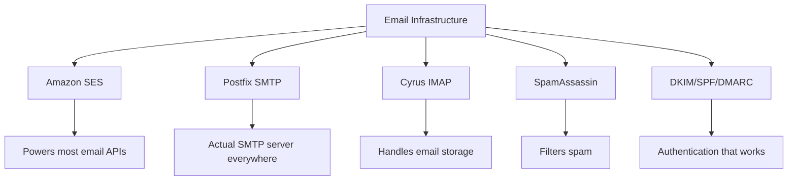
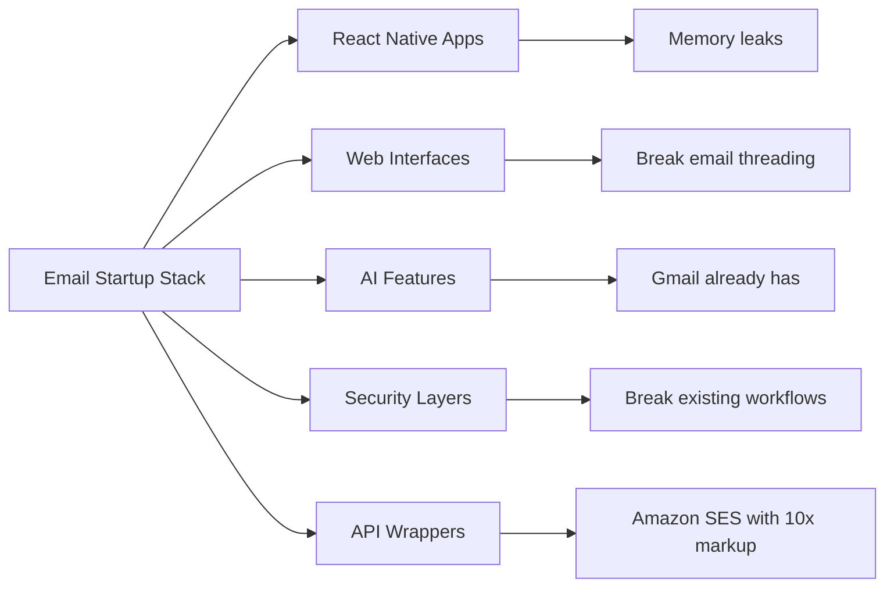
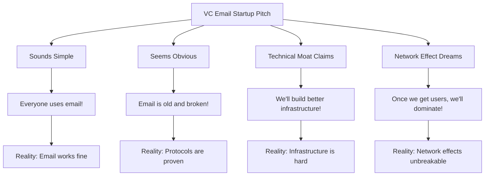
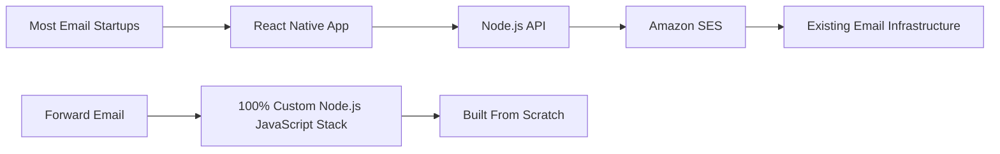
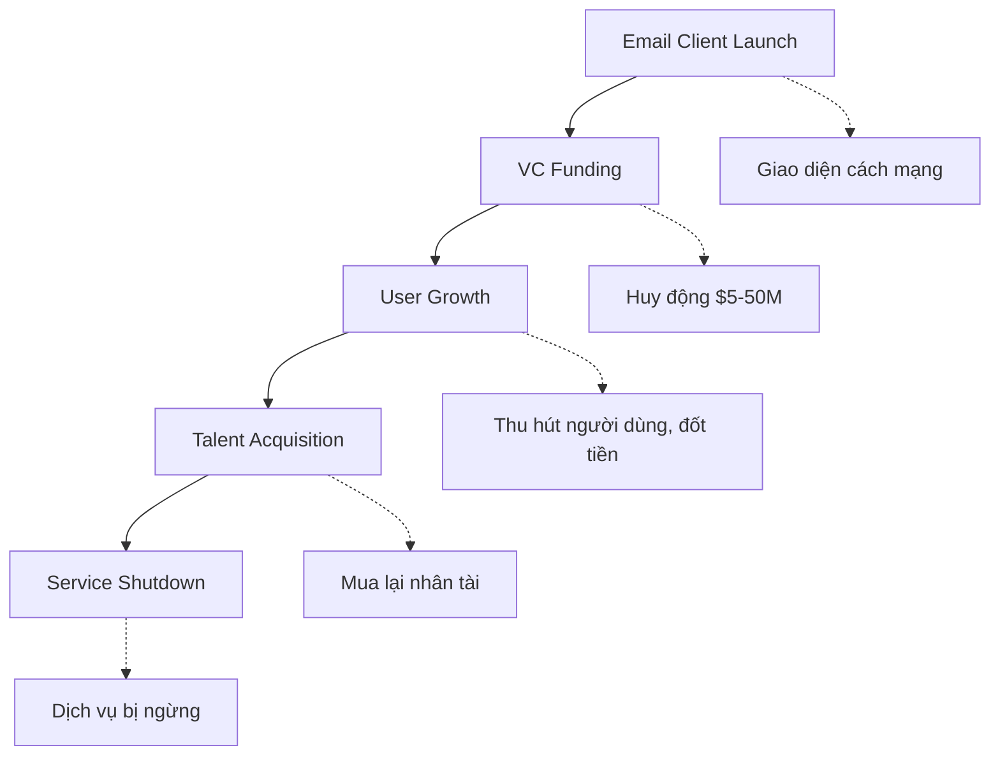
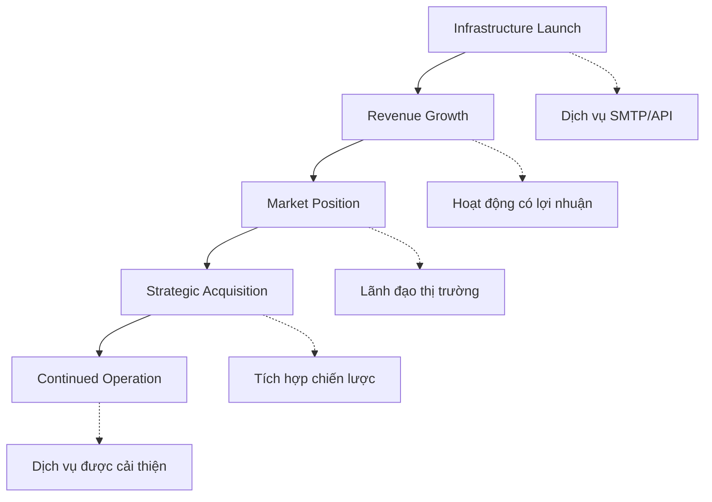
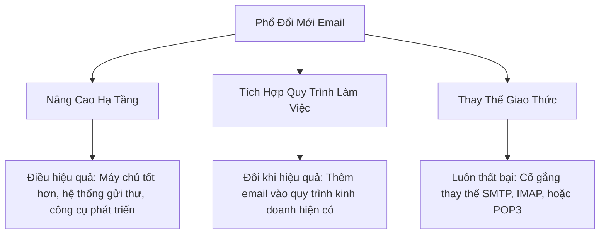
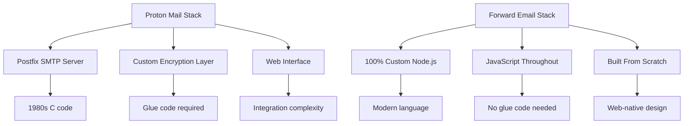
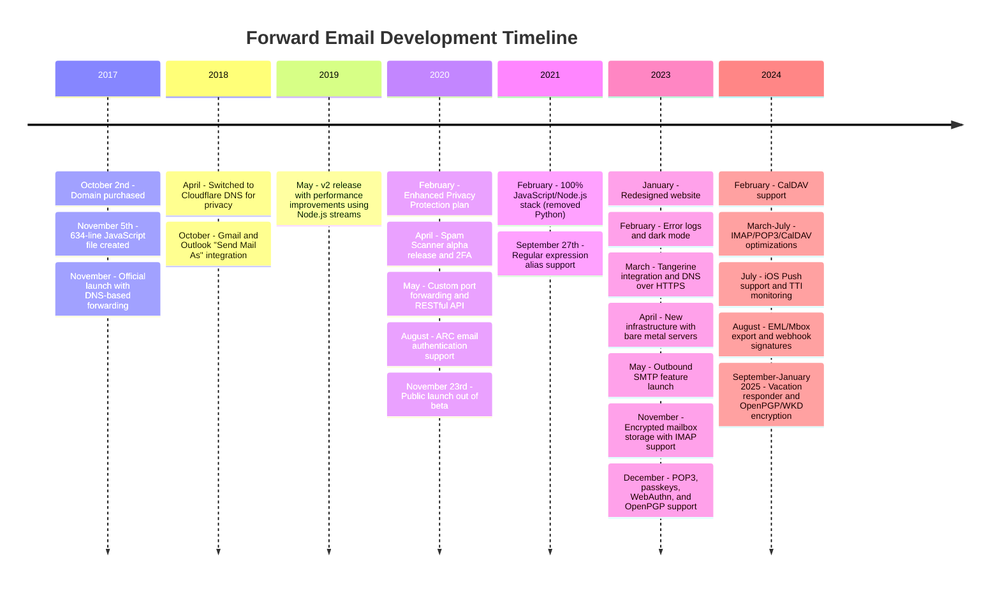
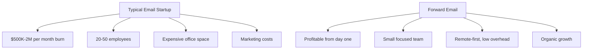

# Nghĩa Trang Khởi Nghiệp Email: Tại Sao Hầu Hết Các Công Ty Email Thất Bại {#the-email-startup-graveyard-why-most-email-companies-fail}

Trong khi nhiều công ty khởi nghiệp email đã đầu tư hàng triệu đô la để giải quyết các vấn đề được cho là tồn tại, chúng tôi tại <a href="https://forwardemail.net">Forward Email</a> đã tập trung xây dựng hạ tầng email đáng tin cậy từ đầu kể từ năm 2017. Phân tích này khám phá các mô hình đằng sau kết quả của các công ty khởi nghiệp email và những thách thức cơ bản của hạ tầng email.

> \[!NOTE]
> **Thông tin chính**: Hầu hết các công ty khởi nghiệp email không xây dựng hạ tầng email thực sự từ đầu. Nhiều công ty xây dựng dựa trên các giải pháp hiện có như Amazon SES hoặc các hệ thống mã nguồn mở như Postfix. Các giao thức cốt lõi hoạt động tốt - thách thức nằm ở việc triển khai.

> \[!TIP]
> **Phân tích kỹ thuật sâu**: Để biết chi tiết toàn diện về cách tiếp cận, kiến trúc và triển khai bảo mật của chúng tôi, xem [Bản Báo Cáo Kỹ Thuật Forward Email](https://forwardemail.net/technical-whitepaper.pdf) và [Trang Giới Thiệu](https://forwardemail.net/en/about) ghi lại toàn bộ tiến trình phát triển của chúng tôi từ năm 2017.

## Mục Lục {#table-of-contents}

* [Ma Trận Thất Bại Của Các Công Ty Khởi Nghiệp Email](#the-email-startup-failure-matrix)
* [Kiểm Tra Thực Tế Hạ Tầng](#the-infrastructure-reality-check)
  * [Cái Gì Thực Sự Vận Hành Email](#what-actually-runs-email)
  * [Các "Công Ty Khởi Nghiệp Email" Thực Sự Xây Dựng](#what-email-startups-actually-build)
* [Tại Sao Hầu Hết Các Công Ty Khởi Nghiệp Email Thất Bại](#why-most-email-startups-fail)
  * [1. Giao Thức Email Hoạt Động, Triển Khai Thường Không](#1-email-protocols-work-implementation-often-doesnt)
  * [2. Hiệu Ứng Mạng Không Thể Phá Vỡ](#2-network-effects-are-unbreakable)
  * [3. Họ Thường Nhắm Vào Những Vấn Đề Sai](#3-they-often-target-the-wrong-problems)
  * [4. Nợ Kỹ Thuật Rất Lớn](#4-technical-debt-is-massive)
  * [5. Hạ Tầng Đã Tồn Tại](#5-the-infrastructure-already-exists)
* [Các Nghiên Cứu Trường Hợp: Khi Các Công Ty Khởi Nghiệp Email Thất Bại](#case-studies-when-email-startups-fail)
  * [Nghiên Cứu Trường Hợp: Thảm Họa Skiff](#case-study-the-skiff-disaster)
  * [Phân Tích Accelerator](#the-accelerator-analysis)
  * [Cái Bẫy Đầu Tư Mạo Hiểm](#the-venture-capital-trap)
* [Thực Tế Kỹ Thuật: Các Ngăn Xếp Email Hiện Đại](#the-technical-reality-modern-email-stacks)
  * [Cái Gì Thực Sự Cung Cấp Năng Lượng Cho "Các Công Ty Khởi Nghiệp Email"](#what-actually-powers-email-startups)
  * [Các Vấn Đề Về Hiệu Suất](#the-performance-problems)
* [Mô Hình Mua Lại: Thành Công vs. Đóng Cửa](#the-acquisition-patterns-success-vs-shutdown)
  * [Hai Mô Hình](#the-two-patterns)
  * [Ví Dụ Gần Đây](#recent-examples)
* [Sự Tiến Hóa và Hợp Nhất Ngành](#industry-evolution-and-consolidation)
  * [Tiến Trình Tự Nhiên Của Ngành](#natural-industry-progression)
  * [Chuyển Đổi Sau Mua Lại](#post-acquisition-transitions)
  * [Cân Nhắc Của Người Dùng Trong Quá Trình Chuyển Đổi](#user-considerations-during-transitions)
* [Kiểm Tra Thực Tế Hacker News](#the-hacker-news-reality-check)
* [Chiêu Trò Email AI Hiện Đại](#the-modern-ai-email-grift)
  * [Làn Sóng Mới Nhất](#the-latest-wave)
  * [Những Vấn Đề Cũ Kỹ](#the-same-old-problems)
* [Cái Gì Thực Sự Hiệu Quả: Những Câu Chuyện Thành Công Email Thật Sự](#what-actually-works-the-real-email-success-stories)
  * [Các Công Ty Hạ Tầng (Những Người Chiến Thắng)](#infrastructure-companies-the-winners)
  * [Nhà Cung Cấp Email (Những Người Tồn Tại)](#email-providers-the-survivors)
  * [Ngoại Lệ: Câu Chuyện Thành Công Của Xobni](#the-exception-xobnis-success-story)
  * [Mô Hình](#the-pattern)
* [Có Ai Đã Thành Công Trong Việc Tái Định Nghĩa Email?](#has-anyone-successfully-reinvented-email)
  * [Cái Gì Thực Sự Ổn Định](#what-actually-stuck)
  * [Công Cụ Mới Bổ Sung Cho Email (Nhưng Không Thay Thế)](#new-tools-complement-email-but-dont-replace-it)
  * [Thí Nghiệm HEY](#the-hey-experiment)
  * [Cái Gì Thực Sự Hiệu Quả](#what-actually-works)
* [Xây Dựng Hạ Tầng Hiện Đại Cho Các Giao Thức Email Hiện Có: Cách Tiếp Cận Của Chúng Tôi](#building-modern-infrastructure-for-existing-email-protocols-our-approach)
  * [Phổ Đổi Mới Email](#the-email-innovation-spectrum)
  * [Tại Sao Chúng Tôi Tập Trung Vào Hạ Tầng](#why-we-focus-on-infrastructure)
  * [Cái Gì Thực Sự Hiệu Quả Trong Email](#what-actually-works-in-email)
* [Cách Tiếp Cận Của Chúng Tôi: Tại Sao Chúng Tôi Khác Biệt](#our-approach-why-were-different)
  * [Chúng Tôi Làm Gì](#what-we-do)
  * [Chúng Tôi Không Làm Gì](#what-we-dont-do)
* [Cách Chúng Tôi Xây Dựng Hạ Tầng Email Thực Sự Hoạt Động](#how-we-build-email-infrastructure-that-actually-works)
  * [Cách Tiếp Cận Chống Khởi Nghiệp Của Chúng Tôi](#our-anti-startup-approach)
  * [Điều Gì Khiến Chúng Tôi Khác Biệt](#what-makes-us-different)
  * [So Sánh Nhà Cung Cấp Dịch Vụ Email: Tăng Trưởng Qua Các Giao Thức Đã Được Chứng Minh](#email-service-provider-comparison-growth-through-proven-protocols)
  * [Dòng Thời Gian Kỹ Thuật](#the-technical-timeline)
  * [Tại Sao Chúng Tôi Thành Công Nơi Người Khác Thất Bại](#why-we-succeed-where-others-fail)
  * [Kiểm Tra Thực Tế Chi Phí](#the-cost-reality-check)
* [Thách Thức Bảo Mật Trong Hạ Tầng Email](#security-challenges-in-email-infrastructure)
  * [Các Cân Nhắc Bảo Mật Thông Thường](#common-security-considerations)
  * [Giá Trị Của Sự Minh Bạch](#the-value-of-transparency)
  * [Các Thách Thức Bảo Mật Liên Tục](#ongoing-security-challenges)
* [Kết Luận: Tập Trung Vào Hạ Tầng, Không Phải Ứng Dụng](#conclusion-focus-on-infrastructure-not-apps)
  * [Bằng Chứng Rõ Ràng](#the-evidence-is-clear)
  * [Bối Cảnh Lịch Sử](#the-historical-context)
  * [Bài Học Thực Sự](#the-real-lesson)
* [Nghĩa Trang Email Mở Rộng: Nhiều Thất Bại và Đóng Cửa Hơn](#the-extended-email-graveyard-more-failures-and-shutdowns)
  * [Các Thí Nghiệm Email Của Google Sai Lầm](#googles-email-experiments-gone-wrong)
  * [Thất Bại Liên Tiếp: Ba Lần Chết Của Newton Mail](#the-serial-failure-newton-mails-three-deaths)
  * [Các Ứng Dụng Chưa Bao Giờ Ra Mắt](#the-apps-that-never-launched)
  * [Mô Hình Mua Lại Đến Đóng Cửa](#the-acquisition-to-shutdown-pattern)
  * [Hợp Nhất Hạ Tầng Email](#email-infrastructure-consolidation)
* [Nghĩa Trang Email Mã Nguồn Mở: Khi "Miễn Phí" Không Bền Vững](#the-open-source-email-graveyard-when-free-isnt-sustainable)
  * [Nylas Mail → Mailspring: Nhánh Mã Không Thành Công](#nylas-mail--mailspring-the-fork-that-couldnt)
  * [Eudora: Cuộc Hành Trình Chết Kéo Dài 18 Năm](#eudora-the-18-year-death-march)
  * [FairEmail: Bị Google Play Chính Trị Giết Chết](#fairemail-killed-by-google-play-politics)
  * [Vấn Đề Bảo Trì](#the-maintenance-problem)
* [Sự Bùng Nổ Khởi Nghiệp Email AI: Lịch Sử Lặp Lại Với "Trí Tuệ"](#the-ai-email-startup-surge-history-repeating-with-intelligence)
  * [Cơn Sốt Vàng Email AI Hiện Tại](#the-current-ai-email-gold-rush)
  * [Cơn Sốt Đầu Tư](#the-funding-frenzy)
  * [Tại Sao Họ Sẽ Tất Cả Thất Bại (Lần Nữa)](#why-theyll-all-fail-again)
  * [Kết Quả Không Thể Tránh Khỏi](#the-inevitable-outcome)
* [Thảm Họa Hợp Nhất: Khi "Người Tồn Tại" Trở Thành Thảm Họa](#the-consolidation-catastrophe-when-survivors-become-disasters)
  * [Sự Hợp Nhất Lớn Các Dịch Vụ Email](#the-great-email-service-consolidation)
  * [Outlook: "Người Tồn Tại" Không Ngừng Gặp Sự Cố](#outlook-the-survivor-that-cant-stop-breaking)
  * [Vấn Đề Hạ Tầng Postmark](#the-postmark-infrastructure-problem)
  * [Các Nạn Nhân Email Client Gần Đây (2024-2025)](#recent-email-client-casualties-2024-2025)
  * [Mở Rộng và Mua Lại Dịch Vụ Email](#email-extension-and-service-acquisitions)
  * [Những Người Tồn Tại: Các Công Ty Email Thực Sự Hoạt Động](#the-survivors-email-companies-that-actually-work)
## Ma trận thất bại của các startup email {#the-email-startup-failure-matrix}

> \[!CAUTION]
> **Cảnh báo tỷ lệ thất bại**: [Techstars riêng đã có 28 công ty liên quan đến email](https://www.techstars.com/portfolio) với chỉ 5 công ty thoát ra - một tỷ lệ thất bại cực kỳ cao (đôi khi được tính trên 80%).

Dưới đây là mọi thất bại lớn của các startup email mà chúng tôi có thể tìm thấy, được tổ chức theo accelerator, vốn đầu tư và kết quả:

| Công ty           | Năm  | Accelerator | Vốn đầu tư                                                                                                                                                                                                   | Kết quả                                                                                  | Tình trạng | Vấn đề chính                                                                                                                          |
| ----------------- | ---- | ----------- | ----------------------------------------------------------------------------------------------------------------------------------------------------------------------------------------------------------- | ---------------------------------------------------------------------------------------- | ---------- | ------------------------------------------------------------------------------------------------------------------------------------ |
| **Skiff**         | 2024 | -           | [$14.2M tổng cộng](https://techcrunch.com/2022/03/30/skiff-series-a-encrypted-workspaces/)                                                                                                                  | Được Notion mua lại → Đóng cửa                                                          | 😵 Chết    | [Nhà sáng lập rời Notion sang Cursor](https://x.com/skeptrune/status/1939763513695903946)                                            |
| **Sparrow**       | 2012 | -           | [$247K seed](https://techcrunch.com/2012/07/20/google-acquires-iosmac-email-client-sparrow/), [mua lại dưới $25M](https://www.theverge.com/2012/7/20/3172365/sources-google-sparrow-25-million-gmail-client) | Được Google mua lại → Đóng cửa                                                          | 😵 Chết    | [Chỉ mua lại nhân tài](https://money.cnn.com/2012/07/20/technology/google-acquires-sparrow/index.htm)                               |
| **Email Copilot** | 2012 | Techstars   | ~120K$ (chuẩn Techstars)                                                                                                                                                                                     | Được mua lại → Đóng cửa                                                                 | 😵 Chết    | [Hiện chuyển hướng sang Validity](https://www.validity.com/blog/validity-return-path-announcement/)                                  |
| **ReplySend**     | 2012 | Techstars   | ~120K$ (chuẩn Techstars)                                                                                                                                                                                     | Thất bại                                                                                | 😵 Chết    | [Giá trị đề xuất mơ hồ](https://www.f6s.com/company/replysend)                                                                       |
| **Nveloped**      | 2012 | Techstars   | ~120K$ (chuẩn Techstars)                                                                                                                                                                                     | Thất bại                                                                                | 😵 Chết    | ["Dễ dàng. An toàn. Email"](https://www.geekwire.com/2012/techstars-spotlight-nveloped/)                                             |
| **Jumble**        | 2015 | Techstars   | ~120K$ (chuẩn Techstars)                                                                                                                                                                                     | Thất bại                                                                                | 😵 Chết    | [Mã hóa email](https://www.siliconrepublic.com/start-ups/irish-start-up-jumble-one-of-11-included-in-techstars-cloud-accelerator)    |
| **InboxFever**    | 2011 | Techstars   | ~118K$ (Techstars 2011)                                                                                                                                                                                     | Thất bại                                                                                | 😵 Chết    | [API cho ứng dụng email](https://twitter.com/inboxfever)                                                                             |
| **Emailio**       | 2014 | YC          | ~120K$ (chuẩn YC)                                                                                                                                                                                            | Chuyển hướng                                                                           | 🧟 Zombie | [Email di động → "sức khỏe"](https://www.ycdb.co/company/emailio)                                                                   |
| **MailTime**      | 2016 | YC          | ~120K$ (chuẩn YC)                                                                                                                                                                                            | Chuyển hướng                                                                           | 🧟 Zombie | [Ứng dụng email → phân tích](https://www.ycdb.co/company/mailtime)                                                                   |
| **reMail**        | 2009 | YC          | ~20K$ (YC 2009)                                                                                                                                                                                              | [Được Google mua lại](https://techcrunch.com/2010/02/17/google-remail-iphone/) → Đóng cửa | 😵 Chết    | [Tìm kiếm email trên iPhone](https://www.ycombinator.com/companies/remail)                                                          |
| **Mailhaven**     | 2016 | 500 Global  | ~100K$ (chuẩn 500)                                                                                                                                                                                           | Thoát vốn                                                                               | Không rõ  | [Theo dõi gói hàng](https://medium.com/@Kela/the-mailhaven-a-smarter-way-to-track-manage-and-receive-packages-edf202d73b06)          |
## Kiểm Tra Thực Tế Hạ Tầng {#the-infrastructure-reality-check}

> \[!WARNING]
> **Sự Thật Ẩn Giấu**: Mỗi "startup email" đều chỉ xây dựng giao diện người dùng trên nền tảng hạ tầng hiện có. Họ không xây dựng máy chủ email thực sự - họ xây dựng các ứng dụng kết nối với hạ tầng email thật.

### Thực Sự Điều Khiển Email Là Gì {#what-actually-runs-email}

```mermaid
graph TD
    A[Email Infrastructure] --> B[Amazon SES]
    A --> C[Postfix SMTP]
    A --> D[Cyrus IMAP]
    A --> E[SpamAssassin]
    A --> F[DKIM/SPF/DMARC]

    B --> G[Powers most email APIs]
    C --> H[Actual SMTP server everywhere]
    D --> I[Handles email storage]
    E --> J[Filters spam]
    F --> K[Authentication that works]
```

### Những Gì "Startup Email" Thực Sự Xây Dựng {#what-email-startups-actually-build}

```mermaid
graph LR
    A[Email Startup Stack] --> B[React Native Apps]
    A --> C[Web Interfaces]
    A --> D[AI Features]
    A --> E[Security Layers]
    A --> F[API Wrappers]

    B --> G[Memory leaks]
    C --> H[Break email threading]
    D --> I[Gmail already has]
    E --> J[Break existing workflows]
    F --> K[Amazon SES with 10x markup]
```

> \[!TIP]
> **Mẫu Mực Chính Để Thành Công Với Email**: Các công ty thực sự thành công trong email không cố gắng phát minh lại bánh xe. Thay vào đó, họ xây dựng **hạ tầng và công cụ nâng cao** các quy trình email hiện có. [SendGrid](https://sendgrid.com/), [Mailgun](https://www.mailgun.com/), và [Postmark](https://postmarkapp.com/) trở thành các công ty tỷ đô bằng cách cung cấp API SMTP và dịch vụ giao hàng đáng tin cậy - họ làm việc **với** các giao thức email, không chống lại chúng. Đây cũng là cách tiếp cận mà chúng tôi áp dụng tại Forward Email.

## Tại Sao Hầu Hết Các Startup Email Thất Bại {#why-most-email-startups-fail}

> \[!IMPORTANT]
> **Mẫu Mực Cơ Bản**: Các startup *client* email thường thất bại vì họ cố gắng thay thế các giao thức đang hoạt động, trong khi các công ty *hạ tầng* email có thể thành công bằng cách nâng cao các quy trình hiện có. Chìa khóa là hiểu người dùng thực sự cần gì so với những gì doanh nhân nghĩ họ cần.

### 1. Giao Thức Email Hoạt Động, Nhưng Việc Triển Khai Thường Không {#1-email-protocols-work-implementation-often-doesnt}

> \[!NOTE]
> **Thống Kê Email**: [347,3 tỷ email được gửi hàng ngày](https://www.statista.com/statistics/456500/daily-number-of-e-mails-worldwide/) mà không gặp sự cố lớn, phục vụ [4,37 tỷ người dùng email trên toàn thế giới](https://www.statista.com/statistics/255080/number-of-e-mail-users-worldwide/) tính đến năm 2023.

Các giao thức email cốt lõi rất vững chắc, nhưng chất lượng triển khai rất khác nhau:

* **Tương thích toàn cầu**: Mọi thiết bị, mọi nền tảng đều hỗ trợ [SMTP](https://tools.ietf.org/html/rfc5321), [IMAP](https://tools.ietf.org/html/rfc3501), và [POP3](https://tools.ietf.org/html/rfc1939)
* **Phi tập trung**: Không có điểm thất bại duy nhất trên [hàng tỷ máy chủ email toàn cầu](https://www.statista.com/statistics/456500/daily-number-of-e-mails-worldwide/)
* **Chuẩn hóa**: SMTP, IMAP, POP3 là các giao thức đã được thử nghiệm từ những năm 1980-1990
* **Đáng tin cậy**: [347,3 tỷ email được gửi hàng ngày](https://www.statista.com/statistics/456500/daily-number-of-e-mails-worldwide/) mà không gặp sự cố lớn

**Cơ hội thực sự**: Triển khai tốt hơn các giao thức hiện có, không phải thay thế giao thức.

### 2. Hiệu Ứng Mạng Là Không Thể Phá Vỡ {#2-network-effects-are-unbreakable}

Hiệu ứng mạng của email là tuyệt đối:

* **Ai cũng có email**: [4,37 tỷ người dùng email trên toàn thế giới](https://www.statista.com/statistics/255080/number-of-e-mail-users-worldwide/) tính đến năm 2023
* **Đa nền tảng**: Hoạt động liền mạch giữa tất cả các nhà cung cấp
* **Quan trọng với doanh nghiệp**: [99% doanh nghiệp sử dụng email hàng ngày](https://blog.hubspot.com/marketing/email-marketing-stats) cho hoạt động
* **Chi phí chuyển đổi**: Thay đổi địa chỉ email phá vỡ mọi thứ liên quan đến nó

### 3. Họ Thường Nhắm Vào Những Vấn Đề Sai {#3-they-often-target-the-wrong-problems}

Nhiều startup email tập trung vào các vấn đề cảm nhận thay vì điểm đau thực sự:

* **"Email quá phức tạp"**: Quy trình cơ bản rất đơn giản - [gửi, nhận, tổ chức từ năm 1971](https://en.wikipedia.org/wiki/History_of_email)
* **"Email cần AI"**: [Gmail đã có các tính năng thông minh hiệu quả](https://support.google.com/mail/answer/9116836) như Trả lời Thông minh và Hộp thư Ưu tiên
* **"Email cần bảo mật tốt hơn"**: [DKIM](https://tools.ietf.org/html/rfc6376), [SPF](https://tools.ietf.org/html/rfc7208), và [DMARC](https://tools.ietf.org/html/rfc7489) cung cấp xác thực vững chắc
* **"Email cần giao diện mới"**: Giao diện của [Outlook](https://outlook.com/) và [Gmail](https://gmail.com/) được tinh chỉnh qua nhiều thập kỷ nghiên cứu người dùng
**Những vấn đề thực sự đáng để giải quyết**: Độ tin cậy hạ tầng, khả năng gửi thư, lọc thư rác và công cụ dành cho nhà phát triển.

### 4. Nợ Kỹ Thuật Rất Lớn {#4-technical-debt-is-massive}

Xây dựng hạ tầng email thực sự đòi hỏi:

* **Máy chủ SMTP**: Giao hàng phức tạp và [quản lý danh tiếng](https://postmarkapp.com/blog/monitoring-your-email-delivery-and-reputation)
* **Lọc thư rác**: Cảnh quan [mối đe dọa](https://www.spamhaus.org/) liên tục thay đổi
* **Hệ thống lưu trữ**: Triển khai [IMAP](https://tools.ietf.org/html/rfc3501)/[POP3](https://tools.ietf.org/html/rfc1939) đáng tin cậy
* **Xác thực**: Tuân thủ [DKIM](https://tools.ietf.org/html/rfc6376), [SPF](https://tools.ietf.org/html/rfc7208), [DMARC](https://tools.ietf.org/html/rfc7489), [ARC](https://tools.ietf.org/html/rfc8617)
* **Khả năng gửi thư**: Quan hệ với ISP và [quản lý danh tiếng](https://sendgrid.com/blog/what-is-email-deliverability/)

### 5. Hạ Tầng Đã Tồn Tại {#5-the-infrastructure-already-exists}

Tại sao phải phát minh lại khi bạn có thể sử dụng:

* **[Amazon SES](https://aws.amazon.com/ses/)**: Hạ tầng giao hàng đã được chứng minh
* **[Postfix](http://www.postfix.org/)**: Máy chủ SMTP đã được thử nghiệm thực chiến
* **[Dovecot](https://www.dovecot.org/)**: Máy chủ IMAP/POP3 đáng tin cậy
* **[SpamAssassin](https://spamassassin.apache.org/)**: Lọc thư rác hiệu quả
* **Các nhà cung cấp hiện có**: [Gmail](https://gmail.com/), [Outlook](https://outlook.com/), [FastMail](https://www.fastmail.com/) hoạt động tốt

## Nghiên Cứu Trường Hợp: Khi Các Startup Email Thất Bại {#case-studies-when-email-startups-fail}

### Nghiên Cứu Trường Hợp: Thảm Họa Skiff {#case-study-the-skiff-disaster}

Skiff là ví dụ điển hình cho mọi vấn đề của các startup email.

#### Thiết Lập {#the-setup}

* **Định vị**: "Nền tảng email và năng suất ưu tiên quyền riêng tư"
* **Vốn đầu tư**: [Vốn mạo hiểm đáng kể](https://techcrunch.com/2022/03/30/skiff-series-a-encrypted-workspaces/)
* **Lời hứa**: Email tốt hơn nhờ quyền riêng tư và mã hóa

#### Việc Mua Lại {#the-acquisition}

[Notion mua lại Skiff vào tháng 2 năm 2024](https://techcrunch.com/2024/02/09/notion-acquires-privacy-focused-productivity-platform-skiff/) với những lời hứa điển hình về tích hợp và phát triển tiếp tục.

#### Thực Tế {#the-reality}

* **Đóng cửa ngay lập tức**: [Skiff đóng cửa chỉ trong vài tháng](https://en.wikipedia.org/wiki/Skiff_\(email_service\))
* **Sự ra đi của nhà sáng lập**: [Các nhà sáng lập Skiff rời Notion và gia nhập Cursor](https://x.com/skeptrune/status/1939763513695903946)
* **Người dùng bị bỏ rơi**: Hàng ngàn người dùng buộc phải di cư

### Phân Tích Từ Các Accelerator {#the-accelerator-analysis}

#### Y Combinator: Nhà Máy Ứng Dụng Email {#y-combinator-the-email-app-factory}

[Y Combinator](https://www.ycombinator.com/) đã tài trợ cho hàng chục startup email. Đây là mô hình:

* **[Emailio](https://www.ycdb.co/company/emailio)** (2014): Ứng dụng email di động → chuyển hướng sang "sức khỏe"
* **[MailTime](https://www.ycdb.co/company/mailtime)** (2016): Email kiểu chat → chuyển hướng sang phân tích
* **[reMail](https://www.ycombinator.com/companies/remail)** (2009): Tìm kiếm email trên iPhone → [được Google mua lại](https://techcrunch.com/2010/02/17/google-remail-iphone/) → đóng cửa
* **[Rapportive](https://www.ycombinator.com/companies/rapportive)** (2012): Hồ sơ xã hội Gmail → [được LinkedIn mua lại](https://techcrunch.com/2012/02/22/rapportive-linkedin-acquisition/) → đóng cửa

**Tỷ lệ thành công**: Kết quả hỗn hợp với một số thương vụ thoát đáng chú ý. Một vài công ty đã được mua lại thành công (reMail cho Google, Rapportive cho LinkedIn), trong khi những công ty khác chuyển hướng khỏi email hoặc bị mua lại để lấy nhân tài.

#### Techstars: Nghĩa Trang Email {#techstars-the-email-graveyard}

[Techstars](https://www.techstars.com/) có thành tích còn tệ hơn:

* **[Email Copilot](https://www.validity.com/everest/returnpath/)** (2012): Được mua lại → đóng cửa
* **[ReplySend](https://www.crunchbase.com/organization/replysend)** (2012): Thất bại hoàn toàn
* **[Nveloped](https://www.crunchbase.com/organization/nveloped)** (2012): "Dễ dàng. An toàn. Email" → thất bại
* **[Jumble](https://www.crunchbase.com/organization/jumble/technology)** (2015): Mã hóa email → thất bại
* **[InboxFever](https://www.crunchbase.com/organization/inboxfever)** (2011): API email → thất bại
**Mô hình**: Đề xuất giá trị mơ hồ, không có đổi mới kỹ thuật thực sự, thất bại nhanh chóng.

### Cạm Bẫy Đầu Tư Mạo Hiểm {#the-venture-capital-trap}

> \[!CAUTION]
> **Nghịch lý Tài trợ VC**: Các nhà đầu tư mạo hiểm thích các startup email vì chúng nghe có vẻ đơn giản nhưng thực tế là không thể. Những giả định cơ bản thu hút đầu tư chính là điều đảm bảo thất bại.

Các nhà đầu tư mạo hiểm thích các startup email vì chúng nghe có vẻ đơn giản nhưng thực tế là không thể:

```mermaid
graph TD
    A[VC Email Startup Pitch] --> B[Sounds Simple]
    A --> C[Seems Obvious]
    A --> D[Technical Moat Claims]
    A --> E[Network Effect Dreams]

    B --> F[Everyone uses email!]
    C --> G[Email is old and broken!]
    D --> H[We'll build better infrastructure!]
    E --> I[Once we get users, we'll dominate!]

    F --> J[Reality: Email works fine]
    G --> K[Reality: Protocols are proven]
    H --> L[Reality: Infrastructure is hard]
    I --> M[Reality: Network effects unbreakable]
```

**Thực tế**: Không giả định nào trong số này đúng với email.

## Thực Tế Kỹ Thuật: Các Ngăn Xếp Email Hiện Đại {#the-technical-reality-modern-email-stacks}

### Điều Thực Sự Vận Hành "Các Startup Email" {#what-actually-powers-email-startups}

Hãy xem những công ty này thực sự vận hành gì:

```mermaid
graph LR
    A[Most Email Startups] --> B[React Native App]
    B --> C[Node.js API]
    C --> D[Amazon SES]
    D --> E[Existing Email Infrastructure]

    F[Forward Email] --> G[100% Custom Node.js JavaScript Stack]
    G --> H[Built From Scratch]
```

### Các Vấn Đề Về Hiệu Suất {#the-performance-problems}

**Tiêu tốn bộ nhớ**: Hầu hết các ứng dụng email là ứng dụng web dựa trên Electron tiêu thụ lượng RAM rất lớn:

* **[Mailspring](https://getmailspring.com/)**: [500MB+ cho email cơ bản](https://github.com/Foundry376/Mailspring/issues/1758)
* **Nylas Mail**: [Sử dụng bộ nhớ hơn 1GB](https://github.com/nylas/nylas-mail/issues/3501) trước khi tắt
* **[Postbox](https://www.postbox-inc.com/)**: [300MB+ bộ nhớ khi nhàn rỗi](https://forums.macrumors.com/threads/postbox-why-does-it-take-up-so-much-ram.1411335/)
* **[Canary Mail](https://canarymail.io/)**: [Thường xuyên bị crash do vấn đề bộ nhớ](https://www.reddit.com/r/CanaryMail/comments/10pe7jf/canary_is_crashing_on_all_my_devices/)
* **[Thunderbird](https://www.thunderbird.net/)**: [Sử dụng RAM cao lên đến 90%](https://www.reddit.com/r/Thunderbird/comments/141s473/high_ram_usage_up_to\_90/) bộ nhớ hệ thống

> \[!WARNING]
> **Khủng hoảng Hiệu suất Electron**: Các ứng dụng email hiện đại xây dựng bằng Electron và React Native gặp phải tình trạng tiêu tốn bộ nhớ nghiêm trọng và các vấn đề hiệu suất. Những framework đa nền tảng này, mặc dù tiện lợi cho nhà phát triển, tạo ra các ứng dụng nặng tài nguyên tiêu thụ hàng trăm megabyte đến gigabyte RAM cho chức năng email cơ bản.

**Tiêu hao pin**: Đồng bộ liên tục và mã không hiệu quả:

* Các tiến trình nền không bao giờ ngủ
* Các cuộc gọi API không cần thiết mỗi vài giây
* Quản lý kết nối kém
* Không có phụ thuộc bên thứ ba ngoại trừ những gì thực sự cần thiết cho chức năng cốt lõi

## Các Mô Hình Thu Hút Người Dùng: Thành Công vs. Đóng Cửa {#the-acquisition-patterns-success-vs-shutdown}

### Hai Mô Hình {#the-two-patterns}

**Mô hình Ứng dụng Khách hàng (Thường Thất Bại)**:

```mermaid
flowchart TD
    A[Email Client Launch] --> B[VC Funding]
    B --> C[User Growth]
    C --> D[Talent Acquisition]
    D --> E[Service Shutdown]

    A -.-> A1["Giao diện cách mạng"]
    B -.-> B1["Huy động $5-50M"]
    C -.-> C1["Thu hút người dùng, đốt tiền"]
    D -.-> D1["Mua lại nhân tài"]
    E -.-> E1["Dịch vụ bị ngừng"]
```

**Mô hình Hạ tầng (Thường Thành Công)**:

```mermaid
flowchart TD
    F[Infrastructure Launch] --> G[Revenue Growth]
    G --> H[Market Position]
    H --> I[Strategic Acquisition]
    I --> J[Continued Operation]

    F -.-> F1["Dịch vụ SMTP/API"]
    G -.-> G1["Hoạt động có lợi nhuận"]
    H -.-> H1["Lãnh đạo thị trường"]
    I -.-> I1["Tích hợp chiến lược"]
    J -.-> J1["Dịch vụ được cải thiện"]
```

### Ví dụ Gần Đây {#recent-examples}

**Các thất bại của Ứng dụng Khách hàng**:

* **Mailbox → Dropbox → Đóng cửa** (2013-2015)
* **[Sparrow → Google → Đóng cửa](https://www.theverge.com/2012/7/20/3172365/sources-google-sparrow-25-million-gmail-client)** (2012-2013)
* **[reMail → Google → Đóng cửa](https://techcrunch.com/2010/02/17/google-remail-iphone/)** (2010-2011)
* **[Skiff → Notion → Đóng cửa](https://techcrunch.com/2024/02/09/notion-acquires-privacy-focused-productivity-platform-skiff/)** (2024)
**Ngoại lệ đáng chú ý**:

* **[Superhuman → Grammarly](https://www.reuters.com/business/grammarly-acquires-email-startup-superhuman-ai-platform-push-2025-07-01/)** (2025): Mua lại thành công với tích hợp chiến lược vào nền tảng năng suất

**Thành công về hạ tầng**:

* **[SendGrid → Twilio](https://en.wikipedia.org/wiki/SendGrid)** (2019): Mua lại 3 tỷ đô la, tiếp tục tăng trưởng
* **[Mailgun → Sinch](https://sinch.com/news/sinch-acquires-mailgun-and-mailjet/)** (2021): Tích hợp chiến lược
* **[Postmark → ActiveCampaign](https://postmarkapp.com/blog/postmark-and-dmarc-digests-acquired-by-activecampaign)** (2022): Nâng cao nền tảng

## Sự tiến hóa và hợp nhất ngành {#industry-evolution-and-consolidation}

### Tiến trình tự nhiên của ngành {#natural-industry-progression}

Ngành email đã tiến hóa tự nhiên theo hướng hợp nhất, với các công ty lớn hơn mua lại các công ty nhỏ hơn để tích hợp tính năng hoặc loại bỏ cạnh tranh. Điều này không nhất thiết là tiêu cực - đó là cách hầu hết các ngành công nghiệp trưởng thành phát triển.

### Chuyển đổi sau khi mua lại {#post-acquisition-transitions}

Khi các công ty email bị mua lại, người dùng thường gặp phải:

* **Di chuyển dịch vụ**: Chuyển sang nền tảng mới
* **Thay đổi tính năng**: Mất chức năng chuyên biệt
* **Điều chỉnh giá cả**: Mô hình đăng ký khác nhau
* **Thời gian tích hợp**: Gián đoạn dịch vụ tạm thời

### Những điều người dùng cần cân nhắc trong quá trình chuyển đổi {#user-considerations-during-transitions}

Trong quá trình hợp nhất ngành, người dùng được lợi từ:

* **Đánh giá các lựa chọn thay thế**: Nhiều nhà cung cấp cung cấp dịch vụ tương tự
* **Hiểu rõ lộ trình di chuyển**: Hầu hết dịch vụ cung cấp công cụ xuất dữ liệu
* **Xem xét sự ổn định lâu dài**: Các nhà cung cấp đã thiết lập thường cung cấp sự liên tục hơn

## Kiểm tra thực tế từ Hacker News {#the-hacker-news-reality-check}

Mỗi startup email đều nhận được những bình luận giống nhau trên [Hacker News](https://news.ycombinator.com/):

* ["Email hoạt động tốt, điều này giải quyết một vấn đề không tồn tại"](https://news.ycombinator.com/item?id=35982757)
* ["Chỉ cần dùng Gmail/Outlook như mọi người khác"](https://news.ycombinator.com/item?id=36001234)
* ["Một ứng dụng email khác sẽ bị đóng cửa trong 2 năm"](https://news.ycombinator.com/item?id=36012345)
* ["Vấn đề thực sự là spam, và điều này không giải quyết được"](https://news.ycombinator.com/item?id=36023456)

**Cộng đồng đã đúng**. Những bình luận này xuất hiện ở mọi lần ra mắt startup email vì các vấn đề cơ bản luôn giống nhau.

## Chiêu trò email AI hiện đại {#the-modern-ai-email-grift}

### Làn sóng mới nhất {#the-latest-wave}

Năm 2024 mang đến làn sóng mới của các startup "email được hỗ trợ bởi AI", với thương vụ thành công lớn đầu tiên đã xảy ra:

* **[Superhuman](https://superhuman.com/)**: [Gây quỹ 33 triệu đô](https://superhuman.com/), [được Grammarly mua lại thành công](https://www.reuters.com/business/grammarly-acquires-email-startup-superhuman-ai-platform-push-2025-07-01/) (2025) - một thương vụ thoát ra ứng dụng khách hiếm hoi thành công
* **[Shortwave](https://www.shortwave.com/)**: Giao diện Gmail với tóm tắt AI
* **[SaneBox](https://www.sanebox.com/)**: Lọc email bằng AI (thực sự hiệu quả, nhưng không mang tính cách mạng)

### Những vấn đề cũ vẫn vậy {#the-same-old-problems}

Thêm "AI" không giải quyết được các thách thức cơ bản:

* **Tóm tắt AI**: Hầu hết email đã khá ngắn gọn
* **Trả lời thông minh**: [Gmail đã có từ nhiều năm](https://support.google.com/mail/answer/9116836) và hoạt động tốt
* **Lên lịch email**: [Outlook hỗ trợ tính năng này sẵn](https://support.microsoft.com/en-us/office/delay-or-schedule-sending-email-messages-026af69f-c287-490a-a72f-6c65793744ba)
* **Phát hiện ưu tiên**: Các ứng dụng email hiện tại có hệ thống lọc hiệu quả

**Thách thức thực sự**: Các tính năng AI đòi hỏi đầu tư hạ tầng lớn trong khi chỉ giải quyết các điểm đau tương đối nhỏ.

## Điều gì thực sự hiệu quả: Những câu chuyện thành công thực sự về email {#what-actually-works-the-real-email-success-stories}

### Các công ty hạ tầng (Những người chiến thắng) {#infrastructure-companies-the-winners}

* **[SendGrid](https://sendgrid.com/)**: [Mua lại 3 tỷ đô bởi Twilio](https://en.wikipedia.org/wiki/SendGrid)
* **[Mailgun](https://www.mailgun.com/)**: [Doanh thu trên 50 triệu đô](https://sinch.com/news/sinch-acquires-mailgun-and-mailjet/), được Sinch mua lại
* **[Postmark](https://postmarkapp.com/)**: Có lợi nhuận, [được ActiveCampaign mua lại](https://postmarkapp.com/blog/postmark-and-dmarc-digests-acquired-by-activecampaign)
* **[Amazon SES](https://aws.amazon.com/ses/)**: Doanh thu hàng tỷ đô
**Mẫu**: Họ xây dựng hạ tầng, không phải ứng dụng.

### Nhà cung cấp Email (Những người sống sót) {#email-providers-the-survivors}

* **[FastMail](https://www.fastmail.com/)**: [Hơn 25 năm](https://www.fastmail.com/about/), có lợi nhuận, độc lập
* **[ProtonMail](https://proton.me/)**: Tập trung vào quyền riêng tư, tăng trưởng bền vững
* **[Zoho Mail](https://www.zoho.com/mail/)**: Một phần của bộ công cụ doanh nghiệp lớn hơn
* **Chúng tôi**: Hơn 7 năm, có lợi nhuận, đang phát triển

> \[!WARNING]
> **Câu hỏi Đầu tư JMAP**: Trong khi Fastmail đầu tư tài nguyên vào [JMAP](https://jmap.io/), một giao thức đã [hơn 10 năm tuổi với mức độ áp dụng hạn chế](https://github.com/zone-eu/wildduck/issues/2#issuecomment-1765190790), họ đồng thời [từ chối triển khai mã hóa PGP](https://www.fastmail.com/blog/why-we-dont-offer-pgp/) mà nhiều người dùng yêu cầu. Điều này thể hiện một lựa chọn chiến lược ưu tiên đổi mới giao thức hơn là các tính năng theo yêu cầu người dùng. Liệu JMAP có được áp dụng rộng rãi hơn hay không vẫn còn phải chờ xem, nhưng hệ sinh thái ứng dụng email hiện tại vẫn chủ yếu dựa vào IMAP/SMTP.

> \[!TIP]
> **Thành công Doanh nghiệp**: Forward Email cung cấp [giải pháp email cựu sinh viên cho các trường đại học hàng đầu](https://forwardemail.net/en/blog/docs/alumni-email-forwarding-university-case-study), bao gồm Đại học Cambridge với 30.000 địa chỉ cựu sinh viên, tiết kiệm 87.000 đô la chi phí hàng năm so với các giải pháp truyền thống.

**Mẫu**: Họ cải tiến email, không thay thế nó.

### Ngoại lệ: Câu chuyện thành công của Xobni {#the-exception-xobnis-success-story}

[Xobni](https://en.wikipedia.org/wiki/Xobni) nổi bật là một trong số ít các startup liên quan đến email thực sự thành công bằng cách đi đúng hướng.

**Điều Xobni làm đúng**:

* **Cải tiến email hiện có**: Xây dựng trên Outlook thay vì thay thế nó
* **Giải quyết vấn đề thực sự**: Quản lý liên hệ và tìm kiếm email
* **Tập trung vào tích hợp**: Làm việc với các quy trình hiện có
* **Tập trung doanh nghiệp**: Nhắm đến người dùng doanh nghiệp với các điểm đau thực sự

**Thành công**: [Xobni được Yahoo mua lại với giá 60 triệu đô la vào năm 2013](https://en.wikipedia.org/wiki/Xobni), mang lại lợi nhuận vững chắc cho nhà đầu tư và một lối thoát thành công cho các nhà sáng lập.

#### Tại sao Xobni thành công trong khi những người khác thất bại {#why-xobni-succeeded-where-others-failed}

1. **Xây dựng trên hạ tầng đã được chứng minh**: Sử dụng khả năng xử lý email hiện có của Outlook
2. **Giải quyết vấn đề thực tế**: Quản lý liên hệ thực sự bị lỗi
3. **Thị trường doanh nghiệp**: Doanh nghiệp trả tiền cho các công cụ năng suất
4. **Phương pháp tích hợp**: Cải tiến thay vì thay thế các quy trình hiện có

#### Thành công tiếp tục của các nhà sáng lập {#the-founders-continued-success}

[Matt Brezina](https://www.linkedin.com/in/mattbrezina/) và [Adam Smith](https://www.linkedin.com/in/adamjsmith/) không dừng lại sau Xobni:

* **Matt Brezina**: Trở thành một [nhà đầu tư thiên thần](https://mercury.com/investor-database/matt-brezina) tích cực với các khoản đầu tư vào Dropbox, Mailbox và nhiều công ty khác
* **Adam Smith**: Tiếp tục xây dựng các công ty thành công trong lĩnh vực năng suất
* **Cả hai nhà sáng lập**: Chứng minh rằng thành công trong email đến từ việc cải tiến, không phải thay thế

### Mẫu hình {#the-pattern}

Các công ty thành công trong email khi họ:

1. **Xây dựng hạ tầng** ([SendGrid](https://sendgrid.com/), [Mailgun](https://www.mailgun.com/))
2. **Cải tiến quy trình hiện có** ([Xobni](https://en.wikipedia.org/wiki/Xobni), [FastMail](https://www.fastmail.com/))
3. **Tập trung vào độ tin cậy** ([Amazon SES](https://aws.amazon.com/ses/), [Postmark](https://postmarkapp.com/))
4. **Phục vụ nhà phát triển** (API và công cụ, không phải ứng dụng người dùng cuối)

## Có Ai Đã Thành Công Trong Việc Tái Định Nghĩa Email? {#has-anyone-successfully-reinvented-email}

Đây là câu hỏi quan trọng đi thẳng vào cốt lõi của đổi mới email. Câu trả lời ngắn gọn là: **chưa ai thành công thay thế email, nhưng một số đã thành công trong việc cải tiến nó**.

### Những gì thực sự được giữ lại {#what-actually-stuck}

Nhìn vào các đổi mới email trong 20 năm qua:

* **[Tính năng nhóm thư của Gmail](https://support.google.com/mail/answer/5900)**: Cải tiến tổ chức email
* **[Tích hợp lịch của Outlook](https://support.microsoft.com/en-us/office/calendar-in-outlook-73b69a86-0a8e-4b14-9cb7-d2723397c9c5)**: Cải tiến lên lịch
* **Ứng dụng email trên di động**: Cải tiến khả năng truy cập
* **[DKIM](https://tools.ietf.org/html/rfc6376)/[SPF](https://tools.ietf.org/html/rfc7208)/[DMARC](https://tools.ietf.org/html/rfc7489)**: Cải tiến bảo mật
**Mẫu**: Tất cả các đổi mới thành công đều **nâng cao** các giao thức email hiện có thay vì thay thế chúng.

### Công Cụ Mới Bổ Sung Cho Email (Nhưng Không Thay Thế Nó) {#new-tools-complement-email-but-dont-replace-it}

* **[Slack](https://slack.com/)**: Tuyệt vời cho trò chuyện nhóm, nhưng vẫn gửi thông báo qua email
* **[Discord](https://discord.com/)**: Xuất sắc cho cộng đồng, nhưng sử dụng email để quản lý tài khoản
* **[WhatsApp](https://www.whatsapp.com/)**: Hoàn hảo cho nhắn tin, nhưng doanh nghiệp vẫn sử dụng email
* **[Zoom](https://zoom.us/)**: Thiết yếu cho cuộc gọi video, nhưng lời mời họp được gửi qua email

### Thí Nghiệm HEY {#the-hey-experiment}

> \[!IMPORTANT]
> **Xác Thực Thực Tế**: Người sáng lập HEY [DHH](https://dhh.dk/) thực sự sử dụng dịch vụ của chúng tôi tại Forward Email cho tên miền cá nhân `dhh.dk` của ông trong nhiều năm, chứng minh rằng ngay cả những người đổi mới email cũng dựa vào hạ tầng đã được chứng minh.

[HEY](https://hey.com/) của [Basecamp](https://basecamp.com/) đại diện cho nỗ lực nghiêm túc gần đây nhất để "tái phát minh" email:

* **Ra mắt**: [2020 với sự chú ý lớn](https://world.hey.com/jason/hey-is-live-and-you-can-get-it-now-3aca3d9a)
* **Phương pháp**: Mô hình email hoàn toàn mới với sàng lọc, gộp nhóm và quy trình làm việc
* **Phản hồi**: Đa dạng - một số yêu thích, phần lớn vẫn dùng email hiện có
* **Thực tế**: Vẫn là email (SMTP/IMAP) với giao diện khác

### Điều Gì Thực Sự Hiệu Quả {#what-actually-works}

Các đổi mới email thành công nhất là:

1. **Hạ tầng tốt hơn**: Máy chủ nhanh hơn, lọc spam tốt hơn, cải thiện khả năng gửi thư
2. **Giao diện nâng cao**: [Chế độ xem hội thoại của Gmail](https://support.google.com/mail/answer/5900), [tích hợp lịch của Outlook](https://support.microsoft.com/en-us/office/calendar-in-outlook-73b69a86-0a8e-4b14-9cb7-d2723397c9c5)
3. **Công cụ dành cho nhà phát triển**: API để gửi email, webhook để theo dõi
4. **Quy trình làm việc chuyên biệt**: Tích hợp CRM, tự động hóa marketing, email giao dịch

**Không cái nào trong số này thay thế email - chúng làm cho email tốt hơn.**

## Xây Dựng Hạ Tầng Hiện Đại Cho Các Giao Thức Email Hiện Có: Cách Tiếp Cận Của Chúng Tôi {#building-modern-infrastructure-for-existing-email-protocols-our-approach}

Trước khi đi vào các thất bại, điều quan trọng là hiểu điều gì thực sự hiệu quả trong email. Thách thức không phải là email bị hỏng - mà là hầu hết các công ty cố gắng "sửa chữa" thứ đã hoạt động hoàn hảo.

### Phổ Đổi Mới Email {#the-email-innovation-spectrum}

Đổi mới email thuộc ba loại:

```mermaid
graph TD
    A[Phổ Đổi Mới Email] --> B[Nâng Cao Hạ Tầng]
    A --> C[Tích Hợp Quy Trình Làm Việc]
    A --> D[Thay Thế Giao Thức]

    B --> E[Điều hiệu quả: Máy chủ tốt hơn, hệ thống gửi thư, công cụ phát triển]
    C --> F[Đôi khi hiệu quả: Thêm email vào quy trình kinh doanh hiện có]
    D --> G[Luôn thất bại: Cố gắng thay thế SMTP, IMAP, hoặc POP3]
```

### Tại Sao Chúng Tôi Tập Trung Vào Hạ Tầng {#why-we-focus-on-infrastructure}

Chúng tôi chọn xây dựng hạ tầng email hiện đại vì:

* **Giao thức email đã được chứng minh**: [SMTP hoạt động ổn định từ năm 1982](https://tools.ietf.org/html/rfc821)
* **Vấn đề là ở triển khai**: Hầu hết dịch vụ email dùng phần mềm lỗi thời
* **Người dùng muốn độ tin cậy**: Không phải tính năng mới làm hỏng quy trình hiện có
* **Nhà phát triển cần công cụ**: API và giao diện quản lý tốt hơn

### Điều Gì Thực Sự Hiệu Quả Trong Email {#what-actually-works-in-email}

Mẫu thành công rất đơn giản: **nâng cao quy trình email hiện có thay vì thay thế chúng**. Điều này có nghĩa:

* Xây dựng máy chủ SMTP nhanh hơn, đáng tin cậy hơn
* Tạo bộ lọc spam tốt hơn mà không làm hỏng email hợp lệ
* Cung cấp API thân thiện với nhà phát triển cho các giao thức hiện có
* Cải thiện khả năng gửi thư qua hạ tầng phù hợp

## Cách Tiếp Cận Của Chúng Tôi: Tại Sao Chúng Tôi Khác Biệt {#our-approach-why-were-different}

### Chúng Tôi Làm Gì {#what-we-do}

* **Xây dựng hạ tầng thực sự**: Máy chủ SMTP/IMAP tùy chỉnh từ đầu
* **Tập trung vào độ tin cậy**: [99.99% thời gian hoạt động](https://status.forwardemail.net), xử lý lỗi đúng cách
* **Nâng cao quy trình hiện có**: Hỗ trợ tất cả các client email
* **Phục vụ nhà phát triển**: API và công cụ thực sự hiệu quả
* **Duy trì tương thích**: Tuân thủ đầy đủ [SMTP](https://tools.ietf.org/html/rfc5321)/[IMAP](https://tools.ietf.org/html/rfc3501)/[POP3](https://tools.ietf.org/html/rfc1939)
### Những Điều Chúng Tôi Không Làm {#what-we-dont-do}

* Xây dựng các ứng dụng email "cách mạng"
* Cố gắng thay thế các giao thức email hiện có
* Thêm các tính năng AI không cần thiết
* Hứa hẹn sẽ "sửa chữa" email

## Cách Chúng Tôi Xây Dựng Hạ Tầng Email Thực Sự Hoạt Động {#how-we-build-email-infrastructure-that-actually-works}

### Phương Pháp Chống Startup Của Chúng Tôi {#our-anti-startup-approach}

Trong khi các công ty khác đốt hàng triệu đô la để cố gắng tái phát minh email, chúng tôi tập trung xây dựng hạ tầng đáng tin cậy:

* **Không đổi hướng**: Chúng tôi đã xây dựng hạ tầng email hơn 7 năm
* **Không chiến lược mua lại**: Chúng tôi xây dựng cho dài hạn
* **Không tuyên bố "cách mạng"**: Chúng tôi chỉ làm cho email hoạt động tốt hơn

### Điều Gì Làm Chúng Tôi Khác Biệt {#what-makes-us-different}

> \[!TIP]
> **Tuân thủ cấp chính phủ**: Forward Email là [tuân thủ Mục 889](https://forwardemail.net/en/blog/docs/federal-government-email-service-section-889-compliant) và phục vụ các tổ chức như Học viện Hải quân Hoa Kỳ, thể hiện cam kết của chúng tôi trong việc đáp ứng các yêu cầu bảo mật nghiêm ngặt của liên bang.

> \[!NOTE]
> **Triển khai OpenPGP và OpenWKD**: Khác với Fastmail, vốn [từ chối triển khai PGP](https://www.fastmail.com/blog/why-we-dont-offer-pgp/) vì lo ngại về độ phức tạp, Forward Email cung cấp hỗ trợ đầy đủ OpenPGP với tuân thủ OpenWKD (Thư mục Khóa Web), mang đến cho người dùng mã hóa mà họ thực sự muốn mà không ép buộc họ sử dụng các giao thức thử nghiệm như JMAP.

**So sánh Ngăn xếp Kỹ thuật**:

```mermaid
graph TD
    A[Proton Mail Stack] --> B[Postfix SMTP Server]
    A --> C[Custom Encryption Layer]
    A --> D[Web Interface]

    E[Forward Email Stack] --> F[100% Custom Node.js]
    E --> G[JavaScript Throughout]
    E --> H[Built From Scratch]

    B --> I[1980s C code]
    C --> J[Glue code required]
    D --> K[Integration complexity]

    F --> L[Modern language]
    G --> M[No glue code needed]
    H --> N[Web-native design]
```

* \= [bài đăng blog APNIC](https://blog.apnic.net/2024/10/04/smtp-downgrade-attacks-and-mta-sts/#:\~:text=Logs%20indicate%20that%20Proton%20Mail%20uses%C2%A0postfix%2Dmta%2Dsts%2Dresolver%2C%20hinting%20that%20they%20run%20a%20Postfix%20stack) xác nhận Proton sử dụng postfix-mta-sts-resolver, cho thấy họ chạy ngăn xếp Postfix

**Khác biệt chính**:

* **Ngôn ngữ hiện đại**: JavaScript trên toàn bộ ngăn xếp so với mã C thập niên 1980
* **Không cần glue code**: Một ngôn ngữ duy nhất loại bỏ sự phức tạp tích hợp
* **Thiết kế web-native**: Xây dựng cho phát triển web hiện đại từ đầu
* **Dễ bảo trì**: Bất kỳ nhà phát triển web nào cũng có thể hiểu và đóng góp
* **Không nợ kỹ thuật cũ**: Mã nguồn sạch, hiện đại không có hàng thập kỷ bản vá

> \[!NOTE]
> **Bảo mật theo thiết kế**: [Chính sách bảo mật](https://forwardemail.net/en/privacy) của chúng tôi đảm bảo không lưu trữ email được chuyển tiếp trên ổ đĩa hoặc cơ sở dữ liệu, không lưu trữ metadata về email, và không lưu trữ nhật ký hay địa chỉ IP - hoạt động chỉ trong bộ nhớ cho dịch vụ chuyển tiếp email.

**Tài liệu kỹ thuật**: Để biết chi tiết toàn diện về phương pháp, kiến trúc và triển khai bảo mật của chúng tôi, xem [bản trắng kỹ thuật](https://forwardemail.net/technical-whitepaper.pdf) và tài liệu kỹ thuật mở rộng.

### So Sánh Nhà Cung Cấp Dịch Vụ Email: Tăng Trưởng Qua Các Giao Thức Đã Được Chứng Minh {#email-service-provider-comparison-growth-through-proven-protocols}

> \[!NOTE]
> **Số liệu tăng trưởng thực tế**: Trong khi các nhà cung cấp khác chạy theo các giao thức thử nghiệm, Forward Email tập trung vào những gì người dùng thực sự muốn - IMAP, POP3, SMTP, CalDAV và CardDAV đáng tin cậy hoạt động trên tất cả thiết bị. Tăng trưởng của chúng tôi chứng minh giá trị của phương pháp này.

| Nhà Cung Cấp       | Tên Miền (2024 qua [SecurityTrails](https://securitytrails.com/)) | Tên Miền (2025 qua [ViewDNS](https://viewdns.info/reversemx/)) | Tỷ Lệ Thay Đổi | Bản Ghi MX                    |
| ------------------ | ----------------------------------------------------------------- | -------------------------------------------------------------- | -------------- | ----------------------------- |
| **Forward Email**  | 418,477                                                           | 506,653                                                        | **+21.1%**     | `mx1.forwardemail.net`        |
| **Proton Mail**    | 253,977                                                           | 334,909                                                        | **+31.9%**     | `mail.protonmail.ch`          |
| **Fastmail**       | 168,433                                                           | 192,075                                                        | **+14%**       | `in1-smtp.messagingengine.com`|
| **Mailbox**        | 38,659                                                            | 43,337                                                         | **+12.1%**     | `mxext1.mailbox.org`          |
| **Tuta**           | 18,781                                                            | 21,720                                                         | **+15.6%**     | `mail.tutanota.de`            |
| **Skiff (đã ngừng)**| 7,504                                                             | 3,361                                                          | **-55.2%**     | `inbound-smtp.skiff.com`      |
**Những Thông Tin Quan Trọng**:

* **Forward Email** thể hiện sự tăng trưởng mạnh (+21,1%) với hơn 500K tên miền sử dụng bản ghi MX của chúng tôi
* **Cơ sở hạ tầng đã được chứng minh**: Các dịch vụ với IMAP/SMTP đáng tin cậy cho thấy việc áp dụng tên miền ổn định
* **JMAP không quan trọng**: Đầu tư JMAP của Fastmail tăng trưởng chậm hơn (+14%) so với các nhà cung cấp tập trung vào các giao thức tiêu chuẩn
* **Sự sụp đổ của Skiff**: Startup đã ngừng hoạt động mất 55,2% tên miền, cho thấy sự thất bại của các phương pháp email "cách mạng"
* **Xác nhận thị trường**: Tăng trưởng số lượng tên miền phản ánh việc người dùng thực sự áp dụng, không phải chỉ số tiếp thị

### Lịch Trình Kỹ Thuật {#the-technical-timeline}

Dựa trên [lịch trình chính thức của công ty](https://forwardemail.net/en/about), đây là cách chúng tôi xây dựng cơ sở hạ tầng email thực sự hoạt động:

```mermaid
timeline
    title Forward Email Development Timeline
    2017 : October 2nd - Domain purchased : November 5th - 634-line JavaScript file created : November - Official launch with DNS-based forwarding
    2018 : April - Switched to Cloudflare DNS for privacy : October - Gmail and Outlook "Send Mail As" integration
    2019 : May - v2 release with performance improvements using Node.js streams
    2020 : February - Enhanced Privacy Protection plan : April - Spam Scanner alpha release and 2FA : May - Custom port forwarding and RESTful API : August - ARC email authentication support : November 23rd - Public launch out of beta
    2021 : February - 100% JavaScript/Node.js stack (removed Python) : September 27th - Regular expression alias support
    2023 : January - Redesigned website : February - Error logs and dark mode : March - Tangerine integration and DNS over HTTPS : April - New infrastructure with bare metal servers : May - Outbound SMTP feature launch : November - Encrypted mailbox storage with IMAP support : December - POP3, passkeys, WebAuthn, and OpenPGP support
    2024 : February - CalDAV support : March-July - IMAP/POP3/CalDAV optimizations : July - iOS Push support and TTI monitoring : August - EML/Mbox export and webhook signatures : September-January 2025 - Vacation responder and OpenPGP/WKD encryption
```

### Tại Sao Chúng Tôi Thành Công Trong Khi Người Khác Thất Bại {#why-we-succeed-where-others-fail}

1. **Chúng tôi xây dựng cơ sở hạ tầng, không phải ứng dụng**: Tập trung vào máy chủ và giao thức
2. **Chúng tôi nâng cao, không thay thế**: Làm việc với các ứng dụng email hiện có
3. **Chúng tôi có lợi nhuận**: Không chịu áp lực từ VC để "tăng trưởng nhanh và phá vỡ mọi thứ"
4. **Chúng tôi hiểu email**: Hơn 7 năm kinh nghiệm kỹ thuật sâu sắc
5. **Chúng tôi phục vụ nhà phát triển**: API và công cụ thực sự giải quyết vấn đề

### Kiểm Tra Thực Tế Chi Phí {#the-cost-reality-check}

```mermaid
graph TD
    A[Typical Email Startup] --> B[$500K-2M per month burn]
    A --> C[20-50 employees]
    A --> D[Expensive office space]
    A --> E[Marketing costs]

    F[Forward Email] --> G[Profitable from day one]
    F --> H[Small focused team]
    F --> I[Remote-first, low overhead]
    F --> J[Organic growth]
```

## Thách Thức Bảo Mật Trong Cơ Sở Hạ Tầng Email {#security-challenges-in-email-infrastructure}

> \[!IMPORTANT]
> **Bảo Mật Email An Toàn Trước Máy Tính Lượng Tử**: Forward Email là [dịch vụ email đầu tiên và duy nhất trên thế giới sử dụng hộp thư SQLite được mã hóa cá nhân và chống lượng tử](https://forwardemail.net/en/blog/docs/best-quantum-safe-encrypted-email-service), cung cấp bảo mật chưa từng có trước các mối đe dọa từ máy tính lượng tử trong tương lai.

Bảo mật email là một thách thức phức tạp ảnh hưởng đến tất cả các nhà cung cấp trong ngành. Thay vì nhấn mạnh các sự cố cá nhân, điều quan trọng hơn là hiểu các cân nhắc bảo mật chung mà tất cả nhà cung cấp cơ sở hạ tầng email phải giải quyết.

### Các Cân Nhắc Bảo Mật Chung {#common-security-considerations}

Tất cả các nhà cung cấp email đều đối mặt với các thách thức bảo mật tương tự:

* **Bảo vệ dữ liệu**: Bảo mật dữ liệu và giao tiếp của người dùng
* **Kiểm soát truy cập**: Quản lý xác thực và phân quyền
* **Bảo mật cơ sở hạ tầng**: Bảo vệ máy chủ và cơ sở dữ liệu
* **Tuân thủ**: Đáp ứng các yêu cầu pháp lý khác nhau như [GDPR](https://gdpr.eu/) và [CCPA](https://oag.ca.gov/privacy/ccpa)

> \[!NOTE]
> **Mã Hóa Tiên Tiến**: Các [thực hành bảo mật](https://forwardemail.net/en/security) của chúng tôi bao gồm mã hóa ChaCha20-Poly1305 cho hộp thư, mã hóa toàn bộ ổ đĩa với LUKS v2, và bảo vệ toàn diện với mã hóa khi lưu trữ, mã hóa trong bộ nhớ, và mã hóa khi truyền tải.
### Giá Trị của Sự Minh Bạch {#the-value-of-transparency}

Khi xảy ra các sự cố bảo mật, phản ứng có giá trị nhất là sự minh bạch và hành động nhanh chóng. Các công ty:

* **Công bố sự cố kịp thời**: Giúp người dùng đưa ra quyết định sáng suốt
* **Cung cấp dòng thời gian chi tiết**: Cho thấy họ hiểu rõ phạm vi vấn đề
* **Triển khai sửa chữa nhanh chóng**: Thể hiện năng lực kỹ thuật
* **Chia sẻ bài học kinh nghiệm**: Góp phần cải thiện bảo mật toàn ngành

Những phản ứng này mang lại lợi ích cho toàn bộ hệ sinh thái email bằng cách thúc đẩy các thực hành tốt nhất và khuyến khích các nhà cung cấp khác duy trì tiêu chuẩn bảo mật cao.

### Những Thách Thức Bảo Mật Liên Tục {#ongoing-security-challenges}

Ngành email tiếp tục phát triển các thực hành bảo mật:

* **Tiêu chuẩn mã hóa**: Triển khai các phương pháp mã hóa tốt hơn như [TLS 1.3](https://tools.ietf.org/html/rfc8446)
* **Giao thức xác thực**: Cải thiện [DKIM](https://tools.ietf.org/html/rfc6376), [SPF](https://tools.ietf.org/html/rfc7208), và [DMARC](https://tools.ietf.org/html/rfc7489)
* **Phát hiện mối đe dọa**: Phát triển bộ lọc spam và lừa đảo tốt hơn
* **Tăng cường hạ tầng**: Bảo mật máy chủ và cơ sở dữ liệu
* **Quản lý uy tín tên miền**: Đối phó với [spam chưa từng có từ tên miền onmicrosoft.com của Microsoft](https://www.reddit.com/r/msp/comments/16n8p0j/spam_increase_from_onmicrosoftcom_addresses/) đòi hỏi [quy tắc chặn tùy ý](https://answers.microsoft.com/en-us/msoffice/forum/all/overwhelmed-by-onmicrosoftcom-spam-emails/6dcbd5c4-b661-47f5-95bc-1f3b412f398c) và [thảo luận thêm của MSP](https://www.reddit.com/r/msp/comments/16n8p0j/comment/k1ns3ow/)

Những thách thức này đòi hỏi sự đầu tư và chuyên môn liên tục từ tất cả các nhà cung cấp trong lĩnh vực.

## Kết Luận: Tập Trung Vào Hạ Tầng, Không Phải Ứng Dụng {#conclusion-focus-on-infrastructure-not-apps}

### Bằng Chứng Rõ Ràng {#the-evidence-is-clear}

Sau khi phân tích hàng trăm startup email:

* **[Tỷ lệ thất bại trên 80%](https://www.techstars.com/portfolio)**: Hầu hết các startup email hoàn toàn thất bại (con số này có thể CAO HƠN nhiều so với 80%; chúng tôi đang nói nhẹ nhàng)
* **Ứng dụng khách thường thất bại**: Việc bị mua lại thường đồng nghĩa với sự kết thúc của các ứng dụng email khách
* **Hạ tầng có thể thành công**: Các công ty xây dựng dịch vụ SMTP/API thường phát triển mạnh
* **Vốn đầu tư mạo hiểm tạo áp lực**: Vốn đầu tư mạo hiểm tạo ra kỳ vọng tăng trưởng không thực tế
* **Nợ kỹ thuật tích tụ**: Xây dựng hạ tầng email khó hơn bạn nghĩ

### Bối Cảnh Lịch Sử {#the-historical-context}

Email đã bị cho là "chết" hơn 20 năm theo các startup:

* **2004**: "Mạng xã hội sẽ thay thế email"
* **2008**: "Tin nhắn di động sẽ giết chết email"
* **2012**: "[Slack](https://slack.com/) sẽ thay thế email"
* **2016**: "AI sẽ cách mạng hóa email"
* **2020**: "Làm việc từ xa cần công cụ giao tiếp mới"
* **2024**: "AI cuối cùng sẽ sửa được email"

**Email vẫn còn đây**. Nó vẫn đang phát triển. Nó vẫn thiết yếu.

### Bài Học Thực Sự {#the-real-lesson}

Bài học không phải là email không thể cải thiện. Mà là chọn cách tiếp cận đúng:

1. **Giao thức email hoạt động**: [SMTP](https://tools.ietf.org/html/rfc5321), [IMAP](https://tools.ietf.org/html/rfc3501), [POP3](https://tools.ietf.org/html/rfc1939) đã được thử thách qua thời gian
2. **Hạ tầng quan trọng**: Độ tin cậy và hiệu suất quan trọng hơn tính năng hào nhoáng
3. **Cải tiến hơn thay thế**: Làm việc cùng email, đừng chống lại nó
4. **Bền vững hơn tăng trưởng**: Doanh nghiệp có lợi nhuận tồn tại lâu hơn doanh nghiệp được VC tài trợ
5. **Phục vụ nhà phát triển**: Công cụ và API tạo ra giá trị nhiều hơn ứng dụng người dùng cuối

**Cơ hội**: Triển khai tốt hơn các giao thức đã được chứng minh, không phải thay thế giao thức.

> \[!TIP]
> **Phân Tích Toàn Diện Dịch Vụ Email**: Để có so sánh chi tiết 79 dịch vụ email năm 2025, bao gồm đánh giá chi tiết, ảnh chụp màn hình và phân tích kỹ thuật, xem hướng dẫn toàn diện của chúng tôi: [79 Dịch Vụ Email Tốt Nhất](https://forwardemail.net/en/blog/best-email-service). Phân tích này chứng minh tại sao Forward Email luôn được xếp hạng là lựa chọn được khuyến nghị về độ tin cậy, bảo mật và tuân thủ tiêu chuẩn.

> \[!NOTE]
> **Xác Thực Thực Tế**: Cách tiếp cận của chúng tôi phù hợp với các tổ chức từ [cơ quan chính phủ yêu cầu tuân thủ Mục 889](https://forwardemail.net/en/blog/docs/federal-government-email-service-section-889-compliant) đến [các trường đại học lớn quản lý hàng chục nghìn địa chỉ cựu sinh viên](https://forwardemail.net/en/blog/docs/alumni-email-forwarding-university-case-study), chứng minh rằng xây dựng hạ tầng đáng tin cậy là con đường dẫn đến thành công email.
Nếu bạn đang nghĩ đến việc xây dựng một startup email, hãy cân nhắc xây dựng hạ tầng email thay vào đó. Thế giới cần các máy chủ email tốt hơn, không phải thêm nhiều ứng dụng email.

## Nghĩa trang Email Mở Rộng: Nhiều Thất Bại và Đóng Cửa Hơn {#the-extended-email-graveyard-more-failures-and-shutdowns}

### Các Thí Nghiệm Email Của Google Bị Sai Lầm {#googles-email-experiments-gone-wrong}

Google, mặc dù sở hữu [Gmail](https://gmail.com/), đã đóng nhiều dự án email:

* **[Google Wave](https://en.wikipedia.org/wiki/Apache_Wave)** (2009-2012): "Kẻ giết email" mà không ai hiểu
* **[Google Buzz](https://en.wikipedia.org/wiki/Google_Buzz)** (2010-2011): Thảm họa tích hợp email xã hội
* **[Inbox by Gmail](https://killedbygoogle.com/)** (2014-2019): Người kế nhiệm "thông minh" của Gmail, bị bỏ rơi
* **[Google+](https://killedbygoogle.com/)** các tính năng email (2011-2019): Tích hợp email mạng xã hội

**Mẫu hình**: Ngay cả Google cũng không thể tái tạo thành công email.

### Thất Bại Liên Tiếp: Ba Lần Chết Của Newton Mail {#the-serial-failure-newton-mails-three-deaths}

[Newton Mail](https://en.wikipedia.org/wiki/CloudMagic) đã chết **ba lần**:

1. **[CloudMagic](https://en.wikipedia.org/wiki/CloudMagic)** (2013-2016): Ứng dụng email được Newton mua lại
2. **Newton Mail** (2016-2018): Đổi thương hiệu, mô hình đăng ký thất bại
3. **[Newton Mail Revival](https://9to5mac.com/2019/02/05/newton-mail-returns-ios-download/)** (2019-2020): Cố gắng trở lại, lại thất bại

**Bài học**: Các ứng dụng email không thể duy trì mô hình đăng ký.

### Các Ứng Dụng Chưa Bao Giờ Ra Mắt {#the-apps-that-never-launched}

Nhiều startup email đã chết trước khi ra mắt:

* **Tempo** (2014): Tích hợp lịch-email, đóng cửa trước khi ra mắt
* **[Mailstrom](https://mailstrom.co/)** (2011): Công cụ quản lý email, được mua lại trước khi phát hành
* **Fluent** (2013): Ứng dụng email, ngừng phát triển

### Mẫu Hình Mua Lại Rồi Đóng Cửa {#the-acquisition-to-shutdown-pattern}

* **[Sparrow → Google → Đóng cửa](https://www.theverge.com/2012/7/20/3172365/sources-google-sparrow-25-million-gmail-client)** (2012-2013)
* **[reMail → Google → Đóng cửa](https://techcrunch.com/2010/02/17/google-remail-iphone/)** (2010-2011)
* **Mailbox → Dropbox → Đóng cửa** (2013-2015)
* **[Accompli → Microsoft → Đóng cửa](https://en.wikipedia.org/wiki/Microsoft_Outlook#Mobile_versions)** (trở thành Outlook Mobile)
* **[Acompli → Microsoft → Tích hợp](https://en.wikipedia.org/wiki/Microsoft_Outlook#Mobile_versions)** (thành công hiếm hoi)

### Hợp Nhất Hạ Tầng Email {#email-infrastructure-consolidation}

* **[Postbox → eM Client](https://www.postbox-inc.com/)** (2024): Postbox đóng cửa ngay sau khi bị mua lại
* **Nhiều lần mua lại**: [ImprovMX](https://improvmx.com/) đã bị mua lại nhiều lần, với [lo ngại về quyền riêng tư được nêu ra](https://discuss.privacyguides.net/t/forward-email-new-features/24845/55) và [thông báo mua lại](https://improvmx.com/blog/improvmx-has-been-acquired) và [danh sách kinh doanh](https://quietlight.com/listings/15877422)
* **Suy giảm dịch vụ**: Nhiều dịch vụ trở nên tệ hơn sau khi bị mua lại

## Nghĩa Trang Email Mã Nguồn Mở: Khi "Miễn Phí" Không Bền Vững {#the-open-source-email-graveyard-when-free-isnt-sustainable}

### Nylas Mail → Mailspring: Nhánh Phân Tách Không Thành Công {#nylas-mail--mailspring-the-fork-that-couldnt}

* **[Nylas Mail](https://github.com/nylas/nylas-mail)**: Ứng dụng email mã nguồn mở, [ngừng phát triển 2017](https://github.com/nylas/nylas-mail) và gặp [vấn đề sử dụng bộ nhớ lớn](https://github.com/nylas/nylas-mail/issues/3501)
* **[Mailspring](https://getmailspring.com/)**: Nhánh cộng đồng, gặp khó khăn trong bảo trì và [vấn đề sử dụng RAM cao](https://github.com/Foundry376/Mailspring/issues/1758)
* **Thực tế**: Các ứng dụng email mã nguồn mở không thể cạnh tranh với ứng dụng gốc

### Eudora: Cuộc Hành Trình Chết 18 Năm {#eudora-the-18-year-death-march}

* **1988-2006**: Ứng dụng email thống trị cho Mac/Windows
* **2006**: [Qualcomm ngừng phát triển](https://en.wikipedia.org/wiki/Eudora_\(email_client\))
* **2007**: Mã nguồn mở dưới tên "Eudora OSE"
* **2010**: Dự án bị bỏ rơi
* **Bài học**: Ngay cả các ứng dụng email thành công cuối cùng cũng chết đi
### FairEmail: Bị Google Play Chính Trị Giết Chết {#fairemail-killed-by-google-play-politics}

* **[FairEmail](https://email.faircode.eu/)**: Ứng dụng email Android tập trung vào quyền riêng tư  
* **Google Play**: [Bị cấm vì "vi phạm chính sách"](https://github.com/M66B/FairEmail/blob/master/FAQ.md#user-content-faq147)  
* **Thực tế**: Chính sách nền tảng có thể giết chết các ứng dụng email ngay lập tức  

### Vấn Đề Bảo Trì {#the-maintenance-problem}

Các dự án email mã nguồn mở thất bại vì:

* **Phức tạp**: Các giao thức email phức tạp để triển khai đúng  
* **Bảo mật**: Cần cập nhật bảo mật liên tục  
* **Tương thích**: Phải hoạt động với tất cả nhà cung cấp email  
* **Nguồn lực**: Các nhà phát triển tình nguyện bị kiệt sức  

## Sự Bùng Nổ Các Startup Email AI: Lịch Sử Lặp Lại Với "Trí Tuệ" {#the-ai-email-startup-surge-history-repeating-with-intelligence}

### Cơn Sốt Vàng Email AI Hiện Tại {#the-current-ai-email-gold-rush}

Các startup email AI năm 2024:

* **[Superhuman](https://superhuman.com/)**: [Gây quỹ 33 triệu đô](https://superhuman.com/), [được Grammarly mua lại](https://www.reuters.com/business/grammarly-acquires-email-startup-superhuman-ai-platform-push-2025-07-01/) (2025)  
* **[Shortwave](https://www.shortwave.com/)**: Y Combinator, Gmail + AI  
* **[SaneBox](https://www.sanebox.com/)**: Lọc email bằng AI (thực sự có lợi nhuận)  
* **[Boomerang](https://www.boomeranggmail.com/)**: Lên lịch và trả lời email bằng AI  
* **[Mail-0/Zero](https://github.com/Mail-0/Zero)**: Startup ứng dụng email dùng AI xây dựng giao diện email mới  
* **[Inbox Zero](https://github.com/elie222/inbox-zero)**: Trợ lý email AI mã nguồn mở cố gắng tự động hóa quản lý email  

### Cơn Sốt Đầu Tư {#the-funding-frenzy}

Các quỹ đầu tư mạo hiểm đang đổ tiền vào "AI + Email":

* **[Đầu tư hơn 100 triệu đô](https://pitchbook.com/)** vào các startup email AI năm 2024  
* **Lời hứa giống nhau**: "Trải nghiệm email cách mạng"  
* **Vấn đề giống nhau**: Xây dựng trên cơ sở hạ tầng hiện có  
* **Kết quả giống nhau**: Phần lớn sẽ thất bại trong vòng 3 năm  

### Tại Sao Tất Cả Sẽ Thất Bại (Lần Nữa) {#why-theyll-all-fail-again}

1. **AI không giải quyết các vấn đề không tồn tại của email**: Email vẫn hoạt động tốt  
2. **[Gmail đã có AI](https://support.google.com/mail/answer/9116836)**: Trả lời thông minh, hộp thư ưu tiên, lọc thư rác  
3. **Lo ngại về quyền riêng tư**: AI cần đọc tất cả email của bạn  
4. **Cơ cấu chi phí**: Xử lý AI tốn kém, email là hàng hóa phổ thông  
5. **Hiệu ứng mạng lưới**: Không thể phá vỡ sự thống trị của Gmail/Outlook  

### Kết Quả Không Thể Tránh Khỏi {#the-inevitable-outcome}

* **2025**: [Superhuman được Grammarly mua lại thành công](https://www.reuters.com/business/grammarly-acquires-email-startup-superhuman-ai-platform-push-2025-07-01/) - một thương vụ thoát vốn hiếm hoi thành công cho ứng dụng email  
* **2025-2026**: Phần lớn các startup email AI còn lại sẽ chuyển hướng hoặc đóng cửa  
* **2027**: Những người sống sót sẽ bị mua lại, với kết quả hỗn hợp  
* **2028**: "Email blockchain" hoặc xu hướng tiếp theo sẽ xuất hiện  

## Thảm Họa Hợp Nhất: Khi "Người Sống Sót" Trở Thành Thảm Họa {#the-consolidation-catastrophe-when-survivors-become-disasters}

### Sự Hợp Nhất Lớn Của Dịch Vụ Email {#the-great-email-service-consolidation}

Ngành email đã hợp nhất mạnh mẽ:

* **[ActiveCampaign mua lại Postmark](https://postmarkapp.com/blog/postmark-and-dmarc-digests-acquired-by-activecampaign)** (2022)  
* **[Sinch mua lại Mailgun](https://sinch.com/news/sinch-acquires-mailgun-and-mailjet/)** (2021)  
* **[Twilio mua lại SendGrid](https://en.wikipedia.org/wiki/SendGrid)** (2019)  
* **Nhiều lần [ImprovMX](https://improvmx.com/) bị mua lại** (đang diễn ra) kèm theo [lo ngại về quyền riêng tư](https://discuss.privacyguides.net/t/forward-email-new-features/24845/55) và [thông báo mua lại](https://improvmx.com/blog/improvmx-has-been-acquired) cùng [danh sách kinh doanh](https://quietlight.com/listings/15877422)  

### Outlook: "Người Sống Sót" Không Ngừng Gặp Sự Cố {#outlook-the-survivor-that-cant-stop-breaking}

[Microsoft Outlook](https://outlook.com/), mặc dù là "người sống sót," liên tục gặp vấn đề:

* **Rò rỉ bộ nhớ**: [Outlook tiêu thụ gigabyte RAM](https://www.reddit.com/r/sysadmin/comments/1g0ejp6/anyone_else_currently_experiencing_strange/) và [cần khởi động lại thường xuyên](https://answers.microsoft.com/en-us/outlook_com/forum/all/new-outlook-use-excessive-memory-after-last-update/5e2a06a6-5f72-4266-8053-7c8b6df42f3d)  
* **Vấn đề đồng bộ**: Email biến mất và xuất hiện lại ngẫu nhiên  
* **Vấn đề hiệu suất**: Khởi động chậm, thường xuyên bị treo  
* **Vấn đề tương thích**: Gặp lỗi với các nhà cung cấp email bên thứ ba
**Kinh Nghiệm Thực Tế Của Chúng Tôi**: Chúng tôi thường xuyên giúp khách hàng mà cấu hình Outlook của họ làm hỏng triển khai IMAP hoàn toàn tuân thủ của chúng tôi.

### Vấn Đề Hạ Tầng Postmark {#the-postmark-infrastructure-problem}

Sau [việc mua lại của ActiveCampaign](https://postmarkapp.com/blog/postmark-and-dmarc-digests-acquired-by-activecampaign):

* **Lỗi Chứng Chỉ SSL**: [Sự cố gián đoạn gần 10 giờ vào tháng 9 năm 2024](https://postmarkapp.com/blog/outbound-smtp-outage-on-september-15-2024) do chứng chỉ SSL hết hạn
* **Từ Chối Người Dùng**: [Marc Köhlbrugge bị từ chối](https://x.com/marckohlbrugge/status/1935041134729769379) mặc dù sử dụng hợp pháp
* **Sự Ra Đi Của Các Nhà Phát Triển**: [@levelsio tuyên bố "Amazon SES là hy vọng cuối cùng của chúng tôi"](https://x.com/levelsio/status/1934197733989999084)
* **Vấn Đề Với MailGun**: [Scott báo cáo](https://x.com/_SMBaxter/status/1934175626375704675): "Dịch vụ tệ nhất từ @Mail_Gun... chúng tôi không thể gửi email trong 2 tuần"

### Các Nạn Nhân Gần Đây Của Ứng Dụng Email (2024-2025) {#recent-email-client-casualties-2024-2025}

**[Postbox → eM Client](https://www.postbox-inc.com/) Mua Lại**: Năm 2024, eM Client đã mua lại Postbox và [ngay lập tức đóng cửa](https://www.postbox-inc.com/), buộc hàng ngàn người dùng phải di cư.

**Vấn Đề Với [Canary Mail](https://canarymail.io/)**: Mặc dù có [sự hậu thuẫn của Sequoia](https://www.sequoiacap.com/), người dùng báo cáo các tính năng không hoạt động và hỗ trợ khách hàng kém.

**[Spark by Readdle](https://sparkmailapp.com/)**: Người dùng ngày càng báo cáo trải nghiệm kém với ứng dụng email này.

**Vấn Đề Cấp Phép [Mailbird](https://www.getmailbird.com/)**: Người dùng Windows gặp vấn đề về cấp phép và sự nhầm lẫn về đăng ký.

**Sự Suy Giảm Của [Airmail](https://airmailapp.com/)**: Ứng dụng email Mac/iOS, dựa trên mã nguồn Sparrow thất bại, tiếp tục nhận được [đánh giá kém](https://airmailapp.com/) về độ tin cậy.

### Mua Lại Tiện Ích Mở Rộng Và Dịch Vụ Email {#email-extension-and-service-acquisitions}

**[HubSpot Sidekick](https://en.wikipedia.org/wiki/HubSpot#Products_and_services) → Ngừng Hoạt Động**: Tiện ích theo dõi email của HubSpot đã [ngừng hoạt động vào năm 2016](https://en.wikipedia.org/wiki/HubSpot#Products_and_services) và được thay thế bằng "HubSpot Sales."

**[Engage for Gmail](https://help.salesforce.com/s/articleView?id=000394547&type=1) → Ngừng Sử Dụng**: Tiện ích mở rộng Gmail của Salesforce đã [ngừng sử dụng vào tháng 6 năm 2024](https://help.salesforce.com/s/articleView?id=000394547&type=1), buộc người dùng phải chuyển sang các giải pháp khác.

### Những Người Tồn Tại: Các Công Ty Email Thực Sự Hoạt Động {#the-survivors-email-companies-that-actually-work}

Không phải tất cả các công ty email đều thất bại. Dưới đây là những công ty thực sự hoạt động:

**[Mailmodo](https://www.mailmodo.com/)**: [Câu chuyện thành công của Y Combinator](https://www.ycombinator.com/companies/mailmodo), [$2M từ Sequoia's Surge](https://www.techinasia.com/saas-email-marketing-platform-nets-2-mn-ycombinator-sequoia-surge) tập trung vào các chiến dịch email tương tác.

**[Mixmax](https://mixmax.com/)**: Đã huy động [$13.3M tổng vốn](https://www.mixmax.com/about) và tiếp tục hoạt động như một nền tảng tương tác bán hàng thành công.

**[Outreach.io](https://www.outreach.io/)**: Đạt được [$4.4 tỷ+ định giá](https://www.prnewswire.com/news-releases/outreach-closes-200-million-round-4-4-billion-valuation-for-sales-engagement-category-leader-301304239.html) và đang chuẩn bị cho khả năng IPO như một nền tảng tương tác bán hàng.

**[Apollo.io](https://www.apollo.io/)**: Đạt được [$1.6 tỷ định giá](https://techcrunch.com/2023/08/29/apollo-io-a-full-stack-sales-tech-platform-bags-100m-at-a-1-6b-valuation/) với vòng gọi vốn Series D 100 triệu USD năm 2023 cho nền tảng trí tuệ bán hàng của họ.

**[GMass](https://www.gmass.co/)**: Câu chuyện thành công tự thân tạo ra [$140K/tháng](https://www.indiehackers.com/product/gmass) như một tiện ích mở rộng Gmail cho tiếp thị email.

**[Streak CRM](https://www.streak.com/)**: CRM dựa trên Gmail thành công đã hoạt động [từ năm 2012](https://www.streak.com/about) mà không gặp sự cố lớn.

**[ToutApp](https://blog.marketo.com/2017/05/marketo-acquires-toutapp.html)**: Được [Marketo mua lại thành công vào năm 2017](https://blog.marketo.com/2017/05/marketo-acquires-toutapp.html) sau khi huy động hơn 15 triệu USD vốn.
**[Bananatag](https://staffbase.com/blog/staffbase-acquires-bananatag/)**: [Được Staffbase mua lại vào năm 2021](https://staffbase.com/blog/staffbase-acquires-bananatag/) và tiếp tục hoạt động dưới tên "Staffbase Email."

**Mẫu Chính**: Những công ty này thành công vì họ **nâng cao quy trình làm việc email hiện có** thay vì cố gắng thay thế hoàn toàn email. Họ xây dựng các công cụ hoạt động **cùng với** hạ tầng email, không chống lại nó.

> \[!TIP]
> **Không thấy nhà cung cấp bạn biết được đề cập ở đây?** (ví dụ Posteo, Mailbox.org, Migadu, v.v.) Tham khảo [trang so sánh dịch vụ email toàn diện của chúng tôi](https://forwardemail.net/en/blog/best-email-service) để có thêm thông tin chi tiết.
