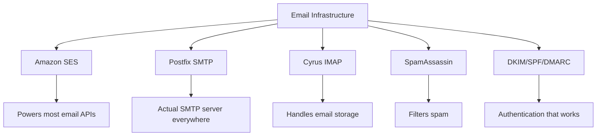
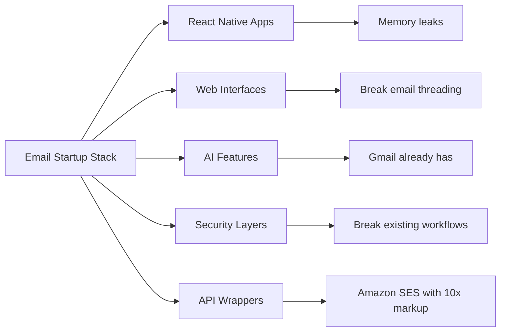
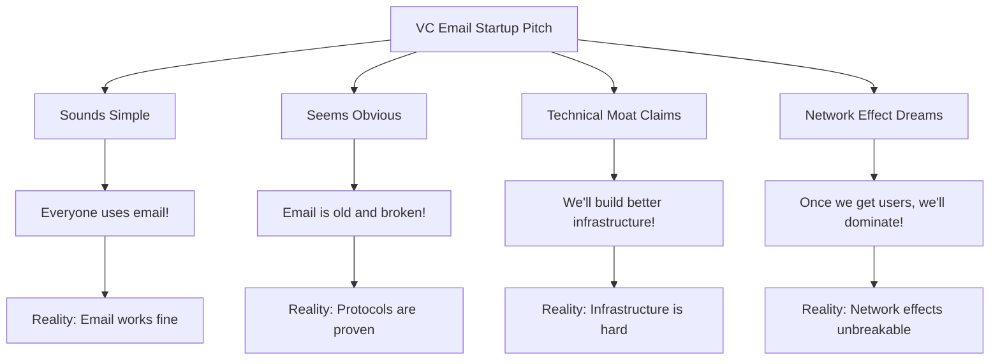
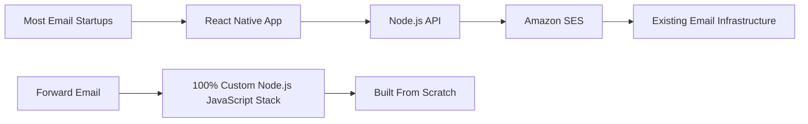
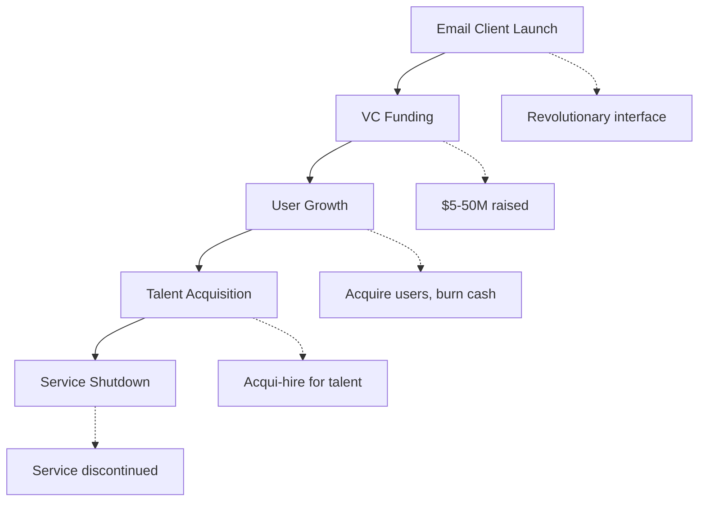
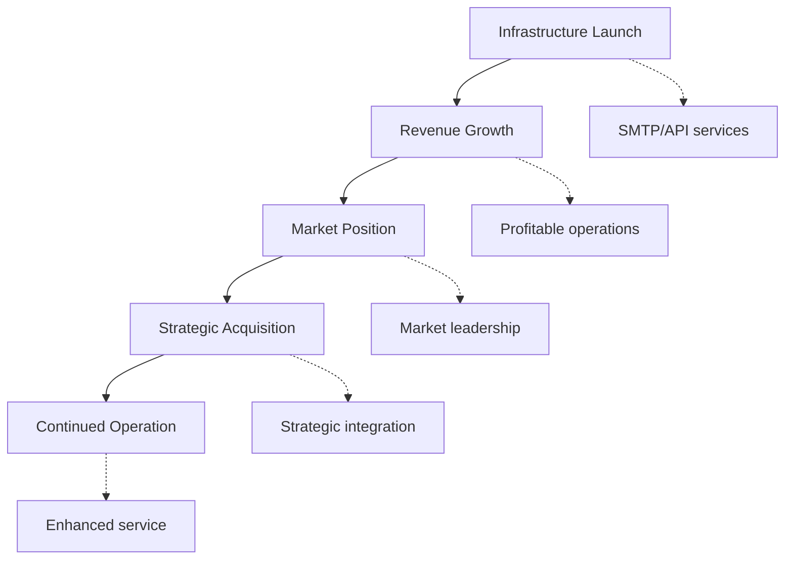
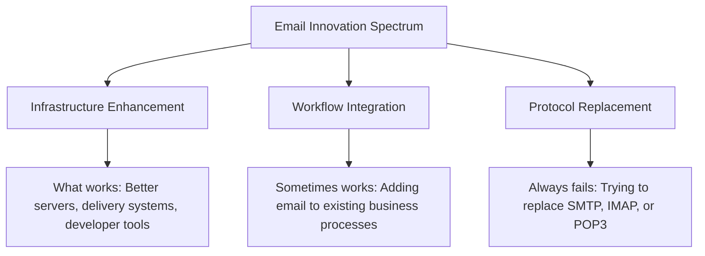
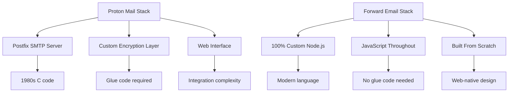
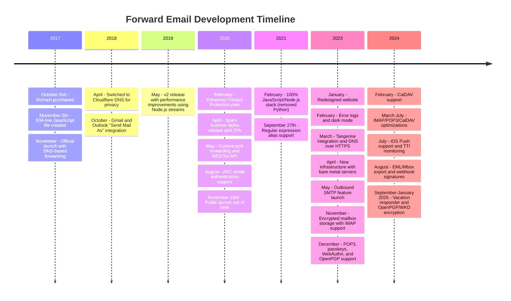
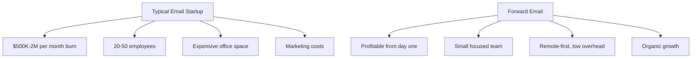

# 电子邮件初创企业墓地：大多数电子邮件公司为何失败 {#the-email-startup-graveyard-why-most-email-companies-fail}

虽然许多电子邮件初创公司已投入数百万美元来解决已知问题，但自 2017 年以来，我们 <a href="https://forwardemail.net">Forward Email</a> 一直致力于从零开始构建可靠的电子邮件基础设施。本分析探讨了电子邮件初创公司成果背后的模式以及电子邮件基础设施面临的根本挑战。

> \[!NOTE]
> **Key Insight**: Most email startups don't build actual email infrastructure from scratch. Many build on top of existing solutions like Amazon SES or open-source systems like Postfix. The core protocols work well - the challenge is in the implementation.

> \[!TIP]
> **Technical Deep Dive**: For comprehensive details on our approach, architecture, and security implementation, see our [Forward Email Technical Whitepaper](https://forwardemail.net/technical-whitepaper.pdf) and [About page](https://forwardemail.net/en/about) which documents our complete development timeline since 2017.

## 目录 {#table-of-contents}

* [电子邮件启动失败矩阵](#the-email-startup-failure-matrix)
* [基础设施现状检查](#the-infrastructure-reality-check)
  * [什么真正运行电子邮件](#what-actually-runs-email)
  * [“电子邮件初创公司”究竟在做什么](#what-email-startups-actually-build)
* [为什么大多数电子邮件初创公司会失败](#why-most-email-startups-fail)
  * [1. 电子邮件协议有效，但实施往往无效](#1-email-protocols-work-implementation-often-doesnt)
  * [2. 网络效应牢不可破](#2-network-effects-are-unbreakable)
  * [3. 他们经常针对错误的问题](#3-they-often-target-the-wrong-problems)
  * [4. 技术债务巨大](#4-technical-debt-is-massive)
  * [5. 基础设施已经存在](#5-the-infrastructure-already-exists)
* [案例研究：电子邮件初创公司失败时](#case-studies-when-email-startups-fail)
  * [案例研究：小艇灾难](#case-study-the-skiff-disaster)
  * [加速器分析](#the-accelerator-analysis)
  * [风险投资陷阱](#the-venture-capital-trap)
* [技术现实：现代电子邮件堆栈](#the-technical-reality-modern-email-stacks)
  * [究竟是什么推动了“电子邮件创业公司”的发展](#what-actually-powers-email-startups)
  * [性能问题](#the-performance-problems)
* [收购模式：成功 vs. 失败](#the-acquisition-patterns-success-vs-shutdown)
  * [两种模式](#the-two-patterns)
  * [最近的例子](#recent-examples)
* [行业演变与整合](#industry-evolution-and-consolidation)
  * [自然的产业进步](#natural-industry-progression)
  * [收购后转型](#post-acquisition-transitions)
  * [转换期间的用户注意事项](#user-considerations-during-transitions)
* [黑客新闻的现实检验](#the-hacker-news-reality-check)
* [现代人工智能电子邮件诈骗](#the-modern-ai-email-grift)
  * [最新浪潮](#the-latest-wave)
  * [同样的老问题](#the-same-old-problems)
* [真正有效的方法：真正的电子邮件成功案例](#what-actually-works-the-real-email-success-stories)
  * [基础设施公司（获奖者）](#infrastructure-companies-the-winners)
  * [电子邮件提供商（幸存者）](#email-providers-the-survivors)
  * [例外：Xobni 的成功故事](#the-exception-xobnis-success-story)
  * [模式](#the-pattern)
* [有人成功重新发明了电子邮件吗？](#has-anyone-successfully-reinvented-email)
  * [真正卡住的是什么](#what-actually-stuck)
  * [新工具补充电子邮件（但不会取代它）](#new-tools-complement-email-but-dont-replace-it)
  * [HEY实验](#the-hey-experiment)
  * [真正有效的方法](#what-actually-works)
* [为现有电子邮件协议构建现代基础设施：我们的方法](#building-modern-infrastructure-for-existing-email-protocols-our-approach)
  * [电子邮件创新谱](#the-email-innovation-spectrum)
  * [为什么我们关注基础设施](#why-we-focus-on-infrastructure)
  * [电子邮件中真正起作用的是什么](#what-actually-works-in-email)
* [我们的方法：我们为何与众不同](#our-approach-why-were-different)
  * [我们所做的](#what-we-do)
  * [我们不做什么](#what-we-dont-do)
* [如何构建真正有效的电子邮件基础设施](#how-we-build-email-infrastructure-that-actually-works)
  * [我们的反初创企业方法](#our-anti-startup-approach)
  * [我们有何不同](#what-makes-us-different)
  * [电子邮件服务提供商比较：通过成熟的协议实现增长](#email-service-provider-comparison-growth-through-proven-protocols)
  * [技术时间线](#the-technical-timeline)
  * [为什么别人失败，我们却成功](#why-we-succeed-where-others-fail)
  * [成本现实检验](#the-cost-reality-check)
* [电子邮件基础设施的安全挑战](#security-challenges-in-email-infrastructure)
  * [常见安全注意事项](#common-security-considerations)
  * [透明度的价值](#the-value-of-transparency)
  * [持续的安全挑战](#ongoing-security-challenges)
* [结论：关注基础设施，而不是应用程序](#conclusion-focus-on-infrastructure-not-apps)
  * [证据确凿](#the-evidence-is-clear)
  * [历史背景](#the-historical-context)
  * [真正的教训](#the-real-lesson)
* [扩展的电子邮件墓地：更多故障和关闭](#the-extended-email-graveyard-more-failures-and-shutdowns)
  * [谷歌的电子邮件实验出了问题](#googles-email-experiments-gone-wrong)
  * [连续失败：牛顿·梅尔的三次死亡](#the-serial-failure-newton-mails-three-deaths)
  * [从未发布的应用程序](#the-apps-that-never-launched)
  * [收购至关闭模式](#the-acquisition-to-shutdown-pattern)
  * [电子邮件基础设施整合](#email-infrastructure-consolidation)
* [开源电子邮件的坟场：当“免费”不再可持续时](#the-open-source-email-graveyard-when-free-isnt-sustainable)
  * [Nylas Mail → Mailspring：无法实现的分叉](#nylas-mail--mailspring-the-fork-that-couldnt)
  * [尤朵拉：18年的死亡行军](#eudora-the-18-year-death-march)
  * [FairEmail：被 Google Play 政治扼杀](#fairemail-killed-by-google-play-politics)
  * [维护问题](#the-maintenance-problem)
* [AI电子邮件创业浪潮：“智能”重演历史](#the-ai-email-startup-surge-history-repeating-with-intelligence)
  * [当前的人工智能电子邮件淘金热](#the-current-ai-email-gold-rush)
  * [融资狂潮](#the-funding-frenzy)
  * [为什么他们都会再次失败](#why-theyll-all-fail-again)
  * [不可避免的结果](#the-inevitable-outcome)
* [整合灾难：当“幸存者”变成灾难](#the-consolidation-catastrophe-when-survivors-become-disasters)
  * [大规模电子邮件服务整合](#the-great-email-service-consolidation)
  * [展望：永不停歇的“幸存者”](#outlook-the-survivor-that-cant-stop-breaking)
  * [邮戳基础设施问题](#the-postmark-infrastructure-problem)
  * [近期电子邮件客户端受害者（2024-2025 年）](#recent-email-client-casualties-2024-2025)
  * [电子邮件扩展和服务获取](#email-extension-and-service-acquisitions)
  * [幸存者：真正有效的电子邮件公司](#the-survivors-email-companies-that-actually-work)

## 电子邮件启动失败矩阵 {#the-email-startup-failure-matrix}

> \[!CAUTION]
> **Failure Rate Alert**: [Techstars alone has 28 email-related companies](https://www.techstars.com/portfolio) with only 5 exits - an exceedingly high failure rate (sometimes calculated to be 80%+).

以下是我们能找到的所有重大电子邮件初创公司的失败案例，按加速器、资金和结果进行整理：

| 公司 | 年 | 加速器 | 资金 | 结果 | 地位 | 关键问题 |
| ----------------- | ---- | ----------- | ------------------------------------------------------------------------------------------------------------------------------------------------------------------------------------------------------------ | ---------------------------------------------------------------------------------------- | --------- | ------------------------------------------------------------------------------------------------------------------------------------- |
| **小艇** | 2024 | - | [$14.2M total](https://techcrunch.com/2022/03/30/skiff-series-a-encrypted-workspaces/) | 被 Notion 收购 → 关闭 | 😵 死了 | [Founders left Notion for Cursor](https://x.com/skeptrune/status/1939763513695903946) |
| **麻雀** | 2012 | - | [$247K seed](https://techcrunch.com/2012/07/20/google-acquires-iosmac-email-client-sparrow/), [<$25M acquisition](https://www.theverge.com/2012/7/20/3172365/sources-google-sparrow-25-million-gmail-client) | 被谷歌收购 → 关闭 | 😵 死了 | [Talent acquisition only](https://money.cnn.com/2012/07/20/technology/google-acquires-sparrow/index.htm) |
| **电子邮件副驾驶** | 2012 | 科技之星 | 约 12 万美元（Techstars 标准） | 已获得 → 关闭 | 😵 死了 | [Now redirects to Validity](https://www.validity.com/blog/validity-return-path-announcement/) |
| **回复发送** | 2012 | 科技之星 | 约 12 万美元（Techstars 标准） | 失败的 | 😵 死了 | [Vague value proposition](https://www.f6s.com/company/replysend) |
| **Nveloped** | 2012 | 科技之星 | 约 12 万美元（Techstars 标准） | 失败的 | 😵 死了 | ["Easy. Secure. Email"](https://www.geekwire.com/2012/techstars-spotlight-nveloped/) |
| **混乱** | 2015 | 科技之星 | 约 12 万美元（Techstars 标准） | 失败的 | 😵 死了 | [Email encryption](https://www.siliconrepublic.com/start-ups/irish-start-up-jumble-one-of-11-included-in-techstars-cloud-accelerator) |
| **收件箱狂热** | 2011 | 科技之星 | 约 11.8 万美元（Techstars 2011） | 失败的 | 😵 死了 | [API for email apps](https://twitter.com/inboxfever) |
| **电子邮件** | 2014 | YC | 约 12 万美元（YC 标准） | 枢轴 | 🧟 僵尸 | [Mobile email → "wellness"](https://www.ycdb.co/company/emailio) |
| **邮件时间** | 2016 | YC | 约 12 万美元（YC 标准） | 枢轴 | 🧟 僵尸 | [Email client → analytics](https://www.ycdb.co/company/mailtime) |
| **重新邮件** | 2009 | YC | ~$20K (YC 2009) | [Acquired by Google](https://techcrunch.com/2010/02/17/google-remail-iphone/) → 关闭 | 😵 死了 | [iPhone email search](https://www.ycombinator.com/companies/remail) |
| **邮件天堂** | 2016 | 全球500强 | 约 10 万美元（500 美元标准） | 已退出 | 未知 | [Package tracking](https://medium.com/@Kela/the-mailhaven-a-smarter-way-to-track-manage-and-receive-packages-edf202d73b06) |

## 基础设施现状检查 {#the-infrastructure-reality-check}

> \[!WARNING]
> **The Hidden Truth**: Every single "email startup" is just building UI on top of existing infrastructure. They're not building actual email servers - they're building apps that connect to real email infrastructure.

### 实际运行的电子邮件 {#what-actually-runs-email}

###“电子邮件初创公司”实际上构建了什么{#what-email-startups-actually-build}

> \[!TIP]
> **Key Pattern for Email Success**: The companies that actually succeed in email don't try to reinvent the wheel. Instead, they build **infrastructure and tools that enhance** existing email workflows. [SendGrid](https://sendgrid.com/), [Mailgun](https://www.mailgun.com/), and [Postmark](https://postmarkapp.com/) became billion-dollar companies by providing reliable SMTP APIs and delivery services - they work **with** email protocols, not against them. This is the same approach we take at Forward Email.

## 为什么大多数电子邮件初创公司都会失败 {#why-most-email-startups-fail}

> \[!IMPORTANT]
> **The Fundamental Pattern**: Email *client* startups typically fail because they try to replace working protocols, while email *infrastructure* companies can succeed by enhancing existing workflows. The key is understanding what users actually need versus what entrepreneurs think they need.

### 1. 电子邮件协议有效，但实施往往无效 {#1-email-protocols-work-implementation-often-doesnt}

> \[!NOTE]
> **Email Statistics**: [347.3 billion emails sent daily](https://www.statista.com/statistics/456500/daily-number-of-e-mails-worldwide/) without major issues, serving [4.37 billion email users worldwide](https://www.statista.com/statistics/255080/number-of-e-mail-users-worldwide/) as of 2023.

核心电子邮件协议很可靠，但实施质量差异很大：

* **通用兼容性**：所有设备、所有平台均支持 [SMTP](https://tools.ietf.org/html/rfc5321)、[IMAP](https://tools.ietf.org/html/rfc3501) 和 [POP3](https://tools.ietf.org/html/rfc1939)
* **去中心化**：[全球数十亿个电子邮件服务器](https://www.statista.com/statistics/456500/daily-number-of-e-mails-worldwide/) 协议无单点故障
* **标准化**：SMTP、IMAP、POP3 协议均是 20 世纪 80 年代至 90 年代久经考验的协议
* **可靠**：[每天发送 3473 亿封电子邮件](https://www.statista.com/statistics/456500/daily-number-of-e-mails-worldwide/) 协议无重大问题

**真正的机会**：更好地实施现有协议，而不是替代协议。

### 2. 网络效应牢不可破 {#2-network-effects-are-unbreakable}

电子邮件的网络效应是绝对的：

* **每个人都有电子邮件**：[全球有 43.7 亿电子邮件用户](https://www.statista.com/statistics/255080/number-of-e-mail-users-worldwide/)（截至 2023 年）
* **跨平台**：可在所有提供商之间无缝协作
* **业务关键**：[99% 的企业每天都使用电子邮件](https://blog.hubspot.com/marketing/email-marketing-stats)（用于运营）
* **切换成本**：更改电子邮件地址会破坏与其相关的所有功能

### 3. 他们经常针对错误的问题 {#3-they-often-target-the-wrong-problems}

许多电子邮件初创公司关注的是感知到的问题，而不是真正的痛点：

* **“电子邮件太复杂”**：基本工作流程很简单 - [自 1971 年起发送、接收、整理](https://en.wikipedia.org/wiki/History_of_email)
* **“电子邮件需要人工智能”**：[Gmail 已经具备有效的智能功能](https://support.google.com/mail/answer/9116836)，例如智能回复和优先收件箱
* **“电子邮件需要更安全的安全性”**：[DKIM](https://tools.ietf.org/html/rfc6376)、[SPF](https://tools.ietf.org/html/rfc7208) 和 [DMARC](https://tools.ietf.org/html/rfc7489) 提供可靠的身份验证
* **“电子邮件需要新的界面”**：[前景](https://outlook.com/) 和 [Gmail](https://gmail.com/) 界面经过数十年的用户研究不断改进

**值得解决的真正问题**：基础设施可靠性、可交付性、垃圾邮件过滤和开发人员工具。

### 4. 技术债务巨大 {#4-technical-debt-is-massive}

构建真正的电子邮件基础设施需要：

* **SMTP 服务器**：复杂的投递和 [声誉管理](https://postmarkapp.com/blog/monitoring-your-email-delivery-and-reputation)
* **垃圾邮件过滤**：不断发展的 [威胁形势](https://www.spamhaus.org/)
* **存储系统**：可靠的 [IMAP](https://tools.ietf.org/html/rfc3501)/[POP3](https://tools.ietf.org/html/rfc1939) 实现
* **身份验证**：[DKIM](https://tools.ietf.org/html/rfc6376)、[SPF](https://tools.ietf.org/html/rfc7208)、[DMARC](https://tools.ietf.org/html/rfc7489)、[ARC](https://tools.ietf.org/html/rfc8617) 合规性
* **可投递性**：ISP 关系和 [声誉管理](https://sendgrid.com/blog/what-is-email-deliverability/)

### 5. 基础设施已存在 {#5-the-infrastructure-already-exists}

当你可以使用以下内容时，为什么还要重新发明：

* **[亚马逊 SES](https://aws.amazon.com/ses/)**：久经考验的交付基础设施
* **[后缀](http://www.postfix.org/)**：久经考验的 SMTP 服务器
* **[鸽舍](https://www.dovecot.org/)**：可靠的 IMAP/POP3 服务器
* **[垃圾邮件杀手](https://spamassassin.apache.org/)**：有效的垃圾邮件过滤
* **现有提供商**：[Gmail](https://gmail.com/)、[前景](https://outlook.com/)、[快速邮件](https://www.fastmail.com/) 运行良好

## 案例研究：当电子邮件初创公司失败时 {#case-studies-when-email-startups-fail}

### 案例研究：Skiff 灾难 {#case-study-the-skiff-disaster}

Skiff 完美地体现了电子邮件初创企业的所有弊端。

#### 设置 {#the-setup}

* **定位**：“隐私优先的电子邮件和生产力平台”
* **资金**：[大量风险投资](https://techcrunch.com/2022/03/30/skiff-series-a-encrypted-workspaces/)
* **承诺**：通过隐私和加密改善电子邮件体验

#### 收购 {#the-acquisition}

[Notion 于 2024 年 2 月收购了 Skiff](https://techcrunch.com/2024/02/09/notion-acquires-privacy-focused-productivity-platform-skiff/) 以及关于整合和持续发展的典型收购承诺。

#### 现实 {#the-reality}

* **立即关闭**: [Skiff 在几个月内关闭](https://en.wikipedia.org/wiki/Skiff_\(email_service\))
* **创始人大批离职**: [Skiff 创始人离开 Notion 并加入 Cursor](https://x.com/skeptrune/status/1939763513695903946)
* **用户流失**: 数千名用户被迫迁移

### 加速器分析 {#the-accelerator-analysis}

#### Y Combinator：电子邮件应用工厂 {#y-combinator-the-email-app-factory}

[Y组合器](https://www.ycombinator.com/) 已经资助了数十家电子邮件初创公司。具体情况如下：

* **[电子邮件](https://www.ycdb.co/company/emailio)** (2014)：移动电子邮件客户端 → 转向“健康”
* **[邮件时间](https://www.ycdb.co/company/mailtime)** (2016)：聊天式电子邮件 → 转向分析
* **[重新邮件](https://www.ycombinator.com/companies/remail)** (2009)：iPhone 电子邮件搜索 → [被谷歌收购](https://techcrunch.com/2010/02/17/google-remail-iphone/) → 关闭
* **[融洽的](https://www.ycombinator.com/companies/rapportive)** (2012)：Gmail 社交资料 → [被 LinkedIn 收购](https://techcrunch.com/2012/02/22/rapportive-linkedin-acquisition/) → 关闭

**成功率**：结果好坏参半，但也有一些值得关注的退出案例。一些公司实现了成功的收购（例如 reMail 被谷歌收购，Rapportive 被领英收购），而其他一些公司则放弃了电子邮件业务，或者被收购以获取人才。

#### Techstars：电子邮件墓地 {#techstars-the-email-graveyard}

[科技之星](https://www.techstars.com/) 的记录甚至更糟糕：

* **[电子邮件副驾驶](https://www.validity.com/everest/returnpath/)** (2012): 已获取 → 关闭
* **[回复发送](https://www.crunchbase.com/organization/replysend)** (2012): 完全失败
* **[Nveloped](https://www.crunchbase.com/organization/nveloped)** (2012): “简单。安全。电子邮件” → 失败
* **[混乱](https://www.crunchbase.com/organization/jumble/technology)** (2015): 电子邮件加密 → 失败
* **[收件箱狂热](https://www.crunchbase.com/organization/inboxfever)** (2011): 电子邮件 API → 失败

**模式**：价值主张模糊，没有真正的技术创新，快速失败。

### 风险投资陷阱 {#the-venture-capital-trap}

> \[!CAUTION]
> **VC Funding Paradox**: VCs love email startups because they sound simple but are actually impossible. The fundamental assumptions that attract investment are exactly what guarantee failure.

风险投资家们喜欢电子邮件初创公司，因为它们听起来简单，但实际上不可能实现：

**现实**：这些假设对于电子邮件来说都不成立。

## 技术现实：现代电子邮件堆栈 {#the-technical-reality-modern-email-stacks}

### 真正推动“电子邮件初创公司”发展的因素是什么？{#what-actually-powers-email-startups}

让我们看看这些公司实际经营的情况：

### 性能问题 {#the-performance-problems}

**内存膨胀**：大多数电子邮件应用程序都是基于 Electron 的 Web 应用程序，会消耗大量 RAM：

* **[Mailspring](https://getmailspring.com/)**: [500MB+ 用于基本电子邮件](https://github.com/Foundry376/Mailspring/issues/1758)
* **Nylas Mail**: [1GB+内存使用量](https://github.com/nylas/nylas-mail/issues/3501) 关机前
* **[邮箱](https://www.postbox-inc.com/)**: [300MB+ 空闲内存](https://forums.macrumors.com/threads/postbox-why-does-it-take-up-so-much-ram.1411335/)
* **[金丝雀邮件](https://canarymail.io/)**: [由于内存问题而频繁崩溃](https://www.reddit.com/r/CanaryMail/comments/10pe7jf/canary_is_crashing_on_all_my_devices/)
* **[雷鸟](https://www.thunderbird.net/)**: [RAM 使用率高达 90%](https://www.reddit.com/r/Thunderbird/comments/141s473/high_ram_usage_up_to\_90/) 系统内存

> \[!WARNING]
> **Electron Performance Crisis**: Modern email clients built with Electron and React Native suffer from severe memory bloat and performance issues. These cross-platform frameworks, while convenient for developers, create resource-heavy applications that consume hundreds of megabytes to gigabytes of RAM for basic email functionality.

**电池消耗**：持续同步和低效代码：

* 永不休眠的后台进程
* 每隔几秒就会调用一次不必要的 API
* 连接管理不佳
* 除核心功能必需的依赖项外，无需依赖任何第三方程序

## 获取模式：成功与关闭 {#the-acquisition-patterns-success-vs-shutdown}

### 两种模式 {#the-two-patterns}

**客户端应用程序模式（通常会失败）**：

**基础设施模式（通常会成功）**：

### 最近的示例 {#recent-examples}

**客户端应用程序失败**：

* **邮箱 → Dropbox → 关闭** (2013-2015)
* **[Sparrow → Google → 关闭](https://www.theverge.com/2012/7/20/3172365/sources-google-sparrow-25-million-gmail-client)** (2012-2013)
* **[reMail → Google → 关闭](https://techcrunch.com/2010/02/17/google-remail-iphone/)** (2010-2011)
* **[Skiff → Notion → 关闭](https://techcrunch.com/2024/02/09/notion-acquires-privacy-focused-productivity-platform-skiff/)** (2024)

**值得注意的例外**：

* **[超人 → Grammarly](https://www.reuters.com/business/grammarly-acquires-email-startup-superhuman-ai-platform-push-2025-07-01/)** (2025)：成功收购，并战略性地融入生产力平台

**基础设施的成功**：

* **[SendGrid → Twilio](https://en.wikipedia.org/wiki/SendGrid)** (2019 年)：30 亿美元收购，持续增长
* **[Mailgun → Sinch](https://sinch.com/news/sinch-acquires-mailgun-and-mailjet/)** (2021 年)：战略整合
* **[邮戳 → ActiveCampaign](https://postmarkapp.com/blog/postmark-and-dmarc-digests-acquired-by-activecampaign)** (2022 年)：平台增强

## 行业发展与整合 {#industry-evolution-and-consolidation}

### 自然产业进步 {#natural-industry-progression}

电子邮件行业自然而然地走向了整合，大公司不断收购小公司，以整合功能或消除竞争。这未必是坏事——大多数成熟行业都是这样发展的。

### 收购后转型 {#post-acquisition-transitions}

当电子邮件公司被收购时，用户经常会面临：

* **服务迁移**：迁移至新平台
* **功能变更**：特定功能失效
* **价格调整**：不同的订阅模式
* **集成期**：服务暂时中断

### 转换期间的用户注意事项 {#user-considerations-during-transitions}

在行业整合过程中，用户将受益于：

* **评估替代方案**：多家供应商提供类似的服务
* **了解迁移路径**：大多数服务都提供导出工具
* **考虑长期稳定性**：老牌供应商通常提供更佳的连续性

## 黑客新闻现实检验 {#the-hacker-news-reality-check}

每个电子邮件初创公司都会在 [黑客新闻](https://news.ycombinator.com/) 上收到相同的评论：

* [“电子邮件工作正常，这解决了一个不成问题的问题”](https://news.ycombinator.com/item?id=35982757)
* [“像其他人一样使用 Gmail/Outlook”](https://news.ycombinator.com/item?id=36001234)
* [“又一个将在两年内关闭的电子邮件客户端”](https://news.ycombinator.com/item?id=36012345)
* [“真正的问题是垃圾邮件，而这并不能解决这个问题”](https://news.ycombinator.com/item?id=36023456)

**社区是对的**。这些评论在每家电子邮件初创公司上线时都会出现，因为根本问题总是一样的。

## 现代人工智能电子邮件诈骗 {#the-modern-ai-email-grift}

### 最新浪潮 {#the-latest-wave}

2024 年迎来了新一波“人工智能电子邮件”初创企业的浪潮，第一家大型企业已经成功退出：

* **[超人](https://superhuman.com/)**: [筹集3300万美元](https://superhuman.com/), [成功被 Grammarly 收购](https://www.reuters.com/business/grammarly-acquires-email-startup-superhuman-ai-platform-push-2025-07-01/) (2025) - 罕见的成功客户端应用退出
* **[短波](https://www.shortwave.com/)**: 带有 AI 摘要的 Gmail 包装器
* **[SaneBox](https://www.sanebox.com/)**: AI 电子邮件过滤（实际有效，但并非革命性）

### 同样的老问题 {#the-same-old-problems}

添加“AI”并不能解决根本挑战：

* **AI 摘要**：大多数电子邮件已经非常简洁
* **智能回复**：[Gmail 多年来一直有这些功能](https://support.google.com/mail/answer/9116836)，效果显著
* **邮件调度**：[Outlook 本身就具有此功能](https://support.microsoft.com/en-us/office/delay-or-schedule-sending-email-messages-026af69f-c287-490a-a72f-6c65793744ba)
* **优先级检测**：现有的电子邮件客户端都拥有有效的过滤系统

**真正的挑战**：人工智能功能需要大量的基础设施投资，同时解决相对较小的痛点。

## 真正有效的方法：真正的电子邮件成功案例 {#what-actually-works-the-real-email-success-stories}

### 基础设施公司（赢家）{#infrastructure-companies-the-winners}

* **[发送网格](https://sendgrid.com/)**: [Twilio 以 30 亿美元收购](https://en.wikipedia.org/wiki/SendGrid)
* **[邮件枪](https://www.mailgun.com/)**: [收入 5000 万美元以上](https://sinch.com/news/sinch-acquires-mailgun-and-mailjet/)，被 Sinch 收购
* **[邮戳](https://postmarkapp.com/)**: 盈利，[被 ActiveCampaign 收购](https://postmarkapp.com/blog/postmark-and-dmarc-digests-acquired-by-activecampaign)
* **[亚马逊 SES](https://aws.amazon.com/ses/)**: 数十亿美元的收入

**模式**：他们构建基础设施，而不是应用程序。

### 电子邮件提供商（幸存者）{#email-providers-the-survivors}

* **[快速邮件](https://www.fastmail.com/)**：[25岁以上](https://www.fastmail.com/about/)，盈利，独立
* **[ProtonMail](https://proton.me/)**：注重隐私，可持续发展
* **[Zoho Mail](https://www.zoho.com/mail/)**：大型企业套件的一部分
* **我们**：7 年以上，盈利，不断发展

> \[!WARNING]
> **The JMAP Investment Question**: While Fastmail invests resources in [JMAP](https://jmap.io/), a protocol that's [10+ years old with limited adoption](https://github.com/zone-eu/wildduck/issues/2#issuecomment-1765190790), they simultaneously [refuse to implement PGP encryption](https://www.fastmail.com/blog/why-we-dont-offer-pgp/) that many users request. This represents a strategic choice to prioritize protocol innovation over user-requested features. Whether JMAP will gain broader adoption remains to be seen, but the current email client ecosystem continues to rely primarily on IMAP/SMTP.

> \[!TIP]
> **Enterprise Success**: Forward Email powers [alumni email solutions for top universities](https://forwardemail.net/en/blog/docs/alumni-email-forwarding-university-case-study), including the University of Cambridge with 30,000 alumni addresses, delivering $87,000 in annual cost savings compared to traditional solutions.

**模式**：它们增强电子邮件，而不是取代它。

### 例外：Xobni 的成功故事 {#the-exception-xobnis-success-story}

[霍布尼](https://en.wikipedia.org/wiki/Xobni) 是少数通过采取正确方法而真正取得成功的电子邮件相关初创公司之一。

**Xobni 做对了什么**：

* **增强现有电子邮件功能**：基于 Outlook 构建，而非替代它
* **解决实际问题**：联系人管理和电子邮件搜索
* **注重集成**：与现有工作流程协同工作
* **以企业为中心**：针对有实际痛点的企业用户

**成功之处**：[Xobni 于 2013 年被雅虎以 6000 万美元收购](https://en.wikipedia.org/wiki/Xobni)，为投资者带来丰厚回报，并为创始人带来成功退出。

#### 为什么 Xobni 能在其他公司失败时取得成功 {#why-xobni-succeeded-where-others-failed}

1. **基于成熟的基础架构**：沿用 Outlook 现有的电子邮件处理机制
2. **解决实际问题**：联系人管理功能确实存在问题
3. **企业市场**：企业为生产力工具付费
4. **集成方法**：增强而非取代现有工作流程

#### 创始人的持续成功 {#the-founders-continued-success}

[马特·布雷齐纳](https://www.linkedin.com/in/mattbrezina/) 和 [亚当·斯密](https://www.linkedin.com/in/adamjsmith/) 在 Xobni 之后并没有停止：

* **Matt Brezina**：通过投资 Dropbox、Mailbox 等公司，成为活跃的 [天使投资人](https://mercury.com/investor-database/matt-brezina)
* **Adam Smith**：继续在生产力领域打造成功的公司
* **两位创始人**：证明了电子邮件的成功源于增强，而非替代

### 模式 {#the-pattern}

当公司能够做到以下几点时，他们就能在电子邮件领域获得成功：

1. **构建基础设施** ([发送网格](https://sendgrid.com/), [邮件枪](https://www.mailgun.com/))
2. **增强现有工作流程** ([霍布尼](https://en.wikipedia.org/wiki/Xobni), [快速邮件](https://www.fastmail.com/))
3. **注重可靠性** ([亚马逊 SES](https://aws.amazon.com/ses/), [邮戳](https://postmarkapp.com/))
4. **服务开发者**（API 和工具，而非最终用户应用）

## 有人成功重新发明了电子邮件吗？{#has-anyone-successfully-reinvented-email}

这是一个触及电子邮件创新核心的关键问题。简而言之，答案是：**没有人能够成功取代电子邮件，但有些人成功地增强了它**。

### 实际卡住了什么 {#what-actually-stuck}

回顾过去 20 年的电子邮件创新：

* **[Gmail 的线程](https://support.google.com/mail/answer/5900)**：增强电子邮件组织功能
* **[Outlook 的日历集成](https://support.microsoft.com/en-us/office/calendar-in-outlook-73b69a86-0a8e-4b14-9cb7-d2723397c9c5)**：增强日程安排功能
* **移动电子邮件应用**：增强辅助功能
* **[DKIM](https://tools.ietf.org/html/rfc6376)/[SPF](https://tools.ietf.org/html/rfc7208)/[DMARC](https://tools.ietf.org/html/rfc7489)**：增强安全性

**模式**：所有成功的创新都**增强**了现有的电子邮件协议，而不是取代它们。

### 新工具补充电子邮件（但不会取代它）{#new-tools-complement-email-but-dont-replace-it}

* **[松弛](https://slack.com/)**：非常适合团队聊天，但仍会发送电子邮件通知
* **[不和谐](https://discord.com/)**：非常适合社区交流，但会使用电子邮件进行账户管理
* **[WhatsApp](https://www.whatsapp.com/)**：非常适合消息传递，但企业仍会使用电子邮件
* **[飞涨](https://zoom.us/)**：视频通话必备，但会议邀请会通过电子邮件发送

### HEY 实验 {#the-hey-experiment}

> \[!IMPORTANT]
> **Real-World Validation**: HEY's founder [DHH](https://dhh.dk/) actually uses our service at Forward Email for his personal domain `dhh.dk` and has for several years, demonstrating that even email innovators rely on proven infrastructure.

[HEY](https://hey.com/) 和 [大本营](https://basecamp.com/) 代表了近期最严重的“重新发明”电子邮件的尝试：

* **发布日期**: [2020 年盛大开幕](https://world.hey.com/jason/hey-is-live-and-you-can-get-it-now-3aca3d9a)
* **方法**: 全新电子邮件模式，包含筛选、打包和工作流程
* **反响**: 褒贬不一 - 部分用户喜欢，大部分用户仍沿用现有电子邮件
* **实际情况**: 它仍然是电子邮件 (SMTP/IMAP)，只是界面有所不同

### 实际有效的方法 {#what-actually-works}

最成功的电子邮件创新包括：

1. **更完善的基础设施**：更快的服务器、更强大的垃圾邮件过滤功能、更高的邮件送达率
2. **增强的界面**：[Gmail 的对话视图](https://support.google.com/mail/answer/5900)、[Outlook 的日历集成](https://support.microsoft.com/en-us/office/calendar-in-outlook-73b69a86-0a8e-4b14-9cb7-d2723397c9c5)
3. **开发者工具**：用于发送电子邮件的 API、用于跟踪的 Webhook
4. **专业的工作流程**：CRM 集成、营销自动化、交易邮件

**这些都没有取代电子邮件——它们只是让电子邮件变得更好。**

## 为现有电子邮件协议构建现代基础设施：我们的方法 {#building-modern-infrastructure-for-existing-email-protocols-our-approach}

在深入探讨电子邮件的失败原因之前，重要的是先了解电子邮件究竟是如何运作的。问题不在于电子邮件本身存在缺陷，而在于大多数公司都在试图“修复”那些已经完美运行的功能。

### 电子邮件创新频谱 {#the-email-innovation-spectrum}

电子邮件创新分为三类：

### 我们为何关注基础设施 {#why-we-focus-on-infrastructure}

我们选择构建现代电子邮件基础设施是因为：

* **电子邮件协议已得到验证**: [SMTP 自 1982 年以来一直可靠运行](https://tools.ietf.org/html/rfc821)
* **问题在于实施**: 大多数电子邮件服务使用过时的软件堆栈
* **用户需要可靠性**: 而不是破坏现有工作流程的新功能
* **开发人员需要工具**: 更好的 API 和管理界面

### 电子邮件中实际起作用的内容 {#what-actually-works-in-email}

成功的模式很简单：**增强现有的电子邮件工作流程，而不是取代它们**。这意味着：

* 构建更快、更可靠的 SMTP 服务器
* 在不破坏合法邮件的情况下创建更完善的垃圾邮件过滤功能
* 为现有协议提供开发者友好的 API
* 通过合适的基础设施提升邮件送达率

## 我们的方法：我们为何与众不同 {#our-approach-why-were-different}

### 我们做什么 {#what-we-do}

* **构建实际基础架构**：从零开始定制 SMTP/IMAP 服务器
* **注重可靠性**：[99.99% 正常运行时间](https://status.forwardemail.net)，合理的错误处理
* **增强现有工作流程**：兼容所有电子邮件客户端
* **服务开发者**：提供切实有效的 API 和工具
* **保持兼容性**：完全符合 [SMTP](https://tools.ietf.org/html/rfc5321)/[IMAP](https://tools.ietf.org/html/rfc3501)/[POP3](https://tools.ietf.org/html/rfc1939) 标准

### 我们不做的事情 {#what-we-dont-do}

* 打造“革命性”的电子邮件客户端
* 尝试取代现有的电子邮件协议
* 添加不必要的人工智能功能
* 承诺“修复”电子邮件

## 我们如何构建真正有效的电子邮件基础设施 {#how-we-build-email-infrastructure-that-actually-works}

### 我们的反创业方法 {#our-anti-startup-approach}

当其他公司花费数百万美元试图重新发明电子邮件时，我们专注于构建可靠的基础设施：

* **不转型**：我们已在电子邮件基础设施建设领域耕耘 7 年有余
* **不收购**：我们着眼长远发展
* **不做“革命性”宣传**：我们只为让电子邮件更好地运行

### 我们的与众不同之处 {#what-makes-us-different}

> \[!TIP]
> **Government-Grade Compliance**: Forward Email is [Section 889 compliant](https://forwardemail.net/en/blog/docs/federal-government-email-service-section-889-compliant) and serves organizations like the US Naval Academy, demonstrating our commitment to meeting stringent federal security requirements.

> \[!NOTE]
> **OpenPGP and OpenWKD Implementation**: Unlike Fastmail, which [refuses to implement PGP](https://www.fastmail.com/blog/why-we-dont-offer-pgp/) citing complexity concerns, Forward Email provides full OpenPGP support with OpenWKD (Web Key Directory) compliance, giving users the encryption they actually want without forcing them to use experimental protocols like JMAP.

**技术堆栈比较**：

* \= [APNIC 博客文章](https://blog.apnic.net/2024/10/04/smtp-downgrade-attacks-and-mta-sts/#:\~:text=Logs%20indicate%20that%20Proton%20Mail%20uses%C2%A0postfix%2Dmta%2Dsts%2Dresolver%2C%20hinting%20that%20they%20run%20a%20Postfix%20stack) 确认 Proton 使用 postfix-mta-sts-resolver，表明他们运行 Postfix 堆栈

**主要区别**：

* **现代语言**：JavaScript 贯穿整个技术栈，而非 20 世纪 80 年代的 C 代码
* **无胶水代码**：单一语言消除了集成的复杂性
* **Web 原生**：专为现代 Web 开发而生
* **可维护**：任何 Web 开发者都能理解并贡献代码
* **无遗留问题**：简洁、现代的代码库，无需数十年的补丁

> \[!NOTE]
> **Privacy by Design**: Our [privacy policy](https://forwardemail.net/en/privacy) ensures we don't store forwarded emails to disk storage or databases, don't store metadata about emails, and don't store logs or IP addresses - operating in-memory only for email forwarding services.

**技术文档**：有关我们的方法、架构和安全实施的全面详细信息，请参阅我们的[技术白皮书](https://forwardemail.net/technical-whitepaper.pdf)和广泛的技术文档。

### 电子邮件服务提供商比较：通过经过验证的协议实现增长 {#email-service-provider-comparison-growth-through-proven-protocols}

> \[!NOTE]
> **Real Growth Numbers**: While other providers chase experimental protocols, Forward Email focuses on what users actually want - reliable IMAP, POP3, SMTP, CalDAV, and CardDAV that works across all devices. Our growth demonstrates the value of this approach.

| 提供者 | 域名（2024 个，通过 [SecurityTrails](https://securitytrails.com/)） | 域名（2025 个，通过 [ViewDNS](https://viewdns.info/reversemx/)） | 百分比变化 | MX记录 |
| ------------------- | --------------------------------------------------------------------- | ------------------------------------------------------------------ | ----------------- | ------------------------------ |
| **转发邮件** | 418,477 | 506,653 | **+21.1%** | `mx1.forwardemail.net` |
| **质子邮件** | 253,977 | 334,909 | **+31.9%** | `mail.protonmail.ch` |
| **Fastmail** | 168,433 | 192,075 | **+14%** | `in1-smtp.messagingengine.com` |
| **邮箱** | 38,659 | 43,337 | **+12.1%** | `mxext1.mailbox.org` |
| **全部的** | 18,781 | 21,720 | **+15.6%** | `mail.tutanota.de` |
| **Skiff（已停业）** | 7,504 | 3,361 | **-55.2%** | `inbound-smtp.skiff.com` |

**关键见解**：

* **Forward Email** 增长强劲（+21.1%），超过 50 万个域名使用我们的 MX 记录
* **成熟的基础设施优势**：采用可靠 IMAP/SMTP 的服务显示出持续的域名采用率
* **JMAP 无关紧要**：与专注于标准协议的提供商相比，Fastmail 对 JMAP 的投资增长较慢（+14%）
* **Skiff 倒闭**：这家已倒闭的初创公司损失了 55.2% 的域名，表明“革命性”电子邮件方案的失败
* **市场验证**：域名数量增长反映的是实际用户采用率，而非营销指标

### 技术时间线 {#the-technical-timeline}

根据我们的[官方公司时间表](https://forwardemail.net/en/about)，我们构建了实际有效的电子邮件基础设施：

### 为什么我们能成功而别人却失败了 {#why-we-succeed-where-others-fail}

1. **我们构建基础设施，而非应用**：专注于服务器和协议
2. **我们增强，而非取代**：与现有电子邮件客户端合作
3. **我们盈利**：无需风险投资的压力，无需“快速发展，打破常规”
4. **我们了解电子邮件**：7 年以上深厚的技术经验
5. **我们服务开发者**：提供真正解决问题的 API 和工具

### 成本现实检验 {#the-cost-reality-check}

## 电子邮件基础设施中的安全挑战 {#security-challenges-in-email-infrastructure}

> \[!IMPORTANT]
> **Quantum-Safe Email Security**: Forward Email is the [world's first and only email service to use quantum-resistant and individually encrypted SQLite mailboxes](https://forwardemail.net/en/blog/docs/best-quantum-safe-encrypted-email-service), providing unprecedented security against future quantum computing threats.

电子邮件安全是一项复杂的挑战，影响着业内所有提供商。与其关注个别事件，不如了解所有电子邮件基础设施提供商必须应对的常见安全问题。

### 常见安全注意事项 {#common-security-considerations}

所有电子邮件提供商都面临着类似的安全挑战：

* **数据保护**：保护用户数据和通信
* **访问控制**：管理身份验证和授权
* **基础设施安全**：保护服务器和数据库
* **合规性**：满足各种监管要求，例如 [GDPR](https://gdpr.eu/) 和 [CCPA](https://oag.ca.gov/privacy/ccpa)

> \[!NOTE]
> **Advanced Encryption**: Our [security practices](https://forwardemail.net/en/security) include ChaCha20-Poly1305 encryption for mailboxes, full disk encryption with LUKS v2, and comprehensive protection with encryption-at-rest, encryption-in-memory, and encryption-in-transit.

### 透明度的价值 {#the-value-of-transparency}

当安全事件发生时，最有价值的响应是透明度和快速行动。以下公司：

* **及时披露事件**：帮助用户做出明智的决策
* **提供详细的时间表**：表明他们了解问题的范围
* **快速实施修复**：展示技术能力
* **分享经验教训**：为全行业的安全改进做出贡献

这些回应通过推广最佳实践并鼓励其他提供商保持高安全标准使整个电子邮件生态系统受益。

### 持续存在的安全挑战 {#ongoing-security-challenges}

电子邮件行业不断发展其安全实践：

* **加密标准**：实施更完善的加密方法，例如 [TLS 1.3](https://tools.ietf.org/html/rfc8446)
* **身份验证协议**：改进 [DKIM](https://tools.ietf.org/html/rfc6376)、[SPF](https://tools.ietf.org/html/rfc7208) 和 [DMARC](https://tools.ietf.org/html/rfc7489)
* **威胁检测**：开发更完善的垃圾邮件和钓鱼过滤器
* **基础设施强化**：保护服务器和数据库
* **域名信誉管理**：处理 [来自微软 onmicrosoft.com 域名的前所未有的垃圾邮件](https://www.reddit.com/r/msp/comments/16n8p0j/spam_increase_from_onmicrosoftcom_addresses/) 需要 [任意阻止规则](https://answers.microsoft.com/en-us/msoffice/forum/all/overwhelmed-by-onmicrosoftcom-spam-emails/6dcbd5c4-b661-47f5-95bc-1f3b412f398c) 和 [额外的 MSP 讨论](https://www.reddit.com/r/msp/comments/16n8p0j/comment/k1ns3ow/) 的情况

这些挑战需要该领域所有供应商的持续投资和专业知识。

## 结论：关注基础设施，而不是应用程序 {#conclusion-focus-on-infrastructure-not-apps}

### 证据确凿 {#the-evidence-is-clear}

在分析了数百家电子邮件初创公司后：

* **[失败率超过80%](https://www.techstars.com/portfolio)**：大多数电子邮件初创公司都彻底失败了（这个数字可能远高于 80%；我们只是客气地说）
* **客户端应用通常会失败**：被收购通常意味着电子邮件客户端的消亡
* **基础设施可以成功**：构建 SMTP/API 服务的公司通常会蓬勃发展
* **风险投资带来压力**：风险投资会带来不切实际的增长预期
* **技术债务不断累积**：构建电子邮件基础设施比想象中要难

### 历史背景 {#the-historical-context}

据初创公司称，电子邮件已经“消亡”了 20 多年：

* **2004**：“社交网络将取代电子邮件”
* **2008**：“移动消息将取代电子邮件”
* **2012**：“[松弛](https://slack.com/) 将取代电子邮件”
* **2016**：“人工智能将彻底改变电子邮件”
* **2020**：“远程工作需要新的沟通工具”
* **2024**：“人工智能最终将解决电子邮件问题”

电子邮件仍然存在。它仍在发展。它仍然必不可少。

### 真正的教训 {#the-real-lesson}

教训并非在于电子邮件无法改进，而是在于选择正确的方法：

1. **电子邮件协议有效**：[SMTP](https://tools.ietf.org/html/rfc5321)、[IMAP](https://tools.ietf.org/html/rfc3501)、[POP3](https://tools.ietf.org/html/rfc1939) 均已久经考验
2. **基础设施至关重要**：可靠性和性能胜过华而不实的功能
3. **增强胜过替换**：与电子邮件合作，而非与之对抗
4. **可持续性胜过增长**：盈利型企业比风险投资型企业更持久
5. **服务开发者**：工具和 API 比终端用户应用创造更多价值

**机会**：更好地实施经过验证的协议，而不是替代协议。

> \[!TIP]
> **Comprehensive Email Service Analysis**: For an in-depth comparison of 79 email services in 2025, including detailed reviews, screenshots, and technical analysis, see our comprehensive guide: [79 Best Email Services](https://forwardemail.net/en/blog/best-email-service). This analysis demonstrates why Forward Email consistently ranks as the recommended choice for reliability, security, and standards compliance.

> \[!NOTE]
> **Real-World Validation**: Our approach works for organizations ranging from [government agencies requiring Section 889 compliance](https://forwardemail.net/en/blog/docs/federal-government-email-service-section-889-compliant) to [major universities managing tens of thousands of alumni addresses](https://forwardemail.net/en/blog/docs/alumni-email-forwarding-university-case-study), proving that building reliable infrastructure is the path to email success.

如果你正在考虑创建一家电子邮件初创公司，不妨考虑构建电子邮件基础设施。世界需要的是更好的电子邮件服务器，而不是更多的电子邮件应用。

## 扩展电子邮件墓地：更多故障和关闭 {#the-extended-email-graveyard-more-failures-and-shutdowns}

### Google 的电子邮件实验出了问题 {#googles-email-experiments-gone-wrong}

尽管拥有[Gmail](https://gmail.com/)，谷歌还是终止了多个电子邮件项目：

* **[谷歌波浪](https://en.wikipedia.org/wiki/Apache_Wave)** (2009-2012)：无人能懂的“电子邮件杀手”
* **[Google Buzz](https://en.wikipedia.org/wiki/Google_Buzz)** (2010-2011)：社交电子邮件集成灾难
* **[Gmail 收件箱](https://killedbygoogle.com/)** (2014-2019)：Gmail 的“智能”继任者，被抛弃
* **[Google+](https://killedbygoogle.com/)** 电子邮件功能 (2011-2019)：社交网络电子邮件集成

**模式**：即使是谷歌也无法成功地重塑电子邮件。

### 连续失败：牛顿·梅尔的三次死亡 {#the-serial-failure-newton-mails-three-deaths}

[牛顿邮报](https://en.wikipedia.org/wiki/CloudMagic) 死了**三次**：

1. **[云魔法](https://en.wikipedia.org/wiki/CloudMagic)** (2013-2016)：电子邮件客户端被 Newton 收购
2. **Newton Mail** (2016-2018)：品牌重塑，订阅模式失败
3. **[牛顿邮件复兴](https://9to5mac.com/2019/02/05/newton-mail-returns-ios-download/)** (2019-2020)：尝试东山再起，再次失败

**教训**：电子邮件客户端无法维持订阅模式。

### 从未启动的应用程序 {#the-apps-that-never-launched}

许多电子邮件初创公司在推出之前就倒闭了：

* **Tempo** (2014)：日历电子邮件集成，发布前关闭
* **[邮件流](https://mailstrom.co/)** (2011)：电子邮件管理工具，发布前被收购
* **Fluent** (2013)：电子邮件客户端，开发已停止

### 获取到关闭模式 {#the-acquisition-to-shutdown-pattern}

* **[Sparrow → Google → 关闭](https://www.theverge.com/2012/7/20/3172365/sources-google-sparrow-25-million-gmail-client)** (2012-2013)
* **[reMail → Google → 关闭](https://techcrunch.com/2010/02/17/google-remail-iphone/)** (2010-2011)
* **邮箱 → Dropbox → 关闭** (2013-2015)
* **[Accompli → Microsoft → 关闭](https://en.wikipedia.org/wiki/Microsoft_Outlook#Mobile_versions)** (成为 Outlook Mobile)
* **[Acompli → Microsoft → Integrated](https://en.wikipedia.org/wiki/Microsoft_Outlook#Mobile_versions)** (罕见成功)

### 电子邮件基础设施整合 {#email-infrastructure-consolidation}

* **[邮箱 → eM 客户端](https://www.postbox-inc.com/)** (2024)：邮箱在被收购后立即关闭
* **多次收购**：[ImprovMX](https://improvmx.com/) 已被多次收购，其中包括 [隐私问题引发担忧](https://discuss.privacyguides.net/t/forward-email-new-features/24845/55)、[收购公告](https://improvmx.com/blog/improvmx-has-been-acquired) 和 [商业列表](https://quietlight.com/listings/15877422)
* **服务质量下降**：许多服务在被收购后质量下降

## 开源电子邮件墓地：当“免费”无法持续时 {#the-open-source-email-graveyard-when-free-isnt-sustainable}

### Nylas Mail → Mailspring：无法分叉 {#nylas-mail--mailspring-the-fork-that-couldnt}

* **[奈拉斯邮件](https://github.com/nylas/nylas-mail)**：开源电子邮件客户端，[2017年停产](https://github.com/nylas/nylas-mail) 并且有 [大量内存使用问题](https://github.com/nylas/nylas-mail/issues/3501)
* **[Mailspring](https://getmailspring.com/)**：社区分叉，维护困难，并且 [高 RAM 使用率问题](https://github.com/Foundry376/Mailspring/issues/1758)
* **现实**：开源电子邮件客户端无法与原生应用竞争

### 尤多拉：18 年死亡行军 {#eudora-the-18-year-death-march}

* **1988-2006**：Mac/Windows 的主流电子邮件客户端
* **2006**：[高通停止开发](https://en.wikipedia.org/wiki/Eudora_\(email_client\))
* **2007**：以“Eudora OSE”为名开源
* **2010**：项目被放弃
* **教训**：即使是成功的电子邮件客户端最终也会消亡

### FairEmail：被 Google Play 政治杀死 {#fairemail-killed-by-google-play-politics}

* **[公平电子邮件](https://email.faircode.eu/)**：注重隐私的 Android 电子邮件客户端
* **Google Play**：[因“违反政策”被禁言](https://github.com/M66B/FairEmail/blob/master/FAQ.md#user-content-faq147)
* **现实**：平台政策可以立即封杀电子邮件应用

### 维护问题 {#the-maintenance-problem}

开源电子邮件项目失败的原因是：

* **复杂性**：电子邮件协议的正确实施非常复杂
* **安全性**：需要持续的安全更新
* **兼容性**：必须兼容所有电子邮件提供商
* **资源**：志愿者开发人员容易倦怠

## 人工智能电子邮件初创企业激增：“智能”重演历史{#the-ai-email-startup-surge-history-repeating-with-intelligence}

### 当前的 AI 电子邮件淘金热 {#the-current-ai-email-gold-rush}

2024年的AI电子邮件初创公司：

* **[超人](https://superhuman.com/)**: [筹集3300万美元](https://superhuman.com/), [被 Grammarly 收购](https://www.reuters.com/business/grammarly-acquires-email-startup-superhuman-ai-platform-push-2025-07-01/) (2025)
* **[短波](https://www.shortwave.com/)**: Y Combinator，Gmail + AI
* **[SaneBox](https://www.sanebox.com/)**: AI 邮件过滤（实际盈利）
* **[回旋镖](https://www.boomeranggmail.com/)**: AI 邮件调度和回复
* **[邮件-0/零](https://github.com/Mail-0/Zero)**: AI 驱动的电子邮件客户端初创公司正在构建另一个电子邮件界面
* **[收件箱清零](https://github.com/elie222/inbox-zero)**: 开源 AI 邮件助手，尝试实现邮件管理自动化

### 融资狂潮 {#the-funding-frenzy}

风险投资公司正在向“人工智能+电子邮件”投入资金：

* **[投资超过 1 亿美元](https://pitchbook.com/)** 2024 年 AI 电子邮件初创公司
* **同样的承诺**：“革命性的电子邮件体验”
* **同样的问题**：在现有基础设施之上构建
* **同样的结果**：大多数将在 3 年内倒闭

### 为什么它们都会（再次）失败 {#why-theyll-all-fail-again}

1. **人工智能无法解决电子邮件的非问题**：电子邮件运行良好
2. **[Gmail 已经拥有 AI](https://support.google.com/mail/answer/9116836)**：智能回复、优先收件箱、垃圾邮件过滤
3. **隐私问题**：人工智能需要阅读你的所有电子邮件
4. **成本结构**：人工智能处理成本高昂，电子邮件是商品
5. **网络效应**：无法打破 Gmail/Outlook 的主导地位

### 不可避免的结果 {#the-inevitable-outcome}

* **2025**：[Superhuman 被 Grammarly 成功收购](https://www.reuters.com/business/grammarly-acquires-email-startup-superhuman-ai-platform-push-2025-07-01/)——电子邮件客户端罕见的成功退出
* **2025-2026**：大多数剩余的人工智能电子邮件初创公司将转型或倒闭
* **2027**：幸存的初创公司将被收购，结果好坏参半
* **2028**：“区块链电子邮件”或将成为下一个趋势

## 整合灾难：当“幸存者”变成灾难 {#the-consolidation-catastrophe-when-survivors-become-disasters}

### 大型电子邮件服务整合 {#the-great-email-service-consolidation}

电子邮件行业已经发生了显著的整合：

* **[ActiveCampaign 收购 Postmark](https://postmarkapp.com/blog/postmark-and-dmarc-digests-acquired-by-activecampaign)** (2022)
* **[Sinch收购了Mailgun](https://sinch.com/news/sinch-acquires-mailgun-and-mailjet/)** (2021)
* **[Twilio收购SendGrid](https://en.wikipedia.org/wiki/SendGrid)** (2019)
* **多项 [ImprovMX](https://improvmx.com/) 收购**（正在进行中），包括 [隐私问题](https://discuss.privacyguides.net/t/forward-email-new-features/24845/55)、[收购公告](https://improvmx.com/blog/improvmx-has-been-acquired) 和 [商业列表](https://quietlight.com/listings/15877422)

### 展望：无法停止突破的“幸存者”{#outlook-the-survivor-that-cant-stop-breaking}

[微软 Outlook](https://outlook.com/) 尽管是一名“幸存者”，但仍存在一些问题：

* **内存泄漏**：[Outlook 消耗数 GB 的 RAM](https://www.reddit.com/r/sysadmin/comments/1g0ejp6/anyone_else_currently_experiencing_strange/) 和 [需要频繁重启](https://answers.microsoft.com/en-us/outlook_com/forum/all/new-outlook-use-excessive-memory-after-last-update/5e2a06a6-5f72-4266-8053-7c8b6df42f3d)
* **同步问题**：电子邮件随机消失并重新出现
* **性能问题**：启动缓慢，频繁崩溃
* **兼容性问题**：与第三方电子邮件提供商不兼容

**我们的实际经验**：我们定期帮助那些 Outlook 设置破坏我们完全兼容的 IMAP 实施的客户。

### 邮戳基础设施问题 {#the-postmark-infrastructure-problem}

[ActiveCampaign 的收购](https://postmarkapp.com/blog/postmark-and-dmarc-digests-acquired-by-activecampaign)之后：

* **SSL 证书失败**：[2024 年 9 月停电近 10 小时](https://postmarkapp.com/blog/outbound-smtp-outage-on-september-15-2024)，原因是 SSL 证书已过期
* **用户拒绝**：[Marc Köhlbrugge 被拒绝](https://x.com/marckohlbrugge/status/1935041134729769379)，尽管使用合法
* **开发者流失**：[@levelsio 表示“Amazon SES 是我们最后的希望”](https://x.com/levelsio/status/1934197733989999084)
* **MailGun 问题**：[斯科特报道](https://x.com/\_SMBaxter/status/1934175626375704675)：“@Mail_Gun 的服务太差了……我们已经两周没能发送电子邮件了”

### 近期电子邮件客户端伤亡（2024-2025 年）{#recent-email-client-casualties-2024-2025}

**[邮箱 → eM 客户端](https://www.postbox-inc.com/) 收购**：2024 年，eM Client 收购了 Postbox 和 [立即关闭](https://www.postbox-inc.com/)，迫使数千名用户迁移。

**[金丝雀邮件](https://canarymail.io/) 问题**：尽管存在 [红杉资本支持](https://www.sequoiacap.com/)，但用户仍报告功能无法使用且客户支持不佳。

**[Readdle 的 Spark](https://sparkmailapp.com/)**：越来越多的用户反映电子邮件客户端的体验不佳。

**[邮件鸟](https://www.getmailbird.com/) 许可问题**：Windows 用户面临许可问题和订阅混乱。

**[航空邮件](https://airmailapp.com/) 拒绝**：基于失败的 Sparrow 代码库的 Mac/iOS 电子邮件客户端因可靠性问题继续收到 [差评](https://airmailapp.com/)。

### 电子邮件扩展和服务获取 {#email-extension-and-service-acquisitions}

**[HubSpot Sidekick](https://en.wikipedia.org/wiki/HubSpot#Products_and_services) → 已停用**：HubSpot 的电子邮件跟踪扩展程序为 [2016年停产](https://en.wikipedia.org/wiki/HubSpot#Products_and_services)，并已替换为“HubSpot Sales”。

**[Engage for Gmail](https://help.salesforce.com/s/articleView?id=000394547\&type=1) → 已退役**：Salesforce 的 Gmail 扩展程序已 [2024年6月退休](https://help.salesforce.com/s/articleView?id=000394547\&type=1)，迫使用户迁移到其他解决方案。

### 幸存者：真正有效的电子邮件公司 {#the-survivors-email-companies-that-actually-work}

并非所有电子邮件公司都会失败。以下是一些真正成功的公司：

**[Mailmodo](https://www.mailmodo.com/)**：[Y Combinator 成功故事](https://www.ycombinator.com/companies/mailmodo)、[红杉资本 Surge 投资 200 万美元](https://www.techinasia.com/saas-email-marketing-platform-nets-2-mn-ycombinator-sequoia-surge)，重点关注互动电子邮件活动。

**[Mixmax](https://mixmax.com/)**：筹集了[总融资额 1,330 万美元](https://www.mixmax.com/about)并继续作为成功的销售参与平台运营。

**[Outreach.io](https://www.outreach.io/)**：已达到[估值44亿美元以上](https://www.prnewswire.com/news-releases/outreach-closes-200-million-round-4-4-billion-valuation-for-sales-engagement-category-leader-301304239.html)并正在为作为销售参与平台的潜在 IPO 做准备。

**[Apollo.io](https://www.apollo.io/)**：其销售智能平台于 2023 年通过 1 亿美元 D 轮融资实现了 [估值16亿美元](https://techcrunch.com/2023/08/29/apollo-io-a-full-stack-sales-tech-platform-bags-100m-at-a-1-6b-valuation/)。

**[麻省大学](https://www.gmass.co/)**：Bootstrap 成功案例生成 [每月14万美元](https://www.indiehackers.com/product/gmass) 作为用于电子邮件营销的 Gmail 扩展。

**[Streak CRM](https://www.streak.com/)**：基于 Gmail 的成功 CRM，运行 [自2012年以来](https://www.streak.com/about) 时没有出现重大问题。

**[兜售应用](https://blog.marketo.com/2017/05/marketo-acquires-toutapp.html)**：在筹集到 1500 万美元以上的资金后成功[2017 年被 Marketo 收购](https://blog.marketo.com/2017/05/marketo-acquires-toutapp.html)。

**[香蕉标签](https://staffbase.com/blog/staffbase-acquires-bananatag/)**：[2021 年被 Staffbase 收购](https://staffbase.com/blog/staffbase-acquires-bananatag/)并继续作为“Staffbase 电子邮件”运行。

**关键模式**：这些公司之所以成功，是因为他们**增强了现有的电子邮件工作流程**，而不是试图完全取代电子邮件。他们构建的工具与电子邮件基础设施**兼容**，而不是与之对抗。

> \[!TIP]
> **Don't see a provider you know of mentioned here?** (e.g. Posteo, Mailbox.org, Migadu, etc.) Refer to our [comprehensive email service comparison page](https://forwardemail.net/en/blog/best-email-service) for more insight.
