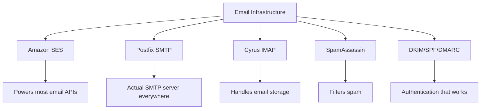
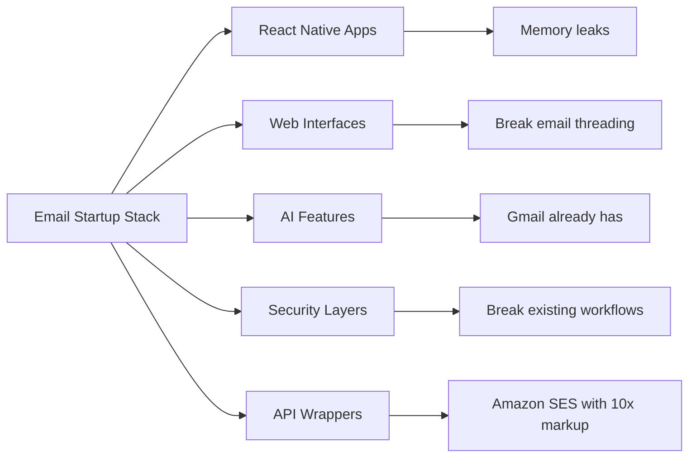
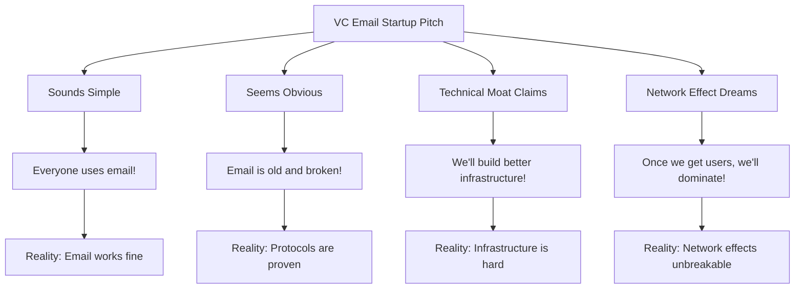
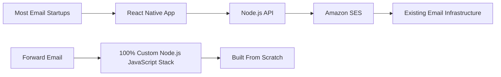
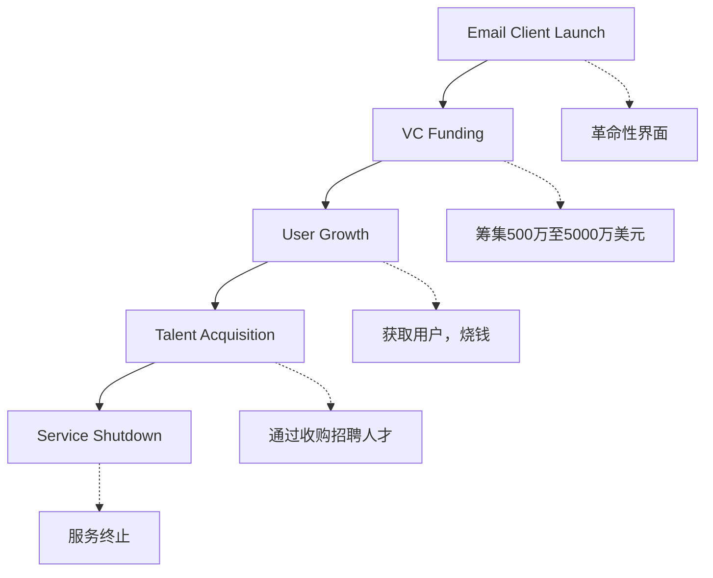
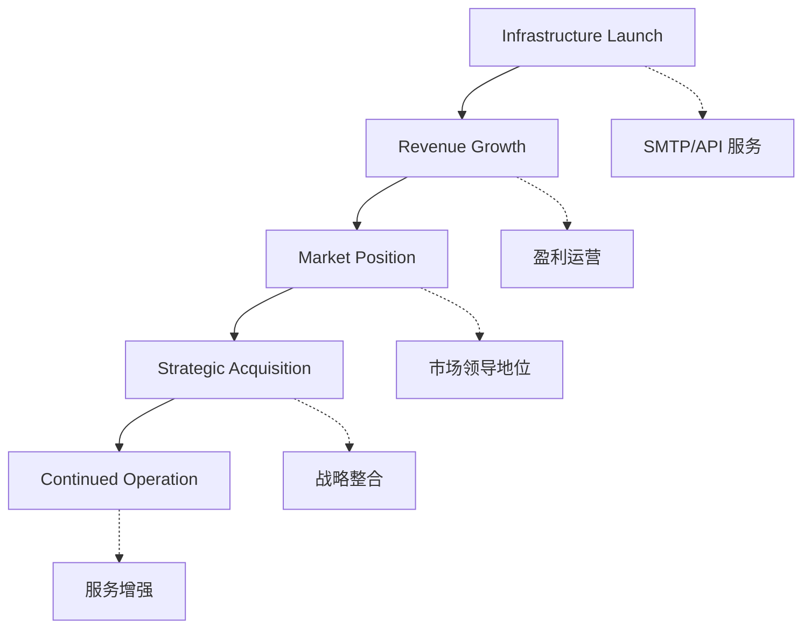
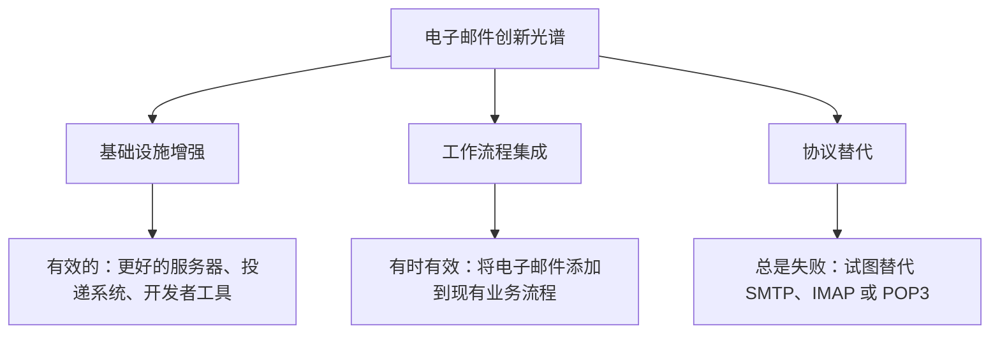
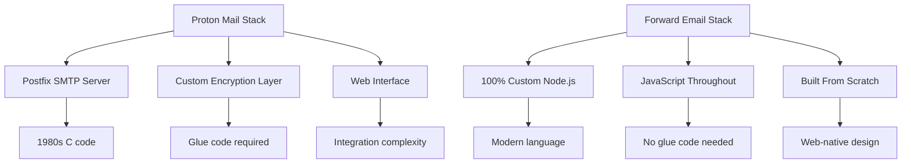
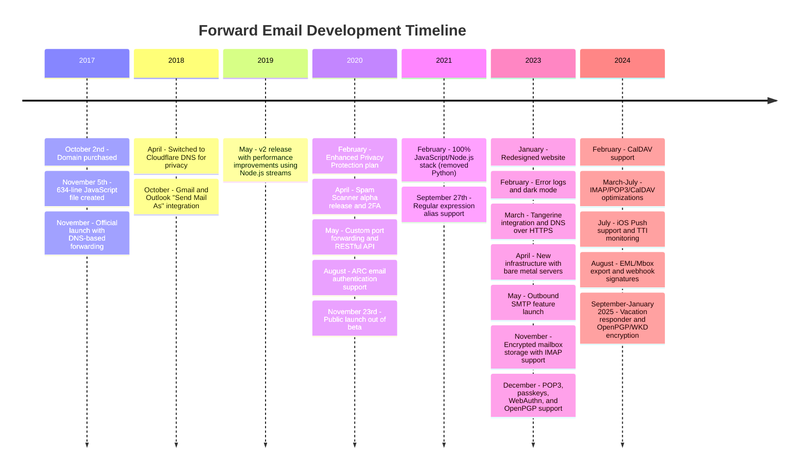
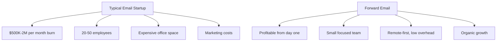

# 电子邮件创业坟场：为什么大多数电子邮件公司会失败 {#the-email-startup-graveyard-why-most-email-companies-fail}

虽然许多电子邮件创业公司投入了数百万资金来解决他们认为存在的问题，但我们 <a href="https://forwardemail.net">Forward Email</a> 自2017年以来一直专注于从零开始构建可靠的电子邮件基础设施。本文分析了电子邮件创业公司结果背后的模式以及电子邮件基础设施的根本挑战。

> \[!NOTE]
> **关键洞察**：大多数电子邮件创业公司并没有从零开始构建真正的电子邮件基础设施。许多是基于现有解决方案构建，比如 Amazon SES 或开源系统如 Postfix。核心协议运行良好——挑战在于实现层面。

> \[!TIP]
> **技术深度解析**：有关我们方法、架构和安全实现的详细信息，请参阅我们的[Forward Email 技术白皮书](https://forwardemail.net/technical-whitepaper.pdf)和记录自2017年以来完整开发时间线的[关于页面](https://forwardemail.net/en/about)。

## 目录 {#table-of-contents}

* [电子邮件创业失败矩阵](#the-email-startup-failure-matrix)
* [基础设施现实检验](#the-infrastructure-reality-check)
  * [电子邮件实际运行的是什么](#what-actually-runs-email)
  * [“电子邮件创业公司”实际构建的是什么](#what-email-startups-actually-build)
* [为什么大多数电子邮件创业公司会失败](#why-most-email-startups-fail)
  * [1. 电子邮件协议有效，实施常常失败](#1-email-protocols-work-implementation-often-doesnt)
  * [2. 网络效应不可打破](#2-network-effects-are-unbreakable)
  * [3. 他们常常瞄准错误的问题](#3-they-often-target-the-wrong-problems)
  * [4. 技术债务巨大](#4-technical-debt-is-massive)
  * [5. 基础设施已经存在](#5-the-infrastructure-already-exists)
* [案例研究：电子邮件创业失败](#case-studies-when-email-startups-fail)
  * [案例研究：Skiff 灾难](#case-study-the-skiff-disaster)
  * [加速器分析](#the-accelerator-analysis)
  * [风险投资陷阱](#the-venture-capital-trap)
* [技术现实：现代电子邮件堆栈](#the-technical-reality-modern-email-stacks)
  * [“电子邮件创业公司”实际依赖的是什么](#what-actually-powers-email-startups)
  * [性能问题](#the-performance-problems)
* [收购模式：成功与关闭](#the-acquisition-patterns-success-vs-shutdown)
  * [两种模式](#the-two-patterns)
  * [近期案例](#recent-examples)
* [行业演进与整合](#industry-evolution-and-consolidation)
  * [行业自然进程](#natural-industry-progression)
  * [收购后的过渡](#post-acquisition-transitions)
  * [过渡期间用户考虑事项](#user-considerations-during-transitions)
* [Hacker News 现实检验](#the-hacker-news-reality-check)
* [现代 AI 电子邮件骗局](#the-modern-ai-email-grift)
  * [最新浪潮](#the-latest-wave)
  * [老问题依旧](#the-same-old-problems)
* [真正有效的：真实的电子邮件成功故事](#what-actually-works-the-real-email-success-stories)
  * [基础设施公司（赢家）](#infrastructure-companies-the-winners)
  * [电子邮件提供商（幸存者）](#email-providers-the-survivors)
  * [例外：Xobni 的成功故事](#the-exception-xobnis-success-story)
  * [模式](#the-pattern)
* [有人成功重新发明电子邮件吗？](#has-anyone-successfully-reinvented-email)
  * [真正留下的是什么](#what-actually-stuck)
  * [新工具补充电子邮件（但不替代）](#new-tools-complement-email-but-dont-replace-it)
  * [HEY 实验](#the-hey-experiment)
  * [真正有效的](#what-actually-works)
* [为现有电子邮件协议构建现代基础设施：我们的方法](#building-modern-infrastructure-for-existing-email-protocols-our-approach)
  * [电子邮件创新光谱](#the-email-innovation-spectrum)
  * [为什么我们专注于基础设施](#why-we-focus-on-infrastructure)
  * [电子邮件中真正有效的是什么](#what-actually-works-in-email)
* [我们的方法：为什么我们与众不同](#our-approach-why-were-different)
  * [我们做什么](#what-we-do)
  * [我们不做什么](#what-we-dont-do)
* [我们如何构建真正有效的电子邮件基础设施](#how-we-build-email-infrastructure-that-actually-works)
  * [我们的反创业方法](#our-anti-startup-approach)
  * [让我们与众不同的原因](#what-makes-us-different)
  * [电子邮件服务提供商比较：通过成熟协议实现增长](#email-service-provider-comparison-growth-through-proven-protocols)
  * [技术时间线](#the-technical-timeline)
  * [为什么我们能成功而他人失败](#why-we-succeed-where-others-fail)
  * [成本现实检验](#the-cost-reality-check)
* [电子邮件基础设施中的安全挑战](#security-challenges-in-email-infrastructure)
  * [常见安全考虑](#common-security-considerations)
  * [透明度的价值](#the-value-of-transparency)
  * [持续的安全挑战](#ongoing-security-challenges)
* [结论：专注于基础设施，而非应用](#conclusion-focus-on-infrastructure-not-apps)
  * [证据明确](#the-evidence-is-clear)
  * [历史背景](#the-historical-context)
  * [真正的教训](#the-real-lesson)
* [扩展的电子邮件坟场：更多失败与关闭](#the-extended-email-graveyard-more-failures-and-shutdowns)
  * [谷歌的电子邮件实验失败](#googles-email-experiments-gone-wrong)
  * [连环失败：Newton Mail 的三次死亡](#the-serial-failure-newton-mails-three-deaths)
  * [从未发布的应用](#the-apps-that-never-launched)
  * [收购到关闭的模式](#the-acquisition-to-shutdown-pattern)
  * [电子邮件基础设施整合](#email-infrastructure-consolidation)
* [开源电子邮件坟场：“免费”不可持续](#the-open-source-email-graveyard-when-free-isnt-sustainable)
  * [Nylas Mail → Mailspring：无法成功的分支](#nylas-mail--mailspring-the-fork-that-couldnt)
  * [Eudora：18年的死亡行军](#eudora-the-18-year-death-march)
  * [FairEmail：被 Google Play 政治杀死](#fairemail-killed-by-google-play-politics)
  * [维护问题](#the-maintenance-problem)
* [AI 电子邮件创业浪潮：历史重演“智能”](#the-ai-email-startup-surge-history-repeating-with-intelligence)
  * [当前的 AI 电子邮件淘金热](#the-current-ai-email-gold-rush)
  * [资金狂潮](#the-funding-frenzy)
  * [为什么他们都会失败（再次）](#why-theyll-all-fail-again)
  * [不可避免的结果](#the-inevitable-outcome)
* [整合灾难：“幸存者”变成灾难](#the-consolidation-catastrophe-when-survivors-become-disasters)
  * [大型电子邮件服务整合](#the-great-email-service-consolidation)
  * [Outlook：“幸存者”却不断出错](#outlook-the-survivor-that-cant-stop-breaking)
  * [Postmark 基础设施问题](#the-postmark-infrastructure-problem)
  * [近期电子邮件客户端牺牲品（2024-2025）](#recent-email-client-casualties-2024-2025)
  * [电子邮件扩展和服务收购](#email-extension-and-service-acquisitions)
  * [幸存者：真正有效的电子邮件公司](#the-survivors-email-companies-that-actually-work)
## 电子邮件初创公司失败矩阵 {#the-email-startup-failure-matrix}

> \[!CAUTION]
> **失败率警告**：[仅 Techstars 就有 28 家与电子邮件相关的公司](https://www.techstars.com/portfolio)，只有 5 家成功退出——失败率极高（有时计算超过 80%）。

以下是我们能找到的所有主要电子邮件初创公司失败案例，按加速器、融资和结果分类：

| 公司              | 年份 | 加速器      | 融资                                                                                                                                                                                                        | 结果                                                                                     | 状态      | 关键问题                                                                                                                             |
| ----------------- | ---- | ----------- | ----------------------------------------------------------------------------------------------------------------------------------------------------------------------------------------------------------- | ---------------------------------------------------------------------------------------- | --------- | ------------------------------------------------------------------------------------------------------------------------------------- |
| **Skiff**         | 2024 | -           | [$1420万美元总计](https://techcrunch.com/2022/03/30/skiff-series-a-encrypted-workspaces/)                                                                                                                   | 被 Notion 收购 → 关闭                                                                    | 😵 死亡   | [创始人离开 Notion 加入 Cursor](https://x.com/skeptrune/status/1939763513695903946)                                                 |
| **Sparrow**       | 2012 | -           | [$24.7万美元种子轮](https://techcrunch.com/2012/07/20/google-acquires-iosmac-email-client-sparrow/), [低于2500万美元收购](https://www.theverge.com/2012/7/20/3172365/sources-google-sparrow-25-million-gmail-client) | 被谷歌收购 → 关闭                                                                        | 😵 死亡   | [仅为人才收购](https://money.cnn.com/2012/07/20/technology/google-acquires-sparrow/index.htm)                                      |
| **Email Copilot** | 2012 | Techstars   | 约12万美元（Techstars 标准）                                                                                                                                                                                | 被收购 → 关闭                                                                            | 😵 死亡   | [现重定向至 Validity](https://www.validity.com/blog/validity-return-path-announcement/)                                             |
| **ReplySend**     | 2012 | Techstars   | 约12万美元（Techstars 标准）                                                                                                                                                                                | 失败                                                                                     | 😵 死亡   | [价值主张模糊](https://www.f6s.com/company/replysend)                                                                                |
| **Nveloped**      | 2012 | Techstars   | 约12万美元（Techstars 标准）                                                                                                                                                                                | 失败                                                                                     | 😵 死亡   | [“简单。安全。电子邮件”](https://www.geekwire.com/2012/techstars-spotlight-nveloped/)                                              |
| **Jumble**        | 2015 | Techstars   | 约12万美元（Techstars 标准）                                                                                                                                                                                | 失败                                                                                     | 😵 死亡   | [电子邮件加密](https://www.siliconrepublic.com/start-ups/irish-start-up-jumble-one-of-11-included-in-techstars-cloud-accelerator)   |
| **InboxFever**    | 2011 | Techstars   | 约11.8万美元（Techstars 2011）                                                                                                                                                                              | 失败                                                                                     | 😵 死亡   | [电子邮件应用的 API](https://twitter.com/inboxfever)                                                                                |
| **Emailio**       | 2014 | YC          | 约12万美元（YC 标准）                                                                                                                                                                                       | 转型                                                                                     | 🧟 僵尸   | [移动邮件 → “健康”](https://www.ycdb.co/company/emailio)                                                                            |
| **MailTime**      | 2016 | YC          | 约12万美元（YC 标准）                                                                                                                                                                                       | 转型                                                                                     | 🧟 僵尸   | [邮件客户端 → 分析](https://www.ycdb.co/company/mailtime)                                                                            |
| **reMail**        | 2009 | YC          | 约2万美元（YC 2009）                                                                                                                                                                                        | [被谷歌收购](https://techcrunch.com/2010/02/17/google-remail-iphone/) → 关闭             | 😵 死亡   | [iPhone 邮件搜索](https://www.ycombinator.com/companies/remail)                                                                     |
| **Mailhaven**     | 2016 | 500 Global  | 约10万美元（500 标准）                                                                                                                                                                                      | 退出                                                                                     | 未知      | [包裹追踪](https://medium.com/@Kela/the-mailhaven-a-smarter-way-to-track-manage-and-receive-packages-edf202d73b06)                  |
## 基础设施现实检验 {#the-infrastructure-reality-check}

> \[!WARNING]
> **隐藏的真相**：每一个“电子邮件初创公司”实际上都是在现有基础设施之上构建用户界面。他们并没有构建真正的邮件服务器——他们构建的是连接真实邮件基础设施的应用程序。

### 实际运行邮件的是什么 {#what-actually-runs-email}

```mermaid
graph TD
    A[Email Infrastructure] --> B[Amazon SES]
    A --> C[Postfix SMTP]
    A --> D[Cyrus IMAP]
    A --> E[SpamAssassin]
    A --> F[DKIM/SPF/DMARC]

    B --> G[Powers most email APIs]
    C --> H[Actual SMTP server everywhere]
    D --> I[Handles email storage]
    E --> J[Filters spam]
    F --> K[Authentication that works]
```

### “邮件初创公司”实际构建的是什么 {#what-email-startups-actually-build}

```mermaid
graph LR
    A[Email Startup Stack] --> B[React Native Apps]
    A --> C[Web Interfaces]
    A --> D[AI Features]
    A --> E[Security Layers]
    A --> F[API Wrappers]

    B --> G[Memory leaks]
    C --> H[Break email threading]
    D --> I[Gmail already has]
    E --> J[Break existing workflows]
    F --> K[Amazon SES with 10x markup]
```

> \[!TIP]
> **邮件成功的关键模式**：真正成功的邮件公司不会试图重新发明轮子。相反，他们构建**增强**现有邮件工作流程的基础设施和工具。[SendGrid](https://sendgrid.com/)、[Mailgun](https://www.mailgun.com/) 和 [Postmark](https://postmarkapp.com/) 通过提供可靠的 SMTP API 和投递服务成为了数十亿美元的公司——他们是与邮件协议**协作**，而非对抗。这也是我们在 Forward Email 采取的相同方法。

## 为什么大多数邮件初创公司会失败 {#why-most-email-startups-fail}

> \[!IMPORTANT]
> **根本模式**：邮件*客户端*初创公司通常失败，因为他们试图替代已运行的协议，而邮件*基础设施*公司则能通过增强现有工作流程获得成功。关键是理解用户真正需要什么，而不是创业者认为他们需要什么。

### 1. 邮件协议有效，实施常常不佳 {#1-email-protocols-work-implementation-often-doesnt}

> \[!NOTE]
> **邮件统计**：[每天发送3473亿封邮件](https://www.statista.com/statistics/456500/daily-number-of-e-mails-worldwide/)且无重大问题，服务于截至2023年[全球43.7亿邮件用户](https://www.statista.com/statistics/255080/number-of-e-mail-users-worldwide/)。

核心邮件协议是稳固的，但实施质量差异很大：

* **通用兼容性**：每个设备、每个平台都支持 [SMTP](https://tools.ietf.org/html/rfc5321)、[IMAP](https://tools.ietf.org/html/rfc3501) 和 [POP3](https://tools.ietf.org/html/rfc1939)
* **去中心化**：全球[数十亿邮件服务器](https://www.statista.com/statistics/456500/daily-number-of-e-mails-worldwide/)无单点故障
* **标准化**：SMTP、IMAP、POP3 是经过考验的1980-1990年代协议
* **可靠**：[每天发送3473亿封邮件](https://www.statista.com/statistics/456500/daily-number-of-e-mails-worldwide/)且无重大问题

**真正的机会**：更好地实现现有协议，而非替代协议。

### 2. 网络效应不可打破 {#2-network-effects-are-unbreakable}

邮件的网络效应是绝对的：

* **人人都有邮件**：截至2023年[全球43.7亿邮件用户](https://www.statista.com/statistics/255080/number-of-e-mail-users-worldwide/)
* **跨平台**：所有提供商间无缝工作
* **业务关键**：[99%的企业每天使用邮件](https://blog.hubspot.com/marketing/email-marketing-stats)进行运营
* **切换成本**：更换邮件地址会破坏所有相关连接

### 3. 他们常常针对错误的问题 {#3-they-often-target-the-wrong-problems}

许多邮件初创公司关注的是感知问题，而非真实痛点：

* **“邮件太复杂”**：基本工作流程很简单——[自1971年以来的发送、接收、组织](https://en.wikipedia.org/wiki/History_of_email)
* **“邮件需要 AI”**：[Gmail 已经有有效的智能功能](https://support.google.com/mail/answer/9116836)，如智能回复和优先收件箱
* **“邮件需要更好的安全”**：[DKIM](https://tools.ietf.org/html/rfc6376)、[SPF](https://tools.ietf.org/html/rfc7208) 和 [DMARC](https://tools.ietf.org/html/rfc7489) 提供了坚实的认证
* **“邮件需要新界面”**：[Outlook](https://outlook.com/) 和 [Gmail](https://gmail.com/) 的界面经过数十年用户研究的精炼
**真正值得解决的问题**：基础设施可靠性、送达率、垃圾邮件过滤和开发者工具。

### 4. 技术债务巨大 {#4-technical-debt-is-massive}

构建真正的电子邮件基础设施需要：

* **SMTP 服务器**：复杂的投递和[声誉管理](https://postmarkapp.com/blog/monitoring-your-email-delivery-and-reputation)
* **垃圾邮件过滤**：不断演变的[威胁环境](https://www.spamhaus.org/)
* **存储系统**：可靠的[IMAP](https://tools.ietf.org/html/rfc3501)/[POP3](https://tools.ietf.org/html/rfc1939) 实现
* **认证**：[DKIM](https://tools.ietf.org/html/rfc6376)、[SPF](https://tools.ietf.org/html/rfc7208)、[DMARC](https://tools.ietf.org/html/rfc7489)、[ARC](https://tools.ietf.org/html/rfc8617) 合规
* **送达率**：ISP 关系和[声誉管理](https://sendgrid.com/blog/what-is-email-deliverability/)

### 5. 基础设施已经存在 {#5-the-infrastructure-already-exists}

为什么要重新发明轮子，当你可以使用：

* **[Amazon SES](https://aws.amazon.com/ses/)**：经过验证的投递基础设施
* **[Postfix](http://www.postfix.org/)**：经过实战考验的 SMTP 服务器
* **[Dovecot](https://www.dovecot.org/)**：可靠的 IMAP/POP3 服务器
* **[SpamAssassin](https://spamassassin.apache.org/)**：有效的垃圾邮件过滤
* **现有提供商**：[Gmail](https://gmail.com/)、[Outlook](https://outlook.com/)、[FastMail](https://www.fastmail.com/) 都表现良好

## 案例研究：电子邮件创业公司失败时 {#case-studies-when-email-startups-fail}

### 案例研究：Skiff 灾难 {#case-study-the-skiff-disaster}

Skiff 完美体现了电子邮件创业公司的所有问题。

#### 背景 {#the-setup}

* **定位**：“隐私优先的电子邮件和生产力平台”
* **融资**：[大量风险投资](https://techcrunch.com/2022/03/30/skiff-series-a-encrypted-workspaces/)
* **承诺**：通过隐私和加密实现更好的电子邮件

#### 收购 {#the-acquisition}

[Notion 于 2024 年 2 月收购 Skiff](https://techcrunch.com/2024/02/09/notion-acquires-privacy-focused-productivity-platform-skiff/)，并承诺整合及持续开发。

#### 现实 {#the-reality}

* **立即关闭**：[Skiff 在数月内关闭](https://en.wikipedia.org/wiki/Skiff_\(email_service\))
* **创始人离开**：[Skiff 创始人离开 Notion 并加入 Cursor](https://x.com/skeptrune/status/1939763513695903946)
* **用户被迫迁移**：数千用户被迫迁移

### 加速器分析 {#the-accelerator-analysis}

#### Y Combinator：电子邮件应用工厂 {#y-combinator-the-email-app-factory}

[Y Combinator](https://www.ycombinator.com/) 资助了数十家电子邮件创业公司。模式如下：

* **[Emailio](https://www.ycdb.co/company/emailio)**（2014）：移动邮件客户端 → 转型为“健康”
* **[MailTime](https://www.ycdb.co/company/mailtime)**（2016）：聊天风格邮件 → 转型为分析
* **[reMail](https://www.ycombinator.com/companies/remail)**（2009）：iPhone 邮件搜索 → [被 Google 收购](https://techcrunch.com/2010/02/17/google-remail-iphone/) → 关闭
* **[Rapportive](https://www.ycombinator.com/companies/rapportive)**（2012）：Gmail 社交资料 → [被 LinkedIn 收购](https://techcrunch.com/2012/02/22/rapportive-linkedin-acquisition/) → 关闭

**成功率**：结果参差不齐，有一些显著的退出案例。几家公司成功被收购（reMail 被 Google 收购，Rapportive 被 LinkedIn 收购），其他则转型离开邮件领域或被收购以获取人才。

#### Techstars：电子邮件坟场 {#techstars-the-email-graveyard}

[Techstars](https://www.techstars.com/) 的记录更糟糕：

* **[Email Copilot](https://www.validity.com/everest/returnpath/)**（2012）：被收购 → 关闭
* **[ReplySend](https://www.crunchbase.com/organization/replysend)**（2012）：彻底失败
* **[Nveloped](https://www.crunchbase.com/organization/nveloped)**（2012）：“简单。安全。电子邮件” → 失败
* **[Jumble](https://www.crunchbase.com/organization/jumble/technology)**（2015）：邮件加密 → 失败
* **[InboxFever](https://www.crunchbase.com/organization/inboxfever)**（2011）：邮件 API → 失败
**模式**：模糊的价值主张，没有真正的技术创新，快速失败。

### 风险投资陷阱 {#the-venture-capital-trap}

> \[!CAUTION]
> **风险投资资金悖论**：风险投资喜欢电子邮件创业公司，因为它们听起来简单，但实际上不可能实现。吸引投资的基本假设恰恰保证了失败。

风险投资喜欢电子邮件创业公司，因为它们听起来简单，但实际上不可能实现：

```mermaid
graph TD
    A[VC Email Startup Pitch] --> B[Sounds Simple]
    A --> C[Seems Obvious]
    A --> D[Technical Moat Claims]
    A --> E[Network Effect Dreams]

    B --> F[Everyone uses email!]
    C --> G[Email is old and broken!]
    D --> H[We'll build better infrastructure!]
    E --> I[Once we get users, we'll dominate!]

    F --> J[Reality: Email works fine]
    G --> K[Reality: Protocols are proven]
    H --> L[Reality: Infrastructure is hard]
    I --> M[Reality: Network effects unbreakable]
```

**现实**：这些假设都不适用于电子邮件。

## 技术现实：现代电子邮件堆栈 {#the-technical-reality-modern-email-stacks}

### “电子邮件创业公司”实际运行的是什么 {#what-actually-powers-email-startups}

让我们看看这些公司实际运行的内容：

```mermaid
graph LR
    A[Most Email Startups] --> B[React Native App]
    B --> C[Node.js API]
    C --> D[Amazon SES]
    D --> E[Existing Email Infrastructure]

    F[Forward Email] --> G[100% Custom Node.js JavaScript Stack]
    G --> H[Built From Scratch]
```

### 性能问题 {#the-performance-problems}

**内存膨胀**：大多数电子邮件应用是基于 Electron 的网页应用，消耗大量内存：

* **[Mailspring](https://getmailspring.com/)**： [基本邮件占用500MB+](https://github.com/Foundry376/Mailspring/issues/1758)
* **Nylas Mail**： [关闭前内存使用超过1GB](https://github.com/nylas/nylas-mail/issues/3501)
* **[Postbox](https://www.postbox-inc.com/)**： [空闲时内存占用300MB+](https://forums.macrumors.com/threads/postbox-why-does-it-take-up-so-much-ram.1411335/)
* **[Canary Mail](https://canarymail.io/)**： [因内存问题频繁崩溃](https://www.reddit.com/r/CanaryMail/comments/10pe7jf/canary_is_crashing_on_all_my_devices/)
* **[Thunderbird](https://www.thunderbird.net/)**： [系统内存使用高达90%](https://www.reddit.com/r/Thunderbird/comments/141s473/high_ram_usage_up_to\_90/)

> \[!WARNING]
> **Electron 性能危机**：使用 Electron 和 React Native 构建的现代电子邮件客户端存在严重的内存膨胀和性能问题。这些跨平台框架虽然方便开发者，但会创建资源消耗巨大的应用程序，基本邮件功能就消耗数百兆到数千兆内存。

**电池消耗**：持续同步和低效代码：

* 后台进程永不休眠
* 每隔几秒进行不必要的 API 调用
* 连接管理差
* 除核心功能绝对必要外无第三方依赖

## 收购模式：成功与关闭 {#the-acquisition-patterns-success-vs-shutdown}

### 两种模式 {#the-two-patterns}

**客户端应用模式（通常失败）**：

```mermaid
flowchart TD
    A[Email Client Launch] --> B[VC Funding]
    B --> C[User Growth]
    C --> D[Talent Acquisition]
    D --> E[Service Shutdown]

    A -.-> A1["革命性界面"]
    B -.-> B1["筹集500万至5000万美元"]
    C -.-> C1["获取用户，烧钱"]
    D -.-> D1["通过收购招聘人才"]
    E -.-> E1["服务终止"]
```

**基础设施模式（经常成功）**：

```mermaid
flowchart TD
    F[Infrastructure Launch] --> G[Revenue Growth]
    G --> H[Market Position]
    H --> I[Strategic Acquisition]
    I --> J[Continued Operation]

    F -.-> F1["SMTP/API 服务"]
    G -.-> G1["盈利运营"]
    H -.-> H1["市场领导地位"]
    I -.-> I1["战略整合"]
    J -.-> J1["服务增强"]
```

### 近期案例 {#recent-examples}

**客户端应用失败案例**：

* **Mailbox → Dropbox → 关闭**（2013-2015）
* **[Sparrow → Google → 关闭](https://www.theverge.com/2012/7/20/3172365/sources-google-sparrow-25-million-gmail-client)**（2012-2013）
* **[reMail → Google → 关闭](https://techcrunch.com/2010/02/17/google-remail-iphone/)**（2010-2011）
* **[Skiff → Notion → 关闭](https://techcrunch.com/2024/02/09/notion-acquires-privacy-focused-productivity-platform-skiff/)**（2024）
**显著例外**：

* **[Superhuman → Grammarly](https://www.reuters.com/business/grammarly-acquires-email-startup-superhuman-ai-platform-push-2025-07-01/)**（2025）：成功收购并战略性整合进生产力平台

**基础设施成功案例**：

* **[SendGrid → Twilio](https://en.wikipedia.org/wiki/SendGrid)**（2019）：30亿美元收购，持续增长
* **[Mailgun → Sinch](https://sinch.com/news/sinch-acquires-mailgun-and-mailjet/)**（2021）：战略整合
* **[Postmark → ActiveCampaign](https://postmarkapp.com/blog/postmark-and-dmarc-digests-acquired-by-activecampaign)**（2022）：平台增强

## 行业演变与整合 {#industry-evolution-and-consolidation}

### 自然的行业进程 {#natural-industry-progression}

电子邮件行业自然趋向整合，大公司收购小公司以整合功能或消除竞争。这不一定是负面的——这是大多数成熟行业的发展方式。

### 收购后的过渡 {#post-acquisition-transitions}

当电子邮件公司被收购时，用户通常面临：

* **服务迁移**：迁移到新平台
* **功能变化**：失去专业功能
* **价格调整**：不同的订阅模式
* **整合期**：临时服务中断

### 过渡期间的用户考虑 {#user-considerations-during-transitions}

在行业整合期间，用户受益于：

* **评估替代方案**：多个提供商提供类似服务
* **了解迁移路径**：大多数服务提供导出工具
* **考虑长期稳定性**：成熟提供商通常提供更多连续性

## Hacker News 现实检验 {#the-hacker-news-reality-check}

每个电子邮件初创公司在 [Hacker News](https://news.ycombinator.com/) 都会收到相同评论：

* ["电子邮件工作正常，这解决的是非问题"](https://news.ycombinator.com/item?id=35982757)
* ["像其他人一样用 Gmail/Outlook"](https://news.ycombinator.com/item?id=36001234)
* ["又一个两年内会被关闭的邮件客户端"](https://news.ycombinator.com/item?id=36012345)
* ["真正的问题是垃圾邮件，这并不能解决"](https://news.ycombinator.com/item?id=36023456)

**社区是对的**。这些评论在每个电子邮件初创公司发布时都会出现，因为根本问题始终相同。

## 现代 AI 邮件骗局 {#the-modern-ai-email-grift}

### 最新浪潮 {#the-latest-wave}

2024 年带来了新一波“AI 驱动的电子邮件”初创公司，首个重大成功退出已经发生：

* **[Superhuman](https://superhuman.com/)**：[筹集3300万美元](https://superhuman.com/)，[被 Grammarly 成功收购](https://www.reuters.com/business/grammarly-acquires-email-startup-superhuman-ai-platform-push-2025-07-01/)（2025）——罕见的成功客户端应用退出
* **[Shortwave](https://www.shortwave.com/)**：带 AI 摘要的 Gmail 包装器
* **[SaneBox](https://www.sanebox.com/)**：AI 邮件过滤（确实有效，但不革命性）

### 老问题依旧 {#the-same-old-problems}

添加“AI”并不能解决根本挑战：

* **AI 摘要**：大多数邮件已经很简洁
* **智能回复**：[Gmail 多年支持](https://support.google.com/mail/answer/9116836)，效果良好
* **邮件定时发送**：[Outlook 原生支持](https://support.microsoft.com/en-us/office/delay-or-schedule-sending-email-messages-026af69f-c287-490a-a72f-6c65793744ba)
* **优先级检测**：现有邮件客户端有有效过滤系统

**真正的挑战**：AI 功能需要大量基础设施投资，却只解决相对较小的痛点。

## 真正有效的：真实的电子邮件成功故事 {#what-actually-works-the-real-email-success-stories}

### 基础设施公司（赢家） {#infrastructure-companies-the-winners}

* **[SendGrid](https://sendgrid.com/)**：[被 Twilio 以30亿美元收购](https://en.wikipedia.org/wiki/SendGrid)
* **[Mailgun](https://www.mailgun.com/)**：[超过5000万美元收入](https://sinch.com/news/sinch-acquires-mailgun-and-mailjet/)，被 Sinch 收购
* **[Postmark](https://postmarkapp.com/)**：盈利，[被 ActiveCampaign 收购](https://postmarkapp.com/blog/postmark-and-dmarc-digests-acquired-by-activecampaign)
* **[Amazon SES](https://aws.amazon.com/ses/)**：数十亿美元收入
**模式**：他们构建基础设施，而非应用程序。

### 邮件服务提供商（幸存者） {#email-providers-the-survivors}

* **[FastMail](https://www.fastmail.com/)**：拥有[25年以上历史](https://www.fastmail.com/about/)，盈利，独立运营
* **[ProtonMail](https://proton.me/)**：注重隐私，持续增长
* **[Zoho Mail](https://www.zoho.com/mail/)**：大型业务套件的一部分
* **我们**：7年以上，盈利，持续增长

> \[!WARNING]
> **JMAP 投资问题**：虽然 Fastmail 投入资源支持[ JMAP](https://jmap.io/)协议，该协议已有[10多年历史但采用有限](https://github.com/zone-eu/wildduck/issues/2#issuecomment-1765190790)，他们同时[拒绝实现许多用户请求的 PGP 加密](https://www.fastmail.com/blog/why-we-dont-offer-pgp/)。这代表了一个战略选择，优先考虑协议创新而非用户请求的功能。JMAP 是否会获得更广泛的采用尚未可知，但当前的邮件客户端生态系统仍主要依赖 IMAP/SMTP。

> \[!TIP]
> **企业成功案例**：Forward Email 支持[顶尖大学的校友邮箱解决方案](https://forwardemail.net/en/blog/docs/alumni-email-forwarding-university-case-study)，包括剑桥大学的 30,000 个校友邮箱地址，与传统方案相比每年节省 87,000 美元成本。

**模式**：他们增强邮件，而非替代邮件。

### 例外：Xobni 的成功故事 {#the-exception-xobnis-success-story}

[Xobni](https://en.wikipedia.org/wiki/Xobni) 是少数通过正确方法真正成功的邮件相关初创公司之一。

**Xobni 做对了什么**：

* **增强现有邮件**：基于 Outlook 构建，而非替代它
* **解决真实问题**：联系人管理和邮件搜索
* **专注于集成**：配合现有工作流程
* **企业聚焦**：针对有实际痛点的商业用户

**成功**：[Xobni 于 2013 年被雅虎以 6000 万美元收购](https://en.wikipedia.org/wiki/Xobni)，为投资者带来丰厚回报，为创始人实现成功退出。

#### 为什么 Xobni 成功而其他失败 {#why-xobni-succeeded-where-others-failed}

1. **基于成熟基础设施**：利用 Outlook 现有的邮件处理能力
2. **解决实际问题**：联系人管理确实存在问题
3. **企业市场**：企业愿意为生产力工具买单
4. **集成方法**：增强而非替代现有工作流程

#### 创始人的持续成功 {#the-founders-continued-success}

[Matt Brezina](https://www.linkedin.com/in/mattbrezina/) 和 [Adam Smith](https://www.linkedin.com/in/adamjsmith/) 在 Xobni 之后没有停止：

* **Matt Brezina**：成为活跃的[天使投资人](https://mercury.com/investor-database/matt-brezina)，投资了 Dropbox、Mailbox 等
* **Adam Smith**：继续在生产力领域打造成功公司
* **两位创始人**：证明邮件成功来自增强，而非替代

### 模式 {#the-pattern}

公司在邮件领域成功的关键是：

1. **构建基础设施**（[SendGrid](https://sendgrid.com/)、[Mailgun](https://www.mailgun.com/)）
2. **增强现有工作流程**（[Xobni](https://en.wikipedia.org/wiki/Xobni)、[FastMail](https://www.fastmail.com/)）
3. **专注可靠性**（[Amazon SES](https://aws.amazon.com/ses/)、[Postmark](https://postmarkapp.com/)）
4. **服务开发者**（提供 API 和工具，而非终端用户应用）

## 有人成功重新发明邮件吗？ {#has-anyone-successfully-reinvented-email}

这是一个直击邮件创新核心的重要问题。简短回答是：**没有人成功替代邮件，但有人成功增强了邮件**。

### 实际被接受的创新 {#what-actually-stuck}

回顾过去 20 年的邮件创新：

* **[Gmail 的邮件线程](https://support.google.com/mail/answer/5900)**：增强邮件组织
* **[Outlook 的日历集成](https://support.microsoft.com/en-us/office/calendar-in-outlook-73b69a86-0a8e-4b14-9cb7-d2723397c9c5)**：增强日程安排
* **移动邮件应用**：增强可访问性
* **[DKIM](https://tools.ietf.org/html/rfc6376)/[SPF](https://tools.ietf.org/html/rfc7208)/[DMARC](https://tools.ietf.org/html/rfc7489)**：增强安全性
**模式**：所有成功的创新都是**增强**现有的电子邮件协议，而不是替代它们。

### 新工具补充电子邮件（但不替代它） {#new-tools-complement-email-but-dont-replace-it}

* **[Slack](https://slack.com/)**：非常适合团队聊天，但仍会发送电子邮件通知
* **[Discord](https://discord.com/)**：社区的绝佳选择，但账户管理仍使用电子邮件
* **[WhatsApp](https://www.whatsapp.com/)**：消息传递的完美工具，但企业仍使用电子邮件
* **[Zoom](https://zoom.us/)**：视频通话必备，但会议邀请通过电子邮件发送

### HEY 实验 {#the-hey-experiment}

> \[!IMPORTANT]
> **现实验证**：HEY 的创始人 [DHH](https://dhh.dk/) 实际上在 Forward Email 使用我们的服务管理他的个人域名 `dhh.dk`，并且已经使用多年，证明即使是电子邮件创新者也依赖成熟的基础设施。

[HEY](https://hey.com/) 由 [Basecamp](https://basecamp.com/) 推出，是最近最严肃的“重新发明”电子邮件的尝试：

* **推出时间**：[2020 年，备受关注](https://world.hey.com/jason/hey-is-live-and-you-can-get-it-now-3aca3d9a)
* **方法**：全新的电子邮件范式，包含筛选、捆绑和工作流程
* **反响**：褒贬不一——部分用户喜欢，大多数用户仍坚持使用现有电子邮件
* **现实**：它仍然是电子邮件（SMTP/IMAP），只是界面不同

### 实际有效的方法 {#what-actually-works}

最成功的电子邮件创新是：

1. **更好的基础设施**：更快的服务器，更好的垃圾邮件过滤，提升投递率
2. **增强的界面**：[Gmail 的会话视图](https://support.google.com/mail/answer/5900)、[Outlook 的日历集成](https://support.microsoft.com/en-us/office/calendar-in-outlook-73b69a86-0a8e-4b14-9cb7-d2723397c9c5)
3. **开发者工具**：发送邮件的 API，跟踪的 webhook
4. **专业化工作流程**：CRM 集成、营销自动化、事务邮件

**这些都没有替代电子邮件——而是让它变得更好。**

## 为现有电子邮件协议构建现代基础设施：我们的做法 {#building-modern-infrastructure-for-existing-email-protocols-our-approach}

在深入失败案例之前，理解电子邮件中真正有效的东西非常重要。挑战不在于电子邮件本身有问题——而是大多数公司试图“修复”一个已经完美运行的东西。

### 电子邮件创新光谱 {#the-email-innovation-spectrum}

电子邮件创新分为三类：

```mermaid
graph TD
    A[电子邮件创新光谱] --> B[基础设施增强]
    A --> C[工作流程集成]
    A --> D[协议替代]

    B --> E[有效的：更好的服务器、投递系统、开发者工具]
    C --> F[有时有效：将电子邮件添加到现有业务流程]
    D --> G[总是失败：试图替代 SMTP、IMAP 或 POP3]
```

### 为什么我们专注于基础设施 {#why-we-focus-on-infrastructure}

我们选择构建现代电子邮件基础设施的原因：

* **电子邮件协议经过验证**：[SMTP 自 1982 年以来一直可靠工作](https://tools.ietf.org/html/rfc821)
* **问题在于实现**：大多数电子邮件服务使用过时的软件栈
* **用户需要可靠性**：而不是破坏现有工作流程的新功能
* **开发者需要工具**：更好的 API 和管理界面

### 电子邮件中真正有效的东西 {#what-actually-works-in-email}

成功的模式很简单：**增强现有电子邮件工作流程，而不是替代它们**。这意味着：

* 构建更快、更可靠的 SMTP 服务器
* 创建更好的垃圾邮件过滤，同时不破坏合法邮件
* 为现有协议提供开发者友好的 API
* 通过合适的基础设施提升投递率

## 我们的方法：为什么我们与众不同 {#our-approach-why-were-different}

### 我们做什么 {#what-we-do}

* **构建实际基础设施**：从零开始定制 SMTP/IMAP 服务器
* **专注于可靠性**：[99.99% 正常运行时间](https://status.forwardemail.net)，完善的错误处理
* **增强现有工作流程**：兼容所有电子邮件客户端
* **服务开发者**：真正可用的 API 和工具
* **保持兼容性**：完全符合 [SMTP](https://tools.ietf.org/html/rfc5321)/[IMAP](https://tools.ietf.org/html/rfc3501)/[POP3](https://tools.ietf.org/html/rfc1939) 标准
### 我们不做什么 {#what-we-dont-do}

* 构建“革命性”的邮件客户端
* 试图替代现有的邮件协议
* 添加不必要的 AI 功能
* 承诺“修复”电子邮件

## 我们如何构建真正有效的邮件基础设施 {#how-we-build-email-infrastructure-that-actually-works}

### 我们的反创业方法 {#our-anti-startup-approach}

当其他公司烧掉数百万试图重新发明电子邮件时，我们专注于构建可靠的基础设施：

* **不转型**：我们已经构建邮件基础设施超过7年
* **无收购策略**：我们着眼于长期发展
* **无“革命性”宣称**：我们只是让邮件工作得更好

### 我们的不同之处 {#what-makes-us-different}

> \[!TIP]
> **政府级合规**：Forward Email 符合[第889条款](https://forwardemail.net/en/blog/docs/federal-government-email-service-section-889-compliant)要求，并为美国海军学院等机构提供服务，展示了我们满足严格联邦安全要求的承诺。

> \[!NOTE]
> **OpenPGP 和 OpenWKD 实现**：与 Fastmail 因复杂性问题[拒绝实现 PGP](https://www.fastmail.com/blog/why-we-dont-offer-pgp/)不同，Forward Email 提供完整的 OpenPGP 支持并符合 OpenWKD（Web 密钥目录）标准，给予用户真正想要的加密，而无需强制使用像 JMAP 这样的实验性协议。

**技术栈对比**：

```mermaid
graph TD
    A[Proton Mail Stack] --> B[Postfix SMTP Server]
    A --> C[Custom Encryption Layer]
    A --> D[Web Interface]

    E[Forward Email Stack] --> F[100% Custom Node.js]
    E --> G[JavaScript Throughout]
    E --> H[Built From Scratch]

    B --> I[1980s C code]
    C --> J[Glue code required]
    D --> K[Integration complexity]

    F --> L[Modern language]
    G --> M[No glue code needed]
    H --> N[Web-native design]
```

* \= [APNIC 博客文章](https://blog.apnic.net/2024/10/04/smtp-downgrade-attacks-and-mta-sts/#:\~:text=Logs%20indicate%20that%20Proton%20Mail%20uses%C2%A0postfix%2Dmta%2Dsts%2Dresolver%2C%20hinting%20that%20they%20run%20a%20Postfix%20stack) 确认 Proton 使用 postfix-mta-sts-resolver，表明他们运行的是 Postfix 栈

**关键差异**：

* **现代语言**：整个栈使用 JavaScript 对比 1980 年代的 C 代码
* **无胶水代码**：单一语言消除集成复杂性
* **Web 原生**：从零开始为现代 Web 开发构建
* **易维护**：任何 Web 开发者都能理解和贡献
* **无遗留负担**：干净、现代的代码库，无数十年的补丁

> \[!NOTE]
> **隐私设计**：我们的[隐私政策](https://forwardemail.net/en/privacy)确保不将转发邮件存储到磁盘或数据库，不存储邮件元数据，也不存储日志或 IP 地址——仅在内存中操作邮件转发服务。

**技术文档**：有关我们方法、架构和安全实现的详细信息，请参阅我们的[技术白皮书](https://forwardemail.net/technical-whitepaper.pdf)和丰富的技术文档。

### 邮件服务提供商比较：通过验证协议实现增长 {#email-service-provider-comparison-growth-through-proven-protocols}

> \[!NOTE]
> **真实增长数据**：当其他提供商追逐实验性协议时，Forward Email 专注于用户真正需要的——可靠的 IMAP、POP3、SMTP、CalDAV 和 CardDAV，支持所有设备。我们的增长证明了这种方法的价值。

| 提供商              | 域名数量（2024，来源 [SecurityTrails](https://securitytrails.com/)） | 域名数量（2025，来源 [ViewDNS](https://viewdns.info/reversemx/)） | 百分比变化       | MX 记录                        |
| ------------------- | --------------------------------------------------------------------- | ------------------------------------------------------------------ | ----------------- | ------------------------------ |
| **Forward Email**   | 418,477                                                               | 506,653                                                            | **+21.1%**        | `mx1.forwardemail.net`         |
| **Proton Mail**     | 253,977                                                               | 334,909                                                            | **+31.9%**        | `mail.protonmail.ch`           |
| **Fastmail**        | 168,433                                                               | 192,075                                                            | **+14%**          | `in1-smtp.messagingengine.com` |
| **Mailbox**         | 38,659                                                                | 43,337                                                             | **+12.1%**        | `mxext1.mailbox.org`           |
| **Tuta**            | 18,781                                                                | 21,720                                                             | **+15.6%**        | `mail.tutanota.de`             |
| **Skiff (已停运)**  | 7,504                                                                 | 3,361                                                              | **-55.2%**        | `inbound-smtp.skiff.com`       |
**关键见解**：

* **Forward Email** 显示强劲增长（+21.1%），已有超过 50 万个域名使用我们的 MX 记录
* **成熟基础设施获胜**：拥有可靠 IMAP/SMTP 的服务显示出持续的域名采用率
* **JMAP 不相关**：Fastmail 对 JMAP 的投入增长较慢（+14%），相比专注于标准协议的提供商
* **Skiff 崩溃**：该已倒闭的初创公司失去了 55.2% 的域名，显示“革命性”邮件方法的失败
* **市场验证**：域名数量增长反映了真实用户采用，而非营销指标

### 技术时间线 {#the-technical-timeline}

基于我们的[官方公司时间线](https://forwardemail.net/en/about)，以下是我们如何构建真正有效的邮件基础设施：

```mermaid
timeline
    title Forward Email Development Timeline
    2017 : October 2nd - Domain purchased : November 5th - 634-line JavaScript file created : November - Official launch with DNS-based forwarding
    2018 : April - Switched to Cloudflare DNS for privacy : October - Gmail and Outlook "Send Mail As" integration
    2019 : May - v2 release with performance improvements using Node.js streams
    2020 : February - Enhanced Privacy Protection plan : April - Spam Scanner alpha release and 2FA : May - Custom port forwarding and RESTful API : August - ARC email authentication support : November 23rd - Public launch out of beta
    2021 : February - 100% JavaScript/Node.js stack (removed Python) : September 27th - Regular expression alias support
    2023 : January - Redesigned website : February - Error logs and dark mode : March - Tangerine integration and DNS over HTTPS : April - New infrastructure with bare metal servers : May - Outbound SMTP feature launch : November - Encrypted mailbox storage with IMAP support : December - POP3, passkeys, WebAuthn, and OpenPGP support
    2024 : February - CalDAV support : March-July - IMAP/POP3/CalDAV optimizations : July - iOS Push support and TTI monitoring : August - EML/Mbox export and webhook signatures : September-January 2025 - Vacation responder and OpenPGP/WKD encryption
```

### 我们成功而他人失败的原因 {#why-we-succeed-where-others-fail}

1. **我们构建基础设施，而非应用**：专注于服务器和协议
2. **我们是增强，而非替代**：与现有邮件客户端协作
3. **我们盈利**：无风险投资压力，不需“快速增长并破坏”
4. **我们理解邮件**：7 年以上深厚技术经验
5. **我们服务开发者**：提供真正解决问题的 API 和工具

### 成本现实检验 {#the-cost-reality-check}

```mermaid
graph TD
    A[Typical Email Startup] --> B[$500K-2M per month burn]
    A --> C[20-50 employees]
    A --> D[Expensive office space]
    A --> E[Marketing costs]

    F[Forward Email] --> G[Profitable from day one]
    F --> H[Small focused team]
    F --> I[Remote-first, low overhead]
    F --> J[Organic growth]
```

## 邮件基础设施中的安全挑战 {#security-challenges-in-email-infrastructure}

> \[!IMPORTANT]
> **量子安全邮件保障**：Forward Email 是[全球首个且唯一使用量子抗性和单独加密 SQLite 邮箱的邮件服务](https://forwardemail.net/en/blog/docs/best-quantum-safe-encrypted-email-service)，为未来量子计算威胁提供前所未有的安全保障。

邮件安全是一个复杂的挑战，影响整个行业的所有提供商。与其强调个别事件，更有价值的是理解所有邮件基础设施提供商必须应对的共同安全考量。

### 共同的安全考量 {#common-security-considerations}

所有邮件提供商都面临类似的安全挑战：

* **数据保护**：保障用户数据和通信安全
* **访问控制**：管理身份验证和授权
* **基础设施安全**：保护服务器和数据库
* **合规性**：满足如 [GDPR](https://gdpr.eu/) 和 [CCPA](https://oag.ca.gov/privacy/ccpa) 等各种法规要求

> \[!NOTE]
> **高级加密**：我们的[安全实践](https://forwardemail.net/en/security)包括对邮箱的 ChaCha20-Poly1305 加密、使用 LUKS v2 的全盘加密，以及静态加密、内存加密和传输加密的全面保护。
### 透明度的价值 {#the-value-of-transparency}

当安全事件发生时，最有价值的回应是透明和快速行动。那些公司：

* **及时披露事件**：帮助用户做出明智的决定
* **提供详细的时间线**：表明他们了解问题的范围
* **快速实施修复**：展示技术能力
* **分享经验教训**：促进整个行业的安全改进

这些回应通过推广最佳实践并鼓励其他服务提供商保持高安全标准，惠及整个电子邮件生态系统。

### 持续的安全挑战 {#ongoing-security-challenges}

电子邮件行业持续发展其安全实践：

* **加密标准**：实施更好的加密方法，如 [TLS 1.3](https://tools.ietf.org/html/rfc8446)
* **认证协议**：改进 [DKIM](https://tools.ietf.org/html/rfc6376)、[SPF](https://tools.ietf.org/html/rfc7208) 和 [DMARC](https://tools.ietf.org/html/rfc7489)
* **威胁检测**：开发更好的垃圾邮件和钓鱼过滤器
* **基础设施加固**：保护服务器和数据库
* **域名声誉管理**：应对来自微软 onmicrosoft.com 域的[前所未有的垃圾邮件](https://www.reddit.com/r/msp/comments/16n8p0j/spam_increase_from_onmicrosoftcom_addresses/)，这需要[任意阻断规则](https://answers.microsoft.com/en-us/msoffice/forum/all/overwhelmed-by-onmicrosoftcom-spam-emails/6dcbd5c4-b661-47f5-95bc-1f3b412f398c)和[额外的 MSP 讨论](https://www.reddit.com/r/msp/comments/16n8p0j/comment/k1ns3ow/)

这些挑战需要所有服务提供商持续投入和专业知识。

## 结论：关注基础设施，而非应用 {#conclusion-focus-on-infrastructure-not-apps}

### 证据明确 {#the-evidence-is-clear}

在分析了数百家电子邮件初创公司后：

* **[80%以上的失败率](https://www.techstars.com/portfolio)**：大多数电子邮件初创公司完全失败（这个数字很可能远高于80%；我们算是客气了）
* **客户端应用通常失败**：被收购通常意味着电子邮件客户端的终结
* **基础设施可以成功**：构建 SMTP/API 服务的公司往往能繁荣发展
* **风险投资带来压力**：风险资本创造了不切实际的增长预期
* **技术债务积累**：构建电子邮件基础设施比看起来更难

### 历史背景 {#the-historical-context}

根据初创公司的说法，电子邮件已经“濒临死亡”超过20年：

* **2004年**：“社交网络将取代电子邮件”
* **2008年**：“移动消息将杀死电子邮件”
* **2012年**：“[Slack](https://slack.com/) 将取代电子邮件”
* **2016年**：“人工智能将彻底改变电子邮件”
* **2020年**：“远程工作需要新的沟通工具”
* **2024年**：“人工智能终于会修复电子邮件”

**电子邮件依然存在**。它仍在增长。它仍然必不可少。

### 真正的教训 {#the-real-lesson}

教训不是电子邮件无法改进，而是选择正确的方法：

1. **电子邮件协议有效**：[SMTP](https://tools.ietf.org/html/rfc5321)、[IMAP](https://tools.ietf.org/html/rfc3501)、[POP3](https://tools.ietf.org/html/rfc1939) 经受住了考验
2. **基础设施重要**：可靠性和性能胜过花哨的功能
3. **增强优于替代**：与电子邮件协作，而非对抗
4. **可持续性胜过增长**：盈利的企业比风险投资支持的企业更持久
5. **服务开发者**：工具和 API 创造的价值超过终端用户应用

**机会**：更好地实现经过验证的协议，而非替换协议。

> \[!TIP]
> **全面的电子邮件服务分析**：有关2025年79个电子邮件服务的深入比较，包括详细评测、截图和技术分析，请参阅我们的综合指南：[79个最佳电子邮件服务](https://forwardemail.net/en/blog/best-email-service)。该分析展示了为何 Forward Email 一直被推荐为可靠性、安全性和标准合规性的首选。

> \[!NOTE]
> **现实世界的验证**：我们的方法适用于从[需要遵守第889条款的政府机构](https://forwardemail.net/en/blog/docs/federal-government-email-service-section-889-compliant)到[管理数万个校友邮箱的大型大学](https://forwardemail.net/en/blog/docs/alumni-email-forwarding-university-case-study)等各种组织，证明构建可靠基础设施是电子邮件成功之路。
如果你正在考虑创建一个电子邮件初创公司，不妨考虑构建电子邮件基础设施。世界需要更好的电子邮件服务器，而不是更多的电子邮件应用程序。

## 扩展的电子邮件坟场：更多失败和关闭 {#the-extended-email-graveyard-more-failures-and-shutdowns}

### 谷歌的电子邮件实验失败 {#googles-email-experiments-gone-wrong}

谷歌，尽管拥有 [Gmail](https://gmail.com/)，却关闭了多个电子邮件项目：

* **[Google Wave](https://en.wikipedia.org/wiki/Apache_Wave)** (2009-2012)：没人理解的“电子邮件杀手”
* **[Google Buzz](https://en.wikipedia.org/wiki/Google_Buzz)** (2010-2011)：社交电子邮件整合灾难
* **[Inbox by Gmail](https://killedbygoogle.com/)** (2014-2019)：Gmail的“智能”继任者，最终被放弃
* **[Google+](https://killedbygoogle.com/)** 邮件功能 (2011-2019)：社交网络电子邮件整合

**模式**：即使是谷歌也无法成功重新发明电子邮件。

### 连续失败：Newton Mail的三次死亡 {#the-serial-failure-newton-mails-three-deaths}

[Newton Mail](https://en.wikipedia.org/wiki/CloudMagic) 死亡了**三次**：

1. **[CloudMagic](https://en.wikipedia.org/wiki/CloudMagic)** (2013-2016)：被Newton收购的电子邮件客户端
2. **Newton Mail** (2016-2018)：品牌重塑，订阅模式失败
3. **[Newton Mail复兴](https://9to5mac.com/2019/02/05/newton-mail-returns-ios-download/)** (2019-2020)：尝试复出，再次失败

**教训**：电子邮件客户端无法维持订阅模式。

### 从未发布的应用 {#the-apps-that-never-launched}

许多电子邮件初创公司在发布前就倒闭了：

* **Tempo** (2014)：日历与电子邮件整合，发布前关闭
* **[Mailstrom](https://mailstrom.co/)** (2011)：电子邮件管理工具，发布前被收购
* **Fluent** (2013)：电子邮件客户端，开发停止

### 收购到关闭的模式 {#the-acquisition-to-shutdown-pattern}

* **[Sparrow → 谷歌 → 关闭](https://www.theverge.com/2012/7/20/3172365/sources-google-sparrow-25-million-gmail-client)** (2012-2013)
* **[reMail → 谷歌 → 关闭](https://techcrunch.com/2010/02/17/google-remail-iphone/)** (2010-2011)
* **Mailbox → Dropbox → 关闭** (2013-2015)
* **[Accompli → 微软 → 关闭](https://en.wikipedia.org/wiki/Microsoft_Outlook#Mobile_versions)** （变成Outlook Mobile）
* **[Acompli → 微软 → 整合](https://en.wikipedia.org/wiki/Microsoft_Outlook#Mobile_versions)** （罕见的成功）

### 电子邮件基础设施整合 {#email-infrastructure-consolidation}

* **[Postbox → eM Client](https://www.postbox-inc.com/)** (2024)：Postbox收购后立即关闭
* **多次收购**：[ImprovMX](https://improvmx.com/) 多次被收购，伴随[隐私担忧](https://discuss.privacyguides.net/t/forward-email-new-features/24845/55)、[收购公告](https://improvmx.com/blog/improvmx-has-been-acquired)和[商业列表](https://quietlight.com/listings/15877422)
* **服务退化**：许多服务在被收购后变差

## 开源电子邮件坟场：“免费”不可持续 {#the-open-source-email-graveyard-when-free-isnt-sustainable}

### Nylas Mail → Mailspring：无法成功的分支 {#nylas-mail--mailspring-the-fork-that-couldnt}

* **[Nylas Mail](https://github.com/nylas/nylas-mail)**：开源电子邮件客户端，[2017年停止维护](https://github.com/nylas/nylas-mail)，存在[巨大的内存使用问题](https://github.com/nylas/nylas-mail/issues/3501)
* **[Mailspring](https://getmailspring.com/)**：社区分支，维护困难且存在[高内存使用问题](https://github.com/Foundry376/Mailspring/issues/1758)
* **现实**：开源电子邮件客户端无法与原生应用竞争

### Eudora：18年的死亡行军 {#eudora-the-18-year-death-march}

* **1988-2006**：Mac/Windows的主流电子邮件客户端
* **2006**：[Qualcomm停止开发](https://en.wikipedia.org/wiki/Eudora_\(email_client\))
* **2007**：开源为“Eudora OSE”
* **2010**：项目被放弃
* **教训**：即使是成功的电子邮件客户端最终也会消亡
### FairEmail：被谷歌商店政治扼杀 {#fairemail-killed-by-google-play-politics}

* **[FairEmail](https://email.faircode.eu/)**：注重隐私的安卓邮件客户端  
* **谷歌商店**：[因“违反政策”被禁](https://github.com/M66B/FairEmail/blob/master/FAQ.md#user-content-faq147)  
* **现实情况**：平台政策可以瞬间扼杀邮件应用  

### 维护难题 {#the-maintenance-problem}

开源邮件项目失败的原因：

* **复杂性**：邮件协议实现起来非常复杂  
* **安全性**：需要不断的安全更新  
* **兼容性**：必须兼容所有邮件服务提供商  
* **资源**：志愿开发者容易疲惫  

## AI 邮件创业热潮：历史重演的“智能” {#the-ai-email-startup-surge-history-repeating-with-intelligence}

### 当前的 AI 邮件淘金热 {#the-current-ai-email-gold-rush}

2024 年的 AI 邮件创业公司：

* **[Superhuman](https://superhuman.com/)**：筹集了 [$3300 万](https://superhuman.com/)，被 [Grammarly 收购](https://www.reuters.com/business/grammarly-acquires-email-startup-superhuman-ai-platform-push-2025-07-01/)（2025 年）  
* **[Shortwave](https://www.shortwave.com/)**：Y Combinator，Gmail + AI  
* **[SaneBox](https://www.sanebox.com/)**：AI 邮件过滤（实际上盈利）  
* **[Boomerang](https://www.boomeranggmail.com/)**：AI 日程安排和回复  
* **[Mail-0/Zero](https://github.com/Mail-0/Zero)**：AI 驱动的邮件客户端创业公司，打造另一种邮件界面  
* **[Inbox Zero](https://github.com/elie222/inbox-zero)**：开源 AI 邮件助手，试图自动化邮件管理  

### 融资狂潮 {#the-funding-frenzy}

风险投资正疯狂投入“AI + 邮件”：

* **2024 年 AI 邮件创业公司获得了 [$1 亿以上投资](https://pitchbook.com/)**  
* **同样的承诺**：“革命性的邮件体验”  
* **同样的问题**：建立在现有基础设施之上  
* **同样的结果**：大多数将在 3 年内失败  

### 他们为何都会失败（再次） {#why-theyll-all-fail-again}

1. **AI 不能解决邮件的非问题**：邮件本身运作良好  
2. **[Gmail 已经有 AI](https://support.google.com/mail/answer/9116836)**：智能回复、优先收件箱、垃圾邮件过滤  
3. **隐私问题**：AI 需要读取你所有邮件  
4. **成本结构**：AI 处理昂贵，邮件是商品化服务  
5. **网络效应**：无法打破 Gmail/Outlook 的主导地位  

### 不可避免的结局 {#the-inevitable-outcome}

* **2025 年**：[Superhuman 被 Grammarly 成功收购](https://www.reuters.com/business/grammarly-acquires-email-startup-superhuman-ai-platform-push-2025-07-01/)——邮件客户端罕见的成功退出  
* **2025-2026 年**：大多数剩余的 AI 邮件创业公司将转型或关闭  
* **2027 年**：幸存者将被收购，结果参差不齐  
* **2028 年**：“区块链邮件”或下一波趋势将出现  

## 整合灾难：“幸存者”变成灾难 {#the-consolidation-catastrophe-when-survivors-become-disasters}

### 邮件服务大整合 {#the-great-email-service-consolidation}

邮件行业经历了剧烈整合：

* **[ActiveCampaign 收购 Postmark](https://postmarkapp.com/blog/postmark-and-dmarc-digests-acquired-by-activecampaign)**（2022 年）  
* **[Sinch 收购 Mailgun](https://sinch.com/news/sinch-acquires-mailgun-and-mailjet/)**（2021 年）  
* **[Twilio 收购 SendGrid](https://en.wikipedia.org/wiki/SendGrid)**（2019 年）  
* **多次 [ImprovMX](https://improvmx.com/) 收购**（持续中），伴随 [隐私担忧](https://discuss.privacyguides.net/t/forward-email-new-features/24845/55)、[收购公告](https://improvmx.com/blog/improvmx-has-been-acquired) 和 [业务列表](https://quietlight.com/listings/15877422)  

### Outlook：无法停止出问题的“幸存者” {#outlook-the-survivor-that-cant-stop-breaking}

[微软 Outlook](https://outlook.com/)，尽管是“幸存者”，却不断出现问题：

* **内存泄漏**：[Outlook 占用数 GB 内存](https://www.reddit.com/r/sysadmin/comments/1g0ejp6/anyone_else_currently_experiencing_strange/)，且[需要频繁重启](https://answers.microsoft.com/en-us/outlook_com/forum/all/new-outlook-use-excessive-memory-after-last-update/5e2a06a6-5f72-4266-8053-7c8b6df42f3d)  
* **同步问题**：邮件随机消失又出现  
* **性能问题**：启动缓慢，频繁崩溃  
* **兼容性问题**：与第三方邮件服务提供商不兼容
**我们的真实经验**：我们经常帮助那些其 Outlook 设置破坏了我们完全合规的 IMAP 实现的客户。

### Postmark 基础设施问题 {#the-postmark-infrastructure-problem}

在 [ActiveCampaign 收购](https://postmarkapp.com/blog/postmark-and-dmarc-digests-acquired-by-activecampaign) 之后：

* **SSL 证书故障**：2024 年 9 月因 SSL 证书过期导致的 [近 10 小时宕机](https://postmarkapp.com/blog/outbound-smtp-outage-on-september-15-2024)
* **用户拒绝**：尽管使用合法，[Marc Köhlbrugge 被拒绝](https://x.com/marckohlbrugge/status/1935041134729769379)
* **开发者流失**：[ @levelsio 表示“Amazon SES 是我们最后的希望”](https://x.com/levelsio/status/1934197733989999084)
* **MailGun 问题**：[Scott 报告](https://x.com/_SMBaxter/status/1934175626375704675)：“@Mail_Gun 的服务最差……我们已经两周无法发送邮件”

### 最近的邮件客户端受害者（2024-2025） {#recent-email-client-casualties-2024-2025}

**[Postbox → eM Client](https://www.postbox-inc.com/) 收购**：2024 年，eM Client 收购了 Postbox 并[立即关闭](https://www.postbox-inc.com/)，迫使数千用户迁移。

**[Canary Mail](https://canarymail.io/) 问题**：尽管有 [Sequoia 支持](https://www.sequoiacap.com/)，用户报告功能失效和客户支持差。

**[Spark by Readdle](https://sparkmailapp.com/)**：用户越来越多地报告该邮件客户端体验不佳。

**[Mailbird](https://www.getmailbird.com/) 许可问题**：Windows 用户面临许可问题和订阅混乱。

**[Airmail](https://airmailapp.com/) 衰退**：基于失败的 Sparrow 代码库的 Mac/iOS 邮件客户端，因可靠性问题持续收到[差评](https://airmailapp.com/)。

### 邮件扩展和服务收购 {#email-extension-and-service-acquisitions}

**[HubSpot Sidekick](https://en.wikipedia.org/wiki/HubSpot#Products_and_services) → 停止服务**：HubSpot 的邮件跟踪扩展于 [2016 年停止服务](https://en.wikipedia.org/wiki/HubSpot#Products_and_services)，并由“HubSpot Sales”取代。

**[Engage for Gmail](https://help.salesforce.com/s/articleView?id=000394547&type=1) → 退役**：Salesforce 的 Gmail 扩展于 [2024 年 6 月退役](https://help.salesforce.com/s/articleView?id=000394547&type=1)，迫使用户迁移到其他解决方案。

### 幸存者：真正有效的邮件公司 {#the-survivors-email-companies-that-actually-work}

并非所有邮件公司都失败。以下是那些真正有效的公司：

**[Mailmodo](https://www.mailmodo.com/)**：[Y Combinator 成功案例](https://www.ycombinator.com/companies/mailmodo)，通过专注于互动邮件活动获得了 [Sequoia Surge 的 200 万美元投资](https://www.techinasia.com/saas-email-marketing-platform-nets-2-mn-ycombinator-sequoia-surge)。

**[Mixmax](https://mixmax.com/)**：累计筹集了 [1330 万美元资金](https://www.mixmax.com/about)，并继续作为成功的销售参与平台运营。

**[Outreach.io](https://www.outreach.io/)**：达到 [44 亿美元估值](https://www.prnewswire.com/news-releases/outreach-closes-200-million-round-4-4-billion-valuation-for-sales-engagement-category-leader-301304239.html)，并正准备作为销售参与平台潜在的首次公开募股。

**[Apollo.io](https://www.apollo.io/)**：2023 年通过 1 亿美元 D 轮融资实现了 [16 亿美元估值](https://techcrunch.com/2023/08/29/apollo-io-a-full-stack-sales-tech-platform-bags-100m-at-a-1-6b-valuation/)，专注于销售智能平台。

**[GMass](https://www.gmass.co/)**：作为 Gmail 扩展的邮件营销自助成功案例，月收入达 [14 万美元](https://www.indiehackers.com/product/gmass)。

**[Streak CRM](https://www.streak.com/)**：自 [2012 年](https://www.streak.com/about) 起运营的成功 Gmail CRM，未出现重大问题。

**[ToutApp](https://blog.marketo.com/2017/05/marketo-acquires-toutapp.html)**：在筹集超过 1500 万美元资金后，于 2017 年被 Marketo [成功收购](https://blog.marketo.com/2017/05/marketo-acquires-toutapp.html)。
**[Bananatag](https://staffbase.com/blog/staffbase-acquires-bananatag/)**： [2021年被Staffbase收购](https://staffbase.com/blog/staffbase-acquires-bananatag/)，并继续以“Staffbase Email”的名义运营。

**关键模式**：这些公司成功的原因是它们**增强了现有的电子邮件工作流程**，而不是试图完全取代电子邮件。它们构建的工具是与电子邮件基础设施**协同工作**，而非对抗。

> \[!TIP]
> **没有看到你熟悉的服务提供商？**（例如 Posteo、Mailbox.org、Migadu 等）请参考我们的[全面电子邮件服务比较页面](https://forwardemail.net/en/blog/best-email-service)获取更多信息。
