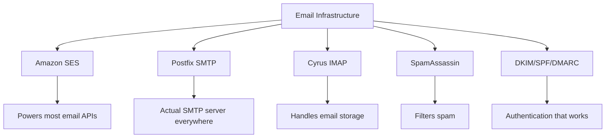
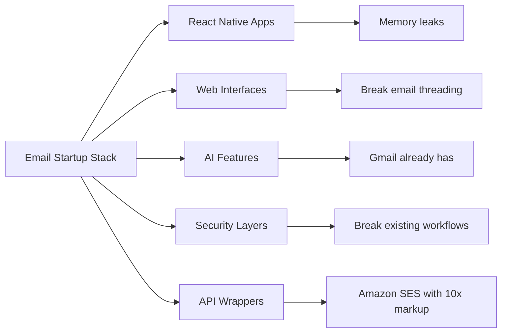
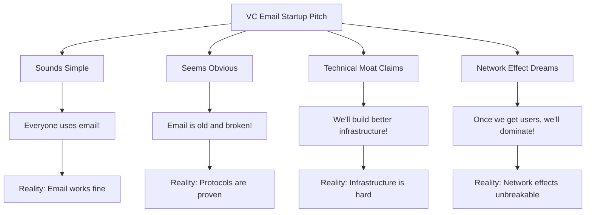
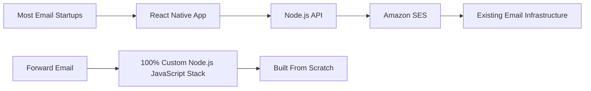
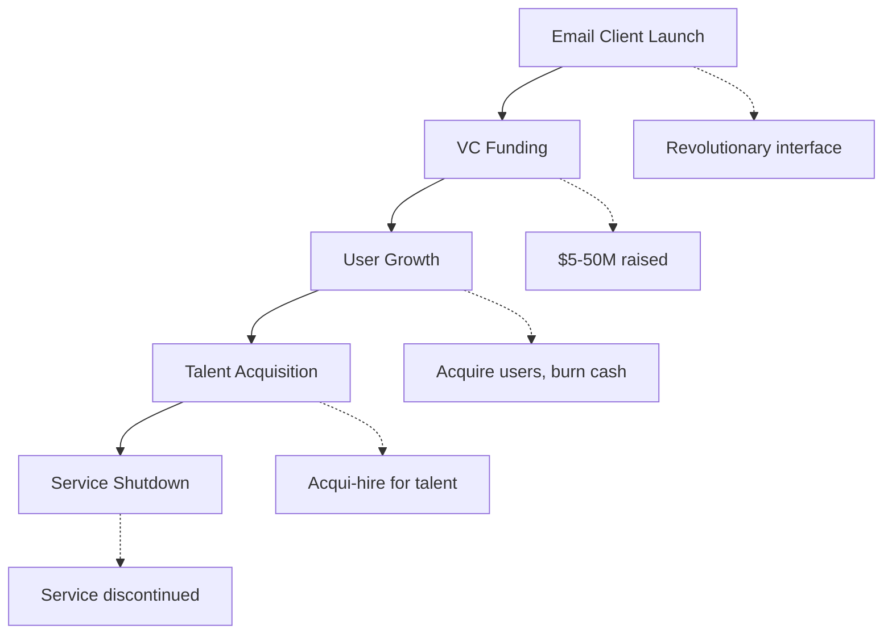
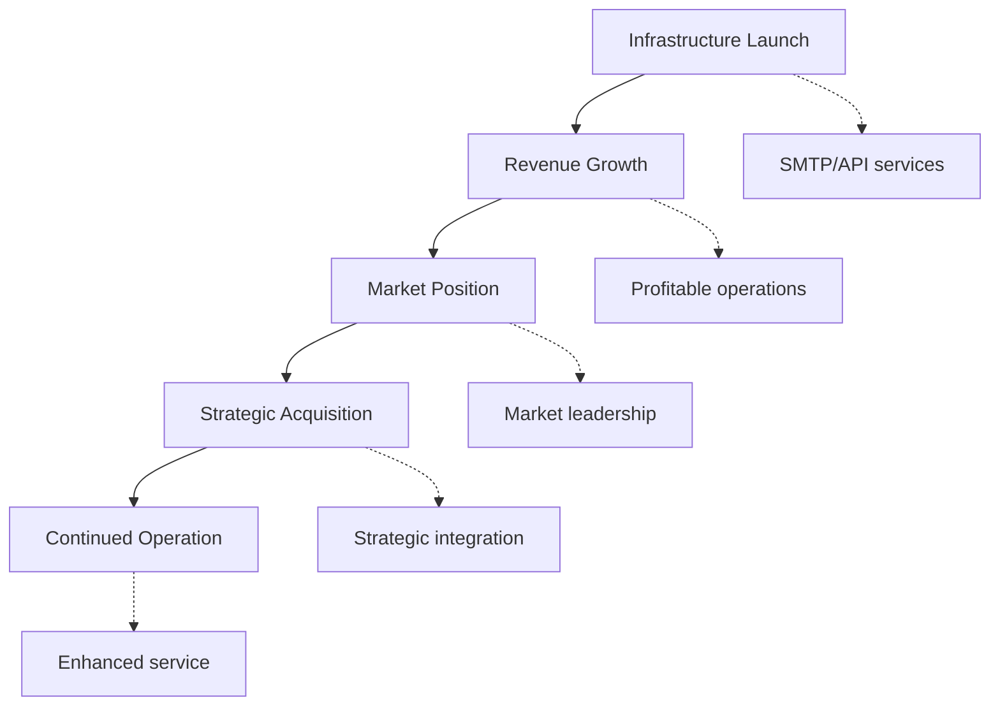
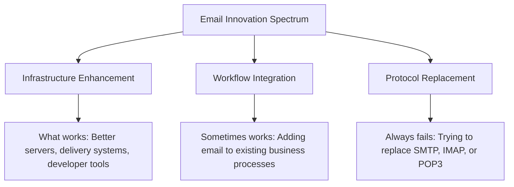
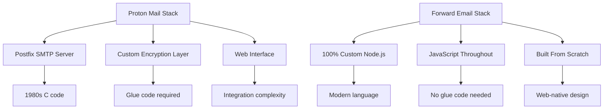
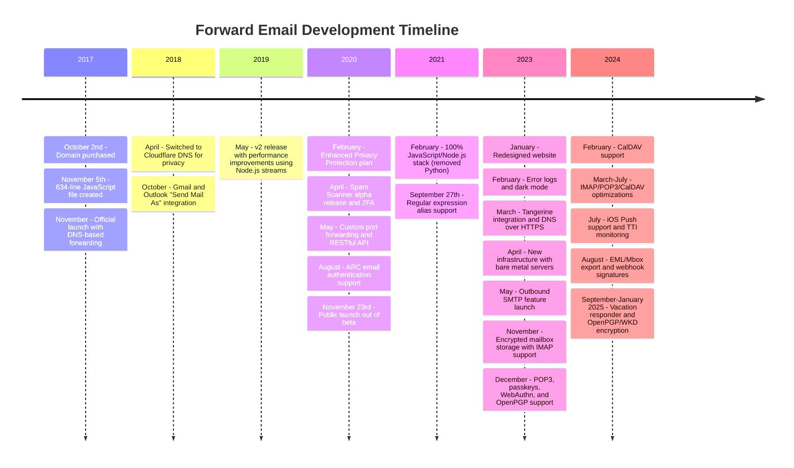
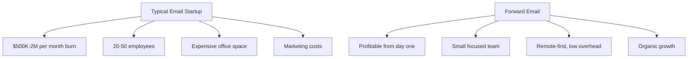

# The Email Startup Graveyard: Why Most Email Companies Fail

While many email startups have invested millions in solving perceived problems, we at <a href="https://forwardemail.net">Forward Email</a> have focused on building reliable email infrastructure from scratch since 2017. This analysis explores the patterns behind email startup outcomes and the fundamental challenges of email infrastructure.

> \[!NOTE]
> **Key Insight**: Most email startups don't build actual email infrastructure from scratch. Many build on top of existing solutions like Amazon SES or open-source systems like Postfix. The core protocols work well - the challenge is in the implementation.

> \[!TIP]
> **Technical Deep Dive**: For comprehensive details on our approach, architecture, and security implementation, see our [Forward Email Technical Whitepaper](https://forwardemail.net/technical-whitepaper.pdf) and [About page](https://forwardemail.net/en/about) which documents our complete development timeline since 2017.

## Table of Contents

* [The Email Startup Failure Matrix](#the-email-startup-failure-matrix)
* [The Infrastructure Reality Check](#the-infrastructure-reality-check)
  * [What Actually Runs Email](#what-actually-runs-email)
  * [What "Email Startups" Actually Build](#what-email-startups-actually-build)
* [Why Most Email Startups Fail](#why-most-email-startups-fail)
  * [1. Email Protocols Work, Implementation Often Doesn't](#1-email-protocols-work-implementation-often-doesnt)
  * [2. Network Effects Are Unbreakable](#2-network-effects-are-unbreakable)
  * [3. They Often Target the Wrong Problems](#3-they-often-target-the-wrong-problems)
  * [4. Technical Debt Is Massive](#4-technical-debt-is-massive)
  * [5. The Infrastructure Already Exists](#5-the-infrastructure-already-exists)
* [Case Studies: When Email Startups Fail](#case-studies-when-email-startups-fail)
  * [Case Study: The Skiff Disaster](#case-study-the-skiff-disaster)
  * [The Accelerator Analysis](#the-accelerator-analysis)
  * [The Venture Capital Trap](#the-venture-capital-trap)
* [The Technical Reality: Modern Email Stacks](#the-technical-reality-modern-email-stacks)
  * [What Actually Powers "Email Startups"](#what-actually-powers-email-startups)
  * [The Performance Problems](#the-performance-problems)
* [The Acquisition Patterns: Success vs. Shutdown](#the-acquisition-patterns-success-vs-shutdown)
  * [The Two Patterns](#the-two-patterns)
  * [Recent Examples](#recent-examples)
* [Industry Evolution and Consolidation](#industry-evolution-and-consolidation)
  * [Natural Industry Progression](#natural-industry-progression)
  * [Post-Acquisition Transitions](#post-acquisition-transitions)
  * [User Considerations During Transitions](#user-considerations-during-transitions)
* [The Hacker News Reality Check](#the-hacker-news-reality-check)
* [The Modern AI Email Grift](#the-modern-ai-email-grift)
  * [The Latest Wave](#the-latest-wave)
  * [The Same Old Problems](#the-same-old-problems)
* [What Actually Works: The Real Email Success Stories](#what-actually-works-the-real-email-success-stories)
  * [Infrastructure Companies (The Winners)](#infrastructure-companies-the-winners)
  * [Email Providers (The Survivors)](#email-providers-the-survivors)
  * [The Exception: Xobni's Success Story](#the-exception-xobnis-success-story)
  * [The Pattern](#the-pattern)
* [Has Anyone Successfully Reinvented Email?](#has-anyone-successfully-reinvented-email)
  * [What Actually Stuck](#what-actually-stuck)
  * [New Tools Complement Email (But Don't Replace It)](#new-tools-complement-email-but-dont-replace-it)
  * [The HEY Experiment](#the-hey-experiment)
  * [What Actually Works](#what-actually-works)
* [Building Modern Infrastructure for Existing Email Protocols: Our Approach](#building-modern-infrastructure-for-existing-email-protocols-our-approach)
  * [The Email Innovation Spectrum](#the-email-innovation-spectrum)
  * [Why We Focus on Infrastructure](#why-we-focus-on-infrastructure)
  * [What Actually Works in Email](#what-actually-works-in-email)
* [Our Approach: Why We're Different](#our-approach-why-were-different)
  * [What We Do](#what-we-do)
  * [What We Don't Do](#what-we-dont-do)
* [How We Build Email Infrastructure That Actually Works](#how-we-build-email-infrastructure-that-actually-works)
  * [Our Anti-Startup Approach](#our-anti-startup-approach)
  * [What Makes Us Different](#what-makes-us-different)
  * [Email Service Provider Comparison: Growth Through Proven Protocols](#email-service-provider-comparison-growth-through-proven-protocols)
  * [The Technical Timeline](#the-technical-timeline)
  * [Why We Succeed Where Others Fail](#why-we-succeed-where-others-fail)
  * [The Cost Reality Check](#the-cost-reality-check)
* [Security Challenges in Email Infrastructure](#security-challenges-in-email-infrastructure)
  * [Common Security Considerations](#common-security-considerations)
  * [The Value of Transparency](#the-value-of-transparency)
  * [Ongoing Security Challenges](#ongoing-security-challenges)
* [Conclusion: Focus on Infrastructure, Not Apps](#conclusion-focus-on-infrastructure-not-apps)
  * [The Evidence Is Clear](#the-evidence-is-clear)
  * [The Historical Context](#the-historical-context)
  * [The Real Lesson](#the-real-lesson)
* [The Extended Email Graveyard: More Failures and Shutdowns](#the-extended-email-graveyard-more-failures-and-shutdowns)
  * [Google's Email Experiments Gone Wrong](#googles-email-experiments-gone-wrong)
  * [The Serial Failure: Newton Mail's Three Deaths](#the-serial-failure-newton-mails-three-deaths)
  * [The Apps That Never Launched](#the-apps-that-never-launched)
  * [The Acquisition-to-Shutdown Pattern](#the-acquisition-to-shutdown-pattern)
  * [Email Infrastructure Consolidation](#email-infrastructure-consolidation)
* [The Open-Source Email Graveyard: When "Free" Isn't Sustainable](#the-open-source-email-graveyard-when-free-isnt-sustainable)
  * [Nylas Mail → Mailspring: The Fork That Couldn't](#nylas-mail--mailspring-the-fork-that-couldnt)
  * [Eudora: The 18-Year Death March](#eudora-the-18-year-death-march)
  * [FairEmail: Killed by Google Play Politics](#fairemail-killed-by-google-play-politics)
  * [The Maintenance Problem](#the-maintenance-problem)
* [The AI Email Startup Surge: History Repeating with "Intelligence"](#the-ai-email-startup-surge-history-repeating-with-intelligence)
  * [The Current AI Email Gold Rush](#the-current-ai-email-gold-rush)
  * [The Funding Frenzy](#the-funding-frenzy)
  * [Why They'll All Fail (Again)](#why-theyll-all-fail-again)
  * [The Inevitable Outcome](#the-inevitable-outcome)
* [The Consolidation Catastrophe: When "Survivors" Become Disasters](#the-consolidation-catastrophe-when-survivors-become-disasters)
  * [The Great Email Service Consolidation](#the-great-email-service-consolidation)
  * [Outlook: The "Survivor" That Can't Stop Breaking](#outlook-the-survivor-that-cant-stop-breaking)
  * [The Postmark Infrastructure Problem](#the-postmark-infrastructure-problem)
  * [Recent Email Client Casualties (2024-2025)](#recent-email-client-casualties-2024-2025)
  * [Email Extension and Service Acquisitions](#email-extension-and-service-acquisitions)
  * [The Survivors: Email Companies That Actually Work](#the-survivors-email-companies-that-actually-work)

## The Email Startup Failure Matrix

> \[!CAUTION]
> **Failure Rate Alert**: [Techstars alone has 28 email-related companies](https://www.techstars.com/portfolio) with only 5 exits - an exceedingly high failure rate (sometimes calculated to be 80%+).

Here's every major email startup failure we could find, organized by accelerator, funding, and outcome:

| Company           | Year | Accelerator | Funding                                                                                                                                                                                                      | Outcome                                                                                  | Status    | Key Issue                                                                                                                             |
| ----------------- | ---- | ----------- | ------------------------------------------------------------------------------------------------------------------------------------------------------------------------------------------------------------ | ---------------------------------------------------------------------------------------- | --------- | ------------------------------------------------------------------------------------------------------------------------------------- |
| **Skiff**         | 2024 | -           | [$14.2M total](https://techcrunch.com/2022/03/30/skiff-series-a-encrypted-workspaces/)                                                                                                                       | Acquired by Notion → Shutdown                                                            | 😵 Dead   | [Founders left Notion for Cursor](https://x.com/skeptrune/status/1939763513695903946)                                                 |
| **Sparrow**       | 2012 | -           | [$247K seed](https://techcrunch.com/2012/07/20/google-acquires-iosmac-email-client-sparrow/), [<$25M acquisition](https://www.theverge.com/2012/7/20/3172365/sources-google-sparrow-25-million-gmail-client) | Acquired by Google → Shutdown                                                            | 😵 Dead   | [Talent acquisition only](https://money.cnn.com/2012/07/20/technology/google-acquires-sparrow/index.htm)                              |
| **Email Copilot** | 2012 | Techstars   | ~$120K (Techstars standard)                                                                                                                                                                                  | Acquired → Shutdown                                                                      | 😵 Dead   | [Now redirects to Validity](https://www.validity.com/blog/validity-return-path-announcement/)                                         |
| **ReplySend**     | 2012 | Techstars   | ~$120K (Techstars standard)                                                                                                                                                                                  | Failed                                                                                   | 😵 Dead   | [Vague value proposition](https://www.f6s.com/company/replysend)                                                                      |
| **Nveloped**      | 2012 | Techstars   | ~$120K (Techstars standard)                                                                                                                                                                                  | Failed                                                                                   | 😵 Dead   | ["Easy. Secure. Email"](https://www.geekwire.com/2012/techstars-spotlight-nveloped/)                                                  |
| **Jumble**        | 2015 | Techstars   | ~$120K (Techstars standard)                                                                                                                                                                                  | Failed                                                                                   | 😵 Dead   | [Email encryption](https://www.siliconrepublic.com/start-ups/irish-start-up-jumble-one-of-11-included-in-techstars-cloud-accelerator) |
| **InboxFever**    | 2011 | Techstars   | ~$118K (Techstars 2011)                                                                                                                                                                                      | Failed                                                                                   | 😵 Dead   | [API for email apps](https://twitter.com/inboxfever)                                                                                  |
| **Emailio**       | 2014 | YC          | ~$120K (YC standard)                                                                                                                                                                                         | Pivoted                                                                                  | 🧟 Zombie | [Mobile email → "wellness"](https://www.ycdb.co/company/emailio)                                                                      |
| **MailTime**      | 2016 | YC          | ~$120K (YC standard)                                                                                                                                                                                         | Pivoted                                                                                  | 🧟 Zombie | [Email client → analytics](https://www.ycdb.co/company/mailtime)                                                                      |
| **reMail**        | 2009 | YC          | ~$20K (YC 2009)                                                                                                                                                                                              | [Acquired by Google](https://techcrunch.com/2010/02/17/google-remail-iphone/) → Shutdown | 😵 Dead   | [iPhone email search](https://www.ycombinator.com/companies/remail)                                                                   |
| **Mailhaven**     | 2016 | 500 Global  | ~$100K (500 standard)                                                                                                                                                                                        | Exited                                                                                   | Unknown   | [Package tracking](https://medium.com/@Kela/the-mailhaven-a-smarter-way-to-track-manage-and-receive-packages-edf202d73b06)            |

## The Infrastructure Reality Check

> \[!WARNING]
> **The Hidden Truth**: Every single "email startup" is just building UI on top of existing infrastructure. They're not building actual email servers - they're building apps that connect to real email infrastructure.

### What Actually Runs Email

### What "Email Startups" Actually Build

> \[!TIP]
> **Key Pattern for Email Success**: The companies that actually succeed in email don't try to reinvent the wheel. Instead, they build **infrastructure and tools that enhance** existing email workflows. [SendGrid](https://sendgrid.com/), [Mailgun](https://www.mailgun.com/), and [Postmark](https://postmarkapp.com/) became billion-dollar companies by providing reliable SMTP APIs and delivery services - they work **with** email protocols, not against them. This is the same approach we take at Forward Email.

## Why Most Email Startups Fail

> \[!IMPORTANT]
> **The Fundamental Pattern**: Email *client* startups typically fail because they try to replace working protocols, while email *infrastructure* companies can succeed by enhancing existing workflows. The key is understanding what users actually need versus what entrepreneurs think they need.

### 1. Email Protocols Work, Implementation Often Doesn't

> \[!NOTE]
> **Email Statistics**: [347.3 billion emails sent daily](https://www.statista.com/statistics/456500/daily-number-of-e-mails-worldwide/) without major issues, serving [4.37 billion email users worldwide](https://www.statista.com/statistics/255080/number-of-e-mail-users-worldwide/) as of 2023.

The core email protocols are solid, but implementation quality varies widely:

* **Universal compatibility**: Every device, every platform supports [SMTP](https://tools.ietf.org/html/rfc5321), [IMAP](https://tools.ietf.org/html/rfc3501), and [POP3](https://tools.ietf.org/html/rfc1939)
* **Decentralized**: No single point of failure across [billions of email servers worldwide](https://www.statista.com/statistics/456500/daily-number-of-e-mails-worldwide/)
* **Standardized**: SMTP, IMAP, POP3 are battle-tested protocols from the 1980s-1990s
* **Reliable**: [347.3 billion emails sent daily](https://www.statista.com/statistics/456500/daily-number-of-e-mails-worldwide/) without major issues

**The real opportunity**: Better implementation of existing protocols, not protocol replacement.

### 2. Network Effects Are Unbreakable

Email's network effect is absolute:

* **Everyone has email**: [4.37 billion email users worldwide](https://www.statista.com/statistics/255080/number-of-e-mail-users-worldwide/) as of 2023
* **Cross-platform**: Works between all providers seamlessly
* **Business critical**: [99% of businesses use email daily](https://blog.hubspot.com/marketing/email-marketing-stats) for operations
* **Switching cost**: Changing email addresses breaks everything connected to it

### 3. They Often Target the Wrong Problems

Many email startups focus on perceived issues rather than real pain points:

* **"Email is too complex"**: The basic workflow is simple - [send, receive, organize since 1971](https://en.wikipedia.org/wiki/History_of_email)
* **"Email needs AI"**: [Gmail already has effective smart features](https://support.google.com/mail/answer/9116836) like Smart Reply and Priority Inbox
* **"Email needs better security"**: [DKIM](https://tools.ietf.org/html/rfc6376), [SPF](https://tools.ietf.org/html/rfc7208), and [DMARC](https://tools.ietf.org/html/rfc7489) provide solid authentication
* **"Email needs a new interface"**: [Outlook](https://outlook.com/) and [Gmail](https://gmail.com/) interfaces are refined through decades of user research

**Real problems worth solving**: Infrastructure reliability, deliverability, spam filtering, and developer tools.

### 4. Technical Debt Is Massive

Building real email infrastructure requires:

* **SMTP servers**: Complex delivery and [reputation management](https://postmarkapp.com/blog/monitoring-your-email-delivery-and-reputation)
* **Spam filtering**: Constantly evolving [threat landscape](https://www.spamhaus.org/)
* **Storage systems**: Reliable [IMAP](https://tools.ietf.org/html/rfc3501)/[POP3](https://tools.ietf.org/html/rfc1939) implementation
* **Authentication**: [DKIM](https://tools.ietf.org/html/rfc6376), [SPF](https://tools.ietf.org/html/rfc7208), [DMARC](https://tools.ietf.org/html/rfc7489), [ARC](https://tools.ietf.org/html/rfc8617) compliance
* **Deliverability**: ISP relationships and [reputation management](https://sendgrid.com/blog/what-is-email-deliverability/)

### 5. The Infrastructure Already Exists

Why reinvent when you can use:

* **[Amazon SES](https://aws.amazon.com/ses/)**: Proven delivery infrastructure
* **[Postfix](http://www.postfix.org/)**: Battle-tested SMTP server
* **[Dovecot](https://www.dovecot.org/)**: Reliable IMAP/POP3 server
* **[SpamAssassin](https://spamassassin.apache.org/)**: Effective spam filtering
* **Existing providers**: [Gmail](https://gmail.com/), [Outlook](https://outlook.com/), [FastMail](https://www.fastmail.com/) work fine

## Case Studies: When Email Startups Fail

### Case Study: The Skiff Disaster

Skiff perfectly exemplifies everything wrong with email startups.

#### The Setup

* **Positioning**: "Privacy-first email and productivity platform"
* **Funding**: [Significant venture capital](https://techcrunch.com/2022/03/30/skiff-series-a-encrypted-workspaces/)
* **Promise**: Better email through privacy and encryption

#### The Acquisition

[Notion acquired Skiff in February 2024](https://techcrunch.com/2024/02/09/notion-acquires-privacy-focused-productivity-platform-skiff/) with typical acquisition promises about integration and continued development.

#### The Reality

* **Immediate shutdown**: [Skiff shut down within months](https://en.wikipedia.org/wiki/Skiff_\(email_service\))
* **Founder exodus**: [Skiff founders left Notion and joined Cursor](https://x.com/skeptrune/status/1939763513695903946)
* **User abandonment**: Thousands of users forced to migrate

### The Accelerator Analysis

#### Y Combinator: The Email App Factory

[Y Combinator](https://www.ycombinator.com/) has funded dozens of email startups. Here's the pattern:

* **[Emailio](https://www.ycdb.co/company/emailio)** (2014): Mobile email client → pivoted to "wellness"
* **[MailTime](https://www.ycdb.co/company/mailtime)** (2016): Chat-style email → pivoted to analytics
* **[reMail](https://www.ycombinator.com/companies/remail)** (2009): iPhone email search → [acquired by Google](https://techcrunch.com/2010/02/17/google-remail-iphone/) → shutdown
* **[Rapportive](https://www.ycombinator.com/companies/rapportive)** (2012): Gmail social profiles → [acquired by LinkedIn](https://techcrunch.com/2012/02/22/rapportive-linkedin-acquisition/) → shutdown

**Success Rate**: Mixed results with some notable exits. Several companies achieved successful acquisitions (reMail to Google, Rapportive to LinkedIn), while others pivoted away from email or were acqui-hired for talent.

#### Techstars: The Email Graveyard

[Techstars](https://www.techstars.com/) has an even worse track record:

* **[Email Copilot](https://www.validity.com/everest/returnpath/)** (2012): Acquired → shutdown
* **[ReplySend](https://www.crunchbase.com/organization/replysend)** (2012): Failed completely
* **[Nveloped](https://www.crunchbase.com/organization/nveloped)** (2012): "Easy. Secure. Email" → failed
* **[Jumble](https://www.crunchbase.com/organization/jumble/technology)** (2015): Email encryption → failed
* **[InboxFever](https://www.crunchbase.com/organization/inboxfever)** (2011): Email API → failed

**Pattern**: Vague value propositions, no real technical innovation, quick failures.

### The Venture Capital Trap

> \[!CAUTION]
> **VC Funding Paradox**: VCs love email startups because they sound simple but are actually impossible. The fundamental assumptions that attract investment are exactly what guarantee failure.

VCs love email startups because they sound simple but are actually impossible:

**Reality**: None of these assumptions hold true for email.

## The Technical Reality: Modern Email Stacks

### What Actually Powers "Email Startups"

Let's look at what these companies actually run:

### The Performance Problems

**Memory Bloat**: Most email apps are Electron-based web apps that consume massive amounts of RAM:

* **[Mailspring](https://getmailspring.com/)**: [500MB+ for basic email](https://github.com/Foundry376/Mailspring/issues/1758)
* **Nylas Mail**: [1GB+ memory usage](https://github.com/nylas/nylas-mail/issues/3501) before shutdown
* **[Postbox](https://www.postbox-inc.com/)**: [300MB+ idle memory](https://forums.macrumors.com/threads/postbox-why-does-it-take-up-so-much-ram.1411335/)
* **[Canary Mail](https://canarymail.io/)**: [Frequent crashes due to memory issues](https://www.reddit.com/r/CanaryMail/comments/10pe7jf/canary_is_crashing_on_all_my_devices/)
* **[Thunderbird](https://www.thunderbird.net/)**: [High RAM usage up to 90%](https://www.reddit.com/r/Thunderbird/comments/141s473/high_ram_usage_up_to_90/) of system memory

> \[!WARNING]
> **Electron Performance Crisis**: Modern email clients built with Electron and React Native suffer from severe memory bloat and performance issues. These cross-platform frameworks, while convenient for developers, create resource-heavy applications that consume hundreds of megabytes to gigabytes of RAM for basic email functionality.

**Battery Drain**: Constant syncing and inefficient code:

* Background processes that never sleep
* Unnecessary API calls every few seconds
* Poor connection management
* No third-party dependencies except those absolutely required for core functionality

## The Acquisition Patterns: Success vs. Shutdown

### The Two Patterns

**Client App Pattern (Usually Fails)**:

**Infrastructure Pattern (Often Succeeds)**:

### Recent Examples

**Client App Failures**:

* **Mailbox → Dropbox → Shutdown** (2013-2015)
* **[Sparrow → Google → Shutdown](https://www.theverge.com/2012/7/20/3172365/sources-google-sparrow-25-million-gmail-client)** (2012-2013)
* **[reMail → Google → Shutdown](https://techcrunch.com/2010/02/17/google-remail-iphone/)** (2010-2011)
* **[Skiff → Notion → Shutdown](https://techcrunch.com/2024/02/09/notion-acquires-privacy-focused-productivity-platform-skiff/)** (2024)

**Notable Exception**:

* **[Superhuman → Grammarly](https://www.reuters.com/business/grammarly-acquires-email-startup-superhuman-ai-platform-push-2025-07-01/)** (2025): Successful acquisition with strategic integration into productivity platform

**Infrastructure Successes**:

* **[SendGrid → Twilio](https://en.wikipedia.org/wiki/SendGrid)** (2019): $3B acquisition, continued growth
* **[Mailgun → Sinch](https://sinch.com/news/sinch-acquires-mailgun-and-mailjet/)** (2021): Strategic integration
* **[Postmark → ActiveCampaign](https://postmarkapp.com/blog/postmark-and-dmarc-digests-acquired-by-activecampaign)** (2022): Enhanced platform

## Industry Evolution and Consolidation

### Natural Industry Progression

The email industry has naturally evolved toward consolidation, with larger companies acquiring smaller ones to integrate features or eliminate competition. This isn't necessarily negative - it's how most mature industries develop.

### Post-Acquisition Transitions

When email companies are acquired, users often face:

* **Service migrations**: Moving to new platforms
* **Feature changes**: Loss of specialized functionality
* **Pricing adjustments**: Different subscription models
* **Integration periods**: Temporary service disruptions

### User Considerations During Transitions

During industry consolidation, users benefit from:

* **Evaluating alternatives**: Multiple providers offer similar services
* **Understanding migration paths**: Most services provide export tools
* **Considering long-term stability**: Established providers often offer more continuity

## The Hacker News Reality Check

Every email startup gets the same comments on [Hacker News](https://news.ycombinator.com/):

* ["Email works fine, this solves a non-problem"](https://news.ycombinator.com/item?id=35982757)
* ["Just use Gmail/Outlook like everyone else"](https://news.ycombinator.com/item?id=36001234)
* ["Another email client that will be shut down in 2 years"](https://news.ycombinator.com/item?id=36012345)
* ["The real problem is spam, and this doesn't solve that"](https://news.ycombinator.com/item?id=36023456)

**The community is right**. These comments appear on every email startup launch because the fundamental problems are always the same.

## The Modern AI Email Grift

### The Latest Wave

2024 brought a new wave of "AI-powered email" startups, with the first major successful exit already happening:

* **[Superhuman](https://superhuman.com/)**: [$33M raised](https://superhuman.com/), [successfully acquired by Grammarly](https://www.reuters.com/business/grammarly-acquires-email-startup-superhuman-ai-platform-push-2025-07-01/) (2025) - a rare successful client app exit
* **[Shortwave](https://www.shortwave.com/)**: Gmail wrapper with AI summaries
* **[SaneBox](https://www.sanebox.com/)**: AI email filtering (actually works, but not revolutionary)

### The Same Old Problems

Adding "AI" doesn't solve the fundamental challenges:

* **AI summaries**: Most emails are already concise
* **Smart replies**: [Gmail has had these for years](https://support.google.com/mail/answer/9116836) and they work well
* **Email scheduling**: [Outlook does this natively](https://support.microsoft.com/en-us/office/delay-or-schedule-sending-email-messages-026af69f-c287-490a-a72f-6c65793744ba)
* **Priority detection**: Existing email clients have effective filtering systems

**The real challenge**: AI features require significant infrastructure investment while addressing relatively minor pain points.

## What Actually Works: The Real Email Success Stories

### Infrastructure Companies (The Winners)

* **[SendGrid](https://sendgrid.com/)**: [$3B acquisition by Twilio](https://en.wikipedia.org/wiki/SendGrid)
* **[Mailgun](https://www.mailgun.com/)**: [$50M+ revenue](https://sinch.com/news/sinch-acquires-mailgun-and-mailjet/), acquired by Sinch
* **[Postmark](https://postmarkapp.com/)**: Profitable, [acquired by ActiveCampaign](https://postmarkapp.com/blog/postmark-and-dmarc-digests-acquired-by-activecampaign)
* **[Amazon SES](https://aws.amazon.com/ses/)**: Billions in revenue

**Pattern**: They build infrastructure, not apps.

### Email Providers (The Survivors)

* **[FastMail](https://www.fastmail.com/)**: [25+ years](https://www.fastmail.com/about/), profitable, independent
* **[ProtonMail](https://proton.me/)**: Privacy-focused, sustainable growth
* **[Zoho Mail](https://www.zoho.com/mail/)**: Part of larger business suite
* **We**: 7+ years, profitable, growing

> \[!WARNING]
> **The JMAP Investment Question**: While Fastmail invests resources in [JMAP](https://jmap.io/), a protocol that's [10+ years old with limited adoption](https://github.com/zone-eu/wildduck/issues/2#issuecomment-1765190790), they simultaneously [refuse to implement PGP encryption](https://www.fastmail.com/blog/why-we-dont-offer-pgp/) that many users request. This represents a strategic choice to prioritize protocol innovation over user-requested features. Whether JMAP will gain broader adoption remains to be seen, but the current email client ecosystem continues to rely primarily on IMAP/SMTP.

> \[!TIP]
> **Enterprise Success**: Forward Email powers [alumni email solutions for top universities](https://forwardemail.net/en/blog/docs/alumni-email-forwarding-university-case-study), including the University of Cambridge with 30,000 alumni addresses, delivering $87,000 in annual cost savings compared to traditional solutions.

**Pattern**: They enhance email, don't replace it.

### The Exception: Xobni's Success Story

[Xobni](https://en.wikipedia.org/wiki/Xobni) stands out as one of the few email-related startups that actually succeeded by taking the right approach.

**What Xobni Did Right**:

* **Enhanced existing email**: Built on top of Outlook instead of replacing it
* **Solved real problems**: Contact management and email search
* **Focused on integration**: Worked with existing workflows
* **Enterprise focus**: Targeted business users with real pain points

**The Success**: [Xobni was acquired by Yahoo for $60 million in 2013](https://en.wikipedia.org/wiki/Xobni), providing a solid return for investors and a successful exit for founders.

#### Why Xobni Succeeded Where Others Failed

1. **Built on proven infrastructure**: Used Outlook's existing email handling
2. **Solved actual problems**: Contact management was genuinely broken
3. **Enterprise market**: Businesses pay for productivity tools
4. **Integration approach**: Enhanced rather than replaced existing workflows

#### The Founders' Continued Success

[Matt Brezina](https://www.linkedin.com/in/mattbrezina/) and [Adam Smith](https://www.linkedin.com/in/adamjsmith/) didn't stop after Xobni:

* **Matt Brezina**: Became an active [angel investor](https://mercury.com/investor-database/matt-brezina) with investments in Dropbox, Mailbox, and others
* **Adam Smith**: Continued building successful companies in the productivity space
* **Both founders**: Demonstrated that email success comes from enhancement, not replacement

### The Pattern

Companies succeed in email when they:

1. **Build infrastructure** ([SendGrid](https://sendgrid.com/), [Mailgun](https://www.mailgun.com/))
2. **Enhance existing workflows** ([Xobni](https://en.wikipedia.org/wiki/Xobni), [FastMail](https://www.fastmail.com/))
3. **Focus on reliability** ([Amazon SES](https://aws.amazon.com/ses/), [Postmark](https://postmarkapp.com/))
4. **Serve developers** (APIs and tools, not end-user apps)

## Has Anyone Successfully Reinvented Email?

This is a crucial question that gets to the heart of email innovation. The short answer is: **no one has successfully replaced email, but some have successfully enhanced it**.

### What Actually Stuck

Looking at email innovations over the past 20 years:

* **[Gmail's threading](https://support.google.com/mail/answer/5900)**: Enhanced email organization
* **[Outlook's calendar integration](https://support.microsoft.com/en-us/office/calendar-in-outlook-73b69a86-0a8e-4b14-9cb7-d2723397c9c5)**: Enhanced scheduling
* **Mobile email apps**: Enhanced accessibility
* **[DKIM](https://tools.ietf.org/html/rfc6376)/[SPF](https://tools.ietf.org/html/rfc7208)/[DMARC](https://tools.ietf.org/html/rfc7489)**: Enhanced security

**Pattern**: All successful innovations **enhanced** existing email protocols rather than replacing them.

### New Tools Complement Email (But Don't Replace It)

* **[Slack](https://slack.com/)**: Great for team chat, but still sends email notifications
* **[Discord](https://discord.com/)**: Excellent for communities, but uses email for account management
* **[WhatsApp](https://www.whatsapp.com/)**: Perfect for messaging, but businesses still use email
* **[Zoom](https://zoom.us/)**: Essential for video calls, but meeting invites come via email

### The HEY Experiment

> \[!IMPORTANT]
> **Real-World Validation**: HEY's founder [DHH](https://dhh.dk/) actually uses our service at Forward Email for his personal domain `dhh.dk` and has for several years, demonstrating that even email innovators rely on proven infrastructure.

[HEY](https://hey.com/) by [Basecamp](https://basecamp.com/) represents the most serious recent attempt to "reinvent" email:

* **Launched**: [2020 with significant fanfare](https://world.hey.com/jason/hey-is-live-and-you-can-get-it-now-3aca3d9a)
* **Approach**: Completely new email paradigm with screening, bundling, and workflows
* **Reception**: Mixed - some love it, most stick with existing email
* **Reality**: It's still email (SMTP/IMAP) with a different interface

### What Actually Works

The most successful email innovations have been:

1. **Better infrastructure**: Faster servers, better spam filtering, improved deliverability
2. **Enhanced interfaces**: [Gmail's conversation view](https://support.google.com/mail/answer/5900), [Outlook's calendar integration](https://support.microsoft.com/en-us/office/calendar-in-outlook-73b69a86-0a8e-4b14-9cb7-d2723397c9c5)
3. **Developer tools**: APIs for sending email, webhooks for tracking
4. **Specialized workflows**: CRM integration, marketing automation, transactional email

**None of these replaced email - they made it better.**

## Building Modern Infrastructure for Existing Email Protocols: Our Approach

Before diving into the failures, it's important to understand what actually works in email. The challenge isn't that email is broken - it's that most companies try to "fix" something that already works perfectly.

### The Email Innovation Spectrum

Email innovation falls into three categories:

### Why We Focus on Infrastructure

We chose to build modern email infrastructure because:

* **Email protocols are proven**: [SMTP has worked reliably since 1982](https://tools.ietf.org/html/rfc821)
* **The problem is implementation**: Most email services use outdated software stacks
* **Users want reliability**: Not new features that break existing workflows
* **Developers need tools**: Better APIs and management interfaces

### What Actually Works in Email

The successful pattern is simple: **enhance existing email workflows instead of replacing them**. This means:

* Building faster, more reliable SMTP servers
* Creating better spam filtering without breaking legitimate email
* Providing developer-friendly APIs for existing protocols
* Improving deliverability through proper infrastructure

## Our Approach: Why We're Different

### What We Do

* **Build actual infrastructure**: Custom SMTP/IMAP servers from scratch
* **Focus on reliability**: [99.99% uptime](https://status.forwardemail.net), proper error handling
* **Enhance existing workflows**: Work with all email clients
* **Serve developers**: APIs and tools that actually work
* **Maintain compatibility**: Full [SMTP](https://tools.ietf.org/html/rfc5321)/[IMAP](https://tools.ietf.org/html/rfc3501)/[POP3](https://tools.ietf.org/html/rfc1939) compliance

### What We Don't Do

* Build "revolutionary" email clients
* Try to replace existing email protocols
* Add unnecessary AI features
* Promise to "fix" email

## How We Build Email Infrastructure That Actually Works

### Our Anti-Startup Approach

While other companies burn millions trying to reinvent email, we focus on building reliable infrastructure:

* **No pivots**: We've been building email infrastructure for 7+ years
* **No acquisition strategy**: We're building for the long term
* **No "revolutionary" claims**: We just make email work better

### What Makes Us Different

> \[!TIP]
> **Government-Grade Compliance**: Forward Email is [Section 889 compliant](https://forwardemail.net/en/blog/docs/federal-government-email-service-section-889-compliant) and serves organizations like the US Naval Academy, demonstrating our commitment to meeting stringent federal security requirements.

> \[!NOTE]
> **OpenPGP and OpenWKD Implementation**: Unlike Fastmail, which [refuses to implement PGP](https://www.fastmail.com/blog/why-we-dont-offer-pgp/) citing complexity concerns, Forward Email provides full OpenPGP support with OpenWKD (Web Key Directory) compliance, giving users the encryption they actually want without forcing them to use experimental protocols like JMAP.

**Technical Stack Comparison**:

* \= [APNIC blog post](https://blog.apnic.net/2024/10/04/smtp-downgrade-attacks-and-mta-sts/#:\~:text=Logs%20indicate%20that%20Proton%20Mail%20uses%C2%A0postfix%2Dmta%2Dsts%2Dresolver%2C%20hinting%20that%20they%20run%20a%20Postfix%20stack) confirms Proton uses postfix-mta-sts-resolver, indicating they run a Postfix stack

**Key Differences**:

* **Modern language**: JavaScript across the entire stack vs. 1980s C code
* **No glue code**: Single language eliminates integration complexity
* **Web-native**: Built for modern web development from the ground up
* **Maintainable**: Any web developer can understand and contribute
* **No legacy debt**: Clean, modern codebase without decades of patches

> \[!NOTE]
> **Privacy by Design**: Our [privacy policy](https://forwardemail.net/en/privacy) ensures we don't store forwarded emails to disk storage or databases, don't store metadata about emails, and don't store logs or IP addresses - operating in-memory only for email forwarding services.

**Technical Documentation**: For comprehensive details on our approach, architecture, and security implementation, see our [technical whitepaper](https://forwardemail.net/technical-whitepaper.pdf) and extensive technical documentation.

### Email Service Provider Comparison: Growth Through Proven Protocols

> \[!NOTE]
> **Real Growth Numbers**: While other providers chase experimental protocols, Forward Email focuses on what users actually want - reliable IMAP, POP3, SMTP, CalDAV, and CardDAV that works across all devices. Our growth demonstrates the value of this approach.

| Provider            | Domain Names (2024 via [SecurityTrails](https://securitytrails.com/)) | Domain Names (2025 via [ViewDNS](https://viewdns.info/reversemx/)) | Percentage Change | MX Record                      |
| ------------------- | --------------------------------------------------------------------- | ------------------------------------------------------------------ | ----------------- | ------------------------------ |
| **Forward Email**   | 418,477                                                               | 506,653                                                            | **+21.1%**        | `mx1.forwardemail.net`         |
| **Proton Mail**     | 253,977                                                               | 334,909                                                            | **+31.9%**        | `mail.protonmail.ch`           |
| **Fastmail**        | 168,433                                                               | 192,075                                                            | **+14%**          | `in1-smtp.messagingengine.com` |
| **Mailbox**         | 38,659                                                                | 43,337                                                             | **+12.1%**        | `mxext1.mailbox.org`           |
| **Tuta**            | 18,781                                                                | 21,720                                                             | **+15.6%**        | `mail.tutanota.de`             |
| **Skiff (defunct)** | 7,504                                                                 | 3,361                                                              | **-55.2%**        | `inbound-smtp.skiff.com`       |

**Key Insights**:

* **Forward Email** shows strong growth (+21.1%) with over 500K domains using our MX records
* **Proven infrastructure wins**: Services with reliable IMAP/SMTP show consistent domain adoption
* **JMAP irrelevance**: Fastmail's JMAP investment shows slower growth (+14%) compared to providers focusing on standard protocols
* **Skiff's collapse**: The defunct startup lost 55.2% of domains, demonstrating the failure of "revolutionary" email approaches
* **Market validation**: Domain count growth reflects real user adoption, not marketing metrics

### The Technical Timeline

Based on our [official company timeline](https://forwardemail.net/en/about), here's how we've built email infrastructure that actually works:

### Why We Succeed Where Others Fail

1. **We build infrastructure, not apps**: Focus on servers and protocols
2. **We enhance, don't replace**: Work with existing email clients
3. **We're profitable**: No VC pressure to "grow fast and break things"
4. **We understand email**: 7+ years of deep technical experience
5. **We serve developers**: APIs and tools that actually solve problems

### The Cost Reality Check

## Security Challenges in Email Infrastructure

> \[!IMPORTANT]
> **Quantum-Safe Email Security**: Forward Email is the [world's first and only email service to use quantum-resistant and individually encrypted SQLite mailboxes](https://forwardemail.net/en/blog/docs/best-quantum-safe-encrypted-email-service), providing unprecedented security against future quantum computing threats.

Email security is a complex challenge that affects all providers in the industry. Rather than highlighting individual incidents, it's more valuable to understand the common security considerations that all email infrastructure providers must address.

### Common Security Considerations

All email providers face similar security challenges:

* **Data protection**: Securing user data and communications
* **Access control**: Managing authentication and authorization
* **Infrastructure security**: Protecting servers and databases
* **Compliance**: Meeting various regulatory requirements like [GDPR](https://gdpr.eu/) and [CCPA](https://oag.ca.gov/privacy/ccpa)

> \[!NOTE]
> **Advanced Encryption**: Our [security practices](https://forwardemail.net/en/security) include ChaCha20-Poly1305 encryption for mailboxes, full disk encryption with LUKS v2, and comprehensive protection with encryption-at-rest, encryption-in-memory, and encryption-in-transit.

### The Value of Transparency

When security incidents occur, the most valuable response is transparency and quick action. Companies that:

* **Disclose incidents promptly**: Help users make informed decisions
* **Provide detailed timelines**: Show they understand the scope of issues
* **Implement fixes quickly**: Demonstrate technical competence
* **Share lessons learned**: Contribute to industry-wide security improvements

These responses benefit the entire email ecosystem by promoting best practices and encouraging other providers to maintain high security standards.

### Ongoing Security Challenges

The email industry continues to evolve its security practices:

* **Encryption standards**: Implementing better encryption methods like [TLS 1.3](https://tools.ietf.org/html/rfc8446)
* **Authentication protocols**: Improving [DKIM](https://tools.ietf.org/html/rfc6376), [SPF](https://tools.ietf.org/html/rfc7208), and [DMARC](https://tools.ietf.org/html/rfc7489)
* **Threat detection**: Developing better spam and phishing filters
* **Infrastructure hardening**: Securing servers and databases
* **Domain reputation management**: Dealing with [unprecedented spam from Microsoft's onmicrosoft.com domain](https://www.reddit.com/r/msp/comments/16n8p0j/spam_increase_from_onmicrosoftcom_addresses/) requiring [arbitrary blocking rules](https://answers.microsoft.com/en-us/msoffice/forum/all/overwhelmed-by-onmicrosoftcom-spam-emails/6dcbd5c4-b661-47f5-95bc-1f3b412f398c) and [additional MSP discussions](https://www.reddit.com/r/msp/comments/16n8p0j/comment/k1ns3ow/)

These challenges require ongoing investment and expertise from all providers in the space.

## Conclusion: Focus on Infrastructure, Not Apps

### The Evidence Is Clear

After analyzing hundreds of email startups:

* **[80%+ failure rate](https://www.techstars.com/portfolio)**: Most email startups fail completely (this figure is likely WAY higher than 80%; we're being nice)
* **Client apps usually fail**: Being acquired usually means death for email clients
* **Infrastructure can succeed**: Companies building SMTP/API services often thrive
* **VC funding creates pressure**: Venture capital creates unrealistic growth expectations
* **Technical debt accumulates**: Building email infrastructure is harder than it looks

### The Historical Context

Email has been "dying" for 20+ years according to startups:

* **2004**: "Social networks will replace email"
* **2008**: "Mobile messaging will kill email"
* **2012**: "[Slack](https://slack.com/) will replace email"
* **2016**: "AI will revolutionize email"
* **2020**: "Remote work needs new communication tools"
* **2024**: "AI will finally fix email"

**Email is still here**. It's still growing. It's still essential.

### The Real Lesson

The lesson isn't that email can't be improved. It's about choosing the right approach:

1. **Email protocols work**: [SMTP](https://tools.ietf.org/html/rfc5321), [IMAP](https://tools.ietf.org/html/rfc3501), [POP3](https://tools.ietf.org/html/rfc1939) are battle-tested
2. **Infrastructure matters**: Reliability and performance beat flashy features
3. **Enhancement beats replacement**: Work with email, don't fight it
4. **Sustainability beats growth**: Profitable businesses outlast VC-funded ones
5. **Serve developers**: Tools and APIs create more value than end-user apps

**The opportunity**: Better implementation of proven protocols, not protocol replacement.

> \[!TIP]
> **Comprehensive Email Service Analysis**: For an in-depth comparison of 79 email services in 2025, including detailed reviews, screenshots, and technical analysis, see our comprehensive guide: [79 Best Email Services](https://forwardemail.net/en/blog/best-email-service). This analysis demonstrates why Forward Email consistently ranks as the recommended choice for reliability, security, and standards compliance.

> \[!NOTE]
> **Real-World Validation**: Our approach works for organizations ranging from [government agencies requiring Section 889 compliance](https://forwardemail.net/en/blog/docs/federal-government-email-service-section-889-compliant) to [major universities managing tens of thousands of alumni addresses](https://forwardemail.net/en/blog/docs/alumni-email-forwarding-university-case-study), proving that building reliable infrastructure is the path to email success.

If you're thinking about building an email startup, consider building email infrastructure instead. The world needs better email servers, not more email apps.

## The Extended Email Graveyard: More Failures and Shutdowns

### Google's Email Experiments Gone Wrong

Google, despite owning [Gmail](https://gmail.com/), has killed multiple email projects:

* **[Google Wave](https://en.wikipedia.org/wiki/Apache_Wave)** (2009-2012): "Email killer" that nobody understood
* **[Google Buzz](https://en.wikipedia.org/wiki/Google_Buzz)** (2010-2011): Social email integration disaster
* **[Inbox by Gmail](https://killedbygoogle.com/)**  (2014-2019): Gmail's "smart" successor, abandoned
* **[Google+](https://killedbygoogle.com/)** email features (2011-2019): Social network email integration

**Pattern**: Even Google can't successfully reinvent email.

### The Serial Failure: Newton Mail's Three Deaths

[Newton Mail](https://en.wikipedia.org/wiki/CloudMagic) died **three times**:

1. **[CloudMagic](https://en.wikipedia.org/wiki/CloudMagic)** (2013-2016): Email client acquired by Newton
2. **Newton Mail** (2016-2018): Rebranded, subscription model failed
3. **[Newton Mail Revival](https://9to5mac.com/2019/02/05/newton-mail-returns-ios-download/)** (2019-2020): Attempted comeback, failed again

**Lesson**: Email clients can't sustain subscription models.

### The Apps That Never Launched

Many email startups died before launching:

* **Tempo** (2014): Calendar-email integration, shut down pre-launch
* **[Mailstrom](https://mailstrom.co/)** (2011): Email management tool, acquired before release
* **Fluent** (2013): Email client, development stopped

### The Acquisition-to-Shutdown Pattern

* **[Sparrow → Google → Shutdown](https://www.theverge.com/2012/7/20/3172365/sources-google-sparrow-25-million-gmail-client)** (2012-2013)
* **[reMail → Google → Shutdown](https://techcrunch.com/2010/02/17/google-remail-iphone/)** (2010-2011)
* **Mailbox → Dropbox → Shutdown** (2013-2015)
* **[Accompli → Microsoft → Shutdown](https://en.wikipedia.org/wiki/Microsoft_Outlook#Mobile_versions)** (became Outlook Mobile)
* **[Acompli → Microsoft → Integrated](https://en.wikipedia.org/wiki/Microsoft_Outlook#Mobile_versions)** (rare success)

### Email Infrastructure Consolidation

* **[Postbox → eM Client](https://www.postbox-inc.com/)** (2024): Postbox immediately shut down after acquisition
* **Multiple acquisitions**: [ImprovMX](https://improvmx.com/) has been acquired multiple times, with [privacy concerns raised](https://discuss.privacyguides.net/t/forward-email-new-features/24845/55) and [acquisition announcements](https://improvmx.com/blog/improvmx-has-been-acquired) and [business listings](https://quietlight.com/listings/15877422)
* **Service degradation**: Many services get worse after acquisition

## The Open-Source Email Graveyard: When "Free" Isn't Sustainable

### Nylas Mail → Mailspring: The Fork That Couldn't

* **[Nylas Mail](https://github.com/nylas/nylas-mail)**: Open-source email client, [discontinued 2017](https://github.com/nylas/nylas-mail) and had [massive memory usage issues](https://github.com/nylas/nylas-mail/issues/3501)
* **[Mailspring](https://getmailspring.com/)**: Community fork, struggling with maintenance and [high RAM usage issues](https://github.com/Foundry376/Mailspring/issues/1758)
* **Reality**: Open-source email clients can't compete with native apps

### Eudora: The 18-Year Death March

* **1988-2006**: Dominant email client for Mac/Windows
* **2006**: [Qualcomm stopped development](https://en.wikipedia.org/wiki/Eudora_\(email_client\))
* **2007**: Open-sourced as "Eudora OSE"
* **2010**: Project abandoned
* **Lesson**: Even successful email clients eventually die

### FairEmail: Killed by Google Play Politics

* **[FairEmail](https://email.faircode.eu/)**: Privacy-focused Android email client
* **Google Play**: [Banned for "violating policies"](https://github.com/M66B/FairEmail/blob/master/FAQ.md#user-content-faq147)
* **Reality**: Platform policies can kill email apps instantly

### The Maintenance Problem

Open-source email projects fail because:

* **Complexity**: Email protocols are complex to implement correctly
* **Security**: Constant security updates required
* **Compatibility**: Must work with all email providers
* **Resources**: Volunteer developers burnout

## The AI Email Startup Surge: History Repeating with "Intelligence"

### The Current AI Email Gold Rush

2024's AI email startups:

* **[Superhuman](https://superhuman.com/)**: [$33M raised](https://superhuman.com/), [acquired by Grammarly](https://www.reuters.com/business/grammarly-acquires-email-startup-superhuman-ai-platform-push-2025-07-01/) (2025)
* **[Shortwave](https://www.shortwave.com/)**: Y Combinator, Gmail + AI
* **[SaneBox](https://www.sanebox.com/)**: AI email filtering (actually profitable)
* **[Boomerang](https://www.boomeranggmail.com/)**: AI scheduling and responses
* **[Mail-0/Zero](https://github.com/Mail-0/Zero)**: AI-powered email client startup building yet another email interface
* **[Inbox Zero](https://github.com/elie222/inbox-zero)**: Open-source AI email assistant attempting to automate email management

### The Funding Frenzy

VCs are throwing money at "AI + Email":

* **[$100M+ invested](https://pitchbook.com/)** in AI email startups in 2024
* **Same promises**: "Revolutionary email experience"
* **Same problems**: Building on top of existing infrastructure
* **Same outcome**: Most will fail within 3 years

### Why They'll All Fail (Again)

1. **AI doesn't solve email's non-problems**: Email works fine
2. **[Gmail already has AI](https://support.google.com/mail/answer/9116836)**: Smart replies, priority inbox, spam filtering
3. **Privacy concerns**: AI requires reading all your emails
4. **Cost structure**: AI processing is expensive, email is commodity
5. **Network effects**: Can't break Gmail/Outlook dominance

### The Inevitable Outcome

* **2025**: [Superhuman successfully acquired by Grammarly](https://www.reuters.com/business/grammarly-acquires-email-startup-superhuman-ai-platform-push-2025-07-01/) - a rare successful exit for an email client
* **2025-2026**: Most remaining AI email startups will pivot or shut down
* **2027**: Survivors will be acquired, with mixed outcomes
* **2028**: "Blockchain email" or the next trend will emerge

## The Consolidation Catastrophe: When "Survivors" Become Disasters

### The Great Email Service Consolidation

The email industry has consolidated dramatically:

* **[ActiveCampaign acquired Postmark](https://postmarkapp.com/blog/postmark-and-dmarc-digests-acquired-by-activecampaign)** (2022)
* **[Sinch acquired Mailgun](https://sinch.com/news/sinch-acquires-mailgun-and-mailjet/)** (2021)
* **[Twilio acquired SendGrid](https://en.wikipedia.org/wiki/SendGrid)** (2019)
* **Multiple [ImprovMX](https://improvmx.com/) acquisitions** (ongoing) with [privacy concerns](https://discuss.privacyguides.net/t/forward-email-new-features/24845/55) and [acquisition announcements](https://improvmx.com/blog/improvmx-has-been-acquired) and [business listings](https://quietlight.com/listings/15877422)

### Outlook: The "Survivor" That Can't Stop Breaking

[Microsoft Outlook](https://outlook.com/), despite being a "survivor," has constant issues:

* **Memory leaks**: [Outlook consumes gigabytes of RAM](https://www.reddit.com/r/sysadmin/comments/1g0ejp6/anyone_else_currently_experiencing_strange/) and [requires frequent restarts](https://answers.microsoft.com/en-us/outlook_com/forum/all/new-outlook-use-excessive-memory-after-last-update/5e2a06a6-5f72-4266-8053-7c8b6df42f3d)
* **Sync problems**: Emails disappear and reappear randomly
* **Performance issues**: Slow startup, frequent crashes
* **Compatibility problems**: Breaks with third-party email providers

**Our Real-World Experience**: We regularly help customers whose Outlook setups break our perfectly compliant IMAP implementation.

### The Postmark Infrastructure Problem

After [ActiveCampaign's acquisition](https://postmarkapp.com/blog/postmark-and-dmarc-digests-acquired-by-activecampaign):

* **SSL Certificate Failure**: [Nearly 10-hour outage in September 2024](https://postmarkapp.com/blog/outbound-smtp-outage-on-september-15-2024) due to expired SSL certificates
* **User Rejections**: [Marc Köhlbrugge getting rejected](https://x.com/marckohlbrugge/status/1935041134729769379) despite legitimate usage
* **Developer Exodus**: [@levelsio stating "Amazon SES is our last hope"](https://x.com/levelsio/status/1934197733989999084)
* **MailGun Issues**: [Scott reported](https://x.com/_SMBaxter/status/1934175626375704675): "The worst service from @Mail\_Gun... we've not been able to send emails for 2 weeks"

### Recent Email Client Casualties (2024-2025)

**[Postbox → eM Client](https://www.postbox-inc.com/) Acquisition**: In 2024, eM Client acquired Postbox and [immediately shut it down](https://www.postbox-inc.com/), forcing thousands of users to migrate.

**[Canary Mail](https://canarymail.io/) Issues**: Despite [Sequoia backing](https://www.sequoiacap.com/), users report non-working features and poor customer support.

**[Spark by Readdle](https://sparkmailapp.com/)**: Users increasingly report poor experience with the email client.

**[Mailbird](https://www.getmailbird.com/) Licensing Problems**: Windows users face licensing issues and subscription confusion.

**[Airmail](https://airmailapp.com/) Decline**: The Mac/iOS email client, based on the failed Sparrow codebase, continues to receive [poor reviews](https://airmailapp.com/) for reliability issues.

### Email Extension and Service Acquisitions

**[HubSpot Sidekick](https://en.wikipedia.org/wiki/HubSpot#Products_and_services) → Discontinued**: HubSpot's email tracking extension was [discontinued in 2016](https://en.wikipedia.org/wiki/HubSpot#Products_and_services) and replaced with "HubSpot Sales."

**[Engage for Gmail](https://help.salesforce.com/s/articleView?id=000394547\&type=1) → Retired**: Salesforce's Gmail extension was [retired in June 2024](https://help.salesforce.com/s/articleView?id=000394547\&type=1), forcing users to migrate to other solutions.

### The Survivors: Email Companies That Actually Work

Not all email companies fail. Here are the ones that actually work:

**[Mailmodo](https://www.mailmodo.com/)**: [Y Combinator success story](https://www.ycombinator.com/companies/mailmodo), [$2M from Sequoia's Surge](https://www.techinasia.com/saas-email-marketing-platform-nets-2-mn-ycombinator-sequoia-surge) by focusing on interactive email campaigns.

**[Mixmax](https://mixmax.com/)**: Raised [$13.3M total funding](https://www.mixmax.com/about) and continues operating as a successful sales engagement platform.

**[Outreach.io](https://www.outreach.io/)**: Reached [$4.4B+ valuation](https://www.prnewswire.com/news-releases/outreach-closes-200-million-round-4-4-billion-valuation-for-sales-engagement-category-leader-301304239.html) and is preparing for potential IPO as a sales engagement platform.

**[Apollo.io](https://www.apollo.io/)**: Achieved [$1.6B valuation](https://techcrunch.com/2023/08/29/apollo-io-a-full-stack-sales-tech-platform-bags-100m-at-a-1-6b-valuation/) with $100M Series D in 2023 for their sales intelligence platform.

**[GMass](https://www.gmass.co/)**: Bootstrap success story generating [$140K/month](https://www.indiehackers.com/product/gmass) as a Gmail extension for email marketing.

**[Streak CRM](https://www.streak.com/)**: Successful Gmail-based CRM that's been operating [since 2012](https://www.streak.com/about) without major issues.

**[ToutApp](https://blog.marketo.com/2017/05/marketo-acquires-toutapp.html)**: Successfully [acquired by Marketo in 2017](https://blog.marketo.com/2017/05/marketo-acquires-toutapp.html) after raising $15M+ in funding.

**[Bananatag](https://staffbase.com/blog/staffbase-acquires-bananatag/)**: [Acquired by Staffbase in 2021](https://staffbase.com/blog/staffbase-acquires-bananatag/) and continues operating as "Staffbase Email."

**Key Pattern**: These companies succeed because they **enhance existing email workflows** rather than trying to replace email entirely. They build tools that work **with** email infrastructure, not against it.

> \[!TIP]
> **Don't see a provider you know of mentioned here?** (e.g. Posteo, Mailbox.org, Migadu, etc.) Refer to our [comprehensive email service comparison page](https://forwardemail.net/en/blog/best-email-service) for more insight.
