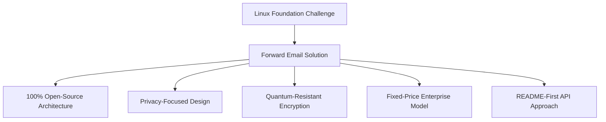
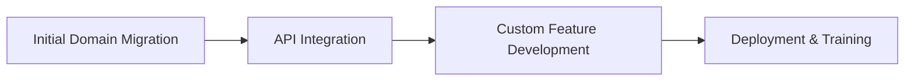

# دراسة حالة: كيف تعمل مؤسسة Linux على تحسين إدارة البريد الإلكتروني عبر أكثر من 250 نطاقًا باستخدام البريد الإلكتروني الأمامي {#case-study-how-the-linux-foundation-optimizes-email-management-across-250-domains-with-forward-email}


## جدول المحتويات {#table-of-contents}

* [مقدمة](#introduction)
* [التحدي](#the-challenge)
* [الحل](#the-solution)
  * [هندسة مفتوحة المصدر بنسبة 100%](#100-open-source-architecture)
  * [تصميم يركز على الخصوصية](#privacy-focused-design)
  * [أمان على مستوى المؤسسة](#enterprise-grade-security)
  * [نموذج المؤسسة ذات السعر الثابت](#fixed-price-enterprise-model)
  * [واجهة برمجة تطبيقات صديقة للمطورين](#developer-friendly-api)
* [عملية التنفيذ](#implementation-process)
* [النتائج والفوائد](#results-and-benefits)
  * [تحسينات الكفاءة](#efficiency-improvements)
  * [إدارة التكاليف](#cost-management)
  * [تعزيز الأمن](#enhanced-security)
  * [تحسين تجربة المستخدم](#improved-user-experience)
* [خاتمة](#conclusion)
* [مراجع](#references)

## مقدمة {#introduction}

يدير [مؤسسة لينكس](https://en.wikipedia.org/wiki/Linux_Foundation) أكثر من 900 مشروع مفتوح المصدر عبر أكثر من 250 نطاقًا، بما في ذلك [linux.com](https://www.linux.com/) و[jQuery.com](https://jquery.com/). تستكشف دراسة الحالة هذه كيفية تعاونهم مع [إعادة توجيه البريد الإلكتروني](https://forwardemail.net) لتبسيط إدارة البريد الإلكتروني مع الحفاظ على مبادئ المصدر المفتوح.

## التحدي {#the-challenge}

واجهت مؤسسة Linux العديد من التحديات في إدارة البريد الإلكتروني:

* **النطاق**: إدارة البريد الإلكتروني عبر أكثر من 250 نطاقًا بمتطلبات مختلفة
* **العبء الإداري**: تكوين سجلات DNS، والحفاظ على قواعد إعادة التوجيه، والرد على طلبات الدعم
* **الأمان**: الحماية من تهديدات البريد الإلكتروني مع الحفاظ على الخصوصية
* **التكلفة**: كانت الحلول التقليدية لكل مستخدم باهظة التكلفة للغاية نظرًا لحجمها.
* **التوافق مع المصادر المفتوحة**: الحاجة إلى حلول تتوافق مع التزامهم بقيم المصادر المفتوحة

على غرار التحديات التي واجهتها [كانونيكال/أوبونتو](https://forwardemail.net/blog/docs/canonical-ubuntu-email-enterprise-case-study) مع نطاقات التوزيع المتعددة الخاصة بها، احتاجت مؤسسة Linux إلى حل يمكنه التعامل مع مشاريع متنوعة مع الحفاظ على نهج إدارة موحد.

## الحل {#the-solution}

يوفر Forward Email حلاً شاملاً مع الميزات الرئيسية:



### بنية مفتوحة المصدر بنسبة 100% {#100-open-source-architecture}

بصفتها خدمة البريد الإلكتروني الوحيدة التي تعمل بنظام مفتوح المصدر بالكامل (واجهة أمامية وخلفية)، تتوافق خدمة Forward Email تمامًا مع التزام مؤسسة Linux Foundation بمبادئ المصدر المفتوح. وكما هو الحال مع تطبيقنا لـ [كانونيكال/أوبونتو](https://forwardemail.net/blog/docs/canonical-ubuntu-email-enterprise-case-study)، أتاحت هذه الشفافية لفريقهم الفني التحقق من تطبيقات الأمان، بل وحتى المساهمة في التحسينات.

### تصميم يركز على الخصوصية {#privacy-focused-design}

يوفر معيار [سياسات الخصوصية](https://forwardemail.net/privacy) الصارم في خدمة Forward Email الأمان الذي تتطلبه مؤسسة Linux Foundation. يضمن معيار [التنفيذ الفني لحماية خصوصية البريد الإلكتروني](https://forwardemail.net/blog/docs/email-privacy-protection-technical-implementation) الخاص بنا أمان جميع الاتصالات، دون تسجيل أو مسح لمحتوى البريد الإلكتروني.

كما هو مفصل في وثائق التنفيذ الفني لدينا:

لقد بنينا نظامنا بالكامل على مبدأ أن رسائل البريد الإلكتروني ملك لك وحدك. وخلافًا لمقدمي الخدمات الآخرين الذين يمسحون محتوى البريد الإلكتروني لأغراض الإعلان أو تدريب الذكاء الاصطناعي، فإننا نلتزم بسياسة صارمة بعدم التسجيل أو المسح، مما يحافظ على سرية جميع المراسلات.

### أمان على مستوى المؤسسة {#enterprise-grade-security}

وفّر تطبيق [التشفير المقاوم للكم](https://forwardemail.net/blog/docs/best-quantum-safe-encrypted-email-service) باستخدام ChaCha20-Poly1305 أمانًا فائق التطور، حيث يُشكّل كل صندوق بريد ملفًا مشفّرًا منفصلًا. يضمن هذا النهج بقاء اتصالات مؤسسة لينكس آمنة حتى في حال تمكّن الحواسيب الكمومية من كسر معايير التشفير الحالية.

### نموذج المؤسسة ذو السعر الثابت {#fixed-price-enterprise-model}

وفّرت خاصية [تسعير المؤسسة](https://forwardemail.net/pricing) من خدمة إعادة توجيه البريد الإلكتروني تكلفة شهرية ثابتة بغض النظر عن النطاقات أو المستخدمين. وقد وفّر هذا النهج وفورات كبيرة في التكاليف للمؤسسات الكبيرة الأخرى، كما هو موضح في خاصية [دراسة حالة البريد الإلكتروني لخريجي الجامعة](https://forwardemail.net/blog/docs/alumni-email-forwarding-university-case-study)، حيث وفرت المؤسسات ما يصل إلى 99% مقارنةً بحلول البريد الإلكتروني التقليدية لكل مستخدم.

### واجهة برمجة تطبيقات صديقة للمطورين {#developer-friendly-api}

باتباع [نهج README أولاً](https://tom.preston-werner.com/2010/08/23/readme-driven-development) واستلهامًا من [تصميم واجهة برمجة التطبيقات RESTful الخاصة بـ Stripe](https://amberonrails.com/building-stripes-api)، مكّن [API](https://forwardemail.net/api) من Forward Email التكامل العميق مع مركز التحكم في المشاريع التابع لمؤسسة Linux. كان هذا التكامل حاسمًا لأتمتة إدارة البريد الإلكتروني عبر محفظة مشاريعهم المتنوعة.

## عملية تنفيذ {#implementation-process}

وقد تم التنفيذ وفقا لنهج منظم:



1. **نقل النطاق الأولي**: تكوين سجلات DNS، وإعداد SPF/DKIM/DMARC، ونقل القواعد الحالية

   ```sh
   # Example DNS configuration for a Linux Foundation domain
   domain.org.    600    IN    MX    10 mx1.forwardemail.net.
   domain.org.    600    IN    MX    10 mx2.forwardemail.net.
   domain.org.    600    IN    TXT   "v=spf1 include:spf.forwardemail.net -all"
   ```

2. **تكامل واجهة برمجة التطبيقات**: الاتصال بمركز التحكم في المشروع لإدارة الخدمة الذاتية

3. **تطوير الميزات المخصصة**: إدارة النطاقات المتعددة، وإعداد التقارير، وسياسات الأمان

لقد عملنا بشكل وثيق مع مؤسسة Linux لتطوير ميزات (والتي هي أيضًا مفتوحة المصدر بنسبة 100% حتى يتمكن الجميع من الاستفادة منها) خصيصًا لبيئتهم متعددة المشاريع، على غرار الطريقة التي أنشأنا بها حلولًا مخصصة لـ [أنظمة البريد الإلكتروني لخريجي الجامعات](https://forwardemail.net/blog/docs/alumni-email-forwarding-university-case-study).

## النتائج والفوائد {#results-and-benefits}

وقد حقق التنفيذ فوائد كبيرة:

### تحسينات الكفاءة {#efficiency-improvements}

* تقليل النفقات الإدارية
* تسريع عملية دمج المشروع (من أيام إلى دقائق)
* إدارة مُبسّطة لأكثر من 250 نطاقًا من واجهة واحدة

### إدارة التكاليف {#cost-management}

* تسعير ثابت بغض النظر عن نمو النطاقات أو عدد المستخدمين
* إلغاء رسوم الترخيص لكل مستخدم
* على غرار [دراسة حالة جامعية](https://forwardemail.net/blog/docs/alumni-email-forwarding-university-case-study)، حققت مؤسسة Linux وفورات كبيرة في التكلفة مقارنةً بالحلول التقليدية

### أمان معزز {#enhanced-security}

* تشفير مقاوم للكميات عبر جميع النطاقات
* مصادقة شاملة للبريد الإلكتروني تمنع انتحال الهوية والتصيد الاحتيالي
* اختبارات وممارسات أمنية عبر [ميزات الأمان](https://forwardemail.net/security)
* حماية الخصوصية عبر [التنفيذ الفني](https://forwardemail.net/blog/docs/email-privacy-protection-technical-implementation)

### تحسين تجربة المستخدم {#improved-user-experience}

* إدارة بريد إلكتروني ذاتية الخدمة لمسؤولي المشاريع
* تجربة متسقة في جميع نطاقات Linux Foundation
* تسليم بريد إلكتروني موثوق مع مصادقة قوية

## الاستنتاج {#conclusion}

تُظهر شراكة مؤسسة لينكس مع فوروارد إيميل كيف يُمكن للمؤسسات مواجهة تحديات إدارة البريد الإلكتروني المعقدة مع الحفاظ على قيمها الأساسية. باختيارها حلاً يُعطي الأولوية لمبادئ المصادر المفتوحة والخصوصية والأمان، حوّلت مؤسسة لينكس إدارة البريد الإلكتروني من عبء إداري إلى ميزة استراتيجية.

كما رأينا في عملنا مع كل من [كانونيكال/أوبونتو](https://forwardemail.net/blog/docs/canonical-ubuntu-email-enterprise-case-study) و[الجامعات الكبرى](https://forwardemail.net/blog/docs/alumni-email-forwarding-university-case-study)، يمكن للمؤسسات التي لديها مجموعات نطاقات معقدة تحقيق تحسينات كبيرة في الكفاءة والأمان وإدارة التكاليف من خلال حل المؤسسة من Forward Email.

لمزيد من المعلومات حول كيفية مساعدة ميزة إعادة توجيه البريد الإلكتروني مؤسستك في إدارة البريد الإلكتروني عبر نطاقات متعددة، تفضل بزيارة [forwardemail.net](https://forwardemail.net) أو استكشف [التوثيق](https://forwardemail.net/email-api) و[أدلة](https://forwardemail.net/guides) المفصلين لدينا.

## المراجع {#references}

* مؤسسة لينكس. (٢٠٢٥). "استعراض المشاريع". تم الاسترجاع من <https://www.linuxfoundation.org/projects>
* ويكيبيديا. (٢٠٢٥). "مؤسسة لينكس". تم الاسترجاع من <https://en.wikipedia.org/wiki/Linux_Foundation>