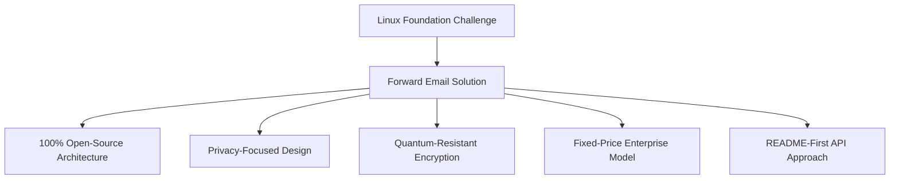
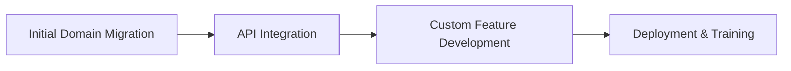

# دراسة حالة: كيف تحسن مؤسسة لينكس إدارة البريد الإلكتروني عبر أكثر من 250 نطاقًا باستخدام Forward Email {#case-study-how-the-linux-foundation-optimizes-email-management-across-250-domains-with-forward-email}


## جدول المحتويات {#table-of-contents}

* [مقدمة](#introduction)
* [التحدي](#the-challenge)
* [الحل](#the-solution)
  * [بنية مفتوحة المصدر 100%](#100-open-source-architecture)
  * [تصميم يركز على الخصوصية](#privacy-focused-design)
  * [أمان بمستوى المؤسسات](#enterprise-grade-security)
  * [نموذج تسعير ثابت للمؤسسات](#fixed-price-enterprise-model)
  * [واجهة برمجة تطبيقات صديقة للمطورين](#developer-friendly-api)
* [عملية التنفيذ](#implementation-process)
* [النتائج والفوائد](#results-and-benefits)
  * [تحسينات الكفاءة](#efficiency-improvements)
  * [إدارة التكاليف](#cost-management)
  * [تعزيز الأمان](#enhanced-security)
  * [تحسين تجربة المستخدم](#improved-user-experience)
* [الخاتمة](#conclusion)
* [المراجع](#references)


## مقدمة {#introduction}

تدير [مؤسسة لينكس](https://en.wikipedia.org/wiki/Linux_Foundation) أكثر من 900 مشروع مفتوح المصدر عبر أكثر من 250 نطاقًا، بما في ذلك [linux.com](https://www.linux.com/) و [jQuery.com](https://jquery.com/). تستعرض هذه الدراسة كيف تعاونوا مع [Forward Email](https://forwardemail.net) لتبسيط إدارة البريد الإلكتروني مع الحفاظ على التوافق مع مبادئ المصدر المفتوح.


## التحدي {#the-challenge}

واجهت مؤسسة لينكس عدة تحديات في إدارة البريد الإلكتروني:

* **الحجم**: إدارة البريد الإلكتروني عبر أكثر من 250 نطاقًا بمتطلبات مختلفة
* **العبء الإداري**: تكوين سجلات DNS، وصيانة قواعد إعادة التوجيه، والرد على طلبات الدعم
* **الأمان**: الحماية من التهديدات القائمة على البريد الإلكتروني مع الحفاظ على الخصوصية
* **التكلفة**: كانت الحلول التقليدية القائمة على المستخدم مكلفة جدًا على هذا النطاق
* **التوافق مع المصدر المفتوح**: الحاجة إلى حلول تتماشى مع التزامهم بقيم المصدر المفتوح

مماثل للتحديات التي واجهتها [Canonical/Ubuntu](https://forwardemail.net/blog/docs/canonical-ubuntu-email-enterprise-case-study) مع نطاقات التوزيع المتعددة الخاصة بهم، كانت مؤسسة لينكس بحاجة إلى حل يمكنه التعامل مع مشاريع متنوعة مع الحفاظ على نهج إدارة موحد.


## الحل {#the-solution}

قدمت Forward Email حلاً شاملاً مع ميزات رئيسية:


```mermaid
graph TD
    A[Linux Foundation Challenge] --> B[Forward Email Solution]
    B --> C[100% Open-Source Architecture]
    B --> D[Privacy-Focused Design]
    B --> E[Quantum-Resistant Encryption]
    B --> F[Fixed-Price Enterprise Model]
    B --> G[README-First API Approach]
```

### بنية مفتوحة المصدر 100% {#100-open-source-architecture}

كونها الخدمة الوحيدة للبريد الإلكتروني التي تمتلك منصة مفتوحة المصدر بالكامل (الواجهة الأمامية والخلفية)، كانت Forward Email متوافقة تمامًا مع التزام مؤسسة لينكس بمبادئ المصدر المفتوح. وبالمثل مع تنفيذنا مع [Canonical/Ubuntu](https://forwardemail.net/blog/docs/canonical-ubuntu-email-enterprise-case-study)، سمح هذا الشفافية لفريقهم التقني بالتحقق من تطبيقات الأمان وحتى المساهمة في تحسيناتها.

### تصميم يركز على الخصوصية {#privacy-focused-design}

قدمت سياسات الخصوصية الصارمة لـ Forward Email [https://forwardemail.net/privacy](https://forwardemail.net/privacy) الأمان الذي كانت مؤسسة لينكس تحتاجه. يضمن [التنفيذ الفني لحماية خصوصية البريد الإلكتروني](https://forwardemail.net/blog/docs/email-privacy-protection-technical-implementation) أن تظل جميع الاتصالات آمنة حسب التصميم، دون تسجيل أو مسح محتوى البريد الإلكتروني.

كما هو مفصل في وثائق التنفيذ الفني لدينا:

> "لقد بنينا نظامنا بأكمله على مبدأ أن رسائل بريدك الإلكتروني تخصك أنت فقط. على عكس مقدمي الخدمات الآخرين الذين يفحصون محتوى البريد الإلكتروني للإعلانات أو تدريب الذكاء الاصطناعي، نحن نلتزم بسياسة صارمة بعدم التسجيل وعدم المسح تحافظ على سرية جميع الاتصالات."
### أمان بمستوى المؤسسات {#enterprise-grade-security}

تم تنفيذ [تشفير مقاوم للحوسبة الكمومية](https://forwardemail.net/blog/docs/best-quantum-safe-encrypted-email-service) باستخدام ChaCha20-Poly1305 الذي يوفر أمانًا متقدمًا، حيث يكون كل صندوق بريد ملفًا مشفرًا منفصلًا. يضمن هذا النهج أنه حتى إذا أصبحت الحواسيب الكمومية قادرة على كسر معايير التشفير الحالية، ستظل اتصالات مؤسسة لينكس آمنة.

### نموذج المؤسسة بسعر ثابت {#fixed-price-enterprise-model}

قدمت [تسعيرة المؤسسات](https://forwardemail.net/pricing) من Forward Email تكلفة شهرية ثابتة بغض النظر عن عدد النطاقات أو المستخدمين. وقد أدى هذا النهج إلى تحقيق وفورات كبيرة في التكاليف لمنظمات كبيرة أخرى، كما هو موضح في [دراسة حالة إعادة توجيه البريد الإلكتروني لخريجي الجامعات](https://forwardemail.net/blog/docs/alumni-email-forwarding-university-case-study)، حيث وفرت المؤسسات ما يصل إلى 99% مقارنة بحلول البريد الإلكتروني التقليدية لكل مستخدم.

### واجهة برمجة تطبيقات صديقة للمطورين {#developer-friendly-api}

باتباع [نهج README-first](https://tom.preston-werner.com/2010/08/23/readme-driven-development) واستلهامًا من [تصميم API RESTful الخاص بـ Stripe](https://amberonrails.com/building-stripes-api)، مكنت [واجهة برمجة التطبيقات](https://forwardemail.net/api) من Forward Email التكامل العميق مع مركز التحكم في مشاريع مؤسسة لينكس. كان هذا التكامل حاسمًا لأتمتة إدارة البريد الإلكتروني عبر محفظة مشاريعهم المتنوعة.


## عملية التنفيذ {#implementation-process}

اتبعت عملية التنفيذ نهجًا منظمًا:


```mermaid
flowchart LR
    A[Initial Domain Migration] --> B[API Integration]
    B --> C[Custom Feature Development]
    C --> D[Deployment & Training]
```

1. **هجرة النطاق الأولية**: تكوين سجلات DNS، إعداد SPF/DKIM/DMARC، ترحيل القواعد الحالية

   ```sh
   # مثال على تكوين DNS لنطاق مؤسسة لينكس
   domain.org.    600    IN    MX    10 mx1.forwardemail.net.
   domain.org.    600    IN    MX    10 mx2.forwardemail.net.
   domain.org.    600    IN    TXT   "v=spf1 include:spf.forwardemail.net -all"
   ```

2. **تكامل API**: الاتصال بمركز التحكم في المشاريع للإدارة الذاتية

3. **تطوير ميزات مخصصة**: إدارة متعددة النطاقات، التقارير، سياسات الأمان

   عملنا عن كثب مع مؤسسة لينكس لتطوير ميزات (وهي أيضًا مفتوحة المصدر 100% ليستفيد منها الجميع) خصيصًا لبيئة مشاريعهم المتعددة، على غرار الحلول المخصصة التي أنشأناها لـ [أنظمة بريد خريجي الجامعات](https://forwardemail.net/blog/docs/alumni-email-forwarding-university-case-study).


## النتائج والفوائد {#results-and-benefits}

قدمت عملية التنفيذ فوائد كبيرة:

### تحسينات الكفاءة {#efficiency-improvements}

* تقليل العبء الإداري
* تسريع انضمام المشاريع (من أيام إلى دقائق)
* تبسيط إدارة أكثر من 250 نطاقًا من واجهة واحدة

### إدارة التكاليف {#cost-management}

* تسعير ثابت بغض النظر عن نمو النطاقات أو المستخدمين
* إلغاء رسوم الترخيص لكل مستخدم
* على غرار [دراسة الحالة الجامعية](https://forwardemail.net/blog/docs/alumni-email-forwarding-university-case-study)، حققت مؤسسة لينكس وفورات كبيرة في التكاليف مقارنةً بالحلول التقليدية

### تعزيز الأمان {#enhanced-security}

* تشفير مقاوم للحوسبة الكمومية عبر جميع النطاقات
* مصادقة بريد إلكتروني شاملة تمنع الانتحال والتصيد الاحتيالي
* اختبار الأمان والممارسات عبر [ميزات الأمان](https://forwardemail.net/security)
* حماية الخصوصية من خلال [التنفيذ الفني](https://forwardemail.net/blog/docs/email-privacy-protection-technical-implementation)

### تحسين تجربة المستخدم {#improved-user-experience}

* إدارة البريد الإلكتروني ذاتية الخدمة لمسؤولي المشاريع
* تجربة متسقة عبر جميع نطاقات مؤسسة لينكس
* توصيل بريد إلكتروني موثوق مع مصادقة قوية


## الخاتمة {#conclusion}

تُظهر شراكة مؤسسة لينكس مع Forward Email كيف يمكن للمنظمات معالجة تحديات إدارة البريد الإلكتروني المعقدة مع الحفاظ على التوافق مع قيمها الأساسية. من خلال اختيار حل يركز على مبادئ المصدر المفتوح والخصوصية والأمان، حولت مؤسسة لينكس إدارة البريد الإلكتروني من عبء إداري إلى ميزة استراتيجية.
كما هو موضح في عملنا مع كل من [Canonical/Ubuntu](https://forwardemail.net/blog/docs/canonical-ubuntu-email-enterprise-case-study) و [الجامعات الكبرى](https://forwardemail.net/blog/docs/alumni-email-forwarding-university-case-study)، يمكن للمنظمات التي تمتلك محافظ نطاقات معقدة تحقيق تحسينات كبيرة في الكفاءة والأمان وإدارة التكاليف من خلال حل المؤسسات الخاص بـ Forward Email.

لمزيد من المعلومات حول كيفية مساعدة Forward Email لمنظمتك في إدارة البريد الإلكتروني عبر نطاقات متعددة، قم بزيارة [forwardemail.net](https://forwardemail.net) أو استكشف [التوثيق](https://forwardemail.net/email-api) و [الأدلة](https://forwardemail.net/guides) التفصيلية لدينا.


## المراجع {#references}

* Linux Foundation. (2025). "تصفح المشاريع." تم الاسترجاع من <https://www.linuxfoundation.org/projects>
* Wikipedia. (2025). "مؤسسة لينكس." تم الاسترجاع من <https://en.wikipedia.org/wiki/Linux_Foundation>
