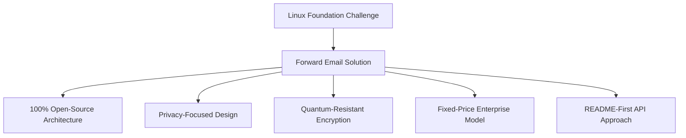
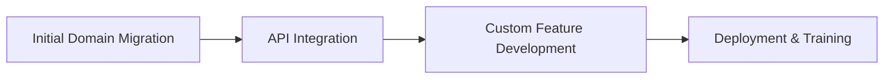

# Případová studie: Jak Linux Foundation optimalizuje správu e-mailů ve více než 250 doménách pomocí přeposílání e-mailů {#case-study-how-the-linux-foundation-optimizes-email-management-across-250-domains-with-forward-email}


## Obsah {#table-of-contents}

* [Zavedení](#introduction)
* [Výzva](#the-challenge)
* [Řešení](#the-solution)
  * [100% open-source architektura](#100-open-source-architecture)
  * [Design zaměřený na soukromí](#privacy-focused-design)
  * [Zabezpečení na podnikové úrovni](#enterprise-grade-security)
  * [Podnikový model s pevnou cenou](#fixed-price-enterprise-model)
  * [API přátelské k vývojářům](#developer-friendly-api)
* [Implementační proces](#implementation-process)
* [Výsledky a přínosy](#results-and-benefits)
  * [Zlepšení efektivity](#efficiency-improvements)
  * [Řízení nákladů](#cost-management)
  * [Zvýšené zabezpečení](#enhanced-security)
  * [Vylepšený uživatelský zážitek](#improved-user-experience)
* [Závěr](#conclusion)
* [Reference](#references)

## Úvod {#introduction}

Projekt [Linuxová nadace](https://en.wikipedia.org/wiki/Linux_Foundation) spravuje přes 900 open-source projektů ve více než 250 doménách, včetně [linux.com](https://www.linux.com/) a [jQuery.com](https://jquery.com/). Tato případová studie zkoumá, jak projekt [Přeposlat e-mail](https://forwardemail.net) navázal partnerství s projektem __PROTECTED_LINK_59__ s cílem zefektivnit správu e-mailů a zároveň zachovat soulad s principy open-source.

## Výzva {#the-challenge}

Nadace Linux Foundation čelila několika problémům se správou e-mailů:

* **Rozsah**: Správa e-mailů napříč více než 250 doménami s různými požadavky
* **Administrativní zátěž**: Konfigurace DNS záznamů, údržba pravidel pro přesměrování a reakce na žádosti o podporu
* **Zabezpečení**: Ochrana před hrozbami z e-mailů při zachování soukromí
* **Náklady**: Tradiční řešení pro každého uživatele byla ve svém rozsahu neúnosně drahá
* **Zarovnání s open-source**: Potřeba řešení, která odpovídají jejich závazku k hodnotám open-source

Podobně jako u problémů, kterým čelil [Kanonický/Ubuntu](https://forwardemail.net/blog/docs/canonical-ubuntu-email-enterprise-case-study) s jeho více distribučními doménami, potřebovala Linux Foundation řešení, které by dokázalo zvládat rozmanité projekty a zároveň zachovat jednotný přístup ke správě.

## Řešení {#the-solution}

Forward Email poskytl komplexní řešení s klíčovými funkcemi:



### 100% open-source architektura {#100-open-source-architecture}

Jako jediná e-mailová služba s kompletně open-source platformou (frontend i backend) se Forward Email dokonale shodoval se závazkem Linux Foundation k principům open-source. Podobně jako u naší implementace s [Kanonický/Ubuntu](https://forwardemail.net/blog/docs/canonical-ubuntu-email-enterprise-case-study), tato transparentnost umožnila jejich technickému týmu ověřit implementace zabezpečení a dokonce přispět k vylepšením.

### Design zaměřený na soukromí {#privacy-focused-design}

Přísné nastavení [zásady ochrany osobních údajů](https://forwardemail.net/privacy) pro přeposílání e-mailů poskytovalo zabezpečení, které Linux Foundation vyžadovala. Naše nastavení [technická implementace ochrany soukromí e-mailů](https://forwardemail.net/blog/docs/email-privacy-protection-technical-implementation) zajišťuje, že veškerá komunikace zůstává zabezpečená již od návrhu, bez protokolování nebo skenování obsahu e-mailů.

Jak je podrobně uvedeno v naší technické implementační dokumentaci:

> „Celý náš systém jsme vybudovali na principu, že vaše e-maily patří jen vám. Na rozdíl od jiných poskytovatelů, kteří skenují obsah e-mailů za účelem reklamy nebo školení umělé inteligence, dodržujeme přísné zásady neukládání protokolů a skenování, které zachovávají důvěrnost veškeré komunikace.“

### Zabezpečení na podnikové úrovni {#enterprise-grade-security}

Implementace [kvantově odolné šifrování](https://forwardemail.net/blog/docs/best-quantum-safe-encrypted-email-service) s využitím ChaCha20-Poly1305 poskytla nejmodernější zabezpečení, kdy každá poštovní schránka byla samostatným šifrovaným souborem. Tento přístup zajišťuje, že i kdyby se kvantové počítače staly schopné prolomit současné šifrovací standardy, komunikace Linux Foundation zůstane bezpečná.

### Podnikový model s pevnou cenou {#fixed-price-enterprise-model}

Řešení [ceny pro podniky](https://forwardemail.net/pricing) pro přeposílání e-mailů poskytovalo fixní měsíční náklady bez ohledu na domény nebo uživatele. Tento přístup přinesl značné úspory nákladů i dalším velkým organizacím, jak ukazuje náš příklad [případová studie e-mailů absolventů univerzity](https://forwardemail.net/blog/docs/alumni-email-forwarding-university-case-study), kde instituce ušetřily až 99 % ve srovnání s tradičními e-mailovými řešeními pro jednotlivé uživatele.

### Rozhraní API vhodné pro vývojáře {#developer-friendly-api}

V návaznosti na [Přístup „README first“](https://tom.preston-werner.com/2010/08/23/readme-driven-development) a inspirovaný [Návrh RESTful API ve Stripe](https://amberonrails.com/building-stripes-api), umožnil [API](https://forwardemail.net/api) od Forward Email hlubokou integraci s Projektovým řídicím centrem Linux Foundation. Tato integrace byla klíčová pro automatizaci správy e-mailů v rámci jejich rozmanitého portfolia projektů.

## Proces implementace {#implementation-process}

Implementace probíhala strukturovaným způsobem:



1. **Počáteční migrace domény**: Konfigurace DNS záznamů, nastavení SPF/DKIM/DMARC, migrace stávajících pravidel

   ```sh
   # Example DNS configuration for a Linux Foundation domain
   domain.org.    600    IN    MX    10 mx1.forwardemail.net.
   domain.org.    600    IN    MX    10 mx2.forwardemail.net.
   domain.org.    600    IN    TXT   "v=spf1 include:spf.forwardemail.net -all"
   ```

2. **Integrace API**: Propojení s Project Control Center pro samoobslužnou správu

3. **Vývoj vlastních funkcí**: Správa více domén, reporting, bezpečnostní zásady

Úzce jsme spolupracovali s Linux Foundation na vývoji funkcí (které jsou také 100% open-source, takže z nich může těžit každý) speciálně pro jejich multiprojektové prostředí, podobně jako jsme vytvořili vlastní řešení pro [e-mailové systémy absolventů univerzit](https://forwardemail.net/blog/docs/alumni-email-forwarding-university-case-study).

## Výsledky a přínosy {#results-and-benefits}

Implementace přinesla významné výhody:

### Zlepšení efektivity {#efficiency-improvements}

* Snížená administrativní režie
* Rychlejší zavádění projektu (z několika dnů na minuty)
* Zjednodušená správa všech více než 250 domén z jednoho rozhraní

### Správa nákladů {#cost-management}

* Fixní ceny bez ohledu na růst počtu domén nebo uživatelů
* Eliminace licenčních poplatků za uživatele
* Podobně jako u našeho [případová studie univerzity](https://forwardemail.net/blog/docs/alumni-email-forwarding-university-case-study) dosáhla Linux Foundation značných úspor nákladů ve srovnání s tradičními řešeními

### Zvýšené zabezpečení {#enhanced-security}

* Kvantově odolné šifrování napříč všemi doménami
* Komplexní ověřování e-mailů zabraňující spoofingu a phishingu
* Bezpečnostní testování a postupy prostřednictvím [bezpečnostní prvky](https://forwardemail.net/security)
* Ochrana soukromí prostřednictvím našeho [technické provedení](https://forwardemail.net/blog/docs/email-privacy-protection-technical-implementation)

### Vylepšený uživatelský zážitek {#improved-user-experience}

* Samoobslužná správa e-mailů pro administrátory projektů
* Konzistentní prostředí napříč všemi doménami Linux Foundation
* Spolehlivé doručování e-mailů s robustním ověřováním

## Závěr {#conclusion}

Partnerství Linux Foundation se společností Forward Email ukazuje, jak mohou organizace řešit složité výzvy v oblasti správy e-mailů a zároveň zachovat soulad se svými základními hodnotami. Výběrem řešení, které upřednostňuje principy open source, soukromí a zabezpečení, Linux Foundation proměnila správu e-mailů z administrativní zátěže ve strategickou výhodu.

Jak je vidět z naší práce s doménami [Kanonický/Ubuntu](https://forwardemail.net/blog/docs/canonical-ubuntu-email-enterprise-case-study) i [hlavní univerzity](https://forwardemail.net/blog/docs/alumni-email-forwarding-university-case-study), organizace s komplexními portfolii domén mohou dosáhnout významného zlepšení efektivity, zabezpečení a správy nákladů prostřednictvím podnikového řešení Forward Email.

Další informace o tom, jak vám může přeposílání e-mailů pomoci ve vaší organizaci spravovat e-maily napříč více doménami, naleznete na stránce [forwardemail.net](https://forwardemail.net) nebo si prohlédněte naše podrobné informace o [dokumentace](https://forwardemail.net/email-api) a [průvodci](https://forwardemail.net/guides).

## Odkazy {#references}

* Linux Foundation. (2025). „Procházet projekty.“ Získáno z <https://www.linuxfoundation.org/projects>
* Wikipedie. (2025). „Linux Foundation.“ Získáno z <https://en.wikipedia.org/wiki/Linux_Foundation>