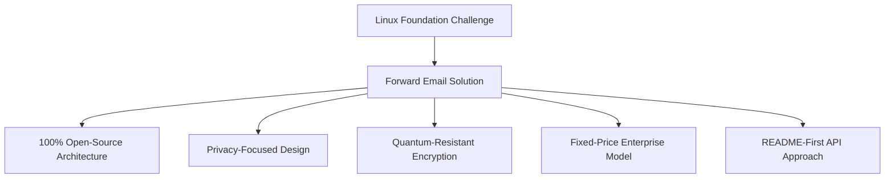
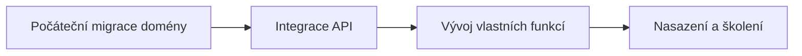

# Případová studie: Jak Linux Foundation optimalizuje správu e-mailů napříč více než 250 doménami pomocí Forward Email {#case-study-how-the-linux-foundation-optimizes-email-management-across-250-domains-with-forward-email}


## Obsah {#table-of-contents}

* [Úvod](#introduction)
* [Výzva](#the-challenge)
* [Řešení](#the-solution)
  * [100% open-source architektura](#100-open-source-architecture)
  * [Design zaměřený na soukromí](#privacy-focused-design)
  * [Podniková bezpečnost](#enterprise-grade-security)
  * [Fixní cena podnikového modelu](#fixed-price-enterprise-model)
  * [API přátelské k vývojářům](#developer-friendly-api)
* [Proces implementace](#implementation-process)
* [Výsledky a přínosy](#results-and-benefits)
  * [Zlepšení efektivity](#efficiency-improvements)
  * [Řízení nákladů](#cost-management)
  * [Zvýšená bezpečnost](#enhanced-security)
  * [Vylepšená uživatelská zkušenost](#improved-user-experience)
* [Závěr](#conclusion)
* [Reference](#references)


## Úvod {#introduction}

[Linux Foundation](https://en.wikipedia.org/wiki/Linux_Foundation) spravuje více než 900 open-source projektů napříč více než 250 doménami, včetně [linux.com](https://www.linux.com/) a [jQuery.com](https://jquery.com/). Tato případová studie zkoumá, jak navázali spolupráci s [Forward Email](https://forwardemail.net) za účelem zjednodušení správy e-mailů při zachování souladu s principy open-source.


## Výzva {#the-challenge}

Linux Foundation čelila několika výzvám ve správě e-mailů:

* **Rozsah**: Správa e-mailů napříč více než 250 doménami s různými požadavky
* **Administrativní zátěž**: Konfigurace DNS záznamů, údržba pravidel přeposílání a reakce na požadavky podpory
* **Bezpečnost**: Ochrana proti hrozbám založeným na e-mailech při zachování soukromí
* **Náklady**: Tradiční řešení na uživatele byla při jejich rozsahu finančně nedostupná
* **Soulad s open-source**: Potřeba řešení odpovídajících jejich závazku k hodnotám open-source

Podobně jako výzvy, kterým čelí [Canonical/Ubuntu](https://forwardemail.net/blog/docs/canonical-ubuntu-email-enterprise-case-study) se svými více distribučními doménami, potřebovala Linux Foundation řešení, které by zvládlo rozmanité projekty při zachování jednotného přístupu ke správě.


## Řešení {#the-solution}

Forward Email poskytl komplexní řešení s klíčovými funkcemi:


```mermaid
graph TD
    A[Linux Foundation Challenge] --> B[Forward Email Solution]
    B --> C[100% Open-Source Architecture]
    B --> D[Privacy-Focused Design]
    B --> E[Quantum-Resistant Encryption]
    B --> F[Fixed-Price Enterprise Model]
    B --> G[README-First API Approach]
```

### 100% open-source architektura {#100-open-source-architecture}

Jako jediná e-mailová služba s kompletně open-source platformou (frontend i backend) se Forward Email dokonale sladila se závazkem Linux Foundation k principům open-source. Podobně jako naše implementace u [Canonical/Ubuntu](https://forwardemail.net/blog/docs/canonical-ubuntu-email-enterprise-case-study) tato transparentnost umožnila jejich technickému týmu ověřit bezpečnostní implementace a dokonce přispět k jejich vylepšení.

### Design zaměřený na soukromí {#privacy-focused-design}

Přísné [zásady ochrany soukromí](https://forwardemail.net/privacy) Forward Email poskytly bezpečnost, kterou Linux Foundation požadovala. Naše [technická implementace ochrany soukromí e-mailů](https://forwardemail.net/blog/docs/email-privacy-protection-technical-implementation) zajišťuje, že veškerá komunikace zůstává bezpečná již v základu, bez logování nebo skenování obsahu e-mailů.

Jak je podrobně popsáno v naší dokumentaci technické implementace:

> „Vybudovali jsme celý náš systém na principu, že vaše e-maily patří vám a pouze vám. Na rozdíl od jiných poskytovatelů, kteří skenují obsah e-mailů pro reklamu nebo trénink AI, dodržujeme přísnou politiku bez logování a bez skenování, která zachovává důvěrnost veškeré komunikace.“
### Podniková úroveň zabezpečení {#enterprise-grade-security}

Implementace [kvantově odolného šifrování](https://forwardemail.net/blog/docs/best-quantum-safe-encrypted-email-service) pomocí ChaCha20-Poly1305 poskytla špičkové zabezpečení, přičemž každá schránka byla samostatným šifrovaným souborem. Tento přístup zajišťuje, že i pokud kvantové počítače získají schopnost prolomit současné šifrovací standardy, komunikace Linux Foundation zůstane bezpečná.

### Model podnikové ceny s pevnou sazbou {#fixed-price-enterprise-model}

[Podnikové ceny](https://forwardemail.net/pricing) Forward Email nabízely pevný měsíční poplatek bez ohledu na počet domén nebo uživatelů. Tento přístup přinesl významné úspory nákladů pro další velké organizace, jak je ukázáno v naší [případové studii o přeposílání e-mailů absolventů univerzity](https://forwardemail.net/blog/docs/alumni-email-forwarding-university-case-study), kde instituce ušetřily až 99 % ve srovnání s tradičními řešeními založenými na počtu uživatelů.

### API přátelské k vývojářům {#developer-friendly-api}

Následováním [přístupu README-first](https://tom.preston-werner.com/2010/08/23/readme-driven-development) a inspirováni [RESTful API designem Stripe](https://amberonrails.com/building-stripes-api) umožnilo [API](https://forwardemail.net/api) Forward Email hlubokou integraci s Project Control Center Linux Foundation. Tato integrace byla klíčová pro automatizaci správy e-mailů napříč jejich rozmanitým portfoliem projektů.


## Proces implementace {#implementation-process}

Implementace probíhala podle strukturovaného postupu:


```mermaid
flowchart LR
    A[Počáteční migrace domény] --> B[Integrace API]
    B --> C[Vývoj vlastních funkcí]
    C --> D[Nasazení a školení]
```

1. **Počáteční migrace domény**: Konfigurace DNS záznamů, nastavení SPF/DKIM/DMARC, migrace stávajících pravidel

   ```sh
   # Příklad konfigurace DNS pro doménu Linux Foundation
   domain.org.    600    IN    MX    10 mx1.forwardemail.net.
   domain.org.    600    IN    MX    10 mx2.forwardemail.net.
   domain.org.    600    IN    TXT   "v=spf1 include:spf.forwardemail.net -all"
   ```

2. **Integrace API**: Propojení s Project Control Center pro samoobslužnou správu

3. **Vývoj vlastních funkcí**: Správa více domén, reportování, bezpečnostní politiky

   Úzce jsme spolupracovali s Linux Foundation na vývoji funkcí (které jsou také z 100 % open-source, aby z nich mohl těžit každý) speciálně pro jejich prostředí s více projekty, podobně jako jsme vytvořili vlastní řešení pro [e-mailové systémy absolventů univerzit](https://forwardemail.net/blog/docs/alumni-email-forwarding-university-case-study).


## Výsledky a přínosy {#results-and-benefits}

Implementace přinesla významné přínosy:

### Zlepšení efektivity {#efficiency-improvements}

* Snížení administrativní zátěže
* Rychlejší zapojení projektů (z dnů na minuty)
* Zjednodušená správa všech více než 250 domén z jednoho rozhraní

### Řízení nákladů {#cost-management}

* Pevné ceny bez ohledu na růst počtu domén nebo uživatelů
* Eliminace licenčních poplatků za uživatele
* Podobně jako v naší [případové studii univerzity](https://forwardemail.net/blog/docs/alumni-email-forwarding-university-case-study) dosáhla Linux Foundation výrazných úspor nákladů ve srovnání s tradičními řešeními

### Zvýšené zabezpečení {#enhanced-security}

* Kvantově odolné šifrování napříč všemi doménami
* Komplexní autentizace e-mailů zabraňující spoofingu a phishingu
* Testování bezpečnosti a postupy prostřednictvím [bezpečnostních funkcí](https://forwardemail.net/security)
* Ochrana soukromí díky naší [technické implementaci](https://forwardemail.net/blog/docs/email-privacy-protection-technical-implementation)

### Zlepšená uživatelská zkušenost {#improved-user-experience}

* Samoobslužná správa e-mailů pro správce projektů
* Konzistentní zkušenost napříč všemi doménami Linux Foundation
* Spolehlivé doručování e-mailů s robustní autentizací


## Závěr {#conclusion}

Partnerství Linux Foundation s Forward Email ukazuje, jak mohou organizace řešit složité výzvy správy e-mailů a zároveň zůstat v souladu se svými základními hodnotami. Výběrem řešení, které upřednostňuje principy open-source, soukromí a bezpečnost, proměnila Linux Foundation správu e-mailů z administrativní zátěže na strategickou výhodu.
Jak je vidět na naší spolupráci s [Canonical/Ubuntu](https://forwardemail.net/blog/docs/canonical-ubuntu-email-enterprise-case-study) a [hlavními univerzitami](https://forwardemail.net/blog/docs/alumni-email-forwarding-university-case-study), organizace s komplexními portfolii domén mohou dosáhnout významného zlepšení efektivity, bezpečnosti a řízení nákladů díky podnikové řešení Forward Email.

Pro více informací o tom, jak může Forward Email pomoci vaší organizaci spravovat e-maily napříč více doménami, navštivte [forwardemail.net](https://forwardemail.net) nebo prozkoumejte naši podrobnou [dokumentaci](https://forwardemail.net/email-api) a [návody](https://forwardemail.net/guides).


## Reference {#references}

* Linux Foundation. (2025). "Prohlížet projekty." Získáno z <https://www.linuxfoundation.org/projects>
* Wikipedia. (2025). "Linux Foundation." Získáno z <https://en.wikipedia.org/wiki/Linux_Foundation>
