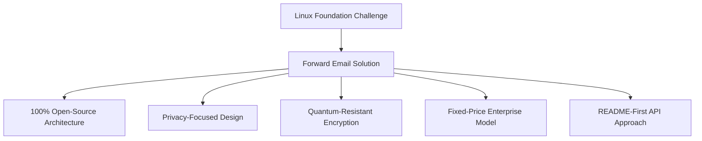
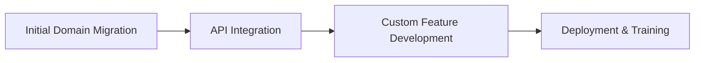

# Casestudie: Hvordan Linux Foundation optimerer e-mailhåndtering på tværs af mere end 250 domæner med videresendelse af e-mail {#case-study-how-the-linux-foundation-optimizes-email-management-across-250-domains-with-forward-email}


## Indholdsfortegnelse {#table-of-contents}

* [Indledning](#introduction)
* [Udfordringen](#the-challenge)
* [Løsningen](#the-solution)
  * [100% open source-arkitektur](#100-open-source-architecture)
  * [Privatlivsfokuseret design](#privacy-focused-design)
  * [Sikkerhed i virksomhedsklassen](#enterprise-grade-security)
  * [Fastpris-virksomhedsmodel](#fixed-price-enterprise-model)
  * [Udviklervenlig API](#developer-friendly-api)
* [Implementeringsproces](#implementation-process)
* [Resultater og fordele](#results-and-benefits)
  * [Effektivitetsforbedringer](#efficiency-improvements)
  * [Omkostningsstyring](#cost-management)
  * [Forbedret sikkerhed](#enhanced-security)
  * [Forbedret brugeroplevelse](#improved-user-experience)
* [Konklusion](#conclusion)
* [Referencer](#references)

## Introduktion {#introduction}

[Linux Foundation](https://en.wikipedia.org/wiki/Linux_Foundation) administrerer over 900 open source-projekter på tværs af mere end 250 domæner, herunder [linux.com](https://www.linux.com/) og [jQuery.com](https://jquery.com/). Denne casestudie undersøger, hvordan de indgik et partnerskab med [Videresend e-mail](https://forwardemail.net) for at strømline e-mailhåndteringen, samtidig med at de opretholdt overensstemmelse med open source-principperne.

## Udfordringen {#the-challenge}

Linux Foundation stod over for adskillige udfordringer med e-mailhåndtering:

* **Skalering**: Administration af e-mail på tværs af mere end 250 domæner med forskellige krav
* **Administrativ byrde**: Konfiguration af DNS-poster, vedligeholdelse af videresendelsesregler og besvarelse af supportanmodninger
* **Sikkerhed**: Beskyttelse mod e-mailbaserede trusler, samtidig med at privatlivets fred opretholdes
* **Omkostninger**: Traditionelle løsninger pr. bruger var uoverkommeligt dyre i deres skala
* **Open Source-tilpasning**: Behov for løsninger, der matcher deres engagement i open source-værdier

I lighed med de udfordringer, som [Kanonisk/Ubuntu](https://forwardemail.net/blog/docs/canonical-ubuntu-email-enterprise-case-study) stod over for med deres mange distributionsdomæner, havde Linux Foundation brug for en løsning, der kunne håndtere forskellige projekter, samtidig med at den opretholdt en samlet administrationstilgang.

## Løsningen {#the-solution}

Videresend e-mail leverede en omfattende løsning med nøglefunktioner:



### 100% åben kildekode-arkitektur {#100-open-source-architecture}

Som den eneste e-mailtjeneste med en fuldstændig open source-platform (både frontend og backend) passede Forward Email perfekt til Linux Foundations engagement i open source-principper. I lighed med vores implementering med [Kanonisk/Ubuntu](https://forwardemail.net/blog/docs/canonical-ubuntu-email-enterprise-case-study) tillod denne gennemsigtighed deres tekniske team at verificere sikkerhedsimplementeringer og endda bidrage med forbedringer.

### Design med fokus på privatliv {#privacy-focused-design}

Den strenge [privatlivspolitikker](https://forwardemail.net/privacy)-funktion i Videresend e-mail gav den sikkerhed, som Linux Foundation krævede. Vores [Teknisk implementering af beskyttelse af e-mail-privatliv](https://forwardemail.net/blog/docs/email-privacy-protection-technical-implementation) sikrer, at al kommunikation forbliver sikker per design, uden logføring eller scanning af e-mailindhold.

Som beskrevet i vores tekniske implementeringsdokumentation:

> "Vi har bygget hele vores system op omkring princippet om, at dine e-mails tilhører dig og kun dig. I modsætning til andre udbydere, der scanner e-mailindhold til reklame eller AI-træning, opretholder vi en streng politik om ingen logføring og ingen scanning, der bevarer fortroligheden af al kommunikation."

### Sikkerhed i virksomhedsklassen {#enterprise-grade-security}

Implementeringen af [kvanteresistent kryptering](https://forwardemail.net/blog/docs/best-quantum-safe-encrypted-email-service) ved hjælp af ChaCha20-Poly1305 gav den nyeste sikkerhed, hvor hver postkasse er en separat krypteret fil. Denne tilgang sikrer, at selvom kvantecomputere bliver i stand til at bryde nuværende krypteringsstandarder, vil Linux Foundations kommunikation forblive sikker.

### Fastpris-virksomhedsmodel {#fixed-price-enterprise-model}

[virksomhedspriser](https://forwardemail.net/pricing) i Videresend Email gav en fast månedlig pris uanset domæner eller brugere. Denne tilgang har givet betydelige omkostningsbesparelser for andre store organisationer, som vist i vores [casestudie om e-mails til universitetsalumner](https://forwardemail.net/blog/docs/alumni-email-forwarding-university-case-study), hvor institutioner sparede op til 99 % sammenlignet med traditionelle e-mailløsninger pr. bruger.

### Udviklervenlig API {#developer-friendly-api}

Efter [README-først tilgang](https://tom.preston-werner.com/2010/08/23/readme-driven-development) og inspireret af [Stripes RESTful API-design](https://amberonrails.com/building-stripes-api) muliggjorde Forward Email's [API](https://forwardemail.net/api) dyb integration med Linux Foundations Project Control Center. Denne integration var afgørende for at automatisere e-mailhåndtering på tværs af deres forskelligartede projektportefølje.

## Implementeringsproces {#implementation-process}

Implementeringen fulgte en struktureret tilgang:



1. **Indledende domænemigrering**: Konfiguration af DNS-poster, opsætning af SPF/DKIM/DMARC, migrering af eksisterende regler

   ```sh
   # Example DNS configuration for a Linux Foundation domain
   domain.org.    600    IN    MX    10 mx1.forwardemail.net.
   domain.org.    600    IN    MX    10 mx2.forwardemail.net.
   domain.org.    600    IN    TXT   "v=spf1 include:spf.forwardemail.net -all"
   ```

2. **API-integration**: Forbindelse med Project Control Center til selvbetjeningsstyring

3. **Udvikling af brugerdefinerede funktioner**: Administration af flere domæner, rapportering og sikkerhedspolitikker

Vi har arbejdet tæt sammen med Linux Foundation for at udvikle funktioner (som også er 100 % open source, så alle kan drage fordel af dem) specifikt til deres multiprojektmiljø, ligesom vi har skabt brugerdefinerede løsninger til [e-mailsystemer for universitetsalumner](https://forwardemail.net/blog/docs/alumni-email-forwarding-university-case-study).

## Resultater og fordele {#results-and-benefits}

Implementeringen gav betydelige fordele:

### Effektivitetsforbedringer {#efficiency-improvements}

* Reduceret administrativ administration
* Hurtigere onboarding af projekter (fra dage til minutter)
* Strømlinet administration af alle 250+ domæner fra en enkelt brugerflade

### Omkostningsstyring {#cost-management}

* Fast pris uanset vækst i domæner eller brugere
* Eliminering af licensgebyrer pr. bruger
* I lighed med vores [universitets casestudie](https://forwardemail.net/blog/docs/alumni-email-forwarding-university-case-study) opnåede Linux Foundation betydelige omkostningsbesparelser sammenlignet med traditionelle løsninger

### Forbedret sikkerhed {#enhanced-security}

* Kvantebestandig kryptering på tværs af alle domæner
* Omfattende e-mail-godkendelse, der forhindrer spoofing og phishing
* Sikkerhedstest og -praksis via [sikkerhedsfunktioner](https://forwardemail.net/security)
* Privatlivsbeskyttelse gennem vores [teknisk implementering](https://forwardemail.net/blog/docs/email-privacy-protection-technical-implementation)

### Forbedret brugeroplevelse {#improved-user-experience}

* Selvbetjeningsadministration af e-mails til projektadministratorer
* Ensartet oplevelse på tværs af alle Linux Foundation-domæner
* Pålidelig e-maillevering med robust godkendelse

## Konklusion {#conclusion}

Linux Foundations partnerskab med Forward Email demonstrerer, hvordan organisationer kan håndtere komplekse udfordringer med e-mailhåndtering, samtidig med at de opretholder overensstemmelse med deres kerneværdier. Ved at vælge en løsning, der prioriterer open source-principper, privatliv og sikkerhed, har Linux Foundation forvandlet e-mailhåndtering fra en administrativ byrde til en strategisk fordel.

Som det ses i vores arbejde med både [Kanonisk/Ubuntu](https://forwardemail.net/blog/docs/canonical-ubuntu-email-enterprise-case-study) og [større universiteter](https://forwardemail.net/blog/docs/alumni-email-forwarding-university-case-study), kan organisationer med komplekse domæneporteføljer opnå betydelige forbedringer i effektivitet, sikkerhed og omkostningsstyring gennem Forward Emails virksomhedsløsning.

For mere information om, hvordan Videresend e-mail kan hjælpe din organisation med at administrere e-mail på tværs af flere domæner, kan du besøge [forwardemail.net](https://forwardemail.net) eller udforske vores detaljerede [dokumentation](https://forwardemail.net/email-api) og [guider](https://forwardemail.net/guides).

## Referencer {#references}

* Linux Foundation. (2025). "Gennemse projekter." Hentet fra <https://www.linuxfoundation.org/projects>
* Wikipedia. (2025). "Linux Foundation." Hentet fra <https://en.wikipedia.org/wiki/Linux_Foundation>