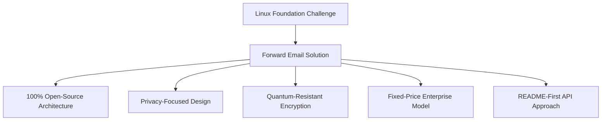
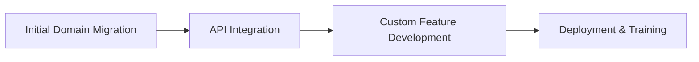

# Case Study: Hvordan Linux Foundation optimerer e-mailhåndtering på tværs af 250+ domæner med Forward Email {#case-study-how-the-linux-foundation-optimizes-email-management-across-250-domains-with-forward-email}


## Indholdsfortegnelse {#table-of-contents}

* [Introduktion](#introduction)
* [Udfordringen](#the-challenge)
* [Løsningen](#the-solution)
  * [100% Open-Source Arkitektur](#100-open-source-architecture)
  * [Privatlivsfokuseret Design](#privacy-focused-design)
  * [Enterprise-Sikkerhed](#enterprise-grade-security)
  * [Fast Pris Enterprise Model](#fixed-price-enterprise-model)
  * [Udviklervenligt API](#developer-friendly-api)
* [Implementeringsproces](#implementation-process)
* [Resultater og Fordele](#results-and-benefits)
  * [Effektivitetsforbedringer](#efficiency-improvements)
  * [Omkostningsstyring](#cost-management)
  * [Forbedret Sikkerhed](#enhanced-security)
  * [Forbedret Brugeroplevelse](#improved-user-experience)
* [Konklusion](#conclusion)
* [Referencer](#references)


## Introduktion {#introduction}

[Linux Foundation](https://en.wikipedia.org/wiki/Linux_Foundation) administrerer over 900 open source-projekter på tværs af 250+ domæner, herunder [linux.com](https://www.linux.com/) og [jQuery.com](https://jquery.com/). Denne case study undersøger, hvordan de samarbejdede med [Forward Email](https://forwardemail.net) for at strømline e-mailhåndtering samtidig med, at de bevarer overensstemmelse med open source-principper.


## Udfordringen {#the-challenge}

Linux Foundation stod over for flere udfordringer med e-mailhåndtering:

* **Skala**: Håndtering af e-mail på tværs af 250+ domæner med forskellige krav
* **Administrativ Byrde**: Konfigurering af DNS-poster, vedligeholdelse af videresendelsesregler og håndtering af supporthenvendelser
* **Sikkerhed**: Beskyttelse mod e-mailbaserede trusler samtidig med opretholdelse af privatliv
* **Omkostninger**: Traditionelle løsninger pr. bruger var uforholdsmæssigt dyre i deres skala
* **Open Source-Overensstemmelse**: Behov for løsninger, der matcher deres engagement i open source-værdier

Ligesom udfordringerne, som [Canonical/Ubuntu](https://forwardemail.net/blog/docs/canonical-ubuntu-email-enterprise-case-study) stod overfor med deres mange distributionsdomæner, havde Linux Foundation brug for en løsning, der kunne håndtere forskellige projekter samtidig med at bevare en samlet administrationsmetode.


## Løsningen {#the-solution}

Forward Email leverede en omfattende løsning med nøglefunktioner:


```mermaid
graph TD
    A[Linux Foundation Challenge] --> B[Forward Email Solution]
    B --> C[100% Open-Source Architecture]
    B --> D[Privacy-Focused Design]
    B --> E[Quantum-Resistant Encryption]
    B --> F[Fixed-Price Enterprise Model]
    B --> G[README-First API Approach]
```

### 100% Open-Source Arkitektur {#100-open-source-architecture}

Som den eneste e-mailtjeneste med en fuldstændig open source-platform (både frontend og backend) var Forward Email perfekt tilpasset Linux Foundations engagement i open source-principper. Ligesom vores implementering med [Canonical/Ubuntu](https://forwardemail.net/blog/docs/canonical-ubuntu-email-enterprise-case-study) gav denne gennemsigtighed deres tekniske team mulighed for at verificere sikkerhedsimplementeringer og endda bidrage med forbedringer.

### Privatlivsfokuseret Design {#privacy-focused-design}

Forward Emails strenge [privatlivspolitikker](https://forwardemail.net/privacy) leverede den sikkerhed, som Linux Foundation krævede. Vores [tekniske implementering af e-mail-privatlivsbeskyttelse](https://forwardemail.net/blog/docs/email-privacy-protection-technical-implementation) sikrer, at al kommunikation forbliver sikker af design, uden logning eller scanning af e-mailindhold.

Som detaljeret i vores tekniske implementeringsdokumentation:

> "Vi har bygget hele vores system omkring princippet om, at dine e-mails tilhører dig og kun dig. I modsætning til andre udbydere, der scanner e-mailindhold til reklame eller AI-træning, opretholder vi en streng politik uden logning og scanning, som bevarer fortroligheden af al kommunikation."
### Enterprise-Grade Security {#enterprise-grade-security}

Implementeringen af [kvante-resistent kryptering](https://forwardemail.net/blog/docs/best-quantum-safe-encrypted-email-service) ved brug af ChaCha20-Poly1305 leverede topmoderne sikkerhed, hvor hver postkasse er en separat krypteret fil. Denne tilgang sikrer, at selv hvis kvantecomputere bliver i stand til at bryde nuværende krypteringsstandarder, vil Linux Foundations kommunikation forblive sikker.

### Fast Pris Enterprise Model {#fixed-price-enterprise-model}

Forward Emails [enterprise-prissætning](https://forwardemail.net/pricing) tilbød en fast månedlig pris uanset domæner eller brugere. Denne tilgang har givet betydelige besparelser for andre store organisationer, som demonstreret i vores [universitets alumni email case study](https://forwardemail.net/blog/docs/alumni-email-forwarding-university-case-study), hvor institutioner sparede op til 99% sammenlignet med traditionelle per-bruger email løsninger.

### Udviklervenlig API {#developer-friendly-api}

Med en [README-først tilgang](https://tom.preston-werner.com/2010/08/23/readme-driven-development) og inspireret af [Stripes RESTful API design](https://amberonrails.com/building-stripes-api), gjorde Forward Emails [API](https://forwardemail.net/api) det muligt med dyb integration med Linux Foundations Project Control Center. Denne integration var afgørende for automatisering af email-administration på tværs af deres forskellige projektportefølje.


## Implementeringsproces {#implementation-process}

Implementeringen fulgte en struktureret tilgang:


```mermaid
flowchart LR
    A[Initial Domain Migration] --> B[API Integration]
    B --> C[Custom Feature Development]
    C --> D[Deployment & Training]
```

1. **Initial Domain Migration**: Konfiguration af DNS-poster, opsætning af SPF/DKIM/DMARC, migrering af eksisterende regler

   ```sh
   # Eksempel på DNS-konfiguration for et Linux Foundation domæne
   domain.org.    600    IN    MX    10 mx1.forwardemail.net.
   domain.org.    600    IN    MX    10 mx2.forwardemail.net.
   domain.org.    600    IN    TXT   "v=spf1 include:spf.forwardemail.net -all"
   ```

2. **API Integration**: Forbindelse med Project Control Center for selvbetjent administration

3. **Custom Feature Development**: Multi-domæne administration, rapportering, sikkerhedspolitikker

   Vi arbejdede tæt sammen med Linux Foundation for at udvikle funktioner (som også er 100% open source, så alle kan drage fordel af dem) specifikt til deres multi-projekt miljø, ligesom vi skabte tilpassede løsninger til [universitets alumni email systemer](https://forwardemail.net/blog/docs/alumni-email-forwarding-university-case-study).


## Resultater og Fordele {#results-and-benefits}

Implementeringen leverede betydelige fordele:

### Effektivitetsforbedringer {#efficiency-improvements}

* Reduceret administrativt overhead
* Hurtigere projekt onboarding (fra dage til minutter)
* Strømlinet administration af alle 250+ domæner fra en enkelt grænseflade

### Omkostningsstyring {#cost-management}

* Fast pris uanset vækst i domæner eller brugere
* Eliminering af per-bruger licensgebyrer
* Ligesom i vores [universitets case study](https://forwardemail.net/blog/docs/alumni-email-forwarding-university-case-study) opnåede Linux Foundation betydelige omkostningsbesparelser sammenlignet med traditionelle løsninger

### Forbedret Sikkerhed {#enhanced-security}

* Kvante-resistent kryptering på tværs af alle domæner
* Omfattende email-autentificering, der forhindrer spoofing og phishing
* Sikkerhedstest og praksis via [sikkerhedsfunktioner](https://forwardemail.net/security)
* Beskyttelse af privatliv gennem vores [tekniske implementering](https://forwardemail.net/blog/docs/email-privacy-protection-technical-implementation)

### Forbedret Brugeroplevelse {#improved-user-experience}

* Selvbetjent email-administration for projektadministratorer
* Konsistent oplevelse på tværs af alle Linux Foundation domæner
* Pålidelig email-levering med robust autentificering


## Konklusion {#conclusion}

Linux Foundations partnerskab med Forward Email demonstrerer, hvordan organisationer kan håndtere komplekse email-administrationsudfordringer samtidig med at de bevarer overensstemmelse med deres kerneværdier. Ved at vælge en løsning, der prioriterer open source-principper, privatliv og sikkerhed, har Linux Foundation transformeret email-administration fra en administrativ byrde til en strategisk fordel.
Som set i vores arbejde med både [Canonical/Ubuntu](https://forwardemail.net/blog/docs/canonical-ubuntu-email-enterprise-case-study) og [store universiteter](https://forwardemail.net/blog/docs/alumni-email-forwarding-university-case-study), kan organisationer med komplekse domæneporteføljer opnå betydelige forbedringer i effektivitet, sikkerhed og omkostningsstyring gennem Forward Emails virksomhedsløsning.

For mere information om, hvordan Forward Email kan hjælpe din organisation med at administrere e-mail på tværs af flere domæner, besøg [forwardemail.net](https://forwardemail.net) eller udforsk vores detaljerede [dokumentation](https://forwardemail.net/email-api) og [vejledninger](https://forwardemail.net/guides).


## Referencer {#references}

* Linux Foundation. (2025). "Browse Projects." Hentet fra <https://www.linuxfoundation.org/projects>
* Wikipedia. (2025). "Linux Foundation." Hentet fra <https://en.wikipedia.org/wiki/Linux_Foundation>
