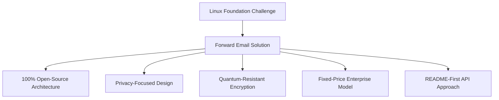
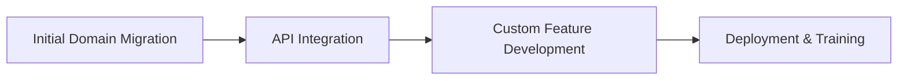

# Fallstudie: Wie die Linux Foundation mit Forward Email die E-Mail-Verwaltung in über 250 Domänen optimiert {#case-study-how-the-linux-foundation-optimizes-email-management-across-250-domains-with-forward-email}


## Inhaltsverzeichnis {#table-of-contents}

* [Einführung](#introduction)
* [Die Herausforderung](#the-challenge)
* [Die Lösung](#the-solution)
  * [100 % Open-Source-Architektur](#100-open-source-architecture)
  * [Datenschutzorientiertes Design](#privacy-focused-design)
  * [Sicherheit auf Unternehmensniveau](#enterprise-grade-security)
  * [Festpreis-Unternehmensmodell](#fixed-price-enterprise-model)
  * [Entwicklerfreundliche API](#developer-friendly-api)
* [Implementierungsprozess](#implementation-process)
* [Ergebnisse und Vorteile](#results-and-benefits)
  * [Effizienzsteigerungen](#efficiency-improvements)
  * [Kostenmanagement](#cost-management)
  * [Verbesserte Sicherheit](#enhanced-security)
  * [Verbesserte Benutzererfahrung](#improved-user-experience)
* [Abschluss](#conclusion)
* [Verweise](#references)

## Einführung {#introduction}

[Linux Foundation](https://en.wikipedia.org/wiki/Linux_Foundation) verwaltet über 900 Open-Source-Projekte in über 250 Domänen, darunter [linux.com](https://www.linux.com/) und [jQuery.com](https://jquery.com/). Diese Fallstudie untersucht, wie die Partnerschaft mit [E-Mail weiterleiten](https://forwardemail.net) das E-Mail-Management optimiert und gleichzeitig die Open-Source-Prinzipien einhält.

## Die Herausforderung {#the-challenge}

Die Linux Foundation stand vor mehreren Herausforderungen bei der E-Mail-Verwaltung:

* **Umfang**: E-Mail-Verwaltung über mehr als 250 Domänen mit unterschiedlichen Anforderungen
* **Administrativer Aufwand**: Konfiguration von DNS-Einträgen, Pflege von Weiterleitungsregeln und Beantwortung von Supportanfragen
* **Sicherheit**: Schutz vor E-Mail-basierten Bedrohungen bei gleichzeitiger Wahrung der Privatsphäre
* **Kosten**: Herkömmliche Lösungen pro Benutzer waren aufgrund ihrer Größenordnung unerschwinglich teuer.
* **Open-Source-Ausrichtung**: Bedarf an Lösungen, die dem Engagement für Open-Source-Werte entsprechen

Ähnlich den Herausforderungen, vor denen [Canonical/Ubuntu](https://forwardemail.net/blog/docs/canonical-ubuntu-email-enterprise-case-study) mit seinen mehreren Distributionsdomänen stand, benötigte die Linux Foundation eine Lösung, die verschiedene Projekte bewältigen und gleichzeitig einen einheitlichen Verwaltungsansatz beibehalten konnte.

## Die Lösung {#the-solution}

Forward Email bietet eine umfassende Lösung mit wichtigen Funktionen:



### 100 % Open-Source-Architektur {#100-open-source-architecture}

Als einziger E-Mail-Dienst mit einer vollständig Open-Source-Plattform (Frontend und Backend) entsprach Forward Email perfekt dem Open-Source-Engagement der Linux Foundation. Ähnlich wie bei unserer Implementierung mit [Canonical/Ubuntu](https://forwardemail.net/blog/docs/canonical-ubuntu-email-enterprise-case-study) ermöglichte diese Transparenz dem technischen Team, Sicherheitsimplementierungen zu überprüfen und sogar Verbesserungen vorzunehmen.

### Datenschutzorientiertes Design {#privacy-focused-design}

Der strikte [Datenschutzrichtlinien](https://forwardemail.net/privacy) von Forward Email bot die von der Linux Foundation geforderte Sicherheit. Unser [Technische Umsetzung des E-Mail-Datenschutzes](https://forwardemail.net/blog/docs/email-privacy-protection-technical-implementation) stellt sicher, dass die gesamte Kommunikation von Grund auf sicher bleibt, ohne dass E-Mail-Inhalte protokolliert oder gescannt werden.

Wie in unserer technischen Implementierungsdokumentation ausführlich beschrieben:

> „Wir haben unser gesamtes System nach dem Prinzip aufgebaut, dass Ihre E-Mails Ihnen und nur Ihnen gehören. Im Gegensatz zu anderen Anbietern, die E-Mail-Inhalte zu Werbezwecken oder für KI-Training scannen, verfolgen wir eine strikte No-Logging- und No-Scanning-Richtlinie, die die Vertraulichkeit aller Kommunikationen wahrt.“

### Sicherheit auf Unternehmensniveau {#enterprise-grade-security}

Die Implementierung von [quantenresistente Verschlüsselung](https://forwardemail.net/blog/docs/best-quantum-safe-encrypted-email-service) mit ChaCha20-Poly1305 bot modernste Sicherheit, da jedes Postfach eine separate verschlüsselte Datei darstellt. Dieser Ansatz stellt sicher, dass die Kommunikation der Linux Foundation auch dann sicher bleibt, wenn Quantencomputer aktuelle Verschlüsselungsstandards knacken können.

### Festpreis-Unternehmensmodell {#fixed-price-enterprise-model}

Der [Unternehmenspreise](https://forwardemail.net/pricing) von Forward Email bot feste monatliche Kosten, unabhängig von Domänen oder Benutzern. Dieser Ansatz hat anderen großen Organisationen erhebliche Kosteneinsparungen ermöglicht, wie unser [Fallstudie zu E-Mails von Universitäts-Alumni](https://forwardemail.net/blog/docs/alumni-email-forwarding-university-case-study) zeigt: Hier konnten Institutionen im Vergleich zu herkömmlichen E-Mail-Lösungen mit Einzelbenutzerabrechnung bis zu 99 % einsparen.

### Entwicklerfreundliche API {#developer-friendly-api}

Nach einem [README-First-Ansatz](https://tom.preston-werner.com/2010/08/23/readme-driven-development) und inspiriert von [Stripes RESTful-API-Design](https://amberonrails.com/building-stripes-api) ermöglichte Forward Emails [API](https://forwardemail.net/api) eine tiefe Integration mit dem Project Control Center der Linux Foundation. Diese Integration war entscheidend für die Automatisierung des E-Mail-Managements im gesamten vielfältigen Projektportfolio.

## Implementierungsprozess {#implementation-process}

Die Umsetzung erfolgte nach einem strukturierten Ansatz:



1. **Erste Domänenmigration**: Konfigurieren von DNS-Einträgen, Einrichten von SPF/DKIM/DMARC, Migrieren vorhandener Regeln

   ```sh
   # Example DNS configuration for a Linux Foundation domain
   domain.org.    600    IN    MX    10 mx1.forwardemail.net.
   domain.org.    600    IN    MX    10 mx2.forwardemail.net.
   domain.org.    600    IN    TXT   "v=spf1 include:spf.forwardemail.net -all"
   ```

2. **API-Integration**: Verbindung mit Project Control Center für Self-Service-Management

3. **Entwicklung benutzerdefinierter Funktionen**: Multi-Domain-Management, Reporting, Sicherheitsrichtlinien

Wir haben eng mit der Linux Foundation zusammengearbeitet, um Funktionen (die ebenfalls zu 100 % Open Source sind, sodass jeder davon profitieren kann) speziell für ihre Multiprojektumgebung zu entwickeln, ähnlich wie wir benutzerdefinierte Lösungen für [E-Mail-Systeme für Universitäts-Alumni](https://forwardemail.net/blog/docs/alumni-email-forwarding-university-case-study) erstellt haben.

## Ergebnisse und Vorteile {#results-and-benefits}

Die Implementierung brachte erhebliche Vorteile:

### Effizienzverbesserungen {#efficiency-improvements}

* Reduzierter Verwaltungsaufwand
* Schnelleres Projekt-Onboarding (von Tagen auf Minuten)
* Optimierte Verwaltung aller über 250 Domänen über eine einzige Oberfläche

### Kostenmanagement {#cost-management}

* Feste Preise unabhängig vom Domänen- oder Nutzerwachstum
* Wegfall von Lizenzgebühren pro Nutzer
* Ähnlich wie bei unserem [Fallstudie einer Universität](https://forwardemail.net/blog/docs/alumni-email-forwarding-university-case-study) erzielte die Linux Foundation erhebliche Kosteneinsparungen im Vergleich zu herkömmlichen Lösungen

### Verbesserte Sicherheit {#enhanced-security}

* Quantenresistente Verschlüsselung über alle Domänen hinweg
* Umfassende E-Mail-Authentifizierung zur Verhinderung von Spoofing und Phishing
* Sicherheitstests und -praktiken über [Sicherheitsfunktionen](https://forwardemail.net/security)
* Datenschutz durch unsere [technische Umsetzung](https://forwardemail.net/blog/docs/email-privacy-protection-technical-implementation)

### Verbesserte Benutzererfahrung {#improved-user-experience}

* Self-Service-E-Mail-Verwaltung für Projektadministratoren
* Einheitliche Benutzererfahrung in allen Domänen der Linux Foundation
* Zuverlässige E-Mail-Zustellung mit robuster Authentifizierung

## Fazit {#conclusion}

Die Partnerschaft der Linux Foundation mit Forward Email zeigt, wie Unternehmen komplexe Herausforderungen im E-Mail-Management bewältigen und gleichzeitig ihre Kernwerte wahren können. Durch die Wahl einer Lösung, die Open-Source-Prinzipien, Datenschutz und Sicherheit in den Vordergrund stellt, hat die Linux Foundation das E-Mail-Management von einer administrativen Belastung in einen strategischen Vorteil verwandelt.

Wie unsere Arbeit mit [Canonical/Ubuntu](https://forwardemail.net/blog/docs/canonical-ubuntu-email-enterprise-case-study) und [großen Universitäten](https://forwardemail.net/blog/docs/alumni-email-forwarding-university-case-study) zeigt, können Organisationen mit komplexen Domänenportfolios durch die Unternehmenslösung von Forward Email erhebliche Verbesserungen bei Effizienz, Sicherheit und Kostenmanagement erzielen.

Weitere Informationen dazu, wie Forward Email Ihrem Unternehmen bei der Verwaltung von E-Mails über mehrere Domänen hinweg helfen kann, finden Sie unter [forwardemail.net](https://forwardemail.net) oder in unseren ausführlichen Abschnitten [Dokumentation](https://forwardemail.net/email-api) und [Anleitungen](https://forwardemail.net/guides).

## Referenzen {#references}

* Linux Foundation. (2025). „Projekte durchsuchen“. Abgerufen von <https://www.linuxfoundation.org/projects>
* Wikipedia. (2025). „Linux Foundation“. Abgerufen von <https://en.wikipedia.org/wiki/Linux_Foundation>