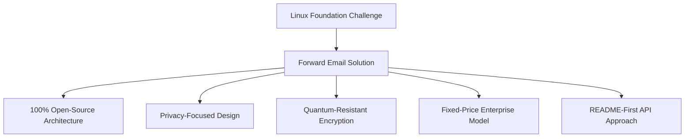
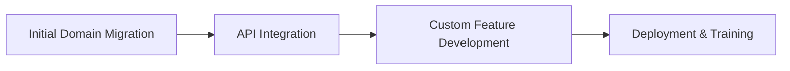

# Fallstudie: Wie die Linux Foundation das E-Mail-Management über 250+ Domains mit Forward Email optimiert {#case-study-how-the-linux-foundation-optimizes-email-management-across-250-domains-with-forward-email}


## Inhaltsverzeichnis {#table-of-contents}

* [Einführung](#introduction)
* [Die Herausforderung](#the-challenge)
* [Die Lösung](#the-solution)
  * [100% Open-Source-Architektur](#100-open-source-architecture)
  * [Datenschutzorientiertes Design](#privacy-focused-design)
  * [Sicherheit auf Unternehmensniveau](#enterprise-grade-security)
  * [Festpreis-Enterprise-Modell](#fixed-price-enterprise-model)
  * [Entwicklerfreundliche API](#developer-friendly-api)
* [Implementierungsprozess](#implementation-process)
* [Ergebnisse und Vorteile](#results-and-benefits)
  * [Effizienzsteigerungen](#efficiency-improvements)
  * [Kostenmanagement](#cost-management)
  * [Verbesserte Sicherheit](#enhanced-security)
  * [Verbesserte Benutzererfahrung](#improved-user-experience)
* [Fazit](#conclusion)
* [Quellen](#references)


## Einführung {#introduction}

Die [Linux Foundation](https://en.wikipedia.org/wiki/Linux_Foundation) verwaltet über 900 Open-Source-Projekte auf mehr als 250 Domains, darunter [linux.com](https://www.linux.com/) und [jQuery.com](https://jquery.com/). Diese Fallstudie untersucht, wie sie mit [Forward Email](https://forwardemail.net) zusammenarbeiteten, um das E-Mail-Management zu optimieren und gleichzeitig die Prinzipien von Open Source einzuhalten.


## Die Herausforderung {#the-challenge}

Die Linux Foundation stand vor mehreren Herausforderungen im E-Mail-Management:

* **Skalierung**: Verwaltung von E-Mails über 250+ Domains mit unterschiedlichen Anforderungen
* **Administrativer Aufwand**: Konfiguration von DNS-Einträgen, Pflege von Weiterleitungsregeln und Bearbeitung von Supportanfragen
* **Sicherheit**: Schutz vor E-Mail-basierten Bedrohungen bei gleichzeitiger Wahrung der Privatsphäre
* **Kosten**: Traditionelle Lösungen pro Nutzer waren bei ihrem Umfang unerschwinglich
* **Open-Source-Ausrichtung**: Bedarf an Lösungen, die mit ihrem Engagement für Open-Source-Werte übereinstimmen

Ähnlich wie die Herausforderungen, denen sich [Canonical/Ubuntu](https://forwardemail.net/blog/docs/canonical-ubuntu-email-enterprise-case-study) mit ihren mehreren Distributionsdomains gegenübersah, benötigte die Linux Foundation eine Lösung, die vielfältige Projekte bewältigen und gleichzeitig einen einheitlichen Verwaltungsansatz gewährleisten konnte.


## Die Lösung {#the-solution}

Forward Email bot eine umfassende Lösung mit folgenden Hauptmerkmalen:


```mermaid
graph TD
    A[Linux Foundation Challenge] --> B[Forward Email Solution]
    B --> C[100% Open-Source Architecture]
    B --> D[Privacy-Focused Design]
    B --> E[Quantum-Resistant Encryption]
    B --> F[Fixed-Price Enterprise Model]
    B --> G[README-First API Approach]
```

### 100% Open-Source-Architektur {#100-open-source-architecture}

Als einziger E-Mail-Dienst mit einer vollständig Open-Source-Plattform (Frontend und Backend) passte Forward Email perfekt zum Engagement der Linux Foundation für Open-Source-Prinzipien. Ähnlich wie bei unserer Implementierung mit [Canonical/Ubuntu](https://forwardemail.net/blog/docs/canonical-ubuntu-email-enterprise-case-study) ermöglichte diese Transparenz ihrem technischen Team, Sicherheitsimplementierungen zu überprüfen und sogar Verbesserungen beizutragen.

### Datenschutzorientiertes Design {#privacy-focused-design}

Die strengen [Datenschutzrichtlinien](https://forwardemail.net/privacy) von Forward Email boten die Sicherheit, die die Linux Foundation benötigte. Unsere [technische Umsetzung des E-Mail-Datenschutzes](https://forwardemail.net/blog/docs/email-privacy-protection-technical-implementation) stellt sicher, dass alle Kommunikationen von Grund auf sicher bleiben, ohne Protokollierung oder Scannen von E-Mail-Inhalten.

Wie in unserer technischen Implementierungsdokumentation ausführlich beschrieben:

> „Wir haben unser gesamtes System nach dem Prinzip aufgebaut, dass Ihre E-Mails Ihnen gehören und nur Ihnen. Im Gegensatz zu anderen Anbietern, die E-Mail-Inhalte für Werbung oder KI-Training scannen, verfolgen wir eine strikte No-Logging- und No-Scanning-Politik, die die Vertraulichkeit aller Kommunikationen wahrt.“
### Enterprise-Grade Security {#enterprise-grade-security}

Die Implementierung von [quantum-resistenter Verschlüsselung](https://forwardemail.net/blog/docs/best-quantum-safe-encrypted-email-service) mit ChaCha20-Poly1305 bot modernste Sicherheit, wobei jedes Postfach als separate verschlüsselte Datei gespeichert wurde. Dieser Ansatz stellt sicher, dass die Kommunikation der Linux Foundation auch dann sicher bleibt, wenn Quantencomputer in der Lage sein sollten, aktuelle Verschlüsselungsstandards zu knacken.

### Festpreis-Enterprise-Modell {#fixed-price-enterprise-model}

Das [Enterprise-Preismodell](https://forwardemail.net/pricing) von Forward Email bot eine feste monatliche Gebühr, unabhängig von Domains oder Nutzern. Dieser Ansatz führte zu erheblichen Kosteneinsparungen für andere große Organisationen, wie in unserer [Fallstudie zum Alumni-E-Mail-System einer Universität](https://forwardemail.net/blog/docs/alumni-email-forwarding-university-case-study) gezeigt, bei der Institutionen bis zu 99 % im Vergleich zu herkömmlichen nutzerbasierten E-Mail-Lösungen einsparen konnten.

### Entwicklerfreundliche API {#developer-friendly-api}

Nach einem [README-first-Ansatz](https://tom.preston-werner.com/2010/08/23/readme-driven-development) und inspiriert vom [RESTful API-Design von Stripe](https://amberonrails.com/building-stripes-api) ermöglichte die [API](https://forwardemail.net/api) von Forward Email eine tiefe Integration mit dem Project Control Center der Linux Foundation. Diese Integration war entscheidend für die Automatisierung der E-Mail-Verwaltung über ihr vielfältiges Projektportfolio hinweg.


## Implementierungsprozess {#implementation-process}

Die Implementierung folgte einem strukturierten Ansatz:


```mermaid
flowchart LR
    A[Initial Domain Migration] --> B[API Integration]
    B --> C[Custom Feature Development]
    C --> D[Deployment & Training]
```

1. **Initiale Domain-Migration**: Konfiguration der DNS-Einträge, Einrichtung von SPF/DKIM/DMARC, Migration bestehender Regeln

   ```sh
   # Beispielhafte DNS-Konfiguration für eine Domain der Linux Foundation
   domain.org.    600    IN    MX    10 mx1.forwardemail.net.
   domain.org.    600    IN    MX    10 mx2.forwardemail.net.
   domain.org.    600    IN    TXT   "v=spf1 include:spf.forwardemail.net -all"
   ```

2. **API-Integration**: Anbindung an das Project Control Center für Self-Service-Verwaltung

3. **Entwicklung kundenspezifischer Funktionen**: Multi-Domain-Verwaltung, Reporting, Sicherheitsrichtlinien

   Wir arbeiteten eng mit der Linux Foundation zusammen, um Funktionen zu entwickeln (die zudem zu 100 % Open Source sind, sodass alle davon profitieren können), die speziell für ihre Multi-Projekt-Umgebung geeignet sind – ähnlich wie bei unseren maßgeschneiderten Lösungen für [universitäre Alumni-E-Mail-Systeme](https://forwardemail.net/blog/docs/alumni-email-forwarding-university-case-study).


## Ergebnisse und Vorteile {#results-and-benefits}

Die Implementierung brachte bedeutende Vorteile:

### Effizienzsteigerungen {#efficiency-improvements}

* Reduzierter administrativer Aufwand
* Schnellere Projekt-Einführung (von Tagen auf Minuten)
* Vereinfachte Verwaltung aller 250+ Domains über eine einzige Oberfläche

### Kostenmanagement {#cost-management}

* Festpreise unabhängig vom Wachstum bei Domains oder Nutzern
* Wegfall von nutzerbasierten Lizenzgebühren
* Ähnlich wie in unserer [Universitäts-Fallstudie](https://forwardemail.net/blog/docs/alumni-email-forwarding-university-case-study) erzielte die Linux Foundation erhebliche Kosteneinsparungen im Vergleich zu traditionellen Lösungen

### Verbesserte Sicherheit {#enhanced-security}

* Quantum-resistente Verschlüsselung über alle Domains hinweg
* Umfassende E-Mail-Authentifizierung zur Verhinderung von Spoofing und Phishing
* Sicherheitstests und -praktiken über [Sicherheitsfunktionen](https://forwardemail.net/security)
* Datenschutz durch unsere [technische Umsetzung](https://forwardemail.net/blog/docs/email-privacy-protection-technical-implementation)

### Verbesserte Benutzererfahrung {#improved-user-experience}

* Self-Service-E-Mail-Verwaltung für Projektadministratoren
* Einheitliches Erlebnis über alle Domains der Linux Foundation hinweg
* Zuverlässige E-Mail-Zustellung mit robuster Authentifizierung


## Fazit {#conclusion}

Die Partnerschaft der Linux Foundation mit Forward Email zeigt, wie Organisationen komplexe Herausforderungen im E-Mail-Management bewältigen können, ohne ihre Kernwerte aus den Augen zu verlieren. Durch die Wahl einer Lösung, die Open-Source-Prinzipien, Datenschutz und Sicherheit priorisiert, hat die Linux Foundation das E-Mail-Management von einer administrativen Last zu einem strategischen Vorteil transformiert.
Wie in unserer Zusammenarbeit mit sowohl [Canonical/Ubuntu](https://forwardemail.net/blog/docs/canonical-ubuntu-email-enterprise-case-study) als auch [großen Universitäten](https://forwardemail.net/blog/docs/alumni-email-forwarding-university-case-study) zu sehen ist, können Organisationen mit komplexen Domain-Portfolios durch die Enterprise-Lösung von Forward Email erhebliche Verbesserungen in Effizienz, Sicherheit und Kostenmanagement erzielen.

Für weitere Informationen darüber, wie Forward Email Ihrer Organisation helfen kann, E-Mails über mehrere Domains hinweg zu verwalten, besuchen Sie [forwardemail.net](https://forwardemail.net) oder erkunden Sie unsere ausführliche [Dokumentation](https://forwardemail.net/email-api) und [Anleitungen](https://forwardemail.net/guides).


## References {#references}

* Linux Foundation. (2025). "Browse Projects." Abgerufen von <https://www.linuxfoundation.org/projects>
* Wikipedia. (2025). "Linux Foundation." Abgerufen von <https://en.wikipedia.org/wiki/Linux_Foundation>
