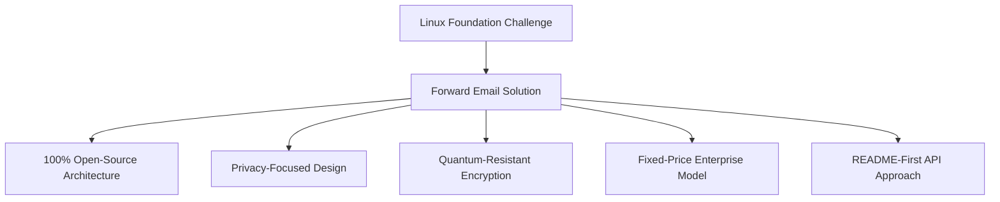
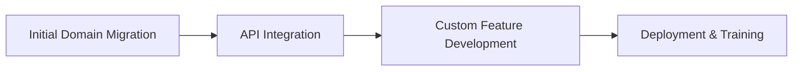

# Caso práctico: Cómo la Fundación Linux optimiza la gestión del correo electrónico en más de 250 dominios con Forward Email {#case-study-how-the-linux-foundation-optimizes-email-management-across-250-domains-with-forward-email}


## Tabla de contenido {#table-of-contents}

* [Introducción](#introduction)
* [El desafío](#the-challenge)
* [La solución](#the-solution)
  * [Arquitectura 100% de código abierto](#100-open-source-architecture)
  * [Diseño centrado en la privacidad](#privacy-focused-design)
  * [Seguridad de nivel empresarial](#enterprise-grade-security)
  * [Modelo de empresa de precio fijo](#fixed-price-enterprise-model)
  * [API fácil de usar para desarrolladores](#developer-friendly-api)
* [Proceso de implementación](#implementation-process)
* [Resultados y beneficios](#results-and-benefits)
  * [Mejoras de eficiencia](#efficiency-improvements)
  * [Gestión de costes](#cost-management)
  * [Seguridad mejorada](#enhanced-security)
  * [Experiencia de usuario mejorada](#improved-user-experience)
* [Conclusión](#conclusion)
* [Referencias](#references)

## Introducción {#introduction}

[Fundación Linux](https://en.wikipedia.org/wiki/Linux_Foundation) gestiona más de 900 proyectos de código abierto en más de 250 dominios, incluyendo [linux.com](https://www.linux.com/) y [jQuery.com](https://jquery.com/). Este caso práctico explora cómo se asociaron con [Reenviar correo electrónico](https://forwardemail.net) para optimizar la gestión del correo electrónico, manteniendo la coherencia con los principios del código abierto.

## El desafío {#the-challenge}

La Fundación Linux enfrentó varios desafíos en la gestión del correo electrónico:

* **Escalabilidad**: Gestión del correo electrónico en más de 250 dominios con diferentes requisitos
* **Carga administrativa**: Configuración de registros DNS, mantenimiento de reglas de reenvío y respuesta a solicitudes de soporte
* **Seguridad**: Protección contra amenazas del correo electrónico, manteniendo la privacidad
* **Costo**: Las soluciones tradicionales por usuario eran prohibitivamente caras a su escala
* **Alineación con el código abierto**: Necesidad de soluciones que coincidan con su compromiso con los valores del código abierto

De manera similar a los desafíos que enfrentó [Canónico/Ubuntu](https://forwardemail.net/blog/docs/canonical-ubuntu-email-enterprise-case-study) con sus múltiples dominios de distribución, la Fundación Linux necesitaba una solución que pudiera manejar diversos proyectos y al mismo tiempo mantener un enfoque de gestión unificado.

## La solución {#the-solution}

Forward Email proporcionó una solución integral con características clave:



### Arquitectura 100% de código abierto {#100-open-source-architecture}

Como único servicio de correo electrónico con una plataforma completamente de código abierto (tanto frontend como backend), Forward Email se alineó perfectamente con el compromiso de la Fundación Linux con los principios de código abierto. Al igual que nuestra implementación con [Canónico/Ubuntu](https://forwardemail.net/blog/docs/canonical-ubuntu-email-enterprise-case-study), esta transparencia permitió a su equipo técnico verificar las implementaciones de seguridad e incluso aportar mejoras.

### Diseño centrado en la privacidad {#privacy-focused-design}

El estricto [políticas de privacidad](https://forwardemail.net/privacy) de Forward Email proporcionó la seguridad requerida por la Fundación Linux. Nuestro [Implementación técnica de protección de la privacidad del correo electrónico](https://forwardemail.net/blog/docs/email-privacy-protection-technical-implementation) garantiza que todas las comunicaciones sean seguras por diseño, sin registro ni escaneo del contenido del correo electrónico.

Como se detalla en nuestra documentación de implementación técnica:

Hemos construido todo nuestro sistema bajo el principio de que sus correos electrónicos le pertenecen a usted y solo a usted. A diferencia de otros proveedores que escanean el contenido de los correos electrónicos para publicidad o entrenamiento de IA, mantenemos una estricta política de no registro ni escaneo que preserva la confidencialidad de todas las comunicaciones.

### Seguridad de nivel empresarial {#enterprise-grade-security}

La implementación de [cifrado resistente a los cuánticos](https://forwardemail.net/blog/docs/best-quantum-safe-encrypted-email-service) con ChaCha20-Poly1305 proporcionó seguridad de vanguardia, ya que cada buzón es un archivo cifrado independiente. Este enfoque garantiza que, incluso si las computadoras cuánticas logran romper los estándares de cifrado actuales, las comunicaciones de la Fundación Linux se mantendrán seguras.

### Modelo empresarial de precio fijo {#fixed-price-enterprise-model}

El [precios empresariales](https://forwardemail.net/pricing) de Forward Email ofrecía un costo mensual fijo, independientemente del dominio o usuario. Este enfoque ha generado ahorros significativos para otras grandes organizaciones, como se demuestra en nuestro [Estudio de caso de correo electrónico de exalumnos universitarios](https://forwardemail.net/blog/docs/alumni-email-forwarding-university-case-study), donde las instituciones ahorraron hasta un 99 % en comparación con las soluciones tradicionales de correo electrónico por usuario.

### API fácil de usar para desarrolladores {#developer-friendly-api}

Siguiendo un [Enfoque README primero](https://tom.preston-werner.com/2010/08/23/readme-driven-development) e inspirado en [Diseño de la API RESTful de Stripe](https://amberonrails.com/building-stripes-api), el [API](https://forwardemail.net/api) de Forward Email permitió una integración profunda con el Centro de Control de Proyectos de Linux Foundation. Esta integración fue crucial para automatizar la gestión del correo electrónico en su diversa cartera de proyectos.

## Proceso de implementación {#implementation-process}

La implementación siguió un enfoque estructurado:



1. **Migración de dominio inicial**: configuración de registros DNS, configuración de SPF/DKIM/DMARC, migración de reglas existentes

   ```sh
   # Example DNS configuration for a Linux Foundation domain
   domain.org.    600    IN    MX    10 mx1.forwardemail.net.
   domain.org.    600    IN    MX    10 mx2.forwardemail.net.
   domain.org.    600    IN    TXT   "v=spf1 include:spf.forwardemail.net -all"
   ```

2. **Integración de API**: Conexión con el Centro de control de proyectos para la gestión de autoservicio

3. **Desarrollo de funciones personalizadas**: gestión de múltiples dominios, informes, políticas de seguridad

Trabajamos en estrecha colaboración con la Fundación Linux para desarrollar funciones (que también son 100% de código abierto para que todos puedan beneficiarse de ellas) específicamente para su entorno multiproyecto, de manera similar a cómo creamos soluciones personalizadas para [sistemas de correo electrónico para exalumnos universitarios](https://forwardemail.net/blog/docs/alumni-email-forwarding-university-case-study).

## Resultados y beneficios {#results-and-benefits}

La implementación generó beneficios significativos:

### Mejoras de eficiencia {#efficiency-improvements}

* Reducción de gastos administrativos
* Incorporación más rápida al proyecto (de días a minutos)
* Gestión optimizada de más de 250 dominios desde una única interfaz

### Gestión de costos {#cost-management}

* Precios fijos independientemente del crecimiento de dominios o usuarios
* Eliminación de las tarifas de licencia por usuario
* Similar a nuestro [estudio de caso universitario](https://forwardemail.net/blog/docs/alumni-email-forwarding-university-case-study), la Fundación Linux logró ahorros sustanciales en costos en comparación con las soluciones tradicionales

### Seguridad mejorada {#enhanced-security}

* Cifrado resistente a la tecnología cuántica en todos los dominios
* Autenticación integral de correo electrónico que previene la suplantación de identidad y el phishing
* Pruebas y prácticas de seguridad a través de [características de seguridad](https://forwardemail.net/security)
* Protección de la privacidad a través de nuestro [implementación técnica](https://forwardemail.net/blog/docs/email-privacy-protection-technical-implementation)

### Experiencia de usuario mejorada {#improved-user-experience}

* Gestión de correo electrónico de autoservicio para administradores de proyectos
* Experiencia consistente en todos los dominios de Linux Foundation
* Entrega de correo electrónico confiable con autenticación robusta

## Conclusión {#conclusion}

La colaboración de la Fundación Linux con Forward Email demuestra cómo las organizaciones pueden abordar los complejos desafíos de la gestión del correo electrónico sin perder coherencia con sus valores fundamentales. Al seleccionar una solución que prioriza los principios de código abierto, la privacidad y la seguridad, la Fundación Linux ha transformado la gestión del correo electrónico de una carga administrativa a una ventaja estratégica.

Como se ve en nuestro trabajo con [Canónico/Ubuntu](https://forwardemail.net/blog/docs/canonical-ubuntu-email-enterprise-case-study) y [universidades importantes](https://forwardemail.net/blog/docs/alumni-email-forwarding-university-case-study), las organizaciones con carteras de dominios complejos pueden lograr mejoras significativas en eficiencia, seguridad y gestión de costos a través de la solución empresarial de Forward Email.

Para obtener más información sobre cómo Forward Email puede ayudar a su organización a administrar el correo electrónico en múltiples dominios, visite [forwardemail.net](https://forwardemail.net) o explore nuestros [documentación](https://forwardemail.net/email-api) y [guías](https://forwardemail.net/guides) detallados.

## Referencias {#references}

* Fundación Linux. (2025). "Explorar proyectos". Recuperado de <https://www.linuxfoundation.org/projects>
* Wikipedia. (2025). "Fundación Linux". Recuperado de <https://en.wikipedia.org/wiki/Linux_Foundation>