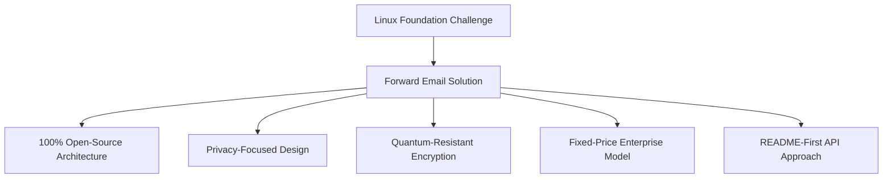
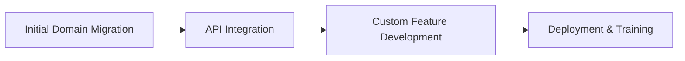

# Estudio de Caso: Cómo la Linux Foundation Optimiza la Gestión de Correo Electrónico en Más de 250 Dominios con Forward Email {#case-study-how-the-linux-foundation-optimizes-email-management-across-250-domains-with-forward-email}


## Tabla de Contenidos {#table-of-contents}

* [Introducción](#introduction)
* [El Desafío](#the-challenge)
* [La Solución](#the-solution)
  * [Arquitectura 100% de Código Abierto](#100-open-source-architecture)
  * [Diseño Enfocado en la Privacidad](#privacy-focused-design)
  * [Seguridad de Nivel Empresarial](#enterprise-grade-security)
  * [Modelo Empresarial de Precio Fijo](#fixed-price-enterprise-model)
  * [API Amigable para Desarrolladores](#developer-friendly-api)
* [Proceso de Implementación](#implementation-process)
* [Resultados y Beneficios](#results-and-benefits)
  * [Mejoras en la Eficiencia](#efficiency-improvements)
  * [Gestión de Costos](#cost-management)
  * [Seguridad Mejorada](#enhanced-security)
  * [Mejora en la Experiencia del Usuario](#improved-user-experience)
* [Conclusión](#conclusion)
* [Referencias](#references)


## Introducción {#introduction}

La [Linux Foundation](https://en.wikipedia.org/wiki/Linux_Foundation) gestiona más de 900 proyectos de código abierto en más de 250 dominios, incluyendo [linux.com](https://www.linux.com/) y [jQuery.com](https://jquery.com/). Este estudio de caso explora cómo se asociaron con [Forward Email](https://forwardemail.net) para optimizar la gestión del correo electrónico mientras mantenían la alineación con los principios de código abierto.


## El Desafío {#the-challenge}

La Linux Foundation enfrentó varios desafíos en la gestión del correo electrónico:

* **Escala**: Gestionar correo electrónico en más de 250 dominios con diferentes requisitos
* **Carga Administrativa**: Configurar registros DNS, mantener reglas de reenvío y responder a solicitudes de soporte
* **Seguridad**: Protegerse contra amenazas basadas en correo electrónico mientras se mantiene la privacidad
* **Costo**: Las soluciones tradicionales por usuario eran prohibitivamente caras a su escala
* **Alineación con Código Abierto**: Necesidad de soluciones que coincidan con su compromiso con los valores de código abierto

Similar a los desafíos enfrentados por [Canonical/Ubuntu](https://forwardemail.net/blog/docs/canonical-ubuntu-email-enterprise-case-study) con sus múltiples dominios de distribución, la Linux Foundation necesitaba una solución que pudiera manejar proyectos diversos mientras mantenía un enfoque de gestión unificado.


## La Solución {#the-solution}

Forward Email proporcionó una solución integral con características clave:


```mermaid
graph TD
    A[Linux Foundation Challenge] --> B[Forward Email Solution]
    B --> C[100% Open-Source Architecture]
    B --> D[Privacy-Focused Design]
    B --> E[Quantum-Resistant Encryption]
    B --> F[Fixed-Price Enterprise Model]
    B --> G[README-First API Approach]
```

### Arquitectura 100% de Código Abierto {#100-open-source-architecture}

Como el único servicio de correo electrónico con una plataforma completamente de código abierto (tanto frontend como backend), Forward Email se alineó perfectamente con el compromiso de la Linux Foundation con los principios de código abierto. Similar a nuestra implementación con [Canonical/Ubuntu](https://forwardemail.net/blog/docs/canonical-ubuntu-email-enterprise-case-study), esta transparencia permitió a su equipo técnico verificar las implementaciones de seguridad e incluso contribuir con mejoras.

### Diseño Enfocado en la Privacidad {#privacy-focused-design}

Las estrictas [políticas de privacidad](https://forwardemail.net/privacy) de Forward Email proporcionaron la seguridad que la Linux Foundation requería. Nuestra [implementación técnica de protección de privacidad en el correo electrónico](https://forwardemail.net/blog/docs/email-privacy-protection-technical-implementation) asegura que todas las comunicaciones permanezcan seguras por diseño, sin registro ni escaneo del contenido del correo electrónico.

Como se detalla en nuestra documentación de implementación técnica:

> "Hemos construido todo nuestro sistema alrededor del principio de que tus correos electrónicos te pertenecen a ti y solo a ti. A diferencia de otros proveedores que escanean el contenido del correo para publicidad o entrenamiento de IA, mantenemos una estricta política de no registro y no escaneo que preserva la confidencialidad de todas las comunicaciones."
### Seguridad de Nivel Empresarial {#enterprise-grade-security}

La implementación de [cifrado resistente a la computación cuántica](https://forwardemail.net/blog/docs/best-quantum-safe-encrypted-email-service) utilizando ChaCha20-Poly1305 proporcionó una seguridad de vanguardia, con cada buzón siendo un archivo cifrado separado. Este enfoque garantiza que incluso si las computadoras cuánticas llegan a ser capaces de romper los estándares de cifrado actuales, las comunicaciones de la Linux Foundation permanecerán seguras.

### Modelo Empresarial de Precio Fijo {#fixed-price-enterprise-model}

La [tarificación empresarial](https://forwardemail.net/pricing) de Forward Email ofreció un costo mensual fijo independientemente de los dominios o usuarios. Este enfoque ha generado ahorros significativos para otras grandes organizaciones, como se demuestra en nuestro [estudio de caso sobre reenvío de correo electrónico para exalumnos universitarios](https://forwardemail.net/blog/docs/alumni-email-forwarding-university-case-study), donde las instituciones ahorraron hasta un 99% en comparación con soluciones tradicionales de correo por usuario.

### API Amigable para Desarrolladores {#developer-friendly-api}

Siguiendo un [enfoque README-first](https://tom.preston-werner.com/2010/08/23/readme-driven-development) e inspirado en el [diseño RESTful API de Stripe](https://amberonrails.com/building-stripes-api), la [API](https://forwardemail.net/api) de Forward Email permitió una integración profunda con el Centro de Control de Proyectos de la Linux Foundation. Esta integración fue crucial para automatizar la gestión de correo electrónico en su diversa cartera de proyectos.


## Proceso de Implementación {#implementation-process}

La implementación siguió un enfoque estructurado:


```mermaid
flowchart LR
    A[Initial Domain Migration] --> B[API Integration]
    B --> C[Custom Feature Development]
    C --> D[Deployment & Training]
```

1. **Migración Inicial de Dominios**: Configuración de registros DNS, configuración de SPF/DKIM/DMARC, migración de reglas existentes

   ```sh
   # Ejemplo de configuración DNS para un dominio de la Linux Foundation
   domain.org.    600    IN    MX    10 mx1.forwardemail.net.
   domain.org.    600    IN    MX    10 mx2.forwardemail.net.
   domain.org.    600    IN    TXT   "v=spf1 include:spf.forwardemail.net -all"
   ```

2. **Integración de API**: Conexión con el Centro de Control de Proyectos para gestión de autoservicio

3. **Desarrollo de Funcionalidades Personalizadas**: Gestión multi-dominio, reportes, políticas de seguridad

   Trabajamos estrechamente con la Linux Foundation para desarrollar funcionalidades (que también son 100% de código abierto para que todos puedan beneficiarse) específicamente para su entorno multi-proyecto, similar a cómo creamos soluciones personalizadas para [sistemas de correo electrónico para exalumnos universitarios](https://forwardemail.net/blog/docs/alumni-email-forwarding-university-case-study).


## Resultados y Beneficios {#results-and-benefits}

La implementación entregó beneficios significativos:

### Mejoras en la Eficiencia {#efficiency-improvements}

* Reducción de la carga administrativa
* Incorporación de proyectos más rápida (de días a minutos)
* Gestión simplificada de más de 250 dominios desde una única interfaz

### Gestión de Costos {#cost-management}

* Precio fijo independientemente del crecimiento en dominios o usuarios
* Eliminación de tarifas de licencia por usuario
* Similar a nuestro [estudio de caso universitario](https://forwardemail.net/blog/docs/alumni-email-forwarding-university-case-study), la Linux Foundation logró ahorros sustanciales en comparación con soluciones tradicionales

### Seguridad Mejorada {#enhanced-security}

* Cifrado resistente a la computación cuántica en todos los dominios
* Autenticación completa de correo electrónico que previene suplantación y phishing
* Pruebas y prácticas de seguridad a través de [funcionalidades de seguridad](https://forwardemail.net/security)
* Protección de privacidad mediante nuestra [implementación técnica](https://forwardemail.net/blog/docs/email-privacy-protection-technical-implementation)

### Mejor Experiencia de Usuario {#improved-user-experience}

* Gestión de correo electrónico de autoservicio para administradores de proyectos
* Experiencia consistente en todos los dominios de la Linux Foundation
* Entrega confiable de correo con autenticación robusta


## Conclusión {#conclusion}

La asociación de la Linux Foundation con Forward Email demuestra cómo las organizaciones pueden abordar desafíos complejos en la gestión de correo electrónico mientras mantienen la alineación con sus valores fundamentales. Al seleccionar una solución que prioriza los principios de código abierto, privacidad y seguridad, la Linux Foundation ha transformado la gestión del correo electrónico de una carga administrativa a una ventaja estratégica.
Como se observa en nuestro trabajo con [Canonical/Ubuntu](https://forwardemail.net/blog/docs/canonical-ubuntu-email-enterprise-case-study) y [universidades importantes](https://forwardemail.net/blog/docs/alumni-email-forwarding-university-case-study), las organizaciones con carteras de dominios complejas pueden lograr mejoras significativas en eficiencia, seguridad y gestión de costos mediante la solución empresarial de Forward Email.

Para más información sobre cómo Forward Email puede ayudar a su organización a gestionar el correo electrónico en múltiples dominios, visite [forwardemail.net](https://forwardemail.net) o explore nuestra detallada [documentación](https://forwardemail.net/email-api) y [guías](https://forwardemail.net/guides).


## Referencias {#references}

* Linux Foundation. (2025). "Browse Projects." Recuperado de <https://www.linuxfoundation.org/projects>
* Wikipedia. (2025). "Linux Foundation." Recuperado de <https://en.wikipedia.org/wiki/Linux_Foundation>
