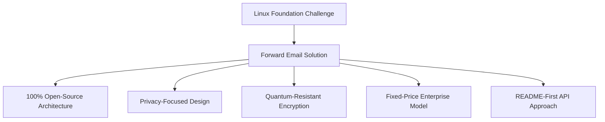
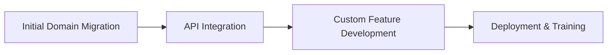

# Case-tutkimus: Miten Linux Foundation optimoi sähköpostien hallinnan yli 250 verkkotunnuksessa sähköpostin edelleenlähetyksen avulla {#case-study-how-the-linux-foundation-optimizes-email-management-across-250-domains-with-forward-email}


## Sisällysluettelo {#table-of-contents}

* [Johdanto](#introduction)
* [Haaste](#the-challenge)
* [Ratkaisu](#the-solution)
  * [100 % avoimen lähdekoodin arkkitehtuuri](#100-open-source-architecture)
  * [Yksityisyyteen keskittyvä suunnittelu](#privacy-focused-design)
  * [Yritystason tietoturva](#enterprise-grade-security)
  * [Kiinteähintainen yritysmalli](#fixed-price-enterprise-model)
  * [Kehittäjäystävällinen API](#developer-friendly-api)
* [Toteutusprosessi](#implementation-process)
* [Tulokset ja hyödyt](#results-and-benefits)
  * [Tehokkuuden parannukset](#efficiency-improvements)
  * [Kustannusten hallinta](#cost-management)
  * [Parannettu turvallisuus](#enhanced-security)
  * [Parannettu käyttökokemus](#improved-user-experience)
* [Johtopäätös](#conclusion)
* [Viitteet](#references)

## Johdanto {#introduction}

[Linux-säätiö](https://en.wikipedia.org/wiki/Linux_Foundation) hallinnoi yli 900 avoimen lähdekoodin projektia yli 250 verkkotunnuksella, mukaan lukien [linux.com](https://www.linux.com/) ja [jQuery.com](https://jquery.com/). Tässä tapaustutkimuksessa tarkastellaan, miten he tekivät yhteistyötä [Lähetä sähköpostia eteenpäin](https://forwardemail.net):n kanssa sähköpostin hallinnan virtaviivaistamiseksi samalla, kun ne noudattavat avoimen lähdekoodin periaatteita.

## Haaste {#the-challenge}

Linux Foundation kohtasi useita sähköpostin hallintaan liittyviä haasteita:

* **Skaala**: Sähköpostin hallinta yli 250 eri verkkotunnuksella, joilla on erilaiset vaatimukset
* **Hallinnollinen taakka**: DNS-tietueiden konfigurointi, edelleenlähetyssääntöjen ylläpito ja tukipyyntöihin vastaaminen
* **Turvallisuus**: Sähköpostipohjaisten uhkien torjunta yksityisyyttä säilyttäen
* **Kustannukset**: Perinteiset käyttäjäkohtaiset ratkaisut olivat kohtuuttoman kalliita kokoluokassaan
* **Avoimen lähdekoodin mukaisuus**: Tarve ratkaisuille, jotka vastaavat heidän sitoutumistaan avoimen lähdekoodin arvoihin

Samoin kuin [Kanoninen/Ubuntu](https://forwardemail.net/blog/docs/canonical-ubuntu-email-enterprise-case-study) kohtasi haasteita useiden jakelualueidensa kanssa, Linux Foundation tarvitsi ratkaisun, joka pystyisi käsittelemään erilaisia projekteja säilyttäen samalla yhtenäisen hallintatavan.

## Ratkaisu {#the-solution}

Forward Email tarjosi kattavan ratkaisun, jonka tärkeimmät ominaisuudet:



### 100 % avoimen lähdekoodin arkkitehtuuri {#100-open-source-architecture}

Ainoana sähköpostipalveluna, jolla on täysin avoimen lähdekoodin alusta (sekä käyttöliittymä että taustajärjestelmä), Forward Email sopi täydellisesti Linux Foundationin sitoutumiseen avoimen lähdekoodin periaatteisiin. Samoin kuin [Kanoninen/Ubuntu](https://forwardemail.net/blog/docs/canonical-ubuntu-email-enterprise-case-study)-toteutuksellamme, tämä läpinäkyvyys mahdollisti heidän tekniselle tiimilleen tietoturvan toteutusten tarkistamisen ja jopa parannusten tekemisen.

### Tietosuojaa kunnioittava suunnittelu {#privacy-focused-design}

Forward Emailin tiukka [tietosuojakäytännöt](https://forwardemail.net/privacy) tarjosi Linux Foundationin vaatiman suojauksen. [sähköpostin yksityisyyden suojauksen tekninen toteutus](https://forwardemail.net/blog/docs/email-privacy-protection-technical-implementation)-ominaisuuden ansiosta kaikki viestintä pysyy suojattuna rakenteensa ansiosta ilman sähköpostin sisällön lokikirjausta tai skannausta.

Kuten teknisessä toteutusdokumentaatiossamme on yksityiskohtaisesti kuvattu:

> "Olemme rakentaneet koko järjestelmämme periaatteelle, että sähköpostisi kuuluvat sinulle ja vain sinulle. Toisin kuin muut palveluntarjoajat, jotka skannaavat sähköpostisisältöä mainosten tai tekoälykoulutuksen varalta, meillä on tiukka lokien ja skannauksen kieltokäytäntö, joka säilyttää kaiken viestinnän luottamuksellisuuden."

### Yritystason suojaus {#enterprise-grade-security}

[kvanttiresistentti salaus](https://forwardemail.net/blog/docs/best-quantum-safe-encrypted-email-service):n toteutus ChaCha20-Poly1305:llä tarjosi huippuluokan tietoturvan, jossa jokainen postilaatikko oli erillinen salattu tiedosto. Tämä lähestymistapa varmistaa, että vaikka kvanttitietokoneet pystyisivät rikkomaan nykyisiä salausstandardeja, Linux Foundationin tietoliikenne pysyy turvallisena.

### Kiinteähintainen yritysmalli {#fixed-price-enterprise-model}

Forward Emailin [yrityshinnoittelu](https://forwardemail.net/pricing) tarjosi kiinteän kuukausimaksun verkkotunnuksista tai käyttäjistä riippumatta. Tämä lähestymistapa on tuottanut merkittäviä kustannussäästöjä muille suurille organisaatioille, kuten [yliopiston alumnien sähköpostitapaustutkimus](https://forwardemail.net/blog/docs/alumni-email-forwarding-university-case-study)-ratkaisumme osoittaa, jossa organisaatiot säästivät jopa 99 % perinteisiin käyttäjäkohtaisiin sähköpostiratkaisuihin verrattuna.

### Kehittäjäystävällinen API {#developer-friendly-api}

[README-ensin-lähestymistapa](https://tom.preston-werner.com/2010/08/23/readme-driven-development)-mallin mukaisesti ja [Stripen RESTful-rajapinnan suunnittelu](https://amberonrails.com/building-stripes-api):n inspiroimana Forward Emailin [API](https://forwardemail.net/api) mahdollisti syvän integraation Linux Foundationin projektinhallintakeskukseen. Tämä integraatio oli ratkaisevan tärkeää sähköpostin hallinnan automatisoimiseksi heidän monipuolisessa projektiportfoliossaan.

## Käyttöönottoprosessi {#implementation-process}

Toteutus noudatti strukturoitua lähestymistapaa:



1. **Alkuperäinen verkkotunnuksen siirto**: DNS-tietueiden määrittäminen, SPF/DKIM/DMARC-asetusten määrittäminen, olemassa olevien sääntöjen siirto

   ```sh
   # Example DNS configuration for a Linux Foundation domain
   domain.org.    600    IN    MX    10 mx1.forwardemail.net.
   domain.org.    600    IN    MX    10 mx2.forwardemail.net.
   domain.org.    600    IN    TXT   "v=spf1 include:spf.forwardemail.net -all"
   ```

2. **API-integraatio**: Yhdistäminen Project Control Centeriin itsepalveluhallintaa varten

3. **Mukautettujen ominaisuuksien kehitys**: Usean verkkotunnuksen hallinta, raportointi, suojauskäytännöt

Teimme tiivistä yhteistyötä Linux Foundationin kanssa kehittääksemme ominaisuuksia (jotka ovat myös 100 % avoimen lähdekoodin tuotteita, jotta kaikki voivat hyötyä niistä) erityisesti heidän moniprojektiympäristöönsä, samalla tavalla kuin loimme räätälöityjä ratkaisuja [yliopiston alumnien sähköpostijärjestelmät](https://forwardemail.net/blog/docs/alumni-email-forwarding-university-case-study):lle.

## Tulokset ja hyödyt {#results-and-benefits}

Käyttöönotto toi merkittäviä etuja:

### Tehokkuuden parannukset {#efficiency-improvements}

* Vähemmän hallinnollisia kuluja
* Nopeampi projektien käyttöönotto (päivistä minuutteihin)
* Virtaviivaistettu kaikkien yli 250 verkkotunnuksen hallinta yhdestä käyttöliittymästä

### Kustannusten hallinta {#cost-management}

* Kiinteä hinnoittelu riippumatta verkkotunnusten tai käyttäjien määrän kasvusta
* Käyttäjäkohtaisten lisenssimaksujen poistaminen
* [yliopiston tapaustutkimus](https://forwardemail.net/blog/docs/alumni-email-forwarding-university-case-study):n tavoin Linux Foundation saavutti huomattavia kustannussäästöjä perinteisiin ratkaisuihin verrattuna

### Parannettu suojaus {#enhanced-security}

* Kvanttisuojattu salaus kaikilla verkkotunnuksilla
* Kattava sähköpostin todennus, joka estää huijaukset ja tietojenkalastelun
* Tietoturvatestaus ja -käytännöt [turvaominaisuudet](https://forwardemail.net/security):n kautta
* Yksityisyyden suojaus [tekninen toteutus](https://forwardemail.net/blog/docs/email-privacy-protection-technical-implementation):n kautta

### Parannettu käyttökokemus {#improved-user-experience}

* Itsepalvelu sähköpostinhallinta projektin ylläpitäjille
* Yhtenäinen kokemus kaikilla Linux Foundation -verkkotunnuksilla
* Luotettava sähköpostin toimitus vankalla todennuksella

## Johtopäätös {#conclusion}

Linux Foundationin kumppanuus Forward Emailin kanssa osoittaa, kuinka organisaatiot voivat ratkaista monimutkaisia sähköpostinhallinnan haasteita ja samalla säilyttää linjansa ydinarvojensa kanssa. Valitsemalla ratkaisun, joka asettaa etusijalle avoimen lähdekoodin periaatteet, yksityisyyden ja turvallisuuden, Linux Foundation on muuttanut sähköpostinhallinnan hallinnollisesta taakasta strategiseksi eduksi.

Kuten työmme sekä [Kanoninen/Ubuntu](https://forwardemail.net/blog/docs/canonical-ubuntu-email-enterprise-case-study):n että [suuret yliopistot](https://forwardemail.net/blog/docs/alumni-email-forwarding-university-case-study):n kanssa osoitti, organisaatiot, joilla on monimutkaisia verkkotunnusportfolioita, voivat saavuttaa merkittäviä parannuksia tehokkuudessa, tietoturvassa ja kustannusten hallinnassa Forward Emailin yritysratkaisun avulla.

Lisätietoja siitä, miten sähköpostin edelleenlähetys voi auttaa organisaatiotasi hallitsemaan sähköpostia useilla verkkotunnuksilla, saat osoitteesta [forwardemail.net](https://forwardemail.net) tai tutustumalla yksityiskohtaisiin [dokumentaatio](https://forwardemail.net/email-api)- ja [oppaat](https://forwardemail.net/guides)-sivuihimme.

## Viitteet {#references}

* Linux Foundation. (2025). "Selaa projekteja." Haettu osoitteesta <https://www.linuxfoundation.org/projects>
* Wikipedia. (2025). "Linux Foundation." Haettu osoitteesta <https://en.wikipedia.org/wiki/Linux_Foundation>