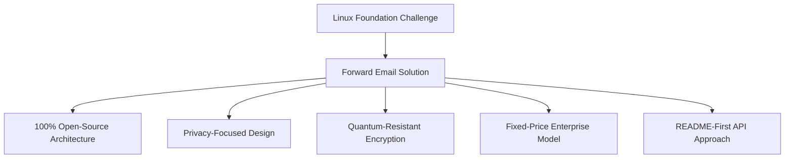
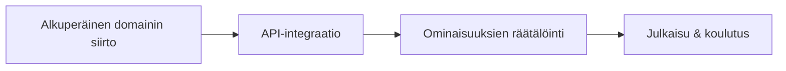

# Case Study: Kuinka Linux Foundation Optimoi Sähköpostinhallinnan Yli 250 Verkkotunnuksessa Forward Emailin Avulla {#case-study-how-the-linux-foundation-optimizes-email-management-across-250-domains-with-forward-email}


## Sisällysluettelo {#table-of-contents}

* [Johdanto](#introduction)
* [Haaste](#the-challenge)
* [Ratkaisu](#the-solution)
  * [100 % Avoimen Lähdekoodin Arkkitehtuuri](#100-open-source-architecture)
  * [Yksityisyyteen Keskittyvä Suunnittelu](#privacy-focused-design)
  * [Yritystason Turvallisuus](#enterprise-grade-security)
  * [Kiinteähintainen Yritysmalli](#fixed-price-enterprise-model)
  * [Kehittäjäystävällinen API](#developer-friendly-api)
* [Toteutusprosessi](#implementation-process)
* [Tulokset ja Hyödyt](#results-and-benefits)
  * [Tehokkuuden Parannukset](#efficiency-improvements)
  * [Kustannusten Hallinta](#cost-management)
  * [Parannettu Turvallisuus](#enhanced-security)
  * [Parannettu Käyttäjäkokemus](#improved-user-experience)
* [Yhteenveto](#conclusion)
* [Lähteet](#references)


## Johdanto {#introduction}

[Linux Foundation](https://en.wikipedia.org/wiki/Linux_Foundation) hallinnoi yli 900 avoimen lähdekoodin projektia yli 250 verkkotunnuksessa, mukaan lukien [linux.com](https://www.linux.com/) ja [jQuery.com](https://jquery.com/). Tässä tapaustutkimuksessa tarkastellaan, miten he tekivät yhteistyötä [Forward Emailin](https://forwardemail.net) kanssa sähköpostinhallinnan virtaviivaistamiseksi samalla kun säilyttivät avoimen lähdekoodin periaatteiden mukaisuuden.


## Haaste {#the-challenge}

Linux Foundation kohtasi useita sähköpostinhallinnan haasteita:

* **Laajuus**: Sähköpostin hallinta yli 250 verkkotunnuksessa, joissa on erilaiset vaatimukset
* **Hallinnollinen Kuorma**: DNS-tietueiden konfigurointi, edelleenlähetyssääntöjen ylläpito ja tukipyyntöihin vastaaminen
* **Turvallisuus**: Suojaus sähköpostipohjaisia uhkia vastaan samalla kun yksityisyys säilyy
* **Kustannukset**: Perinteiset käyttäjäkohtaiset ratkaisut olivat heidän mittakaavassaan kohtuuttoman kalliita
* **Avoimen Lähdekoodin Mukaisuus**: Tarve ratkaisuille, jotka vastaavat heidän sitoutumistaan avoimen lähdekoodin arvoihin

Samankaltaisesti kuin [Canonical/Ubuntu](https://forwardemail.net/blog/docs/canonical-ubuntu-email-enterprise-case-study) kohtasi haasteita monien jakelutunnusten kanssa, Linux Foundation tarvitsi ratkaisun, joka pystyy käsittelemään monipuolisia projekteja säilyttäen yhtenäisen hallintatavan.


## Ratkaisu {#the-solution}

Forward Email tarjosi kattavan ratkaisun keskeisillä ominaisuuksilla:


```mermaid
graph TD
    A[Linux Foundation Challenge] --> B[Forward Email Solution]
    B --> C[100% Open-Source Architecture]
    B --> D[Privacy-Focused Design]
    B --> E[Quantum-Resistant Encryption]
    B --> F[Fixed-Price Enterprise Model]
    B --> G[README-First API Approach]
```

### 100 % Avoimen Lähdekoodin Arkkitehtuuri {#100-open-source-architecture}

Ainoana sähköpostipalveluna, jolla on täysin avoimen lähdekoodin alusta (sekä frontend että backend), Forward Email sopi täydellisesti Linux Foundationin sitoutumiseen avoimen lähdekoodin periaatteisiin. Samoin kuin toteutuksemme [Canonical/Ubuntu](https://forwardemail.net/blog/docs/canonical-ubuntu-email-enterprise-case-study) kanssa, tämä läpinäkyvyys mahdollisti heidän teknisen tiiminsä varmistaa turvallisuusratkaisut ja jopa osallistua parannuksiin.

### Yksityisyyteen Keskittyvä Suunnittelu {#privacy-focused-design}

Forward Emailin tiukat [yksityisyyskäytännöt](https://forwardemail.net/privacy) tarjosivat Linux Foundationille vaaditun turvallisuuden. Meidän [sähköpostin yksityisyyden suojauksen tekninen toteutus](https://forwardemail.net/blog/docs/email-privacy-protection-technical-implementation) varmistaa, että kaikki viestintä pysyy suunnittelultaan turvallisena, ilman sähköpostisisällön lokitusta tai skannausta.

Kuten teknisessä toteutusdokumentaatiossamme on kuvattu:

> "Olemme rakentaneet koko järjestelmämme periaatteen ympärille, että sähköpostisi kuuluvat sinulle ja vain sinulle. Toisin kuin muut palveluntarjoajat, jotka skannaavat sähköpostisisältöä mainontaa tai tekoälyn koulutusta varten, me ylläpidämme tiukkaa ei-lokitusta, ei-skannausta -käytäntöä, joka säilyttää kaiken viestinnän luottamuksellisuuden."
### Yritystason turvallisuus {#enterprise-grade-security}

[Kvantiresistentin salauksen](https://forwardemail.net/blog/docs/best-quantum-safe-encrypted-email-service) toteutus ChaCha20-Poly1305 -algoritmilla tarjosi huipputason turvallisuuden, jossa jokainen postilaatikko oli erillinen salattu tiedosto. Tämä lähestymistapa varmistaa, että vaikka kvanttitietokoneet pystyisivät murtamaan nykyiset salausstandardit, Linux Foundationin viestintä pysyy turvattuna.

### Kiinteähintainen yritysmalli {#fixed-price-enterprise-model}

Forward Emailin [yrityshinnasto](https://forwardemail.net/pricing) tarjosi kiinteän kuukausihinnan riippumatta domaineista tai käyttäjistä. Tämä lähestymistapa on tuonut merkittäviä kustannussäästöjä muille suurille organisaatioille, kuten osoitetaan [yliopiston alumnisähköpostin tapaustutkimuksessa](https://forwardemail.net/blog/docs/alumni-email-forwarding-university-case-study), jossa laitokset säästivät jopa 99 % verrattuna perinteisiin käyttäjäkohtaisiin sähköpostiratkaisuihin.

### Kehittäjäystävällinen API {#developer-friendly-api}

Seuraamalla [README-ensimmäistä lähestymistapaa](https://tom.preston-werner.com/2010/08/23/readme-driven-development) ja saaden inspiraatiota [Stripen RESTful API -suunnittelusta](https://amberonrails.com/building-stripes-api), Forward Emailin [API](https://forwardemail.net/api) mahdollisti syvän integraation Linux Foundationin Project Control Centeriin. Tämä integraatio oli ratkaisevan tärkeä sähköpostinhallinnan automatisoinnissa heidän monipuolisessa projektisalkussaan.

## Toteutusprosessi {#implementation-process}

Toteutus eteni rakenteellisesti:


```mermaid
flowchart LR
    A[Alkuperäinen domainin siirto] --> B[API-integraatio]
    B --> C[Ominaisuuksien räätälöinti]
    C --> D[Julkaisu & koulutus]
```

1. **Alkuperäinen domainin siirto**: DNS-tietueiden konfigurointi, SPF/DKIM/DMARC:n asennus, olemassa olevien sääntöjen siirto

   ```sh
   # Esimerkki DNS-konfiguraatiosta Linux Foundationin domainille
   domain.org.    600    IN    MX    10 mx1.forwardemail.net.
   domain.org.    600    IN    MX    10 mx2.forwardemail.net.
   domain.org.    600    IN    TXT   "v=spf1 include:spf.forwardemail.net -all"
   ```

2. **API-integraatio**: Yhdistäminen Project Control Centeriin itsepalveluhallintaa varten

3. **Ominaisuuksien räätälöinti**: Monidomain-hallinta, raportointi, turvallisuuspolitiikat

   Teimme tiivistä yhteistyötä Linux Foundationin kanssa kehittääksemme ominaisuuksia (jotka ovat myös 100 % avoimen lähdekoodin, jotta kaikki voivat hyötyä niistä) erityisesti heidän moniprojektisympäristöönsä, samalla tavalla kuin loimme räätälöityjä ratkaisuja [yliopiston alumnisähköpostijärjestelmille](https://forwardemail.net/blog/docs/alumni-email-forwarding-university-case-study).

## Tulokset ja hyödyt {#results-and-benefits}

Toteutus toi merkittäviä hyötyjä:

### Tehokkuuden parannukset {#efficiency-improvements}

* Hallinnollisen taakan vähentyminen
* Nopeampi projektien käyttöönotto (päivistä minuutteihin)
* Yli 250 domainin hallinta yhdestä käyttöliittymästä

### Kustannusten hallinta {#cost-management}

* Kiinteä hinnoittelu riippumatta domainien tai käyttäjien kasvusta
* Käyttäjäkohtaisista lisenssimaksuista luopuminen
* Samoin kuin [yliopiston tapaustutkimuksessa](https://forwardemail.net/blog/docs/alumni-email-forwarding-university-case-study), Linux Foundation saavutti merkittäviä kustannussäästöjä verrattuna perinteisiin ratkaisuihin

### Parannettu turvallisuus {#enhanced-security}

* Kvantiresistentti salaus kaikissa domaineissa
* Kattava sähköpostin todennus, joka estää väärentämisen ja kalastelun
* Turvallisuustestaus ja käytännöt [turvaominaisuuksien](https://forwardemail.net/security) kautta
* Yksityisyyden suoja teknisen toteutuksemme avulla [täällä](https://forwardemail.net/blog/docs/email-privacy-protection-technical-implementation)

### Parannettu käyttäjäkokemus {#improved-user-experience}

* Itsepalvelusähköpostinhallinta projektin ylläpitäjille
* Johdonmukainen käyttökokemus kaikissa Linux Foundationin domaineissa
* Luotettava sähköpostin toimitus vahvalla todennuksella

## Yhteenveto {#conclusion}

Linux Foundationin kumppanuus Forward Emailin kanssa osoittaa, kuinka organisaatiot voivat ratkaista monimutkaisia sähköpostinhallinnan haasteita samalla kun ne säilyttävät ydinarvonsa. Valitsemalla ratkaisun, joka priorisoi avoimen lähdekoodin periaatteet, yksityisyyden ja turvallisuuden, Linux Foundation on muuttanut sähköpostinhallinnan hallinnollisesta taakasta strategiseksi eduksi.
Kuten olemme havainneet työskennellessämme sekä [Canonical/Ubuntu](https://forwardemail.net/blog/docs/canonical-ubuntu-email-enterprise-case-study) että [suurten yliopistojen](https://forwardemail.net/blog/docs/alumni-email-forwarding-university-case-study) kanssa, monimutkaisia verkkotunnusportfolioita hallinnoivat organisaatiot voivat saavuttaa merkittäviä parannuksia tehokkuudessa, turvallisuudessa ja kustannusten hallinnassa Forward Emailin yritysratkaisun avulla.

Lisätietoja siitä, miten Forward Email voi auttaa organisaatiotasi hallitsemaan sähköpostia useiden verkkotunnusten välillä, löydät osoitteesta [forwardemail.net](https://forwardemail.net) tai tutustu yksityiskohtaiseen [dokumentaatioomme](https://forwardemail.net/email-api) ja [oppaisiimme](https://forwardemail.net/guides).


## Viitteet {#references}

* Linux Foundation. (2025). "Browse Projects." Haettu osoitteesta <https://www.linuxfoundation.org/projects>
* Wikipedia. (2025). "Linux Foundation." Haettu osoitteesta <https://en.wikipedia.org/wiki/Linux_Foundation>
