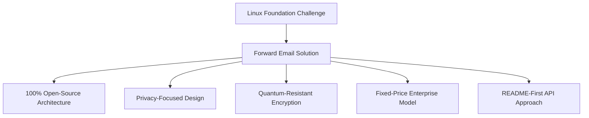
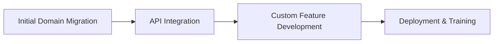

# Étude de cas : Comment la Fondation Linux optimise la gestion des e-mails sur plus de 250 domaines grâce au transfert d'e-mails {#case-study-how-the-linux-foundation-optimizes-email-management-across-250-domains-with-forward-email}


## Table des matières {#table-of-contents}

* [Introduction](#introduction)
* [Le défi](#the-challenge)
* [La solution](#the-solution)
  * [Architecture 100% Open Source](#100-open-source-architecture)
  * [Conception axée sur la confidentialité](#privacy-focused-design)
  * [Sécurité de niveau entreprise](#enterprise-grade-security)
  * [Modèle d'entreprise à prix fixe](#fixed-price-enterprise-model)
  * [API conviviale pour les développeurs](#developer-friendly-api)
* [Processus de mise en œuvre](#implementation-process)
* [Résultats et avantages](#results-and-benefits)
  * [Améliorations de l'efficacité](#efficiency-improvements)
  * [Gestion des coûts](#cost-management)
  * [Sécurité renforcée](#enhanced-security)
  * [Expérience utilisateur améliorée](#improved-user-experience)
* [Conclusion](#conclusion)
* [Références](#references)

## Présentation {#introduction}

[Fondation Linux](https://en.wikipedia.org/wiki/Linux_Foundation) gère plus de 900 projets open source dans plus de 250 domaines, dont [linux.com](https://www.linux.com/) et [jQuery.com](https://jquery.com/). Cette étude de cas explore comment ils ont collaboré avec [Transférer un e-mail](https://forwardemail.net) pour rationaliser la gestion des e-mails tout en respectant les principes open source.

## Le défi {#the-challenge}

La Fondation Linux a été confrontée à plusieurs défis en matière de gestion des e-mails :

* **Échelle** : Gestion des e-mails sur plus de 250 domaines avec des exigences différentes
* **Charge administrative** : Configuration des enregistrements DNS, gestion des règles de transfert et réponse aux demandes d'assistance
* **Sécurité** : Protection contre les menaces par e-mail tout en préservant la confidentialité
* **Coût** : Les solutions traditionnelles par utilisateur étaient excessivement coûteuses à cette échelle
* **Alignement avec l'open source** : Besoin de solutions conformes à l'engagement envers les valeurs de l'open source

Semblable aux défis rencontrés par [Canonical/Ubuntu](https://forwardemail.net/blog/docs/canonical-ubuntu-email-enterprise-case-study) avec ses multiples domaines de distribution, la Linux Foundation avait besoin d'une solution capable de gérer divers projets tout en maintenant une approche de gestion unifiée.

## La solution {#the-solution}

Forward Email a fourni une solution complète avec des fonctionnalités clés :



### Architecture 100 % Open Source {#100-open-source-architecture}

En tant que seul service de messagerie électronique doté d'une plateforme entièrement open source (front-end et back-end), Forward Email s'inscrit parfaitement dans l'engagement de la Linux Foundation envers les principes open source. À l'instar de notre implémentation avec [Canonical/Ubuntu](https://forwardemail.net/blog/docs/canonical-ubuntu-email-enterprise-case-study), cette transparence a permis à l'équipe technique de vérifier les implémentations de sécurité et même d'apporter des améliorations.

### Conception axée sur la confidentialité {#privacy-focused-design}

Le paramètre [politiques de confidentialité](https://forwardemail.net/privacy) strict de Forward Email assurait la sécurité requise par la Fondation Linux. Notre paramètre [mise en œuvre technique de la protection de la confidentialité des e-mails](https://forwardemail.net/blog/docs/email-privacy-protection-technical-implementation) garantit la sécurité de toutes les communications, sans journalisation ni analyse du contenu des e-mails.

Comme détaillé dans notre documentation d'implémentation technique :

> « Nous avons construit l'ensemble de notre système autour du principe que vos e-mails vous appartiennent, à vous seul. Contrairement à d'autres fournisseurs qui analysent le contenu des e-mails à des fins publicitaires ou de formation à l'IA, nous appliquons une politique stricte de non-journalisation et de non-analyse qui préserve la confidentialité de toutes les communications. »

### Sécurité de niveau entreprise {#enterprise-grade-security}

L'implémentation de [cryptage résistant aux quanta](https://forwardemail.net/blog/docs/best-quantum-safe-encrypted-email-service) avec ChaCha20-Poly1305 a fourni une sécurité de pointe, chaque boîte aux lettres étant un fichier chiffré distinct. Cette approche garantit que, même si les ordinateurs quantiques deviennent capables de contourner les normes de chiffrement actuelles, les communications de la Fondation Linux resteront sécurisées.

### Modèle d'entreprise à prix fixe {#fixed-price-enterprise-model}

Le service [tarifs d'entreprise](https://forwardemail.net/pricing) de Forward Email offrait un coût mensuel fixe, quels que soient les domaines ou les utilisateurs. Cette approche a permis à d'autres grandes organisations de réaliser des économies significatives, comme le démontre notre service [étude de cas sur les e-mails des anciens étudiants](https://forwardemail.net/blog/docs/alumni-email-forwarding-university-case-study), où les institutions ont économisé jusqu'à 99 % par rapport aux solutions de messagerie traditionnelles par utilisateur.

### API conviviale pour les développeurs {#developer-friendly-api}

Suivant un [Approche README en premier](https://tom.preston-werner.com/2010/08/23/readme-driven-development) et inspiré par [Conception de l'API RESTful de Stripe](https://amberonrails.com/building-stripes-api), le [API](https://forwardemail.net/api) de Forward Email a permis une intégration poussée avec le Centre de contrôle de projets de la Fondation Linux. Cette intégration était cruciale pour automatiser la gestion des e-mails dans l'ensemble de leur portefeuille de projets diversifié.

## Processus d'implémentation {#implementation-process}

La mise en œuvre a suivi une approche structurée :



1. **Migration initiale du domaine** : configuration des enregistrements DNS, configuration de SPF/DKIM/DMARC, migration des règles existantes

   ```sh
   # Example DNS configuration for a Linux Foundation domain
   domain.org.    600    IN    MX    10 mx1.forwardemail.net.
   domain.org.    600    IN    MX    10 mx2.forwardemail.net.
   domain.org.    600    IN    TXT   "v=spf1 include:spf.forwardemail.net -all"
   ```

2. **Intégration API** : Connexion au centre de contrôle de projet pour une gestion en libre-service

3. **Développement de fonctionnalités personnalisées** : gestion multi-domaines, reporting, politiques de sécurité

Nous avons travaillé en étroite collaboration avec la Linux Foundation pour développer des fonctionnalités (qui sont également 100 % open source afin que tout le monde puisse en bénéficier) spécifiquement pour leur environnement multi-projets, de la même manière que nous avons créé des solutions personnalisées pour [systèmes de messagerie électronique pour les anciens étudiants](https://forwardemail.net/blog/docs/alumni-email-forwarding-university-case-study).

## Résultats et avantages {#results-and-benefits}

La mise en œuvre a apporté des avantages significatifs :

### Améliorations de l'efficacité {#efficiency-improvements}

* Réduction des frais administratifs
* Intégration des projets plus rapide (de quelques jours à quelques minutes)
* Gestion simplifiée de plus de 250 domaines depuis une interface unique

### Gestion des coûts {#cost-management}

* Tarification fixe, quelle que soit la croissance des domaines ou des utilisateurs
* Suppression des frais de licence par utilisateur
* À l'instar de notre solution [étude de cas universitaire](https://forwardemail.net/blog/docs/alumni-email-forwarding-university-case-study), la Fondation Linux a réalisé des économies substantielles par rapport aux solutions traditionnelles.

### Sécurité renforcée {#enhanced-security}

* Chiffrement à résistance quantique sur tous les domaines
* Authentification complète des e-mails empêchant l'usurpation d'identité et le phishing
* Tests et pratiques de sécurité via [fonctionnalités de sécurité](https://forwardemail.net/security)
* Protection de la confidentialité grâce à notre [mise en œuvre technique](https://forwardemail.net/blog/docs/email-privacy-protection-technical-implementation)

### Expérience utilisateur améliorée {#improved-user-experience}

* Gestion des e-mails en libre-service pour les administrateurs de projet
* Expérience cohérente dans tous les domaines de la Fondation Linux
* Distribution fiable des e-mails avec authentification robuste

## Conclusion {#conclusion}

Le partenariat de la Fondation Linux avec Forward Email démontre comment les organisations peuvent relever des défis complexes en matière de gestion des e-mails tout en restant fidèles à leurs valeurs fondamentales. En choisissant une solution privilégiant les principes open source, la confidentialité et la sécurité, la Fondation Linux a transformé la gestion des e-mails, autrefois une charge administrative, en un avantage stratégique.

Comme le montre notre travail avec [Canonical/Ubuntu](https://forwardemail.net/blog/docs/canonical-ubuntu-email-enterprise-case-study) et [grandes universités](https://forwardemail.net/blog/docs/alumni-email-forwarding-university-case-study), les organisations disposant de portefeuilles de domaines complexes peuvent obtenir des améliorations significatives en termes d'efficacité, de sécurité et de gestion des coûts grâce à la solution d'entreprise de Forward Email.

Pour plus d'informations sur la manière dont Forward Email peut aider votre organisation à gérer les e-mails sur plusieurs domaines, visitez [forwardemail.net](https://forwardemail.net) ou explorez nos [documentation](https://forwardemail.net/email-api) et [guides](https://forwardemail.net/guides) détaillés.

## Références {#references}

* Fondation Linux. (2025). « Parcourir les projets ». Récupéré de <https://www.linuxfoundation.org/projects>
* Wikipédia. (2025). « Fondation Linux ». Récupéré de <https://en.wikipedia.org/wiki/Linux_Foundation>