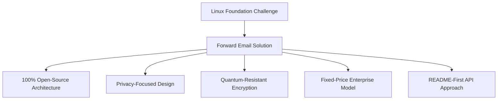
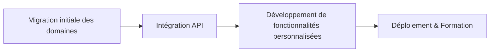

# Étude de cas : Comment la Linux Foundation optimise la gestion des emails sur plus de 250 domaines avec Forward Email {#case-study-how-the-linux-foundation-optimizes-email-management-across-250-domains-with-forward-email}


## Table des matières {#table-of-contents}

* [Introduction](#introduction)
* [Le défi](#the-challenge)
* [La solution](#the-solution)
  * [Architecture 100 % open source](#100-open-source-architecture)
  * [Conception axée sur la confidentialité](#privacy-focused-design)
  * [Sécurité de niveau entreprise](#enterprise-grade-security)
  * [Modèle entreprise à prix fixe](#fixed-price-enterprise-model)
  * [API conviviale pour les développeurs](#developer-friendly-api)
* [Processus de mise en œuvre](#implementation-process)
* [Résultats et avantages](#results-and-benefits)
  * [Améliorations de l'efficacité](#efficiency-improvements)
  * [Gestion des coûts](#cost-management)
  * [Sécurité renforcée](#enhanced-security)
  * [Expérience utilisateur améliorée](#improved-user-experience)
* [Conclusion](#conclusion)
* [Références](#references)


## Introduction {#introduction}

La [Linux Foundation](https://en.wikipedia.org/wiki/Linux_Foundation) gère plus de 900 projets open source répartis sur plus de 250 domaines, incluant [linux.com](https://www.linux.com/) et [jQuery.com](https://jquery.com/). Cette étude de cas explore comment ils ont collaboré avec [Forward Email](https://forwardemail.net) pour rationaliser la gestion des emails tout en restant alignés avec les principes open source.


## Le défi {#the-challenge}

La Linux Foundation a rencontré plusieurs défis liés à la gestion des emails :

* **Échelle** : Gérer les emails sur plus de 250 domaines avec des exigences différentes
* **Charge administrative** : Configurer les enregistrements DNS, maintenir les règles de redirection et répondre aux demandes de support
* **Sécurité** : Se protéger contre les menaces par email tout en préservant la confidentialité
* **Coût** : Les solutions traditionnelles par utilisateur étaient prohibitivement coûteuses à cette échelle
* **Alignement open source** : Besoin de solutions correspondant à leur engagement envers les valeurs open source

Similaire aux défis rencontrés par [Canonical/Ubuntu](https://forwardemail.net/blog/docs/canonical-ubuntu-email-enterprise-case-study) avec leurs multiples domaines de distribution, la Linux Foundation avait besoin d’une solution capable de gérer des projets divers tout en maintenant une approche de gestion unifiée.


## La solution {#the-solution}

Forward Email a fourni une solution complète avec des fonctionnalités clés :


```mermaid
graph TD
    A[Linux Foundation Challenge] --> B[Forward Email Solution]
    B --> C[100% Open-Source Architecture]
    B --> D[Privacy-Focused Design]
    B --> E[Quantum-Resistant Encryption]
    B --> F[Fixed-Price Enterprise Model]
    B --> G[README-First API Approach]
```

### Architecture 100 % open source {#100-open-source-architecture}

En tant que seul service email avec une plateforme entièrement open source (frontend et backend), Forward Email s’est parfaitement aligné avec l’engagement de la Linux Foundation envers les principes open source. Comme pour notre mise en œuvre avec [Canonical/Ubuntu](https://forwardemail.net/blog/docs/canonical-ubuntu-email-enterprise-case-study), cette transparence a permis à leur équipe technique de vérifier les implémentations de sécurité et même de contribuer à des améliorations.

### Conception axée sur la confidentialité {#privacy-focused-design}

Les [politiques de confidentialité](https://forwardemail.net/privacy) strictes de Forward Email ont fourni la sécurité requise par la Linux Foundation. Notre [implémentation technique de la protection de la confidentialité des emails](https://forwardemail.net/blog/docs/email-privacy-protection-technical-implementation) garantit que toutes les communications restent sécurisées par conception, sans journalisation ni analyse du contenu des emails.

Comme détaillé dans notre documentation technique :

> « Nous avons construit tout notre système autour du principe que vos emails vous appartiennent et uniquement à vous. Contrairement à d’autres fournisseurs qui analysent le contenu des emails pour la publicité ou la formation d’IA, nous maintenons une politique stricte de non-journalisation et de non-analyse qui préserve la confidentialité de toutes les communications. »
### Sécurité de niveau entreprise {#enterprise-grade-security}

La mise en œuvre du [chiffrement résistant au quantique](https://forwardemail.net/blog/docs/best-quantum-safe-encrypted-email-service) utilisant ChaCha20-Poly1305 a fourni une sécurité de pointe, chaque boîte aux lettres étant un fichier chiffré distinct. Cette approche garantit que même si les ordinateurs quantiques deviennent capables de casser les normes de chiffrement actuelles, les communications de la Linux Foundation resteront sécurisées.

### Modèle d'entreprise à prix fixe {#fixed-price-enterprise-model}

La [tarification entreprise](https://forwardemail.net/pricing) de Forward Email offrait un coût mensuel fixe indépendamment des domaines ou des utilisateurs. Cette approche a permis des économies significatives pour d'autres grandes organisations, comme démontré dans notre [étude de cas sur le transfert d'emails pour les anciens élèves d'université](https://forwardemail.net/blog/docs/alumni-email-forwarding-university-case-study), où les institutions ont économisé jusqu'à 99 % par rapport aux solutions traditionnelles par utilisateur.

### API conviviale pour les développeurs {#developer-friendly-api}

Suivant une [approche README-first](https://tom.preston-werner.com/2010/08/23/readme-driven-development) et inspirée par la [conception RESTful de l'API de Stripe](https://amberonrails.com/building-stripes-api), l'[API](https://forwardemail.net/api) de Forward Email a permis une intégration approfondie avec le Project Control Center de la Linux Foundation. Cette intégration a été cruciale pour automatiser la gestion des emails à travers leur portefeuille de projets diversifié.


## Processus de mise en œuvre {#implementation-process}

La mise en œuvre a suivi une approche structurée :


```mermaid
flowchart LR
    A[Migration initiale des domaines] --> B[Intégration API]
    B --> C[Développement de fonctionnalités personnalisées]
    C --> D[Déploiement & Formation]
```

1. **Migration initiale des domaines** : Configuration des enregistrements DNS, mise en place de SPF/DKIM/DMARC, migration des règles existantes

   ```sh
   # Exemple de configuration DNS pour un domaine de la Linux Foundation
   domain.org.    600    IN    MX    10 mx1.forwardemail.net.
   domain.org.    600    IN    MX    10 mx2.forwardemail.net.
   domain.org.    600    IN    TXT   "v=spf1 include:spf.forwardemail.net -all"
   ```

2. **Intégration API** : Connexion avec le Project Control Center pour une gestion en libre-service

3. **Développement de fonctionnalités personnalisées** : Gestion multi-domaines, rapports, politiques de sécurité

   Nous avons travaillé en étroite collaboration avec la Linux Foundation pour développer des fonctionnalités (qui sont également 100 % open source afin que tout le monde puisse en bénéficier) spécifiquement pour leur environnement multi-projets, de manière similaire à la création de solutions personnalisées pour les [systèmes d'email des anciens élèves d'université](https://forwardemail.net/blog/docs/alumni-email-forwarding-university-case-study).


## Résultats et avantages {#results-and-benefits}

La mise en œuvre a apporté des avantages significatifs :

### Améliorations de l'efficacité {#efficiency-improvements}

* Réduction de la charge administrative
* Intégration plus rapide des projets (de plusieurs jours à quelques minutes)
* Gestion simplifiée de plus de 250 domaines depuis une interface unique

### Gestion des coûts {#cost-management}

* Tarification fixe indépendamment de la croissance des domaines ou des utilisateurs
* Suppression des frais de licence par utilisateur
* Comme dans notre [étude de cas universitaire](https://forwardemail.net/blog/docs/alumni-email-forwarding-university-case-study), la Linux Foundation a réalisé des économies substantielles par rapport aux solutions traditionnelles

### Sécurité renforcée {#enhanced-security}

* Chiffrement résistant au quantique sur tous les domaines
* Authentification complète des emails empêchant le spoofing et le phishing
* Tests et pratiques de sécurité via les [fonctionnalités de sécurité](https://forwardemail.net/security)
* Protection de la vie privée grâce à notre [mise en œuvre technique](https://forwardemail.net/blog/docs/email-privacy-protection-technical-implementation)

### Expérience utilisateur améliorée {#improved-user-experience}

* Gestion des emails en libre-service pour les administrateurs de projets
* Expérience cohérente sur tous les domaines de la Linux Foundation
* Livraison fiable des emails avec une authentification robuste


## Conclusion {#conclusion}

Le partenariat de la Linux Foundation avec Forward Email démontre comment les organisations peuvent relever les défis complexes de la gestion des emails tout en restant alignées avec leurs valeurs fondamentales. En choisissant une solution qui privilégie les principes open source, la confidentialité et la sécurité, la Linux Foundation a transformé la gestion des emails d'une charge administrative en un avantage stratégique.
Comme démontré dans notre collaboration avec [Canonical/Ubuntu](https://forwardemail.net/blog/docs/canonical-ubuntu-email-enterprise-case-study) et [grandes universités](https://forwardemail.net/blog/docs/alumni-email-forwarding-university-case-study), les organisations disposant de portefeuilles de domaines complexes peuvent réaliser des améliorations significatives en termes d'efficacité, de sécurité et de gestion des coûts grâce à la solution entreprise de Forward Email.

Pour plus d'informations sur la manière dont Forward Email peut aider votre organisation à gérer les emails sur plusieurs domaines, visitez [forwardemail.net](https://forwardemail.net) ou explorez notre [documentation](https://forwardemail.net/email-api) détaillée et nos [guides](https://forwardemail.net/guides).


## Références {#references}

* Linux Foundation. (2025). « Parcourir les projets. » Consulté sur <https://www.linuxfoundation.org/projects>
* Wikipedia. (2025). « Linux Foundation. » Consulté sur <https://en.wikipedia.org/wiki/Linux_Foundation>
