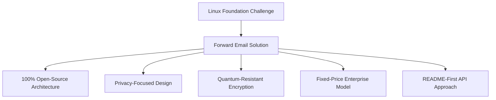
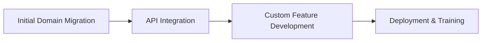

# מקרה בוחן: כיצד קרן לינוקס ממטבת את ניהול הדוא"ל ביותר מ-250 דומיינים באמצעות דוא"ל עתידי {#case-study-how-the-linux-foundation-optimizes-email-management-across-250-domains-with-forward-email}


## תוכן עניינים

* [מָבוֹא](#introduction)
* [האתגר](#the-challenge)
* [הפתרון](#the-solution)
  * [ארכיטקטורת קוד פתוח 100%](#100-open-source-architecture)
  * [עיצוב ממוקד פרטיות](#privacy-focused-design)
  * [אבטחה ברמה ארגונית](#enterprise-grade-security)
  * [מודל ארגוני במחיר קבוע](#fixed-price-enterprise-model)
  * [API ידידותי למפתחים](#developer-friendly-api)
* [תהליך היישום](#implementation-process)
* [תוצאות ויתרונות](#results-and-benefits)
  * [שיפורי יעילות](#efficiency-improvements)
  * [ניהול עלויות](#cost-management)
  * [אבטחה משופרת](#enhanced-security)
  * [חוויית משתמש משופרת](#improved-user-experience)
* [מַסְקָנָה](#conclusion)
* [הפניות](#references)

## מבוא {#introduction}

[קרן לינוקס](https://en.wikipedia.org/wiki/Linux_Foundation) מנהל מעל 900 פרויקטים בקוד פתוח ביותר מ-250 דומיינים, כולל [linux.com](https://www.linux.com/) ו-[jQuery.com](https://jquery.com/). מחקר מקרה זה בוחן כיצד הם שיתפו פעולה עם [העברת דוא"ל](https://forwardemail.net) כדי לייעל את ניהול הדוא"ל תוך שמירה על יישור קו עם עקרונות הקוד הפתוח.

## האתגר {#the-challenge}

קרן לינוקס התמודדה עם מספר אתגרים בניהול דוא"ל:

* **קנה מידה**: ניהול דוא"ל ביותר מ-250 דומיינים עם דרישות שונות
* **נטל אדמיניסטרטיבי**: הגדרת רשומות DNS, תחזוקת כללי העברה ומענה לבקשות תמיכה
* **אבטחה**: הגנה מפני איומים מבוססי דוא"ל תוך שמירה על פרטיות
* **עלות**: פתרונות מסורתיים לכל משתמש היו יקרים באופן בלתי סביר בקנה המידה שלהם
* **התאמה לקוד פתוח**: צורך בפתרונות התואמים את מחויבותם לערכי קוד פתוח

בדומה לאתגרים שעמדו בפני [קנוניקל/אובונטו](https://forwardemail.net/blog/docs/canonical-ubuntu-email-enterprise-case-study) עם דומייני ההפצה המרובים שלהם, קרן לינוקס הייתה זקוקה לפתרון שיכול להתמודד עם פרויקטים מגוונים תוך שמירה על גישת ניהול אחידה.

## הפתרון {#the-solution}

העברת דוא"ל סיפקה פתרון מקיף עם תכונות מרכזיות:



### ארכיטקטורת קוד פתוח 100% {#100-open-source-architecture}

כשירות הדוא"ל היחיד עם פלטפורמת קוד פתוח לחלוטין (גם קצה קדמי וגם קצה אחורי), Forward Email תאם באופן מושלם את מחויבותה של קרן לינוקס לעקרונות קוד פתוח. בדומה ליישום שלנו עם [קנוניקל/אובונטו](https://forwardemail.net/blog/docs/canonical-ubuntu-email-enterprise-case-study), שקיפות זו אפשרה לצוות הטכני שלהם לאמת יישומי אבטחה ואף לתרום לשיפורים.

### עיצוב ממוקד פרטיות {#privacy-focused-design}

[מדיניות הפרטיות](https://forwardemail.net/privacy), הגדרת העברת דוא"ל, סיפקה את האבטחה שנדרשה על ידי לינוקס קרן. [יישום טכני של הגנת פרטיות בדוא"ל](https://forwardemail.net/blog/docs/email-privacy-protection-technical-implementation) שלנו מבטיח שכל התקשורת תישאר מאובטחת מעצם התכנון, ללא צורך ברישום או סריקה של תוכן הדוא"ל.

כפי שמפורט בתיעוד הטכני של היישום שלנו:

> "בנינו את כל המערכת שלנו סביב העיקרון שהאימיילים שלכם שייכים לכם ורק לכם. בניגוד לספקים אחרים שסורקים תוכן אימיילים לצורך פרסום או הדרכת בינה מלאכותית, אנו מקפידים על מדיניות קפדנית של אי-רישום ואין סריקה, ששומרת על סודיות כל התקשורת."

### אבטחה ברמה ארגונית {#enterprise-grade-security}

יישום של [הצפנה עמידה קוונטית](https://forwardemail.net/blog/docs/best-quantum-safe-encrypted-email-service) באמצעות ChaCha20-Poly1305 סיפק אבטחה מתקדמת, כאשר כל תיבת דואר היא קובץ מוצפן נפרד. גישה זו מבטיחה שגם אם מחשבים קוונטיים יהיו מסוגלים לשבור את תקני ההצפנה הנוכחיים, התקשורת של קרן לינוקס תישאר מאובטחת.

### מודל ארגוני במחיר קבוע {#fixed-price-enterprise-model}

[תמחור ארגוני](https://forwardemail.net/pricing) של העברת דוא"ל סיפק עלות חודשית קבועה ללא קשר לדומיינים או למשתמשים. גישה זו הביאה לחיסכון משמעותי בעלויות עבור ארגונים גדולים אחרים, כפי שהודגם ב-[מקרה בוחן של דוא"ל של בוגרי אוניברסיטה](https://forwardemail.net/blog/docs/alumni-email-forwarding-university-case-study) שלנו, שם מוסדות חסכו עד 99% בהשוואה לפתרונות דוא"ל מסורתיים לפי משתמש.

### ממשק API ידידותי למפתחים {#developer-friendly-api}

בעקבות [גישת README תחילה](https://tom.preston-werner.com/2010/08/23/readme-driven-development) ובהשראת [עיצוב RESTful API של Stripe](https://amberonrails.com/building-stripes-api), [API](https://forwardemail.net/api) של Forward Email אפשר אינטגרציה עמוקה עם מרכז בקרת הפרויקטים של קרן לינוקס. אינטגרציה זו הייתה קריטית לאוטומציה של ניהול דוא"ל בכל תיק הפרויקטים המגוון שלהם.

## תהליך הטמעה {#implementation-process}

היישום התבסס על גישה מובנית:



1. **הגירת דומיין ראשונית**: הגדרת רשומות DNS, הגדרת SPF/DKIM/DMARC, גירסת כללים קיימים

   ```sh
   # Example DNS configuration for a Linux Foundation domain
   domain.org.    600    IN    MX    10 mx1.forwardemail.net.
   domain.org.    600    IN    MX    10 mx2.forwardemail.net.
   domain.org.    600    IN    TXT   "v=spf1 include:spf.forwardemail.net -all"
   ```

2. **שילוב API**: התחברות למרכז בקרת הפרויקטים לניהול בשירות עצמי

3. **פיתוח תכונות מותאמות אישית**: ניהול רב-דומיינים, דיווח, מדיניות אבטחה

עבדנו בשיתוף פעולה הדוק עם קרן לינוקס כדי לפתח תכונות (שגם הן 100% בקוד פתוח כך שכולם יוכלו להפיק מהן תועלת) במיוחד עבור סביבת מרובת הפרויקטים שלהם, בדומה לאופן שבו יצרנו פתרונות מותאמים אישית עבור [מערכות דוא"ל של בוגרי אוניברסיטה](https://forwardemail.net/blog/docs/alumni-email-forwarding-university-case-study).

## תוצאות ויתרונות {#results-and-benefits}

היישום הניב יתרונות משמעותיים:

### שיפורי יעילות {#efficiency-improvements}

* הוצאות ניהוליות מופחתות
* קליטה מהירה יותר של הפרויקט (מימים לדקות)
* ניהול יעיל יותר של כל 250+ הדומיינים מממשק יחיד

### ניהול עלויות {#cost-management}

* תמחור קבוע ללא קשר לגידול במספר הדומיינים או המשתמשים
* ביטול דמי רישוי לפי משתמש
* בדומה ל-[מקרה בוחן באוניברסיטה](https://forwardemail.net/blog/docs/alumni-email-forwarding-university-case-study) שלנו, קרן לינוקס השיגה חיסכון משמעותי בעלויות בהשוואה לפתרונות מסורתיים

### אבטחה משופרת {#enhanced-security}

* הצפנה עמידה בפני קוונטים בכל הדומיינים
* אימות מקיף של דוא"ל המונע זיופים ופישינג
* בדיקות ונהלי אבטחה דרך [תכונות אבטחה](https://forwardemail.net/security)
* הגנת פרטיות דרך [יישום טכני](https://forwardemail.net/blog/docs/email-privacy-protection-technical-implementation) שלנו

### חוויית משתמש משופרת {#improved-user-experience}

* ניהול דוא"ל בשירות עצמי עבור מנהלי פרויקטים
* חוויה עקבית בכל תחומי Linux Foundation
* מסירת דוא"ל אמינה עם אימות חזק

## מסקנה {#conclusion}

השותפות של קרן לינוקס עם Forward Email מדגימה כיצד ארגונים יכולים להתמודד עם אתגרי ניהול דוא"ל מורכבים תוך שמירה על יישור קו עם ערכי הליבה שלהם. על ידי בחירת פתרון שנותן עדיפות לעקרונות קוד פתוח, פרטיות ואבטחה, קרן לינוקס הפכה את ניהול הדוא"ל מנטל אדמיניסטרטיבי ליתרון אסטרטגי.

כפי שנראה בעבודתנו עם [קנוניקל/אובונטו](https://forwardemail.net/blog/docs/canonical-ubuntu-email-enterprise-case-study) ו-[אוניברסיטאות גדולות](https://forwardemail.net/blog/docs/alumni-email-forwarding-university-case-study), ארגונים עם תיקי דומיינים מורכבים יכולים להשיג שיפורים משמעותיים ביעילות, באבטחה ובניהול עלויות באמצעות פתרון הארגון של Forward Email.

למידע נוסף על האופן שבו העברת דוא"ל יכולה לעזור לארגון שלך לנהל דוא"ל במספר דומיינים, בקר ב-[forwardemail.net](https://forwardemail.net) או עיין במידע המפורט שלנו בנושא [תיעוד](https://forwardemail.net/email-api) ו-[מדריכים](https://forwardemail.net/guides).

## הפניות

* קרן לינוקס. (2025). "עיון בפרויקטים." אוחזר מ- <https://www.linuxfoundation.org/projects>
* ויקיפדיה. (2025). "קרן לינוקס." אוחזר מ- <https://en.wikipedia.org/wiki/Linux_Foundation>