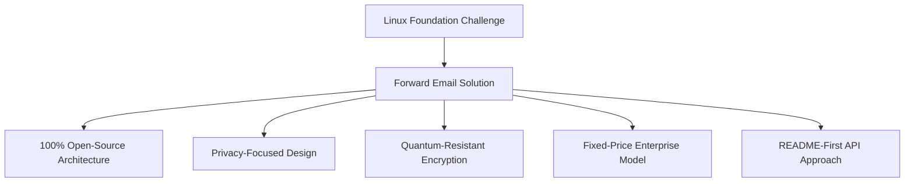
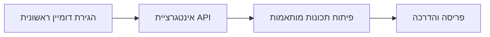

# מקרה בוחן: כיצד Linux Foundation מייעלת ניהול דוא"ל ב-250+ דומיינים עם Forward Email {#case-study-how-the-linux-foundation-optimizes-email-management-across-250-domains-with-forward-email}


## תוכן העניינים {#table-of-contents}

* [הקדמה](#introduction)
* [האתגר](#the-challenge)
* [הפתרון](#the-solution)
  * [ארכיטקטורה בקוד פתוח 100%](#100-open-source-architecture)
  * [עיצוב ממוקד פרטיות](#privacy-focused-design)
  * [אבטחה ברמת ארגון](#enterprise-grade-security)
  * [מודל ארגוני במחיר קבוע](#fixed-price-enterprise-model)
  * [API ידידותי למפתחים](#developer-friendly-api)
* [תהליך היישום](#implementation-process)
* [תוצאות ויתרונות](#results-and-benefits)
  * [שיפורי יעילות](#efficiency-improvements)
  * [ניהול עלויות](#cost-management)
  * [אבטחה משופרת](#enhanced-security)
  * [שיפור חוויית המשתמש](#improved-user-experience)
* [סיכום](#conclusion)
* [מקורות](#references)


## הקדמה {#introduction}

[Linux Foundation](https://en.wikipedia.org/wiki/Linux_Foundation) מנהלת מעל 900 פרויקטים בקוד פתוח ב-250+ דומיינים, כולל [linux.com](https://www.linux.com/) ו-[jQuery.com](https://jquery.com/). מקרה בוחן זה בוחן כיצד הם שיתפו פעולה עם [Forward Email](https://forwardemail.net) כדי לייעל את ניהול הדוא"ל תוך שמירה על התאמה לעקרונות הקוד הפתוח.


## האתגר {#the-challenge}

Linux Foundation התמודדה עם מספר אתגרים בניהול דוא"ל:

* **קנה מידה**: ניהול דוא"ל ב-250+ דומיינים עם דרישות שונות
* **עומס מנהלי**: קונפיגורציית רשומות DNS, תחזוקת כללי העברה, ומענה לבקשות תמיכה
* **אבטחה**: הגנה מפני איומים מבוססי דוא"ל תוך שמירה על פרטיות
* **עלות**: פתרונות מסורתיים למשתמש היו יקרים מדי בקנה המידה שלהם
* **התאמה לקוד פתוח**: צורך בפתרונות התואמים למחויבות לערכי קוד פתוח

בדומה לאתגרים שעמדו בפני [Canonical/Ubuntu](https://forwardemail.net/blog/docs/canonical-ubuntu-email-enterprise-case-study) עם דומיינים מרובים להפצה, Linux Foundation נזקקה לפתרון שיכול לטפל בפרויקטים מגוונים תוך שמירה על גישה אחידה לניהול.


## הפתרון {#the-solution}

Forward Email סיפקה פתרון מקיף עם תכונות מרכזיות:


```mermaid
graph TD
    A[Linux Foundation Challenge] --> B[Forward Email Solution]
    B --> C[100% Open-Source Architecture]
    B --> D[Privacy-Focused Design]
    B --> E[Quantum-Resistant Encryption]
    B --> F[Fixed-Price Enterprise Model]
    B --> G[README-First API Approach]
```

### ארכיטקטורה בקוד פתוח 100% {#100-open-source-architecture}

כשירות הדוא"ל היחידה עם פלטפורמה בקוד פתוח מלאה (גם frontend וגם backend), Forward Email התאימה באופן מושלם למחויבות Linux Foundation לעקרונות קוד פתוח. בדומה ליישום שלנו עם [Canonical/Ubuntu](https://forwardemail.net/blog/docs/canonical-ubuntu-email-enterprise-case-study), שקיפות זו אפשרה לצוות הטכני שלהם לאמת יישומי אבטחה ואפילו לתרום שיפורים.

### עיצוב ממוקד פרטיות {#privacy-focused-design}

מדיניות הפרטיות המחמירה של Forward Email [privacy policies](https://forwardemail.net/privacy) סיפקה את האבטחה ש-Linux Foundation דרשה. יישום ההגנה הטכנית על פרטיות הדוא"ל שלנו [email privacy protection technical implementation](https://forwardemail.net/blog/docs/email-privacy-protection-technical-implementation) מבטיח שכל התקשורת נשארת מאובטחת כברירת מחדל, ללא רישום או סריקה של תוכן הדוא"ל.

כמפורט בתיעוד היישום הטכני שלנו:

> "בנינו את כל המערכת שלנו סביב העיקרון שהמיילים שלך שייכים לך ולך בלבד. בניגוד לספקים אחרים הסורקים תוכן דוא"ל לפרסום או לאימון AI, אנו שומרים על מדיניות מחמירה של אי-רישום ואי-סריקה השומרת על סודיות כל התקשורת."
### אבטחה ברמת ארגון {#enterprise-grade-security}

יישום של [הצפנה עמידה בפני מחשבים קוונטיים](https://forwardemail.net/blog/docs/best-quantum-safe-encrypted-email-service) באמצעות ChaCha20-Poly1305 סיפק אבטחה מתקדמת, כאשר כל תיבת דואר היא קובץ מוצפן נפרד. גישה זו מבטיחה שגם אם מחשבים קוונטיים יוכלו לשבור את תקני ההצפנה הנוכחיים, התקשורת של Linux Foundation תישאר מאובטחת.

### מודל ארגוני במחיר קבוע {#fixed-price-enterprise-model}

[תמחור ארגוני](https://forwardemail.net/pricing) של Forward Email סיפק עלות חודשית קבועה ללא תלות בדומיינים או משתמשים. גישה זו הביאה לחיסכון משמעותי בעלויות עבור ארגונים גדולים אחרים, כפי שמודגם ב[מקרה מבחן של דואר אלומנים באוניברסיטה](https://forwardemail.net/blog/docs/alumni-email-forwarding-university-case-study), שבו המוסדות חסכו עד 99% בהשוואה לפתרונות דואר מסורתיים לפי משתמש.

### API ידידותי למפתחים {#developer-friendly-api}

בעקבות [גישה של README-ראשון](https://tom.preston-werner.com/2010/08/23/readme-driven-development) ובהשראת [עיצוב ה-API RESTful של Stripe](https://amberonrails.com/building-stripes-api), ה-[API](https://forwardemail.net/api) של Forward Email אפשר אינטגרציה עמוקה עם מרכז בקרת הפרויקטים של Linux Foundation. אינטגרציה זו הייתה קריטית לאוטומציה של ניהול הדואר האלקטרוני בכל תיק הפרויקטים המגוון שלהם.


## תהליך היישום {#implementation-process}

היישום התבצע בגישה מובנית:


```mermaid
flowchart LR
    A[הגירת דומיין ראשונית] --> B[אינטגרציית API]
    B --> C[פיתוח תכונות מותאמות]
    C --> D[פריסה והדרכה]
```

1. **הגירת דומיין ראשונית**: קונפיגורציית רשומות DNS, הגדרת SPF/DKIM/DMARC, העברת כללים קיימים

   ```sh
   # דוגמת קונפיגורציית DNS לדומיין של Linux Foundation
   domain.org.    600    IN    MX    10 mx1.forwardemail.net.
   domain.org.    600    IN    MX    10 mx2.forwardemail.net.
   domain.org.    600    IN    TXT   "v=spf1 include:spf.forwardemail.net -all"
   ```

2. **אינטגרציית API**: חיבור למרכז בקרת הפרויקטים לניהול עצמי

3. **פיתוח תכונות מותאמות**: ניהול רב-דומיינים, דוחות, מדיניות אבטחה

   עבדנו בשיתוף פעולה הדוק עם Linux Foundation לפיתוח תכונות (שהן גם קוד פתוח ב-100% כך שכולם יכולים להפיק מהן תועלת) במיוחד לסביבת רב-פרויקטים שלהם, בדומה לאופן שבו יצרנו פתרונות מותאמים ל[מערכות דואר אלומנים באוניברסיטה](https://forwardemail.net/blog/docs/alumni-email-forwarding-university-case-study).


## תוצאות ויתרונות {#results-and-benefits}

היישום הביא לתועלות משמעותיות:

### שיפורי יעילות {#efficiency-improvements}

* הפחתת עומס מנהלי
* האצת קליטת פרויקטים (מימים לדקות)
* ניהול מרוכז של כל 250+ הדומיינים מממשק אחד

### ניהול עלויות {#cost-management}

* תמחור קבוע ללא תלות בצמיחה בדומיינים או משתמשים
* ביטול תשלומי רישוי לפי משתמש
* בדומה ל[מקרה המבחן האוניברסיטאי](https://forwardemail.net/blog/docs/alumni-email-forwarding-university-case-study), Linux Foundation השיגה חיסכון משמעותי בעלויות בהשוואה לפתרונות מסורתיים

### אבטחה משופרת {#enhanced-security}

* הצפנה עמידה בפני מחשבים קוונטיים בכל הדומיינים
* אימות דואר אלקטרוני מקיף למניעת זיופים ופישינג
* בדיקות אבטחה ופרקטיקות דרך [תכונות אבטחה](https://forwardemail.net/security)
* הגנת פרטיות באמצעות [היישום הטכני שלנו](https://forwardemail.net/blog/docs/email-privacy-protection-technical-implementation)

### שיפור חוויית המשתמש {#improved-user-experience}

* ניהול דואר אלקטרוני בשירות עצמי למנהלי פרויקטים
* חוויה עקבית בכל דומייני Linux Foundation
* אספקת דואר אמינה עם אימות חזק


## סיכום {#conclusion}

השיתוף פעולה של Linux Foundation עם Forward Email מדגים כיצד ארגונים יכולים להתמודד עם אתגרי ניהול דואר אלקטרוני מורכבים תוך שמירה על התאמה לערכיהם המרכזיים. בבחירת פתרון שמדגיש עקרונות קוד פתוח, פרטיות ואבטחה, Linux Foundation הפכה את ניהול הדואר האלקטרוני מעומס מנהלי ליתרון אסטרטגי.
כפי שניתן לראות בעבודתנו עם [Canonical/Ubuntu](https://forwardemail.net/blog/docs/canonical-ubuntu-email-enterprise-case-study) ו-[אוניברסיטאות מובילות](https://forwardemail.net/blog/docs/alumni-email-forwarding-university-case-study), ארגונים עם פורטפוליו דומיינים מורכב יכולים להשיג שיפורים משמעותיים ביעילות, אבטחה וניהול עלויות באמצעות הפתרון הארגוני של Forward Email.

למידע נוסף על איך Forward Email יכול לעזור לארגון שלך לנהל דואר אלקטרוני על פני דומיינים מרובים, בקר ב-[forwardemail.net](https://forwardemail.net) או חקור את ה-[תיעוד](https://forwardemail.net/email-api) וה-[מדריכים](https://forwardemail.net/guides) המפורטים שלנו.


## References {#references}

* Linux Foundation. (2025). "Browse Projects." Retrieved from <https://www.linuxfoundation.org/projects>
* Wikipedia. (2025). "Linux Foundation." Retrieved from <https://en.wikipedia.org/wiki/Linux_Foundation>
