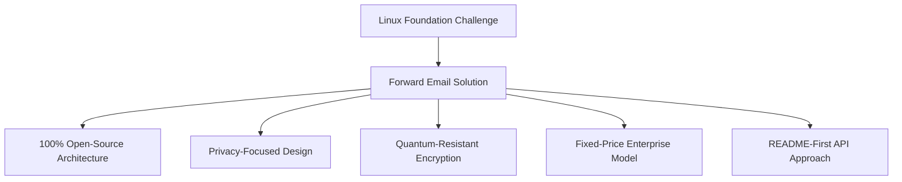
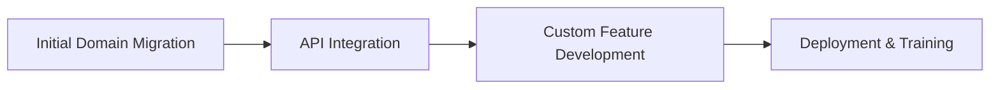

# Esettanulmány: Hogyan optimalizálja a Linux Foundation az e-mail-kezelést több mint 250 domainen az e-mailek továbbításával {#case-study-how-the-linux-foundation-optimizes-email-management-across-250-domains-with-forward-email}


## Tartalomjegyzék {#table-of-contents}

* [Bevezetés](#introduction)
* [A kihívás](#the-challenge)
* [A megoldás](#the-solution)
  * [100%-ban nyílt forráskódú architektúra](#100-open-source-architecture)
  * [Adatvédelem-központú tervezés](#privacy-focused-design)
  * [Vállalati szintű biztonság](#enterprise-grade-security)
  * [Fix áras vállalati modell](#fixed-price-enterprise-model)
  * [Fejlesztőbarát API](#developer-friendly-api)
* [Megvalósítási folyamat](#implementation-process)
* [Eredmények és előnyök](#results-and-benefits)
  * [Hatékonyságnövelések](#efficiency-improvements)
  * [Költséggazdálkodás](#cost-management)
  * [Fokozott biztonság](#enhanced-security)
  * [Javított felhasználói élmény](#improved-user-experience)
* [Következtetés](#conclusion)
* [Referenciák](#references)

## Bevezetés {#introduction}

A [Linux Alapítvány](https://en.wikipedia.org/wiki/Linux_Foundation) több mint 900 nyílt forráskódú projektet kezel több mint 250 domainen, beleértve a [linux.com](https://www.linux.com/) és a [jQuery.com](https://jquery.com/) projekteket is. Ez az esettanulmány azt vizsgálja, hogyan működtek együtt a [E-mail továbbítása](https://forwardemail.net)-mal az e-mail-kezelés egyszerűsítése érdekében, miközben fenntartják az összhangot a nyílt forráskódú elvekkel.

## A kihívás {#the-challenge}

A Linux Foundation számos e-mail-kezelési kihívással nézett szembe:

* **Méret**: E-mailek kezelése több mint 250, eltérő követelményekkel rendelkező domainen
* **Adminisztratív terhek**: DNS-rekordok konfigurálása, továbbítási szabályok karbantartása és támogatási kérések megválaszolása
* **Biztonság**: Védelem az e-mail-alapú fenyegetések ellen az adatvédelem megőrzése mellett
* **Költség**: A hagyományos felhasználónkénti megoldások megfizethetetlenül drágák voltak a méretükben
* **Nyílt forráskódú szoftverekhez való igazodás**: Olyan megoldásokra van szükség, amelyek megfelelnek a nyílt forráskódú értékek iránti elkötelezettségüknek

A [Kanonikus/Ubuntu](https://forwardemail.net/blog/docs/canonical-ubuntu-email-enterprise-case-study) által a több terjesztési tartomány miatt tapasztalt kihívásokhoz hasonlóan a Linux Foundationnek is olyan megoldásra volt szüksége, amely képes kezelni a különféle projekteket, miközben egységes kezelési megközelítést tart fenn.

## A megoldás {#the-solution}

A Forward Email átfogó megoldást kínált a következő főbb funkciókkal:



### 100%-ban nyílt forráskódú architektúra {#100-open-source-architecture}

Mivel a Forward Email az egyetlen olyan e-mail szolgáltatás, amely teljesen nyílt forráskódú platformmal rendelkezik (mind a frontend, mind a backend felületen), tökéletesen illeszkedett a Linux Foundation nyílt forráskódú alapelvek iránti elkötelezettségéhez. A [Kanonikus/Ubuntu](https://forwardemail.net/blog/docs/canonical-ubuntu-email-enterprise-case-study) implementációnkhoz hasonlóan ez az átláthatóság lehetővé tette a technikai csapatuk számára, hogy ellenőrizzék a biztonsági megvalósításokat, sőt, fejlesztésekhez is hozzájáruljanak.

### Adatvédelem-központú tervezés {#privacy-focused-design}

A Forward Email szigorú [adatvédelmi irányelvek](https://forwardemail.net/privacy) tulajdonsága biztosította a Linux Foundation által megkövetelt biztonságot. A [e-mail adatvédelem technikai megvalósítása](https://forwardemail.net/blog/docs/email-privacy-protection-technical-implementation) tulajdonságunk biztosítja, hogy minden kommunikáció a tervezésnek megfelelően biztonságos maradjon, az e-mailek tartalmának naplózása vagy vizsgálata nélkül.

Amint azt a technikai megvalósítási dokumentációnkban részletezzük:

> „A teljes rendszerünket arra az elvre építettük, hogy az e-mailjeid csakis a tiéid. Más szolgáltatókkal ellentétben, akik hirdetések vagy mesterséges intelligencia-képzés céljából szkennelik az e-mail tartalmakat, mi szigorú naplózásmentes és szkennelésmentes szabályzatot tartunk fenn, amely megőrzi az összes kommunikáció bizalmasságát.”

### Vállalati szintű biztonság {#enterprise-grade-security}

A [kvantum-rezisztens titkosítás](https://forwardemail.net/blog/docs/best-quantum-safe-encrypted-email-service) ChaCha20-Poly1305 használatával történő megvalósítása a legmodernebb biztonságot nyújtotta, mivel minden postafiók külön titkosított fájl volt. Ez a megközelítés biztosítja, hogy még ha a kvantumszámítógépek képesek is lennének felrúgni a jelenlegi titkosítási szabványokat, a Linux Foundation kommunikációja akkor is biztonságos maradjon.

### Fix áras vállalati modell {#fixed-price-enterprise-model}

A Forward Email [vállalati árképzés](https://forwardemail.net/pricing) megoldása fix havi költséget biztosított a domainektől vagy a felhasználóktól függetlenül. Ez a megközelítés jelentős költségmegtakarítást eredményezett más nagyvállalatok számára, amint azt a [egyetemi öregdiákok e-mail esettanulmánya](https://forwardemail.net/blog/docs/alumni-email-forwarding-university-case-study) megoldásunk is mutatja, ahol az intézmények akár 99%-ot is megtakaríthattak a hagyományos, felhasználónkénti e-mail megoldásokhoz képest.

### Fejlesztőbarát API {#developer-friendly-api}

Egy [README-első megközelítés](https://tom.preston-werner.com/2010/08/23/readme-driven-development) utasítást követően és a [A Stripe RESTful API-tervezése](https://amberonrails.com/building-stripes-api) utasítás ihlette a Forward Email [API](https://forwardemail.net/api) utasítása mély integrációt tett lehetővé a Linux Foundation Projektirányító Központjával. Ez az integráció kulcsfontosságú volt az e-mail-kezelés automatizálásához a sokszínű projektportfóliójukon.

## Megvalósítási folyamat {#implementation-process}

A megvalósítás strukturált megközelítést követett:



1. **Kezdeti domainmigráció**: DNS-rekordok konfigurálása, SPF/DKIM/DMARC beállítása, meglévő szabályok migrálása

   ```sh
   # Example DNS configuration for a Linux Foundation domain
   domain.org.    600    IN    MX    10 mx1.forwardemail.net.
   domain.org.    600    IN    MX    10 mx2.forwardemail.net.
   domain.org.    600    IN    TXT   "v=spf1 include:spf.forwardemail.net -all"
   ```

2. **API integráció**: Kapcsolódás a Project Control Centerhez az önkiszolgáló kezeléshez

3. **Egyedi funkciók fejlesztése**: Több domain kezelése, jelentéskészítés, biztonsági szabályzatok

Szorosan együttműködtünk a Linux Foundationnel, hogy kifejezetten a többprojektes környezetükhöz tartozó funkciókat fejlesszünk ki (amelyek ráadásul 100%-ban nyílt forráskódúak, így mindenki profitálhat belőlük), hasonlóan ahhoz, ahogyan a [egyetemi öregdiák e-mail rendszerek](https://forwardemail.net/blog/docs/alumni-email-forwarding-university-case-study) számára készítettünk egyedi megoldásokat.

## Eredmények és előnyök {#results-and-benefits}

A megvalósítás jelentős előnyökkel járt:

### Hatékonysági fejlesztések {#efficiency-improvements}

* Csökkentett adminisztratív terhek
* Gyorsabb projektbevezetés (napokról percekre)
* Mind a 250+ domain egyszerűsített kezelése egyetlen felületről

### Költségkezelés {#cost-management}

* Fix árak a domainek vagy felhasználók számának növekedésétől függetlenül
* A felhasználónkénti licencdíjak eltörlése
* A [egyetemi esettanulmány](https://forwardemail.net/blog/docs/alumni-email-forwarding-university-case-study)-hoz hasonlóan a Linux Foundation jelentős költségmegtakarítást ért el a hagyományos megoldásokhoz képest

### Fokozott biztonság {#enhanced-security}

* Kvantumálló titkosítás minden domainen
* Átfogó e-mail hitelesítés a hamisítás és az adathalászat megakadályozására
* Biztonsági tesztelés és gyakorlatok a [biztonsági funkciók](https://forwardemail.net/security) segítségével
* Adatvédelem a [technikai megvalósítás](https://forwardemail.net/blog/docs/email-privacy-protection-technical-implementation) segítségével

### Továbbfejlesztett felhasználói élmény {#improved-user-experience}

* Önkiszolgáló e-mail-kezelés projektadminisztrátorok számára
* Egységes felhasználói élmény minden Linux Foundation domainen
* Megbízható e-mail-kézbesítés robusztus hitelesítéssel

## Következtetés {#conclusion}

A Linux Foundation és a Forward Email partnersége jól mutatja, hogyan tudják a szervezetek kezelni az összetett e-mail-kezelési kihívásokat, miközben összhangban vannak alapvető értékeikkel. Egy olyan megoldás kiválasztásával, amely a nyílt forráskódú alapelveket, az adatvédelmet és a biztonságot helyezi előtérbe, a Linux Foundation az e-mail-kezelést adminisztratív teherből stratégiai előnnyé alakította.

Amint azt a [Kanonikus/Ubuntu](https://forwardemail.net/blog/docs/canonical-ubuntu-email-enterprise-case-study) és a [nagyobb egyetemek](https://forwardemail.net/blog/docs/alumni-email-forwarding-university-case-study) megoldásokkal végzett munkánk is mutatja, az összetett domainportfólióval rendelkező szervezetek jelentős javulást érhetnek el a hatékonyság, a biztonság és a költséggazdálkodás terén a Forward Email vállalati megoldásával.

Ha további információra van szüksége arról, hogy az E-mail továbbítása hogyan segíthet szervezetének a több domainen keresztüli e-mailek kezelésében, látogasson el a [forwardemail.net](https://forwardemail.net) oldalra, vagy tekintse meg a részletes [dokumentáció](https://forwardemail.net/email-api) és [útmutatók](https://forwardemail.net/guides) dokumentumokat.

## Referenciák {#references}

* Linux Foundation. (2025). „Projektek böngészése.” Letöltve innen: <https://www.linuxfoundation.org/projects>
* Wikipédia. (2025). „Linux Foundation.” Letöltve innen: <https://en.wikipedia.org/wiki/Linux_Foundation>