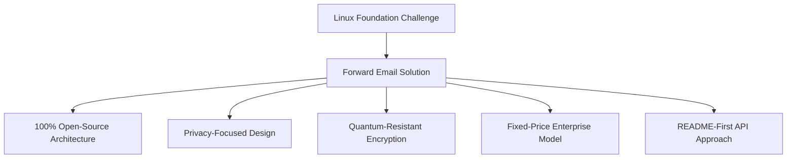
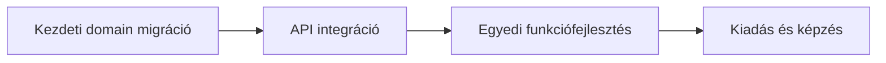

# Esettanulmány: Hogyan optimalizálja a Linux Foundation az e-mail kezelést több mint 250 domainen a Forward Email segítségével {#case-study-how-the-linux-foundation-optimizes-email-management-across-250-domains-with-forward-email}


## Tartalomjegyzék {#table-of-contents}

* [Bevezetés](#introduction)
* [A kihívás](#the-challenge)
* [A megoldás](#the-solution)
  * [100% nyílt forráskódú architektúra](#100-open-source-architecture)
  * [Adatvédelmi fókuszú tervezés](#privacy-focused-design)
  * [Vállalati szintű biztonság](#enterprise-grade-security)
  * [Fix árú vállalati modell](#fixed-price-enterprise-model)
  * [Fejlesztőbarát API](#developer-friendly-api)
* [Megvalósítási folyamat](#implementation-process)
* [Eredmények és előnyök](#results-and-benefits)
  * [Hatékonyságjavítások](#efficiency-improvements)
  * [Költséggazdálkodás](#cost-management)
  * [Fokozott biztonság](#enhanced-security)
  * [Javított felhasználói élmény](#improved-user-experience)
* [Összegzés](#conclusion)
* [Hivatkozások](#references)


## Bevezetés {#introduction}

A [Linux Foundation](https://en.wikipedia.org/wiki/Linux_Foundation) több mint 900 nyílt forráskódú projektet kezel több mint 250 domainen, beleértve a [linux.com](https://www.linux.com/) és a [jQuery.com](https://jquery.com/) oldalakat is. Ez az esettanulmány azt vizsgálja, hogyan működtek együtt a [Forward Email](https://forwardemail.net)-lel az e-mail kezelés egyszerűsítése érdekében, miközben megőrizték a nyílt forráskódú elvekhez való hűséget.


## A kihívás {#the-challenge}

A Linux Foundation több e-mail kezelési kihívással nézett szembe:

* **Méret**: Több mint 250 domain e-mail kezelése különböző követelményekkel
* **Adminisztratív terhek**: DNS rekordok konfigurálása, továbbítási szabályok karbantartása és támogatási kérelmek kezelése
* **Biztonság**: Védelem az e-mail alapú fenyegetésekkel szemben, miközben megőrzik az adatvédelmet
* **Költség**: A hagyományos felhasználónkénti megoldások túl drágák voltak ekkora mérethez
* **Nyílt forráskódú összhang**: Olyan megoldások szükségessége, amelyek megfelelnek a nyílt forráskódú értékek iránti elkötelezettségüknek

Hasonlóan a [Canonical/Ubuntu](https://forwardemail.net/blog/docs/canonical-ubuntu-email-enterprise-case-study) több disztribúciós domainnel kapcsolatos kihívásaihoz, a Linux Foundation olyan megoldásra volt szüksége, amely képes kezelni a sokféle projektet, miközben egységes kezelési megközelítést tart fenn.


## A megoldás {#the-solution}

A Forward Email átfogó megoldást kínált kulcsfontosságú jellemzőkkel:


```mermaid
graph TD
    A[Linux Foundation Challenge] --> B[Forward Email Solution]
    B --> C[100% Open-Source Architecture]
    B --> D[Privacy-Focused Design]
    B --> E[Quantum-Resistant Encryption]
    B --> F[Fixed-Price Enterprise Model]
    B --> G[README-First API Approach]
```

### 100% nyílt forráskódú architektúra {#100-open-source-architecture}

Mint az egyetlen e-mail szolgáltatás, amely teljesen nyílt forráskódú platformmal rendelkezik (mind frontend, mind backend), a Forward Email tökéletesen illeszkedett a Linux Foundation nyílt forráskódú elvek iránti elkötelezettségéhez. Hasonlóan a [Canonical/Ubuntu](https://forwardemail.net/blog/docs/canonical-ubuntu-email-enterprise-case-study) esetében végrehajtott megoldásunkhoz, ez az átláthatóság lehetővé tette a technikai csapatuk számára a biztonsági megvalósítások ellenőrzését és akár fejlesztések hozzájárulását is.

### Adatvédelmi fókuszú tervezés {#privacy-focused-design}

A Forward Email szigorú [adatvédelmi szabályzatai](https://forwardemail.net/privacy) biztosították a Linux Foundation által megkövetelt biztonságot. Az [e-mail adatvédelmi technikai megvalósításunk](https://forwardemail.net/blog/docs/email-privacy-protection-technical-implementation) garantálja, hogy minden kommunikáció tervezés szerint biztonságos marad, e-mail tartalom naplózása vagy vizsgálata nélkül.

Ahogy a technikai megvalósítási dokumentációnk részletezi:

> "Az egész rendszerünket az az elv vezérli, hogy az e-mailjei Önéi és csak Önéi. Ellentétben más szolgáltatókkal, akik az e-mail tartalmat reklám vagy AI képzés céljából vizsgálják, mi szigorú naplózás- és vizsgálatmentes politikát tartunk fenn, amely megőrzi minden kommunikáció titkosságát."
### Vállalati szintű biztonság {#enterprise-grade-security}

A [kvantumrezisztens titkosítás](https://forwardemail.net/blog/docs/best-quantum-safe-encrypted-email-service) ChaCha20-Poly1305 használatával történő megvalósítása korszerű biztonságot nyújtott, minden postaláda külön titkosított fájlként kezelve. Ez a megközelítés biztosítja, hogy még ha a kvantumszámítógépek képesek is lesznek feltörni a jelenlegi titkosítási szabványokat, a Linux Foundation kommunikációi továbbra is biztonságban maradnak.

### Fix árú vállalati modell {#fixed-price-enterprise-model}

A Forward Email [vállalati árazása](https://forwardemail.net/pricing) fix havi költséget biztosított a domainek vagy felhasználók számától függetlenül. Ez a megközelítés jelentős költségmegtakarítást eredményezett más nagy szervezetek számára, amint azt a [egyetemi öregdiák e-mail esettanulmány](https://forwardemail.net/blog/docs/alumni-email-forwarding-university-case-study) is bizonyítja, ahol az intézmények akár 99%-os megtakarítást értek el a hagyományos, felhasználónkénti e-mail megoldásokhoz képest.

### Fejlesztőbarát API {#developer-friendly-api}

A [README-first megközelítés](https://tom.preston-werner.com/2010/08/23/readme-driven-development) és a [Stripe RESTful API tervezésének](https://amberonrails.com/building-stripes-api) inspirációja alapján a Forward Email [API-ja](https://forwardemail.net/api) lehetővé tette a mély integrációt a Linux Foundation Project Control Centerével. Ez az integráció kulcsfontosságú volt az e-mail kezelés automatizálásához a sokszínű projektportfóliójukban.


## Megvalósítási folyamat {#implementation-process}

A megvalósítás strukturált megközelítést követett:


```mermaid
flowchart LR
    A[Kezdeti domain migráció] --> B[API integráció]
    B --> C[Egyedi funkciófejlesztés]
    C --> D[Kiadás és képzés]
```

1. **Kezdeti domain migráció**: DNS rekordok konfigurálása, SPF/DKIM/DMARC beállítása, meglévő szabályok migrálása

   ```sh
   # Példa DNS konfiguráció egy Linux Foundation domainhez
   domain.org.    600    IN    MX    10 mx1.forwardemail.net.
   domain.org.    600    IN    MX    10 mx2.forwardemail.net.
   domain.org.    600    IN    TXT   "v=spf1 include:spf.forwardemail.net -all"
   ```

2. **API integráció**: Kapcsolódás a Project Control Centerhez az önkiszolgáló kezelés érdekében

3. **Egyedi funkciófejlesztés**: Többdomaines kezelés, riportálás, biztonsági szabályzatok

   Szorosan együttműködtünk a Linux Foundationnel, hogy olyan funkciókat fejlesszünk (amelyek 100%-ban nyílt forráskódúak, így mindenki számára elérhetők), amelyek kifejezetten a többprojekt környezetükhöz készültek, hasonlóan ahhoz, ahogyan egyedi megoldásokat alkottunk [egyetemi öregdiák e-mail rendszerekhez](https://forwardemail.net/blog/docs/alumni-email-forwarding-university-case-study).


## Eredmények és előnyök {#results-and-benefits}

A megvalósítás jelentős előnyöket hozott:

### Hatékonyságjavulás {#efficiency-improvements}

* Csökkentett adminisztratív terhek
* Gyorsabb projektindítás (napokról percekre)
* Több mint 250 domain kezelése egyetlen felületről

### Költséggazdálkodás {#cost-management}

* Fix árak a domainek vagy felhasználók számának növekedésétől függetlenül
* Felhasználónkénti licencdíjak megszüntetése
* Hasonlóan a [egyetemi esettanulmányhoz](https://forwardemail.net/blog/docs/alumni-email-forwarding-university-case-study), a Linux Foundation jelentős költségmegtakarítást ért el a hagyományos megoldásokhoz képest

### Fokozott biztonság {#enhanced-security}

* Kvantumrezisztens titkosítás minden domainen
* Átfogó e-mail hitelesítés, amely megakadályozza a hamisítást és adathalászatot
* Biztonsági tesztelés és gyakorlatok a [biztonsági funkciókon](https://forwardemail.net/security) keresztül
* Adatvédelem a [technikai megvalósításunk](https://forwardemail.net/blog/docs/email-privacy-protection-technical-implementation) révén

### Javított felhasználói élmény {#improved-user-experience}

* Önkiszolgáló e-mail kezelés a projektadminisztrátorok számára
* Egységes élmény minden Linux Foundation domainen
* Megbízható e-mail kézbesítés erős hitelesítéssel


## Összefoglalás {#conclusion}

A Linux Foundation és a Forward Email együttműködése megmutatja, hogyan kezelhetik a szervezetek a komplex e-mail kezelési kihívásokat úgy, hogy közben összhangban maradnak alapvető értékeikkel. Egy olyan megoldás kiválasztásával, amely előtérbe helyezi a nyílt forráskódú elveket, az adatvédelmet és a biztonságot, a Linux Foundation az e-mail kezelést az adminisztratív terhekből stratégiai előnnyé alakította.
Ahogy a [Canonical/Ubuntu](https://forwardemail.net/blog/docs/canonical-ubuntu-email-enterprise-case-study) és a [nagy egyetemek](https://forwardemail.net/blog/docs/alumni-email-forwarding-university-case-study) esetében végzett munkánk is mutatja, a komplex domain portfólióval rendelkező szervezetek jelentős javulást érhetnek el a hatékonyság, a biztonság és a költségkezelés terén a Forward Email vállalati megoldásán keresztül.

További információkért arról, hogyan segítheti a Forward Email szervezetét az e-mailek több domainen át történő kezelésében, látogasson el a [forwardemail.net](https://forwardemail.net) oldalra, vagy böngéssze részletes [dokumentációnkat](https://forwardemail.net/email-api) és [útmutatóinkat](https://forwardemail.net/guides).


## Hivatkozások {#references}

* Linux Foundation. (2025). "Projektek böngészése." Elérve innen: <https://www.linuxfoundation.org/projects>
* Wikipedia. (2025). "Linux Foundation." Elérve innen: <https://en.wikipedia.org/wiki/Linux_Foundation>
