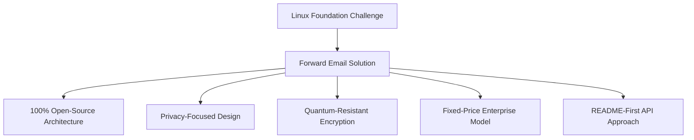
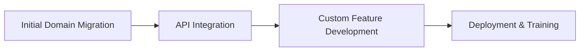

# Studi Kasus: Bagaimana Linux Foundation Mengoptimalkan Manajemen Email di Lebih dari 250 Domain dengan Forward Email {#case-study-how-the-linux-foundation-optimizes-email-management-across-250-domains-with-forward-email}


## Daftar Isi {#table-of-contents}

* [Perkenalan](#introduction)
* [Tantangan](#the-challenge)
* [Solusinya](#the-solution)
  * [Arsitektur 100% Open-Source](#100-open-source-architecture)
  * [Desain Berfokus pada Privasi](#privacy-focused-design)
  * [Keamanan Tingkat Perusahaan](#enterprise-grade-security)
  * [Model Perusahaan Harga Tetap](#fixed-price-enterprise-model)
  * [API yang Ramah Pengembang](#developer-friendly-api)
* [Proses Implementasi](#implementation-process)
* [Hasil dan Manfaat](#results-and-benefits)
  * [Peningkatan Efisiensi](#efficiency-improvements)
  * [Manajemen Biaya](#cost-management)
  * [Keamanan yang Ditingkatkan](#enhanced-security)
  * [Pengalaman Pengguna yang Ditingkatkan](#improved-user-experience)
* [Kesimpulan](#conclusion)
* [Referensi](#references)

## Pendahuluan {#introduction}

[Yayasan Linux](https://en.wikipedia.org/wiki/Linux_Foundation) mengelola lebih dari 900 proyek sumber terbuka di lebih dari 250 domain, termasuk [linux.com](https://www.linux.com/) dan [jQuery.com](https://jquery.com/). Studi kasus ini mengeksplorasi bagaimana mereka bermitra dengan [Teruskan Email](https://forwardemail.net) untuk menyederhanakan pengelolaan email sekaligus menjaga keselarasan dengan prinsip-prinsip sumber terbuka.

## Tantangan {#the-challenge}

Yayasan Linux menghadapi beberapa tantangan manajemen email:

* **Skala**: Mengelola email di lebih dari 250 domain dengan persyaratan berbeda
* **Beban Administratif**: Mengonfigurasi rekaman DNS, mempertahankan aturan penerusan, dan menanggapi permintaan dukungan
* **Keamanan**: Melindungi dari ancaman berbasis email sekaligus menjaga privasi
* **Biaya**: Solusi per pengguna tradisional sangat mahal dalam skala besar
* **Penyelarasan Open-Source**: Kebutuhan akan solusi yang sesuai dengan komitmen mereka terhadap nilai-nilai open-source

Mirip dengan tantangan yang dihadapi oleh [Kanonik/Ubuntu](https://forwardemail.net/blog/docs/canonical-ubuntu-email-enterprise-case-study) dengan berbagai domain distribusinya, Linux Foundation memerlukan solusi yang dapat menangani beragam proyek sambil mempertahankan pendekatan manajemen yang terpadu.

## Solusinya {#the-solution}

Forward Email menyediakan solusi komprehensif dengan fitur-fitur utama:



### Arsitektur 100% Sumber Terbuka {#100-open-source-architecture}

Sebagai satu-satunya layanan email dengan platform sumber terbuka sepenuhnya (baik frontend maupun backend), Forward Email selaras sempurna dengan komitmen Linux Foundation terhadap prinsip-prinsip sumber terbuka. Serupa dengan implementasi kami dengan [Kanonik/Ubuntu](https://forwardemail.net/blog/docs/canonical-ubuntu-email-enterprise-case-study), transparansi ini memungkinkan tim teknis mereka untuk memverifikasi implementasi keamanan dan bahkan berkontribusi dalam peningkatan.

### Desain Berfokus pada Privasi {#privacy-focused-design}

[kebijakan privasi](https://forwardemail.net/privacy) yang ketat dari Forward Email menyediakan keamanan yang dibutuhkan Linux Foundation. [implementasi teknis perlindungan privasi email](https://forwardemail.net/blog/docs/email-privacy-protection-technical-implementation) kami memastikan bahwa semua komunikasi tetap aman sejak awal, tanpa pencatatan atau pemindaian konten email.

Seperti yang dijelaskan secara rinci dalam dokumentasi implementasi teknis kami:

> "Kami membangun seluruh sistem kami berdasarkan prinsip bahwa email Anda adalah milik Anda dan hanya milik Anda. Tidak seperti penyedia lain yang memindai konten email untuk iklan atau pelatihan AI, kami menerapkan kebijakan tanpa pencatatan dan pemindaian yang ketat untuk menjaga kerahasiaan semua komunikasi."

### Keamanan Tingkat Perusahaan {#enterprise-grade-security}

Implementasi [enkripsi tahan kuantum](https://forwardemail.net/blog/docs/best-quantum-safe-encrypted-email-service) menggunakan ChaCha20-Poly1305 memberikan keamanan mutakhir, dengan setiap kotak surat menjadi berkas terenkripsi yang terpisah. Pendekatan ini memastikan bahwa meskipun komputer kuantum mampu memecahkan standar enkripsi saat ini, komunikasi Linux Foundation akan tetap aman.

### Model Perusahaan Harga Tetap {#fixed-price-enterprise-model}

[harga perusahaan](https://forwardemail.net/pricing) dari Forward Email menyediakan biaya bulanan tetap, terlepas dari domain atau pengguna. Pendekatan ini telah menghasilkan penghematan biaya yang signifikan bagi organisasi besar lainnya, seperti yang ditunjukkan dalam [studi kasus email alumni universitas](https://forwardemail.net/blog/docs/alumni-email-forwarding-university-case-study) kami, di mana institusi menghemat hingga 99% dibandingkan dengan solusi email per pengguna tradisional.

### API Ramah Pengembang {#developer-friendly-api}

Mengikuti [Pendekatan README-first](https://tom.preston-werner.com/2010/08/23/readme-driven-development) dan terinspirasi oleh [Desain API RESTful Stripe](https://amberonrails.com/building-stripes-api), [API](https://forwardemail.net/api) dari Forward Email memungkinkan integrasi mendalam dengan Pusat Kontrol Proyek Linux Foundation. Integrasi ini krusial untuk mengotomatiskan pengelolaan email di seluruh portofolio proyek mereka yang beragam.

## Proses Implementasi {#implementation-process}

Implementasinya mengikuti pendekatan terstruktur:



1. **Migrasi Domain Awal**: Mengonfigurasi rekaman DNS, menyiapkan SPF/DKIM/DMARC, memigrasikan aturan yang ada

   ```sh
   # Example DNS configuration for a Linux Foundation domain
   domain.org.    600    IN    MX    10 mx1.forwardemail.net.
   domain.org.    600    IN    MX    10 mx2.forwardemail.net.
   domain.org.    600    IN    TXT   "v=spf1 include:spf.forwardemail.net -all"
   ```

2. **Integrasi API**: Terhubung dengan Pusat Kontrol Proyek untuk manajemen layanan mandiri

3. **Pengembangan Fitur Kustom**: Manajemen multi-domain, pelaporan, kebijakan keamanan

Kami bekerja sama erat dengan Linux Foundation untuk mengembangkan fitur-fitur (yang juga 100% bersumber terbuka sehingga semua orang dapat memperoleh manfaat darinya) khusus untuk lingkungan multi-proyek mereka, mirip dengan cara kami membuat solusi khusus untuk [sistem email alumni universitas](https://forwardemail.net/blog/docs/alumni-email-forwarding-university-case-study).

## Hasil dan Manfaat {#results-and-benefits}

Implementasinya memberikan manfaat yang signifikan:

### Peningkatan Efisiensi {#efficiency-improvements}

* Mengurangi beban administrasi
* Onboarding proyek lebih cepat (dari hitungan hari menjadi hitungan menit)
* Manajemen yang lebih efisien untuk lebih dari 250 domain dari satu antarmuka

### Manajemen Biaya {#cost-management}

* Harga tetap, terlepas dari pertumbuhan domain atau pengguna
* Penghapusan biaya lisensi per pengguna
* Serupa dengan [studi kasus universitas](https://forwardemail.net/blog/docs/alumni-email-forwarding-university-case-study) kami, Linux Foundation mencapai penghematan biaya yang substansial dibandingkan dengan solusi tradisional

### Keamanan yang Ditingkatkan {#enhanced-security}

* Enkripsi tahan kuantum di semua domain
* Autentikasi email komprehensif yang mencegah spoofing dan phishing
* Pengujian dan praktik keamanan melalui [fitur keamanan](https://forwardemail.net/security)
* Perlindungan privasi melalui [implementasi teknis](https://forwardemail.net/blog/docs/email-privacy-protection-technical-implementation) kami

### Peningkatan Pengalaman Pengguna {#improved-user-experience}

* Manajemen email mandiri untuk administrator proyek
* Pengalaman yang konsisten di seluruh domain Linux Foundation
* Pengiriman email yang andal dengan autentikasi yang kuat

## Kesimpulan {#conclusion}

Kemitraan Linux Foundation dengan Forward Email menunjukkan bagaimana organisasi dapat mengatasi tantangan manajemen email yang kompleks sekaligus tetap selaras dengan nilai-nilai inti mereka. Dengan memilih solusi yang mengutamakan prinsip sumber terbuka, privasi, dan keamanan, Linux Foundation telah mengubah manajemen email dari beban administratif menjadi keunggulan strategis.

Seperti yang terlihat dalam pekerjaan kami dengan [Kanonik/Ubuntu](https://forwardemail.net/blog/docs/canonical-ubuntu-email-enterprise-case-study) dan [universitas-universitas besar](https://forwardemail.net/blog/docs/alumni-email-forwarding-university-case-study), organisasi dengan portofolio domain yang kompleks dapat mencapai peningkatan yang signifikan dalam efisiensi, keamanan, dan manajemen biaya melalui solusi perusahaan Forward Email.

Untuk informasi lebih lanjut tentang bagaimana Forward Email dapat membantu organisasi Anda mengelola email di beberapa domain, kunjungi [forwardemail.net](https://forwardemail.net) atau jelajahi [dokumentasi](https://forwardemail.net/email-api) dan [panduan](https://forwardemail.net/guides) terperinci kami.

## Referensi {#references}

* Linux Foundation. (2025). "Telusuri Proyek." Diambil dari <https://www.linuxfoundation.org/projects>
* Wikipedia. (2025). "Linux Foundation." Diambil dari <https://en.wikipedia.org/wiki/Linux_Foundation>