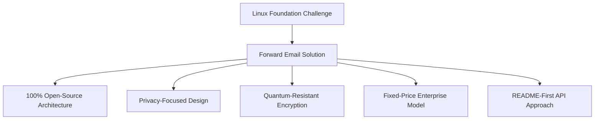
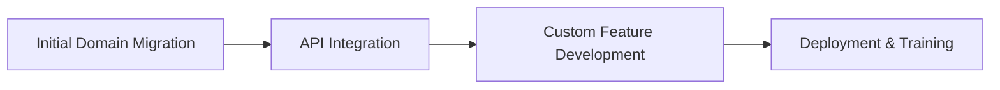

# Studi Kasus: Bagaimana Linux Foundation Mengoptimalkan Manajemen Email di Lebih dari 250 Domain dengan Forward Email {#case-study-how-the-linux-foundation-optimizes-email-management-across-250-domains-with-forward-email}


## Daftar Isi {#table-of-contents}

* [Pendahuluan](#introduction)
* [Tantangan](#the-challenge)
* [Solusi](#the-solution)
  * [Arsitektur 100% Open-Source](#100-open-source-architecture)
  * [Desain Berfokus pada Privasi](#privacy-focused-design)
  * [Keamanan Kelas Enterprise](#enterprise-grade-security)
  * [Model Enterprise dengan Harga Tetap](#fixed-price-enterprise-model)
  * [API Ramah Pengembang](#developer-friendly-api)
* [Proses Implementasi](#implementation-process)
* [Hasil dan Manfaat](#results-and-benefits)
  * [Peningkatan Efisiensi](#efficiency-improvements)
  * [Manajemen Biaya](#cost-management)
  * [Keamanan yang Ditingkatkan](#enhanced-security)
  * [Pengalaman Pengguna yang Lebih Baik](#improved-user-experience)
* [Kesimpulan](#conclusion)
* [Referensi](#references)


## Pendahuluan {#introduction}

[Linux Foundation](https://en.wikipedia.org/wiki/Linux_Foundation) mengelola lebih dari 900 proyek open-source di lebih dari 250 domain, termasuk [linux.com](https://www.linux.com/) dan [jQuery.com](https://jquery.com/). Studi kasus ini mengeksplorasi bagaimana mereka bermitra dengan [Forward Email](https://forwardemail.net) untuk menyederhanakan manajemen email sekaligus mempertahankan keselarasan dengan prinsip open-source.


## Tantangan {#the-challenge}

Linux Foundation menghadapi beberapa tantangan dalam manajemen email:

* **Skala**: Mengelola email di lebih dari 250 domain dengan kebutuhan yang berbeda-beda
* **Beban Administratif**: Mengonfigurasi catatan DNS, memelihara aturan penerusan, dan menanggapi permintaan dukungan
* **Keamanan**: Melindungi dari ancaman berbasis email sambil menjaga privasi
* **Biaya**: Solusi tradisional per pengguna sangat mahal pada skala mereka
* **Keselarasan Open-Source**: Membutuhkan solusi yang sesuai dengan komitmen mereka terhadap nilai-nilai open-source

Serupa dengan tantangan yang dihadapi oleh [Canonical/Ubuntu](https://forwardemail.net/blog/docs/canonical-ubuntu-email-enterprise-case-study) dengan berbagai domain distribusi mereka, Linux Foundation membutuhkan solusi yang dapat menangani proyek yang beragam sambil mempertahankan pendekatan manajemen yang terpadu.


## Solusi {#the-solution}

Forward Email menyediakan solusi komprehensif dengan fitur utama:


```mermaid
graph TD
    A[Linux Foundation Challenge] --> B[Forward Email Solution]
    B --> C[100% Open-Source Architecture]
    B --> D[Privacy-Focused Design]
    B --> E[Quantum-Resistant Encryption]
    B --> F[Fixed-Price Enterprise Model]
    B --> G[README-First API Approach]
```

### Arsitektur 100% Open-Source {#100-open-source-architecture}

Sebagai satu-satunya layanan email dengan platform yang sepenuhnya open-source (baik frontend maupun backend), Forward Email sangat selaras dengan komitmen Linux Foundation terhadap prinsip open-source. Serupa dengan implementasi kami bersama [Canonical/Ubuntu](https://forwardemail.net/blog/docs/canonical-ubuntu-email-enterprise-case-study), transparansi ini memungkinkan tim teknis mereka memverifikasi implementasi keamanan dan bahkan berkontribusi pada perbaikan.

### Desain Berfokus pada Privasi {#privacy-focused-design}

Kebijakan [privasi](https://forwardemail.net/privacy) yang ketat dari Forward Email memberikan keamanan yang dibutuhkan Linux Foundation. [Implementasi teknis perlindungan privasi email](https://forwardemail.net/blog/docs/email-privacy-protection-technical-implementation) kami memastikan semua komunikasi tetap aman secara desain, tanpa pencatatan atau pemindaian isi email.

Seperti yang dijelaskan dalam dokumentasi implementasi teknis kami:

> "Kami membangun seluruh sistem kami berdasarkan prinsip bahwa email Anda adalah milik Anda dan hanya Anda. Berbeda dengan penyedia lain yang memindai isi email untuk iklan atau pelatihan AI, kami mempertahankan kebijakan tanpa pencatatan dan tanpa pemindaian yang ketat untuk menjaga kerahasiaan semua komunikasi."
### Keamanan Tingkat Perusahaan {#enterprise-grade-security}

Implementasi [enkripsi tahan kuantum](https://forwardemail.net/blog/docs/best-quantum-safe-encrypted-email-service) menggunakan ChaCha20-Poly1305 menyediakan keamanan mutakhir, dengan setiap kotak surat menjadi file terenkripsi terpisah. Pendekatan ini memastikan bahwa bahkan jika komputer kuantum menjadi mampu memecahkan standar enkripsi saat ini, komunikasi Linux Foundation akan tetap aman.

### Model Perusahaan dengan Harga Tetap {#fixed-price-enterprise-model}

[Harga perusahaan](https://forwardemail.net/pricing) Forward Email menyediakan biaya bulanan tetap tanpa memandang domain atau pengguna. Pendekatan ini telah memberikan penghematan biaya yang signifikan bagi organisasi besar lainnya, seperti yang ditunjukkan dalam [studi kasus email alumni universitas](https://forwardemail.net/blog/docs/alumni-email-forwarding-university-case-study), di mana institusi menghemat hingga 99% dibandingkan solusi email per pengguna tradisional.

### API Ramah Pengembang {#developer-friendly-api}

Mengikuti [pendekatan README-first](https://tom.preston-werner.com/2010/08/23/readme-driven-development) dan terinspirasi oleh [desain API RESTful Stripe](https://amberonrails.com/building-stripes-api), [API](https://forwardemail.net/api) Forward Email memungkinkan integrasi mendalam dengan Project Control Center Linux Foundation. Integrasi ini sangat penting untuk mengotomatisasi manajemen email di seluruh portofolio proyek mereka yang beragam.


## Proses Implementasi {#implementation-process}

Implementasi mengikuti pendekatan terstruktur:


```mermaid
flowchart LR
    A[Initial Domain Migration] --> B[API Integration]
    B --> C[Custom Feature Development]
    C --> D[Deployment & Training]
```

1. **Migrasi Domain Awal**: Mengonfigurasi catatan DNS, mengatur SPF/DKIM/DMARC, memigrasi aturan yang ada

   ```sh
   # Contoh konfigurasi DNS untuk domain Linux Foundation
   domain.org.    600    IN    MX    10 mx1.forwardemail.net.
   domain.org.    600    IN    MX    10 mx2.forwardemail.net.
   domain.org.    600    IN    TXT   "v=spf1 include:spf.forwardemail.net -all"
   ```

2. **Integrasi API**: Menghubungkan dengan Project Control Center untuk manajemen swalayan

3. **Pengembangan Fitur Kustom**: Manajemen multi-domain, pelaporan, kebijakan keamanan

   Kami bekerja sama erat dengan Linux Foundation untuk mengembangkan fitur (yang juga 100% open-source sehingga semua orang dapat memanfaatkannya) khusus untuk lingkungan multi-proyek mereka, mirip dengan bagaimana kami membuat solusi kustom untuk [sistem email alumni universitas](https://forwardemail.net/blog/docs/alumni-email-forwarding-university-case-study).


## Hasil dan Manfaat {#results-and-benefits}

Implementasi memberikan manfaat signifikan:

### Peningkatan Efisiensi {#efficiency-improvements}

* Mengurangi beban administratif
* Proses onboarding proyek lebih cepat (dari hari menjadi menit)
* Manajemen terpusat untuk lebih dari 250 domain dari satu antarmuka

### Pengelolaan Biaya {#cost-management}

* Harga tetap tanpa memandang pertumbuhan domain atau pengguna
* Penghapusan biaya lisensi per pengguna
* Seperti dalam [studi kasus universitas](https://forwardemail.net/blog/docs/alumni-email-forwarding-university-case-study), Linux Foundation mencapai penghematan biaya substansial dibandingkan solusi tradisional

### Keamanan yang Ditingkatkan {#enhanced-security}

* Enkripsi tahan kuantum di semua domain
* Autentikasi email komprehensif mencegah spoofing dan phishing
* Pengujian dan praktik keamanan melalui [fitur keamanan](https://forwardemail.net/security)
* Perlindungan privasi melalui [implementasi teknis kami](https://forwardemail.net/blog/docs/email-privacy-protection-technical-implementation)

### Pengalaman Pengguna yang Lebih Baik {#improved-user-experience}

* Manajemen email swalayan untuk administrator proyek
* Pengalaman konsisten di semua domain Linux Foundation
* Pengiriman email yang andal dengan autentikasi yang kuat


## Kesimpulan {#conclusion}

Kemitraan Linux Foundation dengan Forward Email menunjukkan bagaimana organisasi dapat mengatasi tantangan manajemen email yang kompleks sambil tetap selaras dengan nilai inti mereka. Dengan memilih solusi yang mengutamakan prinsip open-source, privasi, dan keamanan, Linux Foundation telah mengubah manajemen email dari beban administratif menjadi keunggulan strategis.
Seperti yang terlihat dalam pekerjaan kami dengan [Canonical/Ubuntu](https://forwardemail.net/blog/docs/canonical-ubuntu-email-enterprise-case-study) dan [universitas besar](https://forwardemail.net/blog/docs/alumni-email-forwarding-university-case-study), organisasi dengan portofolio domain yang kompleks dapat mencapai peningkatan signifikan dalam efisiensi, keamanan, dan pengelolaan biaya melalui solusi perusahaan Forward Email.

Untuk informasi lebih lanjut tentang bagaimana Forward Email dapat membantu organisasi Anda mengelola email di berbagai domain, kunjungi [forwardemail.net](https://forwardemail.net) atau jelajahi [dokumentasi](https://forwardemail.net/email-api) dan [panduan](https://forwardemail.net/guides) kami yang terperinci.


## Referensi {#references}

* Linux Foundation. (2025). "Browse Projects." Diakses dari <https://www.linuxfoundation.org/projects>
* Wikipedia. (2025). "Linux Foundation." Diakses dari <https://en.wikipedia.org/wiki/Linux_Foundation>
