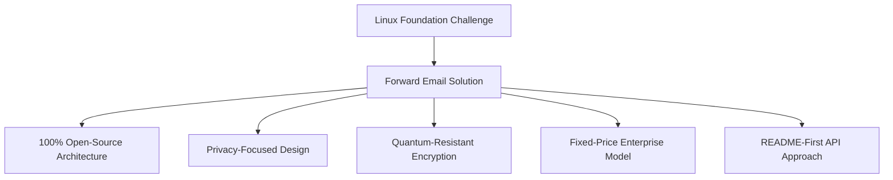
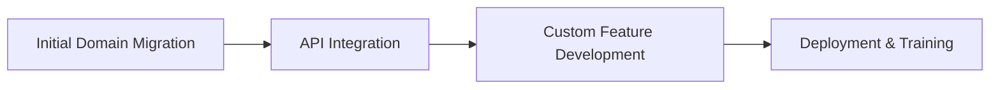

# Caso di studio: come la Linux Foundation ottimizza la gestione della posta elettronica su oltre 250 domini con Forward Email {#case-study-how-the-linux-foundation-optimizes-email-management-across-250-domains-with-forward-email}


## Indice {#table-of-contents}

* [Introduzione](#introduction)
* [La sfida](#the-challenge)
* [La soluzione](#the-solution)
  * [Architettura 100% open source](#100-open-source-architecture)
  * [Progettazione incentrata sulla privacy](#privacy-focused-design)
  * [Sicurezza di livello aziendale](#enterprise-grade-security)
  * [Modello aziendale a prezzo fisso](#fixed-price-enterprise-model)
  * [API adatta agli sviluppatori](#developer-friendly-api)
* [Processo di implementazione](#implementation-process)
* [Risultati e benefici](#results-and-benefits)
  * [Miglioramenti dell'efficienza](#efficiency-improvements)
  * [Gestione dei costi](#cost-management)
  * [Sicurezza avanzata](#enhanced-security)
  * [Esperienza utente migliorata](#improved-user-experience)
* [Conclusione](#conclusion)
* [Riferimenti](#references)

## Introduzione {#introduction}

[Fondazione Linux](https://en.wikipedia.org/wiki/Linux_Foundation) gestisce oltre 900 progetti open source in più di 250 domini, inclusi [linux.com](https://www.linux.com/) e [jQuery.com](https://jquery.com/). Questo caso di studio esplora la collaborazione con [Inoltra e-mail](https://forwardemail.net) per semplificare la gestione delle email, mantenendo al contempo l'allineamento con i principi open source.

## La sfida {#the-challenge}

La Linux Foundation ha dovuto affrontare diverse sfide nella gestione della posta elettronica:

* **Scala**: gestione della posta elettronica su oltre 250 domini con requisiti diversi
* **Onere amministrativo**: configurazione dei record DNS, gestione delle regole di inoltro e risposta alle richieste di supporto
* **Sicurezza**: protezione dalle minacce basate sulla posta elettronica, garantendo al contempo la privacy
* **Costo**: le soluzioni tradizionali per utente erano proibitive per la loro scala
* **Allineamento all'open source**: necessità di soluzioni in linea con il loro impegno verso i valori dell'open source

Similmente alle sfide affrontate da [Canonico/Ubuntu](https://forwardemail.net/blog/docs/canonical-ubuntu-email-enterprise-case-study) con i suoi molteplici domini di distribuzione, la Linux Foundation aveva bisogno di una soluzione in grado di gestire progetti diversificati mantenendo al contempo un approccio di gestione unificato.

## La soluzione {#the-solution}

Forward Email ha fornito una soluzione completa con funzionalità chiave:



### Architettura 100% open source {#100-open-source-architecture}

Essendo l'unico servizio di posta elettronica con una piattaforma completamente open source (sia frontend che backend), Forward Email si è allineato perfettamente all'impegno della Linux Foundation verso i principi open source. Analogamente alla nostra implementazione con [Canonico/Ubuntu](https://forwardemail.net/blog/docs/canonical-ubuntu-email-enterprise-case-study), questa trasparenza ha permesso al loro team tecnico di verificare le implementazioni di sicurezza e persino di contribuire ai miglioramenti.

### Progettazione incentrata sulla privacy {#privacy-focused-design}

Il rigoroso [politiche sulla privacy](https://forwardemail.net/privacy) di Forward Email ha fornito la sicurezza richiesta dalla Linux Foundation. Il nostro [implementazione tecnica della protezione della privacy della posta elettronica](https://forwardemail.net/blog/docs/email-privacy-protection-technical-implementation) garantisce che tutte le comunicazioni rimangano sicure per impostazione predefinita, senza registrazione o scansione del contenuto delle email.

Come dettagliato nella nostra documentazione di implementazione tecnica:

> "Abbiamo costruito l'intero sistema attorno al principio che le tue email appartengono a te e solo a te. A differenza di altri provider che analizzano il contenuto delle email per scopi pubblicitari o per l'addestramento all'intelligenza artificiale, noi manteniamo una rigorosa politica di non registrazione né scansione che preserva la riservatezza di tutte le comunicazioni."

### Sicurezza di livello aziendale {#enterprise-grade-security}

L'implementazione di [crittografia resistente ai quanti](https://forwardemail.net/blog/docs/best-quantum-safe-encrypted-email-service) utilizzando ChaCha20-Poly1305 ha fornito una sicurezza all'avanguardia, con ogni casella di posta come file crittografato separato. Questo approccio garantisce che, anche se i computer quantistici dovessero superare gli attuali standard di crittografia, le comunicazioni della Linux Foundation rimarranno sicure.

### Modello aziendale a prezzo fisso {#fixed-price-enterprise-model}

Il [prezzi aziendali](https://forwardemail.net/pricing) di Forward Email prevedeva un costo mensile fisso, indipendentemente dal dominio o dall'utente. Questo approccio ha portato a significativi risparmi sui costi per altre grandi organizzazioni, come dimostrato dal nostro [studio di caso di e-mail di ex studenti universitari](https://forwardemail.net/blog/docs/alumni-email-forwarding-university-case-study), dove le istituzioni hanno risparmiato fino al 99% rispetto alle tradizionali soluzioni di posta elettronica per utente.

### API adatta agli sviluppatori {#developer-friendly-api}

Sulla scia di [Approccio README-first](https://tom.preston-werner.com/2010/08/23/readme-driven-development) e ispirandosi a [Progettazione dell'API RESTful di Stripe](https://amberonrails.com/building-stripes-api), [API](https://forwardemail.net/api) di Forward Email ha permesso una profonda integrazione con il Project Control Center della Linux Foundation. Questa integrazione è stata fondamentale per automatizzare la gestione delle email nel loro variegato portfolio di progetti.

## Processo di implementazione {#implementation-process}

L'implementazione ha seguito un approccio strutturato:



1. **Migrazione iniziale del dominio**: configurazione dei record DNS, impostazione di SPF/DKIM/DMARC, migrazione delle regole esistenti

   ```sh
   # Example DNS configuration for a Linux Foundation domain
   domain.org.    600    IN    MX    10 mx1.forwardemail.net.
   domain.org.    600    IN    MX    10 mx2.forwardemail.net.
   domain.org.    600    IN    TXT   "v=spf1 include:spf.forwardemail.net -all"
   ```

2. **Integrazione API**: connessione con Project Control Center per la gestione self-service

3. **Sviluppo di funzionalità personalizzate**: gestione multidominio, reporting, policy di sicurezza

Abbiamo collaborato a stretto contatto con la Linux Foundation per sviluppare funzionalità (anch'esse open source al 100%, in modo che tutti possano trarne vantaggio) specifiche per il loro ambiente multiprogetto, in modo simile a come abbiamo creato soluzioni personalizzate per [sistemi di posta elettronica degli ex studenti universitari](https://forwardemail.net/blog/docs/alumni-email-forwarding-university-case-study).

## Risultati e benefici {#results-and-benefits}

L'implementazione ha portato notevoli vantaggi:

### Miglioramenti dell'efficienza {#efficiency-improvements}

* Riduzione dei costi amministrativi
* Onboarding dei progetti più rapido (da giorni a minuti)
* Gestione semplificata di tutti gli oltre 250 domini da un'unica interfaccia

### Gestione dei costi {#cost-management}

* Prezzi fissi indipendentemente dalla crescita dei domini o degli utenti
* Eliminazione dei costi di licenza per utente
* Analogamente al nostro [studio di caso universitario](https://forwardemail.net/blog/docs/alumni-email-forwarding-university-case-study), la Linux Foundation ha ottenuto notevoli risparmi sui costi rispetto alle soluzioni tradizionali

### Sicurezza avanzata {#enhanced-security}

* Crittografia resistente ai quantum su tutti i domini
* Autenticazione email completa che previene spoofing e phishing
* Test e pratiche di sicurezza tramite [caratteristiche di sicurezza](https://forwardemail.net/security)
* Protezione della privacy tramite il nostro [implementazione tecnica](https://forwardemail.net/blog/docs/email-privacy-protection-technical-implementation)

### Esperienza utente migliorata {#improved-user-experience}

* Gestione self-service della posta elettronica per gli amministratori di progetto
* Esperienza coerente in tutti i domini Linux Foundation
* Consegna affidabile della posta elettronica con autenticazione robusta

## Conclusione {#conclusion}

La partnership tra la Linux Foundation e Forward Email dimostra come le organizzazioni possano affrontare complesse sfide di gestione della posta elettronica mantenendo l'allineamento con i propri valori fondamentali. Scegliendo una soluzione che privilegia i principi open source, la privacy e la sicurezza, la Linux Foundation ha trasformato la gestione della posta elettronica da un onere amministrativo a un vantaggio strategico.

Come abbiamo visto nel nostro lavoro con [Canonico/Ubuntu](https://forwardemail.net/blog/docs/canonical-ubuntu-email-enterprise-case-study) e [grandi università](https://forwardemail.net/blog/docs/alumni-email-forwarding-university-case-study), le organizzazioni con portafogli di domini complessi possono ottenere miglioramenti significativi in termini di efficienza, sicurezza e gestione dei costi tramite la soluzione aziendale di Forward Email.

Per maggiori informazioni su come Forward Email può aiutare la tua organizzazione a gestire la posta elettronica su più domini, visita [forwardemail.net](https://forwardemail.net) o esplora i nostri dettagliati [documentazione](https://forwardemail.net/email-api) e [guide](https://forwardemail.net/guides).

## Riferimenti {#references}

* Linux Foundation. (2025). "Esplora progetti." Tratto da <https://www.linuxfoundation.org/projects>
* Wikipedia. (2025). "Linux Foundation." Tratto da <https://en.wikipedia.org/wiki/Linux_Foundation>