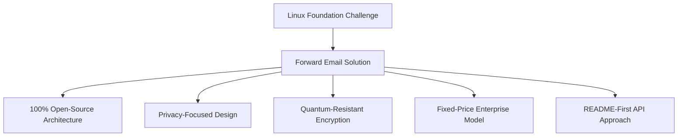
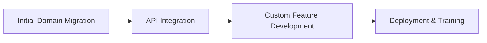

# Caso di Studio: Come la Linux Foundation Ottimizza la Gestione delle Email su Oltre 250 Domini con Forward Email {#case-study-how-the-linux-foundation-optimizes-email-management-across-250-domains-with-forward-email}


## Indice {#table-of-contents}

* [Introduzione](#introduction)
* [La Sfida](#the-challenge)
* [La Soluzione](#the-solution)
  * [Architettura 100% Open-Source](#100-open-source-architecture)
  * [Design Focalizzato sulla Privacy](#privacy-focused-design)
  * [Sicurezza di Livello Enterprise](#enterprise-grade-security)
  * [Modello Enterprise a Prezzo Fisso](#fixed-price-enterprise-model)
  * [API Amichevole per gli Sviluppatori](#developer-friendly-api)
* [Processo di Implementazione](#implementation-process)
* [Risultati e Benefici](#results-and-benefits)
  * [Miglioramenti di Efficienza](#efficiency-improvements)
  * [Gestione dei Costi](#cost-management)
  * [Sicurezza Potenziata](#enhanced-security)
  * [Esperienza Utente Migliorata](#improved-user-experience)
* [Conclusione](#conclusion)
* [Riferimenti](#references)


## Introduzione {#introduction}

La [Linux Foundation](https://en.wikipedia.org/wiki/Linux_Foundation) gestisce oltre 900 progetti open-source su più di 250 domini, inclusi [linux.com](https://www.linux.com/) e [jQuery.com](https://jquery.com/). Questo caso di studio esplora come hanno collaborato con [Forward Email](https://forwardemail.net) per semplificare la gestione delle email mantenendo l’allineamento con i principi open-source.


## La Sfida {#the-challenge}

La Linux Foundation ha affrontato diverse sfide nella gestione delle email:

* **Scala**: Gestire le email su oltre 250 domini con requisiti differenti
* **Onere Amministrativo**: Configurare record DNS, mantenere regole di inoltro e rispondere alle richieste di supporto
* **Sicurezza**: Proteggersi dalle minacce via email mantenendo la privacy
* **Costo**: Le soluzioni tradizionali per utente erano proibitive su questa scala
* **Allineamento Open-Source**: Necessità di soluzioni coerenti con il loro impegno verso i valori open-source

Simile alle sfide affrontate da [Canonical/Ubuntu](https://forwardemail.net/blog/docs/canonical-ubuntu-email-enterprise-case-study) con i loro molteplici domini di distribuzione, la Linux Foundation necessitava di una soluzione capace di gestire progetti diversi mantenendo un approccio di gestione unificato.


## La Soluzione {#the-solution}

Forward Email ha fornito una soluzione completa con caratteristiche chiave:


```mermaid
graph TD
    A[Linux Foundation Challenge] --> B[Forward Email Solution]
    B --> C[100% Open-Source Architecture]
    B --> D[Privacy-Focused Design]
    B --> E[Quantum-Resistant Encryption]
    B --> F[Fixed-Price Enterprise Model]
    B --> G[README-First API Approach]
```

### Architettura 100% Open-Source {#100-open-source-architecture}

Essendo l’unico servizio email con una piattaforma completamente open-source (sia frontend che backend), Forward Email si è allineato perfettamente con l’impegno della Linux Foundation verso i principi open-source. Simile alla nostra implementazione con [Canonical/Ubuntu](https://forwardemail.net/blog/docs/canonical-ubuntu-email-enterprise-case-study), questa trasparenza ha permesso al loro team tecnico di verificare le implementazioni di sicurezza e persino contribuire con miglioramenti.

### Design Focalizzato sulla Privacy {#privacy-focused-design}

Le rigorose [politiche sulla privacy](https://forwardemail.net/privacy) di Forward Email hanno fornito la sicurezza richiesta dalla Linux Foundation. La nostra [implementazione tecnica per la protezione della privacy delle email](https://forwardemail.net/blog/docs/email-privacy-protection-technical-implementation) garantisce che tutte le comunicazioni rimangano sicure per design, senza alcun logging o scansione del contenuto delle email.

Come dettagliato nella nostra documentazione tecnica di implementazione:

> "Abbiamo costruito l’intero sistema attorno al principio che le tue email appartengono a te e solo a te. A differenza di altri provider che scansionano il contenuto delle email per pubblicità o addestramento AI, manteniamo una rigorosa politica di no-logging e no-scanning che preserva la riservatezza di tutte le comunicazioni."
### Sicurezza di livello enterprise {#enterprise-grade-security}

L'implementazione della [crittografia resistente al quantum](https://forwardemail.net/blog/docs/best-quantum-safe-encrypted-email-service) utilizzando ChaCha20-Poly1305 ha fornito una sicurezza all'avanguardia, con ogni casella di posta come file crittografato separato. Questo approccio garantisce che, anche se i computer quantistici diventassero in grado di violare gli standard di crittografia attuali, le comunicazioni della Linux Foundation rimarranno sicure.

### Modello enterprise a prezzo fisso {#fixed-price-enterprise-model}

Il [prezzo enterprise](https://forwardemail.net/pricing) di Forward Email prevedeva un costo mensile fisso indipendentemente dai domini o dagli utenti. Questo approccio ha portato a significativi risparmi per altre grandi organizzazioni, come dimostrato nel nostro [case study sull'inoltro email per ex studenti universitari](https://forwardemail.net/blog/docs/alumni-email-forwarding-university-case-study), dove le istituzioni hanno risparmiato fino al 99% rispetto alle soluzioni email tradizionali a pagamento per utente.

### API amichevole per sviluppatori {#developer-friendly-api}

Seguendo un [approccio README-first](https://tom.preston-werner.com/2010/08/23/readme-driven-development) e ispirandosi al [design RESTful API di Stripe](https://amberonrails.com/building-stripes-api), l'[API](https://forwardemail.net/api) di Forward Email ha permesso un'integrazione profonda con il Project Control Center della Linux Foundation. Questa integrazione è stata cruciale per automatizzare la gestione delle email nel loro portfolio di progetti diversificato.


## Processo di implementazione {#implementation-process}

L'implementazione ha seguito un approccio strutturato:


```mermaid
flowchart LR
    A[Initial Domain Migration] --> B[API Integration]
    B --> C[Custom Feature Development]
    C --> D[Deployment & Training]
```

1. **Migrazione iniziale del dominio**: Configurazione dei record DNS, impostazione di SPF/DKIM/DMARC, migrazione delle regole esistenti

   ```sh
   # Esempio di configurazione DNS per un dominio della Linux Foundation
   domain.org.    600    IN    MX    10 mx1.forwardemail.net.
   domain.org.    600    IN    MX    10 mx2.forwardemail.net.
   domain.org.    600    IN    TXT   "v=spf1 include:spf.forwardemail.net -all"
   ```

2. **Integrazione API**: Connessione con il Project Control Center per la gestione self-service

3. **Sviluppo di funzionalità personalizzate**: Gestione multi-dominio, reportistica, politiche di sicurezza

   Abbiamo collaborato strettamente con la Linux Foundation per sviluppare funzionalità (che sono anche 100% open source così che tutti possano beneficiarne) specifiche per il loro ambiente multi-progetto, similmente a come abbiamo creato soluzioni personalizzate per i [sistemi email per ex studenti universitari](https://forwardemail.net/blog/docs/alumni-email-forwarding-university-case-study).


## Risultati e benefici {#results-and-benefits}

L'implementazione ha portato benefici significativi:

### Miglioramenti di efficienza {#efficiency-improvements}

* Riduzione del carico amministrativo
* Onboarding dei progetti più rapido (da giorni a minuti)
* Gestione semplificata di tutti i 250+ domini da un'unica interfaccia

### Gestione dei costi {#cost-management}

* Prezzo fisso indipendentemente dalla crescita di domini o utenti
* Eliminazione delle tariffe di licenza per utente
* Simile al nostro [case study universitario](https://forwardemail.net/blog/docs/alumni-email-forwarding-university-case-study), la Linux Foundation ha ottenuto risparmi sostanziali rispetto alle soluzioni tradizionali

### Sicurezza migliorata {#enhanced-security}

* Crittografia resistente al quantum su tutti i domini
* Autenticazione email completa per prevenire spoofing e phishing
* Test di sicurezza e pratiche tramite le [funzionalità di sicurezza](https://forwardemail.net/security)
* Protezione della privacy attraverso la nostra [implementazione tecnica](https://forwardemail.net/blog/docs/email-privacy-protection-technical-implementation)

### Esperienza utente migliorata {#improved-user-experience}

* Gestione self-service delle email per gli amministratori di progetto
* Esperienza coerente su tutti i domini della Linux Foundation
* Consegna affidabile delle email con autenticazione robusta


## Conclusione {#conclusion}

La partnership della Linux Foundation con Forward Email dimostra come le organizzazioni possano affrontare sfide complesse nella gestione delle email mantenendo l'allineamento con i propri valori fondamentali. Scegliendo una soluzione che dà priorità ai principi open source, alla privacy e alla sicurezza, la Linux Foundation ha trasformato la gestione delle email da un onere amministrativo a un vantaggio strategico.
Come visto nel nostro lavoro sia con [Canonical/Ubuntu](https://forwardemail.net/blog/docs/canonical-ubuntu-email-enterprise-case-study) che con [grandi università](https://forwardemail.net/blog/docs/alumni-email-forwarding-university-case-study), le organizzazioni con portafogli di domini complessi possono ottenere miglioramenti significativi in efficienza, sicurezza e gestione dei costi grazie alla soluzione enterprise di Forward Email.

Per maggiori informazioni su come Forward Email può aiutare la tua organizzazione a gestire le email su più domini, visita [forwardemail.net](https://forwardemail.net) o esplora la nostra dettagliata [documentazione](https://forwardemail.net/email-api) e le [guide](https://forwardemail.net/guides).


## Riferimenti {#references}

* Linux Foundation. (2025). "Browse Projects." Recuperato da <https://www.linuxfoundation.org/projects>
* Wikipedia. (2025). "Linux Foundation." Recuperato da <https://en.wikipedia.org/wiki/Linux_Foundation>
