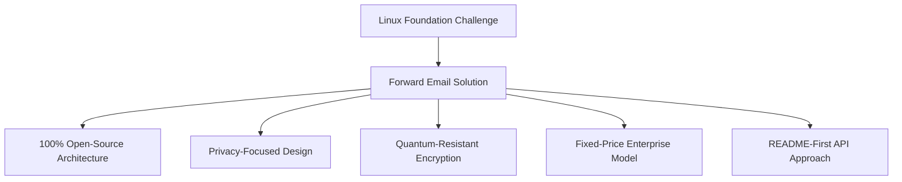
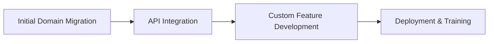

# ケーススタディ: Linux Foundation がメール転送機能を使用して 250 以上のドメインにわたるメール管理を最適化する方法 {#case-study-how-the-linux-foundation-optimizes-email-management-across-250-domains-with-forward-email}


## 目次 {#table-of-contents}

* [導入](#introduction)
* [課題](#the-challenge)
* [解決策](#the-solution)
  * [100%オープンソースアーキテクチャ](#100-open-source-architecture)
  * [プライバシー重視の設計](#privacy-focused-design)
  * [エンタープライズグレードのセキュリティ](#enterprise-grade-security)
  * [固定価格エンタープライズモデル](#fixed-price-enterprise-model)
  * [開発者向けAPI](#developer-friendly-api)
* [実装プロセス](#implementation-process)
* [結果と利点](#results-and-benefits)
  * [効率性の向上](#efficiency-improvements)
  * [コスト管理](#cost-management)
  * [強化されたセキュリティ](#enhanced-security)
  * [ユーザーエクスペリエンスの向上](#improved-user-experience)
* [結論](#conclusion)
* [参考文献](#references)

## はじめに {#introduction}

[Linux財団](https://en.wikipedia.org/wiki/Linux_Foundation)は、[linux.com](https://www.linux.com/)と[jQuery.com](https://jquery.com/)を含む、250以上のドメインにわたる900以上のオープンソースプロジェクトを管理しています。このケーススタディでは、[メールを転送する](https://forwardemail.net)と提携し、オープンソースの原則を維持しながらメール管理を効率化した方法を紹介します。

## チャレンジ {#the-challenge}

Linux Foundation は、電子メール管理に関していくつかの課題に直面していました。

* **規模**: 要件が異なる250以上のドメインにわたるメール管理
* **管理負担**: DNSレコードの設定、転送ルールの維持、サポートリクエストへの対応
* **セキュリティ**: プライバシーを維持しながら、メールベースの脅威から保護
* **コスト**: 従来のユーザー単位のソリューションは、その規模では法外なコストがかかりすぎた
* **オープンソースへの適合**: オープンソースの価値へのコミットメントに合致するソリューションの必要性

[カノニカル/Ubuntu](https://forwardemail.net/blog/docs/canonical-ubuntu-email-enterprise-case-study) が複数のディストリビューションドメインで直面した課題と同様に、Linux Foundation は、統一された管理アプローチを維持しながら多様なプロジェクトを処理できるソリューションを必要としていました。

## 解決策 {#the-solution}

Forward Email は、主な機能を備えた包括的なソリューションを提供しました。



### 100%オープンソースアーキテクチャ {#100-open-source-architecture}

Forward Emailは、フロントエンドとバックエンドの両方で完全にオープンソースのプラットフォームを採用した唯一のメールサービスであり、Linux Foundationのオープンソース原則へのコミットメントに完全に合致しています。[カノニカル/Ubuntu](https://forwardemail.net/blog/docs/canonical-ubuntu-email-enterprise-case-study)の実装と同様に、この透明性により、Forward Emailの技術チームはセキュリティ実装を検証し、改善に貢献することができました。

### プライバシー重視の設計 {#privacy-focused-design}

Forward Emailの厳格な[プライバシーポリシー](https://forwardemail.net/privacy)は、Linux Foundationが要求するセキュリティを実現しました。当社の[電子メールのプライバシー保護の技術的実装](https://forwardemail.net/blog/docs/email-privacy-protection-technical-implementation)は、メール内容のログ記録やスキャンを行わず、設計上すべての通信が安全に保たれることを保証します。

弊社の技術実装ドキュメントに詳細が記載されています:

> 「私たちは、お客様のメールはお客様だけのものであるという原則に基づいてシステム全体を構築しました。広告やAIトレーニングのためにメールの内容をスキャンする他のプロバイダーとは異なり、私たちはすべての通信の機密性を守るため、ログ記録やスキャンを行わない厳格なポリシーを維持しています。」

### エンタープライズグレードのセキュリティ {#enterprise-grade-security}

ChaCha20-Poly1305を用いた[量子耐性暗号](https://forwardemail.net/blog/docs/best-quantum-safe-encrypted-email-service)の実装は、各メールボックスが個別の暗号化ファイルとなることで最先端のセキュリティを実現しました。このアプローチにより、量子コンピュータが現在の暗号化標準を破れるようになったとしても、Linux Foundationの通信は安全に保たれます。

### 固定価格エンタープライズモデル {#fixed-price-enterprise-model}

Forward Emailの[エンタープライズ価格](https://forwardemail.net/pricing)は、ドメインやユーザー数に関係なく、月額固定料金でご利用いただけます。このアプローチは、他の大規模組織においても大幅なコスト削減を実現しており、[大学卒業生向けメール事例](https://forwardemail.net/blog/docs/alumni-email-forwarding-university-case-study)の事例では、従来のユーザー単位のメールソリューションと比較して最大99%のコスト削減を実現しています。

### 開発者向けAPI {#developer-friendly-api}

[READMEファーストアプローチ](https://tom.preston-werner.com/2010/08/23/readme-driven-development)に続き、[StripeのRESTful API設計](https://amberonrails.com/building-stripes-api)に着想を得たForward Emailの[API](https://forwardemail.net/api)は、Linux FoundationのProject Control Centerとの緊密な統合を実現しました。この統合は、多様なプロジェクトポートフォリオ全体にわたるメール管理の自動化に不可欠でした。

## 実装プロセス {#implementation-process}

実装は構造化されたアプローチに従って行われました。



1. **初期ドメイン移行**: DNSレコードの構成、SPF/DKIM/DMARCの設定、既存のルールの移行

   ```sh
   # Example DNS configuration for a Linux Foundation domain
   domain.org.    600    IN    MX    10 mx1.forwardemail.net.
   domain.org.    600    IN    MX    10 mx2.forwardemail.net.
   domain.org.    600    IN    TXT   "v=spf1 include:spf.forwardemail.net -all"
   ```

2. **API統合**: セルフサービス管理のためにプロジェクト管理センターに接続

3. **カスタム機能の開発**: マルチドメイン管理、レポート、セキュリティポリシー

私たちは Linux Foundation と緊密に協力し、[大学の卒業生向けメールシステム](https://forwardemail.net/blog/docs/alumni-email-forwarding-university-case-study) 用のカスタム ソリューションを作成したのと同様に、特に Linux Foundation のマルチプロジェクト環境向けの機能 (これも 100% オープンソースなので誰もが恩恵を受けることができます) を開発しました。

## 結果とメリット {#results-and-benefits}

この実装により、次のような大きなメリットがもたらされました。

### 効率性の向上 {#efficiency-improvements}

* 管理オーバーヘッドの削減
* プロジェクトのオンボーディングの迅速化（数日から数分へ）
* 250以上のドメインを単一のインターフェースから効率的に管理

### コスト管理 {#cost-management}

* ドメイン数やユーザー数の増加に関係なく固定価格
* ユーザーごとのライセンス料が不要
* [大学のケーススタディ](https://forwardemail.net/blog/docs/alumni-email-forwarding-university-case-study)と同様に、Linux Foundationは従来のソリューションと比較して大幅なコスト削減を実現しました

### 強化されたセキュリティ {#enhanced-security}

* 全ドメインで量子耐性暗号化を採用
* なりすましやフィッシングを防ぐ包括的なメール認証
* [セキュリティ機能](https://forwardemail.net/security)によるセキュリティテストと実践
* [技術的な実装](https://forwardemail.net/blog/docs/email-privacy-protection-technical-implementation)によるプライバシー保護

### ユーザーエクスペリエンスの向上 {#improved-user-experience}

* プロジェクト管理者向けのセルフサービス型メール管理
* すべての Linux Foundation ドメインで一貫したエクスペリエンス
* 堅牢な認証による信頼性の高いメール配信

## 結論 {#conclusion}

Linux FoundationとForward Emailのパートナーシップは、組織がコアバリューを維持しながら複雑なメール管理の課題に対処できることを示しています。オープンソースの原則、プライバシー、セキュリティを優先するソリューションを選択することで、Linux Foundationはメール管理を管理上の負担から戦略的優位性へと変革しました。

[カノニカル/Ubuntu](https://forwardemail.net/blog/docs/canonical-ubuntu-email-enterprise-case-study) と [主要大学](https://forwardemail.net/blog/docs/alumni-email-forwarding-university-case-study) の両方での作業でわかるように、複雑なドメイン ポートフォリオを持つ組織は、Forward Email のエンタープライズ ソリューションを通じて、効率、セキュリティ、コスト管理を大幅に改善できます。

Forward Email が組織で複数のドメインにわたる電子メールの管理にどのように役立つかの詳細については、[forwardemail.net](https://forwardemail.net) にアクセスするか、[ドキュメント](https://forwardemail.net/email-api) および [ガイド](https://forwardemail.net/guides) の詳細をご覧ください。

## 参照 {#references}

* Linux Foundation. (2025). 「プロジェクトを閲覧する」 <https://www.linuxfoundation.org/projects> から取得
* Wikipedia. (2025). 「Linux Foundation」 <https://en.wikipedia.org/wiki/Linux_Foundation> から取得