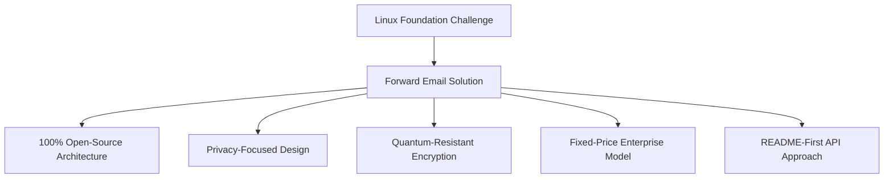
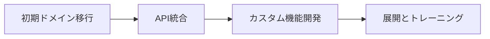

# ケーススタディ：Linux FoundationがForward Emailで250以上のドメインにわたるメール管理を最適化する方法 {#case-study-how-the-linux-foundation-optimizes-email-management-across-250-domains-with-forward-email}


## 目次 {#table-of-contents}

* [はじめに](#introduction)
* [課題](#the-challenge)
* [ソリューション](#the-solution)
  * [100%オープンソースアーキテクチャ](#100-open-source-architecture)
  * [プライバシー重視の設計](#privacy-focused-design)
  * [エンタープライズグレードのセキュリティ](#enterprise-grade-security)
  * [固定価格のエンタープライズモデル](#fixed-price-enterprise-model)
  * [開発者に優しいAPI](#developer-friendly-api)
* [導入プロセス](#implementation-process)
* [結果とメリット](#results-and-benefits)
  * [効率の向上](#efficiency-improvements)
  * [コスト管理](#cost-management)
  * [強化されたセキュリティ](#enhanced-security)
  * [ユーザー体験の改善](#improved-user-experience)
* [結論](#conclusion)
* [参考文献](#references)


## はじめに {#introduction}

[Linux Foundation](https://en.wikipedia.org/wiki/Linux_Foundation)は、[linux.com](https://www.linux.com/)や[jQuery.com](https://jquery.com/)を含む250以上のドメインにわたり900以上のオープンソースプロジェクトを管理しています。本ケーススタディでは、彼らがどのように[Forward Email](https://forwardemail.net)と提携し、オープンソースの原則を維持しながらメール管理を効率化したかを探ります。


## 課題 {#the-challenge}

Linux Foundationは以下のようなメール管理の課題に直面していました：

* **規模**：異なる要件を持つ250以上のドメインにわたるメール管理
* **管理負担**：DNSレコードの設定、転送ルールの維持、サポートリクエストへの対応
* **セキュリティ**：プライバシーを維持しつつメールベースの脅威から保護
* **コスト**：従来のユーザー単位のソリューションは規模に対して非常に高額
* **オープンソースとの整合性**：オープンソースの価値観に合致するソリューションの必要性

[Canonical/Ubuntu](https://forwardemail.net/blog/docs/canonical-ubuntu-email-enterprise-case-study)が複数のディストリビューションドメインで直面した課題と同様に、Linux Foundationは多様なプロジェクトを扱いながら統一された管理アプローチを維持できるソリューションを必要としていました。


## ソリューション {#the-solution}

Forward Emailは以下の主要な機能を備えた包括的なソリューションを提供しました：


```mermaid
graph TD
    A[Linux Foundation Challenge] --> B[Forward Email Solution]
    B --> C[100% Open-Source Architecture]
    B --> D[Privacy-Focused Design]
    B --> E[Quantum-Resistant Encryption]
    B --> F[Fixed-Price Enterprise Model]
    B --> G[README-First API Approach]
```

### 100%オープンソースアーキテクチャ {#100-open-source-architecture}

フロントエンドとバックエンドの両方が完全にオープンソースのプラットフォームを持つ唯一のメールサービスとして、Forward EmailはLinux Foundationのオープンソース原則へのコミットメントと完全に一致しました。[Canonical/Ubuntu](https://forwardemail.net/blog/docs/canonical-ubuntu-email-enterprise-case-study)での導入と同様に、この透明性により技術チームはセキュリティ実装を検証し、改善に貢献することも可能でした。

### プライバシー重視の設計 {#privacy-focused-design}

Forward Emailの厳格な[プライバシーポリシー](https://forwardemail.net/privacy)は、Linux Foundationが求めるセキュリティを提供しました。当社の[email privacy protection technical implementation](https://forwardemail.net/blog/docs/email-privacy-protection-technical-implementation)は、すべての通信が設計上安全に保たれ、メール内容のログ記録やスキャンを一切行わないことを保証します。

技術実装ドキュメントに詳述されているように：

> 「私たちは、あなたのメールはあなた自身のものであるという原則を中心にシステム全体を構築しました。広告やAIトレーニングのためにメール内容をスキャンする他のプロバイダーとは異なり、すべての通信の機密性を守るために厳格なログ記録なし、スキャンなしのポリシーを維持しています。」
### エンタープライズグレードのセキュリティ {#enterprise-grade-security}

ChaCha20-Poly1305を使用した[量子耐性暗号化](https://forwardemail.net/blog/docs/best-quantum-safe-encrypted-email-service)の実装により、各メールボックスが個別の暗号化ファイルとして扱われ、最先端のセキュリティを提供しました。このアプローチにより、量子コンピュータが現在の暗号基準を破る能力を持つようになっても、Linux Foundationの通信は安全に保たれます。

### 固定価格のエンタープライズモデル {#fixed-price-enterprise-model}

Forward Emailの[エンタープライズ価格設定](https://forwardemail.net/pricing)は、ドメイン数やユーザー数に関係なく固定の月額料金を提供します。このアプローチは、他の大規模組織においても大幅なコスト削減を実現しており、[大学の同窓生メールケーススタディ](https://forwardemail.net/blog/docs/alumni-email-forwarding-university-case-study)では、従来のユーザー単位のメールソリューションと比較して最大99%の節約を達成しました。

### 開発者に優しいAPI {#developer-friendly-api}

[READMEファーストアプローチ](https://tom.preston-werner.com/2010/08/23/readme-driven-development)に従い、[StripeのRESTful API設計](https://amberonrails.com/building-stripes-api)に触発されたForward Emailの[API](https://forwardemail.net/api)は、Linux Foundationのプロジェクトコントロールセンターとの深い統合を可能にしました。この統合は、多様なプロジェクトポートフォリオにわたるメール管理の自動化に不可欠でした。


## 実装プロセス {#implementation-process}

実装は構造化されたアプローチに従いました：


```mermaid
flowchart LR
    A[初期ドメイン移行] --> B[API統合]
    B --> C[カスタム機能開発]
    C --> D[展開とトレーニング]
```

1. **初期ドメイン移行**：DNSレコードの設定、SPF/DKIM/DMARCの設定、既存ルールの移行

   ```sh
   # Linux FoundationドメインのDNS設定例
   domain.org.    600    IN    MX    10 mx1.forwardemail.net.
   domain.org.    600    IN    MX    10 mx2.forwardemail.net.
   domain.org.    600    IN    TXT   "v=spf1 include:spf.forwardemail.net -all"
   ```

2. **API統合**：プロジェクトコントロールセンターとの接続によるセルフサービス管理

3. **カスタム機能開発**：マルチドメイン管理、レポーティング、セキュリティポリシー

   Linux Foundationと密接に連携し、彼らのマルチプロジェクト環境向けに特化した機能を開発しました（これらはすべて100%オープンソースで、誰でも利用可能です）。これは、[大学の同窓生メールシステム](https://forwardemail.net/blog/docs/alumni-email-forwarding-university-case-study)向けにカスタムソリューションを作成した方法に類似しています。


## 結果と利点 {#results-and-benefits}

実装により以下のような大きな利点がもたらされました：

### 効率の向上 {#efficiency-improvements}

* 管理負担の軽減
* プロジェクトのオンボーディング時間の短縮（数日から数分へ）
* 250以上のドメインを単一インターフェースで効率的に管理

### コスト管理 {#cost-management}

* ドメイン数やユーザー数の増加に関わらず固定価格
* ユーザー単位のライセンス料金の廃止
* [大学ケーススタディ](https://forwardemail.net/blog/docs/alumni-email-forwarding-university-case-study)と同様に、Linux Foundationは従来のソリューションと比較して大幅なコスト削減を実現

### セキュリティの強化 {#enhanced-security}

* すべてのドメインにわたる量子耐性暗号化
* なりすましやフィッシングを防止する包括的なメール認証
* [セキュリティ機能](https://forwardemail.net/security)によるセキュリティテストと実践
* [技術的実装](https://forwardemail.net/blog/docs/email-privacy-protection-technical-implementation)によるプライバシー保護

### ユーザー体験の向上 {#improved-user-experience}

* プロジェクト管理者向けのセルフサービスメール管理
* すべてのLinux Foundationドメインで一貫した体験
* 強力な認証による信頼性の高いメール配信


## 結論 {#conclusion}

Linux FoundationとForward Emailのパートナーシップは、組織が複雑なメール管理の課題に対処しつつ、コアバリューと整合性を保つ方法を示しています。オープンソースの原則、プライバシー、セキュリティを優先するソリューションを選択することで、Linux Foundationはメール管理を管理上の負担から戦略的な強みへと変革しました。
私たちが[Canonical/Ubuntu](https://forwardemail.net/blog/docs/canonical-ubuntu-email-enterprise-case-study)や[主要な大学](https://forwardemail.net/blog/docs/alumni-email-forwarding-university-case-study)と共に行った事例に見られるように、複雑なドメインポートフォリオを持つ組織は、Forward Emailのエンタープライズソリューションを通じて、効率性、セキュリティ、およびコスト管理において大幅な改善を達成できます。

Forward Emailが複数ドメインにわたるメール管理で組織をどのように支援できるかについての詳細は、[forwardemail.net](https://forwardemail.net)をご覧いただくか、詳細な[ドキュメント](https://forwardemail.net/email-api)および[ガイド](https://forwardemail.net/guides)をご参照ください。


## 参考文献 {#references}

* Linux Foundation. (2025). 「Browse Projects」. 取得元 <https://www.linuxfoundation.org/projects>
* Wikipedia. (2025). 「Linux Foundation」. 取得元 <https://en.wikipedia.org/wiki/Linux_Foundation>
