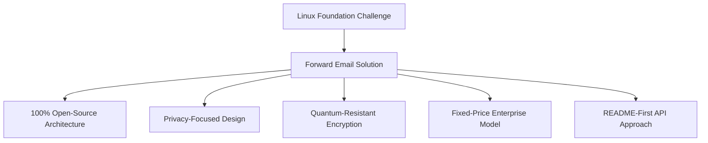
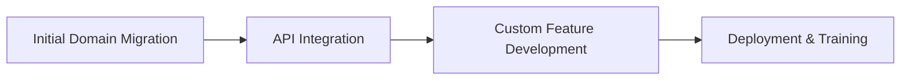

# 사례 연구: Linux Foundation이 Forward Email을 사용하여 250개 이상의 도메인에서 이메일 관리를 최적화하는 방법 {#case-study-how-the-linux-foundation-optimizes-email-management-across-250-domains-with-forward-email}


## 목차 {#table-of-contents}

* [소개](#introduction)
* [도전](#the-challenge)
* [해결책](#the-solution)
  * [100% 오픈소스 아키텍처](#100-open-source-architecture)
  * [개인 정보 보호 중심 디자인](#privacy-focused-design)
  * [엔터프라이즈급 보안](#enterprise-grade-security)
  * [고정 가격 기업 모델](#fixed-price-enterprise-model)
  * [개발자 친화적인 API](#developer-friendly-api)
* [구현 프로세스](#implementation-process)
* [결과 및 이점](#results-and-benefits)
  * [효율성 개선](#efficiency-improvements)
  * [비용 관리](#cost-management)
  * [강화된 보안](#enhanced-security)
  * [향상된 사용자 경험](#improved-user-experience)
* [결론](#conclusion)
* [참고문헌](#references)

## 소개 {#introduction}

[리눅스 재단](https://en.wikipedia.org/wiki/Linux_Foundation)은 [linux.com](https://www.linux.com/)과 [jQuery.com](https://jquery.com/)를 포함하여 250개 이상의 도메인에 걸쳐 900개 이상의 오픈소스 프로젝트를 관리합니다. 이 사례 연구에서는 [이메일 전달](https://forwardemail.net)과 협력하여 오픈소스 원칙을 준수하면서 이메일 관리를 간소화하는 방법을 살펴봅니다.

## 도전 {#the-challenge}

Linux Foundation은 이메일 관리와 관련하여 여러 가지 과제에 직면했습니다.

* **규모**: 다양한 요구 사항을 가진 250개 이상의 도메인에서 이메일 관리
* **관리 부담**: DNS 레코드 구성, 전달 규칙 유지 관리, 지원 요청 대응
* **보안**: 개인 정보 보호를 유지하면서 이메일 기반 위협으로부터 보호
* **비용**: 기존 사용자별 솔루션은 규모에 비해 비용이 매우 높았습니다.
* **오픈 소스 연계**: 오픈 소스 가치에 대한 헌신에 부합하는 솔루션 필요

[캐노니컬/우분투](https://forwardemail.net/blog/docs/canonical-ubuntu-email-enterprise-case-study)이 여러 배포 도메인에서 겪었던 문제와 유사하게, Linux Foundation은 통합된 관리 방식을 유지하면서 다양한 프로젝트를 처리할 수 있는 솔루션이 필요했습니다.

## 솔루션 {#the-solution}

Forward Email은 다음과 같은 주요 기능을 갖춘 포괄적인 솔루션을 제공했습니다.



### 100% 오픈소스 아키텍처 {#100-open-source-architecture}

완전한 오픈 소스 플랫폼(프런트엔드와 백엔드 모두)을 갖춘 유일한 이메일 서비스인 Forward Email은 Linux Foundation의 오픈 소스 원칙에 완벽하게 부합했습니다. [캐노니컬/우분투](https://forwardemail.net/blog/docs/canonical-ubuntu-email-enterprise-case-study) 구현과 마찬가지로, 이러한 투명성 덕분에 기술팀은 보안 구현을 검증하고 개선에 기여할 수 있었습니다.

### 개인정보 보호 중심 디자인 {#privacy-focused-design}

Forward Email의 엄격한 [개인정보 보호정책](https://forwardemail.net/privacy)은 Linux Foundation이 요구하는 보안을 제공했습니다. [이메일 개인정보 보호 기술 구현](https://forwardemail.net/blog/docs/email-privacy-protection-technical-implementation)은 이메일 내용에 대한 로깅이나 스캐닝을 하지 않고, 모든 통신이 안전하게 유지되도록 설계되어 있습니다.

기술 구현 문서에 자세히 설명된 대로:

> "저희는 이메일이 오직 고객님의 소유라는 원칙을 바탕으로 전체 시스템을 구축했습니다. 광고나 AI 교육을 위해 이메일 내용을 스캔하는 다른 업체와 달리, 저희는 모든 커뮤니케이션의 기밀성을 보장하는 엄격한 무기록 및 무스캔 정책을 고수하고 있습니다."

### 엔터프라이즈급 보안 {#enterprise-grade-security}

ChaCha20-Poly1305를 사용하여 [양자 저항 암호화](https://forwardemail.net/blog/docs/best-quantum-safe-encrypted-email-service)을 구현함으로써 각 메일박스가 별도의 암호화된 파일로 생성되어 최첨단 보안을 제공했습니다. 이러한 접근 방식은 양자 컴퓨터가 현행 암호화 표준을 위반할 수 있게 되더라도 Linux Foundation의 통신은 안전하게 유지될 수 있도록 보장합니다.

### 고정 가격 엔터프라이즈 모델 {#fixed-price-enterprise-model}

Forward Email의 [기업 가격 책정](https://forwardemail.net/pricing)은 도메인이나 사용자에 관계없이 고정된 월별 요금을 제공했습니다. 이러한 접근 방식은 다른 대규모 조직에서도 상당한 비용 절감 효과를 가져왔는데, 예를 들어 저희의 [대학 동문 이메일 사례 연구](https://forwardemail.net/blog/docs/alumni-email-forwarding-university-case-study)에서 볼 수 있듯이 기관들은 기존 사용자당 이메일 솔루션 대비 최대 99%의 비용을 절감했습니다.

### 개발자 친화적 API {#developer-friendly-api}

[README-first 접근 방식](https://tom.preston-werner.com/2010/08/23/readme-driven-development)을 기반으로 [Stripe의 RESTful API 디자인](https://amberonrails.com/building-stripes-api)에서 영감을 받은 Forward Email의 [API](https://forwardemail.net/api)는 Linux Foundation의 프로젝트 제어 센터와의 긴밀한 통합을 가능하게 했습니다. 이 통합은 다양한 프로젝트 포트폴리오에서 이메일 관리를 자동화하는 데 매우 중요했습니다.

## 구현 프로세스 {#implementation-process}

구현은 구조화된 접근 방식을 따랐습니다.



1. **초기 도메인 마이그레이션**: DNS 레코드 구성, SPF/DKIM/DMARC 설정, 기존 규칙 마이그레이션

   ```sh
   # Example DNS configuration for a Linux Foundation domain
   domain.org.    600    IN    MX    10 mx1.forwardemail.net.
   domain.org.    600    IN    MX    10 mx2.forwardemail.net.
   domain.org.    600    IN    TXT   "v=spf1 include:spf.forwardemail.net -all"
   ```

2. **API 통합**: 셀프 서비스 관리를 위한 프로젝트 제어 센터 연결

3. **맞춤형 기능 개발**: 다중 도메인 관리, 보고, 보안 정책

우리는 Linux Foundation과 긴밀히 협력하여 다중 프로젝트 환경에 특화된 기능을 개발했습니다(모든 사람이 혜택을 볼 수 있도록 100% 오픈 소스로 제공). 이는 [대학 동문 이메일 시스템](https://forwardemail.net/blog/docs/alumni-email-forwarding-university-case-study)에 대한 맞춤 솔루션을 만든 방식과 유사합니다.

## 결과 및 이점 {#results-and-benefits}

구현을 통해 다음과 같은 상당한 이점이 있었습니다.

### 효율성 개선 {#efficiency-improvements}

* 관리 오버헤드 감소
* 프로젝트 온보딩 시간 단축(며칠에서 몇 분으로 단축)
* 단일 인터페이스에서 250개 이상의 모든 도메인 관리 간소화

### 비용 관리 {#cost-management}

* 도메인 또는 사용자 수 증가에 관계없이 고정 가격
* 사용자당 라이선스 비용 제거
* [대학 사례 연구](https://forwardemail.net/blog/docs/alumni-email-forwarding-university-case-study)과 유사하게 Linux Foundation은 기존 솔루션 대비 상당한 비용 절감 효과를 달성했습니다.

### 보안 강화 {#enhanced-security}

* 모든 도메인에 걸친 양자 저항 암호화
* 스푸핑 및 피싱을 방지하는 포괄적인 이메일 인증
* [보안 기능](https://forwardemail.net/security)을 통한 보안 테스트 및 실행
* [기술 구현](https://forwardemail.net/blog/docs/email-privacy-protection-technical-implementation)을 통한 개인정보 보호

### 향상된 사용자 경험 {#improved-user-experience}

* 프로젝트 관리자를 위한 셀프서비스 이메일 관리
* 모든 Linux Foundation 도메인에서 일관된 경험 제공
* 강력한 인증을 통한 안정적인 이메일 전송

## 결론 {#conclusion}

Linux Foundation과 Forward Email의 파트너십은 기업이 핵심 가치를 유지하면서 복잡한 이메일 관리 과제를 어떻게 해결할 수 있는지 보여줍니다. Linux Foundation은 오픈 소스 원칙, 개인정보 보호 및 보안을 우선시하는 솔루션을 선택함으로써 이메일 관리를 단순한 관리 부담에서 전략적 이점으로 탈바꿈시켰습니다.

[캐노니컬/우분투](https://forwardemail.net/blog/docs/canonical-ubuntu-email-enterprise-case-study)과 [주요 대학](https://forwardemail.net/blog/docs/alumni-email-forwarding-university-case-study)을 활용한 작업에서 볼 수 있듯이, 복잡한 도메인 포트폴리오를 보유한 조직은 Forward Email의 엔터프라이즈 솔루션을 통해 효율성, 보안 및 비용 관리 측면에서 상당한 개선을 달성할 수 있습니다.

Forward Email이 조직에서 여러 도메인에 걸쳐 이메일을 관리하는 데 어떻게 도움이 될 수 있는지 자세히 알아보려면 [forwardemail.net](https://forwardemail.net)을 방문하거나 자세한 [선적 서류 비치](https://forwardemail.net/email-api) 및 [가이드](https://forwardemail.net/guides)를 살펴보세요.

## 참조 {#references}

* 리눅스 재단. (2025). "프로젝트 탐색." <https://www.linuxfoundation.org/projects>에서 가져옴
* 위키백과. (2025). "리눅스 재단." <https://en.wikipedia.org/wiki/Linux_Foundation>에서 가져옴