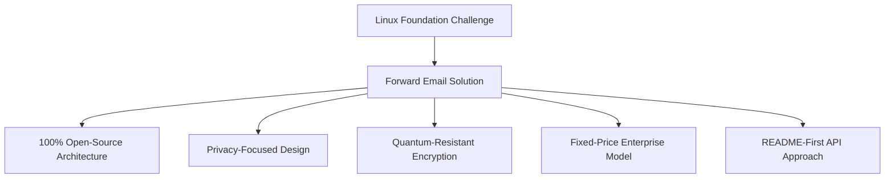

# 사례 연구: Linux 재단이 250개 이상의 도메인에서 Forward Email로 이메일 관리를 최적화하는 방법 {#case-study-how-the-linux-foundation-optimizes-email-management-across-250-domains-with-forward-email}


## 목차 {#table-of-contents}

* [소개](#introduction)
* [과제](#the-challenge)
* [해결책](#the-solution)
  * [100% 오픈소스 아키텍처](#100-open-source-architecture)
  * [개인정보 보호 중심 설계](#privacy-focused-design)
  * [기업급 보안](#enterprise-grade-security)
  * [고정 가격 엔터프라이즈 모델](#fixed-price-enterprise-model)
  * [개발자 친화적 API](#developer-friendly-api)
* [구현 과정](#implementation-process)
* [결과 및 혜택](#results-and-benefits)
  * [효율성 향상](#efficiency-improvements)
  * [비용 관리](#cost-management)
  * [강화된 보안](#enhanced-security)
  * [개선된 사용자 경험](#improved-user-experience)
* [결론](#conclusion)
* [참고 문헌](#references)


## 소개 {#introduction}

[Linux Foundation](https://en.wikipedia.org/wiki/Linux_Foundation)은 [linux.com](https://www.linux.com/)과 [jQuery.com](https://jquery.com/)을 포함하여 250개 이상의 도메인에서 900개 이상의 오픈소스 프로젝트를 관리합니다. 이 사례 연구는 그들이 어떻게 [Forward Email](https://forwardemail.net)과 협력하여 이메일 관리를 간소화하면서 오픈소스 원칙과 일치시켰는지 탐구합니다.


## 과제 {#the-challenge}

Linux 재단은 다음과 같은 이메일 관리 과제에 직면했습니다:

* **규모**: 서로 다른 요구사항을 가진 250개 이상의 도메인에서 이메일 관리
* **관리 부담**: DNS 레코드 구성, 전달 규칙 유지, 지원 요청 대응
* **보안**: 개인정보를 유지하면서 이메일 기반 위협으로부터 보호
* **비용**: 기존의 사용자당 과금 솔루션은 그 규모에서 비용이 너무 높음
* **오픈소스 일치성**: 오픈소스 가치에 부합하는 솔루션 필요

[Canonical/Ubuntu](https://forwardemail.net/blog/docs/canonical-ubuntu-email-enterprise-case-study)가 여러 배포 도메인에서 겪은 과제와 유사하게, Linux 재단은 다양한 프로젝트를 처리하면서도 통합된 관리 방식을 유지할 수 있는 솔루션이 필요했습니다.


## 해결책 {#the-solution}

Forward Email은 다음과 같은 주요 기능을 갖춘 포괄적인 솔루션을 제공했습니다:


```mermaid
graph TD
    A[Linux Foundation Challenge] --> B[Forward Email Solution]
    B --> C[100% Open-Source Architecture]
    B --> D[Privacy-Focused Design]
    B --> E[Quantum-Resistant Encryption]
    B --> F[Fixed-Price Enterprise Model]
    B --> G[README-First API Approach]
```

### 100% 오픈소스 아키텍처 {#100-open-source-architecture}

프론트엔드와 백엔드 모두 완전히 오픈소스 플랫폼을 갖춘 유일한 이메일 서비스로서, Forward Email은 Linux 재단의 오픈소스 원칙에 완벽히 부합했습니다. [Canonical/Ubuntu](https://forwardemail.net/blog/docs/canonical-ubuntu-email-enterprise-case-study)와의 구현과 유사하게, 이러한 투명성 덕분에 기술팀은 보안 구현을 검증하고 개선 사항을 기여할 수 있었습니다.

### 개인정보 보호 중심 설계 {#privacy-focused-design}

Forward Email의 엄격한 [개인정보 보호 정책](https://forwardemail.net/privacy)은 Linux 재단이 요구하는 보안을 제공했습니다. 우리의 [이메일 개인정보 보호 기술 구현](https://forwardemail.net/blog/docs/email-privacy-protection-technical-implementation)은 모든 통신이 설계상 안전하게 유지되도록 하며, 이메일 내용의 로깅이나 스캔을 하지 않습니다.

기술 구현 문서에 자세히 설명된 바와 같이:

> "우리는 이메일이 사용자 본인만의 것이라는 원칙을 중심으로 시스템 전체를 구축했습니다. 광고나 AI 학습을 위해 이메일 내용을 스캔하는 다른 제공업체와 달리, 우리는 모든 통신의 기밀성을 유지하는 엄격한 무로깅, 무스캔 정책을 준수합니다."
### 엔터프라이즈급 보안 {#enterprise-grade-security}

ChaCha20-Poly1305를 사용한 [양자 내성 암호화](https://forwardemail.net/blog/docs/best-quantum-safe-encrypted-email-service) 구현은 최첨단 보안을 제공하며, 각 메일박스는 별도의 암호화된 파일로 관리됩니다. 이 접근 방식은 양자 컴퓨터가 현재 암호화 표준을 깨뜨릴 수 있게 되더라도 Linux 재단의 통신이 안전하게 유지되도록 보장합니다.

### 고정 가격 엔터프라이즈 모델 {#fixed-price-enterprise-model}

Forward Email의 [엔터프라이즈 가격 정책](https://forwardemail.net/pricing)은 도메인 수나 사용자 수에 관계없이 고정 월 비용을 제공합니다. 이 접근 방식은 다른 대규모 조직에서 상당한 비용 절감을 가져왔으며, [대학 동문 이메일 사례 연구](https://forwardemail.net/blog/docs/alumni-email-forwarding-university-case-study)에서 전통적인 사용자별 이메일 솔루션 대비 최대 99% 절감한 사례로 입증되었습니다.

### 개발자 친화적 API {#developer-friendly-api}

[README 우선 접근법](https://tom.preston-werner.com/2010/08/23/readme-driven-development)과 [Stripe의 RESTful API 설계](https://amberonrails.com/building-stripes-api)에서 영감을 받아, Forward Email의 [API](https://forwardemail.net/api)는 Linux 재단의 프로젝트 컨트롤 센터와 깊은 통합을 가능하게 했습니다. 이 통합은 다양한 프로젝트 포트폴리오 전반에 걸친 이메일 관리를 자동화하는 데 매우 중요했습니다.


## 구현 과정 {#implementation-process}

구현은 체계적인 접근 방식을 따랐습니다:


```mermaid
flowchart LR
    A[초기 도메인 마이그레이션] --> B[API 통합]
    B --> C[맞춤 기능 개발]
    C --> D[배포 및 교육]
```

1. **초기 도메인 마이그레이션**: DNS 레코드 구성, SPF/DKIM/DMARC 설정, 기존 규칙 마이그레이션

   ```sh
   # Linux 재단 도메인 예시 DNS 구성
   domain.org.    600    IN    MX    10 mx1.forwardemail.net.
   domain.org.    600    IN    MX    10 mx2.forwardemail.net.
   domain.org.    600    IN    TXT   "v=spf1 include:spf.forwardemail.net -all"
   ```

2. **API 통합**: 프로젝트 컨트롤 센터와 연결하여 셀프 서비스 관리 지원

3. **맞춤 기능 개발**: 다중 도메인 관리, 보고, 보안 정책

   Linux 재단과 긴밀히 협력하여 다중 프로젝트 환경에 특화된 기능을 개발했으며(이 기능들은 모두 100% 오픈 소스로 제공되어 누구나 혜택을 누릴 수 있습니다), 이는 [대학 동문 이메일 시스템](https://forwardemail.net/blog/docs/alumni-email-forwarding-university-case-study)을 위한 맞춤 솔루션 개발과 유사합니다.


## 결과 및 혜택 {#results-and-benefits}

구현은 다음과 같은 중요한 혜택을 제공했습니다:

### 효율성 향상 {#efficiency-improvements}

* 관리 부담 감소
* 프로젝트 온보딩 시간 단축 (수일에서 수분으로)
* 단일 인터페이스에서 250개 이상의 도메인 관리 간소화

### 비용 관리 {#cost-management}

* 도메인 및 사용자 증가와 무관한 고정 가격
* 사용자별 라이선스 비용 제거
* [대학 사례 연구](https://forwardemail.net/blog/docs/alumni-email-forwarding-university-case-study)와 유사하게, Linux 재단은 전통적인 솔루션 대비 상당한 비용 절감을 달성

### 보안 강화 {#enhanced-security}

* 모든 도메인에 걸친 양자 내성 암호화
* 스푸핑 및 피싱 방지를 위한 포괄적 이메일 인증
* [보안 기능](https://forwardemail.net/security)을 통한 보안 테스트 및 관행
* [기술적 구현](https://forwardemail.net/blog/docs/email-privacy-protection-technical-implementation)을 통한 개인정보 보호

### 사용자 경험 개선 {#improved-user-experience}

* 프로젝트 관리자를 위한 셀프 서비스 이메일 관리
* 모든 Linux 재단 도메인에서 일관된 경험 제공
* 강력한 인증으로 신뢰할 수 있는 이메일 전달


## 결론 {#conclusion}

Linux 재단과 Forward Email의 파트너십은 조직이 복잡한 이메일 관리 문제를 해결하면서 핵심 가치와 일치하는 방식을 보여줍니다. 오픈 소스 원칙, 개인정보 보호 및 보안을 우선시하는 솔루션을 선택함으로써, Linux 재단은 이메일 관리를 행정적 부담에서 전략적 이점으로 전환시켰습니다.
우리의 [Canonical/Ubuntu](https://forwardemail.net/blog/docs/canonical-ubuntu-email-enterprise-case-study) 및 [주요 대학들](https://forwardemail.net/blog/docs/alumni-email-forwarding-university-case-study)과의 작업에서 볼 수 있듯이, 복잡한 도메인 포트폴리오를 가진 조직들은 Forward Email의 엔터프라이즈 솔루션을 통해 효율성, 보안 및 비용 관리에서 상당한 개선을 이룰 수 있습니다.

Forward Email이 여러 도메인에 걸친 이메일 관리를 어떻게 도울 수 있는지에 대한 자세한 정보는 [forwardemail.net](https://forwardemail.net)에서 확인하거나, 상세한 [문서](https://forwardemail.net/email-api) 및 [가이드](https://forwardemail.net/guides)를 참고하세요.


## References {#references}

* Linux Foundation. (2025). "Browse Projects." Retrieved from <https://www.linuxfoundation.org/projects>
* Wikipedia. (2025). "Linux Foundation." Retrieved from <https://en.wikipedia.org/wiki/Linux_Foundation>
