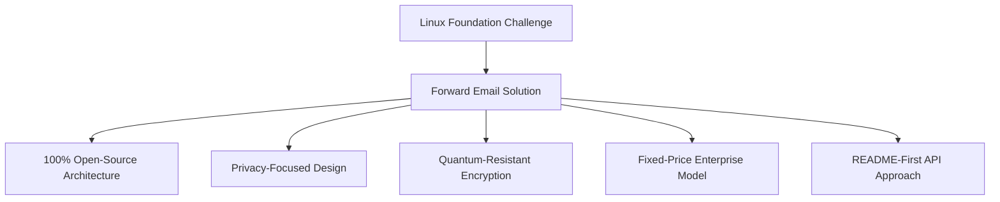
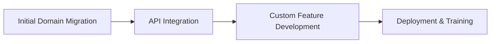

# Case Study: Hoe de Linux Foundation e-mailbeheer optimaliseert in meer dan 250 domeinen met Forward Email {#case-study-how-the-linux-foundation-optimizes-email-management-across-250-domains-with-forward-email}


## Inhoudsopgave {#table-of-contents}

* [Invoering](#introduction)
* [De uitdaging](#the-challenge)
* [De oplossing](#the-solution)
  * [100% open-sourcearchitectuur](#100-open-source-architecture)
  * [Privacygericht ontwerp](#privacy-focused-design)
  * [Beveiliging op ondernemingsniveau](#enterprise-grade-security)
  * [Vaste-prijs bedrijfsmodel](#fixed-price-enterprise-model)
  * [Ontwikkelaarsvriendelijke API](#developer-friendly-api)
* [Implementatieproces](#implementation-process)
* [Resultaten en voordelen](#results-and-benefits)
  * [Efficiëntieverbeteringen](#efficiency-improvements)
  * [Kostenbeheer](#cost-management)
  * [Verbeterde beveiliging](#enhanced-security)
  * [Verbeterde gebruikerservaring](#improved-user-experience)
* [Conclusie](#conclusion)
* [Referenties](#references)

## Inleiding {#introduction}

[Linux Foundation](https://en.wikipedia.org/wiki/Linux_Foundation) beheert meer dan 900 open-sourceprojecten in meer dan 250 domeinen, waaronder [linux.com](https://www.linux.com/) en [jQuery.com](https://jquery.com/). Deze casestudy onderzoekt hoe [E-mail doorsturen](https://forwardemail.net) samenwerkte om e-mailbeheer te stroomlijnen en tegelijkertijd de open-sourceprincipes te volgen.

## De uitdaging {#the-challenge}

De Linux Foundation werd geconfronteerd met verschillende uitdagingen op het gebied van e-mailbeheer:

* **Schaal**: E-mail beheren over meer dan 250 domeinen met verschillende vereisten
* **Administratieve last**: DNS-records configureren, doorstuurregels onderhouden en reageren op ondersteuningsverzoeken
* **Beveiliging**: Bescherming tegen e-mailbedreigingen met behoud van privacy
* **Kosten**: Traditionele oplossingen per gebruiker waren onbetaalbaar duur op hun schaal
* **Open-source-afstemming**: Behoefte aan oplossingen die passen bij hun toewijding aan open-sourcewaarden

Vergelijkbare uitdagingen waar [Canoniek/Ubuntu](https://forwardemail.net/blog/docs/canonical-ubuntu-email-enterprise-case-study) mee te maken kreeg met hun meerdere distributiedomeinen, had de Linux Foundation behoefte aan een oplossing die uiteenlopende projecten aankon en tegelijkertijd een uniforme beheeraanpak hanteerde.

## De oplossing {#the-solution}

Forward Email biedt een uitgebreide oplossing met de volgende belangrijke functies:



### 100% open-sourcearchitectuur {#100-open-source-architecture}

Als enige e-mailservice met een volledig open-sourceplatform (zowel frontend als backend) sloot Forward Email perfect aan bij de open-sourceprincipes van de Linux Foundation. Net als onze implementatie met [Canoniek/Ubuntu](https://forwardemail.net/blog/docs/canonical-ubuntu-email-enterprise-case-study) stelde deze transparantie hun technische team in staat om beveiligingsimplementaties te verifiëren en zelfs verbeteringen aan te brengen.

### Privacygericht ontwerp {#privacy-focused-design}

De strikte [privacybeleid](https://forwardemail.net/privacy) van Forward Email bood de beveiliging die de Linux Foundation nodig had. Onze [technische implementatie van e-mailprivacybescherming](https://forwardemail.net/blog/docs/email-privacy-protection-technical-implementation) zorgt ervoor dat alle communicatie veilig blijft, zonder logging of scanning van e-mailinhoud.

Zoals gedetailleerd in onze technische implementatiedocumentatie:

We hebben ons hele systeem gebouwd rond het principe dat uw e-mails alleen van u zijn. In tegenstelling tot andere aanbieders die e-mailinhoud scannen voor reclame of AI-training, hanteren wij een strikt beleid van 'geen registratie' en 'geen scans', waardoor de vertrouwelijkheid van alle communicatie gewaarborgd blijft.

### Beveiliging op ondernemingsniveau {#enterprise-grade-security}

De implementatie van [kwantumbestendige encryptie](https://forwardemail.net/blog/docs/best-quantum-safe-encrypted-email-service) met ChaCha20-Poly1305 zorgde voor state-of-the-art beveiliging, waarbij elke mailbox een afzonderlijk versleuteld bestand is. Deze aanpak garandeert dat de communicatie van de Linux Foundation veilig blijft, zelfs als quantumcomputers de huidige versleutelingsstandaarden zouden kunnen omzeilen.

### Bedrijfsmodel met vaste prijs {#fixed-price-enterprise-model}

[ondernemingsprijzen](https://forwardemail.net/pricing) van Forward Email bood vaste maandelijkse kosten, ongeacht domein of gebruiker. Deze aanpak heeft andere grote organisaties aanzienlijke kostenbesparingen opgeleverd, zoals blijkt uit onze [casestudy over e-mails van alumni van de universiteit](https://forwardemail.net/blog/docs/alumni-email-forwarding-university-case-study), waar instellingen tot 99% bespaarden in vergelijking met traditionele e-mailoplossingen per gebruiker.

### Ontwikkelaarsvriendelijke API {#developer-friendly-api}

Na een [README-first-benadering](https://tom.preston-werner.com/2010/08/23/readme-driven-development) en geïnspireerd door [Het RESTful API-ontwerp van Stripe](https://amberonrails.com/building-stripes-api), zorgde [API](https://forwardemail.net/api) van Forward Email voor een diepe integratie met het Project Control Center van de Linux Foundation. Deze integratie was cruciaal voor het automatiseren van e-mailbeheer binnen hun diverse projectportfolio.

## Implementatieproces {#implementation-process}

De implementatie volgde een gestructureerde aanpak:



1. **Initiële domeinmigratie**: DNS-records configureren, SPF/DKIM/DMARC instellen, bestaande regels migreren

   ```sh
   # Example DNS configuration for a Linux Foundation domain
   domain.org.    600    IN    MX    10 mx1.forwardemail.net.
   domain.org.    600    IN    MX    10 mx2.forwardemail.net.
   domain.org.    600    IN    TXT   "v=spf1 include:spf.forwardemail.net -all"
   ```

2. **API-integratie**: verbinding maken met Project Control Center voor selfservicebeheer

3. **Ontwikkeling van aangepaste functies**: Beheer van meerdere domeinen, rapportage, beveiligingsbeleid

We hebben nauw samengewerkt met de Linux Foundation om functies te ontwikkelen (die bovendien 100% open source zijn, zodat iedereen er profijt van kan hebben) specifiek voor hun omgeving met meerdere projecten, vergelijkbaar met de manier waarop we aangepaste oplossingen hebben gemaakt voor [e-mailsystemen voor universitaire alumni](https://forwardemail.net/blog/docs/alumni-email-forwarding-university-case-study).

## Resultaten en voordelen {#results-and-benefits}

De implementatie leverde aanzienlijke voordelen op:

### Efficiëntieverbeteringen {#efficiency-improvements}

* Minder administratieve overhead
* Snellere onboarding van projecten (van dagen naar minuten)
* Gestroomlijnd beheer van alle 250+ domeinen vanuit één interface

### Kostenbeheer {#cost-management}

* Vaste prijzen, ongeacht de groei van domeinen of gebruikers
* Geen licentiekosten per gebruiker meer
* Net als bij onze [universitaire casestudy](https://forwardemail.net/blog/docs/alumni-email-forwarding-university-case-study) heeft de Linux Foundation aanzienlijke kostenbesparingen gerealiseerd ten opzichte van traditionele oplossingen

### Verbeterde beveiliging {#enhanced-security}

* Quantumbestendige encryptie voor alle domeinen
* Uitgebreide e-mailauthenticatie ter voorkoming van spoofing en phishing
* Beveiligingstests en -praktijken via [beveiligingsfuncties](https://forwardemail.net/security)
* Privacybescherming via onze [technische implementatie](https://forwardemail.net/blog/docs/email-privacy-protection-technical-implementation)

### Verbeterde gebruikerservaring {#improved-user-experience}

* Selfservice e-mailbeheer voor projectbeheerders
* Consistente ervaring in alle Linux Foundation-domeinen
* Betrouwbare e-mailbezorging met robuuste authenticatie

## Conclusie {#conclusion}

De samenwerking van de Linux Foundation met Forward Email laat zien hoe organisaties complexe uitdagingen op het gebied van e-mailbeheer kunnen aanpakken en tegelijkertijd hun kernwaarden kunnen behouden. Door te kiezen voor een oplossing die prioriteit geeft aan open-sourceprincipes, privacy en beveiliging, heeft de Linux Foundation e-mailbeheer getransformeerd van een administratieve last tot een strategisch voordeel.

Zoals we hebben gezien in ons werk met zowel [Canoniek/Ubuntu](https://forwardemail.net/blog/docs/canonical-ubuntu-email-enterprise-case-study) als [grote universiteiten](https://forwardemail.net/blog/docs/alumni-email-forwarding-university-case-study), kunnen organisaties met complexe domeinportefeuilles aanzienlijke verbeteringen op het gebied van efficiëntie, beveiliging en kostenbeheer realiseren via de zakelijke oplossing van Forward Email.

Voor meer informatie over hoe Forward Email uw organisatie kan helpen bij het beheren van e-mail over meerdere domeinen, gaat u naar [forwardemail.net](https://forwardemail.net) of bekijkt u onze gedetailleerde [documentatie](https://forwardemail.net/email-api) en [gidsen](https://forwardemail.net/guides).

## Verwijzingen naar {#references}

* Linux Foundation. (2025). "Projecten bekijken." Geraadpleegd van <https://www.linuxfoundation.org/projects>
* Wikipedia. (2025). "Linux Foundation." Geraadpleegd van <https://en.wikipedia.org/wiki/Linux_Foundation>